# 清华大学讲师团，量化交易实战，迭代式的量化策略研发 - P10：第十讲_实盘中的细节问题讨论 - 反方向的Bug - BV1Bs6MYFERQ

今天呢已经是我们这一期这个进阶课程的，最后一次课了啊。

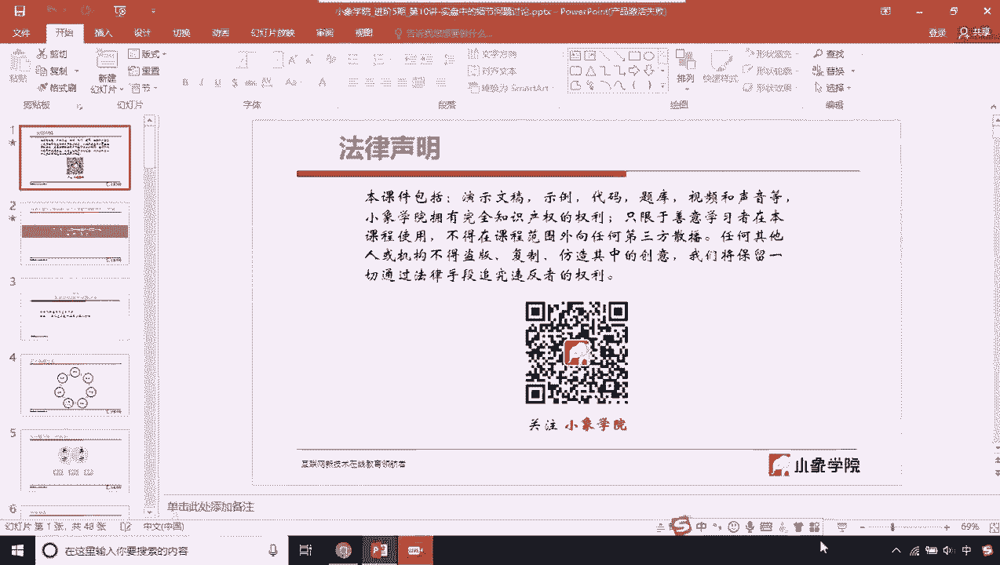

第十次课额是由我来给大家这个来讲啊，这个呃汪老师啊，汪老师又回来了，那么我们整个这个进阶课程啊，主要的一个嗯培训目标，就是希望大家能够熟悉量化策略，开发的一个完整的过程，那么对一些典型策略的这个逻辑啊。

能够掌握它的这个核心的理念，并且呢能够通过一些这个常见的工具啊，包括呃我们用的这个第三方的平台，像巨宽啊，第三方工具像这个tb啊，能够利用这些典型的量化工具，能够去实现一个自己的这个量化策略啊。

那么整个呢这就是我们培训的一个呃。

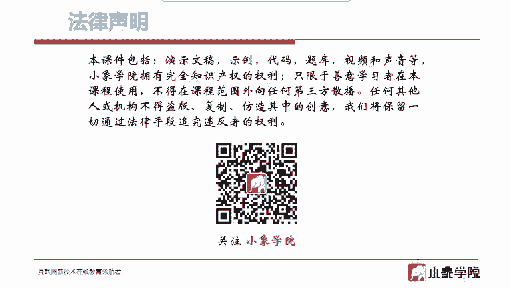

一个一个目标，大家学习的目标，那么最后一次课呢，我们再来呃探讨一些，真正大家需要在实盘当中啊，假设嗯将来你真的是希望通过量化交易来啊，实现财富自由啊，或者说这个目标可能有点高啊。

至少说这个平时作为业余爱好啊，作为这个量化交易量化投资来赚1。0花钱，那么啊必然要走到实盘这个阶段，那么在实盘之前，包括在实盘交易过程当中有哪些注意的事项呢，啊呃因为量化交易本身。

我我在第一次课我就给大家强调啊，这个拼的是细节，很多对细节的处理，决定了你最终策略实施的效果，所以说今天呢其实我们最主要的一个目标，就是把大家啊，这个往更深的这个层次去引领一下。

通过一些实嗯分享一些这个实战的案例啊，或者说我们的一些经验踩过的坑，能够帮助大家呃对实盘的这种细节的复杂性啊，它的这个呃，包括这个对于实盘当中非常重要的这些问题啊，至少先有一个认知。

那么将来当你真正遇到类似这样的问题的时候，至少可以啊，呃不会慌乱啊，能够有条不紊的按照我们在课上学习到的一些，知识经验啊，来去处理这样的问题。

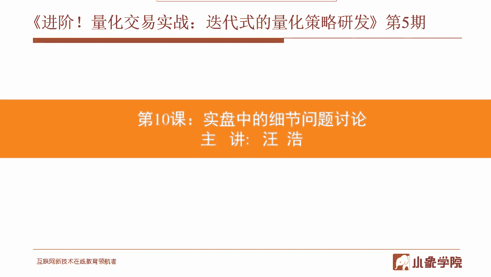

这就是我们今天这节课想要解决的，那么当然这个课呢，也是属于我们整个第三个模块啊，我们总共十次课分成了三个模块，那么最后这个模块，量化交易策略逻辑的一些深入探讨啊，目目的就是已经面向实战。

那么在这个进入到今天这个课程的呃，内容之前啊，我们先来回答一个之前有学员问到的问题呃，就是关于加减仓的问题啊，我们在这个前面的策略的这个代码当中，已经涉及到过这个嗯关于加仓的这个部分啊。

关于这个资金管理啊，头寸的仓位的控制，那么有同学问这个减仓应该怎么去做啊，实际上在这儿啊，我我我表达我自己的观点，我个人的观点是认为，这里头其实没有一个确定性的答案，做做交易这件事啊，它有一个特殊性。

它不像教科书，当然也也关于关于教育有很多的教科书啊，但是读这方面的教科书啊，呃不是说像化学物理这样非非黑即白啊，化学物理数学写到教科书里的内容，几乎我们不用去怀疑了啊，它就是正确的。

而且放之四海而皆准啊，只要在他的这个理论体系，在他的这个前提条件下，那么屡试不爽，但是交易这件事不一样啊，交易当中没有绝对的正确或者错误，只有合适和不合适啊，这个这句话呃，如果你有很很多交易经验啊。

我估计你比较容易去理解这个，但是不管你暂时理解不理解啊，今天能不能理解，我希望你能记住这句话，交易当中没有绝对的正确和错误，只有合适和不合适，那么回到加减仓这个问题。

其实也没有说什么样的方式的加仓就是正确的，什么样方式的减仓就是错误的，没有这个这样的一个说法，那只是说，是不是能够帮助你去达成你的这个交易目标，你对于风险的承受的能力是这样。

你对于收益的这个期望是这样的一个水平，那么你通过加减仓，通过头头寸的控制啊，每一次下多少注，能够帮助你去实现这样的收益目标，那么它就是合适的，否则的话就是不合适，所以呢从加仓的角度啊，我们之前讲过。

像海龟交易法则这种趋势型的策略，那么顺势加仓就是它的一个大原则啊，做对了，那么把头寸加的就很激进，加的很快，那么却嗯不能够确保啊，是争取在这一次呃正确的交易当中，能够让你的收益尽量的最大化。

那么反过来减仓，在海龟交易法则当中，这种趋势型策略它没有一个专门的减仓动作，直接就平仓了啊，只要发生了反向的运动，当趋势被破坏啊，认为趋势已经终结了，也就是反向突破了，那这个时候他就直接。

无论是你初始的头寸还是后来加仓的头寸，都直接被平掉了啊，直接平仓，那么有没有说不是所有的头寸都一次性退出，而是分批去退呢，这个是呃也是存在的，在很多策略当中也是这么去用的，那么为什么这么去用呢。

它是对应着你对这个收益和风险的一个平衡，你比如像很多网格交易，他每次加一个头寸以后，那么下次再退的时候，就是退退出你刚刚加过的这一个头寸啊，反复这样去交易，网格策略呢是一个经典的啊均值回复原理的啊。

这种震荡型的策略啊，所谓的高抛低吸，那么它因为每一次增加一个头寸之后，假设他获利了，那么就会把你刚刚增加的这个头寸啊，把它获利平仓，或者说刚增加的这个头寸啊加错了，那么遇到了更坏的情况，触及了你的止损。

那么通常也是把这个刚加的这部分头寸，把它呃止损掉啊，但是在网格教育当中也有也可以这么去设计，就是说只要一发生退出，那就全部之前所有累计的头寸都一次性退出，也是可以的，就是收网一次全收啊，不是分批的去收。

这个完全取决于你对于收益和风险的一种平衡，所以呃在这呢就是我们就因为减仓也好啊，退出他的代码跟你的加仓在写法当写嗯，写法上没有什么区别啊，没有什么区别，只不过一个是买，一个是卖啊。

或者说一个是一个是建仓，一个是平仓啊，那么所以在这儿呢，我们也就不去花时间去再去给大家介绍，这个这部分代码应该怎么写了，大家应该触类旁通啊，就是按照这个加仓的这个代码啊，类推。

你就可以去嗯构造你减仓也好啊，平仓的这个退出的各种方式，退出的这个代码，好这个问题呢我们先到这啊，如果说这个大家还有更细节的问题，我们可以课课下再来交流，那我们看今天的这个内容啊，在呃讲这个实盘之前啊。

根据往期，因为我们这次已经是第五期了啊，这个根据往期的经验啊，学到这个时候嗯，有不少学员可能比较关注呃，关于高频交易的一些事情啊，所以在这呢今天借助这个课堂的机会，我也再稍微提一提呃。

高频呢应该说在在经典的量化的这个世界当中，高频属于另外一个世界啊，属于完全不同的另外一个世界，按照这个从事高频交易的，这个量化交易者的比例啊，也是占经典量化交易比例的，这个非常小的一个一个部分。

因为确实做高频啊，对于财力，物力啊，人力啊都有很高的要求，所以说嗯确实是最顶尖的那些选手，才开始从事这个高频交易啊，啊就好比现在刚才我看了一下，我们直播间里的这个呃学员的数量啊。

跟第一节课我上第一节课的时候相比，应该已经差差了一个数量级了，也就是越做到后面啊，越做到更高的层次，那确实是越难啊，这个毫无疑问金字塔形的一个结构，所以在这呢也应该说，也像今天还在直播间听直播课的啊。

同学这个表达我们的敬意啊，能够坚持到第十课还在一直听直播，这个非常也不容，非常不容易啊，向你们表示我的敬意呃，回到高频交易啊，首先我们看看这个高频交易的定义，实际上啊到目前为止。

即便是从事高薪交易的这部分交易者，也没有对高频交易有过任何严格的，理论上的定义，一般都是一些描述性的高频，之所以叫呃把它统称高频交易啊，它大致有这么几个共性，首先呢它是持仓的，这个时间通常都比较短啊。

短到什么程度呢，最快的交易有可能持仓毫秒甚至微秒啊，那么平均意义上呢，可能是在这个通常都在一分钟以内啊，大部分的高频交易，它的持仓的这个时间可能都在一分钟以内，那么再长一点也基本上没有隔夜的头寸啊。

这是一个就是持仓周期通常都比较短，另外一个呢对于速度的要求啊，对于交易速度的要求通常也都比较高，强调交易的及时性啊，它不像我们在做这个，通常我们在做价值投资啊，其实相差一两天对我们来讲问题都不大啊。

甚至有时候差一两个月问题也都不大，因为我们看的是这个长期价值的一个价格，对价值的一种回归，但是高频交易不是这样啊，高频交易很多策略都是在做流动性的买卖，所以他要求必须要能够迅速的去成交。

甚至通常要抢在别人前面去成交，有很多这种套利类型的策略，甚至是无风险套利啊，无风险套利的策略呃，举一个最简单的例子，比如说有两个交易所啊，交易同一个标的，交易的是同一种标的啊，标的物在其中一个交易所。

交易所A对这个标的物它的最小的价格变动，单位假设是十块钱啊，十块钱也就一票，我们叫做通常我们叫做一票啊，一票是十块钱，那么另一个交易所交易所B对同样这个标的，他可能一跳啊。

他的这个最小交易单位颗粒度是五块钱哎，这个就造成了一种我们经常说到的，所谓无风险套利，就是同一个东西在两个交易所去交易，但是在报价的时候，一边是十块钱，十块钱的便，那边是五块钱五块钱的变。

那么你就会经常会能够遇到这样的一个情况，就是在这个交易所啊，交易所A报价100块钱的时候，在交易所币报的是95块钱，但是它是同一样同同同一种东西，那这个就这个时候我们就可以想象啊，一种套利的方式。

那就是在交易所B买入这个标的，同时在交易所A卖出同等头寸的啊，这个标的，那你就固定的赚了五块钱，而这五块钱就是因为报价的原因造成的啊，但这种机会呢几乎没有什么风险。

但问题在于你的报单一定要抢在别人之前成交，你才有可能去赚取这五块钱的差价，这就要求说，你你对于这种交易的执行速度要非常高啊，非常高，国际上最顶尖的这个高频交易的团队，为了抢这样的单子，不惜不惜代价啊。

一个是在传输啊，交易的这个指令的传输上，不光是说尽量靠近交易所的这个交易主机，交易柜台了，有的时候甚至要拼网速啊，那什么叫拼网速呢，它甚至可能是搭搭建这个微波塔啊，靠这个微波直线传输来比光纤还要更快啊。

来达成这样的一个目的，有的时候也会把这个它的程序直接支，植入到网卡当中啊，就不经过我不经过电脑的主机，不经过CPU了，直接在网卡上就已经把指令生成了啊，嗯类似这样的手段去抢这样的单子啊。

所以说像刚才我举的这种例子，无风险套利的机会基本上一旦出来，就被那些具有这样的这个高高精尖技术的，这个团队全都抢光了，所以其他人根本抢不到啊，抢不到怎么办，那我好，我们只能啊比拼这个算法还要更复杂一些。

我们挖掘这个机会啊，这个我们做一些统计套利，那么统计套利呢，就是说它不一定像刚才那种无风险套利，只要你抢到这个机会就能赚钱，统计套利有可能也是也也套错了啊，套错了就会亏钱。

但统计套利的模型一般要比这个无风险套利，要复杂得多啊，那甚至还有用到人工智能的一些一些方法啊，这个非线性的优化啊，包括甚至用这个神经网络啊，深度神经网络深度学习。

那么这个取决于你的算力和你这个执行的速度，在高频交易当中，还有一类策略叫做做事型的策略，什么叫做事呢啊就是说当一个交易所啊，它的这有些交易品种，可能它的呃本身成交量不是太大，那么这样的话呢。

当一旦有这个交易的需求的时候，很可能呃很长时间不会被撮合啊，那么在这个时候呢，交易所不愿意看到这样的情况，那好有没有这个做市商来帮助我们，来把这个交易啊，做的这个交易深度做得足够深啊。

让他这个成交啊能够相对比较容易比较平滑，那么做事类型的策略呢，它主要是来提供流动性啊，这边这个有了有有报单，那我尽量啊我先把他接过来，然后呢再看有对手单啊，对手盘，然后再把他这个对手盘也也通过我来撮合。

相当于啊简单的说我们就是个二道贩子啊，做这种事，那么做事类型的策略，不要求说你每一单要要去赚钱，当然最好你在凑合过程中啊，尽量能够不亏钱，甚至能够赚一点，那那是最好，那做事类型的策略。

它主要它赚取的是什么呢，是交易所的返佣啊，交易所通常会给他的这个做市商呃，的这个交易的手续费啊，有提供大量的这个返还啊，甚至百高达90%以上的这种返还，所以呢做事类型的策略啊。

只要你这个每单嗯能够保证不怎么亏钱啊，额至少亏的比这个手续费要低啊，那么你就可以通过交易所给你返还手续费啊，来赚钱啊，那么套利呢刚才说了，分为无风险套利和这个统计套利啊，这个统计套利相对就复杂一些。

你比如像我们说类似这种快速阿尔法呀，包括一些趋势型的套利策略，配对型的套利策略啊，这些呢都是属于在高频交易当中也会用到的，我们之前给大家讲过趋势型的策略，还有这个配对的策略啊。

这个包括均值回复类型的这样的策略，我们都讲过，实际上你可以想象，这类这这些类型策略都可以用到高频教育当中，只不过在这个时候，你需要把这个策略设计的更精细啊，因为很多的时候你的输入不光是这个价格序列。

还有一些盘口的信息啊，流动性的这些信息能够帮助你去判断未来的，能够预测啊，能够在一定程度上预测，比如说未来的半分钟，未来的一分钟或者未来的几个毫秒啊，那么在在你能够预测的这个时间窗口内。

那么你就会以一定的概率去符合啊，去符合你这个模型的啊，这样的一个性能，那么你就能够赚取这部分的利润，但是高频交易对于执行的这个要求，非常非常高啊，这里还有一个重要的问题，就是关于这个成交成交率的问题啊。

我们通常在低频交易当中，我们这个报单是比较容易去成交的，我们一般不会去太在意这个冲击成本，不会太在意这个成交率的问题，因为只要你的量不是特别大啊，在呃在这种流动性好的品种下。

我们的中低频的这个交易大部分都能够成交啊，但是在高频当中啊，可能有大量的单子不成交，不成交怎么办，这个时候其实你对于这种没有成交的啊，这这些交易，这些指令，你就需要有一个特别完备的一个处理的机制。

否则的话可能这些单子呃，没有没有第一时间成交的之后被成交了啊，没有撤单之后被成交的，很可能造成你的亏损啊，那么在这个高频交易当中，风控啊也是基因，为这个这个时候这个风控啊在交易执行过程中。

很难通过人的干预去去完成这个风控，所以他的这个风控机制啊，大部分都已经直至植入到交易策略本身了啊，然后关于高级交易有很多的争论啊，有人说这个东西有害啊，这个造成市场很多黑天鹅的这个这个事件啊。

这愈演愈烈，还有人说这个这个东西除了提供流动性，没有什么好处啊，这个相当于有做高频的，固定的在收割这些中低频啊，啊当然了，这个我觉得每种说法都有他自己的道理，但是我们就认清一个事实啊。

高频交易有一个最大的好处，就是在于它的性能相对是比较稳定的，它的稳定不在于说说我们说策略有多高深，或者说你的这个执行能力有多强等等，那些都还是呃第二位的这个因素，我们说最根本的原因造成高频交易。

通常它比我们的传统经典的量化，这个性能更稳定的一个主要的原因是，因为高频交易出手次数多，大家知道出手出手次数越多，那么就越接近于大数定律，能够按照你的这个一定的相对比较稳定的概率，去获取你的收益啊。

当然前提是说你的模型的这个历史性能，和你真正执行的时候没有什么太大的偏差啊，所以在这种情况下，你出手次数越多啊，一个期望收益为正的游戏，你出手次数越多，那么你最终的性能肯定是越稳定啊。

所以这是高频交易最大的一个优势，但是高频交易也有它的自身的这个一些限制啊，比如说他的这个单笔的成交量不能太大，否则它就对价格造成比较大的冲击，就改变了它的分布了，所以这就意味着说一个高频啊。

高频策略这个它能够管理的这个资金规模，也就是它的容量通常是有限的，我们知道这个詹姆斯西蒙斯啊，量化的这个量化界的大牛，最最能赚钱的人，他目前也不再对外募集了啊，他也不管别人的钱了，只管自己的钱就够了啊。

我我个人的观点是，也是因为他现在资产已经这么多了啊，管自己的钱，自己的钱可能都管不过来了，就没必要再去管别人的钱了，也本身也是因为高频交易啊，他本身是做高频，高频交易对于这个资金的容量它是有限的。

好大致先给大家讲这么多，关于高频的一些一些事情啊，那可能你对高频这样的话，有一个粗力度的这么一个认知，如果说真的想从经典的量化过渡到高频量化啊，这个领域，那么其实是有相当多的技术和这个呃，技术上的准备。

理论上的准备，包括人员啊，包括你的这个硬件条件啊，这里头有非常多的要素，那么以后有机会啊，特别是这个在线下有机会，如果说我们将来能够见面，一起来切磋，我们可以聊一聊，更多的聊一聊这方面的课题。

嗯还有些同学呢呃可能上我们这个课程呢，也是准备从呃，比如说现在是这个互联网的工程师啊，这个想想跨界进入到这个金融工程啊，再进入到金融圈，那么呃想了解一下这个圈子里，大大概是什么样一个生态啊。

那我也就简单聊两句，花2分钟时间在这个金融的这个圈子里头啊，特别是我们这个二证券的二级市场，大致分成啊两两个方面啊，一个叫买方，一个叫卖方，那谁是卖方呢，像我们大家熟识的这些证券公司啊，包括期货公司。

他们都属于卖方，什么叫卖方呢，就是说他们卖的是什么啊，他们卖的是一种服务，这种服务呢呃主要针对谁啊来销售呢，主要针对的是这些买方，买方通常包括一些大的啊，这个公募基金，大大的私募基金啊。

总之呢这个买方是真正在市场上去做交易，去去割韭菜或者被割的啊，这这部分交易方啊，那么卖方呢通常是这些券商，他们通过他们的投研部门，通过他们的这个呃这个这个这个嗯包括市场啊，包括其他的呃。

各个部门向买方提供全方位的服务，特别是卖方的研究服务啊，那么他们提供这些服务呢，就是希望买方在他们这里头去开户啊，做交易，这样的话他们就有相应的这种佣金，包括提供的各种其他的这种增增值服务。

那么无论你是在卖方还是在买方，如果你是想从事金融工程这个领域啊，那无外乎有有这么几种角色，一种呢你是去做工具啊，你帮别人提供这个交易的工具啊，你比如说像我们课程当中用到的这个tb呀，这个MC呀。

还有包括距宽呀，这都属于这个一些工具啊，我们去磨刀啊，那么，作为这个做工具呢，你可能就是加入到一个更偏向于技术的，这个团队啊，去打磨这样的一个这一些技术平台啊，跟交易相关的这些技术平台。

跟投研相关的平台，那么从买方的角度啊，他们其实嗯开发工具也是给自己用的，那么自己用更重要的是什么呢，是去市场上真真金白银的去割韭菜啊，去杀人，所以说这个如果说你是致力于从事买方的啊。

这个跟金融工程相关的这部分工作，那可能你大概率的就是变成了量化，交易员或者量化研究员啊，真正的是去开发制作策略，采取执行策略，当然还有一类就是这个卖水的，卖水的是干什么的，这个就是一些提供一些边角料嘛。

这个呃研究报告也好啊，这个一些这个初始的一些策略的，一些一些模型啊，可能不见得经过了实战的检验啊，你像这个卖方的这个金融工程部门，基本上都是干这样的事了啊，他们的最终的产出物是呃包装的非常漂亮的。

那些研究报告，这里头可能也有量化的，很多量化的这个呃策略啊，但是这些东西到底能不能实用，我们不得而知啊，当然从买方的角度，也许嗯就是喝了这些水，甚至有一些嗯里头还还确实有一些营养啊。

那他可能改进这里头的模型，算法也会用到他们自己的这个交易当中，但是这种事呢可能并不多见啊，确实以我的经验来看并不多见，这个就是整个这个圈子里头的这个机会啊，或者说这个买卖双方啊。

呃他们大概都有哪些工作的这种这种职位性质，所以说大家如果关注这方面的事情呢，你要你要么去卖方研究部门啊，去做一名这个分析师啊，要么呢你去买方啊，这个去做一名这个量化交易员啊，或者量化的研究员啊。

专门去去开发这个实战型的策略，当然你自己也可以说这个我作为宽课啊，这个我我我自己干了啊，这也没问题，当然还有一类就是说我只从事，基本上只从事技术类的工作啊，清洗数据呃，这个呃搭建平台啊，开发工具啊。

基本上有这么几种角色好了。

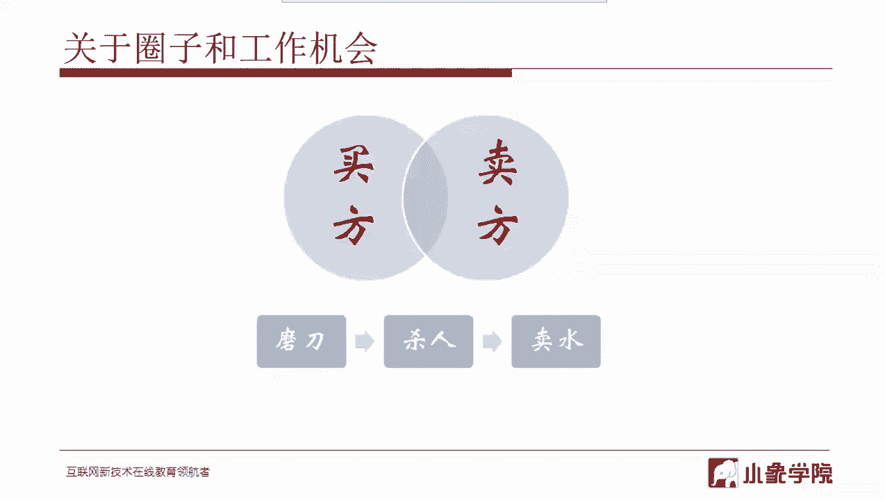

那么今天呢这个呃我们课程啊，大概要解决这么几个问题，一个第是我们通常满足什么要求，才能去上实盘啊，我这个策略在这个距宽也好，在tb也好啊，这个我已经呃进行了历史历史的回测啊，我觉得性能挺好的。

那么到底能不能上实盘呢，啊这是我们面临的第一个问题，第二个问题呢，我来给大家介绍一下这个关于数据啊，数据方面的一些这个重要的，非常重要的一些问题啊，或者说你可能遇到的一些坑。

然后第三第三个问题是关于实盘交易接口啊，怎么去测试呃，第四个问题呢是关于交易系统的压力测试啊，第五个问题是呃，人工干预和这个自动运行的交易策略啊，之间到底是什么关系。

第六个问题我们来谈一谈你的交易预案啊，你整个系统执行的一些预案，最后呢我们看一看你的，你是不是做好了，交易系统运行的一个心理准备啊，大概从这几个方面探讨，跟交易量化交易策略上实盘的啊。

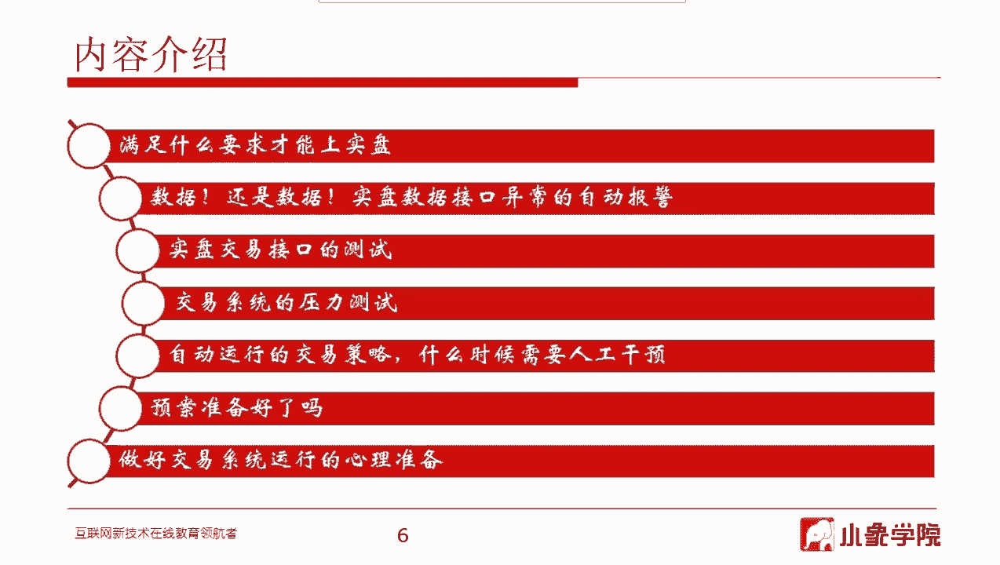

这些细节问题，那么满足什么要求才能上实盘呢，呃我经常跟人开玩笑啊，说你首先你看你的这个收益曲线，特别好或者特别差，都是有问题的啊，为什么特别差，其实也是特别好啊，就是差的离谱其实等同于好的离谱。

因为差的离谱和好的离谱基本上都是单边的啊，就是单边上行或者单边下行啊，看看一条收益曲线，如果是单边下行的收益曲线，你能做到单边其实非常不容易，说明你每一笔交易都做错，那你把反把它反过来做，你就做对了。

所以说好的离谱差的离谱都是有问题的啊，不管他是好还是坏，首先我们要看这个，你到底你的资产管理目标是什么，你有没有确定，因为所有的不根据需求目标来来评判的，这个策略性能啊，我们认为都是不合理的。

就是我刚才说过的话，交易当中只有合适和不合适啊，没有对和错，那么我们来看一下这个有一段对话啊，我经常用这样的一个故事来给大家呃，说明为什么说合适不合适啊，这个交易目标为什么这么重要。

说你对今今年自己的投资满意吗，说很不满意啊，差的太远了，那么你今年的这个交易目标是什么呢，说我想我想赚一辆车啊，那是什么车呢，啊大众途欢大大概值价值是25万，说那你有多少本钱啊，我的账户有20万。

那你打算什么时候换呢，啊这个车要什么时候换车呢，嗯大概三个月以后吧，听到这好多人都乐了啊，说那你你你相当于你要在三个月时间里，让自己的账户盈利125%是吗，哟有可能是吧，啊以前没算过好。

那你有没有意识到啊，三个月盈利125%，相当于一年要盈利500%啊，这还是不计复利的情况下，假设要计算复利，那是一年相当于盈利25倍是吗，有这么夸张吗，啊这真没想过说，那好，假设你这个目标是合适的。

那为了赚到这些钱啊，你愿意承受多大的损失，你愿意亏多少啊，不知道我从来没想过亏啊，那你愿意亏10万吗，10万太多了啊，就50%了啊，50%的本金啊，说那亏5万呢相当于本金的25%，那也太多了。

我最多亏10%吧，好那结论了有了啊，说你想三个月从市场当中获利，185%，但是你只愿意承担10%的风险，是的听到这，我觉得大家基本上能知道，我举这个例子的这个用意是什么了啊，那你听说过哪一种交易方法。

能让你获得一比12。5的风险收益率呢，没有的确也是我也没听说过啊，通常一比三已经很好了，也就是说你付出一块钱的风险，能够获得三块钱的收益，这个对于我们啊长期进行交易，你当你偶尔说你你撞了大运啊。

撞了狗屎运，说这个一天这个这个这个中了中了彩票了，那这个另当别论，那不是一个长期从事交易的目标啊，我们说的这种交易目标是日复一日，年复一年，如果说你能长期保持一比三的风险收益率。

你绝对在这个专业的团队当中也是顶尖的了啊，那您绝对能拿金牛奖了好，所以说这个目标啊，一个一个目标合适不合适，目标定的正确不正确，只有在这个目标是合理的合适的前提下，我们才好去进一步的去评价。

你这个策略到底能不能去上实盘啊，你的策略一定是要符合你的这个风险收益的，这样的一个平衡的目标，所以呢要要符合风险收益平衡这件事儿，一般来讲我们会用夏普比率来去衡量，一个策略的这个风险和收益的这样一个。

均衡的性能啊，那么公式我也列在这了，我也不细讲了，因为之前我们的课程中当中也都涉及到了，然后除了夏普比率啊，我们在衡量一个策略的时候，我们通常还要看它的最大回撤，因为最大最大回撤对应的是最坏的情况。

也就是你你所可能遇到的一个最坏的情况，对这件事来讲，我们一定要心里有数啊，我们要知道最坏的情况是什么，那么我们在运行这个策略的时候，一般就比较淡定啊，然后年化收益这个不用说了。

还有一个我们通常在上十盘之前啊，我们先要评价一下你的这个策略的，这个我们叫做心理因子，什么叫心理因子呢，它的定义很简单，就是在你的策略在历史的表现当中，它的上涨的时间啊。

也就是说这个收益曲线它上涨的时间比上，也就是除以策略净值下跌的时间，比如说在过去一年当中上涨了200天，下跌了50天啊，那么这个心理因子就是200÷50=4，心理因子是四啊。

一般来讲我们希望这个心理因子越大越好，为什么，也就是说大多数情况下，你的收益曲线是增长的啊，就是你是赚钱的，只有少部分时间是亏钱的，那尽管有可能这少部分时间亏钱，有有可能还亏的挺多啊。

但是呢因为你在大多数时间里是赚钱的，你的心理上相对比较愉快，那么你就不会，也就是说你犯错误的机会就相对少一些，那么你你实在忍不住，你的心理承受能力不强，你要是去这个不正确的去干预你的量化策略。

执行的这种几率也相对比较小啊，所以说在这种情况下，你的量化策略能够保持一个相对稳定的，一种执行的状态，也就是说它很可能对应的就是，它最终执行的效果也相对稳定啊，所以心理因子对于我们一个量化策略的执行。

也非常重要啊，因为人啊，这个人这个动物非常奇怪，他是情绪的奴奴隶啊，绝大多数人，99。9%的人都是情绪的奴隶，那一你你你再回测，包括历史表现啊，你的策略的历史表现都一直是赚钱，或者说嗯表现的挺稳定的。

但这两天确实遇到一些意外的情况啊，黑天鹅事件产生了一些回撤，但这回撤也是很正常的，也没有超过你最坏的情况，也没有超过你的最大回撤，但是很多人这时候受不了了啊，心态就崩了，那要去改改你的这个参数啊。

其实你这改完参数以后也没经过严格验证，那么在这种时候其实越做啊可能越错，所以说心理因子这个事儿，对于一个策量化策略的稳定执行，不被主观干预也是非常有意义的，然后还有一个指标叫信息率。

信息率呢衡量了一个投资经理的这个主，主动投资的能力啊，至至于它的定义我也就不再说了，但是呢在这有另外一件事，我们其实想想多多提一句，就是信息率啊，它除了等于主动收益除以主动风险。

它还等于你的信息系数乘上，你做独立预测的带宽的平方根，这是什么概念，就说我们在制定一个策略的时候啊，我们想提高一个策略的信息系数，也就是说它一次独立预测的这个性能，它对应的啊信息系数越大。

也就是说你单次交易你的这个性能就越高，那么提高IC啊，这件事是非常难的啊，非常难的，要从逻辑上有根本的改进，你才有可能去提高IC，但是啊我们从量化策略的角度，提供了我们另外一种思路，就是我可以提高BR。

因为我最终的这个性能是跟BR的平方根，成正比的，也就是说在不提高信息系数的情况下，只要我做独立预测的次数增加了，那么也就是说我更努力了啊，我这个策略更努力，我也有可能增加我的收益啊。

因为你一年做十次交易和一年做100次交易嗯，那它确实是不一样的，高频交易实际上就是在提高BR啊，在在提高BR。

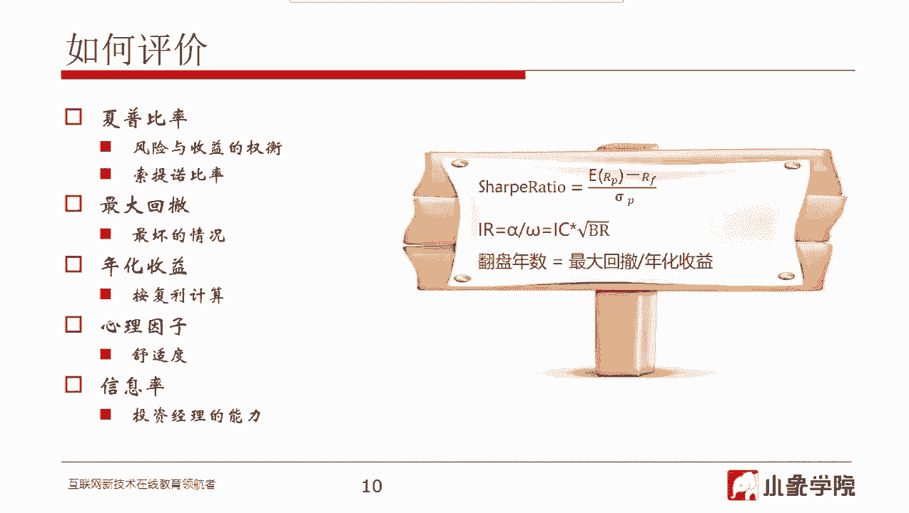

好，那么怎么。

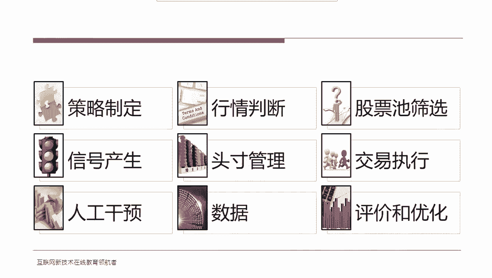

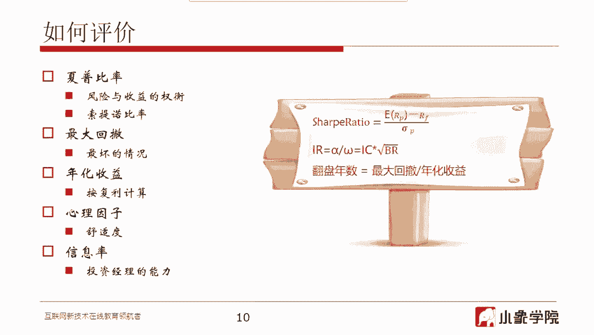

这PPT播放有点问题啊，稍稍等一下，说完这个评价指标啊，我们再来看一下，不是死机了吗，稍等一下啊，这个机器可能特别慢。

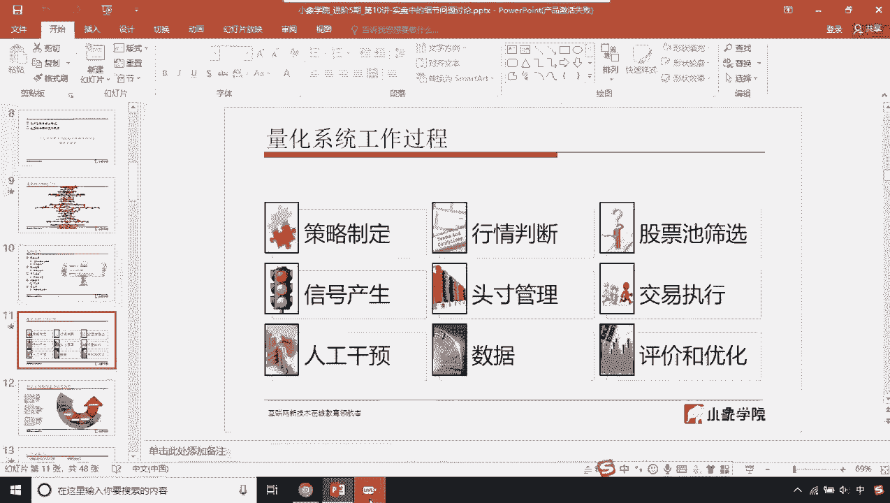

在现在这个状态下，我不知道大家有没有遇到这种情况，嗯好像也没没人反映出来。

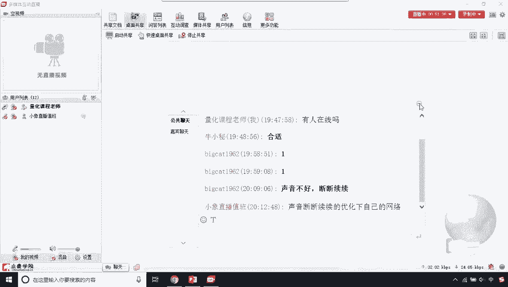

那看看来还是正常的啊，那我们再回到这，嗯就是就是比较慢，我这个PPT可能比较慢，没关系，我我接着讲，我们我们说完了这个策略评价指标啊，我们来看一下量化系统的一个工作过程，一般来讲我们开发一个量化系统啊。

我们从策略逻辑啊，到策略整个这个制定，然后我们通过行情去判断我们这个策略啊，呃怎么去实施呃，在策略的这个模块当中，可能有我们的这个选股啊，包包括股票池的筛选，有信号的生成，有头寸的管理啊。

这些因素都考虑全面了以后，我们再涉及到最终交易的一个执行，在执行的过程当中呢，不可避免的可能会有人工的干预啊，当然不是乱干预，通常都是发生一些意外的情况，我们根据预案去进行处理，这种人工干预。

然后在策略执行过程当中很重要的，有你的这个行情数据啊，不断的去更新，包括其他的一些，只要你交易模型涉及到的数据，在交易的执行过程当中啊，我们一个之前已经制定好的策略，有可能会遇到失效。

或者说一时难以判断啊，就是它的策略的性能，跟我们之前预想的可能有偏差，在这个时候我们还要不断的去进行评价啊，必要的时候要进行优化啊，是基本上是这样的一个工作的流程啊，因为这个PPT，PPT走不下去了。

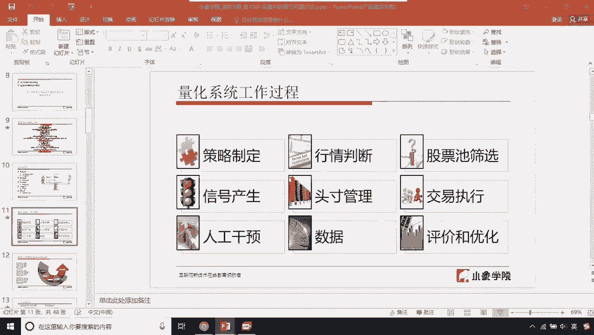

然后从研发的这个角度来讲呢，一般来讲这个策略建模啊，包括追溯测试，也就是说我们之前这几节课给大家讲到的，这个问题呃，已经形成了你的这个回测曲线啊，那么完成了这一步啊，很多人都觉得大功告成了。

但实际上啊按照我们的经验呃，这个离实盘还差的比较远啊，我们之后还要花70%，甚至更多的精力在整个这个策略的嗯，错误的修正以及这个系统测测试，包括预案的制定啊，就是离你上实盘进行自动化的操作。

这里头可能还要需要花大量的这个精力，那么到底这些精力花在什么地方呢，接下来我们就给大家来介绍啊。

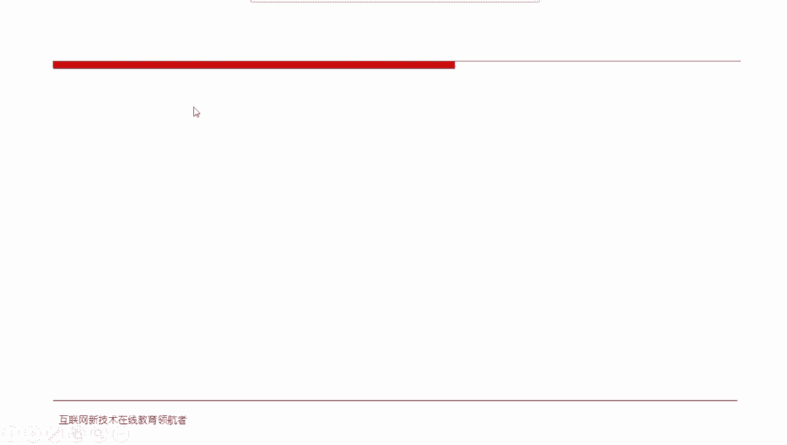

这个PPT好像播放状态有有一点问题，那我干脆就在这个状态下给大家讲吧，我觉得应该截屏上应该也能看得清楚啊，我们一般来讲我们回测以后得到一条曲线啊，很多人觉得哎这条曲线很漂亮啊。

嗯按照这个策略评价指标来讲，夏普也挺高的啊，二下普大于二甚至大于三，那么这个年化收益30%，最大回撤不到5%，唉这个多漂亮的一条曲线啊，好赶紧上实盘啊，但是一到上了实盘发现啊暖不是这么回事啊。

这个没过多久啊，这个这个本金就已经亏了20%以上啊，那是什么原因有可能造成这样的一个问题啊，在这我罗列了一些，虽然这个呃实际的这个因素，可能比这个要多多很多啊，但是我在这罗列了一些比较典型的因素。

首先我们看你的在回测阶段啊，在你的这个产生这条回测曲线的这个阶段，你到底你的回测交易记录有多少条啊，有多少次交易，一般来讲啊，我们我在清华这个给同学们上课的时候，我他们做的作业。

我通常都要求回测不要少于200次交易啊，因为低于这个数字呃，实在是没有太大的意义啊，没有没有什么统计意义，也就是说你这个策略，到底是真正你的逻辑在发挥作用，还是说你就这为数不足不多的这几次交易当中。

你的运气比较好啊，这个事我们说不清楚，然有同学说说老师我这是个中低频策略，我这总共我回测10年，他他也不到100次交易啊，好我给你通融一下啊，按照我们的这个经验，最低最低也要70次啊。

否则的话没有任何的统计意义，然后有些这个你要要有些同学啊，他看一下他的回测记录，这个交易记录当中啊，停牌的股票也能成交啊，那这个是显然是不合理的啊，这可能是程序没写好啊，那么如果大家用这个。

像类似巨宽这样的第三方平台，它基本上都有一个这个停牌啊，是标志是否当天是否停牌的这样一个字段，所以大家按照这个字段去做一个check就就可以了，当然还有一个临时停牌这件事，临时停牌呢。

一般的这种第三方数据源，可能没有这么细的颗粒度了啊，但是也有一个折中的办法来判断，就是你可以去看这支股票啊，比如说在分钟级别上，在这一分钟的它的成交量，如果这一分钟成交量是零。

那就意味着他大概率已经被临时停牌了，但不管是不是临时停牌吧，总之这个历史上这个回撤的时候，你成交量是零，你绝对也不能成交啊，所以说我们不要因为停牌能成交，来占了这个便宜，我我所罗列的这些因素啊。

基本上都是在回撤的时候，你能能够占便宜的因素啊，涨停能买吗，理论上能买，但是你在现实当中不一定买得进去啊，你的这个成交率会很低的，跌停也不见得卖的出去啊，但是一不小心在回测里你就做到了这一点。

这个事要好好查一下啊，s st的股票5%就算涨跌停了啊，那这个要额外注意一下，还有新股，包括我们现在还有科创板的股票啊，科创板的这个头几天还没有涨跌停限制，那么规则不同啊，需要去单独的检验。

而这里头还有一个实际当中的一个经验啊，有有些同学自己写的回测的这个系统，你可能没有用任何第三方啊，那么你自己写的回测系统，你在判断涨跌停的时候啊，这个high limit low limit。

有可能你就是直接在前收啊，就pre cos这乘一个1。11个0。9，来形成一个涨跌停价格，这个通常是有误差的啊，所以在这一点的处理上，希望大家能够想一想一些比较合适的方式啊。

我们建议啊你最好是能够接收一些比接收，或者说使用一些官方的数据，包含这个high limit low limit，也就是说他给出的相当于交易所直接给出的，这个当天的涨跌停价格啊。

你直接用这个价格会比较可靠，比你自己乘以1。1×0。9，计算出来的要可靠，因为有些股票你差一两分是很正常的啊，那么还有一种情况，我在之前看到过，有同学做的这个量化交易策略啊，一只股票的成交量。

超过了当天历史上这支股票成交量的10%，甚至更多，这种情况是不合理的啊，一般来讲，假设在实盘当中，你想做到这件事，那么这支股票的价格已经被你影响的，这个有严重的变形了啊，你如果说一次干进去10%。

就当天这支股票总共成交了500万，你自己干进去了100万，那么你要是买盘，你可能已经把它买涨停了，如果是卖盘，可能已经把它卖跌停了啊，所以说在这种情况下，你的回测结果是不可靠的，而且在实际操作当中。

我们也不建议这样做，你这样做的话，你进得去可能出不来啊，所以说这是属于风控当中，我们也不允许的一件事，好日内出的信号，开盘价能成交吗，显然是做不到的对吧，这是一个未来函数，是偷价的行为啊。

那收盘价能不能成交呢，这个是需要具体分析收盘价，目前来讲我们以股票为例啊，这个沪深两市在尾盘3分钟，已经都采用集合竞价的方式了，所以说理论上最后3分钟你要是挂跌停价去卖，挂涨停价去买啊。

有可能能够以收盘价来成交啊，是有这种可能性的，但是也不一定啊，对于流动性比较差的股票，也不一定能做到这一点，那怎么办呢，我的一个建议就是在回撤的时候，假设你是希望在收盘这个时间去成交，你可以比如说2。

45啊，这个离收盘前15分钟，你开始每分钟要成交，你当天总成交量的10%，或者呃一定的比例啊，然后连续若干分钟，连续10分钟去进行这个交易，那么你获得的就是最后这10分钟的一个均价啊。

基本上是这最后10分钟的一个均价，这么做回测可能代码稍微麻烦一点，但是移植到实盘是可以直接使用的，它们之间的这个性能也不会有太大的差别，然后还有一种情况，可能大家目前遇到的不多，但是你早晚会遇到的啊。

相同条件下每次回测结果不一致，什么概念，你什么都没改，代码也没改，然后回测的起始日期，起始日期也没有变动，但是呢上一次回测的结果跟这一次回测的结果，还有挺大的一个差别，那这个差别是怎么造成的呢。

按照我们的经验，通常有两种情况，第一种情况就是你的策略当中，用到了一些随机的因素，比如说你用这个呃，比如说当日主力资金流入啊，超过这个额，超过一个一个某某一个阈值吧。

比如说主力资金流入超过100万的股票啊，那么在这个时候他有可能你最后交易十只股票，但是呢符合你这个条件的也许有30只，50只，那这个时候你可能是随机选取了，也可能是以某一种规则去选啊。

那么就导致了你可能回测结果不一致啊，这是一个随机因素造成的，还有一种情况，就是说比如说我们用距宽去进行回测呃，昨天回测的结果和今天回测的结果不一样，你的起始日期是一样的，代码也没有变啊。

那什么原因会造成这种情况呢，就是刚好今天距宽进行了数据维护，更新了一些历史数据啊，有这种可能性，或者说做了技术维护，修复了某个bug或者新产生了某些bug啊，由于第三方平台你是不能完全可控的。

所以一旦出现这样的情况，你只好把这个bug或者这种现象，报给平台的维护者，让他们帮助你去检查是什么情况啊，我们也遇到过这样的情况，所以说呃作为量化交易啊，这个入门的阶段，你确实可以先采用第三方平台。

但是当你交易做到一定的程度啊，你可能对于交易系统的执行的效率，或者对于自己策略的一些特殊的要求呃，使这个第三方平台已经不能满足你的需求了，那这个时候啊，你就不得不开发自己的这个交易系统。

甚至是这个嗯投投资研究系统啊，投研平台，那么这个工作量就相对比较大啊，但是呢我也希望大家能早日走到这一步，说明你已经这个交易已经做到一定的程度了哈，难道我的这个PPT是死掉了，完全不动。

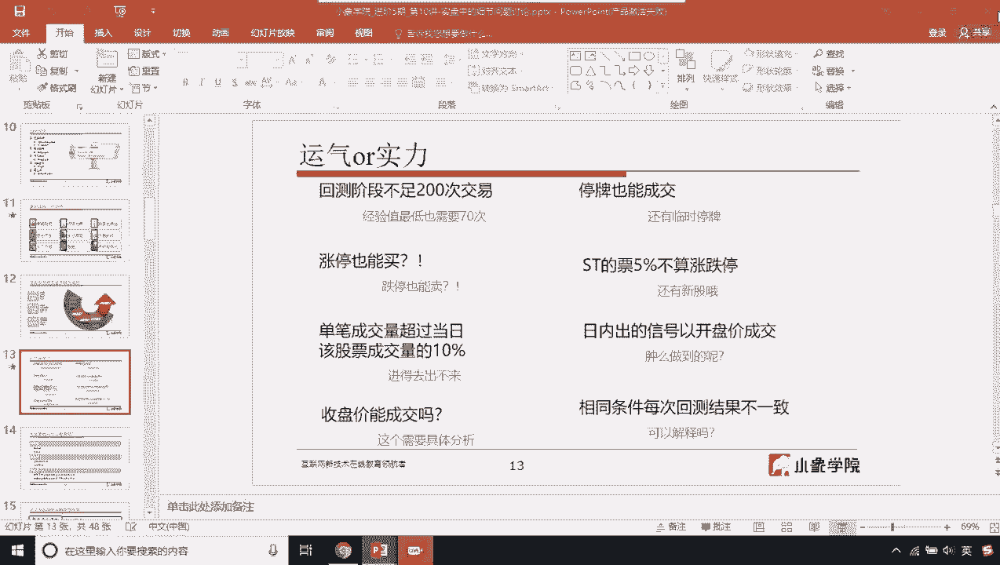

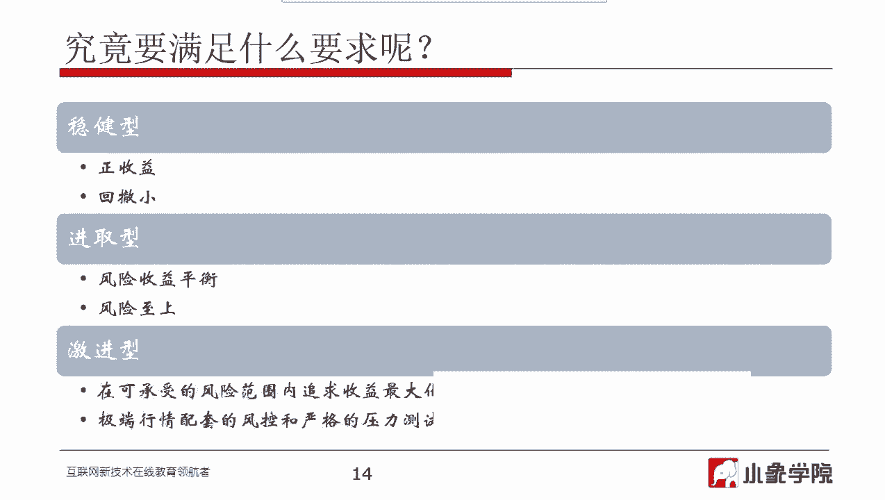

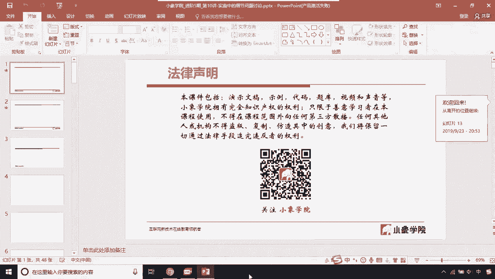

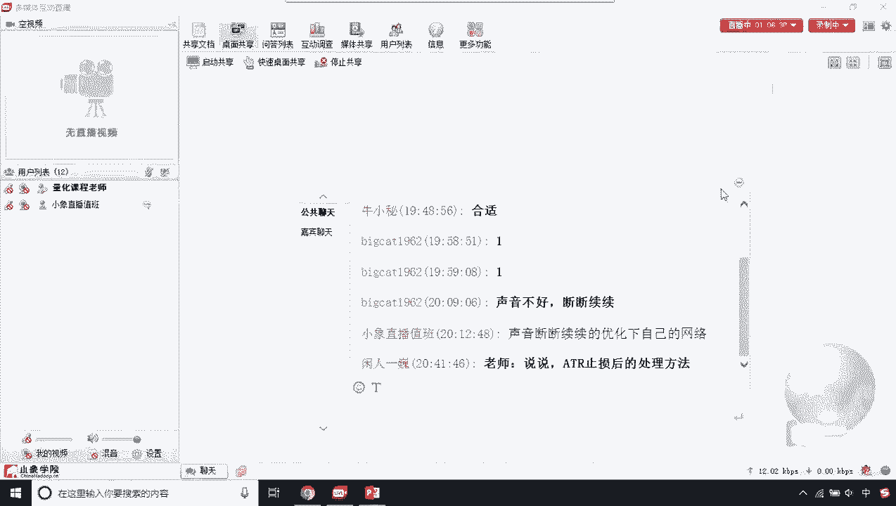

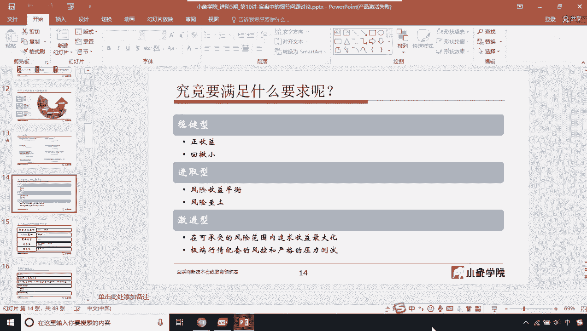

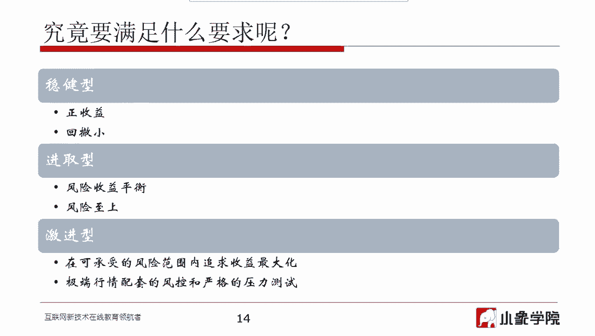

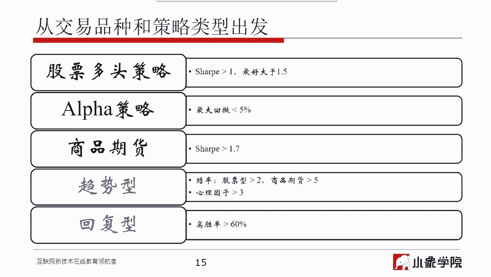

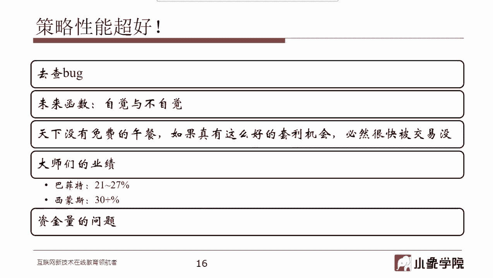

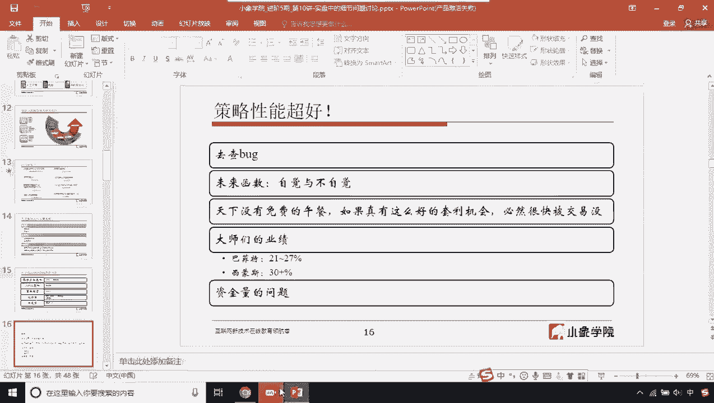

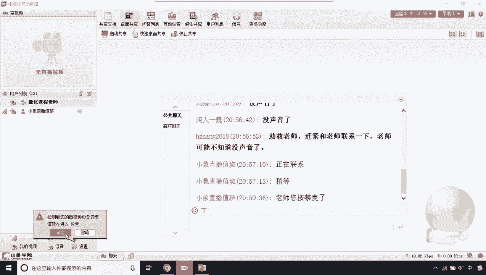

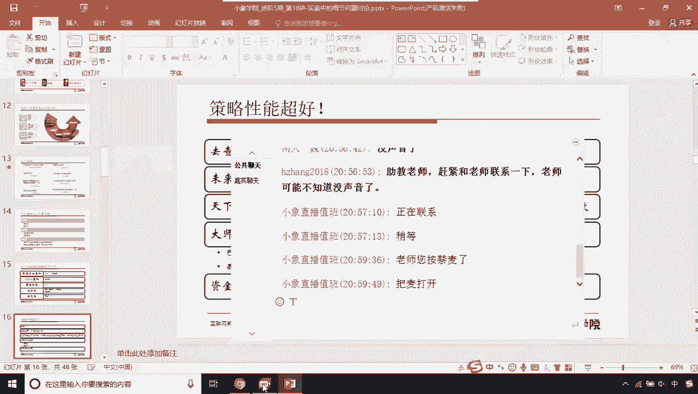

呃现在能听到声音吗，OK那那个谁能提示我一下，刚才听不到声音，那个我当时讲到什么位置了，第13页啊，谢谢。

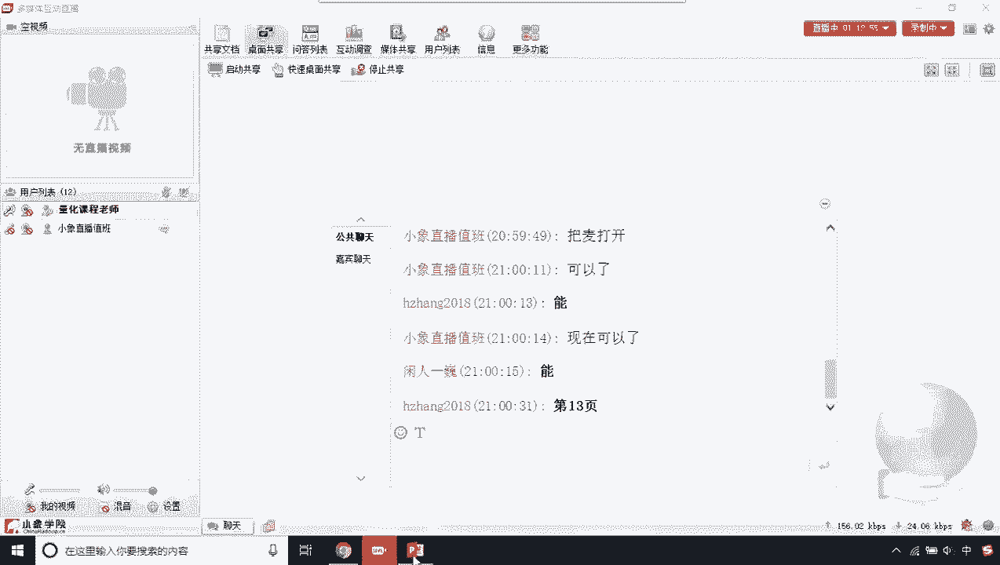

好第13页，那我快速的再过一遍啊，这个哦哦这一页还是挺花体力的啊，这是个体力活，做解解释，这一页，运气和实你的一个量化策略啊，到底是由于你的逻辑帮助你赚的钱，还是你只是通过运气赚到的钱。

那么在这儿我列举了一些可能的犯的错误啊，我们快速的再给大家过一遍，一个呢是说你在回测阶段，你的这个回撤次数，交易次数不够啊，回测的交易次数不够，一般来讲我要求啊这个呃你的历史回测记录。

历史的回撤的这个交易记录，至少要包含200次的交易，什么叫一次交易，就是一次开仓和一次平仓，就算一次交易啊，你这个对于同一个标的的反复开仓平仓，那就是不同的交易啊，为什么要有200次，因为少于这个数。

它没有太大的统计意义啊，那有同学说说这个我做的是个中低频策略，这个回测了10年也不到100次的交易，这怎么办好，那对于这样类型策略，我们降一降要求，那最低也要有70次交易，否则的话说明不了问题啊。

那么停牌能不能成交，显然是不能成交的啊，这个事嗯，如果停牌能成交，那么你肯定是占了便宜了啊，临时停牌的情况，你可以通过这个历史数据当中，比如在分钟级别的成交量来判断，至少成交量为零的情况下。

你不要让他能够成交啊，在回撤的时候，那么涨停能不能买呢，涨停不一定买得进去，大概率买不进去啊，这个跌停也是大概率卖不出去，所以在这种情况下，我们回撤的时候，也不要让这种情况能发生了。

否则你必然也是占了便宜，然后st啊，它包含了这个5%的这个涨跌停，然后还有一些新股，包括科创板有不同的规则，这个大家一定要注意，还有一个情况也需要再给大家提示一下，就是呃有同学自己写的量化回测系统。

那么涨跌停可能简单的利用这个钱收，就pre close乘以一点一和乘以0。9来计算，这种方法呢是不严谨的，因为你自己算出来，这个价格可能和这个交易所给出的这个high limit，Low limit。

它是不一致的啊，所以我建议大家有条件的话，还是尽量利用这个官方的数据源，他能够给到你的这种high里面low limit啊，涨跌停的这个价格去比较，不要用自己啊，自己是用钱收乘以一点一或者0。9来计算。

而且这个时候你可能对父权的处理也是有问题，所以也导致你这个价格判断有错误，那么单笔成交量超过当日该股票成交量的，10%，这种情况我以前在这个教学的时候，我检查同学们的作业也会看到这样的情况啊。

这种情况你想象在实盘当中，一只股票总共一天成交额就是500万，你自己干进去了100万，这有这种可能性吗，除非你是这个股票的庄家啊，你你要操纵股价，否则的话，如果你作为一个价格被动的接收者。

然后以当天回撤的情况，就是以当天的那个回撤的这个价格去成交的话，呃你不可能得得到，因为在这种情况下，你要么已经把它买涨停了，要么已经把它卖跌停了啊，所以说额这是严重和我们的实盘呢是不符的。

从风控的角度也过不去啊，买的进的去出不来，所以我们不希望大家在回撤的时候，能够有这样的情况发生，然后日内的交易信号以开盘价成交啊，这是一个典型的偷价行为，这个我就不多说了啊，大家容易理解。

那收盘价能不能成交呢，收盘价理论上是可以成交，现在沪深两市都是最后3分钟集合竞价，所以在这种情况下，我们呃如果是最后3分钟集合竞价的时候，挂着跌停价去卖，挂着涨停价去买，是有可能以收盘价来成交的。

但是呢也不能保证啊，特别是对于流动性比较差的股票，所以这个时候我建议大家，如果说你在回测的时候希望用收盘价来成交，你不妨用最后比如说15分钟的一个平均价格，那么在实盘当中。

你也可以是每分钟打一打一发子弹啊，最后15发或者多嗯，12发把他打完，那么这样的话，你的回测的结果和你实盘的结果，基本上是比较接近的，相同的条件，每次回测结果不一致，大家可能以后会遇到这样的情况啊。

原因有两种，一种呢是你在策略当中，引入了一些随机的因因素，比如说你这里头就是符合条件的股票，假设有50只，但是呢你最终只交易其中的十只，你有可能有一个随机选取，或者按照某一个顺序去选取啊。

那么这种随机因素，可能导致你的前后结果不一致，但这种不一致不应该有太大的差别啊，那还有一种不一致呢，这个他的原因是，因为比如说我们用距宽做回测啊，今天回测和昨天回测结果不一样。

有可能是在今天距宽去维护了一下数据，更新了这个一些错误啊，就修正了一些错误，或者说他维护了一下平台，做了个技术维护，修正了一些bug，也可能是引入了一些新的bug啊，这都有可能，所以就造成了前后不一致。

这种情况我们没有没有办法，我们只能等到这个平台更稳定啊，所以说这个对于我们真正深度从事，量化交易的这个未来啊，如果你有这样的需求，那大概率的还是要自己搭建自己的量化平台。

因为这样的话才能做到所有的细节都可控啊，不再依赖于第三方，嘶那这PPT怎么用，然后从，嗯从这个策略啊，策略本身的这个类型上来看啊，我们对于这个股票多头策略啊，假设你开发的是一个股票多头策略啊。

那么我们通常对于你回测的这个性能，我们有我们的要求是说什么呢，我们我们比较看重夏普股票多头策略，最好夏普能够大于一啊，呃如果你真的想上实盘的话，嗯至少是1。5，为什么这么说呢，就是你对于多头策略。

那么你每付出一块钱的风险，你能够赚回来一块钱，赚回来一块钱的收益，甚至赚回来一块五，这个时候才有实施的意义啊，如果夏普在回撤的时候都不到一，在实盘当中呃，大概率会更低，那这样的话。

你这个风你这个风险和收益的这个呃，这个均衡其实就不够理想，那么对于阿尔法类型的策略啊，我们更看重的是最大回撤，因为阿尔法本身已经对冲掉了，大盘的这个波动啊，市场波动造成的影响。

所以在这个时候如果会说回撤大于5%，就证明你的这个你你实际上，你这个绝对收益这部分啊，呃做的是有问题的，或者说你的对冲本身做的有问题啊，那么对于商品期货类似这样的这个杠杆品种啊。

大概放了八倍到十倍的杠杆，我们要求夏普要更高啊，通常是回撤的时候至少大于1。7，甚至在二以上才能够上实盘，那么趋势型的策略啊，我们看重的是赔率，而不是胜率，趋势型策略对于股票啊。

我们希望这个策略能够赔率要超过二，商品期货呢要超过五啊，这个才比较适合去做啊，就赚一次可以赔五次，那么同时要求心理因子也会比较好啊，通常心理因子要大于三，你才便于去执行，那么对于均值回复型的这个策略。

我们更看重的是胜率啊，像我们之前讲过的配对策略，这个时候我们要我们是要靠高胜率来赚钱，因为他一次盈亏啊，盈亏比并不高啊，所以说我们这个时候回复型的策略，看重的是胜率，这是一些经验啊，给大家作为参考。

那么一旦你的策略性能特别好啊，这个以我们的经验，你去你就去查bug吧，没有那么天下没有免费的午餐，没那么好的事啊，真的是这么好，在回撤当中拿到了，那上了实盘以后，这个性能也会迅速的下降，为什么。

因为你能想到的事，别人大概率也会想到啊，你能用这种方法去做交易，那别人大概率也会拥挤到这个交易上去，所以就很快会把这个交易抹平啊，所以说这个太好的回测的性能一般是不可信的。

那未来函数自觉不自觉会引入这个，一会我们再说，那么我们参考一下巴菲特的这个，和西蒙斯的业绩啊，其实你就能知道，一般你要能做出年化30%以上的，这个策略是相当不容易的一件事啊，相当不容易的一件事。

大师们也就是这个水平，还有一个就是资金容量的问题啊，离开了资金容量，我们不要单纯的去评价一个策略的性能好，我们先休息一会啊，休息一会，这个5分钟以后我们再来继续。

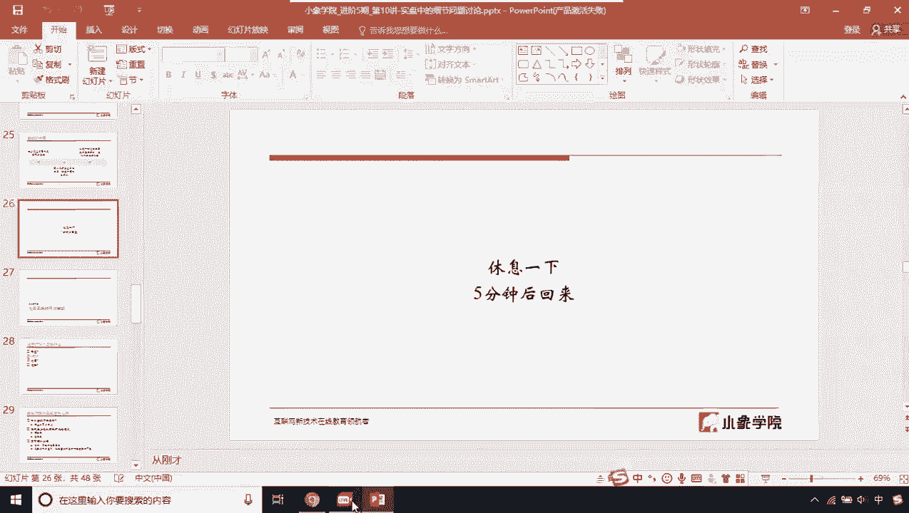

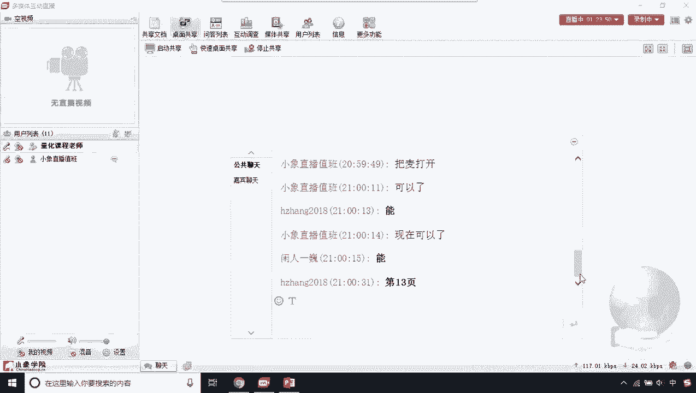

商家里满。

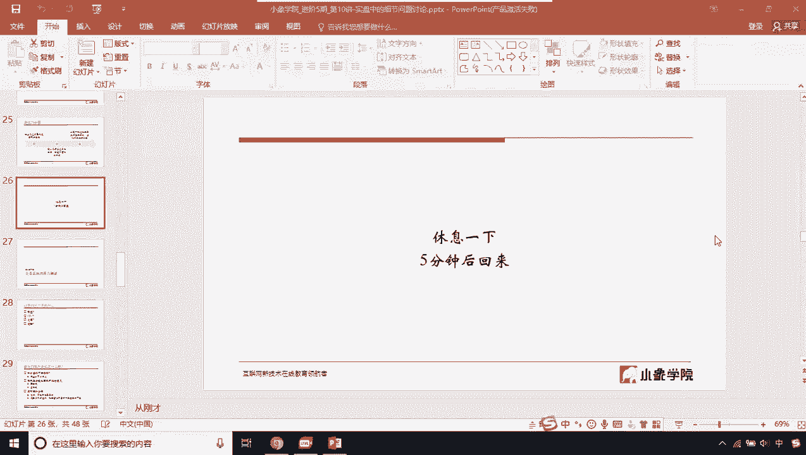

看着落叶飘落，回到家乡的彷徨，保持着习惯的想象。

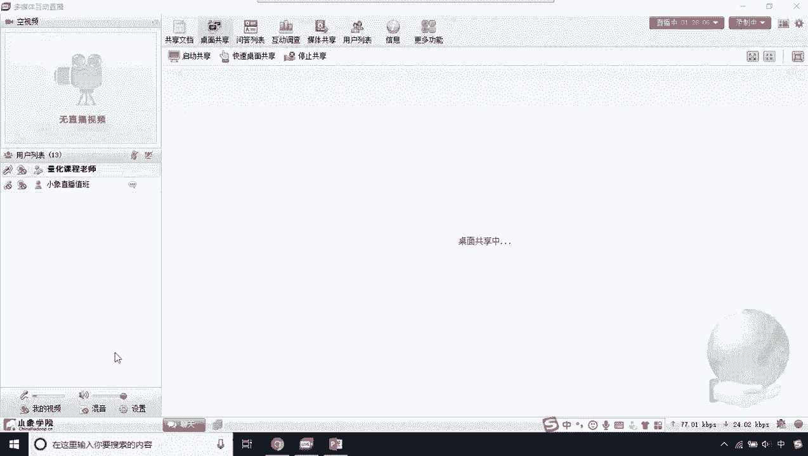

暴风雨来临，那一天，迷途的羔羊还没回来，铁匠铺传来了叮当叮当声，一切没有想象的那么糟，丰盛的酒席已准备好，尊贵的客人却没来到，熟睡的女儿露出笑颜，这一切没有想象的那么糟，想不这一一只美丽的蜻蜓。

却打碎自己心爱的花瓶，燕子飞回了屋檐下的巢，这一切没有想象的那么糟，啊啊哎呀哎哎哎，啊每天都要精心的灌溉兰花，却一天天的纯白清风，送来了杏花香，这一切没有想象的那么糟，要爬上山顶去看风景。

可走到山腰脚一起跑，停下来，在溪边喝一口水，这1000水有想象的那么糟，被刽子手砍下的人头魂魄还能留恋，最后九秒，第七秒时，突然从梦中惊醒，已知一切没有想象的那么糟。

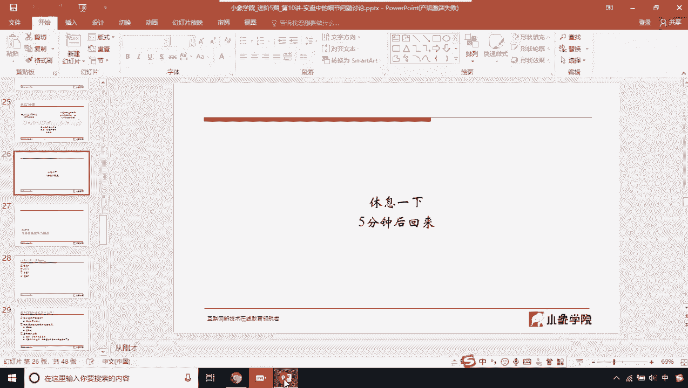

好我们回来啊，呃先看一下大家这个刚才有几个问题啊，一个是这个ATR止损后的这个处理方法啊，因为这个问题呢没有带太多的背景啊，那我就简单的理解成说我们比如说做了一个呃，假设是一个趋势型策略。

比如说海归类似这样的一个趋势型的策略啊，建仓以后，那么比如说有一个初始止损啊，比如说两倍的ATR或者三倍的ATR，也就是建仓之后向不利的方向啊，直接向不利的方向运行了，两倍或者三倍ATR就止损了。

那么这个止损，就是相当于把初始头寸就退出掉了啊，以亏损的这个价位去退出了，这就意味着说这笔交易已经结束了啊，那么我们再继续监测新的信号，新的建仓的信号，那么呃无论如何以后的事情，那就是新的交易了啊。

所以跟这比就没什么关系了，那么还有一种AATR止损，是价格向有利的方向去先去运动，然后呢，再从这个极值点的位置，回撤了若干倍的ATR啊，这也是一种可能性，比如说我们做多啊，那么买入以后。

那么价格上升到比如说我们50块钱买，那么涨到了80块钱，同时呢这个从80块钱是最高价了，那在又回落了十块钱，触发了我们的AATR止损啊，就是从80又回6~70，在这个时候我们出场。

那么也许这个从50~80的过程当中，也许我们已经有了加仓，或者说我们中间从来没有加过仓，这就是初始的头寸，那么在这个时候在止损啊，这个时候叫做回撤止盈，或者叫做跟踪止损，在这种情况下。

我们通常也是把之前所有不管是初始的建仓，还是后来加仓的头寸，都一股脑啊全部都出来了，这是我们最常用的一种方法，这就为什么这么做，是我们认为在这种情况下，趋势已经破了，上升趋势已经结束了啊。

那这个时候我们之前无论是初始的获利的头寸，还是最后一笔加仓的头寸都有，可有可能是亏损的，那我们都一起出来了啊，一起出来，然后之后再有新的信号，那就是又是新的一笔了，一般来讲我们是这么来处理的啊。

然后自己搭建交易平台，有没有实盘接口嗯，有没有办法接实盘，那当然有办法啦，你比如说看你做的什么品种啊，呃像这个商品期货这些品种，它通常走CTP协议，那这个CP协议既不用花钱啊，他是免费的。

而且是也是公开的，任何交易所都支持这件事啊，所有的期货交易所啊，这个都支持这个事，所以呢没有没有任何的问题，那么对于股票来讲稍微复杂一点啊，股票因为在2015年股灾以后。

这个从官方的角度还还是把程序化的接口，大部分都禁掉了，那么我们现在只能通过一些券商提供的，他们的通道去对接，但这个跟是不是你自己搭建的交易平台，也没有太多的关系，因为你自己搭建的平台也可以去对接。

他们的实盘接口啊。

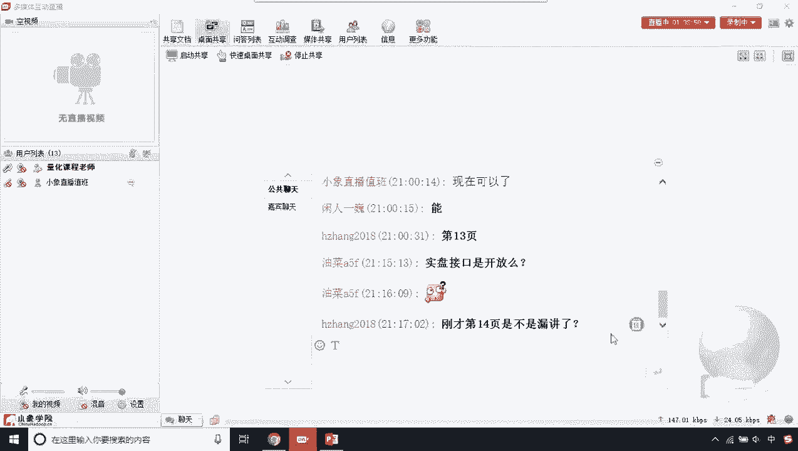

14页有没有漏讲，我看14页是什么啊，啊这个同学还非常细心啊，而且刚才也是提示我们这个风险，这个呃提示我们呃这个音量啊，啊这页我是在可能是在大家嗯听不到的时候，讲到讲过了啊。

那我就再再顺带手的这个再再再说一下嗯，我们通常我们上实盘满满足什么要求。

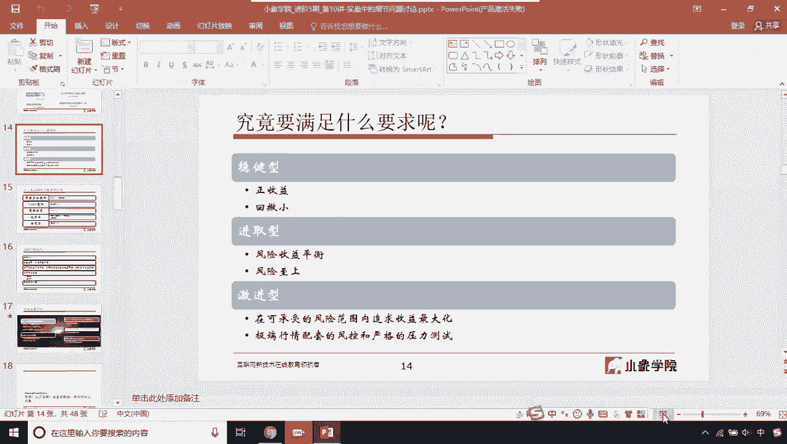

这个其实是跟我们的需求有关系的，呃稳健型的投资者，进取型的投资者，激进型的投资者，他们的需求显然是不一样的啊，作为稳健型投资者，你跑赢了固收产品，唉我就觉得满意了，固收年化五六个点。

你能够做到七八个点甚至十个点啊，这个从收益的角度就够了，但是呢回撤也比较小啊，超过2%的回撤我就受不了，所以在这个时候，我们通常关心的就是你的这个，说白了就是画曲线的能力。

你的你的这个策略要满足这样的性能，你才能上市版啊，那么进取型的这个投资者，他追求这种风险收益的平衡，10%太少了，年化20%到30%，是一个相对合理的水平啊，他认为那么能够承受10%。

甚至15%的最大回撤啊，所以在这种情况下，我们就需要有进行适当的配置啊，可能我在这个时候，我去配一部分固收，配一部分稳健型的策略，然后再配一部分激进的策略啊，比如说加了杠杆的这这样的策略，那么这样的话。

保证回撤也不会超过他这个期望的这个最大的，最大的回撤的这个范围，同时呢还能够搏一搏啊，这个风险啊，搏一搏这个收益，那么对于激进型啊，激进型这个投资者恨不得每年都翻番啊，当然这种情况是很少见的。

但是呢他还是希望啊这个这个收益能够最大化，但这个时候其实我们更加看重的啊，或者说我们在做这样策略的时候，其实更看重的是对于极端行情的风控，所以说我们要做严格的压力测试啊。

压力测试怎么做，一会我会介绍，那我们继续啊，刚才讲到了这个。

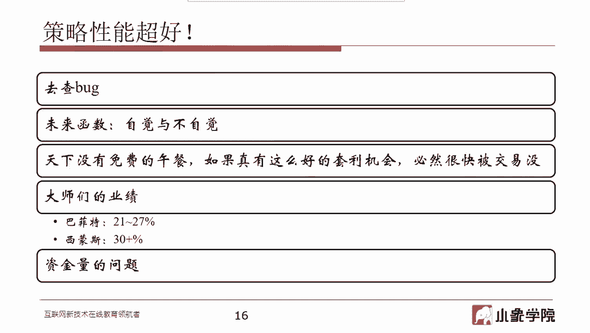

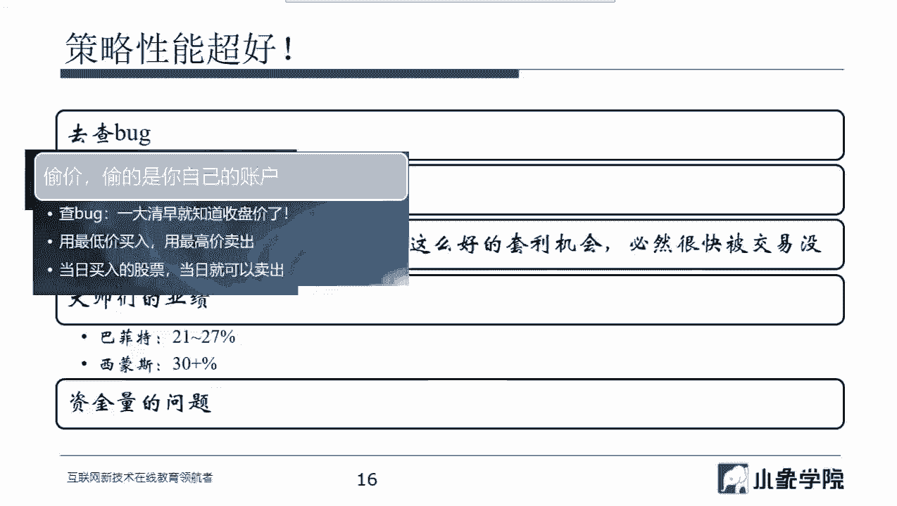

还是这么看吧，这样看着好一点啊，刚一进入到播放状态，可能是这个今天我用的这个电脑，可能内存不够啊，所以刚才播放状态一直出问题，好我们看这个未来函数，刚才提到这个未来函数的问题啊。

呃有有这么几种类型的未来函数，大家需要引起注意，一个偷架这件事我不细讲了啊，这个一大清早就知道收盘价了啊，这就这就是一种典型的未来函数，你能用最低价买最高价卖，这件事也是个未来函数啊，我们做不到。

如果做到了光这一件事，你就已经是世界首富了啊，然后当日买的票当当日就能卖吗，啊这个你利用了一个交易规则的漏洞啊，但实际上这个如果没有底仓的话，你是做不到这一点的，我说的是A股T加一的交易制度。

好收盘价成交的问题，刚才也说过了，那我重点说一下，财务公告类的这个这样的一个未来函数啊，通常是怎么产生的，一般来讲这是由于这个平台的处理啊，就是第三方平台它可能处理的不严谨，举个例子啊。

我们曾经做过一个策略，叫做基金重仓策略，就是其中一个选股条件，就是同时被两家基金公司重仓啊，他这样的股票就能够进到股票池里，那么当时我们做我们只花了20多分钟，我们就做了一个回测。

性能非常好的一个策略啊，下午超过二，这个最大回撤不到5%，年化收益在20%多呃，以我们的经验，这显然是不可能的一件事啊，不可能说这个老天爷送钱，20分钟就给你送这么多，所以必然有问题。

然后我们就检查交易记录，发现啊，这个被基金重仓这件事在我们的交易当中被，被优化了，或者说我们利用了一个什么样的漏洞呢，我们相当于提前平均意义上，提前两三个月就能知道基金重仓这件事，因为这是回测啊。

我们利用了这样的一个未来函数，那怎么用到的呢，啊这不是我们自己的事，这是平台在处理的时候，他会去这个有基金重仓这样的一个指标啊，我们就直接用了，但是我发现他处理的时候忽略了一个问题。

在官方渠道能够知道基金重仓只有两种，只有两种这个方式，第一呢是通过基金公司的季保，第二是通过这个上市公司的低保啊，上市公司会披露十大持仓呃，十大股东，十大流通股东，而基金公司会披露十大持仓股啊。

所以说只有通过他们的季报，我们才能知道这件事，但是季报的发布通常是滞后的，而我们利用的这个第三方平台，在处理这个指标的时候，相当于比如说每年的3月31号，一季报还没发布啊，但是我们在他的这个系统当中。

就已经知道这个基金重仓的情况，所以说相当于我们跟着重仓这只股票的基金，在同时建仓，然后享受了被别人抬轿子的这个乐趣啊，所以这就是一个典型的又非常隐蔽的未来函数，通常是财务类的这种因子，如果处理不好。

经常会发生这样情况，就是你比真正你能够知道这个因子最新的取值，要提前一段时间就已经知道了啊，在回测的时候，然后另外一类从公告里头来的这个未来函数啊，也是简单的说一下，比如说有人做事件驱动型的策略呃。

重大资产重组啊，一遇到这样的问题，我就事先埋伏进去，然后等到他重组成功的时候，通常会拉几个涨停板，那这个时候我再获利啊，这个这个思路是没有问题的，但是在回测的时候啊，一般来讲。

大家知道类似重大资产重组这样的公告，是什么时间发布的吗，一般都是在某一个交易日收盘之后发布，而你在写程序的时候，你只判断了啊，这个发布公告的这个日期是个交易日，然后你就以这个交易日的收盘价去买入了。

但实际当中你做不到，因为发布公告的时候已经收盘了啊，然后在回测当中，这个你就吃到了这个连续几个涨停，但是你要知道，一般发布了这样的公告以后啊，重大资产重组马上就要停牌了，第二天就开始停牌，停牌一两个月。

两三个月，最后复牌的时候哗哗哗几个涨停板，那么你的策略就是享受了复牌之后的，这几个涨停板啊，这种未来函数这个会让你的曲线特别漂亮，但是在实际当中你根本赚不到这样的收益，然后高频交易啊。

这个提前这节课最早的时候，我提了一提高频交易啊，大概大家有个印象，高频交易的成本啊，这个包括他的这个对于价呃，对于利润的这种获取，收益的获取，跟我们传统经典的这种量化策略是不一样的。

包括他的交易成本啊也不一样，所以说这个时候也经常会有一些未来函数啊，但是这个因为我们这个课也没有讲高频交易，具体的这个实现方式，所以这块我就不多说了，大家就知道高频交易当中。

其实利用未来函数的可能性也会非常非常大啊，好那接下来我们再谈一下数据的问题啊，数据问题其实我就是想引起大家的一个重视啊，因为现在每个人根据你自己的这个系统，你自己的这个需求。

包括你自己的交易策略和做的品种，你对数据的要求是不一样的，这个是我的经常收到的一个邮件啊，这个邮件我隐去了他的接收者，那这个邮件没有别的内容啊，标题和这个正文都是说呃。

这交易所的行情已经有几分钟没有更新了，要及时查看处理啊，这是我们经常会遇到的一种情况，就是什么呢，你的数据源出了问题，或者你的接口出了问题啊，或者你自己的服务器啊，行情服务器接收服务器出了问题。

都有可能导致你用于交易的这些数据啊，这个临时中断了，这种情况很可怕啊，很可怕嗯，我们在去年曾经有一个策略啊，这个当时我在盘中去检查交易记录的时候，发现嗯有很多只股票被错误的建仓了。

当天根本就不应该触发交易信号，所以我就我们立刻把这个程序停下来啊，先暂停了这个程序的执行，然后排查排查我们的这个错误，最后发现什么呢，最后发现是当天在开盘前接收到的复权因子啊，3000多只股票当中。

有500多只股票的复权因子是错的，那这个就给我们提出了一个这个这个警告，说明我们的程序啊，其实在处理这个数据报警的问题上，还是不够严谨，你像这个负全因子出错，我们程序没有自动预警。

后来我们就增加了一些判断的，这个增加了很多个类似这样的脚本，每天在接收行情的时候，不光是说行情有没有中断，这中间数据有错漏，我们都会及时去报警啊，对这点非常重要啊，那么数据异常可能的这个原因的排查啊。

一最直接的原因，数据源出问题了，比如说这个在应该在2018年12月份啊，如果做期货的同学当应该还有印象，当时上期所所有品种的这个行情，数据中断了十多分钟啊，有一天这种这个出问题的概率是非常小的。

但是他非常致命啊，因为那天你要去观察很多品种，在这个数据恢复的一刹那，被打成涨停或者跌停啊，那如果你的这个交易策略没有，在你的策略本身没有植入，处理这这种极端情况的，这种小概率事件的这个预案。

没有在这里进行保护，那有可能当时瞬间的一个涨跌停，就把你的这个仓位给打穿了啊，还有一种可能是网络原因啊，可能网断了或者其他的什么情况啊，网络的这个设备的故障，导致了你这个接收不到行情。

或者行情行情有错漏，那这个时候啊，你一个直接想到的原因就是要备份的网络啊，马上切换到另一个网络去，那行情接收处理程序出了问题，这个可能性是最大的，因为这个这种程序一般是你自己写的啊。

所以会有大量的bug，那么这个事没有别的办法，只能是更多的使用更多的测试，还有就是你可能服务器瘫痪了，有可能你用的是云服务器，或者说你只是一台商用的台式机，作为你的这个临时的服务器都是有可能啊。

硬件有可能出问题，也可能是软件的问题，你即便是托管在这个商用的这个数据中心的，这种托管服务器也有可能出问题啊，阿里云也瘫痪过啊，腾讯云也瘫痪过，所以呢灾备啊就是有各种这个这个灾备的手段。

这是你在技术上需要去解决的，另外有一些就是不可忍受的一些延迟，这是什么意思呢，比如说假设你你的一个策略啊，最近大家老老是提这个北向资金，北向资金好像北向资金是万能的啊，他们无所不能嗯，就像先知一样。

北上资金大幅流入股市就涨，北上资金大幅流出股市就跌啊，我们先不说北上资金到底有没有这么神奇，假设你有一个程序，你有一个交易策略，用到了北向资金的瞬时流入流出的情况。

那么这个时候呢你可能就要去监测这个数据了，但通常一些公开的数据源啊，这个你只能通过网爬取网页，或者其这这样的方式去获得这个数据，但是你知道一旦是这个爬的这个数据，它可能就会有一定的延迟。

而且这个延迟不太可控啊，这个因为网页的刷新速率和，或者说你的这个更新速率，有时候不太可控，所以这个时候呢，你的这个数据是不是足够及时啊，那可能会影响你的最终的交易的效果，所以说在这种情况下啊。

有些时候成本是必要的，甚至呢对于比如说一些配对类型的策略，这个数据时间戳能不能对齐也是非常重要的啊，如果两个品种的时间戳不齐，那你出来的这个策略执行的过程当中，一定是有问题的，好讲完了数据。

我们再看看实盘的交易接口，什么叫结构啊，它和模拟盘还是有区别的，区别在什么地方呢，比如说成交的时机，模拟盘通常通常对延迟没有，那么敏感啊，包括像华点，包括像这个报单撤单啊这样的处理。

这个在模拟盘上有时候不是特别严格，或者说他模拟模拟的这个模拟盘，有些时候跑在这种模拟模拟行情的，这这这个服务器上，它可能它的这个流动性本身也不好啊，所以说它和实盘呃，存在的这个差异是不能忽略的。

而且在实盘当中，我们必须处理的一个就是部分成交的问题，因为有时候有的时候你的挂单量比较大的时候，你就有可能是部分成交啊，那么在模拟盘有时候我们就忽略了这个问题了，而冲击成本。

这是实盘当中我们遇到的一个更大的问题，模拟盘你是很难造成一个冲击成本的，基本上我们就就是相当于旁录了一个，实盘的一个数据啊，但是这个实盘的这个成你的成交挂单量比较大，你就会产生比较大的冲击成本。

另外还有一些像涨跌停啊，交易状态的这个及时性的这个检测，都会造成实盘和模拟盘啊都有有区别，所以在这个时候，我们就需要看我们采用的是哪些程序化的，这个途径来做实盘的交易，你有可能用一些本地的图表类的工具。

比如像金字塔呀，MC啊，tb那在这个时候啊，一个是要考虑它的性能，另外一个就是说你所对接的券商，或者这个交这个这个呃期货公司啊，他们所提供的接口是不是稳定，他们的延迟是什么样的，柜台延迟是什么样的。

然后跟你的这个本地的这个软件啊，所对接的是不是足够可靠啊，这个需要大量的测试，那么如果你采用云端的这个教育系统，比如说我们在课上用到的一创聚宽啊，那么也是同样的一个道理，就是你需要看这个券商定制版。

它最终啊这个在程序化实盘的过程当中，它的这个性能到底能不能满足你的交易需求，特别是有的时候啊，我们会发现这个不同的交易所啊，不同的交易所包括不同的期货公司，券商它给你提供的这个实时的行情数据。

可能都有质量上的差别啊，啊同样道理啊，这个我就不一一举例了，你你你用的万德或者东台的choice，或者接近量化，或者你自己用VNPY啊，这个这种开源的框架来搭建的自己的交易系统，这些都会涉及到实盘接口。

程序化的实盘接口啊，嗯包括这个常用的这些像CDP这样的协议，那么我们都需要啊，这个没有没有什么偷懒的办法，只能是大量的测试，而且这种测试是是一直要持续下去的，你昨天测的好好的，今天可能还会出问题。

这个问题可能还不在你你自己的程序身上，可能就在于它这个接口不稳定，或者说给你提供的提供数据的这家券商，或者这个期货公司，它本身他们的技术不过硬，那造成的一些问题，那我们都要测试什么呢。

首先啊我们通过策略触发的买卖信号，这个能不能送达实盘交易接口，完成一个触发一个下单指令，也就是说你的程序到底你检测到了信号以后，比如说你要做多啊，某一个品种，那么比如说我们说螺纹钢做多一手啊。

在什么价格开仓，那么这个指令到底有没有送过去啊，你这个时候你可以在行情软件上啊，在你的这个交易软件上啊，登录你的账户，你可以去看一下这个指令，到底有没有被交易所接收到啊。

那么执行过程是不是能够及时被获取，也就是说你报了单了，到底那边接收到了，然后成交回报是什么样，是成了是成交全部成交还是部分成交，还是指令错误被拒绝了啊等等，这些情况你都需要及时的能够获取啊。

你的程序要及时能够接收到这样的这个，成交回报，然后这些执行的结果能不能准确的去维护你的，最后你的这个交易账户他的状态，因为这个状态决定了你下一个动作，能不能正确的执行，能能不能正确的触发啊。

然后这里头一个最大的一个问题啊，就是在技术上的问题，是说这个执行的过程它是异步的，它不是同步的，所以说对你的这个程序啊，能不能处理好这些异步的这些消息，这是一个比较大的一个考验啊。

那为什么我要花时间来解释这件事呢，是因为我们有时候想象量化啊，这个程序自动运行，那喝着咖啡数着钱啊，这是多多多多美的一件事啊，但实际上这里头细节实在太多了，每一步都有可能让你亏钱啊。

每一步都有可能有意外，所以在这个时候就是你的程序写的好不好呃，执行的到位不到位，这也是一个非常重要的一个一个因素，所以呢测试的步骤啊，首先是程序化交易，指令是不是执行的正确，如果这些没问题啊。

那么我们我们先最小化单笔交易的资金量啊，不要一上来就按照，比如说我这个我这个策略，能够理论上能够支撑1000万的资金，而且我确实我准备用1000万的资金去做，那我也不是不能。

一上来就用1000万的资金去跑实盘啊，我们先按照最小化的单笔交易的资金量来用，进行一个全策略的，我们叫做高保真测试啊，也就是说模拟盘已经跑的没有问题了，测不出新的问题了。

那么我们用一个最小资金来进行实盘验证，如果这些都没有问题了，再以这个策略制既定的开仓量啊，这个来去跑实盘，但是呢我们也要完整的实盘运行的监监监控，特别是要记录所有的这种中间执行的状态呃。

还要经常的去复盘啊，好那么交易系统的压力测试，为什么要做压力测试啊，刚才也说了，对于这个激进型的策略特别要做压力测试啊，就是高风险高收益的策略，这个压力测试太重要了，那么压力指的是什么呢，是是网络带宽。

是CPU的这个功耗还是CPU的使用率，内存还是什么啊，其实都不是啊，主要是指对风险的这个测试，压力测试，我们压力测试其实就是在测试最坏的情况下，你能不能活下来，什么叫最坏的情况啊。

我们都知道我以CCTA策略为例啊，CCTA新鲜策略通常来讲我们会配置多多品种，而且是这些品种可能是在平时，它们相关性都很差啊，我螺纹钢要配大豆，配配白糖，配橡胶啊，这不同的板块啊。

这个但是有的时候啊平时他们毫不相关，但是遇到极端情况啊，大家都会同朝同一个方向去运行，比如说遇到特别极端的情况，像战争啊，或者说这个呃这个比如说像脱欧啊，或者有一个什么什么嗯，总之吧那贸易战啊。

类似这样的问题可能会导致多品种啊，瞬间朝同一个方向去运行，那么平时不相关风险可以对冲，可以分散化，但是突然一下风险集中爆发啊，在这种情况下，你会不会爆仓啊，会不会穿仓啊，这是一个最最核心的问题。

就是你能不能活下来，所以在这个直接落实到执行层面，就是你隔夜头寸啊，你分配的合理不合理，如果如果这个头寸过重，就有在极端情况下穿仓的风险，你能承受的最大回撤和绝对损失，这个要设置预警线和清盘线啊。

另外对于不可预知的雷，提前要有要有打算，我们之前我们也踩过中兴的雷啊，乐视和长城生物压根就进不了我们的股票池，这个就不说了，这个中兴的雷我们确实踩了哈，但是中兴即便在去年年初贸易战的那个时候，额。

几乎应该我印象当中是六个还是七个跌停板啊，但是对我们整个产品的净值，也没有造成太大影响，大概回撤了，他对我们回撤的贡献可能也就不到1%吧，啊为什么这样，是因为我们之前的风控体系。

就已经对任何单只股票的极端情况，我们都做了充分的这个预案了啊，就单只股票发生这种极端情况，六七个跌停板对我们不会有什么影响啊，所以说最重要的是在最坏的情况下，到底能不能活下来。

取决于你对风险的这个压力测试啊，怎么压力测试，就是说你假设单品种都发生了最大的，最坏的情况，那么在这种情况下，你的最大损失是多少，你能不能受得了啊，要不要要不要去及时有有一些这个资金调配，要不要补仓啊。

这些都是你的预案要解决的问题，然后我们再说下一个问题啊，自动运行的交易策略什么时候需要人工来干预，需要人工干预吗，很多人觉得不需要人工干预啊，但实际上必须有人工干预，为什么，因为程序也是人写的。

只要是人就会犯错啊，光大乌龙指，其实就是一个下单程序的这个出的错啊，所以瞬间交易了多少组啊，十几组每组70个亿啊，大概就是这么一个情况，那人工干预在什么情况下需要去干预啊，第一极端行情下需要去干预。

发生了股灾，发生了某一个板块，甚至说某某一个，这个这个甚至某一个版面的这种崩盘啊，或者有些黑天鹅的事件，这些都是在你的量化策略的回测当中，测不出来的东西，所以在这种情况下，人就起作用了。

我们只要制定相应的干预的预案，在遇到这种情况下，到底是拔插头还是只是关这个呃，关闭程序啊，这些都是需要提前做好准备的，然后有的时候外盘的剧烈波动，有可能影响我们的内盘对吧，在这种情况下。

你当然也也会有预蛋，然后重大的政策消息的发布，可能也都会造成这个盘面的预想不到的波动，那还有一种情况啊，是你的这个交易动作和你预期的动作不符合，比如说该出的信号没出，不该出的信号出了啊。

像我刚才举的这个例子，不该出的信号出了是因为复权因子接收错了啊，价格错了，那在或者说你像比如说下单或者重复下单啊，下单错了或者重复下单，可能是程序的bug造成的，在这种情况下，预期的动作不相符啊。

那也需要及时的人工干预，至少先把策略停下来，然后再诊断原因啊，还有一些人工干预的情况，比如说像执行环境的异常啊，网络中断了，CPU占用过高，内存占用过高，交易接口断了啊，数据错了。

这些情况下也是需要这个先把策略停下来，然后再来看怎么去处理，那一个策略什么时候启动，什么时候停止呢，这个东西没有答案，没有标准答案，但是呢你要做预案啊，你要一定要把这些问题都都做成预案。

你一个策略可能涉及到的关键要素，你都需要有相应的预案，然后包括我们从风控的角度来讲，我们需要有超仓超单的这些限制，提前就把这些限制做到你的程序当中了啊，包括敞口同一时间最大敞口的这个限制。

持仓比例的监控啊，净值风控就是净值回撤到一定程度，甚至跌破预警线了啊，这个时候怎么办，软件系统需要有一个系统的呃，这个控制的一个流程，说我改了参数了，然后我改了几行代码了，然后我连测试都不测。

模拟盘都不不去跑，直接实盘就就接着就上了，这这个风险也是非常高的啊，那隔夜仓进入时间警戒线，清盘线，这些都是在风控的过程当中需要遇到的问题啊，从字面上来讲，基本上大家也能理解。

所谓隔夜仓进入时间就是你的最大隔夜头寸啊，是是多少，那么比如说在2。45，就进入到我们隔夜舱的这个进入时间，我们就要监控我们事先我们划定的这个超仓，超单的这些限制，场口限制是不是被执行了啊。

那人工执行和程序化执行，这个这个之间是怎么怎么来协调他们的关系呢，一般来讲我们有个经验啊，如果你真的进入到清盘程序的处置的时候，比如说达到了预警线了啊，这个时候我们一般来讲会把程序停掉。

采用人工处理的方式啊，但日常的像这个超仓超单呀，这些我们在程序中的当中，就已经把这些因素植入进去了，所以程序就自动去执行了，但是像进入到清盘程序的时候，我们通常是人工的去执行，因为在这种特殊情况下。

人工还是比机器处置的要更，应该说有经验的交易员，要比机器处置的会更好啊，那关于一些这个这个商品，期货品种的这个实盘啊，呃可能你还会遇到一些在回测当中，你不太遇到的问题，比如说移仓换月的问题。

在回测当中你可能没有重点去处理啊，那么我们一种一个经验啊，就是说你在回撤的时候，你可以用指数合约去进行回测，或者用主力连续合约再做回测，但是呢在实际实盘的执行过程过程当中，你还是信号。

是靠这个主力连续合约或者指数合约去触发，但是呢你把它映射到当前所要所要交易的，这个合约上，比如说当月合约或者说主力合约上啊，这是我们通常实盘所处理的这个一种方式啊，这是给大家分享一个小tip啊。

一个经验好，最后再说一下这个预案啊，预案其实我们解决的就是最坏的情况，能不能挺得过去，这个原理也不多说了，然后给一个风控预警的，三级风控预警的一个实例啊，这个其实这也是我们其中我们曾经有一支产品。

就是采用了这样的一个制度，这个每一句话我也不详细的去解释了啊，因为时间关系，我们马上到时间了啊，这个我还想稍微留点时间回答一下大家的问题，那么呃其实没多少字啊，就可能加起来也不到200个字。

但是这200个字这个非常值钱，大家自己的量化策略也好，你去做主观交易也好，如果这里头的每一个字你都能执行到位啊，就是说你对于这种风控预警，你都能够这种机制执行到位，你就你至少不会死。

我不能不能保证你赚钱，但是你可以永远活在这个二级金融市场上啊，那没准有一天运气好，你就赚了钱了，但如果说你这些做不到，那没准儿哪一天遇到一个特殊的啊，意想不到的情况，可能就死掉了啊。

所以这个我建议大家课后还是好好去看一看啊，甚至把它贯彻到你的交易策略执行过程当中好，最后啊我们在上升到一个哲学层面啊，你所必须回答的问题，就是你的交易目标到底是不是明确的，那么只有当这个目标明确的时候。

你才能有可能做好，交易系统运行的一个心理准备，因为一个大量存在的误区，就是我们经常也遇到这种情况啊，包括我们前一段时间还跟另外一只基金，在交流的时候，他们的那这支基金的这个量化基金的负责人啊。

就是说这个怎么调越调越有问题啊，心态就崩了啊，本来这个策略其实运行的好好的啊，就是因为有一个月没有跑赢大盘，感觉到有压力了，然后就开始这个不断的去调参数啊，结果越调越崩，越调越崩啊。

就是本来只是跑输一点，最后跑到亏钱了啊，而且还越亏越多，所以说很很多情况下你的系统一点毛病没有，你只是当下运气稍微差了点，或者说你的系统可能有很严重的问题，只是最近运气好，把这个问题给掩盖了啊。

我们做交易99%都是这两种情况，而你靠你的这个策略逻辑稳定的运行，稳定的去获取你这个能够预期的这些收益，在这种情况其实非常少啊，即便是专业的团队也很少见啊，那怎么办呢，你只要记住这么几个关键的原则哈。

量化系统就是你心里的一个缩影，你交易的是你的观点，你交易的是你的人性啊，你只有内心足够强大，你才能够有能力，支撑起一个相对稳定的交易系统，嗯即便是量化交易系统啊，也需要有足够强大的人性去支撑。

也是需要有这个正确的交易观点去支撑啊，不能叫正确的交易观点，是合适的交易观点啊，而且没有哪个系统能够一成不变的去赚钱，也没有哪个方法能够能够处置好所有的问题啊，那么怎么办呢，其实量化就是你的工具啊。

就是你工具再好，你你也得能驾驭它，所以我们最后提提出的这个方法论啊，其实就是说你掌握了系统性的方法，你有一个趁手的工具嗯，不管是第三方工具，还是自己去开发一个量化交易平台啊，有了这些。

你还要有刻意的去训练，刻意的训练是什么呢，刻意的训练就是把这些交易的要素，包括这些风控的原则，能够一个字不差的真正执行，把它把它在你的交易过程当中都给执行出来啊。

其实最最后说这点好像大家可能觉得有点虚啊，但如果有朝一日你们真的是以交易为生，或者说真的严肃的去做实盘，那你可能回想起汪老师曾经讲过这么一堂课，讲了很多跟人性相关的啊，量化的观点啊。

也许对你们今后的交易会有所帮助啊，那现在呢，可能最多也就是给大家先提出一个预警啊，你以后可能会遇到类似这样的问题，这节课呢没有什么这个具体的，需要写代码的作业，但是呢我希望大家回到起点想一想。

你为什么要去做量化啊，然后再进一步的想想你的投资目标是什么，你做什么能够帮助你实现这样一个目标，所以最后我们的总结啊，以交易为生嘛，那他是路漫漫其修远兮啊，但是呢只要你上下求索。

终有一天你可能能达到彼岸，我们也希望你通过自己勤奋的学习啊，这个努力的实践，能够帮助你早日实现你的交易目标，然后最后说两个呃小事情，一个呢是说大家如果要想做这个实盘的，股票的量化啊，量化交易。

因为现在能够支持这种接口的，毕竟还还在少数啊，当然也越来越多的券商在开放这样的接口，因为我们课上曾经介绍过巨宽，那么一创聚宽呢，它本身是巨宽，在一创证券的一个这个呃独立的部署啊，它支持程序化实盘交易。

所以呢大家也可以，如果你真想做的话，也不妨啊可以去尝试一下，这个至少是我们曾经验证过的啊，在目前来讲，做股票量化这个经典的股票量化交易呃，这个接口是够用的啊，还是相对比较好用的。

那么如果大家这个想做一些这个嗯，拿到更更更好的一些资费啊，也可以去联系牛小蜜的这个微信啊，我们你要在这个一创证券开户以后，我们可以帮助你去这个申请到更更好的，这个费率啊。

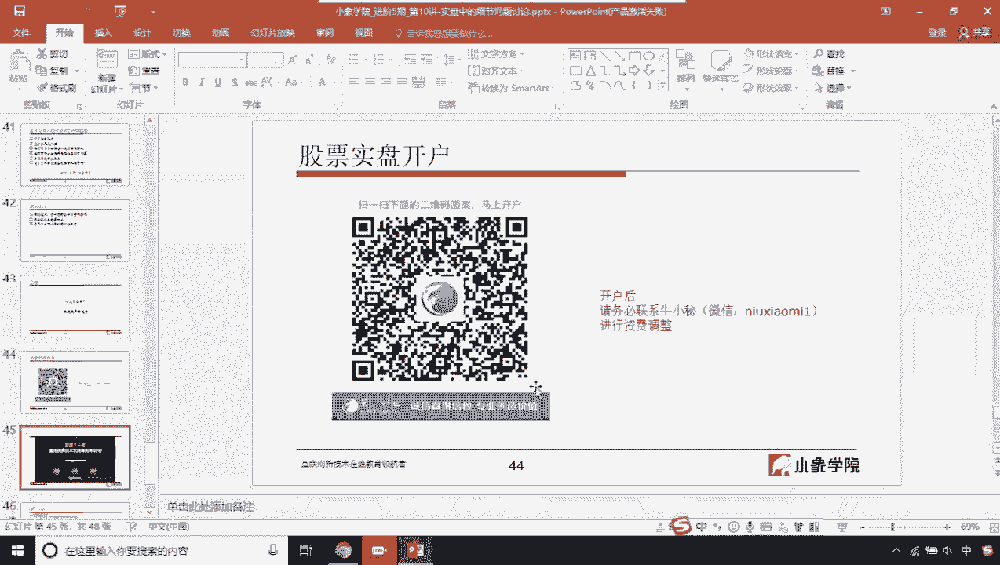

啊这个就不多说了，有做广告的嫌疑，然后另外一个呢是我们这个进阶课啊，总共十讲，今天讲完了，如果大家对于特别是从实战量化这个技术出发，想更多的了解实盘当中的很多的这个细节啊，去切磋啊。

去了解更多的这个量化交易经典，量化交易的这个逻辑的来源，思路拓展你的思路，也能结识更多的这个量化爱好者，包括量化的同行啊，去拓展你的眼界，那么不妨啊可以关注一下，由濮阳学院。

包括跟小学学院一块儿来这个呃这个协作的啊，就这么一个量化投资技术实战案例特训班，这是一个线下的课程啊，呃一个周末两天的时间啊，那么我们这个周末啊，刚刚过去的这个周末，昨天和前天刚办完了第11期啊。

马上进入到第12期啊，大概率是下个月啊，所以如果对这方面有进一步深造啊，进一步这个渴求啊，甚至我说说个玩笑话，想见见汪老师啊，这个宋老师他们的真身啊，呃不妨去关注一下啊。

这个这方面的消息在小象学院也会呃，适时发布这样的消息啊，开课时间地点敬请期待啊。

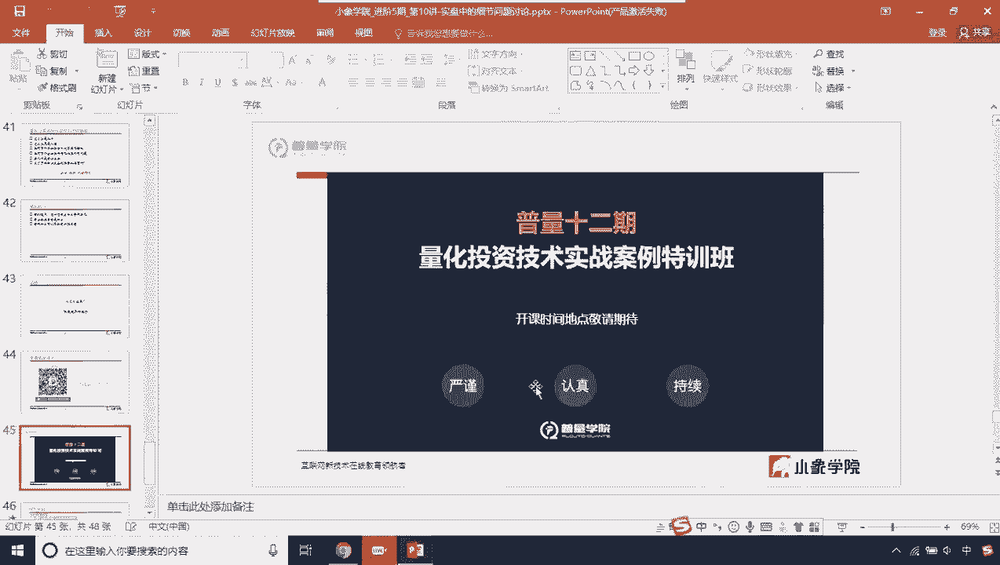

大概率是下个月，好那么今天的规定内容就讲到这了。

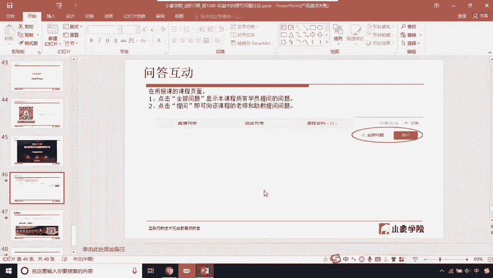

我们看看大家有什么问题啊，唉这个问题问的挺好的，说如果突然发现错误，停掉策略后没卖掉的股票怎么处理，一般是手工去卖啊，所以说这个做量化交易，其实也是要求，你有一定的这个主观交易的能力的啊。

一般是我们手工去卖，或者再写一个单独的脚本去卖啊，刚才说的测试，其实我已经在课上已经说了啊，首先你模拟盘你必须测试，因为模拟盘会测出很多，在回测当中测不到的分支啊，那模拟盘通过了以后。

那么才是少量资金的实盘测试啊，也不要一上来就用全全部资金去跑啊，这也是风险很高的，不同类型的策略同时运行，这个是比如说你在做CTA的这个时候呃，有一种方式就是多品种，多策略，多周期啊，三多三多原理。

这样能够做足够的分散化嗯，嗯一般来讲啊，这个取决于你的这个嗯交易的目标，以及你的风险收益的这个偏好，和你擅长什么样的策略啊，也不是说，必须把不同类型的策略结合在一起来使用。

我们经常也会用这个单单策略来跑啊，上海多久开线下课啊，这个这个问题现在我也不太好回答，总之呢我们在北京上海深圳啊，都曾经开过线下课啊，这个呃有有可能下一期就在上海开啊，但现在还不完全确定呃。

如果你这个关注这方面的信息啊，你可以一个是在这个小象学院可以去关注，还有一个是这个可以关注我的一个公众号啊，叫做疯牛秘籍啊，疯疯牛的疯疯牛的牛啊，这个秘籍就是那个武林秘笈那两个字啊，疯牛秘籍。

这是我这个业余时间随便写一写啊，这个呃嗯有的时候发表一下，我对这个行情的一些主观的判断啊，呃这个上面会呃这个一旦我们有线下的课程，会在这个上面去这个发布相应的信息，大家如果感兴趣的话，可以关注一下啊。

好了那看好像也没有更多的问题，那么我们今天的课呢就到这儿了，这个能坚持到最后啊，确实是值得敬佩啊，我为大家这种学习的精神啊，由衷的表示敬意，我也希望呢未来啊，大家在这个量化的这个道路上能够越走越远啊。

这个走的场景有耐力，那么总有一天啊能够实现你的目标，我也希望在这个在这个道路当中啊，我们能够经常有呃互相学习，互相交流，互相切磋的这个机会，我祝大家这个学习顺利啊。

这个量化交易这个取得这个突破性的进展啊，那以后我们有机会再见啊，谢谢大家。

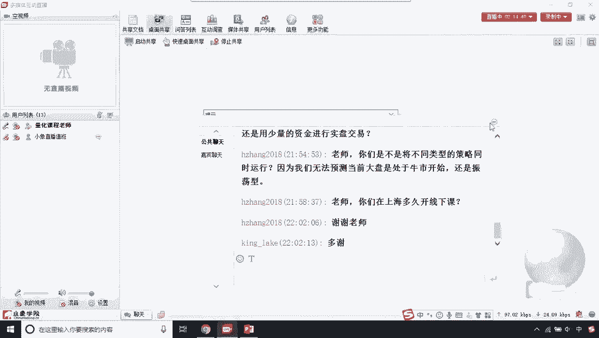