# 清华大学讲师团，量化交易实战，迭代式的量化策略研发 - P4：第四讲_趋势型策略的设计与实现 - 反方向的Bug - BV1Bs6MYFERQ

那么今天呢，已经是我们这个进阶课的第四节课了，那么前面三次课呢啊，我们前面是给大家做了一些铺垫，给大家介绍了啊，一些啊关于量化交易的一些原理啊，还有一些这个背景的知识啊，尤其是在第二节课呢。

我们重点给大家讲了一些技术指标啊，就是教大家怎么从量化的这个角度啊，去认识这些传统的这个技术指标啊，然后呢我们还通过码代码的形式啊，教大家呢如何去实现这些技术指标，那这些技术指标呢它们之间的一些关系啊。

也是我们在第二次课啊重点讲过的啊，尤其这个MACD啊，这个背离的检测，包括这个顶背离，底背离，那么这节课呢啊我们就会用到这些指标啊，作为我们的这个买卖的信号，那么第三节课呢给大家讲的就是说啊。

我们这个股票池的这个逻辑啊，也就是说怎么去选股啊，那么这节课我们主要讲什么呢，啊就说我们前面有了信号啊，有了股票池，我们就开始啊尝试着去开发一个啊，教大家开发一个典型的这个量化策略。

那么前面如果说大家对于前几次课的内容，如果还没有搞清楚，或者说呢啊还有一些问题，那么呢咱们可以在这个课后啊，就我们在我们这个小巷的这个呃，呃问答这个区里面去提问题啊，我们再来帮帮大家呢去解决好。

我们接下来看看就是如何开发一个，典型的量化策略，我们看看从什么地方做起，那么我认为呢就是在当前这些主流的这个策略，逻辑当中啊，啊目前其实还是这个趋势型的这个策略呢，我们用的呢比较相对来说多一些。

或者说呢在有的这个情况下啊，趋势型的策略呢帮我们赚钱赚的更好，那么从量化啊，就从量化策略开发的这个角度，那么趋势型策略呢，也是所有我们说也是所有这个啊，类型策略的一个基础啊。

所以呢我们今天呢就要花一些时间啊，相对比较全面的给大家介绍一下，那么一个趋势性策略，它的开发的过程，好，那么今天这节课呢我们主要分成这个四块内容，首先呢是趋势型策略的这个原理啊。

以及这个股票持入机制的啊这个设计，那这一步呢啊其实就是呃想告诉大家啊，我们怎么去做一个趋势型策略的啊，这个股票池的筛选啊，接下来呢是这个啊，趋势型择时信号的设计方法和编程实现，那么我们这节课呢啊。

主要是以这个股票型的策略来给大家去做讲解，那我解释一下，为什么我们要做这个，要给大家讲这个股票型的策略啊，毕竟说这个啊股票呃就是做股票这件事啊，啊我们嗯这个呢是可以不加杠杆的。

那不加杠杆呢可能就意味着说啊，我们在这个市场上呢，可能会存活的相对来说更久一些，那如果说啊我一上来呢，直接呢就讲一些这个带杠杆品种的，这个趋势性策略啊，大家呢万一做的过程中，这个分矿啊。

就是风控没做好啊，可能还没等到赚钱啊，就先爆仓了，所以呢我们这里呢还是相对比较稳妥的啊，就是用这个股票型的这种策略啊，来给大家呢去做讲解，啊并且呢我们说这个股票型的策略呢，它还有一个好处啊。

就是说这个股票啊虽然小，但是呢它其实呢内容呢也很丰富，所以说咱们看这个杠杆的这个品种啊，看起来呢它似乎呢更复杂更复杂一些，那实际上呢它的原理呢啊，相对来说呢更简单一些，并且它的品种也更少。

那我们说股票呢，首先我们要考虑怎么去选股是吧，然后还要考虑怎么去设计信号系统啊，所以说呢这个股票上的这个程序化啊，股票上的量化，我们说它的难度啊，往往呢比做这个期货啊，尤其是像做外汇啊这种品种。

从量化的这个角度来说啊，就是说相对来说呢更难设计啊，考察的这个能力呢也更加全面啊，所以我们一般也是啊，就是用这种股票型的这种量化策略的例子啊，来给大家呢去做讲解，那么第三部分呢。

我们重点呢来写一个这个趋势性的策略，就我们把这个股票池，还有这个信号系统，哎我们把它融合在一起，我们看看呢这样的一个策略啊，他的一个具体的这个工作的机制是什么样的好。

最后呢也就是我们这节课的最后一部分啊，我们来探讨一下，就是一个趋势性的策略啊，他怎么去优化，我们呢今天呢先探讨一下这个思路，那么具体的解决方案呢，我们会在随后的这个课程里面，啊，啊。

这个刘老师呢可能会给大家呢做更详细的分解，好这是今天的呢主要内容，那在开始今天的主要内容之前呢，我们先来复习一下，就是说一个趋势型的策略呃，趋势型策略的它的原理，还有这个股票池机制的设计。

我们今天的目标呢是要把这些东西都用起来啊，所以呢我们呢先来回顾一下啊。

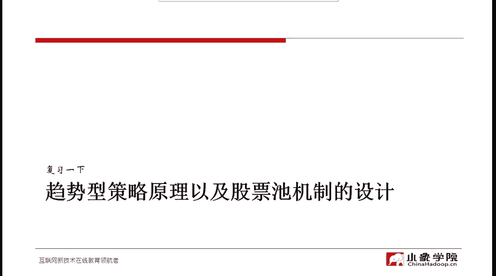

我们先看看一个趋势性策略的原理啊，那么我先给大家解释一下，就是说为什么呢，我这次课呢要以这个趋势型这个策略为例子啊，给大家来介绍这个量化策略的开发啊，我们常见的这个交易策略啊，我在这个图上啊。

给大家都列出来有这么三种啊，分别是这个趋势跟踪啊，或者说趋势跟随，还有高抛低吸啊，以及这个横盘突破，我们先看看这个趋势跟踪啊，这个是那么这种类型的策略，我们说你如果抓到了他的这个趋势啊。

就这么那么你吃的这个利润啊，我们看啊，这还是相当可观的啊，这一部分啊就沿着这条直线向上好，接下来呢是这个我们说这个高抛低吸的策略，那这种呢也是我们常说的这个，他总是我们说它呢总是在这一个箱体啊。

这个上沿箱体的上沿，箱体的下沿，我们总是呢在这种震荡的这个区间呢，我们去寻找这个机会，那是所以我们说这个高抛低吸呢啊，其实呢我们呢他就是一个这个，均值回复类型的啊，这种震荡类型的策略，那这种策略呢。

我们说呢，它实际上呢他抓的呢就是这么一个震荡的这，么个区间，那基本上呢这个你获利呢也是也相对来说呢，比较有限啊，没有这个趋势呃，新策略啊这么大，所以说呢一般来讲呢，这种高抛低吸这种类型的这种策略呢。

他拼的呢就是这个胜率啊，拼的是啊咱们抓住这种机会的这种准确性，那么趋势型的策略啊，他拼的是什么呢啊就这种趋势性的策略，他拼的是说哎我们能不能抓到这个趋势，那么要抓到这个趋势呢。

就意味着呢我们可能要付出一些代价啊，那这代价是什么呢，就是说我们可能会频繁的入场啊，我们去试探，但是呢说我们不见得这个每次进场呢，我们都能抓到这样一个趋势，所以说这个趋势型的策略呢，他拼的呢它不是胜率。

它而是赔率，那么我们只要做对了这么一次啊，我们能赚回来，我们前面做错嗯，嗯那些次数所亏的钱，哎这就够了啊，所以呢这是这个趋势型策略呢，它的一个主要的一个特点，当然我们说结合这两者，还有一种策略。

我们说叫横盘突破，那么在一个我们说在一个箱体的这个区间啊，这个价格它的完成了一个突破以后呢，哎有的时候呢我们就认为说哎这种突破呢，它打破了过去这种均衡啊，就这种震荡的一个态势。

那么很有可能说他会开启一个这个新的趋势，所以说呢有的时候呢，哎我们也会去做这种横盘突破，那么还有更多的这种策略类型啊，啊无外乎呢就是这几种啊，这几大类啊策略当中的一些组合，或者说是呢一些变种，所以呢。

我们通常我们先掌握这种趋势型策略的逻辑啊，还有他这个量化实现的这些方法之后，我们再去做这种高抛低吸啊，或者是横盘突破也好啊，基本上呢是万变不离其宗啊，就从我们是说从这个思考的逻辑啊。

以及这个实现的手段上啊，从这个角度来说的啊，是他们是大同小异的，那么我们这节课呢，就是以这个趋势型策略的例子啊，给大家呢来介绍这个啊量化策略的开发，那么趋势的形成呢它跟哪些因素有关呢。

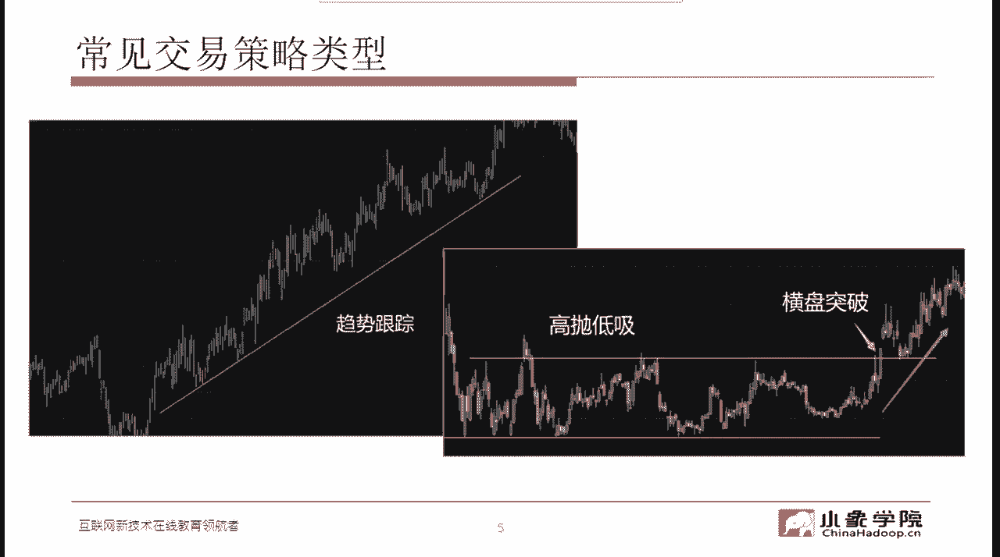

嗯通常来说呢呃对于趋势的形成啊，我们主要考察这三个关系啊，第一个呢是这个供需关系啊，接下来是这个因果关系啊，最后就是这个努力与结果啊，这三个关系呢啊，在第一次课中呢也给大家详细介绍过啊。

我这里呢就简单的再再再总结一下啊，通常呢就是说我们说这个供需关系啊，我们决定了它有没有可能形成趋势，那么因果关系呢，它反映的是说在这个趋势之前哎，他准备的充分不充分，准备的越充分。

我们说这个趋势可能延续的这种力度啊，和时间啊都可能会越长，嗯我们常言道这个横横有多长对吧，这个竖有可能就有多高啊，那么努力与结果呢，通常呢我们用来判断一个趋势啊，它是不是呢可能要结束了啊。

尤其是在这个上涨的这个过程中啊，是不是说这个上涨马上要结束了啊，就这个大家这个这个热情啊，就是这个盛宴要结束了，马上就到达了这个曲终人散的这个地步了啊，主要是衡量的是这个那么努力，他是带来了相应的结果。

还是说努力了，但没有带来结果啊，好这就是我们看这个趋势啊，通常我们要考察的三个关系。

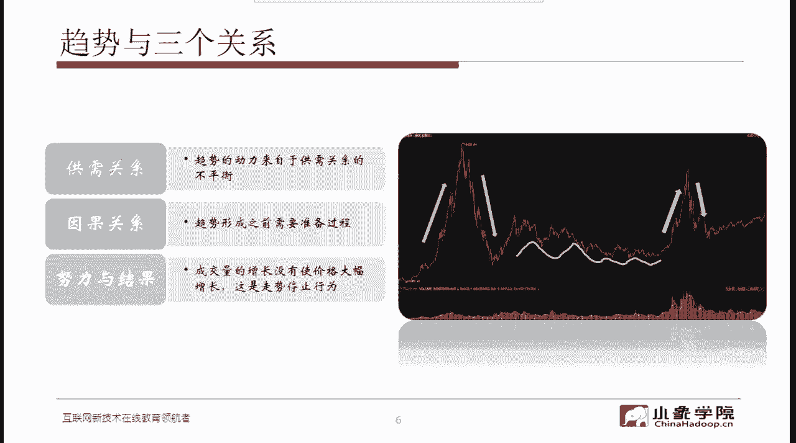

那么我们再看看我们要做什么级别下的趋势啊，那么什么级别下的趋势呢，它是适合我们去做量化的呢，啊我们看这张图啊，这个呢是上证的这个呃周线图啊，我们这里呢只能看到这个收盘价啊，这就就是这个这条红线啊。

就是收盘价连起来的线嗯，大家看啊，这里头呢大级别的趋势呢，分别在这个地方和这个地方，也就是07年和15年啊，就形成了这个吧两次大级别的趋势啊，基本上呢这两次呢啊他都是尖顶啊，就是直直上啊，直下啊。

给我们的感受就是这样啊，那么我们说像这种大级别的趋势啊，啊基本上就是78年才会有那么一次，但是我们看这些区域啊，这些区域啊从大的尺度上来看呢，哎它是震荡，但是呢如果我们把其中某一部分放大啊。

大家看到这个地方啊，就是这个白色箭头指的这个地方，我们把这个区域放大以后呢，那其实呢你就会看到啊，在这里头呢其实呢也还是有不少趋势的啊，就是每一小段啊，它都有相应的就是在这个啊尺度下的，他的这个趋势。

那所以说我们从这个量化策略的这个角度啊，那这里头呢主要的呢就是想跟大家分享一些啊，我们自己的一些认识，就是我们认为这个量化策略啊，它并不是说啊要帮助我们抓住啊这样的趋势啊，这种趋势我们刚才也说了啊。

几年它才有一次啊，这种趋势我们说它用量化吗，啊，其实呢我们说呢他这个主观可能比量化看的呢，可能精度会更高，实际上啊实际上说啊，就是那些有这个，尤其是那些有充分交易经验的啊。

有深度思考的一些这个主观交易者啊，我们认为啊，它往往呢可能呢比我们这个量化策略啊，抓这样的几年不遇一次的这种大趋势啊，抓的会更好啊，那这一点呢我们也不得不承认啊，也就是说我们说这个量化策略它的优势啊。

不在于说他这个抓的这种精度啊，我们说在于它的宽度啊，那么什么是量化策略的宽度呢，我这里呢简单给大家解释一下啊，就是说我们通过啊不断的去啊尝试，我们呢让这个机器啊，机械化的去执行，程序化的去执行。

但是呢我们中间呢我们不错过任何一次，可能可是任何一个啊可能的这个趋势，所以我们就尽用这个量化策略去抓的，而不是这种大级别的趋势，而是呢我们把这些把这些区间啊，我们把我把这些区间我们把它放大以后。

去抓这种哎日线级别的趋势，甚至是更小的，在小时级别的，在30分钟，或者说在15分钟级别的，我们抓的呢更多呢更多的呢是这样的趋势，那这样的趋势啊，如果说我们把他的这个时间尺度放大了来看，他可能就是震荡啊。

但是呢我们这个程序化的，但是我们说呃在这个局部的区间呢，我们呢可以把它看成是一种这个呃趋势的形成，并且说这种趋势呢啊如果我们抓到了，而且抓的次数呢足够多，哎我们就可以发挥我们这个量化啊。

以及这个程序化的这个特点，我们这个依靠这种大数定律，依靠概率去赚钱，主观交易我们说嗯尽管你判断在这个地方啊，你判断它形成的这个趋势的呃，概率有90%，但是呢呃10年之间呢可能呢就只有那么一两次。

那你90%缓过来，你还有10%的概率呢可能会输掉，那么这时候呢书呢也可能那就是大输，所以呢在这个时候呢啊，并不能呢充分体现我们这个量化策略的优势，那我们的在这里，我们的观点就是说这个量化策略呢啊。

我们做的呢通常呢不是这种大级别的啊，我们做的呢是更小的级别，这样的话呢我们才可以发挥啊，我们这个量化策略的这个宽度的优势，然后呢啊我们去呢机械化，程序化的去执行这种流失，我们呢就可以依靠这个概率啊。

还有这个大数定律啊，我们去更稳定的去赚钱，哎这才是我们这个量化策略的优势。

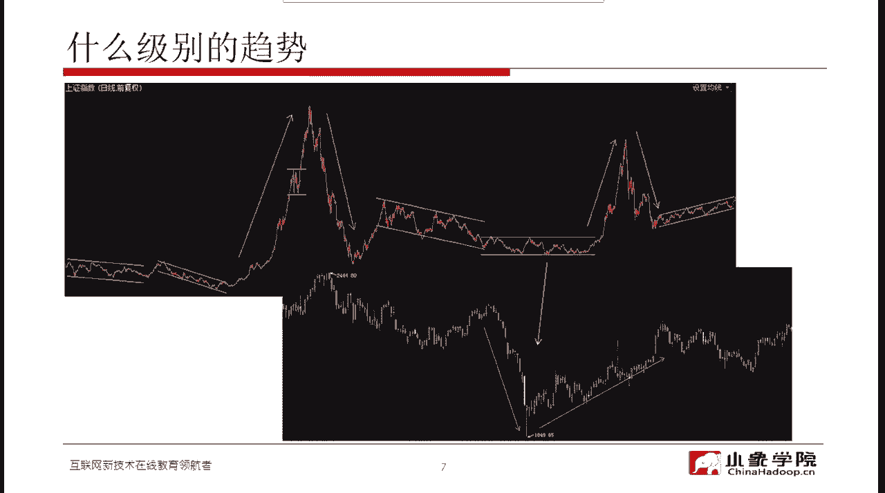

好我们来看看这个更小的级别，那么这个是18年呃，10月份左右的这个15分钟的K线图呃，大家看这里啊，大概是一个跳空之后呢，有一个持续的这个阴跌啊，阴跌到这个位置，它有一个短暂的一个整理啊，整理呢之后呢。

接着呢直接就拉了一天多，大概有八根板，直接一天多的这个时间啊，所以说呢从我们说呢，只从这个小的级别上来看啊，如果我能能能能把这一段啊这个趋势唉，我们把他这个吃到，那么就是说从这个趋势型的。

这个策略的角度来看呢，啊它也是一个非常不错的一个策略啊，也是一个很好的一种赚钱的方式啊，所以我们说的呢哎我们做这个啊量化交易啊，我们倾向于做呢更小的级别啊。

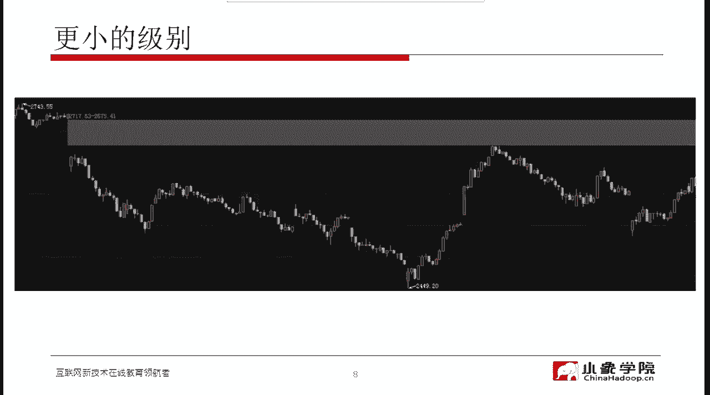

好我们接下来来看看这个啊股票池，那这个股票池呢，实际上呢啊我们先看这个选股条件啊，这个选股条件呢，我们直接呢是沿用了上节课的这个股票池啊，这里呢啊上节课都是嗯刘呃，刘老师呢给大家呢都讲过了。

我就不再重复了啊，我总结一下这几个条件啊，就是它背后的这个选股的逻辑是什么，那么其实呢就是说我们这个票的本身啊，这个大家可以看到啊，我们这个市值排名，剔出市值排名最小的10%，还剔除了这个PE啊。

小于零或大于100的这个股票啊，并且我们剔除了这个s st啊，那个本质上来说呢，我们这些票呢就是说不管从业绩啊，还是从市值上去看啊，市值呢不是很小，业绩呢也不是太坏，哎也没有ST。

所以我们说这些票呢呃本质上来说呢，啊他这他呢在过去的这个25个交易日呢，他又是全市场跌的最惨的10%，那这就意味着什么呢，意味着说这10%啊，它有一定的概率，可而且呢这个概率呢嗯还不小。

那么就是说他在这未来一段时间啊，他很有可能会弹回去，那么前一段时间呢不知道是因为什么原因，他可能会被错杀了，但错杀的就是在这个错杀的这个时候啊，它往往呢会发生一些过度反应，我们知道。

尤其是在这个A股市场上啊，大量的这个个人投资者或者说散户啊，本习惯上就是说这个追涨杀跌啊，所以呢就极有可能会造成这种错杀的情况，那么说在过去一段时间啊，就跌得最惨的这些票。

我们说一定会存在着大量的这种被错杀的，那我们抓的呢就是呢，他这个他们回复的这个机会，而这些票呢在回复的这个过程中啊，那么我们呢就尝试呢去抓这种小级别的趋势，哎这就是我今天要给大家介绍的这个策略啊。

本质上的这个原理啊，我们再看看第二个就是这个再平衡周期啊，我们这里取的呢是二，我们前面这个选股的时候呢，我们取的是25日跌幅前10%的股票啊，那我们今这个再平衡周期啊，也就是我们的股票池的调整啊。

我们也能设置成了25个交易日，那么容量呢也就是说我们这个股票池啊，选到底选多少只股票，那我们这里呢就不做限制了啊，只要是满足我们这个选股条件的啊，我们都把它纳入到这个股票池里面来，咳，那这里呢呃。

这是上节课，我们股票池的这个回撤的这个结果啊，然后我们大家先来看看这个回撤的这个取向呃，这个红色的这个线呢是沪深300的这个线，然后这个蓝色的呢是股票池的，那么我们这个股票池呢，我们只是对这个啊。

我们只是对这个股票池啊做调整，我们其实是没有加任何的信号的啊，也就是说这个回撤结果，就是我们一个股票池的这个基础性能呃，他是没有跑赢这个同期的沪深300，但是呢啊也不亏钱，那不亏钱，这个说明什么呢。

啊就说明那确实是啊过去一段时间里，就是跌的比较惨的这些票啊，啊我即使我不做其他任何的操作啊，我就是定期的啊，每隔25个交易日，哎我买入这样的票，然后呢当他们跌的不那么惨的时候呢，哎我再把它卖出去。

我们呢其实呢就是用这么一个简，非常简单的一个方式啊，我们就能让我们获取一个这个正的收益啊，就是大概在过去呃，4年四年左右的这个时间里啊，能帮我们取得这么一个正的收益。

那这就说明啊以这种超跌的票被错杀的情况啊，确实是存在的啊，并不是说他们持续的这个下跌，好那么这个股票持有了以后呢，那么我们就说我们今天呢啊，到底要啊带大家来完成什么任务呢。

哎我在这里呢啊框了一个这个红框啊，那么这个呢是我们整个16年，我们股票池的这个表现的这个情况啊，大家可以看到啊，这个整个16年啊，就是我们从这个红框的开始，到红框的这个结束的这个部分啊。

呃股票持在这整个16年，它的收益呢是这个负收益啊，当然了，这个沪深300它的收益呢大概看一下，也是个沪的收益啊，啊也就是说这一年呢封300呢，然后赚钱呢也确实是不容易的啊，那么我们今天的这个目标呢。

呃就是说嗯我们把我们这个股票池啊，这个股票池，然后叠加上我们的这个信号系统啊，啊我们把它变成一个呢相对比较完整的，这个量化策略，看看呢我们能不能把这个负收益啊，我们让它变成这个正的呃，最好啊。

最好呢要让他们能跑赢这个同期的这个，沪深300的这个指数好，那这个呢就是我们这节课呢啊，想要实现的一个这个啊收益啊，还有这个风险平衡的目标，然后接下来呢这个呢是我们这个我要讲这个。

趋势型折射信号的设计啊，那趋势型策略的原理，还有股票池的复习啊，我们前面就算讲完了，这个虽然这个多花了点时间啊，但是我认为呢还是比较值得的，主要是呢我们要讲出我们今天这个策略的一个，本质的啊。

这个思考的一个逻辑啊，所以呢，接下来呢我们再讲这个趋势性走势信号啊。

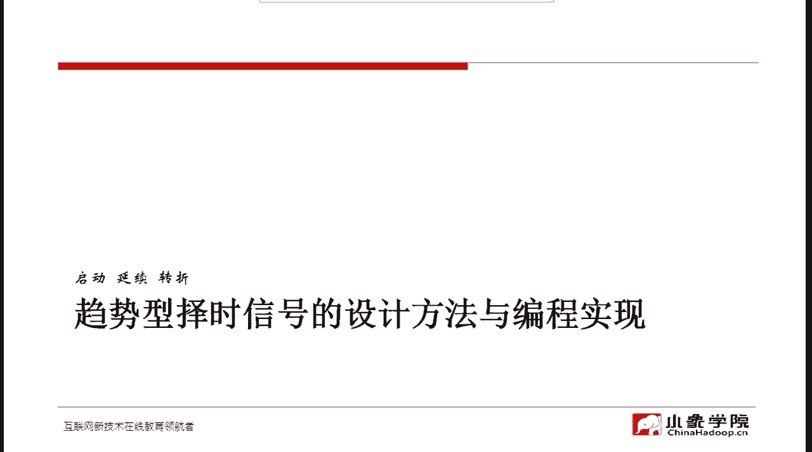

好我这里给了两个最典型的啊，这个也就是我们平常用的比较多的啊，一个技术指标啊，相信大家呢一定也不陌生啊，一个是均线啊，下面的这个是MACD啊，啊，这节课呢我们主要的就是通过这两个技术指标。

然后呢给大家构造一个这个啊，趋势性策略的一个信号的系统，好我们先看这个啊均线系统啊，这个呢是15分钟级别的这个K线图啊，我们这里叠加了两条均线啊，一个是这个短时均线。

这个短时均线呢呃是这个啊5分钟的额是五根，五根15分钟K线啊，计算的这个均值啊，另外一个就是啊这个这个5分钟额，这个五根半的这个均线啊，他这个是白色线啊，然后另外一个是常识均线啊。

长时均线我们取的是30个瓣啊，好我我们看到啊这两个均线啊，在这个价格在反复的这价格在下跌的过程中，我们注意看一下这两根均线啊，啊就说前面啊这个下跌下跌的过程中呢，再有一波反弹。

那么在这个位置呢我们看这穿越了一次啊，就是短时均线啊，然后穿越了这啊这个长时均线，那么接下来呢在这里呢又完成了一次穿越啊，短时均线上穿长时均线啊，我们说呢在第一次这个在这个地方这个穿越呢。

我们说呢它是一个假的突破啊，大家可以看到啊，他上去了以后很快就又下来了啊，但是在这后面这一次呢唉他这一段呢啊，我如果我们抓到了，确实呢还是有一对很可观的一个额利润的啊，所以我们说呃。

就跟我们前面这个讲的原理是一样的啊，这个均线系统啊，我们说呢从某种意义上，我们在这个小级别嗯，就是这种15分钟级别的，我们想去抓这么一个日间的反弹，就这种小级别的这种趋势啊，啊。

我们可以通过设计这么一个简单的均线系统啊，就有可能帮我们达到啊这样一个啊，抓这个趋势性策略的一个啊目的啊，当然了我们说了，这里头呢也有做错的，在这个地方啊做错的时候呢，我们说呢就看你怎么去出来。

如果说我们最简单的方案啊，我们就是经常买啊，在这里买啊，然后市场卖这里卖，那么在第二次呢我们大概呢就转了，有有大概有这么这么一段吧，啊总的来讲呢嗯就是再扣上这一次啊，我们进入，然后进进场，然后出场。

然后这一小段啊我们赔的钱，那总的来说呢，我们看上了两笔，做下来呢，我们还是有的赚的，当然这个地方呢也还有一个信号闪烁的问题啊，上去了以后马上又下来了啊，所以说呢啊我们说这个呃信号系统啊。

并不是说啊只赚不赔啊，我们看到呢也有做错的时候，但是我们说哎只要你做对了，做对了一次啊，能够把前面做错的，这几次就是说亏了钱我们都赚回来，那么这个系统啊，我们认为呢他就是值得去尝试啊。

值得去运行的一个系统，嗯并且呢我们说这个均线系统，它最大的好处是就是简单，那么简单呢有两个好啊，有两个好处啊，第一个我们说就在他执行的时候啊，首先它不会隐藏什么很深的bug啊，便于我们去验证啊。

这个均线啊确实非常简单啊，这是第一点，第二点呢是说呢，嗯我们从这个交易的角度来看啊，这个简单呢它还有一个好处，就是说这个均线这个系统它实在太简单了，它简单到说，我们连一个普通的散户可能都会去怀疑哎。

就是我用这么一个简单的事去做，哎我能不能赚到钱呢，唉但是我们说往往就是有这样的认识的人，多了以后啊，反倒是说这个简单的系统，有可能他真的赚到钱了，那就是因为说大家都认为它太简单了，赚不到钱。

那么他反而呢有可能帮我们赚钱啊，所以给这里就跟大家说呢，简单系统的两个优势啊，一个呢是说它容易验证，另外一个呢是呃，可能是利用大家的一种这个认知的一种偏差，或者说是一种错觉。

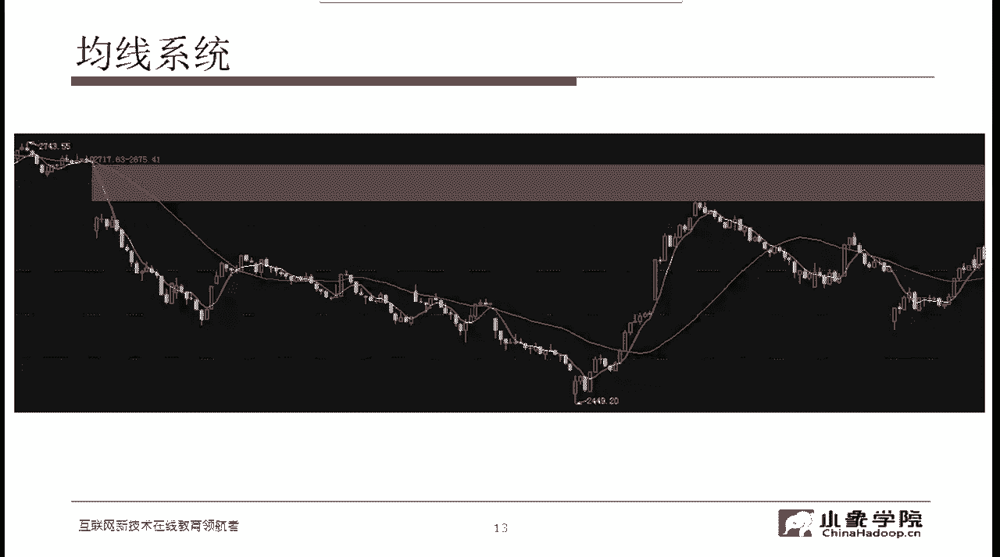

好我们接下来看啊啊这个金叉和死叉啊，也就是我们这个均线的这个金叉和死差啊，这里呢我可能要先讲一小段代码，因为这个呢还其实还是挺重要，嗯这个还挺重要的，因为我们在做这个量化实现的时候啊。

即使这种看似非常简单的金叉和死叉啊，就往往我们在实现的时候呢，也会有一些问题啊，大家可能会有一些考虑不到的地方，我们比如说啊那就在这个这个地方啊。

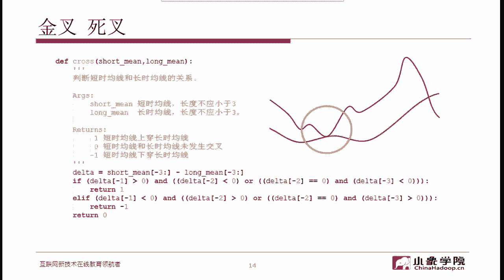

这个地方，那我们说这个地方它到底是有没有上传，或者是有没有下传。

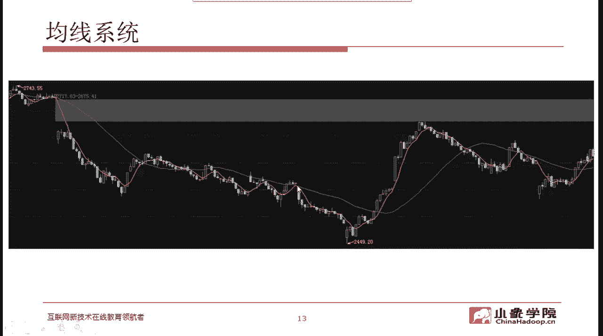

好那么对应刚才那个问题呢，啊我们把这个图上，我们把它重新放在这个地方啊，这里呢是一个啊，这个呢是一个啊下船啊，我们这里面呢画了一个这个短期均线在上的啊，所以呢这里呢其实呢对应到我们这张图上。

就是对于这种情况，我们叫做它叫做相切，那么这种相切它到底算不算是一个穿越呢，啊你可以把它看成是一种穿越啊，你也可以认为说啊，这里不是一个穿越，那是还是不是啊，这里面其实没有标准答案啊，那主要是看什么呢。

主要是看我们在构建这个系统的时候，这个标准是什么，尤额尤其是在这个具体实现的时候啊，我们要严格的参照这个标准，那我在这里再强调一遍啊，就是说我们呢需要注意两点，第一个就是我们编写代码的时候啊。

我们要严格的按照我们这个标准去实现啊，第二点就是我们在设计这个策略的时候啊，我们就要设计这个指标的时候，我们就要考虑清楚这些情况啊，就包括这个相切的啊，这些情况我们把它考虑进去啊，好这是两点好。

我接下来呢我们呢嗯我们切到这个代码里面，我们来看代码啊，我们就看看这个啊，我们怎么检测这个金叉和死叉的，这个这一部分的代码，啊这里呢我是用的是一创巨宽的这个平台啊，嗯先看一下这个啊。

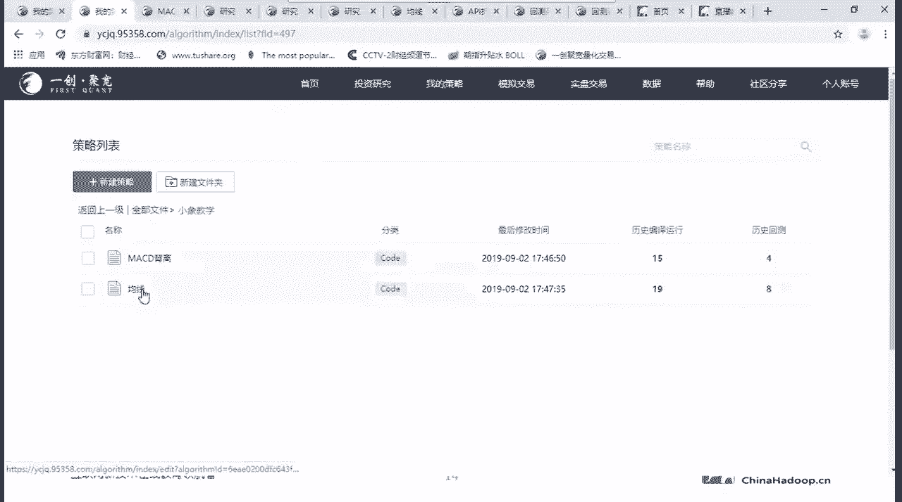

金叉和死叉是在这个均线。

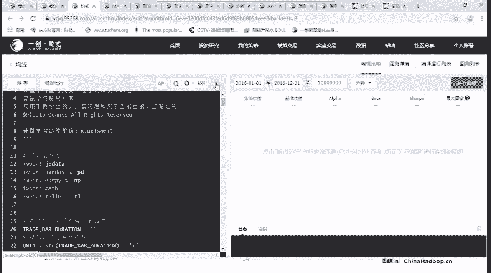

他这个地方啊，我先把这个字体稍微调一下啊，调成大号了，让大家看得清楚啊。

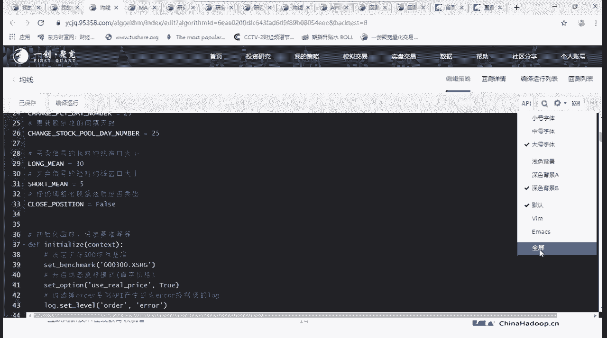

我把它全屏了啊，好在哪，就是我们检测金叉和死叉的这个这个函数啊，咳咳我们看一下啊，这个函数呢它接收的呢嗯有两个参数啊，一个是sht min，一个是long min，那么short me呢。

就是我们计算出来的这个短时均线啊，LME呢是我们计算出来的常识均线，这两个呢都是一个这个service类型的数据啊，我们接着来看它返回值啊，返回值呢可能是一零或者一，那么一呢就是说呢是一个金超啊。

就我们这个短时均线上穿了长时均线啊，零呢是说我们没有检测到金叉或者死叉，一呢就是说我们检测到一个死差啊，好这是返回值，近差没有检测到金叉或死叉，还有一个是死差，好，我们来先来看一下啊。

我们这个输入的两个参数是到底是什么啊，嗯这里呢我给他打印一下，让大家看一下啊，比较容易理解，相相对来说更加容易理解啊，我们把这个跑一下啊，我们看一下啊，边运行一下啊，好嗯，让我们把这个去掉啊。

他现在可能不支持这个了，他现在不支持这种口顶的设置了啊，好，这个呢是我们刚才打印出来的这个两个参数啊，两个参数啊，一个sht min，一个LME，那这里呢大家看一下啊。

第一个呢是我们打印出来的是这个呃sht min啊，接下来是这个long min啊，大家可以看一下啊，这个计算这个我们先看其中一个啊，这个数据结构呢就是一个这是一列啊，这是一列时间戳啊，然后呢哎啊电好。

这是一列，然后是他的这个我们计算出来的这个额均线，均线的值，那么这是一个啊两呃两列的啊数据啊，那么每一行呢啊代表的是在每一个瓣上啊，计算出来的这个均线的值，那么这个11。15呢，也就是说对应的是11。

15那个BT啊，因为我们的我们我们这个，但是接下来呢我们用到的这个策略啊，啊用到的这个信号啊，是是我们会检测15分钟级别的信号，所以呢大家可以看到我们这里呢，是每隔15分钟啊，有一条数据啊。

所以呢这里呢这后面这个比如这个10。605，它是往前啊呃计算出来的呃，用用这一段啊，以滑动窗口，然后计算出来的一个这个呃均值啊，好这个呢就是这个两个参数啊，就给大家看一下啊，更容易理解好。

那么呢接下来呢我们可以看到啊，我们取了这个sht min啊，我们从互三，然后取到呃，这个省略了哈，它其实是代表是最后一个位置，也就是说这个地方是倒数第一个位置，倒数第二个位置，倒数第三个位置啊。

我们从这个地方开始取，一直取到啊这个位置啊，也就是说我们最终呢会取到后三条数据，把它全部取出来，然后呢long me呢，同样的呢我们也是取后三条数据，那么接下来呢我们把它做一个减相减啊。

也就是说他的后三条数据啊，与他的这么啊与这个，啊肖肖特命与long in的后三条数据啊分别相减啊，这个14：30啊与14：30的数据相减啊，15点与15点的数据相减。

就每一条数据呢啊同一行的时间戳相同的，他去做相去做啊，相减，这样呢就得出来呢，当前这根瓣上呢，它的这个短时均线和长时均线的一个差值，哎也就是我们的德尔塔好。

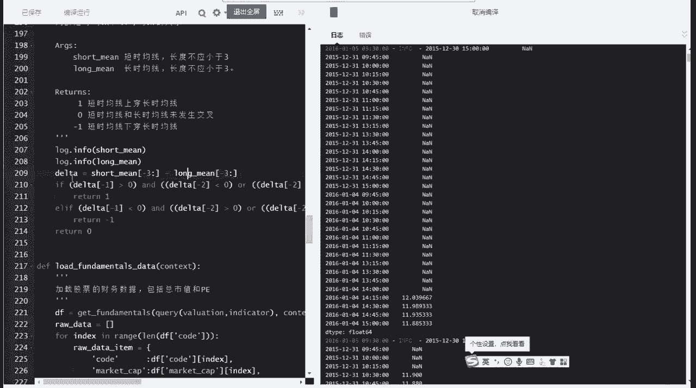

我们把它取消编译啊。

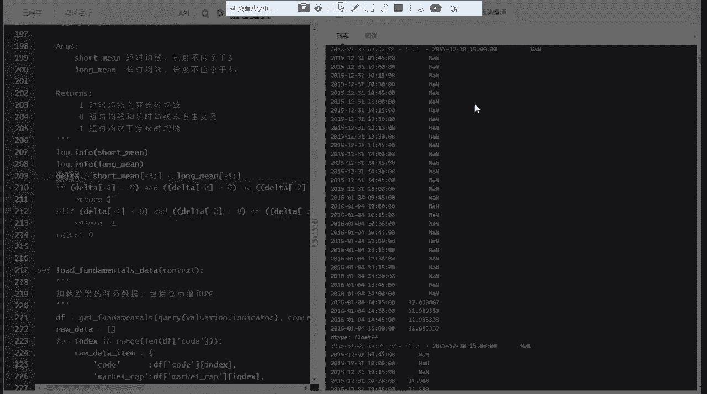

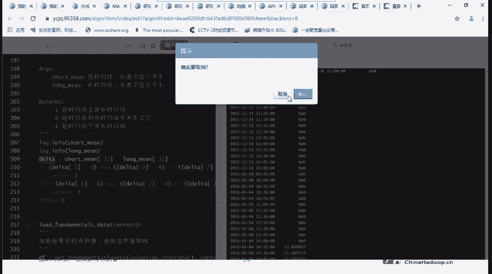

啊电脑稍微有点卡啊，大家稍等一下啊，可能开的网页有点多了。

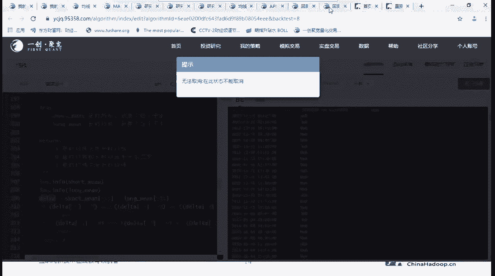

突然卡住了啊，好好好，现在回来了，把它关掉一部分，我们再重新打开啊，刚才的。

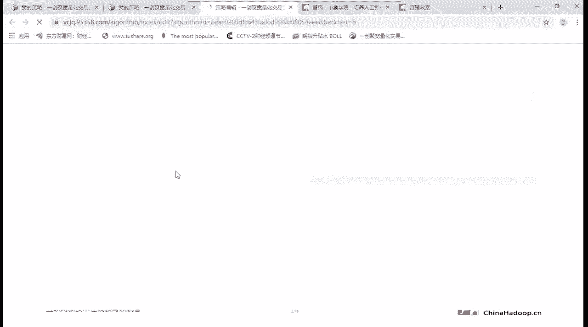

好在这里地方我们刚才讲到这个德尔塔，德尔塔呢也是一个这个啊时间序列的数据啊，对应的是每一个瓣上啊，他的这个长时呃短时均线啊，减去与长时均线的这个差值啊，这就是德尔塔啊，就是说我们会计算出来德尔塔呢。

它是至少有三呃，它的有三条数据啊，好那这里呢我们会呢，呃这里呢如果说德尔塔一大于零啊，并且呢嗯也就是说最后一个半，它的这个德尔塔呢是大于零的，那么我们去检测它第二根棒啊，第二个德尔塔就是往倒数第二个呃。

这个半它的德尔塔，如果德尔塔二呢是小于零的，或者呢德尔塔二等于零的情况下呢，我们呢就去检测啊，这个如果说德尔塔二啊小于零呢，我们呢就认为呢这个地方呢是一个金叉，或者说呢如果我们检测到德尔塔二呢等于零。

那么我们再往前去看一根半，看他的这个德尔塔，德尔塔三，如果是小于零的，这里呢我们也认为呢发生了一个上传好，那同样的呢，这里呢是这个下穿的这个检测的逻辑啊，大致是相同的啊。

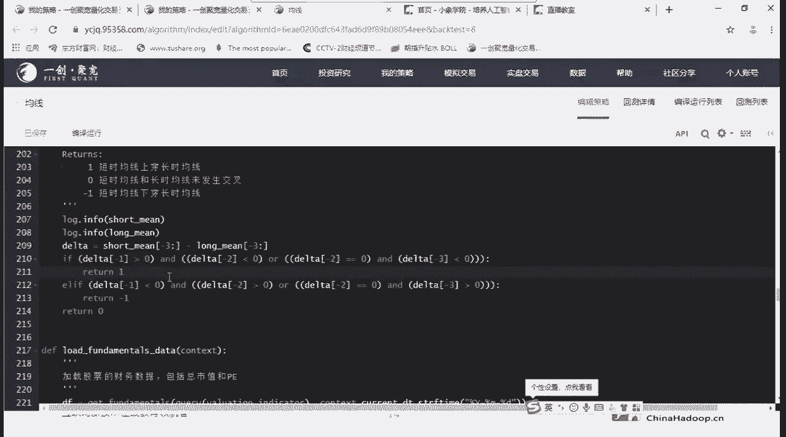

这样单独看代码呢可能呢不太容易理解啊，我们还是回到这个PPT里面吧。

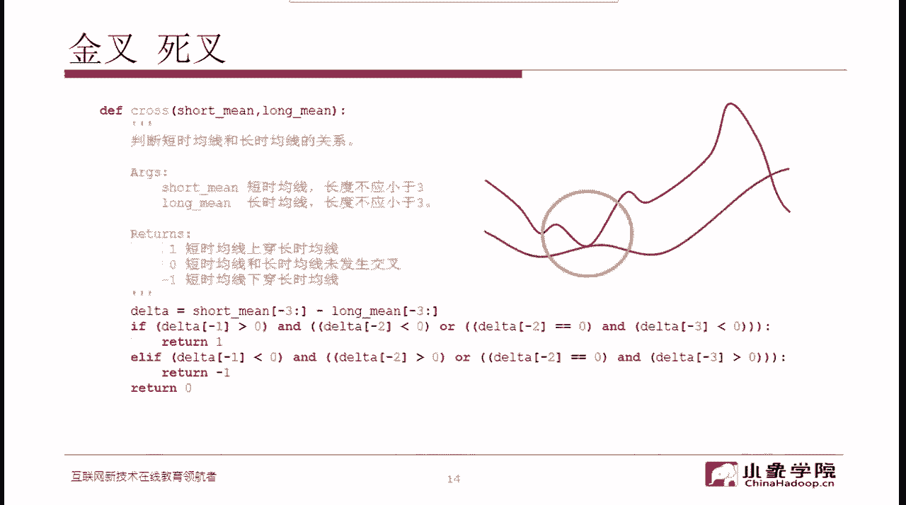

这里给大家画了一张图啊，可能看的比较啊更容易懂一些啊，好好这个呢是我在这个交易软件上啊，我截的图啊，这个是我这个是我单独写的公式啊，计算出来的德尔塔这个红柱子啊，就是说明这个德尔塔大于零。

这个绿柱子说明德尔塔是小于零的，如果这像在这个地方唉，这个这个瓣对应的这个DER呃，这个这个柱子没有，那就说明这个德尔塔是等于零的，好我先这个是德尔塔值啊，那我们再看看这个序号一是在哪个位置。

二是在哪个位置，然后这个三又是在哪个位置好，我们来看清楚这个位置这个瓣啊，他假如说这是我当前这个伴儿啊，就是我们现在正在呃检测这个信号的这个伴儿，那么这根棒呢就是德尔塔它的这个差值呢。

它的这个德尔塔呢对应的就是德尔塔一啊，好就这个地方，然后这里呢就是德尔塔二啊，这个就是德尔塔二，然后这个瓣对应的呢是德尔塔三好，那么呢我把这个德尔塔的它这个这个索引，这个标识呢我也给大家讲明白了好。

那么呢我们就直接看啊这个德尔塔这个情况，这是我们前面判断金叉啊，是有两种情况啊，第一种是说首先这是个德尔塔一啊，也是它这个是个红柱子，就表示我们德尔塔一是大于零的，然后呢德尔塔二呢它是小于零的。

你也有这个柱子啊，它是小于零，这个时候呢我们认为它是金叉，大家看这个瓣上啊，可以很明显看出来白色的是这个短时均线，绿色的是长时均线对吧，这时候明显有从这根半到这根半哎，这里完成了一个上穿，好。

这里在下这里在上啊，这是一个非常标准的一个上传，那么还有一种情况就是这种第二种情况，那就是说我们德尔塔一呢它也是大于零的啊，这也是一个红柱子，确实是大额是大于零的啊，也就是说呢这个短长时均线啊。

短时均线呢是在长时均线的上方了已经，但是呢我们德尔塔二呢是等于零，那这根半对应的啊，在这个位置这个均线呢其实是发生了交叉啊，有德尔塔的二呢是等于零的，那么这个时候呢我们要再往前看一遍。

半就看这个德尔塔三，德尔塔三，那么如果德尔塔三呢是小于零的呢，那么我们就认为呢哎这这三根半啊，完成了一次啊，上传好，那么我们这个考虑的目前考虑的是两种情况，也就是说我们制定的这个金差的标准啊，是这样。

那么肯定如果大家仔细要再去思考一下，那是不是还有别的情况呢，那大家可以想一下啊，好这里我给出了这个这种情呃，第三种的这种情况啊，就是说哎我们还是德尔塔一，我们是大于零的，那么德尔塔负二呢。

我们是等于零的啊，在这个位置，那如果说这个德尔塔三，它也是等于零的呢，这种情况下，我们认为或者说德尔塔负如果三等于零，德尔塔四也还等于零呢，那像这种情况下，我们认为它是不是上金叉呢。

啊那在我们这做这个信号系统的设计的时候呢，我们认为呢这个地方呢我们就不再去检测它了，因为什么呢，啊我们是作为一个趋势型信号呢，我们认为这个呃瓣的这个呃，这个这种，像这种连续的这种德尔塔都是等于零的啊。

我们认为这种趋势可能呢就不是那么强啊，所以呢我们这样这种情况下，我不认为它是一个警察啊，好。

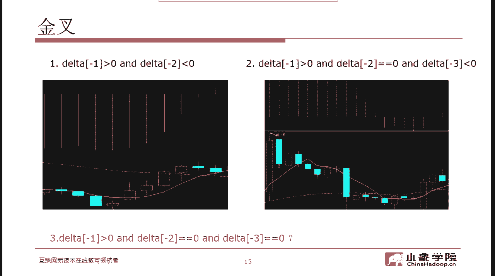

好接下来呢我们来看看这个背离啊，那么我们这节课呢我们用的这个背MACD的背离，这个信号，就是这个啊大家可以看一下啊，这是一个非常典型的这个底对比啊，啊这个价格从这儿到这儿啊，创了新低了啊。

但是呢我们看一下这个下面的这个MACD啊，就这个地府啊，地府的值啊，白额就是个白线啊，他这个地府的值呢啊他是没有创新低的啊，这个时候呢我们把它叫成叫做一个背离啊，啊，那么这个低这个地府的低点呢。

是这个金这个金叉啊，这个死差啊到这个金叉之间啊，它这个地府值有一个低点，那么这个低点呢，是在这个从这个时差到这个金叉之间啊，这个有一个地府的这个极值啊。

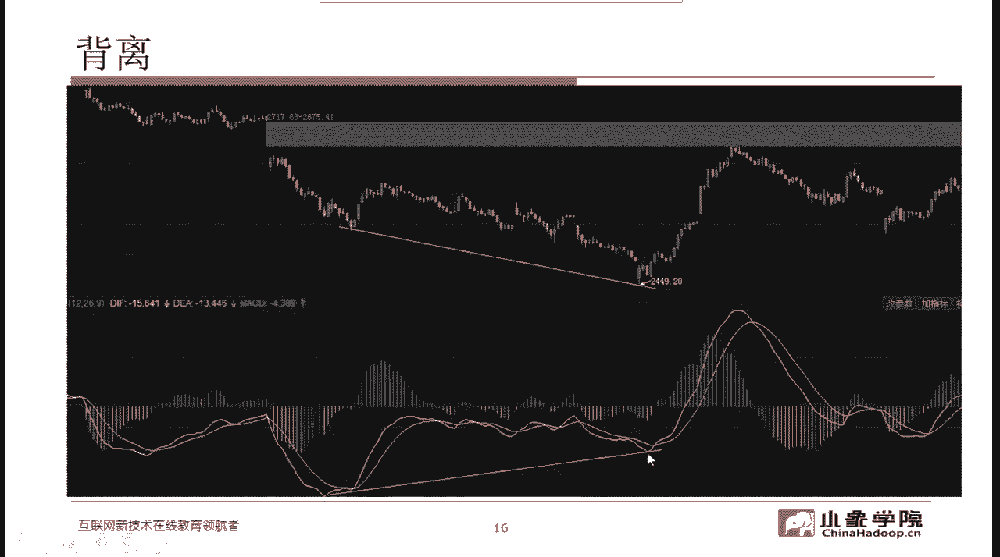

我们叫它最低点啊，好，那么我们这里呢要提出一个问题啊，就是说嗯大级别的这个背离啊，我们就一定比这个小级别的这个背离呢，要更加稳定嘛，啊大家思考一下啊，因为我们在用的时候呢，可能会自然而然的呢。

以后呢可能会碰到这种问题啊，就是说嗯我们一个趋势性的一个策略，我们是在什么级别下去检测这种信号，对于这个MACD底背离，大级别的这个底背离一定一定是小时级别的，这个底背离会比15分钟级别的底背离。

我们说它更稳定嘛，嗯这个事呢啊目前来说我们也不太好说啊，主要呢这个还需要大家呢去去量化啊，自己去验证一下，因为有的时候这个量化验证的结果呢，与大家的认知啊不见得完全一致啊，就如果大家感兴趣的话呢。

呃可以根据那个第二节课给大家的代码，代码包啊，大家自己呢去验证一下呃，就是说是不是大级别的背离胜率会更高一些，那么第二点是说，那么即使大级别的背离呃，呃大级别的这个背离啊，他的胜率会更高，稳定性会更好。

那么这里呢其实还有一个问题，就大级别的背离啊，他是不是比小级别的背离它一定要滞后呢，通常来讲嗯确实是这样的啊，那么即使是大级别的被我们说，即使是大级别的这个信号啊，它的胜率更高，但是和稳定和及时啊。

对于我们制作一个策略来说，哪一个更重要呢，啊大家呢也先不要着急给出答案啊，有可能在这个时候呢稳定更重要啊，有可能在下一个这个信号或者策略里面呢，下一种条件下呢，啊有可能这个及时呢那就更重要。

嗯这里呢说这个意思呢，就是说呢，大家呢一定呢，不要在这个制作量化策略的时候啊，就提前把这些问题呢啊都给了答案，那我们呢要用去数据去说话啊，大家不要去主观的去猜测啊，好那么除了这个及时和稳定啊。

有可能我们还会做错对吧，我们这个信号我们做错了怎么办啊，我们信号不可能百分之百的正确，那一旦错了啊，我们有什么办法呢，啊这是我们策略呢啊需要解决的问题啊，还有就是说假设做对了啊，就是说这个信号嗯。

我我进去的时候嗯，我我确实做对了，那么我们怎么出来呢，啊就是从趋势策略的这个角度，我们到底采用什么样的方式啊去出场呢，大家呢可以去思考一下嗯，那么接下来呢我们的在策略的开发中呢。

我们呢也会呢给大家呢来解决这个问题，好我们来看看这个第三部分啊，我们看看如何编写一个这个呃趋势型的策略，并且呢我们做我们待会要做一些做回测啊，包括性能的这个评估，我们先看看策略描述啊。

这个股票池的逻辑呢啊还有它的原理啊，我刚才呢已经给大家讲过了，那我们呢其实呢，就是沿用了我们上节课的这个股票池，然后呢是我们这个啊买入条件啊，和和这个卖出条件，也就是说啊我们用什么样的条件呢。

我们用什么信号啊去买入，用什么信号去退出啊，就是说我们这个信号系统是怎么设计，接下来呢是我们买的时候呢，哎我们到底要买多少啊，也就是说我们这个头寸怎么去分配，还有一些呢嗯其他的这些因素啊。

嗯等一下呢我们呢去把这个策略啊，我们会会再细致的去描述啊，到时候我们呢再来展开啊，好这个股票池的逻辑呢，这里头呢嗯有一个需要注意的地方啊，就是这个再平衡的这个周期啊，也是我们这个股票池这个啊股票次更新。

那么我们在上节课讲的时候啊，大家有大家要额外注意啊，就我们上节课也给大大代码啊，就是股票池的代码在那个股票池里呢，我们讲的时候呢，是说我们每天我们在股票池更新呢，每个交易日股票池更新的时候呢。

嗯我们会呢买嗯买入和卖出这个股票，但是呢对于我们今天这个策略呢，我们要引入的这个信号系统，所以我们的买入和卖出呢，我们都是根据这个信号系统来做的操作啊，我们就是说我们的这个股票池里面。

没有这个买入和卖出的这个操作逻辑了啊，这是大家需要注意的地方，我们这个股票池呢啊，现在呢只维护一个候选的这个股票的列表嗯，在盘中的时候嗯，比如说我们用这个15分钟的信号，那么我们检测到这个买卖信号了啊。

我们呢执行买入和卖出操作啊，那前面说，就是说我们买卖都是靠我们的信号系统的，那么我们的今天这个讲的这个趋势性策略呢，我们这个信号呢系统呢有两个啊，也就是说我们的策略实际上就是有两个的。

第一个策略呢嗯我们用的是条件一啊，就嗯就是我们跟我们是在15分钟级别半，下去做，然后呢我们在呃这个呃短时均线啊，上传长时均线，也就是说这个发生金叉的时候呢，我们去做做买入条件好，这是第一个这个策略。

那么第二个策略呢啊有两个买入信号，这两个买入信号呢满足任何一个啊，我们就是可以触发我们的买入操作，第一个呢是这个15分钟级别下呢啊，我们去检测这个MACD的这个底背离，那么底背离呢啊。

我们就是用这个啊D复制和我们的这个close啊，我们去判断这个是不是发生了这个背离，底背离好，这是第一个条件，那么第二个条件呢是说呢，这个在5分钟级别下呢，我们要去检测这个MACD呢。

连续底背离这两个条件啊，15分钟级别和5分钟级别上，检测的这个信号啊，满足其中任意一个啊，我们都会触发这个买入的这个操作啊，好，我们来这个，前面给大家讲过这个底背离的概念啊，这里呢这个图上呢。

我给大家介绍一下，这个什么是连续的这个底背离啊，大家可以看到啊，这个是一个连续底背离啊，这个图示啊，那个连续背底背离呢，他是说呢啊这个第一个这个参考点，第二个参考点，这里呢大家呢可以看到啊。

这里呢价格创新低了，地府没有创新低，这里呢构成了一个底背离，好第二个参考点和第三个参考点啊，这个价格呢又创新低了，但是呢DF呢还是没有创新低，那这里呢啊又构成了一次底背离，好这里呢这个123呢啊。

这三个呢参考点呢就构成了一个连续的啊，这个底背离好，那么它的特点是什么啊，就是说这根瓣啊，这个这个这个瓣啊对应的这个呃地府啊，这个对应的时间戳，他的这个地方是我们是这个底背离的，是当前啊。

假如说这是当前这根瓣啊，当前这个底背离它的前一个参考点，那么同时它又是这个底背离的后一个参考点啊，也就是说他这个时间戳是一样的啊，大家先先记清楚啊，待会我们做这个信号检测的时候。

就用到就要需要用到这个特征了啊，好这里呢是买入条件啊，接下来呢是卖出条件啊，这个卖出条件呢跟我们的买入条件呢，是相对应的啊，啊第一个呢是我们这个均线系统啊，我以它这个对应的我们均线系统的，买入条件一啊。

也就是说我们这个15分钟级别啊，我们这个检测这个呃时差也就是这个死差呢，就是这个ma5下穿ma30啊，第二个条件呢来哦，这里写错了啊，这不是买入条件啊，哦嗯哦这是对应买入条件二啊，啊没写错没写错啊。

对应的是买入条件二啊，也就是说这个是我们的MACD的这个，这一套策略啊，对应的那是这两个呢，也是我们在15分钟级别半，检测到的MAACD顶顶背离啊，这时候呢我们去卖出，或者呢在5分钟半。

我们检去检测到这个MACD呢连续底背离呃，顶背离啊，我们也卖出好，这次呢我们的两个卖出条件啊，接下来呢我们来看看呢，我们这个这头寸的这个分配啊，那么头寸呢，嗯我们这节课呢就用一个比较简单的啊方式啊。

就是均仓，那么更复杂的方式呢，嗯嗯下节课呢会再给大家介绍，那么这节课呢我们就不做那些复杂的这个，头寸的逻辑了，嗯因为我们的票啊是啊，相对来说呢数量比较多，所以呢我们就干脆均仓。

那呢谁也别比谁有更多的这个优先权啊，就所有的票买入的仓位都是一样啊，只要说这个票在候选池当中，并且呢它触发了这个买入信号，我们就直接给他分配一个呢，呃之前确定好的一个固定的一个仓位。

嗯那么我们说这种菌仓呢，它是一种啊相对的不激进的方式啊，啊就是说他其实是我们是根据历史上啊，每期这个股票持股票的数量啊，我们大致是做了一个统计，然后呢来规定一个仓位，那平均的仓位，这个是多少。

我们用这种方式呢，它的好处呢就在于说啊第一个啊比较简单，第二个呢就是说啊我们的信号系统呢，因为到目前为止呢你还没有确定啊，最终确定之前啊，就是用这种均仓的方式呢，嗯我们呢更方便的去验证。

我们这个信号系统的有效有效性，嗯大家可以想象一下啊，假设说啊我们要去调整我们的信号，那在调整前后啊，对我们用这个菌汤的这种方式，我们相对来说呢比较容易看出来啊，我们这个信号到底有效没有效。

如果如果我们是用的其他的这个更复杂的这种，仓位头寸的分配嗯，有的时候呢我们可能呢不太容易去确定啊，到底是我们的信号在起作用了，还是我们的仓位分配啊，然后在起作用，所以呢这节课呢。

我们就先用一个简单的这个头寸分配的方式嗯，等我们把这我们相把我们的这个信号系统唉，我们确认了啊，完善了，然后呢啊还有可能还有一些其他的这个因素啊，都我们都固化以后啊。

最后呢我们再来优化我们的这个仓位分配，那这样呢我们就可以呢嗯呃有效啊，相对来说比较有针对的性能去优化啊，啊当然啊这里刚才我们还提到了啊，还有其他的因素啊对吧，我们在说嗯。

我们的这个啊策略逻辑里面要不要加止损呢，啊我们什么时候止盈呢，嗯以及我们要不要加仓啊，啊就我们回测完了以后，我们这个策略的性能啊，有没有可以改进的地方啊，有没有可以改进的逻辑。

那这些因素呢我们呢那这节课呢先不展开讲啊，我们这节课呢主要就讲信号系统，怎么去跟股票池搭配啊，后面的这个课呢我们再讲其他的因素啊，好我们先来介绍一下这个代码包啊，今天给大家提供的呢总共呢有两个文件。

一个叫这个股票池，然后交易交易信号，均线啊，点PY啊，这个文件，这个文件呢对应的就是我们的买卖条件一啊，就是均线系统，第二个文件呢对应的是这个买卖信号二嗯，就是我们用这个MACD的背离系统啊。

给大家提供的当时第二节课啊，当时这个做MACD背离检测的时候，给大家提供的这个一个一啊一个代码包啊，那这一步，这个我们用这个均线系统的这个检测啊，我们这个策略呢我们是在这个文件。

股票池交易信号MCD点PY这个文件里头，那这两个代码呢，我们都是在这个一创聚宽这个平台上呢，嗯去这个运行的，那大家如果说嗯还不知道怎么去登录一创巨宽，不知道怎么去申请账号啊，或者上传文件。

那么可以再回看一下啊，这个第二节课啊，好，我们呢，前面我们讲了这个趋势性策略的这个，股票池逻辑啊，然后又讲了这个信号系统的这个设计的逻辑，接下来我们讲了这个策略的这个描述。

那么下一节课呢我们就准备要开始码代码啊，就是说我们把我们这个策略的描述啊，就是逻辑啊，我们全部换成可执行的这个程序，这个代码的部分呢啊可能会比较枯燥啊，嗯是现在时间嗯也差不多了啊，我们大家先休息一下啊。

喝口水活动一下，然后呢打起精神啊，我们接下来可能要开始讲一大部段的，然后代码好，我们暂时先休息5分钟，好同学们，我们啊现在回来了啊，我们准备啊开始接着讲，上课了啊，我们先来看看我们这个均线系统的代码啊。

我们还是打开我们这个一创聚宽的这个网站，我们进到这个策略编辑页面去看一下。

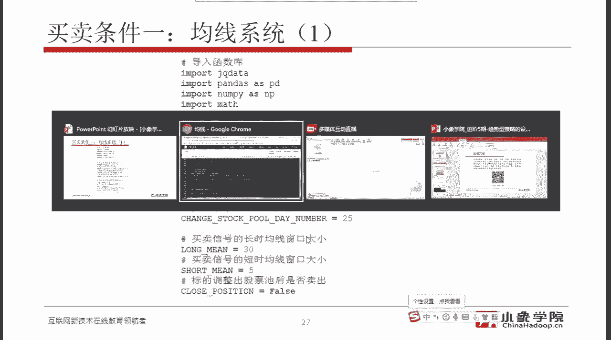

好，这个呢是我们这个均线这个系统的这个代码啊，就是给大家的这个代码包里面啊，我们先看看这个均线的。

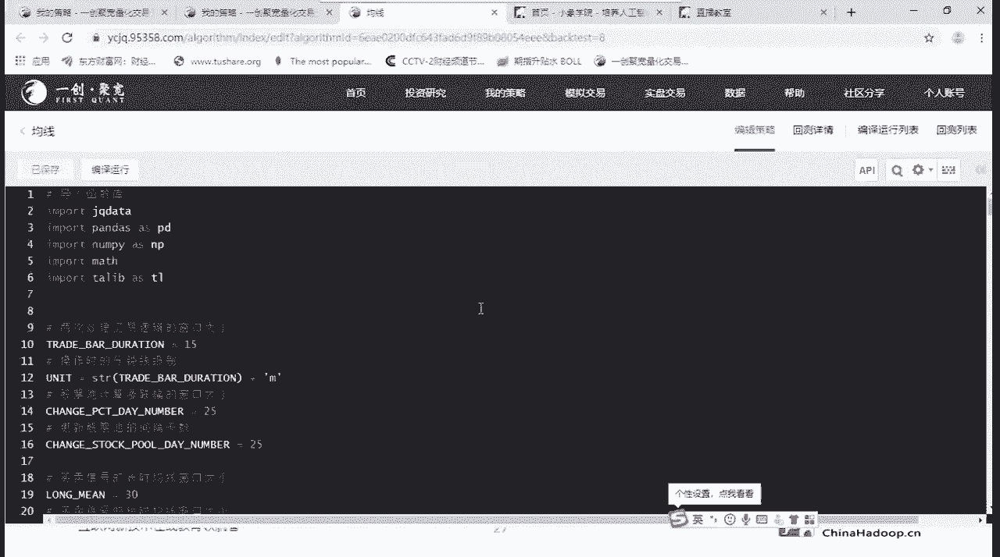

好我们还是全屏来看啊。

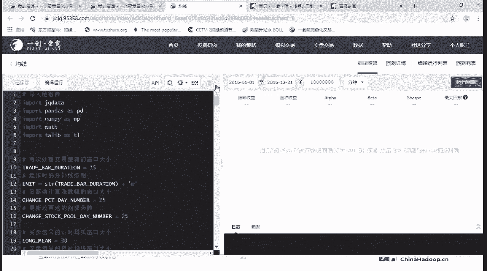

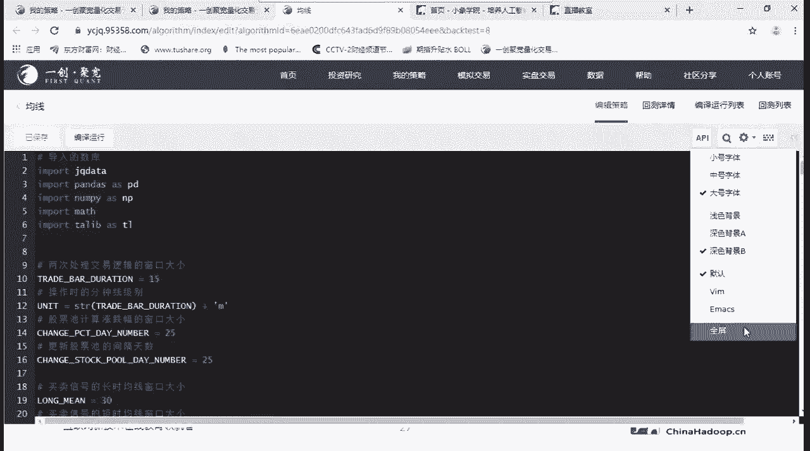

我们先看啊这个代码，首先呢我们要导入一部分这个代码包，那这几个代码包呢，啊在我们这个均线这个系统里面呢，我们并不是都能用得上啊，我们只是用了一部分，那么我们之所以把它全部都列出来呢。

啊就是说这些呢基本上是在我们做这个，我们用这个Python啊，我们写这个量化策略啊，我们经常会用到的啊，这些包我们都把它列了出来啊，一个是这个gq data啊，这个呢就是我们的啊这个距宽呢。

它这个遗传距宽啊，它内置的这个代码包啊，啊我们可以用它呢来下单呀，导导入一些数额，然后呢导入数据啊啊都可以用这个包，那接下来呢这个是pandas这个潘达式呢，他呢主要呢是做一些这个批量运算啊。

刚才我们其实也给大家演示了，就我们两个这个呃这个均线的这个序列值啊，直接可以进行相加减啊，这都是pandas as的这个特性啊，好接下来是这个number py，这个呢哎就是一些啊多维的这个数据啊。

然后我们通常会用它来做一些向量的计算啊，好这个mars呢，它是这个最基础的一些科学运算啊，接下来是这个ta live ta lib呢，它就这个呢相对来说呢。

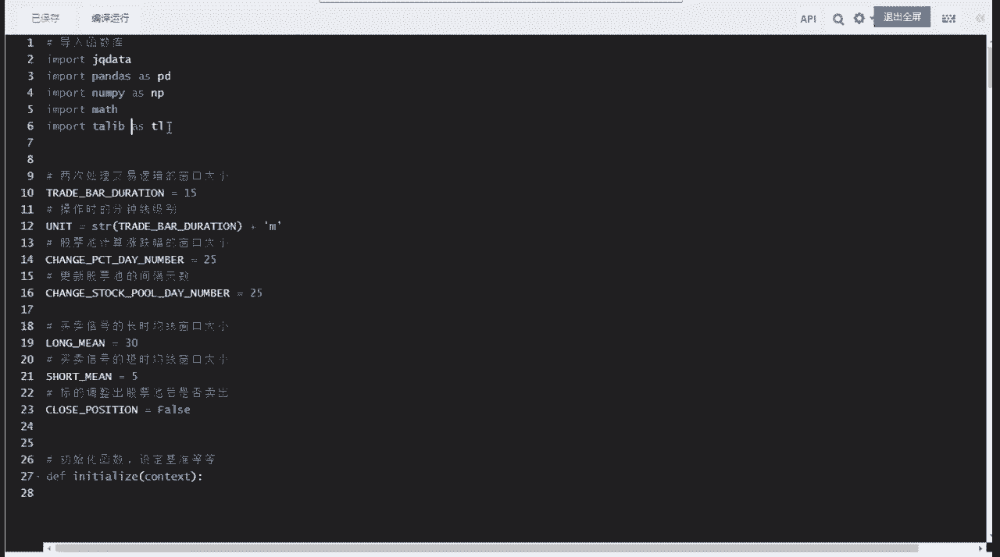

嗯可能呢大家呢以后呢会用得上啊，我们我给大家看一下啊。

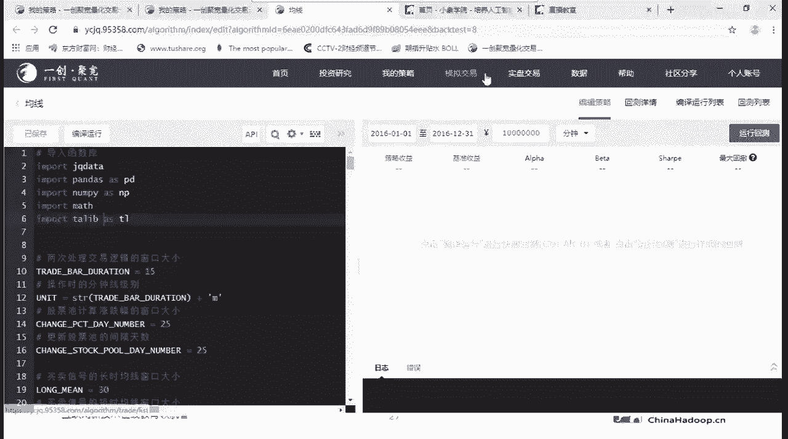

大家如果说对它感兴趣的话，你可以你可以找一下他的这个文档啊，他这在这个，哦写错了，啊他这个地方呢啊它有它的文档啊，大家可以百度一下搜索一下看一下啊，它的主要呢它会计数一，计算一些那个技术指标啊。

常见的什么啊，MACD啊，这这里都是它这个里面的函数，包括一些RSI啊等等啊。

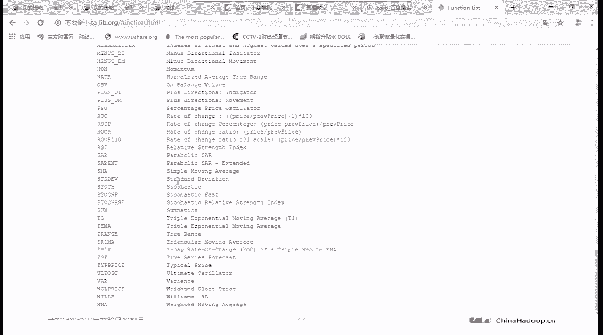

好我们回到刚才的代码里面啊。

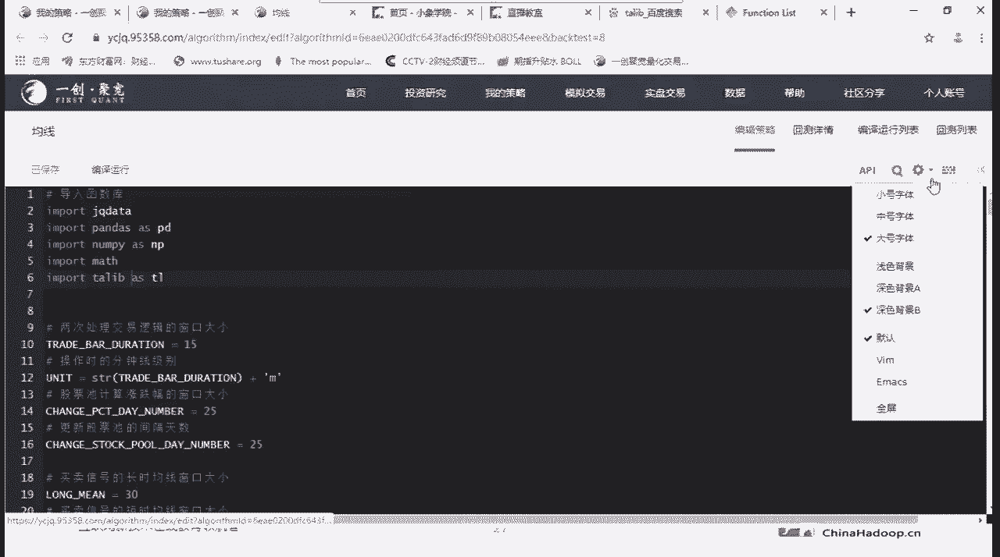

啊这就是我们比较常用的啊，做量化比较常用的一些这个牌上的这个，第三方库啊，好接下来呢我们在这里呢我们定义了一些啊。

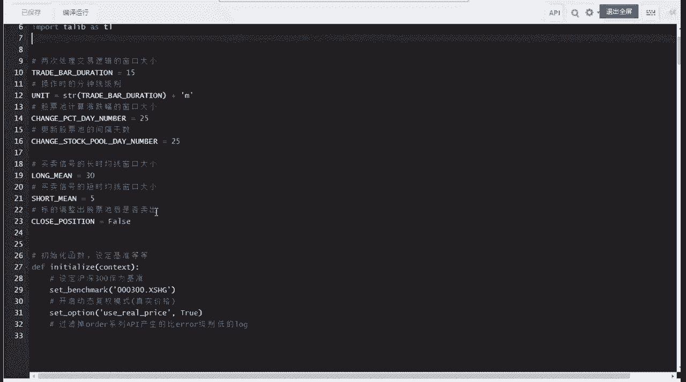

这个系统啊，系统的这个常量啊。

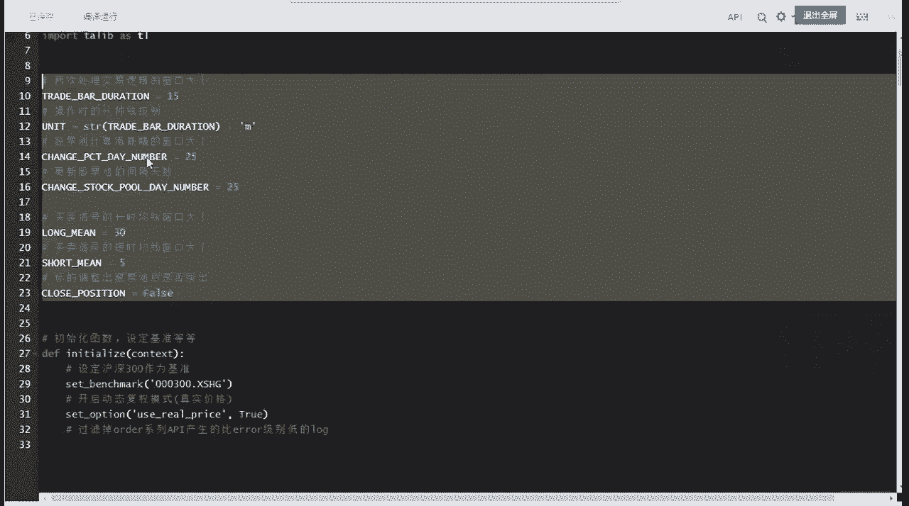

这些常量呢啊之所以我们把它单独挪出来啊，放在这个呃函数外面去定义呢，是说嗯为了方便啊，大家呢自己呢呃去测试啊，这不同的这个参数，你比如说这个地方啊，这是我们呢这个M呃，我们这个均线呢。

我们说我们是在15分钟级别啊去做，大家呢也可以把它改成这个5分钟级别啊，或者是30分钟级别啊去做啊，都可以啊，好这就是说我们把它挪出来啊，就是一些系统的这个常量啊，大家可以拿自己拿去修改。

然后去进行测试，好，我给他简单的给大家呢介绍一下啊，这个呢刚才已经说过了啊，就是我们在15分钟级别下去做的，所以呢这个定义呢其实是呢，我们这个呃这个呃时间的这个级别啊，接下来呢啊这个是unity呢。

是是说啊这个15加M，也就是说15分钟吧啊好，接下来是这个啊股票池的这个涨跌幅计算啊，我们选取的是25个交易日啊，然后这个涨跌幅然后排名，所以呢我们这里面取的是25啊，接下来是这个股票池更新。

我们说是每隔25天我们就更新一次好，然后呢这个呢long i呢是我们这个常识均线，我们定义的是30个班啊，然后呢shot me呢是五个半啊，好接下来这个这个呢我们是说呢，我们定义的是我们股票池啊。

就是说我们在调整股票池的时候呢，我们是不是要卖出，我们这个股票池我也跟大家前面讲过了，我们就是沿用了上一节课的这个股票池，所以说呢嗯我们这个代码呢，也其实也是用上一节课这个股票池的这个代码。

那这里呢那为了我们，我们这里呢其实是做了一个开关，那么我们把它置为false呢，就是说哎在这个股票池调整的时候呢，我们是不做这个买入和卖出操作的啊，就是这个意思啊，好，接下来呢进入到我们这个主体的函数。

这个部分啊，嗯我们先把这个函数呢都收起来啊，给大家呢讲这个整体的这个结构啊，我们先来看看这个整体的这个结构啊，首先呢是这个英雄ALIZE这个函数啊，那这个函数呢我们说呢是在我们策略。

然后点击这个编辑运行啊，或者是我们我们点击这里运行回撤以后啊。

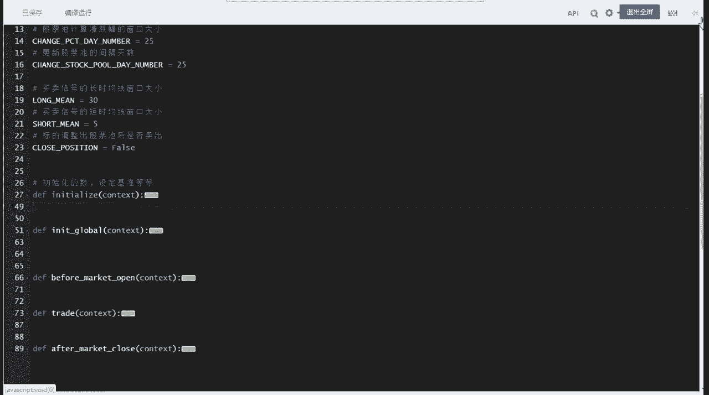

啊这个策略它这个距宽一双距宽啊，它这个策略的引擎啊，会自动调用这个initial line，也是我们策略启动的时候啊，它会执行一次，那么执行这个INTRALIZE以后呢，接下来呢。

我们来看看这个函数内部都是做了什么操作啊，首先大家可以看见这一堆的set啊，啊也就是说这个是我们做了一些啊初始化啊，我对我们这个策略做了一些初始化嗯，包括我们这个设置什么动态互权呀。

设置这个基准啊等等等等，这些好，包括我们还要INNUGLOBAL，这是我们自定义的一些初始化的函数啊，啊总之呢是做一些初始化的操作，这是第一步啊。

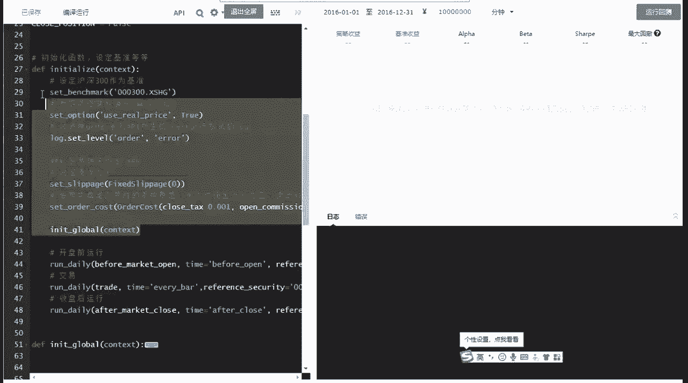

做一些初始化操作，那第二步呢是说呢我们定义了一些啊，大家看一下这个地方啊，哦我们定义了一些周期化运行函数啊，什么叫周期运行函数呢，嗯我们以这个呃before marking open r为例啊。

也就是说它这个time是在before open，也就是说我们每天啊开盘的时候。

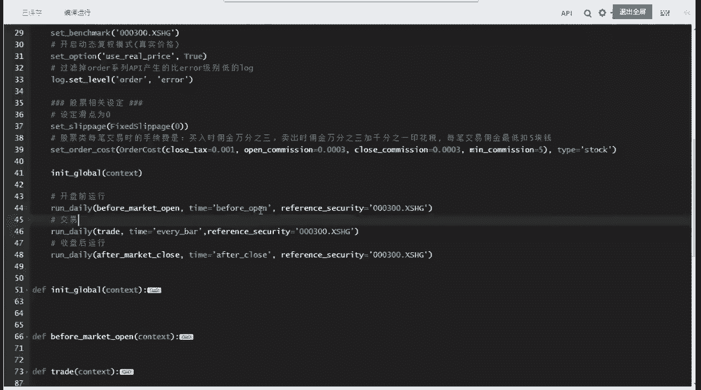

它会运行一次这个函数，也就是说在我们整个回撤区间，比如说说2016年1月1日到，2016年12月31日，在整个这个回撤区间，在每一个交易日啊，09：30的时候都会运行一次啊，这个函数好，大家明白了啊。

那这个函数里面具体的实现呢，我们可以拿自己来写好，这就是run daily啊，这个函数的这个意思啊。

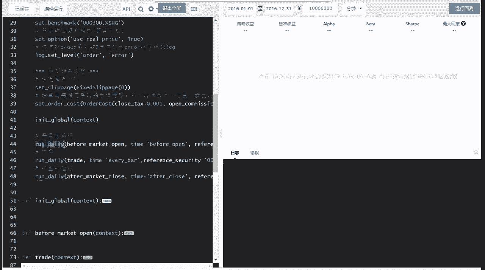

就是定义一个周期化运行函数，那么这里额外强调一点呢，是说这个啊every bar，当time等于every bar的时候呢，其实呢定义的是说呢，我们每一个bar我们都要执行一次。

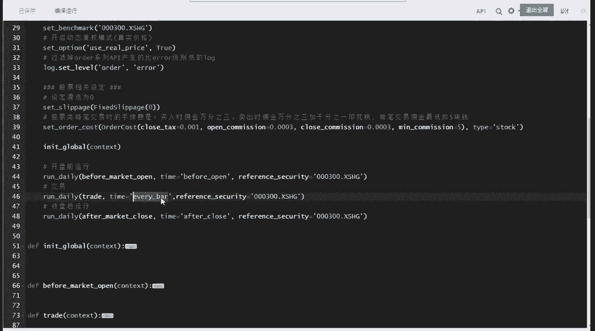

那假如说啊这个艾瑞bar啊对应的是哪呢，是这个分钟或者每天，那假如说我们选择的是每天，那这个error bar呢实际上对应的是哪，我们每天09：30的时候它会执行一次，那么如果说我们选的是分钟呢。

也就是说error bar呢，其实呢是每分钟要09：30执行一次，9。31执行一次啊，以此类推啊，好就在整个交易时间每分钟它都会执行一次啊，这个就是every b。

那么接下来呢这个啊after after after CD，也就是收盘以后运行了啊，好那如果说大家对这个run din，你说我还有什么不太会用的地方，那怎么办呢。

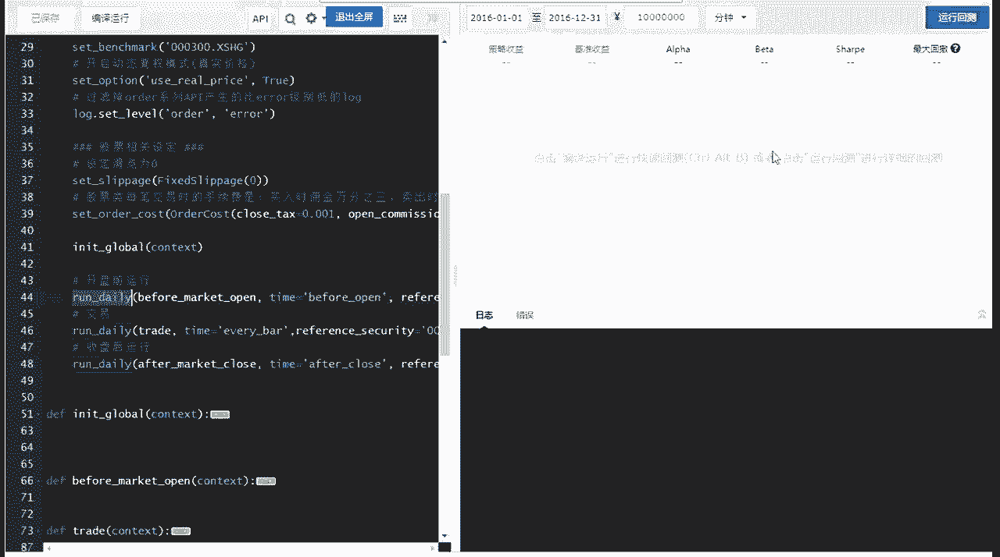

好我们先退出全屏啊。

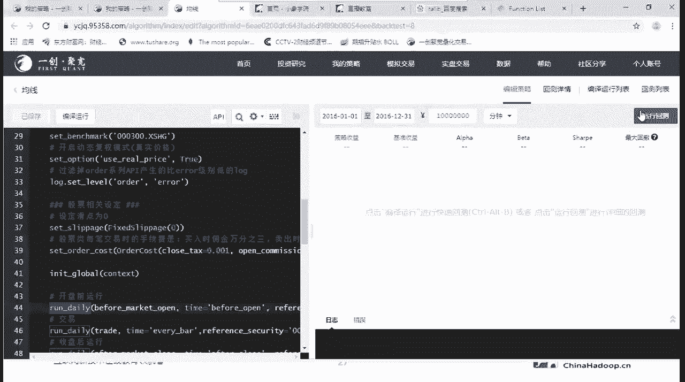

这里呢有一个APII啊，好大家可以打开这个API啊，你去可以去看一下它，这里面有一个这个运行的这个频率，就是指我们这个每根半啊，他是怎么去运行的，大家如果说感兴趣或者说你还不理解啊，你想更深入的了解。

那就看一下这个啊，然后呢是这个run daily啊，这个函数啊，也就是说我们策略的这个设置函数啊，在这个，运行时间啊，在这个里面啊，它会像run date啊，比如说open啊。

包括比如说trading st啊，这些盘中运行，收盘后运行，那某个时间点运行在这里呢。

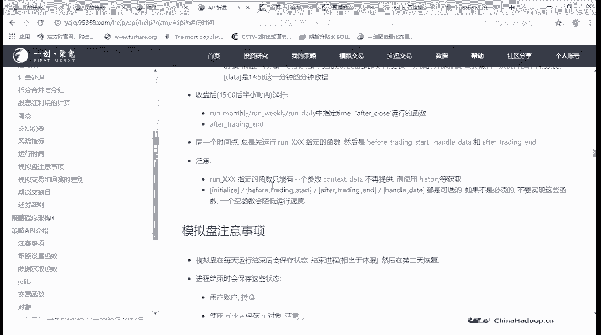

我们都可以去指定啊，好。

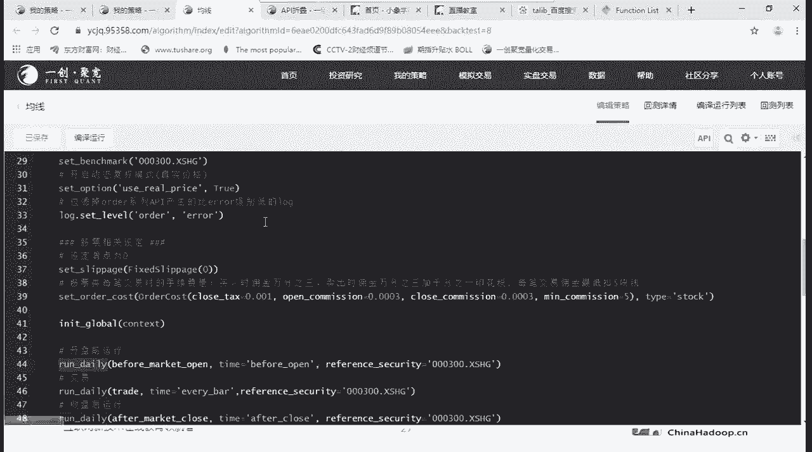

好我们来回到代码里面啊，那这里我们说了啊，在英雄ALIZE里面呢，我们会做一堆初始化的设置，接下来呢我们会定义一些周期化运行函数，那么在每一个交易日呢，嗯开盘的时候呢，或者说收盘的时候呢。

会执行我们这个定义的一些函数，那么嗯在交易时间呢会运行这个erry bar，或者我们定也是我们自己定义的一些函数，那对于我们这个均线策略来说，我们其实主要运行的呢是这两个函数。

一个是offer market close，也就是我们收盘以后，那收盘以后我们要干什么呢，在这里呢，其实呢我们主要是确定是不是哎到了调仓日了，如果是这个调仓日呢，我们就要更新我们的股票池啊。

主要是干这个事，那么trading里面呢啊，其实呢就是我们在这个呃分钟级别，我们去检测我们的买入卖出信号啊，我们执行买入卖出操作啊，主要是干了这么件事，好我们呢接下来呢我们详细的去看一下啊。

我们首先呢来看一下这个收盘以后啊，因为我们第一天开盘呢，我们呢是没有股票池的，所以我们先去看看我们收盘以后啊，就是说我们有了股票市以后呢，我们才能去在盘中呢去做这个买入卖出操作啊。

有了股票持有了持仓以后，我们才能买入和卖出操作嘛，啊对吧，所以呢我们首先来看呢，嗯这个收盘后运行还说我们怎么去啊，定期去更新我们的这个股票池，好这里是这个啊，After after market。

这个CD好，那么收盘以后呢，在这里呢啊我们是更新了这个股票池，那这个地方呢我们是怎么实现，说每隔25天去更新一个次股票池的呢，啊这里呢实际上我们用到了一个呃计数器啊。

然后呢也就是G点stock pro update date啊，这个呢实际上呢是一个计数器，那这里呢为什么要用G呢，啊这里呢需要给大家强调一下啊，就是G呢它是这个距宽的内置的一个对象，那么我们放在G点呃。

我们放在这个G对象里面的这些变量，它都是呢可以被这个持久化的，嗯举个例子啊，假如说我们正在做模拟盘，或者呢我们接入了这个实盘的程序，那么因为我们这个策略嘛，都是跑在这个巨宽的这个虚拟机上。

那假如说他某一个虚拟机它down掉了啊，或者说重启了，那么如果我们这个变量啊是我们自己定义的，哪怕是在函数外定义了一个全局的变量，那么随着你这个系统的重启，那么你这个变量的值啊就丢失了啊。

大家可以理解吧，重启以后，你这个在程序运行中，这个存储的这个值啊就丢失了，那么怎么办呢，好，那么巨宽呢，就给我们提供了这么一个可以持久化的，这个啊对象，就是G，那么这个G对象呢我们把它存放在这个G对象。

在每次这个系统关闭的时候呢，它都会把这个G对象里面所有存储的内容啊，它都持久化一下，在下次我们这个虚拟机启动重启以后，或者我们策略重启以后呢，哎他会把这个持久化的内容啊，再加载到我们这个内存里面，好。

那大家呢如果说嗯还是不是特别理解啊，啊我建议大家呢来读一下他这个API啊。

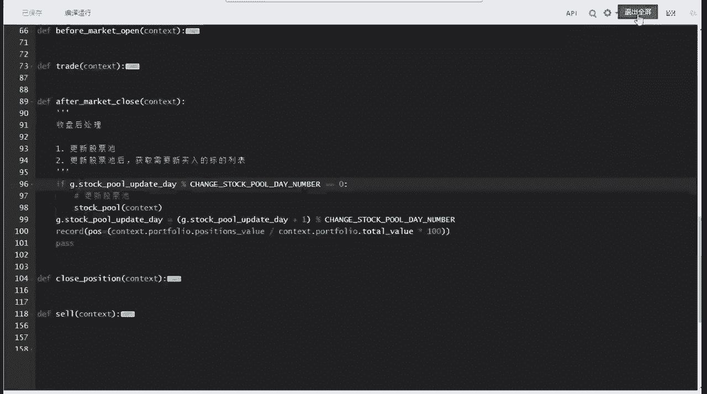

API里面有一个这个对象，那对象里面呢有一个G啊，就是全局变量对象啊，就是他这个持久化啊，这个地方你看他会有更多的这个解释，包括呢在模拟盘需要注意的哪些东西啊，都会在这里面呢啊告诉大家。

大家可以点进去看一下啊，好这是G对象。

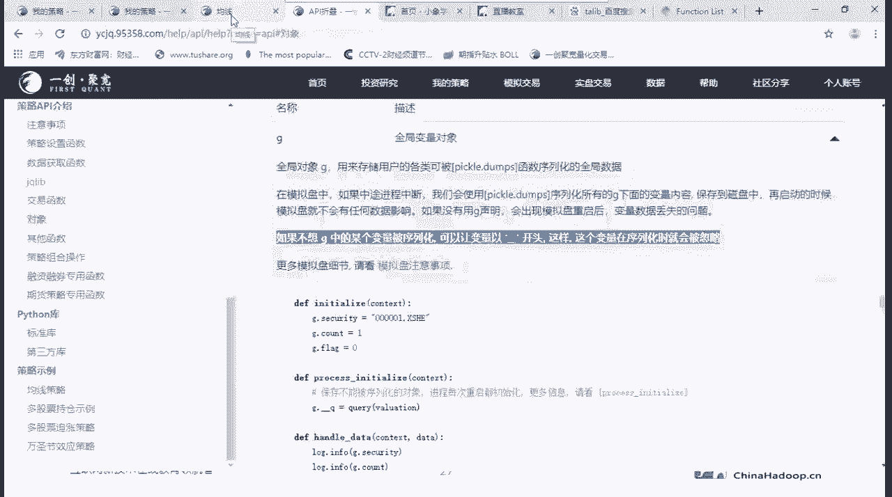

好，那么这里呢，我们因为我们把我们的这个计数器啊，我们保存在这个G对象这个里面，所以呢我们现在不担心这个策略重启的问题啊，好这里呢实际上呢我们来看一下啊，我们实际上这个G对象呢。

我们是在这个初始化的时候呢，我们就初始我们去设置的，也就这个INNEGLOBAL这个函数里面，我们看一下我们初始这个策略首次运行的时候，我们就做初始化的策略，首次运行的时候让我们看看啊，它是等于零的啊。

也就是说我们策略运行的第一天啊，这个值是零，那么这个是值是零的时候呢，我们可以看到啊，他会去更新一下股票池，也就是说策略的第一天它会更新一下股票池，那么更新完股票池呢，接下来做的第二件事是干什么呢。

你看下啊，他这里实际上是把这个啊计那这个计数器啊，它是加了一个一啊，这里呢虽虽然说呢这个除以个啊，这个是除以呃，这个取对25取余啊，实际上呢最后呢还是一啊啊，是一个倒数的这个计数器啊，好接下来呢。

那么当这个第24天的时候呢，实际上呢我们这个地方这个地方呢，哎它又会把它置为呃零啊，而4+1=0啊，这里的话它又等于零了，好那么也就是说第二呃啊，第25天的时候，我们这个计数器是呃24，然后加一呢。

然后等于零，也就是说在第26天嗯，第25天的那天，我夜里呢他啊那天收盘以后呢，他又会做一个更新好，那么接下来是这个record，record这个函数呢是不要距宽呢内置的这个函数。

那么这个函数呢实际上呢它是一个画图的函数，那我们看到这里呢，我们给它输入的这个值是什么啊，实际上是这里呢是context啊，这个paration value，这个就是我们持仓的总市值。

接下来呢这个TOTVENUE呢是我们的这个呃，我们的账户的总资产啊，也就是我们持仓的总市值，加上我们的这个现金啊，那么实际上它俩相除就乘以一个百分数，乘以100呢就是我们的持仓的占比啊，大家可以理解好。

那么最后呢它会在每一天呢，它就会都会有一个这个值，然后在我们回撤结束以后呢，它就会有一个自定义的这么一个呃折线图啊，也是我们持仓占比的折线图啊，这样说呢大家呢可能不容易这个理解啊，我们直接来看一个啊。

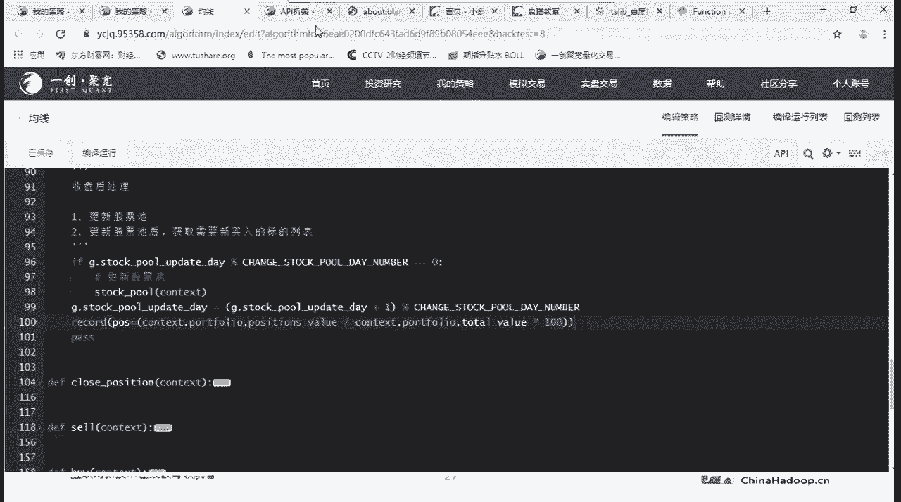

我嗯之前已经画好啊，之前的回撤的结果已经画好了，让大家看一下。

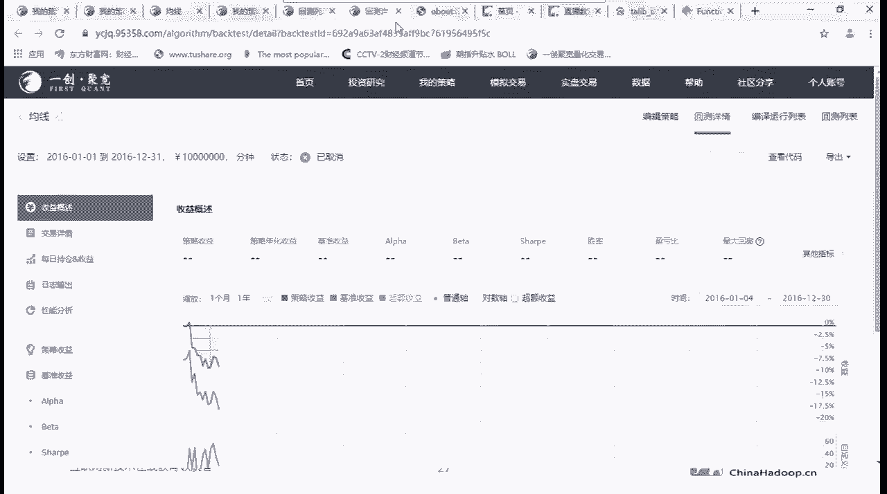

那看到啊这张图呢，这个这个是这个策略的回测的这个收益曲线啊，下面这张图就是我们刚才自定义的通过RECODE，然后自定义的这个图啊，就这个图啊，这个图啊，那这个图呢我们大家可以看到啊，最大最小值是零。

最大值呢它其实呢是100啊，也就当我们仓位占满的时候，他就是百分之百好，他每天呢都会有一个点啊，这个回撤结果了，我们回测完了之后呢，就会有这么一个折线图啊，就是我们每天持仓的占比，这样呢我们呢方便呢。

能看到我们这个资金的利用情况啊，好就这么个概念，我们回到刚才的这个代码里面啊，啊也就是说每天收盘后呢，我们实际上就干了这么三件事啊，第一个呢我们判断是不是这个呃调仓日啊，到了调我们根据这个计数器啊。

我们去看是不是调仓日，如果是调仓日呢，我们就去更新股票池啊，这第一件事啊，接下来呢嗯我们呢会每天呢我们呢对计数器呢，我们去累加一啊，好最后呢我们呢会画出我们当天的这个，我们会计算出我们当天的这个。

持仓的占比情况啊，然后呢那我们呢嗯放到这个recording啊，这个函数里面，最后呢在回车结束以后呢，会画出一个这个啊持仓占比的这个折线图啊，好这就每天收盘后我们要干的事啊，好接下来我们看看这个啊。

every b啊，就是每一个伴啊，我们这个交易啊，我们到底要做什么，就确定这个函数啊，好，你打开这个推进函数啊，来看一下，那这里呢咳好，我们先看第一个啊，这个平仓调用平仓处理逻辑。

这个前面其实嗯这个全局变量，我们前面啊全这个是个全局的这个常量，我们前面已经给大家讲过了啊，就是说嗯我们跟这个我们上一节课，这个股票池不一样的地方啊，就是说我们这里是置为false了。

所以呢这里呢是忽略了，也就是说啊不管我们股票持调仓不调仓，我们每期股票池，然后调整你以后呢，我们这里呢是不做买入和卖出，这个处理逻辑的哈，这里呢这个段代码呢，实际上这一部分呢是直接忽略掉的。

我们也不用管啊，好接下来我们看啊，那这部分代码大家看的应该是非常熟悉的啊，跟刚才那那个调仓嗯，每隔25天调一次仓是非常像的啊，我们呢这里呢是这个trading bar duration呢，这个是15。

也就是说我们是15分钟级别去检测的，那这里呢实际上呢我们每隔15分钟啊。

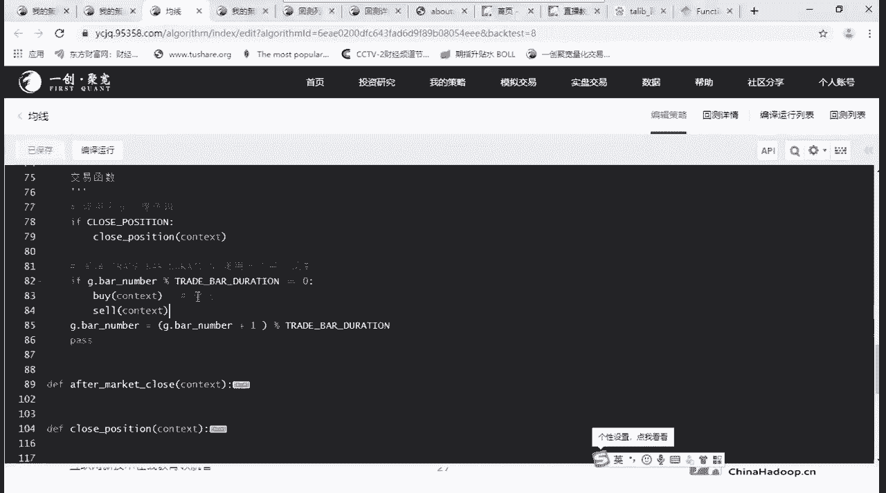

我们去做一次买入和卖出的这个检测啊，操作嗯，大家可以看到啊，这个回撤的时候呢，我们选择分钟，他们不能选择15分钟啊，大家明白吧，你最最低最小的颗粒度就是一分钟啊，接下来就是每天。

所以呢为了达到我们说在15分钟级别下，做回撤呢啊，所以我们自己呢要做一个这个啊这么个呃，这么一个定时执行啊的这个实现，也就是说我们这里实现的就是每15分钟啊，执行一次好，我们先看这个一个是买。

一个是卖啊，我们先看看这个买操作啊。

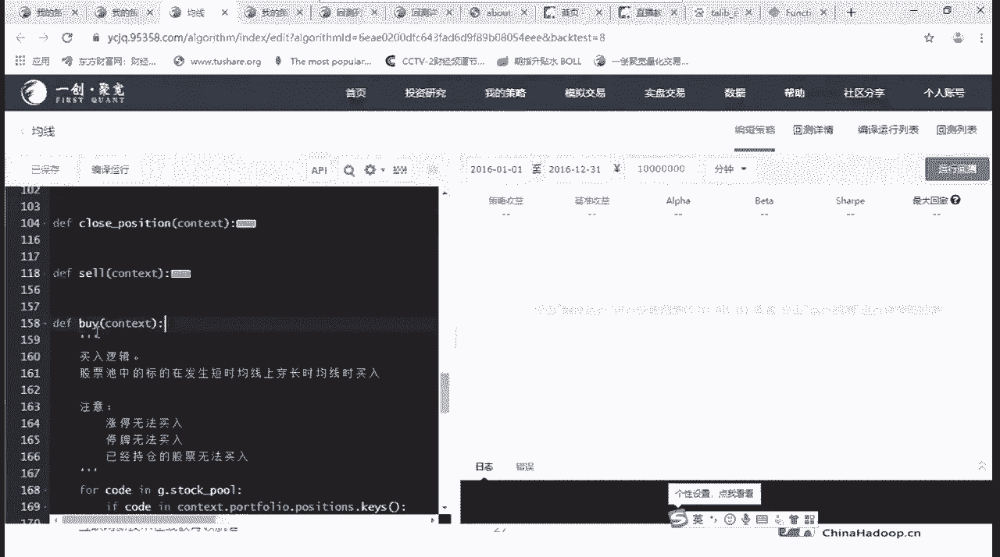

那么这个买操作的逻辑呢。

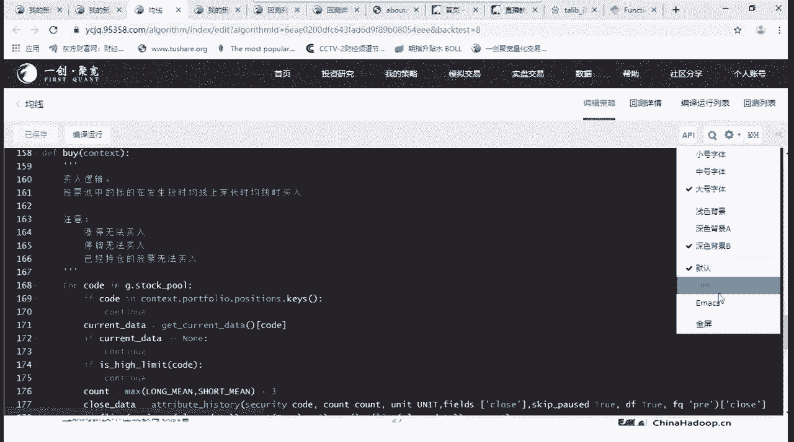

那么前面我们在讲这个均线这个系统的时候呢，给大家说我们就是这个金叉买啊对吧，然后呢我们就来看一下啊，我们去怎么实现的啊，这里呢首先注意有三个点需要注意的地方啊，第一个就是说涨停无法买入。

那么这个地方呢我先解释一下啊，呃为什么我们说这个涨停的时候我们不买呢，啊主要是基于什么考虑的啊，就是说呃大家的实际交易中啊，可能是就是说股票涨停了啊，我们挂单，那么也不是说就一定买不进去对吧。

也有可能能买进去，但是说这种几率呢还是说比较小，那如果说我们在回撤的时候，你你涨停你就能买进去，那是不是说，意味着说咱们这个回撤就占了便宜啊，那么你回撤的时候占了便宜，但是你这个实际在做实际交易的时候。

你又买不进去啊，你就占不到这个便宜啊，那你这个回撤效果再好嗯其实也没什么意义，对吧啊，所以说呢我们在回撤的时候呢，我们就设置的严格一点啊，涨停呢我们就不能买入啊，我们不去占那个便宜啊。

好那么接下来呢是个停牌无法买入啊，这个不用解释了啊，啊停牌了肯定就没办法买卖了嘛，这是A股的这个规则好已经这个持仓的股票，那无法买入，那这个是为什么呢，嗯我们前面这个介绍这个仓位的时候，我们给大家说过。

这个我们这个头头寸配比，我们这个头寸呢分配啊，我们是均仓对吧，均仓的话呢也就意味着呢，每只股票呢买卖的数量呢是一个固定的金额啊，都是一样的，那么你已经持这支股票呢已经持仓了呢。

啊我们呢肯定啊我们就不会再买了，我们不存在的，我们没有我们这个系统没有加仓的逻辑啊，所以呢我们呢这里呢，我们就说已经持仓的股票啊，我们也无法买入啊，我们就不做买入卖出的这个操作，而不做买入的这个操作。

好好我们接下来来看具体的代码实现啊，这个for code in g点stock po，那G点stock pul呢，我们前面在更新这个股票池的时候，已经给大家看过了，这个股嗯，上节课已经给大家也讲过了啊。

就这个基的时候铺呢，其实就是我们的这个股票池啊，就是我们每一我每一期啊，或者说每个调仓日产生的这个股票股票池列表，那么我们所有的这个买入呢，肯定针对的呢，都是我们的这个符合我们筛选条件的，这个股票啊。

也就是我们候选的这个股票列表，好我们我们接下来看啊，这这是三啊，这是这是我们就检测三种不能买入的，这个条件情况，第一个这个context position点case，这个呢是说呢嗯我们已经持仓的股票。

我们无法买入，那么关于这个position这个对象啊，他这个为什么点case能取出来，所有的自己持仓股票啊，大家可以看一下他这个API啊。

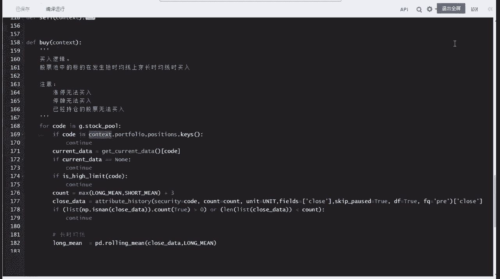

这里面有个对象啊，大家看一下context，context里面呢这里面呢有个PDFO啊，他就是说是我们的这个账户的总总信息，然后呢账户的总信息下面呢我们来看一下啊，啊总账户的这个信息。

总账户信息在下面呢有一个这个啊pence，然后呢他他这个我们因为我们是股票持仓，我们是默认只有多头没有空头的，所以说呢他就是默认的就是一个long pons，这个long person。

他说呢它是一个字典类型，那么key呢就是我们的这个证券代码，然后value呢就是这个position对象啊，大家大家等一会感兴趣，自己可以去看一下这个position对象啊，也就是说我们这个字典。

我们取出来的所有的key啊，就是我们所有的持仓股票啊。

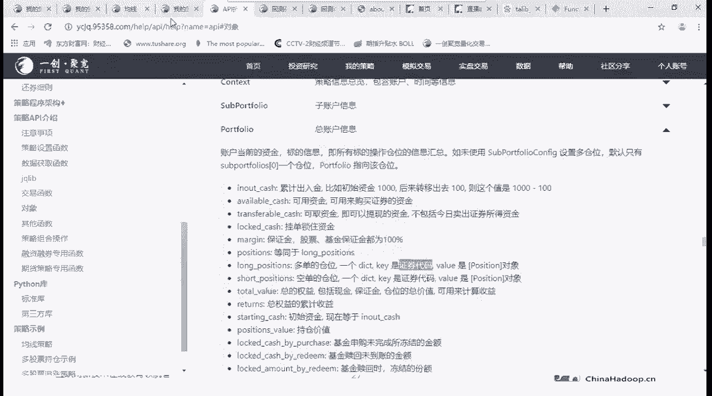

好这一点给大家讲清楚了啊，啊这个就是我们所有持仓的股票好，如果说我们这个股票池里啊，这个股票呢已经在我们的持仓股里面了，我们呢不做任何处理，直接抗金就跳出，继续继续看下一只股票。

接下来呢这个get creation date呢，这个呢其实呢是获取的是，我们当前这个时间点啊，这一支股票啊，他的这个呃一些这个成交价，还有一些价格的信息啊，那这个呢也是距宽的一个内置的一个函数啊。

大家可以通过这个API啊，然后自己呢去查去看一下啊，好如果说他当前的这个数据呢等于空，哎也就是说这支股票我们没有查到这个数据，而这种情况下呢，通常来说呢是不太会去发生的啊，但是呢为了这个程序的严谨性啊。

我们这里还是做了一下判断啊，嗯为什么说这种情况不太常发生呢，因为呃他等于漏的情况下，说明了这个股票要么停牌，要么用呢，就是说没有数据，通常来说呢呃通常来说呢，这个股票呢没有数据呢。

可能是因为这个就这个一创巨宽呢，他这个数据缺失啊，这种情况下可能还是比较少的啊，啊不太会碰到，好好，接下来呢是这个1HILIMIT，1hilimit，这里呢我们是说啊我们这个停牌无法买入。

然后呢涨停无法买入啊，我们就是判断是不是停牌或者涨停的好，我们来看一下这个也是海内密，我们就怎么判断啊，好这里呢同样的呢我们是啊，首先我们get creation data，我们呢来获取呢到这支股票啊。

当前当前时刻啊，他的这个所有的信息，那么last surprise呢就是它当前的这个限价，然后HILIMIT呢就是说当天的这个涨停价，那么如果它大于等于当天的涨停价，那就说明它是涨停了啊。

这是涨停的情况，接下来呢是在past是说啊，如果说他是停牌了，那么这里呢就是这个pass他就是for啊，他就是true，好，这两种情况呢我们是不交易额，我们是不买入的啊，好我们来回到刚才的代码啊。

啊这个涨停无法买入，那到这里呢就是我们三个不能买入的的情况呢，我们都把它过滤掉了，好接下来呢我们就需要从距宽来获取数据啊，我们来去计算它的均线值，然后呢去检测它的信号，好，我们来看啊。

首先我们设置了一个count，这个count呢是指查询数量啊，是我们要要获取多少数据啊，要获取多少根瓣儿的，这个就获取多少根棒儿，那这里呢long min呢我刚才说了，他是30啊。

shot me呢是五哎，也就是说我们取一个max时，我们取一个最大值，那么取最大值呢也就30，30呢，这里加三也也就33，好，我解释一下这个地方啊，因为我们计算这个均线的值。

比如说我要计算这个30日均线，那么30个瓣儿的均线，那么三四个瓣儿的均线呢，我们知道它需要至少需要30根瓣，那么我们在我们判断这个呃，金叉或者死叉的时候呢，我们前面给大家啊讲讲了。

我们至少需要三三个点才能去做判断啊，所以呢我们需要三个这个均线值，三个均线值呢其实就是30+2，也就32根半啊，那我们这里呢取了33根本啊，其实多取一根啊，这个没有关系啊，好接下来我们看看啊。

这个我们通过这个attribute his story啊，这个方法就是距宽内置的方法，我们通过了他们来获取这个数据，好这个方法呢大家呢也可以在API里面去查啊。

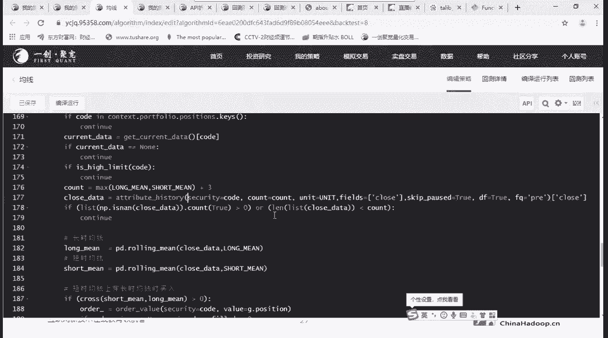

这个都在这个交易，这个测额数据获取函数里面啊，在这个地方啊，大家可以去查一下。

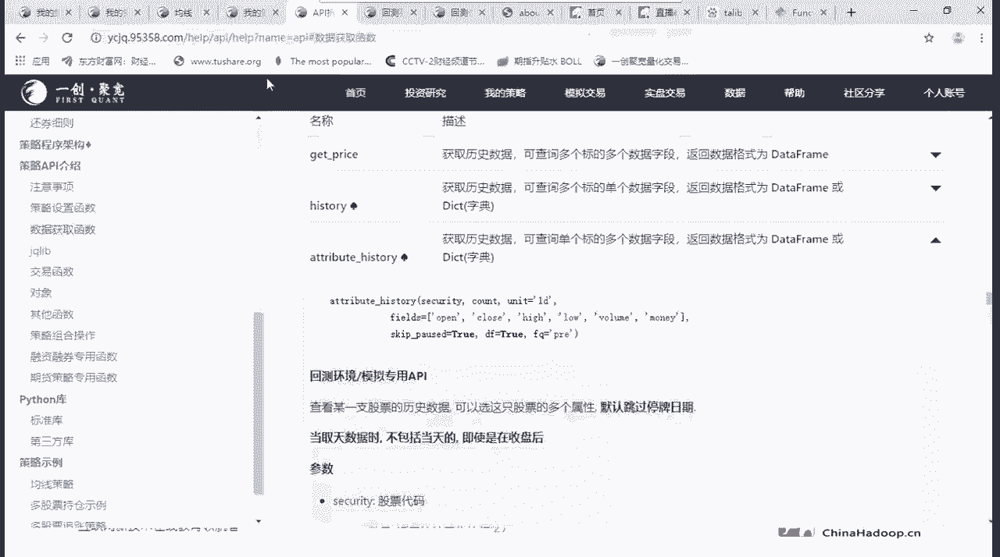

来看看它的具体说明哈，我们来回到我们自己的代码里面啊，那最终呢我们通过这个方法呢啊，会查到这个unity是指是呃，是我们前面定义的15分钟，也就是说我们查询的这个是15分钟级别的，这个数据。

然后呢我们查询34313个K线，K线的这个数据，那么在这里呢，它最终呢返回的是一个data frame的这个结构啊，也就是一个多行多列的，类似于一个excel表格的这么一个数据结构。

那么呢我们只取它个收盘价这一列啊，我们要用收盘价来计算它的均线啊，好那在这个计算均线之前呢，我们首先检查一下我们这个数据的有效性啊，看看这个数据呢是不是满足我们计算的需要啊。

我们首先呢这里呢我们检查一下我们这个呃，我们这个时间序列的数据啊，也就我们这个收盘价这个序列数据啊，他是不是里面有空的值，就是有无效的值，那么有空的值，那就可说明了数据还是存在个问题啊，这个时候呢。

我们呢其实呢我们也不做信号的检测啊，没有意义对吧，数据都不完整，还做什么信号检测呢，好这是第一种情况，我们不做信号的检测，那第二种情况呢是说呢，嗯他这个收盘我们本来要查询32根。

但是呢现在呢呃他这个数量呢都还不足32，33个，33根这个K线啊啊不足32根K线，那么这里呢我们呢也是不做任何查询，哎，也是不再往下检测这个买入信号的啊，因为K线数量都不够呃，比如说可能是新股是吧。

那剩那个时间都还不够呢，所以呢这个时候呢我们也是不做查询的好，接下来我们看看计算常识，均线啊，其实非常简单啊，就是一行代码，你比如说我们计算这个呃，这个是计算334根K线的这个均线。

那么这个我们调用了pd，pd就是我们前面导入的这个啊，就我们导入的这个啊pandas as啊，这个ELPD啊，就是作为一个我们给它起了个别名啊，起了一个简称叫pd啊，它的名字叫pandas as。

这个库我们给起了个简称叫pd啊，接下来我们可以用pd啊，就是代表它好，还回到刚才的代码里面，这里面我们调用pd点RNINGMEI好，我们输入两个参数，一个CLODATE，一个long me in啊。

也就是说我们计算这个序列啊，我们P我们去去去做滑动窗口啊，每30个窗口，然后我们计算一次，然后计算出它它的均值，那实际上呢这个呢我们是总共是有33啊，有三十二三十三个数据。

那实际上呢我们最后呢嗯会计算额会每一行啊，每一条数据呢都会计算出来一个均值，那如果说比如说第一条数据，第一条数据它往前它其实是没有30根数据的，那么这时候呢它就是一个NAN的数据啊，大家理解这一点啊。

实际上我们这个计算结果最后计算出来呢，我们只有四个有效的数据啊，也就是说后四根K线是有效的数据，但实际上我们只用到了啊，后三根K线的这个均线值啊，好短时均线是同样的计算方法啊。

好那么这里呢接下来呢是通过close方法啊，我们来判断呢啊我们来检测啊，他是不是触发了这个金叉这个信号啊，curse前面也给大家讲过了，当cross呢嗯它的参数两个，一个是这个呃。

都两个参数上都是时间序列的数据啊，一个是shot me in啊，一个是long me，如果说这个大于零呢，就说明了发生了我们检测到金差，如果小于零呢，说明了如果是呃等于如果是等于一呢。

说明我们检测到金差，如果等于一呢，说明我们检测到死差啊，如果等于零，那说明我们既没有检测到金仓，也没有检测到时差好，那这个地方呢就是说大于零啊，也就是说我们检测到金差，那么检测清查以后呢。

接下来呢我们呢呃就通过这个order rue啊，来执行下单的这个操作，那order value呢它也是这个巨宽的内置的函数啊，大家同样可以通过API啊，去查找一下它具体的这个用法啊，我就不再啰嗦了啊。

好那么order value呢这里呢我们输两个字，一个是呢我们指定了我们买了哪一只股票，第二个呢子弟呢我们要买入多少钱的，那这里呢记者PARATION呢，其实呢也是在我们前面在做这个初始化的。

那个时候呢，我们去做设置的，也就让我们策略啊初始化的时候去做的，我们就已经计算出来了，这个呢是avariable cash呢，就是说我这个策略啊一开始运行的时候，我中有多少的可用资金啊。

这个是指可用资金啊，如果你每一天调用它，就是每一天的可用资金啊，因为我们这个初始化呢，只就只在策略启动的时候啊运行一次，所以说呢这个可用资金呢，就是我们的这个前面设置的这个可用资金啊。

好那么可能资金除以200，这个200是什么呢，就是我们统计出来我们整个这个股票池啊，每一期啊大概呢是200只股票左右啊，好最后呢我们就计算出来，我们这个啊每一只股票啊，大概要买入多少这个头头寸啊。

那么这里呢我们有通过auto value呢，我们下单成功了以后呢，那么巨宽呢它会给我们返回一个这个order对象，那么order对象呢其实呢就是我们这个订单啊，这个成交的状态，包括我们这个是不是成交呀。

然后我们当时这个成交了多少手啊，啊等等这些信息啊，好那么接下来呢我们就通过这个判断，就是如果这个order不为空啊，不为NO啊，或者说是呢order的field也就成交数量啊，他是大于民的。

好接下来我们把日志打印出来啊，买日志多少啊，我买入的什么股票，买入了多少买啊，买入多少钱的，买入多少股啊等等这些信息呢，我把它打印出来啊，这里呢其实呢大家呢嗯注意呢，就是说嗯，大家呢在这个做这个策略的。

这个编写的过程中啊，啊一定啊嗯就是尤其呢要是注意啊，通过这个打log的形式啊。

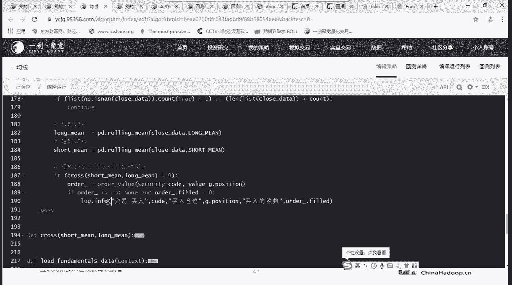

啊就就在这里嗯，把这些呢重要的信息呢都记录下来。

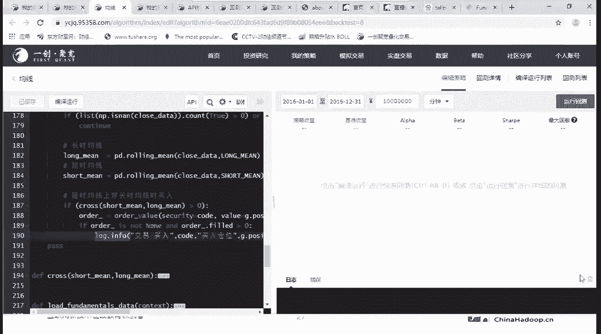

这样呢以后呢你再啊查找你这个策略的呃，如果说哪儿运行错了，或者是这个买入的是买该买的没买，该卖的没卖啊，啊这些问题的时候，我们就比较容易去查找啊，好啊，这是带这个函数的这个逻辑啊，也是我们的买入好。

接下来呢我们来看看卖出啊，那么这个卖出呢其实呢相对来说呢，嗯大致上呃大部分代码基本上都相同的啊，就我说几个不一样的地方啊，这个地方呢就是说对应的是，我们那个涨停无法买入，我们有一个停牌无法卖出啊。

啊有个跌停无法卖出啊，好另外一个呢就是说我们没有可卖出仓位时，无法卖出，这里呢我需要给大家解释一下，嗯就在这个地方啊，就是close able amount小于等于零，这什么意思呢。

就是说我们比如因为我们在15分钟级别下，做的回撤啊，那如果说我们当天这个呃在盘中，我们把它买入了，然后呢盘中呢有可能呢又会出，触发这个卖出信号啊，那么因为A股是T加一，所以呢我们当天呢其实呢我们是没有。

可我们是不能卖出的，那么我们当天的这个可卖出数量呢，它是其实是呃等于零的啊，所以呢这种股票呢，我们也不需要检测他的这个卖出信号了，检测了也没意义啊，卖不掉好，另外呢我们对于这个嗯卖出呢，我们的这个。

我们只针对于我们的持仓股去检测啊，然后买入我们针对的是我们的这个呃股票池啊，大家可以看到这是我们持仓股啊，对吧好，接下来呢这个获取数据的逻辑都是一样的啊，那这个地方呢不一样呢，就是说呢哎我是小于零啊。

也就一即时差慢啊，好然后呢这里呢是order target，刚才是order value，order value呢是我买了多少钱呢，all target呢是指呢我把我把它，我把我这个股票呢啊处理呃。

卖出啊，一直达到数量达到多少，我这里选的是零，也就是说，等于我把我所有的持仓股全部都卖掉啊，大家可以去查一下apl out target好，那到这里呢，我们整个这个均线系统的的这个类呃。

所有的代码呢都给大家讲完了，也就是说呢啊首先呢我们会初始化啊，初始化的这个过程中呢，哎我们呢啊通过设置一些基准啊，包括动态互权呀这些啊，包括设置这个股票的滑点，还有这个佣金啊。

总之是那一堆的这个初始化的设置，然后呢我们重点呢就是说我们执行的，我们就是这个trading和这个aftermarket clothes啊，这个是指我们收盘后啊，我们要去更新我们的股票池啊。

崔定呢是指那嗯每分钟啊，我嗯每个呃每一分钟啊，我们要运行，我们要做什么操作，我们这里呢实际上呢是做了一个定时器啊，然后每隔15分钟呢，让我们去检测买入和卖出信号，执行买入和卖出操作啊，好。

那么这里呢就是整个的，我们这个均线系统的代码。

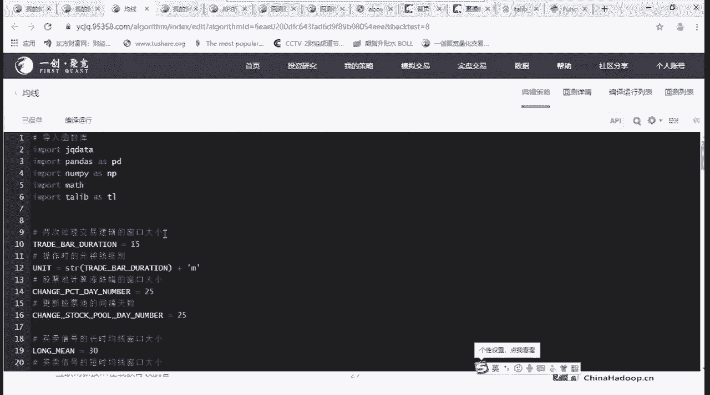

啊这都给大家都讲过了啊，好这个地方也都讲过了，好我们接下来看看这个啊均线系统们的，我们已经讲完了，接下来我们看看这个MAACD，背离的这个系统啊。

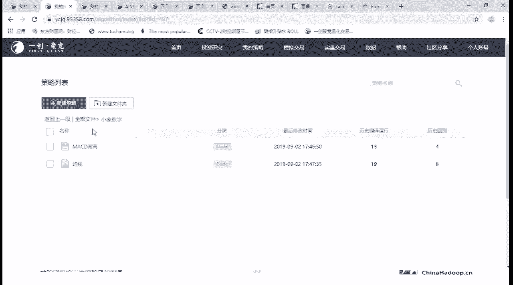

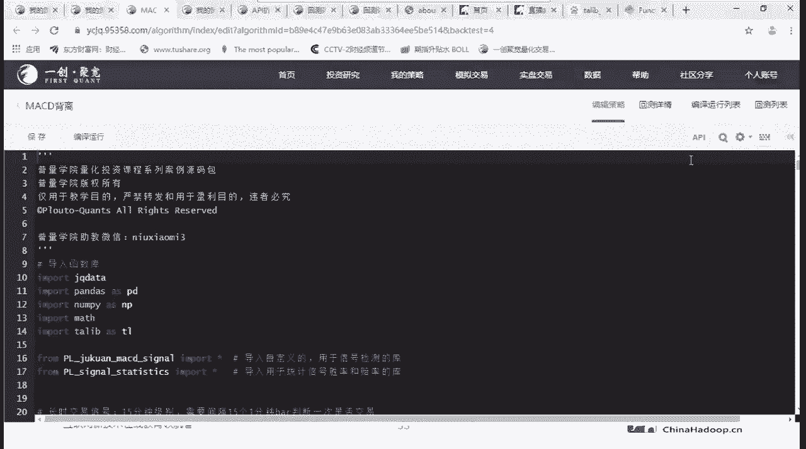

哦那么咳这一样的地方呢我就不再额外讲了，就重点讲一些不太一样的地方啊，啊这个地方呢是说嗯这个PL距宽，Mcd single，这个是我们啊，包括这下面的这两个库呢，是我们第二节课给的这个代码包啊。

大家不知道还有没有印象啊，就是我们自定义的啊，这两个这个MACD检测以及MACD信号统计的这两个包，那么这两个包呢。

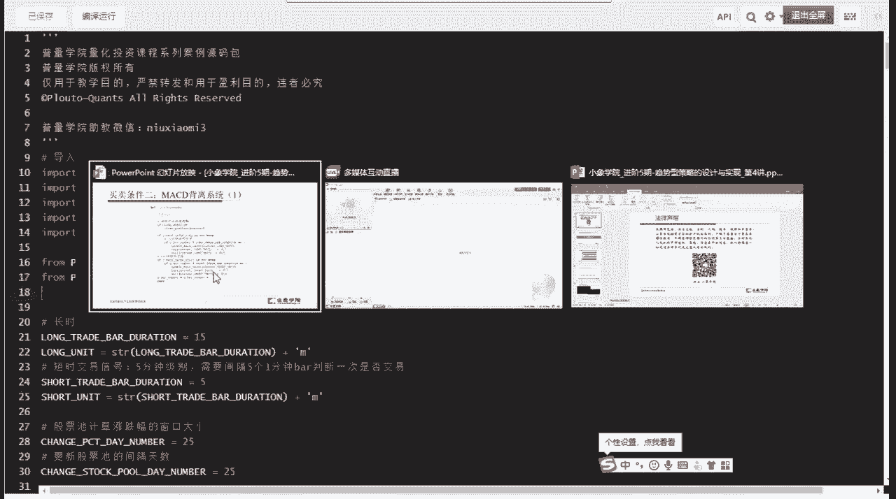

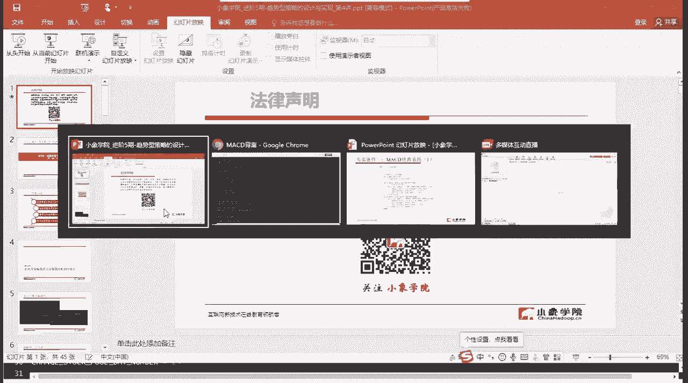

我看一下啊，好，那么这两个包呢。

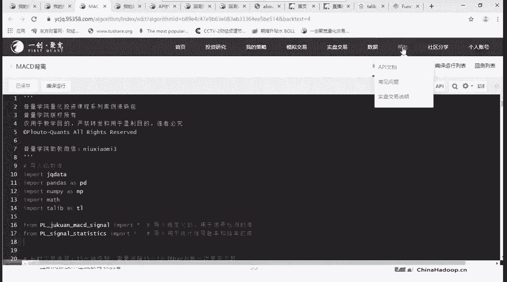

其实我们是在这个啊投资研究这个模块，然后呢我们通过这个上传，然后呢把它啊导入进来的，那么导入进来以后呢，就是在这个地方啊，我们其实是应该是导入了这这么四个包啊，啊四个文件啊。

那么我们其实主要用到的呢是这个检信号，检测呢是用到的这个啊，好嗯带大家简单看一下啊，这一个地方啊，因为待会会有一个比较重要的，我们会用到这个信号检测。

检测呢其实呢我们就是用这个p l m CD catch，那个其实呢它每一个伴呢他都会做一个检测啊，初始化的时候呢，他会指定一些啊这个股票的这个列表，你要是要检测哪些股票啊，检测什么级别下的啊，股票啊。

包括那个初始化的这个时间，那么它每一次检测每一个瓣，它检测呢我们我们看这个注释啊，它会保存这些信息啊，就是每一个首先是每根瓣的信息啊，每根瓣包括收盘价啊，这个是不是触发金叉，是不是触发死差啊。

包括在这根瓣上，它检测的这个DF极值呀，close极值的这个时间点啊，包括MACD的时间点啊，最后一个比较重要的，跟我们这节课相关的就是这个delivers啊，就这个divergence啊。

这个division是呢，它这里面呢它其实是一个字典类型哈，这个key呢是股票代码，然后接下来是这个value，value呢是指这个当前时间点上检测到这些背离啊，有有可有一些是有可能是顶背离。

也有可能是底背离，那每一个时间点呢有可能呢啊，检测到好几个背离啊，比如说他这个触发这个底背离啊，他有可能呢啊跟好几个点啊，组成了好几个这个底背离，那么这个时候呢它实际上是这个value呢。

就是一个列表结构，就是一个这个数组啊，包含了多个背离的信息，好这点呢需要给大家介绍明白，然后我们再看看这个背离，它具体记录的是什么啊，好，我们来看看这个背离啊，这个p l divergence啊。

这个divergence呢它主要是记录了这几个点，第一个呢是tap哎，就是说是顶背离还是底背离，然后接下来呢是他这个背离的这个啊，极值的时间点，第一个是第一D啊，前一个地府的这个极值点。

当前这个地府的极值点啊，最后一个是这个可见度啊，衡阳路就是我们通过这个啊，地府还有MACD啊，我们啊最后计算出来一个结果，计算出嗯这个其实是什么呢，就是这个背离的他这个明显的程度啊。

这个这个就是背离的两个参考点，他的这个时间啊好一个是price，一个price，一个lost，好，我们还回到刚才这个MACD的这个代码啊啊。

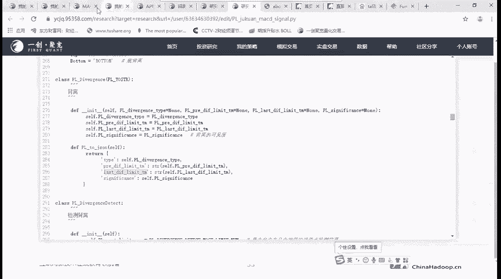

好这是个检测的信号的，那两个我们就给他简单回顾了一下啊，好这些呢我就不再介绍了，跟那个没有什么太大区别，然后呢主要是这个地方啊，我们检测MACD的时候呢，我们是记在15分钟级别下检测。

又在5分钟级别下检测啊，所以这里面额外定义了一个5分钟级别的，我们把它叫做short，这个10分钟级别的，我们把它叫做浪啊，好我们接下来就看他的这个呃初始化啊，就是init to globe。

它也有些不太一样的地方啊，这里呢有一个G点，mc d catch闹呢这个其实记录的是呢，我们呢会缓存呢，我记录一下我们15分钟GB2级别MACD，需要的数据啊，就我们前面给大家看的这个嗯。

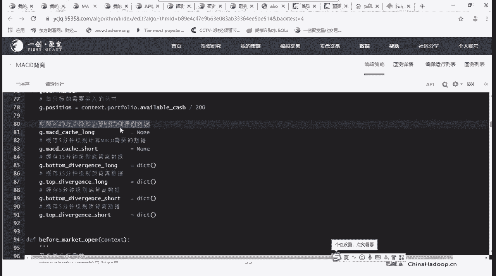

就是PLO这个呃MACD啊，Catch，啊就是它就这个对象啊，会把它保存下来啊，我们会保存15分钟级别的，还有5分钟级别的啊。

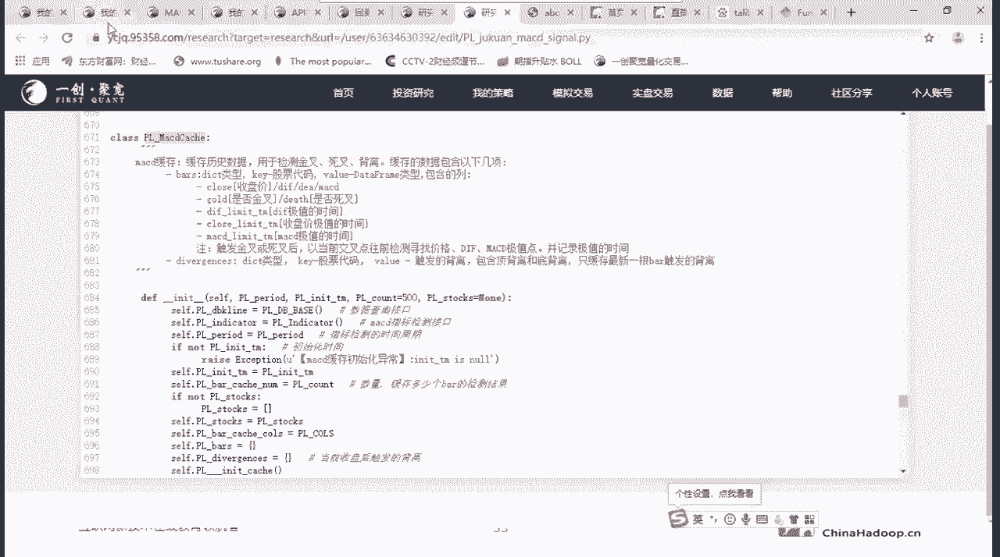

好还回到刚才的代码里面啊，我们会把它都保存下来，那么接下来呢是这个我们会保存这个嗯，每个这个是每个时间点的这个背离，接下来呢这个呢是所有这支股票的这个背离的，这个数据啊，我们都会把它保存下来。

这样呢我们可以去检测这种连续的背离啊，好，就是INTRINITIAL那个里面啊，我们跟这个均线系统不一样的地方，接下来我们看看这个aftermarket cloud啊，也就是说我们收盘后运行的啊。

收盘后运行的呢，这里呢实际上我们要干的事呢嗯更多一些啊，不仅要更新股票池，同时呢我们还要去缓存去计算啊，我们当前这个股票池，这是我们股票池的股票啊，我们把它放到一个这个呃集合里面。

同时呢还有我们持仓股的股票，我们也把它放到这个集合里面啊，因为我们股票池和持仓股啊有可能会重叠对吧，比如说我们当天这个股票池啊，有些股票已经触发信号了，那么呢我们可能呢就买入了，买入了呢之后呢。

这个持仓股里面也有它，在股票池里面也有它，所以呢他就是会产生这个会重复啊，所以呢我们通过这个集合啊，我们把它放到一个集合里面，它它有自动去重啊，也就是说所以最终呢这个stock铺呢啊。

这个局部的stock铺啊，它是一个呃不重复的这个股票代码集合啊，好，接下来呢我们就需要调用这个PROM，CD catch啊，我们分别缓存了啊，是我们分别去计算这个15分钟MACD。

还5分钟MACD需要的这个数据啊，应该放到这个macd catch now，和macd catch shoe shot里面啊，好那这样的话呢相当于说呢我们呢就缓存了。

我们就把这个15分钟级别和5分钟级别，这个MACD的嗯金叉死叉啊，这些都检测出来了，包括背离，顶背离或者底背离都检测出来了啊，但是这时候我们还没有检测，这种5分钟级别的连续背离，我这里还没有啊，好好。

我们接下来看看这个崔定里面做了什么事啊，然后再给我确定里面，那确定里面呢这里呢嗯这个浪是15分钟级别，那么15分钟级别呢我们我们先看一下啊，首先呢这个地方大家应该很熟悉了啊。

就是我每隔15分钟去咨询一下啊，嗯就是我们刚刚才均线也讲了，就是定定时执行的啊，就实现这么个功能，这个呢是每隔5分钟执行一次啊，好我们先来看一下update mcd catch这个方法啊。

那么每隔15分钟呢，他会执行一下更新m m m CD cash，那么如果是说我们先判断一下啊，unity啊，这里呢它会传入一个参数unity，如果unity呢是等于15分钟级别好，那么我们看看啊。

首先呢它会调用我们这个15分钟级别缓存的，这个macd catch啊，这个对象他去执行一下update catch就是更新，那么更新呢它会调用当前时间，那么也就是说它传入当前时间的时间戳。

也就是说呢嗯实际上在这个地方呢，它会检测一下当前时间点，比如说嗯现在是9。45，来检测一下9。45啊，这根棒啊，是不是产生了这个背离啊，啊主要是检测这个事了，好这里呢它其实定义了啊。

前面我们已经定义过了，这是bottom啊，diverging long啊，一直top啊，diverging snn啊，就是说顶背离和底背离，我们都会存存放在这个里面，那么前面我们说这个地方。

它已经更新过了之后好，接下来我们看啊，它这里呢实际上呢就是说呢如果检测到啊，这个地方产生的这个获取，最后有一根半还检测到的这个背离，也就是说所有的背离我们前面已经说了。

这一在这一根半上可能会显示出来多个背离啊，它是一个啊数组啊，好我们去遍历它每一个背离啊，我们把他所有的这个如果是这个背离，是底背离好，那么我们就把它呢啊记录下来，放到这个，我们把他的时间记录下来。

我们把它放到这个啊，15分钟级别的这个背离啊，这个底背离啊，这个嗯这个字典里面我们呢记录它的时间戳啊，相当于说我们把这个背离的这个呃时这个伴，然后记下记录下来了，好我们会同时呢我们大家可以看一下。

以以它为key啊，我们把它记下来记下来，同时我们会记录在这根半上，而检测到的背离它的前一个当前嗯这个参考点，它的时间点和它的前一个参考点的，这个时间点啊，我们都把它记下来了。

这个呢是用来我们判断这个啊连续背这个，那么其实呢在这个15分钟级别呢，我们不用检测这个连续背离，所以说这个地方呢其实是没有太大用的啊，我们不用管它，那主要是有用的呢，其实呢是在这个地方啊。

就是5分钟级别的啊，唉同样的逻辑啊，也就是说在5分钟级别，我们要检测它的连续地背离，所以呢我们这会待会会用到这个地方啊，好我们接着往下看啊，也就是说我们每一根到这里执行完了以后呢，就是说我们每一根棒。

它检测，我们已经可以检测到他的这个顶背离和底背离，已经做了检测了，并且呢我们把检测到的结果呢我们缓存到，我们把它保存到我们的G啊，哎我们前面定义的这个G点，这个D呃，divergence啊里面了。

就我们这四个后面是bot啊，bottom divergence nn啊，top divergence nn以及short啊，short的两个好，我们把它保存到这个里面，完了之后呢。

我们接下来看买入和卖出的这个操作啊，我们先看一下这个买入买入的操作啊，好这里是买入的好这里是买入的操作，那么这里呢我们看看啊，如果说是long unity，也就说是15分钟级别了。

那么接下来呢我们看一下啊，只要我们判断当前的这个时间点，是在我们缓存的这个时间点里面，因为我们已经缓存过这个时间点了，那就说明这个时间点确实是发生了这个背离，对吧。

所以呢这个时候呢因败我们把它置为true，也就是说可以买入，然后by tap呢，也就是说啊我们这个买入信号触发啊，是哪个信号触发的啊，这里呢我们是用long，也就是说是15分钟。

这个底背离的信号触发的好，这其实就是做一个标识嘛，好接下来我们看啊，这个是15分钟级别的啊，也就是说底背离我们做买入，接下来呢是这个5分钟级别了啊，5分钟级别呢我们去判断它的连续背离，其实也很简单啊。

首先呢那是他要我们要求这个5分钟，这个伴儿呢他是必须得发生的这个底背离，然后呢我们才去继续去检测，然后接下来呢我们说这个背离呢，它会有多个背离，所以呢我们找到这个时间点以后呢。

我们要把这个时间点的所有的背离呢，哎都拿出来，也就是说这个NXNS呢，就所有的背离的这个这个数字到底有多少个因，到底产生了多少个底背离，好接下来呢我们看啊，这个呢就是我们分别取到每一个这个底背离。

然后呢我们把底背离的前一个这个极值点啊，也就是说这个呃参考点对应的时间，让我们把它取出来，好接下来我们往下看啊，这里呢我们是说我们把所有的这个嗯，我们已经缓存的这个底背离，我们把他所有的都遍历一遍。

我们去拿这个时间点，去跟这里面的每一个底背离的这个呃，当前的这个时间点我们去做匹配啊，如果匹配上了，也就是说他俩是相等的，那么就说明了去我们在这个点时间点上呢，检测到这个连续的底背离。

这里呢我们就一直by啊，置为true，这个呢by short呢只为by tap呢，我们之为short，比如说我们检测到这个连续底背离，而在5分钟级别下检测到的好，那这里是买入哈。

然后呢一拜呢我们前面说了，如果我们检测到这个15分钟的底背离，或者说5分钟的连续底背离，这个一拜呢就是CHO，接下来呢我们会调用这个order value，然后我们做买入操作啊，好。

好这里呢买入卖出的逻辑呢啊，基本上呢额跟那个买入的逻辑啊，都比较相似了啊，不过呢他是用的是顶背离啊，这里是触发了顶背离，我们把它卖出，触发了连续顶背离，我们的我们也卖出啊。

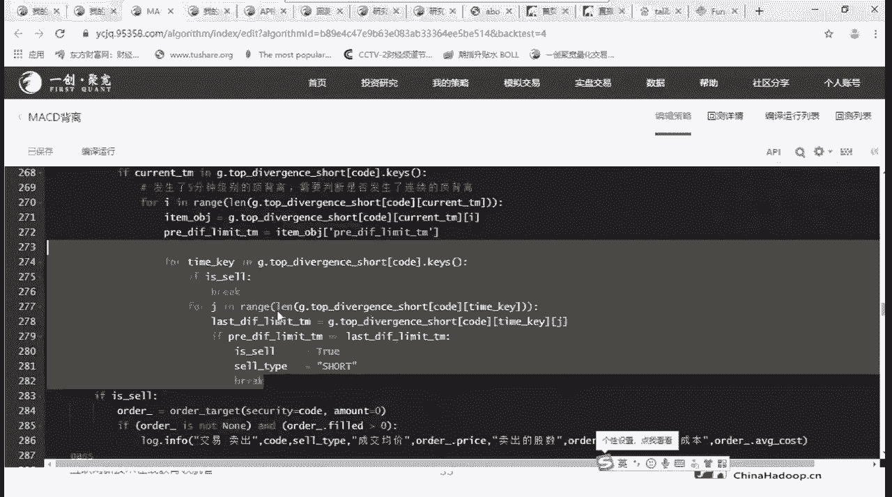

好啊我就不再额外的多讲了，好那么我们MACD这个背离的系统呢，我们也讲完了，好我们还回到我们的这个PPT啊。

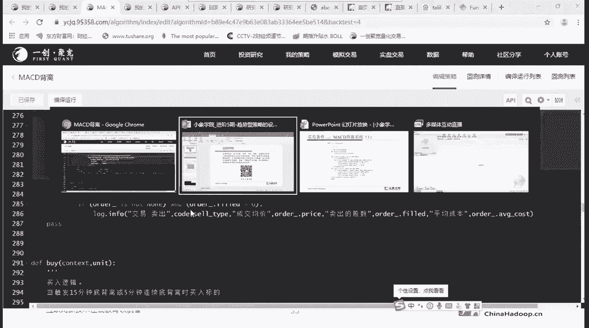

好接下来看看这个啊，优化趋势型策略的思路啊，还有这个方法，等我股票池的这个检验，均线系统的回撤，好我们先看一下这个，好我先看看这个股票池的这个检验啊，这是我们那个之前做的这个。

单纯的股票池的这个回车曲线嗯，这个红框这一部分呢我们前面也已经讲过了，我们说我们今天的目标呢，就是说看看这红框的地方，我们能不能把它变成正的，然后呢，让他跑赢同期的这个沪深300的这个指数啊。

这个这个最后呢这是我们回撤呃，这是我们均线系统的回撤的这个结果啊，他跑赢了这个同期的沪深300嗯，但是呢最终他这个整个一年的收益还是负的啊，策略的收益最终是大概是负的7%啊，夏普也是负的。

那说明这个均线呢，那确实呢可能是有些滞后啊，也可能呢是我们呃ma5上传ma30啊，就是说这个金差额可能这个参数取得也不够好，但是呢如果说要验证，就是说这个均线系统是不是会有好的效果啊，大牙呢可以呢。

这回去啊，就在我今天的这个代码的基础上，修改一下参数啊，去验证一下啊，刚才已经给大家讲过，就是说哎改了哪些参数，但是呢我要强调一下，就是说量化这件事呢本身来说呢，他是需要动手的啊。

就是说你有了思路以后呢，嗯可以去通过一些简单的参数的调整，让大家去实际测一测试一试，但是呢我们不是说啊，让大家去有意的去做礼盒啊，那只是说我们去改变一些参数的方向啊，我们去看看呢啊，这些参数的调整呢。

能不能带给我们更好的效果啊，建议大家啊课下呢一定要去试一试啊，好我们再看看这个MACD这个背离的系统啊，这个看上去呢好像是好了一点啊，不仅我们说跑赢了这个同期的沪深300，并且我们这个收益呢也是正的。

整个2016年一年下来，我们这个策略的收益可能将近百额，将近10%啊，那就是说我们今天的目标呢也算是达到了，但是这个还是有问题啊，就是说我们这个最大回撤大家看一下啊，他还是有些大啊。

最大回撤有10%将啊，9%，但我们从这个夏普比例上来看呢，他下普比率也不是特别高，所以说这个策略呢还是不太理想，嗯回撤大了点啊，收益低了点，总之呢就是说效果不是特别好。

当然我们说呃在2016年这一年赚钱呢，本身呢也不太容易，因为这一年我们看本身沪深300，它也是亏的对吧，那我们这个策略还已经赚钱，能赚钱都已经算是不错了，而且呢到目前为止呢，我们只是加了信号。

我们没有做任何的调优啊，我们就是用的这个15分钟的MACD背离，还有这个5分钟的这个MACD的连续的底背离啊，就是这么简单一个条件，这里头呢还有很多可以改进的空间啊，就怎么改呢，大家呢嗯同学们。

我们可以把这个呃这个背离的这个周期啊，再扩大一点或者缩短一点啊，当然呢嗯也可以去试试修改其他的参数啊，代码呢都已经给大家了，大家呢可以呢，下面呢通过修改几个参数啊，去再去实现呢这几个这个思路啊。

刚才说的这个思路，但是我们说啊这里面啊，我们大家呢还应该有些更本质的思考啊，就在做回测的时候，我们要把这些个啊日志啊都打印出来，这一年中产生的啊，所有的这个交易啊，我们都记录下来。

大家呢回去对照一下这个记录去思考一下，就思考这么几个问题，首先是说呃这个均线系统，不管还是不管是这个均线还是这个背离系统啊，第一个点我们有没有抓到趋势啊，就是说该抓到的趋势啊。

我们都抓到了嘛啊这是第一点啊，就是说接下来是说如果说抓到了这个趋势，或者说多数的趋势，我们确实已经抓到了，但是呢我们是不是锁定了，我们应该得到的这部分收益啊，也就是说我们的退出的这个方式到底对不对。

或者嗯然后呢就是说我们抓错的时候啊，就是说这个这个信号啊，我们入场了以后呢，他可能是个假突破，那么我们止损了吗啊，我们有没有进行这个及时的去止损，就是说我们的退出信号及时吗，啊。

再有就是说我们这个信号的这个入场，是不是滞后啊，会不会太慢啊，最后就说我们这个信号的成功率，是不是实在太低了，可能说做了十次啊，只有一次是对的啊，这些问题呢都是解决我们这个收益和回撤，这个平衡嗯。

我们应该解决的一些本质的问题，所以说啊我们不能说单独的说调几个参数呃，当然是当然啊大家去试一试体验体会一下，这个也是可以的，特别是呢，之前没有这个制作过量化策略的同学啊，嗯拿到我们给大家的这个代码包啊。

试一下，啊亲自体验一下啊，就是说大家既然有兴趣去做这个，量化策略的研发啊，还是要体验体体验一下这个过程，但是体验完了之后呢，我们还是要回到这个真正的这个本质的问题上，就是说首先我们要做一个量化策略。

拿到了回撤曲线啊，那它是不是验证了我们的策略逻辑啊，就这件事我们要把这些问题啊都提出来，就我刚才列的这些问题啊，这些才是真正有意义的问题，而不是说我们的参数，比如说这个呃这个短时均线和长时均线啊。

我们是取五好还是取三好啊，取30好还是取100好啊，这个都不是本质的问题，本质的问题是在哪，你作为一个居呃，这个趋势型策略你有没有抓到趋势对吧，那既然是我说我们说它是趋势型策略，那你这个趋势漏掉了。

那那还叫趋势性策略吗，那么既然你抓到了这个趋势，那么你的趋势这个趋势这个收益你锁定了没有，那么如果抓错了，有没有止损信号，是不是够及时啊，然后说我们的信号是不是成功率太低了，这些问题啊才是我们的重点。

才是我们应该呢去对待的出啊，除了我们刚才说到的问题呢，还有交易成本，也可能对它造成的这个影响，因为你这个啊交易的频次呃比较高，那么交易对你的评响呃，交易对你的影响呢就会越来越大。

那么包括持仓的这个周期啊，资金的这个利用率，还有这个年化收益的这种关系，那更更重要的呢还是这个啊，这个资金的管理和风险控制，那这部分呢，那会在你其他条件，我们说都没有改变的情况下呢。

可能呢会显著的影响你一个策略的性能好，那这部分的内容呢啊，还请大家呢有耐心的期待啊，就接下来呢我们第五次课，第六次课的内容，好，那么今天这节课呢啊我们就主要是给大家讲啊。

怎么去实现一个趋势型的量化策略啊，给大家提供了两个呢点PY的文件啊，这两个文件呢都是完整的量化策略啊，大家呢可以通过这个案例啊，自己去尝试一下啊，这就是我们这节课的呢主要的目的。

那么我们这节课的趋势型策略呢，给大家举个例子呢，啊就是我们抓啊这个反转中的小趋势啊，先是大级别，大的级别，我们说是均值回复啊，小的级别呢啊它是有趋势的，就我们抓这种小级别的趋势啊，这就是我们策略的原理。

那理解了这个原理之后，然后呢又有了一些基础的技术手段啊，就我们这个信号的实现信啊这个指标的实现啊，技术指标的实现，然后呢我们就可以通过啊一创聚宽啊，那这样的一个环境啊，然后我们通过这个平台去试一试。

我们的这个策略代码好，那么在尝试的这个过程中呢，啊我们今天的作业就是说啊，大家可以去通过这个调整参数啊，进行更多的回撤啊，来加深呢大家呢对这个课程代码包的理解啊，调整参数来进行回测好。

我们的目标呢就是让大家加深理解啊，并不是说啊，让大家去拟合一个要上实盘的策略啊，光靠这个参数的这个礼盒啊，我们说这个策略呢是不可靠的啊，我们并不建议说啊单纯的去通过调整参数啊，就能制作出优秀的策略啊。

这个事本身呢我们也不太相信啊，同时呢呃希望大家呢还能思考一个问题，就是说要想提高这个趋势性策略的赔率啊，我们说重点是赔率啊，我们怎么从这个退出还有头寸上去入手啊，这是下节课啊，包括下下节课呢啊。

刘老师呢要给大家重点探讨的问题啊，所以呢大家可以希望呢，大家呢可以认真思考一下啊，就是这个趋势型策略的改进空间啊，他这个改进最大的呢我们说是改进培育啊，不是改进胜率好，那么下节课呢就是这个嗯。

量化体系中的这个风险控制啊，刘刘老师带给大家好，今天的课就到这了啊，好谢谢大家啊，我看看同学们有哪些问题，嗯这个背离的稳不是背离的稳定性，而是背离的这个可见就明显的程度啊，你可以看那个。

大家可以打开那个这个交易软件啊，你看一下那个有的背离啊，比如说这个地府和这个两个地府之间的，这个差值啊就特别小，可能只有0。00几这个差值啊，这种我们就认为这种背离啊是这个不太明显啊。

所以这种背离可能嗯会被我们的系统啊，标识出来，然后呢，可能我们会我们在这，我们背离做背离检测的时候，我们会直接会剃掉这种背离啊，我们不认为它是一种背离啊，呃这大级别代表什么意思啊。

我就刚开始给大家讲的这个我们说这个嗯，比如说我们看的那个呃周线图啊，呃两我们说是这个这种大的这个趋势啊，是这个78年才有一次啊，我们说的大级别就是指这个啊周啊月啊连啊，是这种大级别啊。

那K线代表的时间更长吗，对是的，就是K线的颗粒度啊，就是背离的及时或者滞后是什么意思，这个就是技术指标啊，比如说我们看前面看到这个均线啊，你可以对比一下这个均线和背离的信号啊。

你想这个我们前面讲的这个呃，五穿30的这个这个信号啊，他是要比这个背离啊，他是更相对来说他就更滞后一些啊，好一创距宽支持python3吗，那一创距宽现在目前还不支持python3啊。

时间没有加M是不是默认单位是天，long命等于30位，说说是30个半嗯，首先说时间后面没有加M是不是默认单位是天，不是啊，我们这个这个M其实是一创聚宽呢，它这个规则啊，他查询数据的时候呢，他需要呢。

那你指定是啊分钟还是天，那M呢就是这就是这个分钟D呢就是天啊，好那long米等于30，为什么说是30个半，那就是它是不是30个瓣啊，他是30个滑动窗口啊，可能我说的过程中有口误啊，我我不太。

建议讲程序时先画程序的流程图，把程序逻辑先讲清楚，再分块讲解，实现细节，我不知道这个同学具体你是哪一块没听懂，你可以单独提出来啊，因为这个呢流程呢其实比较简单，他就是说我们这个首先我们这个回测的时候。

我我我一上来我就先给大家讲了对吧，我们这个回撤引擎首先是调用尼修net这个方法，然后呢我们在invisual net里呢，我们会做一些初始化的设置啊，然后接下来呢是说啊。

我们会定义一些啊这个周期运行函数啊，在周期运行函数里面呢，我们呢会执行啊，会调用我们这个买入和卖出的一些啊方法，嗯老师在初阶课程用的都是后补全的数据，为什么在于创巨款里要用前护权呢，是不是矛盾了。

嗯我给大家讲一下啊，这个呃初阶课程里面，我们之所以用的后补全的数据呢，就是因为这个呃这个动态互权这件事啊，他的需要的计算量是非常大的啊，你用自己的电脑来做的话，这个非常慢啊，那么在预创巨款里面。

为什么我要用钱付权呢，依创巨宽，它不是前互权啊，它是动态互权啊，如果说同学对这个动态互权不太了解，嗯我刚才给大家打开那个API啊，你可以在API里面搜索一下动态互强啊，呃简单理。

我可以简单的给大家讲一下这个动态互权，简单说就是嗯你可以理解为这个动态互权，就是还原历史的某一个时刻啊，就是站在这个还原历史的每一个时刻，它的好处是什么呢，就是说嗯不会产生一些未来的函数啊。

嗯具体你看他的实现细节啊，可以看他的API啊，好嗯，自己的代码包是不是上传到一创巨宽的投资，研究后，再调用这些代码包时，一创聚宽这个平台会自动的去搜索调用，所以我在可以在我的策略这个页面里。

上传我的主程序，然后子程序可以上传到投资研究中，呃，不是嗯可能跟你理解的还不太一样啊，同学那他是这样的啊，我讲一下啊，他这个一创聚宽，他这个投资研究模块呢，其实说白了呢是嗯。

给你在这个虚拟机里面有一个文件夹啊，有一个文件嗯，我有有就是有一个文件夹，咱们呢上传到以后呢，就会放到这个文件夹里面，那每一个人呢你都有自己的这个文件夹，它在你在这个回测模块里面调用你的这个嗯。

你的这个比如说你的这个文件的时候呢，你直接可以引入你的这个文件的时候，它会自动给你匹配上你的这个文件夹上，然后呢你就可以找到你这个额，你就可以找到你的这个代码包啊。

然后他就可以去调用调用你里面的一些函数啊，股票池检验是以调入时买入，调出时卖出为假设条件的吗，买多少啊，那个股票池的简单，大家可以看一下这个呃，上节课刘老师给大家讲的内容啊。

是在这个额每期股票时调出以后，应该是在第二个交易日，然后做买入和卖出的操作啊，背离失交易时还会有连续背离交易的机会吗，背离我们是在15分钟级别下检测的背离啊，这个连续的底背离是在5分钟级别下的啊。

这个两个是不是完全融合的啊，大家可以具体去运行一下看一下啊，肯定是不一样的啊，好如果大家没有其他的问题啊，那么我今天呢这节课呢嗯就暂时到这里了。

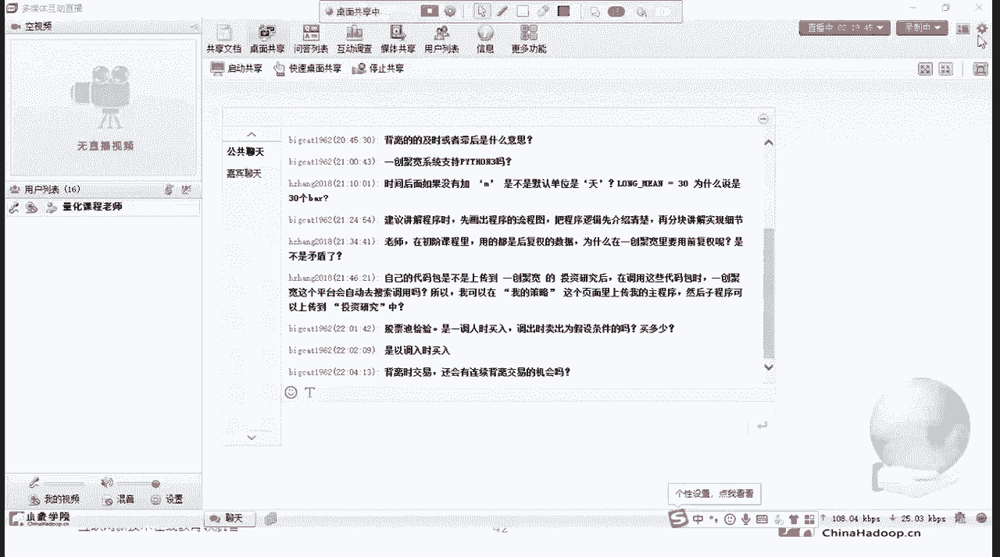