# 清华大学讲师团，量化交易实战，迭代式的量化策略研发 - P8：第八讲_值回复型策略的设计与开发 - 反方向的Bug - BV1Bs6MYFERQ

上节课我们讲了嗯，讲了呃趋势型的策略对吧，用TB这个平台呃，同学们有没有什么问题啊，tb软件安装不上呃，这个不应该吧，tb tb是这样的，tb啊，好几个版本呃，有的版本是直接安装版的。

有的版本是那种绿色版，绿色版就是你把它下载下来，直接啊直接把它解压啊，就可以直接执行，是windows平台吗，安装不上的这个同学，呃这个呃对可以再试一下它呃，它是32位版本呃，64位版本嗯。

都可以试一下啊，其实都都差不多，但有的是安装版，有的是这种绿色版解压就可以运行的，还有什么其他问题吗，嗯嗯时间差不多了啊，啊我们现在就准备开始今天的课程，然后关于啊今天的课上的内容，还有啊。

还有包括昨天呃呃就是上一次啊，上一次的课程，如果同学们有什么问题呢，也都可以先啊先先输入啊，先先打字，把它输入到这个对话框里，然后呢一会等课程结束的时候啊，我们再花点时间，在有些问题可以咱们啊当面呃。

就是现场再解答一下好吧，那我们现在开始今天的课程嗯，好各位同学大家好，呃，今天呢是我们这个进阶课程的第八节课啊，叫做均值回复型策略的设计与开发，那么在这节课程中呢，主要是分这么几块内容啊。

首先我先给大家简单的来讲一下，均值回复型策略的原理，之后呢，我们来编写一个均值回复型的股票量化策略，呃上次课程我也给同学们预告了一下，那么在这节课中呢，我们啊用聚宽这个平台啊，就是一创聚宽这个平台。

然后来编写这个策略，然后呢编写完了这个基本的版本之后呢，我们再看看从其他几个方面来进行改进，一个呢是把它从一个纯多头的股票策略，把它改造成一个多空双向的一个策略，然后呢之后呢我们来看一下啊。

设置好它的交易成本，然后来看一下这个交易成本对一个策略，它的绩效表现的这个敏感程度啊，咳咳然后最后呢再啊再通过头寸管理的方式，对这个策略本身进行一个优化，所以呢这就是我们今天课程的主要内容。

首先先来看一下均值回复性策略的原理，那么上一次课啊，上一次课，其实我也给同学们大概介绍了一下，如果是从一个纯粹的一个，单边的一个策略来说啊，我们先不考虑配对交易，我们只考虑一个单边的一个策略。

那么或者呢它是一个趋势型的对吧，或者它是一个高抛低吸型的，或者说呢它可能是一种突破性的策略，那么这其实是代表了几大类的啊，几大类的这种策略类型，那么今天要给同学们讲的均值回复型策略呃。

这种均值回复型的策略呢，其实和高抛低吸型这个策略啊，有有点类似啊，从概念上来说有点有点类似，但是细节上来说，还是嗯还是有很多的这种呃方面吧，大家可以去深入的体会，那么我们先来看一下这个人。

叫做丹尼尔卡尼曼啊，丹尼尔卡尼曼是谁呢，他是啊，他是一个一位诺贝尔经济学奖的获得者，他是在2011年啊说过这么一句话，叫做呃这个他说这话啊，也被称作叫做体育画报的厄运啊，怎怎么说的呢。

就是说啊一个运动员的照片啊，如果出现在杂志封面上，那么他注定就要在接下来这一个赛季中，表现不佳，那这句话我怎么理，怎么可以理解呢，也就是说一个运动员的表现，可以被认为是围绕着均值随机分布的对吧。

我我们也知道说，像我们平时每个人的状态有的时候会好一些，有的时候会差一些，那么如果一个运动员，他的照片如果出现在杂志封面上，是不是可以认为说他在当时那个赛季，表现特别好对吧，特别突出，那么这样。

他他的照片才可能会被刊登在这个杂志封面上，但是呢既然他的表现或者说他的一些状态啊，可能是一种随机分布，就有的时候表现好一些，有的时候表现差一些，那么一旦它已经照片出现在杂志封面上了。

说明他上一个赛季表现的很好，那么可能在下一个赛季里呢，他的这个表现啊，综合表现可能就会回归到一种平均水平啊，回归到一个一般般的这种水平，所以有可能他在下一个赛季中就表现的不佳，对吧。

所以这句话呢实际上也是说明了一种啊，一种均值回复的一个效应啊，就是有的时候表现特别好，但是呢过段时间，他可能又恢复到一个平均水平啊，大概是这么一个意思，然后呢我们再看另外一个人叫做理查德塞勒。

理查德塞勒呢也是很有名的一个人，他是他是2017年的诺贝尔经济学奖获得者，那么他的他的一个很有名的理论，就是行为金融学啊，他是在行为金融学这个方面啊，是有很多的贡献，然后呢他呢嗯他他和自己合伙人呃。

有一个基金啊，叫做呃叫做SILAS啊，silence and fulness啊这么一个基金，然后呢这句话就是他们基金的一个啊，一个座右铭吧，或者他们一个呃一个就是啊，基金的一个原理叫做什么呢。

就是屏幕上这个黑字啊，啊就是说投资者呢经常会犯一些错误，那么我们的目标呢就是来发现这个错误啊，大概这句话是这个意思啊，英文就是investors make mistakes。

Are we look for them，大概是这么一句话，什么意思呢，可以可以认为说投资者经常会犯一些错误，那么这种错误呢它可以分成两类，一类叫做over reaction。

一类叫做under reaction，所谓over reaction就表示说过度反应啊，就反应过度了，and reaction就就反应迟钝啊，大概是这个意思，那举举几个例子啊。

什么叫overreaction，就比如说市场上很可能有一些风吹草动的，很小的一些风吹草动的，这个信息，那么那么这个有可能啊，这个参与这个市场的人，就会对这种对这种新闻啊，或者对这种消息有一个过度反应。

使得这个呃股价产生一个异常的波动啊，那显然是不合理的啊，那么这种叫做over reaction，还有一种叫做reaction，举个例子，就是比如说某一个啊某一个公司。

某些公司呃在前一段时间表现得一直不好，但是到了到了某一个阶段呢，可能他突然业绩有一个很好的一个增长啊，或者说有一个有一个来源很可靠的消息，表明说这个公司可能呃在收益方面啊。

或者说从管理方面可能会有一个改变啊，就是朝着一个积极的方向去去去去改变了，但是人们可能啊印象中还把它就是印象，还停留在以前的那种印象中，就对他这个积极的变化呢表现的不敏感。

所以这种叫under reaction啊，那么所以说这个理查德赛勒他们这个基金，他的目标呢就是尝试着从市场中找到说，人们对一些消息或者说对一些事件过度反应，或者说反应不灵敏的这种这种时机，然后从而入场。

那么我那么当我们可以想象，那么当这个市场逐渐趋于理性，那么过度反应的这种情况，自然会回归到一个正常的那一个一个水平对吧，那么这个反应不灵敏的呃，就是呃反应迟钝的这种这种消息，它也会慢慢体现出它的作用。

使得市场回回到他应该的那个样子，所以说啊，所以说从理查德塞勒他们这个角度来说，他发现这种机会，实际上就是说在在这个市场的人犯错误的时候，他进入，然后呢当市场回归到平均水平的时候，然后他再出场。

那么就获得中间这一部分的利润，所以这种情况呢，也可以认为是一种均值回复的一种效应，那么它就根据这种均值回复的效应，然后作为它的一个盈利的一个啊方法啊，这是第二个例子，然后再有我们就看巴菲特啊。

巴菲特也说过一些名言，这个大家都耳熟能详了什么，别人贪婪时我恐惧，别人恐惧时我贪婪对吧，那么这种情况实际上是呃，也也是在一定程度上说，说明了巴菲特他的一个投资的一个理念。

就是他的他的入场点选择在什么时候，那么拿第一句话来举例，就在别人特别贪婪的时候，他恐惧啊，别人特别贪婪，就无外乎这市场涨的涨的已经是很疯狂了对吧，那么这个时候啊，那么这个时候他就他就先他就出场了。

他他怀着对市场的一种一种一种啊一种敬畏吧，或者说这个行业行情已经走到末端了，那么这个时候那必然要回归到一个正常水平，所以这个时候他就要出场，那别人恐惧的时候呢，也就是说当市场跌到跌到这个非常夸张的时候。

就是已经跌无可跌的时候，所有的人都在恐怖，都是很都是在很匆忙的卖出的时候，那么这个时候对他来说就是一个很好的入场点，对吧，那么这个呢是是他的一个一个理念，那么下面那句话其实也是类似的一个意思啊。

那么所有所以从这句话来说呢，也是一种均值回复的效应的一种体现，另外我们再看啊一些经济规律啊，或者说一些市场的周期，那往往是说偶尔会因为一些大的消息啊，会有产生一些波动，但是呢过了这段时间之后呢。

它又会回到它的一个平均水平对吧，我们知道说这个市场上最最近一段时间，这个特朗普总是总是会冒出一些啊推特啊，总是会说一些很很很奇怪的言论，那么经常市场会有一些过度的反应对吧，但是你你看过可能过个几个小时。

或者过个一两天，那么他的这个啊，这个这个话的影响呢可能就消除掉了。

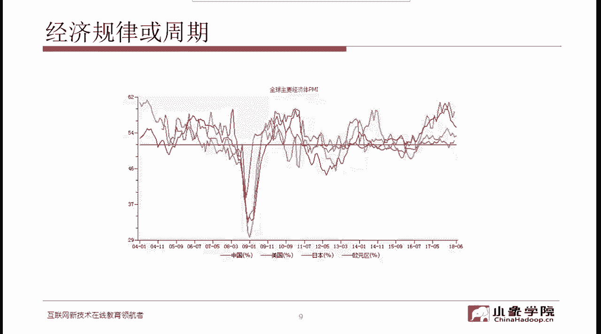

所以呢这个其实也是体现出，一种均值回复的一种效应，所以从上面这几个例子啊。

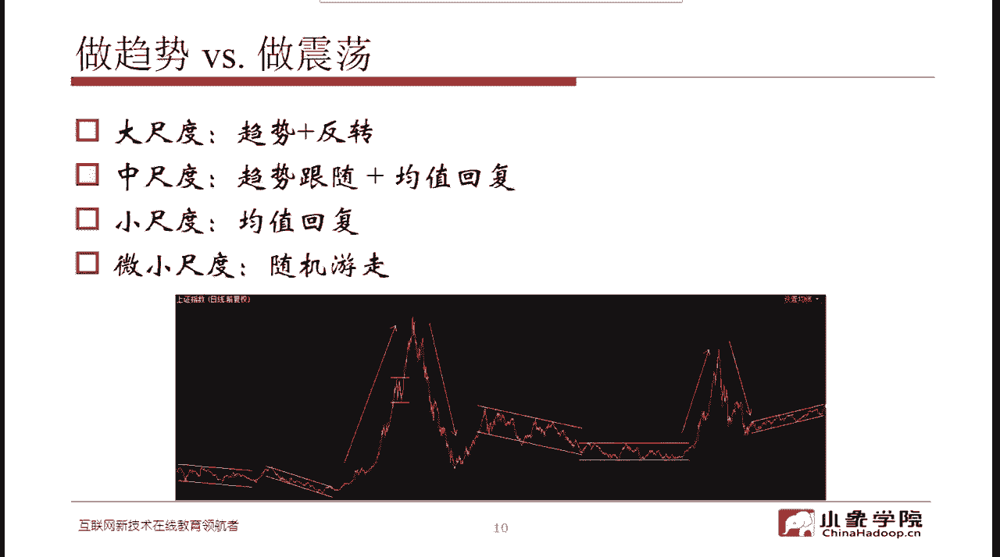

就是举例来看呢，♪ 我们可以看到说这种均值回复的效应 ♪，其实呢是广泛存在的，那其实不止在经济领域对吧，那么在社会生活中对吧，在体育方面，然后在各个方面其实都是呃，一定程度上都是有一定的体现的。

所以说这是一个普遍的规律好了，那么我们现现在就考虑说，怎么在我们的这个投资领域，怎么结合这种均值回复效应，然后然后来应用它呢，能不能把这种效应能够，做到我们的一个量化策略里头来对吧。

这是我们今天讨论的一个主要的话题，然后我们看一下这个市场啊，看一下这个市场就是以以A股额，就是这个指数啊来举的例子，那么其实我们可以从不同的尺度来观察，这个市场对吧，从一个大的尺度我们能看到说。

比如说这个上证指数啊，有很呃这一二十年啊，很明显的就是有几个大的周期对吧啊，那么从这图上能看到有两个大的，就是两个大的这个这个明显的上涨周期，然后再再再跌回来，然后有一些震荡。

那么呃中小尺度我们也能看到说嗯，嗯中小尺度其实也能看到一些明显的一些趋势，或者说波段对吧，那如果更小的尺度，其实我们也能看得出它有很多震荡的特性，那么所以从这个角度来看呢，在整个市场上来。

不管我们从哪个尺度上来看，它都是有这种啊呃一个是趋势型啊，一个是趋势，一个是均值回归啊，那么这两种啊，这两种啊形式的走势其实是是都是同时并存的，对但是我们要注意一点，那么这里我所说的啊。

这个说这里所说的这个均值回复，其实是对整个市场的一个一个，综合的一个效应对吧，那么我们看比如说看整个上证指数，其实它是很多股票，全市场3334千只股票，它们形成的一个合力。

那么它会体现出这么一种均值回复的效应，那但是呢这个对于对于个股来说。

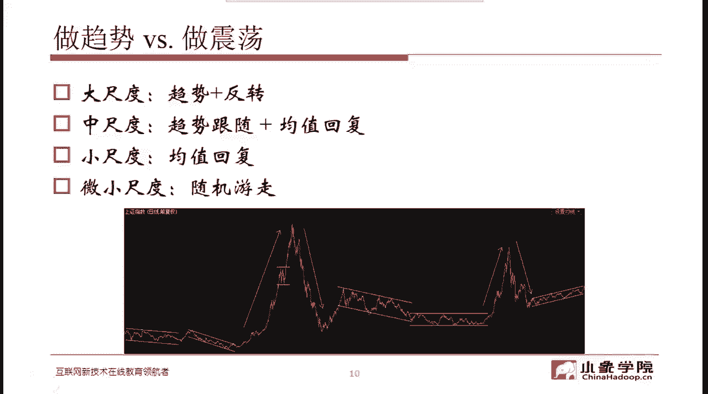

是不是一定这样呢，那不好说对吧，比如说我们随便呃找个行情软件，我们来看一下，假如说我们就以这个比较火的这个贵州茅台，对吧，呃贵州茅台我们看一下，假如说你现在操作的是贵州茅台这支股票。

那么如果说假如说你看你，假如你看他这一段的走势，其实它整个是一个单向上涨的一个啊，这么一个走势对吧，整个单向就是这一段，整个就是一个单向上涨的一个一个走势，那么如果说你在这一段走势里头。

你恰好使用了一个均值回复型的，或者说高抛低吸型的股票呢，那么其实是不合适的对吧，那很可能会会亏损，或者说损失很多利润对吧，那我们再换一个，比如说我们看中国石油对吧，那中国石油它从你从这段走势来看。

其实它是一个单调单调下跌的一个走势，所以说如果说你恰好赶上做这只股票，而且你用一个均值回复型的策略的话，那显然也是不合适的对吧，所以这是对个股而言，但是呢从刚才我给大家举的例子呢。

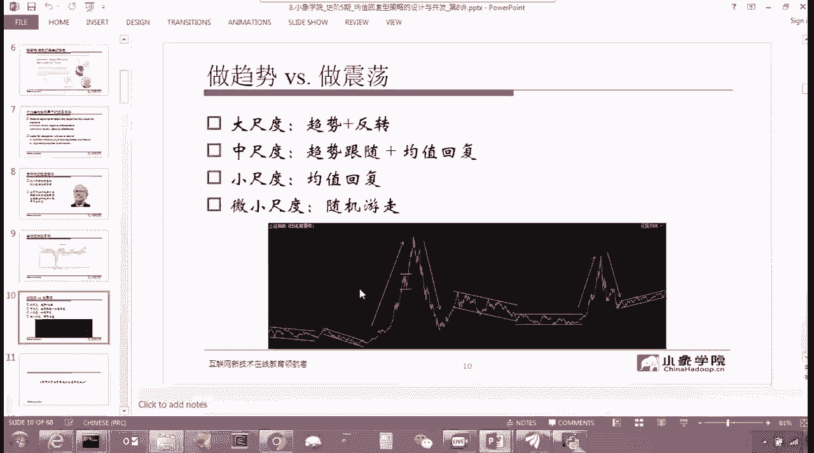

我们从全市场全市场的这个走势来看呢，其实它是很明显的，确实是有这种特性。

所以这是一种概率或者一种大数的定律，那么现在所以我现在就要抛出这么一个问题，那既然我们这节课的话题呢，是需要做一个均值回复型的策略，那我们就看一下A股市场里头，有没有一个稳定的均值回复效应对吧。

刚才其实我已经拿贵州茅台，还有啊，还有说这个中国石油，我拿这两个股票，当然这是两个比较极端的股票啊，来举例，他们至少在一定的时间内，其其实你是看不出一个明显的均值回复效应的，但是我们能不能放到全市场。

找到这么一种稳定的均值回复效应呢。

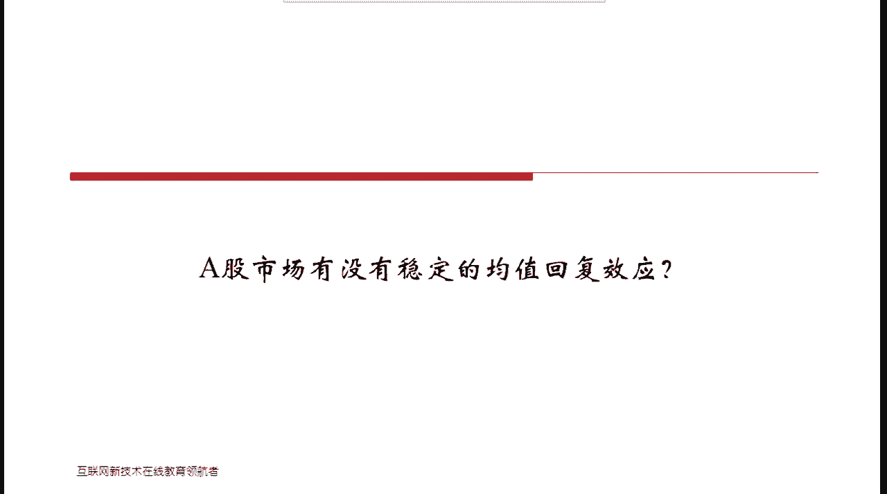

其实是是可以的，我们再回到，我们再回到刚才刚才这个，回到这个刚才这个全市场的，这个指数的这个图形，其实我们能看到说在整个市场里头，所有的股票形成一个合力，那么他们整个也会形成这么一种震荡。

所以说我们看一下，就是说如果在全市场，如果我们从啊所有股票的表现来看，那么有些股票比如在一段时间内，它的涨势特别好，那么是不是过一段时间，有可能他他不可能永远的保持，说它是它是这个市场的领头羊，对不对。

那如果说有一些股票他的在某一段时间，他的在全市场的表现特别差，那他永远也他他也不大，可能说永远他是垫底的对吧，所以总之呢过一段时间之后呢，那么他们的在全市场的这么一种呃收益的表现，可能就会发生变化对吧。

所以呢我就从这个角度来看，市场上有没有一个均值回复的效应，也就是说某一段时间走势特别好的股票，是不是过一段时间之后，它的走势，或者说它它在全市场的排名就会比较差一些啊。

那如果在某一段时间全市场表现最差的股票，它是不是过段时间他表现会略好一些对吧，所以从这个角度来看，也就是说从每只股票的收益率的角度，我们看看是不是有一种叫做均值回复的效应，那么为了就是验证啊。

或者说就是来判断，说到底有没有这么一种效应呢，那我这里就给大家设计了一个，设计了一个实验啊，所以这节课呢，这节课其实我们这不是一种，照本宣科的这么一个过程啊，实际上这节课我是带着大家。

一个是一个思考的过程，也就是说我们怎么去先提出一个问题，然后去分析这个问题，然后再解决这个问题，实际上是分这么三步啊，所以现在呢第一步我先抛出这么一个问题，抛出一个问题。

就市场有没有稳定的均值回复效应好了，那那基于这么一个问题，那我们来分析一下，那么刚才我也说了，我的一个思路呢是说我们看所有的股票，他们的收益率是不是具有一种均值回复的效应，所以我就设计了这么一个实验啊。

把它命名成某一种这个假说啊，比如随便起个名字叫，就用我的名字吧，一个hypothesis啊，一个一个假说好了，那么我们我们就可以这么做，我们构造两个组合，首先呢我把全市场，全市场所有的股票。

它的收益率做一个排名，什么叫收益率啊，收益率我们这么定义啊，比如说我选两个时间点，那么在某一个时间点，这支股票的股价是A那么过了一段时间之后，那么它的股价是不就是B对吧，那好了。

那我就把B和A的这个你用B去减A，就相当于它的这个一这一支股票它的价差对吧，我再除以A，就变成了一个相对于A那个时间点的那个价格，的一个一个变化的百分比对吧，假如说我对全市场每只股票我都买。

每只股票我都去买买一手的话，那么我用我用这个结尾时间段的，它的它的收盘价减去开始那个时间的收盘价啊，把他俩这个差再除以开始时候的那个股价，那么这个就可以把它定位成一个收益率对吧，我我随便举。

随便举个例子有点抽象，那么我我举我我拿还是拿这么一个图形软件拿，拿这个行情软件给大家看一下，比如随便找一个啊，要找一个随便找一个海康威视对吧，假如说我选定这么一个范围啊。

在屏幕上画画出这么一个一个框这么一个范围，这是我选的一个时间范围，那么在这个在这个时间窗口的末尾的时候，这个收盘价叫，比如说把它叫做B，那么这个窗口开始的时候的呃，那一天的收盘价叫做A。

那么我把B减去A他俩之间的差，再除以这个A对不对，不就相当于是说在这么一个时间跨度内，它的股价的一个变化百分比嘛对吧，我把这个定位定位成它的一个收益率，好了，那么这样的话呢，我们就把全市场每一只股票。

我先选定好一个时间段，假如先选定好一个时间段一啊，我这么我来画一下吧，比如说这是一个是啊，我这么来做啊，假如说我这有一个时间段一，有一个时间段二，那么在第一个时间段里头，把全市场的每一只股票。

它的收益率都计算出来，放在放在这个时间段一里头，然后呢之后呢对他们做一个排名啊，做一个排名，然后呢之后呢，我就把把这个收益率排名最高的前10%，股票放到组合一里头，然后呢把它的收益率排名最低的那10%。

放到组合二啊，这是两个组合，一个叫组合一，一个叫组合二好了，然后之后呢我们把把这些股票，就是把他们所有股票的这个收益率的排名，大家注意，我不是用收益率了，我把它变换了一下，用用他的排名。

就像把它做了一个离散化啊，把这个收益率排名列出来，那么大家可以看一下，假如说现在全市场是一共是3000只股票嗯，假如说现在市场上一共是有哎稍等啊，一共有3000只股票，那么收益率排名最高的前10%。

是不是它的排名就是1~300，对不对，然后呢收益率最低的那300只股票，他们的排名是不是2001，一直到3000，对不对，好了，那么我就用这个排名，作为我的一个一个一个验证的一个依据，那么现在呢我把。

组合一里头所包含的所有的股票，他们的排名求一个平均值，然后呢再除以全市场总额的股票个数对吧，所以你看1+2加三，一直加到300，♪ 然后再除以全市场3000 ♪，是不是他们的平均值是0。05对吧。

也就是说前300只股票收益率最高的，前300只股票，他们的排名在全市场位于前5%，然后好了，然后呢收益率最低的那300只股票，他们的排名加起来再求求一个平均对吧。

除以除以除以全市场这个总共3000支股票，那么得到的数是0。95，也就说收益率最差的那10%，他们的股票，他们的股票的排名啊，位于全市场的95%的那个位置，就非常靠后了对吧，这是显然的吧。

这就简单的这个数学嘛，加减呃，就加减法对吧，求个平均数好了，现在呢那我们再看时间段二，也就是说，把时间的时间段一里头选出的组合一和组合二，把他们的这两只股票分别放到了时间段二。

分别计算他们这每只股票在时间时间段二，他们的收益情况，然后再对收益做一个排名，那么我们可我们可以假设说，十组合一里的每只股票，那么它们放到了组合二，放呃，放到时间段二这个里头。

他们的收益排名可能是另外一种分布对吧，比如237十等等，然后呢组合二里头的每一只股票，他们放放到第二个时间段里头，它的收益率排名又是另外一种组合，所以现在呢我们就再分别对，时间段二里的每一只股票。

就是这两个组合里的每只股票，他们的收益率排名再求一个平均，我们看他们是一个什么状况对吧，那如果说如果说在时间段二里头，每只股票他们的收益率排名，最后再求个平均趋近于0。5，就是50%，这个位置。

是不是就说明原来表现最好的那些股票，最后他们回到了一个平均水平对吧，然后表现最差的那些股票，他们也回到了一个平均水平，对不对，那假如说我们能看到这么一种现象，是不是就就说是不是就说明了我们已经发现了。

这市场上有一个相对来说比较稳定的，均值回复的一个效应，对吧，所以这个问题呢就是我设计了这么一个实验，这个实验呢稍微有一点点绕，那么主要就是这个表格，同学们看一下啊，我根据两个时间段，根据第一个时间段。

分别构造出表现最好的股票叫做组合一，表现最差的叫做组合二，然后呢，把组合一和组合二放到了第一个第二个时间段，然后对他们在第二个时间段的收益率，重新做一个排名，那这个排名再求一个平均值。

看看这个平均值和在时间段一，这个平均值两个相对的变化，对不对，是不是说他们已经回到了一个平均水平对吧，如果说它的如果在时间段二，它的收益率排名趋呃趋近于0。5的话，说明它基本就是一个市场平均水平了。

那么这就是一种均值回复的效应对吧，所以就为大家设计这么一个实验，那下面我们就编个程序来验证一下这个实验，看看它，看看他这个实验是不是能够产生这么一种结果，好那么下面这是一个示意图啊。

这示意图可能呃刚才我已经说过了，其实这个图更简单好了，那比如说我在第一个时间段，第一个时间段，对所有的股票的收益率做一个排名，那么左边这个这个蓝色的区域，是排名最低的那些股票对吧。

右边呢这是排名最高的这些股票，然后呢分别呢我就把他们取出来，排名最高的叫做组合一，排名最低这个股票叫组合二对吧，然后同时我把这些股票再放到时间段二里头，再重新算一下。

他们在这个时间段二里的一个收益率排名，然后呢，再看一下这个新的收益率排名的一个平均值，大概是一个什么样的，是什么样的啊，平均值，然后呢，这样看看他们的收益率，是不是就是回归到了一个平均水平好。

下面我们就来编写一个程序，那么这个程序呢这个程序的源码呃，我在课前也都给大家提供了叫做这个啊，Profit this distribution movement，就是啊名字反正随便起的啊。

就是一个收益率的分布的一个变化啊，一个移动好。

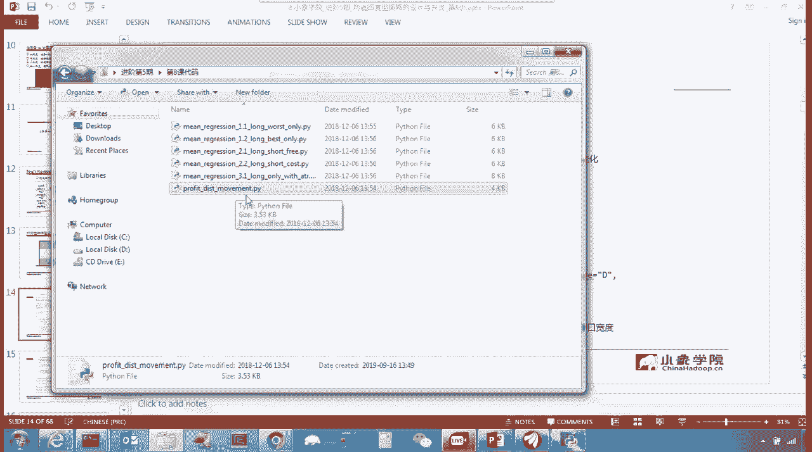

然后呢，那么这个代码呢我们可以随便找开，找一个编辑器去把它打开，那么这个程序这段程序呢，我是用的是Python来执行的，但是大家注意，这个是用一个独立的Python运行环境啊，这个并没有放到聚宽平台。

所以它是在电脑本地运行的，那么如果你要是为了运行这个程序的话呢，你需要安装一下Python的啊一个执行环境，那么Python的一个集中集群环境呢。

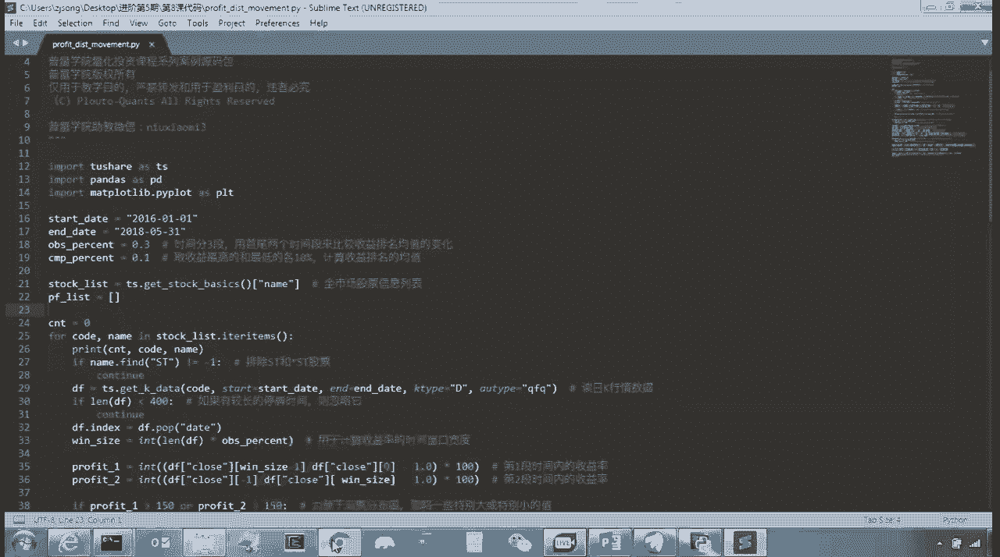

我们其实有两有两个呃，地方有两个版本都可以选择，一个是去Python的官网叫Python点org o r g，那么这个里头呢下载的是啊，就是最啊，最呃就是最简单的Python的一个解释环境啊。

包括有windows版本啊，LINUX版本等等，那么下载下来安装之后呢，你就可以在命令行直接执行它，就可以去执行一套Python程序了，还有一个还有一个版本呢叫做阿纳康达啊，对是这个网站。

那么这个网站我们也可以去下载Python的版本，这个anaconda这个版本，那么这个版本呢，呃也是分适用于python3的和python2的版本，那么它和刚才官网的这个下载版本，有什么不同呢。

就是这个anaconda这个版本里头，它包含了除了安装Python自己的解释器之外，还包含了很多最常用的第三方的库啊，这第三方的那些模块包括各种科学计算的呀，画图的呀，做统计分析的呀，所以就说如果啊。

你要是呃磁盘比较空间比较大的话啊，我就建议你就直接装anaconda这个版本啊，这些一些依赖就是最常用的第三方的库。

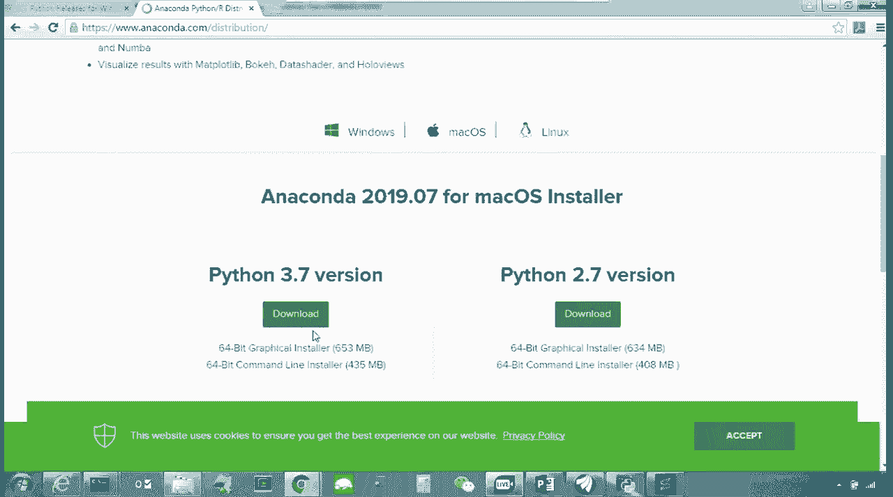

它就直接给装好了，如果磁盘空间不大的话呢，那么或者说至少只是为了运行，今天这课上这个呃，例子呢你就装官网下载这个版本，就是啊就比较省省省硬盘空间啊，其实都可以。

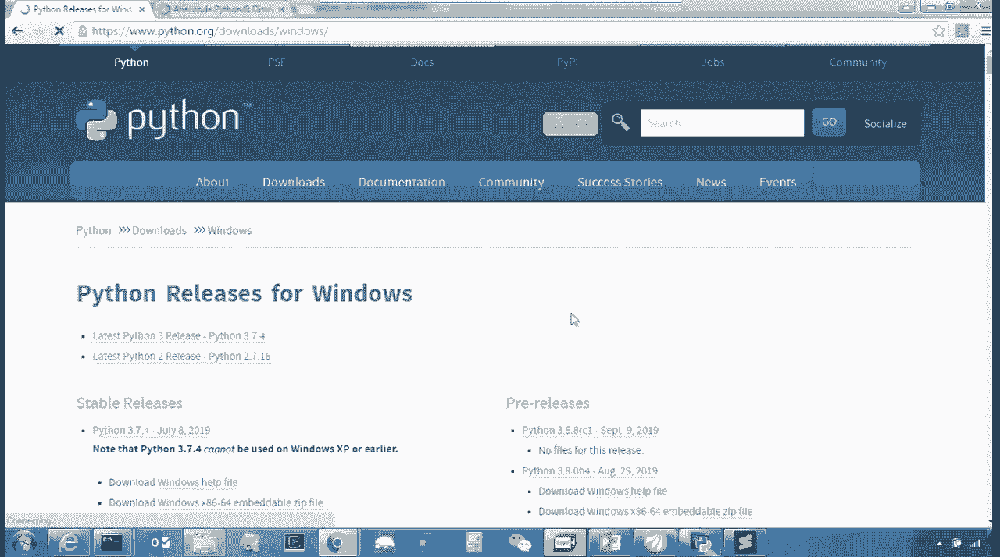

这两个版本好了，然后装完了这个之后呢，♪ 你就执行 ♪，你就直接执行这个Python就可以了，比如说我现在这个电脑里装的就是Python的，3。5啊，这是一个稍微早一点的版本，都差不多就可以用这个。

用这个Python这个程序来执行我们的啊，这个例子好了，那我们现在看看这个例子啊。

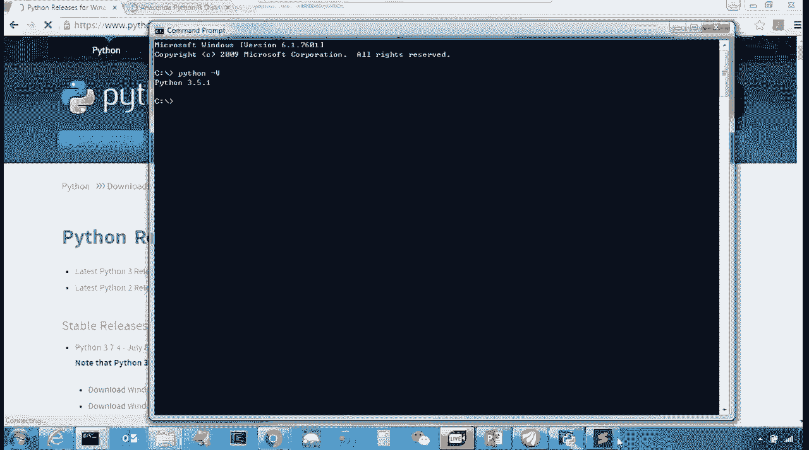

我随便找一个编辑器就打开，刚才我跟大家说的这个程序啊，这样我先呃我先简单写行代码吧，我写几行代码，我们来看一下怎么去怎么去编写，假如你随便啊随便写一个呃，用一个文本编辑器啊。

或者说Python自带的一个编辑器啊，或者说你找一个第三方的，比如说叫py charm，这个是比较有名的编辑器，都很好用的啊，那么然后你就随便打开一个文本文件，就呃文本编文本编辑器啊。

这就输入这个代码就好了，那么在这个例子里头呢，我用我我是用这个to share这么一个第三方的库，就第三方的库，它是提供免费的行情数据源，那么to share，关于这呃对呃，这个稍微有点乱啊。

就是这个这里头好几个概念，一个是我运行这个例子呢，我是用Python啊，安装在电脑本地的这个版本啊，刚才我说的有两个途径，你或者去Python官网去安装PY呃，Python的包。

或者说去ANACKA那个网站安装Python的包都可以，这是第一个，第二个呢就是我这个例子里头，我需要获得全市场的股票数据对吧，然后来来做刚才那个实验，那么我获得股票数据去哪获得呢。

那么这里头我用到了一个免费的数据源，叫做to share啊，是这个概念，所以呢to share这个数据源呢。

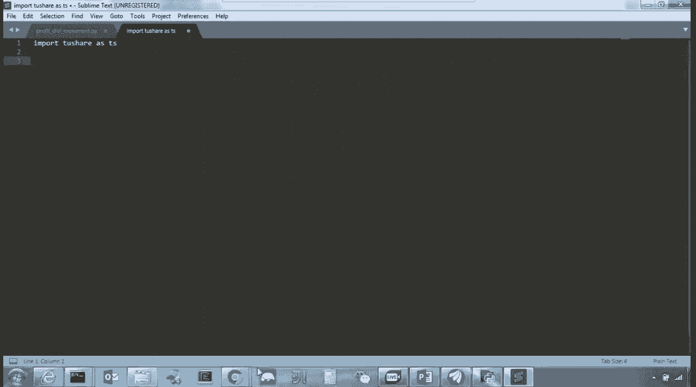

我们可以看它它也有几个几个地方，一个是这个叫to share点OGORG。

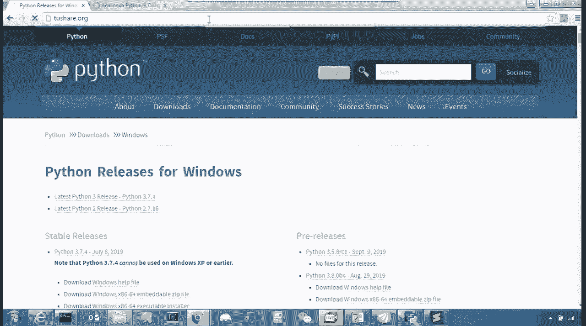

那么这个嗯就是这个网站呢，它是图片尔的一个早期的一个版本，这里头提供了历史行情的数据的下载对吧，这里头可大家如果有兴趣可以去看一下图像，点ORG，这里头它有一个啊就是有一个文档呃，API文档说明。

那么可以通过它的一个呃，通过它的一个Python接口来获得股票的历史数据，历史行情，那么这是免费的啊，这是免费的好了，那么它还有一个更高的一个版本叫图12pro。

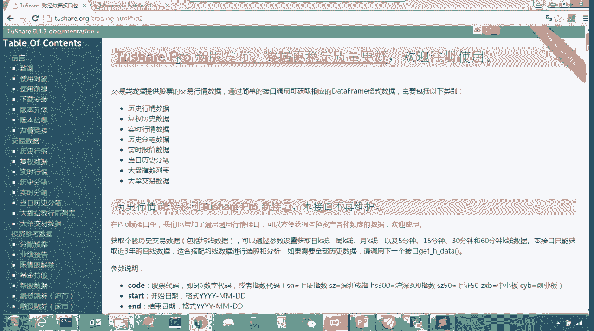

所以这两个版本就这两个网站啊，分别对应两套不同的接口啊，一个叫TOSHO点ORG，一个叫图像点PRO，那么这两个版本其实都可以用，那么在我的这个例子里头啊，为了简单起见。

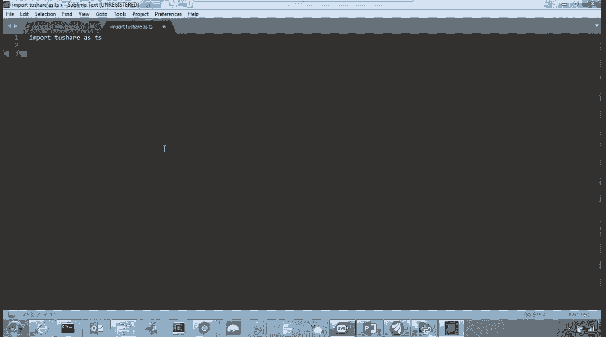

我就直接用的是旧版本的接口，因为旧版本接口它不需要注册，不需要去做一个身份认证啊，所以直接拿来就能用，所以呢我用的是旧版本的这个呃接口，就为了同学们理解更更更方便啊，当然你从使用使用的效果效率更高。

更就是更稳定的情况下，你要用这个pro新版本啊。

这是题外话好了，那么我们先假如说我们先随便写一段Python代码，对假如说我现在我现在就写这么几行代码啊，先先把图片啊，图片这个包把它呃引入进来啊，重新命名叫ts，然后呢我调用它的接口。

要用ts s点get stock basics啊，获得获得这个当前市场的。

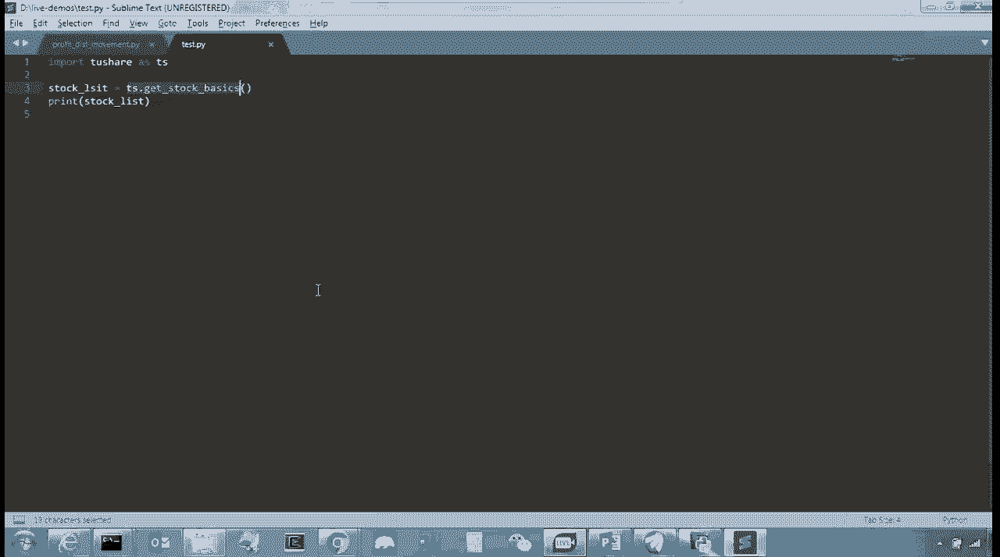

所有的股票的基本信息对吧，我们可以从我们可以从啊，to share的这个网站上可以看到说呃，一些基本的信息啊，市场信息我看在哪股票列表对对吧，大家可以看可以看呃，可以看这个呃文档里头包括这个呃。

get stock basics啊，就可以获得股票的一个基本信息，好那我现在比如说把它执行一下，就是这个函数。

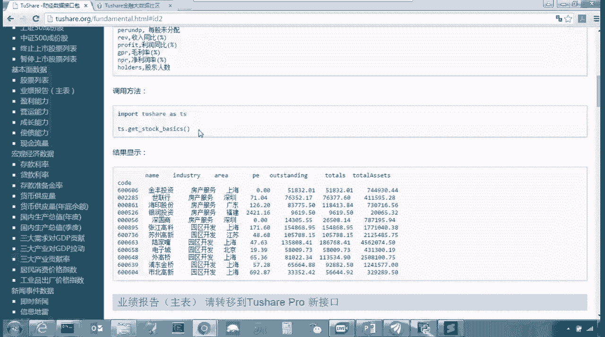

那我我，对比如说我用Python，然后执行这个叫test点PY对吧，刚才我刚才我刚编写的这个代码哦，Not define，稍等啊，敲错了，对刚才是这个两个字母敲反了啊。

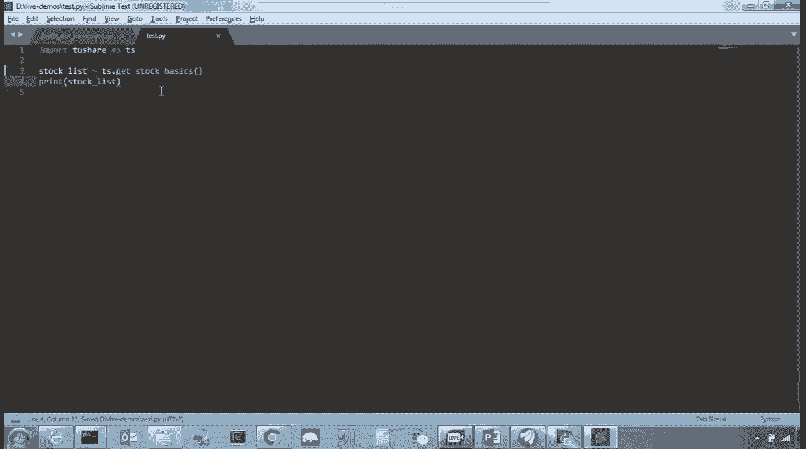

我们再执行一下。

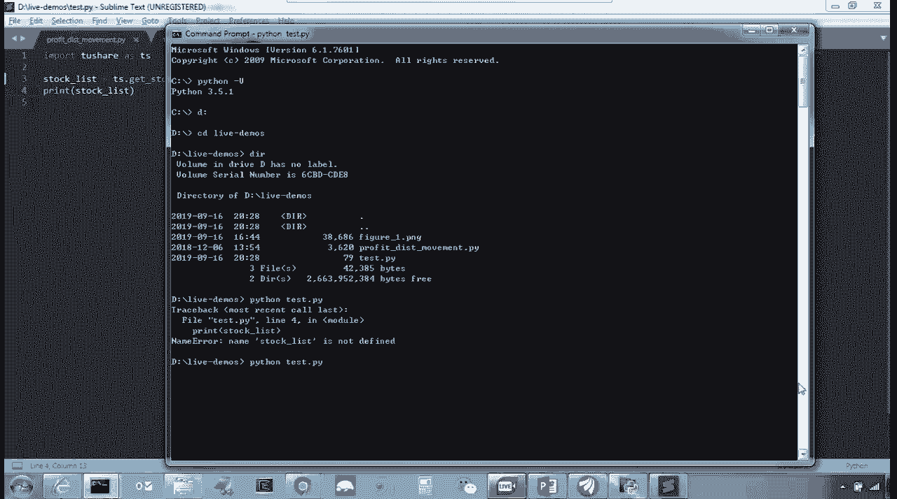

对，这样的话呢，它就可以可以把当前全市场，所有的股票的这个名称啊，所属的行业呀啊等等各种信息。

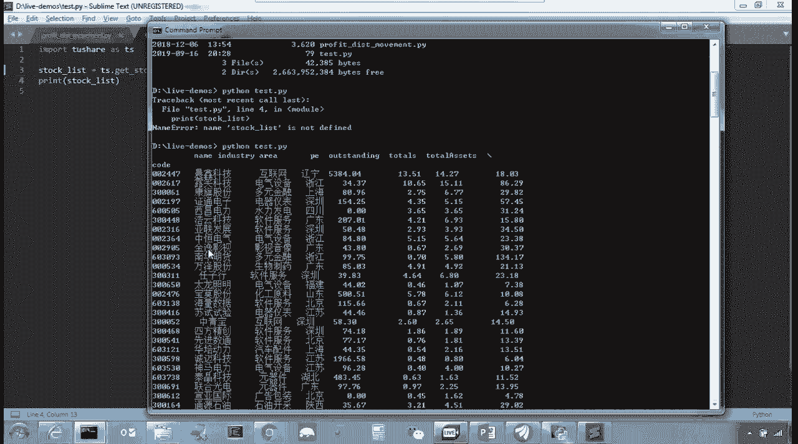

包括股票代码都会打印出来对吧，那现在我其实只需要呃，我现在其实只需要访问股票的这个名字，名字和的代码。

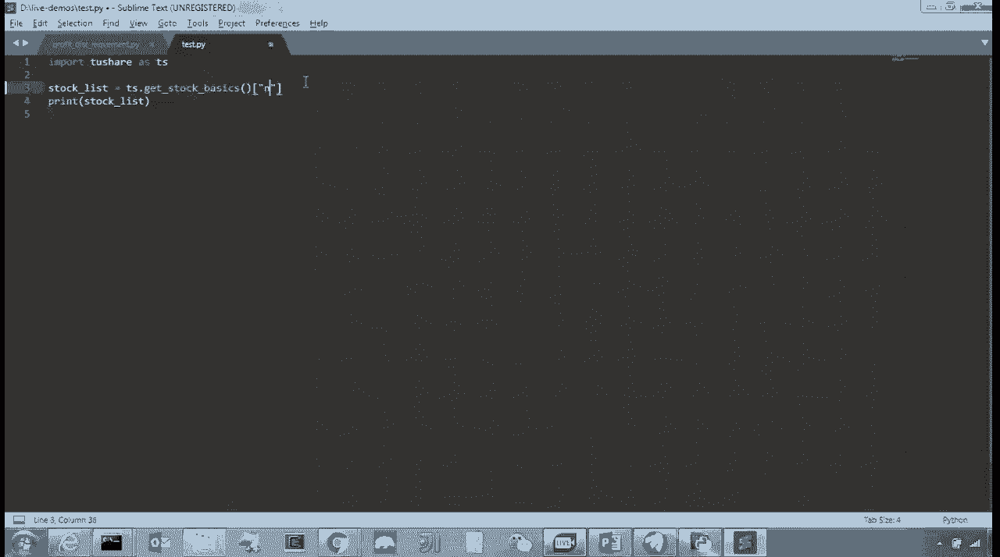

那么我先只取只取名字这么一个字段，好把它存一下，然后再执行刚才的代码，这样的话我们能看到说我打印出来的就是。

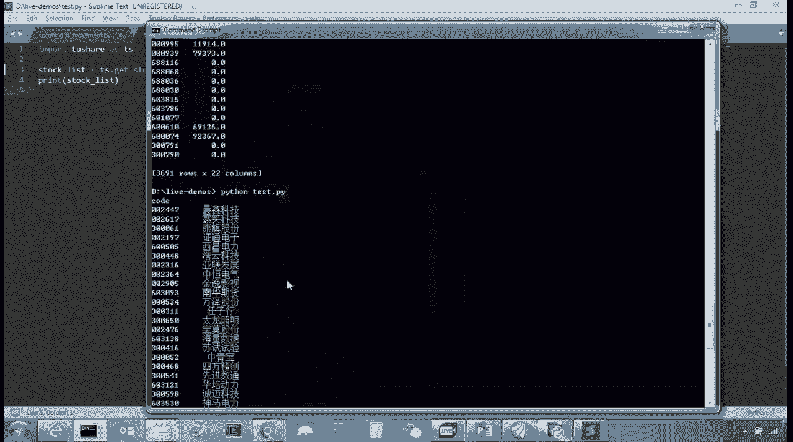

它只包括了这个股票的代码，还有股票的名称对吧。

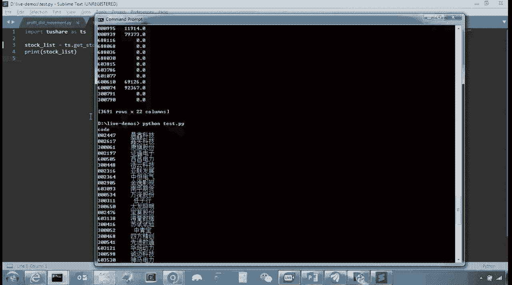

那么所以呢我用一个独立的一个呃，我用Python来执行一个独立的Python程序，就可以这么去做，然后呢更多的就是更多代码我就不直接敲了啊，我们节省点时间，所以呢，就直接把我课前给给同学们提供的代码呃。

取过来给大家做一个解释，然后你可以自己去运行啊。

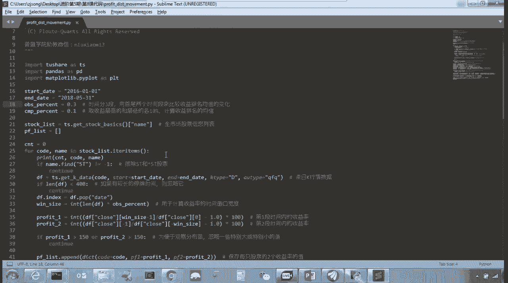

怎么去运行呢，这个比较花时间啊，对我就是用Python Python这个解释器。

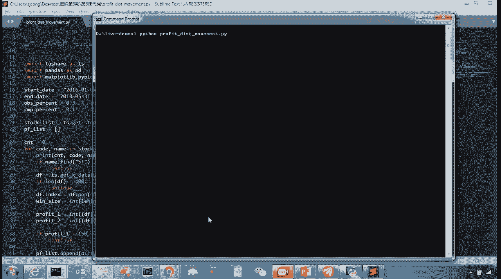

然后就直接执行这段代码就好了，然后他就开始往后执行了，好那么现在呢因为这个执行需要花点时间，所以趁着它运行的过程中。

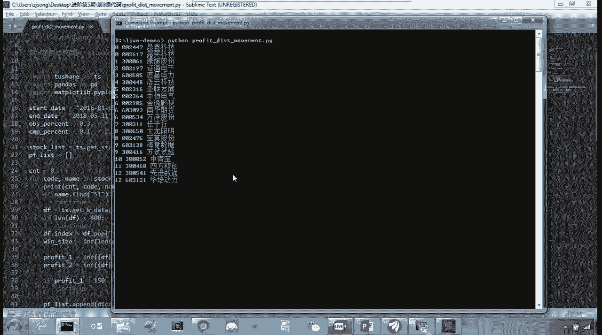

我再给同学们解释一下，这个这个程序是干什么的，首先呢我是从这个通过to share的一个软件包，获得全市场的啊。

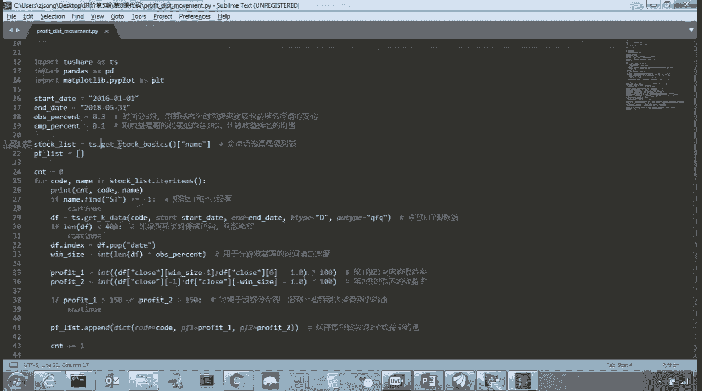

股票的一个列表，包括股票的名称，也包括股票的呃代码对吧，因为它返它返回的这个数据结构呢，是一个呃叫做pandas as的一个数据结构，所以这结构的索引里头就是股票代码，然后它的值就是股票的名称。

好了之后呢，我用这个for循环啊，对这个列表里的每一行做一个循环，那么把它的代码，股票代码和名字取出来，就把全市场的所有的股票的名称和代码取出来，然后之后呢如果说这个股，如果这个股票名字里含有ST。

那么我就跳过它对吧，因为我来做统计的时候，我希望能够在全市场有一个呃，就选一些比较正常的股票，所以呢我把所有的带ST啊，星ST的这种股票全把它跳过好。

然后之后呢我就调用这个get k data这么一个函数，这个函数同学们可以自己去查图像的文档，那么它的这个函数的目呃，作用呢是获得某一只股票的，在某一个时间段的它的行情数据。

那么这个里头呢我选的是日线啊，用这type等于D就表示是日线，而且是前复权啊，QFQ钱不全数据这个具体的调用方式，同学们可以去看他的文档好了，那么我就把每一只股票，全市场每一只股票的啊。

它的从从某一个日期开始，到某一个日期结束的时候，那么其中所有的行情，日线级别行情数据都取出来啊，取出来之后呢，然后呢我把这个日期啊，把这支股票的日期放到这个索引里头，这是我为了后面访问方便啊。

所以把这个日期取出来之后呢，之后我就把他这个股票给他分了，把它把它时间，把他的这个时间做了一个做了一个划分啊，大家可以看到我这里有一个变量叫做observation，Percent，就是0。3。

也就是说我取出取出这么一段呃，我在屏幕上给同学们画一下啊，这这段代码就是我我是怎么做的，也就是说我对每一只股票都取出来，取出来之后呢，我把他的，把他所有的这个从开始日期到结束日期。

把他所有的这个K线分三等分，那么把这第一段啊，这第一段叫做时间段一啊，就前1/3叫做时间段一，然后这个后1/3呢叫做时间段二啊，大概是这么一个过程，然后呢我就在时间段一里头计算，计算出第一段的收益。

然后神农二作为计算第二段收益啊，分别计算他们收益率的一个排名。

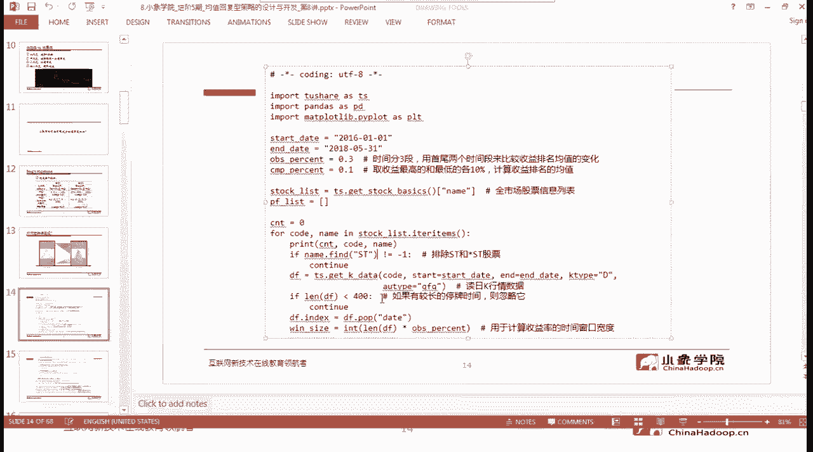

好然后这样的话呢这样的话你看啊，我把每一只股票就是他在每个时间段，就是说我这不有一个window size吗，那么就是把把这支股票它在从它从啊，window size减一开始除以除以第一个除以。

第一个就是把把这一个窗口里头啊，就前1/3窗口里的最后一天的价格减去，相当于是减去第一天价格，再除以第一天价格，就等于把它就相当于是这个变换了一下啊，就等于是用最后一天价格除以第一天的价格，再减1。

0啊，实际上就是它的第一段时间的收益率，然后呢再把最后一天啊，这个一在Python是Python语法，一就表示一个列表的最后一天啊，然后把最后一天和，就是后1/3时间段里的第一天的这个啊。

股价收盘价啊相除再减1。0，那么这个实际上是第二个时间段的收益率，也就是说，我把每一只股票在第一段时间和第二段时间，收益率全把它们算出来，上来之后然后就把它们放到一个大列表里头啊，放到一个大列表里头。

然后呢分别用一个啊对把他们每个用呃，把它放到一个字典里头，包括每一只股票的代码，以及它在第一个时间段的收益率，还有第二个第二个时间段的收益率，分别把它们啊存起来好了，那么存起来之后呢。

那么我就先按照这个在第一个时间段内的，所有的收益率做一个排序啊，大家记住啊，看这是一个salt这么一个salt，具体的，如果说对Python有一些具体语法还不太熟的话呢。

同学们课后可以去查一下Python的编程文档，那么我对所有的这个股票的收益率，按照第一个时间段收益率做一个排序啊，咳排序之后呢，排完序之后，就把它每只股票对应的排序记下来啊，叫rank1好了。

记下来之后呢，那么我现在就开始对它，对它做一个啊做一个统计对吧，做一个统计，那么我是把先把前边这个number number of candidates，就是就是一个百分比啊。

就是前10%这个c m p percent，这个我现在定义了一个变量啊，0。1就是10%好了，那么我就把全市场前10%，就从零开始到10%的所有的股票，这个列表取出来。

放到这个top candidates里头，然后再把最后最后这个负10%，就相当于倒数10%到最后一名的股票，放到bottom candidates里头，就相当于把这两个组合构造出来了，而构造出来之后嗯。

然后呢对他们做一个排序啊，对他们做一个排序，排序之后呢，就就把他们所有的就是把它把这个两个组合，每一组合里头每一支股票，它们所对应的这个排名收益率的排名取出来，取出来之后呢，然后做一就是求一个平均啊。

求一个平均之后呢，把它们打印出来，求完这个频率之后呢，然后我再对我再对第二只股票，就是在对呃，对第二个时间段的每只股票的收益率，做一个排名啊，做一个排名，然后呢同时把他这个排名记下来。

然后之后呢我就看如果说嗯，然后呢就是之后呢再把再根据第一个时间段，就所有的属于组合一的那些股票的，在时间段二的排名抽取出来啊，同时呢再把所有的属于组合二的这些股票，它们在时间段二里头的排名全抽取出来。

分别放到这个c m p average，top i index和c m p average bottom index里头对吧，然后之后把它们求出来，把它们取了之后。

然后呢对他们再求一个平均把它打印出来啊。

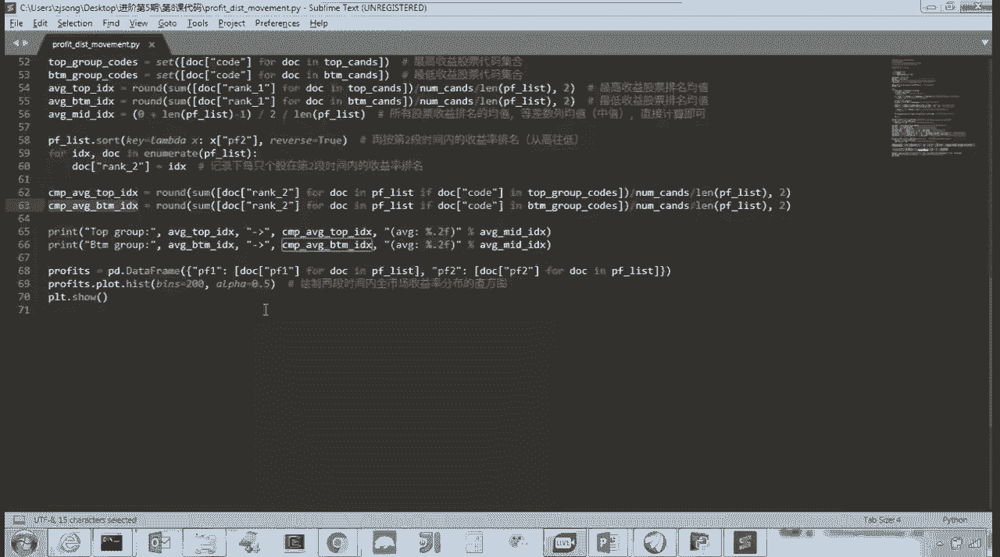

就是这么一个过程好了，那么这么一个过程呢，就是他现在这个刚才运行的程序，正在计算这个比较耗时间，所以呢我我现课前。

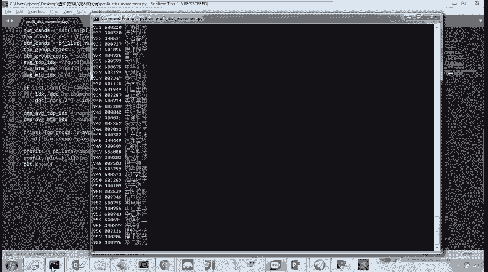

课前有一个就是已经运行完的，运行完的这么一个程序，大家可以看一下，那么对第一个组合他在第一个时间段，他的平均排名是0。05，然后呢到了就是第二个时间段，那他的排名是额平均啊，平均排名是0。49。

已经非常接近于0。5了，同样对组合二它在第一个时间段，它的排名是0。95对吧，就是全市场的百就是后5%的那个位置，然后呢再经过到了时间段二的时候呢，它全它的收益率在全市场的一个排名是平均值，也是0。

52啊，0。52也是非常接近于0。2，0。50，就全市场的一个中间中位数，中间数，所以这代表什么，就代表说原来表现最好那些股票过了一段时间，那么它的收益率也基本上处于全市上的一个，平均水平了对吧。

原来市场表现最差的那些股票，那么经过一段时间之后，它的收益率也回到了全省的平均水平，那么这个就和我在课件里头给大家列的，这个思路是一致的，也就是说通过收益率的这么一个方法，我们可以证明说。

在全市场存在着这么一种均值回复的效应，那么我这个这道程序里头。

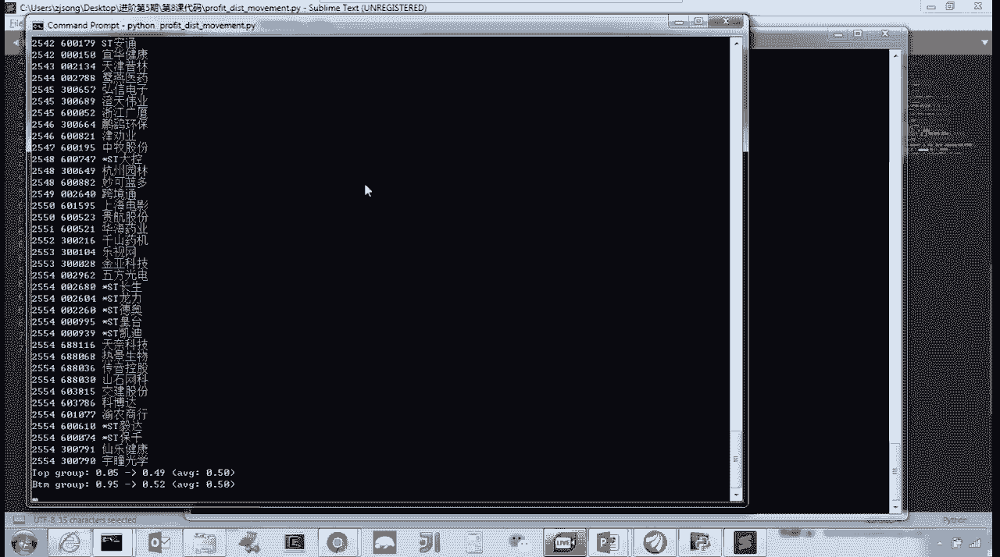

除了把这个数算出来之外呢，还给同学们画出了一个分布，也就是说程序执行完了之后。

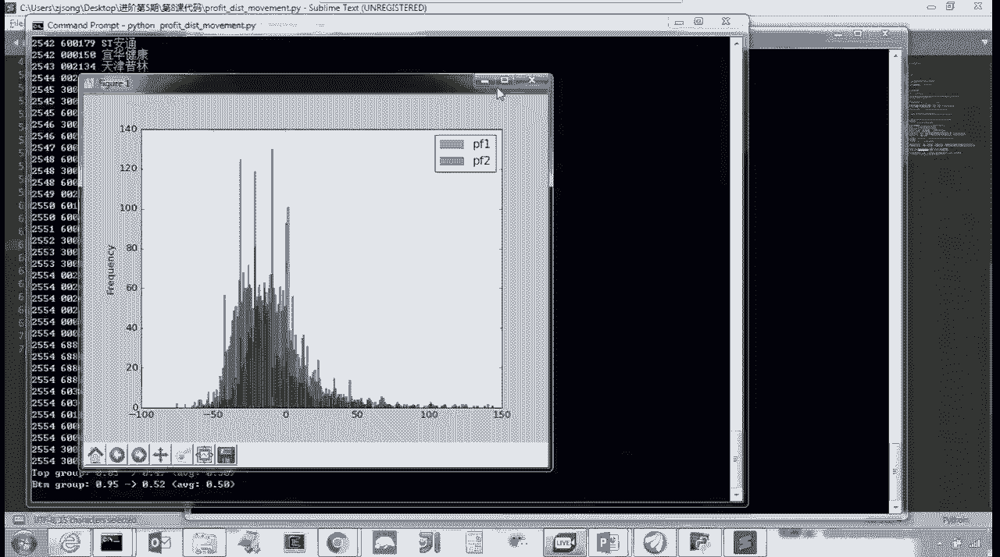

你会看到我会我会把每一只啊，就是这个收益率啊，就是这两个组合，它们的收益率，也会把他们就是在就是全场收益率，把把它们可以去打印出来，我们可以看到说这个PF1啊，这PF1就是就组合一啊，PF2就是组合二。

然后他们在全市场的这个收益，大概是这么一个分布，大概是这么一个分布，也就是说从这个分布也能看到说呃，不管是组合一还是组合二，他们在他们在呃任何一个时间段，其实在全市场它最后还是体现出一种呃一种统。

一种就是一种啊平均效应对吧，比如说原来全市场排名最好的，那么到了到了另外一个时间段，那么它就处于一个呃，就是一个平均分布的一个啊一个水平，那么全市场排名最差的那些到了另外一个学生。

他也是呈呈现出一个全市场平均分布的水平，所以通过这个图形也能看出啊，这种均值回复的效应嗯，然后呢这个程序就给同学们讲解完了，包括运行以后的效果，那么同同学们也也都能也都能看到，那么有兴趣有兴趣的话呢。

同学们可以就是可以回去把这个程序，再自己运行一下啊，再体会一下，就是我到底是怎么通过这么设计的，这么一个实验来证明我可以在全市场啊，通过所有股票的收益率的一个排名的变化，来证明啊。

市场中存在着这么一种均值回复效应好了，那么所以呢这个思考题等等会回头再说啊，好所以这样的话呢，我们就可以根据刚才我我给同学们的这个证明，然后呢，我们来构造出一个均值回复型的量化策略啊。

这是这是今天我要说的这个就是第二步啊，就刚才我们其实已经提出了问题，然后分析问题好了，我们分析完问题，我们就要解决这个问题对吧，我已经通过一个一个程序来证明了，市场存在这种均值回复效应。

那么下面呢我们怎么去用这个效应啊，所以我们需要设计一个量化策略嗯，那么这个量化策略呢啊，我就把它叫做一个短期的市场反转策略啊，也就是说利用这种均值回复效应，我来做一个策略，♪ 那么这个策略呢 ♪。

就是利用了一个叫做短期市场反转，什么概念，什么叫短期市场反转，反转呢就是说一段时间内表现最差的股票，过段时间他就表现好了对吧，相对于全市场来说，相对于之前的状态就表现的更好一些。

然后呢如果之前表现最好的那些股票，过段时间呢，它就相对于原来表现会更差一些啊，都都回到了一个平均水平，所以基于这么一点呢，我们把它叫做一个短期的市场反转，所以呢，我们就根据这个思路来构造一个。

均值回复型的策略，这个策略怎么做呢，首先啊我们先建立一个股票池，先看一下我在这个课件里头给列了，其实是两两个策略啊，就是两种做法，第一个呢我只做一个单向的一个纯多头的策略，那么比如说我就建立一个股票池。

然后把过去啊三个月或者一个月，反正无所谓了，就某一个时间段表现最差的N只股票，构造成一个组合啊，就是表现最差的这些股票构造一个组合，然后呢每过一个月或者或者说两个月，反正每过一段时间。

我就会把这些所有的股票卖掉啊，股票池里这些表现最差的股票卖掉，然后再重新挑最近最差的那些股票放进来，然后再过一个月再把它卖掉对吧，这个所谓的再平衡就是每过一段时间，我做一个调仓，重新构造一个股票池。

就是这么简单的一个策略，然后呢，当我把这些悬念的股票放到这个组合里的时候，那么我是做一个均仓分配的，就每一只股票我给他分配相同的资金，比如一一只股票我就给他分配1万块钱，那么1万块钱买多少股。

能买多少股，算多少股对吧，这是一个啊等就是等仓位的这么一个分配策略，当然我也可以把它再做一些改进，但是这是以后再说，就这么简单一个策略好了，所以这个呢是一个纯多头的股票，就只能单向做多的同时呢。

我们还有另外一个思路是可以做一个多空组合，也就是说我在既做多表现最差的股票的同时，我也要做空表现最好那些股票对吧，我可以做一个多多空双向，这个其实就类似于做股票呃，这个多空双向。

其实就类似于我上节课给同学们讲的，这个期货啊，期货其实你可以做多空双向对吧，什么叫做多呢，做多无外乎就是你你如果看好这个，看好这个股市，看好这个呃，你要交易的这个品种，它将来是一个上涨趋势。

那么你就先买后卖对吧，这就相当做多，那如果说你要做空呢，或者说你看跌对后市看跌的话，那你就先卖出再买再买入对吧，先卖后买实际就是做空对吧，你先卖出，现在开仓卖出开仓，然后呢再买入买入，现在是买入平仓。

把它平掉，那么你赚的是下跌的这么一个差价对吧，所以做多是先先买后卖，做空就是先卖后买对吧，我们可以简单这么理解，但在股在股股市里头呢，尤其是A股啊，国内的A股你做空其实是不好做的对吧。

那么你只能通过融资融券啊，通过融融券的方式来做空，怎么做呢，相当于借券嘛对吧，你就相当于从券商那地方通过融券的方式，把他券商持持仓的，把券商持有的呃这个证券把他借过来卖出去。

然后呢过段时间再再从市场上把它买回来，还给券商，这就是融券的一个动作对吧，就类有点类似于期货的这个做空的一个过程，就先卖后买好了，所以呢我们这个短期市场反转，我们可以有两个版本啊。

一个版本是纯多头的策略，就是只只卖出就是啊只买入表现最差的股票，这是一种做法，还有一种就是多空双向，就是即啊既额做多就是表现最差的，同时也做空表现最好的啊，或者说就买入表现最差的。

或者卖出表现最好的这么两种两种思路嗯，这有一个示意图，我们可以看一下，然后呢在每一次调仓间隔，就所谓的再平衡周期啊，那么每到了每到了我调仓的时候，那么我对全市场所有的股票，设定一个观察窗口啊。

在这个观察窗口内，对每一只股票计算他们的收益率，收益率怎么计算对吧，刚才我其实前面已经给同学们讲了，我可以根据每一只股票，它在这个观察窗口的第一天和最后一天的，这两天的收盘价的差价差。

除以第一天呢那个收盘价，就相当于是它收盘价的一个相对变化的百分比，作为收益率，对吧好了，那么我就可以把全市场所有股票的收益率，计算出来之后，嗯之后那么就对收益率最高的这些股票取出来，对它做空。

然后呢把收益率最低的这些股票取出来，把它做做多，那么做空这部分和做多这部分就构造，就成了我的我的持仓股，那么在经过一段时间之后，经过一个调仓周期之后，那么我就把原来不管是做多的股票，还是做空的股票。

统统把它平掉，把它清清掉，然后再根据一个新的观察窗口重新来计算，重新来计算每一只股票的收益率对吧，同样对新的这一一次计算，那么把所有表盘最好的收益率，最高的那批股票用来做空。

把收益率最低的那些股票用来做多啊，然后这样周而复始的，就是每隔一段时间就这么调整一次，调整一次，就这么循环的操作，那这策略就非常简单，就是就是这么这么做，好了，那么这个它背后的原理呢。

就是刚才我已经通过编写了一段程序，给同学们证明了一种均值回复效应啊，根据这个均值回复效应，我就构造出了这么一个量化策略啊，所以这是一个研究过程，一步一步的怎么从一个思路，然后来证明它。

然后最后再把它实施到一个具体的一个，量化策略里头来啊，这所以这是一个一个研究过程，嗯好了，那么这个策略原理我们说完了，下面我们就看一下，怎么来编写一个均值回复型的股票量化策略，那么这个那么这节课呢。

我们就在聚宽平台上来编写这个策略，那首先就说我们看一下，我要编写这么一个策略的话，我的这个投资标的怎么选择对吧，其实呢刚才我说的这个原理啊，均值回复型效应呢，其实是一个通同一个通用效应。

我是以股票为举例，但是我们可不可以拿期货来做呢，其实也是可以考虑的，但是只不过呢从期货的角度来说，它的这个呃可交易的品种啊，这个容量还是比较少，股票多对吧，毕竟全市场股票有好几千只，那期货的话呢。

你要考虑主力合约可能也就几十个对吧，所以其实还是股票呢，更容易体现出这种均值回复的效应，所以我在这节课里头，还是用股票来作为一个例子啊，但是对股票来说呢，尤其是A股，那么做空不太方便啊。

所以呢我们需要通过融券的方式来做空，这样的话呢我们才能实现出一个，多空双向的一个策略好吧，所以呢在这节课里头呢，我就给大家做两个版本。

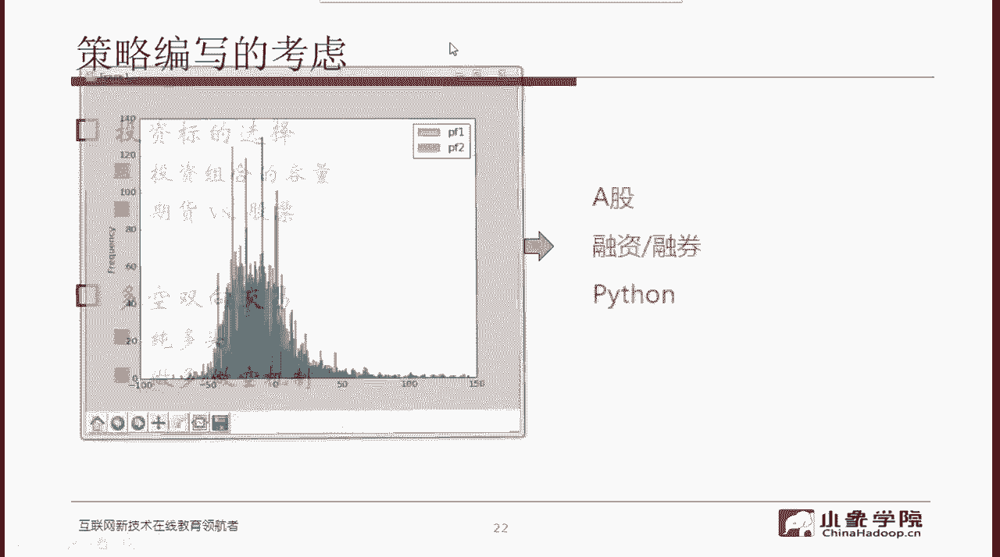

一个是纯多头啊，一个是多空双向的啊，好了，现在回到刚才啊。

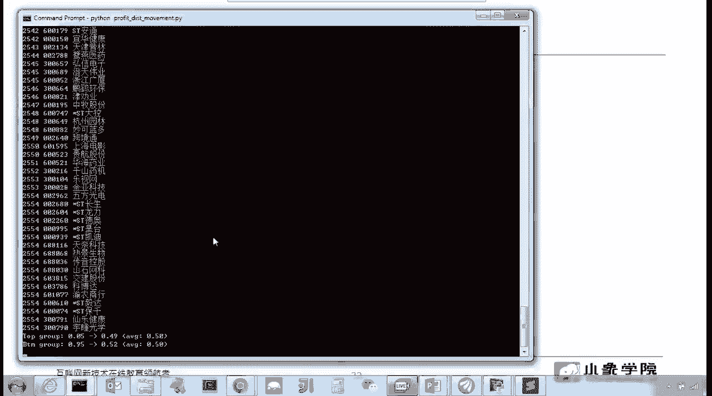

刚才那个执行的程序已经执行完了啊，就是显示出这么一个分布，那么同学们具体的细节可以再回去再琢磨一下。

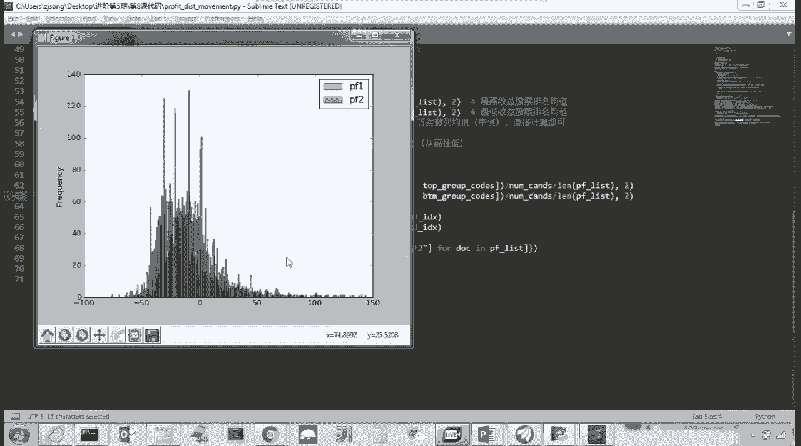

好了，那还回到我们这个课程上来课件嗯，所以结论就是说我这节课用A股啊，作为我的投资标的，通过融资融券的方式，然后来做多做空我的各个呃股票组合，同时呢是又在一创聚宽这个平台上，用Python语言来编程啊。

来实现我们这么一个均值回复的策略，或者叫做一个短期市场反转的一个策略，那首先我们先先先做一个纯多头的一个方案啊，最简单的刚才我也说了，就是做一个定时调仓策略对吧，在每一期我都卖掉旧的持仓。

然后构造一个新组合，然后呢只只做多前期表现最差的那些那些结合，同时呢做一个等额资金分配，就等仓位的分配啊，做一个纯多头的方案好，那么这个，具体的编呃，具体的代码啊，其实我也都给同学们提供了有各个版本啊。

就是这个mi regression，1。11。2等等，一直到3。1，那么一共是五五段程序啊，就是都提供了，所以呢这个同学们，其实你也可以自己去按照我的课件去，一行行的敲，或者直接把我的代码拷贝过来都行。

那我现在就带着同学们先先弄一个最简单的啊，我们先到这个一创聚宽这个平台上节课，我也给同学们啊布置的预习作业啊，同学们就是你首先需要去注册一个个人账号，然后呢熟悉下这个平台的API接口啊。

还有它的使用习惯，那么现在我们就直接在上面做一个策略，比如说我先新建一个策略对吧。

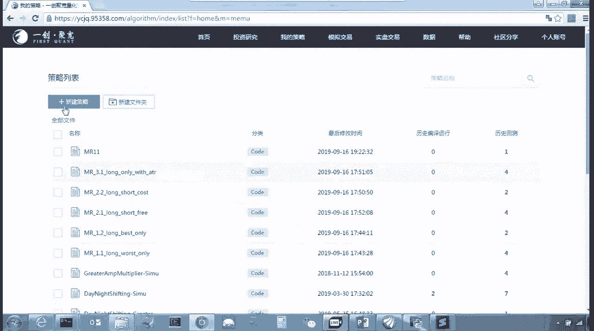

新建一个策略之后呢，那么这个聚宽平台它就会给我提供。

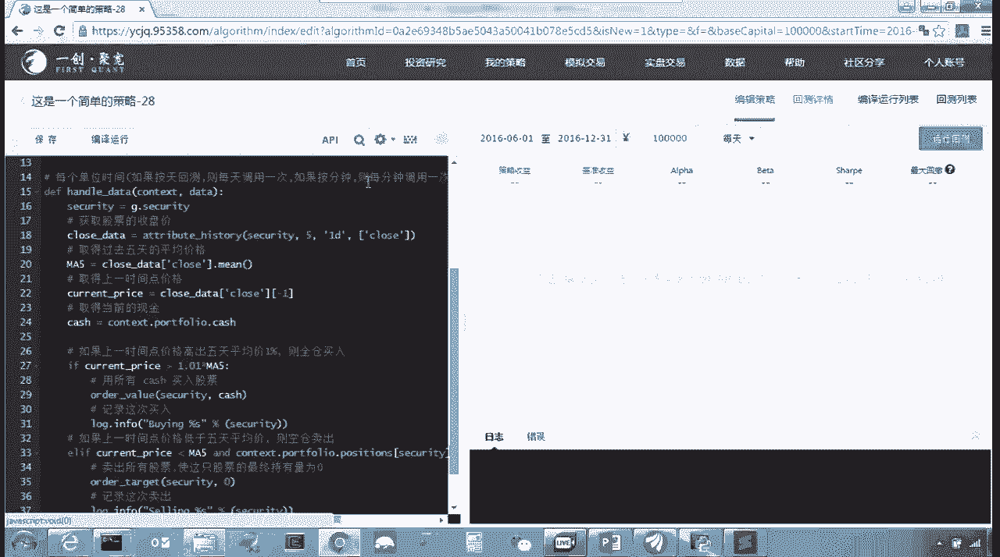

它就会给我先创建一个模板啊，包括初始化函数对吧，然后呢然后呢可以去设定，就是说每一根K线过来之后，它会回调一个函数，然后我就在可以在这个回调函数里头去做。

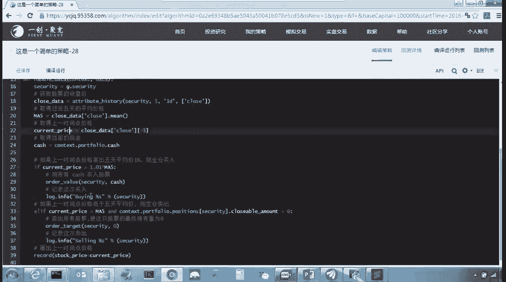

去实现我的逻辑，那么为了节节省时间起见呢，我就直接把我的代码取过来，比如说这个一点一这个版本叫long worst only啊，就是说只做多表现最差的那些股票的含义意思。

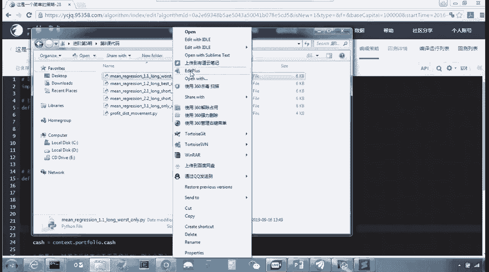

那么我把它整个的代码拷贝过来嗯，拷贝过来就贴到好，就贴到刚才我创建的这个，这个空的策略里头来，比如说就叫version啊，随便起个名字，好版本一点一，然后把它保存一下。

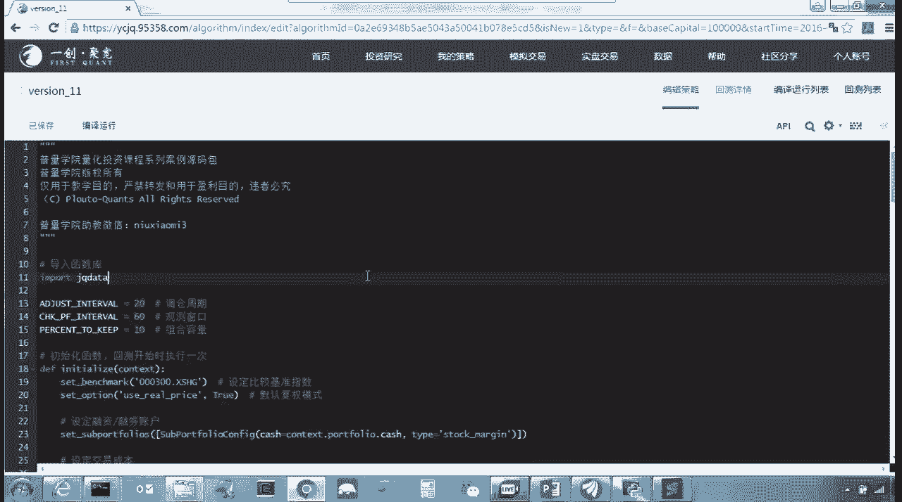

然后呢我怎么去回测呢，就这个代码写完了一会。

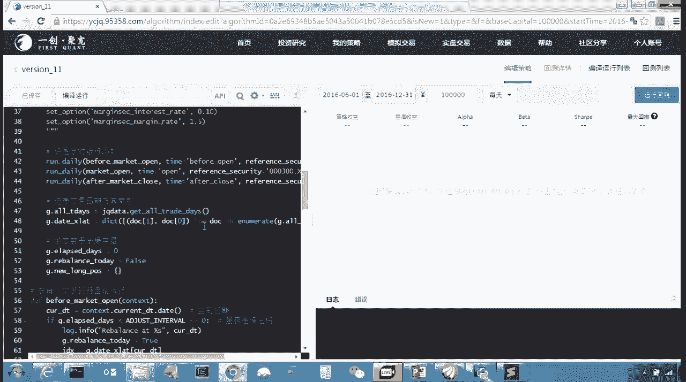

我再给同学们解释什么含义啊，怎么去回测，回测的话我就在啊在这个屏幕上。

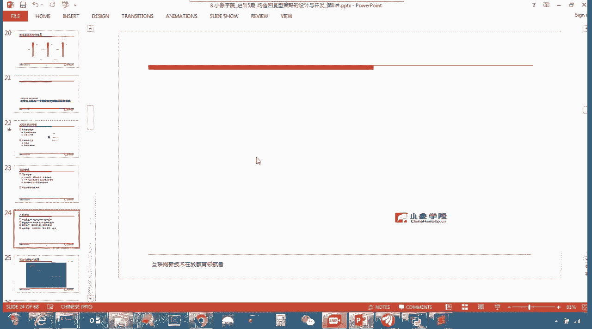

比如说我先选一段时间，比如16年1月份到19年吧，啊16年的1月份，1月1号到19年的，就是到今年，比如最新的啊，现在是嗯8月就到到8月初吧，到8月底啊，我在日线级别，但是因为我现在要买入的股票比较多。

所以它默认是10万块钱，这个资资金量太小，所以我再加两个零啊，按照1000万来做好了，现在那么我把这个环境设置好之后，我就可以去让他去做一个运行回测啊。

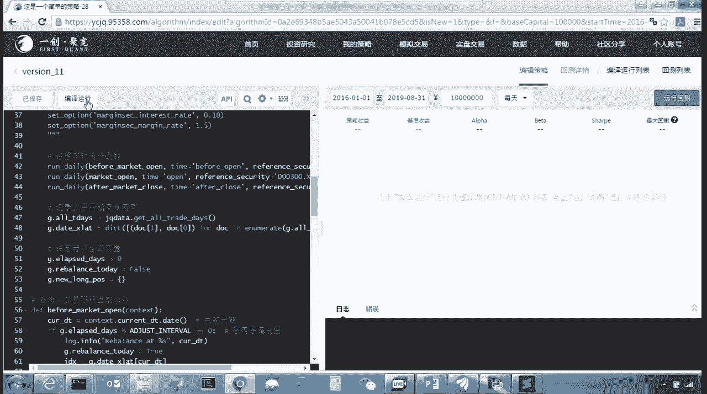

运行回测一会我们回过头。

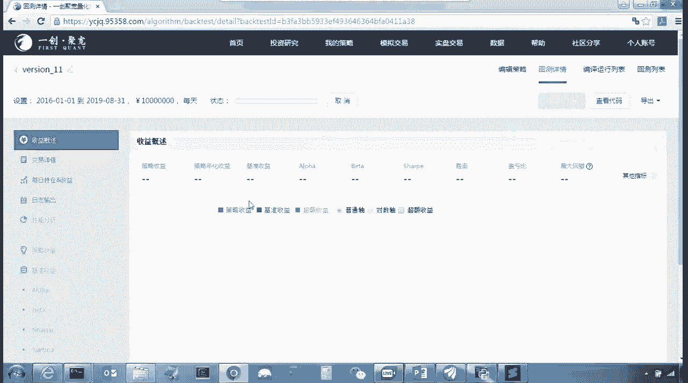

因为这因为这个运行比较慢，需要花点时间，所以一会我们再回过头来，再再看它的一个总总体表现。

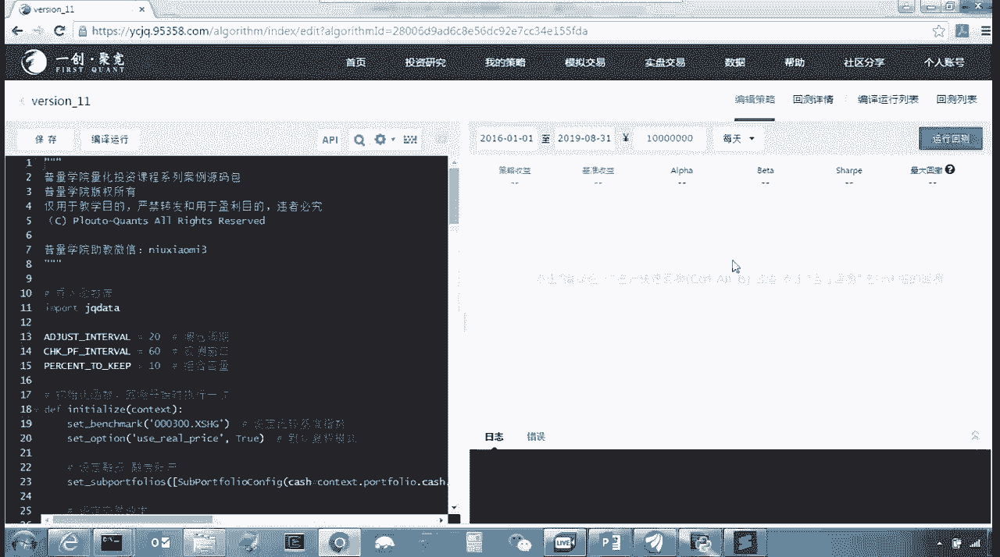

然后我现在花点时间给同学们讲，讲解一下代码，在程序开始的时候啊，我先设定了几个呃，几个常常呃常数啊，一个叫adjust interinterval，就是调仓周期20，设成20就是20个工作日呃。

20个交易日大概是一个月对吧，一个月差不多有二二十来天的交易日好了，然后呢观察窗口呢是这个叫check嗯，Check profit in interval，设成60，就是大概是三个月的时间。

就是我用三个月的这么一个窗口，作为它的一个收益率的一个表现对吧，用三个月的这么一个时间窗口看，如果在三个月表现最好的，那就是放到放到这个组合一，表现最差的就放到组合二，是这么一个过程好了。

然后另外这个组合容量呢这个十啊，这个我要取全市场的10%，那叫person to keep啊，取全场取呃，百保留10%放到我的组合里头好了，设置几个常量之后呢，我们就看呃后面的具体代码。

那么呃我们看在初始化的部分，这个set benchmark00030就是用沪深300对吧，这是沪深300的股票代码，指数代码，所以用沪深300作为我的一个比较基准，然后呢use是real price。

这是前复权啊，默认潜伏全模式，那么这个都是都是一个标准的设置啊，然如如果同学们对这些呃，聚宽平台这个函数还是不太熟悉的话呢，啊我建议你可以去看一下它的连接帮助，就是在这个帮助菜单里的这个API文档。

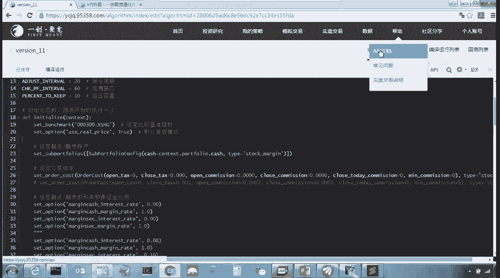

打开这个AAPI文档，那么这个文档里头啊啊有比如说有有这个呃，数据获取函数对吧，我们可以通过通过哪些这个Python呃函数，然后从聚宽平台能够获得到股票的历史数据，还有这个对象啊。

就是说我们的这个context上下文啊，全局变量啊等等，还有说这个part for you，就账户持仓，等等吧，就是说各种啊各种嗯函数，所以同学们如果对这个不熟的，还需要去看一下。

还有说一些一些基本的设置，比如回撤的时候啊，我们可以设置滑点呃，花点这里是叫做，呃花点还有说交易成本对吧，交易成本叫set out the cost。

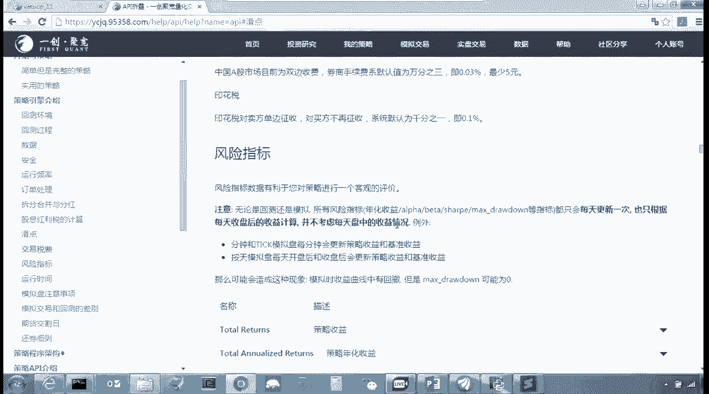

花点叫set slipage等等，那么像这种细节呢，同学们都需要呃，自己再多花点时间去去去设置一下，那去查询去看一下接口好了，然后呢我们再看呃，再往下看啊，这个因为因为我今天举的例子呢。

我是要用到融资融券，那么融资融券这种方式呢，它用的是一种信用账户啊，他是带杠杆的，类似于我上节课给同学们讲的期货的那个例子，所以它的账户类型首先我要配置一下，特殊配置一下啊，它和传统的股票不太一样。

所以他要用这种margin叫stock margin，这种信用账户，所以把把他的这个保证金账户类型修改一下啊，好了，这样的话，我后面就可以就可以正常的使用，融资融券的函数了。

咳然后然后第二个呢下一步就是设置交易成本，那交易成本暂时我先不考虑啊，在最后一步再考虑交易成本，所以呢交易成本里头，我就把所有这个要印花税啊，啊就是就是呃开盘的税收，就是开仓的税收藏呃。

就是呃平常的税额税，然后呢commission啊就是券商的佣金等等呃，还有还有包括最小的每一笔交易，一个最小的佣金等等，把这些线都设成零啊，就是假先假设我们没有交易成本。

然后还有一堆融资融券的这个利率和保证金，设置，也先暂时都不考虑好了，然后现在呢后面我就设几个定时函数啊，一个呢就是说比before maket open这个表示什么呢，就表示说在每一天开盘之前。

我会执行这么一个函数，叫被before market open，就回撤的时候啊，这回撤的时候每一每一根日日呃，日K呃，♪ 日线级别的K线 ♪，那么都会执行这么几个函数。

所以一个叫北before market open，就是开盘前执行一次，然后呢market open就是开盘的一瞬间执行一次，还有一个叫after market clothes。

就是在每天收盘之后再执行一遍，所以这是三个不同的函数啊，我在三个不同的函数里头，分别执行不同的逻辑好了，那么这几个几个定时运行函数执行完之后，下面呢我们就要记录这个交易交易日的日期，所以在距宽啊。

距宽平台有个叫做get outrade date啊，这么一呃，这么一个函数是表示把所有的历史上，所有的有效的交易日交易日期全把它取出来啊，取代之后呢，然后我对它构造了一个索引，大家可以看看这段代码。

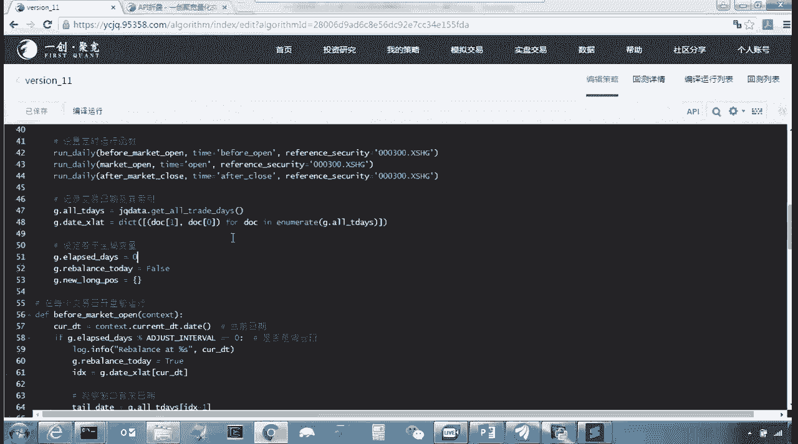

那么这段代码呢，我在课件里特别给同学们就是写了一下。

为什么我要我要自又用一个，做一个这么一个数据结构啊，为什么呢，因为啊因为我这程序里头，我需要也就说我们在回测的时候，回测到某一天的时候，我是需要比假如说这一天是要调仓了对吧，要调仓。

那么我需要从这一天往前看，三个月的这么一个时间窗口，就从这天往前数数三个月的工作日，然后呢，把把三个月前的那一天和当前这一天，他俩的这个收盘价取出来，取出取出之后，然后我再计算它的收益率对吧。

之后再根据这个计算出来收益率做排名，所以说我在程序里头，我是需要从任何一个交易日往前数N天的，这样的话我为了快速去访问，所以我构造了一个结构，但是同学们会问了，为什么你不拿直接拿日期往回去捡呢对吧。

比如说今天是假，如今天是10号，那前一天前就是9号，两天前不就8号，什么三天前不就7号吗，为什么不这么减呢，你要想一想，其实并不是每一天都是交易日对吧，那么我们从全年的日日历来看，有一些天是周周六。

周日是不交日的，还有一些节假日都是不交日不交易的，所以我我并不能说从某一天往前倒着，往前减若干天，得到当当得到之前的某一天，而且确定它是交易日对吧，所以我只能是通过一种枚举的方式好了。

那么所以呢我就先通过get out outrade date，通过这么一个函数，把全市场所有的交易日期全取出来，它是一个大列表对吧，♪ 但我们可以看一下 ♪，像我这个嗯课件人给举的例子。

比如说2018年的5月7号八号九号十号，11号对吧，之后直接就蹦到14号去了，因为十二十三号是个周末对吧，所以它不是交易日好了，那么这个大列表就是所有的有效的交易日期，之后呢，我用这个构造了一个字典。

就把每把这列表里的每一天，这个日期和它在列表里的这个顺序号，把他们两个都就是做了一个映射啊，现在做了一个词典，这样的话呢，这样的话我就可可以通过这么一个词典，我根据某一个日期，快速的找到它。

在原来那个列表里所处的一个位置对吧，然后我根据这个位置要往前减N天，再从N天再一查表，就能查到当当时N天前的那个日期是多少，中间已经很方便地跳过了所有的周末和节假日，对吧，所以我是通过这么一个数据结构。

通过这么一个字典的一个数据结构，用来快速的访问之前某一天的这个日期啊，某一天所在的日期好了，所以这是编程里的一个小技巧，给同学说一下，这个同学们如果没有看懂这个例子的话，课后呢再稍微仔细好好的琢磨一下。

到底我这个数据结构是为什么，这样就能构造出这么一个反向的查表的，一个数据结构。

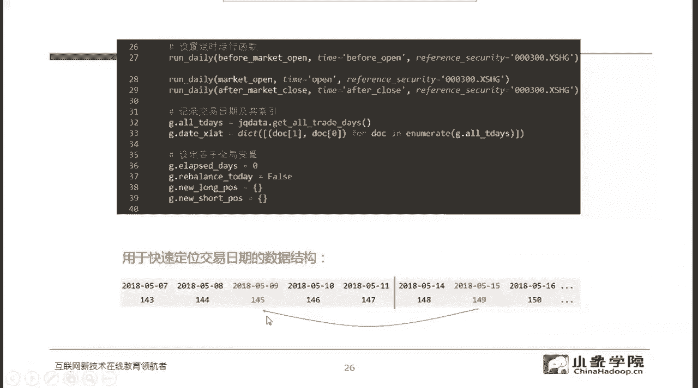

好构造好这个数据结构之后呢，我又设了几个变量啊，一个叫elapse states，这就表示说从我回测开始的第一天啊，每每走一天，我就把它加一对吧，因为我现在呃是需要每每隔20个交易日，我就做一次调仓。

所以我靠它来做一个判断，对吧，嗯好了，我们往后看，那么在每个交易日开盘前叫北before market open，在这个函数里头，我首先先取出当天的这个日期对吧，然后再根据我现在回撤走到了第几天。

叫做elapse space，那么通过这个变量，我来判断它是不是可以被前面这个20整除啊，就adjust interval能不能被20这个数整除，如果能被20整除，就说明已经经过了20个交易日。

那么这一天就是一个调仓日对吧，如果不能整除，那它就是啊什么都不做好了，那么那么所有的这些事情做完之后，最后呢我再把这elapse date加一对吧，所以你们可以看到说我每回测的时候。

就是在回测过程中每走一根K线，我就会把这个总的日期加一，再走一根K线又加一，那么对对这个总的一个计数器，如果它恰好是能被20整除，那么这一天就是一个交易，就是一个调仓日好了。

所以我们看如果说如果说这个elapsed dates啊，恰好能被这个adjust interval，就是20这个被整除，那我就设一个变量叫做REBALANCED啊，Rebelliance today。

表示今天是一个叫做再平衡日或者叫调仓日，♪ 对吧 ♪，就把它设成true，那否则呢这个elapse is就是false对吧，♪ 那么这样的话呢 ♪，我就可以通过这么一个全局变量。

就可以知道说当前回测到的这一根K线，或者说这一天它到底是调仓日还是非调仓日，好了，下面呢如果是对调仓日，也就是说这个elect，这个rebelance day等于true的这一天，如果调仓日的话。

那么我需要干什么事呢。

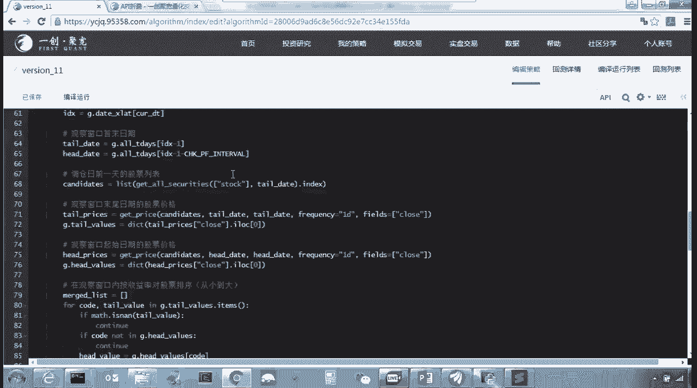

我们还回到我这个原理图，那么对调仓日这一天，我是不是就需要对全市场的所有的股票，计算他们的收益率对吧，他们在观察窗口里的这个收益率，然后计算出收益率之后，对它做一个排名对吧，做一个排名。

然后排名最好的做空，排名最差的做多是不是我，所以我需要需要做这么一个事好了。

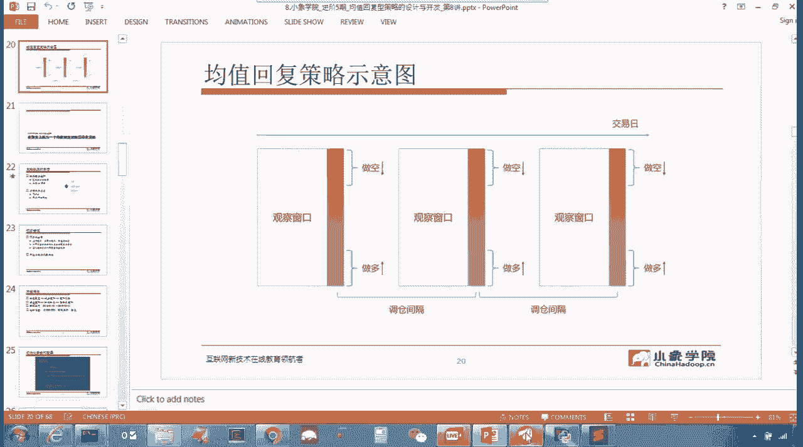

那么我们继续看程序，那如果说。

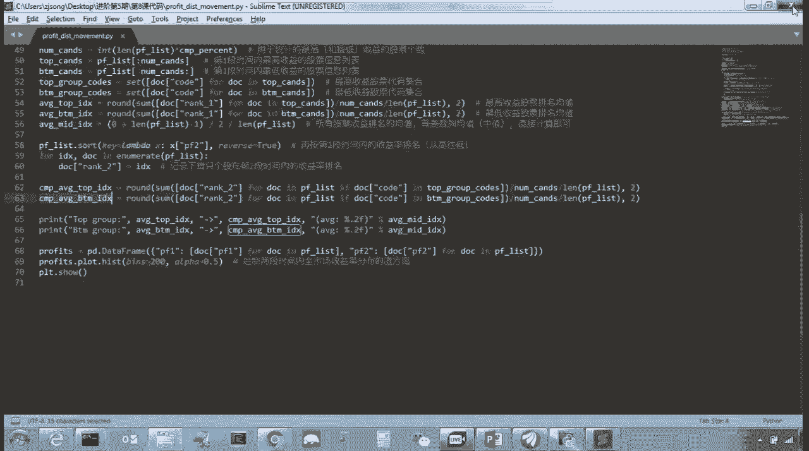

如果说这一天，如果这一天他是一个是一个调仓日啊，或者叫再平衡日的时候，那我需要做什么，你看啊，我首先根据刚才我构造的数一个数据结构，把当当天所对应的这一个序号，这个日期所在的队列里的一个序序列号。

把它取出来，然后呢把它减1-1，就相当于前一天对吧，前一天的这个日期，然后再减去这个interval就减去60，相当于三个月前的那个日期，这样的话呢我就把这两个日期给取出来了。

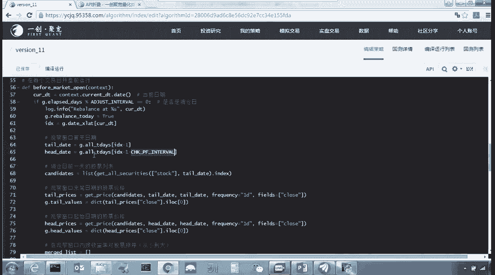

我再给同学们画个图啊，你就能知道知道为什么我是这么做。

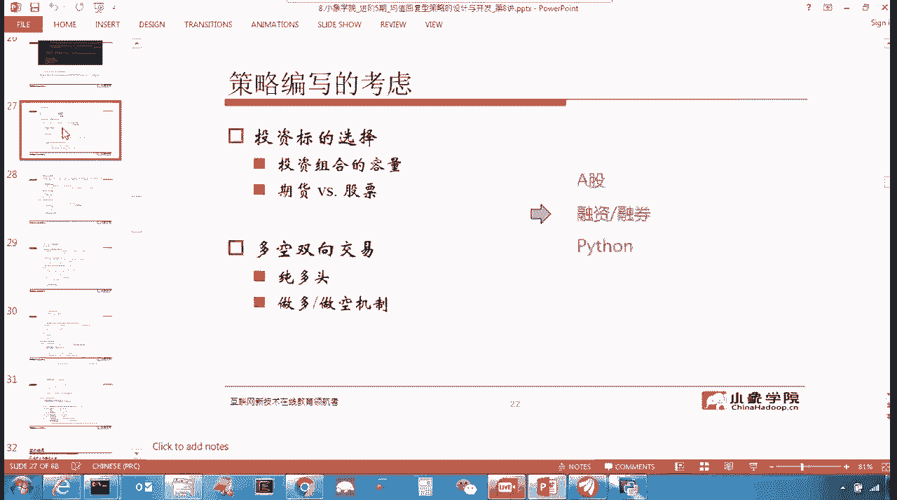

就在这吧，好那么假如说嗯假如说当前啊，假如这是个时间窗口，那么当前是这一天就current date呃，♪ 我回测假设当前走到了这根K线 ♪，并且呢当前这一天啊，就当前这一天它是一个调仓日好了。

那么我就找到他前一天这个日期，还有说再往前再回溯三个月的这个日期啊，那么这个日期叫做had date，另外后面前一天日期叫做tail date对吧，所以假如大，但这个图大家看明白了吗。

就是也就是说我现在这个涂成黑色的，这个区域啊，涂涂涂成实心的这个区域是表示当天，那么我就往前看一天，就叫做tail data，再往前再数60个工作日啊，呃60个交易日叫做head date。

那么我就根据head date，这一天所对应的收盘价和tail date，这两这两天的收盘价的差，这两天的收盘价，根据他们呃来计算出这一支股票，它所对应的一个收益率。

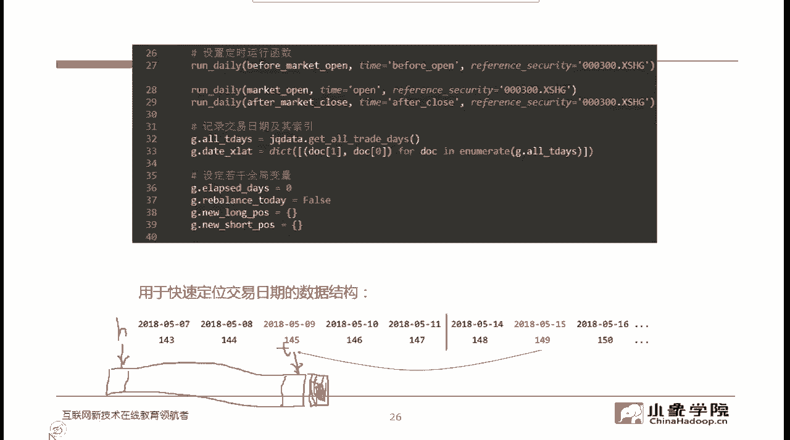

所以说我需要根据根据我的这个数据结构，首先找出这个had date和tae date，之后呢，之后呢我就从全市场啊，把全市场所有的股票取出来之后，然后对每一只股票，对每一只股票分别的去啊。

去求去求他的这个呃，在在这个观察窗口的最后一天的这个股价，和这个窗口第一天的股价，然后求出这个股价之后啊，当然我要判断说，如果说某一只股票，恰好在那一那一天是停牌的对吧，或者说他退市了或者还没上市。

那我就抛抛掉它，反正因为我是是一个统计的效应，所以全市场好几千只股票，如果有个别的一二十只股票在那一天恰好停牌，那我就把它抛掉了，就不考虑它了啊，所以这是用一个比较粗的方法去去处理的。

但是这个从统计意义来说，对我们的结果没有任何影响好了，所以你看我这有一一判断，那如果说在tail tail date这一天，那么这支股票如果它它的没有值，就取不出它的收盘价，说明这天是停牌的。

或者还没上市呢，或者已经退市了对吧，那么我就continue就不考虑这支股票了，那同样如果说这支股票它在head的date那一天，它也没有收盘价，那说明他在害的害的那一天也是啊，也是停牌。

那也不考虑它了啊，这所以这样抛抛掉的股票是很少的，然后这样的话呢，呃剩下的就是说在观察窗口的第一天，和观察窗口的最后一天都有值。

所以这样的话呢我就用tail data value减去head value，再减1。0，得到的就是说这支股票在整个观察窗口内，它的一个收益率叫profit r，好了之后呢，我就把每一只股票这个大循环啊。

这是一个for循环，把全市场每一只股票，他的股票代码，收益率，还有最后一天的股价，把这三个值都放到一个一个词典里头，把它们存起来，放到一个大列表里头对吧，这个就是我后面要要要进行啊。

构造我的挑选股票时的一个依据了，就每一支股票的代码，然后这股票在观察窗口里的收益率啊，当然还有它最后一天价格啊，把这三个值都都存下来之后呢，之后我们就对它做一个排序对吧，整个这个大循环。

对全市场所有的股票处理完了之后，那么我就对这一个大列表做一个排序，这排序用的是salt函数啊，同学们不熟悉的话，可以看一下呃，看一下Python的这个呃语言的帮助，salt函数。

同时呢我用一个拉姆达函数指定了我的排序，♪ 规则 ♪，是按照这个PROFR这个字段来进行排序的啊，也就是说这个reverse等于false，排序的是就是非逆序，♪ 就是顺序啊 ♪，这是顺序的排序。

也就是说收益率最低的排在前面，收益率最高的排在后边啊，大概是这个样子，所以呢对所有的股票根据收益率做好排序之后，然后呢我下面就是对它就是进行一个提取，那么现在呢我是从零啊到前10%。

就全市场的10%对吧，这个number to keep，是表示全市场10%一共有多少只股票，比如说如果你要3000只股票的话，那么前百分之就是300只对吧，所以就从0~300把把这个前10%的股票。

它们所对应的刚才记录的数据结构把它取出来，放到一个叫new long position这么一个呃呃变量里去，因为我现在给同学们举的这个一点一版本，这个例子就是一个纯做多头的一个啊，均值回复型的策略啊。

存多头的策略，所以呢我现在只是从从这个全市场取，每次调仓的时候，只取全市场表现最差的那些股票，所以我们可以看到说是从零到number to keep啊，把这些股票取出来。

放到一个叫牛郎position这么一个变量里，这就是我的股票池好了，那么也就是说我在每一天回撤的每一天，在开盘之前我就可以把股票池确定下来了对吧，如果说这一天，如果这一天是嗯，如果这一天是调仓日。

那么我就会构造一个新的股票池对吧，如果说这一天不是调仓日，那我就什么都不做，这是开盘前干的事，下面我们再看开盘时开盘这一瞬间干的事，开盘一瞬间就代表可以交易了，对吧好了。

那么我们又就判断说如果当天是调仓日的话，那我是不是就要把所有的旧的股票卖掉，把所有的旧的股票卖掉，然后呢把新的股票池买进来，对不对，这就是我的一个策略，就这么简单好，所以呢我现在先如果今天是调仓日的话。

那么我就把当前已经有的持仓取出来，然后呢对于当前我所有的持仓股做一个循环，把它们把它们都卖掉平掉，因为我现在用的是融资融券的函数，所以这里用这里头实际上用的是融资的函数啊。

叫margin cash close，就等于把我持有多头的这个股票，把他们全给清仓了，全卖掉，做一个循环啊，所有的持仓股全卖掉，卖在旧的车上之后，我就要把新的股票池里的每只股票全买下来，对吧。

那新的股票是买的时候，刚才我也说了，我这个策略是最简单的，就是一个均仓分配，所以说现在我总共有这么多股票要买，就是这个new long position，把它求一个length啊，求一个长度。

就全市场10%，一共有多少只股票，那就是这个length好了，然后呢我总共的资金就是available margin，就可用的保证金，然后把它俩一除啊，得到的一个平均数就是买。

我要分配给每一只股票的总资金数啊，那这样我把我的资金已经分配好之后，那我就再对啊，新的股票是做一个循环啊，用这for循环对这个new long position，这个新的股票池做一个循环啊。

循环的时候呢，是把给每一只股票分配的资金，除以它最新的那个价格啊，就除以除以它在观察窗口内的最后一天，就前一天前一天的收盘价，就大概算一下除以前一天的收盘价对吧，然后再再整除100，再乘100表示什么。

把它现在把是现在把他这个可以买的股数，把它变成100的整数倍对吧，因为我们也知道说股票A股每次交易，你最小单位就是一百一百一百股对吧，就是一手一手是100股，所以说我要是要买的股票呢。

一定是100的整数倍，所以说我这里头先用一个整除100，再乘100啊，这样的话就变成了一个可以买的股票的个数，一定是100的倍数好了，计算出我要买的这个股股票个数之后。

然后用main cash open开仓，把它买入就完了，好那么这个这个就是我的一个纯多头的方案，就这么简单，那最后还有一点点还有一点点代码，就是说after market close呃，就是收盘之后。

收盘之后，无外乎我就是把把整个这个啊，整个所有的股票的持仓状态打印一下啊，这个这个我就不不多说了，同学们感兴趣可以去研究下这几个字段，什么意思，这是为了做做统计呃，做统计的这个对我们看嗯。

就是看整个绩效表现没没什么影响，所以我就不不详细讲了好了，那么现在就是当我这个代码写完之后。

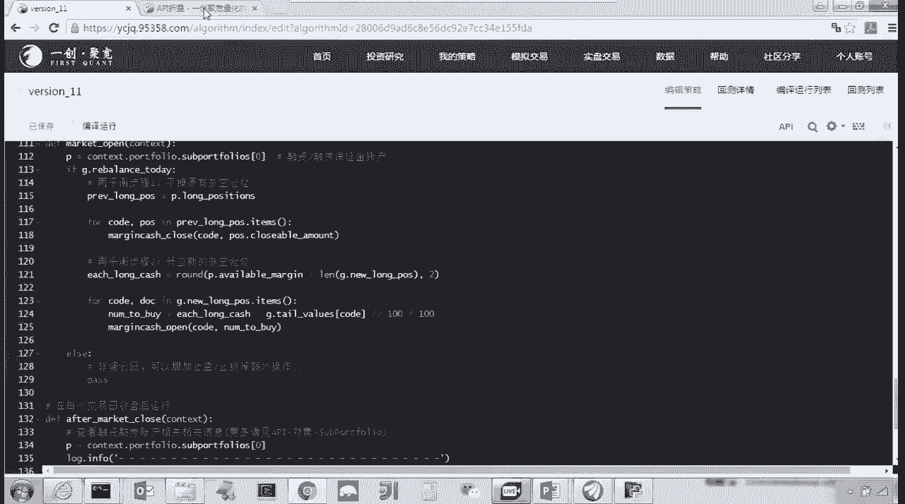

我看一下刚才刚才我的回测嗯。

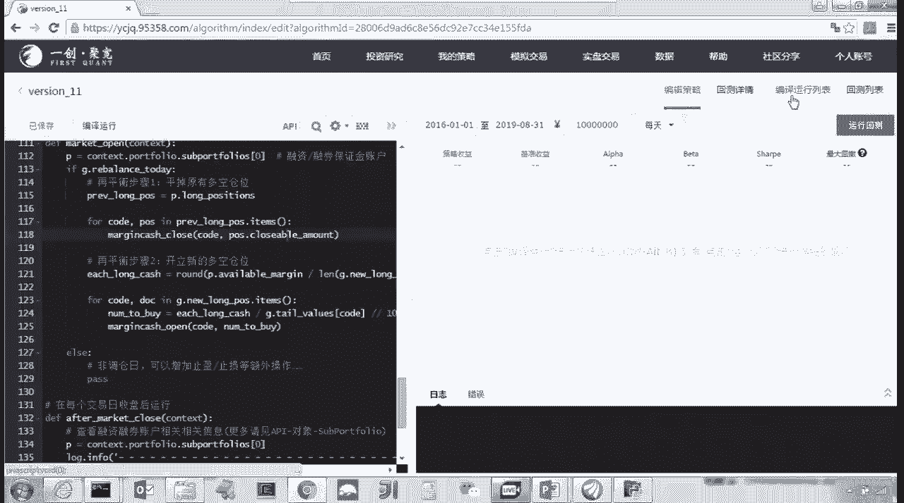

回撤的这个状态，这个还没跑完啊，这个还没跑完，这还正在跑，所以所以就说我就不等了，那么我就是把我之前呃，之前给就是课课前啊。

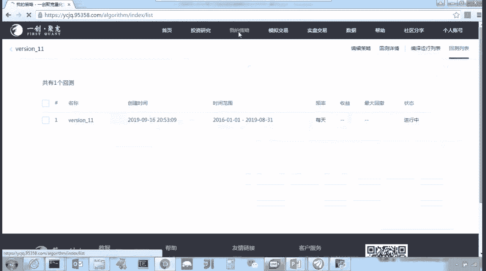

运行的那个版本给同学们看一下，就是刚才那段代码。

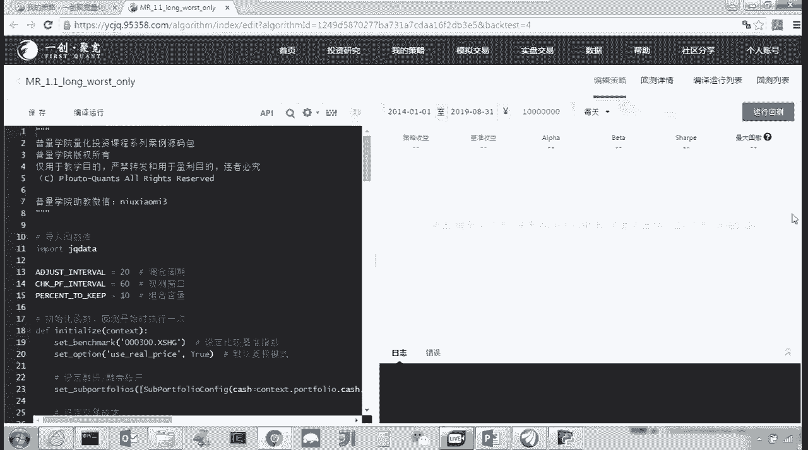

如果说我回测完了之后，它是一个什么样的表现，哦这个也还没这还没哦，这个这是已经算完的啊，稍等啊，不是这个版本，我们看一下是是这是这么一个状况啊，是这么一个回测结果啊，大家看看我这个屏幕也行。

或者看课件也行，也就是说我在历史上的这段时间，我在每次调仓的时候，我只去做多表现最差的股票，那么这个这个他的表现，其实跟我的基准表现比起来，其实看起来并不出彩对吧，并不是特别好。

但是我们看前面这一段时间，它是略好于我的基准，但后面这段时间其实比我基准要差一些，这个没关系，这这个现在我们只是证明一个原理。

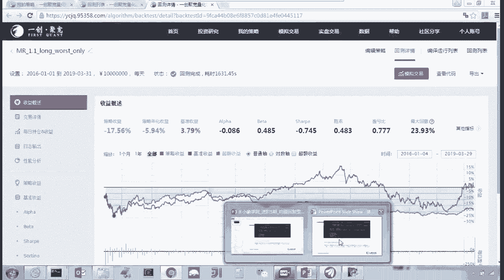

然后现在呢我们还回到，我们还回到我们这个，还回到我们整个这个策略的设计，刚才我们看到的就是一个啊最简单的啊，我只做多，表现最差的是这么一个表现，其实并不没有看出太多的意思，但是你要想想。

其实我整个整个思路啊，整个市场啊，就是说我前面证明了这个嗯，就是证明了这个原理啊，全市场就是既做多，就是均值回复效应，其实它是既体现在表现最差的，也同时体现在表现，就是那个最好的那个股票对吧。

所以我现在两方面合在一起，才是我的一个均值回复效应，所以如果说我单看全市场表现最差的，这些股票的话，其实并不一定能够反映出我的均值回复效应，所以下面呢我们就看怎么样去去结合，结合这个表现嗯。

就是表现最好的一个股票，把它们合在一起，那我们先做一个小实验，假如说我对全市场表现最好的股票，我做多对吧，现在我的函数啊，我现在这个函数就是这套程序，我先不做过多的改变，我只改一点就可以，就可以。

就可以变成我做多表现最好的。

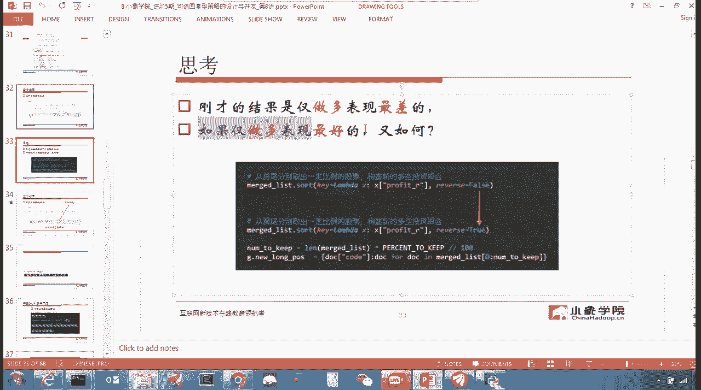

这么一个一个效果，大家看一下我的程序，刚才我们看的这个策略啊。

这个策略呢我现在是做多，全市场表现最差的那10%对吧，那现在呢我们来做多表现最好的那10%，所以我只需要改变一个地方，因为我们看程序里头我有一个排序对吧，在这个地方有个排序。

我现在的按把它作为一个就是reverse等于false，就是相当于一个正序排序，那我现在把reverse把它改成true，就表示说按照一个倒序，就从高往低排对吧，我就是把整个全市场的股票的收益率排名。

把它掉个掉个个，那其他地方我我一点都不改，这样的话呢我就变成，那么后面我取钱10%的股票，是不是相当对全市场求那个前10%，表现最好的股票了对吧，上一个版本给大家看的是10%表现最差的。

那现在我我只需要改改变这一点，那这个那这个啊程序最后出来的结果就是，取全市场表现最好的股票的时候进行做多，对吧好了。

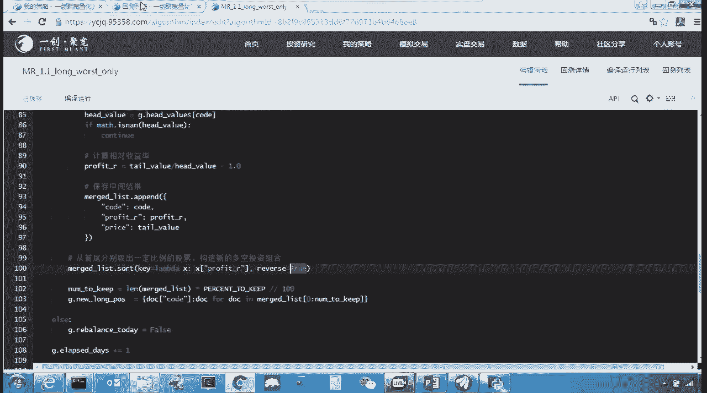

那么我们看一下就是这个版本，如果我只取全市场表现最好的股票。

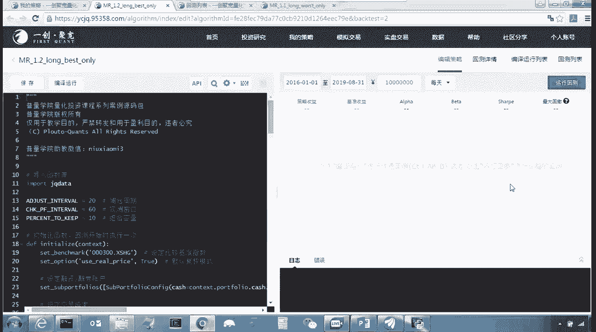

对他进行做多的话，那是一个什么效果，我们运行一下看看，那么它出来结果是这个样子，也就是说不管我的这个不管我的这个呃基准啊，比较基准是什么样子，但是我看我我的这个策略，它收益率是不是稳步的在下降对吧。

基本上很稳定的在下降，但是你要考虑我这个策略是做多表现最好的，这个其实和我刚才说的均值回复效应，是是是相反的，因为均值回复项里头我实际实际是要做空表现，最就是每一期表现最好的股票对吧。

而不是做多表现最好的股票，所以就说如果说我对这个这个策略里头，我对所有的就是每一期啊表现最好，那些股票我对它做空的话，是不是就相当于我的收益率曲线就翻上来了，对吧，他俩正好是正好是互为倒数嘛。

所以就是说我们来看一下课件，所以我如果仅做多就是做多啊，大家看这是做多表现最好的这些股票，那么收益率是这个样子，那好了，那我现在我其实可以把它作为一个反向指标，因为它是稳定下降的，那如果说我现在直接对。

每次是把这所有表现最好的股票，对它进行做空的话，做空那他他的这个收益权是不是就翻上来了，对不对，他就是稳稳步的上升了，那么如果说我把这个做空表现最好的，再加上前面这个做多表现最差的。

那么他们两个合在一起，才是我的一个均值回复的，这么一个完整的一个策略，对吧好了，那么这个呢大家需要稍微再再体会一下，就是我这两个实验的目的到底是什么，就主要是证明说我做多表现最好的。

和做多表现最差的分别是什么样子，之后呢，我把把它们结合在一起，然后呢我要做做空表现最好的，同时做多表现最差的，那这两个合在一起，才是我的一个完整的均值回复的一个策略好了，所以下面呢我们就看一下怎么去啊。

从一个纯多头的呃，一个呃就是一个呃，就是叫一个短期反转的策略啊，把它变成一个多空双向的一个策略好，那么时间关系我们稍微休息5分钟啊，过5分钟之后，咱们再回来继续后面的课程，好嗯我们现在呃结束休息啊。

回来继续后面的课程内容，后面还有很多，那下面我们来看一下。

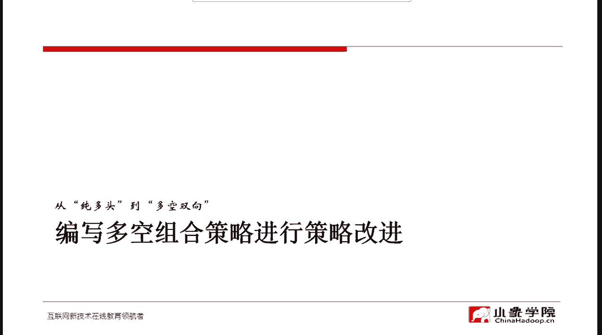

怎么样来编写一个多空组合策略进行一个改进，呃其实呢这个刚才从一个纯多头的，就是一个单向做多的一个策略，到一个多空双向策略，这个过程，其实刚才我从啊，语言描述上已经跟大家说的差不多了。

所以现在呢我们就直接来看代码啊，看我们对原来的上一个版本代码。

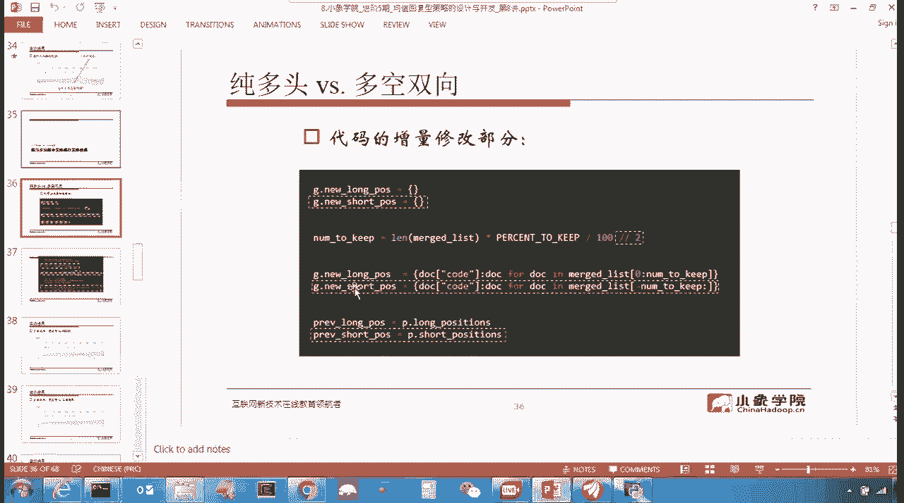

就是做怎样做一点点修改就可以啊，就可以变成一个多空双向的一个策略，嗯我们来看我提供的这个版本啊，就是呃呃这个多空双向的叫2。1，这个版本叫long shot free啊，这么一个版本。

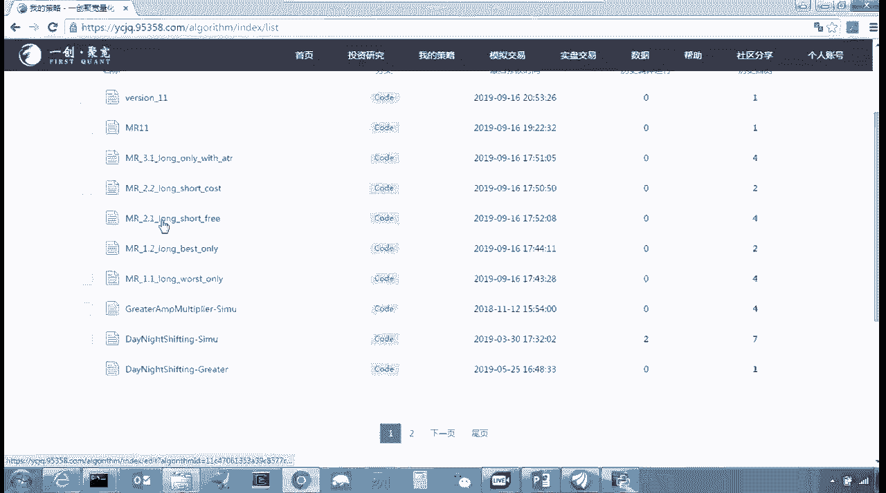

我们来看一下在这个代码里头做了哪些修改，我只是给同学们就重点讲一下啊，从原来一个单呃，单向做多的到一个多空双向的这个这个差别啊，好那么就在这儿，首先呢就是当我们对所有的，在每一次调仓的时候。

把所有的股票它的收益率计算出来之后，那么我们对他们进行了一个排序对吧，对全市场所有股票的收益率做了一个排序，盘废之后呢，那么现在我既然要做多多空双向，那么肯定我是要取表现最好的和表现最差的啊。

就是两两头就走极，就是两个极端的呃，这个股票的集合分别取出来，所以我们可以看一下，就这个地方做了一个修改，那么我对前边就是排完序之后，那么从零到这个number to keep啊。

这个是表示排名最靠前的那一部分股票，然而呢从这个负的number to keep到结尾啊，这是表示排名最靠后的那些股票，把它们分别取出来啊，一个叫做long position。

一个叫new position呃，一个叫new long position，一个叫new short position，就是一个表示一个是做多的这个仓位啊，做多的一个候选的股票池。

还一个做空的shot就表示做空的意思，要做空的股票池好了，那么这个是是修改的一个关键点啊，另外一个呢就是说我既然现在全市场，既考虑做多，也考虑考虑做空，这两种情况，所以呢我全市场我还要保证说。

股票池占我所有股票的10%，所以现在呢每每一个就是每一部分，就是每一个组合里头，我现在的这个数量是在原来的基础上除以二啊，大概就相当于是做多和做空各各5%，全市场5%的股票。

这样加起来是全市场10%对吧，所以这地方除了个二好了，那么这样的话呢，我就可以把做多的这个候选股票池，和做空的候选股票池都把它取出来了，取了之后，然后下面呢我们再看啊，当然后呢在每个交易日在开盘的时候。

如果如果是说呃，如果这一天是，如果这一天是一个嗯调仓日的话啊，如果这一天是调仓日，那么我们就把，首先先把原来旧的持仓全部把它平掉对吧，旧的伤怎么平掉呢，那我看原来有如果有多头仓位。

就是这个long position，那么我就我就用这个margin cash close方式，就是融资的方式呃，融资的这个平仓把它把它停掉啊，如果是这个short position。

就用的融券的方式把它平仓，就相当于把券买回来对吧，那么这个相当于是把原来旧的持仓清掉好了，那我现在在开始再开新的仓位，同样开新的仓位的话呢，也分啊，也分这个做多和做空两部分咳。

那么如果是做多的做多这部分头寸对吧，就是叫牛郎position，这个候选股票池，那么我做一个循环，每次呢用margin cash啊，用融融资的方式把它买入对吧，然后呢对这个要做空的这一部分啊。

这个组合呢或者叫后选股票池呢，那我就用这个margin security，就是融券的方式，Open，就融券的方式把它开仓，相，就相当于是啊借券卖出啊，是是这么概念，所以呢上面这一部分是做多啊。

做多一个组合，下面这部分呢是做空一个组合啊，就是两个函数是干这个事情好了，那么我对每一个组合呢，他们的每一只股票分配的资金啊，分配的资金是什么样子呢，啊下面这有一个求了一个平均数对吧。

对全市场所有总的保证金的一半啊，一半用来做多，一半用来做空啊，这是这是这么计算的好了，那么给给做多的这个组合，每一个分配的资金叫做each尺long cash啊，做空的组合里头。

每只股票分配的资金叫each short cash好了，然后呢，每次开仓的时候，就用这个用这个啊给它分配的资金数，除以它的最新的一个收盘价对吧，这样就可以算出它的股数啊，把它变成100的倍数。

这刚才已经讲过了好了，所以那么就做这一点修改就行了，所以就说我们从刚才一个纯的做多的策略，把它修改成一个啊就是多空双向的策略，其实改动的没有几行，大概也就这么七八行对吧啊，再回顾一下好了。

就是一个是呃筛选后票候选股票时的时候，现在呢就是说从头从开始结尾各取一部分对吧，这是一个修改，还有一个就是说开仓的时候，每每次调仓的时候，调仓的时候，那么就把旧的多空仓位全平掉。

同时呢再把新的多空仓位同时开出来好了，那么这个呢就是啊，就是我们一个多空双向的一个策略的代码。

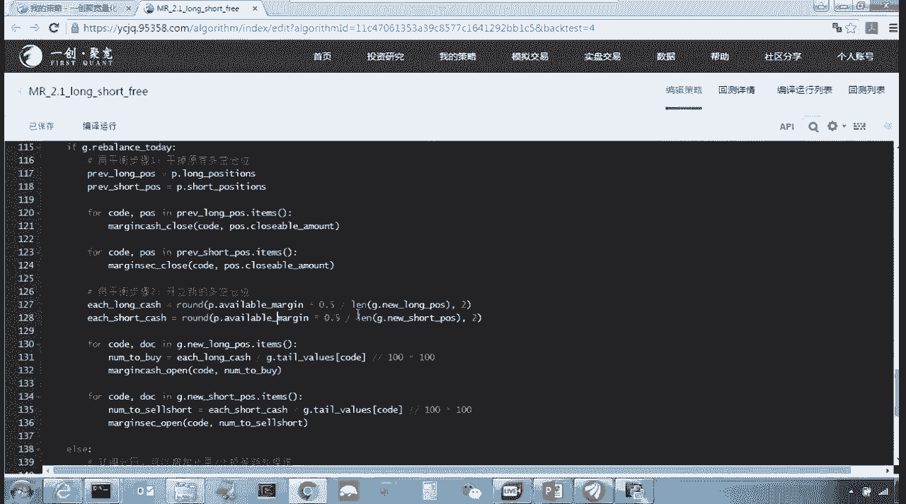

就做这么一点的修改就可以了，那我们现在看一下它的回测结果，嗯对看一下这个好，那么这个多空双杀结果我们看一下，那这个结果就显然好多了对吧，这比刚才好多了，那么我们可以看到说。

它的整个收益曲线其实是稳步上升的，非常稳当，非常稳当稳当，那么这个呢就是一个感觉，一个比较好的一个策略，那么年化收益呢是大概是10%，比如消费比例一点一，这还算比较高的股票策略了。

那么为什么会是这么一个结果呢，我们还回到课件上来，我们看一下，刚才我们前面讲的纯多头的两个方案，好纯多头，如果我单向只做多，表现最差的是这么一个表现对吧，那如果说我只做多表现最好的是这个样子。

那他是一个稳步下降的，那么我如果把表现最好的股份把它做空，是不是，就相当这个这个收益曲线就翻上来了对吧，它相对沿着零轴做一个对称的一个翻转，所以如果把它翻出来之后，再和上面的这个，再和上面的这个啊。

做多表现最差的这个回测曲线把它叠加起来，是不是就变成了大概是这个样子对吧，所以说这个曲线是比较合理的，就是从我前面的那两个独立的纯做多的呃，两个小策略把它合在一起，就能差不多能合成这么一个曲线。

所以说我现在通过这么一个曲线回测出来之后，我可以去验证，说我的程序基本上没什么大毛病对吧，这和我预期是一致的，而且这个表现是是是还还是比较啊，而且这个表现还是比较呃满意的啊，至少收益还是很稳定的。

上升好了，那么这是这是啊，这是一个嗯多空双向的一个基本的结果，然后呢我们还可以再看一下，这换一个取一个更长的一个时间啊，我们再看一个更长时间段的，比如说我从14年，我如果从14年开始。

刚才我们看回测是从16年到19年对吧，那我再往前走，再往前走推两年，比如从14年开始到16年，我们看看这段时间，这段时间实际上是有一个大的牛熊啊，我们如果从这个指数来看。

它有一个有一个大的一个牛熊周期对吧，先是有一个大牛市，然后接着有一个大熊市对吧，然后又有一个震荡，然后再接一个暴跌，就是就是实施这么一个阶段，那我们再看看这个多空双向的这个策略。

在这个这一个大的牛行周期，它的表现是怎么样的，我们可以看到说在震荡行情的时候，整个它的表现其实非常好的对吧，一直在上升，但是对，但是对这个单向的一个纯的一个牛市来说，他的表现不如指数的表现。

但是对这个下跌的行情，反倒他的表现会会会更好对吧，那么这个情况我们就可以通过，我们可以就是通过我的策略原理来分析一下，为什么它在这两个特殊的阶段，是表现是这个样子对吧，所以我带着同学们分析一下。

就是说你你通过在不同的行情下的一个回测，结果再反过头来去，可以验证你的策略的思想到底是合不合理啊，如果是可解释的，那就说明呃，这个策略首先代码可能写的没有什么问题。

而且你对这个策略它的一个适应什么样的行情，可能就更更是心里有数了对吧好了，那我们看这个大牛市，看这个大牛市，我们这个大牛市我们可以啊，一般大牛市是一个什么样的特征啊，是不是说几乎所有的股票都在上涨对吧。

几乎所有因为资金一直在流入，几乎所有的股票都在上涨，就没有下跌的股票对吧，那么这种情况下，你一直是卖出表现最好的股票，一只卖出表现最好的股票，是不是说等于是和真正的去一个走势，去去去去去背道而驰啊是吧。

那就是说所有表现最好的，就所有的股票都在涨，但是你偏偏要卖出它，那是不是从整个全市场统计来说，你这个表现肯定要要要比指数要差对吧，所以说指数这单向的大牛市一直在上升，但是我们这个啊多空双向组合。

它的企业收益率是在下降的对吧好了，那么但是我们如果看看这个大熊市，那大熊市一个典型的典型策略呢，就是说几乎所有的股票都在下跌对吧，几乎几乎所有的股票在下跌，那么那么在这个一个单向的一个熊市里头。

那么我们看做多表现最好的和做做空呃，就是做空表现最好的和做多表现最差的，那么显然嗯，显然就是说我某一段时间表现最好的股票，♪ 我对它做空 ♪，那么恰好因为因为他他一段时间是表现很好。

但是随时随后它肯定会下跌对吧，但从大概率来说是下跌的，那下跌时候我觉得做空，那自然这波收益就是非常可观的对吧，那么所以说我做空表现最好的那些股票，这个贡献是非常明显的，那我做多表现最差的那部分呢。

他很可能就表现平平啊，基本上就是一个一个随机数了呃，所以说但大熊市里头，那么我这个多空双向的策略，其实它的收益是要远远好于这个，这个指数的表现的，所以从从这么一个呃，从这么一个一个是行情阶段来看。

其实就能证明说我这个策略还是合理的，就是至少它它适用于某种某种行情，不适应于某种行情，其实从这个里头表现的就非常明显好了，那么这个就对这个一个多空双向的策略，我们就就介绍完了嗯，好，所以同学们可以回头。

在课后可以再再稍微花点时间就琢磨一下，整个我这我这个给同学们介绍几个步骤啊，首先我是先做多表现最差的，然后呢做多表现最好的对吧，之后呢把做多表现最好的翻转过来，变成做空表现最好的。

然后把做空表现最好的和做多表现最差的，这两个合在一起，构成了一个双向的一个策略啊，一个双向的多空策略，之后呢，双向多空策略，我对最近的一个行情，以及中间一个大的牛分周期。

这两个行业分别给大家跑了两个回测结果，那么通过这个回测结果，你其实可以有对整个这个均值回复，策略的这么一个思想，或者说它适用于什么行情呢，可能会有一个更深刻的一个理解好，那么刚才我们所有的实验啊。

都是忽略了交易成本，那么下面我们来看一下，交易成本到底对我的策略有多大的影响，那么我们来看一下交易成本怎么算啊，我们看呃交易成本通常啊，呃呃我们在做股票交易的时候有各种成本对吧。

一个是交易所本身会收手续费，还有券商啊要收一笔佣金，那如果说我是融资融券的话呢，首先我融融资融券这个他会收一个利率啊，有一个年化利率，这是额外的成本，并且融资融券呢啊，他的保证金比例是有一个要求的。

就说你保证金一定是有一定保证金在账上，才才可能去融券融到券对吧，这是这是第二类，然后第三类就是说我们在交易的时候，自然会存在一些滑点啊，华点就是我我的就是程序化嘛，就是当我从行情软件看。

从行情接收到的行情，看到某一个价格的时候，我在下单的时候，它有可能不成交，所以通常来说呢我们会设定一个滑点，就是在一个更高的买价，或者一个更低的卖价去去下单啊，这是一个华点，这也是额外带来的一个成本。

就相对理想的情况下，肯定也额外付出一些成本，还有一个就是冲击成本，就是如果我资金比较大的话，那么我这一笔大的资金进入到市场本身，就会影响市场的一个价格走势，所以会带来一个额外的对市场的一个冲击啊。

对我不利的一个价格的一个波动，那么这个叫做冲击成本好了，那么这些我们都要把它们设置上，所以呢另外一个呢就是关于保证金，♪ 因为咱们这一节课里头为了做空 ♪，所以用了融资融券的机制。

那我们就可以看下保证金呃，融资融券保证金是怎么设置的，首先呢就是说我在这个里头为了简单起见啊，那么做多的这部分我我是直接用了融资的函数，但是你可以想象一下，就是我们真实的。

如果你用一个实盘账户来应用这个策略的话，那么做多的时候，其实我没有必要用融资的方式对吧，我就用一个普通账户就行了，所以融资呢就虽然我用的融资函数，但是在在这个里头融资，我是不需要啊。

对他额外付出什么保证金的，所以呢这个里头呢保证比例我就用一比一，就是我有多少现金就可以拿它来做多多少啊，头寸啊，然后呢但是融券不一样，融券的话它有一个保证金比例，比如说在居宽这个平台里头，默认就是1。

5倍的保证金对吧，也就是说比如说我要买1万块钱的，我要借1万块钱的券，那么我可能就要付出额，1。5万的这个保证金啊，是是这样，所以就说我们来看看我的资金使用情况，假如说我不管是做多还是做空。

那么我现在假如说我现在要呃要操作这个股票，它的呃对应的这个账面价值是X对吧，那么我多投做多这部分，我就需要一一倍的X这个资金啊，如果是做空的话，就需要1。5倍X对吧，所以我把这两部分全加在一起啊。

假如我还同时要把我的保证金，百分之百用满的话，那么加在一起的话呢，那相当于我只能用用0。4，就是我只能我我的呃账户，账户资金我大概只能用0。4这么一个比例，就只能是开出四成仓来。

这样的话我才能保证说既做多和做空，而且他俩头寸是平衡的，这个大家可以理解吗，现在我列了一个公式对吧，做多就是说我做多的和做空这两部分，我要保证说他们两个持仓的这个市场的份额，是是啊是相等的，大概相等。

比如都是X对吧，就做多这部分对应的是市值是X，做空也是市值X好了，那么在这种情况下呢，那我的保证金呢我只能用到0。4对吧，这样的话呢我才能够保证说我的这两个呃，就是持仓的份额是平衡的。

因为因为多头做多和做空，它两个保证金比例是不一样的啊，大概是列这么一个公式，所以是需要0。4好了，那所以下面我们就看我们怎么在程序里头。

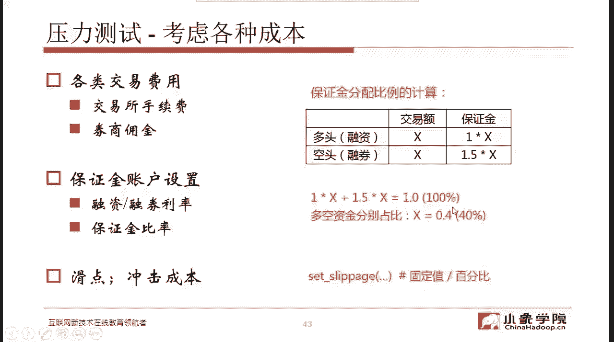

在程序里头把我的这个额交易成本考虑进去啊。

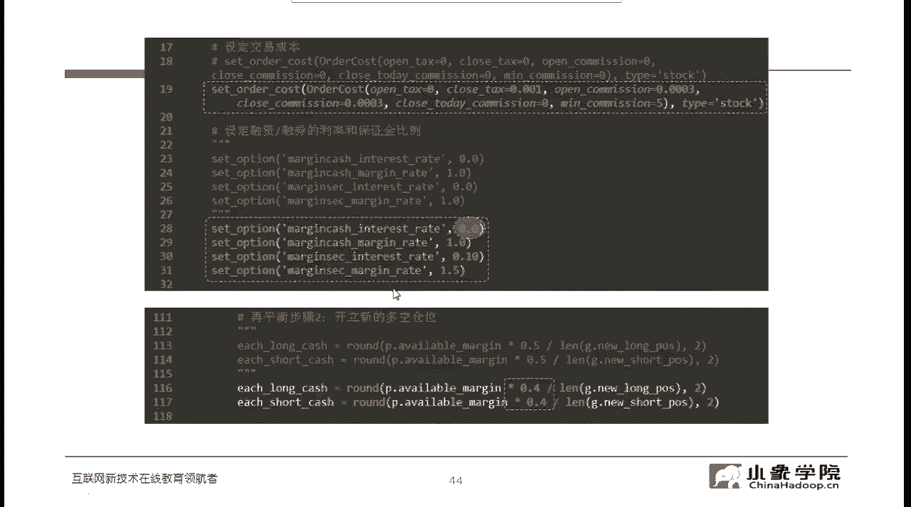

交易成本我们来看程序呃，程序呢我们就看这个叫2。2，这个版本叫long shot cost啊。

这个版本我们做了哪些修改呢，然后就可以体现出这个程序，首先第一个啊，我们这个ORACCOST，刚才我前面的所有的演示呢都是用的零，那么现在我就要把这outcast设呃设上了，比如说这个印花税啊。

就是平仓的印花税就是1‰，这是一个大概市场一平均水平啊，然后呢我我的开仓啊，买入或者是平仓卖出保证金额，就是这个手续费大概是万三啊，万分之三的标准，然后呢每一次交易，他的最低保证金是五块钱对吧。

这个基本上和市面上很多券商他们啊，可以提供给用户的一个比较优惠的啊，呃一个收费标准是差不多的，所以我就按照这个比标准来设了，就把这set out the cost。

这里头这个out the cost的各种参数都都改了，这不是零了啊，好了，第二个就设我的这个啊，融资融券的额额利率和保证金比率，那我们首先看首先看这个保证金比率，那么对融资这部分刚才我也说了。

其实我没有必要用真正真正的融资，我只要用一个普通账户，所以保证金比例就是一比一，然后呢这个额利率资金利率就是零啊，我不需要去付出额外的利率成本，但是对融券就不一样了，融券的话呢我是需要付出1。

5倍的保证金率，同时呢大概融券一般现在年化的，你要付出的利息大概是10%，所以我就把他的这个年化利率设成10%，那么这部分就是我融资融券需要付出的成本，好了，那么这部分设置完之后呢。

后边所有的程序就是所有的程序都不变。

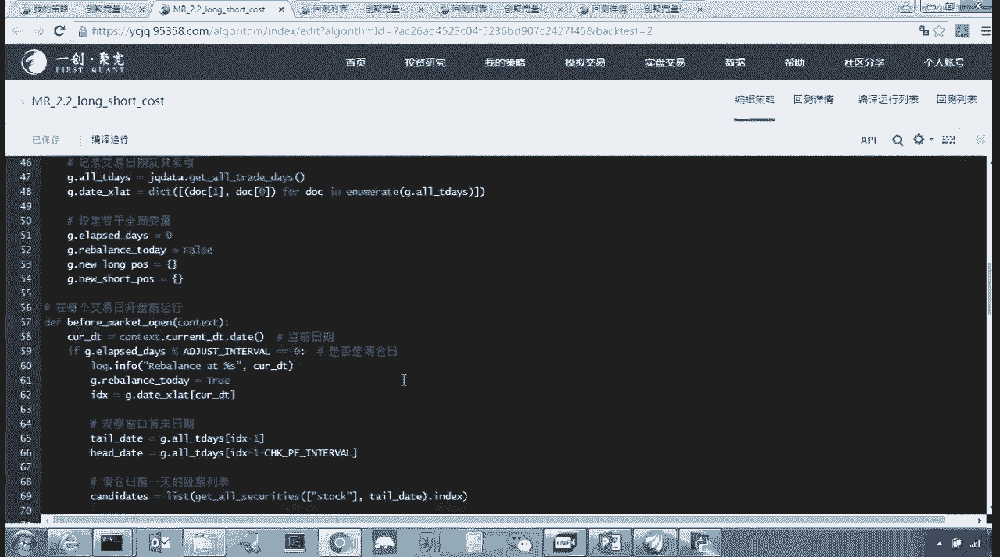

那么我们重新跑一下回测，我们重新跑一下回测，看看它的结果是什么样子呃，大概是这样，从总的结果来看呢，还是它的这个结果啊，还是一个上升的上升的一个状态对吧，但是只不过个别地方这个地方有所回撤。

但是回撤幅度不大，整体来收益还是正的，但是我们可以看下这个年化收益。

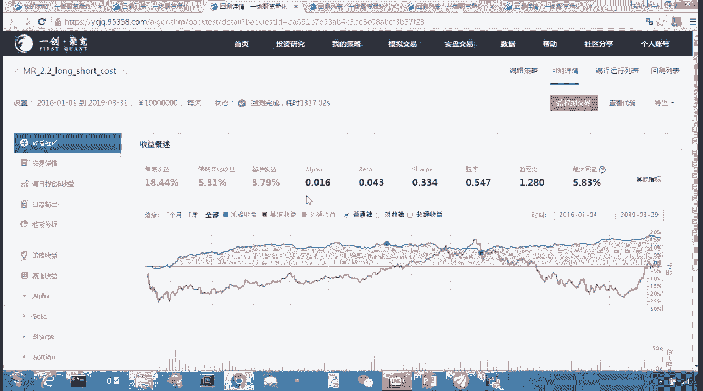

现现在变成了5。51%，那么我们看一下刚才如果我不加不加这个成本。

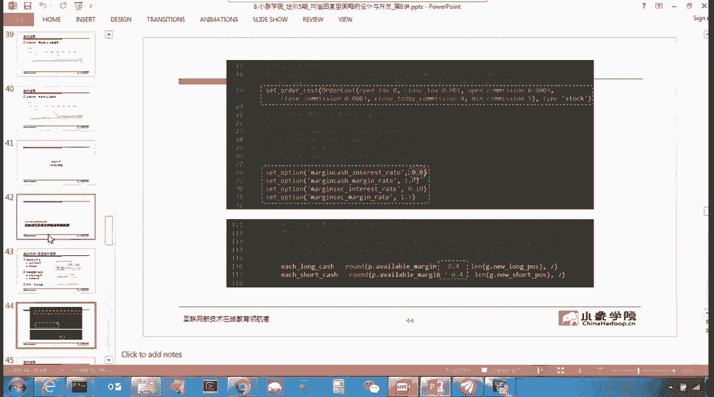

它的它的收益率是多少啊，如果不加成本，它的年化收益是10%对吧，当我加上了这个我刚才所说的各种成本之后，它年化收益变到了5%，基本上腰斩了，♪ 那么这个同学们就会想 ♪，为什么会有这么大的一个成本呢。

那我们可以理论估算一下，我们知道我现在这个策略是一写的一个，特殊策略对吧，那么既有啊正常的交易成本，还有融券的成本，那融券的话呢，它解决最大的成本是年化，有一个年化利率是10%，就是这个一年啊。

平均一年的话，我要就是我所占用的总资金，大概有10%的这么一个利息的付出好了，那现在因为我基本上就是多头持仓和空头持仓，我我对应的市值是一半一半对吧，相当于我有一半的仓位是用来做空好了。

那如果这一半的仓位做空，它年化利率是10%，那我我真正付出的利率是不是5%，对不对，所以说单是这个融券，我所需要付出的成本就是年化5%左右，所以我从上一个版本不计成本的呃。

那个回测结果是10%的年化收益，我减去5%，差不多就是就是5。5点几的这个收益，所以这部分是最明显的，那么至于其他的所谓的券商，佣金和交易所的手续费啊，还有所谓的华点，因为我是调仓不是很频繁。

我基本上每每一个月才会调仓一次对吧，那么这个啊这个成本可能对整个年化收益来说，还是影响非常少的，♪ 因为我交易不频繁 ♪，那么所以最大的成本体现出这个融券的利率了，所以它就单单这一项就损失了我5%的。

这么一个年化收益，所以当我把这个成本考虑进来之后，那么我从回测这个结果里头，能看到的这么一个年化收益水平，我也可以从理论上给你做一个估算对吧，就像刚才我说的，为什么我从10%降到了5%，这5%跑哪去了。

就是因为我融券的利率，我可以从理论上做一个估计，所以这样的话呢，我跑出的结果我认为这也是符合我预期的，我可以给你分析出一个所以然对吧，所以说我们同学就是，当你去运行一个回测的时候，每次出一个结果的时候。

你要分析，你要看这结果到底合不合理，或者说能不能讲出一个道理，如果能讲出道理，那么你对它对他的这么就是啊，就像你对它理解更深刻，或者说对它适用范围，也就可以理解的更深刻一些，好吧。

这是一个具体的分析的方法好，那么下面在我们看最后一部分，刚才呢我们我们又考虑了交易成本了，那么我们是不是还可以从其他地方，对策略本身做一个改进呢，还是可以的，我们再回过头来想一想。

我最开始的第一个版本给大家讲的，我的去构造一个股票池的时候，我是怎么去分配头寸的，对吧，我是用的是一个等额等资金分配的方法，对不对，也就说，不管我这个股票池里头持有了多少只股票。

那么每只股票我给他分配的资金是固定的，假如我现在有100万块钱，我要买入100只股票，一一百只股票，那每只股票我就给他分配的是1万块钱，对不对，大概是这个意思好了，那么我们再回想一下上节课啊。

我给同学们讲的海归教育法，还有更早的时候，其他老师给同学们讲的，关于这个头寸管理和风险控制啊，给同学们讲了很多这个头寸管理，就是或者资金管理的这个模式，那么在这在这一部分里头。

我们就来尝试从头寸管理的角度，资金管理的角度看看，能不能进一步的优化这个策略好，那我们看看这个头寸管理是怎么回事啊，啊其中一个模式呢就是按着呃，一个就是我们的分配资金方式对吧，刚才我也说了一个呢。

就是说我前边给同学们举的例子，都是按照一个均仓分配的方式，等资金啊，等额分配，还有一种情况呢，就是我们前面老师给同学们讲过，我们可以按照波动率对吧，也就说呃波动率实际上对应了一种风险对吧。

就像我上节课给同学们讲海龟交易法的时候，那波动率对应的风险，那如果波动率比较大的话，那就说明这股票风险比较大，我就要给它分配的头寸小一些，那如果波动率小呢，说明它的风险会小，那我就可以分配投资大一些。

这样的话就使得我整个收益率曲线会比较平滑，对吧，是这个概念，所以就说，那我们怎么去根据波动率来优化，我的一个头寸管理方案，那么我们就还用到了这个呃这个波动率N啊，就像上节课我们讲的波动率N。

或者说叫平均帧直播服ATR这么一个指标，那ATR怎么计算的，上七节课其实我已经讲了呃，TR叫true range对吧，可以把每天的最高最低价和前一天的呃，收盘价与当天的最高价相减，♪ 求绝对值 ♪。

或者前一天成本价和当天的最低价求绝对值，然后这三个值求一个最大值，就是TR叫出站值，好出院了之后，然后呢在一个实验窗口N，比如说N天求一个平均就是ATR真实波幅啊。

这个类似于海购交易交易法里那个波动率啊，波动性N对吧，ATR好了，那么在这节课里头呢，我们就就用ATR这么一个技术指标，作为我的一个波动率的一个衡量标准，然后根据它来分配我的头寸。

那具体头寸怎么分配呢啊，这还是一个百分比风险模型，也就是说我对整个账户先乘一个百分比对吧，然后用这个百分比，也就是说我每一个头寸最大损失的额度，再除以T2和最小交易单位，那么这个就计算出了每只股票。

我给它分配的一个头寸规模，所以大家看到这一页是不是很很熟悉对吧，这一页的内容跟我上一节课给同学们讲的，海龟交易法里的头寸管理呃，的方式是几几乎是一样的啊，同样一个思路啊，是一个动态的。

这是一个非均仓的一个头寸管理方法好了，那么如假如说我们现在采取这种百分比风险的，这么一个头寸管理模式，那具体我怎么去计算呢，对吧，我落到每一只股票，我到底给他怎么去分配呢，我资金怎么去分配好了。

那么我们再进一步的推导一下好，假如说这个百分号R是每只股票要承担的，这么一个百分比的风险对吧，C呢是我所有的可用资金，那在我这节课里的例子呢，这个C就是保证金账户，所有的可用的保证金，对不对。

然后pi是每一只股票的最新价格，也就是说pi呢是我每一次要调仓的时候，那么这支股票最新的一个收盘价叫PI对吧，然后VI呢就是它的波动率，也就是说这一只股票在最近一段时间内评，计算出来的ATR指标。

就是它的波动率好了，那么假如说我现在每一次调仓，我都要把我所有的资金全用进去啊，所有的资金全用进去，也就是全仓买入所有的候选股票，那么是不是就满足下面这公式对吧，C就是对每只股票来说。

我是C乘以百分号R除以VI，那么这个就是这个值再乘以pi乘以price，就把他们全加起来，就等于我的一个C，可用资金对吧，为什么这么算呢，你看啊，首先C乘以百分R，是不是我每只股票损失的最大的风险。

对不对，然后呢就是每只股票允许最大最大的损失，那这个最大损失除以我的波动波动率VI，得到的是不是就是给这支股票分配的头寸对吧，每一只股票分配的头寸再乘以它最新价格，是不是就代表这支股票它所占用的资金。

那你把每只股票所占用的资金求和求起来，是不是就是你的总资金，所以这是个恒等式，大家看看是不是这个道理对吧，每只股票C乘以百分号R，就是它的风险除以波动率vi，算出就是他的头寸啊。

算出他的这个我要买买持有的股数，再乘以它的价格，就相当于它占用的资金对吧，把所有的股票的，每一支股票所占用的资金加起来，得到就是总资金C对吧，那么这个很明显好了，那么这是个恒等式，下面我们就怎么。

我们就计算出这个R这个摆放R，因为是对整个策略，我要用一个统一的一个常数，我要把这百分号二算出来，怎么办，很简单，我就把两边这个常数C给它消掉对吧，消掉以后，那么这2%算出来等于一除以西格玛啊。

pi除以VI，所以这个呢就表示，每一只个股承担着一个百分比风险，就是这个百分号R，对吧，从从这个恒等式就可以推出这个百分R，同时呢再把它带回来，然后呢，每一只股票我给他分配的头寸。

实际就是C乘以百分号R再除以VI，对不对，但是因为我们买的是A股啊，A股的话它必须是100的倍数，100的整数倍对吧，每一首是100只100股，所以把它先除个100再求整。

再乘100就变成100的整数倍啊，这就是我要每一只个股买的这个股数，叫KI对吧，所以通过这么一个推导过程呢，我就我就把我的程序从一个军仓分配的方案，变成了一个按波动率来分配的一个方案了。

头寸管理的这个策略就变了好，然后下面我们看看这程序程序怎么去啊改啊，这个程序其实修改也也很也很很简单，我们看这个3。1这个版本叫long only with a t r。

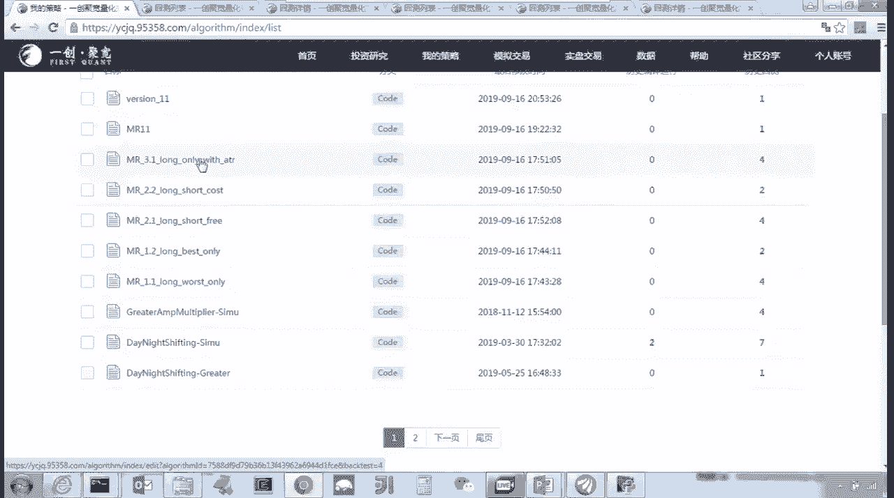

那么为了简单起见啊，我这个我这个给同学们演示的这个版本呢，我只只用到了一个做多的，就只用到了一个纯多头的一个方案啊，就是为了掩饰掩饰这个头寸管理，就是我们我们去比较这头寸管理这个方案啊。

把它稍微做一个变化，我们只只用到了纯多头的一个方案，做一个对比啊，前面这个所有的这个cost，Out cost，我也先不管全是先先都是啊，没有成本的这个版本啊，我们看一下我需要怎么修改。

好然后呢每一次啊，假如说我在每次调仓的时候，对全市场的每一只股票取出来之后，我计算出了它的这个收益率R对吧，计算完收益率R之后呢，我还需要计算这一只股票在当前调仓的这一天，附近的一个波动率啊。

这波动率我怎么计算，那么我们可以看一下，我通过get price这个函数来获取它的ATR值，呃，来来获取它的啊价格，那么这个价格日期呢取的是tale date对吧，呃从til date开始。

向前取这a t r window加一这么多天，那atr window是多少呢，我前面有个常量啊，这个atr window设的是20，也就是说我现在用来计算这波动率ATR啊，用来计算这个平均真实波幅。

就这个波动率的值，我用的是一个20天的一个时间窗口，好了，那么所以我就是从配偶date开始往前数20天，把这个窗，20天窗口里的所有的股票的价格全取出来啊，通过这个通过这get plan取出来之后。

然后呢然后然后对他做了一个这个PDC啊，做了一个shift，这是用pandas as这么一个一个库啊，直接把它做一个shift，求PDC求出来之后，然后呢我用用一个apply函数。

这是一个就是做了一个循环，就等于我简化了这个这个代码，你也可以做一个for简单的for循环。

呃简单for循环其实也很简单，就是就等于把这个呃就是把这个max啊，就是把每一天的这个就这个TR求出来，然后再做再做一个循环，就是取比如求20天求一个平均数啊。

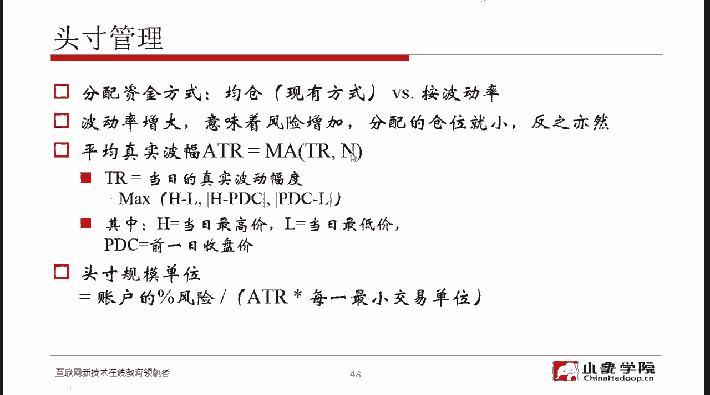

那么这就算出ATR，那么为了代码更简洁，所以我就直接用了一个现成的函数，我就apply对吧，然后里头用了一个lambda函数，就是对对我这个DF这个序列做了一个循环，那么把每一天的最高减最低值。

然后每天最高和前一天的收盘价，每天的最低值和前收盘价分别求差，然后求绝对值，然后这三个求最大对吧，然后对他用用apply函数做了一个循环，这样循环完了之后，得到的就是每一天的一个TR嗯。

就是每一天的一个真实波幅啊，每一根K线的真实波幅，然后把每一根K线真实波幅求出来之后，那么我在最对最后这20天，因为我只需要最后一天的ATR就行了，我不需要所有天的ATR，我只需要最后一天。

所以我就把最后这20天的AATR呃，最后二天的tr值求出来，只求一个平均，就是最后一天的最后这一天的ATR指标，那么把最后每一只股票在最后就零调仓前，这一天的AATR指标求出来之后。

那我也把它计入到我的这个列表里头来对吧，所以你看现在列表里增加了一项，原来是代码啊，收益率价格，现在我增加了一个AATR指标，所以我现在一共存了四项好了，除了四项之后，下面我还是照常啊照常。

然后继续把它做排序，♪ 排序完之后呢 ♪，构造出我的构造出我的这个股票池啊，就是收益率最低的那些股票，就是放到了我的股票池里头，那除了除了这个构造股票之外，我还要计算我的百分比风险对吧。

因为每次调仓的时候，我所纳入股票池的股票，他们的波动性总和可能是不一样的，所以我要每次都要重新计算我的这个风险，就百分号R那个值，所以我也是用了一个循环，那么循环就是把每一只股票的它的价格。

除以它的ATR就除以它的波动率，然后再整个求西格玛，这里我用了一个map reduce函数啊，用了一个reduce函数，就是相当于也是一个循环吧，啊一个递归的一个循环。

那同学们你要是reduce函数不理解的话。

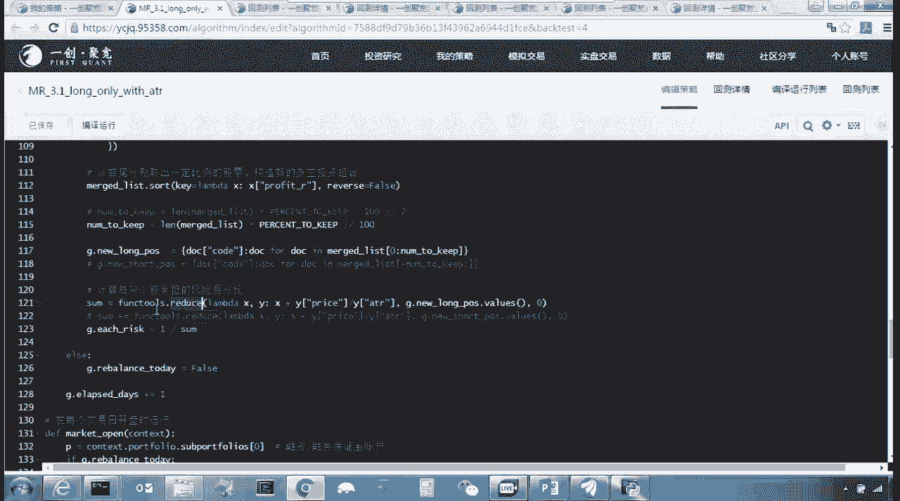

你就写个for循环也是一样的啊，目标呢就是把这个公式算出来，目标就是求这个西格玛啊，p pi除以vi啊，就是把每一只股票的价格除以它的波动性。

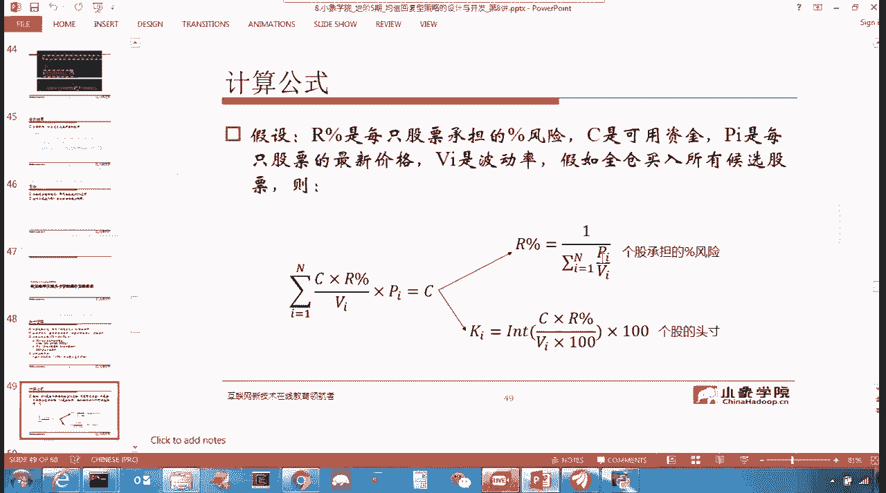

ATR求出来，所以你们可以看，我把每一只股票的价格除以它的ATR，最后求个西格玛就放到这个sum里头，最后我再对这个sum求一个倒数啊，求一个倒数就是这个each risk，就是我那个百分号R啊。

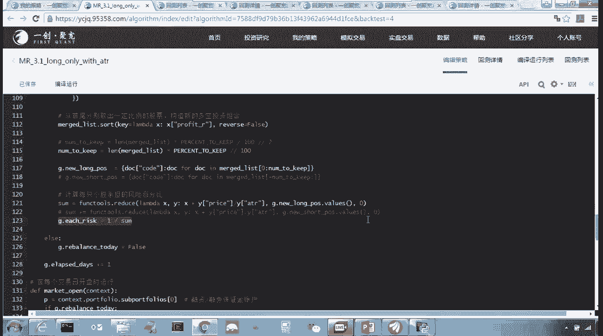

最后把这个sum求一个倒数，就是这个百分号R就是一是risk好了。

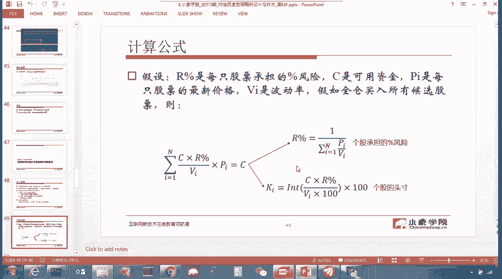

那么这样的话呢我必须得所有的整个公式里头，所有的参数都求出来了，好了，求类之后呢，那我们再看当我要去开仓买入的时候，做什么事情咳，那开仓买入的时候，每一只股票我给他分配的头寸啊。

这股数原来的做法是什么呢，原来是把我一个平均啊，每一只股票分配给他的资金，除以它的最新价格对吧，这样算出我要买入的股票个数，现在我用到了波动性，那波动性呢就是相当于用我的总资金啊。

就total cash总资金乘以我的这个百分号R，就百分比风险，再除以这支股票所对应的这个ATR，这波动率啊就是这个公式。

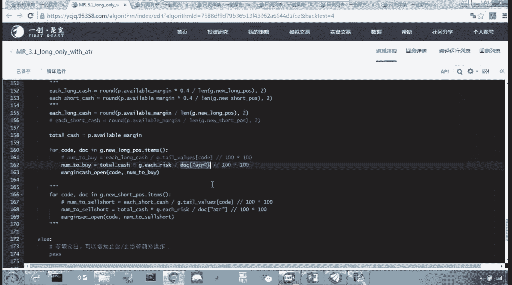

每一只股票总资金乘以百分号R，再除以我的这个波动率ATR对吧。

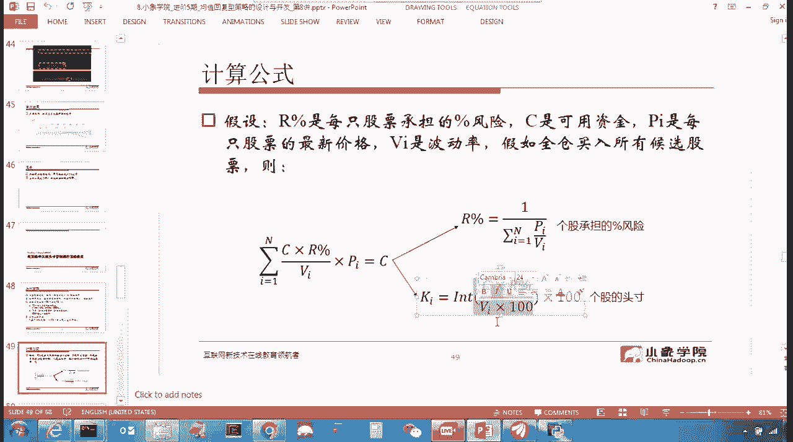

当然之后再把乘100÷100，求个整，把它变成100的整数倍好了，所以我这里头总资金乘以百分比，风险除以波动率对吧，最后再整除100，再乘个100，变成100的整数倍。

这样就算出了我每一只股票要买入的股票个数，就是整整首的倍数啊，然后之后对它做一个开仓好了，那么就通过这么几处改改动，我就把我原来的基于均仓分配方案，改造成了一个基于波动率的啊，头寸管理的方案。

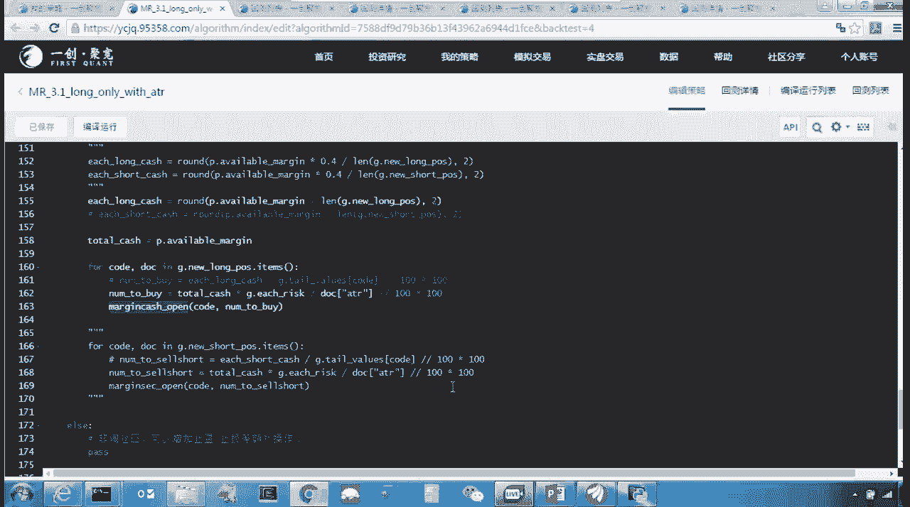

下面我们就来做一个回测，回测这个因为比较花时间，所以我都事先都把它运行好了，大概是这个样子，♪ 因为这是纯多头的啊 ♪，所以他的表现的话，和我们刚才看到的不太一样啊，不我我先不管他收益怎么样。

那么我们现在只是做一个对比，那么我把这个把这个策略啊，我们看两种方案存多少的方案，一个呢是不带成本的，就是说我这代码不不考虑成本，纯多头的方案呢，我是用一个更长的周期，从2013年底啊。

现在2014年初吧，一直跑到2019年咳，那么我们可以看到，如果用一个均仓分配资金的方案，那么我的年化收益是13%，夏普比率是0。625，那么当我把这个呃就是股票池啊，就分配分配投资方案改成用波动率的。

这方案来看呢，那么我的年化收益变成了13。55%，就提高了0。5个百分点，然后呢，夏普比率从0。025，提升到了0。662对吧，这是有一定的提升好，而且后面我们再看盈亏比，盈亏比从1。41提高到了1。

43，然后最大回撤从27%，降到了25%对吧，所以我们可以看到经过我这么一个改造之后，几乎所有的指标全有改善好了，那我们再看下一个就是增加成本的方案，就是考虑成本对吧，就把out the cost啊。

还有就是什么华点啊，各方面都设置上以后，我们再看均仓分配方案，年化收益是12。2，然后呢呃用波动率的方式分配是12。66，夏普从0。0。571变到了0。602，然后呢盈亏比1。42到1。44。

最大回撤从27。23降到了25。92，所以同样即使我考虑成本，那么所有的指标也都有所改善，所以从这个比较结果就能看到，说我通过一个波动性，通过啊这么一个啊波动性的呃，靠波动性来做头寸管理的这么一个方案。

还是各方面均比均仓分配方案更优化好，这是我们一个确定性的一个结论好，那么到现在为止呢，啊我们所有的就是我们所有的这个内容啊，课程所有内容都讲完了，那么当然就是呃从从从我这一个呃讲的过程中。

同学们其实你还可以想象，其实我们还有还有更多的啊地方去可以去，优化它，对不对，比如说我调仓的时候，现在我的调仓其实做的是很很很笨的，就是把原来旧的仓位全卖掉，新增仓位再全买下来，每次都是整成批的操作。

但是你可以想象中是不是这俩可能会有重叠，对不对，可能有些股票原来持仓，然后到了一个新的一个调仓周期的时候，他那还继续存在对吧，那我就没有把它没有必要把它卖出去再买回来。

这样的话我来回损失这个教育成本对吧，还有就是说我在呃，就是说我除了呃除了这个调仓之好之外，我还可以加一些择时的策略，就是加一些止盈止损啊，更精细的入入场出场条件，比如说我虽然股票呃在某一次调仓的时候。

这些股票我选入到了我的股票池，但是呢我可能等到下次他出一个什么技术指标，出了一个买入信号的时候，我再把它买进来对吧，我不是一股脑的，所有的在同一天同一时刻全买进来对吧，这样可以做一个更精细的控制。

有可能结果会更好啊等等，还有包括说我整个啊构造股票池的时候，现在就是全市场闭着眼睛去取，前10%或者后10%，那我是不是可以再把它按照行业，板块或者一些概念什么，再把它再细分一下，比如说某一个板块里头。

我取取一部分，另外一个板块再取一部分，最后凑成全市场的10%，这样的话是不是就分布更均衡对吧，那等等啊，就是所有有有很多的很多的改进方向，所以就说但是呢我们可以想象一下，就通过就今天这个课程啊。

通过我前面的前面的这么啊这么多步骤，你其实可以看的，其实可以看得出来，就是虽然我今天这个课程给大家讲的是一个啊，是一个就是叫均值回复啊这么一个策略对吧，就这个策略本身从思想来说其实很简单对吧。

无外乎你认为说啊在某一个时刻啊，这些股票可能偏离了一个平均水平对吧，这个时候你入场，♪ 等他回到平均水平的时候 ♪，你再出场对吧，你赚的就是就这部分稳定的均值回复的效应啊，赚的值这部分钱对吧。

但是你你看我通过这个过程啊，又做多又做空，然后呢又怎么去啊，呃去调整我的交易成本，然后调整我的头寸方案等等，其实整个过程是是非常复杂的，所以这里体现出了非常多的细节。

包括说我现在给大家抛出的这些优化方案啊，所以就说你可以看到说同样一个策略啊，同样一个策略，并不是说你简单的把它开发出来就就完事了，♪ 那么这个过程其实很多的时候 ♪，是要靠一些细节来体现出来的。

就是你就只要你把细节做做到位，那么就才有可能会说逐步求精的，去把它一步一步改善对吧，所以就说一个策略呢，你要简单的有一个思想啊，拍脑的出来一个思想，然后把它开发出来，是不是就就能够直接立刻用到实盘呢。

不一定对吧，♪ 你看我今天这个过程就这么一个小题目 ♪，我给大家讲了两个小时啊，而且后面还有这么更多的改进空间，所以就说一个策略，不是说你简单的把它开发出来，就可以直接用于实盘的。

而且呢就同样一个策略啊，在不同的人的手里头使用出来的话呢，效果也可能是完全不同的，这个完全要靠细节来取胜对吧，那么但是关于你做一个量化策略，是不是说适合于实战，或者说能不能放到实盘呢。

那么在这一个层面的内容呢，其实还有更多的就是更多的细节或者技巧，去去呃去使用，或者说有很多的这个坑，很多的陷阱你需要去去避免，所以就说既然讲到这呢，那么就是我们咱们课程的老师啊。

实际我们还有一个就是另外有一个线下课程，就是就讲的更深入啊，更全面的一些线下课程，所以就是说如果大家有兴趣的话呢，也欢迎就是来参加我们那个线下课程，就可以和我们呃课程的老师啊，可以当面打。

面对面的有一些更深入的探讨，那么最近呢就是在在这个周末啊，就是这个周六周日，我们就有一个又有一个新的一期的课程，是线下线下课程，在北京啊是第11期了，前面已经连着办了十期了。

那么这周末是我们第11期的线下课程，所以呢，就是说如果有对这个线下课程感兴趣的同学啊，或者说你希望能够啊，和老师有一些更深入的探讨的话呢，也欢迎就是来参加我们的线下课程，那么这周末就有就开班啊。

第11期，所以有兴趣的同学呢，可以联系咱们小巷的班主任来报名，而且通过小象的途径来报名线下课程的话呢，有呃也有很多的优惠啊，所以感兴趣同学呢可以直接联系咱们小巷的啊，班主任老师啊。

来咨询这个课程怎么报名，或者一些参与的方式好，那么现在总结一下，那在这这这节课中呢，首先呢我是啊，给同学们抛出了一个均值回复策略的原理，然后呢我们通过编写一段程序啊，来验证这个思路，之后呢。

做了一个纯多头的和多空双向的呃，一个策略的实现和比较，然后后面呢又添加了成本对吧，来评估一下这个交易成本，就各种交易成本对策略绩效的表现，然后最后呢通过一个头寸管理的方法，来对策略进行了一个一个优化。

然后呢现在我们再回过头去啊，看一下，看一下我课呃，今天的课程在最开始刚才遗留的一个问题，啊再往前啊，就是我在前面给大家写程序验证啊，验证这个，稍等啊，我往下翻一下，对。

就是这个就是我们来验证这个军事回复效应，的时候，我当时抛出两个问题啊，一个呢你可以看一下，其实我这里有几个参数对吧，呃一个就是说这个时间段一和时间段二，我到底设多长比较合适。

第二呢就说我从什么时间开始测测试，这可能也是有影响的对吧，那同学其实可以对这个思考一下，比如说我这时间段一和时间段二，到底设的长一点好还是短一点好，对吧，第二个就是说我这个去验证市场。

到底是说有没有这个均值回复效应，比如说是不是说那些收益率最高的，能从0。5恢复到呃0。50啊，0。05到0。5，或者是从0。95再恢复到0。5啊，♪ 这两种情况 ♪，那么我在不同的时间点回测。

是不是结果是不一样的对吧，所以同学们可以思考一下，首先第一个问题就是说不同的间隔时间长度，是不是和我均值回复的尺度有关系，就是也就是说你这时间段如果特别短，是不是不一定能够很充分的体现出。

这种均值回复的效应对吧，同学们可以可以思考一下，那么到底啊多大的尺度去去去测试，是一个比较合适的，还有一个就是不同时间点，那么也就是说你开始回撤的这个呃，开始测试的这个时间。

比如说它到底是处于一个大牛市的过程中，还是一个大熊市的过程中，或者说它是在一个震荡式的行情，那么显然最后你可能统计出来，结果是是会有略有些差异的对吧，所以同学们如果对这个做进一步的思考的话呢。

有可能会更加深你对这种均值回复效应的，一个理解好了，那么这是回过头来说一下，之前我遗留的一个思考问题啊，那么现在呃现在再回到最后，我们看一下呃，留留几个作业吧，就如果同学们有时间的话。

可以可以做做作业啊，自己做一些练习，那么第一个呢我们可以看一下呃，是不是说对我课上给同学们提出的这些呃，策略啊，好多版本啊，大概是呃四个四五个版本吧，你都可以去进行一个改进，嗯对吧。

那感觉其实刚才思路我也说过几个了，你可以选不同的区间啊，不同的调仓频率，比如到底是三个月一个月啊等等，可以加一些择时信号，结合某些常用的技术指标，什么金叉死叉呀，什么突破呀等等啊，止盈止损对吧。

止盈止损你可以是什么触现止止损啊，跟踪止损等等啊，各种优化方案都可以对代码做一些修改，看看就说能不能做出一个比我这课上讲的，更好的一个一些结果，我相信同学们能做出一个更好的结果。

因为我课上呃给同学们这个思路啊，虽然你看我讲了很多的版本，但实际上还是实现的非常简单的啊，你可以去通过这些优化方法，看看能不能对他们做些改进好了，然后第二个作业啊，第二个作业就是刚才我说的那个思考题啊。

你可以对我啊，给同学们提供的这个代码做一些修改对吧，比方说你把时间段一和时间段二的这个，时间间隔稍微改改，改动一下，你把它改长点，改短点，或者说你设置不同的起始点，你看看到底呃。

最后统计出最后出的这个统计结果，跟我今天课上给同学们运行的那个结果啊，啊有没有什么明显的区别对吧。

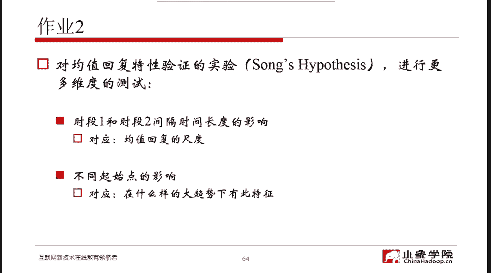

那么通过呃通过这么一个过程呢，你就可以去啊理解，就是说这种到底均值回复的效应，是在什么样的尺度啊，或者在什么样的这个市场行情下。

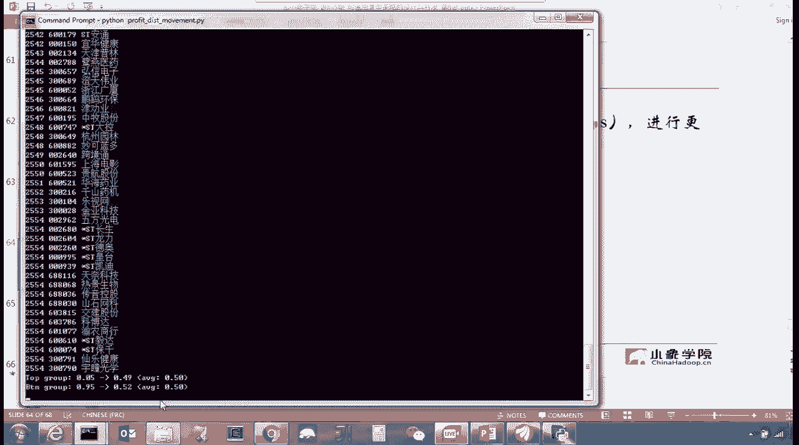

还是比较实用的对吧好了，那么这个呢就是啊给同学们留了两个作业嗯，好那么下节课啊，下节课还是我来给同学们讲，下节课我们就再换一个平台啊，我们用MATTCHANCE这个平台and mattchat平台呢。

在这个呃屏幕上，我给同学们也也有一个给出一个官网，一个网址啊，同学们可以去去上面下载啊，下载下来可以注册一个试用账户啊，他一个试用账号应该至少两个月之内是有效的，下节课呢我会用呃。

matt chat这个平台给同学们讲这种配对型的呃，交易策略，或者说套利啊，这种套利套利套利策略，对套利的呃这种策略，所以呢同学们可以提前下载软件注册使用账号，然后呢大概看看他的呃说明书。

了解下MC的语法工作原理等等啊，这是做下一节课的预告，那么基本内容就讲完了，所以呢嗯还是再强调一下，就说我们在这这个周末是有一个线下的课程，所以感兴趣的同学们如果有兴趣参加的话呢。

可以咨询咱们啊想象的班主任啊，来报名我们的线下课程，好啊，今天的内容就这些，然后呢我看看啊同学们有没有提出什么问题啊，我们稍微花点时间做一个互动好啊，咳对啊，融资融券在一创机框里头是可以模拟模拟的吗。

是的可以的啊，♪ 那么我这个融资融券 ♪，这函数都是在易创取款里头去去运行的，没有没有问题，但同学们要注意融资，融券呢呃确实成本比较高对吧，就像我今天课上讲的呃，尤其是融券啊，融券成本。

它本身是一个涉及到一个保证金比例的要求，还一个就是说融券本身它有一个资金成本，它有有一个年化利利利率，你要付出利息的，所以这个成本还是很可观的，所以轻易的一般不很少有人就是融券，除非你对这个行情下跌。

行情特别确定的时候，你才才去做融券啊，平时一般轻易的不要做融券啊，因为这成本很可以在很大程度，抵消你的收益的啊，这要慎重好，第二个，今天策略都是日线上做的，有没有基于分钟的均值回复，这是可以的啊。

你可以去去测删，所以今天的课程里头，我主要给同学们讲的是一些思路啊，当然这个思路也只是一种，那么我今天是根据一种收益率的，是根据全市场的股票的收益率的一种统计特性，来做的一个均值回复策略。

当然你也可以做其他的类型的，比如说我们就是传统的高抛低吸对吧，传统的高抛低吸，它本身它就是一个均值回复性策略对吧，所以它它也不只是日线嘛，你可以做分钟级，小时级什么都可以的。

所以这个其实说白了我今天这个课程呢，我其实更希望同学们能够啊学到一种方法对吧，就是说你怎么去提出问题，♪ 分析问题 ♪，解决问题，所以今天今天我给同学们演示了这么一个，均值回复策略呢。

这个思路啊你可以参考啊，你可以参考，但是你不要很机械的照搬它，所以首先要自己先做一个充分验证，看看你这个思路还有没有改进的空间，另外一个看他在哪个周期上更适用对吧。

那当然除了这种基于收益率来做均值回复的话，还有很多其他的东西，比如说你就可以根据某些技术指标对吧，震荡性回回回回复指标，这都是一些传统的策略，很多很多的策略都是这么写的。

而且有很多的开放的代码都可以参考啊，所以这个你就我的意思就是，同学们不要局限在我这课堂的思路里头，重要的是学到一些方法好了，还有一个就是设置滑点的时候呃，如果取固定值的话，一般取什么区间比较合理啊。

这个呢滑点的话呢是嗯，呃这个问题他没有一个标准答案啊，这个得看自己的经验啊，一个呢是说呃要看你资金规模对吧，如果你资金规模比较小，通常通常比如说你可以看啊，某些年交易的品种啊，不管是股票还是期货。

你看他平时这个盘口就是五档买五档卖，或者一档或者是一档的买卖呃，那么它一般挂单的这个量是多少对吧，如果说你就是你的资金，就是你每次下单的这个手术啊，相对于盘口的挂单来说是这个数量比较小的话。

那你划点也可以设的比较小，因为基本上你只要下单的话都可以，都可以去和对手价成交对吧，但如果说你金量特别大，比如说每次盘口里头就挂就挂呃，平均盘口就是几档买卖，就是几手的那个样子。

结果你一下子吓出100手来，那显然显然他这个盘口的这些，这单子是不能满足你成交需求的，所以你肯定是需要，就是把好几档的这个挂单全吃掉，你才能成交，对不对，那这样自然滑点就大了是吧，所以这个呢要看流动性。

还要看你要交易的品种的特性，就看它的流动性到底怎么样，还有你的资金量等等啊，如果取百分比是相对于股价的百分比吗，嗯取百分比啊，对这个好像是这个得看距宽的文档，它是怎么设置的。

这个百分比好像是相对于啊不是相当于股价，就是相对于你的总资金规模，所以这要仔细看下文档吧，啊，这个文档在，就是在巨宽的API那个里头有的啊，刚才我其实给给同学们已经看了。

就是你看这个帮助AAPI文档对吧，然后在文档里头它有一个叫做呃叫参数设置吧，我看看啊，对叫策略设置函数，策略设置函数里头叫set的set slipage对吧，设置滑点，这函数里它有几个模式。

等于按固定值按百分比，那么百分比的话，他说这个价差可以是当时价格的一个百分比啊，对对它是它是当时价格按价格的百分比，比如说你要是100块钱的股票，你要是设施这个1%，它可能就是一块钱的华点啊。

大概是这意思，呃线下课程两天感觉来不消化，有有有有录像的，对这个这个线下课程一般课程结束呃，可能是几个小时之后，或者第二天肯定他就是有录像可以看回放了，对确实嗯确实呢就是说我这几天这个课程啊。

内容是相当多的，我也是希望能够在有限的时间内呢，把尽可能多的知识啊传授给大家啊，所以呢可能就课上呢就是时间就是比较紧张，所以同学们还是希望呃，课下呢你要是有时间的话呢，啊有课长一时听嗯。

就是没有抓住的一些细节，回头看看录像啊，这录像有第二天肯定就有了，看看录像的话呢，仔细琢磨琢磨，希望能够大家有更多的收获，好吧，那好了，那今天的呃课程啊就到这，那谢谢大家。

