# 清华大学讲师团，量化交易实战，迭代式的量化策略研发 - P1：第一讲_实战型量化投资必备知识 - 反方向的Bug - BV1Bs6MYFERQ

呃我们八点钟准时开始上课，在这个上课之前还有34分钟的时间，大家不妨在这个公共聊天区啊，呃简简短的留个言做个自我介绍，包括呢，你呃目前是不是正在从事跟量化相关的工作，或者之前在交易啊。

特别是在量化交易啊，在这个领域呃有没有过一些实践啊，嗯目前处于一个什么样的状态，大家不妨呢我们互相认识一下啊，愿意在公共聊天区留言的话啊，啊另外呢我刚才说了这几句话，大家是不是能听清楚。

觉得音量怎么样啊，呃也不妨在公共聊天区啊给我一个反馈，如果觉得音量合适，请回一个一啊，如果觉得音量不合适啊，回个零，嗯很好啊，看来大家的这个环境准备的都不错啊，我们今天的这个设置也也过关了。

嗯那我们就再等大概一分钟左右啊，呃我们准时开始上课，有愿意做自我介绍的啊，在课程的进行过程当中，也可以随时在公共聊天区留言，谈一谈自己，包括自己对量化的理解，包括为什么来上这个课啊。

包括想通过这个课学习到啊，哪些呃这个呃哪些方面的这个信息啊，想掌握哪些方面的技能，都可以在这个呃大家一块来交流一下，好那我们时间差不多了啊，我们就准时开始上课，首先非常欢迎啊，大家来学习我们这门课程。

我们呢这门课程的题目叫做量化交易实战啊，迭代式的量化策略研发，这是一个进阶课程，可能今天来听课的，有一部分同学之前啊听过我们的初阶课啊，嗯可能还有一部分同学呢是直接报名参加的，这个进阶课。

那我们之前这个初阶课啊已经上过八期了，进阶课呢也上过四期，今天呢是我们开始第五期的第一讲啊，这讲的这个具体的内容，是实战型量化投资的一些必备知识，我们先做一次做一个铺垫，虽然叫铺垫。

其实今天这节课的内容非常丰富啊，有不少是跟实战量化相关的，一些经验的一些分享，所以大家还是要竖起耳朵啊，认真的去听，那么今天这节课和明天呃不是明天下周一呃，第一讲和第二讲啊，都是由我来讲。

嗯我呢名字叫汪浩，可能之前有些同学也听过我的课，那么还是简短的做一个自我介绍，我呢毕业于清华大学电子系啊，我这个本科和硕士研究生都是在电子系读的，那我们班还有两个著名的歌手啊，一个是这个叫李健。

还有一个是水木年华那个妙洁啊，这个电子系出歌手这件事大家也都清楚啊，我这就不展开说了，那么我的博士啊是在赫尔辛基理工大学攻读的，所以呢有了这个赫尔辛基，大家知道这是芬兰的首都啊，所以有了这个经历呢。

大家也不难理解，我在诺基亚研究院啊，诺基亚研究院工作了11年的时间，后来呢又去联想研究院呃，工作了大概一年半左右，那么在诺基亚研究院和联想研究院呢，我主要的从事的方向，都是在大数据和人工智能啊。

这个领域做相应的一些研究工作，那么之后呢我和前诺基亚的一些同事啊，我们合伙来创建了一家这个科技型的公司，叫做诺亚星云，那么也就是从这儿开始，我们接触金融大数据，开始了我们的严肃的认真的这个跟量化交易。

量化投研平台相关的一些工作，那么我们呃这个团队呢，呃也开始发售我们的一些私募产品啊，阳光私募的产品，但是我就不做广告了，所以说这个关于这个资产管理公司，我也没列在这啊，嗯我本人呢还是清华大学。

这个叫数据科学研究院啊，它呃下面有一些针专业的这个大数据的呃，相关的一些协会啊，包括清华大学的这个人工智能啊，校嗯校友会当中的人工智能专委会，我本人也是专委委员啊。

因为我这个呃大数据和人工智能的这个背景，所以呢嗯后面随着我们课程的介绍，大家会体会到啊，确实它跟量化交易在某种程度上呃，是有相辅相成的啊，有些相通的东西，当然了，这个量化交易本身并不是必须。

一定要用到人工智能，但人工智能作为一种工具啊，作为这个量化交易，特别是在高频交易领域，确实有它一些作用啊，这个随着课程的展开，我们再跟大家更多的去分享啊，嗯我目前呢还在清华大学。

开设了一门这个全校级的选修课，叫金融大数据和量化分析啊，如果有兴趣的同学，你家住在清华附近啊，也可以到时候呃过来旁听我的这个线下课啊，我也是欢迎的，但是呢因为这个涉嫌做广告，所以具体的课程信息啊。

大家做量化的可以去搜索啊，可以通过各种渠道去了解，我就不能在这做广告啊，这个请大家来理解，那么我们由于这个量化教育培训这一，这一个领域，我们专门还设立了一个叫做普量学院啊。

大家如果在百度上去搜索浦良学院，应该口碑还是不错的，那么今天大家上的这个进阶课啊，也是小象学院和濮阳学院，联手打造的这么一个线上课程啊，到现在已经是进阶进阶班，已经是第五期了啊。

初阶我们之前已经办过八期了，而且后面还会陆陆续续的办，所以大家如果对这个课程感兴趣啊，对靓号感兴趣，我认为上我们的初阶课进阶课包括后续，如果大家还有继续深造啊，因为可能有一部分同学真的是未来想比较严肃。

认真的从事量化交易这个领域的啊，这方面的工作，那么也不妨，将来我们会在这个不定期的这种，线下的课程当中，我们去再进一步的去切磋去研讨啊，如果大家关心我们的线下课程，也可以，随后这个关注小象学院的这个。

一些开课的通知啊，好那么今天这节课啊，虽然是一些这个基础的啊必备知识，但是呢并不简单，我们分成这么几块的内容给大家介绍，首先呢是量化投资策略的类型，以及一些模型的原理啊，这个东西如果你对数学感兴趣啊。

其实每一个模型都可以深刻的去展开，甚至通过数学去证明啊，但是我们不是讲数学课，今天我侧重点还是给大家介绍模型的原理，包括它在实际当中怎么去应用，那么接下来我们需要花一点时间给大家来。

一起来探讨一下量化策略的研发的流程，和大家需要掌握的一些基本的技能啊，然后呢，第三部分，我们简单介绍一些常用的量化的平台啊，一些工具它们的概述，以及包括大家根据自身的需求，根据你所操作的品种啊。

包括你的交易的风格，选用什么样的量化平台啊，更适合啊，我们做一个简单的探讨，最后一部分啊，今天最后一部分内容是，怎么把你的主观交易逻辑变成一个量化模型，我相信今天来听课的。

有不少同学可能之前都做过人工交易啊，都做过主观交易，那么在主做主观交易的时候，你也是有交易你的交易系统的，虽然这个交易系统不是靠程序，不是靠计算机来执行，但是在你的大脑里头，或多或少也有一些这个系统。

有一些规则啊，但是这些东西怎么能够变成一个量化模型，让将来能够让计算机啊用程序化去执行的，这里头有一个特别需要啊，重点需要关注的，就是把你的主观交易的逻辑变成算法，变成实实在在的定量的模型啊。

这一步很多人都难以去逾越，那么今天呢我们通过一个简单的实例来说明，为什么这一步非常的重要，所以今天这个课虽然是十次啊，我们这个进阶课啊总共分为十讲，虽然是十讲中的第一讲是一个铺垫，是打一个基础。

但是今天实际上这个基础是非常重要的，希望大家这真的是竖起耳朵认真来听啊，那我们呃就不啰嗦了，直接进入第一部分量化啊，必要的一些基础知识。

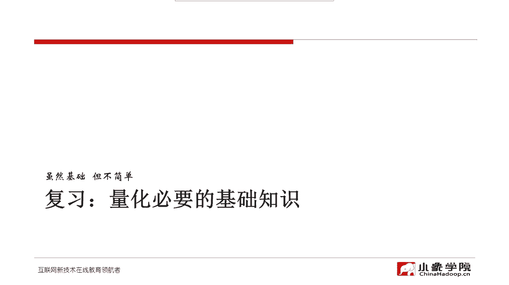

我们来简单的复习一下，首先我们常见的一些品种啊，这个我在初阶课的时候就讲过，一般来讲啊，我们初次入市，我们可能股票是相对来讲，对大部分这个大部分投资人啊，投资者来说，股票交易应该是门槛最低的。

所以说股票这个品种呢，我相信大家或多或少都还是比较熟悉的，那么在股票之上呢，其实还有一种非常常见的品种，但是很多人可能呃玩了很多年的股票，但是对ETF都不是特别熟悉啊，ETF这个事其实还是挺重要的。

ETF呢有很多操作上的一些小窍门，那么一会儿我们再介绍跟ETF相关的，套利策略的时候，我会给大家啊稍微详细一点展开啊，那么股票和ETF通常它自身是不带杠杆的，不是杠杆品种。

那么接下来如果说你觉得这个不带杠杆的，不过瘾啊，包括现在这个两融又进一步放开标的，又又又扩大了两融，什么东西呢，本身也是来加杠杆，当然这个融资融券啊，那这个主要操作标的还是股票。

但是如果说我们直接上一些，杠杆率比较高的品种，那么商品期货包括股指期货啊，自带杠杆，这个差不多七倍到十倍的杠杆啊，这个做起来就很刺激了啊，这个做对了啊，赚钱也快，做错了，亏钱也很快啊。

那么我们在进阶的课程当中，我们会涉及到一些商品期货的策略，在初阶课的时候我没有讲，为什么初阶课大家还是相对了解一个，这个量化策略的一个基本的执行流程，包括一些基本的思路啊，我认为就可以了。

如果一上来就做，一上来就做这个高杠杆的品种啊，这个稍微把控不好，就很容易爆仓，所以呢我们把这部分内容啊，只有放到进阶课才会去讲，那么在接下来啊这个杠杆率进一步的提高，而且是非线性了，那么像期权啊。

包括这个股票期权，像我们现在国内啊50ETF期权，还有一些这个农产品啊，这种期货的期权，像这个玉米呀啊棉花呀啊白糖啊，这些都是这个农产品期权啊，期权这个玩法就更多种多样了，这里面有很多套利策略啊。

有也有很多量化策略可以去去琢磨，但是那即便是进阶课，我们在整个这十次课里头，我们也不涉及到具体的期权的量化策略，因为为什么比较难做啊，因为玩期权的都是高手啊，跟高手去比拼，我们的胜面本身就低。

同时呢期权这件事呢呃在程序化执行的时候，在国内啊，至少在国内在程序化的期权的在执行过程中呃，障碍稍微还是多一些，所以我们在这个进阶课，也没有涉及具体的期权策略，那么债券和外汇呢。

嗯我们也没有具体的策略啊，就是没有具体的这个策略的介绍，在我们整个这十次课当中，但是呢我额债券和外汇的很多策略类型，在商品期货，股指期货，包括这个ETF，这些策略都可以很简单的移植到债，券和外汇上去。

所以呢我们也就不把债券和外汇作为，这个非常具象化的这个呃品种去介绍啊，大家可以呃简单粗浅的理解就是，凡是针对商品期货的这这些大多数策略啊，实际上可以把它改造一下，就可以应用于债券或者外汇。

而且债券外汇啊，这也是非常高杠杆的品种啊，杠杆率通常比这个我们的商品期货还要高，所以其实我们还是奉劝大家在上实盘之前啊，特别是杠杆率越高的品种，上市实盘之前要谨慎。

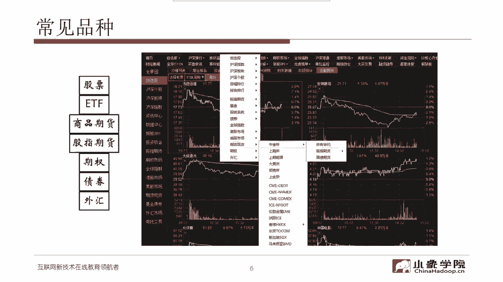

那股票呢不用太多说啊，我相信大家都比较了解，根据你所从事的不想从事，根据你所采用的这个策略的类型啊，基本上价值投资还是这个成长型投资，还是呃技术类的啊，技术类的这这种交易体系。

或者你做的是一个portfolio啊，做的这种组合投资，甚至去做指数跟踪指数哈，那么在股票里面，其实我们无外乎就关注它的基本面，以及一些消息面啊，新闻公告重大事项，那么在关注基本面的时候呢。

我们通常要做一些行业的分析，做财务数据的分析啊，但是这些分析实际上听起来简单非常的复杂呃，一个业余选手很难像专业选手一样，对一家公司了解得这么透彻，所以说通常来讲，我们的量化策略不在于对基本面。

对于财务数据的分析，对于行业分析有多透彻，我们更多的侧重于在这个技术面的表现，以及综合各种各样的因子啊，去拓展我们投资交易的这种宽度，而不是深度啊，这里头我我需要给大家简单的来说一个理念啊，我们做量化。

比如说要做股票型的这个策略的量化啊，我们到底量化交易，相对于传统的这种人工的主观的交易，优势到底在哪里，劣势在哪里啊，我认为优势主要是宽度，因为我们不可能人工去分析整个市场，3000多家。

4000家公司，我们不可能有这个效率啊，靠靠人肉，靠人脑，但是呢一旦我们把它形成了模型，我们就可以通过程序的运行，通过计算机去拓展我们投资的宽度啊，我认为这件事是量化交易，在股票上的最大的优势。

但是劣势是什么，劣势是说我们对具体的一两家公司，我们不可能像做主观投资的高手一样，比如说像巴菲特那样，我们不可能有他分析的那么透彻，所以我们是通过宽度来取胜啊。

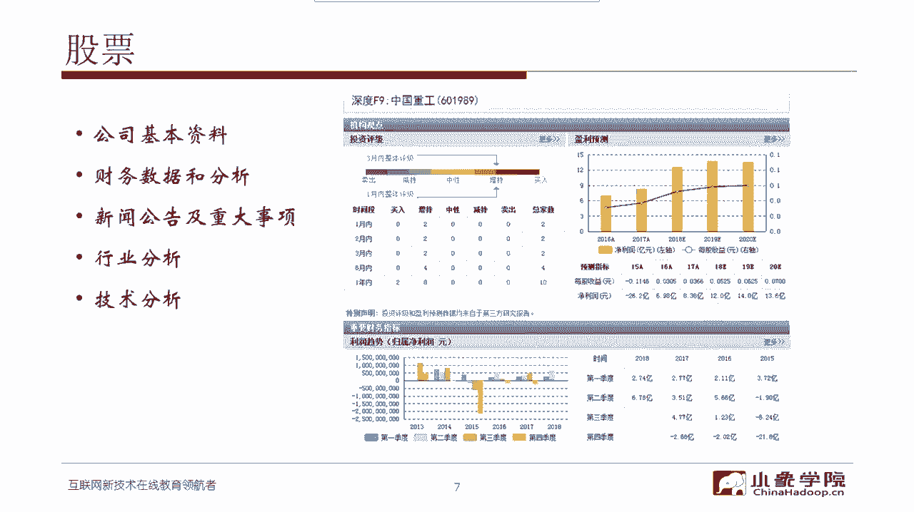

特别是在股票这件事情上，那么ETF呢ETF不太一样啊，ETF通常比如说一些指数型的ETF，那什么叫ETF啊，这个呃一般来讲像这种专用的名词啊，通过百度搜索可以简单的得到答案的，我在课上就不具体展开了。

这也是呃我需要强调的另外一个一点啊，我们课上更多的是分享一些实战当中的，一些经验体会呃，希望能够把我们走过的一些弯路，踩过的一些坑啊，尽尽量多的给大家去分享出来啊，这我认为这个东西是有价值的。

因为你通过百度搜索，你是得不到这样的信息的，但是像什么叫ETF，包括ETF，它到底应该怎么去交易啊，这样的事情我我想我就不过多的占用时间了，大家可以课下百度一下，基本上都能得到一些比较标准的答案。

那么ETF这件事呢，这个在这我也举了一些例子啊，像这个比如说我们经常做50ETF，那么它也有代码，如果你在二级市场上直接交易呢，你可以把它当成一只股票来交易，它比一般股票还有一个优势。

它的教育交易的费用相对比较低，他不收印花税啊，他在卖出的时候不收印花税，而我们通常股票交易呢，除了双向要收这个交易费用，同时还有一个印花税啊，在卖出的时候有一个印花税，但是ETF啊。

如果你在二级市场上进行交易的话，是没有这个印花税，同时ETF还可以做一二级市场的这种套利啊，也就是说它有两种这个交易的方式，一种是在二级市场，把它可以当做一只股票一样去进行交易，还有一种方式呢。

是说我有一揽子股票的这个份额啊，跟这个ETF的成份股相对应的一揽子股票，那我可以用我这一揽子股票的份额，来申购ETF的份额，这是申购，那同样呢我也可以说我现在持有若干ETF啊，ETF的份额。

我也可以在一级市场去把它换回啊，相应的这个成分股啊，换换回相应的股票，那正是因为有这样的一个操作，我们就可以进行一二级市场的套利了，所谓的一二级市场套利，就是说要么我通过二级市场啊。

直接来买这个ETF份额，然后再通过一级市场把它换成股票，然后再把股票卖掉啊，这是一种套利的方式，这是这是一个方向，然后反过来也成立啊，那一会儿我们在介绍这个套利策略的时候。

我们会给大家再稍微详细一点的说，同时嗯还在这卖一个乖啊，因为我相信有不少做股票主观投资的，这个交易者呃，可能采用的是一些短线比较激进的策略，就是打靶啊，连续的去打涨停板啊。

比如说这个从第二个板或者第三个板开始，要这个在呃想办法去买入，然后呢他有可能连板四连板五连板啊，然后我们在高位把它卖出，看起来风险很高啊，但是正是因为这个资金炒作的这种持续性。

有时候打板的策略还是比较有效的，我们只说有时候啊并不是建议大家都去打板，那这里有一个操作当中的一个特别呃，具体的问题也是一个难题，就是说已经在涨停板上的股票，你怎么确保你能买进来呢。

唉这是一个我相信大家都希望去了解的，一个交易的一个窍门啊，那么一会儿我们在介绍ETF套利策略的时候啊，我也会给大家简单介绍一下，有没有什么方法能够买入，能够相对比较有把握的去买入涨停的股票，卖个乖啊。

就是为了吸引大家，这个嗯比较专注的来听我的课啊，所以我经常会在这啊埋下一些包袱啊。

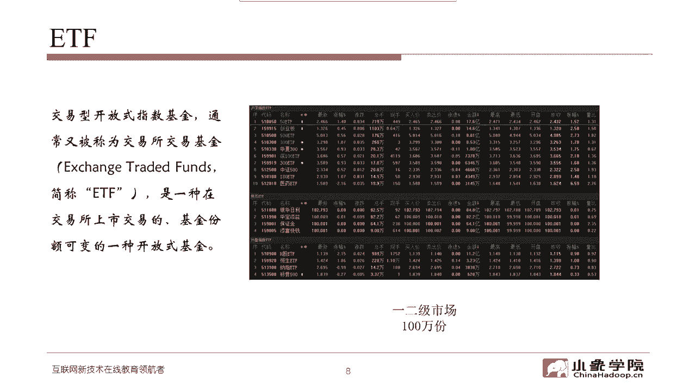

一会来揭晓，商品期货刚才也说过了啊，无外乎这么几个啊啊的板块，什么有色呀，能源黑色啊，贵金属啊，化工农产品，食品原料等等哈，这个商品期货它刚才我也说了，他是带杠杆的品种啊，它采用的是保证金的交易。

那么它所有的交易都是对手盘，所以商品你如果说股票交易，还有说大家共赢的情况，也就是说这家公司我们享受它呃，这个公司的赚钱效应，享受公司的成长给我们带来的长期利润，假设还能做到共赢啊，你赚我也赚。

你好我也好，大家好，但是商品期货不存在这种共赢的现象，商品期货就是单纯的博弈啊，你赚的钱就一定有人亏啊，所以在这里头它是一种对手盘交易啊，什么叫对手盘交易呢，就是假设啊我们随便发明一个新的品种。

甚至是空气，我交易北京的空气啊，只要有人愿意买，有人愿意卖，那我们就可以生成对手盘，我们就可以撮合就可以交易啊，啊交易所躺着赚钱交嗯，躺着挣你的交易费用，当然了，也不是说谁都能去开这个交易所。

也就是意味着也不是谁呃，指随便指一样东西，我们就可以拿它去交易啊，像实际上数字货币，就某种程度上就有点像我刚才举的例子，就是我们好，我们大家都来交易北京的空气吧，啊那么当然了。

这个我相信也有不少现在是做数字货币的，这个投资者来听我们的这个量化课啊，我没有任何贬低数字货币的这个意思啊，我们只是说这些都是对手盘啊，这些都是对手盘交易，那么股指期货呢它的这个跟商品期货。

你可以理解成是一种特殊的商品，只不过这个商品呢就是我们的这个股票的指数，那么目前在中金所哈能够交易的就是三个品种，I hii if，还有IC啊，分别对应的是上证50，沪深300和中证500指数。

那么每一个品种呢它又有四种合约啊，当月夏月夏季和格季，那一般来讲这个主力合约都是当月的合约啊，当然是每个月他还有一个换月哈，所以在交易股指股指期货的时候，这里头有很多具体的问题，就是怎么去换月啊。

包括这个升贴水啊，嗯虽然说股指期货，它的走势是和这个股票的这个指数啊，对应的指数是这个高度的嗯，高度的相关，但这里头升贴水，对于我们交易的成本，也起到了很很大的这个影响啊，那么具体到如何去影响啊。

股指期货有哪些策略，那我们后续的课程再慢慢来展开好。

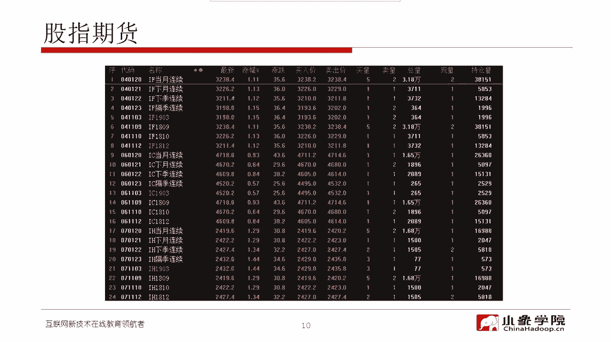

这是刚才说的一些这个基础的，这个一些基本知识，如果对这些刚才说的呃，可能假设有一半专用名词大家都不是太熟悉啊，对于这样的同学嗯，我估计也不多啊，因为毕竟这是进阶课，初阶课可能存在这样的情况。

但是嗯如果有这样的同学，就是对我刚才说的很多术语还不是特别的了解，那我建议你呢在嗯课下呢啊，再重复的再复听一下啊，刚才这段内容，然后呢对于不了解的这个术语去百度一下啊，去自己花一点时间搜索一下。

那么接下来我们来介绍一下，量化投资策略的这个基本的类型。

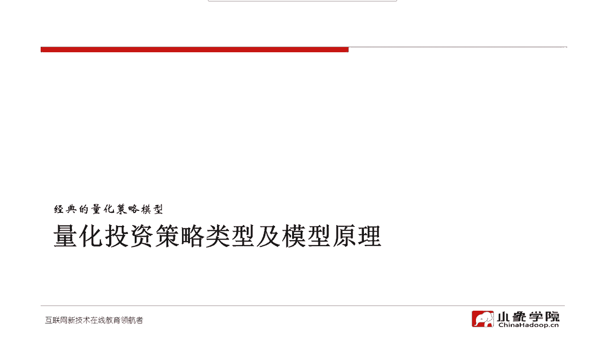

和一些模型的原理，常见的交易策略的类型，我们从技术的角度去考虑啊，其实可以就分成这么两大类啊，顶多三大类，第一类策略呢是趋势跟随型的啊，趋势跟踪什么概念，就是假设啊你认为这个品种啊在某个级别下。

它出现了这种趋势啊，或者说可能会形成趋势，那我们要做到的就是，通过我们的策略去跟踪这样的趋势，那么只要我吃到了这个趋势，那么我就可以获得相应的利润，但是呢我的退出方式一定要考虑到，万一我做错了怎么办啊。

万一趋势没有来，那么这个时候我也有相应的保护的手段，也就是说我们什么时候去停损啊，什么时候止损，什么时候获利以后，我也不是说这个一个头寸就一直持有到底啊，在获利的情况下，也需要考虑在什么时间去退出。

既能够锁定你的利润，同时呢又不至于去让风险无限制的扩大，所以这是一类基本的策略，叫做趋势跟踪，另外一类策略，我们经常听这个很多黑嘴啊，股评家说啊，现在是震荡市，大家高抛低吸啊，但高抛低吸这个事啊。

原理讲的通用，操作起来很难啊，什么叫高，什么叫低啊，什么时候抛，什么时候吸，这个事情你要真的变成量化的策略，你要解决很多具体的问题，这个在第四部分当中，我们就会举这样的例子，但是呢从原理上来讲。

确实我们做震荡啊，震荡型的策略啊，术语我们叫做均值回复型的策略啊，凡是有周期的啊，有这种往复的这种波动的，这种大家能看出这样的这个规律的，那都存在这种均值回复的特性，那既然做均值回复啊。

那就是通俗来理解就是高抛低吸，但是在高峰期的过程当中，假设啊真的某某一个时间之后再也不回复了，那就说明什么，说明有可能新的一一波趋势要形成，所以说在这个趋势跟随和均值回复，这两大类策略当中。

还有一个介于之间的一种这个方式，叫做横盘突破性的策略，什么意思呢，就是我把高抛低吸啊，在某一个时间，某一个特定的条件下，就把它转换为这个突破性的策略啊，也就是我认为这个时候趋势啊，但是具体怎么转换。

这个也不是要靠艺术啊，而是要靠我们具体定量的一些信号，去来完成这样一种横盘突破的这种检测，当然也有假突破，那么甲突破那以后。

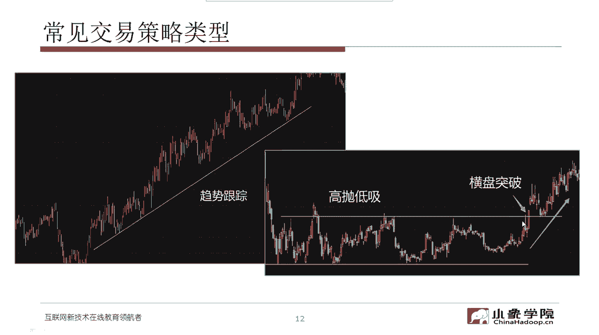

我们也是有相应的退出的方式，那趋势型策略的这个模型原理呢。

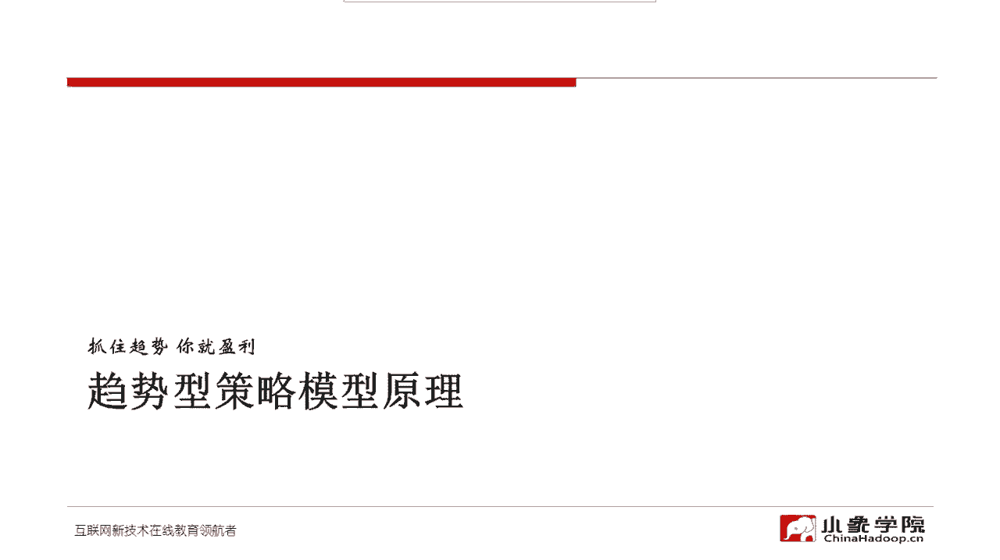

趋势型策略作为呃我们最常用的一类策略，为什么说最常用，因为对于大多数的品种，真正能够帮助我们赚钱，赚的比较嗨的啊，主要还是趋势性的策略，只要你抓住一波唉，可能今年的任务就完成了。

那如果说像这种大级别的07年，这一波从9981直到6124啊，嗯然后啊刚刚结束的上一波15年啊，从18491直到5178，类似这样的趋势啊，包括这个在熊市当中的这个快熊啊，这种急跌的趋势，假设你抓住了。

那你基本上每抓住一次，你就这个人生的这个财富自由你就可以实现啊，所以说趋势型的策略呃，不管是做量化还是做主观，都是我们这个实现财富自由的一种最佳方式，但是啊凡是它总是有利有弊啊，但是什么呢。

但是这种大级别的趋势它是几年才出现一次啊，那么在这种几年不遇的，这个大级别的趋势形成之前，大多数时间他是处于一些震荡这个这种走势啊，所谓的平衡式，在平衡式当中，你要是做趋势做不好，经常就会被反复打脸啊。

你认为趋势来了，结果呢它就折返了啊，你就止损退出，下一次你认为趋势又来了，结果呢又是被止损给震出去啊，那么所以说趋势类型的策略，只有当趋势效率高的时候呃，你才能比较容易的赚钱，而在大多数时间下啊。

很多品种都是处于这种所谓的箱体震荡或者，无效震荡的状态，那么在这个时候，均值回复类型的策略，可能会帮助我们赚到一部分钱啊，但是均值回复的策略啊，它多数情况下没有趋势型的策略转的那么嗨啊。

但是呢在大多数时间呢，它又相对还是比较适用，那经常有人有我讲到这的时候啊，很多学员都会问我说，汪老师，那什么时候我选择趋势性策略，什么时候选择这种均值回复型的策略，我说我也不知道啊。

因为我们从来就不知道什么时候趋势能来，而我们也不知道什么时候震荡结束啊，所以通常来讲我们会制定不同的策略，甚至在不同的时间里头，我们会让不同类型的策略都在跑啊，但是呢我们制作一个策略的前提。

我们的基本理念就是说趋势类型的策略，在趋势来的时候一定要转得比较high，转的比较猛啊，而当趋势没有来，在震荡的时候只是小亏啊，不要大亏，反过来均值回复性的策略，在大多数情况下。

可以帮助我们相对比较稳定的赚到一些钱，而当趋势来的时候，不要让我们大亏啊，因为趋势来的时候，这个均值回复他不回复了，那你就会有相应的一些亏损啊，但是趋势来的时候，我们均值回复型策略不要大亏。

而平时呢又能相对稳定的赚钱，那么这样的话呢，我们会把不同类型的策略组合在一起，那我们只是可以去检测一些趋势效率啊，在当前这个时间点，趋势效率是高是低，如果去事效率相对高一点。

我们可以加大趋势型策略的头寸的比重啊，反过来我会加大均值回复型策略的比重啊，仅此而已，因为我们永远不能准确的判断什么时候趋势来，这个是可能听到这儿，大家大概能听出一些味道来了，就是我们做量化。

和那些黑嘴的股评是完全不一样的，做量化我们的基本假设是说，首先要想到做错了怎么办啊，而不是像那些黑嘴，每次都那么笃定啊，这一定怎么怎么样，一定怎么怎么样，在量化当中就没有一定的事，都是按照概率。

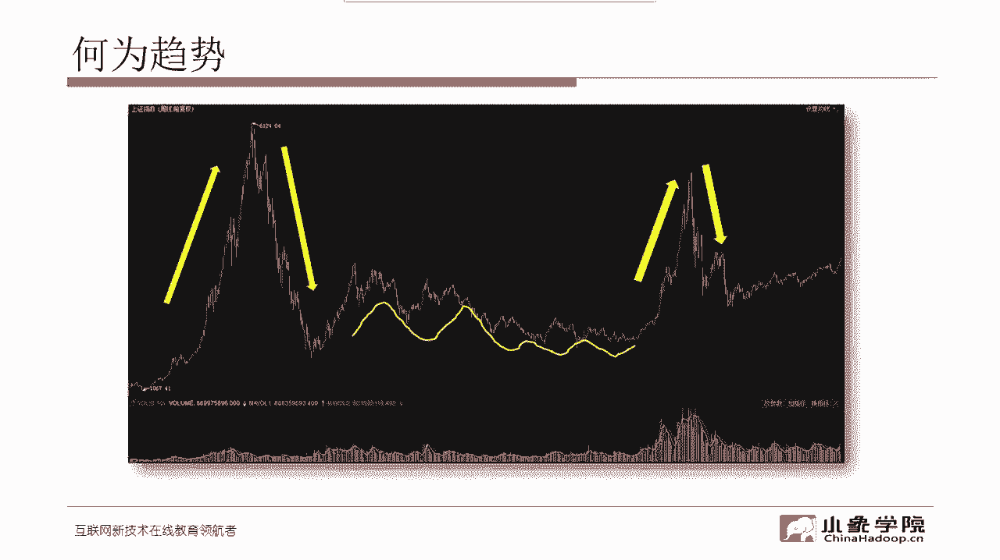

某种概率去发生，我在初阶初阶课的时候，我给大家讲过这三个关系啊，那在这呢也简单的，我们来复习一下，一般来讲这个趋势形成啊，我们会去考察这三种三种关系，哪三种关系呢，首先是供需关系，我们认为趋势的动力。

来自于供需关系的不平衡啊，如果供需关系一直是平衡的，但可能就围绕着一个中枢在反复的震荡，而只有当供需关系不平衡的时候，当供过于求的时候，大家想一想啊，当供过于求的时候，那是不是这个价格就要下跌了。

因为你只有不断的卖方，只有不断的压低这个价格，才能把手上的筹码抛出去啊，所以这个时候可能就形成一个，所谓的熊市的趋势，而当供不应求的时候，那买方只有不断地提高价格才能抬。

才能保证自己啊买到你所需要的这个筹码，那么这个时候，那么就很可能会形成一个牛市的这样的，一个趋势，而所谓的因果关系，就是说形成趋势之前通常都会有一个准备过程，准备过程越充分。

那么这个趋势形成的这个持续性啊就越好，也就是说为什么几年才有一次大的牛牛市，是因为需要通过一个漫长的叙事，这样一个准备过程，那么努力结果呢是说通常来讲成交量的增长啊，通也会带来这个趋势啊。

更更有可能带来趋势的形成，但是假设啊成成交量增长，但是价格没有大幅增长，那么这个时候可能是一个上升的啊，上涨走势的一种停止行为，也就是说我们经常说的这个这个放量，但是呢价格不不向上走，说明什么。

说明这个时候供应很很强啊，卖方的力量很强，买方使了那么大的劲，都没有让这个价格进一步的上涨，反过来也是一样啊，如果成交量的增长在熊市的这个趋势，在下跌走势当中，并没有使这个价格进一步的去下跌，说明什么。

说明买方的承接在这个位置已经很强了，它有可能是一种下跌走势的停止行为啊，当然这些东西都不是绝对的，我们之所以讲这三个关系呢，是因为从技术分析的角度啊，从技术分析来进行量化，交易系统开发的这个角度。

你不管是你的信号系统，还是啊你的一些这个嗯退出的一些条件，都可以去考虑这三个关系啊，他们背后的一些动因，那么如果你能把这种三个关系，形成相对比较好的这种量化的体系啊，也就是说你能量化这三个关系。

或者通过这三个关系推演出一些技术指标，那么对于你开发一个这种量化交易系统，是非常有帮助的啊，所以我们在课程当中经常也会讲一些，这个从主观判断这个趋势，或者说这种供求平衡的一些这个出发点啊。

帮助大家去思考你的这个这样的逻辑，怎么去进行量化。

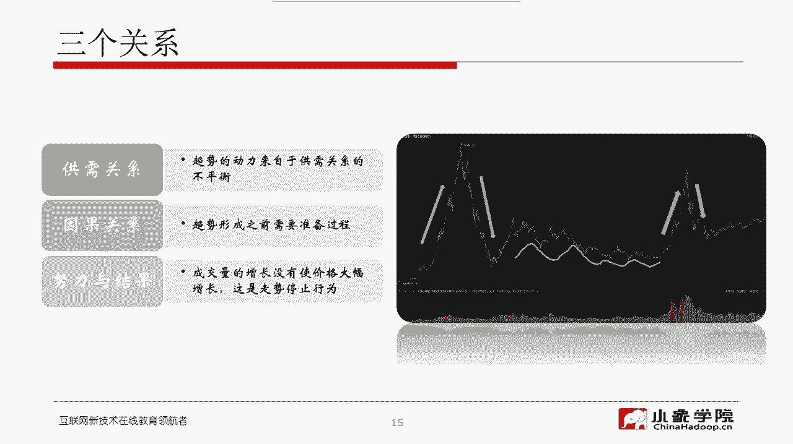

怎么形成一个量化的信号系统，好那你还回到这个典型的趋势性的策略，典型的趋势型策略，他的这个收益的分布啊，就像我这张柱状图似的，大概收益的平衡点也就是收益为零，也就是一笔交易啊，假设你是做趋势额。

那么一笔交易的盈亏大概在在，现在我鼠标动的这个位置啊，大概是盈亏一个平衡点，也就是说在这是不赔不赚，那么你会发现啊，其实他的这个赚钱啊应该大概是在这个位置，鼠标这个位置他赚钱的交易的比例。

也就是说这种概率啊，他的胜率实际上并不太高，通常一个典型的趋势型策略的胜率，都不到50%，大部分趋势型策略的交易是亏损，但是趋势性效率，另外一趋势型的交易啊，另外一个特点就是它的赔率会很高。

你看这假设你能做成一笔，这个收益这么高的策略，基本上你能抵消你做十笔甚至更多的，这个亏损的交易的这个带来的亏损，所以说趋势型策略啊，最大的特点就是它的赔率相对比较高，但是胜率并不高。

这也验证了刚才我们说的，就是大多数情况下，其实趋势没有形成，它可能是个假突破，是一个假的趋势，所以呢这个我们刚建仓，可能啊这个趋势就折返了，那么我们就带来我们的止损，但是我们止损会比较紧。

也就是说亏损的交易通常亏的不多，但是一旦这个趋势被我们抓到了，我们赚一笔可能能够抵消我们亏十笔啊，所以在趋势型策略的设计，大家一定要不要脱离它的这个特点，正率不高。

但是赔率一定要传统的这个海龟交易法则啊，我们应该是在嗯这个之前啊，给大家简单介绍过这个海龟交易，如果大家不了解海外交易也可以，市面上有很多这方面的书啊，大家可以去查一查海龟交易法则啊。

在当初这个丹尼尔嗯这个名字我都忘了啊，这个嗯在做培训的时候啊，上个世纪80年代，他们在进行海龟交易实验的时候，在很多品种上他们都可以取得十比一的啊，大于十比一的这种盈亏比就是赔率是相当高的。

那么海这个无论是海归交易，还是说我们一般化的趋势型的交易啊，这种策略其实最重要的是，头寸的管理和退出的方式啊，就是说一次建仓建多少啊，要不要加仓，那么在什么条件下需要退出。

这个才是改进趋势型策略的最重要的，这个因素而不是精确的入场点，很多时候我们在初学交易，包括初学这个量化教育的时候，会把很多的精力放在怎么去优化一个入场点，就是怎么去优化一个买入信号。

但实际上当你做时间长了以后，你会发现很多时候，这个买入信号对于你最终系统的性能来讲，是最不重要的因素啊，他比起你怎么去分配你的头寸，比起你怎么决定是不是应该退出啊，要要次要的多，俗。

俗话说这个买的没有卖的精啊，会买的是徒弟，会卖的才是师傅，我说的就是这种，那么后面呢这个课程当中，我们会结合具体的趋势性策略啊，来给大家介绍怎么去这个处理，这些关键的要素和头寸和退出，所以刚才也讲了。

不算退出，对于趋势性策略，那是最重要的因素，那么趋势性策略呢，其实它的一个要点就是说截断亏损，让利润奔跑啊，两者缺一不可，截断亏损它是前提啊，截断风险，但是一般来讲啊。

这个我们在做主观交易的时候恰恰相反对吧，人性使然，我们通常是稍微有一点这个蝇头小利啊，好不容易解套了，哎呀刚这个刚刚解套，我们就恨不得就克制不住卖出的冲动啊，赶紧落袋为安吧，但是呢一旦亏损了算了。

这个等着翻本吧啊，那特别是一旦亏损超过20%以后，我们再也没有砍仓的这个动力对吧，我们就寄希望于这个老天爷垂帘啊，垂青我们啊，让我们有一个翻本的机会，而且还是这么想的，就是啊这个把本金还我。

我以后再也不玩了啊，大家都是这么想的吧，所以呢，这个恰恰是我们在主观交易当中的一个，情绪化的大敌，而当你有了一个相对完整的，完善的量化交易系统的时候，你就真正能够做到在趋势型策略当中截断亏损。

让利润奔跑啊行，那么分散化也是我们做趋势型策略当中，一个可以优化的点，什么意思呢，我们不要把篮子都放，把鸡蛋都放在一个篮子里，即便是我们做股票型的趋势策略，也不建议大家只做一两只股票啊。

可能你要选择一个股票池，这样的话呢，那么他们东方不亮西方亮啊，从这个整体的角度来讲，在不降低收益的时候，前提下，可以尽量的去降低你的风险，这个也是可以数学上去证明的啊，在这我们不展开了以后。

我们结合具体的策略来给大家介绍好了，刚才说的是这个趋势型策略啊，那我们再来看一看这个另一个大的大类策略，叫做均值回复型的策略，所谓天下大势，分久必合，合久必分啊，这就是典型的趋势哎，典型的均值回复。

那么恩尼尔卡尼曼这个人是这个二零，应该是2002年的诺贝尔经济学奖获得者啊，他是个心理学家，他曾经提出过一个叫做体育画报的厄运，什么意思呢，说一个运动员的照片，如果出现在这个体育画报这个杂志的封面。

那么他注定要在接下来的这个赛季当中，表现不佳，这个实际上是通过均值回复的这个这个原理啊，我们可以很简单的很容易的来解释为什么呢，因为一个运动员的表现，可以被认为它是围绕着一个均值啊。

它的一个均值来进行随机的分布的，所以他一旦他的照片出现在了档期的这个体，质体画报的这个封面，就意味着什么，意味着他在这个赛季实在是太牛了啊，达到了所有运动员的这个巅峰。

那也就意味着啊这个出来混早晚得还啊，这个赛季透支了他的表现，那么下个赛季基本上他要回复均值了，甚至会更糟啊，那么在自然界当中有很多这样的现象啊，刚才我们说的这个天下大势，合久必分，分久必合啊。

包括在股票市场啊，包括很多的这个商品期货的品种，包括外汇的这个汇率啊，他们也呈现你如果把这个周期要拉的长一点啊，很多时候也是呈现这种均值回复的现象，另一位诺贝尔经济学奖获得者。

2017年的诺贝尔经济学奖获得者啊，理查德塞勒他的基金啊，其中也很大程度上使用到了这个，均值回复的原理，它有一个描述的现象，它叫在这个人们的这个心心理层面啊。

一个叫做over reaction和under reaction，就是过度反应和反应不足啊，通常情况下我们对什么会过度反应呢，可能对某一种利空消息啊，比如说对岸这个某某不靠谱的人，又发了个推特啊。

所以这个市场通常会有一些过度的反应，而在什么情况下，我们经常会反应不足呢，我们对于一些真正的好公司，好的标的，他的这种嗯非常好的这种表现啊，甚至常年的分红啊，甚至这个这个很高的LE啊，很低的PE。

很高的净这个这个这个现金流啊，很好的盈利能力，这些东西我们通常反映不足啊，温水煮青蛙，直到股价真正能涨起来，甚至开始暴涨的时候，我们才看啊，原来这是一只好股票啊，等到茅台这个上上上千了以后。

我们才知道啊，原来茅台这么强，怎么在100块的时候我不买它呢啊，所以正是因为这个大多数参与交易的是人啊，即便是我们做量化交易啊，其实背后也是反映了人的思想啊，真正的说纯人工智能去参与交易的，到目前啊。

那还只是停留在忽悠的阶段，还不是真正的意义上的这个实战，那么所以说既然是人作为主体来参与这个交易，那么over reaction和under reaction，这是长期存在的，这就是人们经常犯的错误啊。

Investors make mistakes，We look for the，这就是理查德蔡勒，通过行为金融学来进行交易的，这样的一个基本的理念，他用到的也是一个均值回复的思想。

再看一些经济规律或者周期啊，这个我就不详细解释了，大家知道什么涛动周期论呀，什么这个啊，就是康波理论呀，各种这各种多啊，反正基本上其实只要有周期的，他基本上都有这个回复的现象啊。

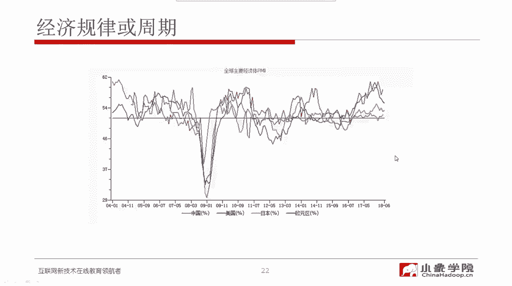

这个我就不再举例了，那么刚才我们也说了，其实震荡和趋势啊这个东西它不是对立的，通常是你中有我，我中有你，取决于你观测的尺度，在不同的尺度下，你可能看到的主流的这个震荡或者趋势的，这种现象是不一样的。

我们在非常小的尺度，在微秒毫秒这个尺度下，其实你既看不到典型的趋势，也看不到典型的回复，它基本上是一种随机游走啊，这个大家可以用什么类似什么卡尔曼滤波呀，什么这样的，这个如果大家学过相应的一些数学啊。

包括这个呃这个这个描述随机游走的，有各种方程啊，嗯这个大家可以尝试一下那那种解法，但是那个基本上对应的是一些高频交易啊，我们在我们这个进阶课当中，我们也不涉及到高频交易的内容，那个太专业了。

然后在一些相对小的尺度，比如说在分钟级别啊，在十几分钟啊，甚至到这个60分钟啊，在这样的级别下，其实我们在日内啊，比如在这种级别下，我们很很大程度上，我们看到的是均值回复的这个现象是比较明显。

而再扩大一点尺度，比如说到了这个小时级别，甚至这个日日间的这个级别，我们看到的趋势跟随和均值回溯，这是交替出现在更大的尺度下，那就是大的这种周线级别，月线级别那大的趋势和大的反转啊，这个几年才有一次。

所以说你根据你自己的这个情况，你的优势在哪里啊，你对什么尺度下的这种价格的波动的这种特性，你可能更有感觉，那么决定了你将来你的策略主要是做震荡，还是主要是做趋势或者二者兼有啊，这个不同的品种。

包括每一个投资者自己的特性，决定了你更适合采用什么样的策略。

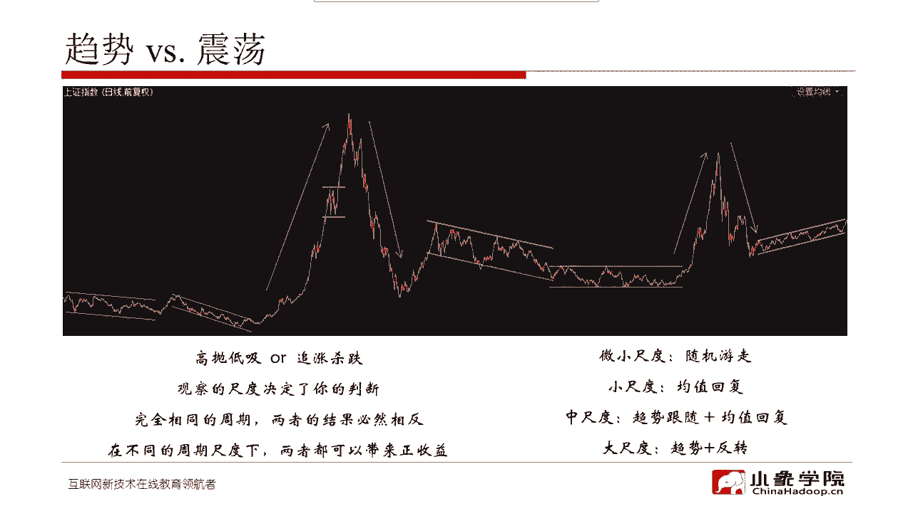

那么总结一下刚才说的这个，均值回复型策略的特点，它的要点就是投诉和退出，同样还是最关键的要素啊，基本上对于均值回溯型策略，我们不像趋势型策略，一次转就一定要转，嗨啊转狠均值回收型策策略小赚就可以了。

但是呢我们需要更高的胜率啊，而且要控严格地控制住我们的亏损，那么做均值回复型策略啊，其实我们对于波动率来讲，考虑的也是相对比较多的啊，波动率在一个比较舒适的范围做均值回复，他的这个成功率就会相对较高。

那么同样也是还是要分散化啊，那这些要点呢大家今天只要需要有个印象，后面我们再介绍具体的策略的时候，我们会不断的重复这些要点啊，到时候希望大家能够反应过来就可以了。

那么作为均值回复型策略的一个典型的应用啊，我们来给大家再多说一点关于配对，这种配对套利的这种策略对，那首先介绍这么几个名词啊，什么叫套利呢，套利分成这么几几种类型啊，它英文叫arbitrate。

那么一种叫做无风险套利，无风险套利啊，这种机会太少了，这个几乎现在市场上不太存在，即便存在也是非常瞬间，你也不见得拿得到啊，有一些做无风险套利的这个高频策略，那么这种策略就是比拼的就是速度。

当突出现了这样的机会的时候，速度最快的那个人，就会把所有的这种无风险套利的机会全都抢走，不会留给第二个人啊，所以说我们也不用过度的去关注无风险套利啊，只大家只要知道市场上确实在少部分时间里。

还存在抢钱啊，就是没有风险的抢钱这么一件事，但是这个这种机会啊，作为我们普通的投资者啊，我们是看不到的，所以我就不展开了，另外一种配对交易啊，通常这PARETRATING。

通常是在一些关联资产当中去进行的，这种成对的交易啊，做空一个品种同时做多另外一个品种啊，那么要求的这个你做的这个品种呢，它基本面是要相关的啊，它是相对比较好的这种关联资产，还有一种叫统计套利啊。

其实配置交易当中可能也用到一些统计，统计套利的这这种方法，它是通过这个计算啊，品种之间啊，它种资产之间的这个统计相关性，来决定你的这个套利的方向，那么还有一些像hatch啊。

这个大家可能也经常听说过hedge这个词，这个一本就是一种对冲，所谓的对冲，就是说我们要这个避免这个不必要的，这个风险敞口啊，我们基本上是要把它这个上了套啊，我们这通常我们的术语叫上套啊，上了套以后呢。

说白了就是说嗯，比如说我们常见的这种阿尔法策略啊，阿尔法策略实际上就是一种对冲型的策略，我做多股票现货，同时用股指期货做空来进行这个套期保值啊，那么还有所谓的市场中性。

市场中性就是刚才这个我们阿尔法策略，就是消除掉跟市场波动相关的，这这部分也就是贝塔啊来获取一个绝对收益，这个绝对收益就叫做阿尔法，那么这些名词啊互相之间可能是混用的，在这我也不花时间详细的去解释了。

如果大家一定要搞清楚它们之间的关系，不妨啊就拿这几个关键词直接百度百科啊，当然百度百科解释的也不见得特别完整，但是没关系，就算你把这些概念搞得门儿清，跟你直接去进行策略的研发，也没有半毛钱关系啊。

那纯属是假设你为了应应应对考试，假设考试出了这样的题目，你会答啊，这也就是做到那一点，我们我们开发一个策略的时候，我们绝对不会去想啊，这个属于套期保值，还是属于这个市场中性，还是属于无风险套利。

我们不会这么去呃，想问题，我们想的就是说这个东西赚的是什么钱啊，到底他在什么情况下，这个有效，什么情况下会失效，最坏的可能性是什么，我们经通常是这么去考虑问题啊，我们不会像学院派那样特别关注。

说我到底采用的是一个什么类型的东西，什么类型，套利的一些原理的示意啊，我们先来看一看这张图，这个是什么图呢，这个是属是属于这个期限套利啊，所谓的期限套利，就是说这里的期指的是这个股指期货。

现指的是这个现货啊，股票的现货是嗯，我们根据假设这是沪深300啊，沪深300的一个走势，这是粗线，那么红色的这个线啊，这条细线可能是股指期货啊，我们通常大家如果去观察股指期货的走势。

它一般它的波动要比这个沪深300这个指数啊，波动要大一些，那么当这个波动啊超出了这个无套利区间，我们为什么要划定一个无套利区间，也就是说如果波动没有超过这个区间范围，你去进行套利，cover不了啊。

覆盖不了你的交易成本，所以我们做套利，我们要划定一个所谓的无套利区间，就是如果这个这种期限套利，这个基差太小啊，没有超出无套利区间这个范围，这种时候我们是不值得去进行套利的，因为覆盖不了交易成本。

只有当基差扩大到这个无套利区间之外，那么这个时候比如说像图中这个点，这个点是说，这个时候股指期货相对于股沪深300现货啊，就是IF相对于这个沪深300，出现了一个大幅的贴水，那有这个大幅贴水的时候。

我就可以在这一点我做多股指期货啊，做多F同时做空现货，那么这样的话我就固定的赚取，最终啊在交割的交割日，基差收敛给我带来的这个这样一个获利区间，反过来对于这个点啊，我们这时候就做空股指期货。

同时做多沪深300啊，那么具体怎么怎么做空指数，怎么做多指数啊，这个是嗯也有很多的这个方法，你可以做股票的，那这个相当于你自己拟合一个沪深300指数，而用它的成分股不同的比例啊，不同的这个权重。

来拟合这样的一个沪深300指数，那么你卖出股票，你就相当于做空对吧，你也可以用这个300ETF来模拟啊，当然300ETF相对于这个沪深300指数，它还有一个有一个这个也有一个折溢价啊。

折价或者溢价也有一个波动范围，那么这样的话你再用股指期货，他们互相之间还会有这个呃在基差之外，还有一个其他的误差啊，这种折溢价，所以呢这就给我们的套利啊，虽然原理很简单。

但在实施的过程当中还是有很多细节需要考虑，包括采用不同的品种的话，你的交易标的不一样，那么你的这个交易的成本也不一样啊，所以在这个都是在很多实现的细节，这个用ETF来代替这个严格的。

严格的这个指数或者300指数，它就存在一些跟踪跟踪误差的问题啊，所以说这里头一个量化交易策略，在这里头再给大家一个T1个量化交易策略，不是说原理讲得通，就一定能帮助你赚钱，在实施的过程当中，这些细节啊。

交易的成本滑点啊，冲击成本啊，这些都会很大程度上影响你最终策略的性能，分析新套利，这个不展开讲了，因为大家真正能够操作这件事，是机会可能也比较少啊，在这就是大家课下读一读这个文字就行了啊。

我在这也不念了，分级分级基金套利啊，这也是一种套利的机会，动力套利也一样啊，这个那用这个转债当中的期权啊，来进行这个波动率套利，这里头还要去详细的去测算，这里头的这个根据模型。

根据隐含波动率来测算你的头寸啊，这个也是相对实施起来比较复杂的，所以呢这个一般来讲嗯我们也不展开了啊，大家如果对这个感兴趣，去查阅一些相关的资料，期权套利啊，这个包括什么地权组合呀，这个通性套利策略呀。

期间箱体套利策略啊，这个更复杂，别看复杂啊，理论上倒是有证明，因为期权的这个定价相对来讲，在目前所有的衍生品定价当中，是相对也是比较科学的一件事啊，但是呢正是因为它太科学了。

同时这个做期权套利的又大部分都是专业机构，所以这就使得期权套利真正想赚钱更难啊，大部分都处于无套利区间，然cover不了你的教育成本，所以我们也不展开了啊，因为我们的这十次课里头。

也不涉及到期权套利的策略，大家只要知道有这么个概念就行了，以后别人再跟你谈期权套利的时候，两三句话骗不了你就行了哦，你说一说ETF啊，刚才已经卖了个乖了，ETF是这个我们通常说的ETF套利。

就是在一二级市场上的一个套利，刚才我也说了，你可以ETF，你可以直接在二级市场套利呃，这直接在二级市场进行买卖啊，进行交易就像买卖一只股票一样，而且他还不收你的印花税，同时你也可以用一篮一篮子股票啊。

假设你现在手上有一堆股票，然后你按一定的这个相应相对应的某一个指数，它的成分股的这种权重，然后你用你手上的一篮子股票，去申购ETF的份额啊，把它兑换成相应的ETF，你也可以你手上有ETF的份额。

你把它兑换成一篮子股票啊，这个是在，相当于是在一级市场去进行申购和赎回好了，既然有两种交易ETF的方法，那么现在我们就有这种套利的机会，分成折价套利和溢价套利啊，所谓的折价套利是什么呢。

是ETF的价值小于对应的一篮子股票市值，也就是ETF出现了折价，一比方说啊，就是我们做沪深300ETF，那300只成份股，按照他们的权重计算出来的这个指数啊，沪深300指数假设是3800点。

而ETF所对应的这个价值假设对应成指数的啊，那ETF它实际上是它是有这个呃，有确定的，这个这个几块几毛几这样的一个标价啊，但是假设我们把它映射成这个指数，刚才说沪深300指数3800点。

但是ETF的价值只有3750点，假设是这样啊，那就意味着这个时候你可以在二级市场上，先买入相应的ETF，然后你到一级市场把它赎回，成对应的一篮子股票，再在这个一再在股票市场上。

把这些赎回来的这个股票全部卖出，那你就变相的赚了刚才这个50点的差价，这个大家明白了吧，反过来溢价套利，就是说假设这个时候ETF的价值是3900点，而沪深300是3800点。

那么这个时候你可以从股票市场上去，先买一篮子股票，用这一篮子股票把它申购成ETF的份额，然后在二级市场上把你申购的二，这个ETF的份额全部卖掉，这样的话你就赚了，那个一百一百个点的这个差价。

听起来很诱人是吧，这个原理又简单，看起来又还挺靠谱的，但是在实际当中出现这种大幅的折价溢价，这种情况是非常少啊，也就是说这个套利的机会是比较少的，一旦出现了这种机会，你的执行啊又要求又是比较高的。

因为要涉及到一篮子股票的申购或者赎回，所以一般来讲玩这个ETF套利啊，只有机构去做，并且呢因为在一级市场上申购赎回ETF股票啊，按ETF份额它通常是100万份起，所以对应的这个呃。

名义本金的这个价值也是几百万起啊，所以一般的散户也很很少做这样的事，但是这个对于很多大户啊，这个几百万对他们也不是事，所以一般来讲资金倒不是一个特别大的限制，关键还是从执行的角度啊。

要同时申购赎回这个300只股票啊，成份股这个操作难度还是比较大的啊，但是呢尽管难度大，他有一些事情能够确定性的帮我们做到，也是很有价值的，就是刚才我问大家一个问题，怎么买入涨停板的股票呢。

而且是以比较高的概率去完成，不是说你去在涨停板挂个买单啊，然后跟别人去排队，排在前头，运气好就能成交，如果排不到，那基本上也成交不了，而且99。9%你是排不到的啊。

那怎么我怎么完成买入这个啊涨停的股票呢，其实刚才我们在说这个ETF套利的，这个策略的时候，大家脑子快的应该已经反应过来了，假设啊我要买入一只涨停的股票，它比如说它在50上证50这个成份股当中。

随便举个例子吧，比如说万华化学啊，他也是上证50的成份股，今天涨停了，而且最近也出力好，我就想打这个板，我就一定要买入万华化学，但是他是因为涨停板上挂单去跟别人排队，我通常也没有什么便宜可占。

那我要想确保买买入它好吧，我买50ETF，因为它是上证50的成分五嘛，我我买入50ETF啊，ETF通常是很难涨停的对吧，你想买就一定能买得进来，我在二级市场上买入ETF份额。

然后在一级市场上把它这个赎回，赎回成一篮子股票，那熟汇成一篮子股票里头，这一定当中就有万华化学这支股票，然后我再把剩下49只股票全卖了，就相当于我只买入了万华化学这支股票，尽管它已经涨停了。

但是我也把它买进来了，好吧，这个教大家这么一个方法，但这个方法也是要付出代价的，什么代价呢，因为通常假设你成分股当中啊，一只ETF它的成分股当中有大量涨停的股票，这个时候它通常是溢价的。

也就是说你买入ETF本身成本就已经高了，那么付出这样相应高的交易成本，那么假设第二天万华化学没有继续打靶，很可能你赚不回来这个交易成本啊，所以说这件事情也是值得商榷啊，只不过告诉大家一个系统性的方法。

如果你特别特别想买入某一只涨停的股票，那么这个是一个办法，那么对于我们现在一些常用的指数型ETF啊，常最常见的交易量，交易也比较活跃的，五十三百和500，那么假设你想买的涨停的票，不在这些成分股当中。

那对不起你确实不太好办啊，当然还有一些交易不是那么活跃，这个呃盘子不是特别大的ETF，但是那种ETF我不是特别建议大家去碰，因为很可能砸在自己的手里出不去啊，流动性不够好啊，风险就比较高。

所以嗯不是特别建议大家去碰啊，五十三百五百这个没有问题啊，每天的这个成交非常活跃，但是五十三百五百啊，再多说一句，也对应了由不同这个公司，他们来相当于推出的这个ETF的这个品种。

对应的这个交易代码也是不一样的啊，大家可以去查一查，然后还是选建议大家选择这个流动性最好的，成交最活跃的，相应的这种指数型的ETF去交易，如果说一天成交额都不到几十个亿啊。

那这样的ETF它的流动性不够好，就建议大家不要去碰，跨期套利啊，这个也不多说了，本质上就是在两个不同到期，这个月份的这个合约之间，来利用他们的价差的偏离嗯，来做这个套利啊。

那么我们通常都是做这个价差的均值回复，原理，也是跟之前的这个配置交易的，这个原理是一样的，我也不详细说了，那么商品套利配对这种交易策略，它的最基本的原理啊，就是说他配对所谓的配对就是一多一空啊。

多做多一个品种，做空另外一个品种，所以它本身就是一种对冲啊，那么我们通常在做的时候，是利用基本面的分析或者量化的方法，来寻找同一个产业链，或者同一个板块当中的商品品种，因为只有在同一个产业链。

同一个板块当中相关的基本面上，这个强相关的这些品种，它们的价格波动才才具备比较好的统计特性啊，那么我们做多一个品种的同时，在做空另外一个配对的品种，来获得相对稳定的这一个价差波动，给我们带来的收益。

所以这在这个品种选择当中啊，我们一般是做联动性比较强的板块，比如说黑色系里头的像焦煤，焦炭啊这种绝代双骄，然后像化工啊，化工里头的这个金属里面，比如说这个我们做都都是有色啊，然后像油泼板块。

我们做豆油豆粕这些呢，因为他们基本面它要么是产业的上下游，要么是这个非常相关的品种啊，所以说它们之间的这个统计特性，是相对比较稳定的，才适合去做这种商品套利配对，那这个商品的板块和产业链。

在这我也不不多讲了啊，这个大家都可以通过一些公开的资料去看到，这个产业链板块的这种划分和，以及他们这些特性，所以我就不花时间去去说了，如果感兴趣的话，如果大家这个将来要做商品套利的策略啊。

不妨去多了解一些他们之间的这种关系，那么商品市场品种之间啊，我们通过技术分析，我们通过统计分析，我们可以画出不同品种之间的这种相关性，这张图给出的是一个商品品种之间，日相关性矩阵啊，日相关性矩阵。

我们看到这个对角线就是字相关啊，像RB这螺纹钢，螺纹钢跟螺纹钢肯定他的相关系数是一啊，这字相关，那么在这里头相关系数最高的是哪两个品种，是这个RB和HC，大家看到啊，0。93RB式螺纹钢HC是什么。

是热轧卷板，它们都属于钢材啊，都是钢钢铁，RB呢是钢筋啊，它的形态是钢筋，主要是建筑工地上啊，我们就用到了，看大家看到的钢筋，而HC呢它是热轧卷板，它是一种板材，我们看到的像电视机呀，电冰箱啊。

它们的背板都是这种板材啊，都是HC，那么在这个钢厂在生产这两种材料的时候，它们基本工艺是差不多的，只是最终啊它的形态出出品，成品的这个形态不一样，对应呢这个HC一般来讲每吨会比RB啊。

它的生产成本大概要高200块钱左右，200块钱人民币，正是因为他们基本面存在这样一个，非常确定的关系，所以HC和RB，通常它们之间这个相关系数是非常高的，所以这两个品种也可以去进行一些配对交易啊。

那么有了这个日相关性矩阵，就一定能够去做配对吗，不那么简单，首先同样两个品种啊，就同样一对一对品种，你分析它的日相关性和它的在小时小时级别，这个尺度的相关性和周相关性和月相关性，可能差别非常大，在日啊。

在日这个级别有强相关性的品种，你放到小时级别，放到分钟级别，有可能完全不相关或者相关性很差，但是也有可能还依然保持着很强的相关性，所以说我们不不要简单的通过这种统计分析，认为相关系数高。

我们就可以拿来做配对啊，一定要有基本面，有这个产业链方面可解释的逻辑，我们才会放心的去使用，否则的话我们基本不会去用，好了嗯，先休息5分钟啊，5分钟之后我们再继续。

嗯大家要有什么问题可以在这个公共留言区啊，可以留言，The walking on my side，It's got me in the mine。

Just dance that is all a soul，Just give me back，Oh oh oh，Let me feel the unknow，Where the old。

云街头加noi the old mo。

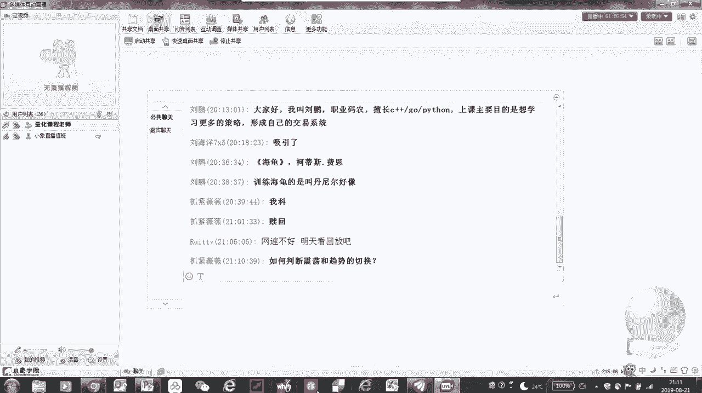

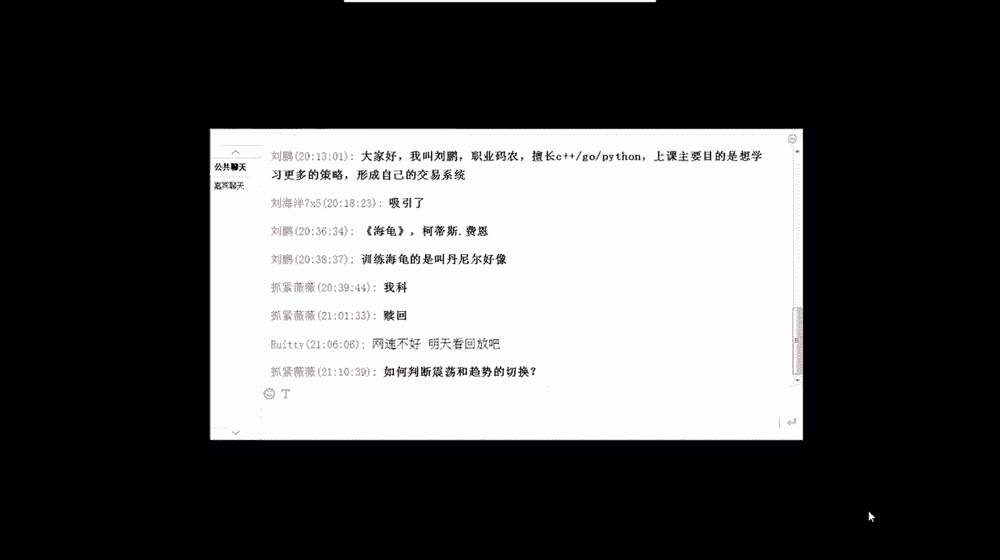

You oh oh oh oh give me，can't to the call过来吧，You can't can't，But i know it's a wu。

i don't go颠沛through，Oh oh oh oh oh oh，Yeah，On the door，You，No no，No，No more，Yeah。

I'm not just like playing，Never be lost your name，月月都过，不该往哪里走，真的高。

And i always said i was too much to mito gui，See she dobe goes up for you，Shall be goes out。

If i don't cheers when i'm at the dance，When need a fa，Nocha meal with，And never like keyes，No ky，No。

I can't okay，爱你一出来听大妈的面，都能做的美，Feels so free，Cast some love your pain，And me turn one little ta。

Ka me a look skup，If you can win my head that makes your combe on my way out。

I can bushing waste to your se，谁躲避过散分离，谁都别偷彩，Friend that fa that，I know it，So i make a de，所美的都。

I know it when i was in this，自己，You stand there，And i think i know，Just show up with musi，我只是一心一夜。

你心中的困难，好我们回来了啊，看到这个刚才这个海龟啊，原来做海龟实验的叫这个理查德丹尼斯啊，那么写海归这本书啊，那个刚才已经有同学在留言区里头说了哈，我就不重复了，嗯至于这个震荡和趋势的切换嗯。

我在课上刚才也讲了啊，我们很难提前预知，因为我们也不是神，但是呢我们从量化的角度去应对，就是我们有不同类型的策略在同时运行，而我们要求震荡型的策略，在趋势来的时候不要大亏啊。

在震荡的时候呢能够帮助我们赚钱，而趋势型的策略在趋势来的时候，能够帮我们赚翻，但是在震荡的时候啊，我们微亏甚至是不亏啊，那么这样的话，我们就可以把不同类型的策略，组合在一起来使用。

我们最多也就是凭着我们的猜测，来调整一些这个震荡型策略，和趋势型策略之间的比重啊，基本上从量化的角度，我们的框架大致是这个样子的啊，好我们继续讲课，那么接下来我们今天的第三部分内容啊。

量化策略研发流程和基本的技能啊，这一块呢也是我相信也是大家都比较关心的啊，自己到底适不适合做量化，那么自己做量化都有哪些，需要去重点去关注的东西，首先呢金融工程模型的分类啊，其实我们从品种的角度来分。

刚才我们说了股票ETF这个基本上不带杠杆啊，当然融资融券也可以稍微加一点杠杆，杠杆率也不是太高，那么在这里头呢也分成股票的，比如说绝对收益型的这种阿尔法策略啊，也包括一些这个呃这个不同的套利啊。

包括ETF，我们说有市场啊，112级市场有套利，那么嗯以前我在初阶课上，我给大家举个例子，在A股市场上啊，一个新韭菜成长为老韭菜，它的通常的生命周期是两年，也就是说如果你能在这个市场上生存两年以上。

基本上你已经成长为一个茁壮的老韭菜，轻易不会被割死啊，当然亏钱你有可能还是亏钱，但是基本上不会死的，那么两年你要么已经死掉，要么就是成长为老韭菜，但是在期货市场上啊，期货债券商品。

期货市场上的平均生命周期大概是三个月啊，因为特别容易爆仓啊，穿仓一旦穿仓，你本金就一分钱也不剩了，所以在这种情况下啊，高杠杆率的品种如果不能够很好的控制风险，那么最好还是不要去碰。

而我们在这个呃这十次课啊进阶课当中，我们会分享一些商品期货的这种策略，包括就是CTA策略的这种，这种嗯基本的思想啊，包括一些均值回复型的策略，那么对于期权策略这个呢嗯至少从进阶课啊。

这这这个我们的这个教学大纲的要求上来讲，我们是不建议大家去碰的啊，因为这类策略太难做了啊，在执行层面我们也没有优势，在本身策略理论层面我们也没有优势，期权本身就是一个定价，非常合理的一个衍生品啊。

本身套利空间就小，那么顶多大家也就是买买彩票啊，就是你拿非常少量的资资金，去简单的买一买期权，因为前一段时间那个50ETF啊，期权192倍啊，一天上涨192倍，是你你就把它当成彩票买是可以的啊。

但是通常不建议大家去碰啊，因为很难去赚钱，嗯到了这个线下课啊，我们的真正面对面在授课的时候，我们会提议部分期权的策略啊，也不会作为特别重点的内容去讲，但是会讲一部分啊，那么从这个投资交易模型的基本。

研发流程上来看啊，大家可以看看我右边这个这个图，在一开始我们是不管是通过数学的推导，统计的验证，历史数据的分析啊，我们会基于这些基础的理论，我们会进行建模啊，进行策略的建模，也就是说。

我们会把这个历史的一些数据进行分析以后，我们初步形成一种交易逻辑，按照这个逻辑我们建立我们的模型，那这个模型不是说你拍脑袋，这个建完了就可以去用啊，我们要进行大量的追溯测试，什么叫追溯测试。

简单讲就是回测，我们通过历史数据来验证我们这个策略的模型，的初步的有效性，如果连回溯这关都通过不了，那对不起，那说明你这个策略，就是不具备任何可以实用的基础啊，你要么再重新进行统计分析。

要么去修改你策略当中的一些参数啊，修改其中的一些逻辑，那么直到在回测当中，达到我们预先设计的这个性能，我们又开始进入到一个非常漫长的啊，特别纠结，特别辛苦的一个修正错误的过程，为什么要修正错误。

因为回溯当中啊，首先我们且不说有过拟合，有未来函数，假设没有过拟合，也没有未来函数，但这里头你的交易的这个成本，设置的合理不合理啊，你在这里头你的这个回测测试当中，你交易的这种完成率到底有多高啊。

是不是符合真正实盘当中的这一个基本的常识，你这个代码当中有没有bug啊，有没有一些编程导致的这个逻辑，没有正确的去实现，还钻了一些空子，甚至啊所以在修正错误这个阶段非常非常关键，因为很多时候啊。

一些初学初学者在回撤的时候，就唉我这个我这策略相当好啊，回收曲线你看多漂亮，然后跳过了错误修正啊，跳过了这个系统分析，风险管理系统测试这个阶段直接上十盘了，那实盘亏的一塌糊涂啊。

跟这个回测曲线压根就就不是一个妈生的，怎么怎么会造成这样的这个问题呢，就是在修正错误这个阶段他直接跳步了，但是你这个回测当中呢，你这个模型可能存在大量的错误啊，存在大量的错误，有意无意引入的。

甚至有些有些同学可能直接使用这个，别人的代码啊，因为现在也有很多这个量化策略，这个交易的一些平台啊，你直接直接花点钱买别人的策略，如果真正能赚钱的策略能值，那么点钱嘛，你就花几百块钱，几十块钱。

你就能买来一个能帮你长期赚钱的策略，我觉得我们我们用脚投票，用用用脚去思考，我们都不会去干这种傻事啊，去直接花几十块钱买别人的策略，那至少我不会干这个事儿，我是知道一个赚钱的策略。

从最初的想法到验证你的逻辑，到大量的测试，到修正错误，再到上实盘，修正更多的细节是一个非常艰辛的过程啊，这个过程怎么能值值几十块钱，几百块钱是上千块钱，上万块钱都买不来啊，一个真正能帮你赚钱的策略。

这个标价多少都不过分，所以说大家一定不要忽略修正错误，那么如果这一步也通过了啊，恭喜你，你的这个策略具备了上实盘的这个基础，但是呢还是要进行一些压力的测试，包括你的这个一些意外情况，一些紧急预案。

你是不是考虑清楚啊，我们在最后一节课会给大家更多的去探讨，这方面的经验啊，也非常关键，有的时候就是因为缺少一些预案，导致你在上实盘之后有些突发的事件，你你不知道该怎么处理啊，其平时这个赚了三个月的钱。

一天全亏回去啊，这是这这是非常常见的一种现象啊，所以在进入到自动化操作之前，我们要把我们的预案充分的这个论证清楚，那么左边这些我就不不详细展开了，每一个玻璃的大家读读文字啊。

基本上这个字面意思也都很容易去理解，关键还是真正有技术含量的，是从绩效评估之后的这些步骤，才是真正的实盘量化啊，最有技术含量的部分，那从流程的细则和一些这个技术选型啊。

我们也简单的给大家来做一个初步的探讨，这个量化这个东西之所以有魅力，就在于市场是永远是变化的，一个经典的策略，在很多时候能帮助我们赚钱，但是他也很多时候会让你亏钱啊，至于什么时候能帮你赚。

什么时候能帮你亏这个事情，这个事情我们有时候也说不准啊，很多时候是这个这个利润是偏，老天爷赐给我们的啊，上帝赐给我们的，我们的任务就是在这个上帝青睐我们的时候，我们抓住机会，我们尽量多赚一点。

在上帝不给我们面子的时候，我们能控制住风险，让我们少亏一点，我们但基本上啊我们所有的流程的细则，包括我们做出的现实的选择，都是围绕这样一个原则好，那么先从这个统计分析的角度啊。

看看这时候我们回溯平台的选择模型，不用说了啊，模型这个基本上大家的逻辑自己心里都有啊，每个人有自己的这个交易的逻辑，那我们选择一个什么样的平台，去进行相应的这个分析啊，统计检验通过什么样的方法啊。

包括这里的数据样本啊，这个也很关键，我们需要用什么样的数据来进行验证，嗯过拟合呀，鲁棒性分析呀，这些东西这个以后慢慢讲啊，然后从这个技术层面啊，我们到底是用什么语言来开发呢，这里头其实也有很多的讲究啊。

用选择什么样的操作系统，一般来讲啊，如果你是一个专业量化选手，我们通常不选择那些图形界面，因为这些东西冗余的，所有冗余的和交易没有直接关系的，这些构件都会影响我们交易的性能，所以你会看到啊。

就是专业的团队，一般来讲，他们的这个交易模型都是部署在类似LINUX，这样的系统上啊，无不是图形界面，这样能够节省一些资源，甚至有很多做高频交易的啊，直接把它放到这个呃GGPU，甚至是直接放到网卡。

高速网卡上，直接嵌入这个硬件啊，嵌入FPGA啊，甚至直接在网卡上就就完成了啊，那么从编程语言的角度啊，对于一般的经典的量化策略，如果他是在分中级小时级甚至更粗的颗粒度啊，在日线级别去去进行交易的。

那么Python是足够了啊，嗯这个而且Python有大量的第三方的，这个第三方的库，第三方的这个函数，那么对于我们去实现一些计算，是相相对是比较有利啊，省得有些算法还又需要自己从头写，这很费劲的。

经常容易引入一些bug啊，所以Python还是比较好用的，但是如果你想做的是一些高频交易啊，Python的执行效率就不够了，因为P这个Python在这个秒级以上啊，这这种反应是足够的。

如果你要想把你的性能做到毫秒级微秒级啊，那么Python是通常来讲呃，以我们的经验它是它是不够的啊，这个时候你的交易算法的一些内核，都需要用cc加加这样的语言来写了啊。

但是这个是非常专业的一个一个一个领域了，我相信大多数人可能一开始也接触不到啊，所以呢这个取决于你在什么维度进行计算啊，你是要在分钟及以上，这个用什么语言都什么工具都都可以，你要是在tick级别啊。

所谓一个tick就是一个最小的一个颗粒度，那么这个假设是是在这个毫秒级甚至更低的啊，这个更小的颗粒度，那么就需要考虑到性能的问题，包括从这个交易接口数据啊，从这个配置上，我们一般CCCTP啊。

这个接口就足够了啊，CDP一般是毫秒级啊，它的延迟一般大概柜台延迟是毫秒级，但如果你要做高频啊，高频量化，这个三个毫秒很可能就能让你从赚钱到赔钱了，所以一般啊，如果说这个你要是真的对性能要求很高的。

这种高速交易，高频交易呃，类似这种高速飞马的接口啊，这可能这这这就要多花钱了啊，说白了就是要这个交易成本嗯，这个基础环境的配置的成本就相对比较高了，他的柜台延迟通常是在微秒级啊，在300微秒以内。

所以这个是适合这种高速行情啊，最夸张的他有可能直接这个呃，据我们我们知道的啊，最最夸张的这个高频交易，他直接用微波塔进行传输啊，因为大家知道在光纤光纤里面，这个传输的信息传输的速速率还不是光速啊。

因为在光纤里头它是有折射的，但是呢你要架微波塔，那就是一个直线啊，这个相当于是以光速来进行传播啊，当然是我们以我们目前的程度，根本用不上这些东西啊，根本用不上，基本上来讲，我们对于绝大多数的场景。

我们可能是在分中级用使用Python啊，甚至一些图形化的界面都无所谓啊，都无所谓，策略层面的这种实操综合啊，其实除了考验你的技术能力，很多是一些软实力，比如说你的人脉关系。

你能不能拿到比别人更低的交易费率啊，你的保证金比例能不能收的更低啊，那么你能不能拿到更多的融券的这个标的啊，这些其实都是在决定你的量化交易策略，到底能不能这个不打折扣的去执行。

甚至会在执行层面获得一定的优势啊，所以说大家不光在我们的课上，要重视技术层面的这种提高，这种技能，当你真正有朝一日你以这个量化交易为生啊，真正从事这个行业的时候，需要更多的去考虑你的资源。

包括你的这个你的团队，你的配置是不是合理，是不是全面，是不是能够覆盖你的日常交易当中的，这个各个环节，同时建立你的这个优势，好这部分讲完以后啊，你看看量化的基本技能，如果让我去总结。

我认为第一位的量化的基本技能，既不是你的思路，你的交易逻辑啊，因为我像我现在绝大多数主观交易者，都有自己相对比较成型的系统了，都有你的思路，有你的逻辑，对我认为量化最重要的也不是写代码。

因为在市面上会写代码的程序员，也是一抓一大把啊，量化我认为最基本的最核心的性能技能是什么，让我总结就是算法，什么叫算法，算法是说把你的一个交易逻辑，能够用清晰的指令系统来描述。

也就是说把一个看起来是一个抽象的，一个相对模糊的这样的一个思路，一种逻辑把它用定量的非常清晰的，没有歧义的，而且是完备的，这种指令或者指令的集合来描述出来，这个我认为是做量化最核心的能力。

不是谁都能轻易做到的啊，举个例子，包括利息这四个字，谁都会说黑嘴用的最多，但是你让黑嘴给你进一步的解释一下，到底怎么高抛低吸，什么价格算高，什么价格算低啊，掏多少吸多少，抛什么标的，多长时间操作一次啊。

你的信号到底怎么来，我相信有100个黑嘴里头有100，一个都说不出来啊，而这个才是我们真正的准确定量的语言，完备的逻辑才是我们算法啊，最最重要的要素，也是我们做量化最基本的技能。

哎我们用一个经典网格策略啊来做一个说明我，我我经常啊，在我的这个我有我有一个嗯疯牛秘籍，我们的一个公众号啊，如果大家感兴趣的话，也可以关注一下，我们每天都会盘后都会有一个盘平啊。

然后我们我在今年1月份的时候，大盘还没起来啊，刚建2440这个低点的时候，我在盘每天的盘评当中我都会强调，这个时候是最好的布局的时候啊，大家不妨用ETF网格策略，什么叫ETF网格策略呢。

就是我操作的是ETF指数ETF啊，这种宽基的指数ETF这种标准这种标定，然后我用网格策略来建仓，每下跌一个网格，我就建一个头寸，然后如果反弹上去了啊，反弹回向上反弹了一个网格。

我就把刚才刚建的这个头寸把它高抛了，这个就是我定义的所谓的高抛低吸啊，每下跌一个网格吸一个头寸，每上涨一个网格，抛一个之前吸过的头寸，如此反复啊，你会发现在这个过程当中，不管它这个价格怎么去波动。

只要有朝一日，它能够回到一我们最开始的这个价格，那么你就固定的有钱可赚，大家看一看是不是这样，所以只要我们确认，现在已经进入到一个底部区域，那么我们用最经典的网格策略，去操作一个指数ETF这样的标的。

我们认为他有朝一日总要回来的，只要他到时候回来了，那么我们通过这个网格，我们就固定的赚取了相应的收益，而这样一个经典的网格策略，每次什么时候吸，什么时候抛，每次吸多少抛多少啊。

这个都是可以非常确定性的定量来描述出来的，而且逻辑还可以扩展啊，我的网格可以不是均匀的去扫，我可以像这样的中间梳两头密，这个对应的是什么呢，对应的我认为在比如说底部这个区域。

这已经是这个价格能够压缩的极限了，假设这是2440，那我认为啊最多也就跌不破2000点，假设啊我们有这样一个基本假设，那我就是越接近2000点的时候，我加仓会越逆对吧，那么有朝一日反弹。

只要稍微反弹一点，我这部分就已经回本甚至盈利，我们逻辑扩展还可以是什么，还可以是均匀的网格，但是每次加仓的头寸不一样啊，抛的头寸也不一样，你这个是属于金字塔，也可以是倒金字塔，也可以是菱形的加仓啊。

这些都是我们不同的逻辑的扩展，所以核心是什么，作为一个网格交易策略，核心是说当你的标的物真正下跌到极限之前，你的子弹不要打光，所以这里头有一个定量的一个参数，就是你怎么去分配投资啊。

那么标的物的选择到底是选个股还是指数呢，我为什么在我的盘评当中，一直强调要宽基指数ETF，宽宽窄的宽基基础的基，所谓的宽基指数ETF，就是说我这个ETF所对应的成份股也不能太少，一般沪深300。

中证500啊，为什么只有这样的宽基指数，它有朝一日一定是能回来的，只要你建仓的位置不初始建仓的位置，撒网的位置不是太高，对于上证指数来讲，3000点以下一定不是高位啊。

这个是我们可以有大量的历史数据来证明的，特别是2800点以下，基本上可以闭着眼睛做网格啊，但是前提我们做的是指数，如果你说2800点以下，然后我去做某一只个股，对不起，你很可踩雷踩雷。

怎么不住我这个退市的股票要被你赶上了，你怎么做网格都是个死好，价格是连续的还是跳空的呢，我们做这种这个网格型的策略，其实是不怕跳空的，但是有一些更小级别的策略啊，嗯这个跳空对我们是有很大的影响。

所以在你的设置啊，在设计你的交易逻辑的时候，你的价格是连续的，还是有可能出现跳空，是你的一个非常重要的参考因素，最近为什么说有很多策略，量化策略都表现不是特别好，就是因为隔岸有那么一个特别不靠谱的人。

整天发推特对吧，导致我们的这个指数都是连续的跳空，不断的留各种各样的缺口，这个一旦价格不连续，我们很多动力学系统，它就之前的一些建模的基本假设就被打破了啊，所以大家的很多量化策略都是这个稀里哗啦啊。

这个表现非常不好，但是呢我们这个网格还好啊，因为我们一般撒网，只要你有一个合理的间距，这个不是特别大幅的跳空，对我们来讲几乎是没有什么影响，对压力还是支撑，这个决定了我们对于极限位置的一个判断啊。

极限位决定了你怎么去分配你的子弹，决定了你怎么去划分你的网格这个高度啊，所以这个极限位置区间，然后我们在任何一个交易逻辑，也就是说你在描述任何一种算法的时候，你还是要考虑你这个算法在什么行情下适应。

在什么行情下不适用，我一开始就说了，我们做量化的和一般的主观交易最大的区别是，我们首先想的是最坏的情况，我们只要保证在最坏的情况下，我们的本金不至于大幅亏空，我们不死，那我们总有一天会被我们抄到了对吧。

也就是说这个只要你能有效的截断亏损，总有一天利润会奔跑啊，所以说我们做量化一定要考虑，除了你适用的情况，更多的是要想你不适用的情况，你最坏的情况，你这个策略是怎么一个书法啊，只要不死啊，能够确保不死。

那么你总有一天会翻盘好那么作为这个练习啊，给大家一道算术题，如果说这个啊，因为这这这个这个讲义做的相对比较早啊，嗯今天500ETF啊，这个中证500ETF的价格应该是没有到五块八啊。

大概五块多五块多一点，那么我们我们还是就按这个数来算吧，啊假设当前500ETF的价格是五块八啊，那么同时我们还假设它的极限位置是下跌，再继续下跌10%，然后给你20万的本金，你怎么构造一个网格交易算法。

它就类似我刚才前面画的这个网格，这个这个图啊，对你把它描述成一个定量的算法，怎么去分配你这20万的资金，一个网格大概是嗯对应的是是什么价格啊，在什么时候什么条件开始加仓，什么时候减仓，什么时候获利啊。

什么时候退出啊，这个作为一道题目啊，我还是强烈建议大家把你的思路，按照严格的练习，你把它描述成一个定量的量化模型的一个算法，看看看似简单的一个网格交易策略，你的考虑是不是很严密，很周到，很完备啊。

很准确，好最后再花一点时间啊，讲讲常用的量化平台，我们通常来讲啊，我们在初阶课的时候给大家介绍了，怎么搭建一个轻量级的，这个量化回测的这么一个平台，但实际上我们另外一句话是说嗯。

我们不建议大家在一开始就一定要搭建一个，属于完全属于自己啊，自己开发一个这个重量级的啊一个量化平台，因为这里头的坑实在太多了啊，个人单靠一个人是很难完成的，所以说我们在一开始。

还是建议大家尽量的使用一些，第三方的量化平台，因为对于你这个初学来说啊，这个第三方的很多平台，基本都可以满足你的需求，直到第三方的这个平台不能满足你的深度的，个性化的需求的时候，才会啊。

才有这种这个这个强烈的动力，去搭建一个完全属于自己的一个量和平台，但那个成本就相对比较高了，不过那个时候估计你已经自己开始组建了，一个量化团队啊，这个时候你就必须要有自己的这么一个平台。

那我们先说说第三方平台啊，第三方平台呢分成这么几种类型，一个是本地化的平台，大多数本地化平台采用图表交易系统啊，当然也有一些后台交易系统，图表交易系统，比如说像金字塔呀，MARICHARLES啊。

这个就是MC，还有tb就trade blazor啊，这教育开拓者文华财经啊，这些呢都属于图表类型的这个呃，第三方联网平台，在这上面你可以写公式，或者他们有自带的一些这个呃编程语言啊。

可以在这上面做一些策略，有的可以支持相对比较复杂的策略，有的只能支持一些公式化的简单的策略，然后像后台交易系统呢，像这个to share啊，包括mt mt，这主要是大家做这个外汇哈，可能用到这个。

嗯然后还有一些云端的交易系统，这个主要是像一些就是以SARS方式来部署的啊，比如说像距宽，像铀矿，像米光，那么我们在我们的这个十次的课程当中啊，进阶课我们会用到TB会用到MC，也会用到巨宽啊。

这个是我们认为目前相对比较成熟的，也是使用的比较多的，而且在大多数情况下，能够满足你的比较标准的一些，量化交易的需求啊，可以做实盘的这样的系统，嗯还有一些你像比如说东财呀，万德呀。

这个就东财的choice啊，万德还有像掘金量化，他们提供了一些量化的API和SDK，如果你有一些专业的需求啊，专门那些需求可以在他们这个平台上来做，但是呢也各有优劣势吧。

他们虽然没有这个像这个云端系统这么开放啊，但是呢它有一些专门的一些接口，可能在别的地方拿不到，但是呢正是因为他有这些专门的接口，他们在这上面实现量化策略，这个包括进行实盘交易有更多的限制。

还有一些开源的框架，这个呢就是为你将来要想定制自己的，量化交易平台啊，提供了一些这个半成品，你像VNPY啊，PYCTP啊，Quick live zip line，这些都是一些开源的框架。

尤其以VNPY啊，这个目前相对比较流行，包括我们自己的一些呃，对于实时性要求不是特别高的，这种量化交易策略啊，我们也是在VNPY的这个框架下，来定制开发的啊，那么给大家一些直观的印象啊。

像这样的一个这个界面，这就是交易开拓者啊，旗舰版64位，为什么截这个图啊，大家回去准备一下，这个是直接用windows的windows的版本啊，大家直接去交易开拓者的网站。

去下载一个最新的64位的旗舰版，把它安装了，这个我们在后面的课程当中会用得到啊，会用得到具体怎么用，等到讲到那节课的时候再说了啊，这个都是像爱开头这里头像这个故事编辑器啊。

像这里头这是教育开拓者自己的这种语言啊，他的编程风格类似于C啊，先是声明这个所用到的变量和参数啊，参数变量，然后它的函数主函数体是begin和end之间写的，这些一行一行用分号来分隔的这样的语句啊。

如果大家之前写过C语言啊，看这个东西是非常容易的啊，非常容易，当然这里头还有不同的公式，应用的这种运行机制啊，还有一些设置，包括在实盘当中，还有一些特殊的一些设置，这个呢是说在交易开拓者上。

你做一个策略啊，你可以快速的去看到它的性能图表啊，这种灰色曲线啊。

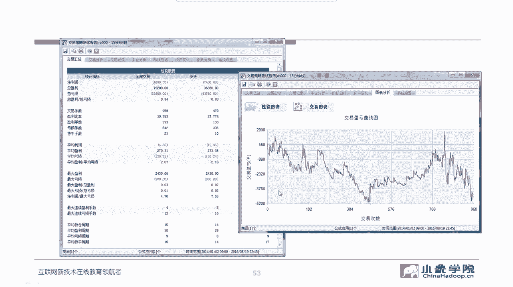

另外一个比较常用的距宽，我们也会有在距宽上运行的策略啊，给大家去讲解的距宽呢，它是一个基于浏览器的这么一个运行的环境啊，不需要特殊安装什么东西，那么在这它有一个这个，你的策略的这种编辑器啊。

编编辑编嗯编辑器，然后呢你可以去编译运行，它，编运行以后呢，它会生成日志，还有一些这个就是一些你可以查看一些错误啊，包括一些什么像语法呀什么的这些的错误，然后这边也会给你生成你相应的回测曲线啊。

然后这里头还有一些回测的详情，你可以看到更多的指标，那么具体怎么去使用，我们这个也是在结合的具体后面的课程啊，这个策略给大家介绍。

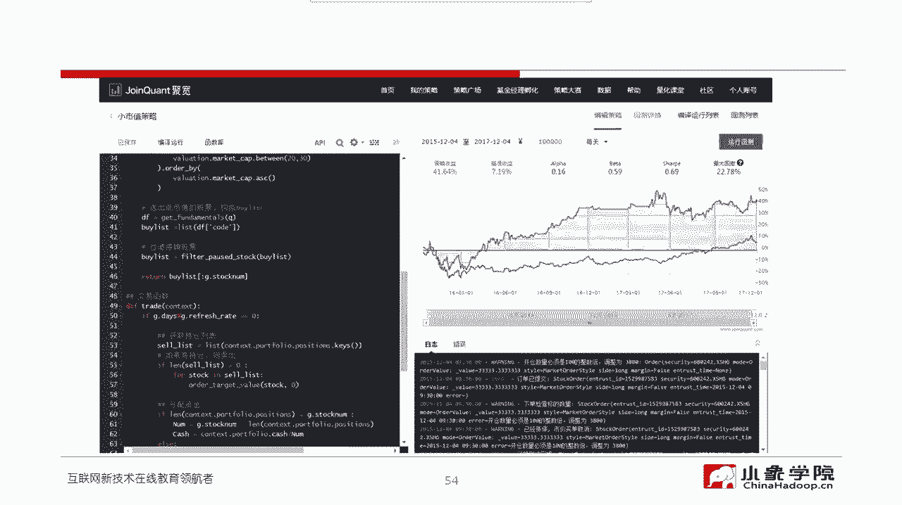

啊这个就是这个具体的绩效分析的啊，这个他的一个回撤完成了以后啊，具体我们可以看到这些指标，这些指标怎么看，我们后面也会讲，嗯这张图这是万德的啊，曼德因为它指向机构开放啊，其实个人很难很难用，即便你有钱。

他也不卖给你啊，这个其实也是，现在我觉得万德唉算了，也不说他的坏话了啊，总之就是万德也可以做回撤，然后之前也可以做交易啊，现在可能他他的这个股票的交易接口，可能还没有重新开放啊，但是我认为开放也不远啊。

因为现在这个随着我们的金融深化，改革不断的深入，包括我们国际化接轨啊，这种进程在不断推进，15年股灾以后，把这个量化股票的量化交易接口给封了，那么现在其实也是在不同的券商，已经在陆陆续续的在在开放。

所以我认为离全面开放应该也不远，这是在万德上写的这个程序啊，他的一些风格啊，这个也不说了，NPYNPY呢是目前来讲，这个作为一个开源框架啊，我认为对于绝大多数的量化策略的需求。

在VPY上去进行实盘的对接也还是比较方便啊，特别是像这种商品期货啊，这个CDP接口是非常方便，它这里头有好几个引擎，事件驱动引擎啊，这个嗯它整个的就是一个消息，消息的一个机制啊，消息触发的一个机制。

那么我们我们进阶课啊，不会涉及到这个，怎么去用VNPY来搭建，自己的这个交易交易系统，因为这个属于一个相对比较，应该说嗯相对比较高级的一个内容，我们在线下课当中会去介绍。

那相对比较详细的去介绍VNPY啊，怎么用VNPY来写这个交易策略，怎么对接实盘嗯，如果感兴趣的同学呢，在听完了进阶课以后，如果你还是觉得NNPY是你未来一段时间，可能比较好的选择。

那也不妨来参加我们的这个线下课程啊，进一步的去深嗯。

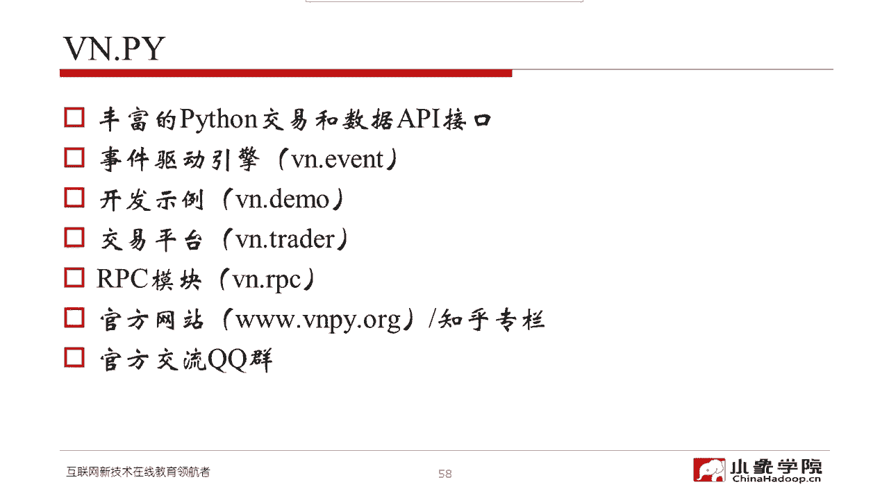

这个深入的去了解，啊，这个是VNPY的一个相对图形化的一个界面。

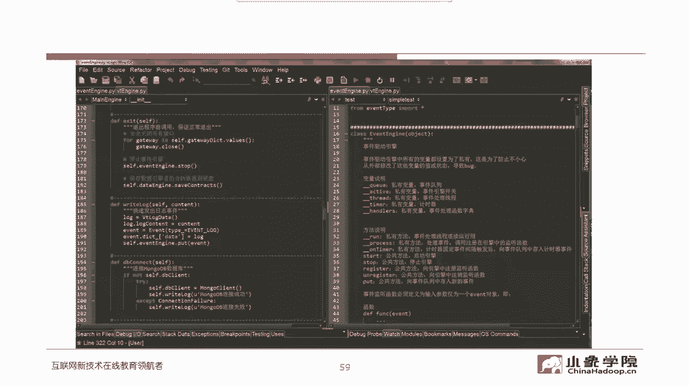

和一个集成的集成的环境，当然他也可以有命令行的方式啊，这个又展开了，那么最后啊如何量化一个主观策略的思路，我们谈一下切到点啊，首先你要问问自己之前做的主观策略啊，到底这里头有多少逻辑可以量化。

嗯就是说逻辑当中有多少成分可以讲，比如我们举个例子啊，放句量，方剂量这件事要写成量化的语言应该怎么写，你至少要把它对应到成交量或者量比，或者某一个什么样的一个指标，它超过某一个阈值啊。

或者说你要定义的更复杂一点，那可能是一个序列啊，一个交易成交额或者成交量或者量比，或者包括持仓量这样的一个序列，当它符合某一种组合条件的时候，把它定义成放序列对吧，所以三个字可能对应着一大堆的代码啊。

一大堆的逻辑要向定量描述，准确的描述啊，这个必须是要花功夫的，主力资金大幅流入，同样啊，底部箱体快速突破，高质量高质量的公司啊，质量因子你会发现啊，我们通常我们认为已经很确定性的。

我们的交易逻辑当中存在大量的形容词，但是我们的量化策略里不可以有形容词，只能有量子啊，只能有定量的说法和关系描述符啊，大于等于小于啊，不等于等等，也可以有逻辑操作符and or对吧，甚至什么异或啊等等。

但是就是不能有形容词，凡是你的算法当中有形容词，就说明你这一块没有变化啊，同样我们的量化策略里不能有感觉啊，我们必须把感觉也量化，市场情绪是强还是弱啊，必须要量化管理者的能力是好还是坏，怎么去量化啊。

产品公司生产的产品是好还是坏，怎么去量化这个行业前景有没有前景啊，怎么去量化这个消息是属于利好还是利空啊，怎么去量化这个政策，对于这个行业和这家公司是好还是不好啊，这些不能靠感觉。

如果你想利用这刚才提到的这方面的一些因子，或者说这些要素，也必须要把它定量定量描述出来，并且最终要触发，以触发我们交易系统的交易信号为目标啊，所以策略逻辑的实现，要从策略逻辑的本质来出发啊。

工具其实不是核心，核心在于你的逻辑的严谨性，完备性，以及你对他这个逻辑，能不能形成定量的算法描述，比如说你成交的时机，这个时候其实也很关键，你是在开盘集合竞价就就下单挂涨停价买，挂跌停价卖，确保成交。

还是说你在临近收盘的时候去操作，以对手价，还是说你在实时啊，你甚至要这个为了额为了确保成交，可能还要设更大的划点啊，这些其实都是我们在量化策略里头关心的要素，建仓的头寸股票来讲，现在还是T加一对吧。

所以说在你的量化策略当中，一定要考虑这个因素啊，当天见图顺，当天不能停，那么涨跌停如果遇到涨停，买不进去，跌停卖不出去，你是不断的尝试，还是第二天再说啊，资金不足怎么办，你是不买。

还是说你有多少钱就买多少啊，有够一手的钱就买一手，够两手的钱就买两手，虽然你的交易系统给出的，比如说是建仓十首，但是你现在资金不够，应该怎么处理啊，交易成本我们在回测的时候怎么设法点。

在实盘当中怎么去尽量这个获得更有优势的啊，成本更低的啊，这样的设置应该怎么去设，如果挂了单，在实盘当中挂了单没有成交，我们是立刻撤单，重新发单，还是说再等一会，等这个价格被碰到，还是干脆直接撤单。

也不再重新挂载，这些都是我们在策略实现过程当中，必须去关注的细节，还有复权啊，做股票，如果你在策略回测验证的时候不复权，那这个事太这个影响太大了啊，影响太大了，这个重要性我就不重复了啊。

这个我们在初阶课程当中已经强调过，复权的重要性，我希望大家既然已经上了进阶课啊，后面我们不不管是自己在实践，还是我们在这个完成作业，还是说你在这个听课，在理解的过程当中，凡是我们强调过的一些重要的要素。

不要去重复的去犯低级的错误啊，这样的话你就没有白听这个储量学院，各位老师给大家这个讲的课是，那有的同学可能会说哎呀这个我可能能写算法，但是我写不了代码啊，我对这个计算机不是特别熟练，我的程序写的不好啊。

没关系，只要你能把你的算法描述的完备，定量准确，那么这个时候你就可以考虑组建一个团队啊，至少找一个信得过的技术的合伙人，你就可以跟他搭档来这个呃，进入到量化的世界啊，量化交易的世界，或者啊。

如果你认为你自己这个工程的工科的能力，还是比较强的，从头开始写代码这件事其实也不难啊，某种程度上来讲，这是一个确定可完成的任务，比把主观逻辑写成定量准确完备的算法，我认为要简单得多啊，好了。

这是只是给大家一个建议啊，那么我们希望大家将来你在写这个，你的交易的预案也好，你的量化的这个逻辑，你的算法也好，先画个思维导图，然后再慢慢往里头填参数啊，思维导图一定要完备，就像我们现在每天在复盘。

然后做做第二天的交易预案的时候，我们通常也是用画图的方式来说明的啊，这也是一种基本功，以后如果真的有机会，我们再展示一下，这个我们之前画过的一些思维导图啊，这可能能给大家作为参照的例子啊。

当然我也得找到合适的啊，也也不泄露我们的这过多的这个，交易的这个秘密啊，当然这个有有些秘密时间长了以后，他也就不是秘密了，这个是是嗯普像学院的一个宗旨呢，就是说把尽量啊把能够分享的这个内容。

尽尽可能多地分享出来啊，因为交易这个东西啊，其实越分享越讨论越开放，反而你的收获越大，你的提高会越快，下节课啊以量化的角度来重新认识技术指标，因为量化交易系统啊，一个很重要的一个组成模块就是信号系统。

而信号系统有很大的这个呃信号，很多的，这种信号是来自于对于技术指标的呃使用，所以下节课呢，我们会用真实的例子来给大家介绍，怎么去这个呃通过量化的角度啊，从以量化的角度来重新认识技术指标。

下节课涉及到一些具体的代码，今天这节课没有代码啊，下节课会讲一些代码了啊，包括代码背后的逻辑，那么我们会给大家提前啊，发这个大家下节课要准备的这个环境啊，那么也请大家注意我们课后的通知好了。

今天的规定工作就到这了，我们来看看大家有什么问题啊，我们来回答一些问题，在什么样的情况下来这个使用网格啊，其实这个事大家可以去思考思考嗯，通常的原则就是只要你判判断不是在顶部啊。

一般来讲你要是在顶部来做网格，那很可能这个还没跌到头啊，你的子弹已经打光了，当然这个我刚才说的是，以股票或者ETF作为标的物，如果说你做这个商品期货类似这样的品种，其实你是可以多空双向都做的。

那么这个时候就是说你判断，如果是处于顶部区域，那么你的网格主要是开空对吧，如果你判断底部区域，你主要是开多啊，那么网格的间隔呢实际上是是网格的间隔，包括你每次打的头寸。

以及你判断当前价格和极限的底部的价格，我们都是以做多为例啊，假设你判断当前的价格和底部价格，它的这个下跌的空间，极限的位置在哪，这些都有关系，一般来讲，假设啊你你的手上的头寸，假设你分成十份。

那么也就是说你的网格，可能你认为在极限位置和现在的这个价格之间，你至少要赏十个格子对吧，呃如果是均匀加仓的话，就是每下跌一个网格，你加一份头寸，那么到了极限位置，你刚好打光所有的子弹。

那么这时候再反弹回来，你这十份都都赚钱，就是大概是这么一个思想，但是具体说你一次如果不均匀的打头寸，或者我不均匀的设置网格，那到底呃你你的假设是什么，决定了你用什么方式来调整你网格的参数。

怎么判断资金是流入还是流出嗯，我不知道你指的是股票还是其他的啊，这个如果是股票的话呢，有一种这个看内外盘，或者是看这个呃这个大单和超大单啊，这个呢资金的流入流出有不同的定义方式，我建议大家呢。

这个这个实际上在百度上都可以搜索得到啊，这个嗯，我我相信百度上能能够找到，你这个想要的答案啊，不妨去试一下，形态突破用代码实现，也不一定非得用machine learning啊。

有些规则的方法假设是比较简单的形态，比如说黑嘴们常说的什么仙人指路啊，出水芙蓉啊，老鸭头啊这些，实际上写一些规则也就写出来了，什么红三兵啊，但是要说相对比较复杂的一些形态啊。

那可能是确实要通过一些数据的标注，然后用一些模式识别的模式learning的方法去做，像W这种形态，你写规则也没有问题啊，其实你检测一些关键的点，然后通过把这些关键点框到某一个规则下面。

也可以得到比较好的识别率，黄金和比特币怎么量化啊，其实比特币你把它看成一个嗯交易比较活跃的，一个比较大的商品合约呃，问题就不大啊，因为比特币流动性还可以嗯，你就类比于某一种这个趋势。

趋势效率比较高的一种商品就可以了，黄金呢因为我本人没有亲自做过啊，这个我觉得黄金受周期的影响，我个人的观点可能受周期的影响是比较大的，因为它毕竟主要是作为一种避险的品种啊，在大多数时间可能做黄金嗯。

它的收益不是那么可观，但是最近因为对岸老是发推哈，这个动不动就影响黄金的价格，那么我就我也不好不好评论啊，所以说这个东西一定是能有某种，量化交易的方法的，但是这个这个方法在大多数情况下能不能赚钱。

这个事儿我就不好评评价了，好U这个看来今天这个就这些问题了啊，那么呃我们今天就先到这，这个非常感谢大家啊，这么晚这个还这个非常专心的听课，我相信今天的这个课的内容虽然叫基础知识啊。

呃里头有包含了不少实战的经验，以及大家将来真的能用得上的理念啊，我先我也希望大家这个回去如果有时间的话，也反复的这个多听几遍啊，你可能每听一遍都会有新的收获啊，这个点这倒不是说老牛卖瓜自卖自夸啊。

这个嗯确实是这样的哈，另外呢，这个呃，关注一下我们这个在小学，学院发布的一些通知啊，涉及到下节课需要大家准备的环境啊，好我们预祝大家这个学习体验愉快，并且有真实的收获啊。

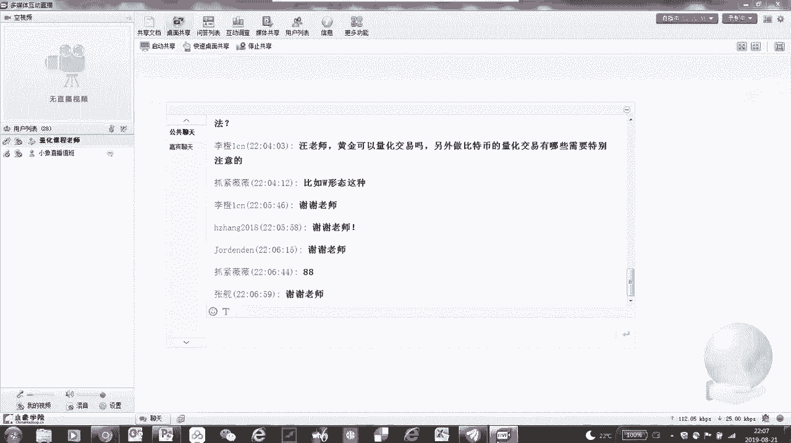