# 清华大学讲师团，量化交易实战，迭代式的量化策略研发 - P2：第二讲_以量化的角度重新认识技术指标 - 反方向的Bug - BV1Bs6MYFERQ

好还有差不多5分钟的时间啊，我看陆陆续续这个大家已经上来了，那么呃在课前啊，这个刚才我在公共聊天区发了一个链接，这个是什么链接呢，是一创聚宽这一个平台啊，一个量化平台，它的一个网址。

那么今天我们课程的内容呢，会用到这样一个平台呃，所以呢如果大家还没有呃这上面的账号啊，我建议大家趁这个课前可以去注册一下，注册一个这个账号，这样的话呢一会儿我们在讲课过程中，你就可以直接通过啊。

课前应该我们给大家啊发了一个代码包，根据这个代码包上的这个相关的内容，可以跟着我一起来操作啊，当然这个如果来不及注册也没事，这个呃课后在复听的时候再重新演练一遍，这个步骤啊也是并不复杂。

而且我们还有这个给了大家说明的文档，可以按照这个文档一步一步来操作啊，所以嗯这是一件事儿，就是来得早的同学啊，可以呃上面去注册一个账号，一创巨宽呢，嗯它是距宽啊，这个平台如果大家听说过啊。

我相信大家做量化，学量化可能都听说过额巨宽这样一个平台，它是一个第三方的呃，这个基于额外部的这样的一个回测验证啊，这个量化交易平台在上节课当中，我们也做了一个简要的介绍啊，那么一创聚宽。

它是巨宽和一创证券啊合作，专门为一创这个证券，这家公司来定制的这么一个平台，那为什么要做定制这件事啊，当然我们这不是在给他做广告啊，嗯目的就是为了说能够符合监管的需求，因为大家知道在15年股灾之后。

股票程序化的接口很多都被禁了啊，这个后门可能很多都被关掉了，那么现在呢嗯你能在第三方啊，通过这个公开的渠道能够进行股票量化交易，那么一创聚宽这一个平台嗯，还是相对还比较好用啊，我们也测试过。

还是相对比较稳定，所以呢我们在教学的时候，我们也是希望给大家呃提供一个学而时习之啊，这样的一个一种手段，一种平台，所以我们就直接啊，我们没有没有使用距宽这样的一个通用版本，我们就直接用的是E创距宽啊。

这样的一个定制版本啊，这样的一个定制化的平台，也就是方便大家，将来如果你真的想做股票的程序化交易，那么直接在这个平台上是可以实现的啊，那么E创巨宽和巨宽本身是大部分都是兼容的。

只是他们在版本的这个版本的更新啊，版本的同步上略有一些差别，这个差别不大啊，一般来讲你不使用一些特殊的功能，可能是注意不到，所以呢我们从教学和实践啊这两个角度来出发，我们给大家在课上就直接使用一创聚宽。

这样一个平台了啊，好呃不管你注册没注册这个账号啊，这个都不要紧，一会呢都可以直接来听课呃，课后呢还是希望大家啊，按照我们这节课给出的代码包，和相应的说明文档，自己去实践一下相应的一些环节。

那么在正式上课之前啊，其实这两天如果大家有过实盘交易，会发现这个今天又出了出了个幺蛾子啊，准确的说应该是上周五出了个幺蛾子，这个特朗普又开始这个用推特啊，这样一个核按钮呃，影响了整个不光是美国股市啊。

应该说全球股市都受它的影响，先是我们回顾一下这个，这个应该算算是一个金融金融战啊，贸易战升级到金融战这样一个大片，如果大家上周听了我的课，关注了我们的这个微信公众号啊，呃风流秘籍。

那么我在周日的这个盘评当中，其实我也做了相应的推演，而且今天呢从A股的盘面上来讲，跟我之前的这个推演也是相对比较吻合的，我们回顾一下周五发生的这件事啊，先是在A股的盘后啊，收盘之后嗯，我们这边啊。

首先针对美国的750亿美元的这个商品，然后加征啊相应的关税，这个发了这么一个消息，发了这个消息以后呢，那么大家看这个美股啊，晚上周五晚上开盘，北京时间周五晚上开盘的时候呢，是微跌啊，没跌多少。

千分之几这样一个跌幅，鲍威尔释放了一些缓和的鸽派，稍微偏鸽派一点的声音，那么这个美股就开始是呃反弹，而且最终还收阳了啊，但是啊这个这个没持续多久，特朗普又开始针对啊，中国加征这个750亿美元。

这个美国的这个商品的关税，特朗普又开始回怼啊，连发了若干条推特，这一发不可收拾了，然后美股就应声大跌啊，包括欧股也也受到连累，全球市场都进入到一种恐慌的氛围当中，收盘的时候，纳斯达克将近跌了3%啊。

其他像标普500，道琼斯也跌跌了2%点多，那么今天早上亚太股市在开盘的时候，大家看关注一下日经，关注一下韩国啊，韩国澳大利亚，新西兰这个亚太，这就是早于A股开盘啊，这几个指数也纷纷大跌啊。

那么A股也果不其然啊，就是我们大家能够周周末啊，如果说仓位重的人可能都比较忐忑啊，我们都可以预料到今天A股肯定也是一个低开，但是低开之后呢，其实A股走的还是比较强的，特别是像创业板啊。

这个跌幅其实并不大，在最后收盘的时候，其实至少有一半的跌幅都已经收回来了，那么我在周日的昨天，也就是昨天我在我的这个评论当中，我也说到了，其实特朗普发这个推特啊，他不是针对中国，这次他的这个手法。

他为什么选择在美国股市在交易的过程当中，而不是等到美国股市收盘以后再发推，因为他实际上是在这是在做做自我伤害啊，伤害的是他自身，而这种死法死给谁看呢，死给美联储看，他针对的是美联储为了让它降息啊。

要为什么要降息啊，是因为特朗普实际上啊从我的这个分析来说，特朗普就是为了明年的大选，为自己的大选要创造条件，要需要美国这个经济不那么快速衰退，一定要释放非常积极的啊这种信号。

而这个信号关键就在于美联储降息，但是呢这个鲍威尔是这个，我们叫茅房里的石头啊，又臭又硬，它就是不吃特朗普这一套，所以在上一次说这个降息这件事，也并没有说，这是我们说以后就一直降啊，以后说不定还要升啊。

释放了一个偏鹰派的这个信号，结果就导致特朗普不断的发推，来怼这个美联储啊，所以是在这么一个大背景下，那么A股实际上受这种这个贸易战的影响，已经会，应该说我们的免疫能力已经越来越强了啊。

而且我们的工具箱里还有很多的工具，所以大家呢其实也不必太恐慌，那么今天呢开盘基本就是最低价了啊，大家看几个指数都纷纷啊，有一定的这个反弹，那明天大概什么走势呢，我们无法预测啊。

我们做量化也没有办法去预测这件事，不过好像在课前大家要关注一些消息的话，特朗普又开始释放缓和的信号了啊，说不定明天美股直接跳空高开也是有啊，不是美股啊，A股明天这个早上直接跳空高开。

也说不定也是有可能的，但是无论他是跳空低开，跳空高开还是平开啊，其实这些，我们我们打造我们自己的量化交易系统，我们的目的是为了脱离这些这个所谓的这种，消息面的刺激，或者说一些情绪的影响，我们更重。

更侧重的是来打造我们的，量化交易的一个信号系统，我们所有的操作都是基于我们的信号系统，我们的信号给出来我们要做多啊，那我们就做，如果我们的信号给出来是做空，那我们也我们就去做空。

当然我们的信号系统还要配合后面啊，我们在后续的课程当中讲的这个头寸的管理，风险的管理会综合出一个，你的实际交易的一个指令啊，但是量化信号系统本身就是我们交易系统的，一个非常重要的模块。

我在昨天的盘面当中，我也简单介绍了，我们最近这一个月以来的操作啊，我们当然我们有不同类型的策略，那么跟这个趋势相关的这个策略，就是我们做波段的趋势，实际上我们在周五的时候。

已经把我们前期加的全部的杠杆啊，都降下来了啊，到最后周五收盘尾盘的时候，我们不但没有杠杆，我们整个的仓位也降到了五成以下啊，这并不是说我们在交，我们的这个信号系统有多牛啊，并不是说在这里头来来炫耀自己。

但是呢我们的交易确实是按照信号系统给出的，这个信号来进行的，所以在这个意义上来讲啊，嗯只要你有系统，那么遇到这种突发的情况啊，基本上也在你的系统的一些极限的，这个要考察的极端情况范围之内。

你就不会发生慌乱的这种啊，不会出现慌乱，那只要你的这个量化交易体系啊，还在有效的运行着，实际上这时候你就不用过分的担忧啊，至少不会睡不着觉，好这个言归正传啊，那也引出来我们今天给大家介绍的这个主要的。

呃内容，以量化的角度重新来认识技术指标啊，怎么样来打造我们基于技术指标的这种，量化交易的信号系统啊，呃分成这么几个部分啊，首先我们来回顾一下经典的技术指标啊，它的一些基本原理。

以及量化这些技术指标的一些要点，然后呢我们重头戏在于编程啊，我们也是在刚才说的这个一创聚宽这个平台上，编程去量化一个趋势型的技术指标，然后我们不光要简单的去说，只要只只是量化一个技术指标。

我们更重要的是说，如果把这个技术指标用于我们的信号，我们还需要去分析这样一个技术指标，它的怎么去评测它的性能，到底将来要把它作为一个交易信号，那么这个信号给我们带来什么样的一个性能啊。

然后呢我们再来看看说这个根据这些性能啊，这些数据我们再来看一看，我们将来出了这样的信号，我们大概用多长时间啊，我们的持仓的这个周期大概有多长啊，怎么去看待这样一些问题，那么今天的重头戏在于说。

这个怎么去量化一个趋势型的技术指标啊，量化这个技术指标的过程看起来简单，实际上有很多的坑啊，所以今天呢我我的这个侧重点也在于，怎去分享啊，给大家分享一些我们在实现各种技术指标，各种信号系统的时候。

我们所采的很多坑啊，在这里头呢给大家做一个呃回顾一个展示啊，希望大家以后在自己从事这方面工作的时候，尽量少犯错误，少踩坑，这就是今天这个内容啊最重要的意义，那先来看看这个经典的技术指标啊。

我们在我们的布节课里头啊，也有相应的内容，那所以在这呢我就快速的啊带过啊，如果说没有听过我们的初阶课的，再通过我这个简单的介绍，基本上也能把它串联起来，我们常见的一些技术指标啊。

我相信大家只要做过主观交易的啊，或多或少对这些指标都有一定的了解，你比如说均线型的指标ma呀，或者是说指数型的均线EXPMA啊，那么大家经常会听说有一些在股评股评，股评师啊，股评家说这个嗯。

这个遭遇到半年线的这个压力，或者年限的支撑啊，60日均线的支撑啊，突破了这个呃20日均线的这个阻力好，所有这些啊其实没有那么神乎啊，你并不是说一条均线就能起到，压制或者支撑的作用。

但是它是反映了从物理意义上来讲，它就是反映了在一段时间内的啊，这个平均的这个成交的价格，也就是平均成本啊，所以他看起来他有一定压力和支撑的作用，那只是表象啊，它本质上只是反映了平均成本这件事啊。

那还有一类技术指标，像我们啊，包括这节课一会会讲到的MACD，这是指标之王啊，最经典的趋势性指标，那么这些指标呢，他对于描述趋势的这个嗯开启或者转折，确实有一定的意义啊，但是也并不是说有了这个指标啊。

就趋势就一定能够形成，关键还在于我们在逻辑上，我们怎么看待这个事情，嗯因为一会就要重点来讲指标之王MACD，所以呢我在这也就不展开说了啊，另外还有一类指标我们把它叫做摆动型的指标，像经典的KD呀。

这个或者KDJ啊，rs i包括布林布林布林带啊，这些都属于经典的摆动型的指标，那它比较适合去描述震荡类的行情，那么呃或许也有有人把它叫做什么超买啊，超卖呀啊这样的这个有不同的说法啊，有一定的意义。

但是呢我们只说啊这是技术指标，它反映的实际上它的最本质的物理意义，体现在它的公式，它的定义上啊，除了他的这个公式定义之外，他并没有说呃对于行情的说有多强的预测作用，至少从我们啊长期从事这个量化工作。

我们去分析各个指标的这种预测作用的时候啊，简单的这种技术指标，他的预测能力是相对比较有限的，并不像这个黑嘴们啊，股评股评家们说的那么邪乎，但是呢他如果你用好了，确实他还有相应的一些物理意义啊。

另外还有像这个能量型的啊，包括这个持仓量啊，成交量啊等等啊，那么这个也都比较好理解这些技术指标呢，其实你分不分类啊，这个意义也不是特别大，嗯但是呢分类的意义在于什么呢，在于我们在综合使用各种技术指标。

比如说用我们用多个技术指标来构造，我们的信号系统的时候，那我们在选取这些技术指标的时候，尽量不要这个同一个类型里面选太多啊，因为它们所能够包含的信息是有很大的重叠的，那如果你真的想做一些呃。

像一些这个指标的分类器呀，你融合更多个指标啊，然后采用一些机器学习模式识别的方法，来构造一个更强的这种分类器啊，来进行预测的话，那么你可以挑选不同的指标作为你的特征啊。

那这些不同的指标最好来自于不同的类型，不要在一个类型里头啊，一下用十个啊，这个意义就不是特别大，那从量化的视角来看指标呢，首先我们来看啊，哎说到的这个是移动平均线，实际上它反映的啊，从他的公式上来看。

它就是一个NN个B啊，就是N个，你要如果是日线，就是N日N日的这个算术平均，或者说呃指数平均啊，价格的指数平均或者算术平均也可以是收盘价，也可以开开盘价，也可以用最高价，最低价。

或者用我们的这个所谓的均价一，一根K线的均价，你可以是1/4的高开低收入的和啊，四分之一四分之一，然后括号里面是高开低收的，和你采用不同的定义，那么你这个移动均线呃，所表征的所能代表的这个平均成本啊。

那跟你的测算方式可能略有差别，但是物理意义是一样的啊，基本上代表了说过去这个若干天啊，他的这个一个平均的一个交易成本，持仓成本，那么在计算的时候，我们看到啊，我们这是一个价格序列，开盘价，收盘价。

最高价，最低价啊，然后包括还有这个额成交量啊，它也是一个时序列，那前面是一个时间戳啊，在我们的数据库也好啊，在在我们的存储里面，我们就是用这样的一个数据结构来进行，这个相应的存储，那么在计算的时候。

我们通常啊，一般意义上的这个风险就是用收盘价，所以说就是一个N日收盘价的一个平均值，算术平均也好，指数平均也好啊，那么在这表示起来啊，实际上就是这样一个图啊，我也不展开讲了啊，这个公式很简单啊。

是用了一个10日均线，那就是十天的一个算术平均啊，然后来滑动，你这个窗口是每次错后错后一个单元，然后往后去这个滑动，所以这样的计算的话，第11天计算的是啊，这个第十天计算的是1~10天。

那么第11天计算的是第二天到第11天啊，就是以此类推，逐渐的去滑动这样的一个窗口，所以在编程的时候啊，我们只需要像上一页，我们用一种比较好的方式来进行一个，数据结构的一个存储，那么在计算的时候。

我们只需要很简单的去计算，对实现这么一个算术平均的一个公式就OK了啊，然后我们再用循环，就用其他的一些方法来进行，一个窗口的一个滑动啊，这样每滑动一格，就计算了一个值钱的一个平均平均价格。

那么具体怎么来编写这些技术指标呢，我们可以通过不同的语言啊，我我在上节课给大家也介绍呃，一般来讲我们倾向于啊，这对于呃你的执行性能啊，执行的性能要求不是特别高的，这种交易交易系统。

比如说我们是做的这个分钟级，小时级甚至是日线级别的这种运算，那么用Python甚至有人用MATLAB，用R啊，用VBA甚至用excel来编程都可以，那么Python现在是相对最主流的啊。

因为使用起来比较灵活，还有大量的第三方库能够帮助我们去记，做一些输数值的运算啊，那对于一些这个运行效率啊，包括性能要求比较高的，那我们可能会用到C啊，C加加这样的语言啊，特别是他们做高频的。

另外呢在不同的这个交易软件啊，第三方的这种工具，它可能有自己的定义的一些公式语言，你像东通达信啊，东方财富啊，文化财经啊，金字塔啊，都有自己定义的公式语言，然后还有一类像这个。

我上节课也给大家介绍了MARICHARLES啊，包括trade blazer啊，这个就是呃包括这个to share，他们都是有自己的啊，这个专专门定义的这种语言啊，而这个语言比呃刚才说的这个公式语言啊。

呃应该说功能上更强大一些啊，用什么都可以啊，只要你自己熟悉啊，而且适合你，你认为适合你就就就可以啊，没有什么高低贵贱之分，那么我们以MACD啊，简单的说MACD这样一个指标怎么去计算。

我们看一看在不同的工具，不同的平台上是怎么实现的，像通达信啊，东方财富同花顺金字塔文化财经，他们自己就是他们的一种自定义的公式语言，首先我计算这个地址啊，DF这个值就是图上这条白线啊。

这条白线我是用一个短期的短周期的啊，这个short啊通常在这啊，我看是十二十二，short等于12啊，这个值这是一个参数，那么用12个K线的，12根K线的收盘价的一个指数滑动平均啊。

EMA然后减去这个浪浪，在这个里头表示啊这个26啊，在这里头这个参数是26，减去这个long啊，26个周期的啊，26跟BR的收盘价的指数化的平均，这就是D而DA呢DA，我们是，地府的一个指数滑动平均。

而这个参数用的是个mid，mid是多少，是九啊，在这里头就是九通常的十二二十六九啊，就是这样的一组参数，MACD在这定义的MACD就是这个红绿柱子啊，红绿柱就是DF和DA的差乘以22啊。

两倍的DF和DEA的差，然后这有个class stick，这是实际上是一个显示啊，如果这个差值是正的，那么在这画出来就是红色的啊，零轴之上的这个红柱子，如果是负的，画的就是零轴之下这个绿柱子。

所以三行代码就解决了啊，定义的DFDA和MCD，有人问这为什么要乘二，这就是为了这个红绿柱子的高度，和我们看到的这个白线黄线啊，地图和DA的这这两条线这个比例适中啊，看起来肉眼看着比较舒服。

你要是觉得这红绿柱子还不够高，你乘个三乘个四也啊，也没人拦着你啊，你要觉得说这个这柱子画太高了，那我不乘以二啊，直接用DF减DA也没关系啊，这个纯属就是为了显示而用，对于我们实际实现指标啊。

这个乘不乘二意义不是特别大啊，好那如果用Python怎么来写呢，用Python啊，在这儿大家会看到这个我们这还用了一个pd啊，pandas pandas as这个库。

pandas as这个库有什么好处呢，就是它有很多这种数值计算的一些这个方法，这些函数我们都不需要自己去写了，你比如像这个EEWM这样的这样，这个指数滑动平均啊。

类似这样这个EWM里头这有个mean的方法啊，求求平均啊，实际上它是一个指数平均，那么光看这个语言上来讲，calculate的MACD啊，这个作为一个函数，它的这个有四个参数，一个是收盘价这个序列。

然后就是long short和NE啊，这个十二十六九这三个三个参数值，然后DISS看我们就用这个clothes啊，后面跟着这个EWM，这是求EWM点M，这个实际上就是求一个指数滑动平均。

就跟刚才公式里这e ma h是一个一个意思，然后span等于shot，就相当于就是我有多大的跨度啊，这个span等于浪，那也是这个分别是short和long这个不同的跨度。

DA同样的是这个DF的这个指数滑动平均，然后MACD等于DF减DA乘以二，然后再把这三个值啊，def dea和macd return回去，这就是我们用Python啊写的这样一段代码。

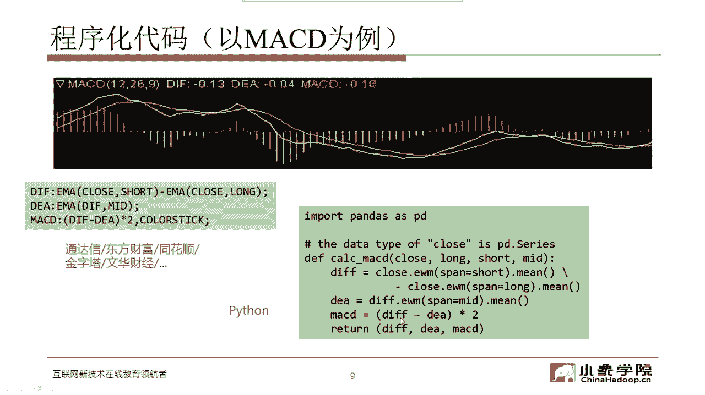

那么market charts啊，嗯因为为什么要再介绍两个，因为MC和tb在我们后续的课程当中也都会用到，所以在大家来看一看，他们的这个编程的这个风格啊，这个语言的风格MCD，Vr0。

这是定义的第一个变量啊，VR0是MACD啊，它是close，然后fast line和slow line啊，这两这三个参数，然后呢WARE啊，这个Y1这是变量一啊，这是x average。

这也是一个它mage chart，定义的内部的一个函数啊，一个函数它是V20的，以macd length啊这样的一个宽度来取一个平均啊，然后VR2这个对应的相当于是MACD啊，是0-1啊。

变量零减减减掉变量一，变量零是什么，变量零相当于是D变量一相当于就是DEA啊，大家可以去找这样一个对应关系，tb tb是这个别看代码长啊，但实际上也非常容易去读tb，其实我是比较喜欢这种编程风格。

它类似于C啊，这一下暴露了年龄啊，经常写C或者C加加的，这个基本都40开外的人了，tb首先声明一下，声明一些参数，Fast length，Slow，length啊。

macd length分别是十二二十六和九，然后再定义变量，这个这是一个数值序列型的变量，叫m AC d value啊，然后同时还定义两个数值型的变量，一个是MACD，一个是D啊，Mc d d f。

那么macd value呢它等于什么呢，它相当于的就是这个这个我们实际计算的这个，DF值啊，这这个这这段代码啊，呃大家会看起来会有有点绕啊，就跟前面的这个变量名的定义有点不太一样。

这里的m AC d value，实际上是我们前面说的DF啊，DIF这个值，而average macd这个相当于DEA，而这个这里头MACDDF，这个相当于就是我们之前的MAC地址，就是DF减掉DA啊。

然后这个plot numeric，这是什么呢，这是把刚才这个mc d value这样的一个序列变量啊，把它打印出来，把这个数值给打印出来，就变成一条线啊，这个呢是把这个D和DA也打印出来啊。

这个MAD average，然后在这呢画的是这个红绿柱啊，你看用红色的来画，然后如果说这个小于零啊，小于零就是用绿色的柱子来画啊，再画一条零线零轴，所以呢这大家看这个这个代码，好像比前面都长哈。

但是没关系，读起来其实是很好读的啊，在begin和end中间，这是真正的你的函数体要执行的这个部分，嗯不管怎么样啊，其实这个不管是公式语言还是Python啊，还是这个我们在不同的工具里。

他们自己定义的这些语言实现都是同一件事啊，大家课后如果有有兴趣的话，好好对照一下这四段代码，虽然完成的是同一件事啊，但是他们的描述的方式不太一样，当然了我们除了知道这个指标的表面现象啊。

公式是怎么定义的，我们最好在使用指标的时候，我们能够深刻地去理解它背后所对应的，物理含义啊，那么MACD到底是什么样的一个物理含义呢，这个一会我们再再说啊，我们先来看看几个其他的经典的这个技术指标。

你像KD这是一个随机指数啊，他的公式就在这了，KD我们我相信有很多人在用啊，从公式上看，定义非常简单，首先分母是什么，分母是过去N个bar里头的，最高价和最低价的差值，分子呢分子是当前的这个收盘价。

当前这根半的收盘价和最近N个瓣儿构成的，这个窗口内的最低价的一个差值，然后呢再乘以一个100，这就是K啊，这个K表示什么意思呢，K表示啊就是如果当前的收盘价，我们可以想象一下，如果当前的收盘价。

就是在N个半这个区间内的最高价，那就意味着这个分子和分母是相等的，那这样两个一除就是一再乘以100就是100，这K这时候是最大值，表示什么，表示当前这根棒的收盘价，就是最近N个半当中的最高价。

那就意味着唉，这个时候确实摆到了一个什么位置，摆到了一个非常强势的位置，这就是所谓的我们说的到了一个超买区啊，所谓的overboard非常高，K值已经很高了，那D呢D就是K这个值。

用大N这个窗口内的一个算术平均啊，说白了就是把K在K这个值在做了一个算术，平均做了一个滤波，做了一个低通的滤波，那么这个时候呢，我们就知道这个K相当于是一个快速的指标，D相当于一个相对慢速的指标。

那么这里头快速和慢速指标，它们之间就会有交叉对吧，这就变成了K会不断的上穿或下穿D啊，当然我们也会给这个上穿下穿，给给赋予不同的这种含义，有的时候我们认为K上传D这表示什么呢，表示这个势头开始走强了。

而K下传递表示这个势头开始转折，然后走向衰落，当然最好还是在超卖区，所谓的这个K和D都比较高啊，可能我们认为80以上算超卖区，在超卖区，如果K下穿了D，我们认为这可能是一个转空的一种增长啊，那同样道理。

在超买区啊，在超卖区啊，刚才说的超买区啊，80以上超买区在超卖区20以下啊，有时候我们定义20以下，那么同时又发生了K上传递，这表示什么，表示有可能哎这个向上的这个趋势啊，开始显露出一些挣扎啊。

所以呢大多数时间他可能在超买超卖之间啊，这个中间的这个区域28时之内在在做震荡，那这个时候有可能他没有什么特殊的含义啊，嗯我们往往在我们的信号系统里头，可能更加关注超卖区的K上，穿D的这种金叉信号。

以及在超满区K下传递这种死叉信号，当然也不是每次都准啊，但是呢从这个物理意义上我们就可以知道，K越大，就表示说这个当前啊，这个当前这根棒所所处的这个位置，位于过去N个BR当中啊，相对比较高的一个位置。

反过来就是K要是非常小，接近于零，那就是位于一个相对比较低的位置，所以也没有什么能太太神秘的东西，一看公式，我们就知道这个指标，它到底定义的是一件什么事，那为什么价格连涨指标在高位会钝化呢。

这个大家可以想一想啊，一会课间的时候可以在公共区留言啊，我们来讨论一下这四道题，就是为什么虽然价格连续的上涨，但是指标啊KD这个指标在高位会钝化啊，好同样啊，二赛也是我认为是一个非常经典的指标。

我们在系统当中也经常用到这个指标，英文名字很拽呀，Relative strength index，相对强弱指数实际上也非常简单，看一看公式就知道了，分子当前这根半的收盘价，减掉上一根半的收盘价。

如果它小于零，我们就把它当成零，如果它大于零，就用它本身这个值，然后在过去N个瓣里头，我们把这个值累计起来，分子呢那分母close减掉last clothes啊，取一个绝对值，然后把它累积起来。

然后再乘以一个100，那我们可以想象一下，什么时候RSI会等于100呢，就是说在分子所有的clothes减，less clothes都大于等于零的情况下，这个RSI就就可以取到最大值啊。

那最好是都大于零啊，那么这样的话这个分子分母就相等了，那么出来的话RSI就100，这代表什么呢，代表在过去N个半当中，每一个瓣儿都是一根阳线，也就是说，每一个伴儿都比上一个瓣儿的收盘价要高啊。

每一个瓣的收盘价都比上一个收盘半的，收盘价要高，也就是连续上涨的情况，R赛就会等于100啊，那么反过来什么时候它等于零呢，那就是连跌的情况对吧，连续下跌，每一个。

每一根瓣儿的收盘价都比上一根半的收盘价低，那么分子就是零了啊，所以说看起来很神秘的一个指标啊，这个学名这么拽的一个指标，实际上它的物理意义就是这样，就是看连续上涨还是连续下跌啊。

就是或者说在过去的一个N个bar的，一个一个考察的区间内，到底上涨的这个瓣儿的数量，和下下跌的瓣的数量，或者说他们的幅度的累积哪个更大啊，如果是涨的多跌的少，那么这个事这个值就会更接近100。

如果是跌的多涨的少，那么这个值就会更接近于零，同样道理，RSI在使用当中啊，如果我们把它转换成一个信号系统，我们不可能直接用RSI这个一个数值，去简单的判别说我们是该呃发出买入信号，还是发出卖出信号啊。

但是有的时候我们会划定同样啊，这个超买区和超卖区，超买和超卖，当然最简单的就是说我们只是判断rs，比如说它大于80或者大于70，我们认为超买了，如果它小于30或者小于20，我就认为超卖。

但这个判断是相对比较武断啊，相对比较武断，那有的时候我们为了说不会反复的发出信号啊，我们只是在某一个特定的时间点上要发出信号，那有的时候我们会怎么用呢，我们会在超买区啊，RSI进入超超买区之后。

又回到这个中间这个区间，也就是说阿塞尔在下穿超买区啊，这个边界的时候，我们会发出一个比如说卖出信号啊，而RSI在已经进入到超卖区，然后在上穿这个超卖区的边沿啊，就比如说图中这个。

我鼠标画的这个点的位置的时候，有可能我们会发出一个买入信号啊，对应的这个图大家可以看啊，在这个位置，而在下穿超买区边沿，这个时候我们做空啊，对应的这个点确实这个价格是往下跌了，而在这当位于超卖区。

同时上穿超卖区边沿，那在这个点我们发出一个做多的信号，让大家看确实价格沿着这个去往上嗯，类似这样的哎，观察起来貌似啊有一定的道理啊，好像在这个图里的，还比较符合这个啊这样的一个观察到的现象。

但也不是每次都零啊，RSI本身就表示的就是在过去一段时间里，这个涨幅的累积大还是跌幅的累积大，但是嗯没有啊，没有说这个嗯永远都管用的技术指标啊，或者说单纯用某一个技术指标来构造的，信号系统，不见得啊。

什么时候都有都有效果，它只在某些特定的行情内，特特定的这种情况下，让你会觉得它比较有效啊，那这个问题我们回头再再来讨论啊，只是给大家灌输这么一个思想好，接下来也是针对阿赛的一个思考题啊。

凡尔赛是怎么体现走势强弱的，其实刚才我在给大家分析这个公式的时候，我已经说了啊，大家回顾一下RSI是怎么体现走势的强弱的，好说完这两个定点技术指标啊，我给大家呃基本上也举了些例子，那我们再来看啊。

当技术指标我们把它不管是K还是D还是RSI，它都是某一种数值序列啊，我们计算出来这些指标，它对应的都是一种数值序列，而这些数值序列，我们需要把它形成真正可以使用的信号，在这时候。

我们通常会用一些什么样的方法来形成信号呢，比如说突破，比如说交叉，比如说背离啊，突破和交叉，刚才都举了这个例子，比如说这个从正常区间到了超买区间，或者从超买区间回到正常区间，这都属于一种突破。

而交叉呢比如说K上穿D或者K下穿D啊，金叉死叉，这些都属于交叉类的信号，那么背离啊，这个一会我们就会给大家去讲，这个MACD的背离啊，以它作为例子，背离相对检测起来这个要稍微复杂一点啊。

特别是如果是我们程序自动去实现，要实现背离信号的检测确实要费不少劲啊，看起来肉眼看起来挺简单的，背离程序在做起来的时候啊，会有很多的坑啊，这个一会儿我们会详细来举例子，那么有了这个信号，我们怎么去用呢。

一般来讲，我们的信信号的使用也分成这么几种方式，我们可以发出预警啊，信号不是说出了就一定要有动作啊，不是说出了这个做多信号就一定非得买，除了做空信号就一定要慢，不是这个意思，但他有可能给你发出预警。

因为信号有可能，如果你将来做的复杂信号，除了方向还有强弱啊，也许你在当信号强度达到某一个等级的时候，你才真正触发你的动作信号，也可以去确认一些事情啊，确认某种趋势或者确认某一种行情。

当然信号我们也寄希望于，它能起到一定的预测的效果啊，但是这这件事其实实现起来挺难的，很多时候从严格的统计上来讲，大概是都是五十五十啊，金叉无论是金叉还是死叉啊，后面这个上涨和下跌的概率。

也可能都是五十五十啊，或者非常接近，这个也是取决于你信号在不同阶段，触发的这个信号嗯，它的统计性能也是不一样的，不能一概而论，信号还可以起到决策的作用啊，我到底后后面我是采用趋势跟随的策略。

还是采用这个震荡的啊，高抛低吸进准回复这样的策略，这个信号有的时候可以给你一些决策的参考，当然了，我们最希望的就是一个信号系统，最终把它落实到具体的动作，是买还是卖还是观望啊。

这个呢当你信号有明确的方向，并包括它的强度达到你的预期，那有可能就直接触发相应的动作，买入还是卖出啊，当然这个买多少卖多少，那是另另外一个非常非常有价值，也是相对比较复杂的一个问题啊。

这个我们留到后续的课程再来讨论，所以说了价格的突破，价格是可以突破啊，比如说突破某个均线这个事大家比较理解，比较容易理解哈，指标也可以突破，像我们刚才举的这个例子，超买区超卖区啊。

这个指标RSI是这个进入到超买区，进入到超卖区，然后再上穿，还是进入到超买区，然后再下穿，或者说有有其他的一种使用方式，总之指标指标的突破，肉眼也是比较容易判断，写写出来的程序呢相对也比较简单啊。

在这我就不啰嗦了，那么都差都差，我们最常用的什么交叉呢，就是均线的交叉，10日均线上穿20日均线，或者10日均线下穿20日均线，或者5日均线上穿二三十日均线，5日均线下穿30日均线。

均线的交叉作为趋势型策略的信号系统，其实有些时候嗯还是比较比较有用的啊，至少从我的经验上来讲，别看均线交叉非常简单，这样的型号，但是确实还是有一定作用的，对于你抓住一些大级别的趋势是有用的。

但是呢均线的交叉最害怕什么，最害怕震荡的行情会反复交叉，反复打脸啊，经常的是不断的止损啊，在再进场再止损啊，这样的话，所以说简单使用均线，会遇到，刚才我说的这样的震荡行情下的一些问题，那么怎么去规避。

让它需要设计更复杂的一些，这个过滤的一些条件啊，或者一些这个额仓位管理啊，风险管理的一些一些一些框架，除了均线的交叉啊，刚才我们也说到了，像指标也可以交叉，你比如说KD啊。

KD的指标他就可以用交叉我们来使用，也可以有啊，像MCDDF和DEA之间本身也有交叉啊，那么这个也可以把它定义成新叉死叉，其实本质上交叉是什么，交叉就是一个快速的均线和一个慢速的均线之。

间的这样的一个交叉啊，它们是必然会有交叉的，只不过这些交叉不一定，都能成为我们进行操作的信号，这里头可能交叉里头会有大量的噪声好，那么作为今天呃一会要讲的重点的内容背离啊。

背离这件事呢它是属于在指标系统当中啊，最后要检测的比较复杂的信号啊，基于技术指标的比较复杂的信号，你比如说我们经常会说，额啊这个是一个RSI的背离啊，我们一会还要介绍MACD的背离。

RSI背离呢它这里定义的就是rs的这个值啊，指标的值和我们的价格序列之间，本身它是有一个一一对应的关系，那如果，价格创了新高，像这个上面这条线啊，我鼠标现在在滑动的这这个位置。

这条黑线它叫higher high啊，更高的更高价，也就是价格创了新高，但是我们观察RSI这个值RSI并没有创新高，所以这就是一种什么，这这种叫做顶背离，这英文比较有意思啊。

叫brish divergence，divergence是背离啊，berry是什么，是bear bear是熊啊，也就是说他通常会认为出现了顶背离，后面迎来下跌趋势的概率会比较高。

也迎迎来熊市的这个概率会比较高，所以它把它叫做brish divergence，同样的lower low啊，价格序列价格创了新低，但是呢指标并没有创新低啊，而赛并没有创新低，所以这也是一种背离。

这个叫什么叫BLISH，Wow，是公牛啊，牛的意思，也就是说通常我们会认为出现了底背离，那么后续走出牛市的啊，这个也就上涨趋势的这种这种概率会增加，所以把它叫做这个BOLISH啊。

Bolish divergence，一会我们再解释，我们给大家写的这个参考代码的时候啊，我们没有用英文这个词啊，BARRISH和BLISH容易搞混啊，因为大家这个呃。

虽然说我们现在普遍的英文水平都提高了啊，但是用这种相对太专业的这种术语，还是大家可能容易搞混，所以我们就来了个直译啊，在我们写代码的时候，我们把这个底背离。

我们叫做这个bottom divergence，而和顶背离呢，我们把它叫做top代表整啊，top和BOTTO，这样的话这个比较ENGLISH啊，但是呢容易记啊，不不太容易搞混。

否则的话呢你应用于一个这个BARRISH和BOOLISH，你经常可能如果没有这张图作为参考，经常可能会搞混啊，所以这在这里给大家一个keep，一会我们讲到代码的时候，还会再强调这件事，所以大家可以看啊。

如果我们用肉眼去观察顶背离和底背离，可能不是一件太难的事啊，当然也是需要稍微花点功夫，如果这么一个序列的这样的一个相对的关系，怎么去写成程序来自动的运行啊，去检测这件事。

这是我们这节课要解决的一个重点问题啊，我相信大家可能也还是比较关心，因为这个一旦你用程序化自动的去检测到，这类似的这种背离现象，那么这就意味着说，你的这个信号系统已经往前走了一步。

你你确实可以通过这些背离来进行回测验证，看看用背离信号来进行这个买卖，是不是能够起到相应的，这个这个比较好的效果啊，至少能够省掉不少的人力是吧，不用说每一次都是肉眼这个使劲去盯着他看了。

我们也讲过这个程序化最好的，最大的一个优势就是它的宽度，你用肉眼你去检测背离，你顶多也就盯那么几十只股票，你了不得了啊，盯几十个品种，但是你一旦把它写成程序，那无论在什么样的一个时间周期，是一分钟级别。

5分钟级别还是小时级别，还是日线级别，无论是多少只股票啊，直接通过程序就直接扫描了啊，所以这件事一旦做起来还是挺有意义的，那我们看看啊，背离信号检测，我们给大家一段示例的代码，这个示例代码检测的是。

但这是基于，嗯基于什么信号呢，嗯这个并没有强制说他是什么信号啊，用什么信号都可以，你比如说你是用什么指标都可以，它本质上它检测的就是一个price，price是什么呢，price是说这个价格序列啊。

这是价格的序列，所以我们看这个top dawar值DA过值啊，这是顶背离，顶背离我们检测的是什么，就是价格序列创了新高啊，价格系列创了新高，而这个指标序列并没有创新高对吧。

所以在这额顶背离的一个判断的条件，当当你把这些值取到了以后，你会发现啊，在这就是这个bar bars last prices啊，这个shift1就是相当于是前一个bar啊。

或者说就前前一个这个锚点位置的啊，这个价格和当前这个价格相比啊，前一个价格第一，当前的这个价格高，也就是价格创了新高啊，Hier high，所以在这样的一个条件下，我们就认为这是一次顶背离发生啊。

所以这个这是只是一段参考代码啊，在这里头，你也可以是RSI，还可以是其他的，但这段代码本身啊，一会我们就会看到看起来完美无缺啊，这个逻辑关系非常正确，但是在实际当中这是很有问题的啊，为什么会有问题。

一会我们拿MACD来举例，大家就能看明白了，那么对于刚才我们也说到指标的这个使用啊，它可以是预警，也可以去确认，因为通常来讲，这既然我们是根据技术指标来出的信号。

那么技术指标它往往啊大家也看到那个公式了，往往它就是一个滤波器啊，而且是个低通的滤波器，它要采用N个瓣的这个前N个瓣的值，才能计算出当前这个技术指标的具体的数值，而根据当前这个技术指标的具体数值。

以及它跟之前的技术指标，或者价格的相应的关系，我们才能去找到这种突破呀或者交叉呀，或者背离的这样的信号，所以呢他一定是滞后的啊，他是有延迟的，如果你想让延迟缩短，那你就要要减少或者说降低啊。

你的这个滤波器的宽度啊，比如从十个瓣变成五个瓣甚至三个半，但是这样一来，可能你的假突破或者假的交叉啊，这种噪声就会就会比较多，就说你你用你的及时性啊，嗯你换来了及时性，但是你牺牲了他的相应的稳定性。

但这是一对矛盾啊，你要用更多的这个价格序列，更多的瓣儿来计算，那么意味着你的延迟就会更大啊，所以到底是更及时好还是更准确好，这个事儿我们不好判断啊，根据你的应用场景来确定，那你要是既然有了这个延迟啊。

我们就会知道说，实际上我们的预警有可能已经滞后了啊，或者说我们的确认有可能已经滞后了，所以在这个时候，你一个相对有一定延迟或者滞后的这种信号，还能不能让你这个交易系统，达到你设计的时候的那样的一个性能。

这个东西我们就需要去验证，需要去这个回测，所以在这里头啊，就是这几个几张图让大家回去看一下，这个都表示的是说我们在这种延迟下，我们怎么去做相应的这样的一个呃，预警或者确认或者决策。

嗯除了技术面的这些技术指标啊，实际上我们有的时候还会关注一些基本面，或者资金面啊，这些这个不同的这种增长，不同的数据，用它们来综合出一些更复杂的教育信号啊，当然了，像基本面这个这些数据。

因为它的变化相对比较慢啊，所以他在盘中，通常不会作为我们触发信号的主要依据，它更多的基本面可能作用在我们的，比如说股票策略当中的选股上啊，因为它的变化相对比较慢，所以呢它对于我们股票持定期调整。

可能会起到比较大的作用，但是对于盘中实时的这种技术指标，来触发的技术信号，它可能作用不是特别大，资金不一样，资金我们可以，这个这个实时性相对还是比较强的，特别是大家如果最近如果你盘中啊。

你做一些日内交易，你可能会盯一盯向沪股通或者深股通，这种北向资金，他们的流入流出情况，因为这是实时数据，有的时候我们大盘的这个指数啊，指数的涨跌，有的时候确实和沪股通，深股通的流入流出。

他有很强的相关性，这个大家明天啊，如果你有时间盘中不妨肉眼去观察一下，看看是不是我说的这个样子，然后还有一些嗯我们叫做alternative native data啊，就是现在也比较流行的做量化的。

基于人工智能的一些一些这个算法，一些模型，它是看什么呢，看一些这个市场上的一些消息，一些公告事件新闻啊，用它来来这个判定市场的这种情绪，当然了，我相信肯定现在已经有团队开始，把这个特朗普的推特。

也作为他们的一些输入的数据的这个来源了啊，你在推特一出来，当然第一时间其实市场就已经有反应了，你至于你做不做这个，把它做不做成信号意义本身也不大啊，因为人人为的也能判断出来。

但如果类似特朗普这样的推特比较多，人可能不能实时的做出反应，那么用机器把它形成一些信号系统，也是可以做的啊，至于效果我们现在很难评价，因为毕竟这个属于一个相对比较新的，事件驱动型的这种这种策略的尝试啊。

而且公开的业绩现在也很难看到，但是毕竟啊就是作为教学，我们也会提他一下，因为也许那这个听课的同学当中，对于这方面的这个研究啊，比我们还要更更深入，那么后面呢，如果你掌握了相应的一些技术方方法。

可能也可以把这种基于事件驱动的啊，市场情绪的这些判别作为你的信号系统，基本面指标就不多说了啊，这个其实很难把它做成实时的信号，那么大家可以去看一看，这个就是怎么把它用到选股上吧。

嗯因子的这种计算我们在下一节课啊，多因子的这个模型我们会给大家介绍资金流向，除非这个超大单大单中单小单啊，可以把它看成是主力资金啊，一般来讲我们会定义超大单和大单，我们把它定义成主力资金啊。

那么这个呢在不同的额数据源当中，一般都包含这类的信息，包括我说的互补通，深股通啊，嗯这个对于一些嗯实时的交易信号来说，还是还是比较有意义的，呃我们也做过一些长期的监测啊，相关性还是比较强的。

有一定的预测能力，或者说至少有嗯，反映了一定的这个市场的这个特别是指数的啊，指数的这种行情，那么大家呢也可以后续啊，多关注一些资金流向的指标，那么对于整个的这些技术指标啊，我们怎么去使用。

就是技术指标把它变成信号系统，我们怎么去用，在这里总结八个字叫做客观看待理性应用，因为刚才也说了，这些所谓的技术指标，都是大多数都是用公式来定义的啊，基本上就是一个低通滤波器。

所以它是间接的带有一定的滞后性，甚至在某些情况下它就会钝化，然后有有的时候他会有连续的背离现象啊，像MCD比较典型啊，一个顶背离接接一个顶背离或者一个底背离，接一个底背离，在牛市当中是不断的顶背离。

接着顶背离啊，你每次都想做空，结果他就还没等你这个获利就已经啊，被又被拉上去了，熊市当中是一个底背离，接一个底背离，每次觉得底背离啊出现了，要这个行情应该反转了，应该应该上涨了，结果它又往下跌啊。

所以说这些东西要客观去看待它，没有说一定的东西，不是说一出现底背离就一定涨，不是说出现了顶背离就一定低啊，然后它跟你考察的时间周期有关系，你在什么级别下去看，分中级还是小十级还是更大的尺度啊。

这些他的这个统计性能也都不一样，不同的股票不同的标的物啊，他们对于这种技术类信号的这种反应啊，或者说这种统计规律也不完全一样，所以呢我们建议大家来综合判断啊，不要简单的靠单一的指标来解决问题，不太现实。

可以采用不同的方面去交叉验证啊，而且嗯最好只把这些信号系统，作为你的一种辅助决策的依据，而不一定所有的信号都能够直接驱动你的交易，在这里呢更重要的是提倡一种概率的思维，这个一会我们也会去啊。

让大家来评估啊，你所这个嗯开发的啊，这个交易信号的时候，我们要用一种概率的思维去评估啊，因为行情是多变的，我们是不可以预测市场，没有人能长期有效的预测市场，我们靠的都是我们的既定的交易的预案。

或者说我们的量化交易策略，本身就是一个预案啊，呃科学的系统化执行的这么一个过程，所以呢我们更看重的是概率啊，我们是靠这个胜率或者赔率，或者他们形成了一个综合的一个，期望收益的这种水平，靠大数定律去赚钱。

所以在一个交易信号被开发出来之后，一定要通过啊，这个嗯历史数据的这种回测验证来看，它在统计意义上到底是不是有效，好那么在休息之前我们开一个小头啊，我们来编写程序，量化一个趋势型的技术指标。

我们量化的是什么呢，是MACD啊，所谓的指标之王，在这里头我们量化三种信号啊，金叉死叉还有背离啊，实际上是两种啊，所以交叉和背离两种信号，金叉死叉，顶背离，底背离，那么MCD是什么，这个我就不说了啊。

刚才我们已经介绍过了啊，在这个东方财富公式编辑器里头就三行代码，就把这个指标就给写出来了。

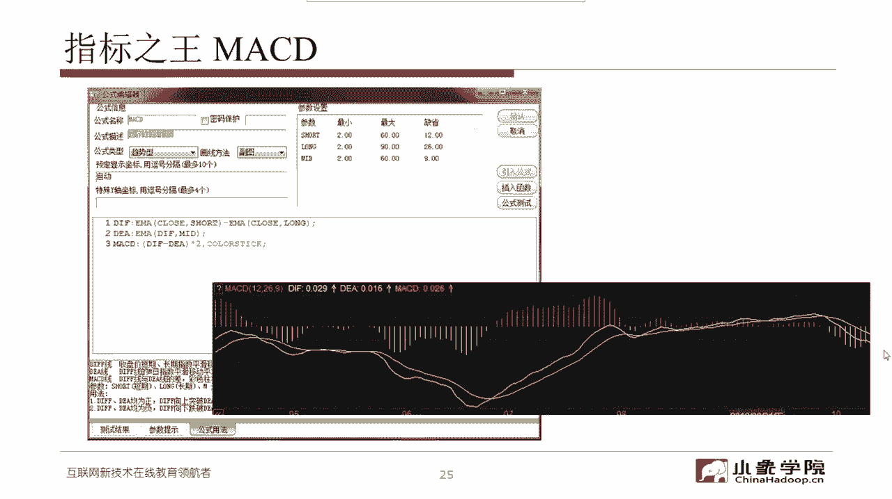

那么金差什么叫金叉，在这我们看到这个位置啊，白线上穿黄线，这个是DF上穿DEA，我们把它定义成金叉，这白线下穿黄线D是下穿DEA，我们就认为是死叉啊，交叉信号是相对还是比较容易的啊，肉眼比较容易看。

这个程序实现起来也不是太复杂啊，坑不是特别多啊，也有坑，但是不是太多，背离背离，刚刚我们说了，价格创了新低啊，lower low啊出来了，但是呢指标没有创新低，这个时候我们通常用什么指标。

我们用DF的极值点啊，白线的这个极值点，也就是对应到这个价格的相应的白线的极值点，D幅值的地府，这条线的极值点地府没有创新低，但是价格创新低，这是一次底背离啊，反过来这有没有顶背离呢。

啊这张图上好像不是太太太明显啊，顶背离嗯，没关系，我们可以换别的图啊，总之呢我们在这检测的就是交叉和背离，我们要用代码来实现这样的一个功能。

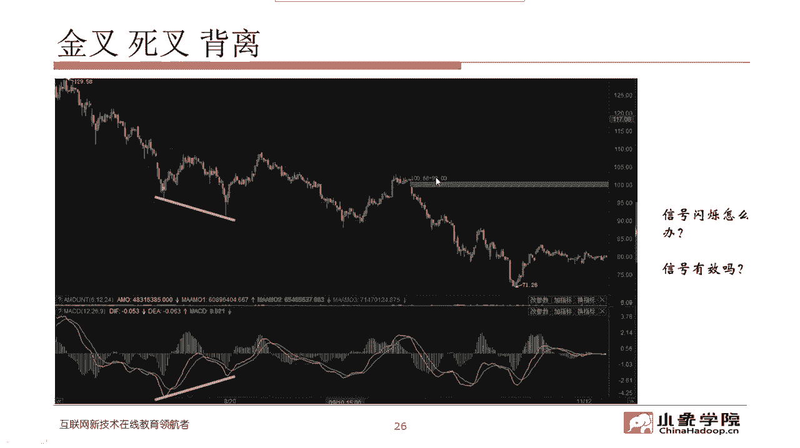

你在休息之前啊，这个我们看一下我们的步骤，大家应该已经拿到了我们的一个代码包啊，其中有一个文件叫做PL和PL下划线，MACD下划线，Example，点PY啊，这是一个Python的文件。

那么我们打开一创聚宽这样一个平台，就给大家简单演示一下，打开预创剧川这个平台啊，你要用你的账号登录进去，然后这时候你可以进入到一个策略列表，然后你点新建策略。

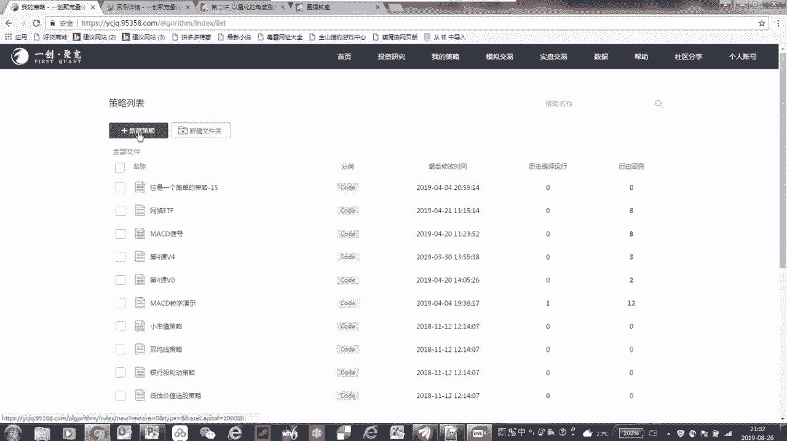

新建策略以后，你会发现啊，这有一个左边这一块，这是我们的一个策略编辑器啊，策略编辑器，那么你把这个编辑器里头它的缺省的这些代码，直接把它选中，把它删除，然后呢我们给到了大家一个代码包。

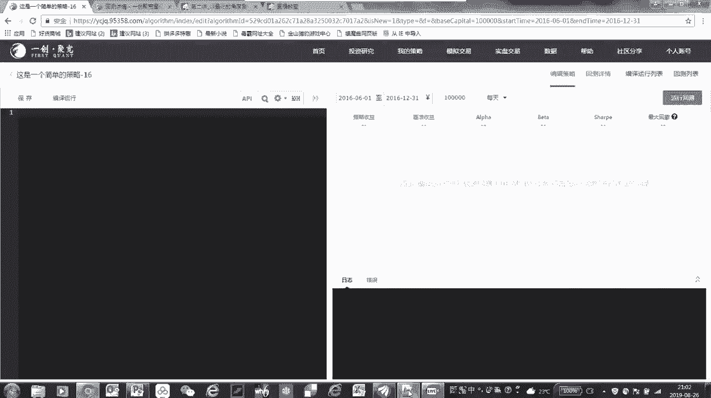

其中包含了一个叫做PL下划线，MACD下划线，Example，点PY这个文件，这个Python文件你可以用任何一个呃，文本编辑器把它打开，比如说在在我这，我用的是一个notepad notepad加加。

然后呢你把这些代码全部copy，全部copy啊。

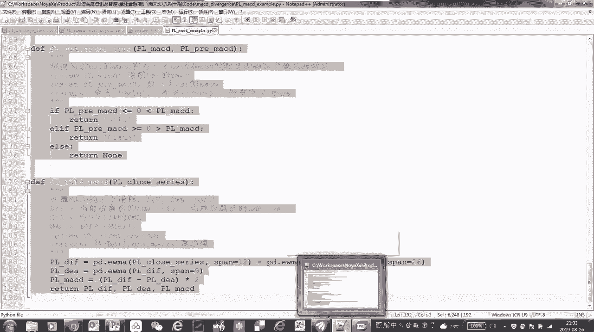

copy下来，然后把它拷贝到你刚才在一创聚宽，这个平台的代码编辑器啊，把它粘贴过来啊，这样就行了，完成这一步，你就马上就可以直接点编译运行啊，这个就可以做了嗯，那么。

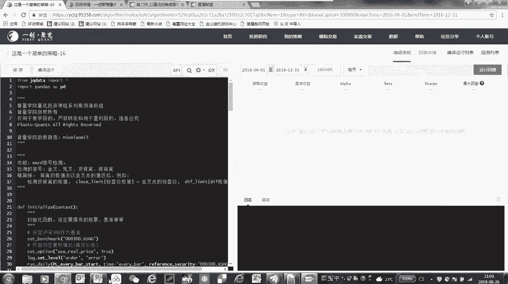

呃大家还先不要着急啊。

你要是一定要去编译运行的话，在这有一有一个需要设置的。

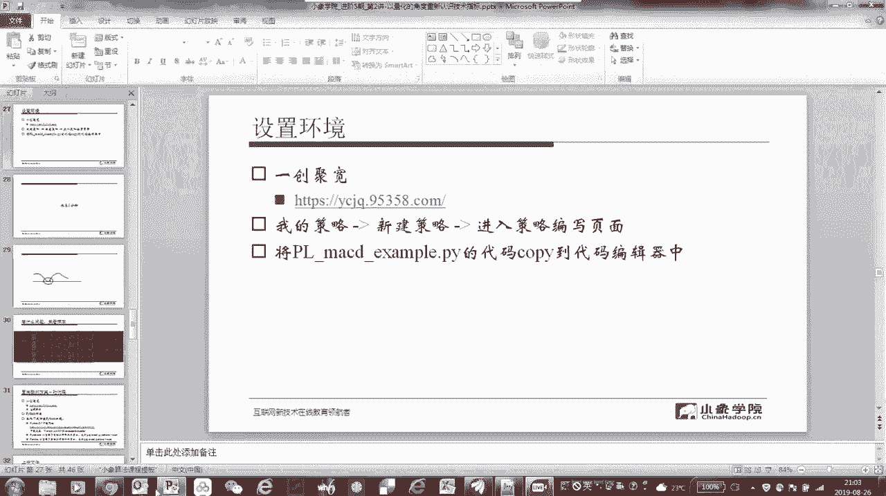

首先在这边啊，我们需要这个大大家看到啊，在呃在这个策略编辑器的右边啊，右边这个界面里，这有一个回测运行回测这个按钮啊，跟他同一行里有几个选项，首先啊如果你要运行刚才我们给你的这些代码。

你要把这个选项这个时间周期这个选项不要选，每天你要选分钟啊，要选分钟，同时呢在这个地方可以设置一个这个起始回测，起始的日期，比如说我们我们还是选稍微近一点吧，比如说我们选到去年的，下半年啊，2018年。

十到12月1号吧啊随便随便这么一选啊，其实这里头也是有讲究的，大家以后你要自己做策略啊，自己做策略，千万不要一上来就选最近的啊，就像今天是八2019年8月26日，你直接一上来就选，2019年1月1号。

到2019年8月26号嗯，越接近当前行情啊，这段数据是越珍贵的，你最好不要在你一上来，刚写了一个初步的一个策略的框架，就马上用最新的数据去跑回测，这样的话，你相当于用最新的数据进行了一个训练。

而这种训练通常是带有过拟合的啊，那么也就意味着说，你将来你这个策略对于近期的行情是否有效，我们这个事情就没有办法测出来了，因为你把最宝贵的数据当成了训练集，而不是测试机啊，所以在这啊。

我们通常我们下意识的就不要选，最近的这个日期啊，我们就稍微往前选一选，当然我今天只是给大家举个例子啊，我随便选了这么个日子，然后注意要选分中级。

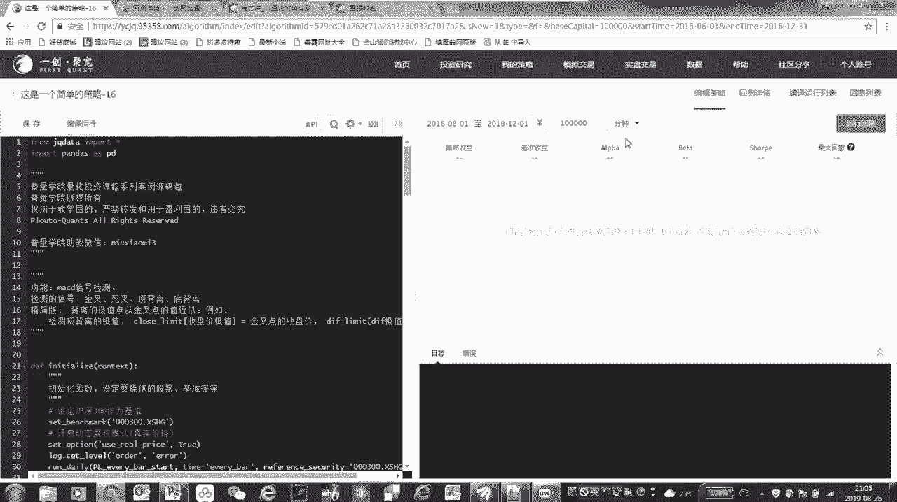

然后这个时候点一下运行回测，它就跑到自动切换到另外一个界面啊，嗯能跑起来呀，啊可能说好，现在已经开始跑了，大家看到这回色曲线出来啊，这个灰色曲线呢蓝色表示我们的策略。

而这个红色的实际上是我的在代码当中写的，沪深300作为一个基准啊，当时的沪深300指数作为基准，那有人会问哎，为什么你这个你自己的这收益曲线一直是零呢，因为我们刚才这段代码，并没有实现任何的交易啊。

我们只是把检测出来的嗯，我们规定的一个股票池，在这段时间内啊，所有的股票发生的金叉，死叉和背离的情况，把它输出到了一个日志里，所以这个时候大家在这边点一下，这个日志输出啊，点这个按钮，你会发现哎。

这个就是我们刚才跑了这段代码以后，运行出来的这个信号的输出结果，你看在这，比如说这第一行银行检测到什么呢，000651这支股票啊，在2018年7月31号发生了一次金叉啊，MACD的金叉。

那么这一行是一个top啊，大家看这个信号的类型叫top divergence，这是一个顶背离啊，这是哪支票呢，扣的是601398啊，那关于这个代码细节，一会儿那我们休息5分钟，一会儿再给大家来介绍啊。

这个大家说没有这个文件啊，那我让这个助教老师去检查一下，如果确实没有发，让他再补发一下啊，这个大家不用着急，没关系的，好，我们回来哈，刚才有同学说这个嗯，拿到的代码包没有包含这个example啊。

点PY这个文件没关系啊，我这个让助教老师去查一下，如果这个确实漏掉了，那我让这个老师给大家补发一下啊，我们刚才看到了啊，我们这段程序，一会我会讲他在解决一些特殊的问题的时候啊，我们说交叉啊。

像金叉死叉这件事相对还是比较容易实现的，但是呢会遇到一个什么问题，会遇到一个相切的问题，假设啊下面这个是D1A红线啊，当然你不可能走的这么平啊，我们只是举举一个极端的例子，然后上面这个是例子这条线。

那么在这个位置，我们会认为它是出现了一次交叉吗，一般情况下可能不会啊，但是如果我们的代码写成什么样子呢，我们来看一下这个刚才给大家看的，example的这个代码，我们带着刚才这个问题来看啊。

这个代码我简单说一下它的结构啊，因为读起来还是比较好读的，首先呢我们在这个初始化函数里面啊，我们干了这么几件事，一个是set了一个benchmark啊，沪深300啊，这个没有什么太大的意意义啊。

呃然后呢用了一个动态复权的模式啊，叫做use real price，这个呢我认为只要你用预创巨宽做股票啊，建议你缺少的就是用这种动态复权模式啊，道理我也不讲了，反正这个用它肯定没错啊。

大家记住这么件事就行了，然后呢我们在这比较重要的啊，有一个rn daily这样的一个函数，我们会是在每一根bar的start啊，p l every bar start啊，在这个每个bug开始的时候啊。

来执行的，那么这个time是every b啊，就是每根bar都要执行啊，那么我们会把这个日志啊，这个info在这个级别啊，info这个级别的日志把它输出出来啊，然后在这还比较重要的。

有一个就检测信号的K线周期啊，我们在这这个很重要的一个变量G啊，G后面点后面这个都是一个全局变量啊，我们这个在这个这是在Python啊，在这个聚宽那个平台啊，比较规范的这么一种写法，G后面啊。

这个G后面这是一就global啊，都是一个全局变量，然后在这比较重要的一个一个一个变量，就是，我们把它定义成60分钟，也就是说刚才给大家的这段代码运行以后，我们检测的是60分钟级别的啊。

出现的MACD的这个交叉和背离这样的信号，所以呢这这两个数啊，这是一个是文字上它是60M啊，那么具体的参数这个p l signal periods unit，我们要把它也写成60啊。

这个大家不要忘了这两个数要改一块改啊，你以后要自己想检测30分钟呢，你把这个60改成30，那检测120分钟的，你把这个这个60改成120分钟啊，你要15分钟也是把它都改成相应的。

这这个你可以自己动手去改啊，这个都没问题，但是要这两个位置要改都一块改，别只改了其中一个，然后这个还有一个比较好玩的地啊，就是我们要设置一个全局的股票池，这段代码是干什么用的呢。

就是说当你设置了你自己的这一堆股票啊，把它构成一个股票池，然后呢你在刚才回测的那个位置啊，你选择一个起始的日期和这个终止的日期，然后我们在代码里也指定了这个级别，那这段代码就会把你这些股票在这段回撤的。

这段时间的这段区间内，在相应的这个比如说60分钟级别下，所产生的所有的MACD的金叉死叉和顶背离，底背离信号，都把它记录在log里面啊，就把它输出到log，这样的话你日后你就可以啊。

再把这个log里头的这个信息持久化以后，把它写到数据库里，你以后就可以从数据库里头，把这些相应的信号读出来，然后变成你的这个回测的触发的信号啊，所以说这段代码起的就是这么一个作用啊。

它相当于把检测到的所有信号给你，持久化保留起来，然后以后你再回测的时候，直接读这这里面的内容就可以了，那么everybody start啊，这个是我们每一个BD1开始要运行的，他要干干一件什么事呢。

它是在每根bar开盘前来检测检测什么，就是从以上一根bar的收盘价来产生的，所有的信号啊，所以他这这个信号检测，就是这一个p l detect sector啊，就这么一个函数体来完成这么一件事啊。

然后把检测到的信号啊，这个signal把它输出到这个log里面，所以，这个他干的就是这么一件事啊，就是every body start，就干这么一个事，就是detect signal。

然后这里头我们还定义了几种这个signal啊，把它PLMACDC应的，这是一个一个类定义的这么一个类，这个类里头包含啊，这个这个signal它是一个什么样的数据结构呢，就是包含了code name啊。

Period，然后TM这是time啊，实际上是一个时间戳，还有相应的有一个extra字段啊，那么这是我们定义的这个signal的，这样的一个结构，这个结构就是为了将来你在把持久化的啊。

这个保存下来的这个所有的信号，你把它读出来，然后把它解析成这个相应的类型，那么重点在这detect signal啊，这样的一个这样一个函数啊，这个他干了一件什么事呢，首先我们是要get price啊。

就是每一只股票，我们要把它相应的这个钱，250个bar的收盘价这样一个序列，把这都拿出来，为了计算我们的MACD，有人会问为什么要取这么长啊，MCD不就是这个十二二十六九吗，那最最多也就是26个八吗。

不是这样的啊，因为他用的是指数发动平均，而指数发动平均它是不断地往前递归的，理论上的可以递归无穷多啊，无穷长度，但是呢一般从经验上来讲，你取250个吧，已经差不多了。

再多取这个后面的这个累积的误差已经很小了，可以忽略不计啊，好那么具体我们看这几段代码啊，他是来额完成我们的这个计算啊，检测，这是来检测这个DF和DA啊，DF和DA在这怎么怎么来算呢。

实际上就是啊这个这个具具体这个公式啊，calculate的MACD啊，在这个函数里头把它把它算出来，这个我们就不讲了啊，因为以前我们在初阶课的时候也讲过，怎么去计算这个MACD。

那么现在我们关注的是交叉对吧，交叉和背离，那在这检批量检测DF和DA的交叉点啊，在这下面，这个我们这个代码的注释，还是写的比较比较全的啊，大家课后的话可以根据这个注释，就可以把这个代码来看懂了。

我们在这我们看一下啊，这个，在这是把啊相应的这个get啊，cross type啊，把这个交叉的这个类型啊，把它拿到，但是具体计算在什么地方啊，具体计算实际是在这这个get cross type。

就是说刚才我们说的这个交叉，在这里大家看啊，PREMACD和MACD，这什么意思呢，MACD就是当前这根K线所对应的MACD的值，而MACD啊根据我们之前的定义，MACD就等于DF减掉DA对吧。

D和DA的差，那么PREMACD就是前一个bar的MACD值，也就是前一个bar的D数减去DA，如果PRIMCD小于等于MACD，就前一个瓣儿的MCD，小于等于当前这个瓣的MCD，这就是一次金叉。

而如果前一个bar的MACD大于等于当前的这个MACD，我们就把它定义成一个死叉啊，叫做death，这个定义肯定很简单啊，很简单。

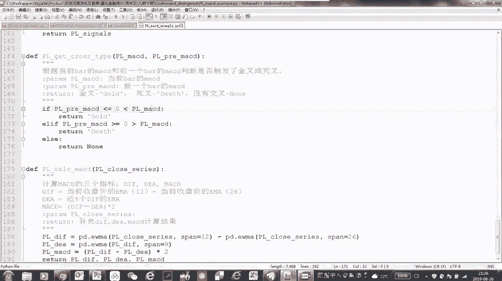

但是呢他就来了，我们刚才说的啊，PPT里头这个问题了，大家看这啊。

那么如果，我们把这条线看成就是MACD，这就是这条曲线，就是DIF减掉DEA啊，这样一条曲线，那么如果这个这个位置表示的是当前这根把，就是MACD，而PREMACD在这，那这个时候我们啊。

我们检测的就应该是一次金叉对吧，这个是没有问题的，但是现在的问题在于啊，就是啊我我我刚才说的不对啊，这个大家这个呃这个忽略啊，我我重新说一下这个这条线它不是MC地址啊，这条线就是细线代表DF。

粗线代表DA那么按照刚才的这种检测的方法啊，在这个位置它相当于完成了一次相切，完成一次相切，按照我们刚才的这个大于等于或者小于等于，实际上我们既可以把它作为是均差，也可以把它作为死差对吧。

按照刚才那个那个公式的定义，但实际上我们并不希望这样，我们希望它真正完成的交叉，是从这个如果是个金叉，就是之前的DF值是在这个DA值之下的，然后后面他上来了，真正完成一次交叉，而不是一个相相切。

那如果要实现这样的一个判别，那这个时候可能我们所需要做的就是不止，就是当当前一个MACD的值为零的时候，那大家看啊，这个我们公式里写的是，是小于等于或者大于等于吧，在这就有个等号。

那有人说你直接把等号拿掉就行，直接把等号拿掉也不行，那确实是PMCD刚好等于零，但是再前一个就PREPREMCD小于零的时候，这个时候确实是一次很标准的金叉，也就是你用三个点三根棒来判断最前面一根棒。

这个MCD值是小于零的，中间这根棒MCD值是零，而后面这根棒啊，最后这根棒MCD大于零，那这种时候他就是一个标准的一个，上穿一个金叉啊，但是它是由三根半才完成的，极限情况下可能有四根棒，五根棒啊。

因为中间几个都是零，那就完全贴合，但是这个情况是比较少见的，但是三根bar来完成一次金叉或者死叉，也是比较常见的，所以我们在写程序的时候啊，刚才说的就是这段代码它是有一定的缺陷，他有可能把相切的情况。

也认为是完成了一次交叉，但是我们在实际当中，我们通常不认为这种情况是交叉啊，所以这一点希望大家引起一个重视啊，交叉呢基本上你遇到的这个情况就是金叉，死叉啊，你遇到的情况顶多就是一个相切。

这样的情况算是比较复杂的，但是背离比这个还要厉害啊，我们再来看另外一个例子，这是我提前啊，我我随便检测了一个底背离啊，在2018年的11月28号，出现的一次底背离，这是哪只股票呢。

如果大家炒股一定能知道啊，600519，著名的贵州茅台，我们来看一下啊，我这个打开一一个交易软件，我们直接看到那天的情况啊，这个箭头啊，这是贵州茅台的小实线啊，这个这个箭头就是我们检测到。

在2018年的11月28号收盘，这个时刻啊，15点钟下午三点钟出现了一次底背离，而他上一次啊就是和他形成背离对照的，上一次的这个bug是在，二0118年11月13号的下午的两点钟，在这在这边吧。

但是我们肉眼去看，你会不会发现有些问题啊，什么问题呢，我们刚才那段代码，这个回到我们大家先看一下这个图啊，你如果你肉眼能看出有点别扭啊，这个别扭在什么地方啊，这是一次真正完美的背离吗。

至少我们在肉眼看的时候，觉得这个这个不像是一个背离啊，但是我们为什么会把它检测出来呢，我们再回到我们的代码上，大家一看就明白了，我们的这个背离为了便于计算啊，我们为了便于计算，大家看一下。

我们这个判断底背离的一个判断的条件是什么，是这是判断价格，首先啊在这判断价格上一个bar啊，就last bar的clothes和当前的和，和他前面的那次金叉点啊，金叉的那个位置的close这两个来比较。

也就是说当前这个价格更低，为什么要跟金差点去比啊，这是因为我们在检测的时候偷了个懒，理论上我们在比我们在检测底背离，我们应该是检测在这一个区间里的最低价，出现的这个bug，比如说是在这个位置。

它对应的这个地府的值啊，极值点以及当前的这个，这个坝附近啊，出现的这个最低的位置最低价，比如说是这个点啊，然后这个点所对应的D赋值，D赋值的一个极值点，有可能跟他会前后错开那么一两个把，甚至更多的把啊。

在这大概是这个位置，然后比较这个地府和这个地府它们之间的关系，以及这个瓣儿的价格和这个瓣儿的价格，它们之间的关系，但如果要严格的这么去看，你会发现其实价格也没有创新低，然后指标也没有创新低。

这不是一次完美的背离啊，完美的背离是说，我们在这儿的价格，应该比在这个区间的最低价要低才对，但是呢，我们为什么会把这个背离给检测出来了呢，是因为我们为了偷懒啊，我们去找这个地图的极值点。

并且要和相应的这个B的收盘价，最低点进行对齐，这件事写起程序来就比较复杂啊，写着写的比较麻烦，我们偷一个什么懒呢，我们就只用这个金叉，也就是DIF上穿DEA的这个点，它对应的这个瓣儿的这个地赋值和价格。

来进行比较，也就是说两次金叉之间两次金叉啊，就这个金叉的位置对应的收盘价，以及DF的值和这个金叉的位置，对应的收盘价和DF的值作为我们的参考点，来比较它们之间的关系，这也就是这段代码啊。

所以我们说这是当前这个bar，它的收盘价要低于上一个金叉的这个，位置的收盘价，同时当前这个瓣它的DF值要大于等于，前一个出现金叉的位置时，这个D值我们就认为这是一个底背离，这就是这段代码啊。

这是一个简化的检测背离的这样的一个代码，为的就是简单啊，简单好实现，但是这个简单付出的代价就是类似这样的，它不是背离被我们检测出来了，这是一次误解，当然也有可能有漏检啊，在茅台上我们误解了。

但是在其他的股票我们可能还要漏检啊，那么真正要实现一个完整的背离检测的代码，那怎么办呢，哎呀看这个说起来就相对比较复杂，那复杂归复杂啊，我们这个既然教大家做这件事，我们就做了全套的准备。

所以大家拿到的这个代码包啊，拿到这个代码包，我们给了一个全套的说相对比较复杂的，但是很完整的去检测MACD背离这件事啊，那个代码就很复杂了啊，这个行数也比较多啊，那么具体呢大家可以看到有这么几个文件啊。

大家拿到的代码包，一个是距宽下划线dB点PY啊，这是获取数据的接口，然后聚合下划线MACDCONFIG点PY，这是MACD信号检测的一个配置文件，还有距宽下划线，MCD下划线，signal点PY。

这是历史数据缓存和信号检测的相应的代码，还有一个是信号统计啊，signal下划线statistics点PY，这四个文件啊，大家首先在聚宽这个易方聚宽平台，选择投资研究，然后点击上传按钮。

把这几个文件先分别的上传上去啊，这是大家要做的这一步，同时呢我们还需要在本地安装一个Python环境啊，我们建议大家装的是2。7这个版本，当然你现在也有三版本三啊，因为2。7这个版本我们这个测试过。

它是肯定可以兼容的，那么三呢这个跟一创聚宽的这个平台呃，因为机翼政机关这个据我们了解，它的升级相对比较慢啊，所以他目前应该既有二也有三这两个版本，但是这个三的版本我没有严格测试过。

所以说呃在我们给大家提供的这个课件代码啊，我们还是建议大家采用2。7啊，这样的一个版本来运行，你可以尝试一下，在三以上的这个版本的这个环境下来运行啊，但是这个事我没有严格的测试过。

具体的方式呢就是你把这个这个环境安装好啊，然后还要运行这个install，我们还要装一个这个p y e charts啊，这个一会儿要绘图来用，然后还有一个pandas啊，我们要把这个pandas给装上。

那整个这个全套大家可以看，我们给大家提供这个代码包，里头有一个BB这个文件，这个写的比较详细，在这我也不读了啊，我也不读了，就只是告诉你一步一步应该怎么去做啊，每一步要怎么做，大家一定要记住啊。

就记住有个read me in啊，read me点TXT这个文件，大家把它打开了，仔细读一读啊，这是我们这节课所有的操作，具体每一步应该做什么，这个都写得非常清楚，那么做完这几这几步以后。

用我们这套全套的这个全套家伙啊，这四个文件嗯来给大家实现的MACD金叉，死叉和背离的检测啊，那个检测出来就相对来说就比较的，符合我们的预期啊，跟我们肉眼做的判断基本一致，在这儿他解决了一个什么问题呢。

主要是看这个mc d signal在P百啊，这里头我简单的给大家说一说啊，这个因为代码非常长啊，如果把它都讲完时间不够，但是这里头有几个需要，大家可能需要比较注意的地方啊，因为在这里头啊，刚才说到了。

就是结合这张图，我们在检测背离，我们用的是地府的极值点，以及它所对应的价格的啊，就是在这个地主极值点附近，可能前后有几个错，几个伴儿，它的这个价格的最最低点，我们嗯本质上我们这段代码要找相应的一些。

对应关系，所以呢这个这里头，我们在给大家实现的这个完整版的代码里头，我们定义了很多的数据结构啊，像这个这个limit，这就是极值点啊，我们要通过这样的来这样的一个数据结构。

我们去存储我们能检测到的这个极值点，同时呢，我们在检测背离的时候，我们还需要滤除很多的噪声，因为大家会发现啊，有的时候我们我们希望检测的背离，是相对比较明显的背离，像这个价格差不多。

然后MACD或者D子值相差也不大，在这种情况下，我们认为这种背离啊它很可能只是一些噪声，所以呢我们会有一些阈值的范围，来判定这个背离是不是显著啊，在这个地方我们把它叫做。

那这里头有几个啊相应的判别的标准啊，对比两个点的价格以及技术的高低关系啊，这就是刚才我说到的，如果说这个高低关系啊，它们之间相差不大，那他很可能只是一些噪声，然后还有经常会看到帝国和DNA相互纠缠。

相互纠缠的话，那这时候检测出来的背离，可能我们认为力度也不是足够大，作为信发就作为信号系统，要想触发买卖这个操作的时候，像DF和DEA完全纠缠在一起，反复纠缠它就会形成很多的假的金叉。

死叉这种这个呃假信号啊，所以说我们也会通过一些特殊的手段啊，但具体什么时候大家去读一读代码，然后背离的高度我们通常也会做一些要求啊，我们要求这个背离还是相对要比较显著。

所以说在这里头我们会有一个比较显著，才算背离，这里大家可以看一下啊，专门有一个significance，significance of divergence这样的一个判断，这个判断大家可以具体去看一下。

这个函数到底是怎么写的啊，所以说这段代码它之所以有价值，是说别别小看一个背离啊，他的背离应该有很多种情况，而且在真正对于我们来开发一个信号系统，我们通常不希望这个信号有太多的闪烁，太多的这种噪声。

所以我们也有各种各样的这个，不管是出于经验还是出于统计的一些过滤条件，所以大家我真的建议啊，这个主要是代码太长了，好几百行啊，大家看看一共多少行，800多行，800多行的代码。

我没法一一行一行给大家解释，但是因为这个注释写的还是比较完整的，因为我们的程序员啊，在在我们的严格要求下，所有的算法这个注释都是相对相对比较完整，所以大家可以参考一下这段代码的技术含量。

含金量真的很高啊，所以这节课大家把这个代码看懂了，就真的没有白学，有很多我们平时在使用当中，实践当中一些总结出来一些经验教训啊，都在这个注释里面，所时间关系我我不一行一行展开了，大家如果在读代码和课后。

在读这段代码的过程当中有什么问题，那可以后面再给我们留言啊，我们再来讨论，然后具体怎么运行啊，真正的运行是大家是把p l strategy下划线demo，这个PY文件，你把它全部拷贝啊。

像刚才一样放到那个距宽的一创距宽这边。

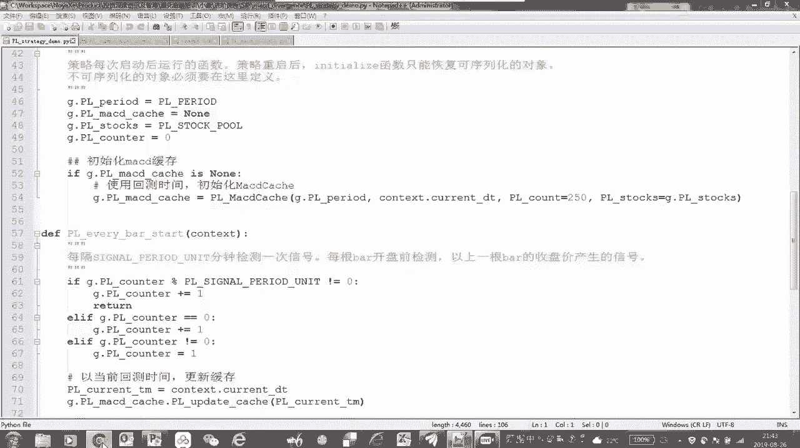

放到这个策略啊，刚才那个模板里面啊，这个，策略编辑策略的这个位置啊，放在这个代码编辑器啊。

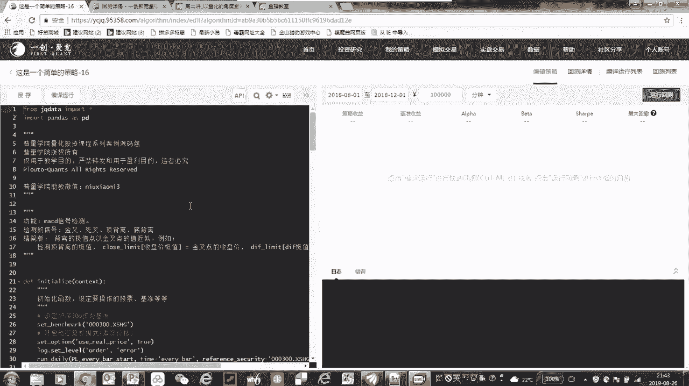

策略编辑器就是把这个文件p l strategy，下划线，demo点PY这个文件全部拷贝，然后放在那里面直接就可以运行了啊，运行的方式跟刚才一样，我就不多说了，好这个运营完以后啊。

同样也是把这个所有的你的股票池里头的，所有的股票，在你回撤期间，它们所产生的金叉死叉背离全都检测出来，然后把它输出到log里面，这里有一有一点要嘱咐一下大家啊，就是你可以侧着玩，包括。

股票值你可以自己设，然后这个K线周期你可以自己去定义，那这里有一点啊，就是毕竟一创聚宽包括距宽，它是第三方的一个回测平台啊，它有一些性能上的考虑，那有同学说这个哎呀好，这下好了。

我我我我把历史上这3000多只股票，这10年的，这个在60分钟级别或者30分钟级别，所有的MACD顶背离，底背离，金叉死叉，我全检测一遍啊，这下这逮着了，这个就有问题啊，这在我们测试。

如果你的股票池真的超过了3300只股票，那你在运行起来这个效率会比较低啊，这有可能很长时间出不来结果，所以大家既然只是能以学习为目的啊，就不要一下加那么多股票，股票池这个单引号引引起来股票代码。

然后中间是逗号分隔啊，这个大家照猫画，我就可以添加你自己的股票啊，这这里头我们这些股票都是随便拍脑袋写的啊，并没有什么特别的暗示，说大家要关注这些股票啊，啊包括这这个地方好像还多了个零啊。

大家可以自己去检查吧，这多了零，反正也会出错啊，好这个任务做完了啊，做完了以后，我们已经把这些检测到的股票，这个信号已经放到这个地方啊，刚才也说了，这个我们的这段代码啊，它之所以含金量相对比较高。

它解决了一些信号闪烁噪声的滤除，然后一些信号强弱啊，可变因素的处理，以及一些边界的异常情况，都在这个那800多行的那个文件里头啊，所以大家一定要认真看，和这个信号检测出来以后，输入到log里头。

我们已经知道说，股票在历史上出现过这些信号了，那么这个信号或者说这种趋势型的技术指标，到底它的性能如何呢，我们在上节课在介绍趋势性策略的时候，也跟大家说了，趋势性策略要看他的赔率，重点是他的赔率。

然后同时呢我们也要关注他的胜率啊，胜率和赔率综合起来决定了这个这个信号。

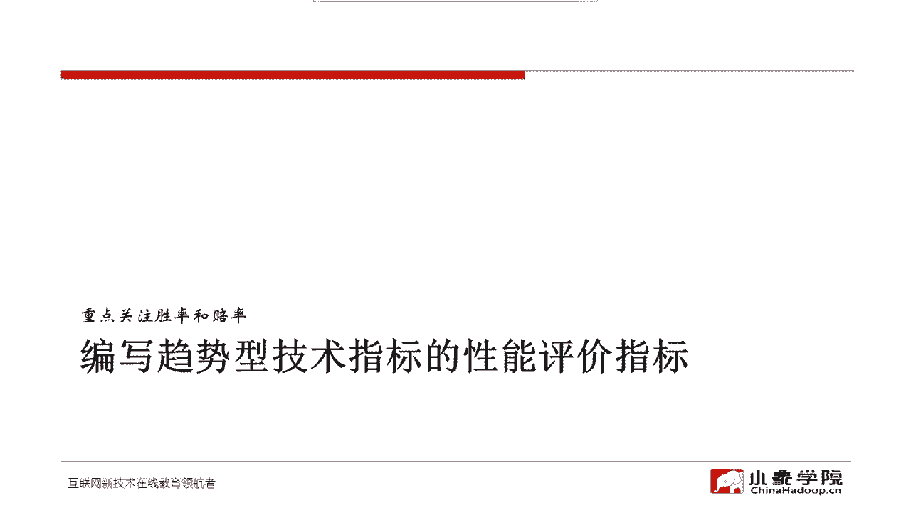

它的期望收益应该有多高，但是信号它不是一个完整的系统，所以这个时候我们只需要统计什么呢，我们统计一下，当这个信号出现以后，它在后面，比如说四个瓣或者八个瓣或者16个瓣，或者20个瓣或者24个瓣啊。

分别到了这么长时间以后，它的收益是怎么样。

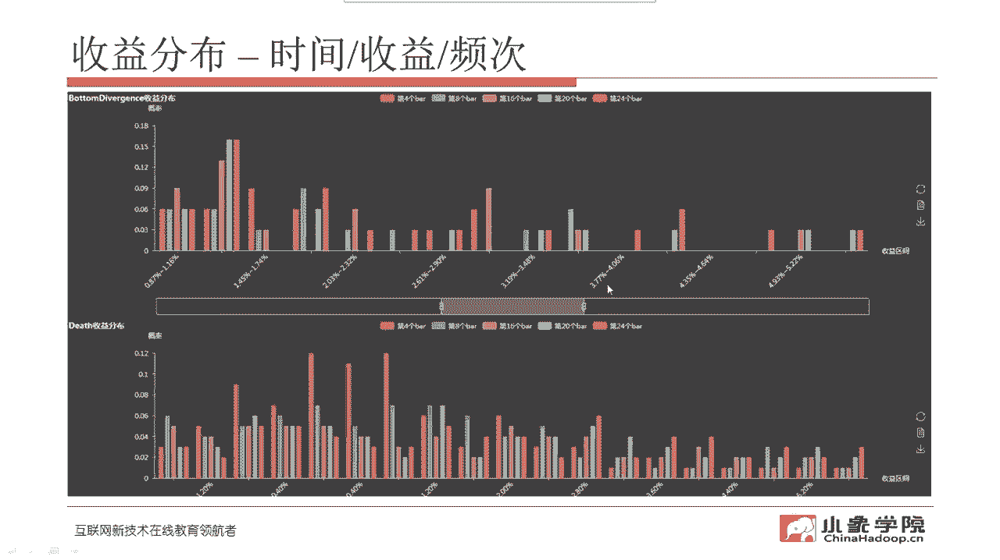

我们先做一个这样的一个初步的统计，那具体怎么统计呢，我们在给大家的代码包里头啊，有一个文件叫做这个，chart点PY啊，chart点PY，这个你一定要安装那个e chart啊。

这个这个要要按照我们刚才那个安装的向导啊，要把那个环境给准备好，那么刚才我们也说了，你在运行完那个嗯demo啊，下划线，demo点PY那个文件之后，会在一创巨宽，有一个叫投资研究的页面下。

我们会给你生成一个记录文件，叫做signal点SCV，也就是说，当产生的所有的信号，都会记录在这这样的一个文件里，你把这个文件复制到我们有一个resources，这个目录下面啊。

然后再运行chart点PY，这时候就会生成一个叫做render，点HTML这样一个文件，就会生成这么一个啊render点HTML这样一个文件。

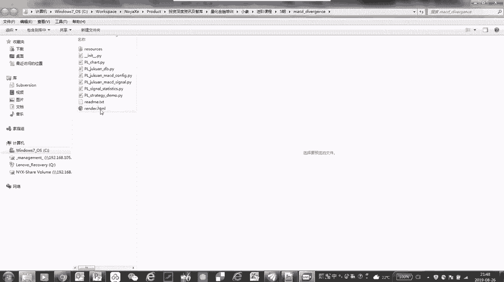

这个文件我们来看一下啊。

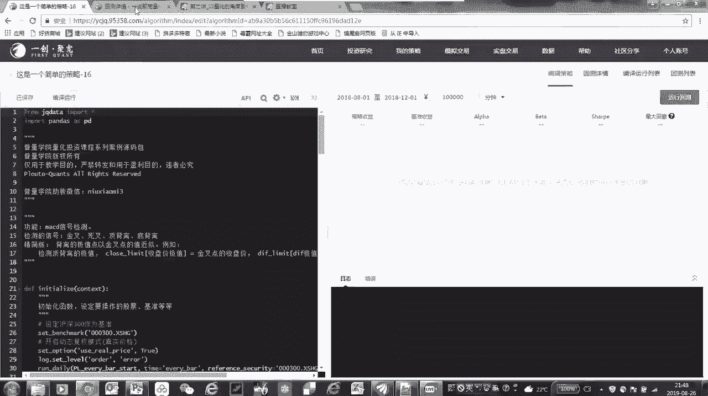

直接用浏览器就可以打开。

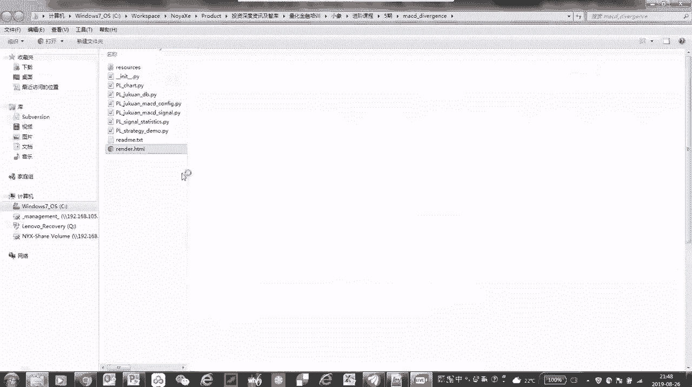

实际上这个文件啊其实，它就包含了我们对这个信号的统计的一个结果，把它可视化，可视化以后，这什么呢，这是一个就刚才我们在回测时候生成的，针对我的那个股票池的所有的底背离，这样的一个信号。

然后不同的颜色表示当出现这个信号以后，它在四根K线以后啊，也就是四个小时，因为我们那个是60分钟级别的K线啊，就是四个小时以后他的收益分布，假设啊我们只看四个小时的，我们把其他的都关掉，这是这几个颜色。

红颜色啊表示当出现了底背离信号以后，隔四个小时，那么它的收益相对于出信号的那个瓣啊，它的收益的分布情况下面这是分布区间啊，我会发现诶，零大概是在这个位置，零在这个位置啊，就是收益为零。

大概是在这个位置左右，比左边的都是收益为负的情况，右边的都是收益为正的情况，我会发现啊，几乎是对称的啊，几乎是对称的，差不多这个收益为正的和收益为负的，这个从比例上来讲，从概率上来讲是差不多的。

那我们看八个班的情况啊，八个半的情况好像稍微偏正一点是吧，从统计上来讲啊，这个地方差不多是零，那么最高的时候啊，出现过有2%的情况，他的收益超过了10%啊，那么在这边也是2%的情况。

但是他最低的收益是10%以内啊，基本上也就是说在八个榜，也就是当出现在对于我的股票时，我的股票是因为是作为事例，其实不是特别多啊，股如果你股票多，信号要出现的次数多，这个统计可能更有意义。

但至少说明一个，就是介绍一下大家怎么看这个问题，这个相当于一个收益分布的直方图，这个这张图如果它是正偏的，也就是更偏向于右边，就表示你这个信号在这个持有八个半到七，在这样的一个情况下。

你可能能给你带来正收益的概率会更高，或者说赔率也相对比较大啊，那我们再看16个班，好像正正负偏差不多啊，但是概率稍微要高一些，正片的概率要高一些对吧，分20个班呢也是啊，这个正片的概率要高一些。

但是收益应该是差不多啊，大概是这个意思，所以呢下面这个像death啊，死叉金叉死叉也是这样的一个意思啊，这也是一个收益的分布图，死叉我们会看啊，他好像确实稍微有一点有一定的负偏啊。

至少这个这个获得负收益的这个极值上来讲，是更更右偏一些，再左偏一些，负偏一些啊，金叉呢，正负偏也不是太明显啊，看起来啊，所以说从这种这个提供了我们一种思路，于是我们将来在开发出来信号以后。

我们怎么去统计它的性能，我们更关注的是在统计意义上啊，在概率层面，到底他的胜率和赔率在一个什么样的一个范围，至少通过这个通过这样的一个比较，我们会发现啊，确实好像底背离比起金叉，死叉可能会稍微好一点啊。

他的这个统计意义上来讲，他对于正收益的贡献可能要稍微好一点，当然我这个数据不完整啊，因为我的股票值也比较小，统计的这个时间段也比较比较窄，大家可以啊用同样的这种方法，但是数据呢可以样本样本数量更多一些。

这样的话统计意义就更有说服力。

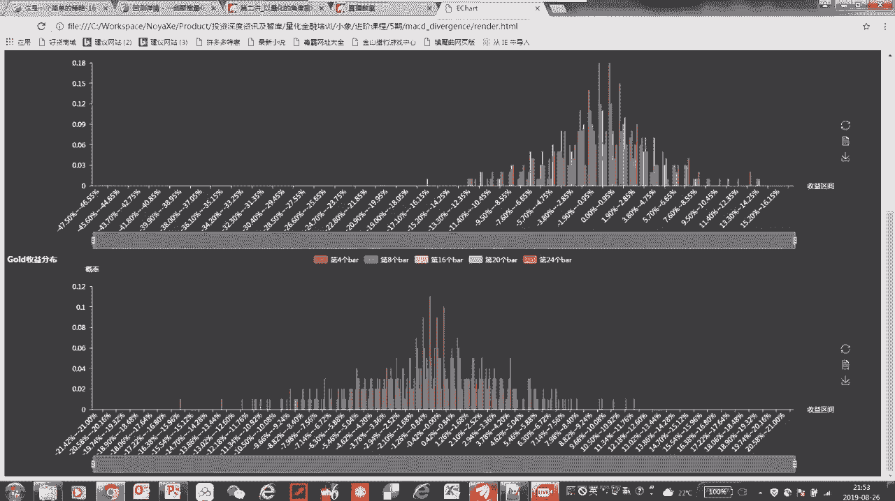

在这呢我只只是给大家介绍了一下，这个怎么去看这个直方图啊，包括我们这个工具怎么去用，所以你看啊，总结一下这节课，大家拿到了两个非常有价值的代码啊，两段代码一段呢是说怎么去检测背离，一个完整的背离的啊。

应该说接近于实战的背离信号的，这种检测的方法，你当然你也可以把它改成，像检测不同的指标的背离啊，我们刚才只是看到MACD的B组啊，但是你也可以把这个DF替换成像RSI。

像KD其他的一些技术指标跟价格的这种背离啊，这是一个比较有价值的东西，另外一个就是你给大家一个统计直方图啊，这样的一个小工具啊，就是我们的那个chart点PY啊，这个文件。

那么用它呢你就可以看到一个在收益的分布啊，我们生成信号以后，来统计它之后，若干时间段的收益的一个分布情况，根据这个直方图，我们就大致能够知道它的收益，是倾向于正片还是负片，统计意义上啊。

他的胜率和赔率大概在什么样的一个范围，这是非常有意义的啊，如果说你一个信号做出来以后，他的这个没有明显的，这个胜率或者赔率上的优势，那么这个信号啊，无论你将来资管怎么做啊，就是仓位怎么分配。

这个可能都不会给你带来太好的效果，胜率和赔率决定了期望收益，那还差什么呢，这个是我们后续啊，再逐步再给大家展开的各种要素，交易成本很重要啊，交易成本要是高，有可能你原来赚钱的交易就变成赔钱的交易。

所以说这个交易成本不但能改变剩率，也能改变赔率啊，持仓的周期，资金的利用率和年化的收益，这也是一对矛盾啊，有可能比如像刚才那个情况，可能持有八个伴，比持有四个伴，我们的胜率和赔率都要高一些。

但是呢同样他的资金利用率就会低啊，它的年化收益到底是比，是我们平均持有四个半年化收益更高，还是平均持有八个班年化收益更高，这个都要综合交易成本，综合你的资金利用率来考虑。

所以这个也牵扯到交易机会的多少和交易频次，啊，啊，这更复杂的问题就是，日后我们要讨论的资金管理和风险的控制，好了，今天这个这节课的规定的内容，基本上就讲到这了，我们要求大家理解课程的这个代码包啊。

今天给的代码相对较多啊，尤其是我们最复杂的那个文件，800多行代码，但是因为注释写的还是比较详细，我课上虽然没有展开讲，但是我还是强烈建议大家回去熟悉一下，然后按照我们给的read me啊。

呃从头到尾操作一遍，把我们的这个read me给大家的这个操作步骤啊，我建议大家还是从头到尾去操作一遍，然后我们嗯还是建议大家思考一个问题啊，从信号的这个性能评估啊。

这个角度怎么建立一套完整的交易逻辑呢，也就是说假设啊你的股票池，你的回撤区间，然后你统计出来确实底背离啊，有一定的做多的这个意义，顶背离有一定做空的这种意义好，那么从这个信号性能评估的角度。

怎么建立一套完整的交易逻辑，包括遇到什么样的信号入场，遇到什么样的信号出场，然后你可以考虑一下你的仓位啊，你的头寸应该怎么去分配啊，这样的话你就思考一个相对完整的，你的一个交易逻辑。

或者说一个你的交易策略应该怎么去构造，然后上次的作业啊，知道大家做了没，这个我们是以ETF价格啊，这个以及它的极限的下跌价格来撒网，来用20万的本金来做一个网格交易的算法啊，这里头没有什么标准答案。

但是呢有这么几个因素大家还是要考虑的啊，就是你什么时候开仓啊，这个要严格的去回答定量的回答啊，然后你撒网的间距是多少，那么网格的间距，和你每一次下多大的这个赌注啊，也就是你每一次分配多少资金啊。

每一笔交易，这个这两这两个因素是非常紧密的联系的，然后还有你你用什么方式来退场啊，来退出，什么情况下获利了结啊，你怎么计算你的平均成本，还有就是说你最大的这个风险暴露啊，最大情况下能够有多少的敞口啊。

风险暴露，还有一个我们永远要做变化，其实最首要的要思考的就是什么情况下，你这个策略会失效啊，网格交易什么情况下会失效，你能够遇到的最坏的情况是什么，如果大家做了上节课的作业。

用我刚才说的这几个要素再去检查一下，你的作业是不是都考虑到了这些因素，如果没考虑到把它补充完整，我们下节课啊，进入到一个相对完整的交易，交易策略的一个框架的介绍啊，基于多因子分析的股票池开发啊。

这是一个嗯，应该说在专业的这个资金管理的机构啊，我们说这个公募基金也好，很多私募基金也好，都采取了这种多因子分析的框架啊，多因多因子分析来构造股票池，所以呢嗯这节课也是非常有。

应该说非常经典的内容也是非常有意义的啊，希望大家也这个按时来上课啊，这周三晚上八点钟好了，我们看看大家有什么问题啊，我们来做一下这节课的答疑，这个代码可能确实漏了一个文件啊，这个没关系啊。

这个我们回头会给大家补上，这个呃如果没有我课件说的这个版本，大家可以先尝试一个版本，然后看看这些代码是不是能够正常运行，如果不能正常运行，把这个中间的状态一些截图可以发给我们。

然后我找这个我们的助教老师，我们的工程师帮助大家来解决这个问题啊，都不用担心，然后还有一个需要提示的啊，就是我们给大家的这些个课程当中，用到的这些示例代码，是帮助大家来理解这些思路的啊。

而不是说它不能够用于实盘，但是如果你真的想把它用到实盘当中，你还需要下很多的功夫去改造它啊，不是说一个东西直接拿来，连这个代码都没有读懂，连这个这里头的这个重点的内容，甚至什么地方会踩坑。

这些逻辑还没搞清楚，直接上实盘这个东西风险是很高的啊，即便是这个汪老师给你的代码，我们也不能保证说你实盘当中不亏钱啊，所以说这这点啊，这个希望大家学了量化这个课程，一定要一定要想清楚这个问题。

呃这个应该是一个这是一个这个这个UNICO的，这也就是说这个字符的这个编编码的一个问题，我不知道你是用什么样的这个，文本编辑器来打开的啊，这个所以贴过去有可能有这种编码的问题，我建议用比较常见的。

比如说像我用的notepad加加，或者说你用一个标准的一个Python的这个，EDI的这样一个编辑环境啊，那如果实在还有这样类似的问题啊，这个不妨把这个贴图呃，发到这个就是咱们课程的这个留言区。

然后我应该最快明天吧，我让我们的工程师帮助你去看一下啊，具体是什么样的问题，啊这个问题很好啊，说问我们在实际交易的时候，用的是自己开发的平台吗，还是用一创新宽，我们都会用啊，我们都会有医生基科。

我们也用过这个我们自己开发的，我们也用，那什么情况运用自己开发的，什么是情况下用依创距宽呢，这个取决于你的这个策略本身的，交易逻辑和性能的要求，对于股票啊这个尤其是日间啊这个级别的。

也就是说呃可能每天的这个操作也不频繁啊，日内交易也不做什么日内交易，像这样的策略，我们嗯尤其是股票型的，我们有时候就在一创局官上来做了啊，啊而且是不用到什么特殊的数据源的话，那其实一中巨宽的数据啊。

本身的数据都够用的时候，我们就直接在那上面做了，但是有一些特殊的交易品种，或者说对实时性啊，对于这个日内的交易啊，这个实时性的要求比较高，对性能要求比较高，可能我们就需要考虑用自己的平台来做。

我们就自己来开发啊，所以这个没有什么特别标准的答案，就是我的原则是说只要第三方工具趁手够用啊，对于这个策略够用，那我们还是尽量用第三方工具，因为它毕竟它维护起来，有有那么多人帮助你去维护这样一个平台啊。

自己开发的系统呢，虽然说私密性啊，包括这个可能在效率上呢会好一些，但是自己开发也有他自己开发的问题，因为很多时候只要是人写的代码，就有可能有bug啊，而自己开发的这个系统呢。

有些时候一些比较小概率的bug，不太容易被测试出来，它不像第三方平台有这么多人在帮助你使用，在测试，所以问题基本上都能暴露出来啊，自己开发的系统，有的时候在某些比较细节的地方，可能测试是嗯不充分啊。

那么在一些关键的时候，特别是假设一些黑天鹅的时候，假设对岸又发了个推，结果导致我们的系统崩溃啊，这这种概率也不是没有的，所以说这个各有利弊啊，根据你的策略的类型来选择，好了看来也没有其他的问题了。

没关系啊，大家课后如果在运行代码，或者在这个读这个注释的时候遇到各种问题啊，也可以随时的跟我们联系啊，在在这个我们也会随时的给大家答疑，上节课作业如果遇到一直在跌的情况，在北京即将耗尽的时候啊。

这个问题没说完，但我猜测啊，其实上你已经get到了，说网格交易一个比较比较困难的啊，永远是这个这个很矛盾的一件事，就是关于资金使用以及说这个极限情况下，这个怎么办啊。

网格交易最害怕的就是说你抄底抄在半山腰，甚至抄在山顶，然后价格一路下跌，然后一路去加重仓位，但是到没有见底之前，头寸已经打光了，这个是最被动的时候，要么升糖，要么止损啊，所以说在这种情况下。

它已经是网格交易说最极端的情况了，这种极端情况的造成，主要是你撒网的间距和起始的这个位置不合理，撒网间距起始位置，包括相应的投送控制不合理，导致过早的用光了所有的弹药啊，那么怎么避免这种情况呢。

首先我们不在高位撒网啊，就是假设我们是说只能做多啊，不能做空，那我们不在高位撒网，那什么叫高位啊，这个事儿就仁者见仁，智者见智，但是对于A股啊，我可以负责任的说，2800点绝对不是高位啊。

所以说现在其实开始撒网是没有什么问题的，港股啊，这个港股美股啊，我们先不说美股，说港股啊，港股的其实它本身行情数据都是很，基本上没有免费的，所以说这个对于港股交易来说，基本上你只能采用，第。

就是你的你的，应该说你的交易商给你提供的平台啊，那至于是不是免费，那就取决于你跟他之间的这个定是怎么达成的，美股也是类似的情况啊，而且每股的美股还稍微更复杂一些。

是因为这这里头还有一些这个额外汇的问题啊，这我们也不方便在课堂上直接回答，这样的问题了，这个如果有需求的话，也可以，我们线下再来联系吧，好了，那今天呢我们课就先上到这啊，这个大家问的问题非常专业啊。

所以给大家点个赞，嗯下节课呢是这个基于呃这个多因子的啊，这种股票池的这种框架啊，是非常有技术含量的啊，大家也可以通过下节课的内容，大概了解一下一些专业的机构，平时是怎么玩的啊。

所以说这个我给大家做一个简单的预告，这个广告希望大家周三按时来听课啊，那我们这下节课呢是刘老师给大家讲啊，不是我了，这个嗯刘老师讲这个多因子是非常擅长的啊，所以说这个提前给他打个广告。

希望大家到时候按时来听课啊，谢谢大家。

