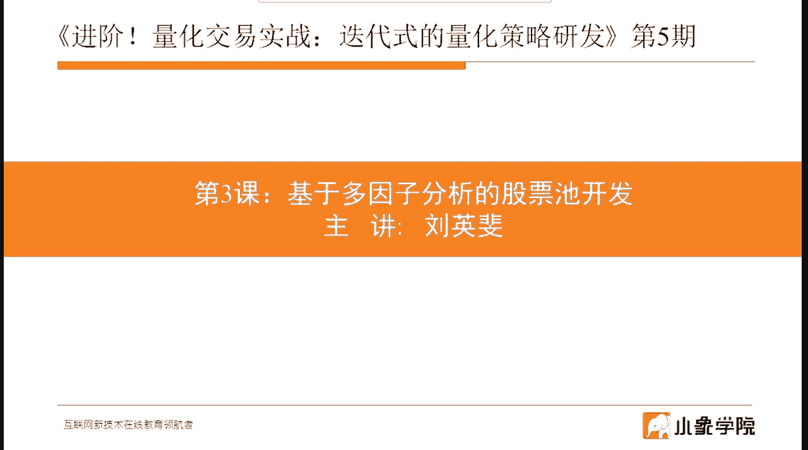
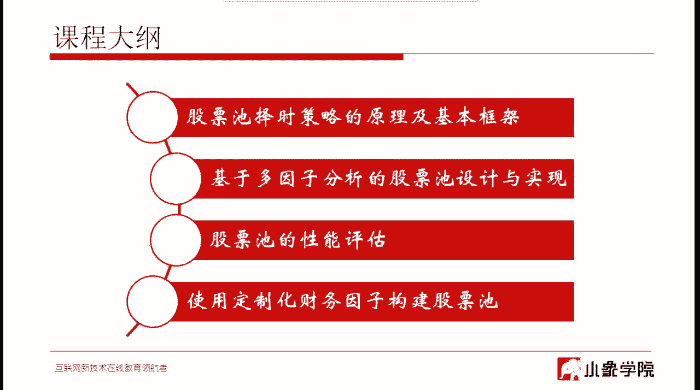
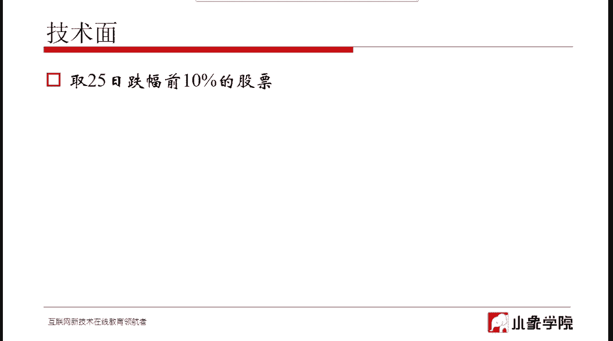
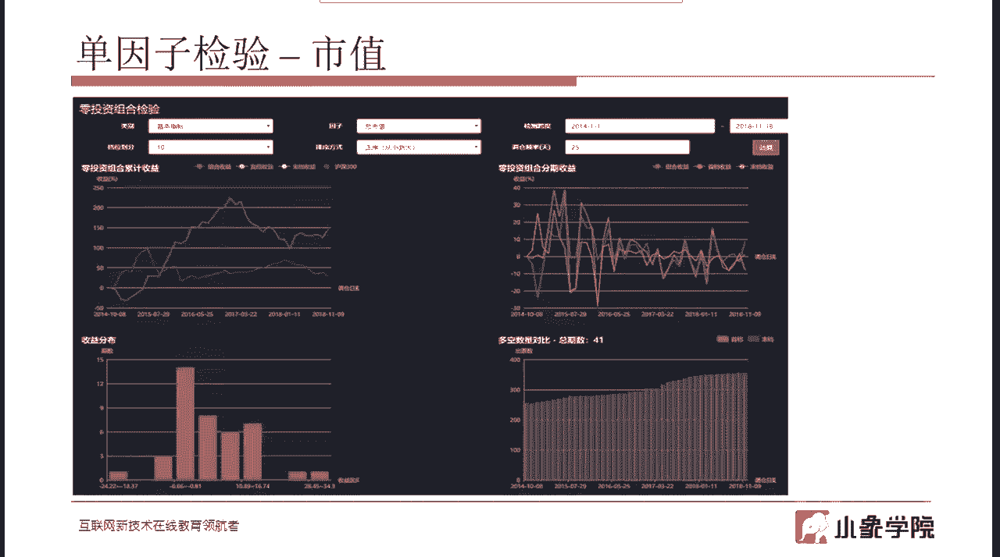
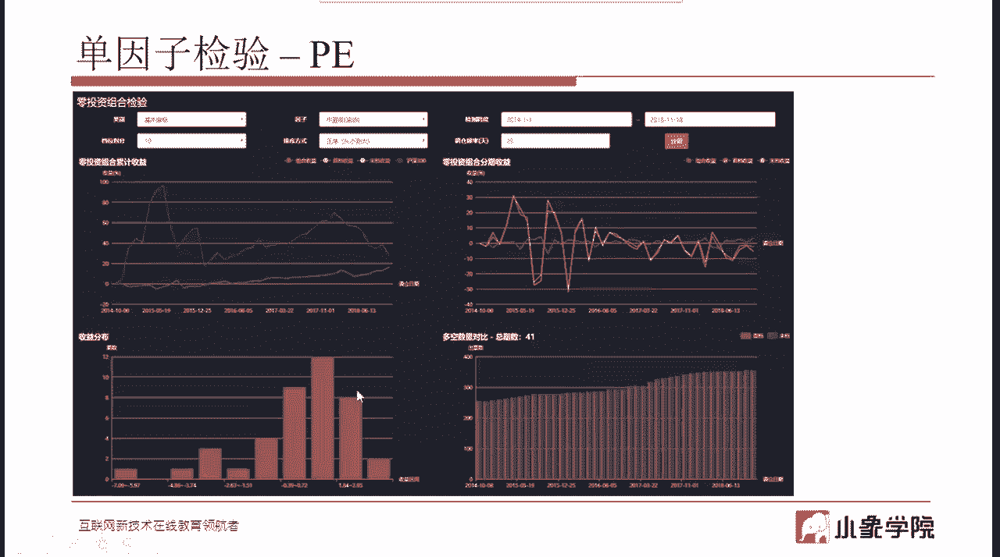
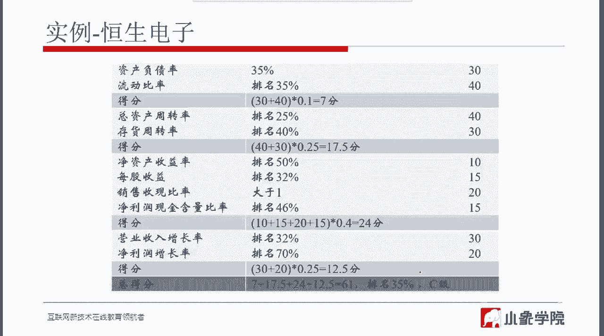
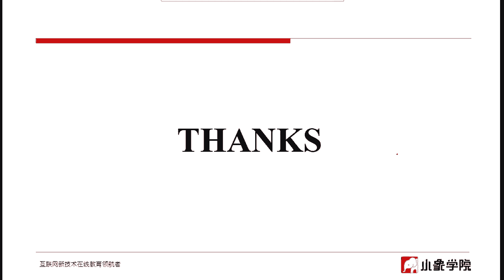
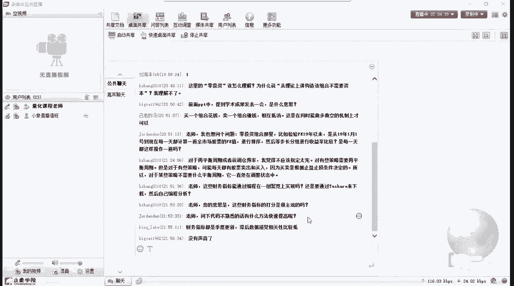
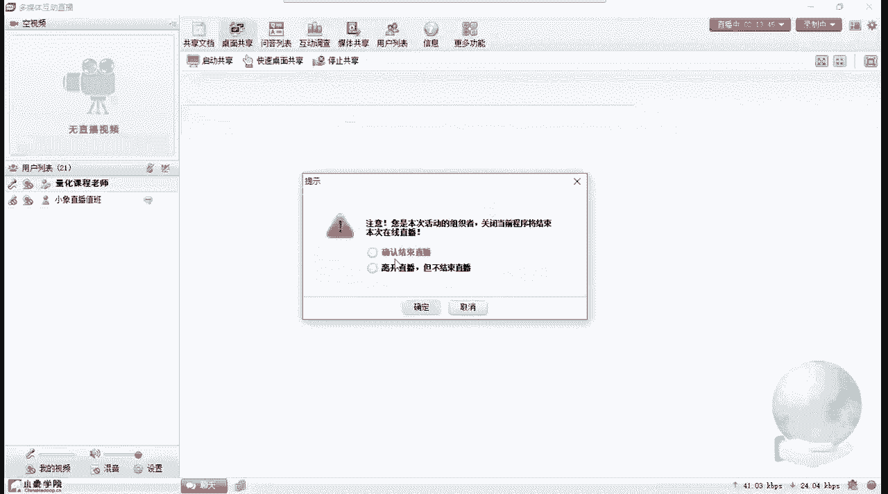

# 清华大学讲师团，量化交易实战，迭代式的量化策略研发 - P3：第三讲_基于多因子分析的股票池开发 - 反方向的Bug - BV1Bs6MYFERQ

基本八点了，我们就开始今天的课程，那今天呢是我们的第三次课。

我们在前面的两次课程呢，给大家讲解了一些关于量化的，一些偏基础方面的知识，那么包括一些呃就是一些常用的一些型号了，那么从这节课开始，我们就会逐步的啊一次一节课，一节课的。

逐步的就去进入到一个完整的量化策略，它的一个设计，包括研发的流程应该是什么样子呢，一步一步给大家展开啊，今天的这节课呢给大家去讲，就是核心的啊，就是给大家去讲股票池，因为像对于一个完整的量化策略来说。

它包含的要素就是股票池，择时，包括风控和头寸，当然还有成本控制这几部分的完整的一个设计，你才能够去说我的一个完整的量化，量化策略才能够出来，那么因为我们这次是进阶的课程。

因为在初级课程中也会涉及到股票池，但是在那个地方比相对的相对来说要浅一些，所以在进阶课里边呢，我们会给大家更加深入的去讲一些呃，关于股票池更加偏实战方面的，或者说更深入，更高级的一些方法来给大家讲一下。

包括因为在这里我就不是特别偏重说啊，什么样的东西叫一个股票池，当然这会讲，但是更重要的会给大家去讲，你怎么样该去设计一个股票池，除了你去用一些最基础的一些指标，比如说PE啊。

比如说ROOE这些最基本的指标，你去你去来构成你的股票池以外，你还有没有其他的一些方法，其实啊在这里最重要的不是说，比如说我我告诉你，一个一个一个很特别的一个指标，你可以拿它来去做股票值。

不是这个这样我说出来的这个指标，其实只要我能讲出来的，那么嗯更大家都知道都知道的话，越来越多人知道的话，慢慢的它会相对的是它的效果也会大打折扣，那么在这里最重要的是要教给大家。

第一你应该选择什么样的种类的指标，来去设你的股票池，设计你的股票池，这是第一，第二当你的股票池设计出来以后，或者说你准备采用这样的指标，去做股票池设计的时候，你怎么样来断定你这个指标是合理的。

也就是说我们有没有什么样的一个科学的办法，通过数据分析的手段来去得出这样的结论，你现在所选择的这个指标是可用的，还是不可用的啊，这是一个稍微偏高级点的内容，需要大家掌握的，然后呢会给大家去讲。

我我我翻到下一页啊，就是然后会给大家去讲，就是如果我们基于像第二部分，基于多因子分析这样的股票池，你该怎么样的具体去把设计，怎么样通过编程的方法来去实现它，那讲完第二部分，第三部分就是什么。

就是你股票池做出来了以后，你怎么样去评估它的性能，也就是说这个股票是做出来，你怎么知道它行不行，我能不能基于它来去进一步去增加我的择时，增加我的风控，增加我的头寸管理或者成本管理等等等等。

如果这个最基础的股票池都不好，那么你后面再叠加的其他的条件相对来说啊，可能就不会有那么好的效果，然后关于像啊，我们在这里会给大家举一些例子，就是我设计的这些股票池，我该怎么用。

我前面讲过的一些去验证这些指标的办法，来去看一看它到底性能怎么样，然后在最后一部分要给大家更进一步啊，因为毕竟我们这是进阶课，然后最更进一步会给大家去啊，拿像我们一般年报上或者说半年报。

季报上都会有财报对吧，我们会拿财报，其中的一些我们认为比较重要的一些指标，一些财务指标，我们把它拿出来，用这些财务指标来去定制化一个财务因子，那么这个定制化的财务因子能干什么用呢。

就可以作为你构建股票池的一个基础，或者说是一个因子对吧，你拿它作为你的一个因子，然后可能你还会叠加一些其他的一些，动量因子啊等等，再去把它们构成一个完善的股票池，所以最后一部分呢可能需要嗯如果你对财报。

你读过财报啊，可能理解起来就会比较简单一点啊，或者方便一点，如果你没有看过财报，或者说对于财报上的这些财务指标不大懂，那么啊，我会尽量的把其中比较重要的一些财务指标呢，讲给大家听。

比如它大概是什么意思啊，但我不会一个一个指标都给大家解释，这个指标什么意思呢，因为我们今天时间不够用，所以如果你就是课上，如果有些指标不知不懂的话，你可以课下，其实网上稍微一查就知道了。

在这里最重要的是说，你要啊通过这个财务因子的构建过程啊，你能大概知道这样的一个去，我去怎么样去设计自己的选股因子，这样的一个流程应该是什么样子的，这样方便将来你去打造自己，比较独特的一些选股因子。

从而去构建自己的股票池好，那么我们开始正式的内容，首先第一部分，股票池择时策略的原理以及基本框架，那么嗯这里提到了一个名词叫股票持择时策略，其实意思是说，我们现在绝大部分的策略，都是基于这样一个框架的。

一个是股票池，一个是择时，就是买入卖出信号呃，相对于股票池择时这个策略来说，呃，这种框架来说，其实还有更简单的一种类型啊，就是它不分股票池和择时，它就是信号，就是选股信号或者叫择，实际上它是混在一起的。

当这些条件比如说五个条件，当这些条件都满足的时候，我就对某一只股票做一个买入操作，所以现在比较啊正统一点的做法，都是按照这种方法呢，就是会那基本上是是是基于这样的一个原理啊。

他会把一些呃你的选股条件里边，或者说你的择时条件里边变动不是特别剧烈的，比如说他可能变动周期啊十几天甚至20几天，也有，甚至有可能一个季度半年才会变动一次的，那这些条件我把它去归置到啊股票池里面去。

那么平时呢我就要去维护我的股票池，那比如说你可能是三个月就更新一次，你的股票池，每三个月更新一次你的股票池，这是股票池，另一方面呢我的择时信号，比如说我的买入信号，我就会跑在你这个股票池上，对不对。

每次计算买入信号的时候，我只针对股票池来去计算，当股票池里的某一支票发生了买入信号，然后我去做一个买入操作，是这样，所以这是这样的一个框架，一个原理啊，啊如果你学过啊初级课的话，你应该知道这个。

那么再重复一遍，就是这个作作为一个交易系统这些要素，那我我每次讲课我都反复强调，像这个你需要去把，时时刻刻把它放在你的脑子里面去，甚至你可以把它打印出来，放在你的桌边上来去看你的策略。

当前这个策略设计的是否都关注到了这些内容，嘴巴就像市场买卖什么，这就是你的股票池，因为我们在这里统称说股票池啊，其实嗯你做股票那叫股票池，你做期货叫期货池对吧，所以这是啊这是一个代称了，然后头寸。

然后则是信号，包括风控，风控呢就是你的止止盈止损对吧，还有怎么买卖，最后一步怎么买卖，其实是个执行上的问题，执行上的问题，其实呃真正当你涉及到实战的时候，真正当你上实盘的时候，这个还是很重要的。

可能会有一些人会比较轻视这个事情，因为往往有些啊有些量化系统，你用人工的方式去执行和用机器自动去执行，其实差别很大，差别很大啊，比如说你的嗯量化策略选出来的相应的一些呃，一些一些股票，然后做势信号来了。

这时候你要涉及到去交易对吧，一个最简单的方法，你是程序化交易，那就嗯就就方便很多，但是如果只要你是说呃，我还做不到程序化交易，我想去人工交易，就是你帮我信号来了以后，我就自人工下单了，如果你是这样。

那么其实会受到人心理因素的一些影响，甚至是会受到你一些你的操作手法，你的操作操作速度的一些影响，往往像有一些呃，就是偏中高频的这样的一些策略，你要是人工去操作的话，其实是很难办的，这是战术的问题。

你需要自己去确定一下好，这是刚才再再给大家强调一遍，就是这个交易系统，大家一定要有一个，对一个系统有一个比较完备的一个认识，好那么接下来股票池，那我简单说一下啊，股票池就是啊如果听过的。

就当一当做做一次复习吧，那么对于一个股票池，我们怎么来定义它，比如说这句话，我买上证五零中最近突破5日均线的股票好，那么其实这句话里面就包含了两个东西，第一个东西就是股票池，股票池是什么，就是上证五零。

第二个东西是买入信号，突破5日均线对吧，所以这是一个股票池择时这样的一个框架，那么其中常常五我就是股票池啊，为什么说上证五零是，就是你要去设计这样的一个股票池，或者说你为什么要把你的测试信号。

跑在3650上哈，你需要有你自己背后的逻辑，对不对，因为我们去设计一个股票池，首先一定要是从逻辑出发，我是想要用这样的一个逻辑去操作，你就需要用这样的一个逻辑去考虑你的股票值，那为什么用三重五零呢。

那比如说因为这个，我当当年曾经做这个这个策略的时候，做过一个类似的就是做实验类似的策略，那是在2017年的时候，2017年是上证五零的一个爆发的一年，一整年其他的都不是特别好，但是上证五零是一路向上。

所以你是你22017年，你如果做了这样的股票持，你肯定收益是相当的棒的，但是你这这只是做一个例子啊，话说回来，真正如果你去做策略的话，你肯定不能这么干，因为2017年你你观察到了，上证五零是个好年份。

那你就做了这样的一个策略的话，那到2018年你肯定会死的很惨，所以就其实就是呃这只是一个后验的啊，举个例子，所以其实它背后的逻辑就是而是，所以这也是股票池的一个作用，我要从优质股票集合中选择。

近期开始发力上涨的股票，那么所以股票池其实就是它的本质，就是要选择一个优质股票集合嘛，对吧好，所以这是股票之择时的一个策略框架啊，简单来说就是这样，那么最关键的是我们要去看对于股票池来说。

它都包含哪几个要素好我们来看这一页，一个股票池完整的股票值包含三个要素，不能缺少的三个要素，第一个要素是优质股票的一个这样的一个集合，那优质股票这样的一个集合，你需要的是什么，就是你的选股条件对吧。

你要有你的选股条件，把这种优质股票选出来，还有一个因素，第二个因素看两边再平衡，就是说你的股票池多长时间调整一次，或者说得更直白一点，就是你的选股条件多长时间会重新的运行一次。

然后更新你的股票池里的股票啊，这是第二个，那第三个条件是容量，也可以理解，就是你的股票池总是要有容量的，因为有可能你的啊选股条件可能选出来很多啊，比如说选出来就二三百只股票。

但是你的股票是可能我就想要100只啊，你需要有一定相应的一些啊筛选的方法，或者说你通过选股条件排序的方法，对不对，你比如说PE，如果你的选股条件里有PE好，那你你把P1从小到大做一个排序。

把大的太大了就不要了嘛对吧，偏小了才要，所以这样砍下来，你留100只就可以，这是容量，这三个条件，呃解释起来挺简单的，但其实用起来不是那么简单，为什么用起来会牵扯到第一点啊。

选股条件你该用什么样的选股条件，这是核心对吧，这个嗯不容易，这个大家可以理解，但是还有一个就是再平衡，再平衡的周期，你到底该选多长，这个时候呢，就需要你能够对你所用的这些选股条件，有一个特别清晰的认识。

这些选股条件大概都是什么样的，一个更新的一个周期，一个频率好，相应的你可以在其中去选择你的再平衡的周期，那其实就像比如说我们还说PE，第一其实天天都在变对吧，因为你价格在变，你市值在变，天天都在变。

那如果你在平衡周期，用到了PE的这样一个股票值，你在平衡周期设定成每天都变，每天都变，那其实是额可能会过于频繁，因为嗯其实PE1天一天会变，但是一般来说不会变化太大，所以你可以去设计，比如说十几天。

十几个交易日，20个交易日，或者说是多长时间去做一个更新就可以了，所以这个时候其中会掺杂一点你的经验在里面，好那么我们举简单举几个例子啊，让让大家有一个直观的认识啊，第一个股票池的实例啊，我们叫低估值。

那一般涉及到低估值的问题，就是关于估值的问题啊，就是一个最直接的一个因子就是PE对吧，因为PE其实是就是衡量一个估值的，因为他衡量的是你的能回报时间嘛，你多长时间的话。

你的你买了这股股票能够去钱收回来吗，所以这是个估值的问题，那一般来说我们说PE嗯，0~30会相对来说是，嗯算不太高的一个这样一个区间吧，只能这么说，然后容量100，这个是是我们就这样看到的确定的啊。

然后在平衡周期十个交易日，这不重要啊，这个只是在告诉大家说，作为一个股票池来说哈，你你有这三个条件就可以称其为一股票池了，但是很多时候呢我们需要考虑一些嗯，就是更细节的问题，就像刚才说过的。

看着黄色部分我我提的问题啊，大家可以去思考一下，首先第一PE能否选出低估值的股票，理论上来说PE是能选出低估值的股票的，对不对，因为P1本身就代表着额，就是关于估值相关的嘛，但是如果只用这样的一个方法。

比如说我就限定PE是在0~30，你能选出低估值的吗，那就不一定了对吧，因为PE是很多时候是跟跟行业有关的啊，不同的行业它的PEE所在的区间也是不一样的，像高科技企业，它本身那PEE就会高一点。

传统行业呢就就会低一点，所以这个还是要分行业去看，所以细一点去做的话，你要去做一个股票池啊，你肯定是需要去在不同的行业里边，你去设定不同的区间，取不同的范围，然后再平衡周期设定多少合适。

这其实就是我刚才说过的，不再不再重复了，好第二个例子啊，小市值低估值，我们在P1的基础上再加个市值对吧，加个市值嗯，这里加了个10亿到100亿，这也算不上小市值大，这个这个这个题目稍微有一点点什么。

就是啊我们就叫它个中小市值吧，因为100亿不算小市值，中小市值，那同样的容量啊，在平均周期这个就不说了，然后一个问题，2017年以后的小市值股票还值得买入吗，这个呃如果了解过一段股市的人呢，应该知道啊。

2017年以前就是大家去炒作小市值，就是怎么说呢，就是炒小炒差，就这样的风气还是挺大的，所以在201717年之前，如果你去做回测的话，有时候我们做回测，包括后面等会有一张图，我给大家去展示一下就知道了。

你要像你比如说你从额简单来说，你从比如说2012年，你去回测回测到2017年，如果你就取小市值的股票，你的收益会相当不错的，但是2017年以后就不行了，也不是说完全不行。

就应该说2017年到2018年就会差一点，原因就是因为国家在在金融房金，防范金融风险去去杠杆，所以导致了像这种业绩不是特别好的，这种小市值票呢，就大家就不敢炒了，所以他的是他的相当于去去去估值嘛。

那他就表现就会差了不少，但是2017年以后，小市值股票还值得买入吗，这个命题呢嗯也是一个后验的命题，你你你从现在你往前去看，你只能说2017年那一年，或者2018年上半年不大合适，但这都是后验的概念。

但是其实到了2118年下半年，或者2019年，其实有些小市值股票其实还是可以买的，那这时候其实就不是说小市值股票，能不能买的问题了，而是说你需要把你的角度去换到业绩上，而不是说在纯市值上，你换到业绩上。

那么业绩好的，但无论你是大市值，是小市值，是都值得去买入的，它不像像原来2017年之前可能业绩好不好，像有一些业绩不太好的，他照样涨得也很好，但是现在呢还是业绩，会算是一个比较重要的一个一个因素。

需要考虑的，好那这个问题就到这啊，那接下来我们接着再加一个东西啊，再加一个ROE，LOE呢是净资产收益率，那净资产收益率是我们在去构建股票池的时候，非常常用的一个因子或者叫财务因子，在想一般财财报里边。

就会这个相对来说比较重要的一个因子啊，对于财报来说，LE额一般来说大一点会好啊，我们在这里设定了10%到40%，我为什么不设定更大一点呢对吧，可以更大呀，可以到有七十八十%的可以更大。

所以这就牵扯到这个问题啊，我在黄色这部分写的，LOE可以反映企业的质量，他一定是越大越好吗，或者说啊或者说我们换个角度来去问这个问题，R e，因为它它本身其实反映的就是你你的。

你的净利润比上你的净资产嘛，就是你单位的净资产所能产生的，你的额收益对吧，你的精力和收益，那理论上肯定是收益越大越好，这种单位净资产越大越好，但是roe反应它是反映企业质量的对吧。

那么它有没有其他的一些因素会导致，虽然roe也挺高，但是呢可能企业本身盈利能力和它的质量，没有看起来那么高，呃就是要把这个这个问题啊重新做一个变形，这样可能更好理解一点。

所以这就是也是为什么我在LLE这个条件，那我不会去选没有，或者说没有去选特别大的，就是七十八十九十%的，我没有选那么大的啊，这个作为一个课后的思考题吧，大家可以去查一查。

因为这个问题是嗯大家去网上查一查，是可以查出来的，或者自己如果熟悉LE的话，可以想一想，因为roe它反映的这种啊，质量呢其实是它反映的是个多方面的，那其中有一些方面呢，可能对于企业来说不一定是好的好吧。

这个作为一个课后的思考题，好那这是第一部分给大家讲呢，简单来说，因为第一部分是非常偏基础的，快速给大家过一下，我们接着来看第二部分，基于多因子分析的股票池设计与实现，那么从这部分开始。

我们我会涉及到一些啊一些具体的，你去设计一个股票池的时候，我们该采用一些什么样比较科学的办法，一般来说我们用各种各样的因子去设计股票值，那其实因子的种类很多，我们用多因子的方式去舍，因子种类很多。

你像比如说我们前面提到的估值因子，你像巴菲特，其实他就是他一直崇尚的价值投资嘛，那他在最开始的时候，其实巴菲特在最开始的时候，他只是倾向于就是去买低估值的，比如说当然具体他的投资模型是什么样的。

我们也不知道，那么比如说简单例子，比如说用P1，那么去衡量一个企业的一个估值的问题啊，他最开始的时候也是只考虑的估值，但是后来他会发现嗯，如果一个企业估值非常的低，但是这个企业的就是就是说它的。

它的质量不够好，我说它的发展前景没有那么好，那么我们依然不不是一个很好的一个教育标的，所以说巴菲特讲第一句话很重要的一句话说，用平常的价钱买一家很棒的公司，远远强过用很棒的价钱买一家平常的公司。

所以在这里所强调的就是，这个这个公司的质量问题，这就是像前面我给大家举例子，去设计股票池的时候，我们从估值，从市值一直到最后从质量，那这样把这几种因素去叠加起来，来去选择一个相应比较合适的一个标的。

嗯好那么，总的来说像用因子量化投资的方法来去做的话，像因子的种类，那比如说，基本上分这么几种啊，就是规模投资，其实在这里说的是是市值的问题啊，市值因为市值一直以来都是想。

才去做投资的时候会比较啊沉重的一个事情啊，这个牵扯到什么呢，牵扯到一个呃就是你的投资风格的问题，你像有些人像我我熟悉的，像我的朋友里面有，就是他就只喜欢去做小盘股，对于一些巨型巨无霸式的巨型的公司。

比如说上百亿的甚至上百亿的，他可能就连看都不会看，因为小盘的公股票呢他才有弹性，或者说用一个比较咳数据化的手段来去说呢，就是它的波动率比较大，那波动率比较大的股票呢，你就有可能能攫取更高的利润。

因为他每每天可能上蹿下跳的比较厉害，但是当然同样的波动率比较大的标的呢，同时呢就是代表了风险，那有后面的课程慢慢会涉及到，其实波动率在很多时候和风险是，就是不能说是等价的，是一个可以描述的。

就是不同利用是用来描述风险的，那这其实就是不同的投资风格，像有些人就是可能更倾向于去买，中大型的这种标的，因为他比较稳，或者说其实最核心的就是你的策略，需要什么样的风格，往往你在发基金的时候啊。

你的基金其实是有一个风格描述的，比如说你的基金我要求的回撤是非常低的，是属于稳健型的投资，那你就如果你做股票的话，那你就肯定在小盘股上，这个限制会非常的严，有可能你要做的基本上都是中大型的股票。

甚至你可能做的是指数，这是涉及到风格方面的，然后第二个价值投资，那么价值投资它的核心就是估值的问题，买入低估值的股票嘛，所以啊然后呃我们再看第第三个啊，动量投资，动量投资其实是嗯。

它考察的往往是价格因素稍微偏多一点啊，比如说过去一段时间上涨的一个嗯，幅度创新高啊等等，你比如像那个比如像海归，海归里边就是做这种趋势的策略，那么比如说你创了多少日55日新高，昨日新高。

然后去做一个买入，这就是类似一种动量的一种因子，包括啊动量里边其实就包括你的涨幅，还包括你的涨速都可以去做，放到里面来去做一个就动量因子啊，多量因子我们在去构建股票池的时候，用的也是也算比较多的。

然后第四个质量投资，那这就刚才给大家反复强调过啊，像LE这样的指标，或者说像呃收现比，现在财报里面有类似于这样的，首先你就就是衡量你你的收入里边，你的现金的含量有多少，这些都是去衡量你的质量的。

所以像后面的四个呢，其实就是我们要善于把不同风格的这种因子，去给它组合起来对吧，然后呢去形成你自己的逻辑关系，因为往往你只用一个的话啊，除非你在这个好，这这一类里边有一个特别独特的音文，自己设计出来的。

那是是可以的，否则的话你设计不出来独特的因子的话，那一个一个办法就是把它们去做一个叠加好，这一页基本上讲的就是这个内容，大家了解一下就行，然后嗯，所以像我们其实我们再去设计一些股票池，的时候也是一样的。

我们就像刚才说的，我们会用不同的类型的因子去把它组合起来嘛，那这张图其实说的是，是是有有有有很多人去用不同的因子模型，来去解释巴菲特，看他的投资模型到底是什么样子的啊。

这个我们不去评论这个有没有什么意义，不去评论这个只是说啊还是这个意思，我们要善于把不同类型的因子去把它组合起来，好那么对于多因子模型这样的一个选股框架呃，他的大概的计算过程啊，这个这个表格看起来挺复杂。

其实理解了他思路很简单，那，这里涉及到的就是你如何对你的因子集合，进行权重分配，因为你是多因子模型嘛，就是现在我们刚才去用到了PE，用到LE，用到了市值，那这些不同的因子之间。

你该怎么样去给他们分配权重，怎么样去打分，就是这个这个图描述的就是这个意思，那就像这里列的，我的总权重是百分之百好，那么价值类，质量类，成长类等等等这些类的因子，那每一类因子我需要赋予一个权重。

X1X21到XX5，也就是说各类你在其中最终打分的时候，你大概是占多少，百分之多少，当然这几个加起来一定是百分之百是等于一的，然后每一类中你再去看啊，每一类中有几个因子。

比如这里啊啊质量类里边分为Y1Y2Y三，那么这三个因子，它们的权重相对来说是占多少对吧，那一样的，这三个因子的权重加起来也应该等于一好，那么最终你要去打分的话，那就是把X1和底下，这相对来说去乘起来的。

加起来就是这个最终的这个加起来，就是就是最终的一个一个得分，得出最终的得分以后，你就可以对你当前这个交易标的进行打分对吧，打分了以后，就就你就能知道这个交易标准，是否符合你的标准了。

符合了你的纳尔的股票池，不符合就把它扔掉，好这基本是就是这样的一个啊一个过程，但其中会牵扯到什么呢，就是权重是一回事，你比如说一个最简单的啊，我对这些价值类，质量类，成长类，动量类。

波动类这些我是同等看待对吧，那这个每个20%啊，五个每个20%，那在这个里边质量类里边有三个因子，每个33%我都完全一样，每个33%好，那么你把它相，然后然后相应的乘起来，这就是最终的权重吗，权重。

但是还会涉及到你一个因子该怎么去打分对吧，比如同样呢啊PE，你PE现在我这个标记标记的PE是30好，那P1是30，你该怎么去给他一个分数呢，你这最终的这个因子的分数乘以权重，才能得出最终的分数嘛。

最终的这个这个呃你这模型的得分嘛，所以说会牵扯到这个因子，具体到这个因子，它的得分是多少，得分乘以权重再加起来才是最终的分数，那咳这个呢大家稍微理解一下就可以啊，跟得上呢就就就就就就就先到这里。

跟不上了，课下再看一看，然后在最后一节我说今天的最后一部分，今天课程最后一部分，讲到那个财务指标的时候啊，我们财务定制化财务，因此在那里就是用的这种方式来去做的，打分的。

在那里边你再对照着这张表去看一看，就能就能理解了，啊那么典型的一些因子候选就是这些了，就是很多啊，不给大家一个一个念了，大家课后自己去看一看吧，因为这个嗯不知道的可以自己去去查一查。

这唯一的是说你看在这个估值这里的，就给他说这一给大家说这一个吧，第一个EP一般来说我们用的是PE对吧，用你的总市值比上，净利润这是反过来，那反过来的意思是说，因为PE如果做过PE统计的人。

你可能会知道嗯，如果你把净利润去分你的利润啊，去放在了分母上，因为PE是把它放在分母上的，如果你放在分母上，那么因为有很多时候，一个企业可能今年的利润比如说是零对吧，最直接的它是零，这就很麻烦了。

分母上出现一个零会很麻烦，或者说这个PE这个指标的分布啊，如果你从数学曲线上来说，分布它是个双曲线，就是它不是一个连续的曲线，是个双曲线，所以你在分段的时候，因为我们去做量化策略。

你需要根据因子来去具体的值嘛，来去对不同的交易标题去做归类，去分段做归类，那你不是个连续的曲线，就比较麻烦，所以有时候我们会反过来是用EP，那它它就是一个连续的曲线，这样我们就可以去啊方便的去做归类了。

好就给大家说这一点，其他的大家自己看一看吧，嗯不懂的去查一查，查一查就可以了，好说到重点，这就是我在上课之前给大家说的啊，你去设计股票池，我不能总是用这个经典的指标吧，比如P1啊，LE啊，或者说市值啊。

这些已经被大家用烂了的，或者说已经久经考验的这种指标，当然这些指标，你其实你也可以用我们今天要介绍的这种方法，去做一个呃，做一个检验啊，嗯往往你可能会去开发自己的因子对吧。

你可以可能是通过一些啊财务因因，财务一些因子啊，或者说通过一些动量因子啊，去把它们做一个组合，去做出一个这样的一个因子出来，那么这个因子到底有没有效，你怎么去检验它，我到底能不能拿它去作为选股条件。

放到我的股票池里边啊，这是一个很重要的问题啊，非常重要的问题，那零投资组合检验就是呃只能说这是方法之一，或者说是我们用的比较多的一种方法，相对来说实践起来也不麻烦，他是什么意思啊。

给大家说一下这个逻辑嗯，我先给大家说一下它背后的额，也没有在这个PPT上啊，我先给大家说一下它背后为什么要这么做，然后再说这个做的过程，我们先说一个因子，什么样的因子才能够作为一个选股条件呢。

大家可以这样去想啊，一个因因子，比如说你一个股票，一个交易标的去计算出来这个因子值，比如PE你算出来一个这个值，它是30好，那么有另一只股票算出来这个因子的值是60，那么这时候你可能想去知道。

30这个就是P1V30的这个股票，和P1V6这个股票哪个收益更好呢，我们把这个这个想法再去做一个延伸的话，可能就会出现这样的一个，就是，我通过PE把全市场所有的股票都计算出来了，P1值对吧。

3000多只股票，所有的P1值都算出来了，我该选择哪一段呢，我该选择P从几到几那一段，就像我们前面的股票只是从0~30对吧，那你能选择从0~30，这一段的一个前提是什么，前提一定是。

PE这个指标所计算出来的，这个指标对于整体的全市场的股票，它是一个我们叫什么线性可分的，或者说说的更明确一点啊，我们期望他最好是一个单调的，什么叫单调，就是比如说收益随着PE值的增大而增大。

或者说收益随着P值的减小而增大而减小，你只要是单调性，单单调增或单调减都无所谓了，如果具备这样的一个规律，我就可以比较放心的去选择某一个段来，去作为我的最终的我的选股的结果了，大家想是不是这样嗯。

比如说PE我们知道啊，PE一般来说小一点会比较好，那么从0PE等于零到PE等于1000，这样的一个区间，那么PE等于0~30，这样的一个区间的交易标的，这个集合，0~30这样一个交易标的。

这样的一个标的集合，如果我持有一段时间，我能获得一点收益，对不对好，那么PE等于500~1000这样的一个集合，我持有一段时间也有一部分收益，那么0~30的这个投资组合的收益。

一般来说是会大于500~1000，这个投资组合的收益如果满足这个，或者说你接着去做测试啊，比如0~30的这个区间收益，要大于30~60的，30~60的收益啊，要大于比如说60~90的。

那么如果满足这样的一个，我们就说他这个收益就是收益，随随着这个P1的值，它是成单调的，那么只有这样的单调的这样的具备这样的特征，我才能够方便的去选择哈，我选0~30，我选30~60对吧。

哎这就是嗯一个背景，就是什么样的因子才适合去做选股条件，那反过来啊，我们举个反例啊，那如果某一个因子那得不同的值，比如说0~10可能收益稍微好一点，那10~15就差了，那15~20又好一点。

20~30可能又好一点，30~40又差又非常差，那么这样的一个集合对于你来说，你就很一个因子，对于你来说就很难用对吧，你很难说我去我我能从中去挑选，特别完美的一段。

好这我不知道这个这个这个道理背后的道理，有没有给大家讲清楚啊，就是哪个更适合去做嗯，那我们零投资组合检验的这种方法，其实就是为了检验你的这个因子，这个值对于收益来说，最终是否呈现一个单调性。

啊那我们怎么做的呢，第一步我们来看这个这个这个PPT上的啊，这文字文字比较多，我给大家一点点说，因为啊这部分我期望大家能够去理解，去应用，首先第一步选定研究因子，并使用每一时期的该因子对股票进行排序啊。

什么意思，简单来说啊，这个有点绕口啊，简单来说就是选定你的研究因子，比如说我现在研究P1好，那么你把当前啊，比如说你要去，因为你要去计算投资组合的收益嘛，那你需要选定一个时间段对吧，那比如说你选定的是。

你看你想测2019年，那从2019年1月1号到现在，那你需要把2019年到现在每天，比如说你按如果是按天来计算的话，每天的P1值都算出来，1月2号，1月3号都算出来，好，那么，算出来以后。

对它们进行一个排序啊，P1值根据P1值的属于是从小到大和从大，从大到小做一个排序，排序完了以后，我们来去按照这个顺序啊，把股票进行分组，比如最小的那么1/10是一组，我可以分成十组啊。

比如说啊最小的1/10组啊，然后接着往下去分成十组，分成十组以后，然后一个最直观的方法呢，就是你把这十组往编号，从第一组到第十组，我把第一组这个投资组合我去啊，去相对来说去做一次。

比如说从1月1号到现在，我去持有，看看能啊获得多少收益，当然了，这个第一组和第二组，第三组一直到第十组，它是在时刻是在变化的，因为你需要有你的一个，因为这相当于为你的股票池，你需要有一个平衡周期。

那因为我们是把我们在第一步是，把所有的PH值都算出来，每天都算出来了，这就比较简单了，如果你设定好哈，我比如说你是十个交易日去调整一次，你的你的股票池，十十个交易日就重新计算一下。

那么你把第十个交易日的啊那个PE1值，股票PE1值不都算出来了吗，好你再重新做一个排序，然后再取出，比如说前10%或者取出，就是就是分成十组嘛，每一组就重新确定一下，然后接着去啊，去相当于去去持有它。

那么理论上应该是这样啊，你去把因为从从第一组到第十组，你把第一组的啊持有，比如说从1月1号到现在，它的收益是多少，第二组收益是多少，一直到第十组收益是多少，把这些收益都算出来。

你可以得到一个最终的这十组，我去在今年他的收益到底是个什么样的情况，最完美的情况是什么呢，就是比如说第一组的收益大于第二组，大于第三组，大于第四组，一直大于第十组，那这就相当于是呈现了一个单调性是吧。

虽然说我们是分组做的啊，没有做那么细，但是一般不需要做那么细，分组做就可以，这就是呈现了一种单调性，那你就可以证明你的这个选股因子，在这些这个单调性上是没问题的。

啊这是一个就是这是一个零投资组合的一个呃，比较复杂的一个方法，那更简单一点的方法就是，其实是我们这张这张PPT所描述的方法，就是我们没有去比较，我没有去比较所有的组啊，我只比较了哪两个组呢。

第一组和第十组，也就是说第一组和第十组，他们之间收益的一个差满足了我的要求，我就可以认为这个因子是可以的，因为一头一尾实际上是两个极端，一头又是两个极端，如果理论上来说这个因子比较好的话。

那么可能你在啊第一组他的收益是正的，正的挺大，那么第十组可能是收益是负的，而是负不少，那这两个两个差异减其实就是一个嗯，比如说收益还是不错，或者你可以和基准去做比较啊，沪深300或者什么基准去做比较。

得出一个比较不错的一个结果，你就可以证明这是可用的，如果想复杂一点的话，你就可以去做一个这样的一个排序，从第一组一直到第十组都去做比较，当然很难有因子说能完全去满足你的要求，说呃一一大于二，二大于三。

三大于四等等，这样很难去去找到这样的一个因子啊，所以这也就是为什么我们一般只考察第一组和，最后最末一组就就就够了啊，所以大家课后呢咳嗯试着去，因为这个逻辑确实也不麻烦，可以试着去嗯。

如果写成写程序能力比较强的，同学们可以试着去做一做这个事情，然后可以针对你的因子去做做一些，做一些检验吧，好那么不知道大家有没有听明白刚才我讲的呃，不明白呢，就回头再看看这个什么吧，看看这个文字吧。

嗯因为后面还有程序，再再配合着程序去看一看，是应该是能能啊，更清楚的，好，那么，然后对于多因子模型来说，这牵扯到就是我们，利用多因子模型去做股票池的话，大家需要注意的这么几点。

第一虽然说我们能用的因子很多，但是呢尽量少一点，别太多，太多的话，第一你的系统会容易太复杂，第二呢也容易过拟合，第二因子间尽量相互独立对吧，你不能说我用了成交量，我又用量比，又用换手率。

怎么这就重叠度太高了，然后时间尽可能长呢，就是你去因子的对，相当于说你对因子的测试时间要足够的长，一般来说至少你要去跨越一个牛熊周期啊，至少要跨越一个，啊我们稍微休息一下吧，休息一下。

然后嗯10分钟以后我们接着开讲，为什么，好了同学们，我们现在开始上课呃，我看群里有一点问题啊，那我就先把这些问题回答一下吧，因为毕竟刚讲完，刚讲完这一部分啊，首先咳零投资组合嗯，不需要资本。

为什么要零投资啊，原因就是说我刚才说过，就是比如说呢我拿PE我去做一个分组，分成了十组，其实是这样的，我应该是做多第一组啊，比如说对于P来说，它越小越好嘛，我从小到大排序，那我去做多第一组。

去做空最后一组，那么相对于相当来说就是你都不需要资本了，因为你是一个是做多，一个做空嘛，也是从这个角度来说的，是零投资，零投资的这个概念，然后，呃前面PPT提到的学术成果，这个我没注意啊，等会看一看。

买一个组合，花钱买一个组合赚钱对这就是这个意思，所以需要有做空的机制才行，那么在A股上股票没办法做空，那我们再去做零投资组合检验的时候，一般就是这样去做的，所以用用减法去做的，就是你都是做多。

第一个组合做多，第十个组合也做多，那么第十个组合做多的话，理论上你的收益是负的对吧，是负收益，那么我们用做减法就可以了，那只是做验证嘛，呃零投资组合啊还是零，最后一个还是零投资组合的问题。

比如检验PE19年以来，是从19年1月1号到现在，每天都计算一遍全市场的PE值进行排序，然后等部长进行收益率比较啊，是这样的，我刚才说的呃，有一点点就是呃就是有一点点太细了，其实不不需要每天都算了。

因为应该是这样的啊，你比如说从1月1号开始，你把全市场的PE都算出来做一个排序，然后去做一个分组，那么这样第一组，第二组，第三组一直到第十组的股票就确定下来了对吧，然后你需要去持有。

相当于做一个买入操作，那么这里你实际上就是你构建了你的股票池，对吧，那但这个时候呢呃还需要有一个再平衡周期，那么意思是说你的每一个组，比如组一组二到组十多长时间去做一次调整，就像我前面说过这个再平衡嘛。

那如果你是每一个月调整一次，也就是说每一个月，你的从第一组到第十组的股票会更新一次，那好你可以在这个月的月末那一天，把P1重新算一下就可以啊，不是不需要每天都这样去算啊，好那么我们接着讲，好第二部分呢。

我们这是第三部分了，我们来讲股票池的性能评估，实际上是我们在这里呢会通过一个例子啊，通过一个例子来去看一下一个股票池，它的性能，比如说用零投资组合的方式去检验到底怎么样，或者说通过指标的方式去看。

这个股票是到底怎么样，我们来看一个例子，那么这个例子呢就是啊，用基本面和技术面两个角度来去设计股票池，好在这里我想多说几句啊，因为这个这个看起来简单，其实它背后的逻辑还是值得我们去借鉴的。

这里所表达出想表达出来的，就是说我们去设计一个股票池的时候，你必须要你有你自己背后的逻辑，其实主要的是你的选股逻辑，那像在我们在这里，我们采用了一些基本面的一些指标，采用了技术面的指标。

那这里有一个知识点需要给大家强调一下，就是我们如何在量化策略中，去应用一些基本面指标，甚至说是比如说怎么样去运用，运用一些财务指标，就像最开始我给大家问的问题，比如说PE啊，一定能选出低估值的股票吗。

那如果你不去分行业去做选择的话，那是不一定的，PE就是一个偏基本面的指标嘛，那么对于PE，那么我们该怎么去用，有两个方向，第一个方向是说我就选0~30对吧，这是一个方向，我认为0~30就是低估值。

虽然说很粗啊，这种选择方法很粗，这是一种方法，另一种方法是我知道我很难用PE去选择出来，我想要的，但是我可以很容易达到一点，我可以用PE去排除我不想要的对吧，这是另一个思路啊，一个叫选择优质。

一个叫排除劣质，因为很多时候像基本面的一些指标，像财务指标啊，除非你有很强的分析能力，并且有啊有很多的数据支持你去这样去做，否则你很难说做到，我就用这么一个财务因子，比如说就像前面我说了，用ROE呀。

用PE这样的一个因子，我就能够选出我特别想要的优质标的，还挺难的，所以往往在量化策略里边呢，我们啊经常会遵循这样的思路，就是排除劣质这样的一个思路，因为我知道对于PE来说。

一般来说PE比如说大于了100，绝大部分大于100的交易标的，P1大于100的交易交易标的，都是比较偏高估值的，那我就可以把它从我的股票池中去，把它把它剔出来对吧，虽然说有可能你会剔掉一些啊。

可能还不错的对吧，因为有一些行业可能到100以上也还行对吧，就是特别超前的一些最新的热点的高科技，一些东西，一些行业一些概念，那那没关系，就相当于是嗯你把说说极端一点，就是你把就是大部分的垃圾都排除了。

可能其中还夹杂着夹杂了一些宝石，那那那排就排掉了对吧，因为你留下来有有很多宝石呢，所以我们是遵循这样的一个思路，可以这样去做，然后技术面就简单了，你去选择你想要的啊，你是你是追涨呢，你还是反转呢等等。

就是这样，好所以在基本面指标我们这样设计，第一啊，剔除总市值排名最小的10%的股票，咳对吧，我也不说我要做小市值，也要做大市值的，反正我把太小的我把它拿掉，因为太小的太容易被控盘，嗯对吧。

太容易被控盘的股票，就是放在你的量化策略里面，其实是很麻烦的一件事情，他可能根本就不跟着你的，你的量化思路在走，因为你的量化，你的选股，你的择时有你背后的逻辑在里面。

但是这些呢就是啊经常是是是不按常规出牌，好第二剔除PEE小于零或者大于100的股票，那P1小于零的股票是啥，是亏损的对吧，净利润是小于零的，大于100呢，我们认为它是高估值的，我把它排除掉。

然后再剔除s st的股票，s st股票或者新s st也等等，这些股票它干掉，包括一些可能有些股票都带着退了，你要马上要退市的，那这些指标嗯真正是牵扯到你去做，等你实现的时候。

你去做量化实现的时候可能会遇到一些问题，就像嗯PE呀，因为PE有不同的计算方，计算方法是你是PEE的一些静态PEE啊，动态PE啊还是什么，我在这里说了，PETTM啊，他们有不同的定义，可以去查一下。

就是你真要去实现的话，需要注意一下，好那么大家看到，其实我们这样去构建股票池，它的一个逻辑就是我在股票池这边，我没有太严格，我遵循的思路，就是把一些不太好的排除掉就行了，然后我要靠择时，靠后面的风控。

靠后面的啊头寸管理来去，相应的去把我的整套系统打打磨的更完善对吧，因为我在因为我我在股票持这，我做不到说特别的精挑细选对吧，很困难，我就采取这样的思路，然后技术面上呢这就是个动量因子了。

取25日跌幅前10%的股票，那这就是一个嗯，我们它背后的逻辑就是超跌反弹，不知道大家有没有去研究过啊，类似于这种超跌反弹，这种因子就是这种我们叫反转因子，就是一类因子叫反转。

一类因子叫叫就是趋势类因子啊，就是突破新高，就类似这样的因子，一类是超跌，那原来我们曾经做过一些试验，就是在A股市场上，像这种反转因子，其实比这种趋势类因子要好一点，在美股不一样，美股正好是相反的。

美股啊趋势的因子会更好一点，这可能是跟A股，就是它不像美股啊，这么多年来好多年都是大牛市吗，他一直在往上，但是A股不是啊，就是上上下下的，所以相对来说，这种反转因子会有效性会好一点点。

然后7月25日跌幅前10%啊，其实这个这个因子很好理解，但是真正你去设计的时候，其实里边还是嗯很有学问的，首先第一你该取多长时间的跌幅对吧，然后是前百分之多少的股票，这两个数字其实很关键。

你该怎么样去设计它，在这里呢其实呃没有一个统一的思路啊，说这种统一的思路，对于你各类因子都应该这么去干，没有这样的思路，只是说牵扯到比如说具体到这个因子上，你应该可以可能是说从从这种角度去考虑啊。

你的策略一般来说会有一个持仓周期对吧，因为你真要去正规的去设计一个策略的话，一定是这样的，就是你你在策略测设计设计策略之初呢，你肯定把这个策略的风格就确定下来了，这大概是一个什么类型的稳健型。

那其进行的大概持仓是多长时间，多长时间调整一次啊，你这个确定下来以后，然后才是说你你怎么去找你的逻辑啊，那一般来说你的持仓时间确定下来以后，比如说你就你这短期策略，中期策略还是长期策略。

那比如说你是个中短期策略，那么中短期策略一般他的就是持持仓，持股周期基本上是在，比如说20天或者20个交易日，40个交易日就比较长了哈，那所以这时候取跌幅多长时间，这就跟你的持仓周期啊。

你是个什么类型的，就是策略跟这是有关系的，那我取前25日跌幅，那基本上可以确定下来，你这个策略是偏一个中短期的这样一个策略，然后跌幅取前百分之多少，这个时候你需要你去统计啊，啊很多时候你先把比如说嗯。

啊比如说你你你因为你前面还有其他的一些嗯，选股指标了，就像我们前面排除的那些啊，你把这些排除完了以后，你再看一下留下多少只，那这个时候会涉及到你的股票池的容量是多少，对吧，如果你的股票是容量。

我设定好了是50只，我的股票是就要50只，那你前面的那些基本面的指标筛完了以后，还剩500只，那么你就取前10%嘛，跌幅前10%，你算下来就是50只，正好50值，所以这是跟你的这个股票池容量就有关系了。

所以说很多时候这些数字该怎么取，一个是策略的风格啊，你的目标包括一些，就像你的目标设的一些定义等等。

好啊，我们来看这个例子啊，就是前面我给大家讲过的，想零投资组合检验对吧，这是一个工具，这这个其实是我我们我们自用的一个一个，投研工具啊，就是零投资组合对市值这个因子来去做个检验。

那大家看这个如果看不清的话，我给大家念一下啊，那我们检验的是这个基本指标，这个类别里边的一个市值这个因子去做检验，检验的时间是从2014年1月1号，到2018年底，大概这个样子吧。

对因为它相当于跨越了一个牛熊周期嘛，然后档位划分分为十组，十档十组，排序方式是正序，从小到大，咳咳然后调仓的频率是25天，每25天左右调仓，那么这样算下来，我们重点来看，首先第一我们看这左上角这幅图啊。

这个曲线那红色曲线是收益变化，就是首档减末档，大家知道我前面讲过啊，就是第一组减去第十组，他的收益就是红线组合收益，那么灰色的线如果大家能看清的话，这有一条灰色线，这条灰色线呢就是沪深300。

我们往往都要和基准去做对比嘛，大家看这个收益，其实是是很明显是跑赢沪深300的对吧，因为市值这个因子还是还是可以的，还是比较有效的，但是请大家关注一个问题，有个红色的曲线，前面是在不断上升。

然后开始下降，然后平了对吧，就是，市值这个因子，因为他是我们排序是从小到大啊，那就说明我倾向于小市值，我倾向于做多小市值，做空大市值，在前面这种策略是收益是不断的提升，然后开始下降。

LAP大家大家能也应该能想到，这个时间点就是转折的这个点是什么时候吧，对你往下去往下去找一下，时间就是2017年1月1号左右，就这个点，2017年初，2017年初，这个点就是从2017年初。

小市值的收益情况开始变得不好了，所以这也是从数据的角度能去验证这个啊，这个这个后验的这个这种经验，然后到2018年的时候又还可以基本上走平，然后到2018年下半年开始往上涨了，又开始有有点有效了。

这就说明在2018年其实是原因，就是在2018年啊，或者2017年到2018年初，这段时间，小市值的股票进行估值修复，已经修复的差不多了，那么从2018年下半年就开始，就又有所起色了，就这个意思啊。

这是对市值的检验，那么这是对PE的检验，A p e，那么APE的检验呢，呃同样的啊，那个红色的线咳，灰色呢是这个湖人300，所以总的来看呢，我看P1从2014年到时间段是一样。

那最终的收益其实啊稍微的低于一沪深300，稍微的低于沪深300，但是这条曲线比较好的一个地方是什么，它的收益曲线比较平滑的，往上就基本上是在一路往上，那中间有一点波动，但还好比市值这个波动小多了对吧。

所以对于PE来说，这个因子基本上还是比较有效的，然后同样的大家去看底下，我们经常还会看下面这个这个收益分布这一块，其实意思是说对于不同的区间，你这个取值不同的区间，它的收益大概是分布是个什么样子的啊。

这个大概能知道就是你这个是否可分的，就可分性到底怎么样，如果你在这里这个柱子杂乱无章的话，就是高低杂乱无章，就是可能就会差一点，好好这个接下来啊。

这是前面给大家举的两个例子啊，就是一个P1个市值，前面用零投资组合的方式去检验的话，大概是什么样子，好那么接下来我们来看嗯，具体到这个股票池，因为我们是在这节，是要讲这个股票池的一个一个检验的。

那么嗯我们先来看举的这个例子啊，这个股票是最终的定义是什么啊，选股条件在平衡周期容量好，这三个条件，三三个部分构成的股票池，选股条件我刚才都说过了，基本面这三个，然后还有一个共价因子咳。

在平衡周期25个交易日容量，我在这里没有限制啊，你有多少我就放到我的股票池里面，这就是股票值定义，好我们接着看，股票决策检验，首先股票池第一次构建的时候，我们是买入股票池中所有的股票。

因为你要去单独对股票池去做检验的话，那么就首先这里就没有择时的问题了，那就是说只要这个股票池调整了，就这个股票池进入到股票池的标交易标点，我就全买进来，然后每次在平衡的时候对吧，25天做一次再平衡吧。

25个交易日再平衡的时候呢，我会卖出持仓股中已经不在股票池中的股票啊，不是所有都卖出去啊，要所有都卖出去，可能会做重复操作，你又卖又买，你把那个已经不在股票池中的股票，就调整完以后啊，股票值调整完以后。

你去看你的持仓股东，哪只股票现在已经不在股票池里了，把它卖掉，然后股票池中有哪些是新纳入的股票，就是不不是你的持仓，再把它买进来，啊最后一个仓位，就是我们在这里仓位是指你买了多少对吧。

你比如说你的总资金是1000万，你买了多少，每次交易标的买多少，在这里用了最简单的方法是平均分配可用资金，就是你看看你的股票池一共是，比如说我股票池一共是50，那你除一下对吧，总资金你除一下。

看看平均每一只股票要卖多少，所以这个在后面会啊，我也会给大家去讲到这后面的课程呢，关于头寸管理呢有不同的模型，这只是其中平均分配资金呢，是其中的模型的一种，也比较简单的一种啊，还有更加复杂的。

比如说考虑到啊，考虑到风险或者是考虑到其他的一些因素啊，怎么去控制你的仓位好，那么我们股票池构建好了，然后股票池以这样的方式去买卖，因为你没有择时嘛，我们就设计这样的方式去做一个买卖来去。

最终看它的收益到底怎么样了好那么，差一点点代码啊，差一点代码，所以说这个代码其实挺好理解的，我简单说一下呃，只知检重点啊，因为这个代码大家应该会有，我只讲其中比较重要的一点，我放在这个PPT上给大家说。

那哪些比较重要的呢，首先我们在啊这是在距宽上去做的，那么你在距宽上如果你想去写嗯，基本面方面的因子对吧，你要用基本面方面的因子去筛选股票的话啊，你需要能拿到这些因子对吧。

在距宽上是有这样的一个函数可以去拿，那什么函数呢，你就用这个，用这个，Get fundamentals，用这个函数来去拿到，两类因子啊，大家看这两类啊，一个叫ALUATION。

valuation里面放的就是一些偏，比如说市值因子啊等等，这些东西是放在这里的，类似这样指标型的是放在这里，你把它拿出来，然后在这里边都放在这个DF里面，那么相应的。

那么你去DF里边去把某一只股票对吧，那某一只股票的把他的财务数据拿出来，code嘛把它拿出来，然后去构建针对这个交易标的这个code的，他的一些财务数据构建在这里面，他code是这个。

然后他的是值是这个，这是个关键字吧，用这种方式把它拿出来，从DF里面，然后PE是多少，把它拿出来，最后把它返回就可以了啊，这个这个里边其实函数吧，这个里边就是相应的把某一个交易标的的呃，它的市值。

它的PE把它拿出来，最关键就是这个函数，好那么接下来市值拿到了，PE拿到了，因为市值我们是把最小的10%排除嘛，然后PE呢是把小于零大于100的排除，那么首先我们要针对总市值。

市值这个因子去去对股票做排序嘛，好那么用salted这个这种函数来去做一个排序，排序的话，然用正确的方式去排，那么，是指排完了以后，你只要把它排完了以后，然后你不是要剔除吗，这个排啊是啊，从大到小排的。

它是从大到小排的，那么我要把最小的就剔除掉，对最小的10%剔除掉，那就相当于我只把这个集合，这是排完序的这个集合嘛，集合中从零长度啊，从零到0。9，0。9是什么意思，就是90%。

从第一个到长度为到到90%，也就是说我把钱90%的股票拿出来，就这句话就是这个意思，前90%的拿出来，那么剩下的10%呢，就是市值最小的那10%，就把它给丢掉了，最后拿到的是这个。

然后在这个集合里边再去相应的去排除TE啊，怎么排呢，就是在这个集合里面，如果看这里啊，给大家画一下，如果P小于零或者P1大于100，如果是这两个，那我就做一个continue，我就不做处理，否则的话。

如果不是这样的话，我会采取做一个，我才去把它保留下来，放到这个集合里面，这个filter的PE里面放到这个集合里面，所以这个循环处理完了以后，就相当于你把前面这个集合里边，前面这个集合里边的P小于零。

大于100的都排除掉了，剩余的放在了这里边，放在这里好，那么接下来是要去计算涨跌幅对吧，因为你这是反转因子嘛，好那么首先我们要用这个啊，这个好像是我们自己定义的函数啊，这不是系统函数。

你可以到源代码上去看一下，但这里呢就是把相应的这个传进去，就是我们上面那个集合筛选过来，那个集合传进去去，把每一个交易标的的，在这段时间应该是前前一段时间的啊，他的涨跌幅信息去都拿出来拿出来一样。

你要去做排序嘛，对吧好，我们在这里对它进行一个salt排序，这个排序就是从小到大去做一个排序，从小到大去做一个排序以后，然后我取的是跌幅前10%的股票，因为你是按照涨幅从小到大排吗。

那好我只需要用刚才同样的方法，我只需要把前10%拿出来就可以了对吧，所以呢对于这个集合里边，我只需要拿哪个呢，从零到0。1，大家注意下，中间是是个冒号啊，就从零到0。1这样的一个前10%。

拿出来就可以了，好最后去合成一个股票池，啊股票池最终我们去run一下这个结果，因为这是最终你要去看通过回测的方法，因为你你去检验这个股票池，你经过了前期呢针对每每一个因子，你去做一个检验，就是检验过了。

说明他适合这个股票，是或者适合作为选股因子，那么接下来呢你要去看，我把这些不同的条件叠加在一块，最终的股票实效果到底怎么样，对吧好，那么通过交易的方式，回测的方式，我们在这里从2014年初到啊，一样的。

2018年底，蓝色的这条线是收益曲线啊，红色的是沪深300，大家看就是他是其实比沪深300是要差一些的，但其实，就是还好的是他还算是一个正收益，那么就是这个股票池呢嗯，只能说high还可以吧。

或者说离真正你要去使用还是有点距离的，至少从我们从这能判断出来，为什么呢，是因为我们看这几个指标年化，这还是比较低的，虽然说只是一个股票池啊，但是这个年化还是比较低的，然后还有比较重要的这个夏普是负的。

这就比较麻烦了对吧，你一般来说做出股票池来说，你的下腹最好是正的，然后最大回撤，这最大回撤这么看起来不大，但是相对于你的年化收益来说还是还是挺大的，那那我在这只是简单给大家说一下，这几个指标啊。

就是具体到这些指标到底以后该怎么去用，那有后面的课程给大家去讲，在这里就不多说，只是在这里告诉大家，这个目标是，至少这样看起来还是不是不是特别好，所以我这是给大家告诉大家，我们去做一个股票式的检验。

基本上就是这样的一个流程来去做的，好那么这个股票池呃，如果你想要进一步去优化，比如说你想再多做点东西啊，怎么去再去呃，把它变得更好一点，因为我们刚才我们看他的回头曲线，其实一般般了。

那么你可以试着去什么呢，去引入质量因子，就是我们在前面给大家讲过的，你比如说roe，你把它放进来或者收线笔放进来，然后你也可以引入一些其他方面的因子对吧，我们前面用到了基本面的这些估值啊，市值啊。

包括一些动量因子，你也可以试着引入资金对吧，因为嗯像主力资金其实是挺重要的一个指标，比如说连续多少日主力资金净流入，那么啊你可以作为一个一个利好条件来放进去，然后相对于质量因子。

比如说你简单拿一个质量因子进来，就是略显单薄，所以呢你可以考察更多的财务因子对吧，因为财务因子本身可以从不同的维度去度量啊，你的盈利能力，你的风险能力等等，还包括你的成长能力。

嗯你可以相应的去选择一些财务因子来放进来，去构造你自己的一些财务，要构造一个一个完整的你自己的财务因子，那那所以啊说到最后这一点呢，那就会嗯接下来给大家去讲最后一部分啊，最后一部分其实就是说。

如果我们要去再去优化我们的股票池，我们啊一个思路呢就可以去考虑，更多的一些财务因子，财务指标啊，该怎么去考虑，有哪些财务指标我可以去用啊，这是最后一部要给大家去讲的，就是我们要使用一个定制化的财务因子。

来去构建股票池，来看这一张，好首先我们先来说一点点基础的东西，因为呃毕竟不是所有的人都对财报上的啊，一些指标要有所了解啊，我们先简单说一点，就是一般我们再去做财务分析，去读财报上面指标很多了。

包括一些财报上就有的，还包括一些呃你需要自己去计算出来很重要的，那这些财务指标呢，总的来说你可以分为这四大类，第一是衡量风险的，就像我们常经常知道的就是资产负债率对吧，衡量风险的，然后运营效率。

应用效率代表的就是你对一个你的，你的资金的使用效率到底怎么样，那它它其实最最常用的就是周转率了，你的资金周转的越快，相对来说就是你赚钱的速度越快了，比如同样的你用用资本，比如说一个亿。

那一个亿你一年可以流转个三次和一一个亿，每年只能流转一次，就差别很大了，然后盈利能力以及质量，那包括LE是属于这里边的质量的，盈利能力就是比如说你净利率啊，你的毛利率啊等等，然后前景与评估。

这个呢就基本上都是一些啊增长率方面的啦，就是比如说你的净利润的增长，你的比如说甚至你包括你的LE的增长等等，就是比如你按年去评估啊，今年比去年涨了多少，类似于这样的，这是衡量一个企业的成长性的啊。

尤其是在一些嗯，你像我们去像其实投资风格里面，除了价值投资呢，还有一类叫成长型投资，那那一类的就是它会偏重于投一些，就是有有更更快更高速的一些啊增长性的这些，那么他会更偏重于去看像这个前景啊。

这些方面的因子，好那么我们嗯一个一个来说哈，风险里边重点的大家需要知道的这么几个啊，资产负债率嗯，净资产负债率这两个是一类的啊，这俩是一类的，就是资产负债率，就是你的总负债比上你的总资产。

净资产负债率就是你的你的总负债，比上你的净资产，它衡量的就是啊，你你整体的一个负债情况到底是个什么样子的，所以这个往往是一般风险衡量一个企业的风险，这个是像资产负债率是会放在第一位去看的。

然后后面的像流动比率，像速动比率，咳咳那流动比率和速动比率呢，其实衡量的是一个啊你短期的一个偿债能力，就是你短期偿还债务的能力，像流动比率，它就是啊用你的你的流动资产，比上你的流流动负债了。

那相当于是说因为流动负债一般指的是，一般来说都是指一年以内的这种负债啊，如果比如说有些公司可能总的资产，资产负债率不是很高，但是呢流动比率和速动比率偏低的话，就也会有问题。

可能就是你你你短期这种偿债能力比较差，可能会有风险对吧，可能会有风险，那流动和速冻的区别就在于就是一个是流动，是用的流动资产，那速冻呢一般会把存货剪掉啊，是比如说你的库存是放在流动资产里面的。

你需要从流动资产里把库存减掉，就是你的速动资产差别就在这里，所以这四个都是用来衡量风险的，都是用来衡量一个是总体的，一个是偏短期的，那运营效率嗯，属于周转率了，你的资产的周转率，周转的情况是怎么样。

想额的净利润比上你的资产，就类似于这样的周转率，那其中需要注意的，就像啊存货啊，周转率，这个其实在一些传统行业里边还是用的挺多的，还挺关键的，一个他比从资产都都打理的，相对来说也是比较关键的啊。

只能说也是比较关键的，因为对于一个传统行业的他这种啊企业来说，存货的管理其实是很重要的一件事情，它会牵扯到你的公司，能不能遇到一个平滑的进行市场运作，那它它的定义就是用用你的。

就是你经你卖货的这个收入啊，销或销售收入来去比上你的存货量，才得到了你的存货周转率，那存货存货量呢很多时候使用一个，因为算这些指标呢都会有一个时间段对吧，你算的是哪个时间段的一个呃周转率啊。

或者资产负债率，比如说你算的2019年，2018年的对吧，那好你需要那这个存货怎么算呢，一般来说需要你把嗯一一种计算方法啊，你把2018年年初的存货拿出来，年末的存货拿出来，把这两个一加除以二。

那用这个数来去去算就可以，啊这是运营效率，然后盈利能力及质量，这就就比较多了，像净资产收益率，我前面说过的啊，像毛利率，净利率等等，包括这里，销售收线笔净利润现金含量比例。

那这个其实就是衡量的你的净利润的质量，因为一般来说我们说盈利能力，往往说的就是你的净利润水平到底怎么样对吧，那但是同样的一个净利润，比如说你同样企业今年的净利润都这么多，但是一年和一年。

这个净利润的质量可能也是不一样的，也就是你的利润中，有一些可能是绝大部分都是现金，那其实对企业来说是很好的，因为现金是用起来是最爽的，那可能有一些其他他不是现金，可能会有些其他的东西啊。

或者甚至都有可能是，比如说有些应收账款的东西没收上来呢，那那就其实就嗯这质量相对来说就没有那么高，因为大家知道像那个额应收账款，实际上是可以算在你当年的利润中的，虽然说你还没有收到，但是是算在利润中的。

那这个对于一个企业来说就就不一定很好了，可能你今年比如说你你的利润中，80%都是应收账款，那是很麻烦的一件事情，好那么前景一评估前景一评估就刚才说过了，都是一些增长率，营业收入啊，净利润啊等等等等。

这些增长率好，简单给大家说一下，这些不同类型的指标里都是什么样子啊，啊接，接下来就让我们我们来看这个财务评分卡框架，该怎么去做，我们怎么去制作这样的一个财务因子，那大家还记得最开始给大家讲的那张图吗。

对吧，那不同类型的因子呃，怎么样分配权重啊等等，这就是个例子，大家看我把所有的因子分成了四类对吧，财务因子分成四类，风险，运营效率，盈利能力及质量以及前景评估的四类，那每一类我给予的权重是多少呢。

百分之百啊，10%，25%，四十二十五，他们加起来是百分之百对吧好，那么接下来这是这是每一类的权重，那么接下来一类内部因子的权重该怎么分配呢，好比如说对于风险，风险里边我选了两个因子，一个是资产负债率。

一个是流动比率对吧，这我刚才讲过，一个是衡量总负债情况，一个是短期负债情况，我选了这两个因子，那么这两个因子在其中所占的权重是多少呢，一个是40%，一个是60%对吧，因为我设定的嘛。

每一类的分数是100分，每一类的分数都是100分，那一个是40分，一个60分，那么就是权重一个40%，60%嘛，那同样像运营效率里边呃，它的它这一类的权重是25%，那么类内因子这两个因子各占50%对吧。

啊基本上就是这样的一个方法，那大家看我其实选这些不同的因子，其实是有有相应的设计在里边的，那这两个还记得吧，就是一个是总负债，一个短期负债，这两个一个是总资产的周转率，一个是存货。

我刚才给大家说存货很重要，盈利能力呢，就是第一是考察的你的净利润的情况，比如说净资产收益率和每股的收益，还有一个考察的是什么，就是你的净利润或者你的利润的质量，其中的现金的比率。

净利润中现金含量比率等等对吧，这是两类，然后前景与评估呢一个是收入，一个是利润这两类增长率，所以设计基本上是要要，就是相当于因子之间的重重合度嘛，就刚才给大家说这个因子。

你去设计因子的时候需要注意的对吧，因子不能太多，因此之间的重合度较低对吧，这个要注意到，好那么最终的计算就简单了，就是我因此去评分，因为有了这个框架以后，就评分就好说了，风险得分，比如说那风险类的因子。

你有一个得分得分，最后乘以10%，那运营效率乘以25%等等，最后把它加起来就是最终的得分，最终的得分，那最终的得分，然后我要去评级对吧，那你就去做一个排序就好了对吧，所有的因子，所有的交易标的。

最终不是这个财务因子评分都出来了吗，做一个排序前10%呢，你平均在A级等等，相应往后去去拍就可以了，这样的话你就可以去啊，相应的去选股的时候可以去用了，你去选AB级呢，还是ABC级呢，那就类似于这样的。

好，那么，简单的这个框架出来了，但是里边还少了点细节，什么呢，就是大家看这个风险得分，你是怎么算出来的，应用效率得分你怎么算出来的，对吧好，我们来看，风险得分怎么算，应该是这么算啊。

应该是你把资产负债率的分数算出来，流动比率的分数算出来，那资产负债率的分数乘以40%，流动比率的分数乘以60%，这俩一加就是你的风险得分，对不对，就是你这个风险得分好。

那么现在的关键就在于资产负债率的得分，你怎么去算，流动比率得分怎么去算，所以我们来看这资产负债率这个得分，我们是怎么去算的呢，是这样啊，一般来说我们去算一个因子的分值有两种方法。

一种方法是就是资产负债率，这种方法就是我规定好，资产负债率在40%到60%的时候，我得分是40分，资产负债率在30%到40的时候，得分30分，0~30是20分，然后60~80，80~100分率要小一点。

所以大家看，其实我是针对资产负债率这个因子的特点，一般来说它处于中间也就40~60的时候，我觉得是属于唉不高不低，这还是不错的一个一个位置，我给他分数是最大最多的，因为他满分是40分嘛。

资产负债率前面这里啊，他满分是40分，所以呢在这个地方我给他满分，如果他的资产负债率再比如说0~3太低了，一个企业的资产负债率太低，说明他不敢负债，那么它其实扩张的能力也有限。

所以我给他的打分也没有那么高，而资产负债率太高，超过比如到快到百分之百了，那当然给他的分数就比较低了啊，这是一种方法，我是根据它的值划定不同的段来去做一个打分，还有一种是什么呢。

就是类似这种方式方法像流动比率，对于流动比率来说，可能我不知道，对于它到底是位于哪个区间会更好一点，那我干脆这样，我把全市场所有的股票的流动比例值，都算出来排序，我认为流动比例是越大越好。

偿债能力嘛越大越好好，那么我就把排前10%的我给个满分，前10%到30的给个50分等等，这种相应的每个段给个打分就行了，也就是说对于一个因子来说，财务因子来说，如果你对它的它的含义了解的特别清楚。

你清楚的知道它到底是它位于哪个区间段，就是比较好的，唯一哪个缺陷就是不好，那你就可以直接指定分就可以，如果你不知道，但是你大概是知道这个因子也可能是越大越好，或者越小越好，那好那你就排序嘛对吧。

排序然后打分就可以了，嗯好那么接着后面向总资产周转率，这也是按照排序的方式去做的，存货出原理也是按照排序的方式等等，后面基本上都是按照排序做的啊，这个不是烧线销售收限比啊，这是按照嗯值得来去做的。

就是大于等于一，是得分比较高的，小于一就会差一点，大于等于一呢，是什么意思，是说嗯可能有人有同学会问，他其实挺奇怪的，为什么你的销售收入中，现金的比例可能会大于一呢对吧，你大于一。

就说明你收的现金可能比你当年的收入还要高，我比你当年的利润还要高，包括后面那个其实也类似，有时候也会出现这个问题，他其实就是我刚才说过了应收账款的问题，应收账款呃，比如说你2018年的应收账款。

他是算在了2018年的净利润，净利额，净利润中，但是那一年是你没收到钱，2019年，比如说你收到这这部分钱了，就应收账款2019年到账了，那这时候这一部分钱可以算作你的现金，在你的现金流里边。

但是不算作今年的利润，是算去年的利润，那这时候这种情况下，你比有可能你的现金可比的利润还要高大于一，那就说明你现在这个进账情况不错，所以得分会比较高，好后面都是这是按排序的方式去做的，我就不说了哈。

不多说了，那最终额这是给大家举了个例子啊，啊恒生电子是做做做金融的，就是，这个例子呢，我记得这个这个数据还是比较老的了，应该是16年，大概是那个时候的数据了，比如说他的资产负债率35%啊，你要去看一下。

35%的打分是30分嘛对吧，40~60是满分啊，流动比率，流动比率只是拿出来你做一个排名，发现排名是35%，好打一分，然后最终的得分对于风险这块得分呢，就是30+40乘上10%。

风险这块的权重是10%嘛啊得到一个分数，然后相应的后面的这几项也都把分数算出来，最后把它们加起来得到了61分，那就说明这个恒生电子这支教育标的，他的打分就是61分，那61分算一个什算一个什么等级呢。

接着要去在全市场的这个集合中排序，排完了以后，他排名是35%，打一个C级对吧，打一个C级，也就是这样的一个一个一个打分的过程。

好那么这是给前面给大家讲过的，对于这种定制化的财务因子，我们该怎么去做对吧，你回头你可以，其实就按照这个框架来去选择，你自己想要的一些财务因子放里面就可以了，去调调权重，然后这个是我们根据啊。

我前面就是我们设计的这个财务因子，我只要了其中的A级，就是我选择了财务因子，最后打分出来是A级的交易标的，来去构建这个股票池，然后在历史上去做回测，是从2013年哎。

2014年到2018年这样去做一个回测，然后调仓的周期是60个交易日，我们来看红色的是啊，股票区的收益，这个橙色的这个黄色的是沪深300嗯，还是明显跑赢沪深300的对吧，你这个因子有效性还是不错的好。

这是股票池，这个嗯就是按财务因子这方面的一个实例啊。

好那么今天的课程就是这么多内容啊，重点其实给大家讲的就是关于股票池，你该怎么去弄啊，这是核心的这个问题，那股票值的基本概念，这其实就很简单了，最重要的是还是相对来说比较难理解的。

就是那个用投资组合应该怎么去啊，理解好它，去运用它，然后至于后面的财务因子啊，那都是一些我我们给到大家的一些，就是算是一个特殊的一个，一个一个一个知识点吧，嗯因为像财务因子里边的一些具体特别细节的。

这些因子啊，在一些量化策略里边能用到，他们的其实还是不多，因为很多人对于财务指标啊，它的细节上的东西，你其实了解的没有那么深，你了解不太深的一些指标呢就比较难用，那至少我们在这里呢。

相当于给大家提供了一个框架，你可以去把这些财务因子拿进来，去组成这样的一个框架，去把它结合起来去用，那我们在刚才那个股票时的测试里面呢，是选了一个A级对吧，其实你完全也可以这样。

因为有可能你也会质疑说啊，这些因子的其实各个取值去选，去打分还是比较粗的，就是你选的A不一定是很好的，那么我们就可以换个思路嘛，你可以回头自己去试啊，我只要只需要把后面的什么。

比如说CDE或者把DE有排除掉就行了，我不要DE，那DE我认为是肯定是比较差的，我把它排除掉，剩下的留下来，然后再叠加一些动量因子，叠加一些其他的因子，那就去组成我的股票吃，这样呢就会呃。

就是更容易一点，你理解起来也更容易一点，好那么呃今天课程就给大家讲这么多啊，然后股票吃完了以后，后面呢会给大家去讲到一些更细节，比如风险控制啊，投资啊，下面的课程给大家去讲。

那剩下一点时间我我们留给大家吧，就是大家有什么问题可以问一下。

在线上看一下，啊从这个问题开始啊，上面问题都说过了，那么对于在平衡周期或者说调仓周期，不应该规定太死嗯，对有些策略需要再平衡周期，但是有些策略可能每天都有股票买入卖出，因为买卖是根据止盈止损条件决定的。

所以对于某些策略不需要什么平衡周期，它一直处在调整状态啊，大家要注意啊，就是这是两码事，就是股票池的再平衡啊，这车牵扯到一个这个问题啊，就是股票池是可以再平衡的，但是股票池再平衡了以后。

你是否一定要去做调仓，这是你可以自己去确定的，比如说像有一些策略里边，你就可以这样去做我的股票池呃，我是要去做调仓的，比如说每十个交易日我就做一次调仓，但是十个交易日调完仓以后，如果你的持仓股。

比如说你调完仓，你发现你的持仓股里的股票，已经不在这股票市里了啊，你可以选择马上卖出，也可以不选择，为什么，因为你可以你可以，我就等我的交易信号来，我等我的卖出信号来了以后，我再去做卖出。

所以呃在平衡的这个和你的择时，你一定要把它分开分开去考虑，啊我不知道我说的是不是这个问题这个意思啊，所以就是说嗯，当然对于再平衡周期或者调仓频率嗯，一般来说你是需要有一个这样的。

是这样一个一个再平衡的这样一个周期，否则的话，你没有办法去确定你的股票，是多长时间去调整一次了，啊财务指标能通过编程在一创区宽上实现吗，是这样啊，这财务指标很多很多在遗创区宽上都有。

就是我刚才给大家说的啊，其实都有的，呃，有我不能说所有都有吧，至少这一部分是有的，那没有的，你只能通过自己编程去实现，实现是可以去实现的嗯，只是说难易的问题是这个问题，嗯这些财务指标的打分是很主观的吗。

啊我不明白你这几个这个问题是什么意思啊，你是说比如说呃，像资产负债率这个打分是主观的，当然不是主观的了，因为像这些财务指标呃，比如说资产负债率嗯，大概处于哪一个段是比较好，哪一段是比较差。

这是行业内是有一些就是不能叫标准，是因为企业本身就是这样，它在某一个段的时候，它的风险就是要低一点，但某些段风险就是高一点对吧，它其实是反映它这个企业背后，到底是什么样子的，这不是一个很主观的。

你要是想了解细节的话，你应该去找一些你找这样的人去聊就行了，如果你能找到的话，你找这些偏价值投资的，偏价值投资的这这部分人，他们往往对于财务指标都了解的很细，知道了很多，他会告诉你。

这些指标可能对于呃尤其是对某些行业啊，这个指标处于哪些段是比较合理的，呃代码不熟悉的话，快速提高这个，啊这其实就是学习编程的问题了，学习编程的问题呃，最快的入门方法呢，就是你拿我们现成的代码先去做修改。

先不要自己从头写，先去做修改，就是比如说换换指标，换换区间段去改一改，有点感觉嗯，嗯有同学说没有声音了是吗，大家能听见我的声音吗。

啊有声音是吧，我刚刚才这位同学说没有声音哦，好好好呃，还是接着刚才说啊，就是编程的问题，你先通过现有的代码去呃，用修改的方式去找找感觉吧，就是把其中的有些比如说指标啊，一些区间范围啊，改一改。

他的找找感觉，把代码读一读，然后从简单的开始自己去写写代码，有一个可能会让你有一个飞跃性突破的，一个时间段是什么呢，就是不管你怎么去拿现成的代现成的代码去改，你必须要有一次去从头自己写一遍。

的这样一个经历啊，这个其实是呃会有点困难，但是一旦你能够从头把一个你比如一个策略，从头到尾，哪怕是稍微简单一点的，就是你从头到尾都把它搞一遍的话，你一定会对你的编程能力，一定会有一个很大的提高。

然后财务指标都是季度更新之后，数据感觉相关性比较低，这个时候是所以说像财务指标，往往我们用到的都是做股票池的更新，一般来说股票是你维护你的股票池，它一般不会更新太频繁的，太频繁的话。

你就没必要去做股票池了，如果你每天都要去做更新的话，那其实你的去维护这个股票池的意义，也就没有那么大了，那就相当于就没有股票池了，所以往往我们去做都是用啊，偏稳定性的指标去维护一个。

比如说更新不是特别更新，不是这么频繁的这样一个股票池，然后你再用你更频繁的这些交易信号，是跑在你的股票池上就可以了，好我不知道回有没有回答这些同学的问题啊，如果呃大家看看还有没有别的问题吧。

接着再问一下，我们再可以再多聊会儿，嗯你要是职业去做考虑一下也可以啊，如果只是自己一个人做的个人投资，那无所谓，因为考试这个东西只是个资格，不代表你的能力，所以重要的还是提高自己在这方面的能力。

好看大家还有没有其他的问题，常见的可以定制的因子还有哪些嗯，就像我们用财务指标这种这种方法，你可以去做定制的因子，包括一些呃技术面的一些，比如说一些价格信息，你也可以去做一些定制化因子。

因为做定制化因子其实不是那么容易的，你真要做出一个比较有效的因子，不是那么容易的，你有兴趣你可以去看，就是各个券商的一些啊精工的一些研报，他们经常会做出一些呃独独特的一些因子啊，有些还是挺好的一些因子。

那你可以看看他们的研究过程是什么样子的，怎么样的一个思路去考虑啊，比如说像17年的时候，包括去年我们也用过，像那个咳我不记得是是哪个是时光大，是哪做的，就是那个rs rs这样的一个一个。

你可以去死去搜一下rs rs这样的一个指标，其实就是一种定制化的一些因子，看看他们的研究思路是什么样子的，呃事件驱动原来我们做过，就是实验驱动，也可以做量化也做过，就是你比如说你做一些高送转。

做定增等等，嗯是是一个思路，只能说是一个思路，就看你自己愿意用哪个风格的啊，因此去做策略了，这其实是有一个个人偏好在里面的，你是偏向技术呢，偏实践的还是偏基本面的，就是看你去嗯你的选择了。

啊PE的问题哈，只选一天，比如说1月1日前市场的股票的市值，是不是有点片面，用不用选一个月的平均PE以再进行排序呃，平均频率的话，其实你要用平均PE喻，那其实你相当于啊怎么说呢。

你相当于对一个新的因子来去做测试的，什么因子呢，你用的是PE按月线的移动平均来去做的对吧，按每个月的一个滑动平均来去做的，这是一个新的因子，这不是PE的，我不知道你能理解吗。

就好像我如果用每天的收盘价来去做选股，还是说我是用30日的均线这个值来去做选股，是这个的区别，额策略定下来后再回测或者模拟时，通常多久比较好，你说的是模拟盘吗，不是回测对吧，因为相当于你是回测。

测完了以后，你要去做模拟盘，是这个意思吧，通常多久比较好，半年一年，不用一年那么久吧，模拟盘做一年，那你就时间太长了，嗯一般来说，这取决于策略啦，就是像一般的中短期策略，你测个三个月，最多半年觉得可以。

至少是不是特别呃跟你的回测就是出入特别大，就就可以，我们一般是大概是这个样子啊，因为你要策略都定下来了，你还要模拟盘，再等一年，这个嗯，确实要求是比较严的，比较严格的，除非说你已经滚动起来了对吧。

比如说你不是你研发的初期的策略，你已经有一个很比较大的一个策略池子了，你在滚动的去用，那你自然可以去这样了，你这个策略现在启动，你跑一年模拟盘，但是其实你现在有很多策略可以用的，当然是可以这样去做了。

模拟盘跑的长一点是是有好处的，熟悉代码在跑测试盘之后是否可以做实盘操作，呃这个你呃这个问题先不回答你吧，你先接着上课吧，等上完课你就知道你要想上实盘，前面都要经过哪些事情，都要做什么事情。

因为我们在后面的课程会讲，尤其是最后一次课会给大家去讲，你上实盘之前必须要验证好哪些事情，会有一个checklist，好大家还有没有问题，呃如果没有问题的话，那么我们今天的课就上到这里。

然后如果大家回头还会有问题的话，我可以在这个我们平台上去给大家提，或者说等下节课的时候再提都可以好，那么今天这次课就上到这里。

