# 清华大学讲师团，量化交易实战，迭代式的量化策略研发 - P5：第五讲_量化体系中的风险控制 - 反方向的Bug - BV1Bs6MYFERQ

好啊，那么我们就开始今天晚上的课程，首先我们来复习一下啊，就是前几次课给大家讲的内容。

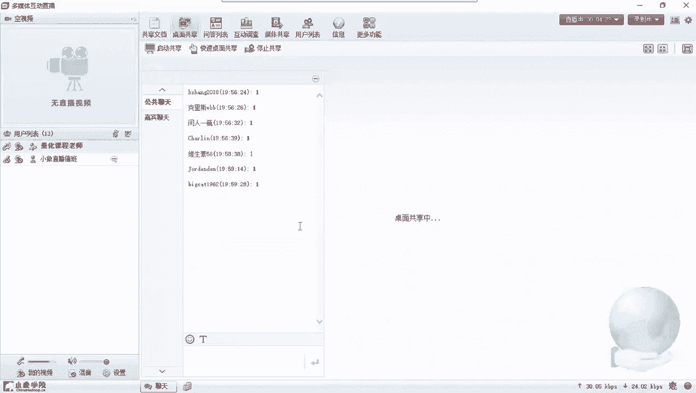

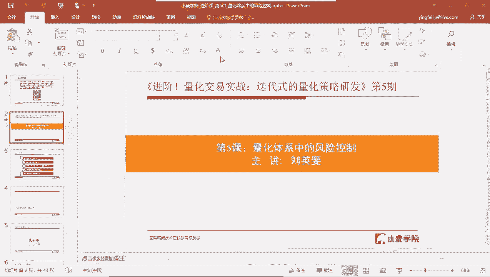

大家还记得在前几次课中，应该都给大家展示过呃，作为一个完整的量化交易系统，它其中的核心要素就那几个核心要素，大家可以回忆一下啊，跟着我的思路来回忆一下，看看我们都学了哪些，对于一个量化交易策略。

或者说对于一个量化交易系统来说，它完整的应该包含这么几部分，首先第一个是股票池，那关于股票池，大家不要被它的名字所迷惑啊，我在这里叫它叫股票池，但是呃只是拿股票来作为一个例子，来给大家去讲。

那如果你做的不是股票类的，比如说你做的是期货的或者是期权的，甚至可以说是比如说是做啊商品期货的，那你一样也有自己的交易池，那所以这里的股票池，其实他的意思就是你的交易池。

也就是说你会交易哪些种类的交易标的，比如说你做商品期货，也许你可以从那比如说螺纹钢，比如说热减版，或者是比如说像一些啊，和其呃其他的黑色系的一些商品中，去选择你相应的一部分，你觉得它适合你的策略。

那构成你的交易池，我们在这里只是统称他说叫股票池，这样就更好理解一点，然后股票池我记得前面的课给大家讲过，那股票池需要什么样的几个因素来去确定下来，对吧，这是需要大家掌握的，股票持之后是择时信号。

那么上节课给大家讲过一些择失信号，其实包括进入和退出，也就是说你的买入卖出，你的进入一般来我们说啊就是你的买入信号，比如说像你可能会用到一些技术信号啊，比如说MACD啊，比如说均线啊等等等等。

或者说你可能会用到一些其他的一些，就是测试型号，比如甚至一些基本面的信号，你都可能会用得上，那比如说你的PE达到啊一个什么区间范围内，你就可以做一个买入操作，嗯啊这是择时进入信号，在进入信号这边。

或者叫买入信号这边呢，呃一个比较关键的一个一个概念是这样的，就是你真正在实盘去操作，或者说去实际制作你的量化策略的时候呢，择时信号，或者说买入信号跟哪个指标特别相关呢，它最相关的是胜率，也就是说。

一般来说，一个交易系统的胜率，绝大部分是由你的买入信号决定的，啊当然后边也包括一部分你的啊，就是你的退出信号，就是你什么时候出来哈，那在这里给大家强调一个概念，就是嗯我们再去做趋势型策略的时候的时候。

呃，的时候呢就要相对来说，对于买入信号呢要稍微的弱化一点，呃如果你要做的是震荡型的策略的呢，对于买入信号就稍微要重视一点，那只是对于不同的策略，买入信号会起到不同的作用，为什么我要说这个。

就是因为有太多的人对于买入信号啊，做出了过多的关注，往往很多人在去设计量化策略的时候，一开始他总会觉得啊，进入信号或者说买入信号是至关重要的，把80%的精力都花在了，买入信号的设计上。

所以这句话只是为了告诉大家，对于不同的策略类型，买入信号的作用是不一样的，对于最重要的一类策略，趋势性策略反而买入信号不是那么重要好，那么买入信号相对应的还有卖出信号，你该采取什么样。

同样也会有一些技术信号会，或者说是啊通过一些其他的，比如说资金信号等等来去触发一个卖出操作，有了股票池，有了买入，有了有了卖出，那很多人会觉得啊，这基本上已经可以构成我的策略了，因为我有要买的东西了。

我也知道什么时候买，知道什么时候卖了，那是不是就已经完整了呢，啊其实不是这样，我们讲过呃，那几大核心要素，其中还有很重要的两部分，一个是风险控制，一个是头寸管理，那这节课给大家讲的是风险控制。

下节课还是由我来给大家讲头寸管理，关于风险控制，我不知道大家了解有多少，那可能做过一些交易的人呢，会有一些初步的感觉，那做风控，比如说我如果感觉最近行情不是特别的好，或者说是嗯比如说啊。

比如说今年那中美之间贸易这些争端啊，会有给A股造成很大的一些风险，那么很多人会觉得哦，这个外盘有这样的一些风险啊，内部呢也会有经济下行的风险，那在这样的一个情况下。

我是不是该对我的啊交易要更谨慎一点对吧，那不要太激进啊，这是一种类型的风险控制，但是落实到你的具体操作上，你该怎么去做对吧，该怎么样才能落实你的风险操作这个思想呢，通过什么样的一个操作去改进到你的策略。

让你的策略能够在这样的可能的风险中，能够活下来，这才是至关重要的，然后关于风险控制呃，更常提到的就是止盈和止损，那就是涨涨的，涨到一定程度，你觉得啊可以出来了，那么一个止盈，那么跌到一定程度。

你觉得这亏损已经足够多了，你可以去止损，止盈止损确实是风险控制中，尤其是策略内的风险控制中最重要的一部分，也是我们在做量化策略的时候，对这一部分是是需要做精心设计的一部分好，这叫策略内的风险。

但是大家看我的题目，我的题目是量化体系中的风险控制，那么对于我们进阶班来说，如果你只掌握一个最基础的啊，如何去止盈止损，那就显得有点单薄了，那么因为真正我们去运作一个基金的时候啊。

或者说你的或者说你不是运作基金，或者说你的真正一个量化策略，去上实盘去运行的时候，不光是要考虑到策略内的这些止盈，止损的风险控制，或者说其他的一些点啊，等会我会讲到，还包括一些策略外。

甚至是啊你的量化系统之外的，大家注意，我在说了，这里说了，量化系统主要指的是技术上的，在这之外的一些啊流程上的风控，一些制度上的风控，这其实是一整套量化交易体系的这种风控，你就像在一些正规的基金里面。

那风控是非常重要的一个角色，往往风控尤其在一些嗯大的公募基金里边，风控的角色实际上是和，比如说这个基金的真正的运作人呢，甚至是公司的领导，其实都是分开的，有可能是上层直接指派下来的。

所以风控在一个嗯策略的运行中，起到的一个，会起到一个非常至关重要的一个位置，那关于风控的重要性呢，嗯在这节课上呢，我不会给大家说太多，因为有很多你说太多了啊，你没有真正到那个就是工作的那个环境下。

到那个工作那个状态的时候，你不是特别好理解，那么很多时候当你嗯交易的多了，你亏的多了，你就会发现很多时候在股市里边，或者是在在不管是哪个哪种证券交易中啊，或者是期货交易中，如果你能首先把风险控制好。

那你基本上就已经赢了70%到80了，在股市里边啊，尤其是在我们单指股票这个市场里边，有一句话叫非常经典的一句话，就是在股市中，你的盈利是上天给你的，你唯一可以控制的是你的风险，大家能理解这句话吧。

就是嗯你我因为我们在去做量化策略的时候，很多时候特别最关注的就是我能挣多少钱对吧，但其实你要知道在股市中你能挣多少钱，不是基本上不是你能决定的，都是上天给你，所谓上天给你，就是都是这个市场给你的。

你比如说你要想在A股里挣钱，你需要有趋势，你需要有大趋势，比如说大牛市来了，你当然能挣很多钱，但是大牛市什么时候来，能不能来，这不是你能决定的对吧，很多时候都是个震荡势，但是在震荡市里边。

你要想办法去挣钱，其实还是有一定困难的，那么你你可能你的整个你的股市投资生涯中，80%的收益可能都会来自于牛市，但是牛市在整个，市场的整个这个跨这个历史中，可能只占非常小的一部分。

所以说你如果能抓住了这个牛市，你就能挣到钱，如果你抓不住，那可能你挣得就非常非常少，每年就是你你去你返回头去看，就是近几年范围内，可能真正让你挣钱的就是那么几十天，如果这几十天你抓不住。

或者说甚至就是十几天你抓不住，那可能70%的利润就会从你的里边，就是从你的最终的收益中就会跑掉，所以很多时候我们讲风险控制就是在这里，你在股市中，你唯一能控制的就是风险，控制风险是为了什么呢。

不是为了挣钱，是为了让自己活下来，以便能活到牛市来临的时候，好关于关于风险控制的这种呃重要性啊，这种思想这种理念上的重要性，我就先给大家说这么多，那有兴趣的可以自己去找一点，那种风控思想方面的书。

自己去看一看，包括其实你像我们读过的很经典的那本书啊，就是那个呃股票大作手回忆录，那像利弗莫尔他在讲，他实际上是回忆录，他讲他整个投资生涯中的一些，关于风险方面的事情，怎么去控制风险，这些方面的事情。

其实很多是特别特别有指导意义啊，建议大家可以去读一下，好，那么我们来具体看啊，因为毕竟我们这堂课不能只讲这些，我们来看看具体的呃，你再去做量化策略的时候。

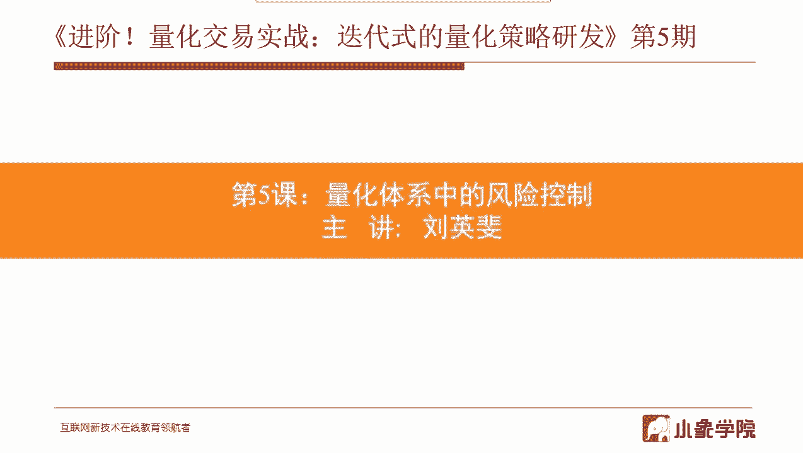

都该采取什么样的一些风控手段，以及该怎么去实现它好，那么大致分为这几部分嗯，第一部分给大家讲波动率，那波动率呢是我们再去做量化策略中非常，关键的一个指标，那它会用在很多地方啊，所以这个必须掌握。

因为嗯不光是在风控里边，包括在头寸管理里面也会用到它，甚至包括在嗯就是泽石型号里边，有时候我们也会用到它，嗯包括在股票池的制作中也会用到它，等会我可以给大家综合说一下，虽然我们在这里只讲风控啊。

我可以给大家都说一下，那在就是我们交易系统这些核心要素里面，在各个地方其实都可以见到它的影子啊，第二部分是常用的一些风险控制方法，那么这些风险控制方法呢，在初级课的时候给大家也讲过。

只是那些方法就是涉及到波动率的会呃少一点，就是毕竟我们这是进阶班的，所以在这一部分呢我会重点结合波动率呃，给大家增加一点风险控制的方法，其他的呢几种比较简单的，我就一带而过了。

然后第三部分是啊给大家给了一个例子啊，去实现一个止盈止损的模块，来去看看对于策略性能的提升能能到什么程度，那么在这里啊，主要也是基于波动率呢来给大家做一个嗯，就是我们非常常用的。

就这种浮动止盈止损的这种模块呃，第四部分呢是做一个策略性能的评估以及优化，这个主要是指在风险控制这方面，看看有什么可以优化的一个途径啊，一一，然后到最后一部分呢，呃稍微利用一点点时间呢给大家再提升一下。

就是深入的去探讨一下波动率和风险的关系，以及呃在我们通常用的这种波动率手段中啊，因为一般波动率用起来都是去度量一个，交易标的的风险嘛，那么在此之之外，我们波动率看看还有没有其他的用法。

就是同样的也是说去度量这风险，有没有其他的用法。

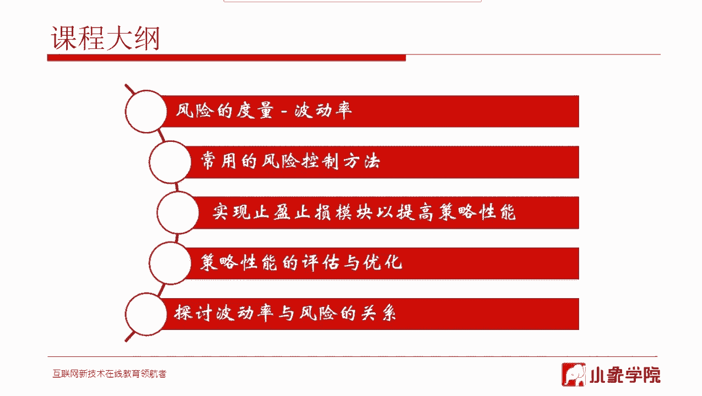

所以这节课基本分这五分五部分给大家去讲，我们先来看第一部分波动率啊，非常重要的这一部分，呃，我们讲风险对于风险，比如说一只股票，比如说大盘，比如说啊，比如说商品期货，比如说镍，比如说螺纹钢。

或者说比如说期权对吧，那尤其是期权里面，风险就这个度量指标就更多了，无论是什么风险，他总要有一个衡量的指标对吧，我这个风险到底大还是小，那么我们最常用的概念就是波动率，所谓波动率最直接的理解。

就是它上蹿下跳的幅度嘛，对不对，就是你在一段时间内，它达到比如说最大值，最小值，最大值，最小值之间这样的一个波动范围，大概是什么样的一个幅度，来去衡量出这个波动率，一般来说啊或者说嗯不叫。

一般来说或者说我们就这样定义的，波动率越大意味着风险越大，大家在这里需要稍微理解一下啊，为什么波动率越大，风险越大，因为在啊就是很多人刚进股市的时候，特别愿意去做什么样的股票呢。

特别愿意去做这个波动率大的股票，他一看，比如说某些股票每天上涨下跌的幅度非常小，可能平均一天就涨个0%点几，他觉得太小了，这个嗯做起来没意思对吧，那一看，比如说某些股票。

每天平均每天都能涨个400%分之五哦，或者说跌百分之百分之四，400%分之五，就是它波动率啊，400%分之五，他觉得这样的股票做起来才有意思是吧，就是可又因为因为他能他看到了，有些时候。

有些时候经常能涨到4%，5%甚至涨停，他才会觉得啊，这样我才能够去获得更高的收益，那这个地方其实这就叫波动率，那波动率衡量的就是这个风险，这个波动率就意味着，有可能会给你带来更高的收益。

也有可能会给你带来更大的损失，这就叫风险，大家明白这叫风险，什么叫风险，风险就是不确定越大风险越大，风险衡量的就是，它所描述的其实是一种不确定性，那如果一只股票啊，比如说从18年开始。

从一从从118年开始到现在不断的下跌，没有任何悬念的不断下跌，那你说这只股票的风险大吗，它的风险一点都不大，你要去衡量的话，它的风险一点都不大，为什么，是，因为它的下跌。

是一个看起来是个相对确定性的事件，所以他就不是很大的风险，因为它它没有更大的不确定性，反而一只股票可能上蹿下跳，今天涨了5%，明天跌个5%，然后后天又又可能涨停，后天又跌停，这才叫大的风险。

所以大家要理解这个风险和这个波动率之间，这个关系啊，它代表它它背后的含义到底是什么意思，那么，我们接着来看那波动率，刚才我们说这个描述这个波动率啊，只是一个抽象的一个描述啊。

那么对于波动率它总要有自己的一个计算方式，比如说一只股票，我们怎么去计算出它的波动率呢，或者说用什么样的一个指标来去衡量波动率呢，所以这是一步一步的哈，基本我们会用这两种，一个叫标准差，一个叫AATR。

那标准差这个好理解，AATR是什么意思，AATR是平均真实波幅呃，就是A呢是average，就是平均啊，T是true，真实R是range啊，平均真实不符，平均真实波幅，只是啊换了相对于标准差来着。

换了一种计算方法，回头啊，有下后面有给大家介绍具体他是怎么算的，但是一样的，他用到的都是啊，一天内的一些价格信息来去算出这些啊，一天一天之间的这个价格差，然后相应的去做一些数学运算，得出这个指标的。

他的其实在本质意义和标准差都是类似的，其实算出来都是这种波动性，只是说呃计算方法上略微有些区别，那么其实在使用中，这两种方法我们都会去用，至于说你用在哪个地方或者在哪个地方，你用哪个指标啊。

没有什么特别的规定，像一般我们去应用的一些范围啊，那那么在这里我顺顺带的我就给大家去讲一下，因为在刚开始我给大家说过哦，我会把那个波动率在几个核心要素里边，可能在哪些地方都用到，我给大家讲一下。

顺便说一下，我们一般在这些地方都会用什么来去衡量它，这个波动率或者是去衡量风险，那作为波动率来说嗯，我刚才讲过啊，你比如说我们的这这这些要素里边，首先我们说股票池，那股票池里边会不会用到波动率呢。

当然会前面讲股票池的时候，我们有选股条件对吧，那么波动率就很，就是经常会被用作一个选股条件，放到你的股票池的股票池里边啊，怎么选呢，就是其实从它背后的逻辑，就是你的股票池是倾向于选风险大的股票。

还是风险小的股票，比如说你将来要做的这个策略，本身就是一个非常稳健型的一个策略，对于回撤的要求非常严格，那么你在股票池的设计的时候，就可以把波动率这个指标去考虑进去，你只纳入一些波动率比较低的交易标的。

那么自然将来你的策略出来以后，就会比较的稳定，相对来说他的回撤，比如说最大回撤就会控制的要好，稍微好一点，那如果你想选择的是那种啊小盘股，波动率非常大的，因为你可能你的策略是要去打板的策略对吧。

球去抓涨停的策略，那么好，那这种策略你选一些就是大盘股，波动率非常低的股票，那肯定不合适的好，那你就可以去在你的股票池里边，去加入波动率这个指标，把波动率这个指标放大就可以了，那这只股票池里面会用到它。

那么在股票池里边我们一般拿什么来去衡量呃，波动率呢嗯就是更常用一点的，只能说更常用一点的是标准差，会用的稍微多一点，但是你用ATR也不是不可以，所以说很多时候这两个指标你用哪个，不是一个硬性规定啊。

看你习惯用哪个，或者说一般大家习惯于用哪个，可能我在股票池里边习惯用标准差稍微多一点，那就用标准差多一点啊，这是股票池，那么第二个是买入信号，那买入信号其实是一样的。

呃我们经常会我我我曾经设计过这样的策略啊，怎么去把波动率这个指标，去设计到这个买入信号里面的呢，那有时候是这样啊，就是比如说，你的择时信号，你想设计的是一个底部反转啊，就是说一只股票在底部横了很长时间。

现在要启动了，那你可以做一个建仓对吧，那么你怎么去判断它这只股票要启动了呢，因为在底下横了很长时间，这个简单你可以通过成交量啊，通过价格的变化来去啊描述出来就可以了，那么这个启动信号你怎么去描述呢。

那一一方面呢你可以通过比如说啊，近多少日的涨幅对吧，变化来去做一个描述，你也可以用波动率的方式去描述，因为有时候这个价格可能不是说，马上就要起来了，但是是说它的你去计算它每天的波动率啊。

它是开始是在逐步放大了，也就是说在底部盘整的时候很平静，参与的人不多，但是突然你发现波动率开始慢慢放大了，那就说明有人要开始参与了，这个时候你再配合其他的一些动量信号，比如说上涨的一些信号。

可能就能够去去设计出一个相对啊，稍微高一点的这样的一个买入信号，好这是在买入信号，那么相反呢在在卖出信号也有类似于这样的，就是类似的用法了，那么在股票池择时都用到了，那么接下来是什么。

是我们今天要讲的是在风控里面，那风控里面会用到怎么去用到呢，波动率呢，那么一个最简单的就是其实你前面讲过了，那股我们前面讲过的股票池，那就是一种风控手段，虽然说这是也是类似风格啊。

风格手段也是一种风控手段，因为假如说你的策策略没有说，一定要是稳健型的，但是为了风控，那起码你可以怎么办呢，起码你可以把你股票池中的一些，波动率特别大的交易标的把他们排除掉，这是就是一种风控手段。

对不对，因为这种波动率特别大的，他们的风险一定会很高的，那么我把他们从股票池里排出去，那其实就是一做出一个就是事前的一个，就是交易之前的一个风控了，那风控里还会直接用到了，就是像止盈止损里边我们会用到。

后面会会给大家去讲，所以这个我就在这先不多说了，然后下节课的头寸管理的更会用到，很多地方都会用到那个波动率该怎么用什么，那一般来说我们再去做风控，做止盈止损的时候啊，用ATR相对来说会多一点。

比如说用AATR来计算出来呃，就是一直交易标的，在近期它的波动情况是什么样子的，那么当发生了比较异常的波动的时候，你去做一个止盈止损，那这时候去度量的时候呃，我们偏向于用ATR会多一点啊，下节课要去计。

要去涉及到头寸管理的时候去计算头寸啊，用标准差的方式会稍微多一点啊，所以说其实当然不是说你啊必须要用这个，或者一定要用这个，只是说啊很多时候是一种习惯，用这个会比较多一点，就这个意思。

那你如果说我非要用标准差来去做止盈，止损也是可以的，也没有什么不可以好，这是这两个指标的额具体的含义啊，就是标准差我就不说了，自己去查啊，如果不知道的话，那么AATR什么意思。

这个文字其实已经做了一个描述了嗯，ATR是近多少天，N天真实波幅tr的算术平均值，所以说这里边就是一个一个一个一个描述，首先会有一个TR的计算啊，等会说TTR是怎么算的，比如说你在日线上去算ATR的话。

那么每天的TR你先把它算出来，然后比如说你你要算的是，近三二十个交易日的ATR好，那么你把20个交易日每天的TR都算出来，然后加起来除以20，那得出来就是最近的这一天的ATR，这就是近20天的ATR。

那么tr怎么算，这一天的tr怎么算，当然我我在这里只是举个例子，说这是逆天的tr，也就是取决于你基于什么样的K线去做，如果你是基于小时线去做的话，那么就是这一个小时的T2是多少啊，那么T2怎么算呢。

就是这三句话，今日的最高价减去今日最低价，今日的最高价减去昨日收盘价的绝对值，今日最低价减去昨日收盘价的绝对值，这三个值里边取一个最大值啊，就可以，后边有张图，我们看就是具体是什么意思啊。

嗯啊这里只是ATR的一个具体计算方法，实际上是tr的具体计算方法，大家看中间这一块哈，稍等，大家看这一部分，那在这一部分里边，这是两根K线，你可以想象啊，就是这是右边，这个是今天的啊，前面那个是昨天的。

那么我们现在要算的是今天这根K线的tr，这根K线，今天这根K线的TR怎么算呢，好有三个值，前面的描述大家看到了，有三个值都要算出来，那第一个值就H1，要用今天的啊，这根K线的最高价，这里对不对。

今天的最高价减去今天的最低价好，这得出来就是H1对吧，这是就是H1，那么H2呢，用今天的最高价减去昨天的收盘价啊，这是H2，那那H3是用今天的收盘价啊，应该是今天的最低价，减去昨天的收盘价。

然后取绝对值吗，这三个值里面取一个最大值啊，为什么是三个值，只是为了应对啊，跳空的问题，就是一般来说你H1很多时候H1就解决了，H1就是我们最重要的这个TR，这是指没有跳空的情况，如果有跳空的情况。

那么你只是用今天的最高价减最低价就不够了，因为额跳空的话，那么今天的最低价就比如说跳空向上啊，大家想一个一个K今天K线是跳空向上的，那么今天的最低价一定是高于昨天的收盘价的，对不对。

那所以我们的意思就是要啊，如果是跳空的情况呢，你你只用今天的最高价减最低价就不行了，所以要用今天的最高价减去昨天的收盘价，这有可能会更大一点，所以取一个最大值，那这三个数中取一个最大值。

就是这个max一下，那得到的就是今天的TR，那么同样的计算方式，你就可以把啊前期一段时间，每天的pr都算出来对吧，然后去计算ATR，ATR就是A，计算AATR一定要有一个先决条件。

就是你要计算的是啊多长时间的ATR，那比如说我们这算的是啊，20个交易日的ATR好，那你就需要从今天开始算，往前算20根儿，把20根K线，每根K线的AATR都算出来，然后把它们作为一个算术平均。

得到的就是今天的ATR好，基本的计算方法就是这样啊，如果没听明白呢，课下自己稍微的看一下就可以了，好那么接下来我们来看第二部分，第一部分是打个基础啊，大家知道这个，因为后边很多地方我们会用到它。

我们来看常用的风险控制方法，那一说风险控制，我们首先要知道风险分哪几类，一般来说我们说对于交易内的这些风险，我们不说，这个我们先不提这个流程上的，比如说你的公司，你的基金运行运行啊。

有可能比如说你的你的交易员，可能会给你带来一些风险啊，或者那些我们先不说，那是一些工作流程上的事情，我们先说这个交易系统内的，比如说啊，一般我们说会有系统性风险和非系统性风险。

所谓系统性风险呢啊很好理解啊，比如说啊中美之间的贸易战啊，比如说头几年那一年就是牛市出来的，确实比税印花税降低印花税呃，类似于这样的吧，嗯简而言之，就是有可能会对股市或者证券市场，整体产生影响的事件。

或者叫风险，这叫系统性风险，那如果没有，就是相对来说其他的风险就是非启动性风险，就是可能跟各跟单个交易标的相关的，类似于这样的风险，那么系统性风险呢基本上大致这么几类吧。

比如说政策面的资金链的国际环境的，那么黑天鹅事件呢就是属于一些呃特殊的事件，就是突发性的无法预料的，无法预测的这种事件啊，比如说像头几年的光大乌龙指啊，或者像一些其实像像啊就是呃特朗普发推特。

类似于这种都是如果产生了重大的影响，都是类似于一种突发性的黑天鹅事件，那，这些系统性风险很多时候是比较难判断，甚至说是无法判断的，至少作为我们普通的，比如说交易者来说是很难去，因为你你怎么可能会知道啊。

美国总统什么时候会发twitter，对不对，这个你很难去判断，那么怎么去应对系统性风险，这个呢就比较的，难一点它确实是比较难一点，但是只是说这些呢在就是经常会给我们提个醒，就是在类似于这样的环境中。

你该怎么去控制你的风险，或者说反过来你该怎么去控制你的哦，这是我们下节课的内容，你该怎么去控制你的仓位，你就像中美之间的贸易战，其实从啊18年开始就已经一直都有了，那么这个断断续续这么长时间。

这事情是一直存在的，包括从19年初开始一直都存在的，那么你可能就需要时时刻刻，在你脑子里边有一根弦，这就是这个事情有可能会发生，那么这个事情有可能会发生，你该怎么去处理对吧。

只要关键还是落实到你该怎么去处理，其实很多时候我们很难做到说呃，因为提前无法预测啊，我们能做的只能是什么呢，只能是你要去计算你的风险，比如说你要根据历史经验，历史上发生的事情，同样的事情啊去计算出来。

一旦发生类似的风险，那大盘有可能会回调多少，如果大盘回调了这么多，我的策略有可能会回撤多少，如果我的策略回撤了这么多，会不会给我的基金运作产生致命的影响，意思就是会不会爆仓，那如果你这样一番衡量下来。

还不至于爆仓，就说你在你的极限风险还会让你继续活着，那好，那其实就就你的风险还是在你的控制范围内，如果你衡量下来，发现现在的这个仓位，如果一旦发生历史上类似的事件，可能你就爆仓了。

那这个时候你可能就需要去考虑，你的仓位的问题了，那目前来说，我们只能在这些方面来去做一些提前的风控，而且这种风控是至关重要的，因为很多人其实就是他会觉得啊，这种事件不可能导致发生，对不对。

那就会抱着侥幸的心理，然后让自己的仓位越加越大，越加越大，因为他总觉得可能股市会涨，他不想错过，不想踏空，要让一定要让自己的仓位满起来，他才会觉得哦挣钱能挣很多，但是一旦发生了这种黑天鹅事件。

你就会发现你可能前期赚的利润很快就脱光了，而且会亏损很多，原因就是啊，我不知道大家有没有思考过这个问题，在牛市启动的时候，或者说在趋势起来的时候，你的仓位不可能一下子加满，你是逐步加上去的。

一点点加上去的，那么11。1点加上去的，这也是导致我们跑不赢大盘，的一个最根本原因啊，就是大盘一一直都是满仓的，你你的仓位是一点点加上去的，那么往往即便是在大牛市里边，可能你还是跑不赢大盘，所以。

当你加仓加仓，不断的加仓，随着趋势起来，你不断的加仓，加到最顶端的时候，加加满的时候，这个时候如果发生了一个黑天鹅事件，那就是满仓的情况下的一个黑天鹅事件，那那个时候给你造成的损失。

可能几天就会把你前期几个月的利润都会吐光，所以很多时候我们往往就会发现，我们的我们的呃在在牛市中亏钱的大有人在，其根本原因就在这里，你就像我们今年23月份的那轮反弹，其实反弹力度不小。

但是真正在那轮反弹里面能挣到钱的，或者能挣到不少钱的，我估计不多，当趋势刚起来的时候，你不一定有信心能把你的仓位加上去，但是真正当开始趋趋势逆转的时候，你不一定能及时出得来。

那么几天的几根阴线就会把你的利润吐光，所以这就是我们在风险控制上，要有一个就是总体风险控制上，当然关于这一点呢，我在下周啊投送管理的时候，还会在家给大家去反复去讲这个。

因为在很多时候系统风险能应对系统风险的啊，最重要的一个方法就是头寸管理，好，那么这个就其实就是类似于一种啊，应对系统性风险的嗯，怎么样去处理它，通过仓位管理的方式去处理它，就所谓的主动仓位管理。

当然这也只是一种事后了，那，因为很多时候，比如说像前几天啊，特朗普发推特，那么发推特其实往往在头一天啊，我们的大盘反应相对来说还是比较克制的啊，就是就是没有一下子跌那么多，那么这个时候你是扛着不动。

还是说你会预估到未来的风险，就是有可能中美双方会你来往往会来几下子，那么这样来几下子会造成更大的风险，有可能还会继续回调，那这个时候你就要需要去做一个主动仓位管理，你要去衡量这个风险。

看是不是要把总仓位降下来，那么你确定下要降下来，你就可以把你的仓位通过砍仓的方式，均匀砍仓的方式把它降下来就可以了，这是对，这是一种所谓主动仓位管理，当然这种方法一般只适合于用啊，两种情况。

第一种情况是说啊，就像我刚前面讲的，你要去主动去计算你的总，你的基金的风险承受能力，如果你发现当未来产生类似黑天鹅的时候，你承受不了，那你就去降仓，那还有一种是当事情已经发生了。

但是这种事情具有一定的延续性，还需要继续的发酵的时候，你要去看一看，是是不是需要去做一个主动仓位管理啊。

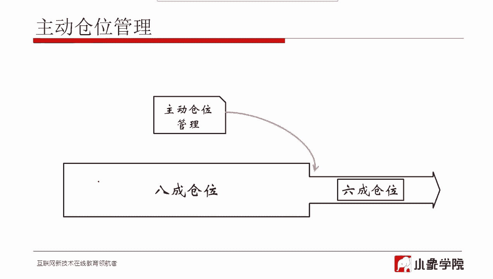

那这是在大家如果熟悉的话，应该能能大概看看这是什么时候的图啊，什么时候K线图，这是17年一七年底呃，18年初的时候，大概是那个时候吧，我这画了几个圈啊，就是首先第一个圈，这是在17年末，大概11月份吧。

11月份左右，由于轮回调，这个回调是还幅度也不算小了，那这轮回调呢主要原因是由于资金面的影响，那其实这个时候我们在那个时候，也就是在那时候就已经预感到啊，因为毕竟整个17年在资金面上都不是特别好。

因为国家是在去做金融去风险啊，本身资金的流动性就不太好，然后又临近年底，涉及到一些基金的一些，很多年底有可能会发生一些赎回的操作嘛，他们总会要去做一些啊，就是资金方面的管控制啊。

或者说需要相应的要去拿钱，过年，就类似于这样的一种行情吧，所以在这个阶段去呃，就是趋势做回调是大概率的事情，对你从资金面上能判断出来，那这个时候在这个点的时候，你去做一个相应的主动仓位管理。

是比较合适的的地方，但不一定非得这时候你可以发到，比如说当发生了这种在这两根阴线，至少这两根阴线出现的时候，你是不是就应该去出来了，至少要降低你的仓位了对吧，这是可以做出一些预先判断的。

因为这在历史上也是有征兆，因为一般一到年底的时候，都会有类似于这种资金链的风险在里边，然后啊这就是中美之间这个贸易战导致的，那这个就是当发生类似于这样的事情的时候，你是不是一定要等它它跌到这种程度。

你再去降仓位对吧，所以这个要做及时的一个仓位管理是很重要的。

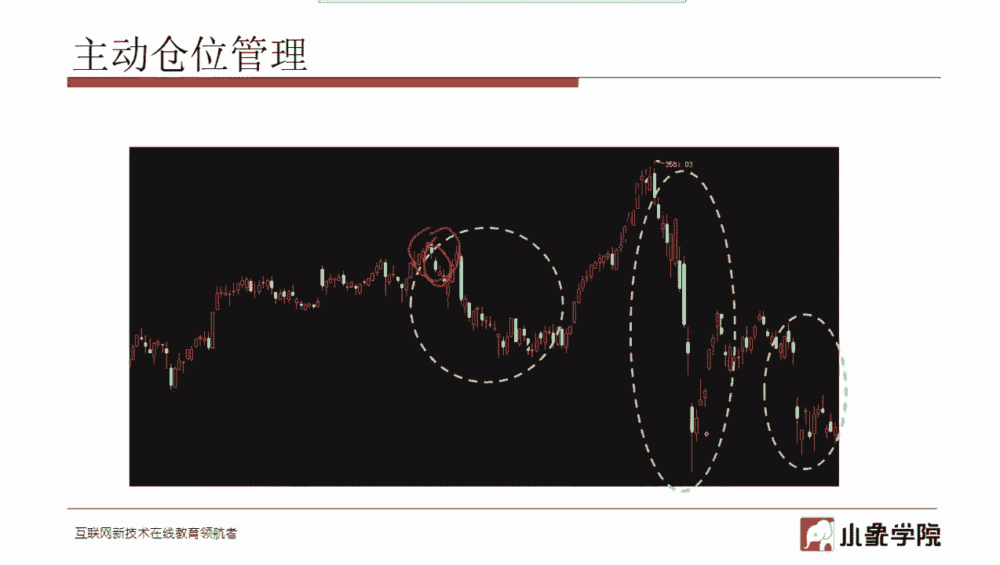

好那么除了去做主动仓位管理，毕竟主动仓位管理还是一个偏主观的一种判断，并不是量化的手段，那么去做量，用量化的手段去做嗯，风险控制我们也做过一些探索啊，不太成熟，所以在这里也是给大家列出来嗯，供大家参考。

你可以一样用一些技术指标了，比如说大盘指数的一些均线上的均线金叉，四叉啊，或者多头排列，空头排列，类似于这样的一些技术指标啊，甚至你可以用布林带等等，这样的MACD也可以去判断当前大盘的一些趋势。

同呃同样来去去相应的去控制你的仓位啊，嗯这个这三个就是只是给大家提供一个思路啊，因为我们也是做了一只是做了，在做一个初步的探索啊，还其实呃还没有找到，特别让我我们感觉非常有效的方式啊，能去做到这一点。

当然这只是研究的思路啊，有兴趣的同学呢可以顺着这思路去去看一看，那么谈完了大盘这方面的风险，其实还有一个什么风险呢，就是对于一个量化策略来说，那你的量化策略在上上线之前。

你你肯定是通过了模拟盘证实它是有效的对吧，那么上了实盘以后，可能初期运作一段时间也是有效的，但是总会有那么一段时间以后，可能你会发现诶，这个策略好像挣钱不如原来那么好了。

那这个时候你怎么样通过一种判断啊，去去决定下来，你这个策略现在还适不适合做，适不适合用，或者说它的效果是不是在下降，我该怎么办，那这时候也是同样的，有一些指标，这是其实我们曾经用过的，可以试试的。

你可以同同样的就是把你的策略啊，你的策略肯定有自己的收益曲线对吧，你把收益曲线当做一条K线来去做，制作出来相应的均线，然后呢用金叉死叉的方式当产生了死叉啊，比如说是5日下穿了30日的。

这样的一个死叉的话，你就会觉得我这个你可能会下判断，我这个策略现在的收益是在下降的，或者步入到了一个下降通道了，那么这时候呢，你可以主动的去把你这个策略，所承担的仓位去降下来对吧。

那如果达到了空头排列啊，你可能会认为这个策略其实已经接近于失效了，或者说你的策略发生了一一次回撤，特别大的回撤，那这个大回撤，可能在你在历史上去做回撤的时候，就没有发生过这么大的回撤好。

那么这时候你也可以认为，这个策略要开始失效了啊，你可以去取降低仓位，或者说是去呃干脆把它停掉，唉都是可以采取的一些一些方式啊，因为一般像我们去运作基金，我们肯定不止一个策略，都会有一个策略池。

会有很多的备选策略，那么哪一个感觉是要失效了，你可能把它停掉，你会启用啊，其他的策略上来，呃然后一些细节上呢就是关于流动性的啊，嗯一般来说你像我们去控制，比如说你去交易股票啊，基本上你要去看。

你不能说这支股票我想买多少就买多少吧，对不对，所以说你需要去看这支股票，它的嗯就是它的市值是多少，它日成交量是多少，那你相应的去要购买的头寸，就相对这个股票的市值，那就需要有一个比例关系吧。

那我们建议的数字大概是这个样子啊，以持仓头寸不能超过该股票，流通市值的2%，超过了2%呃，你买能买得进来，但是发生风险以后，你想一下子卖出去是很困难的呃，造成市场的冲击会很强。

然后日成交量不超过该股票成交量的10%，这是一样的，类似的也是呃，考虑到一个流动性的问题啊，好，还有一些风险就是关于，就是如果如果有做期货的啊，就像做期货的做期权的额，怎么说呢，就是这种带杠杆的。

我们统一来说就是这种带杠杆的，它会有一个隔夜风险的问题，你像我们做股指期货嗯，你必须要严格的控制你的隔夜头寸，否则的话如果隔夜一个跳空，你就像啊特朗普发个推特，隔夜一跳空给你来一下子，你可能就就爆仓了。

就很可能的就会爆仓的，所以说这个要控制好，一般来说你总要留出足够的资金去应付，一个一个涨停或者一个跌停吧对吧，否则的话这种风险你是是承担不了的，一般来说就是你如果你做日内的话，不要隔夜啊，做做这种。

其实做股票也是类似的啊，做股票你像要过节啊对吧，国庆节或者春节，如果你的头寸啊都要过节了，还非常的重，那这时候风险就比较大，因为你不知道过节期间可能会发生什么事情，万一发生一个利空的对吧。

比较大的利空的，那可能你这么重的头寸会呃风险非常大，这样的话会造成很大的损失，所谓持仓不过节嘛是吧，所以你就会你会发现啊，很多时候在过一些大节的前一天啊，基本上或者前一天或者前两天呃。

原来我记得头几年还是前一天就会啊，才会可能会有一个剧烈的回调，就是因为很多人他不想持仓过节嘛，所以在那一天集中去卖掉，现在呢市场都在演化，那基本上都是在头一天，头两天或者头三天。

大家都慢慢把把仓位都降下来了，所以说这种回调呢就会提前啊，都有存在这个这种这种问题啊，就像10月1啊，10月1要到了，那你该怎么去呃，提前把你的仓位如果比较重的话，该怎么把它降下来呢。

好那么讲完前面的这些，实际上我认为是一些就是这叫什么风险，是一些嗯你的主风险控制系统之外的一些，比较分散的一些框框啊，这些比如说你的系统性风险怎么控制啊，你的流动性啊等等一些点，这些要注意到的一些点。

那么最系统的对于风险控制来说，就是你的止盈止损系统了对吧，那么对于止盈止损系统来说，那止盈止损有很多的信号了，方法我们在这我在这里给大家列了这些啊，其实这些绝大部分在前面的初级课都讲过。

像这些这些都讲过嗯，这个呢在初期的时候也提到过，但是呢，那在这里呢会给大家稍微加点内容，所以在前面这个呢我给大家稍微快速过一下啊。

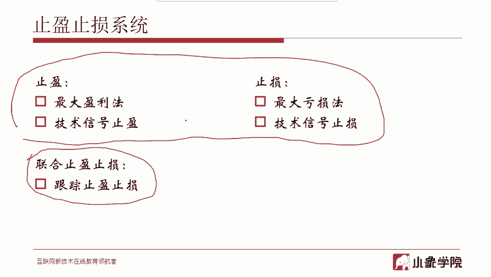

重点讲讲后边这个，我们先来看就是所谓第一种啊，最大盈利，最大亏损，那其实这个没有什么什什么就是可讲的，其实就是画一条线到达，比如说8%我就止盈，而亏了5%我就止损，这就是最大盈利。

最大亏损就就是这样的方法，只不过说你在画这条线的时候，你要自己去注意嗯，别太主观上去画，你怎么也要看一下，比如说一个最简单的啊，我前面都讲过波动率啊，波动率的问题大家注意看。

比如说你计算一下这个波动率大概是多少对吧，相应的然后再去根据波动率大概估的，再去画你的线去，或者说你根据嗯支撑位与压力位对吧，去换一个线圈，这其实涉及到后面技术指标的止盈，止损都是类似于这样的。

那止损就很多时候就更简单一点，就根据你的可承受的损失的这个这个程度啊，去画你的止损线就可以了。

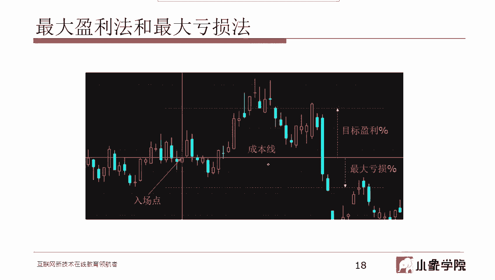

好那么啊技术信号止盈止损嗯，这个可能知道的人就更多了，因为在很多时候啊，我们是把这种方法拿来去做推出信号的对吧，比如说你啊金叉买死叉，卖这个上穿下穿这种信号就去做一个，比如下穿信号对吧。

你做一个执行止损就可以了嗯。

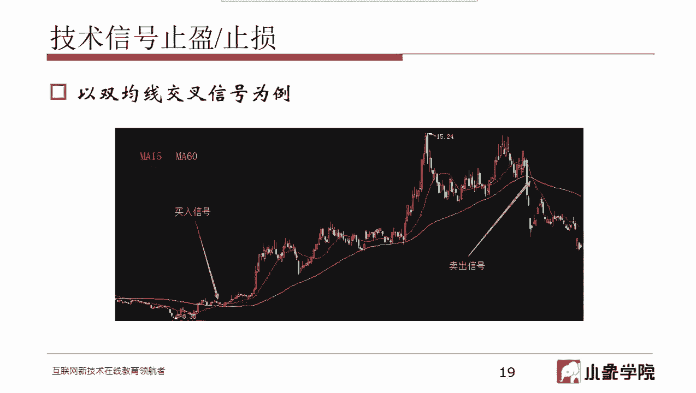

那么最后是跟踪止盈止损，那跟踪止盈止损其实是我们用过的，或者说其实不不不不只是我们用过的，其实是在止盈止损系统中，我我们认为是最有效的一种方法，对于绝大部分系统是最有效的一种方法，那所谓跟踪止盈止损啊。

原来也有一种叫法叫回撤止盈啊，或者回撤止盈止损，那我们把它统一起来，就是把止盈和止损统一到这种方法里面去，那比如说，这是你的建仓点，那么你建仓完了以后，我就开始去实时的跟踪当前的最高价。

建仓点以后的最高价，那比如说像这个走势啊，刚一建仓就开始往回回调对吧，那么当前的最高价是哪个呢，就是你的建仓价，然后从你的最高价如果回撤了一定的幅度，比如说你先规定好了，我要我从最高价回撤3%。

就去做一个退出好，那么就是从啊你监测完了以后，从这个最高价你就开始实施去计算了，比如说回车到这个地方的时候，你去算一下这个回撤的幅度，有没有满足这个3%，如果没有满足，那你就不会出来对吧。

还会接着再去继续持有好，那么趋势继续往上走，那么当往上走，比如说走到这里的时候，那么好，这个最高价就会实时更新到了这里对吧，因为这个位置已经比这高了，那么建的最高价就是在这里，那么接着往上走。

那这里就成为了一个最高价，对不对，好，那趋势开始回撤，那么趋势回撤的时候，你要去计算，当回撤到这个点的时候，比如你计算这个点相对于这个点回撤的幅度，是否满足3%，如果不满足好，继续持有。

那这个趋势继续往上走对吧，这个股价继续往上走，当走到这儿的时候，你的最高价已经更新到了这里，对不对，因为这个地方已经更高了，那么接着往上走，走到了这里，那这个地方就是你的最高价对吧。

你的更新的实时去更新最高价，那现在最高价是变成这里，那么趋势开始回调，当回调到这里的时候，你去算了一下，发现从这里从最高价回撤到这里，已经大于了3%好，那么在这里你就需要做出一个回撤的止盈。

或者说是止损，因为这边在这在我看这在这里画的这张图啊，如果你在这里出来，那就是一个止盈对吧，因为你是盈利的呃，相反如果这个地方啊，如果这个地方如果真的满足了3%，那你如果从这出来，那你就是止损对吧。

你亏得出来，那就是止损，所以这就是跟踪止盈止损的一个呃，它它的它的方法就是这个样子，所以大家看到这种跟踪止盈，止损的方法的好处就在于，第一可以很好的去跟踪一个趋势，第二还可以及时的出来啊。

这是一个非常非常好的一个一套系统啊，那在这里面会有一些需要注意的地方，什么地方呢，就是我刚才也说啊，回撤了3%，你就可以出来，那么这个3%对吧，这个3%你是怎么确定的呢，你可以拍脑袋。

我就定一个3%对吧，但是更科学的办法呢，你要经过一定的计算度量来去算出来，到底应该是回撤多少，那一个好方法就是用到前面讲过的波动率，什么意思呢，大家可以理解一下，就是比如说你计算出来建仓的时候。

你计算出来啊，比如说这个时候，你计算出来这个时间点的波动率，比如说你算出来了是1。5，这波动率啊，1。5什么意思，意思就是在前期一段时间窗口，这一支交易标的，它的正常波动就是1。5对吧。

大家理解是正常波动就是1。5，那么什么时候我该去做一个回撤，止盈止损的这个幅度该定多少呢，一般我们我们会基于这样的一个逻辑，就是如果发生了比正常波动更大的一个回撤，我们才退出，否则的话。

如果这个回撤幅度比正常波动要小，那么我们就认为这个回撤只是一个正常的波动，我就不需要出来对吧，他就是个正常的波动嘛，我不需要出来，相当于就是个市场噪声，我不能被噪声震出来。

所以往往我们会我们会这样去定义啊，就是从就是什么叫怎么去定义的，跟踪止盈止损呢，就是从最高价回撤几倍的波动率，我才会出来，比如说我要回撤两倍的波动率，我才去做一个止盈止损。

所以是这个的这种用计算用的方法，用这种方法，那具体到指标上呢，就是我们在这里用的比较多的是ATR，我们会把建仓这个时间点，比如你建仓了吧，我会把这个时间点的ATR去算出来好，那么我会定义好。

比如说当从最高价回撤了两倍的ATR，就去做一个退出好，那么两倍的ATR是多少，你把它算出来，比如你算出来正好3%啊，那么那就把百拿3%来去做一个这个要求，必须从最高点回撤3%，你才出来对。

如果你算出AATR是比如是二，那么两倍AATR就是4%嗯，那你就需要用4%的这个指标来去来去，计算这个这个回撤的幅度，好只是跟踪止盈止损，啊这个给大家讲完了，那么接下来实现止盈止损模块去提高性能啊。

这这一部分呢呃稍微给大家快一点讲，因为这是基于我们前面的策略给大家讲一讲，有一点点代码，那这个代码我把呃，其中最核心的逻辑给大家讲一下，具体的代码大家可以自己去看，因为课上讲代码讲太多了，太浪费时间。

嗯这是我们前期的策略对吧，还熟悉吧，前期都讲过这个，那唯一的做了一点点改变啊，这个地方就是原来做股票池的时候用的这个，因为做股票池，你你你股票呃，股票池的一个调整，一个在平衡呢会牵扯到一个仓位的调整。

那持仓的调整，那我我我们在这里呢，在平衡时不进行买卖操作啊，就是即便你的持仓股已经从股票池中调出去了，那这个持仓也不要主动的去卖掉啊，我们在这里要重新去靠一些技术信号去做，买掉嘛，就是靠这定义的。

上节课做的做了一些定义，比如说这个几种条件啊，MACD啊，或者是均线啊，用这种方式，这是卖出条件，这都是原来的策略，那么，不知道大家有没有去就是上节课讲完以后，有没有拿这个具体的代码去去试一试啊。

去试完以后还有一个非常重要的，你要去看看交易记录啊，如果你把交易记录仔细分析一下呢，你可能就会发现类似于这样的问题，那首先第一个比如MACD底背离以后，那你底底背离你要去做一个买入，对不对。

底背离你去做买入，他有可能是是是假的，有可能会继续下跌，如果你把顶背离作为唯一的出场条件，有可能会出场就有点太晚了对吧，所以呢我们需要去找到一个，更加及时的出厂信号。

那就是你不要总是等到顶背离或者等到死叉，那就太晚了，可能会把你的利润回吐了很多，所以这时候呢我们就可以去利用一些止盈，止损的手段来去找到，就是相应能更加及时的出场，好额，那正好我现在正好九点了。

我们稍微休息吧，稍微休息5分钟，然后等会过来，我们接着讲，呃我看有同学提没有什么声音，现在大家能听到声音吗，线下的同学听我的声音清楚吗，啊对因为我是我是刚才回来，看到中间有同学说声音好像不太好是吗。

现在没问题吗，就是刚才上课的时候啊，出现了几次啊，行行，只要不太影响大家去上这课就可以，行好谢谢，那我们还是大家还是接着稍微休息一下，稍微休息一下，好谢谢，休息5分钟，好同学们，我们继续开始上课。

大家再试试，现在声音没问题吧，没问题，我就开始讲了，好谢谢我们开始继续我们的课程，接下来我们来看哈，就是上面那个策略啊，我们简单来看一下这个策略是呃怎么实现呢，以及该怎么去评估优化它，好。

那么我们要在前面给大家讲过的那个回忆的啊，回忆的那个策略里边嗯，因为通过分析交易记录，我们发现他的退出很多时候不太及时，尤其是对于啊趋势性策略来说，大家还记得前面我给的，我给翻到前面哈。

前面给大家分析啊，最后的优化思路的时候，那么第一个是说底背离以后啊，这是一个进场型号，底背离以后有可能会再次下跌对吧，那这是一个你要去优化你的啊，入场信号的这个问题，然后还有一个是出厂型号。

把顶背离作为唯一的出厂条件，会导致出场太晚，这是你出厂型号要去做优化的问题，那最终我们要去优化，你就会牵扯到两个方面对吧，两个方向，一个方向是说你要去从你的入场信号去做优化，你要去比如说底背离。

你觉得啊不是特别准确，你可能要去再增加点其他的，比如说是不是要上传了均线啊等等，那这是一个优化思路，另一个优化思路是说，你要去优化你的出厂顶背离太晚，我是不是要增加点止盈止损啊等等。

所以当遇到这样的情况的时候，你该怎么去做对吧，应该怎么去做，但是很多时候我们是去呃分析我们的交易记录，我们可能能发现这样的一个问题啊，就是，你我们经常会把交易记录其中的负样本拿出来，所谓的负样本呢。

就是指那导致你亏损的这些交易拿出来以后，你可能去分析啊，有些是因为你的入场信号不对对吧，比如产生的底背离，你进去了，发现它继续下跌了，还有一种是虽然说你进场是没问题的，但是呢你出场太晚了。

就像这种金叉进死叉出出的时候太晚了，导致你大部分利润都已经被回吐掉了，所以在这种时候你该去优化哪部分，你是去优化进场还是优化出厂啊，你可能说我我两边都优化，对不对，当然你都提优化是是是没问题的。

但是你总要有你的重点，或者说这么说，就是你优化哪一部分，可能会对你的策略产生更大的效果呢，那我前面也给大家讲过啊，对于趋势型的策略来说，更重要的是如何出场，而不是如何入场啊，大家记住这个前提啊。

是对于趋势性策略来说是这样的，所以往往我们去设计趋势型策略的时候，就是简单来说我们可以把它称作是宽进严出，所谓宽进呢，就是，我会尽可能的把趋势先放进我的交易系统里，先把它放进来，而不是说在入口。

那就把绝大部分都排除掉了，有可能因为这样，有可能你会把一些本来就市趋势的也排除掉了，因为不可能有一个系统去说做到，我能严格的把所有的趋势全放进来，只要不是趋势的全排除出去啊。

这样的入信号入场信号是不存在的，没有一个什么信号能做到这一点，那么所以像这样的我，我们为了去保证我尽量能抓到更多的趋势呢，我又在我就需要在入场信号那稍微的宽泛一点，所以所谓叫宽进，把他们钱全都放进来。

再说，放进来以后，然后研出，所谓言出呢，就是我会严格的规定我的出厂信号，精心设计，我的出厂信号，精心设计，我的止盈止损信号会导致什么呢，会导致这个趋势如果是对的，就是你放进来的，如果是真的是个对的趋势。

我会尽量多的去吃到这段趋势，如果你进来的这个趋势是错的，那么我会通过止止止损的手段，让我这一波假趋势啊所造成的亏损尽量少一点，少亏多赚，所以很多时候就会类似于这样的，因为往往我们去做趋势性策略。

就是这样，你可能会发现十十笔交易里边，其中可能啊六笔七笔都是亏的，那其中可能只有三笔是赚的，但是我通过止盈止损的手段，可以去控制你亏损的那七笔，我每一笔亏的都不多，我都及时止损了。

但是我赚的那三笔能让我赚很多，因为我我能尽量的去抓到这个趋势，比如说通过跟踪止盈止损的方式，我能尽量去抓到这个趋势，所以这就是往往我们去设计趋势性策略的时候，这个这个呃一个特点就在这里啊。

就是属于低胜率，高赔率对吧，就是胜率都不高，可能能到40%就已经算不错了，但是赔率很高，就是我赚一次能赚很多，所以是这样，所以在跟踪止盈止损这种方法，用在趋势类策略里边是非常的好的。

那在这个策略里面我们就用到了这种方法，就是跟踪止盈止损的这种方法，从最高点回撤相应的百分比，百分比就去做一个退出，那我们是这样来定义的，这个跟踪止盈止损，从最高点回撤N倍的AATR去做一个止盈止损。

那这个N倍的ATR你在这里可以去设定，你可以去自己去试啊，因为有我们的代码，你可以去设定两倍的或者三倍的，去看看这个效果啊，就是因为很关键的一个参数就在这里，你到底设几倍的ATR对吧。

你可以大家可以去自己试试，设不同的数值，看看效果是什么样子的，直观的判断呢，如果你在这里设置的，比如说你设了个一倍的ATR，那你在最终的策略的体现上啊，因为我们去衡量一个策略，最终往往去看他那几个指标。

年下年化收益向下坡，比率向最大回撤，你可能会发现你如果你设了一倍的ATR，你可能会发现啊，最大回撤变小了，但是呢收益有可能会降低的对吧，原因就是相当于你的止损严格了。

因为从最高点回撤了一倍的ATR你就出来了，那这时候呢当出来的时候，当止损的时候啊，真正止损的时候，你造成的损失会少一点，但是有可能会导致你抓趋势啊，只能抓一小部分，很容易被震出来对吧，就是趋势中。

可能趋势中间的一个小回调就把你震出来了，如果你为了抓到更大的一个趋势，你可能设的稍微大一点，就设了三倍四倍的ATR，那这个时候有可能你的收益很多，趋势能抓的更大，但是如果一旦发生止损对吧。

就有可能你一建仓就掉头向下了，这种情况，那你你相当于要撑到三倍或者四倍的ATR，才能止损出来，那这个最大回撤，可能就是一个可能会变变变差的一个指标，那最终反映到下坡比率上。

因为下坡比率是综合去反映这种风险收益的，最终反映到下坡比率上，那有可能高有可能低，这时候需要你通过回测的手段来去调调看看看，找一个相对于比较均衡的一个位置去做，好我们来简单看一下代码，就是这个是实现呃。

回收NBAATR止盈止损的这个代码，给大家去讲一下，实现回车N倍ATR，首先大家回忆一下它的定义啊，我们需要什么呢，我们第一需要建仓点的ATR，你要算出来，第二当前的记录下来的最高价你要算出来。

然后从最高价你去减一下这个N倍的ATR，再和当前价格去比较一下，就知道你现在是否要去做止盈止损了对吧，所以需要计算的这信息就那么几个，首先我们来看呃，这个函数，before market open嗯。

熟悉区块代码的人会知道，这个函数呢指的是在开盘之前你要做点什么，呃一般这个这个这个接口函数会放在呃，就是像区块里面有这个run daily函数啊，会放在那个地方。

rn daily里面的那个before open里面，在开盘之前要更新几个参数，更新什么呢，嗯首先呢我们需要把今天开盘之前，到前期一段时间，从建仓点啊，从建仓点到今天开盘之前的最高价是多少。

先把他们算出来，然后呢，你盘中今天盘中实施的价格，在和这个前期的最高价去做一个实时的比较，就可以更加快速的去算出当前这个时间点，我该采用什么最高价对吧，否则你那每个时间点都要去把过去。

从建仓点到现在所有的这个价格都去算一下，算一下最高价是多少，计算量比较大，为了提高速度呢，那就我先在开盘之前先准备好对吧，把今天之前的最高价先算出来再说，所以说在before market open呢。

我们就要去算一下这个high price，high price呢就是用get price我们去把呃，这只股票的从建仓的时间开始，一直到当前时间对吧，我们把他的最高价就是一分钟线，这one minute。

一分钟线的每一个最高价high都拿出来对吧，一分钟K线的每一个最高价都拿出来，拿出来以后，这个序列拿出来以后，把这个序列求一个max，得到的就是，那今天之前的最高价好，那么今天之前的最高价拿出来了。

我们把它放在缓冲区里边去，放在这里面，放在缓冲区里面记录下来，这是第一个要做的更新持仓股票的最高点，第二个要做的，因为你建仓完了以后，当时计算出来了一个ATR对吧，你一建仓计算出来ATR就把它存下来了。

然后就有待于后面去用，那么在每天开盘之前，你都需要对这个AATR已经算出来的，这个建仓点的ATR要去做一个更新，意思就是要重新算一下，为什么为什么要重新算一下，如果你还记得前面ATR的计算。

你会发现那个AATR计算就是最高价减最低价，就这就这三个值，最大值对吧，他用的是个是个绝对数值，不是一个相对的，像涨幅这样的一个绝对数值，它就是价格最高价减最低价这样一个绝对数值，那么。

你在建仓的那个时间点计算出来个ATR，到了今天那个数值是不是需要修正，是不是会发生变化，大家要注意这样的一个问题啊，尤其是我们在去做呃，当初我们在实现自己一整套交易系统的时候，经常会遇到这样的陷阱。

就是关于赋权的问题，比如说你在建仓点算出来一个ATR是三，大家记住啊，这个三是个绝对值啊，其实就是一个最高价减最低价值，这样的一个一个价格之间的差，算出来的一个数值，但是到了今天，如果建仓以后。

那这个股票的价格本身就已经发生变化了，对不对，那这个时候你再用出圈之前的那个算价格，算出来AATR用到今天，在今天这种价格上去用，是不是就不对了对吧，因为比如说在你建仓的时候，这个股价是20块钱。

那当天的最高价咱最最低呀，这样算出来可能是算出来13，现在这个价格就是一每一股的价格从20块，你一出最后变成了十块钱了对吧，它便宜了，比如说发生了那个呃高送转啊或者定增啊等等，便宜了变成十块钱了。

那么这个十块的价格，你如果直接拿到十块的价格，和这个三这个AATR直接去用的话，他们中间他们肯定是不匹配的对吧，这就是为什么在每天开盘之前，都要对建仓点NTR做一个更新重新计算。

所以说在这个before market open里边呢，我们就需要对ATR重新算一下，好重新算一下，然后把它存下来就可以了，再重新存到这个缓冲区里面，那么算ATR怎么算，在这个函数里边。

这这个我就不给大家去再细说了啊，因为这个代码大家可以自己去看，简单来说就是呃因为ATR用到了就是最高价，收盘价对吧，还有最低价，那就是把这个价格就是过去多少天这个价格，比如14天这个价格。

你把最close high和low都拿出来，拿出来相应去算就行了，两种方法去算，一种方法是你完全根据前面给大家讲的啊，三个值取最大值这个方法去算出来就可以，这种函数去算就行了。

这个TAAD5里面这个AATR这个函数，系统函数，把这个相应的这个最高价，最低价，这个这个相应的序列去去传进去就可以了，最高最低和收盘传到里边去，用tr td这个函数就可以算出来，当前T2是多少好。

那么我们现在有了ATR，有了今天之前的最高价，那么接下来我们在今天的盘中，就要实时的去算出来当前的最高价是多少，然后减去N倍的AATR就可以了对吧，所以在，呃真正的这个止盈止损的时候呢。

我们要怎么去做呢，我们要去实时的去算出来当前的最高价，对不对，好，那么这时候去做止损，首先在持仓股里面啊，这个大循环拿出持仓股里的每只股票，相应的去看哪一只要去做啊止盈止损了。

所以要去算一下前面这一些代码呢，都是做一些安全性的验证，比如说像呃你是不是有可需要卖出的标的啊，是不是比如说是不是跌停了对吧，像这个是不是is low limit，是不是跌停了，因为如果跌停的话。

你是卖不出去的，也是不能做的，所以这里都是做一些安全性的验证，然后接下来我们要去呃算一下，在整个持仓期间的最高价到底是多少对吧，那么今天之前的最高价你都拿到了，那我现在要知道的就是今天的最高价是多少。

那么今天的最高价一样，就是用get price的方式去，把今天的所有的价格都拿出来，那一样get price里边开始时间是什么呢，开始时间用的这个start date started。

在这里设定的就是今天的0。0分，今天的0。0分，所以简单来说，其实如果你是A股，就可以是从今天的，比如说从九点开始就可以，然后结束时间呢是当前对吧，当前的时间好，相当于把今天所有的这种呃一分数线拿出来。

取同样的用max方式去计算出来今天的最高价，然后在这里边把今天的最高价，和我前面算出来的，今天之前的最高价去做一个比较，取一个最大值得出来的，就是我想要用的那个最高点，然后，接下来最高价算出来以后。

那么去算N倍的ATR止盈止损的话，那就是这一句话就可以了，如果current price小于等于high price，减去多少倍的ATR对吧，这这是个宏定义啊，嗯你再回头可以在在我们的代码里面。

你可以去调整一下，把这设置不同的参数去看看额能起到什么效果，那如果小于它，那就说明要去做一个浮动水平止损，那这时候去相应的去做一个卖出操作就可以了，好，那么这就是跟踪止盈止损。

这样的一个大致的这个代码上的一个计算过程，那我们来看一看，增加了跟踪止盈止损以后的这种回测结果啊，先来看这个，这是之前的，上面这张图是没有增加跟踪止盈止损的啊，那么是这是均线的方式。

择时信号是用的均线没有增加的呢，这个大家看年化1。61夏普是负的，最大回撤36度，那么增加了回撤止盈止损以后呢，年化收益变到了十，好了很多吧，下腹到了0。8，这个改善就非常明显了。

最大回撤少了一半多对吧，所以大家看增加这种风控模块以后，对整个策略的优化程度是非常明显的，非常明显，接下来MACD那上面这个年化收益，10。18，夏普0。4最大回撤九，增加了回撤止盈止损以后呢。

年号收益八降了一点，还稍微降了一点哈，夏普降了一点点，但是最大回撤其实优化的还是不少，从九降到了五，所以总体来说对于他来说，就是增加了这种风控手段以后，因为MACD本身这种测试信号。

相对来说比刚才那个均线就要稍微好一点，增加了回撤止盈止损以后呢，相当于牺牲了一点点收益，但实际上最大回撤小了很多对吧，然后最大回撤小了很多，因为有时候我们要去衡量，我们其中有一个指标去衡量。

这个策略到底怎么样，就是我们会用一个叫啊翻盘年数，就是用最大回撤比上嗯比上年化收益，或者说用年化收益比上最大回撤啊都可以，一般来说如果用年化收益比上最大回撤，就是要看哪个更更更大一点，会更好一点。

像这个上面这是用10。18比上九，下面的是8。02比上五，很很明显，下面的会会更好一点啊，好那么这是对于这个策略来说给大家讲过的嗯，增加回撤止盈止损以后，或者跟踪止盈止损以后，所带来的一些优化效果啊。

那么很自然的就是我们会去想，那有没有更进一步可以优化的地方对吧，我们怎么去进一步去控制风险，我们在前面给大家定义策略的时候呢，呃对于发生买入信号的这些交易标的，我们怎么去买呢，就说是买多少呢。

基本是采用均仓买入的手段的，就是对所有的交易标的来说，我们都一视同仁，那么从风控的角度来说，如果你要更好的去降低风险，那么一个办法是什么呢，就是对于风险比较大的交易标的，你是不是就应该稍微少买一点。

对于风险小的交易标的才可以多买一点对吧，这样的话，从总体上就会把风险控制的稍微小一点啊，所以这就是你可以去进一步优化的地方，但是这个进一步优化的地方怎么去做啊，这是我们下一节课的内容。

因为这牵扯到头寸管理，也就是说当来了一个交易信号，你要去做一个买入操作的时候，你到底该买多少，所以这是我们下节课要讲的，所以我们后面再给大家去进一步去探讨，好那么嗯最后一部分呢给大家稍微扩展一点点。

就是我们来讲一下呃，因为毕竟波动率这个事情是和风险，这个事情是是是很重要的一件事情，因为像尤其是在我不知道大家啊，有做过交易的同学，在近期的这些行情里面，尤其是像中美之间的这个贸易战。

所导致的这种系统性风险啊，啊就会给大家一个警醒，在这样的条件下，我们该怎么去做风控，因为我们嗯就是你可能就会发现，我前期本来持仓好好的挣钱也挺不错，但是一个这样的一个就是特朗普发一个推特。

我的我的利润就会砍掉一大部分，发一个推特就被砍掉一大部分对吧，这个你你不能说可干涉到别人该怎么做吧，但你只能去想办法，我自己该怎么去做，那这个时候呢，就你就需要去严格的去衡量你这个持仓。

它的风险到底怎么样，它的波动率到底怎么样对吧，很明显你像其实我们在啊，因为我们经常也会写一些关于大盘走势方面的，一些盘评这些，那我们经常会给大家推荐的一种方法，就是一种投资的方法。

尤其是对那些呃不愿意去做特别深入研究的，就是我我不想花太多的时间去学习，该怎么去选股，怎么去做事，那么其实一个很额相对来说比较有效，操作又简单的方法，就是你去跟踪大盘。

就好比如说你去买跟大盘相关的一些ETF对吧，就像我们现在市场像像50ETF，300etf，500etf，甚至包括创业板ETF，那么买这些的一个好处在哪里，第一你就略过了选股这个阶段对吧。

因为毕竟ETF就这么几个嘛，尤其跟踪大盘的ETF就那么几个，那至于说不同基金的这种ETF，那你就选选择容量最大的就可以，那他们的波动率比个股都要小很多，相对来说风险就会小很多，就是你亏也亏不了太多。

但你挣的是什么钱，其实你挣的就是我们叫就是你你讲到一个收，我们讲的就是一个收益，有一个阿尔法收益和贝塔嘛，对不对，其实我们挣的就是贝塔的钱，因为就是大盘的涨跌所带来的钱。

那这种操作手段反而有时候是非常呃简单，而且有效的，只要你能坚持下来，那更简单更有效的是，像有些稍微水平高一点的人呢，还可以去做一做择时对吧，就是因为做ETF你也可以去做做择时嘛，就是这高抛低吸啊等等。

就这样的，就相对于来说让你的呃收益更平滑一点，不至于说因为有些人的风险承受能力不一样，就是可能ETF毕竟他也有回撤，尤其像发生系统性风险的时候啊，几天跌个跌个七八个点也是正常，那为了去平滑你的收益曲线。

或者去让你短时间的那种收益不会亏损，或者亏损不会让你太难受，那你就可以去做一点择时，但是实话告诉大家，就是择失这件事情其实是很挺困难的一件事情，不是特别容易的啊。

那除非你用量化的手段非常严格的去做了回测，做了这样，那可能还会有一定的依据，如果你完全说凭感，凭自己的感觉，凭自己的盘感去做一个主观操作择时，很多时候你折来折去的可能会发现还不如不择。

那所以一个挺简单的一个手段，就是你也不要去做事，做做时你就去做一个指数ETF的定投，这样呢从收益和风险的角度来说，会做一个非常好的一个平衡，那这就是为什么我们去选择这个ETF去做交易。

这个原因就是因为波动率小，风险小，对于我们一般的投资者来说更容易接受，不会对你心理产生更大的冲击，否则像那种上蹿下跳的股票呃，今天跌个，比如说你涨了一段时间，可能一天可能就会跌个7%，8%。

或者连续跌几天就会受不了，那么，具体来说啊，我们具体来探讨这个事情，嗯我之所以把这个问题摆在这里，是因为前期有学员问过这个问题，就是啊为什么波动率可以衡量风险，因为在他的想象中的概念中啊。

就是波动率幅度大，我可能才会有有钱挣嘛，是不是我才能挣到更多的钱，为什么还叫风险越大呢，那这个这个话题其实我在前面给大家讲过啊，就是波动幅度大，它就会有一个向上波动和向下波动对吧，就向你有利的方向波动。

向你不利的方向波动，那这种不确定性其实就是个风险，风险和亏损，大家注意啊，风险和亏损是两码事，风险不一定是亏损对吧，风险可能是收益，所以说风险代表是不确定性，亏损是一种确定性的事件，它不是风险。

嗯这就是为什么，我们经常会去在股票池那去控制相应的，你的波动率不能太高对吧，这就是从从这个角度来去控制一下风险，好，那么，接下来对于波动率和股市，之间的这样的一个关系啊，给大家讲几个啊。

我们观察到的一些特征，因为在A股里面，经常的是一种呈现一种缓涨急跌，那这种缓涨急跌呢，有时候就会造成一些呃就是我们的收益呀，很多时候就是你看着好像在还涨的时候，不断的在增加，不断的增加。

但可能几天的急跌就会把你的收益给跌没了，就是这个原因造成的那波动率这个事情，经常它是和A股呃，或者说和股市的走势会呈现一种负相关，所谓负相关什么意思呢，就是呃在股市里面，可能你收益亏损增多的时候啊。

波动率其实是一种放大的一个阶段，就是在熊市的时候往往是放大的，在牛市的时候，尤其是在牛市的初期或者中期的时候，波动率相对来说是稳定的时候，然后牛市的末期就是即将反转了，到最后最后的疯狂了。

波动率才会放大，真正震荡式的时候，波动率反而会减小，所以说它都会呈现这样的一种不同的呃特征，所以呢这也是给我们去做额股市操作，尤其是像有时候你去如果不是量化，你去做主观操作的时候，有时候就会发现这样的。

如果在上涨的过程中，你突然发现波动率异常开始放大了啊，这时候涨幅也开始放大了，成交量也开始放大了，那么这时候很多时候就意味着一个最后的疯狂，所以这个时候你要就要小心了，是不是要牵扯到在一些高点。

或者说在一些涨不上去的一些点，就冲高回落的一些点要去做减仓了，那么很多时候我们再去做量化交易策略的时候，用，为什么说叫用前面讲，用波动率来去做你的择时信号呢，那么很多时候就会去这么去用对吧。

你要去描述这个波动率的一些特征，那这个波动率是在一种放大还是一种缩小，那在不同的特征上，我们需要用到不同的这种呃，就是折射信号对吧，就像刚才我描述的这个，如果你发现波动率在价格上涨到一定程度以后。

突然产生异常的放大，那这个时候从你的量化交易系统的设计上来说，可能就要去考虑到这种情况，这时候是不是可以作为你的一个退出信号，然后对于啊波动率去衡量风险这件事情呢，还有一个是呃。

我叫它叫绝对风险和相对风险的问题，那么这个在我们嗯曾经做过的一个策略里边，就是我们真正上过实盘的一个策略里面，用到过类似于这样的一个思想，一般来说我们用波动率去啊，衡量一个交易标的的风险。

我们用的方法都是像前面的，就是呃前面给大家说过，就是比如说风险大的，我就少买一点，风险小的我就多买一点，对，反正是在后就是下册可能会在投诉管理里面，可能会会给大家去讲的，这是一种横向比较的一种手段对吧。

所谓横向比较呢，就是指额不不同的交易标的之间去进行比较的，那么其实还有一种呢，是你的交易标的和自己去比较的，从时间的维度上去做比较的，像我们前期曾经这个策略，会涉及到一个叫我们叫波动率调制。

是类似于这样的一个思想，就是我要去观察这个波动率，它的在前期一段时间窗口的一个变化情况，比如说，这个波动率从前期啊比较大，逐渐的在变小，逐渐的在变小，那么我就认为这个波动率更很可能会接着变小。

那么我再去交易这个交易标记的时候，我就可以认为这个交易标记的风险偏小，因为波动率这个事情，在时间这个维度上具有一定的延续性，也就是说在前期一段时间窗口它是比较小的，那么后面大概率还会是维持比较小的一种。

这种态势，那相反如果这个波动率是在不断放大的啊，就比如说我花的时间窗口分三段，在第一个最早那个时间窗口那一段它比较小，中间放大到最后变得更大，那就是说当你在建仓这个时间点的时候。

它的波动率已经放的是最大了，那么这个时候你有理由去认为啊，它的波动率是在不断放大的一个过程，那这时候你就要去控制你的购买量，就是你的你的头寸控制，因为如果你用你建仓那个时间点的波动率，来去啊。

控制你的头寸的话，你只用这个时间点来去控制头寸的话，那有可能当你买入进来没没有多长时间，它的波动率又在放大，那这时候你其实你的买入以后的风险，相当于才是你的交易标记的，风险是在不断放大的对吧。

所以这个时候你可能在前期购买的时候，就要预测到这一点去，相应给他一个更小的权重，能少买一点，那如果这波动率是平的啊，不变化的，那么你相应的是不是就可以用建仓时间点，那个去去买对吧。

所以说从时间这个维度上，你也可以去考虑到这一点，就是呃这个你的波动率，随着时间大概是怎么变化的，现在采取一些在头寸管理上采取一些办法，那这个在在下一次课的真正去做，给大家讲解头寸管理的时候呢。

会呃更详细的给大家去讲一下哈，所以这就是嗯第二部分，这所我所说的就是相对风险，那交易标的的波动率随时间逐步放大，超过一定阈值，需要更严格控制期买入的风险，所以这就是这个刚才我们描述的其中一点。

然后所以我们经常会去算出前期一段呃，时间窗口的波动率，来去看一看这个波动率的形状对吧，我们其实像我们去做额价格，比如说在呃K线上形态上，我们去看什么双重抵押，三重底啊，圆形底等等。

那么其实波动率也有这样的一个方法，你也可以用呃，就是波动率这个数据去算出来，一个是不是它是不是处在一个圆形底，或者处于什么样的，你可以去做一个相应的风控，当然呃我在这里讲的是用波动率去控制风险。

那么如果你算出来了，当前是个圆形底，对不对，那么圆形底意味着什么呢，意味着会波动率的上涨，对不对，那么这个时候呢，你就需要去控制你买入的头寸不要太大，是不是，但是反过来这是用在风控上。

反过来波动率的形状也可以用在什么地方呢，你可以把它用在测试信号上，就像我前面讲的，如果你这是一个呃筑底反弹这样的一种，抓这样的一个逻辑啊，那么一样的你可以看波动率，一个圆形底，看圆形底是什么呢。

那某个交易标的，可能从前期很长一段时间跌下来，那么它在下跌的过程中，这个波动率是比较大的，对不对，然后到了下跌到底部的时候，开始去做盘整，那么波动力开始放小变小，然后又开始放大，这就是个圆形地。

那么这时候波动率又开始放大，就意味着什么呢，前面讲过其实就意味着有更多的人，更多的资金开始进入，又关注到这只股票了，那这个时候如果你的你像你的逻辑，做的是这种超跌反弹的话，那其实这种波动率的圆心底。

就可以作为你的一个入场信号，至少是条件之一，好那么今天呢呃要给大家讲的内容就这么多啊，那么其实重点就是关于风控，其实呃像我在最开始给大家讲的，关于风险在这种理念上的问题啊，我希望大家能重视起来。

就是嗯你可以课后反复去思考一下这个问题，就是关于你在交易中该怎么样去重视你的风险，同时把风险的这些手段去应用到你的交易中去，嗯大家一定要记住我前面说的那句话，就是你唯一能控制的就是你的风险。

然后呢至于像啊波动率这个指标怎么去算呢，这个大家去如果没听明白，自己再去看一看那个那个那几页纸就可以了，具体到具体给大家说的这几个止盈止损，止盈止损的手段嗯，像浮动止盈止损是非常常用的嗯，但是像前面的。

比如说就是就是固定的数值啊，就最大亏损最大盈利的那种方式呃，也不是不可以用，是可以用的，他们经常会在什么地方会用呢，对于趋势类的策略，我们最常用的是呃，就这种回撤止盈止损，但是对于震荡型的策略。

或者叫均值回复型的策略，很多时候去用这种回撤止盈止损，那就不一定合适了，因为像震荡型的啊，基本上它的幅度不会有那么大，因为在震荡市里边就是反复震嘛，它不会有那么大，不需要你去抓那么大的趋势。

所以在震荡型策略的时候，往往我们可能就会用一个，最大盈利或者最大亏损的方法就可以了，只是说呃这个最大盈利，最大亏损你设置什么数值的问题，其实你也可以用，就像课上给大家讲过，像波动率，你用ATR的方式。

那如果最大盈利只盈你，你可以机械的设个8%，其实你也可以设一个N倍的ATR嘛，对不对，也就是说在呃前一段时期，这个这个交易标的正常的波动可能就是三哈，你设个三倍的ATR就9%。

当发生一个9%这样一个波动幅度的时候，你就做一个止盈就可以了，对不对，因为三倍的实际上是一种比较异常的波动了，那同样止损也是一样，你设为两倍的ATR也是一种比较异常啊，比如说跌个6%就出来就可以了。

这样的话会是一种更加科学的一种方法，而不是说就是死板的画一条6%，8%等等，然后接下来给大家讲的像啊，这个策略应该怎么一步一步去优化啊，去增加了这些回撤，止盈止损以后该怎么办，所以课上讲的都是一些。

像刚才讲的这些比较基本的这些原理嗯，希望大家课后呢一定要把这个我讲过了这些呃，思路，这些代码你拿到以后呢要去调一调看对吧，总会有一些参数嘛，像这些几倍的ATR啊等等，包括计算ATR的那个时间窗口。

你去算14天的ATR呢，还是算20天ATR呢，你都要把它去调一调，看自己感觉一下，看看调了这些参数以后，对最终的收益回撤，以及夏普会产生什么样的一个影响，这样的话。

慢慢你就会对ATR的使用会越来越有心得，呃行差不多这节课内容就这些，那关于风险呢，其实不管怎么说，你强调有多重要，都不过分好吧，希望大家一定要呃至少学完这节课啊，对以后在你的交易中。

一定要把风险这个事情嗯放在你的重中之重，只有你把风险控制好了，你才有时间去赚更多的钱好吧，那么接下来我们留一点时间，还有大概嗯78分钟的时间。

看看线上的同学都有什么问题，来我给大家回答一下。

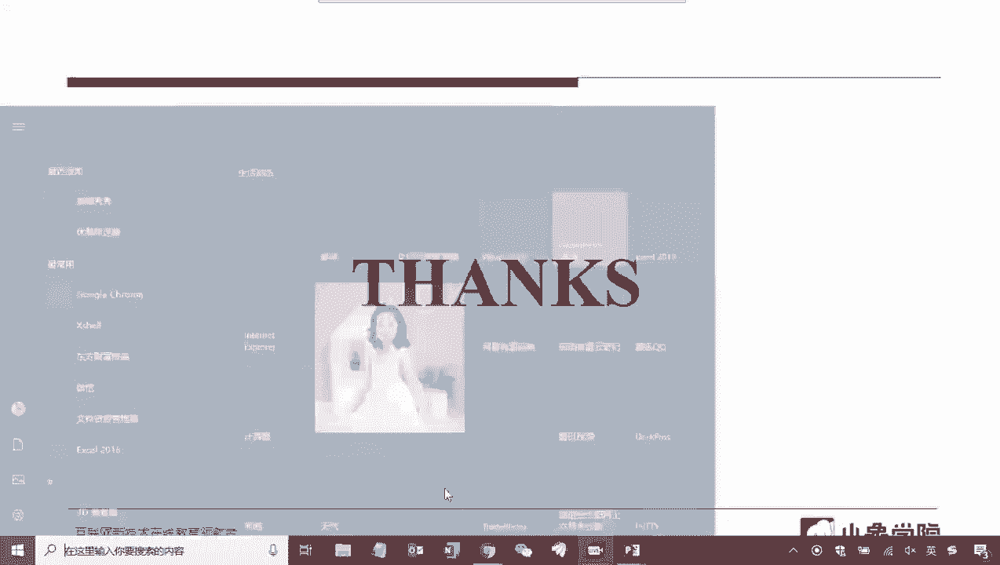

好我先看，啊从这里好呃，这里的波动率应该是包含了上涨和下跌的波动，但是有理由认为上涨对我们是有利的，所以不算风险，下跌对我们不利，这才是风险，所以呃你们有没有试过，在股市中用下跌的幅度计算波动率呢。

嗯这个问题提的特别好，嗯你你可以去查一下啊，因为我在这里没给大家去讲，应该啊后面的课程可能会涉及到，我想想我们我记得是涉及到了，就是在讲嗯量化策略的指标的时候，应该也是我给大家去讲。

其中有一个指标叫索提诺比率，有兴趣的同学可以提前去查一查看啊，叫索提诺比率，那它是相对于夏普比率的，下普比率的定义是收益比上风险，那下普比率的这个分母风险用的就是标准差，那是就是他不考虑方向的。

但是索提诺比率也是收益比风险，但是那个地方的风险的衡量用的就是下行风险，就是这位同学所说的，用下跌的幅度计算的波动率计算的风险，所以叫下行风险，也就是说只有当下下跌的时候，我才去算，才把它当做一个样本。

用这样的样本去计算标准差啊，就是这个意思啊，这问题提的很好，好那么追求贝塔可以选波动率大的股票呃，是这样啊，就是追求贝塔和你选择什么样的波动率的股票，其实呃关系不大，追求悲大。

其实要的是大盘的这部分收益，对不对，那么你只有两种方法啊，一种方法你去就就去做指数基金对吧，你就跟踪大盘就行了，做指数基金这是第一个，第二个，那你你就只能去做这个呃，我刚才我说的啊，要么去指数基金。

要么去你要去自己构造一篮子股票，去去模拟这个大盘，这是一种方法，还有一种方法去做做，而相当于去做一个，就是嗯类似一种啊，就其实就是我刚才说的这两种方法，一种一种是指数基金。

一个是是一个是去自己构造一篮子股票，就是去尽量去模拟你的大盘，这时候呢相当于来说你需要去计算出来，你这一篮子股票和大盘之间的一个相关系数，让他们尽量的相关就可以了，那么它和波动率大小就关系不大。

因为你要去模拟大盘，大盘本身就它它的成分股就有有波动率大的，有波动力小的对吧，所以这是两码事，呃感觉在一长距宽上做回测速度很慢，好几个小时才出结果，呃，不会，就是还。

这个取决于你要你做的策略是什么样子的，嗯如果你做的策略是那种嗯，就是比如说频率很比较比较快的，比如说你举个例子啊，你的股票值很大，这是第一就是你每天要去考察的股票很多，第二你的操作时间尺度很小。

你要在一分钟线上去做操作，去做计算，那么你这样回撤肯定慢，你可以去试试，如果你股票是不大，比如说你的股票是就五五十只股票，甚至或者说最多100只股票，然后你的交易信号在日线上去选，这样你你去做回测。

它不会那么慢的，会很快的，我的满仓操作不需要止损，哪些情况不需要设置止损呃，不需要设置止损额，这个只能说像有一些，你像有一些就是呃一些类型的策略是不设止损，你比如说价值投资，它基本是不设置止损的。

那价值投资一般来说只有当呃，这这这你你选的交易标的，不符合你当时的这种价值规则，判断以后才会出来，它不会设一个这样的一个止损，但一般的如果是技术操作嗯，不设止损，那除非你有其他的办法去控制这个风险。

然后如何选beta大的股票嗯，这个你可以去算，就是也不是说算一只不是一只股票，一般来说你要去做贝塔的话，你都是就是一个股票池，你不能说是一个呃一只股票啊，这个这很难是有有。

就是因为一只股票和大盘的相关是相关性，就是就是有限，所以一般会做构造一个投资组合，比如说十几只股票啊，很多时候就就可以做到和大盘的相关，系数会会比较大了，你可以算它们之间的那个相关系数吧，做一个这种呃。

你它们之间有有相应的就这种计算方法，你去算一下，你去看一下这种线性代数上这种计算，通过去计算它们之间的相关系数就可以啊，你要是感兴趣去试啊，你可以去看一看，就是关于关于一个投资组合的。

一个阿尔法和贝塔的分解，你是可以分解出来这个贝塔系数的，这就是相关系数，你可以是做出来，那么呃你可以去网上搜一下，你随便搜一篇关于阿尔法分解的，或者像那个主动投资组合管理，那本红宝书上也有讲。

但是比较复杂，你去网上去搜一下就可以，就就能搜出来怎么去算这个相关系数，然后你就知道该怎么选票了，呃ATR止损时，因为一般设置是几倍ATR，这个不能这么说，应该这个是和不同的策略是不一样的。

就是有的会多一点，有的会少一点，这跟你的策略相关，但是一般来说很少会设一倍的啊，因为一倍的ATR就是属于正常的一个波动了，一般都是两倍啊，三倍啊之上，最高的我们设过可能六七倍都设过啊。

这个是就是我需要抓大趋势，我要忍受回撤的时候是这样去设，跟策略相关，跟你策略的风格相关，呃均值回复策略是否在有一定波动率时才有效，那是自然，那是自然，是的是的，没有波动率，你想他你没法做均值回复嘛。

是不是，用线性回归嘛，而类似于这样，是这样的，用线性回归的方式去做，去做这种相关，在股市里，假设我没法做空，嗯就不容券，那么在承兑交易算法中，我只买我做多的股票，而需要做空的股票，我融券这么操作行吗。

对你说的是这种类似于错呃，做比如说做套利，做价差对吧，嗯一个做多，一个做空，不容权，你你总要有做多做空的，对不对，你要否则的话，你不融券，当然融券成本也挺高，你怎么去做空呢。

所以这其实在A股里边去做双向去做，股市里双向去做挺麻烦的，你还不如去做期货，只能做多的话，你像一般呃，你可以可以这样去做，但是只能说是模拟一下吧，就是呃，你可以构造你的投资组合，做多的投资组合。

这个投资组合你要尽量的去涉及到设计，它和比如说和和沪深300，或者和中证500是相关的，相关性会比较大，你把它去做多，那相应的做空呢，你去你相对来说你可以拿去用。

比如说用i if i ic等等来去做对冲啊，这是一个只能说是一个模拟的办法，但是你要是做严格的这种两支票，比如说价差这种方式的话，这是不容劝，是挺难做的，好看大家还有没有其他的问题。

好如果大家没有问题的话，那么我们今天的课程就到这里，然后下次课呢我会给大家去讲投送管理，那么头寸管理其实是和风险控制是息息相关的，他们两个是是关系非常大的，经常我们会去用风险去控制头寸。

反过来用头寸去控制风险，所以下节课也是非常重要的一节课，很多时候啊，我们会认为风控和投送管理，实际上是一整套交易系统的两个大核心，好的，那么今天这次课就给大家上到这里。

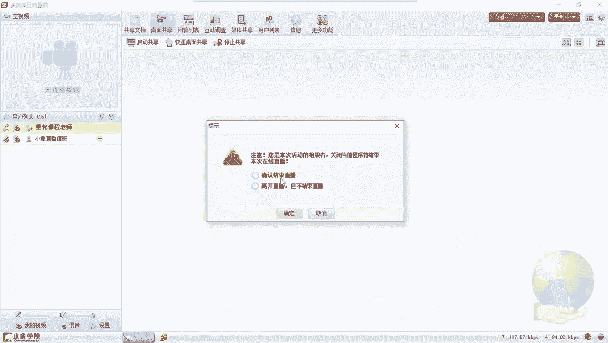