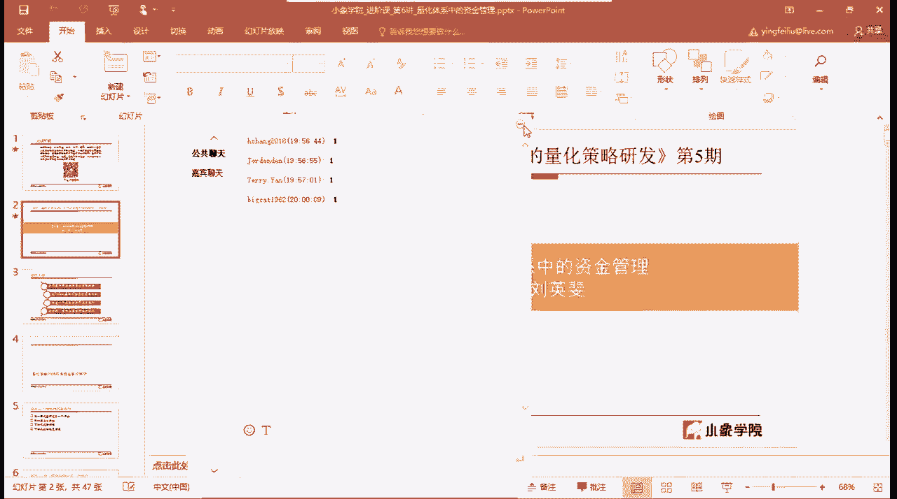
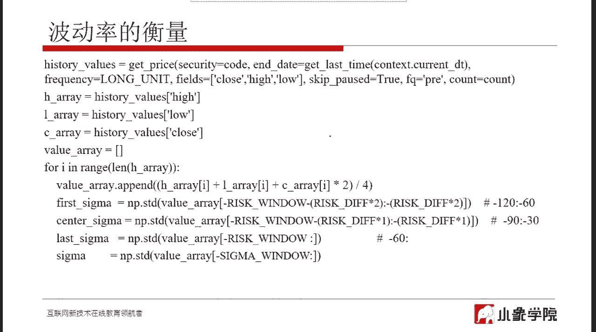
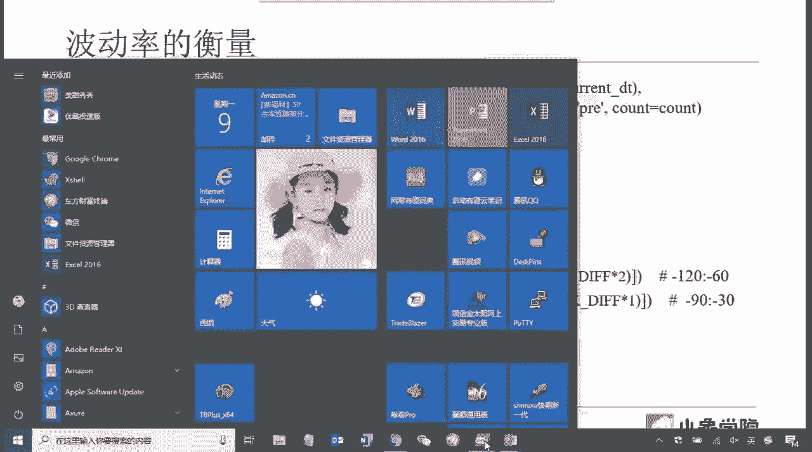
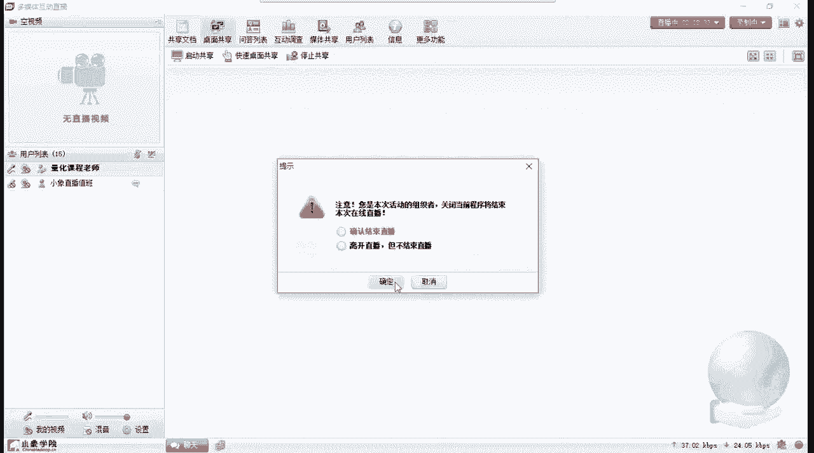

# 清华大学讲师团，量化交易实战，迭代式的量化策略研发 - P6：第六讲_量化体系中的资金管理 - 反方向的Bug - BV1Bs6MYFERQ

好那么在开始今天的课程之前呢，我们先来稍微的回忆一下，我们曾经学过的一些知识，所以在今天开课之前呢，我想稍微多花一点点时间给大家，把前面的知识稍微串一下，原因是，今天这节课。

是我们去讲一个完整的量化交易系统，那么原来给大家讲过，有一些相对的一些啊核心要素，那么今天这一次课呢是这些核心要素的。

讲这些核心要素的，应该说是最后一节。

你没讲完，今天的关于资金管理或者叫头寸管理，那么啊作为一个策略来说，量化策略来说就已经全了，所以说我在这节课之前呢，给大家稍微花点时间，把前面的一串一下哈，大家跟着我一起回忆一下。

那么作为一个完整的量化策略，我们一般是要关注到这么几个点，你在设计的过程中都要关注到，首先股票池，那说到股票池哎，我们在这里说的是股票，但其实是你交易什么样的标的，你就需要去创建什么样的池子。

那比如说你呃如果交易的是期权，那么你需要去创建相应的期权的一些池子对吧，你是做啊指数的期权呢，还是去做商品期权，你要去创建自己的一套啊期期权池，那如果你做期货一样的，那对于股票池。

这是我们所有操作的一个基础，也就是说，后期你所有的操作都会基于这个股票池来去做，所以这个股票池相当于是你的一个啊，一个最基本的东西拿去打造一个股票池啊，原来给大家讲过你的选股条件啊。

你的就相当于你的调仓周期，以及啊股票池的容量，那么其中最关键的我记得给大家强调过啊，一定要掌握的是，你在去构建股票池的时候，必然会遇去会用到一些，因此比如说选股因子。

那么这些选股因子是否适合去做这个股票池，那我们用零投资组合的方法来去检验一个因子，是否适合对吧，所以给大家讲过那个零投资组合的那个方法，大家如果已经忘了的话，可以去再去回去去重新听一下。

那股票吃完了以后，接下来就是啊，我什么时候该买，什么时候该卖对吧，你股票池里的这些交易标的什么时候买，什么时候卖那么好，那么会有啊择时信号，那么择时信号，一般是由一些相应的一些指标去实现。

那最常用的我们会用去一些技术指标对吧，就像MACD像RSI等等等等，均线啊什么的，这些都可以用用作去择时信号，还有一些其他的，比如说资金啊，甚至一些基本面的啊，有时候也会去用作测试信号。

那择时就包括买入和卖出好，那么有了股票池，有了什么时候买，什么时候卖，那么接下来很重要的一块，上节课给大家讲的那就是风控，风险控制，那么对于风险控制来说，会有策略外的，或者叫你的交易系统之外的一些风控。

还有交易系统之内的一些技术化的风控之外的，就是一些流程方面的之内的，就是你再去打造你的量化策略的过程中，需要注意的风控对吧，比如说止盈止损，比如说你的啊单只股票的仓位上限啊。

你每天所能使用的资金的上限等等等等，这些都是风控的一需要去考虑的事情，是风控是很重要的，那么风控的目的，风控的目的不是为了让你赚钱，大家一定要注意，这个风控的最根本目的，不是为了让你赚更多的钱。

而是为了让你能够活下来，这是风控的目的，往往很多人在刚开始去做交易的时候，尤其是嗯，但如果大家将来可以去接触到一些啊，带杠杆的这些交易标的的话，比如说期货期权，那么你能活下来才是非常重要的一件事情。

因为杠杆这个事情如果你风控做不好，很容易就爆掉了，所以在这些地方啊，在杠杆品种里边，那么风控更是重要，当然股票里边也非常重要，股票里边如果你没有一个合适的风控的话，那么当仓位加的越来越重，越来越重。

那么一次大的回调，可能就会把你的利润给消耗消耗掉，风控之后上节课我给大家讲过对吧，就是风控和后面有一个东西，那么它们之间往往是相互影响的，那么就是今天我要讲的资金管理。

那有时候我也叫头寸管理或者叫啊仓位管理，它解决的是什么问题呢，它解决的是当择时信号发出的时候，尤其是当买入信号发出的时候，你应该买多少对吧，你比如说今天啊你的一只股票。

比如说像工商银行发出了一个择时信号，你可以做一个买入操作了好，那么你应该买多少呢对吧，这可能在我们去做主观操作的时候，很多时候对这这个东西抠的不是特别细，你可能心里面大致感觉。

觉得这个工商银行可能将来会涨得挺好，我就多买点，那多买点买多少呢，那很多人头脑一热，会把自己一半的仓位都给投进去是吧，甚至有可能是满仓，所以这里就会涉及到我们如何去处理这种。

或者叫如何科学的去设计一个头寸管理系统，那拿到这个就是这个题目啊，量化中的资金管理，所以首先我们就要去区分一下嗯，因为一般我们讲资金管理，或者甲有时候有时候有会会有些有些迷惑的，有些同学会有迷惑。

因为还有一个名词叫资产管理啊，那么或者叫资产配置，那么像资产配置这样的，它是所研究的领域，是跟我们所要今天要讲的是不一样的，对于资产配置或者是资或者资金管理来说，或者这种广义的资金管理。

它主要讲的是你的资金应该如何科学地分配在，不同的啊交易标的或者不同的交易品种，或者说是不同的策略等等，你该怎么去做这种呃更高层的这样的一个分配，从而能达到一个去啊去降低风险，去提高收益这样的一个作用。

所以往往我们讲资产管理很或者叫资产配置，很多时候就是这样，我需要把我的资产，比如说你的个人资产，你去做投资，你需要从高风险的角度来说，你可能会股票上投一点啊，或者说更高风险向期货上投一点。

那么偏中等风险呢，你可能会买一点点指数对吧，做一些被动性的投资啊，或者你自己去做嗯，做ETF，这都是偏风险，就是要小一点的，那么风险再小一点的，你可能是去买债券啊，或者是像我们经常去买的。

去买货币基金对吧，像像就是余额宝啊，是等等等等，类似这样的，那最风险最小的当然是去你就放在银行里了，呃，就是买定期，这是只是存定期，这是呃风险最小的这种，所以那那个概念那叫资产配置或者叫资产管理。

类似这样，但我们这里所讲的资金管理或者叫头寸管理，或者叫仓位管理，它所针对的就是当泽射信号发生的时候，你该买多少的问题，这是我们这节课核心要解决的问题，所以这节课呢分这么几种啊。

就是嗯讲的事情都是一个就是头寸管理，只是说我们要从不同的角度不同的呃，就是方法来让大家去理解，怎么样去打造一个比较科学的一个，资金管理模型好，首先第一部分会给大家讲经典的资产啊，资金管理模型。

那有四个模型会给大会讲到嗯，其中有一些只是作为引入的，这四个模型不是说都是啊比较好用的，那其中会有那么一两个好用的，其他的是引入的啊，大家大家听一下就行，因为初级课程也有这个，然后讲完这几个模型以后。

会用一个啊一点点代码来给大家讲一下，怎么去实现，那其中对于我们认为最重要的一个模型啊，Python的方式在距宽上怎么去实现，那第三部分呢呃接着是在原来策略的基础上，因为我们的策略从前面几次课一直到现在。

都是一步一步去去累加的嘛对吧，从最开始最简单的一个策略可能只有股票池，然后再加点泽试信号，然后加点风控，今天呢会把相应的啊，头寸管理的一些东西加进去啊，最后一部分是在做一些探讨，因为毕竟我们是进阶班。

会加一些我们在实际啊就是交易中，包括实际的量化策略制作过程中，因为我们也是在用这些经典的四个经，资金管理模型，我们用的也是这几个模型，那么在用这几个模型的过程中，你就会发现一些问题。

就是属于这个资金管理模型需要处理的一些啊，异常情况啊，你该怎么去去优化它，或者去完善它，以至于因为像有一些情况，就个别的一些情况，可能你就是机械的去运用，这个资金管理模型的话，可能会出问题。

那该怎么去处理，都是我们遇到的一些陷阱，包括自己的一些总结，所以会在最后一部分给大家去拓展一下啊，这个最后这部分实际上呃，是对于大家实战是很有指导意义的，那前面的就更偏重一些经典啊或者理论啊，这方面的。

好我们先来看第一部分，第一部分给大家讲四个模型啊，因为这四个模型在初级课时候讲过，所以嗯在前面的几个模型呢，我给大家稍微啊讲快一点，因为这也相对的简单啊，最后一个模型会给大家去仔细讲一讲，先说第一个。

那第一个模型叫每一固定金额交易一个单位，那这个就啊很简单的一个模型啊，对那这个模型要做的是什么，要做的就是首先比如说嗯，你有相应的100万的资金去投入到股市里面，去买股票对吧，你用你的策略run起来。

然后你的本金就是100万资金，那么这时候当一只股票发生了一个买入信号嗯，你该买多少呢，所以对于这个交易系统来说，它首先是这样做的，首先是把你的100万的这个原始资金啊。

或者说你当前的总资金去平均分为若干份，那至于分成多少份，是你啊这个头寸管理系统的一个参数，你自己去确定，那一般来说，比如说你选成十份或者或者是甚至高多一点，把它划成20分，这都可以。

那比如说你画成十份好，100万花成十份，那么每一份10万块钱，那就相当于在你的呃交易策略里边，执行的时候呢，就会形成十个小的资金池，十个小的资金池，每个资金池的金额就是10万块钱好。

那么现在来了一个交易标的，你要去买，那该买多少呢，那这个时候呢你的系统会事先做好一个规定，什么样的规定呢，就是对于所有的交易标的，比如说股票，不管是哪个股票来了，我都买固定的份额，什么叫固定风啊。

比如规定好了，我都买一手，大家知道在A股里一手就是100股嘛，对不对，那么无论来的是什么股票，我都买一手，或者说你规定好了，无论来的是什么股票，我都买十手，就是你事先规定好的，对所有的股票都一样，然后。

当好比如说工商银行来了，工商银行的股价，比如说十块钱，那么一手股票是1000块钱，对不对，你需要花1000块钱去买这个股票，买这个这一手100股，那么这时候呢你就会把十个小资金池。

其中的一个资金池的钱全部拿出来，去购买这一手股票，当然了，1000块钱你肯定用不完嘛对吧，因为你是10万块钱，一个小池子，10万块钱你用不完哈，用不完的话，你剩下的钱可能就浪费掉了。

所谓浪费掉就是会从你的策略中释放出去，至少从当前的这一次的交易中释放出去，然后接下来再来另一只股票的时候，你再从另一个小资金池里边，把10万块钱拿出来去买这一手股票，比如说如果是茅台对吧，1000块钱。

1000块钱以上茅台，那你可能买一手能差不多10万块钱，所以这是这就叫每一个固定金额，交易一个单位啊，这种方法呢，很显然就是会有一资金浪费的时候对吧，因为你你每次只能买那么一点嘛。

因为绝大部分啊股票都没有那么贵，那那除非是说你的资金确实没有多少，你确实就分成很多份，比如分成100份，那可能啊利用率还好一点对吧，就像100万，你把100万取平均分成了100份，一份是1万块钱好。

那么这1万块钱每来一只股票，你就要去买一手，每来一只股票去买一手，那工商银行啊，你可以买茅台，你就买不进来对吧，所以这就是这种规定的比较死，那这是一个啊这种模型，那这种模型呢相对来说。

我们只把它作为一个引入啊，就是啊你大概通过这个能理解什么样，算是一个你的头寸管理模型了就就可以了，因为这个实际上用的比较少，尤其是在股票里边用的非常少，因为股票它们之间的价格差别比较大啊。

一般就不会去这样去去操作啊，因为这样资金浪费太多，那也不是说不能用，在有些时候会用什么样的时候呢，就是当你确认你的股票池里的交易标记，它们的价格都差不多的时候，就是不会有太大的差距。

像茅台像和工商银行这么大的差距，那你可以采取这样的方式也是可以的，好这是模型一，那么模型一呢简单举个例子就是这样啊，我刚才也讲过啊，我快速说一下，那总资金100万平均分为十份，每份10万。

那比如说第一个交易实例是代买入，是工商银行，那么价格五块钱，一个交易单位一一百股这一手嘛对吧，所以最后买入金额你只需要花500块钱就可以，也就是说这10万块钱中，你只用到了其中的500块钱。

那么第二个交易标的归啊茅台，这是啊，这是之前的价格啊，很很早以前了，750，那么最后你需要10万中，你需要拿出7万5来去做购入就行了，所以像现在就是，比如说就是茅台超过1000块钱了。

那你可能你就买不进来了，对吧嗯好，那么这是第一个模型，我刚才也给大家讲过了，第一个模型用的不多，只有在有些特殊的情况下，才会用什么特殊情况呢，这些交易标的的价格差别不是那么大。

好第二个模型等价值交易单位，等价值交易单位，目的，就是为了解决前面的那个模型所带来的问题，带来的问题，就是如果交易标的之间价格差距比较大，那会造成资金的浪费是吧好，那么所以在这个模型里边呢。

同样的会把你的总资产和总资金分为若干份，当一个交易标的来了，我要去买，这时候会把你一个资金池，就一个小资金，资金池里的钱全部拿出来去买这个交易标的，买多少呢，你这部分钱购买多少就买多少。

就像刚才说过的啊，10万块钱买茅台一手你都买不了，买工商银行，你可以买很多对吧，所以就是这样的方式，就是尽量的去把你的钱用光这种方式，所以举例子呢啊同样的啊，100万10份每份10万。

那么如果你买了工商银行五块钱的，那你可能就10万块钱就都花出去了，因为你可以全买掉对吧，你可以买2万股都买进去，那买贵州茅台，像之前的价格750啊，你是可以买的，就买一手就可以了，现在可能不你买不了。

这叫等价值交易单位啊，他会在资金利用率方面呢会好一些，那这个头寸管理模型我们在实战中啊也用过，而且用的不少，因为相对来说啊，这种方式是一种比较均衡的一种方式，他就是他对于所有的交易标的都一视同仁对吧。

大家能理解吧，你来了，交易标的标的不管是谁，反正我都拿同样的钱去买，能买多少买多少，所以这是一种比较均衡的做法，而且相对来说资金利用率啊也还是可以的，挺高的，尤其是当啊你的交易标的比较多的话。

很容易就是你的可能你的资金很多都会用进去，这个在我们，去设计一些啊什么样的一些交易策略呢，就是这个这个你的股票池里边的各种票啊，他们的特点，或者说我们说的更明确一点啊，就是这些交易标的他们的风险。

那接着进一步可以这么说啊，就是我在前面讲风险管理的时候，给大家讲过，他们的波动率差别不是特别大，那举个例子啊，如果你的股票池就是上证五零对吧，或者说沪深300，那上证五零，沪深300。

这里面的票相对来说风险是可控的对吧，他们是在风险都是控制在一定范围内的，没有那么高好，那么这个时候你可以采取这种方式去做，等价值的，为什么就说为什么这样去做啊，就是嗯，这是后面两种模型区别于这种模型。

就是它的最根本原因就在这里，因为模型二它存在的一个问题是什么，它的好处很很很很明白，就是他的资金利用率也挺高，而且相对来说比较均衡，而且实现起来非常简单，但它的缺点就在于嗯。

比如说如果你的股票池里边是各类股票都有啊，比如说创业板的也有啊，比如说沪深300的也有是吧等等，上证五零的也有，那么相对你的股票跨度比较大，也就是说这些股票的波动率跨度比较大，有些股票可能波动率非常大。

有些股票呢波动率非常小，那么从风险控制的角度，大家注意啊，不是从赚钱的角度，是从风险控制的角度，一般来说，我们肯定要把你整个策略的风险要控制在啊，一定的水平之内是吧，不能太高。

那么从直观理解上是什么意思，就是对于一个交易策略来说，你不能对于像创业板里的股票，或者中小板里的股票这种波动率特别大的股票，你不能买的过多，对不对，大家可以理解吧，就是我们有时候去做主观操作的时候。

有时候不自觉会带出这种思路来，比如说当你啊，比如你持仓股有十只股票啊，现在又来了一只股票又要买的时候，这时候你可能去看一看自己的持仓股，发现哎呦，我的持仓股里边有六只，都是属于中小板的股票了。

或者说他们的市值都是在大概50亿以下了，流通市值在50亿以下了，六七只都是这样，那么这时候你可能会想用，那这其实这些交易标的他们的波动率都偏大，那么一旦当股市发生剧烈回调的时候。

这些股票的回撤一般来说会比较大，那么会给我账户的总资产的回撤，带来比较大的冲击，对吧好，那么这时候你可能不自觉的会考虑说，现在新来了一只同样一个中小股，中小板的票让你去买，那这时候你可能就会去想。

我要不要买它，对如果我买了它进来，可能我的我的持仓股里边中小板的票就太多了，那我可能会控制不买，或者说我会控制少买一点点，那么基于这样的思想，就是说像模型二他就没有考虑这个问题对吧。

当你的股票池是横跨各种市值的，这种股票的时候呢，你对于创业板里的票和对于上证500的票，你是一视同仁的，你可能都会拿10万块钱去买，那么拿10万块钱去买上证五零里的票，那么相对来说。

它的风险肯定比买创业板里的票，是要小要小很多，好从这个角度去思考，那么我们接着会引出后面的那两个模型，我们认为是比较重要的两个模型，什么意思呢，就是既然我们前面说到了，上证五零的票和创业板的票。

这两个票的风险不一样对吧，他们最直观的反应是他们的波动率不一样，上证五零里的票波动率小，创业板里的波动率大，为了控制我的风险，我该怎么办，对吧，那从头寸管理的角度来说，或者在仓位管理的角度来说。

对于上证五零的票，我就更倾向于多买一点对吧，这样的话啊对对于创业板年他少买一点，那么总总体来说，他们两个风险加起来就会偏小一点，那反过来如果你不去控制的话，可能让创业板里的票和上证五零票。

他们买的仓位是一样，那么风险就会变大一点，甚至有些呢可能让创业板的票啊买的更多，有些主观操作，这样买的更多，那你的风险就更大，那从这个角度就是什么角度呢，就是风险大的少买，风险小的多买对吧。

从可实现的就可实现的角度，就是波动率小的多买，波动率大的少买对吧，接下来就是还记得大家记得上节课给大家讲了，波动率怎么去计算标准差ATR，那真正去实现的时候，你去编你的策略去实现的时候。

那就是你去算一下这个交易标的，它的ATR是多少，或者说它的标准差是多少，那标准差大的少买一点，标准差小的多买一点对吧，这就是会引入后面这个模型什么呢，就我们叫百分比风险模型。

那么百分比风险模型他的思路是这样啊，前面几个思路还是类似，最核心的我们来看，这个公式，我们主要看这个公式，P等于C比R那P是，这个交易标的择时信号来了以后，你该买多少，这是计算出来的，该买多少。

就是这个P怎么算，C，比上RC是什么，我在这儿写的是现金啊，其实应该叫总风险，C是总风险，什么叫总风险，其其实就是对于这一次交易，你来对吧，这个股票我要买了，对于这一次交易，你所能承担的最大风险是多少。

我再重复一遍啊，就是当来了这个交易标的，你要买的时候该买多少，那么C就是这一次交易，你买这一个标点啊，这一次交易你所能承担的最大风险，不知道大家能不能理解啊，这个关于最大风险这件事情啊。

很重要的一件事情，包括我们再去做其他操作啊，不光是像这种量化，包括主观操作的时候，有时候也会去啊，每做一笔操作的时候，这个最大所能承受的风险一定是放在第一位的，比如说简单来说啊，比如说今天我想去建仓。

我要去做股指期货，我想建仓建仓一手IC，那么你增加一首IIC的时候，你就要去去想，如果这个IIC发生了剧烈的回调对吧，容易做多啊，发生了剧烈的回调，那他可能给你带来的最大损失是多少对吧。

比如IIC现在一手名义本金大概呃，大概100万左右吧，那么如果爱IC，你觉得可能会发生跌5%的这种情况啊，在历史上你去统计，比如说前期一段时间统计，有可能单日会发生5%这样的一个下跌好。

那么你去算一下100万的5%对吧，你你给这就是给你造成的最大损失，那么这个最大损失你能不能承受，那这就叫你的这一笔交易所能承担的最大损失，风险好，那么在这里在这个头寸管理这里，这那么我们的最大风险。

这个C这个C是怎么定义的呢，这个C定义为你的投资，什么叫你的投资啊，就是我们前面讲那几个模型给大家讲，你的100万的投资投到股市场，还这100万的投资，你允许的最大亏损，大家听明白了吧，要更直观一点啊。

就是什么叫你允许的最大亏损呢，比如说啊你老婆给了你100万块钱，让你去做投资，到股市上，你老婆可能会告诉你，你最多亏2万块钱对吧，你要亏多了2万块，2万块钱以上的，那不允许好。

那么这2万块钱就是你所能承受的最大损失，就这个2%就是你的最大损失，就是这个C好好，那么我们接着来看分母，分母R是什么，R是指这个交易标的可能给你带来的最大损失，这个交易标的可能给你带来的最大损失。

大家听懂了吗，这个R那它的具体计算呢，就是比如说来了一只股票，那工商银行具体计算就是一股工商银行，大家记住啊，一股工商银行，如果你买入了，可能给你带来的最大损失是多少，那可能大家会问。

这个这个最大损失该怎么去计算呢，那很简单啊，前面讲风险控制的时候有止损，对不对，那除非你说你没有止损，那一般的系统都会有止损的，当你的，这个交易标的发生止损的时候，你每股每一股的损失是多少。

这就是你的最大损失，因为不可能再大了，因为再大你你已经止损了嘛，那比如说对于，啊工商银行，比如说十块钱那个工商银行，你划定的止损线，止损线是比如说10%啊，举个例子，比如说10%好。

那么这十块钱乘上10%，这一块钱就是你的最大损失，他不会再超过你这一块钱了对吧，当然除了一些在咱这里呢，我们没有去考虑一些像执行过程中的一些误差，那如果加上这些误差，有可能你会更大一点啊，这个先不考虑。

比如说一些滑点啊等等，我们只考虑现在最理想的情况好，那么大家能理解这个意思吗，为什么用C比上RC是我再重复一遍，C是你这笔交易所能够承担的最大损失，也就是你的整体投资所能承担的最大损失。

而是每一股交易标的当发生止损的时候，所带来的最大损失，那么用C比上R，大家想想是不是就是你能买的最大的头寸呢，就是你最多可以建立这么大的头寸，当然你少一点没关系，你少一点没有关系，但是你不能再多了。

如果你再多，当你对这个交易标的发生止损的时候，那可能啊，你的你的风险就会超过了你的最大风险了啊，好大家能理解这个这个这个公式的意思了吧，那么具体举例子就是这样啊，100万资金好，你的总风险是1%。

意思就是你最多只允许亏1万块钱，当你的总损失超过1万块钱的时候，你可能就就整体平仓了，你就出来了，就不玩了，单个交易标的的风险设定的是5%，也就是说你的止损线设定是5%好，那么待买入的标的。

比如说海康威视这个股票，比如比如说价格40块钱，那么买入的数量你能买多少呢，P等于C比R对吧，那买入数量就是PC是什么，100万乘上1%，就这1万块钱就是你的CR是什么，而是你的买入价格40。

这是你的买入价格对吧，乘上5%是你的止损线，也就是说当发生止损的时候，你会亏掉这两块钱对吧，你会亏掉这两块钱，那么用这1万块钱比上这两块钱算出来的，就是你最多能够买5000股，如果你买超了的话。

当发生止损的时候，你的总风险就会超过1万块钱了对吧好，那么接下来算下来你的买入金额是多少，这样算一下就可以了，好，这就是我们去啊，用风险度量的方式来控制头寸的办法，就是采取这种用这种计算的方式来去做的。

好那么这个这个模型给大家先先先讲到这里啊，但是呢我们还有一个模型四，对不对，那么模型四呢会有，为什么会接着去引入模型四啊，嗯大家可以去思考一下这个模型存在什么问题，这个模型存在什么问题。

那这个模型或者说相对于模型四来说，我们再接着去优化这个模型的话，我们我们主要考虑的是什么呢，大家看着一个个参数哈，这个总资金这是固定的不变的，那总风险这也是一个我们事先就可以确定好的。

因为这是一个偏主观的一个一个数字啊，嗯很多时候其实比如说你自己投资的话，那可能就是受一些你自己的一些风险偏好影响，或者说你的家庭的风险偏好影响，就这么强行设定了这个数字，那么对于一些基金来说呢。

基金都有平仓线嘛对吧，那平仓线自然确定了，就是你的总风险，那都是你的啊，你的基金和相应的这些去，你当时的基金是怎么规定的，就是什么样子，所以这两个没有什么可调的，那么接下来单个交易标的的风险。

在这个模型里面定的是什么呢，就是固定的5%，反正就是这个固定的数字或者5%，4%等等，好那么大家可以有有些同学可能能想到了，这个地方其实是可以优化的，为什么呢，因为5%的意义是什么呢。

5%的意义是指你的止损线，可能就是5%对吧，也就是到了5%的时候，你会止损，那么这时候就会给你的股票造成，一个最大的损失，就这么多，那么关于止损线，我在上节课给大家讲过不同的止损方法，大家还记得吗。

最大亏损法去止损，还有一些技术指标，还有一些啊回撤对吧，大家记得浮动止盈止损，那么在浮动止盈止损的时候给大家讲过浮动，你往回回撤5%做一个止损，这是一种方法对吧，从最高点回撤5%去止损，或者3%去止损。

是不是一个方法，还有一种方法是什么，更科学一点的就是我会用波动率去衡量，去ATR去衡量，比如说我用的是几倍的ATR对吧，我用了三倍的ATR来去定义的这个回撤幅度，那么我们就会想到在这里的这个5%。

你一样也可以用，比如说回撤啊，几倍的ATR，用这样的形式来去做，这两种方式的一个根本区别在哪里，根本区别就在于模型三，它对于所有的交易标的，所能发生的最大风险都是一视同仁的。

这里的一视同仁是指你来的交易标的，无论是工商银行也好，无论是海康威视也好，还不还是说无论是说像一些创业板里的票也好，我定的止损线都是5%或者都是3%，那么其实很明显这样是不合理的。

因为对于创业板里的票和上证五零里的票，他们的波动率差别很大，那么止损线一般来说也应该有所区别对吧，因为5%对于工商银行这样的票，你去做止损可能是可以的，但是对于创业板里有一些上蹿下跳的票。

你5%去做止损，那就太容易被震出来了，因为它正常的波动范围，可能就在6%以上了，5%以上了对吧，这是属于他一个正常波动，而不是一种异常波动，一般来说我们更倾向于在异常波动时才出来，如果正常波动。

那就不要轻易的被震出来了，所以可以优化的一个点就在这里，我们一样可以把这个去用几倍的ATR来去做代，替对吧，因为几倍的ATR就是根据不同的交易标的，它们各自的波动率来去定义相应的止损线对吧。

那么像创业板里的票，我止损线我N倍的AATR，他的AATR本身就大是吧，上证五零票AATR本身就小，那么我就可以去相应的去去在风险管理，风险控制这个角度来说，去做一个更加合理的划定，就是个止损线啊。

一个更科学的划定，所以从这里这个思路啊，这一步一步的思路到，所以大家看我们从模型一一直到模型四，其实是一步一步优化的一个过程啊，那从模型一啊，哦我们先先先等会啊，我们先来讲下这个模型四哈，好。

那么模型四其实这这个就先不看了，我直接给你到这里，那直接大家看这个例子，100万的资金总风险1%，单个交易标的的风险我们定义为三倍的ATR，所以同样的对海康威视来说啊，价格40块钱。

他的AATR在建仓的那个时间点，你算出来它当前的AATR是0。8，大家注意，这A0。8是个绝对绝对的一个数值啊，不是一个相对的，就是就是0。8好，那么你能买入的数量是多少，100万乘以1%，这个不变。

但是分母变了对吧，0。8×3，因为你的三倍的AT2，0。8×3，所以最后你他的分母就是0。8×3，你最后一除你可以买的是4100股啊，算一下大概是多少钱，所以这就是模型四的这种方法。

所以很多时候我们用模型四会更多一点，尤其是对于股票池容量比较大，可能涵盖的各类股票都有的情况下，我们会采取这种方式，好所以大家看我们去从模型一到模型四，就是这样一步一步串下来的对吧。

模型一都是平均分配资产，用小小资金池去做，但是呢模型一对于所有的交易标的都一视同仁，买的数量都一样对吧，不是价值都一样，是买的数量都一样，所以如果你的交易标的价格差别比较大。

那最后会导致你的资金资金利用率有问题，那为了优化这个问题，到了模型二是等价值的，意思就是同样的也要分成小资金池，对于不同的交易标的就不是买的数量一样，而是买的价值一样对吧，这是模型二，买的价值一样好。

那么模型二存在的问题就是，对于所有的交易标的都是一视同仁，没有考虑到风险对吧，买的价值都一样，没考虑到风险，理论上应该是风险越大的，我应该在上面投的钱更少一点对吧，它所占的价值更少一点才对。

所以就引入了模型三，模型三就是考虑到的风险对吧，但是模型三的问题就是对所有的交易标的，从风险的角度都是一视同仁，理论上应该也是不一样的对吧，你不能都划听划成同样的一条止损线嘛，因为不同的交易标的。

他们的波动率差别很大，好才引入到模型四，对于单个交易标的的风险就不用固定的线了啊，用几倍的ATR，所以这个其实是和前面的风险控制那一块，止盈止损那一块是他们只是互相用的对吧，他们是互相用的，好。

那么前面呢给大家讲完了这四个啊模型，那四个模型呢，大家重点去掌握的是后三个模型吧，第一第一个模型用的确实是少一点，除非你将来用到一些比较特殊的地方，我前面给大家讲过，不重复了，就特殊的地方你可以去用。

绝大部分还会去用最后三个啊，后面三个三个模型可以用，好第二部分我们来简单看一个例子，用Python来取，是在距宽上吧，来去实现一个资金管理的模块，这个是基于啊就是第四个模型来去做的。

首先在具体讲这个例子之前呢，我先来看一看嗯，既然你有四个模型，那对于不同的use case来说，你该去选用哪个模型呢对吧，这在前面我给大家讲过一些，那这里只是一个总结啊，就是你所你需要考虑的都是哪些点。

那比如说标记的价格对吧，那标的价格如果差别不大，你可以用哪个呢，模型一就也行是吧，然后风险偏好，那你的风险是属于啊激进型的呢，还是稳健型的等等，这这里边其实是影响到的那个总风险，模型三模型四的总风险。

然后总风险控制对吧，这是也是总风险的问题，最后标记的波动差别，那么标记的波动差别呢，就在于你的模型三和模型四啊，你用哪个的问题，如果标的波动差别不大啊，那你就用模型三也是可以的，如果差差别很大。

你就用模型四，啊不是说大家可能有些同学会有一些误解，就是比如说模型四，模型次好像感觉上是他考虑的事情更多是吧，就是还考虑到不同的交易标的，它们的价格，也考虑到不同交易标的他们的风险，那是不是所有的啊。

不管什么策略，我都用模型四呢，也不是这样，大家要注意啊，在应用所有的这些技巧的时候，无论你是风险管理技巧，还是头寸管理技巧等等等等，应用这些技巧的时候要遵循一个原则，我认为是要遵循一个原则。

一个最简单的原则就是越简单越好，如果你的策略所针对的这些交易标的，如果你用模型二就能搞定，就完全可以搞定了，对不对，因为他们的虽然价格差别大，但是呢他们的风险差别不是很大，用二完全能搞定。

你就不要用三和四，因为这几个模型它的复杂度是逐逐步递增的，如果你这几个交易标的，它们的波动率其实正常波动率差不多，那你就不要用模型四，用模型三，因为模型三比模型四要简单。

所以如果你用简单的武器就能够解决问题，不要引入更复杂的武器，原因就是引入更复杂的武器，会带来一些隐含的问题，因为像一些越复杂的东西啊，它其中越有可能会产生一些啊异常情况，包括你后期的维护也会有问题。

甚至包括举个最简单的例子啊，我们去做策略，做完了以后，你总要去查问题对吧，有可能策略出现问题，查问题，查问题的时候，我们最经常要看的就是啊交易记录，那如果你用的是模型二，那很简单了对吧。

你这个头寸用的是多少，你一算就算出来很容易算出来，那如果你用的是模型三，甚至如果你用的是模型四，你还要根据某一个交易标的去算它的波动率，看看它到底应该买多少，最后你买的是不是这么多，对吧，就排错。

那这个工作量会大很多，会很麻烦啊，所以大家要记住啊，就是简单的工具能解决的就用简单的啊，所以在这里就是我，我是担心大家可能会觉得，模型四既然都已经完美的考虑到了各个方面，那我们就所有都有模型四就好了。

嗯不是这个样子的哈，好那么我们来看一样的啊，这个策略就是一步一步这个策略，那么嗯在这个策略里边，我们是在前期的那几个就是那几个股票池啊，择时啊等等，也加过了，封那个浮动止盈止损，那么在这里加了一些头寸。

加些了些头寸嗯，这还是比较复杂，所以呢嗯因为在这里呢，就是多给大家多加了一点点东西啊，就是不光是这个啊模型这四个模型的问题了，因为因为其实这个这个东西是我们在实战中，用过的一些一个策略，一些方法。

策略的一部分一些方法嗯，就是头寸管理这个地方是一个标准的，就是我们用的就是模型素来去做的，但是呢在它的基础上呢，我们又用到了一些技巧性的东西，那么这些技巧的东西呢也在这里给到大家，给大家去分享一下啊。

也很很实用，非常实用的一个东西，大家可以去去听一听，掌握将来你再去做你的策略的时候，可以去用一用什么东西呢，就是首先第一嗯我们用了模型四，我来看一下，应该是用的是模型四，对用的是模型四。

然后除了用模型四去做头寸管理以外，计算头寸以外，我们还考虑了什么呢，大家看这一点，我们考虑了前期时间窗口的一个波动率的变化，就是根据前期啊，你要买的这个交易标的来了对吧，我要看一下这个交易标的。

他在前期一段时间内的，它的波动率的一个从时间轴上的一个变化情况，从而对我的头寸也产生一定的控制啊，这是一个权重因子吧，大概是这个意思好，那么这是具体实现的一些简单的代码啊。

额稍等啊，我记得上次在线上。

有些同学中间有听不清的问题，我看一下啊，好没有问题，我接着讲，那么这是具体的关于啊不是所有的代码啊，这这是只有头寸这一块的一个代码的计算，那么包括了两部分，第一是模型四。

第二是关于刚才我讲的这个波动率的，这个从时间角度的考虑，那么我们先这一页我先略过去啊，因为这一页讲的是我们新加的那个技巧，我们先来看最后的这个啊，这个蓝色部分先看这个吧，就是我给大家圈一下啊。

这个蓝色的部分很简单啊，这个蓝色的部分就是模型四，那从代码角度是怎么做的呢，大家看，这就是返回了我要去买入多少这只股票，那么这个这个这一段代码，一般像像我们去实现的时候，它一般会出现在哪里呢。

会出现在择时信号的后面，对吧，因为往往我们去做一个程序的时候，大家基本的一个啊一个一个流程就是这样啊，就是就是尤其在在在距宽上啊，就是当，稍等，好就是在，距宽上大家记得吗。

有那个rn daily的这样的一个函数，对不对，那么在盘中就market open，在这个时候我们一般怎么去做呢，我们一般是说对于我的股票池里的每一只股票，去做一个循环的检查。

看看哪一只股票发生了买入信号对吧，比如说啊军选的一个交叉金叉，看哪个发生了均线金叉，比如说哎你检测到一个股票发生了一个金叉好，那么if在他后面发生金叉了，那么接下来你要去做的就是。

这个就是要计算对于这支股票你该买多少，然后接下来才是你的触发的这个交易函数，去买这支股票买这么多，所以从程序逻辑上，他是这样来放到这个这个地方的，那所以这里在计算的，就是对于这支交易标的来说嗯。

该买多少的问题，那么对于模型四来说就是这样，大家看首先有一个starting cash，你的总资基因对不对，乘上总风险因子0。0025对吧，2。5‰啊，你乘一下就是相对来说你你的总风险是多少。

这就是那个C对吧，这就是C好，关于这个risk这个东西哈，这个risk adjust factor我们先略过去啊，这个就是我前面讲的对波动率，从时间轴的角度上所考量的这个权重，我们先把它忽略过去。

然后分母是什么，分子是C分母是RR是什么，是几倍的ATR，对不对好，那么这个西格玛，是波动率，所以大家注意这里的西格玛呢，大家看这里西格玛在这算的，我们用的不是ATR的方式算的，这用的是什么。

STD标准差，也就是说这里的波动率的计算，我们没有用ATR是用的是标准差，所以大家还记得在上一节课给大家讲，对于不同的情况啊，你去计算波动率，你是用波标准差呢，还是用AATR呢，我给大家大致说过啊。

去做头寸管理的时候，往往我们用标准差稍微多一点，但是在什么时候呢，在计算风险的时候，比如止盈止损，计算风险的时候，我们用啊就是AATR会稍微多一点啊，就是这样好，那么这是标准差。

所以在这里用的是N倍的标准差，N是多少呢，就这这个数几倍的标准差算出来，就是啊单个交易标的的一个最大风险，所以用C比上R1除，最后得出来的就是你到底应该买多少，好那么这个好理解吧对吧。

因为这个其实就是一个简单的一个公式，很好理解，那么接下来我们来看一下这个risk，adjust factor这个东西啊，这个东西怎么算出来的，或者是它到底是什么意思，那这就是这个啊。

我我来这样来给大家画一下吧，就是更好理解一下啊，我就直接在这个PPT上画了，那么它是这个意思啊，我来画一个时间轴啊，比如说这是一个时间轴好，那么当前这个点这个点是什么。

这个点就是啊我要建仓的那个时间点对吧，在这个时间点我要建仓好，那么我要去考察一下，前期一段时间窗口的波动率的变化情况，从而决定我在这个时间点建仓的时候，我是不是要做一些一些权重的调整好。

那么在这个程序里我是这样去做的，我就把这个前期啊我是这样来分的，比如这里我把它分成几部分哈，大家注意看，好，那么这里呢这个这是30，也就是说往前找30根K线，那这因为这取决于你是在什么。

什么级别的K线上去做的啊，如果你在日线上做的，那就是三三十个交易日，那这个地方呢是60，当然这个数字啊，只是我是说这个对于我们这个程序，是这样去做的，这个例子，这样做你也可以去去去调整你的时间跨度啊。

比如说你这是60，这是90或者120等等，都可以，就是看到你自己，看你自己的时间级别了好吧，这是90，那这是120，也就是说我从当前时间点往前去找，这个时间窗口，比如说前面的往前数30根K线。

往前数60根，90根，120根K线，我要看在这120根K线中，波动率变化的一个情况好，那么我是怎么取窗口的呢，而不是简单的取这个120~90，90~60，60~30，我是这样来取的，这个，120~60。

我取做窗口，一九十到30，我取择窗口二，然后60~0就到当前，我取一个窗口，三好这三个时间窗口，那么这个时候呢，我会去衡量这三个时间窗口，波动率的一个变化情况，怎么去算呢，我去用标准差的方式，用标准。

大家记得用标准差的方式，我去算一下，从120~60这个时间窗口内每一根K线，它的啊价格不都有吗对吧，这个相当于是个价格序列好，我把这个价格序列的标准差算出来，那么就是在他算出来，就是在120~60之间。

这个时间窗口内的一个波动率情况对吧，标准差算也就波动率情况好，再把90~30，这个时间窗口内的波动率算出来，接下来把60~0啊，这个波动率算出来，那其实这个时候我得到了就是什么呢，就是按照时间的顺序。

从最早到中间到最新，这三部分的一个波动率的变化情况对吧，每一部分的一个一个波动率的值，一个值，那就得到了三个值，三个波动率，那这个时候我我是怎么去考虑的呢，对于这个这个就是它背后的逻辑是什么。

我的逻辑是说，如果对于这个交易标的来说，它从历史上我去观察，如果它的波动率呈现一个逐步放大的趋势，那最简单描述就是从1~2到三，这三部分时间窗口啊，它的波动率是逐渐在变大的，如果是这种情况。

那么我有理由认为，当我在零点这个地方建了仓以后，它的波动率会继续放大，就把一个时就波动率有一个时间延续性，它会继续放大，那么我建了仓，它波动率会继续放大，那么对于这种交易标的，我该怎么办呢。

因为我要我主要考虑的是风险嘛，对不对，我要控制我的风险，那么对于这种情况下，我就需要把风险降下来，怎么降给这个交易标的，以更小的买入权重，好那么反过来，如果你发现这个交易标的这个交易标的啊。

在前期时间窗口去看啊，从123这三个窗口啊，它的波动率呈现一个逐步缩小的一个态势，比如说啊一这一块的波动率最大，二变小一点，三最小，那么我理由同样有理由认为它的波动率啊，会继续缩小。

那这时候对于这样的交易标的，我是不是就可以多买一点呢对吧，因为他的可能它的风险是在逐步变小的好，所以其实就是遵循这样的一个思路来去设计，这样一个权重因子，那好，我这个关于这个这个叫我们叫波动率调制啊。

这个东西它的背后的东西就讲完了对吧，所以具体的代码是这样的，因为从这个我刚才讲的都是实现的逻辑，那么具体到一些代码上，一些细节上，还有一些不同的地方，哪些地方不同呢，首先第一你去计算这三个时间窗口。

去计算它们的波动率对吧，一般像我们计算波动率啊，最常用的就是我把这个时间窗口内，每一天的或者每一根K线的收盘价都拿出来，那你就会拿到一个收盘价的一个序列对吧，像在这里我从120~60。

我会拿出60个收盘价，然后去算一下它们的标准差就好了，但是在这里呢我们用的不是收盘价呃，我们用一个叫所谓叫中价，中间的中中价，它反映的是一个一天的啊，一根K线上一天的一个平均水平。

这个价格的一个平均水平，这个中价是怎么算的呢，大家注意看这个这个公式啊，这里放的就是中间这个公式，用你当根K线啊，这根K线的最高价加上最低价，然后再加上两倍的收盘价，整体的这个和除以四啊。

得到的就是中价啊，计算出这个中价以后，然后再去计算相应的这三个部分啊，这个first sigma就是一啊时间时间段，1center呢就是2last就是最后一个三，好计算出这三个时间段的标准差对吧。

计算标准差很简单，你就用这个就行，这是标准的函数SCD算出来就可以了，只是说传入的数据相应不同时间窗口嘛对吧，大家看这里从负的120到负的60，负责90到负的30，负责60~0对吧。

这三个三个段把标准差算出来好，那么这个地方算的是这个具体头寸，这个刚才说过了哈，然后具体到这个叫大家看，还记得刚才说这个risk just factor吗，对吧，他是具体怎么算出来的呢。

好这是risk risk加factor怎么算呢，我们来看哈，如果last sigma大于center sigma，什么意思，就是第三个时间窗口，也就最新的这个时间窗口，它的波动率比第二个要大好。

因为我这是属于简单处理啊，没有严格的去按照说必须要一大于二，大于三或者什么样这样来去排啊，这波动率这是要简化的一种处理方式了，就是如果你发现当前的这个时间窗口，最近的时间窗口。

它的波动率比中间的那个就已经在放大了，好那我就认为它可能会继续放大，我就会把权重因子设为0。5，少买一点，如果，最新的这个时间窗口的波动率，小于中间的那个对吧，它比中间那个小，但是呢，他比第一个大啊。

这个last西格玛，大家看这个last西格玛比中间的小，但是呢他比第一个要大，对吧，那它是一种什么情况呢，大家能感觉出来吗，那第一种波动率其实就是说啊，比如说啊，比如说这是时间窗口二对吧。

这是时间窗口三啊，对于第一种的情况，他其实就是波动率，就是这样的一个一个一个缩小下来的对吧，就比如说如果这是波动率变化曲线的话，就缩小下来了，那么而不是缩小，事实是变大了，我写反了哈，重新画一下。

应该是应该是这里是二对吧，但是这样的变大朝这个方向了对吧，那么对于第二种情况是什么呢，我们来大概画一下啊，比如这是第一，那么中间的那个比较大一点，第三个是这样好，也就是说它的波动率从第一第一点。

第一个时间窗口首先变大再缩小，大概是这样的一个曲线，所以这种曲线才是就最近的时间窗口，三是大是小鱼，中间的这个二的对吧，波动率下降了小于中间的这个二的，但是呢它比第一个要大是吧，它比第一个的要大。

那这种情况呢就有点像是说啊，波动率从时间窗口，最早的那个时间窗口慢慢变大，然后又慢慢变小，但是呢这个变小变得还没有足够小，就它比一还要大一点，那么这时候我认为它是一个啊，相对平衡的一个状态吧。

也是在逐渐缩小，但是缩在还不够小，那这时候我就是给他一个参数是一，就相当于没成嘛，然后对于这个最后一个啊，最后一个就是最新的这个比中间的小，同时最新的那个比最早那也小对吧，那其实它它就是这样的一个。

就因为前面这个我们不知道是什么样的，有可能就是大概是这样就下来了对吧，可能是这个样子的，或者说是直接从上边直接就下来了，这也有可能，那不管怎么样，它都属于这三个时间窗口中最低的一个波动率，最低的一个好。

那么在这种情况下，我就认为它的波动率是在逐渐变小，那么我给他了一个权重是1。5，可以多买一点，所以在这里乘的就是这个因子risk jz factor，那么相应的就成啊0。5×1乘1。5。

去调配一下你的仓位啊，基本上是这样的一个思路，好这个这个关于这个给大家讲了这么多啊，就是啊如果因为模型四也相对来说会好懂一点，对吧，就这样，这个呢如果不太明白，课后你再去看一看这个代码就就就比较清楚了。

好，那么，然后像在这里啊，就是你也可以用啊，其实这是这是这是用这种啊，不同的方法来去做啊，像ATR的方式，前面我们用的是标准差嘛，你也可以用ATR，也可以在这里去算个股风险。

然后呢呃那你也可以用像百分比风险模型对吧，我们说百分比风险模型用的就就就是模型三啊，模型三在这里呢乘的就不是啊，也不是用这种这种方式去算的几倍的AATR，而是用这种方式，大家看啊，用这种方式去算。

这是什么呢，就是你的买入价格是多少，乘以固定的一个止损线对吧，这是模型三，所以就在这里给大家也是代码上，给大家这两个例子啊，有兴趣的同学呢可以啊想办法去去换一换啊，就是拿到代码以后呢。

你去把模型四这种方式去改成，比如像这个模型三，或者说改成ATR等等，去看一看关于ATR的怎么去算呢，因为在上一节课讲啊，风险管理的时候，咱这里涉及到这ATR是怎么算出来，你把那些代码拿过来就可以了。

好那么我们先先休息10分钟吧，10分钟以后来接着讲，好我们继续上课，然后呢，群里的问题，我们在最后留一点时间给大家回答一下，接下来我们来看呃，如何去构建一个完善的量化交易策略。

那其实就是在前期的这些策略的基础上，我们加一点头寸管理的知识啊，一个模块来看看，就是完整的策略大概是什么样子的，首先那这个对于一个交易系统这些要素哈，我不再重复了哈，所以就就其实就是这个对吧。

我们今天要讲的就是这个就再加这个模块，那么这是前期给大家讲过的这些策略，股票池啊，买入条件这三个买入条件，然后卖出条件就是基本上是金叉死叉，顶背离，底背离，然后这是上一次课加的啊，跟踪止盈止损。

回撤N倍的ATR值呃啊止盈止损，然后头寸管理那头寸管理，这是这节课讲的，首先总风险因子我们定在0。25%啊，单个交易标的的风险因子是三倍的标准差啊，这是基本上也是，就是前面给大家看的那段代码啊。

里边所定义的大概是这样的一个一个参数，嗯具体的代码，因为在前面在核心的代码给大家讲过啊，所以在这里就不再重复去讲了，那么我们只来看一看嗯，就是当加了头寸管理以后，这个回测的结果是什么样子的。

先来看双均线的，那双均线的，最开始的就是如果不加这个头寸的话，大概是这个样子哈，大概是这个样子，那么增加了以后嗯，我们最关键要看的几个指标啊，大家注意就是策略的年化，夏普，最大回撤对吧。

那相应的这里边也是年化，夏普最大回撤好，从我们首先来看，最大那个夏普稍微高了一点点对吧，从4。712变成了4。962呃，策略的年化呢提高了不少，当然最大回撤也有所提高。

但是总体来说呢就是嗯从夏普的这个角度来看，还是有所优化的啊，所以很多同学我们要去看啊，就是呃如果你单看策略年化的话，那这135，感觉好像比这个40%就好了很多啊，但是大家要注意这是最大回撤。

其实它是以提高最大回撤为代价的，那么这两个策略达到这样的一个效果，如果单看这个数字来说，就评价指标最终的数字来说，其实是都不错的是吧，都非常不错的，只是说嗯，我们回测的时间段是从就测了个15年。

所以这不太具有代表性啊，因为15年本身就是一个牛熊的一个啊，分水岭变化的，这这有这么一年，所以牛市的时候啊，可能你的你要说你的收益能涨很多，那么熊市的时候呢，又因为你自己的呃择时信号，导致，就是你的。

你可能买入的交易标的没有那么多对吧，所以所以所以你的策略，其实是比较适合于这种牛熊之间的，就像这种这种时候的，但是像一般的震荡势啊，你可能就这个策略就可能就不一定有那么好了，因为震荡震荡势的时候。

你单单用这种啊均差死叉的方式去择时的话啊，就是很轻易就会被震出来，而且会出来的也晚进去的一晚，好那么这是第一个，那么第二个嗯MACD的方式同样的呃，年化收益之前是8%点多，现在变变成了50。

那么其实最直接的，大家看这个就能看出它的优化了对吧，我们看夏普，夏普从1。19变到了3。3，这个优化是非常大的对吧，优化了接近三倍对吧，这个优化是非常非常大的，所以说才能直观的。

大家看在呃策略的年化收益上，那从这里到这里变了大概六倍多，但是呢最大回撤呢只提高了两倍多一点点对吧，所以这个优化是非常大的，所以就是这我也是一再给大家强调啊，尤其在我们去设计趋势类策略的时候。

不要把过多的精力去放到你的买入信号上，这是往往很多同学会嗯，就是设计趋势型策略的时候，会嗯比较容易走弯路的地方啊，因为他总会觉得进入信号是最重要的一部分嘛，对吧，那我该选择什么时候入市是非常非常重要的。

就很多人会有这样的感觉，所以很多时候做这种策略的时候，往往他的他的科学的方法，和你的感觉是正好相反的，你要把你的更多的精力放在两个上面啊，什么两个上面，第一是说你是怎么退出的啊，你是怎么退出呢。

就包含两个东西啊，第一是你的退出信号，第二是你的止盈止损对吧，就是风控那一块儿的，这是第一你要考虑怎么退出啊，就是在怎么进入上不要花太多的精力啊，第二个是你的头寸分配是怎么做的对吧。

当买了这个交易标的以后，要买应该买多少，你该怎么去均衡这个买多和买少的问题，因为往往是你买的多，那有可能你的年化收益能上来，因为会导致你的仓位利用率会高一点，那你的年化收益会上来。

但是呢额你可能中间的回撤会加大，仓位重回撤会加大，你怎么去均衡这件事情，好那么最后一部分给大家讨论一下，是我们花一点时间给大家扩展一下，对于一个策略，我们怎么该去啊，性能评估和优化啊。

那么首先从你的头寸的角度来说啊，就是前面前面给大家讲了，就很标准的这个四个模型，那么从这儿开始呢，会给给大家增加一点点，在头寸管理上需要考虑的一些细节，那么很多时候，就是这些细节能决定了你这个策略。

最后是能成功还是失败，首先流动性风险，那这个在讲风险的时候，应该给大家提到过啊，持仓头寸不超过该股票流通市值的2%，日成交量不超过该股票成交量的10%，那这个地方实际是实际上讲的。

就是你的持仓头寸最多应该是多少，如果跟流通市值比的话，那你的日成交量最多应该是多少，那这两个数字呢只是我们的经验值啊，建议的经验值嗯，实际上是最好不要超过这个数字，你小一点没关系啊，不要超过这个数字。

好那么第二个资金啊同样要考虑的一些，因为这个其实可能大家有所，就是可能有点熟悉啊，在风控的时候也会涉及到这些，所以很多时候风控和头寸，它们之间是相互关联的，因为本身像前面这个考虑的这个流动性风险。

其实它也属于风控的一部分，也是属于投送管理的一部分，好那么单日可用资金上限，单个交易标的的资金上限，总可用资金上限在这都是仓位管理的一些细节，其实同时它也是一啊风控管理的一些细节，那这个就不再多说了啊。

这就比较好理解好，那么接下来我们来说说这个对于头寸管理模型，我们再深入探讨一些细节，包括一些异常情况哈，那么一般来说，我们前面讲的那几个资金管理模型啊，他都会或者说更倾向于把一个头寸的规模。

表示为风险的函数，我不知道大家能不能理解这句话，尤其是对于模型三和模型四，他更倾向于把头寸就当前要买入多少呢，会表示为风险的函数，也就是它和风险是密切相关的，直观上来讲。

就是你算出来这个交易标的的风险越大，那头寸这边越小，风险越小，头寸这边越大，所以它是相当于是说，把头寸表示为风险的一个函数，但是它中间会有一些问题啊，首先第一还记得那个公式吗，P等于CBR，对不对。

C是总风险，首先第一我们当我们在真正的实战过程中，实际去做你的策略的时候，第一个要面对的就是你的总风险，C怎么确定，我们在前面的策略里边，给大家定的是0。25%，那么到你这儿你该怎么定是吧。

好那么我前面讲过，总风险其实是你的能承受的总的投资风险，那么如果是你自己做投资，你能承受多少风险，那你自己好好考虑一下就可以对吧，那或者说跟家庭商量一下，那就可以，这就可以确定下来了。

那么对于一个基金来说，你就要考虑到你的策略的特点，以及啊拟募资这些客户，他们的风险承受能力要综合去考虑这个事情，如果你的策略本身就是一个呃，本身就是一个需要去承担比较大的风险，然后去博得更大的收益。

这样的一些策略，那么你的总风险就不能卡的太死对吧，卡得太死就很容易能到那个线上去了，那如果你是一种非常稳定的一些呃这种策略，比如说你的年化收益可能才20%，但是你能控制在你的最大回撤，能控制在2%啊。

那就很厉害了，那那就可以给那你去募资的基金，作为基金去募资的时候，你就可以告诉大家，我的总风险我能卡在多少，非常小对吧，你最多亏2%，或者说你最多亏1%，那么这就是一个也是，就是你根据你的策略的特点。

和你客户的特点来去确定下来，这是总风险，然后单个头寸的风险你怎么去确定对吧，单个投资风险，当然我们前面讲过了，你的止损线是多少啊，你的波动率根据波动率算出来是什么样。

实际上最后最终算出来都是你的止损线是吧，不管是你是用固定的止损线也好，还是用啊几倍的ATR的方式计算，计算出来尺寸线也好，那么这个单个的头寸的风险就是这个，那么这两个确定完了以后啊。

会存在这样的一个问题啊，就是单个头寸的风险和总风险之间，他们怎么配合，什么叫怎么配合，我为什么提出这个问题，提出这个问题，原因就在于呃，我们当时在实际制作策略的过程中去制作，我们的呃。

当时是为我们的一个基金去去开发策略，那么我们同样用了模型四，但是呢在应用模型四的过程中发现了一些问题，就是单个头寸和总风险之间一个配合的问题，所以在这里把这个问题给到大家，包括一些该怎么去解决的方法哈。

去计算头寸，我们就是啊P等于CBR，那么就是总风险和单个风险，那他们俩之间是个比值的关系，这个比值既然是这么简单的一个数学计算，那就有可能会产生一些奇异值，一个最直观的啊，比如说，这个如果比较大。

但是对于某一只股票啊，比如来了某一只股票，这个东西算出来非常小，举个例子，如果你用的是N倍的ATR去算的对吧，它本身它的ATR很小，那么这个R算它也很小，那么一个比较大的值。

比上一个比较小的值会得出什么来呢，有可能会导致这个特别大，这就是一个异常情况，有可能会导致这个P特别大，大到什么程度呢，我们在实际交易记录，看交易记录的时候发现过，可能会把你总资金的80%都用掉。

甚至更多甚至可能会导致你的资金都不够，啊这是刚才我说的总资金总风险，那个这个先先不管啊，我们来看这个单股头寸的风险好，主要看这个啊，就是刚才我讲的这个情况，为什么会发生这个情况，我们来看一下。

头寸的数量等于总风险比上单个头寸的风险，对吧好，这是我们最开始去确定下来的，我们来推导一下啊，那么反过来总风险就等于，总资产乘上总风险比率对吧，这是这是这个总风险怎么算的啊。

但总风险等于总资产乘上总风险比率，也就是前面是给大家讲的这个，比如你100万的资产乘上1%，或者或者我们的策略里面，乘上0。25%对吧，那么就是算出来总风险，那么单个头寸的风险等于什么呢。

等于交易标记的价格乘上单个头寸风险比率，对吧，或者说是你的啊，就是你的几倍的AATR对吧，你一样的几倍的AATR，也可以根据你当前的价格，算出来一个你的单个的头头寸风险比率啊，一除就是的好。

那么最终的头寸数量等于什么呢，就等于总资产乘上总风险比例好，这是总风险比，上交易标的价格乘上单个头寸的风险比率，这是分母一除，我们来对这个公式做一下变换，头寸的数量乘上。

把分母这边的交易标的的价格拿过来，拿到左边来对吧，拿过来了，在比上总资产，就是把这个总资产也拿过来，拿到等式的左边，最终等于什么呢，就等于总风险比率，因为这边剩了一个总风险比率，这边剩了一个这个对吧。

因为这个和这个都拿过去了，就等于总风险比率，比上单个头寸的风险比率对吧好，那么，这边是什么，头寸的数量乘上交易标的的价格，比上总资产，就是你这一次交易的资金比例，对不对，你这一次这是你这次交易所花的钱。

比上总资产，就是这个资金比例等于什么呢，等于总风险比率比上单个头寸的风险比率，比如说你的总风险比率，比你总风险最多能亏3%，单个头寸的风险，我的止损线是6%，那么一次交易资金的比例是多少啊。

3%比上6%等于50%，也就是说，这一次交易，就会把你50%的资金都给用进去，大家能能理解这个吧，那举个例子，举一个极极端的例子啊，你这这个这个单个头寸，风险比例不是46%，你也换成3%对吧。

就是总风险比例是3%，单个投资风险比例也是3%，你一除这是多少啊，百分之百，所以当时我们在去观察交易记录的时候啊，就会发现，偶尔会发现有些交易标的他一下子买了很多，在这次交易的时候，一下子买了很多。

就是这个原因所导致的，那么怎么解决，怎么来解决这个问题啊，一般来说我们会采取呃，两种方法来去解决这个问题啊，一种方法是说我们有设定一个最大的持仓上限，什么叫最大持仓上限，就是对于这个交易标的来说。

我除了要去设定，根据这个P等于CBR去算出来他应该买多少，同样的我还要设定一个这个仓位的一个最大值，比如说我设定好你这个每一个交易标的，最多你能买5%好，那么你刚才这算出来额，他一次交易比例是50%。

那就不行了，你最多只能买5%，那剩下的你就不能买了啊，就是采取这样的一个办法，这种办法呢我们经常在就是就是其实这是在啊，你去做任何一个头寸管理系统，这一个条件都是必须要有的。

这就是为了去防范一些特殊的极值，无论是你前面用的各种各样的模型啊，不管你用的是哪个，这个我们都是要有的做出一个规定的，这个很多时候是作为呃，有可有一些呢可能是作为你的风控系统里边的。

有可能是作为你的仓位管理系统的，头寸管理系统里边的就会规定哈，就像这种你最大的持仓上限，包括你啊每天最多能用多少钱对吧，因为有每每天最多能用多少钱，这也是一个很很啊，有时候在我们去查啊。

一个策略的交易记录的时候，经常也会发现这个问题，就是就是解决这种极值的问题啊，很多时候一天比如说像这种，你用的是啊金叉买的方式啊，那么在行情特别好的时候，那么在那一天很多股票，可能你股票池里边。

80%的股票都会发生金叉，那这时候你都要去买入对吧，你都要去买入，那可能一天那百分之呃，80%甚至百分之更多的资金就会用进去，那么这个对于实际上，对于头寸管理系统来说是不允许的对吧，是不允许的。

在一天之内，你把仓位一下子加到这么高，那必然会带来很大的风险，风险就在于往往像A股这种，反转，幸亏所带带来的就是它可能今天涨得特别好，那么接下来几天可能会面临一个回调的问题。

那么你在今天涨得特别好的时候，把仓位加重了，那么在后面的回调，会导致你的亏损非常的大对吧，这就是要设定一个向最大持仓上限啊，就是每天最多可用的资金等等，这都是要去考虑进去的，这是第一个方法。

也是最简单的一个方法啊，那么第二个方法是什么，第二个方法是平均分配风险，什么叫平均分配风险，就是比如说，我预计我会建仓多少个标的，那么我按照风险平均分配的方式分配给，去计算这个啊。

所以说对于这个呃从风险来说，像这个分母啊，要分子分子在模型四模型三里面用的，其实就是个总风险对吧，其实是你所能承担的最大风险，那么啊我在这里呢会给它除上一个系数，比如说你预计建仓N个交易标的。

我去除一下，比如除一个N除以N以后呢，那么就相当于是把你的总的仓位就给做了，一定的降低了，对不对，在这里相当于做一个前的呃，呃已经降低了，那么头寸的数量就会在一定程度上，可能能规避这个问题。

但是呢这个方法呢呃相对来说呃复杂一点，因为有时候你不知道这个呃，具体的这个交这个头寸呢，他到底该怎么，就是它到底是呃该建仓是多少，那么你同样的都除以N，尤其在你去查交易记录的时候，查错了。

查交易记录就会比较复杂一点，对吧，因为相当于是去做了一个总风险去除嘛对吧，因为你预计要建仓多少个交易标的嘛，有时候这个啊，你预期建仓那个N个交易标的可能还在变化呢，所以呢。

这就是因为这N有时候不是那么好确定啊，一一个简单的方法是说啊，你的股票支持有多大，我就按照N去确定，但是很多时候这会导致你建仓量又太少，那有时候呢你可以这样确定，就是你把你历史时间窗口一段范围内。

你基本上比如说每天建仓建多少只，你就做一个平均取，有求一个平均值，那么这个N就可以作为这个平均值，呃然后其实这种方法呢，它还可以解决另外一个问题，哪个问题呢，我不知道大家有没有思考这个。

可能前面同学会不会有这样的疑问啊，像P等于C比R我来写一下啊，P等于C比R那么C是什么，C是总风险，我在最开始给大家讲它背后的逻辑的时候，是这么去讲的啊，就是C是你这一次投资对吧，你总体的这个投资。

或者说你这笔交易所能承担的最大风险，就像说你100万我最多只能亏2万块钱，超过2万块钱我就不干了，对吧好，那么对于这一笔交易，你可以控制总风险，比上个股风险，你可以去控制这笔交易，它不会超过总风险。

对吧好，你把这一给交易标的买进来了，那么这个交易标的即便止损了，也不会超过你总风险，这没问题，但是如果你接着再买另一只股票呢，一样是按这种方法去算的是吧，我们也是按照总风险去控制的，它也不会超过。

如果它发生止损了，也不会超过总风险，但是大家要注意，如果这两只股票，你买进来的这两只股票同时发生了止损，大家想一想会不会就抄了，对吧，当同时发生了止损就超了，所以这也就是为什么像啊，如果你用模型四。

这种方式来去做头寸管理的时候呢，如果你再不去做一些其他方面，这种异常情况的特殊处理，那么当行情发生，比如说黑天鹅，比如说一些单日啊调整幅度特别大，就像前两前一段时间向特朗普发个发个推特。

那大盘被砸成那个样子，当这种情况下，可能你的持仓股里边就会同时有好几只，都会发生止损啊，如果他们都发生了止损，你的总风险肯定就超了啊对吧，肯定是超了，所以呢我们可以同样是两种方法。

其实在这里同样解决这个问题，我不知道大家理解我刚才我说的那个问题，没有理解了以后呢，同样去解决这个问题，一样也是前面这两种方法啊，这两种方法，那第一种方法最大持仓上限，如果你给每一个交易标的都规定好了。

你最多是5%，那么其实它在无形中就会把很多交易标的啊，你真正计算出来那个持仓量就会降低，它就会降低，那降低以后，那即便多汁同时发生了，那也会还好啊，这是一个办法，还有一个办法。

那就是后边这个讲的这个一样的，就是我们在这里，比如说你预计建仓N个交易标的对吧，你可以通过历史运算出来，那么其实你要把这个总风险去平均分配到，这个N个交易标的里边去，也就是说。

对于每一个交易标的所能承担的最大风险，应该是C比上，对吧，应该是C比上N，这是你说的分分子还是你承担的最大风险，然后再去比上你的个股的风险，而得出来的是你的头寸，当然了，就是这有点极端了。

如果你去做实验，就是我们也去做过这种实验，就是因为在绝大部分情况下呃，几乎不会出现说几只股票同时去止损的情况，只有在黑天鹅的时候，或者说特别大的调整的时候才会出现，那么如果你在平时去做仓位分配的时候。

就按照这种呃，我来把这个去掉，重新给大家写一下哈，就是如果你就按照这种方式去做的话，用P等于C比上N再比上R，如果你在最开始所有的交易标的，都按照这种方式去算头寸的话。

那么可能会导致你的头寸啊都普遍偏低，最终算出来你的总头寸呢，就是所谓的你的资金利用率呢就会偏低，那这个时候你可能就会发现啊，你的年化收益就上不去，因为你的你的资金利用率太低了。

所以在这个时候一样也是需要你去啊，去做一个均衡啊，那有时候就是像这个不是特别容易去平衡的，那么你需要去平衡一下这个数字对吧，你可以通过回测去看一看，在历史上同时发生，就是你按照你这个策略来说。

同时发生这种多个交易标的同时止损的情况，到底有多少，对，有几只交易标题可能会同时发生，那这时候你去取一个相应的一个值，把这个N去设定一下就可以了，也许你在历史上发现，比如说你预计建仓是十只啊。

平均建仓是十只，但是你在历史上发现，可能你这个最多呃，最多发现也就有有有三只是同时建仓的啊，是是同时止损的啊，其实你把N设为三就行了，没必要非要设成10×10就太大了，那这是一个可以去调的地方。

再一个你也可以再调的，再大一点对吧，这三调的再大一点，那么当什么时候呢，就是对于一些黑天鹅的事件，或者一些当日调整幅度特别大的事件，那这个时候就需要，你有一些风控的系统放到里面了。

这就不是这儿能解决的问题了，什么叫风控的系统来解决呢，就是是策略外的事情了，因为我们刚前期在给大家讲风控的时候，策略外也有风控测，所谓策略外的风控，就是你随时要去监控，你的当前的基金回撤幅度有多大。

当超过了你规定好的这个阈值的时候啊，不要管策略是执行什么样子，该砍仓就要去砍仓对吧，这是策略外的一些流程上的风控，所以这时候可能你就需要把这个去交给那些，去做了，而不是在这个策略里去做，因为在策略里做。

你很难做到一个特别的均衡的方式对吧，好就是在这里给大家讲一讲，讲一点，就是实际上是我们前期啊，去真正做策略的过程中发现的一些陷阱，一些问题啊，该怎么去处理，然后呢关于头寸规模的哈。

还有一个定期调整的问题，什么叫定期调整，因为呃，你建仓的时候是根据建仓点的波动率对吧，算出来它的风险，但是呢随着你的持仓的啊进行，它的波动率有可能在变化，有可能会变大，有可能会变小，那么变小还好。

变小的话，因为你的按照你的初始的风险去购买了，这个头寸嘛变小，那不会让你的风险去去超标，但是如果你的交易标的风险在变大了，那可能会比较超标，对不对，大家还记得那个CBR那个R那一块。

如果你的风险它变大了，什么时候风险风险变大，就是你的R是用N倍的，比如说AATR或N倍的标准差算出来的，那么如果当标准差变大了对吧，你你持仓以后标准差变大了，那这时候这R也会变大，R变大了。

可能会导致你同样你这么多的投这么多仓位，如果发生了止损，那会可能会导致你的啊会出问题对吧，所以我们在这里引入一个持续风险的问题，就是每隔固定的时间，你要去评估一下当前持仓的一个持续风险。

就是当前持仓这个持仓如果发生止损，它的风险是多少，如果风险暴露大于总风险，那么就要进行减仓啊，就要进行减仓啊，简单的一个例子啊，总资金，20万初始风险2%，那么4000块钱持续风险我定义的是3%。

也就是说哦如果建仓的话，我建仓的时候那个点要严格一点，但真正变成我的持仓股了，我的风险会稍微放松一点点，只要别大于3%就行，那么400块钱建仓四手对吧，400块钱建成四手，花了这16万，止损价是390。

止损价是390，这个股的止损价390，那么你的风险暴露是多少对吧，你的风险暴露其实啊就是这4000块钱，什么叫风险暴露呢，就是当发生了止损，止损是390吗，那么一股股票就会亏损十块钱。

那么四手亏4000对吧，这就是你的风险暴露，那么亏4000，这个没问题对吧，因为你初始风险2%，那你的你的风险也是4000，其实没有大于它，所以它没问题对吧，你就算可就是这样算出来的好。

那么如果当前这支股票涨到了440，涨到了440，你的止损变成了410啊，为什么，会会会就是止损就是相当于30块钱的止损呢，是你根据波动率算的啊，当前的波动率实时波动率算的算出来，当前波动率放大了哈。

你的止损就放到了410，那么止损放到410，你的风险暴露是多少，就440-410，是三十三十，再乘以这四首，那你得出来的是1万2对吧好，那么你允许的风险暴露是多少，是你的持续风险是3%，你乘一下啊。

你20万+40乘以400，因为你你已经涨上去了嘛，对不对，就是现在总资产是这么多了啊，这是总资产乘上3%是6480，也就是说在持有的过程中，允许的最大风险是6480，但是呢你的风险暴露已经到了1万2。

那最终的结论是什么，你需要平仓两手以维持你的风险不要太大，对吧好，这是个计算过程，这是相当于你的持续风险的问题，好，那么加减仓对吧，对于加减仓来说，价格上啊，因为你你你加仓每一次加仓你都要去算一下。

如果加了这个仓，你的总风险暴露变成了多少，能不能加仓，对不对，你需要去算一下，所以他最终都要去看你的风险暴露和总风险，是不是还符合小于它的关系，所以那么一个简单的例子就是这样啊，你总资金一样的还这么多。

20万，总风险率20%，2%，总风险是4000好，400块钱建仓初建仓的时候四手，那么花了这么多钱啊，你初始的AATR是十对吧，十所以止损是390嘛，那么好，那么那这个是没问题的，好这是算出来的。

那么接下来价格增加了一个初始AATR，涨到了410，当前的ATR从十变到了15，波动率放大了，那么这时候的止损是多少，410-15，395，止损价395对吧好，那么如果加仓一手，就像海龟交易法则似的。

每每上升一个ATR，你要去加仓的好，如果加仓一手，风险暴露变成多少呢，变成了好，前期的那个400块钱建仓的那一首，减去止损价395对吧，因为你止损变成95/3，因为止损价都是统一的啊。

就是当你ATR上来以后，止损价都是统一的好，那么400-395，这就是，以相应的这个啊这一一手股票可能带来损失，就是前期400块钱建仓的这个乘以四，是不是四首，400嘛，四首那这是风险暴露。

那么最新加的这一一笔呢就是四带一，那就是你的减仓价减去395，再乘以100，因为你你加了一首嘛，对不对，因为前期是建了四首好，最终算出来是多少呢，3500你允许的总风险是多少，是4000好。

那么3500就小于4000对吧，结论是什么，可以加上一数，也说你加完了以后，总风险还是小于啊，你要求的这个总风险对吧，所以这是你加仓的时候也要去相应，你要去算这个风险好，那么这就是啊。

其实实际上就是我们在做仓位管理的时候，一些特殊情况处理对，包括你的持有过程中，包括你的加仓该怎么去处理一下，最根本的一个背后的逻辑，就是不管你是加仓，你是建仓，还是说你是持有以当前头寸的风险。

就是可能发生的最大风险，都必须要小于你所能承受的最大风险，这是背后一个最根本的逻辑，就是这个，好那么今天这节课给大家讲的内容就是这些啊，所以其实最核心的就是那四个模型，那这四个模型里面的对234。

这三个模型是比较核心的呃，后期讲的很多点，其实都是围绕围绕这几个模型来去讲的，当然后边讲的这几个点，其实是我们实战中总结出来的很有用的东西，你要把他们和前期讲的那几个模型去结合起来。

去用来去优化自己的啊，头存管理模型，那关于通送管理模型，其实好像你听起来不是那么复杂似的，但是实际当你应用过程中，你会发现各种各样的问题，会有一些经验性的东西，会有一些需要你去注意的一些细节。

所以呃建议大家去啊把这节课的一些知识啊，在真正的代码中去试验，试验完了以后很重要的要去看啊，你的交易记录，要去看你整个策略在回撤期间的一个，仓位变化情况，你去看一看，当你去调了总风险，你调了个股风险。

对于整体策略的影响到底是哪些，是不是会影响到年化，是不是会影响到你的最大回撤，好吧，很多时候仓位管理是一个核心，仓位管理是整个交易系统的一个核心，因为在仓位管理里面，它既涉及到盈利，也涉及到风险。

它是连接盈利和风险之间的一个很重要的一个，基础性的东西好，那么我们今天这节课啊，主要的内容就那就这些，我们留一点时间看看线上的问题，好我们先来看从头看呃，实际交易中不同的股票池的特点不同。

比如一开始的股票池选择的股票波动率差不多，这样用模型三，但是后面的一个股，后面的一个股票池的股票波动率差别很大啊，那难道要改变图书管理模型吗，会不会程序写下很麻烦呃，首先来说这一点就是对于你的股票池啊。

如果你的股票池啊，最终最开始的选股条件确定下来以后，理论上股票的波动率不应该有太大的变化，或者说你的股票池的总体波动率，这种差别不应该有太大的变化，这个就像我们前期给大家去选的，如果我们只看了。

比如看了P1啊，只看了市值，也没有做太多的规定，只是排除掉一些特别不好的那些那些股票，那么它的这个股票池的波动率，从最开始就差别就会很大，那简单来说，如果你选的这个股票池，从最开始选的就是什么呢。

就是比如说我要的就是市值，必须要是在400亿以上的好，那么这一框定了它的波动率就差别就不会太大，所以如果你这个波动率在从最开始到后边，他这个差别比较大对吧，不同交易比较低，就是发生了这种变化，比较大。

你就要去看看你的选股条件，是不是设计的是否合理，那如果真是发生，发现就是呃股票池产生了很大的变化，那其实这时候嗯你就要考虑到，不光是头寸的问题了，你需要考虑到的是，你这个策略是不是在当前的行情下。

已经不太适合的问题了，也就是说你这个策略在前期刚开始的时候，你选出来的股票是这样的一种类型，但是随着运行一段时间以后，可能行情变化了，发现你选出的股票就变成另一种类型了，就从至少从波动率这个非常重要的。

这个因因因素上来看，产生了很大的变化，所以这时候你要衡量的是你整体的策略的，适应性的问题，那不光是一个头寸的问题了，那如果你要改变头寸管理模型，那其实你整个策略也就变了好。

那么头寸管理中分母上的额两个100，第一个100是什么含义啊，我来看看哈，比如说这个公式里边哈是是应该说的是这个吧，对吧好，那么我先把这个方向小，啊他是这个意思啊，就是这个东西这个首先这个100啊。

就是他是因为做股票嘛，就是一手是100股，所以这个其实这算出来是多少手是多少首，所以这个100是指这个意思啊，这个100呢是指呃，就是最后是因为是你相当于去算算你的仓位，就是因为这样除下来嘛，呃。

嗯我来看一下，乘以100万，这是标准差，那么这个100嗯最开始应该他的意思是说呃，因为你这里说的是，比如说是一个百分比的话，是需要乘以个100的，那么其实在这里嗯，这个100可能多成了。

那这个100应该是最后的是多少首，这个100可能多乘了，对这个意外可能是多乘了，标准差几倍的啊，这个100可能是多乘了好吧，这100可能多，应该只需要一个就可以了，好同学观察的很仔细哈。

嗯然后接下来MACD的结果这么好回测，跨了两年可以上实盘了吗，上十盘只回测两年肯定不够，你可以拿这个代码去在更长的时间去测测，看两年肯定不够，至少你要跨一个牛熊周期，比如说从14年到18年，19年。

这样才行，然后这节课主要讲嗯，讲的是对单个标的头寸的计算，那除了平均分配风险外，我觉得不同的标的，从总风险中分配的风险可能不一样，该怎么分配呢，啊这就是刚才讲的模型三和模型四，就是这样嘛。

就是处理这个问题的，呃能否按交易标的的波动率作为权重，来分配总风险，那其实这里本身就是按照这种方法去做的嘛，对吧，因为你去衡量个股的交易标的，它是在分母上吗，你个股的交易标的的风险是不一样的。

那么那么那么相应的就会啊，你去除一下，其实你的头寸就不一样，那头寸不一样，其实分配的总风险就不一样了对吧，呃还有一个累计损失的问题，即总风险为0。01，这一段时间输了，但还在控制范围内。

但这时总资产减少了，如果还是用0。01，那么下一轮也是损失，虽然第二轮损失少了零少一点，总风险率不是变化的，但是总资产是变化的啊，你可以根据根据实时的总那个总资产来去计算，所以这个其实呃针对的都是。

就是你单次交易所能承担的最大风险，所以呃他应对的风险事情，就是因为这其实也是靠仓位管理来应对风险的，他应对的风险事情就是对于这一次交易，我不要超过我的总风险就可以，那么如果多了对吧，就像刚才我们说了。

如果很多交易标的同时发生了这种事情，或者说接连发生的这种事情，那有可能会导致你的总风险会超，那么这时候你需要在你的风控系统中，有额外的处理方式，就像我刚才讲的一些流程，风控下的事情来去处理这个。

额最大回撤是不是就是总风险率啊，这个不是啊，最大回撤前面给大家讲过他的定义啊，你可回去看一看，啊策略的最大回撤是15%，总风险率就是15%，这是其实是啊两码事儿，就是呃总风险率。

你你允许你最大亏损的15%，但是呢呃它只是衡量中你在策略运行过程中，可能产生可能产生的一个最大风险，但是不一定会发生，就这个意思啊，啊这个策略上过实盘吗，然后我们就是类似于这个这个策略呃，曾经上过实盘。

只能说曾经上过十盘啊，但应该是在呃17年之前上过实盘嗯，目前的效果怎么样，因为有我们，你可以去再去更新的，去回测试试看，凯利公式的头寸分配，那凯利公式，现在应该越来越少人来去。

直接拿凯利公式去做头寸分配了，因为凯利公式做头寸分配的一个问题是呃，大家知道凯利公式里边的对于啊你的胜率，你的赔率会有一个严格的，就是他是个确定性的事件，你才能够去计算出来对吧，但是我们做策略。

往往这个胜率和赔率其实都是这种估计出来的，那么这种估计出来的，相对来说它没有那么严格的一个准确性的问题，那么你直接拿这些去算是是误差会比较的大，他其实最适合的是赌场，赌场这种游戏。

其实胜率赔率都是定下来的呃，用这种方式去去算赌场里的筹码，你该投多少是比较合适的，直接用投在至少股市上，很少有用凯利公司直接去用的，好看大家还有没有其他问题，好因为也比较晚了啊，那么呃上市班效果怎么样。

这个我们你要有兴趣，我们离线再聊吧，你可以问一问好吧，额，比如我从05年到19年，数据来算一个事件的赔率剩余，这样可行吗，那你这样去算的话，就是呃一样，它都是个估计值，就是你你做凯利公式去做投资分配。

就是这样，你你提供的这些数据越准确越符合实际，那么就会啊，你最后做的头寸分配就会越来就越合理，嗯但是股市里边都是这种，他不不是特别确定的对吧，对于你的策略来说，那都会有一定的误差对吧，都会有一定误差啊。

好那么也也比较晚了，我们今天晚上的课程就给大家上到这里，那么其实上到这里呢，我们关于整个量化策略，各个要素其实都给大家讲完了，那么接下来可能就会涉及到一些，给大家拓拓宽一些知识面啊。

比如说更多的交易品种，然后再给大家看看这个真正上实盘之前，我们该注意点什么事情对吧，那能不能让大家就是，真正将来要去做实盘之前啊，一定要去，比如说去检查一些相应的一些知识点好。

那么今天晚上的课就讲到这里。

