# 清华大学讲师团，量化交易实战，迭代式的量化策略研发 - P7：第七讲_期货趋势型策略开发 - 反方向的Bug - BV1Bs6MYFERQ

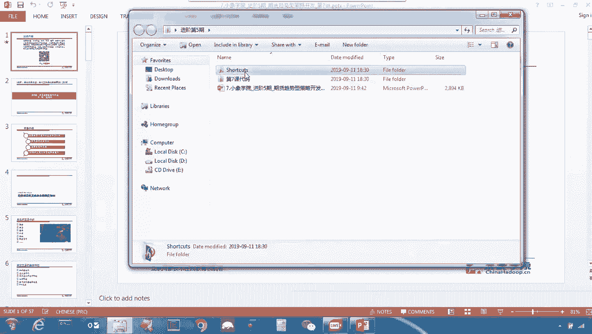

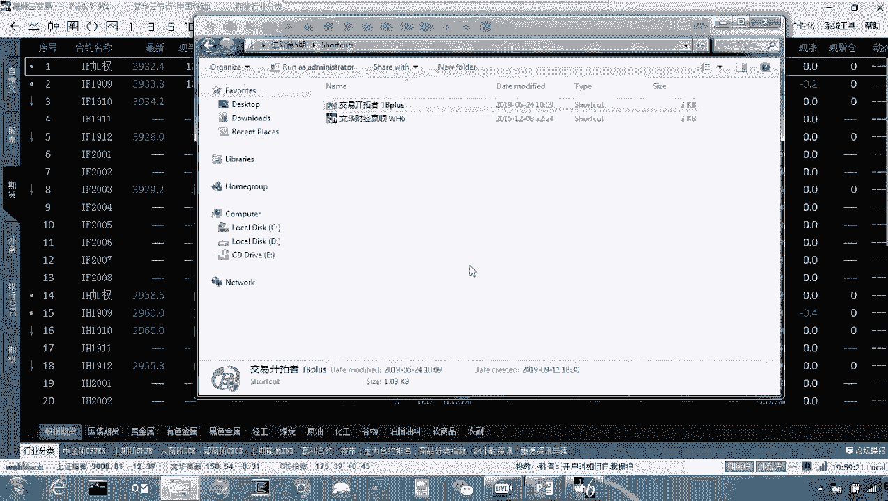

啊喂喂喂，唉各位同学大家好啊，呃刚才系统有一点小小问题，所以我这个上线稍微晚了一点，抱歉啊，好可以听到我声音哈，好的没问题，那现在呃现在呃到到了时间，那我们现在正式开始今天晚上的课程啊，呃好呃。

各位同学大家好，我们现在开始上课，呃，今天呢是咱们这个进阶课程的第七课啊，叫做期货趋势型策略开发，我是宋占江，那么这节课呢我们主要是讲四方面的内容啊，首先呢我先给大家简单的介绍一下期呃，期货知识呃。

因为呃可能有一些同学或许已经呃，在期货领域做过一些呃交易呃，或者说以前可能听了听呃，就是了解的更多的还是股还是股票方面啊，所以呢我先稍微抽一点时间讲一下期货的知识，因为什么。

因为这节课呢我们主要是以期货作为例子，然后来讲一下如何做一个趋势型的量化策略，然后之后呢给大家简单的介绍一下，我们可以用来做期货量化的一些工具啊，软件工具，然后之后呢我们再讲下趋势型策略的原理。

然后呢用TB这个平台，然后我们来真正的带着大家动手，实际开发一个趋势型的策略，先来看一下啊一些基本的期货知识，那么大家可能都知道，目前我们如果是做一些交易的话呢，有很多的选择。

那么目前啊尤其在咱们国内啊，做的比较多的这个一些交易交易标的啊，可以有股票啊，期货债券，外汇期权啊，甚至还有些数字货币等等，那么这些呢都是呃都是比较常见的交易标的，当然最的呃当然做的最多的还是啊。

对国内的投资者来说啊，做的最多的还是股票和期货啊，目前呢还有就是啊期权啊，最近期权呢也是越来越流行啊，那么主要是这些可以用来做交易的标的，那么作为期货交易呢有这些基本特征啊。

首先呢它是一些比较标准化的合约啊，♪ 这么直接说比较抽象 ♪，然后呢，我现在直接给大家打开一个，期货相关的交易软件给大家看一下啊，啊比如说我现在打开的是一个叫做啊，文华财经的文化六，叫做迎顺啊。

文化财经大家去网上搜索一下呃，如果没有用过呃，期货软件的话，可以上网搜索一下，应该有很多的客户端都可以用来看期货的行情，其实和其实和股票的交易类似，那么我现在打开的叫文华财经的啊。

文化六就有这么一个版本，它主要是用来做期货交易的啊，一个软件可以啊，可以看期货的行情，也可以做期货的交易，那么从这个里头呢我们能看到说啊，打开以后我们可以看到有很多的交易所。

那么每个交易所里头呢有不同的品种，比如说我现在打开的是这个上期所，就是上海期货交易所的这么一个啊，呃就是一个可交易的品种，或者说可交易的这个合约的一个列表，然后里头有不同的商品的品种。

然后有不同月份的合约等等，那我随便打开一个，那么我们可以看到说从界面上来看呢，和我们日常所看到的股票的K线图啊，各方面都是类似的，好那么对于期货交易来说呢，啊他有些什么样的基本特征。

首先呢期货进行进行交易的，都是一些标准化的合约，就像刚才我在软件界面上给大家看到的，我们可以看一下，从这个列表中啊，从列表中能看到说，比如说上海期货交易所有沪铜啊，有铜铝镍啊，金银螺纹钢。

线材热卷板等等，那么这些呢都是一些标准化的合约，然后呢而且这些交易呢都是集中在几个啊，几个期货交易所，另外呢做做期货交易，它跟股票交易有一个显著的不同特征，就是双向交易，也就说对于期货交易来说。

我们既可以做多也可以做空，那么对对呃，对股票来说呢，一般只能做多对吧，也就说我们只可以单向的做做多头啊，只能买涨啊，不能买跌，但是对期货来说呢，既可以呃买上涨的这这么一个趋势，也可以买下跌的一个趋势。

所以可以双向双向交易，也就是说既可以做多也可以做空，还有一个呢就是杠杆交易，那么杠杆交易什么什么概念，我们如果平时做做股票的话，大家都知道股票的话，我我一般买多少手对吧，那我就需要投入多少对应的资金。

但是对期货来说不一样，它是杠杆交易，换句话说呢呃也也可以叫做一个保证金交易，比如说我如果要交易一一个期货的合约，那么我只需要付出一定比例的资金就可以了，假如说这一份合约它的价值是呃1万1万块钱。

那么有可能我只需要付10%的资金，百10%呃呃呃假如说以1万块钱举例，♪ 那么这合约本身的价值是1万块钱 ♪，那我只需要付1000块钱，作为一个保证金就可以了，那么这种呢就相当于我用一个很小的一个资金。

然后来可以撬动一个更大的，更大一个资金的一个交易，那么这种叫做一个杠杆交易呃，杠杆的机制，还有一个呢期货呢它是每天的一个结算制度，就每天盘后啊，它会它会根据当天的呃各各个呃，就是根据根据这一个品种。

当天的所有的成交的价格，按照它的成交量进行一个加权，那么根据这个能算出一个当天的一个结算价，我们可以把它这次理解成一个，当天的一个平均价格，那么这个价格呢就是当天的一个结算价格。

然后然后如果说你当天呃手头就是嗯收盘之后，如果手头还有持仓的话，那么这个持仓呢，就会根据那个结算价格的不同啊，会会相应的做一些，把把相应的资金做一些啊，就是呃就是如果盈利啊，如果相对于结算价的话。

如果是有盈利，那么这个资金就会划到你的账户，如果有亏损，那么就会从你的保证金账户再再扣除掉亏损，亏损价格，那么这是一种叫做结算制度，还有一个就是T加零，也就是说我当天当天买入的合约。

那我当天就可以把它卖出啊，当然对气候来说，术语是叫要开仓和平仓对吧，如果当天开仓，不管我是做多方向还是做空方向，那么当天开完仓之后，当天可以把它停掉，也就是说每天可以进出多少很多次，那么跟股票不同。

因为股票呢是T加一交易对吧，那么我今天买入的股票只能第二天把它卖出啊，所以这是不同的地方，那目前在国内啊，交易所就是可以做期货的，有这么几家，一个上海期货交易所郑州，然后大连还有中国金融期货交易所。

当然还有一个这里没列出，就是一个能源中心啊，上海期货期货交易所下面的能源中心，可以做原油，那么大概就这五个，五个正规的交易所是可以做啊，可以做期货交易，同时呢可以交易的呃。

交易的品种呢我这里也也列了一些啊，比如说有金属类的啊，然后有农产品的，有化工类的，还有说股指期货等等啊，那么这是大家了解一下就就可以了，那么所谓标准化合约，这里我给了一个例子，比如说螺纹钢。

那么我们从刚才这个行情软件里头也能看到啊。

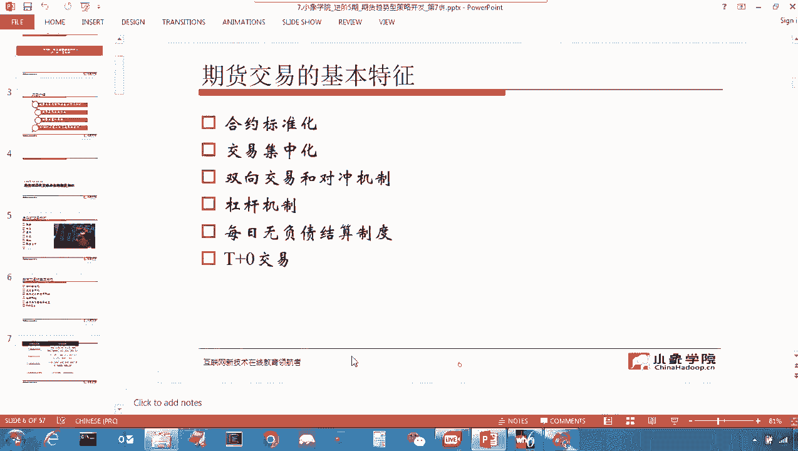

比如说我螺纹钢它是属于上海期货交易所，那么我我呃，我现在从行情软件里头，到上海交易期货交易所这个页面，然后呢选中这个螺纹钢呃这个页面，然后呢我挑一个成交量，挑一个主力合约啊。

挑一个成交量和持仓量比较比较大的，比如说现在这个持仓量最大的，叫罗文2001合约，那我就打开它。

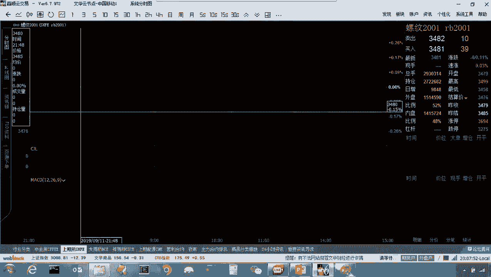

然后按这个F10啊，就能看到说这个合约的一些更详细的资料，就在这个页面里头，那包括品种交易单位等等，好了，那我还回到这个课件里头来，我们可以看一下对于螺纹钢这个品种啊，我拿它来来做一个例子。

那么每一首合约是对应着10吨的呃，10吨的这个货物啊，相当相当于我如果买卖一手螺纹钢的合约，相当于对应了10吨的这个螺纹钢的，这个这个品种，这个商品啊，包括报价单位是以元为单位啊。

然后呢最小变动单位是一吨，♪ 然后还有交易时间啊 ♪，就是每天的早晨九点到下午三点，然后呢还有夜盘啊，夜晚上九点到晚上的11点等等，那么各个品种不一样，那么这是它的一些详细的信息，还有最后交割日等等啊。

还有还有说我所交易的这个品种，所对应的一些啊，质量要求大概是这这么一些基础呃，一些基础知识，同学们稍微了解下就就好了，然后呢，我们看一下在这个期货市场里头，都有哪些人参与啊，通常呢对期货市场。

参与期货市场的人呢是有有两种啊，一种呢是主要是做套期保值的，这个以企业用户为主，还有一类是做投机的，那么那么期货市场它有一个最基本，它有它有两个最基本的功能啊，大家可以也可以去去网上搜一下。

他的一些相关的基础知识，那么期货市场的基本功能，第一就是价格发现，第二呢就是规避风险，什么叫价格发现，也就是大家通过这个期货市场的这个交易呢，仍然后能够能够通过这个交易的，这个价格的走势。

能够一定程度上反映对未来的，它所对应的这个啊，所对应的这个实体的实体的经济啊，现货在未来一个价格的一个一种估计啊，所以这是一种价格发现，第二呢就是说作为一个作为一个风险，作为一个风险的一个控制。

那么这个风险，所以风险控制主要是针对这种套，套期保值来说来说的对吧，那如果是一个是如果是一个生产型的企业，比如说作为一个生产型的企业，那我手头持有现货，那么我可以我可以通过期货市场。

我可以根据期货市场当前的价格，我可以去去做做空，比如说如果现在如果我担心未来，就是当我一个我的产品生产出来之后，那么将来可能价格会下跌，那么我可以通过通过呃在期货市场上，通通过一个做做一个空头。

通过卖出未来的一个合约，然后提前来锁定我这个价差，就保证说将来将来我这个呃产品，♪ 如果生产出来之后 ♪，将来卖到市场上，不会因为市场价格下跌造成更多的损失，也就是说我可以提前锁定我的一个利润空间。

这是对于生产者来说，对于消费者来说呢，我也可以通过一个套期保值的机制，那我可以提前在在期货市场，处于一个低位的时候啊，我可以做一个多头，我可以把我可以买入未来的一个合约，这样将来将来当我将呃这样枪。

将来当我在某一个时刻需要啊，需要进货的时候，那么我可以不管将来市场上涨呃，市场这个这这价格啊上涨了多少，那么原来我持有一个多头的合约，那我完全可以就是把库，把这多头合约和当时市场的这么一个。

价格的价差啊，用来弥补我我我的这个呃进货成本的一个上涨，所以通过一个套期保值，就可以提前锁定一个利润和，一个和一个产品的一个价格区间啊，那么这是套期保值者，那还有一类就是纯纯粹做做投资。

♪ 做投机的 ♪，那么做投机者他也其实也分为机构和个人对吧，♪ 目前来说 ♪，期货市场对参与期货市场的投资者，没有什么太多的限制，不管是机构个人都可以参与，那么具体具体在参与这个期货市场的。

♪ 一些投资的呃 ♪，过程中呢，就有很多很多的类型的这个策略啊，比如说我可以做趋势性的策略，我也可以做一些套利，也可以做一个单边啊，所谓单边就是趋势性策略了，也可以做一个期货和现货市场的。

这个跨市场的一个对冲等等，那么这是期货市场的主要参与者的一个构成，那么对期货投资来说呢，啊刚才大家其实从行情软件上也能看到，那么期货市场上我们所交易的不同的这个品种，或者说不同的合约。

从它的这个呃价格和成交量的表现来说，其实和股票是很类似的，因此呢就是说我们大家耳熟能详的，在在股票市场上所采用的一些，包括基本面的分析方法，还有说技术面的一些分析方法啊等等，甚至包括说我们现在做做量化。

做程序化交易，那么这些方法呢其实都可以适用于期货市场，当然对于期货市场来说，我们所关注的这个基础的信息啊，用来做决策的一些啊，参考的信息要比股票还要多，一个维度就是持仓量啊。

比如说我这里在右边列出了五个维度，一个是价格啊，成交量，还有是时间，也就是说一段行情的走走，这个走的这个周期或者说时间的长短啊，一波行情的这个长短还有空间，这也就是说它的涨跌幅度还有一个仓。

这里仓就指的是持仓量，啊因为因为在期货市场上，这实际上是一个对手，对手交易，就是一个叫做一个对手交易模式，那么对于任何一个合约来说，♪ 有人做空 ♪，那必然会对应着有另外一个人去做多。

所以他们两个总是成对出现的，所以呢整个持仓量呢，就其实就反映出了这个市场上，做多和做空人的之间的一种分歧程度啊，也就说呃这个市场上，就是说大家同时开辟出的这个多空的合约的，这个这个对数啊。

这叫持仓持仓量，所以呢持仓这个维度呢在期货，期货市场的分析上呢也是具有一定的参考价值，也就是除了传统的价量分析之外，还有一个持仓分析，所以通常会把这几个维度都结合起来进行分析，但是刚才我也说了。

对于期货投资来说呢，它有几个呃很典型的特点啊，其实是一个双刃剑，第一呢就是T加零啊，所谓提价零就说你当天买入就可以当天卖出，那么就使得说交易起来非常容易对吧，我随时可以入场，随时可以出场。

根本就没有任何限制啊，那么这样呢就很很容易造成造成什么呢，造成啊有的人他会频繁操作，再有一个呢期货交易呢它是保证金的交易，带杠杆的，带杠杆的话，那么杠杆隐含的意思就是说，当我这个价格进行呃。

当我呃就是要交易的这么一个合约，当它的价格有一定的波动的时候，那么不管它的盈利水平还是它的亏损水平，相对于你所投入的这个资金啊，也就是说你投入的资金就是保证金的那一部分，就不是这个整个的商品价值。

本身只是其中的一个一小部分保证金，那么相对保证金来说，那么它的这个涨跌的幅度就非常可观，也就说你的盈利和亏损的幅度，被放大了好多倍啊，那这样就有有的人就会觉得，期货投资非常刺激对吧。

那可能就呃行情波动一点，那你就可能就有一个大幅的盈利，但是呢换一个角度，当行情有一定的呃往不利的方向波动的时候，就会产生一个很大的亏损，所以这盈亏的水平都会啊都会被放大了很多倍。

那么所以这种情况呢就是很不好把握，尤其是尤其是在期货投资中，有有几个很致命的问题啊，一个就是满仓操作，那很多人的话他习惯了做股票操作，当然当他进入到期货市场的时候，他就不会注意这个啊。

因为我们可以想象一下，因为它是保证金交易，举举举个例子啊，比如说我们交易的某一个期货品种，那么如果他的保证金嗯，就是他的保证金比例只是10%的话，也就是说当我的一个呃，当我持有的一个呃呃合约。

当它的价格波动一个10%的时候，那么我的盈利就相当于是放大了十倍，或者亏损放大十倍，也就是说如果对我有利的方向波动了10%，那我就盈利了百分之百对吧，但是如果向对我不利的方向。

这价格向对我不利的方向波动了10%，那就等于我亏损了百分之百，那么这时候我的本金全亏光了，所以这种情况呢就说满仓操作或者说重仓操作，那么这个呢也是期货投资总额，期货投资中的一个非常啊致命的一个问题。

所以就说，当我们如果是参与期货市场投资的话呢，啊那么仓位控制是一个相当相当重要的啊，一个嗯呃就是一个方面吧，所以在之前啊之前的课程中呢，姚老师也也给大家重点讲过啊，这个仓位控制啊，风险控制等等。

那么这个呢在期货市场里头也同样适用，而且是而且是更加的更加的重要啊等等，那么这些呢，都是一些期货投资参与者的一些通病啊，所以大家如果将来不管是你做啊主观交易也好，还是说做量化交易，如果在期货市场上来说。

一定要注意，那么这里头是有一些不好的习惯是要避免的，否则的话就会亏损，就会亏的很厉害，好了我们看第二部分呃，给大家简单介绍一下都有哪些啊，工具可以来做，来在期货领域做一些量化啊投资。

或者说我们可以利用它们来做程序化交易，那么这个里头我也列出了几个，国内用的比较多的啊，这只是举几个例子啊，当然除了这些，还有还有其他的平台，那么首先一个就是TB啊，叫trade blazor啊。

中文名字叫交易开拓者，这是国内用的比较多的，一个可以支持程序化的啊，量化平台，而且是以做期货为主，第二个呢叫mari chance，也就是MC那MC的话呢，它也是一个很呃。

就是很很方便使用的一个量化平台咳，那么目前呢MC其实呃对期货和股票都支持啊，包括期权也支持，然后第三个就是金字塔，金字塔也是国内的一款图形图表化的啊，量化软件，那么不管是股票期货啊，都都支持。

然后再有就是文华八啊，文华文化八，那么这是支持程序化的，刚才我给大家看行情的是文化六，那文化六主要是看行情和做手工交易，文化八的话是可以做程序化的，再一个就是呃VNPY。

那么这个呢是基于Python语言的一个开源框架啊，既然开源的话，那么就是这个框架完全你可以有很大的自由度，你完全可以根据自己的需求来对它进行修改呀，扩充啊都很方便。

那么这个主要是对一些对Python编程比较熟的人，那么你也可以考虑用VNPY来进行进行交易，还有一个呢就是说自行开发，因为目前阶段啊对期货呃，期货交易来说，大部分的这个期货公司啊，都是基于呃。

就期货公司的交易服务器，都是基于CPP这么一个协议来来进行交易的，所以呢这个CDP协议本身呢它是它是开放的，所以呢如果说你的编程水平足够好的话呢，你也可以脱离前面的这些图表化的教育系统。

也可以脱离这种开源框架，完全可以自己编写自己的一个框架，那底层直接调用CTP的协议啊，CTP的API变成接口就可以了，那么这个呢就是说目前常用的一些啊，期货量化平台，当然除了这些平台之外呢。

还有一些呃呃比如说呃有一些是基于浏览器的，就这种云端的啊，云端的这种量化平台，然后还有国外的一些平台等等，那么这个我我这里只列出了最常见的呃，最常就是目前啊国内用的人比较多的一些平台。

所以大家仅供参考啊，可以举一反三，那我们看一下这个界面，那现在给在屏幕上给大家呃，♪ 给的这个图形界面呢 ♪，就是说交易开拓者也就是TB啊，除了BLAZOR啊，今天这堂课呢。

我带着我带着大家做一个期货的趋势型的策略，那么也主要是基，就是基于这个叫TB这个平台来进行编写，那么这一类平台呢，我们可以统称，把它统统称为叫做图表化的交易系统啊，解释一下什么叫图表化的交易系统。

也就是说这种呃这一类的量化平台，它的界面都是图形化的，就非常直观，也就是说我们可以看像屏幕上，我们能看到这个界面，我首先把我要交易的这个品种，或者说期货，期货合约把它加载上来。

我们就可以直接看到K线对吧，可以看到每一根K线啊，一直在这啊，实时的在往前走，另一方面呢我们可以通过通过编写一定代码，就比如说我这一页是一个公式编辑器代码，我可以通过这些量化平台。

它自己的语言来编写我的策略逻辑，把我的策略逻辑用一种公式，或者说用一一段代码的形式，把它写到这个平台上来，写到平台上来之后呢，就可以去执行它，那么执行这个执行这个啊公式的时候呢。

自然它会根据我已经编写好的逻辑，来执行一些开仓啊，平仓啊，或者说买入卖出等等，那么这种交易动作，那么这种教育动作呢就会在这个图表软件上，用一种非常可视化的，就非常直观的形式把它列出来，显示出来。

我们可以看到说屏幕上我们能看到，像这种粉色的或者是黄色的这个箭头对吧，♪ 有上箭头 ♪，下箭头，那分别表示做多做空，然后入场出场等等，那么也就是说在屏幕上我们能看到的这些箭头，和这些标志。

红粉色的或者黄色的，这些标志，都是我们的这个呃程序所产生的交易信号，另外呢另外就是每每一次交易信号，就是每一次交易就是从入场到出场，他会还会把我的这两个入场点和出场点。

用用这个绿色的线或者红色的线把它连接起来，这样的话呢，我就能知道说我每一笔的这个入场和出场信号，他最终这个交易它到底是盈利性的出场，还是亏损性的出场，就非常直观啊，那么像这种图表化的交易系统来说。

对于啊对于编程能力，就是编程经验不是很多的同学来说，他是一个比较好的啊，一个啊就是这个啊入手的一个工具啊，就就入手会很快，当然它也它的好处就在于非常直观啊，就是语言就编程语言也比较简单。

那不好的地方在于什么呢，不好的地方在于这种图表化的交易系统，它比较耗资源对吧，因为我收到的每每一个每一次的行情更新，都会在屏幕上进行进行画出来，然后他也会执行执行那个代码，那代码本身是解释型的。

所以它执行效率也会比较低，所以这样的话呢，就使得说我如果用这种图表化的交易系统，同时交易的啊，这个呃期货合约并不会太特别多啊，就限制了我的呃，这个呃系统的就是可以同时交易的品种的容量。

这是它的不足的地方，当然为了解决这个不足呢，这些量化平台他们也做了一些事情，他们一般通常这些量化平台呢，也都会提供一种叫做后台交易模式，或者叫做无图表交易模式，♪ 那么这种模式呢 ♪。

♪ 它就它就相当于是在运行你的这个策略 ♪，代码的时候呢，它不把这个K线显示在屏幕上啊，只有在需要的时候才把它调调调出来显示，这样的话就可以节省一些对CPU和内存的消耗，那么这是一些改进措施啊。

这是这是呃呃，对他们简单的一个优劣的一个比较，那还有一点呢就是说这种图变化的交易系统呢，他对他对你呃，对你的这个策略的评估也做的比较直观，那么当我们写好一个策略的时候，首先我们要把它呃。

根据这个历史的数据进行一个评估啊，术语叫做回测，叫back test，做一个回测，那么在回测的过程中，我的这个写的这个一个策略，♪ 一个交易策略 ♪，它所对应的各种评价指标。

比如说啊呃就是总的盈盈利比例啊，然后呢胜率啊，然后夏普比率啊等等，那么类似这种这种信息啊，都会在屏幕上用一个图表化的工具，和图表化的方式给大家显示出来，就非常直观啊，这是这这是这一类啊。

这类图表化交易系统，那我们再看看呃，♪ 再看看第二类 ♪，就刚才我给大家介绍的VNPY，这是一个开源的呃，开源的一个框架，那么在这里给出了一个官网，叫学W点VNPY点com啊，就是这是它的一个官方网站。

如果有兴趣的同学，也可以去这个网站上下载它的源代码，下来研究一下，那么VNPY呢它本身是用嗯用用Python啊，本身是用Python这个来编写的，当然底层它调用了这个C加加的，那个动态链接库。

咳而且呢它它是一个事件驱动的一个一个框架，也就是说它可以去订阅一个行情，订阅你所要交易的这个品种的行情数据，但订阅订阅一个订阅行情数据过来之后呢，如果有很多的策略同时用到这个。

同时用到这一个交易品种的话，那么它它这个数据就不会重复去订阅，所以它的从效率来说还是比较还是比较高的，那么VNPY呃，VNPY呢就是说它嗯它的这个交易界面啊，执行起来，执行起来之后呢，有有两种。

♪ 一种是图形化的界面 ♪，还有一种就是命令行的界面，我在这里头给大家啊，现在看到这个屏幕啊，是VNPY它的一个源代码的编辑器，那么我们可以从这个里头能看到说，♪ 如果在VNPY这个框架下 ♪。

我们去编写一个一个量化策略的话呢，其实和我们用Python这个语言来编写一个，其他的一个什么小应用，其实形式是完全一样的，就是纯纯粹写代码，那么那么它这个代码，我们可以把我们自己的交易逻辑。

或者说我的一个量化策略啊，按照自己的风格啊，按照自己的喜好，但是你同时需要考虑这个VPR的框架结构，按照它的结构，把我们的这个策略逻辑编写成一个Python代码，把它放到这个VPL框架下。

就可以把它执行起来了，执行起来就可以执行交易了，那么VNPY执呃执行交易的时候呢，有两种界面，一个是图形化的界面，一个是命令行的，那么图形化的界面呢，就像我在屏幕上，现在给大家列出的这个样子。

我们可以看到说，你打开它这个呃，打开它这个VNPY的图形界面之后，首先选择一个加载策略，它就可以从一个配置文件里头，把你把系统已经预制好的，还有你新编写的策略都给你加载上来，加载上来之后呢。

然后做一个初始化，然后点一下启动按钮，然后这个策略就开始执行了，它就可以自动完成说行情行情数据的订阅，然后再在后后台做一些处理，然后触发交易信号，然后执行一个呃，发出一些委托单等等。

那么这个呢就完全在这个图形界面的后边，就开始工作了，就可以完成一个呃，就是自动交易，还有一个界面呢，就是说我可以玩，♪ 连图形界面都不要 ♪，我这纯粹就用一个命令行，敲一个命令。

他就后台就开始开始做这个交易了，自动交易，那么这个就比较适合于，我们把它放到一个LINUX服务器上去去执行，这个效率也很高，好那么前面呢刚才呃说了半天啊，回顾一下。

一个呢是给大家简单的介绍了一下期货市场，就是期货市场的一些常识啊，包括说有哪些合约呃，呃就是有哪些期货市场我们可以参与啊，大概一个期货合约是什么样子，然后呢期货市场进行交易的一些规则对吧，比如T加零啊。

保证金交易或者是带杠杆等等啊，可以多空多空双向啊，这是第一个，第二个呢给大家简单的介绍了一下，可以用来做期货量化的一些啊，一些量化工具或者说一些软件平台，那么刚才给大家重点介绍了两类。

一类是图表化的交易系统对吧，我是用TB作为一个例子，给大家介绍了一下，这种图表化交易系统是什么样子，第二呢给大家介绍了一个开源的框架，就基于Python，Python这种这种更更底层的这种语言。

就更灵活的一个语言和框架，也可以把它拿来去做一个期货的啊，程序化的一个交易，全自动的程序化交易啊，两个平台给大家介绍了这么这么两种类型，然后现在呢我们就进入第三部分啊，也就是咱们这堂课的一个主要内容。

那么我们就来看一下一个趋势性策略的原理啊，那么在趋势权策略原理呢，我就是呃以这么一个啊，就是非常经典的叫做海龟交易法为例。

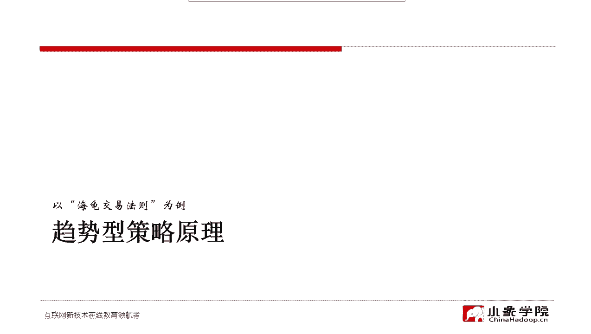

来给大家讲趋势性策略原理，我们可以再回顾一下，就是目前我们常见的交易策略有哪些啊，我相信同学们大家应该也都是看过一些啊，比较经典的啊，交易类的或者说技术分析类的图书对吧，那么我们知道说常见的交易策略。

一般会有会有几种类型，那一种类型呢就是趋势跟踪型，也就是说我是抓一个大的趋势的，就像我我在左左边，左边左上方这个图我们能看到说，其实它呃如果按照道氏理理论的来定义。

那么一个趋势就是说它会产生的很多的这个呃，很多这个风骨对吧，那一波比一波高，就是高点，一直在抬升的高点和一直在抬升的低点，那么这种就是一个趋势，所以这种趋势跟踪型的策略呢。

主要就是抓这种连续的一个大大的趋势，啊，第二类呢，我们可以把它叫做一个高抛低吸型的策略，那高抛低吸型的策略呢主要是对应呃，主要是适用于一些震荡的行情，也就说像像我这个右下角这个图。

那么这段比如说在某一个时间咳，那么我们交易这个品种，它的这个价格走势一直在上上下下，在相对来说一个比较啊，比较规整的一个空一个区间内啊，或者这样一个箱箱体，在一个箱体或者一个区间内来回震荡。

那么这个时候呢我们就可以在高点卖出，在低点买入对吧，那么这就是一个高抛低吸型的一个策略，也就是说它可以适用于一个震荡型的啊行情，还有一类呢叫做横盘突破型，也就说不管我这么一个行情，我震荡了多长时间。

那么总总会在某一个关键的时刻，它会或者向上突破我的这个箱体，或者说向下突破我这个箱体，那么这种横盘突破型的策略，他就就是要抓这个点，就会把这个突破的这个关键的点，作为他的一个入场的时机，当然了。

我们换一个角度讲，那么既然是横盘突破型，其实他的目标呢也就是抓住一段趋势的启动，对不对，所以说有的时候呢，我们会把这个横盘突破型的策略呢，也会把它归结到一个趋势跟踪型策略里头来，好了。

那么我们嗯就简单的说一下，就是常见的交易策略就这三种，但除了这些之外，还有一些比如说啊套利啊，或者一些跨市场的呃，或者一些配对交易等等，还有很多的还有很多种其他的类型啊，那就是更复杂一些。

那么在下下节课我也会带着大家去啊去啊，带着大家去学习一些就是这个一些对冲交易啊，或者叫配对交易，配对交易怎么在这种量化平台上去写啊，也是我们怎么去做一个全自动的一个配对交易，那么那是后话了。

所以呢但是最主要的我们啊如果我们做单边的，做单边的这种呃交或者比较简单的单腿交易吧，那么主要是分分这么几种类型啊，或者趋势跟踪或者高抛低吸，或者是横盘突破，那么这个呢就是啊最常见的咳。

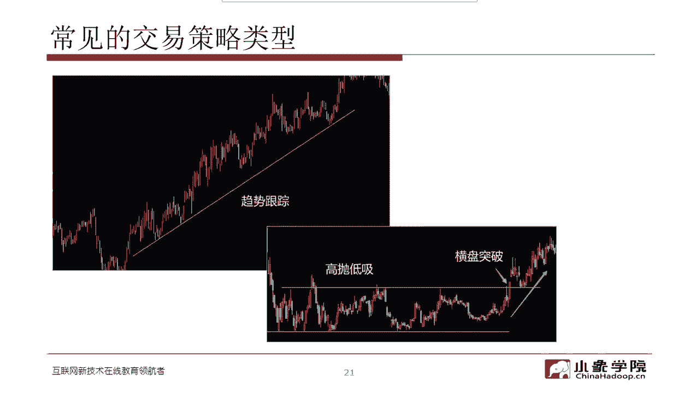

所以不管你现在要做的是一个什么样类型的啊，一个策略，那么它总会有一些核心要素在这里头，我列出了六个，我相信这几点，也是咱们课上老师反复给大家强调的，也就是说当你不管是你做一个主观交易。

还是去做一个全自动的或者半自动的，一个量化的一个交易，那么你的策略本身啊一定要包括这六个方面，或多或少都会包括包括这些方面，那么这个策略才是一个完整的一个策略，那么这六个方面。

这这这六个核心要素是哪些呢，首先就是一个市场对吧，买我们买卖什么什么品种，这个市场就相当于是我们的一个品种的选择，比如说你到底是做股票的，做期货的，然后呢你是做呃呃或者说做外汇，做外汇啊等等呃。

或者说你同样是股票或者同样的期货，你也有不同的标的可以选择啊，这是市场，第二是规模，那么每次每次我做交易，我到底是买或者卖或者做多做空多少头寸，那么这就是一个头寸规模的一个一个设定。

那么之前呢呃咱们老师呢也是在有一节课，专门给大家特别的去讲了一个啊，叫做就资金管理吧对吧，也或者说仓位控制，那么那么从那个里头呢，大家应该回顾一下那个那个策略，其实那里头就就集中在讲。

怎么去确定我的一个交易的一个头寸规模，那么根据呃这个这个头寸规模，其实是一个相当重要的一个呃呃一个因素了，那么我们可以通过一个合适的投资规模，其实可以很好的去降低呃，降低我们的风险，然后呢。

提高我们的一个一个收益的一个稳定性啊，就是头痛规模的重要性，然后第三点就是入市，也就是说入场信号，那么什么时候我去买买进啊，买进或者说是什么时候入场，当然我入场可以做多，也可以做空啊。

对期货来说就是可以做多，可以做空，但是入场就开仓，对于股票来说，那就是买和卖对吧，就是买那止损，还有就推出策略，推出策略其实是呃有两种，一种是什么时候止损退出，一种是什么时候止盈退出对吧。

因为我们最终进入这个市场去做交易，肯定是目标呢是要盈利的对吧，我们肯定是希望是吗，盈利退出，但是呢但是当我们一旦这个市场行情嗯，就是没有按照我们的预期去去盈利的时候，我们要及及也要及时的去斩断这个亏损。

所以呢退出的话既包括止损性的退出，也包括止盈性的退出，还有一个最重要的就是战术就怎么买卖，那么这个其实就是我们一个策略的核心思想，对吧，那么一个策略核心思核心思想，举个例子，你比如说我到底是这个策略。

我是想做一个趋势型策略呢，还是做一个震荡型，还是做一个突破型的对吧，那么我们我怎么去衡衡量一个趋势的延续，或者说怎么去衡量一个啊，这个震荡的一个转折点对吧，或者怎么去衡量什么时候产业突破。

比如说我到底是根据一个什么技术指标，还是根据一个是什么某种标准吧，那么这个呢就是我的一个策略的一个具体体现，就就战术层面就怎么去做一个买卖，所以这六个呢，就是我们一个交易系统的一个核心要素。

那么其实海龟交易系统，就是包含了这上面所有要素的，一个完整的交易系统，为什么我这节课是拿海归教育系统，来给大家举例呢，就是因为它包括了这六个方面的完整的，这个要素是非常经典的，而且是非常有价值的。

但是可能有的同学就会问了，这个海龟交易系统，也许有人啊也也都听说过对吧，因为海归交易系统其实你其实大，如果大家啊随便去网上搜一下就能搜到啊，是一个呃，可以说是大家如雷贯耳的一个呃一个策略。

也是一个非常老的一个策略，但是我们为什么要用要在这里去去讲呢，其实这个策略本身啊，不在于它到底是新还是旧，那么这些就是这些啊就是特别经典的这个系统，它自然有它独到的地方。

那海归教育系统本身是覆盖了这六个方面，那么我们通过通今天通过对这个海龟交易系统，这么一个策略进行一个深度剖析的话，我们其实可以大家可以比较全面的去体会一下，到底在一个完整的交易系统里头。

怎么去把这六个方面去进行一个综合考虑的，而且就说这个里头嗯，这几个因素你可以把它进行各种修改，那可能最后就会产生截然不同的效果，那这个我们大家可以去慢慢体会，所以呢，所以而且呢，就是说。

如果我们大家其实现在从市场上也能看到呃，就是从市场上也能看到，说有非常多的这个开放的源码啊，不管是说啊你去一些论坛啊，去一些网站论坛或者说一些一些公众号，其实也有很多很多这种就是分享各种策略思想。

或者说分享策略源码的啊，这些地方你也可以能拿到非常多种类型的这个，策略源码进行参考，但是如果说当你把这些策略看了很多很多之后，你就会发现就市面上你能看到的这些策略，其实大同小异。

就虽然从写法或者说从他的思路来说，看起来是五花八门，但实际上你如果真的看到它最根源的思想，无外乎就是那么几方面啊，比如说你到底是说就是可有可能产生信号的，这个过程是是有很多种变化。

但是呢你归根到底总主要主要还是要看它，它是呃就是有有几种不同的类型，比如说我到底是要看某某种时刻一个突破对吧，还是看某一种趋势的延续，或者说我在这里头我怎么去控制我的头寸啊，怎么去控制我的止盈。

止损无外乎就是这么几个几个基本的方面，那所以呢我们通过通过对经典的呃，而且就这些这些从市面上能看到的，这些各种呃五花八门的策略，他们基本上都是或多或少能看到说，有这些传统的这些经典的策略的这个影子。

所以说我们对这种经典策略做一些研究的话呢，其实是非常有有好处的，你完全可以基于这些策略，然后进行一个融会贯通，最后也会做出一个自己的，一个有自己特色的一些策略来嗯好了，那么刚才说的海归教育系统。

它本身至少已经包括了这六个方面，所有的核心要素，那么我们先看一下这个投送规模，那么在海龟交易系统里头，它怎么去确定一个投送规模呢，那么在这里头有海龟交易系统里头，有一个特别重要的一个概念。

叫做一个波动性，叫做N啊，那么这个叫做波动性N，这呃在这屏幕上给大家列出了这个公式，我们可以看到说这个N实际上是说咳，十九十九呃，就前19天的这个就前一天的波动性，N乘以19，再加上当天的这个tr。

然后除了20，就相当于是做了一个平均啊，大家可以想象一下，可以做一个平均，那我把它展开讲一下，那么这这个TR是什么东西，tr叫做true range啊，中文叫做当日的一个真实波动幅度。

那这是波幅怎么算的，也就是说他把每一根K线，当天的最高价减当天的最低价，还有当天的最高价，和前一天的收盘价相减的一个绝对值，以及当天的最低价和前一天收盘价，它俩相减的一个绝对值。

然后对这三个数求一个求一个最大值，那么这个最大值就是TR，T r，就表示说，当天我能看到的这么一个价格的一个，波动幅度啊，叫真实波动幅度，然后呢对这个TR再进一步的求一个平均啊。

我们知道说有一个经典的技术信号叫做ATR，叫average true range啊，这是一个很很很就是很标准的一个基础啊，分析指标叫ATR叫平均真实波幅，那么在海龟交易法里头，海龟交易法里头。

这个波动性N实际上就近似等于ATR，就近似等于平均正式波幅这么一个指标，但是为什么这个N它是用19倍的，用19乘以前一天的N，再加上当天的TR再除以20呢，这个可能是历史的原因。

因为可能就是海龟交易法产生的那些年，就整个计算啊，当时计算机还还没有普及，所以他当时计算只是一个很简化的一个算法，但是我们可以可以用这用这个公式和，和真正的AATR公式两个去比较，去比较一下。

他们两个算数值应该是差不了太多的，所以可以认为这个N就近似等于一个ATR，那么当我们把这波动性N啊计算出来了之后，那么我们怎么去确定我每次交易入场的这个，头寸规模呢，就这里有一个公式嗯，这个公式呢。

也可以把它叫做一个1%的风险法则，在之前课上应该也有老师给大家讲过，这个百分比某一个百分比的风险法则，也就说我来用来确定投送规模是这么确定的，首先我先规定我这一次啊一次交易，或者说我这一次入场。

我最多可以承受的亏损，就是我整个账户总价值的1%，比如说我这一笔进去了，我最多亏1%就一定要出来啊，我不能死扛，那就不止损对吧，这个刚才我在前面讲了，讲这个期货交易的一些通病的时候。

大家也知道说不止损也是一个大毛病啊，不止损的话呃，这个这个将来可能损失是完全不可预测的，所以呢一定要截断亏损，那么我规定说我最多一笔交易，亏损账户的1%，这1%当然可以拍脑袋定啊，你比如定1%也好。

2%也好，这个完全看个人对这个波动的承受能力，假如说我制定账户的1%，作为我的一个最大的允许亏损的风险好了，用账户金额的1%再除以这个N啊，就除以这个N就是除以波动性，再除以这个每一每一笔最小交易单位。

比如说我我要买一手股票啊，买一手股，我每次交易最最少是一手，对不对，一手股票就100股嘛，所以这个每一个最小交易交易单位就是100，100就是100，所以我们通过通过这个公式就可以看到，当这N大的时候。

那么我算出投资规模就小对吧，NN小的时候投资规模就大，那么这个呢就啊就很直观了，也就是说当我要交易这个品种，如果它成天这个上蹿下跳，♪ 也就是说它的波动性如果非常大的话 ♪，那是那说明什么。

这说明我要交易这个品种是不是风险很大对吧，因为有可能会对我造成很大的一个风险，很大的一个亏损，所以这种时候我的投资规模就要小，就每次交易我入场买卖的这个手术就会比较少，那如果说这个波动权比较小的话。

我就可以多买一些对吧，反正我的风险也不大，大概就这么一个原则，所以通过这样的话，就可以把我每一次入场最多的亏损，控制在一个百分比以内，当然我入场之后盈利多少，那就要看市场的走势了对吧，但是我不管怎么样。

我最多就控制亏损1%，如果如果是没有盈利，那亏损1%就出来了，但是盈利的话，那那是其他的出场策略来控制好了，所以这个呢就是海龟交易法里的一个投送空，投送规模的计算方法，就是叫一个百分1%的风险法则。

通过一个波动性N或者叫真实呃，叫做平均真实波幅吧，两个其实类似啊，计算起来很相似，通过一个波动性N来控制，我每次入场所要参与的一个投诉规模单位，那举个例子，就像刚才其实我已经说了。

比如说中国平安这支股票，它的这个波动性N现在是五块钱对吧，你就说我最近看中国平安这一段时间走势，基本上就是波动幅度啊，大概都在五块钱左右对吧，每个K线之间的波动，♪ 就在五块钱左右的这么一个变化 ♪。

所以呢那么假如说我现在账户本金100万，那么1%就是1万块钱啊，最小交易单位是一手，也就是100股，那么我如果要进用用海龟交易法来交易，中国平安这支股票，那么我可以给他分配的投资规模，就是1万÷5。

再除以100等于20，也就是说每次我最多买20手股票，咳，拿出股票就完了，那如果说这股票盈利了，那当然皆大欢喜，如果亏损了，那最多亏到1%，最最多亏掉1万块钱，那我就把它亏损出厂，平仓出场。

大概是这么一个意思好了，那么这是讲了头寸规模呃，怎么去分配他的头寸规模，然后现在呢，我们再看一下他的入场和出场策略啊，入场出场信号在海龟交易法里头，其实它它是有有两种入场入市策略啊，一种叫做系统一。

一种叫做系统二，那么系统一呢主要是偏短线的啊，系统二呢主要偏中长线的，那系统一的话呢，我就是以20日突破为基础的一个短期系统，也就是说换句话说啊，怎么理解这句话，对于系统一就是裸交易的这么一个期货品种。

那么当某一天的价格，突破了前边20日的高点的话，就突破了前边20天的最高价的时候，那我就入场做多啊，具体就这么说，那如果说跌破了前20天的最低价的话，那我就入场做空对吧，这就是他的一个入场策略，很简单。

大家可以回想一下，刚才我讲的策略类型，又又是趋势跟踪型的，又是高抛低吸，还有一个突破对吧，那么显然海龟交易法的它的这个啊，他的这个入场策略是是这个叫做呃。

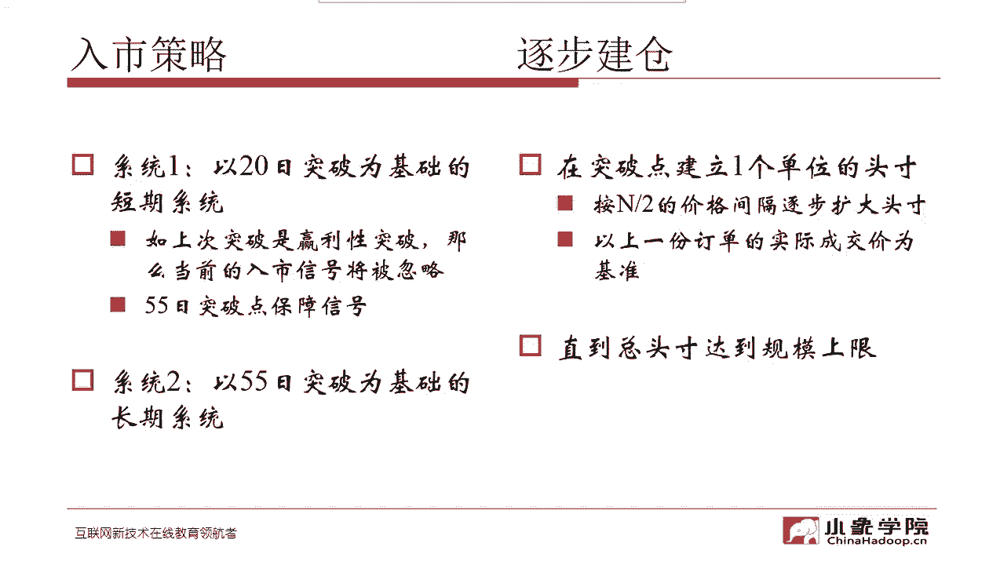

就是就是那叫行情突破型啊，就叫叫做横盘突破型，它是一种横盘突破型策略，但它的目标肯定是要抓一个趋势，所以呢，我们把它归类到一个趋势跟踪型的策略里头来，他但他的入场风格是做一个横盘突破啊。

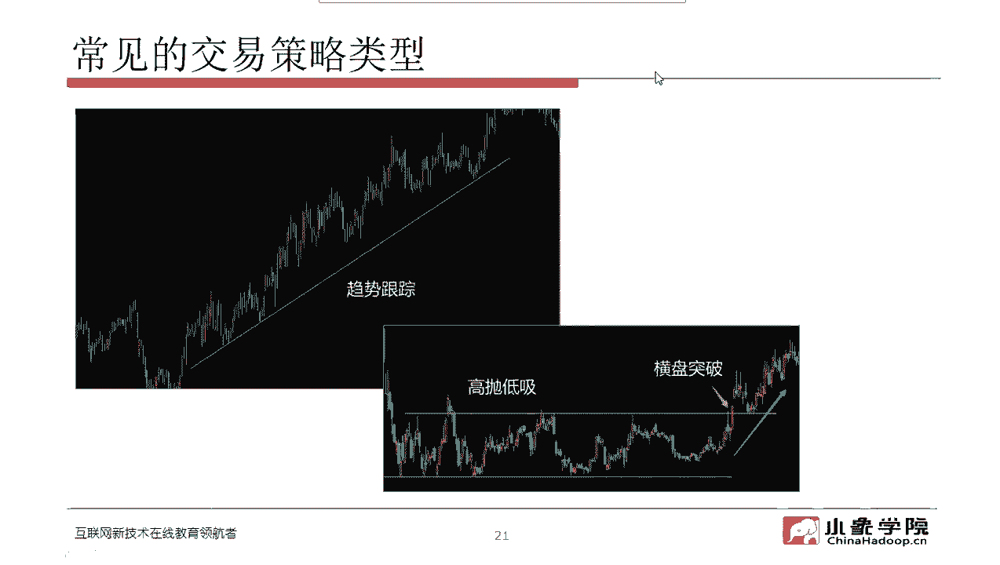

找一个横盘突破的点，好了，那么这是对20日，对这个短短线的那对长线一样，长线的话就只不过把20天换成50天就好了，55日，当然20日和55日呢，这是海龟交易法它的历史原因的一个经验值。

那么大家如果真的是用这个用海龟交易法的话，你完全可以把这个呃根据不同的要交易的品种，把这个日期换一下，然后呢这是入场点，然后呢第二个呢就是加仓啊，加仓策略，那么在突破的时候。

就是突突破20日或者55日呃，前期高点的时候，那么在突破点就现建建立一个单位的头寸，那么这一个单位的头寸是怎么算的，就是刚才我上面讲的这个投资规模对吧，一个单位就相当于是用账户的1%除以N。

再除以它的最小交易单位，这就是一个交易单位好了，那么在top点建立这个单位之后，那如果后边后续的它的价格，继续朝对我有利的方向去走，那么嗯价格美上涨啊，如果是做多的话，就是每上涨1/2的这个价格间隔。

如果是做空，就是每下跌1/2好，那么行情按对我有利的方向，每经过1/2的这么一个价格间隔，那我就再增加一一倍，再增加一倍的头寸啊，每次都是都是加一，就每次都增加一个单位的头寸啊。

每每每经过1/2的这个价格区间，我就增加啊一个单位的头寸，这叫加仓，好啦咳，这是啊，这是入场和加仓的一个动作，这里还有一个入市策略，还有一个细节，也就是说突破20日的时候。

那么上次到底是盈利性还是还是还是说亏损性，那么当当然后对这个信号本身有一个细节处理，这个一会我们细节再说，大家现在只需要记住，说入场就突破前期高点的时候入场对吧，突破之后，那如果价格冲着对我有利的方向。

再继续上涨的话，那每经过二分之N的间隔，那我就再扩大111份头寸啊，直到达到一个上限，那么这是一个入场策略，我们再看出场策略，市场策略有两种啊，一种是盈利性的推出，一种是亏损性的推出。

我们先说说亏损就是止损，那么任何一笔交易，风险程度不能超过账户的2%，刚才咱们也看到了啊，刚才咱们看到说他每次入场的这个头寸规模，是用的是一个1%，也就是说，也就是说我头寸规模计呃。

计算投资规模用的是1%的一个账户账户，但是亏损的话，最后允许亏亏亏损两倍啊，亏损两倍N就是亏损两倍的这么一个风险，那这个当然，这个就是到底2%还是1%，或者3%，大家完全可以根据自己的啊需求啊。

或者说根据你的回测结果去去进行一个调整嗯，好了，也就是说既然在海龟交易法里头，它默认的规定止损幅度是啊不能超过啊，不能超过账户的2%，也就是说价格变动上限就是百二倍的N对不对。

因为我刚才那个刚才的这个我的投送规模，就是已经根据这个百分比，还有一个波动性N来计算出来的，用1%来计算的，所以如果说当风险程度超不超过2%，这相当于价格的变动上限就是二倍的N对吧，好了，那么这个呢。

就是这就是一个止损的一个基本原则，当然对加仓来说，如果是中中途发生了加仓，也就是说我这个里头在这一页给大家说的，在突破点建立头寸之后，然后二分之间间隔进行加仓，如果发现加仓的情况。

那么每次加仓都会把止损点上移啊，每次止损上浮，也就是说我们是按照最后一次，按照最后一次加仓的价格，如果往下跌二倍的N，那么我就止损退出，这是这是这是一个啊，也就是说我直接要时刻上浮这个止盈点的。

每次加仓我都上浮这个止损点好了，这是止损性的退出，我们再看止盈性的退出，止盈的退出呢就是说对于系统一来说，我们刚才看到说系统一，它的入场信号是以20日突破为基础的，一个短期系统。

也就是说如果说突破了20日的高点，我这里先只以这个做多为例啊，那么如果突破了20日的高点，那我就入场做多，但是呢如果入场之后，价格肯定还会一直在在变动对吧，或者上上涨或者下跌，那假如说上上涨了一段时间。

然后又反向突破了10日的低点，反向啊，刚才我我以做多举例，那就是向上向上突破高点，那么现在如果是向下就突破10日的低点，那么这个时候就是一个出场点，那么这时候是一个我这这种情况。

把它叫做一个止盈性的退出，止盈性的退出啊，因为它不是没有达到二倍N的这个止损线，但是它是因为价格它确实是上升了，然后又回落了一部分，回落了一个回落了一个最近10日的一个低点，那么这个时候呢。

也也是把它叫做一种指盈利性的退出好了，那对长线，对长线的交易系统来说呢，那就要把十修整成20就可以了好了，那么这个里头我们可以看到说两种出场策略，一个叫做止损性的退出啊，一个是止盈性的退出好了。

那我们再回到入市策略，那当当我这一次入场出场结束了之后，那么下一次再发现，再发现一个20日突破的这么一个，入场信号的时候，那么我就要看，如果上次的突破是盈利性盈利性的突破啊，如果上次突破是盈利性。

也就是说是通过通过这种10日反向突破，退出的情况下，那么这是一种盈利性的退出，那么当前2日突破的信号就会被忽略了，啊那么这个什么概念我们可以理解，我们可以理解认为说就是这是一个这种情况。

他应该是海归加法，它主要是抓一个小一个小的盈利区间，那如果上次已经已经抓到了之后呢，如果再发生这种一个小级别的突破的话，有可能它是一个一个行情的末端了，所以这时候他就他就宁可不入场啊。

避免带来更大的一个风险，但是还有一点，那如果说本身这一根K线，是突破了20日的高点，同时他也突破了55日的高点，也就是说这一次突破他是在小级别的一个突破，同时在更大级别也是同时的一个突破。

就小级别和大级别同时满足，那么这种情况下，那么我是无论如何也会再次入场的，不管上次突破是盈利性退出还是亏损性退出，那么这次如果说20日的突破，同时也也满足了55日突破的话，那么他将无条件的再次入场啊。

那么这个时候就相当于做一个更大级别的趋势，要要也也是相当要抓一个更大级别的，这么一个一个利润，所以这是海归教学法里的一些实现细节，那么这个一会儿我们在代码里都可以看到，好。

那么也就是说现在我们可以看到说这六个要素，我大家已经大概给大家介绍了一遍啊，包括说是呃交易品种，当然可以自己选了，然后呢每次投资规模怎么去确定啊，入场策略，出厂策略，包括止盈止损。

还有一个具体怎么买卖对吧，我通过一个突破，正向突破，反向突破等等，那么这个核心利用要素都描述清楚了，那么这个呢就是海龟交易法的一个精髓所在，好，那么当我们啊已经了解了这个策略，本身的一个思想之后。

我们下面就看看如何把它来编写成一个代码，真真正正的让它在某一个量化平台上，让它自动执行起来，所以下面呢我们就看一下，怎么怎么来编写这个这个策略，那么在这节课中呢，我们给大家选用的工具是TB啊。

一个图表化的交易系统，那这个因为这个入手是比较容易的，所以呢我们这节课用TB来给大家做一个演示，那么在后面两节课里头，我会各换一个平台，所以整个就是在我连续这三节课里头，我们会分别用三种平台来编写。

三种不同类型的策略啊，好所以那是题外话，那我们先看看这节课，用tb来编写一个啊期货的趋势策略，也就是说看看怎么把海龟交易法，在TB这个平台上把它做一个实现，那TB呢这个平台啊是国内用的比较多的。

我们可以看一下它的官网呃，tb的额，tb的官网叫叫3W点trade blazor点net，就是我在屏幕上给大家看到的啊，这个网站，所以如果说在课前大家没有做过预习，没有下载的话。

你可以在课后啊自己去下载一个试用一下，因为它注册什么使用都是免费的啊，如果是你要不拿它做实盘交易，比如说如果做跑一个回测或者模拟盘，是完全免费的，那如果要拿它做实盘交易的话。

当然首先要要先去某一个期货公司开户，然后跟这个软件账户绑定就可以，就可以做交易了，那么TB这个软件它有好几个版本啊，目前呢就是我们在PC上用到的，一共有三个版本啊，一个叫做极速版，一个叫旗舰版。

还有一个叫TDQU，一共是三个版本，这三个版本呢就是旗舰版和极速版，其实差不多啊，都是比较经典的版本啊，旗舰版极速极速版都差不多，各有各有利弊吧，然后TB框呢是最新啊。

才推出一个新的一个更复杂的一个平台，♪ 那么这个目前正在公测阶段 ♪，然后TB框呢它的啊它的功能应该更强大，从语法来说，相对相比于旗舰版和极速版来说，做了一个很大的增强，包括说多个图层。

或者说事件驱动的一个编程框架，还有一个对Python语言的支持啊，就是TB框的，那么如果真的是学有余力的同学呢，你可以去啊，有兴趣可以去研究下TB框的啊，但是在咱们这节课里头呢，我就还是用一个简单的啊。

比较传统的这个旗舰版或者是极速版，来给大家做演示啊，尤其是对没有啊，没有在这平台上做过编程的，没有这种编程经验的同学来说，那可能就这个两个传统的平台，就是啊看起来更容易接受一些。

那旗舰版和极速版基基本上是从语法来说，各方面基本上兼容的，只只不过使用风格啊和习惯不太一样好了，那么下载哪个都行，♪ 我这节课里头给大家用 ♪，用极速版来做一个演示啊，如果说你本身之前用过tb。

你比如说你之前用过旗舰版也没关系，其实完全一样的啊，所以我对版本的选择并没有一个特别的倾向性，我这节课是拿极速版来给大家做一个演示，好了，那么我我们如果你把从tb这个嗯网站上，把极速版下载下来。

并且做一个安装，然后呢你需要注册一个用户啊。

注册一个用户名，免费的就可以登录进去了，然后呢我这里已经提前把它运行起来了，登录进来之后呢，是是这个样子，咳啊TB极速版，然后呢在这里头呢，我首先我可以先去创建一个新建一个工作区，在文件菜单里头打开呃。

呃就是新建一个工作区，啊或者新建图标也行啊，图标里选K线，或者说建工作区，再插入图表都可以，那我这里直接就建图表，然后新建一个图表，然后一个K线类型的图表啊，建立这么一个咳一个工作区。

它默认叫做工作区一。

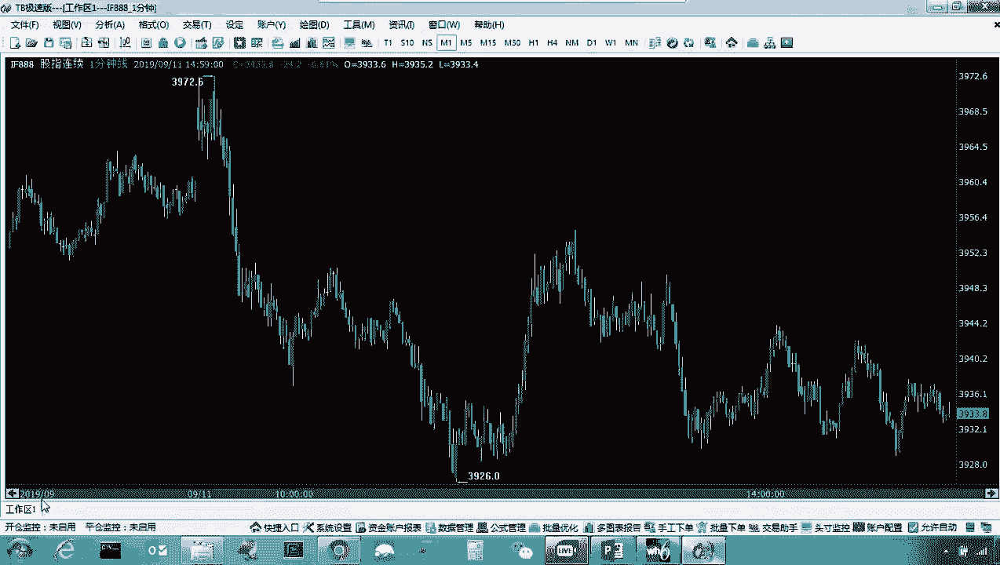

然后默认会随便加载一个啊一个品种，这个我们不用管它，我们就直接啊，我们直接把它切换成我们想用的一个品种。

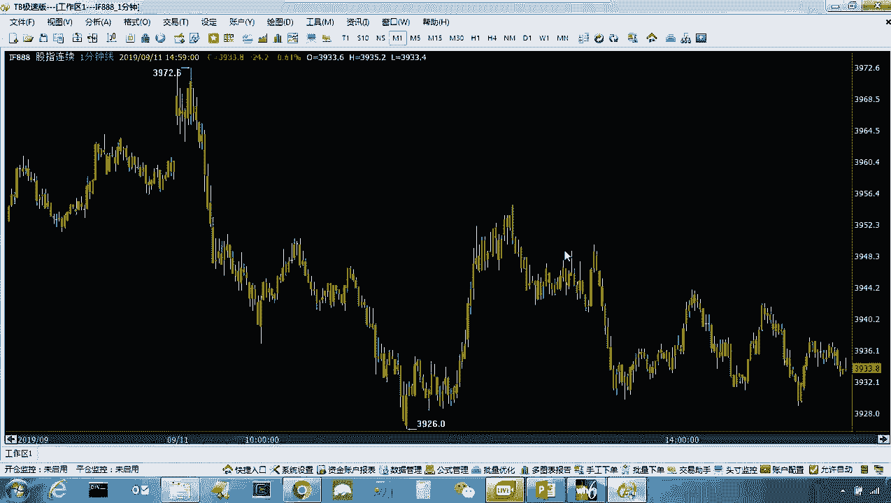

然后再在这节课里头，我给大家举举的例子是用一个螺纹钢啊，我们用螺纹钢指数来进行一个来进行一个演示，那螺纹钢其实也是一个交易量非常大的，一个期货品种，那我们可以从刚才我给呃。

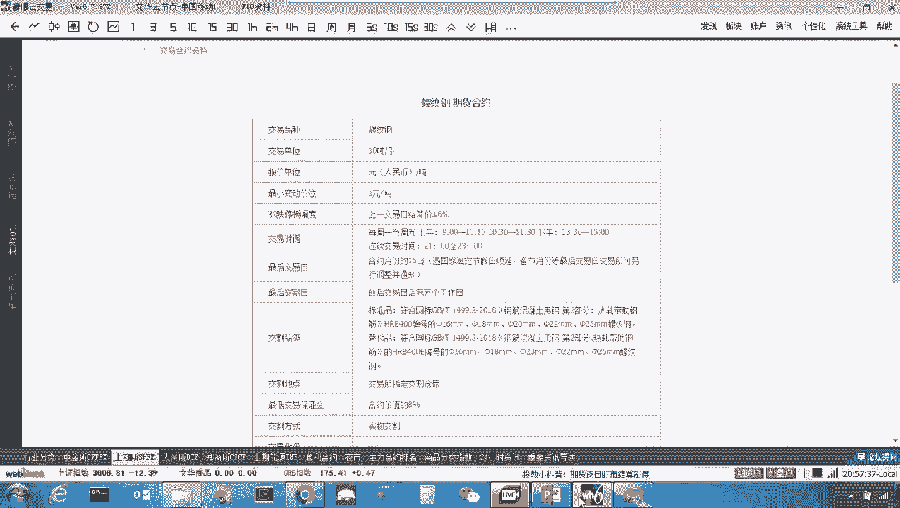

从课前给大家演示的这个软件里头，其实你能看到说螺纹钢，这个螺纹钢本身它的代码是什么啊，我们可以看到说呃在中上，其所在这个类别里头有螺纹这么一个品种啊，随便打开一个合约，我们可以看到啊螺纹指数吧。

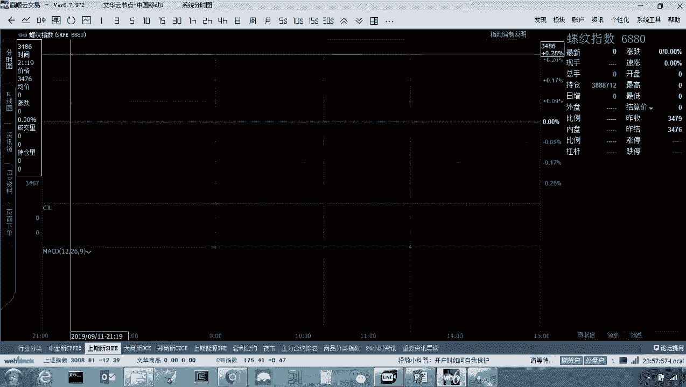

那么它的代码我这里头没有显示的，我们看一下，随便找一个具体的合约，对我们可以看到他的这个代码是RB啊，RB比如11912或者是2001啊等等。

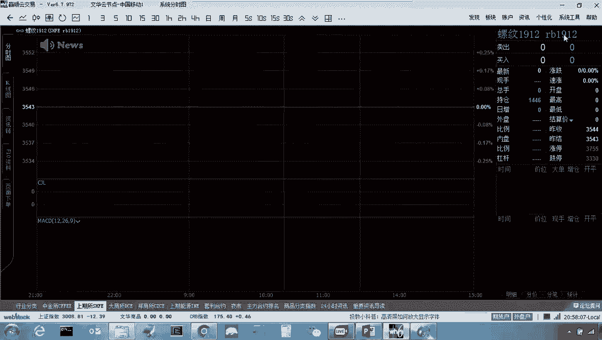

好，那么我们就可以在tb这个平台上直接敲RB。

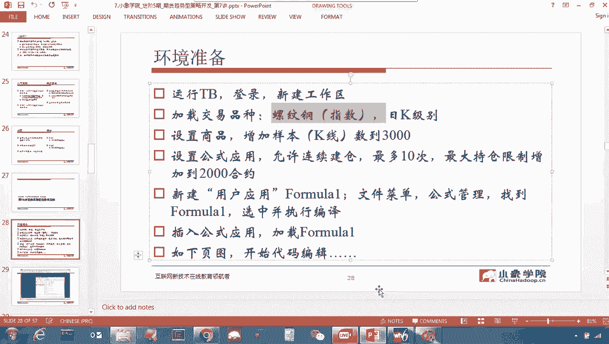

000，这样的话呢我就可以把螺纹钢指数加载上来了，替换掉它默认加载的那个品种。

好直接敲RB000啊。

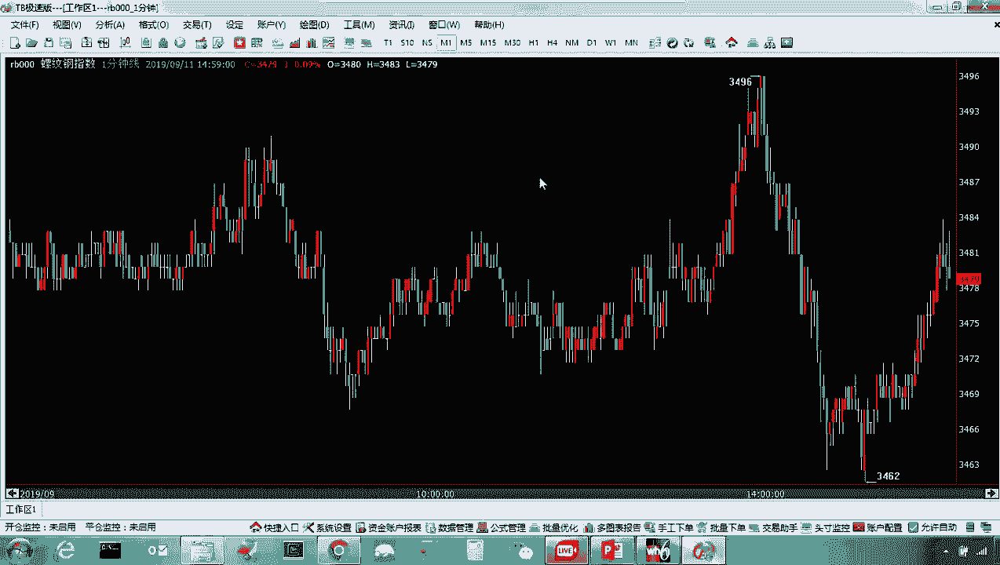

他就把螺纹钢指数加载上来了，现在我给它切换下呃，切换下周期，我们是用日线级别来来做演示，所以呢我可以在这个工具条上选择这个D，第一啊，表示说我现在是啊用日线级别，而不是一分钟啊，它默认加载是一分钟K线。

这个太小了。

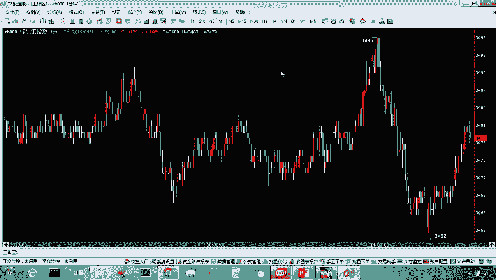

我们用日线级别，所以敲下第一好了，是呃，敲完了，这个是设置好这个周期之后，我们可以看到说，它它加载的这个K线根数还是太少，因为我们一会要做回测，希望能够加载更多的K线，所以所以呢我点右键点右键。

选一个商品设置。

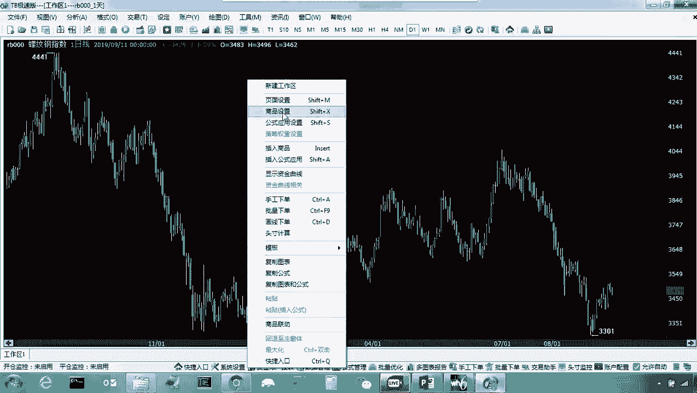

然后在这个里头呢把样本数，它默认加载300根K线。

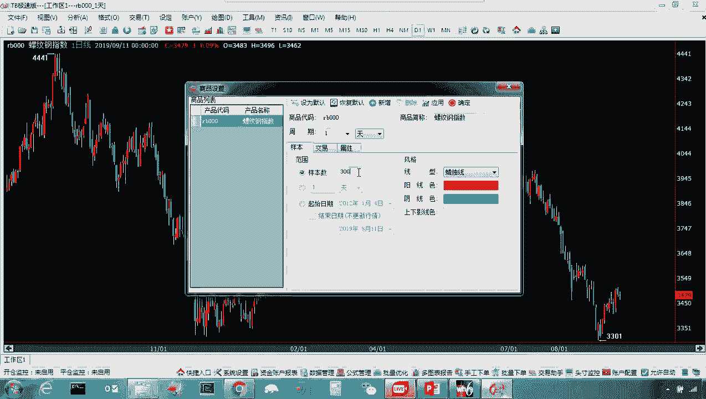

我把加个零，让它加载3000根好，然后确定这样的话呢。

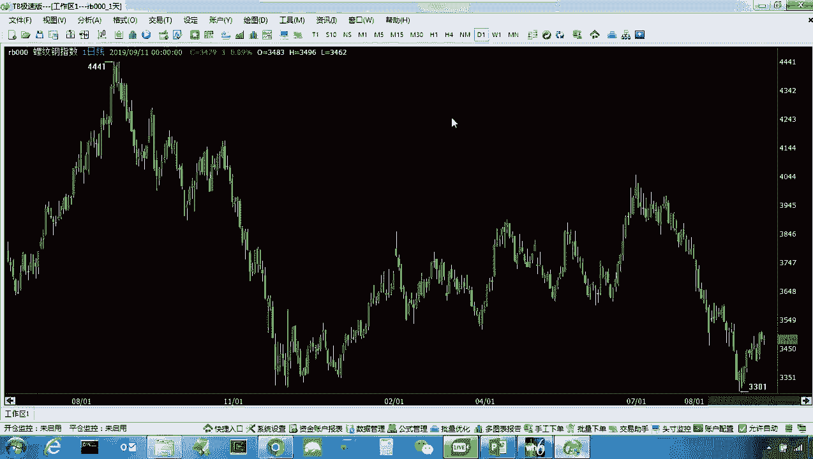

我们可以用上下箭头放缩一下图表，你可以看到说加载了很长时间的这个K线对吧，我就可以拿它做一个更更全面的一个评评测了，好这是我先建一个工作区。

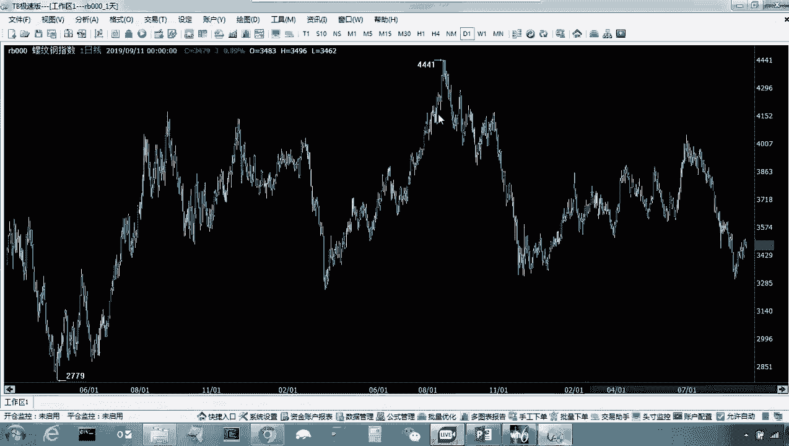

然后第二步呢，我需要把我的海龟交易法这个策略编写啊，策略做一个编写，然后把它放到这个量化平台上，然后呢在这螺纹钢指数这个品种上，让它进行一个自动交易，所以现在呢我需要创建一个代码。

或者说创建一个公式对吧，在这种图表化的呃量化软件里头，他们一般把你的策略代码叫做公式好。

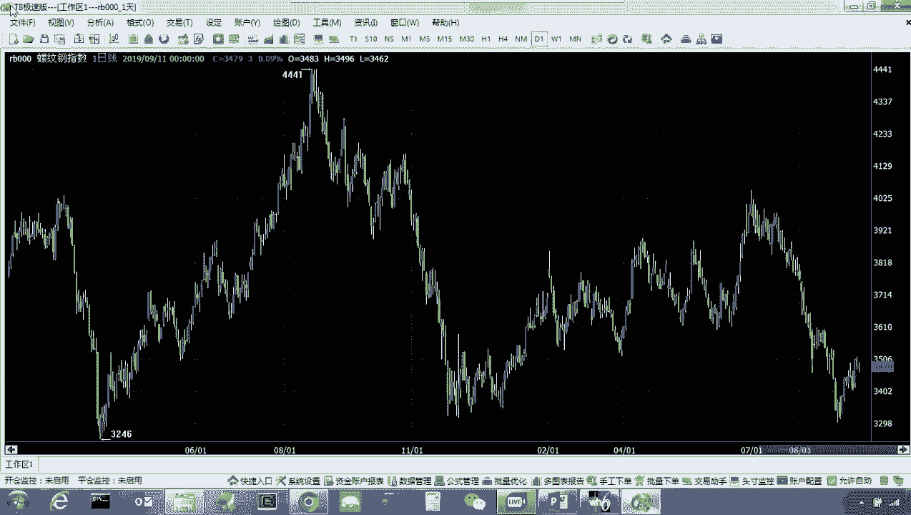

那么我现在还是从文件菜单进来，新建一个函数公式，从这一点来，从这个第一项菜单里头进来新建一个用户应用，是啊，用户应用也就是用户公式好点，用户应用，然后默认随便起个名字。

比如发明了发明了一啊公式一或者叫三跑也行，随便起个名字，比如说就叫三炮吧，然后确定。

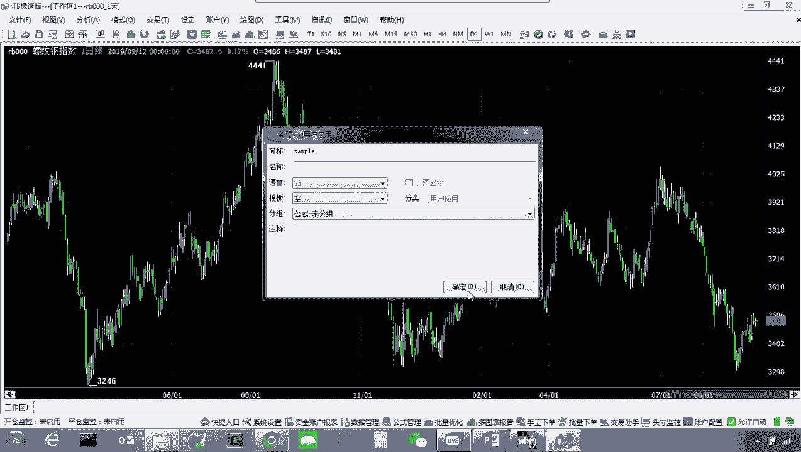

好点完确定之后呢，我们能就能看到tb这个平台呢，就会给我们打开了一个公式编辑器窗口，公式编辑窗口，那么这个里头包括了几个，他预先已经设好了一个模板，一会呢我们就在这个模板里头去，填写我们的代码。

那么我们的策略就是在这里头就可以，就可以进行编写了，好那么现在呃我们稍微休息5分钟吧，好大家抓紧时间喝口水呀，♪ 休息一下 ♪，然后5分钟回来，我们再继续后面的课程，好了啊。

时间差不多了啊啊我们同学们呃，返回来，我们现在继续后面的内容，那么现在呢就是我带着大家在TB这个平台，来编写一下海龟交易法啊，分两步，第一步呢我们先做一个简单的实现啊，为什么分两步呢。

首先我先通过一个特别简化的这一部分，让大家第一熟悉下这TB这个平台怎么使用，第二呢通过这个过程呢，我们能大家能够抓住这个海龟交易法，最就是最基本的一个思想啊，就是最核心的一个框架，就是入场出场啊。

先看这个，然后后面复杂的一会再说用一个呃，第二个版本咱们再看好最简单，那么它里头最一个最基本的一个思想，就是入场对吧，就是建仓，那突破前高就入场做多，就是开多啊，就是多头开仓。

说白了如果跌破前面20日的低点，那就是入场开空开空啊，就是空头开仓，这是两个方向啊，同样是入场，也就是开仓，♪ 但是呢我可以做多方向 ♪，也可以做空方向，这个刚才我在讲期货的这个基础的时候。

大家已经知道了，因为期货是多空双向的，我可以根据我可以根据行情走势，对后面做一个预判，如果我认为行情会上涨，认为这个呃价格会上涨，那我就做多，♪ 认为价格会下跌 ♪，我就做空对吧，所以开仓入场做多做空。

第二就是仓位计算，仓位计算就是刚才按了一个1%的一个呃，风险法则，然后看怎么计算一个初始头寸，然后第三呢退出，退出就是说啊，如果跌破前面的一个地点的时候就入场啊，就是出场平掉多头啊。

如果突破前面的一个高点的时候，10日的高点就入场，把空头平掉啊，这是一个反向啊，所以如果突破突破前期高点的时候入场，然后呢上涨一段时间，如果再再再跌破某一某一个呃，呃最近的一个小低点的时候，那就出场。

大概是这样好了，那么这就是一个最基本的一个思路，然后我们来看一下怎么去编写这个代码，现在我回到回到这个软件里来，♪ 回到刚才的这个公式编辑器 ♪，咳我先写几行代码啊，因为这个源代码其实我已经给大家。

就是课前已经提供过去了，所以呢你也可以去直接把它拷贝过来，或者像我这样先先敲几行，这样为了为了节省时间呢，我就简单敲几行，我们可以看一下啊，那么这个首先是一个参数，我先敲几个，就是呃这样吧。

节省时间的话，我就不逐行敲了，我就我就直接把代码拷贝过来对吧，因为咱们时间有限，我就拷贝啊几个呃，有有限的几行代码，我们先看一个最啊最基本的一个框架，一会我们再看一个完整的部分，然后定义几个变量。

好我们先看一下，一般开始总会做一个叫做call auction，Filter，Auction，就是集合竞价的意思，就是说一开始首先先做一个过滤，因为一般在每每个呃交易日开盘前几分钟啊，是集合竞价阶段。

那么这个时候也会有行情数据送过来，但这个时候我们不会去产生交易的对吧，因为这时候还没有进入到一个连续竞价阶段，我们发出一个交易信号是是无效的，所以通常我们要通过这个呃。

call action filter这么一个函数过滤一下时间，如果当前正处于集合竞价阶段，那即使我收到了行情数据，这公式被执行，那我也不会往下走对吧，就不会产生一些无效无无用信号好了，然后这些我先呃。

这些代码我先嗯嗯就是一些暂时无关的，我先不管它，咳好，那么啊这呃对，然后我们先看这个就是average呃，我先写一个求一个average tr，就是刚才说的波动性N啊，用一个什么样的函数呢。

叫x average啊，我们可以从公式编辑器里边看这个帮助文档，那么在这个里头啊，有所有的函数collection啊，不是这个啊x average啊，x average对，选一下x average好了。

那么这个呢就是这个函数的一个说明啊，然后说句题外话，我建议大家啊，♪ 如果你真的是对这个TPG平台感兴趣 ♪，想摸索一下，或者说将来考虑使用它的话呢，啊你我建议是，首先啊。

首先你先在他这个TB这个网站的首页上，有一个地方叫做一个叫做实用指南啊，大家看在这个地方就是这个trade blazor点net，这个网站上，有一个叫做使用指南的这么一个地方，就是公式指南。

这是一个PDF啊，大家可以把这个PDF下载下来通读一遍，那么在这个PDF里头他讲解了呃，在这个PDF里头，它它它讲了整个TB系统的一个运行机制，还有一些基本的语法结构。

所以呢在你呃在你初次使用这个平台之前呢，你可以把这PDF下载下来看一下，我就不打开了啊，不耽误你时间了，然后之后呢再然后在具具体使用过程中，有一些特别的函数的细节，然后再去看这个联机帮助咳。

就像我刚才给大家打开打开的这样叫x average，比如说x average这个函数，那么它呢是求一个移动平均啊，求一个指数的移动平均，所以说我们看代码里头，在这个里头这个true range。

它已经把把叫真实波幅，已经每根K线的真实波幅已经给计算出来了，然后呢也就是说按照我前面前面这个代码呃，前面这个基础知识的部分给大家讲的，对就这个里头真实波幅啊，它是max h减L，还有这两个绝对值啊。

这前面讲了真实波幅是怎么算的，就TR它是怎么算的，那么在TB这个平台里头，TR呢它已经叫做出range这个函数，它已经是啊，就是系统内置好了，你都不用自己把那公式再再重新算一遍，直接调用它就行了好了。

然后之后呢再调用x average这函数，对这个true range这么呃一个序列啊，就每一根K线的出range的这个序列，做一个求一个移动平均呃，你会需要选择一个时间窗口。

比如说这个a t r length设置多少呢，是20天，也就是说我把从每一根K线都往前看，二十二十根K线，把这20根K线的这个这个呃，这是波幅求一个平均，作为当前这个K线的一个ATR的值啊，是这个概念。

所以说这个average tr就是把每一个K线呢，这是波幅求一个平均啊，最后得到了一个移动平均数，这是这是这是第一个，第二个呢，我再把这个呃平均真实波幅这个方括号一啊，这个方括号一代表什么。

代表是引用前一根K线的，前一个K线的那个真实波幅，那个值所向前引用一个值，把它把它求出来，作为一个N啊，呃这这是怎么，为什么是这样的，我们把它可以把它画出来，用这个plot numeric这个函数。

把真实波幅这个N给它画出来，我们可以看一下啊，假如说我就先先代码就写写这一点，后面先不用管它，后面把这都注释掉，好写了一个代码之后，我们可以把它编译一下，所以我们按这个F7啊，文件菜单有个有个编译菜单。

从菜单或者直接NF7都可以做一个编译，好编译这个成功编译成功了，我们就可以把它加载到。

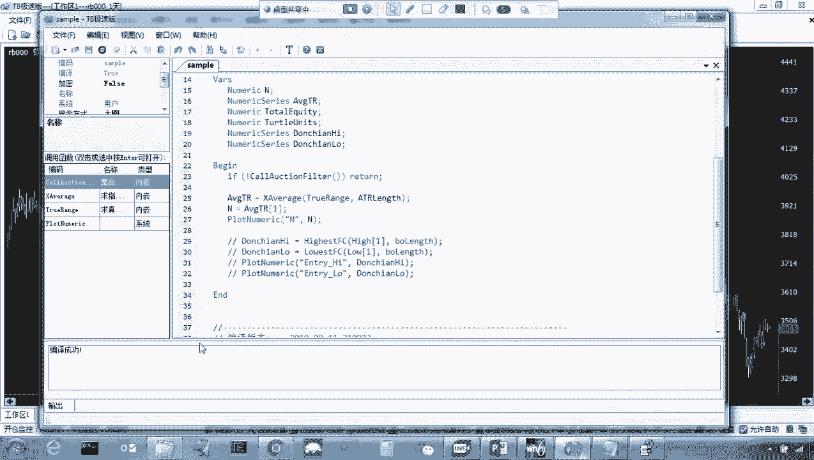

加载到我的一个图表上来，回到刚才我建立的这个工作区，然后呢点右键选择一个插入公式应用啊，插入公式应用，♪ 然后从这里选 ♪，刚才我我写的公式叫三跑对吧。

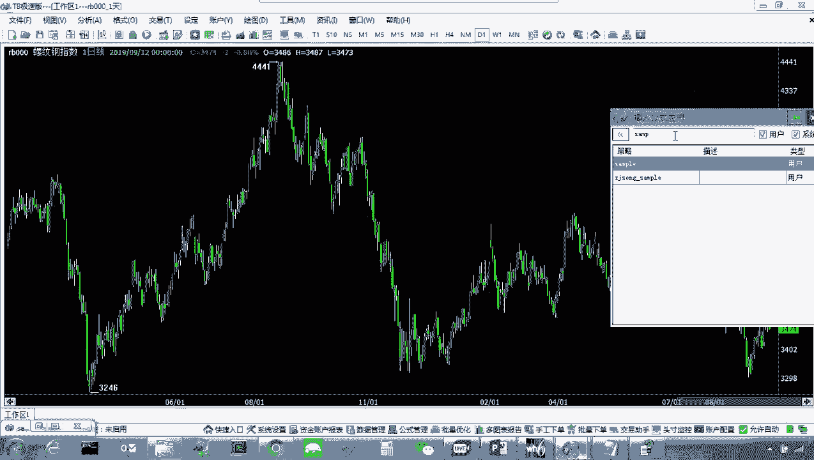

刚才这三抛是已经编译过的了，所以插入哎三跑就可以了，咳然后呢这样他就呃这样sample呢，他就把把刚才我我我写的这个就是公式里头，计算出了这个NN值啊，用这个planter numeric把它画出来了。

当然因为这两个坐标坐标系差别太大。

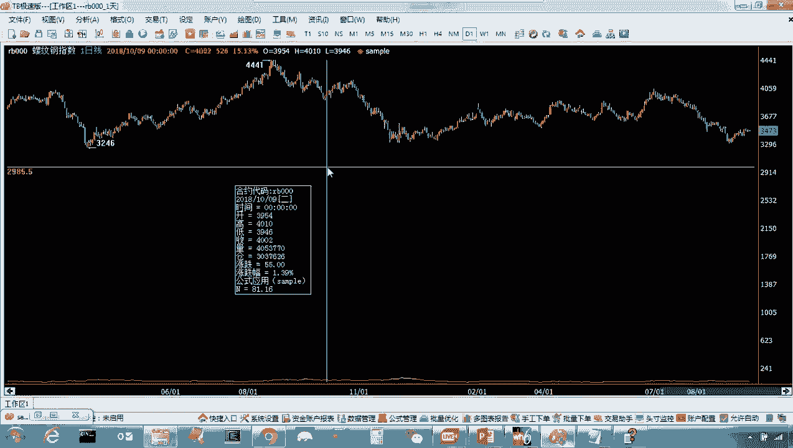

所以这个N呐你看起来坐标归一化了吗，他等于把上面那个挤挤的不是很好看，我可以我可以把它修改一下，把它修改一下，然后稍微放大一些，我们看一下，比如说把这NN乘以个乘以一个多少，乘个20吧。

看看大概是画出来什么样子啊，重新加载一下好这样的话呢我们把N放大一下，你能看到说真的就是你大概能看出来，比如说某一段时间啊，某一段时间，你看如果说这段时间这个价格一直在连续变化，对吧，一直在联系变化。

所以说这段时间波动其实是非常大的，所以呢一所以当他把这中间的某一段，进行一个平均的时候，那么这个值其实是一直在放大的，那然后当当某一段，当这个行情在某一段时间，它它比较纠结的时候。

所以它整个的这道这这个波动是其实在下降的，实际处于一个比较小的值，所以说这个ATR呢能够在一定程度上，反映出了一段时间内，这个K线走势价格的一个变化的一个剧烈程度，好了，然后呢，那么这个啊就是更多的呃。

就大概的这个写法就是这样了啊，这是这是这是第一个要给大家强调的一个问题，就是也就说对整个tb，在这个这个平台上进行编写，编写这个策略就是这么一个一个操作方式，然后呢之后呢为了节省时间的话。

我把整个代码拷过来，然后把一些重点的地方给大家解释一下，好然后还还回到刚才这个代码，我们可以看一下刚才这个，我我来求我给大家计算这个呃这N值啊，就是波动性这个N的值的时候啊。

我用了AVR括号一表示什么概念，表示说我对每一根K线取取的波动值，都是前一个K线算出来的值，为什么我要向前引用一个一根K线呢，这里头有一个细节给大家稍微解释一下，这是一个啊一个常识性的东西啊。

就这个地方，我们可以啊回想一下，就是在一个行情软件里头，就当我当我现在呃在这一个市场，当这个市场当它处于一个啊实时行情的时候，那么前边啊，前边每一个K线是不是都已经呃，就是生成结束了对吧。

但是最后一个K线其实一直在刷，就是每每个每行情的价格，每又一次，就是每每当有一个新的成交发生的时候，这个价格都会跳动，对不对，所以最后一个K线一直在在更新，比如说如果是我现在是一个5分钟级别的呃。

K线的话，那么我们可以看到说，最后这5分钟就是这个值啊，其实它是一直在变的啊，对现在应该现在正好是一个开盘的时间段，我们可以随便找一个行情好，找一个软件看一下，对我们可以看一下，如果是你看。

比如说我如果是用一个5分钟K线对吧，我们可以看到说前边前边的这些K线，其实都已经固定下来了对吧，只有最后这一个K线价格一直在这跳动，是不是这样，所以说最后这个K线里头这个每收到一个tick。

这个公式都会被执行一遍，那么这是这些图表系统的，它的一个执行机制好了，那么那么我们可以看到说这个average的TR，就AVA呃，ATR的计算呢，它实际上是根据每一个K线。

每一个K线它所对应的这个true range，然后再在一个窗口内求一个平均值，那么当我们未处于一个实时行情的时候，是不是每来一个tick，那么这个ATR的值都可能会变化，对不对，但是这种情况下呢。

也就是说这种情况下我计算出来，♪ 我计算出来这个波动性的值 ♪，♪ 它一直在变 ♪，对每个K线一直就是，♪ 尤其对最新的这个K线一直在变 ♪，所以它的值是不稳定的，那么这样的话，我就我我用。

我根据这个N来计算我的头寸规模的话，那有可能这一个时刻和下一个时刻，计算出来值时是不不一样的，不稳定的，所以这种情况下呢，我宁可向前也用一个，就是把前面已经走完了，这一个K线就截止到前面已经走完了。

这个K线根据它然后来计算出一个波动性的值，然后把这个波动性值作为我当前这个K线，用来计算头寸规模的一个一个波动性的一个值，这样的话这个值是比较稳定的，就是所以所以而且另外一个就说呃，这个波动性啊。

这个波动性就是一段时间内的K线波动性，它不会因为一根两根，就有一个特别大的一个变化，所以这么做是是是可行的啊，也比较稳定的，这是一点，还有一点就说后面我们大家也会看到说，有的时候我们在某一个K线里头。

根据当前的最新价格来计算啊，入场和出场信号的时候，我们有的时候也会尽可能的用到啊，用到就尽可能避免用到，当前这一根K线的收盘价，就当前这个K线的一个最新价，实际上啊这样的话它避免什么。

避免这个信号呢在某一个tick产生了，再在下一个tick又又消失了，这种情况一般叫做一个信号闪烁啊，所以大家如果说一时理解不了，我说的这个概念的话，可以去网上搜一下什么叫信号闪烁。

那么像像这种编程技巧来说，就是为了避免说这种信号闪烁的，这种不稳定的情况，使得我的这个策略呢更就是更更可靠啊，因为如果说你在某一个代码里头，存在这种信号闪烁的情况，那对于实时行情来说。

有可能你触发的触发信号的时机是不可测的，还有一个就说对历史行情做回测的时候，就是如果存在信号闪烁的时候，那么你在历史历史的数据上做出，做出回测的一个结果，和你在实时行情进行一个实盘交易的时候。

产生的结果，就统计特性是完全不一样的，所以这种情况是为了避免这种这种偏差啊，造成一些呃，造成一些就是假象，就是你可能会对一个策略的表现，可能会会形成某种假象，比如说你回测的时候很好。

但跑到实盘的时候就发现它它就有问题了，那有可能是里头可能会有一些信号闪烁呀，♪ 未来函数啊 ♪，或者偷架呀等等，那这是一些代码，代码是编写过程中的一些一些小的技巧，没有注意到。

那么关于有关这种信号闪烁也好啊，或者说未来函数也好啊，你在后面的课程里头，老师也会给大家再详细的去解释，所以说在这里头呢，我只是给大家抛出这么一个概念，你要知道说啊，利用就是在这种图表交易系统的时候。

你既要兼顾回测的需求，也要兼顾实实盘交易的需求，那么对对这种信号闪烁的这种情况，你需要特别的关注一下，所以呢在相应编我们在编写代码的时候，就有一些技巧要注意，比如说我向前引用同引用一根一根K线。

不用当前这根K线的收盘价就是最新价，那么这个时候呃就是会会就可以减小出，就是刚才我说的这种啊系统不稳定，或者说评测结果失真的一种一种隐患，好吧，这是一个这是一个细节好了，然后呢。

下面我们再再还是回回过头来看，继续看刚才那个代码，啊这个代码呢我我是把把这个简单版的啊，简单版的这个呃代码拷贝过来了啊，直接给大家拷贝过来，然后直接给大家解释一下好了，我们可以看一下啊。

刚才通过这个XAVERAGE求出了一个波动性N对吧，求出波动形N之后呢，下面我们就要看，我们要计算出我每一次入场的时候，我要呃开立多少的头寸对吧，就是我的一个头寸规模，就一个单位是是多少多少手合约对吧。

那是这么计算的，首先呢先根据这几个函数啊，大家如果嗯就是一下理解不了，回头可以去看去看连接帮助啊，首先是先求出一个叫total equity，就是我的一个总资产，总资产，首先用一个portfolio呃。

Current capital，再有一个叫做嗯portfolio u used margin，这么两个函数，把这两个实时的值取出来，那么这个current capital表示什么。

表示当前我账户可用的保证金啊，金额有多少，就是现金部分还剩多少钱，第二呢就是说我这个used的margin，所谓的MARI就是我的我的保证金，就是已经使用的，就已经被占用的保证金有多少。

所以现金部分加上已经占用的保证金加起来，就是我当前的一个总资产好了，然后再根据1%的法则啊，把我当成一个总的一个一个资产，一个总的一个active或者叫asset，乘以一个risk ratio。

就是1%对吧，这就是risk raco，现在我参数里定义成一对，把总的资产乘以一个一，再除以100，就是一个1%的一个总的，我最大允许损失的金额对吧，再除以个N。

N就是N就是我算出了一个最近的一个波动性，然后再除以这个康contract unit，和这个big point value的一个乘积，那么这个contract unit叫叫做一个合约乘数。

比方说我一手合约对应了多少吨的货物啊，然后这个big point value表示说我一个点对应了一个多，多少的一个放大倍数，那总之就这两个乘起来，就就相当于是我我每波动一个。

就是就是相当于是我我这合约波动一下，所对应的一个价值，然后呢用用整个这1%风险嗯，这个总值除以这个N再乘以这个乘数的话，最后得到的就是算出的就是一个一个单位啊，每次一个单位相当于多少手合约好了。

那么这个完全可以可以和我刚才PPT的，上面的海龟交易法的这个头寸规模的公式对应，上好，我算出这个这个turtle unit之后，然后呢对他求一个整数啊，用int part求一个求一个整。

也就是说这就是我每次入场的时候，所交易的一个头寸的一个单位，一个单位是多少，首就是这个数好了，算出算出这个头寸规模之后，那么我们再看入场，入场和出场信号，那入场和出场信号呢其实是有两种啊，啊我们看呃。

回想一下刚才我讲海龟交易法的时候，那么入场信号就是突破前前前N日的高点，或者突破前N日的低点对吧，那我就入场做多或者做空，那这个N日定成什么呢，一个是20对吧，入场的话我是用20日的一个窗口宽度来衡量。

出场的话，就用十十十天的一个窗口宽度来进行衡量好了，我们先看入场，那入场的话呢就是用这个highest fc这个函数，那大家可以从连接帮助里看一下highest f c对。

这叫做叫做一个求N个周期以来啊，指定价格的一个最高值，也就是说首先我们看前N天的这个最最大值，就每前N个K线的就是最最高价的最大值，也就是说前前20天的一个上，就是一个箱体的一个上上上轨上沿对吧。

把它把它叫做一个这个当秦汉就唐其安的亥，就是，然后呢如果是前20天的这个下轨，就是前二天的，前二天的每一个K线的最低价的一个最小值，就是这个下轨，就相形的就是一个区间的一个下轨。

那么这个叫做一个汤其安的一个漏啊，就是下轨，那么这个就是我要我要进行判断入场出场的呃，判断入场的这个两个两个阈值，为什么这里的变量命名叫做唐奇安呢，是因为大家可能也都听听说一个一个经典策略。

叫做唐奇安通道啊，这也是一突破的，其实海龟交易法本质就是堂前通道算法，只不过它在堂前通道的这个入场和出场信号，基础上，又增加了仓位管理和其他的风控措施啊，所以这个啊这个标准代码里头就直接用。

用到了堂前通道的这么一个变量名好了，然后呢我们这是入场啊，我们再看出场的呃，两个阈值叫exit lowest price和exit highest price，那么这两个呢。

分别用前十天的最高价和最低价的呃，就是最大值和最小值作为我的出场条件啊，大家注意一个叫呃b o length，一个叫t e length啊，BO就是break out。

就是入场就突破TE呢叫叫trading exit，就是退出，啊不用大家不用管这英文名字怎么样啊，因为因为海归加减法其实它是有一个标准的，所以这里头我就直接是把它拿过来了，然后把它简化了一下。

给大家做一个讲解，那具体变量名字它就这么起的，所以大家可以回头仔细琢磨一下，这个变量名字起的，其实还是和它所代表的含义，是有直接相直接关联的啊，就可读性还是比较好的好了，然后呢。

当我把这个入场的这两个上下轨计算出来，还有出场的两个上下轨计算出来之后，那我们就看怎么去触发一个一个，入场和出场信号，首先这个market position代表什么，代表我当前持仓状况对吧。

如果market position等于零，表示当前我既没有持，既没有持，持有多头仓位，也没有持有空头仓位，表示当前我是空仓状态好了，那么当我是空仓状态的时候，那我就看如果当前K线的最高价。

就是这个hi亥时，表示当前K线最高价啊，如果大于前面计算出这个，堂前通道的这个上轨啊，就是如果也就是说突破了上轨，并且呢这个turtle units大于一，大于等于一。

就表示当前可开仓的投数手手数是大于一的啊，那么这个时候我就要准备入场做多，那如果当前这个K线的这个最低价，小于堂前通道下轨啊，并且这个特特unit is也是大于一，那么我就准备入场做空对吧。

这个可以理解吧好了，那么我再跟大家多说一句，怎么去理解这个程序，为什么这里用的是一个H，你可能会会你可能会啊，想象想象想象一下，就这个hi啊，这个hi这个值是不是这个K线最高值啊对吧，最高值。

那么如果说对于已经走完的K线来说，这个最高值是确定的，但是如果说对于最后一根K线，如果当前是处于一个实时交易模，实盘交易就是它处于一个实时行情的状态，这个head的值一直在变化的，对不对。

大家可以理解一下，♪ 其实可以回想一下 ♪，我刚才这个图，我们可以看到说，最后最后这个K线其实一直在刷新，♪ 每来一个tick呢 ♪，那么这个呃high和low这个值都有可能会变化，那只有open。

只有这个K线的开盘价是不变的，♪ 因为一旦进入到这个K线的开盘价 ♪，就固定死了对吧，但是最高价，最低价和收盘价就close这三个值就high low close，这三个值其实时刻在变的对吧。

也就是说这个high，这个值随着不停的随着tick一直过来，它就是单单调上升的low，这个值呢实际上是单调下降的，那close其实是上上下下一直在变对吧，那所以大家理解了。

♪ 理解了就是这个TB整个这个运行机制之后 ♪，你再看这代码其实就就可以理解了，所以当我代码如果这么写，这个hi，就表示当前截止到当前最新的这一个tick，在这根K线里头。

我的这个head的值突破了上轨，那么这时候我才能入场做多对吧，那么这个可以理解了吧，好，那我们可以看一下，就呃这个这入场做多，入场入场做空信号，先先先说到这啊，细节一会再说，我们再看出厂。

那如果当我满足了入入场条件，入场做了一个多头，比如这个by就是可入场开仓做多对吧，这个cell shot就表示入场开仓做空好了，当我入场发生了这个一个入场条件之后。

那么我的market position就是我的实仓状况就变了，如果是当前是一个多头的状态，那这market position就等于一，如果当前是一个空头的状态。

那么这market position就等于是一好了，那如果现在当前，我是处于一个做多的状态的时候，那如果某一个K上最低价，小于前面十根K线的最低价对吧。

这个accent的lost price在前面已经算好了，就是这个地方表示前面十根K线的，最近十根K线的最低价好了，那如果当前我是处于一个多头状态，并且呢，我当前这个K线最低价。

已经突破了前10日最低价的一个下轨，那么这时候我就我就要退出对吧，通过SL命令把我的多头仓位平掉，那如果当前处于空头状态的时候，我的持仓是空投啊，空投合约，然后如果是我当前这个K线的这个高点。

已经大于了前面某10日的，就前面最近10日的高点的时候，那么这个时候我就把空头止损出场退出对吧，这个完全可以理解吧，好了，那我现在我现在把这个，我现在把这个代码先编译一下，我们在图形上看一下。

就就知道它是什么样子了，然后细节一会我再解释，我现在F7给它做一个编译好，编译完了之后加载到加载到我这个屏幕上好，但是为了为了呃就是为了就是直观起见啊，我把代码再改一，稍微改一下，把这个是每次计算出来。

这个堂前通道的上轨和下轨，把它显示出来，大家看我用这个plot numeric a啊，安全high，安全low，就相当于把这个糖前通道上轨下轨把它标出来，好这样我再重新加载一下。

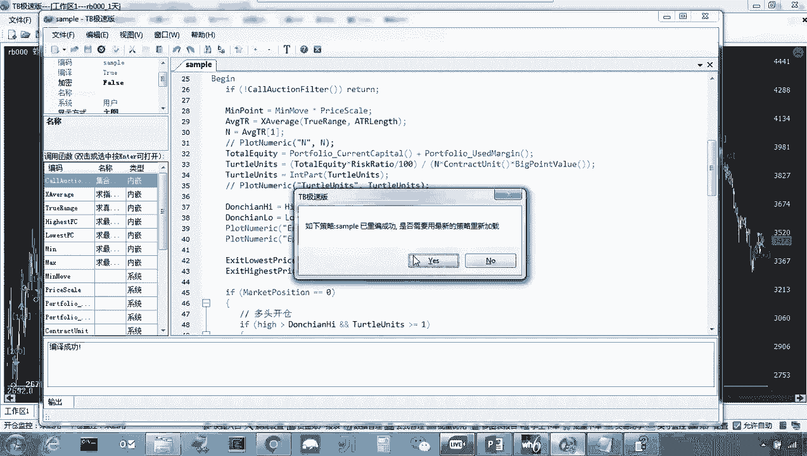

我们看到屏幕上实际上呢就画出了每一根K线，它前就是从每一根K线开始往前数N根的时候，那么它对应的这个最最高价和最低价，好吧，那我们再往往前看一下，随便找一个K线啊，对我们可以看一下。

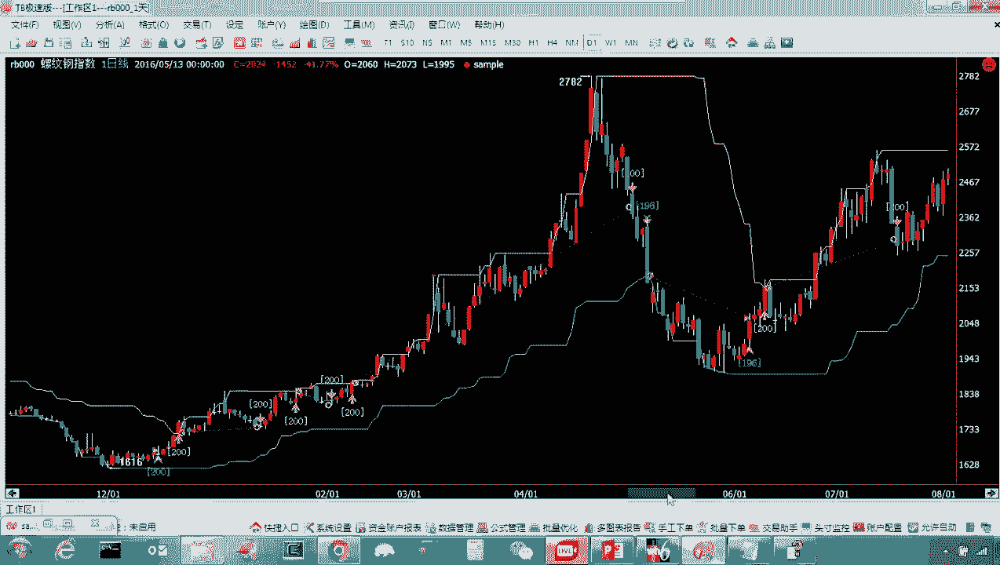

啊就这吧，就比如说我现在呃呃鼠标放在了这个地方，比如说这根K线，我往前数数20根啊，数20根，那么它的它前20个最大的值是不是这个值啊，所以这根线上就这根K线，这个红的K线对应的这个最大的这个上轨。

就是黄色的这个点，就是这个最大值对吧，就然后呢如果是最小值，那我们可以把它往前往前数20根，123456789是数20根，大概是这个位置，那这个位置这个区间我们看到最低价，大概是应该是这个位置。

所以呢所以说我们看到这个蓝色的，蓝色的这个K线，就是说当前这个K线对应了前20个K线的，最最低最低价对吧，那同样出厂的十呃，出厂的那十根K线，就是十根K线内的最高机价也是一样的。

同学们也可以把它画出来好了，那么这样的话我们再看一下入场出场条件，我把这图放大，我们看第一个举个例子，看第一个最开始的时候，比如说一开始这根K线，它的最高价恰好突破了前20根K线的最高价。

那么在这个时候就是一个一个入场点，所以从这开始入场做多，然后呢价格一直在在在上一直在在涨。

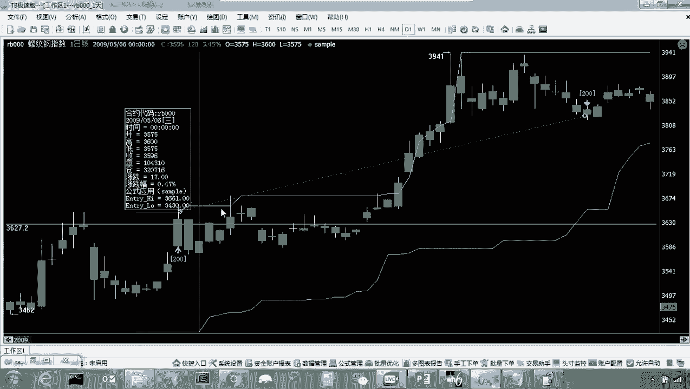

没有没有跌破最近的时日呃，K线的低价，直到某一个时刻，比如走到了这根K线，然后这个K线K线的这个价格向下。

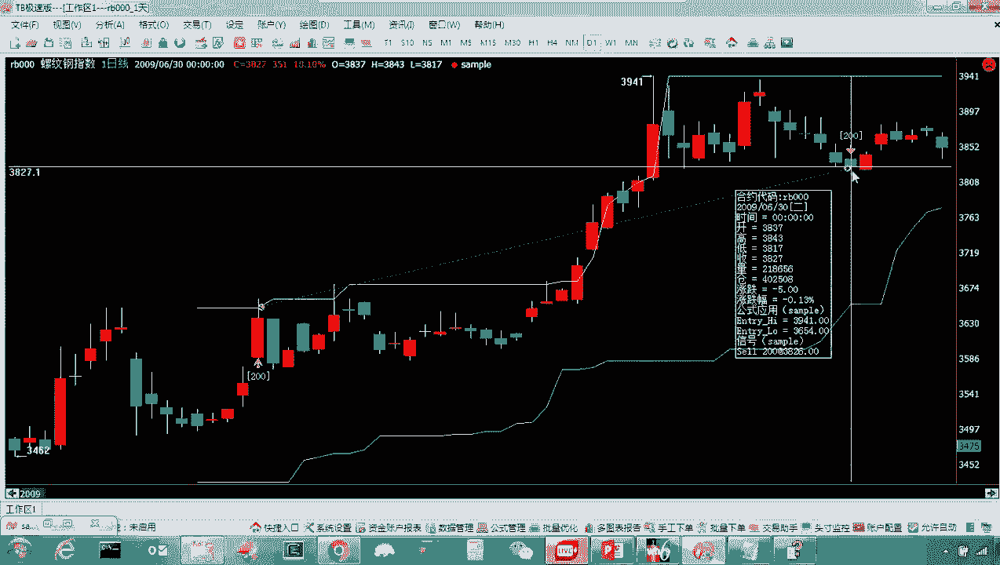

突破了前边10日的一个最低价，前面前面突破10日最低价，大概是在这个位置好，它突破了，突破了这个最低价。

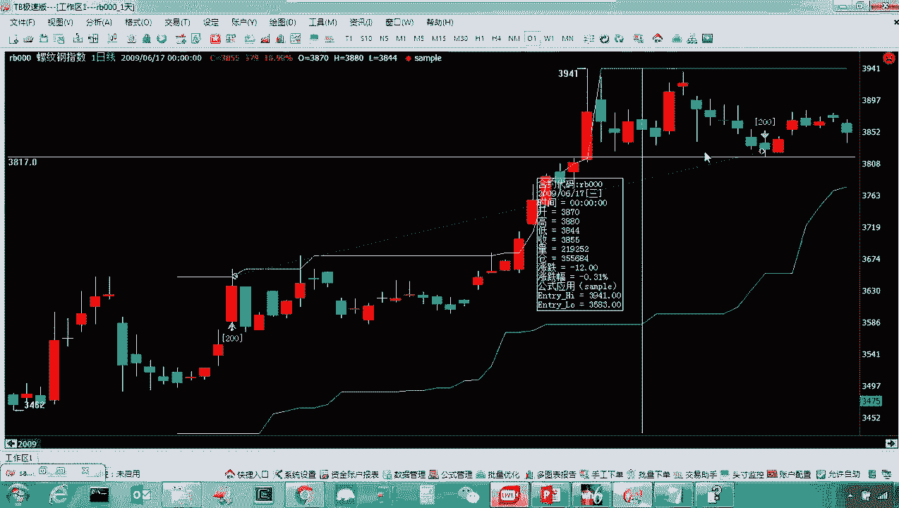

然后呢他就出场，所以我们可以看到说这个地方入场，然后这个地方出场，这就是一次交易，♪ 一个完整的交易 ♪，从入场出场，入场做多到出厂，平掉这个多头仓位。

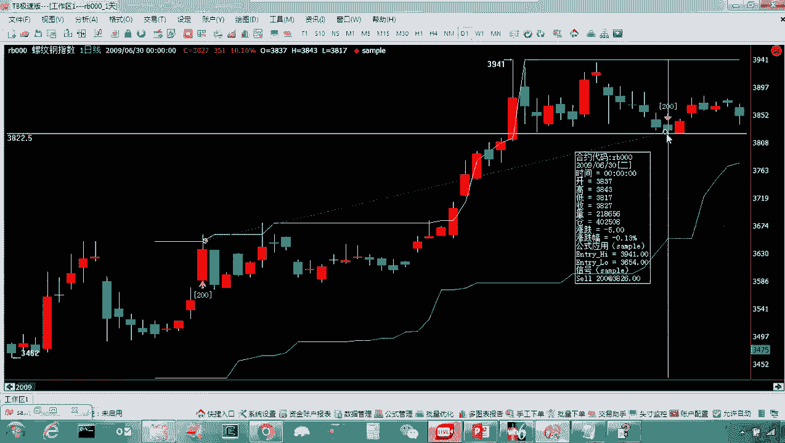

然后呢这个地方它会用一个红线把它画出来，表示说这个是一个盈利性的出场。

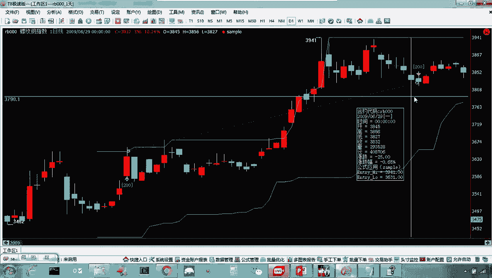

就是说我是我是退出出厂的时候，我是盈利的状态啊，是红红线，如果是亏损状态出场，那就给它换成了一个绿线好了，这是一个入场做多的，我们再往后看，找一个入场做空的信号啊。

好我们看这根K线。

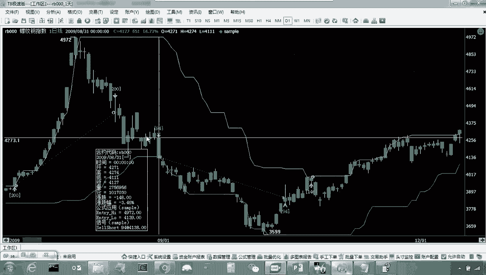

在这根K线的时候，它的它的价格向下突破了前边2日的低点，也就是说这个就这个蓝色的这个值，这个价格好了，那从这开始入场做空啊，入场做空好了，然后一直在下跌，下跌到某一个时刻反弹了，反弹到了这个K线呢。

它这个反弹的这个K线价格。

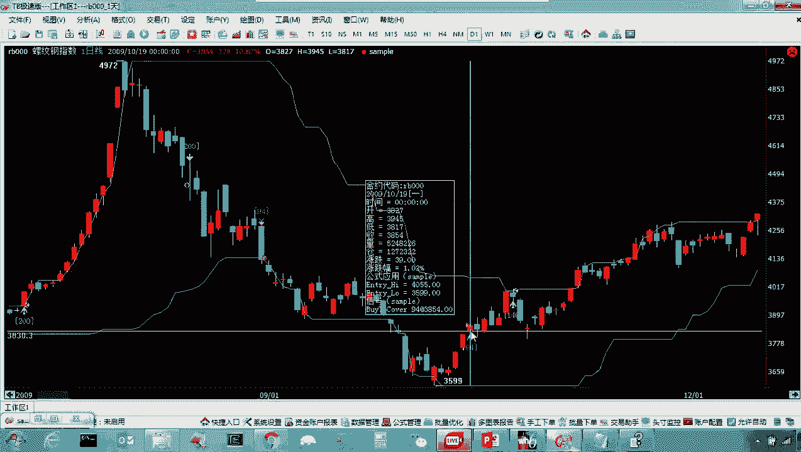

高于了前边的十根K线的这个最高价，所以在这个时候我就出厂了，算一个止盈出场出厂，所以呢这个时候入场到这个出场。

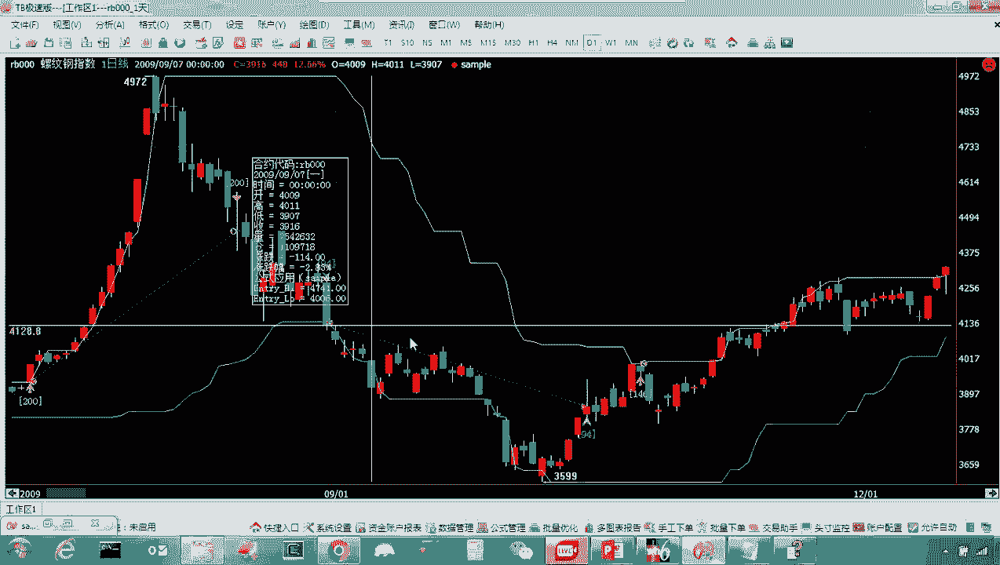

然后它就会自动用一个线把它连连起来，而且你看他这个红线表示说出厂的时候，价格啊也是一个盈利状态，出厂的好。

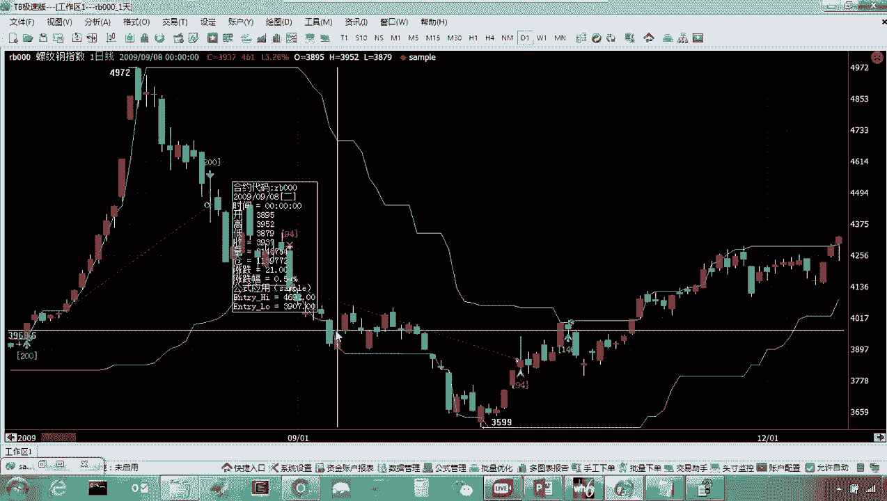

这是做空的一个一个例子，当然当然并不是每次交易肯定都是都是盈利的。

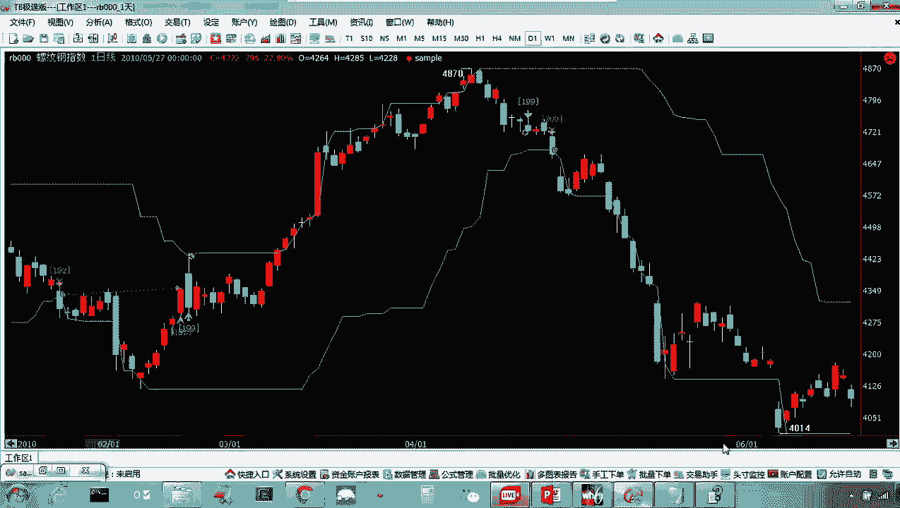

也有亏损的啊，我们可以找一些，你看像像这个像像当前看的这根K线。

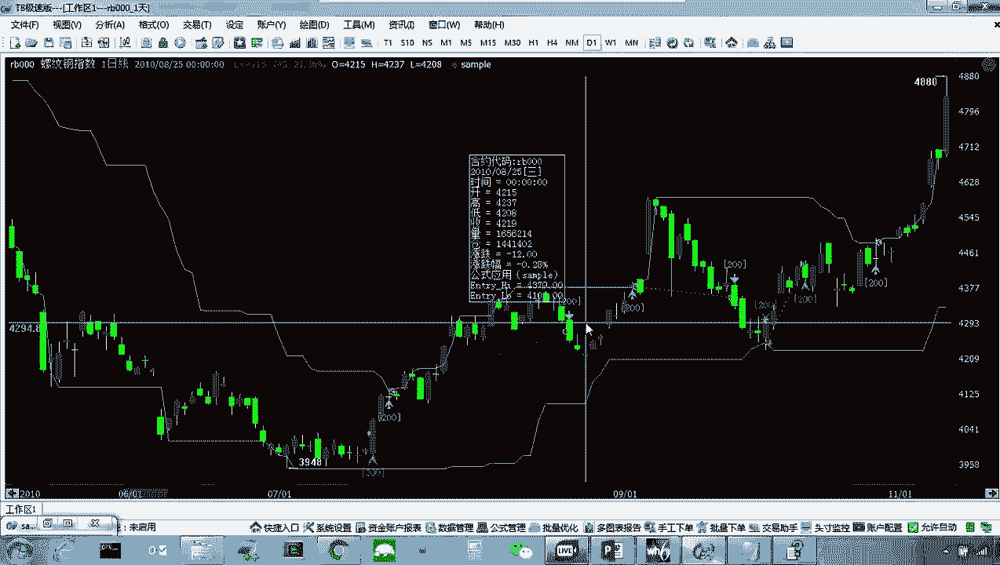

这个地方入场做多对吧，入场做多，但是呢随后一个小的一个小的是，上冲之后就回落回落了。

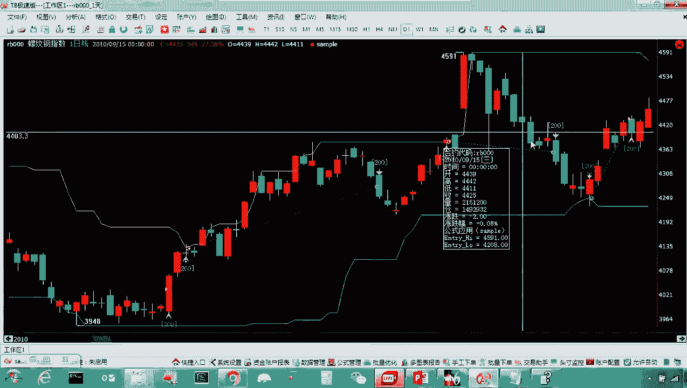

回落一直回落到十根K线的最低价，这时候就就出厂了，但出厂的时候出厂价格比入场价格还要低，所以它是亏损的，所以它是一个用一个绿线给连起来的。

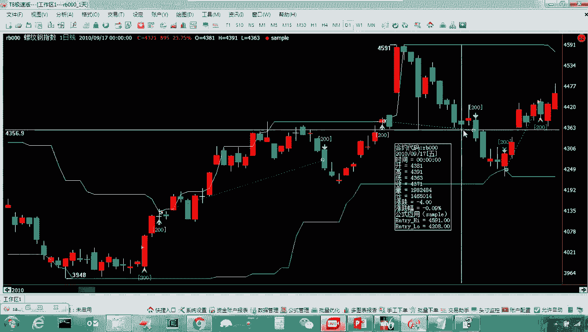

所以这种情况下呢，♪ 通过这通过这么一个工具呢 ♪，我们就可以啊，从图表上很直观的看到我的程序执行效果啊，第一呢能能能看到我的入场信号和出场信号，到底在哪个地方发生的，而且每一笔交易入场出场。

什么时候进，什么时候出，用什么价位入出，以及到底是盈利还是亏损，这个都都可以看的很很清楚啊，这就是这种图表交易系统的好处好了，看完这个之后，那么我们再回到这个代码上，再回到代码上来。

来看一下这里头一些个别的细节啊。

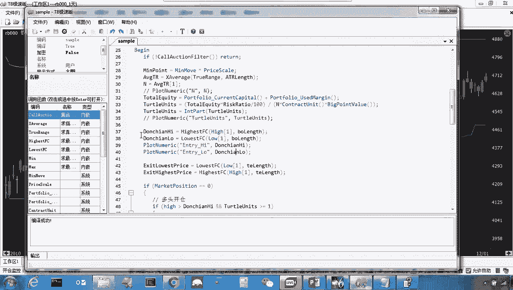

然后大家注意就是这个我来求入场点的时候。

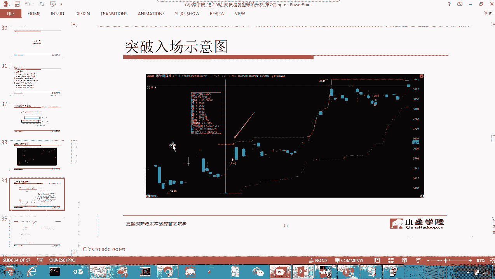

有这么一段代码啊，如果hi大于这个当前hi，并且tural unit大于等于一，那么后面对这个价入场价格做了一个计算，做了一个计算，我是把它这个hi就是这个当前这个K线最高值，和这个和前面这个阈值啊。

和这个呃就是这叫做一个箱体啊，箱体的上沿加上一个mini point，这个mini point就是滑点啊，把他俩求了一个最，求了一个最小值，然后呢同时把它和开盘价做了一个比较，就i if啊。

如果当前这个值小于开盘价，那我就用开盘价，如果大于开盘价，那就直接用这个my enterprise，然后之后用我算出的这个值，作恶的一个入场价格，为什么这么算啊，大家自己看一下，我的左边示意图。

其实很清楚，那么其实是两种情况，我们写代码的话，一一定要保证说我的逻辑是完整的，所以海龟交易法这个代码其实写的是很优秀的，我个人认为就是这里的细节他考虑的很周到，所以大家将来再根据自己的去思路。

去编写一个策略的时候，你完全可以参考他的这个入场点的和，出场点的写法，那么这个为什么我要把这个代码拿出来，给大家强调一下呢，你其实可以看一下，他其实考虑了两种情况，就基本上各个分支都考虑到了第一种情况。

比如说在这根K线，这个K线，那么这个最高值啊，我们以做多为例，就他的这个最高值是突破这个上轨的时候，那么恰好穿过这个K线，恰好穿过这个穿过这个前面箱体的上沿的时候，那么这种情况呢是一种情况。

还有一个呢就是这个黑线直接跳空高开，直接跳高高高高开，那么你看啊，我们看第二种情况，如果说在这根K线一上来，直接跳空高开，没有任何一个价格低于我这个这个这个糖，其胺这个high这个这个变量的话对吧。

我们可以看到这个示意图，这个K线开盘价就高于了这个堂前通道的上轨，那么这个时候你显然你就不能用，就不能用，用这里头任何一个就不能用这个堂前通道上轨，就用这个原来算出这个当前high这个这个值对吧。

因为这个值不存在，因为在这一个K线里头，这个这个这个当前焊这个啊，这个价格是无效的，因为什么，因为这个这个呃就这个价格啊，这堂前hi这个价格它并没有落到这个K线里头。

所以如果说你代码如果不做这么一个修正的话，你直接拿它去回测得到结果是是错误的，也就是说这个K线如果是恰好在这个K线里头，穿越了这个上轨啊，那是一种价格的计算方法，如果直接跳空高开，如果天空隔开。

我们应该用什么价格去触发这交易啊，是不是得用开盘价呀，也就是说如果跳空开的话，那我我我在这一个K线里头见到的第一个tick，就已经达到了我的开多的条件，那么这个第一个tick的价格是什么，就开盘价。

所以这个时候我就要用又用open，我就要用open，而不是用那个之前算出堂前ha对我我，我第一保证说我这信号能够正确触发，第二呢保证说我这个触发的这个价格，是一个合法有效的价格。

否则的话我回测就也会出错对吧，所以这个代码大家要好好琢磨一下，这是里头一个实现的细节啊，很重要，这个写法是非常有技巧的，所以你你这个这个写法，将来可以在其他的代码里都可以去照搬，都可以去去啊。

去去学习的很好很很写的，就是很完善的一个代码好了，那么这个这个代码讲完了，那基本上就是简化版的呃，简化版的这个嗯策略就就写完了，就给大家讲解完了，那下面呢我们看一下，当我代码这个写完之后。

我是不是要观察一下这代码到底有没有效对吧，所以我们现在就要做一个回测呃，图表交易系统的回测呢基本上就是所见即所得，那么当你把这个代码加载到，就是这个公式加载到我的这个图表上来之后。

他回测实际上已经做完了，对历史数据的回测已经做完了，所以我这时候只需要把回测报告，显示出来就行了，怎么去显示呢啊我们可以看一下，从这个工具菜单啊，工具菜单里头有一个叫做性能测试报告。

或者你直接敲F3这个键也行，点这个好了，他就他就把你整个把整个就是这个从历史上的，整个这个策略，在历史的行情表，历史上的啊一个收益的表现显示出来了，我们直接看这图表这部分啊，从左边选一个详细曲线。

我们可以看到看，可以看到他的这个收益状况是这个样子，基本上是一个啊，还是一个比较稳定的一个上升的一个趋势对吧，整个效果看起来还不错，当然如果说你你把这图表放大的话，你短时间内你看一下。

短时间它的这个其实还是有一定的回撤的，回撤其实幅度也不小对吧，但总的来说整个收益还是正的，效果还是不错的，然后这里有些，因为我现在只是一个简化版的代码，只是一个简化版的，所以这里头还有很多的细节去。

是需要去补充对吧好了，那么这个效果还不错呃，然后另外一个呢我们可以看到，可以看到说在在这个呃交易汇总里头，有各种技术指标啊，包括整个净利润呐，总盈利总亏损对吧，盈亏比就是盈总盈利除以总亏损盈亏比。

然后呢还有盈利比例就是胜率啊，大概有50%多的是成功率，然后呢总盈利除总亏损大概是两两倍，这个效是还不错啊，然后呢平均每一笔交易平均盈利啊等等，最大亏损，然后还有说夏普比率等等。

那么这里的相相应的一些一些那个指标，这里的相对一些指标，之前老师在其他课程已经都讲过了，所以大家都可以对照之前学到的一些基础知识，然后然后来这个里头做一做一个回顾好，那么这个呢就是一个简化版的。

简化版的一个海归加减法实现，但是呢现在我们回过头来再看一下，啊这个简化版，对照刚才我讲的海龟交易法的原理，大家可以发现说简化版里头忽略了什么呀，一个忽略了一个啊，忽略了一个最重要的一个就是加减仓对吧。

还有一个止损退出对吧，海归剑法里头有一个加加仓的操作，还有一个是止损退出，现在我只实现了一个盈利性的推出，还有止损性的退出好了，那么下面呢我们就就在，我们再看一个完整版的代码。

就把整个海龟交易法的完整版代码拷贝过来，好那么刚才看的这个简化版逻辑差什么，差一个增仓动作对吧，增仓的话就是对多头来说，相对于上次入场价格，每上涨二分之N就新增一个头头寸嗯。

空投就是每下跌二分之N就增加一个头寸对吧，退出也是退出，就是相对于上次入场价格，如果价格朝自己不利的方向超过了两倍的N，那么我就清仓啊，一次性的把所有的加仓的头寸全部退出。

这是海龟交易法的一个完整的逻辑，还有其他的就是这种突破点保障啊等等，那么盈利性退出，亏损性退退出这个一块在代码里再说好，那么我们现在现在看一下完整的代码，完整版代码。

这个代码呢我其实也是给大家提供了一下，并且这个完整版代码呢，其实在TB的公式管理器里头，你也可以看到，所以呢我现在就是把它原样拷贝过来，给给大家做一个讲解就好了，然后我直接把这个完整版的代码拷贝过来。

替换掉刚才的刚才这个刚才这个简化版的代码，好简单，♪ 跟大家说一下一些关键的地方 ♪，这里的参数呢我们增加了增加增加了几个啊，一个是增加了一个叫做啊，叫做使是否使用入室过滤条件。

叫last profitable trade filter啊，那么这个是一个这是一个过滤条件，也就是说，每次当我有发发现一个交易信号要入场的时候，我要不要判断说，他上一次到底是止盈性的退场啊。

退出还是止损性的退出啊，这是一个一个开关变量，说白了，然后下面这个变量我就先嗯不挨个解释，然后咱们直接看代码，然后呢在前面这个bus state等于零，在第一根K线的时候啊。

我就会把一些变量做一个初始化，然后之后呢这个feel safe啊，Fil safe，就是说一个叫做55日周期的一个保障信号，后面我们看代码里怎么判断的，就是如果当前啊，如果当前这个持仓为零。

就表示当前没有持仓，并且呢刚才这个开关是打开的，而且呢前一个前一次出场是失失败，就是止损性的出场，那么这个时候啊，我每当发现这个图呃，就是每次发现满足我的入场条件的时候，那我就直接就入场了对吧。

那么就是如果是大于当前通道，我就入场，如果小于小于通通道下轨，我就我就入场做空啊，刚才是入场做多做空，然后呢还有一个就是说，那如果说这个break heart failure。

就表示说前一次出场到底是不是盈利性呃，是不是那个盈利性出场呢，如果这条件不满足，那么自然这个开仓条件就会被忽略了啊，这是刚才我在讲海归的一些思路的时候，那么他提到了提到了这这么一条原则好了，然后呢。

但是呢如果说如果说当前不满足不满足这个呃，如果当前我不管他是不是盈盈利性出场，还是还是亏损性出呃，还是亏损性出场，但是如果当前是满足一个长周期的，如果满足一个长周期的突破，就这个feel safe啊。

长周期的突破的话，那我其实就就不考虑刚才那过滤条件，不管你前面是止盈条件，止盈出场还是止损性出场，那我都无条件入场对吧，所以所以这部分的入场条件，和刚才刚才这里的入入场条件，其实写法是一样的。

只不过是是这个就不受开关控制了啊，这是入场条件的一些修正，然后下面我们就再看看加仓，加仓呢就是当我完成了一个初次入场的时候，就比如说我当天如果是market position等于一，或者是等于一啊。

都表示当前我已经持仓的状态，那如果当前我已经持有空头一不，如果已经持有一个多头的头寸，就是这个market position等于一的时候啊，如果是持有多头头寸的话，那么这个时候那我就要判断判断说我看啊。

这个地方，额如果漏小于啊，那么这叫这这是这个是直营，这呃这一段是止盈性出场的情况，不用管它，我们现在只看加仓，加上的话，就如果当前这根K线大于前一次入场的价格，再乘以0。5倍的N对吧。

就就是当前的价格已经冲，对我有利的方向增加了二分之N，那么这个时候我就入场再买入一个，买入一一份一个单位的头寸，就相当于做一次by，但是呢还有一种情况，就是说如果这一根K线价格啊，就是变动特别特别大。

这根K线连续的向上突破对吧，♪ 也就是这根K线有可能会跨越好几次 ♪，二分之N对吧，一直在连续上涨，那么这个时候我要做一个循环，我可能会加多次，多次多次加仓，比如说这根K线覆盖了，假如这根K线呃。

从从我上次入场之后增增增长了啊，两倍的N对吧，那么这个时候我是不是就要就是入场，做四次加仓对吧，就是每二分之N就加一次仓，如果他整个跨越了两倍的N，那我是相当实验有一共有444次加仓的机会。

所以呢除了第一次加仓之后，我再还要做一个循环啊，一直到循环到整个K线结束为止呃，就就是按照K线幅度一直一直向上去加仓对吧，咳那么这段代码实际上对回测，对回测的时候也同样有效，就是如果回测的时候。

这根K线一直是在处于呃处于上涨的状态的话，那么这个时候我会有多笔的仓位加上去啊，好了，那么这个时候我做多的做多的这个啊，加仓的加仓的情况，那如果是止损呢，止损的话也呃也是类似的啊。

那么如果说当前的这个K线，小于前边的入场价格，就前一次入场价格再减去二分之N啊，减去二倍的N对，就是我止损的话是最多允许亏损两倍的N啊，不是二分之N对，那么这个时候我就同样也要做一个出场。

那么在做出厂的时候，同时也要考虑到底是不是跳空跳空呃，高开或者跳空低开的情况，那么这同样也有一个这个IF的这个，这个判断啊，这跟刚才我给大家解释的入场的时候是类似的。

那么这个也是要应对这个跳空的情况好了，那么这样的话整个代码就呃最核心的部分，就和刚才简化版的差别，就就这几个几个地方了，我已经给大家讲了啊，那么这里头我们完整版代码。

相对于前面给大家讲的一个简化版的代码，我们重点要看什么，重点就是看一个呢就是说加仓啊，加仓的方法，还有一个就是入场的时候，他要对前一次到底是止盈性出场，还是止损性出场做一个判断啊。

另外一个就是止损出场是根据二分之N，如果对冲朝着对自己不利的方向，波动了两倍的N，那么就无条件的出场好了，那么这个呢就是一个完整的完整的一个啊，海龟交易法在TB上的一个实现，那我现在把它编译一下。

好编一下。

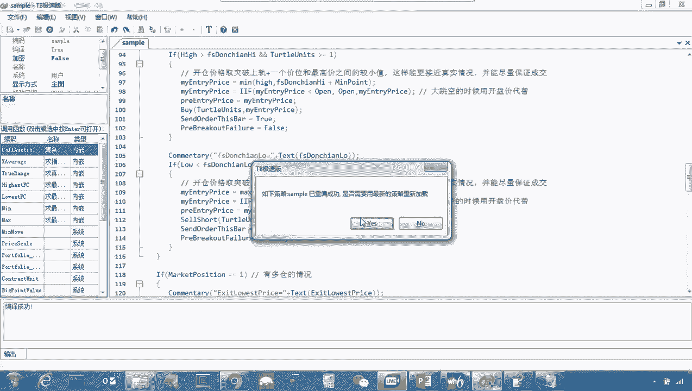

重新加载一下，我们可以看一下，看一下这个看下这个在屏幕的表现，哎但是很奇怪对吧，因为现在的这个屏幕上，现在我们看不到加仓的效果，这是为什么呢，是因为默认啊这种图表系统默认的话。

它会把这种多次加仓的情况过滤掉啊，他是为了防止你误操作，比如代码如果写的不好，那有可能会误操作，一下子就把你的所有的保证金用完了，就做了一个死循环之类的，但是如果说我们代码确实是可控状态。

我们我们写的比较完整，那么我就可以把这开关打开，所以呢我要从这个公式应用设置里头啊，有一个叫图表交易设置设置，有一个选项叫做允许连续建仓，也就是说我我某一次入场之后，允许再多次的这个入场。

同样一个方向入场，比如说我最多允许入入场十次对吧，然后另外一个我现在设的总资金规模比较大，所以我允许最大持仓个数也多一些，再加个零对吧，所以最多允许十次加仓，然后最多呢可以加到2000手合约好了。

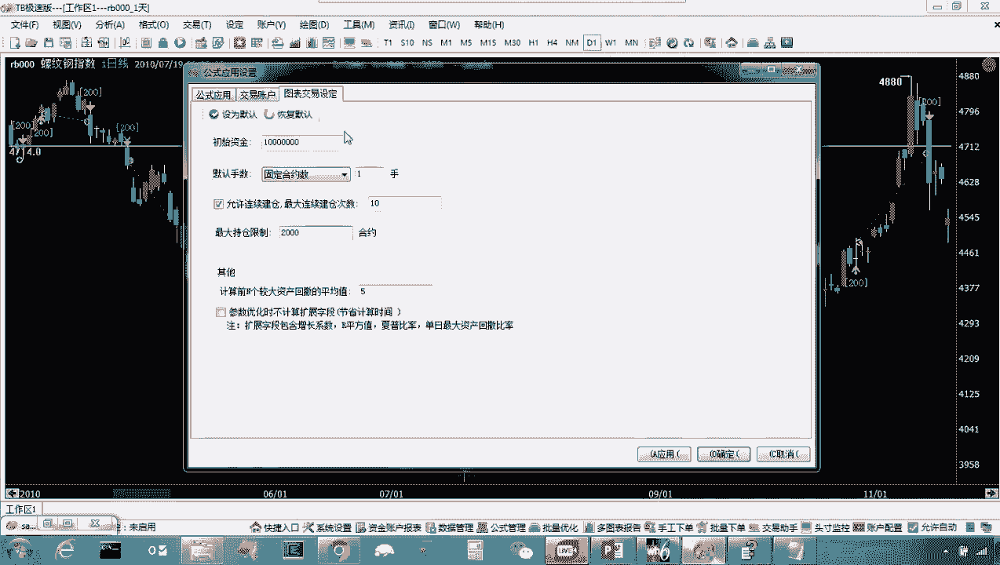

那么这我把这个选定之后再一确定，这样的话，我们我们就能看到整个图表上就有些变化了。

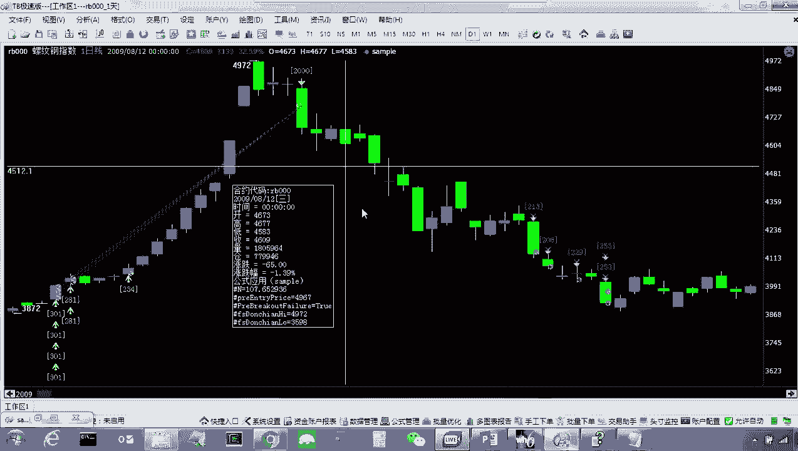

对不对，嗯我们可以看到说举个例子。

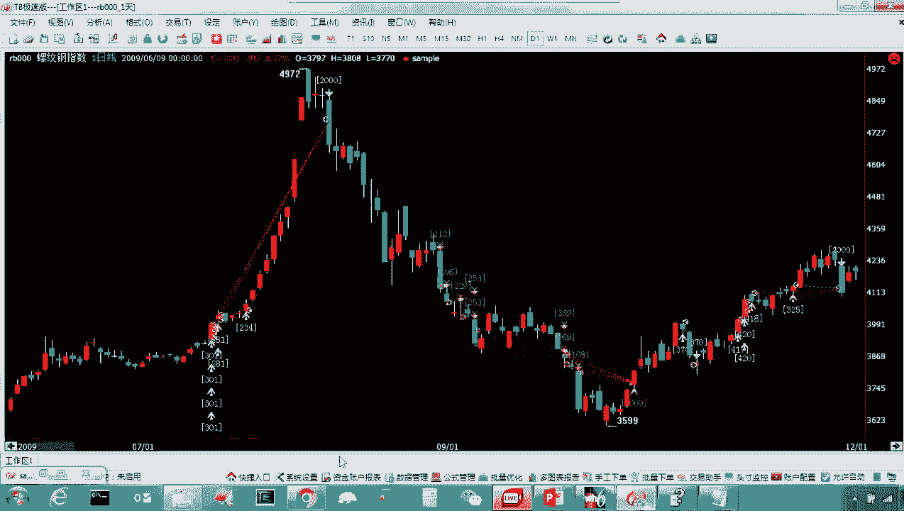

比如说像这个地方，这有一个特别大的一个特别高的一个K线，那么在这个地方入场了，这个K线里头会发生好多次的。

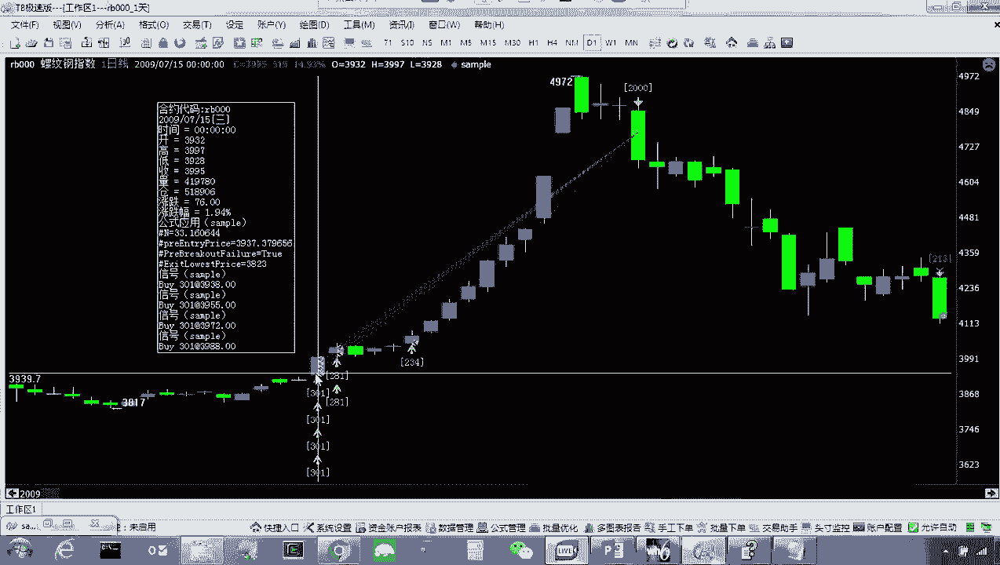

二分之N的这个价格的突破，所以它会连续的加仓加仓加仓一直一直加加，后面这还有一次加仓好了，但是到了后面的某一个时刻，这个K线向下跌破了前10日的呃。

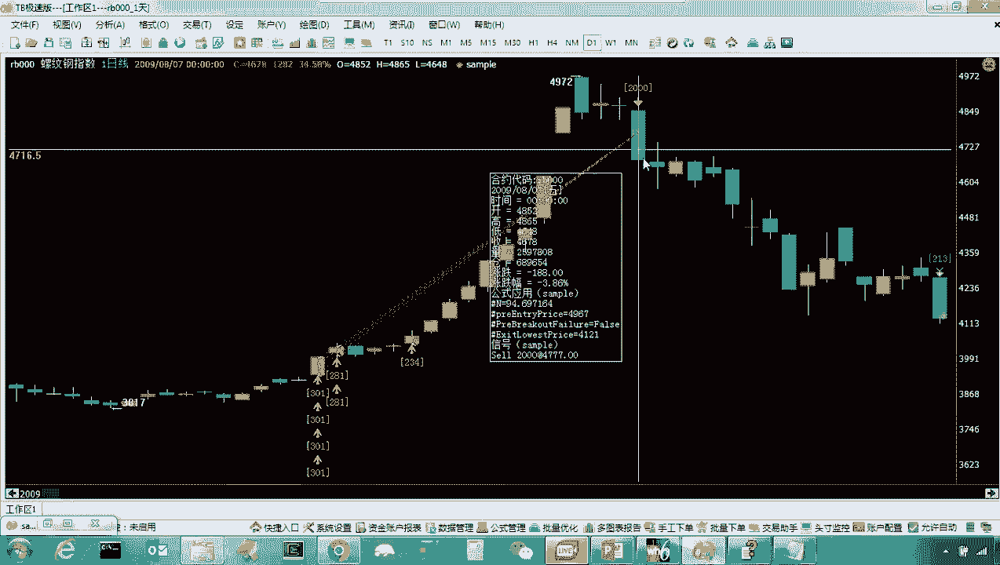

前10日的呃呃前十根K线的最低价的时候。

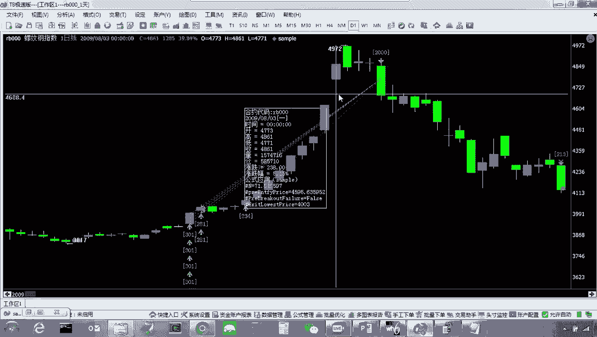

这时候就要出厂对吧，那出厂的时候呢，这是止损性的出场，所以这个时候呢，他就把所有前面若干次加仓的头寸，一次性的把它全部呃。

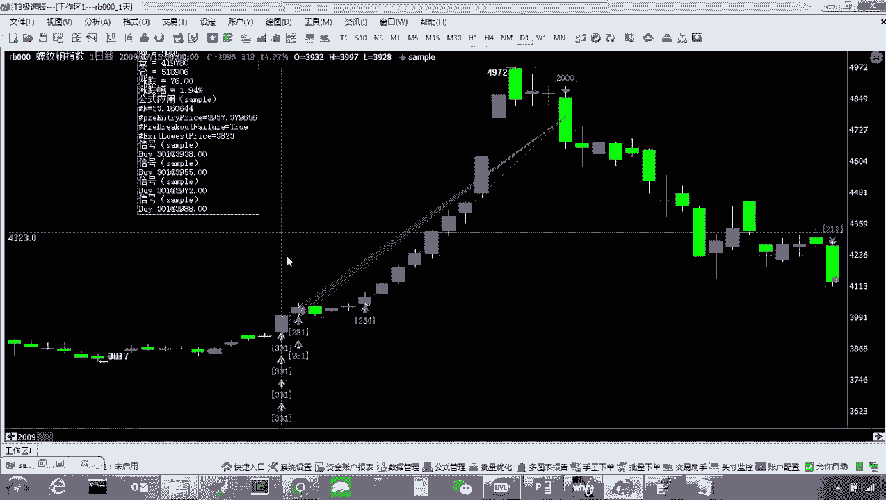

把它退出，全部把它平仓，所以我们可以看到说这次这头有多次入场，但是到出场的时候，一次性全把他了结了，这是这是一个做多的例子。

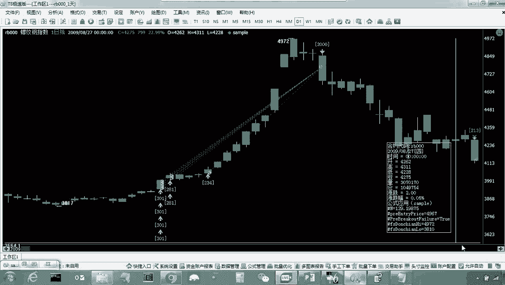

我们再看后面再找一个做空的例子，也是比如说在这个附近啊，我们看有很多的K线，这是在下跌，那么在这个时候触发了一个入场，后面呢又又有多次的一直在下跌，然后有多次入场做空加仓的机会好了。

到了某一个时刻反向突破，反向突破的时候，一次性全出场对吧好了。

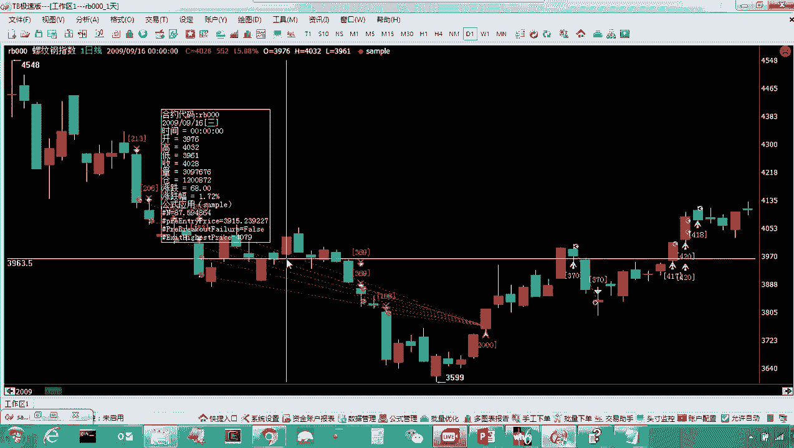

那么这个就是这个就是啊，完整海报J法产生的效果。

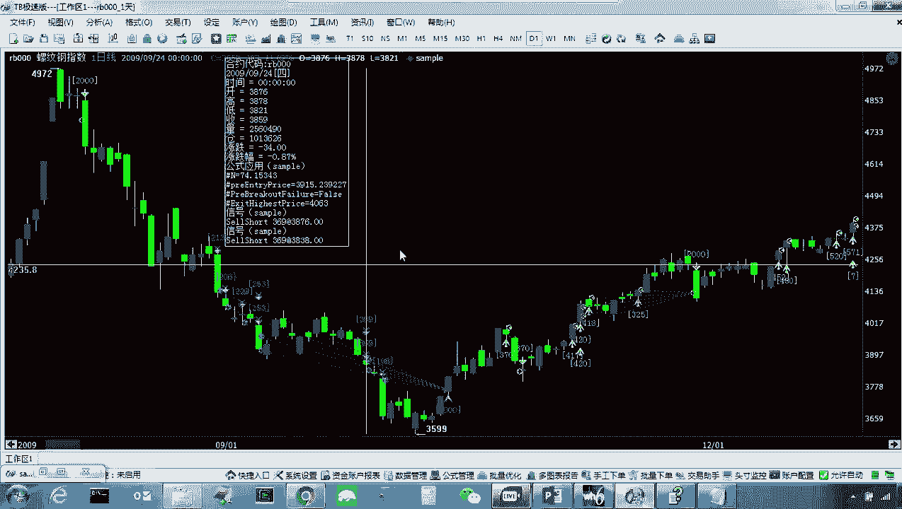

那么我们现在看一下，对它做一个评测，看一下这个F3，看一下他的这个收益情况，嗯我们可以看到说同样的一个时间段，用完整版的海龟交易法，在螺纹钢这个品种的一个日线级别，它的收益大概是翻了八倍啊。

从原来1000万入场变变到了8000倍，那如果大家回顾看一下刚才那个简化版的话，呃，呃就是如果不考虑加仓的话，它大概只有翻倍的收益，所以所以他这个效果就是对，对收益的扩大还是非常明显的，好。

这样的话呢我们就把这个啊海归教算法的原理，以及在TB这个软件上的两个版本的实现啊。

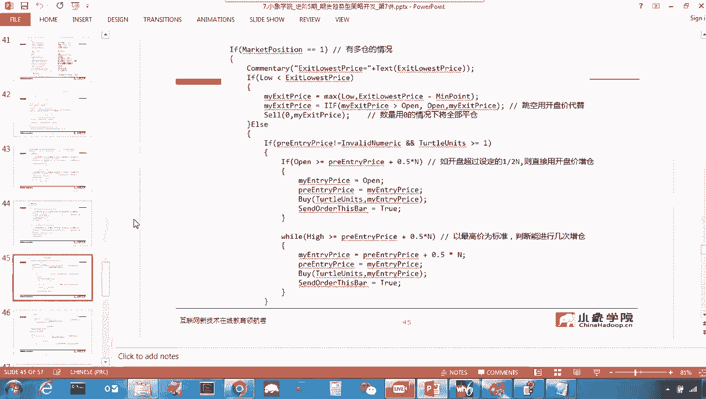

♪ 先是一个简化版 ♪，再一个完整版的实现，就全给大家讲完了好。

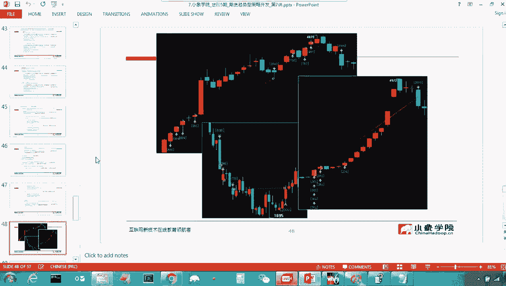

然后后面这是有些示意图，刚才我已经结合软件给大家都都已经看过了。

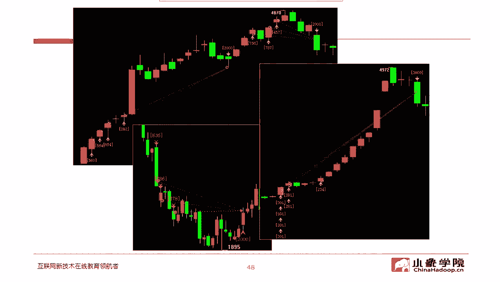

然后回测结果，那么关于这里具体的一些详细的指标，大家可以课后自己再拿软件去运行一下，然后做一个体会，下面我们来思考一下啊，为什么这节课里头我给大家啊看了两个版本啊，一个是简化版的，一个是完整版的。

那么这两个版本差别在哪，差别在于一个是有加仓对吧，还有一个是有止损退出啊，不只是止盈退出，还有止损退出，那么我们可以思考一下，那这个策略，这个策略，其实本质上来说是一个突破型的入场对吧，突破型入场。

而且它是最终趋势的，并且顺势加仓对吧，其实这这这句话突破，然后趋势性策略顺势加仓，这个其实是整个一个啊这个策略的本质好了，那么在什么情况下，这个回呃这个策略会产生一个很大的回调呢，对吧。

大家可以思考一下，也就是说我们其实平时我们大家可能听听到了，一个很听到听到就是一些有经验的人，就会说我们有很多种策略对吧，但是你的策略一定要和行情有一个匹配，对不对，如果策略类型和行情不匹配的话。

那其实是亏损的概率是非常大的对吧，比如说我是一个趋势性的策略，我把它用到一个震荡行情下对吧，或者说我一个高抛低吸型的策略，把它用到一个趋势型的，或者说一个走势很流畅的一个行情下。

是不是他俩都会造成一个大量的亏损对吧，这就是一个策略类型，和你的行情走势是不匹配的情况下，所以对海沟加减法也是同样，那海沟加减法本身，它是一个基于一个突破的入场信号，但是它是追踪趋势的。

也就是说只有对这种趋势性很明显的啊，品种或者说这一个行情阶段，它的效果才比较好对吧，那么这个呢就是说呃本质来说，所以我们回想一下刚才我说的问题，完整版的效果是不是一定比简化版好呢，不一定对吧。

因为完整版完整版的话，它其实是有多次加仓的，但如果说本身这个行情，如果它是一个震，它是一个他是就是说啊震荡，震荡的特性比较比较强烈的话，那么我这个加仓其实加仓加仓加到最后，它其实一个一个明显的回调。

就会造成我一个很大的损失，因为我头寸一直在加大，属于重仓了对吧，那我重仓的话它稍微有一点点回调的话，那我的损失就是会会会翻翻好几番的，去扩大的对吧，所以这种情况下呢。

所以第一我们要考虑说我的这么一个策略，到底和我的行情类型是不是匹配对吧，第二呢我这个加仓的策略也是要慎重，那么你只有在比较比较大的把握的情况下，你才要顺势加仓，还有一个就是要做好风控啊。

之前老师也在课上讲过，到底是我们如何做一个仓位控制，和一个风险控制，那么这些问题大家都要去考虑，所以呢讲了这些原理性之后呢，咱们同学呢也可以去尝试去改写一下，完整版的代码对吧，因为这个代码本身里头加仓。

其实呃他这个策略做的也也比较简单啊，就是二分之N对吧，没有考虑加更多的一个判断，你完全可以对它做一个修改，比如说加仓策略，我是不是不要按照等间距去去去加仓对吧，另外一个加仓的时候。

我是不是再结合一些某些技术信号，的一些特殊的表现，然后再考虑说分别加仓对吧，那么大家其实完全都可以自己去发挥，第二个呢，就说我现在在这个例子里头，给大家测试的是日线级别的。

那么你其实也可以去测试下不同其他的呃，时间级别，比如说60分钟线，30分钟啊，5分钟等等啊，或者不同的品种，比如螺纹钢，你换成焦炭怎么样啊，橡胶PPA等等啊，大家都可以去试一下看看。

就说海龟交易法不同的版本，或者说你自己做一些修改，那么对不同的品种可能有不同的适适应，适应适应程度都可以去体会一下，那同样我们啊还回到这个期货交易本身啊，期货交易本身，因为刚才我给大家做例子啊。

用的是螺纹钢的指数，那其实真正我们去交易的话，肯定是某一个具体月份的合约啊，具体月份合约的话，它本身就存在一个宜昌荒月的呃事情，那么当我们去啊，真的是把某一个策略去用在实盘交易的时候，你要考虑以汤换月。

或者在程序逻辑里做一些处理，或者说在啊在这个量化平台软件上啊，手工啊，在不定时的去对这个你交易的期货合约，做一个切换啊，这是提醒，第二就是一个杠杆效应，杠杆效应的话呢就是它会加倍的放大啊。

呃盈利和亏损的水平啊，所以这个风控一定要尤其是仓位管理，这个要特别强调的，嗯还有一个呢就是说啊波动幅度对，因为期货品种它确实波动很大，呃就是受风险和收益都很大，也很刺激。

那么所以大家如果你真的要参与的话，一定要量力而为，那么对于没有太多教育经验的人呢，我建议你期货的话一定要慎重啊，♪ 而且本身期货它有些隔夜跳空的风险 ♪，比如说有可能隔夜有一个很大跳空的话。

很可能会造成你的啊，账户的保证金会有一个很大的一个损失啊，这样的话就必须自己或者是说你从呃，比如说你如果是考虑到，要规避这种隔夜跳空的风险的时候，你是不是要考虑只做日内交易，对不对等等啊，啊还有套利。

还有套利交易，这个我在后面的课程会给大家再举套利的啊，例子，那么这节课就不展开讲了，然后给大家留个小作业啊，课后呢如果有时间的话，可以去去用海龟交易法去测试一下啊，不同周期不同品种的表现啊等等。

那么额然后你也可以对比完整版和简化版，然后去做一些分析啊，接着给大家课后留做一个练习，好然后下节课呢下节课我会啊，用用聚宽平台来给大家用呃，介绍均值回复性策略啊，这是另外一个策略，然后换一个平台呃。

大家如果说之前对呃聚宽平台不是很熟的话呢，也可以就是提前稍微做一些预习吧，一个是注册账号啊，另外一个呢就是阅读一下啊，这个平台的呃平台的一些使用说明啊，还有包括PYPYTHON和pandas as语言。

给大家了解一下，那么呃平具体平台呢有两种啊，一个是巨宽平台，还有一个是一创聚宽啊，一创聚宽本身它是相当于巨宽平台，在一创第一创业证券呃，内网做了一个部署，它可以直接接实盘的，所以说我下节课例子。

就直接用一换一创聚宽平台了啊，那么如果你平时用过聚宽平台，就是啊习惯用传统的那个巨款平台呢，其实也没关系，都都类似啊，♪ 只不过这个一传巨款可以直接接实盘 ♪，所以我就拿它来做例子。

其实从从使用方式来说差别不大好，所以呢对下节课先做一个预告嗯，呃那么这节课主要内容就讲完了，我看一下，稍微留留一点点时间看看啊，同学们有什么问题啊，好有人同学问为什么是55日，而不是其他值啊。

对啊这样啊，刚才我其实也讲了55日和20日呢，这只是说海龟交易法最最早这个理查德丹尼斯，他在带着他的团队，♪ 然后来做交易的时候 ♪，他们选了一个经验值，那么这个有可能是比较适合于当时他的。

那当时他那个几十年前的市场环境，或者说当时的所交的品种，那么55可以算一个经验值啊，那么咱们呃对现阶段啊，如果说你要真的是想拿这个呃，策略来进行交易的话，你可以考虑通过回测也好啊。

或者是选择一个不同的这个呃周期啊，所以这个不要僵化思想不要僵化啊，那么这只是个经验值，你完全可以选一个不同的，更适合自己所交易品种的这个行情的一个啊，时间窗口宽度啊，第二呢tb做实盘是不是要收费的。

TB是这样的，TB它本身它的模式，它做实盘呢是分成模式啊，也就是说他从期货公司，就是说你如果拿tb来做实盘的话，因为你每一笔实盘交易通过它来来做的话啊，期货公司都会收呃，就是交易所会收予一定的费用。

然后期货公司也会收一定的佣金，然后呢啊TB他是会在呃，交交易所的所收的那个费用的基础上，加收20%，好像呃20和20我不记得了啊，大概20%或者25那样子，就交易所那部分的呃手续费基础上。

他他再加收20%或者25那个样子，就是他他我印象中他应该是收费标准，所以它是分成模式，也就是说你拿它不做交易，他就不收钱，你做交易呢他就多收一点点手续费啊，是这么一个模式啊，你们做期货也适用TB吗。

是的tb我我用过就是呃呃我用过很多的平台啊，T b m c，然后呢金字塔文华呃距宽，还有说VNPY这所有的平台激活我都用过哈，所以就是说呃但是呢这个就是具体用什么平台。

这个第一呢是取决于取决于你的策略类型，还有你你适用于交易什么品种，还有说你对这个呃各种平台费有收费模式的，这个呃容忍程度对吧，比如说有一些有一些我快速，我想快速开发一些策略的时候。

我觉得用这种图表化的交易系统，开发策略会很方便，因为代码写的很快对吧，但是当当我这个策略很成熟了，我同时需要交易非常多的品种的时候，我可能就会想切换到一个平台，比如说我就拿VNPY对吧。

这样的话第一呢它本身它运行效率，就是它对CPU内存占用的消耗比较少，第二呢就是说它收费啊，就是不收费对吧，我我我拿开源框架，我是我是不嗯，就是做交易的话，他是没有没有就是不收任何费用的。

所以这样成本也会省一些，如果尤其是你交易的，如果频频频率比较高一些的话啊，有可能就是说呃这交易成本啊，就是交加收的这种交易成本，它也是一个可观的一个支出了，所以这个完全是综合考虑啊。

所以呃答案是呃yes啊，就是tb我我我用过好，然后呢呃做过实盘，然后呢完整版代码是不是可以只上实盘呢，是这样的，不是呃这个概念啊，完整版的代码呢，是说它是对海龟交易法则的一个完整实现啊。

这是这是这是我的一个结论，就是完所谓的完整版代码，♪ 是对海归加减法的一个完整实现 ♪，而且在tb这平台就是有一个完整版的例子，你完全可以从它啊呃公式管理器里内置的啊。

呃呃那个目录里头找到它的完整版的代码，和我提供的是一样的啊，但是是不是可以上实盘呢，呃这个呢要自己判断，要首先你要做一个回测，因为海龟交易法，他当时所适用的所交易的品种啊，就是从它的各种啊统计特性来说。

可能和咱们现代呃所用的所交易的一些期货，或者股票的品种，它的统计特性，或者是大家的这个博弈的一些风格，有可能不一不太一样了，所以是不是适合于上市盘呢，你要自己拿历史做一个回测啊。

一般来说我们首先先写一个策略啊，我不管它到底是经典的，写的好还是不好，还是我自己开发的，首先我要有足够的数据，对历史数据做一个回测啊，要要保证说回撤就回撤比较小，比较稳定啊，没有一些特别大的风险。

第二呢我还要拿模拟盘，让他在模拟盘上跑一段时间，小仓位的跑模拟盘跑到一定的时间，我对他有充分的自信了，我再把它上实盘，否则的话如果你程序里万一有bug怎么办对吧，或者说刚才我说的万一有这种啊。

就是万一有有有啊，就什么信号闪烁呀，♪ 什么未来函数啊 ♪，这种这种这种隐藏的程序的小问题，你发现不了，上市方贸然上市班，可能会造成很大损失对吧，那具体说一个代码是不是适合于上实盘，或者说怎么上实盘。

上实盘之前有什么步骤，我们在后边的老师，后面的课程里头也会给大家再再讲，再给大家详细的去讲讲解一下啊，那是在应该是在最后一节课啊，会会详细讲一下上实盘的一些注意事项啊，这里代码只适用于TB这平台吗。

啊是这样的啊，目前咱们今天看的这个代码，它就是用PTB这个语言来写的，NTB这语言来写的，但是呢，呃因为它海归加减法是一个非常经典的策略，你在很多的平台上都能找到它的源代码，从网上都能搜到啊。

比如说我就我就我就见到距宽上呃，类似于距宽上也有，然后呢MC平台也有呃，还有说还有说一些第三方的那个软件包啊，比如说掘金量化呀啊等等，那么像像其他的这些量化平台，你几乎都能找到啊。

呃就是这个海龟交易法的源代码，只不过他们语法不一样，但是从策略思想来说是一致的，是这样的，刚才我也说了，tb呢呃对呃，tb的话是呃旗舰版和极速版啊，这两个不支持Python，叫tb框GP框的那个平台。

它是支持Python的，就是它提供了相当于提供了一个API，可以在Python这个语言里头来调用API，就通过这个API啊，所以说在tb如果你用tb框，就最新的，现在还是公测阶段的那个tb框那个平台。

你是可以用Python的，但是这个话又说回来，既然你已经能拿Python写程序了，你为什么还用还用TD呢，你就直接调VNPY不是更方便吗对吧，所以这个问题要自己判断啊，好这是关于平台的选择啊。

♪ 这里加仓都是一步一步加的 ♪，好像没有一步一步减的啊，对是的，对海龟交易法来说是这样的，它的加仓是一一次一步一步的加，但是减仓就是最后呃，碰到创造条件就一次性的全全把它呃，前把他就是出场呃。

T呃海归减法是这样的，当然你也可以去改造一下，你也可以逐步的加仓，逐步的减仓对吧，你按照一定什么样的速率啊去做加仓减仓，然后这个当然策略就写的更复杂一些，这个完全看自己的啊，策略是怎么定义的了。

呃你可以逐步减仓，但是呢逐步减仓和一次性减仓，其实各有利弊啊，自己可以去回撤去体会一下，啊今天讲的策略也可以用到股市吧，嗯对啊，股市是这样的，用到股市的话呢，原则上是可以的，因为股市的话。

你至少对国内的A股你只能单向做多对吧，你要想在股市做空的话，你得做融融资融券，但是融资融券本身它的成本很高，那下节课，其实下节课我给大家讲，均值回复性策略的时候呢，也会讲到融资融券啊。

它其实也相相当于一种做空，虽然它成本比较高，但是我作为一个例子是可以的，所以说海龟交易法，你也可以只把它做多的这一这一这一块，把它放到股市里头，纯做多头也没问题啊对吧。

所以这个策略思想本身是可以用在股市的，但是有些细节你需要做一些修改，然后下次课是讲呃期货吗，不是的，下次课均值回复性策略呢，我是用股票来作为例子，而且股票是呃加上融资融券啊。

合在一起给大家讲讲均值回复型策略，然后再下下节课，我是用MC给大家讲讲的，下一个下下节课那个还是基于期货的，讲讲配对交易好了，所以呢基本上就是我我这连着三节课呢是啊，分别讲三种不同类型的策略。

然后用三个不同的平台啊，也涉及到期货，也涉及到股票，好吧行，那因为时间关系啊，看看同学们还有没有其他问题，啊今天啊课程啊，这个内容是相当多啊，所以我这个说话速度也是很快啊。

所以如果如果可能可能有个别细节啊，啊同学们可能如果一时抓不住的话呢，也希望课后呢能够看一看回放，然后再结合课件再仔细体会一下，这里头其实细节是相当多的，你要把这里头很多细节再琢磨琢磨透的话呢。

呃应该会有一些实实在在的收获好吧，那那这节课就到就到这里了，那咱们下课啊，下节课再见好，谢谢大家再见，关不掉啊，这。

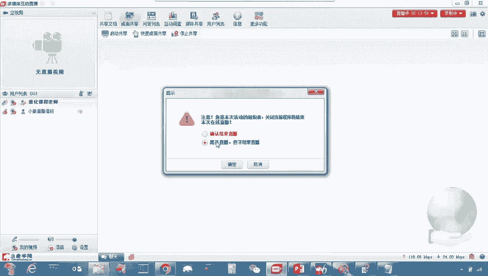