# 清华大学讲师团，量化交易实战，迭代式的量化策略研发 - P9：第九讲_套利策略的设计与开发 - 反方向的Bug - BV1Bs6MYFERQ

呃课前还有几分钟，然后咱们还是呃先课前几分钟，咱们看看同学们对前面的课程有没有什么问题，咱们可以先随便聊几句，然后这节课呢，这节课咱们要使用的这个平台，叫做mari charts啊。

上节课我也给同学们啊给的链接对吧啊，不知道大家有没有去装一下这个软件，然后有没有注册使用账户，哦没有Mac版，对没MC是没有Mac版的，所以你要在Mac上运行的话。

可能只只只只能需要装一个这个虚拟机对吧嗯，装一个windows虚拟机去运行，呃没关系，没有Mac版，没关系，或者是课后的话呢，呃你可以去呃，一个是这课程其实主要主要还是看一下啊，里头的一些具体方法啊。

因为像这种图表图表化的软件，哎给的链接打不开吗，呃呃这个链接是这样的，就是啊应该是前面加上一个3W这样啊，我给同学们看一下，MATCHS点CN啊，前面要前面可能要加上这个三个W啊，这样应该是是是可以的。

对他可能是因为这个网站的域名解析的问题，如果你要没有前面这个三个W的话，他不一定能解析到他的网页的那个地址，所以加上W3个W应该是可以的，回头可以再试一下啊，对嗯那如果暂时装不了也没关系。

回头以后可以可以在电脑上装一个虚拟机啊，或者是呃索性就是啊，如果你要是做量化交易的话呢，啊像我们现在一般做量化交易，通常都会啊花一点点钱，然后买一个阿里云的服务器，那其实很便宜，可能就一二百块钱。

就最低配置就就可以跑起来了啊，这样的话呢它就可以24，24小时的运行一些自动的交易程序啊，所以用那种环境也是可以的，好了时间差不多了啊，我们现在开始准备上课，好啊。

这节课呢是是咱们进阶课程的第九第九课啊，啊题目叫做套利策略的设计与开发，那么在之前的课程中呢，呃我曾经给大家介绍过啊，一些常见的啊这个交易策略的分类啊，不管是说你做主观交易，还是说还是说做程序化交易。

其实有有一些类别，那么这个套利啊，这种套利策略呢，其实也是一种很就是很重要的啊，这么一类策略啊，嗯那么平时我们大家知道的最多的，都是些单边策略对吧，比如说你你做一个趋势啊，做一个趋势跟踪型的。

或者说是做一个啊这种高抛低吸型的啊，比如说你去追踪有一个波段对吧，或者说用某种突破突破型的信号对吧，抓住一些特定的入场点等等，那么那些都是属于单腿策略，单边策略，那么套利策略呢，它的典型的做法呢。

就是说用两个或者更多的啊，这个品种来进行交易啊，把它们组合起来做做交易嗯，那么这是一大类，也是一个很重要的一类啊，交易策略，而且套利策略呢它一般呃一般来说它的收益啊，就收益情况呢一通常来说会比较稳定啊。

就是如果套利策略一般如果做得好的话，那么他做出来的收益曲线会比较稳定，而且呢可以容纳更大的资金规模，所以这个呢是很多啊机构啊，一般是很多这种机构投资者比较喜欢用的啊，这种交易策略类型之一啊。

好所以这节课我们主要来讲一下套利策略啊，主要内容包括这么几方面，首先呢我先给大家讲一下套利策略的原理，还有一些常用的常见的套利策略类型，之后呢，我们就用MC这个平台呃来开发一个呃两种啊。

以我们来做一个跨品种的配对交易策略，再做一个跨期的配对交易策略，那么这是两种典型的配对交易策略啊，然后最后呢我们再来讨论一下股票啊，在股票上的应用啊，大概就是这么四方面内容呃，先看一下配对交易策略原理。

那么在这里头我给的一个副标题呢，叫做寻找相对确定性的盈利机会啊，相对确定性，也就是说啊这种这种盈利机会呢，一般来说它是比较稳定的，或者说胜率比较高的啊，这么一些交易机会。

我们是可以通过配对交易来来做的啊，这里给出一些名词啊，其实这个我就不逐行列给大家念了啊，看一下就行，那么套利套利交易其实可以分很多种类型啊，这里列了几种，比如说有无风险套利啊，配对交易，还有统计套利。

那么无风险套利呢这个从字面上很容易理解啊，也就是说我们通常找一些风险特别低，或者说嗯几乎没有风险的一种交易机会啊，那么这种无风险套利呢一般来说是根据啊，股票啊，一根一般我们会根据一些啊现货期货还有期权。

它们之间的一些确定性的关系啊，来来来来构造成一些呃就是交易交易组合啊，比如说比如说在这个期货领域啊，假如说我们用股指期货，我们都知道说股指期货啊，每个月都有合约对吧，然后呢它到了一定期限。

它有一个交割交割日期，那么期货呢如果说股指期货，那么到了就到了交割到了呃，就是最后交易日的时候呢，它通常它会回归对吧，他会和和现货，也就是股票指数会会回归，那么基于这种特性的话呢。

那么我们就可以构造出一些相对来说比较，确定性的盈利机会，这是第一种啊，叫无限套利，然后第二类呢叫做配对交易啊，配对交易典型的就是呃两种啊，一般是用两种两个品种来来组合成，来构造成一个组合进行交易。

那么通常来说它一般都是说啊，挑选基本面比较相关的这个品种来进行交易，那么细节呢一会我后面再讲，所以这节课给的几个例子呢，都是配对交易的例子啊，然后第三种呢叫做统计套利，统计套利的话呢。

呃应该是说我们会选择一批啊一批这个啊，呃品种就是呃若干个啊，说是品种也好，或者股票也好吧，就是就是呃这么一堆，然后呢他们呢呃通过统计他们呃，比如把它分成两组啊，然后统计两者的相关性。

那么他们如果他们具有一定的，统计的相关性的话呢，那我就可以把这些，把它们来构造一个资产组合啊，所以呢它是从统计的意义，统计的角度来说是具有一定相关性，而不是从基本面上有一个直接的相关性啊。

那这两个概念是有些差别的，那么后面呢还有一些就是其他的一些名词，那么这个一看就能看得出来了，我就不不挨个解释了，然后呢这个里头呢这一页我们可以看一下，就是我们常见的一些啊，就是金融工程的模型啊。

或者说一些交易策略吧，那么在之前的课程里头呢啊，我们或多或少的也都给同学们介绍了一些对吧，比如说我们看趋势，比如说CCTA趋势策略，那么一般是面向商品期货的啊，这种趋势跟踪型的策略啊，均值回复对吧。

上节课呢也给同学们讲了均值回复型策略，然后呢还有套利，拿统计套利，期限套利啊，股票对冲等等，那么这是这节课主要啊讨论的内容，那么除除了这些之外呢，可能还有说根据这个事件啊，事件驱动。

比如说我们根据一些消息对吧，根据一些大的事件来构造一些交易策略等等，那么这些呢都是呃各种，还有还有说一些很很复杂的期权策略啊，比如我们可以通过呃期权来构造出，两腿或者三腿的策略等等。

那么这个就更复杂一些，那么这个不是我们课上内容有兴趣的话呢，同学们可以去课后去找一些相关的文章，来研究一下，好，那么这节课呢我们主要的内容是讲讲讲配对啊，讲讲套利，讲套利策略，那主要是做一些配对交易呃。

看一下配套利套利这种策略的原理，那么给了两个例子啊，一个呢叫做呃，一个叫做期现套利，一个叫做期现套利啊，那么一个叫做跨期套利，期限套利什么意思呢，通常来说呢，就是我们根据一个现货或者说一个期货。

而且他们两个之间是相关的，那么把它们来构造出一个，把它们来构造出一种啊，一种配对交易的一种一种场景，那所谓的现货我就用股票来举例对吧，我们知道说股指期货，那么它的标的呢是根据股票指数来的对吧。

那股票指数的话呢，它是一篮子股票的一个加权算出的一个指数，那么跟这个指数对应的呢有ETF就是ETF基金，那么这种ETF基金，其实我们是可以直接买卖的对吧，所以我可以因为这个ETF基金。

比如说50ETF啊，那么50TF，它实际上是跟踪了上证五零指数对吧，所以呢而且它的标的都是一篮子股票，所以可以把它作为一个现货，那么还有五零呃，基于这个上证五零指数的股指期货，就是IH股指期货对吧。

那么所以呢这个我可以用，我可以用这个股指期货IH和50ETF啊，这个基金啊，就或者说他就是现货部分，把他们两个来构造出一个一个啊，配对交易的这么一种一种呃，就是呃一个组合吧，所以期限套利是这么一个原理。

一般来说呢这个嗯这个指数的期货啊，这个期货的这个价格呢，通常因为它是它是对标这个指数的，所以一般来说它会围绕着这个指数上下波动，对吧，就像我们这个图中所画到的，假如说中间这个黑色的这个线是是指数啊。

是指数的一个走势，那么这个期货这部分啊，股指期货这部分呢通常来说它它的走势呢，它因为它两个具有一定相关性，但并不完全一样，但总的来说呢这个期货的部分呢，期货的走势它会围绕着这个现货上下波动对吧。

或者换句话说呢，术语我们一般叫它们两个会有一个价差，或者叫做有升贴水啊，是这么一个场景，所以呢但是通常来说，既然这个期货部分它是围绕着现货，它会波动的话，但通常它会有一个范围。

我们看这个上面这个屏幕上画的这个黄色的啊，这个上下轨这两根线，通常来说它会有一个合理的波动范围，那么但是假如说因为某些原因，假如说因为某种消息面的刺激，或者说因为参与市场的各种资金的一些。

短时间的一些波动，有可能会使得在某一些时刻，那么期货的价格会比较大的程度的偏离，这个现货的啊，这个价格本身对吧，就像我们这个在屏幕所看到，比如说画圈的这两个地方，那么如果期货的这个价格向一。

从一个很低的方向偏离，这个偏离的这个啊现货这部分价格偏离了很多，那么这个时候呢，就给了我们一个很好的一个套利的入场点，因为我们知道说，他们两个注定在某个时刻会回归对吧，因为本身他们两个是围绕互相围绕着。

就是呃期货部分是围绕现货部分是来回波动的，那么我们这都说将来现在会短短时间偏离，没关系，那么将来在某一个时刻，它它大概率是要回归呃，呃就他们俩会重叠的，所以在这个时候呢，比如说像我屏幕上所所画的。

这个第一个圈的所在的位置，那如果说这个股指期货的价格啊，远远的低于啊这个指数现货的价格的话，那么我就可以去入场去做多这个股指期货，同时我去入场去做空啊，那个指数现货就刚才我举例子啊。

比如说我举例举的是ETF对吧，那么我就可以这样构造出一个一个配对的组合，那么那么将来在某一个时刻，当他们两个价格回到同一个水平的时候对吧，那么原来我做多的这部分和做空的这个部分。

他们两个价格比如做做多的部分呢，大概率都会价格会往上涨对吧，做空的做空的这部分呢，他大概率价格会往下跌，这样的话才能才能去他两个才能重合嘛对吧，才能回归回归到一个呃，回归到一个啊差不多近似相等的水平。

那么这个时候我就可以平仓出场对吧，那么这种情况呢就是一个套利机会，还有一个例子，就是像第二个这个圈所指这个这个地方，比如说这个股指期货，它的价格在某个时刻啊，远远的高于高于这现货部分。

就超出了一个正常水平，那么这个时候呢我就可以去入场做空这个期货，期期货这个品种，同时呢同时去做多这个现货的部分，那这样的话将来等他们两个价格再回归到，再回归到啊同样一个水平的时候呢。

我再把他们两个平方出厂，那么我就获得了他们两个中间这个这个价差的，这部分利润对吧，所以呢有一个术语呢叫做啊，我如果把这个现货部分和指和这个期货部分，♪ 这两个价格相减 ♪。

那么这个得到的这个数呢我们叫做一个价差，所以我们去做一个套配对交易的时候呢，主要看的就是这个价差的一个波动范围，那如果价差向下，就像负数偏离的特别多的时候，那我就要去做多这个价差。

如果它它向往正的方向偏离比较大的时候，我就去做空这个价差对吧，因为它大概率将来这个家长会会回归到零啊，大概就这么一个意思，那么做那么做呃，做多这个价差的概念是什么呢。

做多价差就代表说我去我去做多第一个品种，做空第二个品种对吧，因为价茶本身就是第一个品种价格，去减去第二个品种的价格，那做空这个价差呢就是去做空第一个品种，同时做多第二个品种啊，这是一些术语啊。

叫做多价差和做空价差啊，有的时候也叫做正正向套利和反向套利，就正套或者反套，这几个是不同的术语啊，等同学了解一下就好了，所以当我们在某个时刻，我们去说我做多这个啊，我去做多这个价差或者做空这个价差。

或者说我去做一个正向套利，或者叫正套，或者做一个反向套利，或者叫做反套，那么这几个术语其实说的是一个概念啊，都是说要要发现这种配对交易的机会好了，这是一个期限套利举的例子。

那我们再看第二个例子叫做跨期套利，那跨期套利实际上呢从从它的原理来说，是和期限套利是一样的，只不过跨期套利呢，我们是面向面对的是同样一个商品，但是呢它对应着不同的交割月份啊，我们以商品期货为例啊。

比如说某一种商品，假如说螺纹钢对吧，它可能有19年11月份交割的合约，可能有啊，19年12月份交割的合约，他也可能有2020年，什么3月份或者6月份叫更远期的一些合约，那么不同的合约之间呢。

通常来说它们的价格，他们通常价格会有一个比较合理的一个，价差范围对吧，因为是同样一个商品对吧，同样一个商品，只不过因为说这个商品，我在这个月买和几个月之后买，那么它的价格通常来说不会有特别大的呃。

一般会有一定的差别，那么这个差别在于什么呢，一个呢是说本身是一个季节性的啊，可能有一个是季节性的原因，比如说涉及到一些农产品对吧，不同的季节可能价格不一样，涉及到这个收割的季节啊等等。

还有一个呢可能会受到一些啊供需的影响对吧，比如说如果是跟这个跟建筑领域相关的螺纹钢，假如说那可能在这个啊施工，就是一般比如房屋啊，桥梁啊啊，像这些建筑这个建筑领域，那么在开工高峰的时候。

他可能需求就大对吧，价格就会贵一些，那如果说需求小的话呢，那自然会溢呃，就是它的价格就会就会回落，还有一些可能会受到一些天气啊，运输啊啊，还有些政策面的消息影响，还有一一个就是仓储成本对吧。

因为不同的交割月份的话呢，那么他们本身这个商品有一个仓储的成本，这是固定的，所以把所有的因素考虑进去之后呢，通常来说不同交割月份的这个商品期货合约呢，它它会有一个相对来说比较合理的这么一个啊，降差范围。

但是在如果是在某些特殊的情情况下，因为一些消息面或者一些政策面的，或者说一些资金的短期的一个刺激，会使得这两个不同交割月份的期货合约，它的价格会在比较大的程度，偏离了它的一个合理范围啊。

就像我这图中所画的这样，比如说这两个黄线框的这个区域，是一个合理的这个价差范围，但如果某个时候偏离太大，那么这个时候就给我们的一，提供了一个很好的一个，套利交易的一个入场点对吧，那么假如说这个价差。

我们如果说这个价差，如果说这个价差是一个正的啊，特别大，那么这个时候呢我就去入场做空这个价差，那如果这个价差是一个负的特别小的一个数，那我就去入场做多这个价差对吧，我可以这么就是用这个术语就做空。

这个加差或者做多这个价差，换句话说就是说我可以入场去做一个反向套利，或者做一个正向套利，那么这个时候就相当于我这两个品种同时下单，一个做多，一个做空，那么将来等到这个价差，回归到一个平均水平的时候。

我再把同时把这两个品种给它平仓出场，这样的话我就可以获得这个价差，中间这个这部分的价格差，异的这么一段的收益啊，那么这个呢就是呃套利交易的原理，给大家举了两个例子好了，那么这节课呢。

我们主要是用商品期货给大家来举例子啊，通过呃用商品期货作为例子来给大家讲一下，这个呃来给大家讲一个配对交易策略的原理，同时呢我们还要在MC这个平台上做一些编程，实现好了，那么配对交易是什么呢。

配对交易呢一般来说啊，我们是利用一些基本面的分析，还有量化的方法来寻找同一个产业链，或者或者同一个板块中，这个不同商品品种之间价格波动相关的规律啊，通知原理啊，一般来说刚才我前面也讲了，这种配对交易。

一般来说都是要看基本面相关的品种，那么这个时候呢，如果当我们对这两个品种的价格波动发现中，发现其中有些套利机会的时候呢，那么这个时候我们就去做多一个品种，但同时要做空另外一个品种。

也就是说我这种配对交易是同时乘着出现的啊，这种我们有的时候也就把它叫做一个啊，两条腿的交易，两条腿啊，不可以不可以单腿单腿交易，就是说做多一个的同时一定要是做空另外一个，那么这两个一定要成对出现啊。

这才是配对交易，那么这种啊我们要选这种基本面相关的嗯，这个交易标的啊，通常来说都是选关联性比较强的，这种板块比如说黑色系啊，化工啊，金啊，金属类等等啊，一般来说都是这一些呃，就是很很就是工业呃。

♪ 就不不是工业了 ♪，就是一些啊品种之间关联性，关联性比较强的板块，然后我给大家举几个例子吧，就哪些板块呃，就是呃板块里的这种商品品种啊，就他们关联性比较强啊，那么在在这这一页的啊。

课件里头呢列出了几个，就是我们市面上能看到的一些商品期货，它的一些分类啊，不同的板块，比如说第一第一类就是农产品类的，包括大豆啊，玉米啊，油脂类的棉花糖啊等等，第二类是能源化工橡胶类，第三就是基本金属。

也就是有色金属类的，什么铜铝铅锌镍啊，第四第四类就是黑色系，就跟钢材呀，焦炭焦煤等等，就是跟钢铁产业有关的，然后最后一类呢是贵金属啊，就是金银啊等等，黄金白银啊，这是这种属于贵金属类的，那这是这是这。

所以说我们可以从从这个分类里就能看到说，不同的板块之间，其实他们就同样一个板块内部啊，他们是有比较大的相关性的，那我就以第一第一类板块举例啊，比如说农产农产品类里头，我们知道大豆对吧。

这个大豆呢实际也就是黄豆了，那么在咱们国家主要是东北啊，东北是呃大豆的主产区对吧，呃，但是呢国内的这种大豆肯定是不能不能，远远不能满足需求的，所以我们还有很多大豆需要依赖进口啊。

进口一个典型的进口的地方就是美国啊，美国产的大豆，所以我们这都说啊，最近这个贸易战嘛，中国跟美国交锋的一个主要的一个呃，就是呃一个武器啊，就是关于这个大豆的金金属好的问题好了，那么大豆呢它是原材料。

我们知道说大豆可以去怎么做，可以榨油，对不对，就黄豆对吧，把它呃呃经过呃就是冷轧呀，或者说一些进出式的，反正有一些工艺就可以去榨油对吧，大豆榨完油之后呢，那么它出来的油就豆油了，那主要是我们平时做菜呀。

炒饭时候用呃，就是呃就是就餐饮类里使用的这个油脂类的啊，豆油，那么大豆榨完油剩下的这个残渣就是豆粕啊，斗破呢它主要就是啊养殖业的，比如说做猪饲料啊等等，那蛋白质很丰富，对所以呢这个大豆本身它是原材料。

那么榨油对吧，除了油脂，这个就是食品类的应用，还有说豆粕，那么是养殖业的啊使用，但是呢这个从从油油脂类来说呢，除了大豆的豆油，还有其他的种类，比如说呃用这个还有一种是菜油啊，用用油菜花啊来来榨的油。

那么它和豆油本身是有一定的可替代性的，还有说进口的这个棕榈啊，棕榈果啊榨榨出的油是棕榈油等等，那么所以呢假如说因为天气或者某些原因啊，因为这个大豆就是大豆的供需有些变化。

那么就会就会影响就会传导到下游下，就是下面的这个呃豆粕的这个价格呀，或者说呃豆油的这个价格，那就有些变动对吧，但是呢如果说如果说那个因为大豆的价格上涨，然后使得豆油的价格也上涨。

那但是另一角另一个角度呢，如果豆油的价格上涨，但是同时我们还有这个菜油或菜籽油，或者说有棕榈油可以作为替代对吧，反向它又会抑制啊，这呃就是就相当于供需可以是可以替代的，所以从这个角度来说呢。

在整个产业链里头，所以呢就这些品种之间，它们价格之间是互相影响的，一个是互相影响还是一个互相制约的关系，所以就说刚才我说的这个逻辑啊，这分析逻辑看起来挺复杂，但实际上来说，从价格表现来说。

就是他们有一定的联动效应啊，或者是说同向的一个品种的价格上涨，可能会带动另外一个品种上涨，或者说一个品种的上涨，可能会会使得下一个品种价格下跌对吧，他们或者说互相依赖关系，或者说互相替代关系好了。

那么所以说刚才说了这么一大通的意思呢，就是说基本上在同样一个板块里头，那么这些我们可交易的这些商品期货品种，它们之间价格是相关的啊，这是最关键的一句是相关的好了，或者正相关或者负相关。

那么有具有这种相关性的一些商品，我们就可以把它拿过来做配对交易，这是因为他们从基本面，从价格走上来说是相关的，所以说我们才能它才有具定啊，才具具备一定就是比较大概率，具有一定的价格回归的这么一个特性。

所以呢我们才可以把它拿来做配对交易啊，这是我跟跟大家说的这么一个逻辑，然后呢我们再看一下这个统计特呃，一个统计的表格，这个呢是根据啊不同的品种，根据它们在历史上啊。

不同时间的价格做的一个相关性的一个表格，我们看这个横坐标和纵坐标，这个RBHCJJM等等，这都是商品期货的代码，比如说RB就是螺纹钢，HC就是热卷板，J是焦炭，GM是焦煤，I就是铁矿石啊等等。

后面这个V啊L啊，这个是化工品，什么塑料啊等等，然后CEOAL呢这些是是有色金属，铜铝锌啊等等，然后在后面呢是农产品M呃，M就是呃这个M是斗破啊，斗破啊，然后那个Y就是豆油啊等等。

呃呃P就是棕榈油那等等，然后呢我们看纵轴也是这些品种好了，然后呢就是说不同的时间对他们的价格走势，计算出一个啊斜相关矩阵啊，这是一个一个一个斜相关的一个矩阵，就计算出它们的相关性。

我们可以看到说这RB就是这个对角线，肯定是一对吧，因为自己和自己肯定是相关性为一对吧，这个毫无疑问，然后呢但是我们看这种绿色的区域，比如说RB和HC，它们两个相关性达到0。93。

也就是说相关性是非常非常强的，然后这个II和RB和HC1，它们的相位大概在0。74和0。73对吧，所以呢像像这种蓝色的区域，就是相关性非常强的，然后我们再看一右下角这个农产品的这个板块。

也能看到说比如说这个豆豆粕啊M呃，和这个菜粕RM，那它俩之间相关性其实也也是非常非常相关的，因为它们都是可以用养殖业的，都是这个做饲料用的对吧，还有说后面的这个油啊，豆油棕榈油等等。

那么这些我们看它的相关性都都比较大，所以这个这个其实和我刚才给大家做的，基本面的一个分析，从这个逻辑上的分析是啊是一致的，也就是说他们既既从基本面的，就这种能够表现出一定相关性。

并且呢从他们实际的历史的价格走势来看，也具有一定比较强的相关性，所以呢具有比较强相关性的这些品种，我们我们就可以把它拿过来做配对交易，好了，下面呢我们就呃进入到第二部分，我们是来用MC来开发一个。

跨品种的配对交易策略啊，这个是我们现在就开始，就是刚才说的都是一些理论上的一些背景知识，现在呢我们就实际的来动手，看，怎么在这么一个量化平台，平台上来做一个一个配对交易策略，那么在额配对交易策略里头呢。

我给大家举的例子呢是用螺纹钢和热卷板，那么螺纹钢和热垫板是什么呢，首先他们都是钢材给大家说的具体一点，螺纹钢呢就是钢筋啊，就是我们俗称的钢筋，主要是用来做桥梁啊，啊这个建筑啊，房屋啊等等用的这个螺纹。

螺纹钢就是就是啊钢筋啊，钢筋水泥水泥里的那个钢筋，建筑用的那热卷热卷热卷板是什么呢，或者叫热轧卷板呢，就是钢板啊，钢板的话我们知道可以做什么，一般来说比如说这个啊汽车的外壳对吧，汽车的外壳或者说家电啊。

家电冰箱啊，什么微波炉啊，这种外壳，那都是钢板来做的对吧，那么但是不管是它是不同的形态，但是他们都是钢材，然后呢他们都是基于相同的原材料，那么钢铁钢铁板块一般是用什么材料呢，就是铁矿石，对不对。

用铁矿石呃，经过经过嗯，加上加上这个在高炉里头其实去炼制啊，高温高热去去炼制，把它化成铁水啊，这是这是第一步对吧，那么用到的原材料呢就是铁矿石，还有焦炭啊，用焦炭来来高炉加热，那焦炭又是怎么来的呢。

焦炭是用焦煤来来来做出来的啊，做这氧化呃来做出来的焦炭，那焦煤就是含焦油量比较高的一种煤炭啊，它和我们平时就是发电用的那种动力煤，是是两种不呃，两都是都是煤炭，但是是不同的这个含量啊。

所以呢通过焦煤来炼制焦炭，然后呢焦炭用来高炉里，放到高炉里加热，那那个高炉里头放什么呢，放这个铁矿石对吧，大概是这么一个过程，然后铁矿石呢就就即高温高热，就把它炼制成铁水，那铁水呢再经过一些特殊的处理。

比如说后期再再添加一些啊，一些特殊的催化剂啊，一些那个啊有色金属啊等等，那么它实际上就变成了这个钢材的，就就变成了这个钢材啊，冷冷却之后就是钢材对吧，那么螺纹钢和热卷板呢。

它们是从前期的加工流程和原材料都差不多，那但后期添加剂略有不同，但是从整整个成本来看呢，是热卷板会略微比螺纹钢贵贵一些啊，一个经验值是大概从生产成本来说，一吨一吨热卷板。

它的成本要比一吨螺纹钢的成本要贵，200块钱左右，这是这是这是他们两个的一些背景知识，但是呢因为因为他们有原材料相同，加工流程也差不多，所以它们的相关性是非常大的，就是这是通常情况。

但是但是因为在不因为他们应用领域不同，但是因为不同的供需或者不同的季节，那么也会使得这两个品种的价格有一定的差异，对吧，那么这种就是当这个价格在某个时刻，如果能够，如果它是偏离了一个正常水平的话。

那么这种情况下哎，我们就可以去去猪场去对它做一个配对交易，那举个例子啊，比如说在某一个时刻，我们看后面这个图，那么上面第一第一个，第一个窗口里给出的这个价格走势呢，是螺纹钢的一个走势。

那第二个图呢给出的是热卷板的一个走势啊，通常情况下它们两个其实走势是很相关的，因为本身这两个品种，从基本面来说就是比较相关的对吧，但是因为某些特殊的情况，也有可能他俩走势是不同步的，比如说就像这个图。

而在某一天这个热泉呃螺纹钢这个品种，它首先先放量下跌，我们看下面啊，这下面这这是这成交量，成交量在某个时刻，这个螺纹钢这个品种它它首先它先放量，所以它它优先它它先下跌，但是这个时候热卷板还没有下跌是吧。

然后呢我们看第三个图，这个spread daf这个红色的这个曲线，实际上就是把它们两个价格相减，就他俩的一个价差啊，他俩一个价差序列，价格差差异啊，价格相减得到的一个价差序列。

那么当这个螺纹钢它的价格首先下跌的时候，但是螺热卷板的价格还没有下跌，那么这个时候是什一个什么现象，是不是它俩价差就是就变小了对吧，因为我是拿螺纹钢的价格去减去热卷板的价格，当第一个当这个第一个呃。

价格先先下跌的时候，第二个还没有变，那它它俩的价差是不是变小了，往负数走，对不对好了，那么那么过了一段时间之后，然后这个热卷板它的价格才跟着下跌，所以它比较滞后，我们看这个热点板的价格放量下跌。

这是比较靠后的位置啊，所以这个时候呢，那么我们如果看他们两个这个价格相减的，这个价差序列的话，会看到说明显的有一个向下下冲，也往下有一个向下的这么一个动作，对吧啊，这样所以价差变小了，就是变成负数了。

然后呢当这个热点板也跟着下跌，到了某一个时刻之后，他们两个基本上走势又恢复到一个同步的阶段，就同涨同跌了，那么这个时候他俩价差又回回，回归到一个平平均的一个水平，但是不管怎么样，在他俩这个下跌的过程中。

一个先一个后，就使得他俩短时间，这个价格价差有一个有一个突变，那么这个时候当我们的程序发现，这个价格价差有一个明显的偏离了，平时平均水平的这么一个变化的时候，这个时候就给我们提供了一个比较好的一个。

套利交易的机会，所以在这个时候呢，我就就可以入场，因为这个价差是负的对吧，它是变小了，那负的价差我我期望它是会回归到零的，那我我应该怎么做呀，我是不是要要去做多这个价差对吧，因为它现在是一个负数。

我要去做多这个价差，那做多价差是是什么概念，做多价差就是我去做多第一个品种，同时去做空第二个品种，对吧，那么所以呢在这个时候我就可以入场去做多，就是我去做多这个螺纹钢，同时做空这个热卷板。

那么这个时候呢呃然后呢呃当我入场之后，那过段时间之后，当这价差回归到平时水平的时候，那么我就我就再把他们两个都给平仓，那么这个时候价差回归到了零零附近，那么我平仓，那就等于是说这个价差。

从一个很很大的一个负值回到零的，就这么一个区间，这个利润就是我这次配对交易所获得的利利润，因为我入场去去去做多，♪ 这个价差 ♪，就相当于是对这两个品种一个做多，一个做空对吧，所以他们两个。

当他俩价格回归到一个平均水平的时候，那么呃就是说以一个一个价格变小，一个价格变大对吧，那么他们两个之间正好两头我都可以盈利啊，大概是这么一个原理，好，所以呢，那么这种这种配对交易就是这么一个工作过程。

所以最关键的就是说我们要找到两个品种，在什么时候，他们两个，他们两个的价差，偏离了一个一个正常的一个水平，那么我就根据这个价差去做多ta或者做空它啊，我可以把这个价差就相当于把它看成一个品种。

也是一样的，只不过呢我对这个价差去去呃，入场去做多的话，实际上是操作两个品种，其实做空这个价差也是同时操作两个品种，只不过对这两个品种的交易方向是相反的，好大家可以这么去理解，然后现在呢。

我们就看怎么去在MC这么一个平台上，我们去呃呃去写一段程序，来构造这么一个配对交易的一个策略，然后呢在这一页课件的这一页，给大家列出了啊这么一个工作过程，然后我就现在就直接给同学。

同学们演示一下怎么去操作这个事情，啊有同学问啊，期限套利中两根黄色的线是如何确定的啊，对这个黄色的线实际上是一个经验值，是一个经验值一个呢，或者是说你根据基本面的一个统计啊，根据基本呃。

根据基一个基本面的分析，比如说啊现货和期货，一般它比如说呃假如期货是是三个月之后交割，那一般就三个月，价格会有多大的一个变动范围啊，通常来说它的商品都是有一个合理的，一个一个范围啊。

这个如果是做过贸易的人呢，他比较清楚，就所以这一个是可以从基本面来说，有一些呃基本知识在这，还有一个呢，你就可以根据根据历史数据做统计对吧，既然我们做量化呢，那我们实际就是玩数据嘛。

所以你可以把它历史的行情，所有的历史行情数据统统取出来，然后呢构造出一个价差序列，然后你就看嘛最大值最小值对吧，或者去计算它的一个分布就好了，所以就靠这个就通过这么一种方法来确定，说这个上下边界。

就是一个合理的一个加查范围好了，然后咱们呃回到呃回到这个言归正传啊，回来看一下我如何用MC来来构造一个啊，跨品种的配对交易策略。

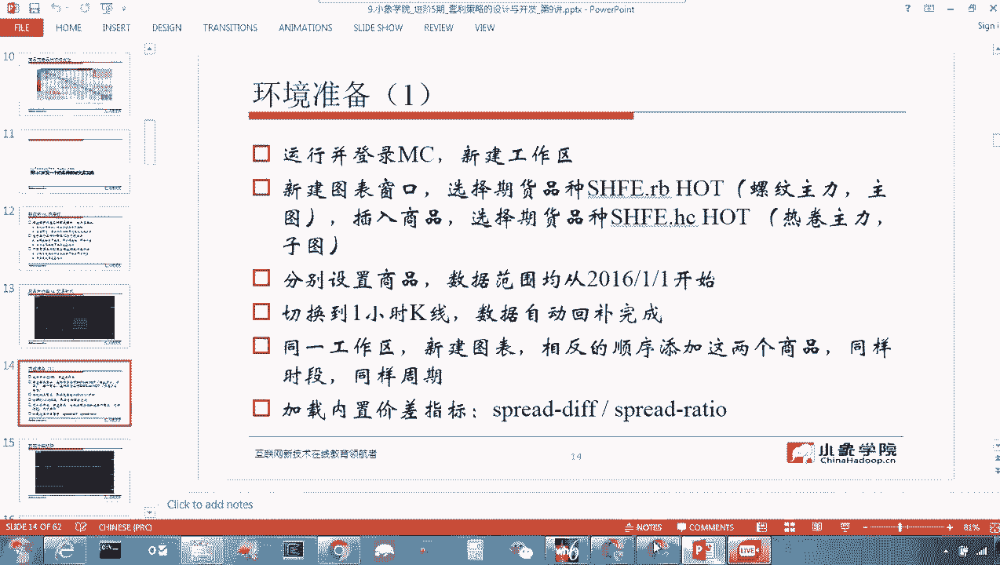

MC的话呢，如果同学们已经下载过的时候呃，下载过的话，你会你会知道说呃是大概这么一个界面啊，打开以后是一个主窗口呃，当然它会默认加载一个工作区，我现在把它关掉了，还有一个小窗口。

因为我们现在下载的中国版，它有个中国版的一个插件，那这个大窗口呢它是它是国际版通用的啊，通用的功能，这个小窗口呢，它是面向中国的国内市场做的一个对接啊，做的一个插件，那么通过通过这么一个小小程序。

然后它可以对接国内的期货市场，当然也可以做股票，它可以做股票，还可以做期权，拿不同的小版本，所以呢就这两就这两个工具，同时要同时会使用好，我们先呃这个具体细节，一会用到这个小窗口的时候再说啊。

好我们先看一下我怎么去呃去去做一个策略，首先我们先建一个环境，那么大家还记得我之前课上给同学们讲的，这个TB这个平台对吧，那么TB呢它是一个图表化的交易系统，那么今天用的这个平台呢叫MC。

它同样它同样也是一个图表的交易系统，那图表的交易系统它的一个使用的啊，典型特征就是说我要把我要交易的这个品种的，K线图先加载上来对吧，然后呢编写一段策略，然后再把这个策略加载到这图表上来，然后去执行它。

就可以完成一个自动化的交易了好了，那现在我们先看怎么去建一个图表，我在在这个MC的主窗口里头，先选文件菜单，选一个新建啊，新建一个工作区，好新建工作区，这个它就它就会打开一个。

这底下有一个有一个tab啊，有一个页面，然后呢在这个上面我可以去，然后我可以点右键，用鼠标点右键，或者我直接敲键盘的insert，就可以插入一个图表窗口，好，我现在点右键插入一个图表。

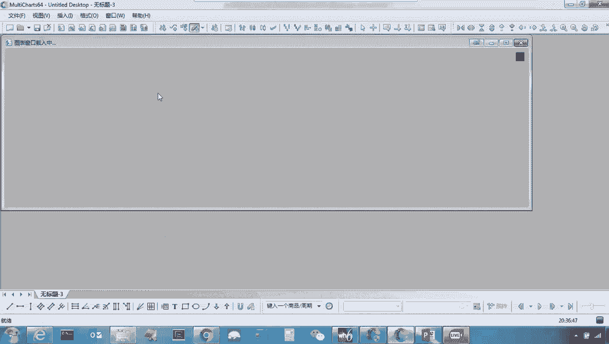

这个时候呢它就会打开一个窗口，让我去选择我这个图表窗口里要要加载的，这个要交易的品种，那今天我们举的例子呢是用期货，我就选期货这个类别，然后呢切合雷别率。

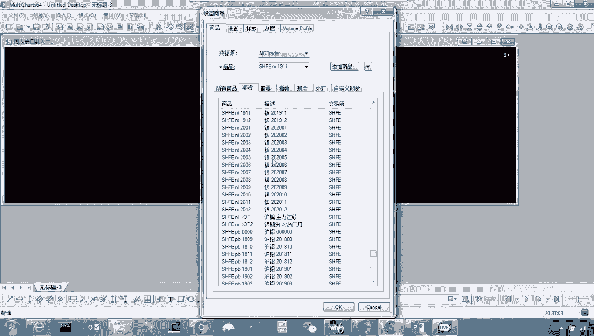

我们要选螺纹钢和热卷板，对吧啊，那么螺纹纹钢和热卷板，我们怎么去去找它的代码呢，那么我们可以从随便找一个行情软件，就能看到啊，你随便找一个行情软件，上次其实我也给大家演示过啊，比如说螺纹钢。

他是上海期货交易所的罗定位到螺螺纹这一列，那我随便选一个合约，选一个合约，我们就都说它的代码是2B对吧，这是螺纹钢的一个代码，那我们就可以到MC这个平台里头去。

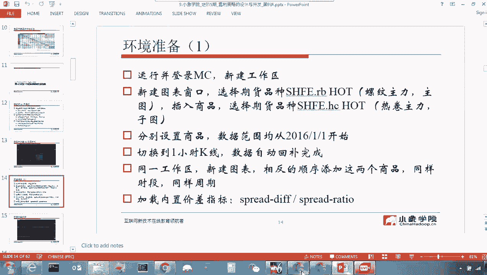

把把螺纹钢加载上来呃，在MC这个平台里头，他用的就是这个商品的合约的呃，命名规则嗯和tb还不太一样，他需要把交易所的名称列在前边，所以所以螺纹钢他是他他所在的交易所，是上海期货交易所。

那上海期货交易所呢它的缩写呢叫上海FE啊，这个这个大家要要习惯这种这种做法，那每个交易所缩写是固定的，比如上海交易所就是SHFE，然后加一个点，然后再加上RB对吧，螺纹钢就是RB好了，那么那么这样的话。

它就可以把螺纹钢相关的合约全列出来，然后为了简单起见呢，我们就直接选主力合约，所以我们就直接选这个r b hot啊，这是他的主力合约，选完这主力合约之后呢，我可以在这个设置窗口里头选它的周期。

比如说我们现在呢用的是额，在这节课例子里头，我们用一小时的周期吧，这样就比较容易看，所以我在这里选周期是一一小时，一时啊，就是一小时的意思，然后呢我再把它的K线再多加载一些，比如我从2016年。

2016年直接敲就行，1月1号一直到现在好，其他的什么这个样式啊，刻度啊，这这个默呃都默认选项我都不改了。

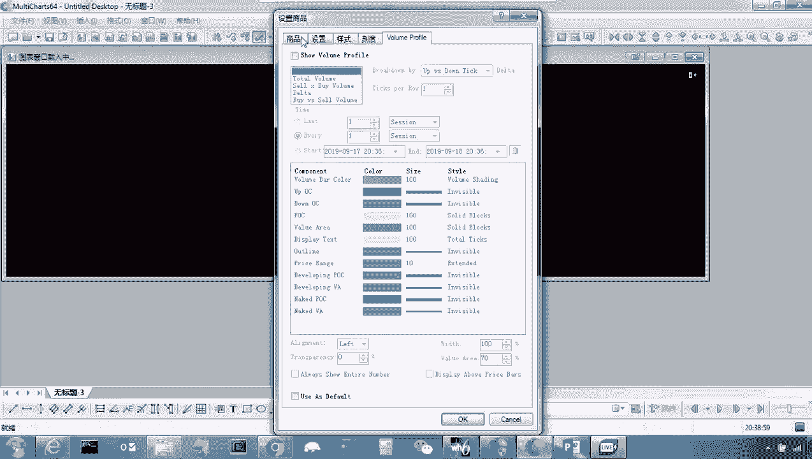

那我就直接选K，这样的话呢他就开始去加载。

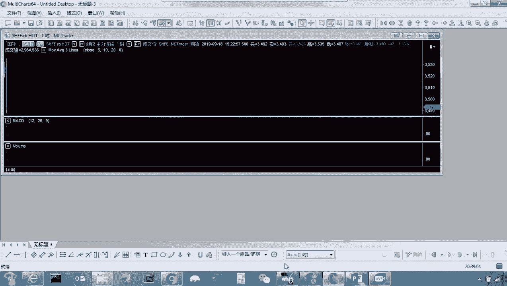

他就去加载这个。

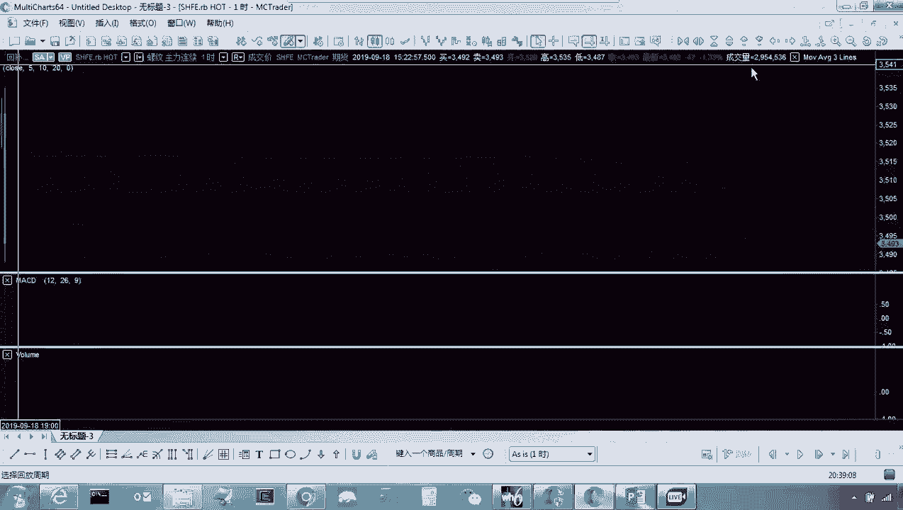

螺纹钢这个品种好了，他现在就把螺纹钢在历史上的小时级别的K线，给我加载，加载上来了，我可以用这个CTRL箭头可以缩小，我可以看一下啊，可以放大缩小对，这就是它的整个的一个历史K线。

我也可以去把这个屏幕这个窗口拖动一下，好，然后它默认的会加载上来一些其他的指标，这个指标我们暂时不用，我就把它关掉，比如说这有成交量volume，这有个叉把它关掉，还有MACD关掉，然后呢。

还有说它默认加载了一个，就是三条线的这么一个移动均线，我也不用把它，也也把它关闭掉，这样我就干干净净的，就剩一个裸的K线，那么这个呢就是螺纹钢的一小时的K线图，好但是因为我们现在要做配对交易。

配对交易是什么概念呢，♪ 配对交易 ♪，就说我们要需要同时交易两个品种对吧，所以在MC这个平台，如果你要做配对交易的话呢，你是需要把两个品种，同时加载到一个图标里头来，所以呢我在这个是在这里头。

我再插入，我在屏幕上点右键，我再插入一个商品，所以我需要同时加载两个商品的K线序列进来，才可以完成一个配对交易，所以呢我点右键再选一个插入商品，同样我再插入第二商品。

因为我现在要和螺纹钢配对的商品叫做热卷板，那热卷板的代码是HC啊，我所以我叫上海F1点HC我还是选hot，就是主力连续合约，同样它也是一小时周期，然后呢从假如从16年开始吧，将来3年左右的K线数据。

Ok，好这样他在显示回补，在屏幕上显示回补，那说明什么，他再去服务器上去加载这K线的历历史数据，好，这样的话呢，我们就我们就能看到说屏幕上我们可以看到啊，上面这个叫做RBS。

上海期货交易所的r b hot，下面是hc hot，这所以这是两个，两个我们要交易的品种都被它加载起来了，好那么这个准备工作我就做完了，现在呢为了大家直观起见的话呢，我先加载一个。

就是说呃你可能会关心说这个价差，因为我们现在做配对交易，主要是观察两个商品的价差对吧，那你会关心这个价差怎么来的，那么现在呢在MC这个平台里头，它就有一个内置的一个价差指标啊。

叫做spread def或者叫spread ratio，我把它们加载上来，我们看一眼，好我在屏幕上这个窗口上点右键选择插入指标，这样就打开了一个指标的列表啊，公式管理器啊，其实类似，只不过叫不同的名字。

那么我从这个指标列表里头找到spread daf，这个这个指标把它OK，把它加载上来，默认这个我先是什么都不改，我再加载一个插入指标，Spread ratio，这是另外一个指标好了。

我们现在把它们把这窗口拉一下，我们可以看到说这两个指标，两个商品品种，然后有两个指标，那么因为它我现在加载的主力合约，它涉及到一个换月的问题啊，幻月它有跳变，这个看起来啊不太直观，我把它往前往前拉一拉。

找一个连续的地方对，假如说在这个在这个这一段，我们可以看一下，那我现在如果说鼠标，鼠标在这个K线上进行移动，我们能看到说在左边这有个数据窗口，会显示说我当前这个这个调呃，当前这个日期。

这个时间所在的这各个窗口里的数值对吧，一个呢上面是RB它的高开低收，就K线的这个价格，还有HC的开高低收，还有下面这spider def和spider ratio，就这两个这两个价差价差序列。

那么这个加查序列是什么呢，这个spread dave呢相当于是用第一个频，第一个啊，商品的价格收盘价减去第二个商品收盘价对，假如说我这鼠标停留在这个地方，那我们可以看下屏幕上，屏幕上第一个商品。

RB的收盘价是3382对吧，然后HC它的收盘价是3294，那么下面这个兑付呢就是这个嗯就是，啊我看啊这是R2对，86对吧啊八十八十八对，所以就相当于是说把第一个收盘价减去，♪ 第二个收盘价 ♪。

然后就就是下面这个对付这个曲线，就是这个红色的这个曲线，然后再下面呢这个黄色的曲线呢，实际上是它俩它俩它们两个的比值对吧，用第一个用第一个价格去除以第二个，所以当我们去去计算价呃。

去去做一个配对交易的时候呢，我们既可以呃用这两个价格的相减，也可以用用用这两个价格去相除，或者说给他们加一个权重啊，乘一个倍数再相减等等，那所以说我们去构造一个价差，有有很多种方法都可以。

所以这个大家在使用的时候，要具体的去灵活的去去去使用好了，然后呢我们看一下这两个公式它是怎么写的，那么我们要看这个公式呢，就这两个公式啊，呃就是不叫公式啊，叫做指标吧，在这MC里的术语叫做指标。

就他是怎么写的，一般呢我们会打开一个公式编辑器，公式编辑器呢可以从这个地方进一个呢，是从主窗口，这有一个啊，下面有一个图标，就写着FX的这个小图标啊，这是打开一个公式编辑器窗口的啊，这个工具按钮。

我们或者是从这个，或者从刚才我说的这个下面的这个小窗口里，这个小工具条里头去找，这里头也有一个FX这个按钮，这两个是同同样的功能点，它就可以打开一个公式编辑器好了，打开公式编辑器之后呢。

我们就可以去去从他这个信号列表里呃，不是信号，它是要指标，从指标里头，把刚才我们加载那个spread df和spread ratio，把这两个函数，把这两个公式都打开，我们能看到是非常简单的。

这两个呃语法是非常简单的啊，那么这个语法呢就是MC自己的语法叫easy language，所以对这个如果是同学们课前没有预习过，这个平台，它的编程语言的话呢，你可以去啊，你可以去抽空去去看一下啊。

去看一下，他应该有联机帮助。

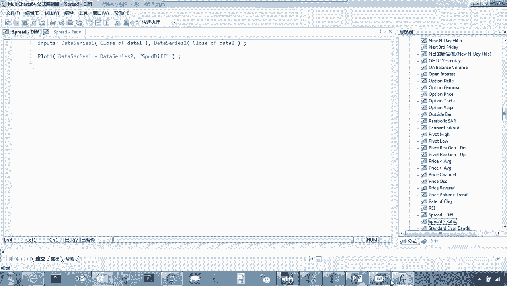

网站上也有他的这个语法手册去下载，就是这个大家可以从从这主窗口里看这个MATCHA，帮助啊，所以在这里头呢它会有一个power拉的位置啊。

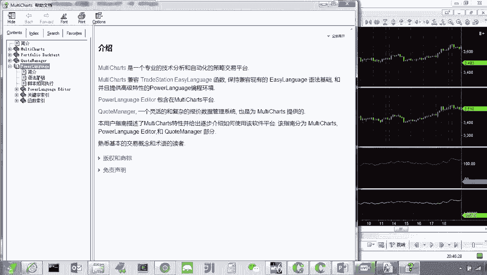

Parlanguage，这里头这个会会讲一些它的语法的一些要素，还有包括常常见的一些函数啊等等，那么这个同学们课下可以自己去去做一做，一个学习啊，好那么我就不花太多时间在这语法上。

那么这节课主要是带着大家去看一个，主要的一个过程，所以更细的东西呢需要大家课后再去啊，去去自学一下好了，那么在假如说我们看这个价差，两个价格相减的这个这个公式是怎么得到的，它首先是指定一个输入参数对吧。

一个叫做data series1，一个叫做data series2，也就是说它这个公式，首先呢是把你加载到窗口里的窗口里的，这个第一个，就是第一个窗口里的这个价格序列取出来。

然后还有第二个窗口里的价格序列取出来，然后把它相减，就是data series1减去data series2，把它们两个相减得到的就是他俩的价价价差，然后把它画出来，用plot plot命令把它画出来。

就这么简单好，那我们看它这个语法，那么第一个参数指定的叫做close of data1啊，那这个data1还有包括说这个close of data2，这两个是我们怎么理解。

我们回到这个回到这个主窗口里头，我们点右键看一下这设置商品，大家看一下设置商品啊，就相当于对我加载这个品种，做设置的这么一个窗口，我们能看到说它这个商品我现在加载了两个，是两个商品，这个或者叫两个合约。

两个两个K线序列，那么一个叫RB，一个叫HC，他这有前面有一个数据编号，一个是一，一个是二对吧，那么这两个数据编号就对应着，就对应着这个MC这个语法里的data1和data2，所以在MC这个平台里头。

它对他对这个数据的编号是从一开始的，跟TB不一样，那TB大家想先回想一下，它的编号是从零开始的啊，细节可以自己再去查语法手册，所以这个加载到整个这个图标里的，第一个窗口里头的序列，它叫做data1。

第二个序列叫做data2好了，那所以所以close of date1是什么概念，就是第一个子窗口里的，这个K线序列里的收盘价对吧，我们可以看到说在这个窗口里头，每个窗口里头左边这不都有开高低收吗。

有这四个有这四个价格，还有当然还包括成交量等等，所以呢所以他刚才语法里的close，实际上就是提取的第一个窗口里的，每一根K线的这个收盘价，就是这个收盘价这个序列，那close of date，二呢。

实际上就是取提取的是第二个子窗口里的，这个每一个K线的收盘价好了，所以从公式来说，他把第一个窗口里的每一个K的收盘价取出来，作为他的第一个参数，把第二个窗口里的每一个K呢升分量取出来，作为第二个参数。

然后之后呢他在他的这个指标里头，把第一个参数减去，第二参数，就是相当于把两个K线序列的收盘价相减，得到的这个线，这个线就是它的价差，然后他把它用plot命令把它画出来对吧。

那么就是我们从屏幕看到的这根红线，就是就是这两个价格序列的这个价差，然后呢我们再看第二个指标叫spread ratio，就刚才我给大家打开的第二个指标，同样这个参数还是第一根K线的收盘价。

和第二根K线的收盘价，但是呢他现在要做的事儿就是把它俩相除对吧，用第一根K线的收盘价除以第二个收盘价，第二个K线的收盘价得到了这个叫spread ratio，把它也画出来。

那么这个就是我们屏幕上所所显示出来，这个黄色的线，所以这是两种价差的计算方法，♪ 一个是相减 ♪，一个相除都可以啊，好了，那么我们现在来观察一下，我们来观察一下这两个窗口。

比如说我现在我可以现在用这个control减号，把它缩小，或者说用屏幕的这个或者用屏幕上这个按钮啊，可以把它们进行这个放大缩小，好我们来观察一下啊，这样呃为了简单起见，我先把这个我先删掉一个啊。

我先删掉一个咳，呃一个指标我只保留其中一个啊，只保留这个相减的这个为了为了直观起见啊，好然后呢我们把它们把它们缩小，我们能看到说这个价格，我们能看到说这两个品种，它们的这个价差序列。

基本上在一定的范围内进行波动，对不对是吧，还是比较明显的一个波动范围，那这样的话呢我们可以可以大概平均验值，或者说我们做一个统计去估算一下，他们两个的一个这个价格，就他俩价差的大概的一个分布范围。

比如说大概就在这个-100左右，这可能就是它的一个平均值对吧，这是它的一个平均一个价差的一个波动范围，大概在-100左右，然后呢如果说哎这个波动如果这个价它特别小，那么这个时候我是不是可以去入入场做多。

这个价差对吧，那如果这个价差现在假如位于这个区域特别大，我是不是就可以入场去做空这个价差对吧，所谓的做多价差是什么概念，是不是就代表说我去做多第一个品种，同时做空第二个品种，这就是代表我做多这个价差。

♪ 那如果做空这个价差 ♪，那或者叫反向套利呢，就相当于我去做空第一个品种，同时做多第二个品种对吧，这就是我，我这这节课要给同学们演示的第一个例子，就是我们如何去构造这么一个呃一个价差序列。

然后根据这个价差序列的变化啊，价差序列的一个特殊的取值范围，然后来来判断有没有一个配对交易的机会好了，那么这个基本原理就是这样了，下面我们就看看从程序上来怎么去去写，好刚才我给大家讲的原理呢是这样的。

也就是说我通过观察这两个品种，它们价格，它们价差大概是在一个有限的这么一个区间内，来回波动对吧，那如果说波动特别靠下，我就是入场做多这个价差，如果波动的特别靠上，我就是入场做空这个价差。

所以就是简单的设定了一个上下的边界，然后超出这个边界我就入场，就是给我的一个配对交易机会是吧，就这么一个简单的原理好了，所以我们现在看看，所以现在给大家简单讲第一个方法。

就是我先简单的设置一个上下边界阈值，怎么去做，嗯好了，现在我们来写一个自己的指标，怎么去写自己的一个指标，那么首先我从公式编辑器啊，大家注意我这是公式编辑器窗口啊，不是MC主窗口。

就是刚才通过这个工具条，通过工具墙，这FX这个图标打开的这个公式编辑器，那我在这里头先先新建一个新建一个指标啊，新建一个指标，选择文件菜单，选择新建，那么大家要注意这个新建这个这个菜单嗯。

出来之后有三个类别，有函数指标和信号，这几个是不一样的，大家要注意啊，这这几个类别是不一样的，那么这个MC和tb是有些区别的，那函数大家可以完全可以理解，就是系统内置的或者你自己编写的。

编写的一个最小的这么一个一个模块对吧，你可以被其他的程序来调用这函数，这个不需要多解释，那指标和信号有什么差别呢，指标啊，在MC这个平台里头，指标主要是用来在屏幕上做一些计算的，就计算你的各种。

就是各种技术指标吧，做技术分析的，然后同时呢可以在屏幕上画图的叫做指标，所谓画图就是用用那个plot命令啊，plot就可以把，就相当于我可以在屏幕上画了个曲线。

就是我能够通过plot命令把这种曲线画出来，这种这种我们一般叫做一个指标，那信号是什么呢，信号是用来做交易的啊，做交易就是产生这个产产生委托单的，比如说就是做一些买买卖指令啊，比如说买呃，我去开仓平仓。

然后做多做空对吧啊，那么这些交易指令，这个呢是要在信号里头去编写，所以在MC里头，指标和信号它是分成两类的，这个大家不能用混，也就是说，如果说你在指标这种这种公式里头，用到了新号的函数。

它或者编译会报错，或者加载起来就是加载不成功，如果在信号这种类别里头的公式，你用到了plot命令，就是指标的那个plot命令，它也会使也会编译出报错对吧，所以这是这是MC平台的一个特殊的规定。

但是在TB平台里头呢，你是可以把画图的和交易的命令写在一起的，对吧，所以这是各个不同平台，他们啊使用风格上的差异啊，无所谓好坏，那只是它的不同风格而已，大家要注意啊，这些细节你要不注意的话。

将来使用的时候可能会出现一些问题好了，那么现在呢我们就来编写一个自己的一个指标，那么我们从公式编辑器里头，先创建一个指标点确认，然后我们输入一个名字，比如就叫啊spread version1啊。

随便起个名字，OK确认，这也就是一个空，这也就是一个空的，就是一个空的一个啊公式，那么现在呢我就可以在这里编写代码，比如说我先啊input啊，Input，比如说叫啊，我看一下啊。

对呃现课上给今今天课上讲的所有例子，我也得给提供代码，所以大家可以去照着这个去去，直接把它加载上来也行，或者自己敲也可以的，为了省时间的话，我就不逐行的去敲了，那么我给大家提供代码呢分两类啊。

一类是跨品种的，一个是跨期的啊，跨品种呢其中我还提供了两个版本，一个叫V1，一个叫V2，那我们先看看V1，先打开第一个，那么这个呢这个就是这个就是他的，代码我把它拷贝过来，直接贴上来好。

然后就就呃这个代码拷呃，你自己敲也好，♪ 或者拷贝过来贴过来就行了 ♪，然后呢，这个呢代码我我先跟大家说后续怎么操作啊，然后呢我把这个代码把它保存一下，然后呢需要做一个编译。

做一个编译以后才可以去加载它，所以我从编译菜单选择一个编译啊，这叫spread version1，或者直接敲F3的按钮也行，编译完了之后，他在底下这个显示它会有一个有一个显示啊，告诉我编译的结果啊。

编译成功没有没有报错，然后这样的话呢我从这样的话，我从这是我的这个呃列表里头，从这列表里头就能看到从这个右侧啊，这个导航条里头，指标这个这个类别下边这叫指标。

这个类别下面就能看到说spread v version1啊，这么一个公式就产生了，然后呢，之后我再回到我刚才创建的这个工作区里头，选右键插入一个指标。

然后呢把刚才我新创建好的这个叫spread version，一选中，OK把它打开，我们就能看到说我们创建的这个指标，就被加载上来了，对吧，那这个指标其实和刚才系统自带的那个，是是一样的。

我们能看到说它它本身这个价格，这个价差序列我已经把它计算出来了，同时呢我还额外又画了几条线，这个一会再说好，那么这个指标就是我就是我后边呃，要做一个配对交易的一个依据好了。

那现在我们回到公式编辑器里来给大家讲讲，这个这个指标的语法到底是什么样子啊，我们看一下，首先这个data series1和cs2，这个和刚才啊，我给同学们加载的系统的内置指标是一样的啊。

一个是叫一个叫一个是第一个K线图的收盘价，一个第二个科研的收盘价，同时设定了两个阈值啊，一个叫up threshold，一个叫lower threshold，就是上轨和下轨上下边界。

然后呢我定义几个变量叫variables，那变量是呃，就是也就是说在MC里头，你用到的每一个计算的变量，都需要去去定义一下啊，这个语法要求是一样的，你所有的变量必须先声明一下，然后呢。

我就把他们首先把这两个收盘价序列，做一个相减，叫做def对吧，同时呢同时呢我去我就把把这两个上下边界，两个域值给他们求，把他们求出了一个一个中间架对吧，就是用最低最低下轨，加上他俩的一个平均价等等。

那么这个呢呃就是我的一个啊，一个平均水平就是价差，我认为价差一个平均水平就上下轨嘛，因为上下轨我现在因为刚才我们通过观察发现，好像他们两个价格啊，就中中间点不恰好不是零啊，不不恰好是零。

所以呢我需要算一下它的那中轨所在的位置，通过这么一个加减法把它算出来，算来之后呢，我就把这个价差序列，还有把我的上轨下轨，还有中间这个平均平均价，把它们全画出来啊。

用plot1234这个命令把他们画出来，那么这样的话我们看到的就是屏幕上的，这屏幕上这个这个线的样子，我先把它放大啊，在屏幕点右键最大化这个子图啊，我们就能看到说这个价差序列。

假如说是在这么一个范围内进行波动，那么我现在上轨就是蓝色的，这个线就是我刚才定义的这个ARUSRESHOLD的，然后这个呃这个青色的啊，浅蓝色的，这就是up呃，LOISRESHOLD就下轨。

然后中间这黄色就是我中间算出的，这个SLOO啊，就是随便起的名字变量啊，这就是中轨，所以呢我们看当我把这这几条线画出来之后，我们就可以制定这么一个策略，那么每当我的这个价差序列。

超出这个下轨的范围的时候，我就去做多塔，然后价差超过上轨的时候，我就去做空这个价差对吧，然后呢，当这个，当它这个价差回归到中间的这个位置的时候，我就把当前持仓平掉，就是多头和空头两边同时平掉。

这样的话呢，我就可以获得这一段这个价差的收益对吧，这个从原理来说是就是就是这样比较简单，好这是这是一个一个操作的过程啊，就是我怎么去编写一个公式，然后同时把它加载到我的图表上来。

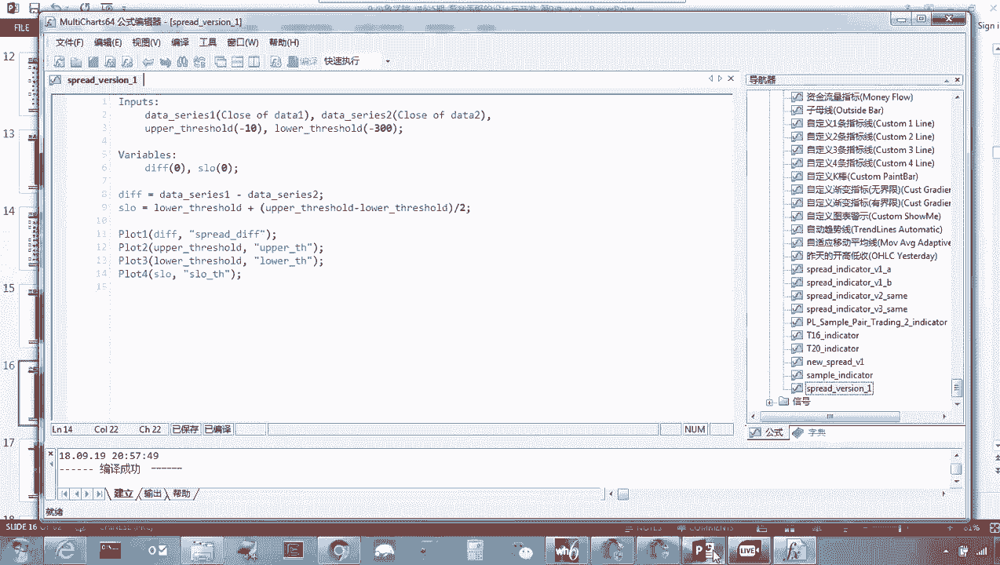

但是另外一个在MC这个平台，还有一个另外一个就是一个特殊的地方，也就是说当你去去做交易的时候，只能是对第一个子窗口下单，你不能同时操作这两个窗口，所以这是一个特殊的地方。

但是因为我们这节课我们要做配对交易对吧，我要做配对的话，我必须得对第一个品种下单，同时也是第二个品种下单，但他俩方向相反，那这种情况怎么办呢，那那么这种情况我们就只能说做两个，我们就只能去做两个窗。

就两个图表，然后呢加载同样一个策略，然后让这个策略在同时触发这两个窗口，不同的触发啊，触发这个信号，所以呢我们现在怎么做呢，看着啊，就是我刚才是先先创建了一个图表，然后呢先加载螺纹钢和热点板。

那么现在我现在在再创建一个图表，但是加载顺序相反啊，我先加载这个热点板。

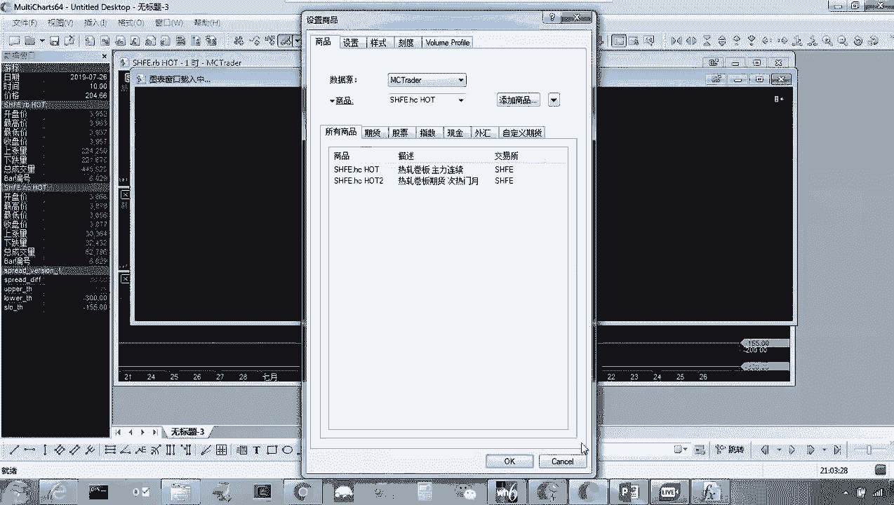

好然后把这个商品加载上来。

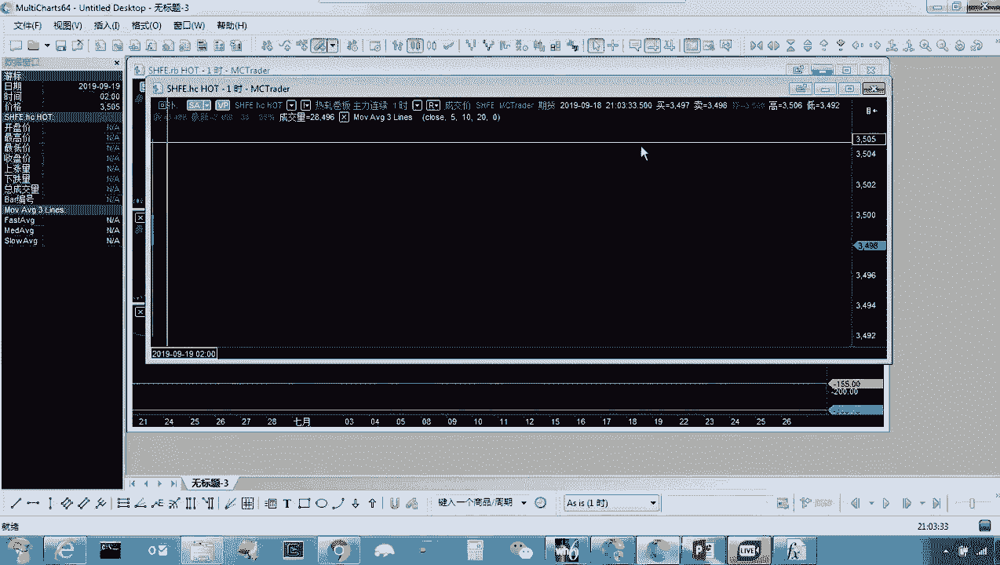

把无关的这个信号删掉，然后呢我我再插入另外一个商品，就是螺纹钢，好大家可以看到说我现在插入的这个商品，我现在插入的这个商品的顺序，是跟第一个窗口是相反的，但这个时候我可以再加载一个。

同样再再插入刚才那个那个呃这公式啊，比如叫spread version1，然后把这两个窗口排列一下，我们能看到我们能看到什么呢，这么对比一下，你就就就就很清楚了，现在呢我这个窗口，我这个窗口里头。

两个窗口左边的窗口先加载螺纹钢，再加载热卷板，右边的窗口呢是先加载热卷板，再加载螺纹钢，但是底下我去加载的这个指标，和我后面要加载的交易信号，这两个其实是一样的，那么这种情况下呢。

比如说因为他这两个两个窗口里，K线图的走势是一样的，但是它俩相反，加呃加载顺序相反的，所以呢，如果我的一个一个交易信号在这个窗口产生了，那同时在另外一个窗口也能产生它俩对称的啊，大家注意它是对称的。

也就是说左边这个这边的交易信号，只能是对第一个子窗口，也就是螺纹钢进行下单，右边的这个信号只能是对第一个窗口，也就是热点板下单，这样的话呢，因为他俩走势同时发生的，所以这样的话呢当一个信号产生的时候。

那么这两这两个品种就是同时被触发了，所以呢而且对这两个先我从信号的写法来说，要一个是做多，一个做空对吧，所以这种情况下呢，那么就就可以实现了，一个配对交易的这么一个动作，就两条腿同时被触发。

好那么这个呢现在就就这么一个工作过程啊，大家记住就是同时开两个图表，然后呢，每个图表里头就是用，就是用相反的顺序加载两个两个品种，然后之后加载相关的两个公式，这样的话就可以同时触发这么一个配对。

交易好了，那么现在啊就是为了就是，呃简单起见，我还是把我我预先啊加在已预先写好的公式啊，直接给它加载上来啊，同学们就是可以就按照我刚才说的动作，可以自己去构造这么一个工作区。

我重新加载一下我的这个工作区好，从公式来说呢，公式来说，我给大家提供的这个代码有两个啊，一个叫做signal，我们可以从，我们可以把它们分别导到这个，公式编辑器里头来，还有一个叫信号叫signal。

好这样的话呢大家就是说呃你去嗯编写一个，是去编写这个公式的时候啊，就按照我刚才操作过程，然后还有一个呢就是构造这么一个工作区域，去加载不同的图表的时候，也是按照，也是按照我刚才给大家说的这么一个过程。

然后呢这个源代码我已经提供了，所以同学们分别把这个把这几个代码，把它呃在公式编辑器里头去创建新的公式，然后把它把它导进来保存，并且编译就可以生效了好了，那么我再多花点时间给大家讲一下。

具体的这个这几个代码啊，就是说指标，那么我们通过这个指标来计算，计算这两个价格序列的呃价差，然后呢，然后呢把这个价差还有我的上下轨的边界，还有一个中间的平均值，把它们都都把它们都给它啊，画出来啊。

还有一个是我要做交易对吧，我要做交易的话呢，我就得要创建创建这种信号类别的公式，信号类别，因为我要产生交易函数，创建一个新号，然后呢再把我这个里头就是带signal的这个代码，把它也导入到公式里头来。

那么导出来是这个样子，大家可以看到说指标的这个指标的这个公式，和这信号的公式，两个前面是指几乎完全一样的啊，几乎完全一样，但是在这个信号的公式里头呢，我是把这个画图的这部分代码是注释掉了。

因为如果是在信号的啊，这个公式里头含有画图的指令的话呢，它会编译通不过的好了，然后呢，那但是呢在信号的这个版本这个公式里头呢，后面多出来的这一块啊，就是我的下单指令，下单指令就产生交易的地方。

我们可以看一下啊，看下来读一下代码什么意思好了，如果你大家看if market position等于零，那这个market position其实和tb那个版本用的呃，函数是一样的，什么概念。

就是我当前持仓状态对吧，market position等于零，也就是说如果当前我没有持仓的话，如果我当前没有持仓啊，并且呢当前这个兑付就是这个价差大于up，RESHOLD就大于这个呃。

是这个检查了一个上轨，就上边界这个阈值的话，那么我就sell short介绍的什么概念，就是开空仓啊，空头空头开仓，这个next next bar at market表示说我在下一根K线在触发。

就当前这一根K线走完，在下一根K线开始的时候触发，那么这个呢是MC特殊的语法啊，因通常来说我们都会这么写，这么写是为了避免信号闪烁的问题啊，什么叫信号闪烁呢，这个我在上上节课也给大家提过。

然后呢在下节课呢老师也会给大家讲，就是一些实盘中的一些注意细节，那摄像闪烁什么情况呢，呃呃到时候再给大家解释这概念，总之就是说呃我们就可以先这么记住，就这么写就好了，所以呢。

当这个价差价差大于某一个上边界的时候，那我就是入场做空它，然后呢当这个价差小于下边界的时候，我就是入场做多ta啊，这是这是一个逻辑，还有逻辑呢是说如果market可针等于一对吧，也就是说。

如果当前我的持仓已经是持有多头的状态，假设我已经入场做做多了这个价差，那么下面就是说如果这个def啊，这个价差crossover s l o，就是说如果我现在已经做多了某一个价差，什么概念。

是不是说明之前在某一个时刻，这个价差曲线是低于下轨的对吧，所以我才入场做多这个价差，那么在某一个时刻，他他必定会上穿上穿，穿过中间这个这个线，我们来看这个图，比如说某一个时刻我已经入场。

然后在这个地方价差低于就下轨的时候，我肯定是入场做多了对吧，那么在某一个时刻，当我这个价差曲线回到中轨的时候，也就是上穿这个黄线的时候，那么这个时候我就要平仓，所以从公式理论来看。

这个cross over这是MC自己的语法，就是表示说这个序列啊，从下面向上穿过另外一个序列好，那如果说这个价差序列，从下往上穿越了这个黄线的时候，那我就sell啊，我的SL就等。

就是相当于把把原来这个by by指令，就是做多这个价差产生的那个头寸把它平掉，然后另外一点呢就是如果当天我持有一个空头，也说在某一个时刻入场去做空了这个价差，比如像上面这种情况，如果说如果说我这个价差。

在某个时刻入场做空了，那么将来在某一时刻，他从上往下穿越这个黄线的这一瞬间，我就把他的头寸平掉，所以说在这个代码里头啊，如果Mac本身等于一，表示现在持有的是一个空头的头寸，并且呢这个DF曲线就是价差。

cross under结合cross over是对对称的啊，cross over是从下往上穿，cross under是表示从上往下穿越，从上往下，那么这个时候我就by to cover。

就表示平掉我的空头头寸啊，拜托看我评的空头头寸好了，那么这个呢就是就是其中一部分啊，那么我们再看还有另外一个我给大家提供，还有另外一个程序，就V1这个B啊，就一个A1个B。

这两个从从那个从代码来看是几乎完全一样的，但只不过它的阈值是有差别的，大家看一个是一个是正的，一个是负的，并且他俩我把它调个个来了，为什么为什么这么做，是因为因为现在我需要在两个窗口里头。

我现在需要在两个窗口里头加载这个策略对吧，加载这个交易信号，那交易信号怎么加载呢，刚才我只说了加载这个指技术指标，那么加载交易信号的话，我就点右键啊，插入一个还是插入指标，但是在插入指标的时候。

我选这个信号类别啊，就带交易指令的这种信号，选教育类别，然后把刚才我创建的这个spread，V1A或者V1B，分别插到两个不同窗口里头来，然后他就会在屏幕上把我的交易信号画出来。

那么这个工作过程其实和之前给大家讲的，TB是很类似的啊，虽然界面不一样，但是工作过程是一样的，我再插入一个信号的话，他就会把交易信号在屏幕上给我显示出来，好了。

那么我们看这个signal v1A和西格玛V1B，他们两个差别只在于什么呢，只在于只在于我这用的这个阈值是不一样的，为什么我要设置两个信号呢，是因为刚才我也跟大家说了，我现在如果要做配对交易。

我如果要做配对交易的话，那么这两个这两个窗口，这两个商品加载顺序是相反的，那么我的触发时机，我是要在同一个时刻去触发对吧，那么也就是说我要保证说在某一个时刻，第一个窗口触发它做多。

同时另外一个窗口就做做触发做空，所以这两个窗口它所对应的代码基本是一样，但是因为它但是它用的阈值是是相反的，所以他俩触发的时候是同样一个时候触发，但是但是是啊这边这边窗口触发做多的时候。

这边要同时触发做空啊，所以说大家看我这个写法，就是用这两个阈值把它颠倒过来啊，因为这样的顺序也是相反的，这两个阈值颠颠倒过来，所以恰好是能够保证说达到这个效果，我们可以随便找一个。

我们可以随便找一个呃信号来看一下啊，好我们可以看到说在某一个时刻，同样一个时间，因为我这两个窗口加的顺序相反，所以我们看看它们，你加载这两个线啊，就这两个算式价差价差，这个这个序列恰好它它是对称的。

它恰好是对称的，然后呢在某一个时刻，在某一个时刻，比如说我的这个左边的窗口，这键盘曲线向下穿越了下轨，那么这个时候我就要去做多对吧，所以产生一个半信号，但是同时呢在右边的窗口，那在同样时一个时刻。

因为它是对称的，所以恰好在这个时刻，那么这个交叉曲线向上穿越了上轨，所以这时候我要做一个short，我要做一个开空的操作，但所以他们同时操作第一个窗口，但是因为第一个窗口加载顺序是不一样的。

所以呢左边这窗口是对RB这个品种做多，同时呢右边这个窗口是对HC的窗口，这个窗口做空，所以这样的话呢，恰好是在同样一个时刻触发了啊，♪ 这个信号的交易 ♪，但是呢他俩占他俩的交易方向相反的。

一个by一个shot啊，那这样就达到了一个配对交易的一个效果，好那么这样的话通过这么一个过程啊，我们就我们就看到了，说我怎么去构造一个简单的嗯，一个配对交易策略，在MC这个平台。

然后呢从平从那个平图形的，从呃从这个呃软件界面上，我们也能看到说这个交易信号，比如说在这个时候入场做多对吧，然后呢如果往后走过一段时间，咳到了这个时刻被平仓了，为什么，因为在前面前面这某一个时刻啊。

这加勒实验是从下轨穿越了下轨，所以入场做多了，然后到了这个时刻，他从下往上穿越了中间的这个平均值，所以这个时候我要平仓，所以在这个时候sell他俩正好成了一对，正好是一个入场出场。

同样我们看右边的这个第二个品种，也是在这个时刻入场做空，然后呢到了另外一个时刻嗯，恰好穿越了中间这个线，所以在这个时候他是啊，他是平仓啊，平仓出来了，所以他俩是同同时发生，但是方向相反。

开仓平仓都是在同样一个时期发生的啊，所以这就是一个基本的操作过程好了，那么我们看一下，就当我们把这么一个策略做完了之后，我们要评估一下，看看它的效果到底好不好对吧，我们怎么去评估呢。

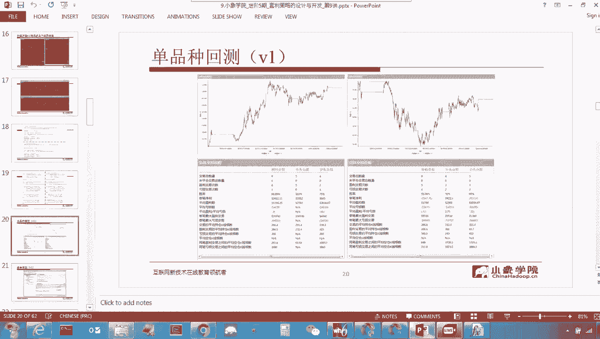

在MC这个平台里头，首先它有一个我们从视图窗口里头看，有一个叫做策略绩效报告，打开这策略绩效报告啊，大家看啊，我再慢一点，在这个视图窗口，视图窗口里头选择策略绩效报告，打开就是当前窗口的一个回测曲线。

然后这有一个绩效概要，后面还有一些更详细的交易分析啊等等，包括交易次数啊等等，好这是左边的窗口，然后我再把当我的额，这是右边窗口，我在现在把焦点放到左边窗口，我再看他的一个绩效报告。

咳咳这是另外一个曲线，这是它的一个回头曲线好了，那么对于一个单一的一个单口策略，我们这么评价就可以了，但是现在我们这节课讲的是一个特殊的地方，因为我们是做一个配对交易，所以必须必须两条腿，就是两两个呃。

品种必须合在一起来综合考虑，♪ 那么这种情况 ♪，我我这我对一个单一的这么一个图表，去评估它的一个迹象就不合适了，所以我必须把它作为一个整体，作为一个整体的组合来看。

那么这个时候我们就需要用到另外一个工具，这工具叫什么呢，叫做啊叫做投资组合交易，叫PT啊这么一个工具啊，这个工具呢是在啊在这个小窗口里头啊，这小工具条里头右面有，大家看这有一个啊。

有这么一个拼图版的这么一个图标点，它打开这个投资组合交易工具啊，pd工具把它启动，这个网络稍微有点慢啊，所以稍等一下好了，启动了之后呢。

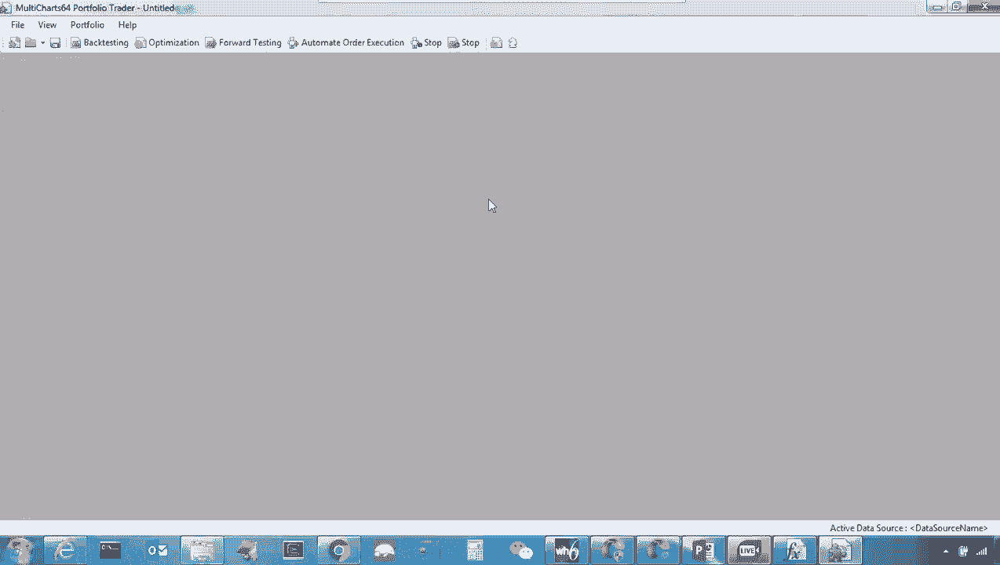

它就会默认先创建一个空的一个投资组合，那么这个时候呢，我们就需要，我们就需要去去在这个投资组合工具里头，把我们的要交易的这两个品种，还有我们加载的策略，同时放到这么一个投资组合里头。

把它作为一个整体来做一个回测，这个得到的才是我的一个绩效表现，那怎么做呢，我们看啊，好在这个上面他有他有这个，就是策略啊，有一个策略下面有instrument，instrument就是我加载的品种。

然后signal就是我加载的策略好了，我可以在这个品种里头先先插入一个品种，就像刚才刚才我给同学们在图表里头做的，做的这个操作是一样的，我先选一个数据源叫mc trader，然后然后到这个期货类别里头。

好把刚才加载的这个上海额RB啊，不是这是不是HC是RB先加载一个2B对，然后呢把他的也设成一个小时的周期，先加载一个品种好，这就相当于等价于，我在窗口里加载了第一个子窗口，第一个窗口。

但同时呢我还要再加载一个复呃，再加载这个第二个第二个品种啊，跟他同一个窗口，所以这种情况呢，我们是在它下面再插入一个这种，我我现在装的是个英文版，叫做information instrument啊。

大家如果是装中文版的话，你看到应该叫一个参考的一个合约，插入这个，好那么在这个里头我同样把这个HC啊，然后一小时把这个加载上来，好这样的话呢我们就看看啊，我们可以可以看到说。

我现在相当于是data1和data2，分别加载了两个不同的品种，对吧，然后之后呢，我们在signal里头再加载我的我的交易信号，ADD signal叫spread啊，signal v1A好。

把这信号加载加载下来了，这里这这一步就相当于我把左边的这个窗口，就这一套连连这个商品的K线序列，再加上交易呃，加加上公式全给加载上来了，下面我们我们再构造第二个窗口，这个窗口现在是组合里的。

也是另外一部分，那我们怎么做呢，从从这个里头他的方略这里加一个策略，加一个第二个策略啊，加一个策略之后，然后在策略里同时插入插入我的呃，亚交易的品种，这个品种呢同样啊，只不过刚才跟刚才顺序相反。

先加载HC1小时好，然后呢再加载RB，然后再加载我的交易信号，Spring v1，这个时候我就加载VV1B了，因为他他俩是对称的，好V1B这样这样加了这么一个信号，然后最后呢。

我再来设置一下我的取K线的时间啊，Data range，比如说我从202016年啊，16年的1月1号到到现在，然后这个交易额我的资金我都都不改，然后当然我还可以进一步的设更多的属性啊，比如说我的交易费。

手续费啊等等，那么这个我先暂时就先先不设了，简单点好了，然后呢我构造好这个投资组合之后，那我我就选BTESTING，他就会去服务器上收啊，去取这个行情，去取这个历史行情，同时呢是把这两个策略啊。

就是我现在是我构造了两个投资组合，把他们合合成一个大的投资组合，来做一个整体的一个评估对吧，因为这个策略是同时触发了两边的交易，所以这样的话呢，我这样他就是把它们构造成一个投资组合。

我这样得到了一个啊一个进一个收益曲线，才是我的一个配对交易的一个，比较合理的一个评估，所以我们可以看到说他的这个走势是这个样子，基本上还是说一个很明显的一个正收益对吧，这个这个结果是跟我预期是一样的好。

那么到这步为止，我们就把第一个例子讲完了，那么大家可以回顾一下，在这个过程中，我给大家讲了怎么在MC平台上，我去通过在公式编辑器里头去创建一个公式，对吧，那么这个公式既可能是这种指标性质的啊。

就是用来画图和计算的啊，还有一种是信号性质的，那信号就是为了产生交易指令的啊，这是这是第一步，第二步呢我们为了完成配对交易，我需要构造两个图表窗口，那每个窗口里头加载的品种是顺序相反的。

然后呢我并分别加载不同的交易策略，使得他们同时触发，但是触发不同的方向啊，这是第二个要点，第三个要点呢就是说我既然是配对交易，需要同时对两个品种做交易，那么我现在就要构造一个投资组合。

把它们作为一个整体来做一个评估，才是有参考意义的，不能把它们两个托马单独做评估，所以说我在投资组合，这个就PT这个工具里头啊，叫做在PPT这个工具里头，构造了这么一个投资组合啊，同时把两个窗口放在一起。

然后对他们做一个综合评价，这样得到的才是我的一个配对，交易的一个绩效表现好吧，所以呢那这样的话呢，就第一部分基本内容我们就讲完了，好那么现在呃我们稍微休息5分钟啊，5分钟之后再回来继续后面的内容。

好了我们现在回来继续上课啊，好，那么刚才呢给大家讲了第一个配对交易的，就是跨品种的配对交易的一个例子啊，那么这个例子呢，从收益曲线来看是是没有问题的，但是这里有一个地方我要跟大家讨论一下。

我们可以看一下，就是从这个总体交易分析里头，能看到总共的交易次数很少对吧，那么其中所有的交易次数总共二十四二十四次，那么也包括多头和空头，实际上是只有12次有有效的交易，为什么会这样对吧。

在我们回测的这3年期间，只有12次交易，这个次数实在太少了啊，为什么呢，是因为我们现在看到的这整个级别太大了对吧，我们如果把这个窗口放小一点，你能看到说整个在这个3年期间，这种大的波动啊。

就是超出就是超这个呃小时线，超出这个我的上下轨的只有这么有限的几次，所以这个次数对我们来说太少了，所以这策略实际上是不实用的，那为了就是为了，但是本身这个配对交易还是一个很好的思路啊，能抓住很多机会。

那为了说创造更多更多的交易机会，我们就要考虑，我是不是可以在一个更小的周期去去做，比如说我们看这个更小的这个范围，实际是是有很多的对吧，实验室有很多的这种小短时间的波动的，那我能不能抓住这种小的波动。

然后在这里头去盈利呢对吧，所以这就是我给大家讲的第二个例子，就是我尝试去沿着它这个波动的方向，就是我不把这个变成一个固定的，上下轨的阈值了，我是随着我整个这个波动的变化，然后我去尝试去去抓住。

抓住他的这个呃价差的一个偏离，偏离一个平均水平的这么一些机会，所以这就是我给大家讲的第二个例子，同样还是跨品种交易，但是是第二个例子，那么这个例子呢，我我给它起个名字叫做布林带通道突破回归啊。

这么一个一个思路，那具体的思路是什么呢，啊我们就直接看这个课件吧，啊因为前面操作过程已经讲了，我就不再耽误时间，直接看课件，那么红色的这个就是我的价差价差序列，对不对，红色就是我的价差序列。

我们可以在它构造一个布林带对吧，那布林带的话，♪ 其实这个概念 ♪，同学们应该已经很就是很了解了吧，这是一个标准的一个啊，就非常常见的一个技术分析指标啊，无外乎呢就是根据根据根据他这个啊。

每根据你这个一个价格序列，算出它的平均值对吧，然后在平均值上下各加啊若干倍的一个标准差，这样就构造出了一个通道对吧，那我现在思路是是什么呢，我现在思路是说我用我现在使用这个价差取。

我把这个价差的这个序列啊作为我的一个啊，就是把价差作为我的一个价格序列，然后根据这个价差来构造一个布林带啊，大家注意啊，这是一个变换了一次，就不是基于K线序列来构造布林带了。

而是根据我的价差序列来构造一个布林带，那么当某一个时刻，如果说如果说我这个价差，突破了这个布林带的上轨或者下轨对吧，比如说在这个时刻他突破了下轨，然后但是他在回来的时候。

就是从从布林带的外边再回来的时候，那么这个时候我去入场啊，去做一个配对交易，那么当当他回到中轨的时候，不停在中轨的时候，那我就平仓，那我就我就相当于持这一道利润，那如果在某一个时，如果突破了布林在上轨。

比如说这个地方，那突破了上轨，然后再从从上上上轨道，再穿越回布林带的通道里头的时候，这个时候我就入场做空这个价差，然后当这个价差曲线回落到我中轨的时候，回轮到我中轨的时候，那么这个时候我再把它平掉。

就获得了这部分的啊利润对吧，那么这个这个原理大家应该明白吧，所以这里头最核心的地方就在于，我构造了另外一个指标，就是一个布林带，标准布林带，然后用价差序列来构造一个布林带，那么当这个加大序列。

突破布林带的上轨或者下轨啊，并且呢返回这布林带通道里头的这一瞬间，我去入场去做做多做多或者做空率价差，然后等到我的价差曲线回到布林带中轨的时候，我去平仓啊，就是这么一个思路好。

所以下面我们看一下这个代码怎么去写啊，我给大家提供的这个例子里头都有啊，那么就是spread indicate version2啊，这个V2啊，一个是signal，所以是是这么是这么呃一个版本。

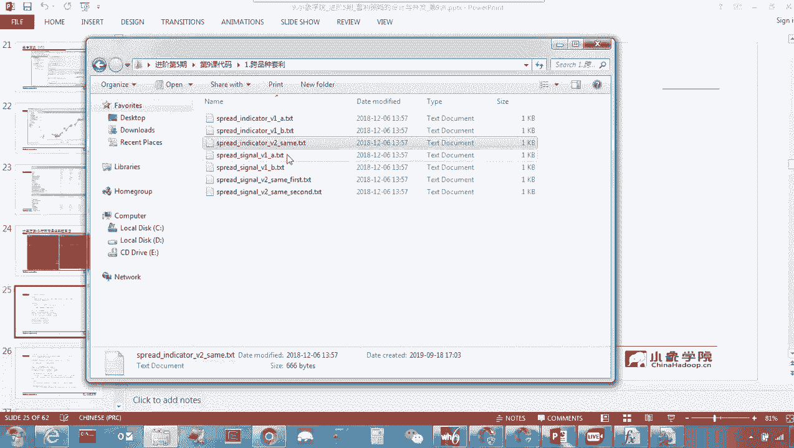

然后呢那为了节省时间的话呢，所有的操作我就都都忽略了啊，我就直接把我已经预存好的工作区打开，那么同同学们，其实你可以按照我前面第一个例子那个样子，也可以构造出一个自己的工作区。

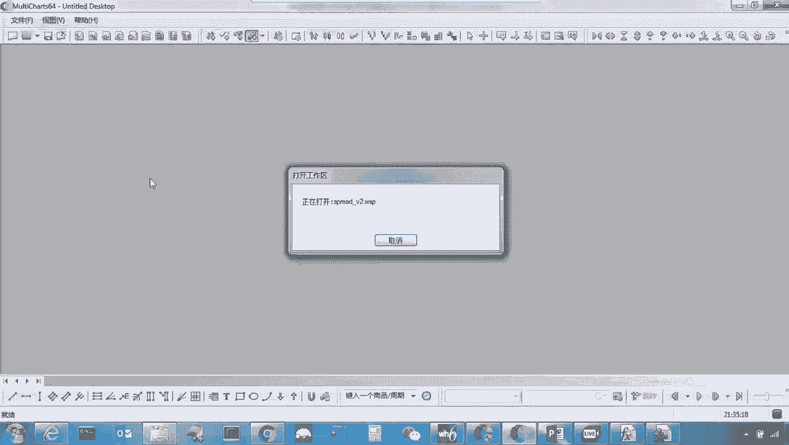

然后呢创建创建这么一个啊公式，然后把公式呃就是指标和信号，再把它们加载到我的这两个窗口里头来，就可以去变成，就可以构造好我的这个运行环境了，那么现在我直接打开这个啊工作区，然后我们看一下。

啊这个要回补数据稍微花点时间啊，那么在等待的时候呢，我直接去把这个公式打开，关闭关闭，零二，好接下来我就呃打开了这个啊，我先给同学们讲一讲这个公式吧，啊就是我这公式怎么写的，一个是指标。

♪ 一个是信号 ♪，这两个前面是完全一样的，后面就是不一样啊，我们先看指标啊，同样我加载加载两个K线序列，然后设置几个参数，然后之后呢把这两个K线序列的收盘价相减，得到了这个DF就是加叉曲线对吧好了。

然后我用这个average fc这个函数，AVFC相当于做求一个移动平均啊，把这个价差序列用20根K线，就20根K线的窗口宽度，求一个移动平均线，就叫做这个布林带呃，布尔布尔middle啊。

布林格middle啊，这个布尔middle这么一个，就是布林带的中轨这条线，然后之后呢我再根据这个价差序列啊，以及这个length这个窗口宽度，就20的窗口宽度，求出它的一个标准差啊。

stand standard的DA呃，deviation啊，标准差叫Y61，然后之后呢把这标准差乘了个二啊，就是说上下呃，把这布雷带设成两倍的标准差，宽度就从这中轨加上两倍的标准差。

和中轨减去两倍的标准差，得到的就是布林带的上轨和布林带下轨对吧，把它画出来，那么这个这个代码应该就是很简单好，那我们看一下，我们看一下这个画出来，布林带这个上下轨是什么样子，从屏幕就能看到。

比如说我现在把它放到最大啊，能看到说红色的这价差价差序列对吧，然后呢这个浅蓝色的和黄色的，那么这个呢就是啊布林带的上轨，下轨中间蓝色的是布林带中轨好，那么这个呢就是呃这个指标这部分，那我们再看信号。

同样前面把玻璃net乘算出来之后呢，我们判断如果当前market本身等于零，表示没有持仓对吧，没有持仓的话呢，如果加差序列cross安under，就是表示从上往下穿越了这个上轨啊。

既然是从上往下穿越这个这个上轨，是不是说明他之前曾经已经突破出去了，那么就相当于从通道外面再回来对吧，那么这个时候我就开空啊，sell short就是做空这个价差。

那如果说它是从下面cross over这个布林带的，这个lower这个下轨的话，那么我就用by这个指令就是买入开仓啊，相当于是做多这个价差啊，这这是这是这是一部分开仓部分，然后我们再看平仓部分。

那如果说当前position等于零，要等于一，就表示现在我是做多价差状态对吧，那么这个时候如果说做多价差的话，如果是说他从下边穿越向上，穿越了这个布林带中轨，大家记住啊。

看这是middle创建中文的时候，那我就sell就得把我的多头的仓位平掉，那如果说它是从上边往下啊，如果现在是持有空头的头寸，就是说明是从上面往下穿越的。

那么这个时候如果说df cross enter这个布林带的呃，Middle，那么这个时候我就拜托cover，就等于把我原来持有的空头的头寸把它停掉，啊就这么简单，所以我们看这个图啊。

所以从从从上面从上轨，从外面穿越回上轨的时候，这时候做空对吧，然后回到在穿越中轨的时候平仓，那如果从下边穿越下轨的时候，那么我是入场做多这价差，然后呢当这价差曲线回到中轨的时候，我再把它停掉啊。

这是这是这是一条腿的交易，再看另外一条腿交易完全一样的啊，另外一条腿也是完全一样，因为它这个版本是完全完全是啊对称的，所以呢我这两个两两边代码是完全一样的，逻辑是一样，但是因为我加载的K线序列是相反的。

所以说左边触发多头，右边一定是触发空头，那同样左边是触发空头，右边同样是触发多头，所以他俩恰好对称，那么这两个交易实际是同时发生的，好了，那么在这个这个时候呢，我们看一下我这里头提供两个版本。

就VR两个版本啊，嗯一个是带止损的，一个是不带止损的，我先把止损的去掉啊，我们编译一下看看，好编译，♪ 编译完之后呢 ♪，那我我在，同样我在啊这个组合工具里头去构造一个呃。

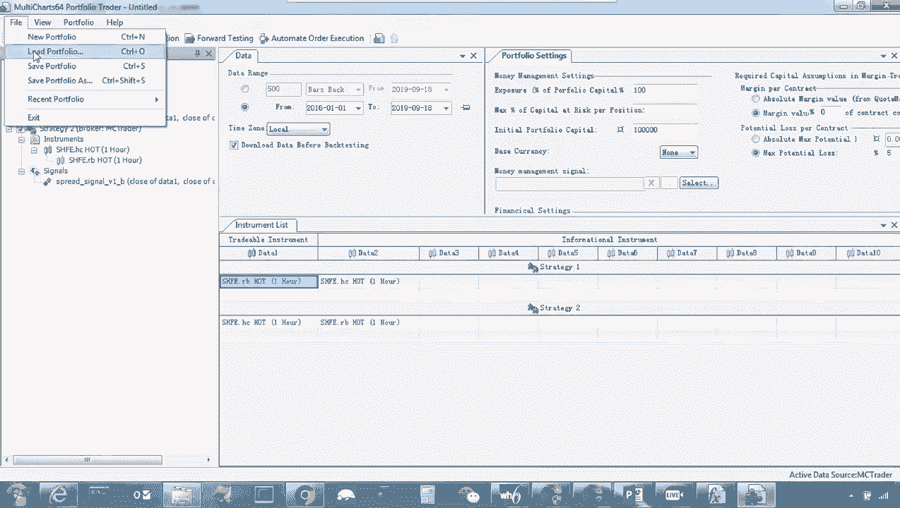

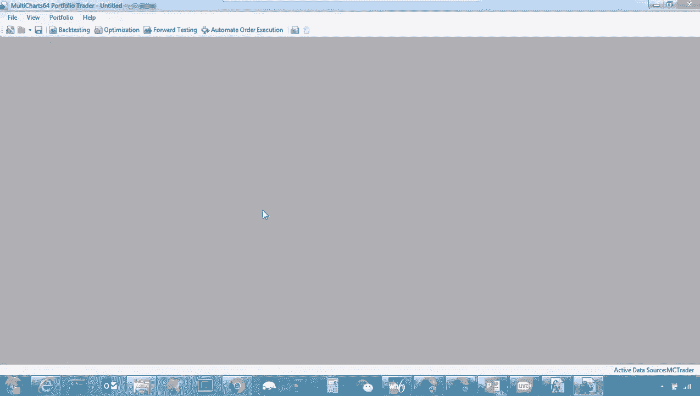

在这个PT工具里头就构造一个啊，就是这个通布林带通道的这么一个策略啊，这么一个组合策略，然后我就做一个回测，我们来看这个回特曲线啊，发现这个曲线完全不对是吧，非常随机啊，这样的话根本不能盈利对吧啊。

为什么，为什么会是这样呢，我给同学们分析一下，就刚才我给你，我给你们说的这个场景啊，虽然感觉就是就是感觉他这个呃很有道理对吧，虽然感觉很有道理，但实际上他不一定能能盈利，为什么呢，我举个例子啊。

比如说我们随便挑一个，假如说就看就看这一段，就看这一段，比如说嗯，对就就以这个为例吧，比如说我现在这个加叉序列，从从走走到了这个位置，从下面这穿越回了这个上下轨对吧，这个时候我是要入。

我是要做多价差的对吧，但是因为因为这个，但是因为这个价，当前这价它整个这个是一个下下行的一个趋势，那我在这个地方穿越上轨，虽然这个时候我去做多价差了，但是真正等我平仓的时候，你看啊平仓的时候。

我平仓条件实际上是要等的这个加叉曲线，穿越这个穿越中轨的时候，那么穿越中轨的时候是在这个位置，但是我入场点呢是在这个位置，那那也就是说我虽然入场做多这个价差，但是我平仓时候这个价差。

这个价差反倒是低于我的这个入场价价差对吧，那这个时候显然我是亏损的，也就是说虽然我用到了布林带通道，我从下轨上来做做多，从上轨下来做空看起来不错，但是如果说跟整个这个趋势是不一样的话。

就虽然我从下轨进来入场，然后从中国到到达中轨的时候出场，但这个过程中不见得能盈利对吧，就像我举这个特殊例子，那我入场点实际上比出场点还要高，那这时候我去做多肯定是亏的对吧，那所以基于这一点的话呢。

那我们就要看那这头是亏的，那有可能另外一端就另外一端就是另外一端，♪ 就是因为有配对交易嘛 ♪，另外一条妥交易他也可能亏，也可能会会会赚，那这时候我就不确定，那怎么办呢，那我就我就相当于想办法。

把这种对我不利的情况把它过滤掉，那这个时候我就做一个止损，比如如果我入场之后啊，如果如入场之后，如果说这条腿他的这个亏损超过一定范围，我就把我就直接把它提前提前平掉了对吧，我把它提前平掉了。

然后另外一条腿可能是盈利的，如果他不盈利，我也把它平掉，那么我只保留入场之后，很快就是能产生利润的这一部分啊，头寸啊，这个时候呢，所以我现在就要做一个止损，所以我在代码里头，代码里头。

你们看我实际是给大家提供了两个版本啊，一个叫做啊VR sim的first和second，first是不带止损的，second是带止损的，那么我现在把这个带止损的呃，就是把止损的代码再加回去啊。

把止损的这个再恢复回去，那止损的话呢是这样，这个这两行代码意思同学们可以查手册啊，这实际上它的含义是说，我是根据每一个头寸来，那如果说我每次入场，如果当前这个头寸我的损失超过200块钱的话。

那我就把它平仓啊，就是这样，那么两条腿是分别独立控制的，那现在我把这个把这个止损的功能加上之后，然后我再编译，编译完之后，我再重新加载，我再重新加载我的啊这个投资组合啊，稍等我把这恢复还恢复原原状好。

这是我的工程，我再重新再重新运行我的这个回测，我们看这效果是什么样子，哎大家看到这结果就好多了，对不对，那从从啊，从这个初始本金是10万块钱啊，10万块钱一直单调上升，但是中间肯定有些回撤啊。

有有一些这个回撤，但是呢总的来说还是一个上升趋势，整个收益是正的，还是不错的一个表现，另外呢我们再看一下这个版本的啊，交易分析，那总共在3年的时间内啊，我配对交易大概也发生了300多次啊。

一共有300多对的交易，所以这个次数就就很不错了，那3年的3年时间有300多次交易的话，平均啊平均每每三天吧对吧，每三天左右就就至少能有一次交易机会，这个还算还算可以了。

而且本身这个收益收益收益曲线看着也还不错，所以这个策略呢基本上是可以啊，可以再改造，改造就可以实用的，达到一个实用的程度，好所以呢到现在到现在为止，我就把我们第二个例子给讲完了。

那么我们去呃去对比一下啊，去对比一下这个第一个例子和第二个例子，可以看到差别在哪呢，那么第一个例子里头我用的是一个固定的啊，上下轨的阈值对吧，用的一个固定的上海轨的阈值，但是呢啊交易机会就很少。

在第二个例子里头呢，我就通过一个布林带的方式，布林带的方式，然后来做了一个构造了一个呃入场的信号，然后同时再加上了止盈呃，加上一个止损啊，提前止损，然后呢还是到中轨的时候平仓。

那么这个时候效果就好了很多，所以这里的差异呢，呃并且呢呃通过这么一个方式呢，我创造了更多的交易机会，因为什么，因为我可以随着整个价差学院变动，我可以呃对它进行一个按，顺着它的方向做一个跟踪。

就创创建了一个更多的交易机会，好吧，所以这是这两个版本，那么同学们都可以体会一下，当然我在这节课里头给同学们的例子啊，仅仅是例子，那么这里并没有考虑太多的，比如说手续费啊，华点啊，冲击成本啊。

就属于一些额外的啊，就是这些因素，那所以同学们就是说你作为原理学习，是可以的啊，但是如果你要想把这个策略，直接拿到实盘上来说呢，不一定像我不不不一定啊，不能保证说一定好，为什么。

因为你还要考虑交易成本啊，各方面的因素，所以你需要把参数做一些更精细的设置，然后再做一个充分的评估啊，或者说再结合自己的思路再做一些改进，然后再考虑说它是不是适合于来做实盘，好了。

那么基本上到目前为止呢，我是把呃第一部分啊，就是基于这个啊，叫做跨品种的配对交易给大家啊，讲完了，那么再额外说几个特殊的地方啊，那么在呃当我们加载几个合约的时候。

大家可以看到我例子里加载的是两个主力合约，对吧，就hot合约它是主力合约，那么有可能两个品种，它的这个就是，因为主力合约本身涉及到一个换月的问题，所以他俩有可能他俩换月的时间不一样，这样就产生一个跳变。

那么这个跳变就就有可能会对我们会产生一些，错误的交易信号，那么这种情况下通常我们是要去避免它的嗯，怎么解决呢啊，那第一个我们就是在回测的时候啊，我们就不用这个主力连续合约。

而是我直接指定具体的某一个月份啊，某一个月份的合约，那么它就不存在换月的问题，只不过它的周期是比较短的啊，然后呢第二个呢就是说我用一个指数合约，用一个用一个指数，比如说呃2B呃，000对吧。

那可能就是指数合约等等，然后呢，并且呢，我提前是把这个指数合约映射到，某一个具体的月份合约产用来产生交易信号，这样的话就不会存在说这种，因为换野时间不同步产生跳变的这种现象，会产生一些错误的交易信号啊。

这是第一个问题，第二个问题就是说我参与配对交易的合约，有可能交易时间不同，我举个例子啊，那么以前曾经就比如说有很多人，他做螺纹钢和铁矿石的配对啊，就螺矿配对配对啊，因为一个是原材料。

一个一个是最终的产品，所以他俩也是相关性的，但是有曾经与有一段时间呢，就是螺纹钢和铁矿的交易时间段是不同的，尤其是夜盘，一个是截止到夜半夜11点，一个到11：30，所以这种情况就会造成说某个时刻。

一个品种还在交易，但另外一个品种已经是收盘了，那么这个时候，但是因为我们如果拿它来做配对交易，选是不可以的，因为不任何时候都不能不可能产生，单腿的一个和持仓，所以必须保证它俩同时交易状态。

才我才可能去产生信号，那这种情况我们就要过滤这种情况，那过滤的话有两种做法，一个呢就是在MC的报价管理器里头，去修改交易时段对吧，然后我们把这两个品种，它的我接收行情的时间。

限制在一个他俩公共的一个时间段，这样的话我才可以去触发信号，不会产生一个单腿单腿的这么一个一个状态，还有一个呢就是说我在代码里做判断，那如果说我加载了两个窗，两个图表，它们的时间戳吧。

一个是time of data1啊，默认data1可以不写啊，和和time和data2，如果他俩时间戳是完全相等的情况下，那我才可才做一个后面的判断和产生交易信号，否则我就什么都不做啊。

这样的话我可以避免单腿交易的一个状态好了，那么这部分呢就是啊，第一块就是呃跨品种的策略，我就讲完了，♪ 然后下面呢我们再花点时间 ♪，再讲一个跨期的配对交易对吧，刚才讲的跨品种。

下面再讲另外一个类别叫做跨期的配对，交易原理是一样的，只不过是我加载两个合约是不同的时间段，那么这里头我举个例子呢，叫做PTA啊，PTA是化工类的一个品种，也是一个比较活跃的交易品种，那同样举个例子。

那不同的到期的交易日，合约也也一般会在一个相对稳定区间对吧，那么在某一旦，但是有有的时候可能价差会出现大的波动，那么这个时候我就去去入场，那只不过现在是同样一个品种，但是不同的合约啊，跟刚才不一样。

刚才是两个不同的品种，同样一个月份的合约好，那么这个同样的例子啊，这个我就不再重复说了，就跨期的这种配对交易的机会，和跨品种配对交易机会，从原理来说是完全一样的，只不过我加载是不同月份的合约而已。

好那么具体的这个啊工作过程，那课件里都有，我就嗯不一行行念了，也不手手动给大家操作了，那么具体的这个过程是和前面讲的，跨品种的例子是完全一样的啊，大家看只不过我选不同的品种，那么其中一个叫hot。

一个叫hot2啊，就是说hot一般是在MC里头，它叫做主力连续合约，hot2呢是次热门的，就是主力连续合约的呃，之后的另外一个月，那那个月的合约呢，它的呃，持仓量和和成交量是少于这主力连续合约。

但是但是同时还多于其他月份的合约，这种情况叫hot2啊，所以呢我就直接把hot和hot2加载上来了，这个呢这样的话呢他们两个流动性还不错，而且同样一个品种不同月份合约啊。

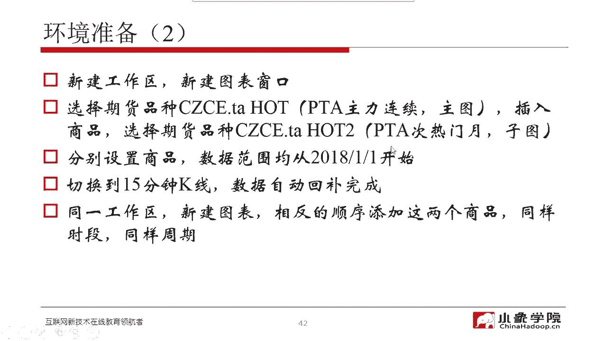

我就拿这个作为一个例子好了，然后呢具体的操作过程呢啊操作过程啊，我就不呃不重复了，那我就直接还是把呃，事先准备好的工作区建了上来，那同学们也可以按照我之前给大家，带着大家做的这么一个过程啊。

你可以自己创建这么一个工作区对吧，我现在现在我把它加载上来。

那么在这个波动区里头呢，我加载的品种一个叫hot ta啊，就PTA这个品种的hot和p ta的hot2，这两个合约好。

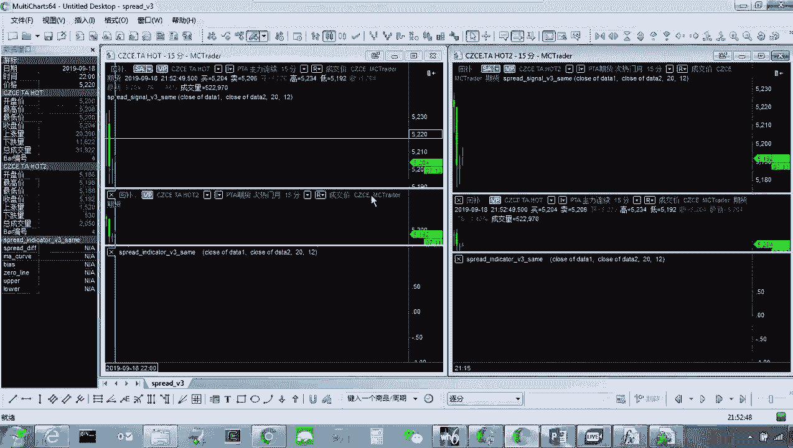

然后呢我加载的这个公式就是版本三啊，就是在我给大家提供例子里里的，这个第二个目录叫做跨期套利，这个目录下啊，跨区套利里头也有两个文件，就是指标，一个叫signal，那我把这两个把这两个打开啊。

一个是signal，还有一个指标，V3好，那我们现在看一下这公式先放在这，我们看下原理啊，好这个我加载完了，我们看下原理，那么在这个啊例子里头，我又换了一种技术指标啊，我用一个乖利率。

那么其实这个做法呢，是和刚才的布林带通道是类似的啊，异曲同工的，我的目标呢也是目标，也是用来追踪啊，♪ 这个价差序列 ♪，就是两个不同交割期的合约的这个价差序列，来看它们之间有没有一些回价格回归的机会。

那么我也是比如说这个如果这个价差曲线中间，我可以求出它的一个移动平均线对吧，那如果某一个时刻，它这个价差序列离这个移动平均线就是，特别远的话，特别远的话，那么我就认为这个可能就是。

就是一个很好的一个入场时机对吧，如果说高于这个均线很远，那么我就入场做空它，如果低于这个均线很远，我就入场做多它对吧，我就是这么一个思路好了，那么但是我我把这个价差序列，和它的移动平均线这个距离的远近。

这个指标实际上就是一个，也是一个非常标准的技术分析指标，叫什么呢，叫乖离率啊，叫BIOS b i a as，实际就是一个怪罪率，所以呢我根据价差序列，价差曲线和它的关联。

和它的这个平均均线和它的均线之间，求出的这么一个差，就叫叫乖离率，我把它画在下边，就是这个蓝色的这个这个线，大家可以看下，这相当于是我把这个把这个均线啊，把价差这个均线这个深蓝色的这个线。

相当于把它撑平了，对不对，就变成这个浅蓝色的怪的绿的曲线了，对吧，所以呢我就基于这个怪利率，这个浅蓝色的曲线，我再看它是不是超出了某一个阈值，那么这个时候我就入场去去做多，或者做空的价差啊。

这个地方稍微有点绕啊，我等于变换了两层，首先呢我是根据K线序列的价格的差，求出了它的价差曲线对吧，再根据价差曲线，求出了价差曲线本身的一个移动均线，然后再把这个价差曲线和它本身的移动均线之。

间这个距离计算出来，那么得到的这个这个距离就是乖离率啊，就是这个浅蓝色乖离率，那么我再根据乖离率，它偏离这个零轴的远近，来决定我要不要入场去做多或者做空，这个原始的价差曲线啊，是这么一个过程好。

那么我们看看代码是怎么写的，那么这个过程去和布林布林带是异曲同工啊，我的目标也是为了抓住更多的交易机会好了，那我现在去看一下代码是怎么写的，我们看一下这个V3这个版本啊，就是说这个怪利率。

首先呢我是把这两个价格序列，求出一个价差曲线叫death对吧，然后呢对它求一个ma啊，average fc求一个移动平均线，然后之后呢把这个价差叫DIF减去它的MA1，得到了这个BIOS就是我的乖利率。

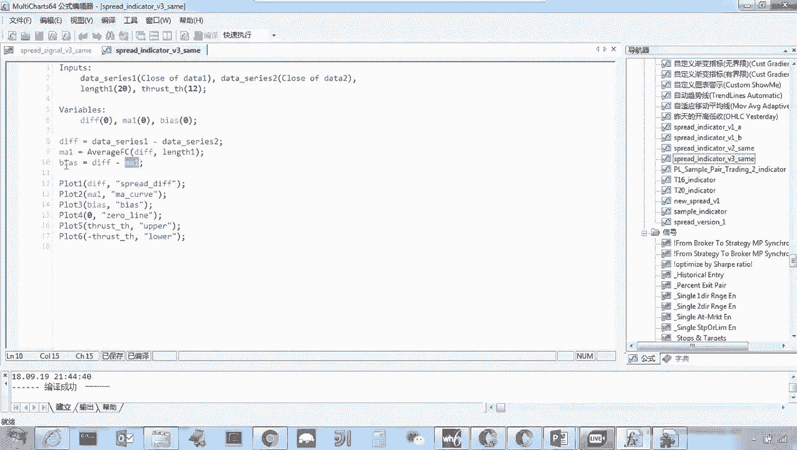

也就是说我的屏幕上，大家屏幕上看到的这个蓝色的这个线好了，那既然我们这都说关了绿，它它总是围绕着它这个平均线。

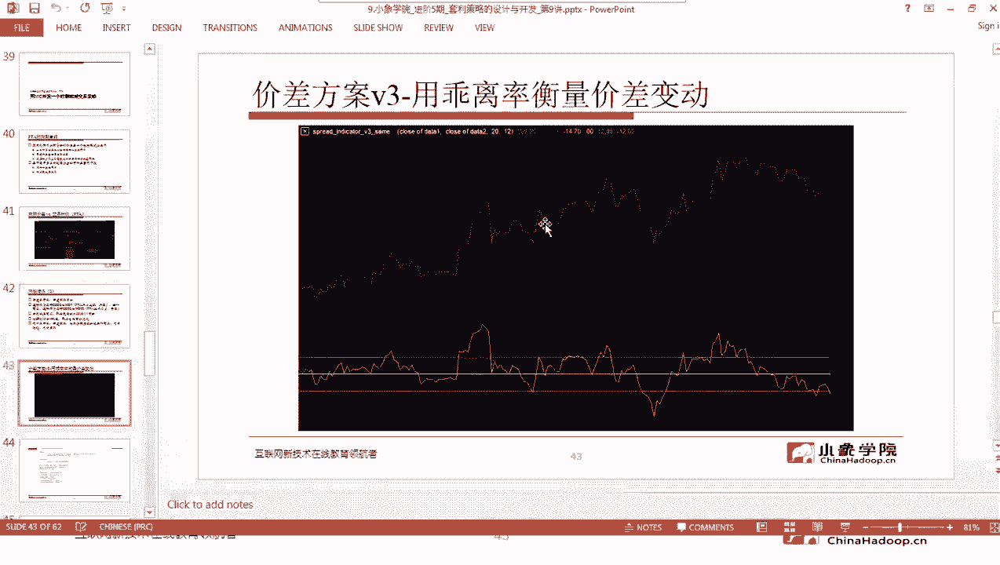

就是零轴去去运行的，那么当它高于某一个，当它高于某一个啊阈值的时候，我是不是就可以入场去做空它对吧，低于某一个阈值的时候，我是不是就可以入场去做多ta对吧，那么这个呢就是我的配对交易的入场信号。

所以呢我们看完了这个指标，我们再看看这个信号这一部分啊，前面计算关利率是完全一样的，后边呢我们就要看后面就看看后面这个逻辑啊，呃当然就是在我这个代码里头，又额外给同学们多写了一个，写了一些呃东西。

就是我这里包含了一个加加仓啊，加减仓实际上呢我是啊，实际上我是用了两条曲线啊，比如说一倍的阈值，还有两倍的阈值，我是加仓，如果说当我的乖利率超过一倍阈值的时候，我就入场去，假如说向上啊。

向上穿越了第一层阈值，我入场做做空这个价差，那如果穿越了两倍的阈值的时候呢，我就再加仓，我就再再增加一倍的头寸啊，这样放大我的收益，那如果向下也是一样的，如果向下穿越了第一第一层，第一倍的阈值的时候。

我去入场做多，然后穿越了两倍阈值的时候呢，我就再加一倍的仓，就还是多头啊，我我所以在我这里做了一个加仓的一个逻辑，好了，那么既然存在加仓的问题，那我们就需要有一个设置，就是在这指标就我加载的这这个指标。

就需要有一个，就是要有一个就是交易，我看啊，不是不是，是不是设置这个指标叫设置图表交易，这个里头就有一个，稍等啊，设置图表，有一个加仓的选项，设置信号啊不对，在信号的这个属性里头。

属性里头它就有一个部位限制，最多允许几次加仓啊，就在这个地方要把这个勾打上，那么这个原理是和之前给大家讲tb的那个里头，是意思是一样的，允许多次加仓，这样的话我才可以可以在同样一个方向，多次入场好了。

那么关于这个代码，代码就是呃计算部分讲完了，我们再看入场啊，入场就是说我设了一个变量啊，这个变量呢叫做ADD position count，就是我加仓次数，那我就根据当前持仓啊。

如果说你看当前如果我持有多头啊，并且呢我的这个乖利预期现向上穿越零轴，那么这个时候呢我就哎我就入场去做呃，就平仓啊，这是平仓，我们先看先看建仓，先看呃加仓的地方吧，如果当前没有任何的加仓头寸。

并且呢我的这个乖离率曲线啊，穿越了这个低层阈值，那么我就做空对吧，sell shot入场做空，同时呢把我加上次数加一，然后呢下面呢如果加上次数已经唯一的状态，并且呢我再次穿越两倍的阈值的时候。

那我就再再做一次cell shot，就等于再加一次仓对吧，这是入场去做空，然后呢同样对做多的逻辑也是这样，如果当前没有任何持仓啊，加仓次数也为零，并且呢我是从从上往下穿越了这个下轨。

那我就是入场做多对吧，然后加上次数加一，那如果已经加了一次仓，但是呢再次穿越两倍的阈值时候，那我就再入场再做一次多，就是再加一次仓好了，那么这个是入场的逻辑，出场的话呢出场的话就看当天如果持仓状态啊。

如果当前持仓状态等于多头对吧，并且呢啊我不管是加了一次仓还是两次仓，那么当我的这个乖离率曲线穿越零轴的时候，那我就平仓对吧，然后对空头的头寸也是一样的好了，那么这个这个代码其实很简单，同学们体会一下。

这个应该理解起来不难的好，那么这样的话呢，我就我就相当于把把这个信号做完了嗯，我们可以看下这个屏幕上的这个表现啊，红色的就是价差曲线，蓝色的就是我的均值，然后浅蓝色的是我算出的关利率。

然后根据怪利率穿越了一倍或者两倍的阈值啊，决定我是入场做做做空或者做多一个头寸，还是做两个头寸好，那么这个呢就是就是我的在图表上的一个表现，那现在我们做一个回测啊，同样还是还是说构造一个。

类似刚才的那种投资组合，然后呃加载加载一个投资组合，然后呢直接做一个回测，好然后我们看整体的收益还可以啊，但是后面有些奇怪的地方，因为现在我用的是主力连续合约对吧，我没有去特别的细调这个主力连续合约。

所以我们能看到说它中间有一些就是移仓，换月的时候，就是主力合约切换的时候，它会有些跳变，那么这个时候我们暂时把它忽略啊，嗯我们看整体的一个大的趋势还是可以的，基本上是上升的。

而且这回撤当然肯定有一定回撤，因为我现在做的也不是很精细，同样就是对于这种，对于这种就是啊关利率这个方式，也存在止损的问题，但是我代码里头没有加止损啊，所以同学们以后可以你可以自己加止损，为什么。

这个这个道理是，和刚才刚才那个布林带是一样的，假如说假如说你这个呃根据怪利率的这个走势，超过了某一个阈值入场的话对吧，假如说我在呃，我看看啊，举个例子在什么地方对，比如说在这吧，假如在这在这个位置。

假如说我现在呃就是，乖离率曲线在这一瞬间啊，在这一瞬间突破了，突破了这个上轨，那么这个时候我要做空对吧，我要做空，那有可能它对应的这个价差曲线是在这个位置，那么当到了某个时刻，他回到了这个中轨的时候。

在中间这个位置在这儿碰到了，碰到了这个中轨，在这个时候我要出场，但是我们看这加叉加叉曲线，加叉曲线这个值有可能是比我呃，就有可能比我的这个入场点也可能高，也可能会低对吧。

那某些时候它实际是有可能会亏损的，这个和刚才布林带的那个啊例子是一样的，所以在这种情况下呢，同学们要可能你要考虑更多的一个精细的控制，比如说你可以判断一下当前均线的方向对吧。

或者说你像刚才布林带的那个例子里头一样，你再加上一个止盈止损的啊，这么一一些指令，那么看看是不是能够，使得这个回测曲线变得更好，就更平滑对吧，所以呢基于这一点的话，同学们可以再自己去再去发挥。

做一些改进，好了对，所以这个策略要点，刚才其实我已经结合着那个呃例子呃，结合着软件本身给大家讲过了啊，这是原理，就是根据乖离率的偏离程度作为入场条件，然后呢这是平仓条件，然后呢同方向允许多次加仓。

所以这地方要设要有一个特别的设置，好这是回撤的一个状态，那么那么基于这点呢，同学们其实可以做很多改进啊，我就随便列了几种，比如说你可以看不同周期对吧，因为现在用的PTA的这个例子呢，做跨期套利的话呢。

我用的是15分钟的周期啊，这周期合不合适呢，同学们可以选不同周期做多做一些回测看看，然后呢，另外呢呃关率这个指标毕竟还是太简单了对吧，你也可以结合其他的呃嗯各种技术指标吧。

或者自己编写也设计一些技术指标，然后看看能不能更可靠的，抓住这种价差回归的机会啊，然后再加上一些止盈止损呐，动态加减仓等等，这都是我们可以啊改进的方向，♪ 所以同学们完全可以 ♪。

根据我们在这个系列课程里头，老师讲的各种基础知识啊，从不同的角度来优化这个策略啊，不管你做的是一个单边的一个策略，还是一个配对交易策略，那其实我们可以用来进行改进的方向，都是大同小异的。

好那么刚才呢给同学们举的这个例子啊，都是举单一的啊，一对品种，比如说我或者根据螺纹钢热卷板啊，或者是根据这个PTA做跨期套利，实际上呢我们真正啊你在实践过程中，为了使得自己收益更平稳，就分散风险。

一般来说我们要构造更多的组合啊，要做要做很多的品种，很多的策略啊，尽可能的分散风险啊，那么这种这种原理大家应该都知道，就是说当我构造的这个投资组合越分散，那我的风险程度其实越低对吧。

所以我可以选不同的板块的啊，然后呢不同周期的，然后呢不同交个月份的啊等等，很多种组合构造成我的一个多品种，多策略的组合，这样的话那就使得我的收益更稳定，好这这这随便画了一个图啊。

就是说我们我们看如果你单一策略，很可能他就是波动很大，但是当你把它们综合在一起的时候，哎整个这曲线非常漂亮对吧，回撤也很小，然后呢收益也很稳定的上升，对这是我们达到希望能达到的一个理想的状态，好了。

那么最后再稍微花一点点时间，给同学们探讨一下股票啊，刚才我举的所有例子，都是在期货领域来做配对交易对吧，因为期货在期货领域，我去选一些配对的品种是比较容易的啊，但是呢有有的同学可能专注股票。

那股票能不能做配对交易呢，实际上也是可以的，那么在这个里头，我给我给同学们找了一个例子啊。

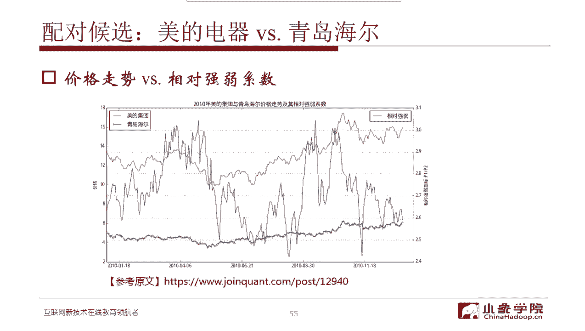

就是说我没有具体编程序，直接找了一个现成的一个第三方的一个例子。

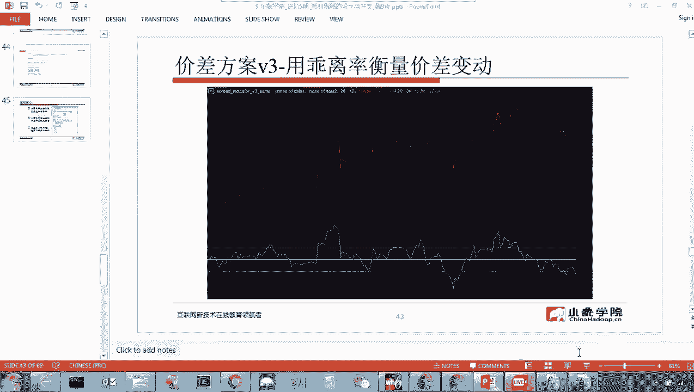

那么这里头给了给了一个链接，我们可以打开看一下，这是在距宽上的一个例子，那么这个例子呢叫做统计套利支，股票配对交易策略啊，啊同学们有兴趣可以去读一读他这篇文章啊，看看他们在股票上是怎么做的，那就这里头。

我就只只是简单的把原理给大家再说一下咳，那么用来做股票的做配对交易，其实原理和做期货时是类似的啊，我们也是根据呃，它的一个价格走势走势来来判断，通常我们也是要选一定的具有一定相关性的。

比如说你如果是做配对交易的话呢，那你选两只股票，这两只股票至少是要从业务上啊，从规模上啊都应该类似的啊，他这里举举的例子，一个是美帝啊集团，一个是海尔集团，这两个都是大家都知道，都是做做家用电器的对吧。

做家用电器，所以他们本身模式也也也差不多，然后呢各方面产品也差不多，所以股价也差不多，所以呢通常来说认为，他们体现出一个行业的平均水平，那如果说基本上它会同涨同跌，但是短期内可能还是会有些波动对吧。

就像这个例子里给出的，比如说红色的这个曲线是韩美的集团的走势，蓝色的这个呢就是海尔的走势，然后他们两个的价差就是个就是个绿色的，这这个线我们看它还是有一定波动性的对吧，所以呢按照这个例。

按照这个这种情况呢，那我们完全就可以在呃，在这个波动比较高的时候对吧，我去卖卖出第一个股票，买入第二个股票股票，然后当这个当这个波动价差，波动到一个比较低的水平的时候呢，那我就去买入第一个股票。

卖出第二股票对吧，这样的话，那我就相当于构造了一个，基于股票的一个配对交易策略，那具体怎么操作的啊，这是这是他文章里给出的一个例子，我们可以参考，那么首先呢他要他要额计算一个。

这两个股票的相对的一个强弱或者就是价差吧，啊但他这价差不是说拿两个价格直接相减，而对它求了一个log啊，求了一个指数没关系，呃，这个具体的这个价差是一个广义的价差啊，大家不用说很机械的认为。

只能是两个相减或者相除，你可以相减相除，或者做某一种数学变换，甚至给它加一个系数都是可以的，所以呢他这里头，首先他肯定是先通过一个回回归分析，或者写种分析呃，找到了这两个股价之间的某一个倍数啊。

某一个倍数就是从统计来说，他俩大概股价相相差一个倍数，或者再再相相差一个啊，一个平移一个平移，所以呢它基本上说把两个价格求log，然后再加上一个系数得到的，算出这么一个价差。

然后对这个价差呢再用一个正态分布对吧，把它做了一个归一化啊，做一个标准化减去减去这个价差的一个均值，再除以它的一个标准差，得到的一个标准化以后的这个ST这么一体，而把这个作为它用来啊用来做啊。

就是做配对交易的这么一个一个价差啊，所以这个思路都可以参考啊，到底这个啊他这么构造一个价差序列的呃，这么一个强弱系数啊，这么一个公式到底合不合适呢，这个完全是个经验值，同学们都可以去尝试不同的构造方法。

然后呢构造好这个标准化以后的，♪ 这么价差之后呢 ♪，他就设定一个阈值，比如说1。5对吧，那如果正-1。5，那如果说呃大于1。5，就是做一个反套呃对吧，如果小于负的1。5，就做一个正套对吧。

当然这个也是股票的话，它可以融靠融券的方式做空，那当价格回归正常的时候，就平仓回归到零轴的时候，就这个价差回归到零的时候就平仓，那么这个过程其实和我们做期货是一样的啊，好了，那么具体的这个。

在文章中给出了这么一个价差序列，同学同学们都可以参考，但是呢但是就说这里头其实我要强调一下啊，就这个例子作为理论理论来说是可以去学习的，但是呢你实践中呃，就就用这么两只股票去做配对交易，到底合不合适呢。

这个不好说啊，不好说，为什么呢，因为这个股市啊，尤其中国的股市，我们我们也知道说是一个有个很奇怪的现象，有的时候他有时候也会脱离基本面的对吧，比如说某一个公司，它经常会啊为了就是说做一些市值管理啊。

它有可能会或者说它本身有一些跨行业的，跨领域的这么一些并购行为，比如说某一个公司原来做家电的，突然某天说我要去做做金融了，做p to p了啊对吧，那么呃或者说我要去做做做什么呃，某一种房地产啦。

然这都是很有可能的，那么这种情况下呢，当他因为当当时某只股票啊，就这上市公司啊，因为这些事件发生的时候，很可能就是市场对它的估值就会发生一个变化，对吧，就脱离了它本来原来的行业。

就脱离它的基本面就变化了，那如果说你还是把它当和和和，和原来那个行业的另一只股票去做对比的话，显然这个就偏差就很大了对吧，你就说你你通过呃，如果有这种情况发生的话，那你根据他们股价来算出的这么一个价差。

他很可能就不具备，就不具备这么一种均值回复的效应了对吧，有可能它股价就就就就是一去不复返了，然后你还跟他去求一个价差，然后再等价差回归再平仓什么，那有可能你会造成损失了，也就是说它的价差就不是回归了。

那这时候你就不是做价差回归，而是做做价差的那个扩大，做做趋势了对吧，所以对股股票来说呃，有的时候它的股价真的是不好估计，它不是你根据某一个固定行业，因为它不是一成不变的，有可能他因为某些概念呃。

或者某些业务的转型，就会造成市场对它的估值，就会发生一个比较大的变化，所以呢到底是说你拿两只个股来做配对交易，合不合适呢，这个因人，而这个大家要要要有自己判断啊。

我只是说提醒说有可能会有这些因素会影响啊，他的这个嗯价差的一些表现对，当然如果说在一个短时间内做作，应该问题不大啊，但是但是如果说在某一个是个，基本面发生变化的话呢，你还也就不要死守着这么一个策略了啊。

所以你要在适当的时间要做些止盈止损啊，这个永远是控制风险的一个一个有效的手段，好了，那么就多说点题外话好啊，那么所以呢根据这个啊，所以根据刚才我介绍的股票的这个配对，交易的一个例子呢。

同学们课后啊可以看看原文，然后呢甚至自己啊有时间的话呢，就可以把它的程序它有提供源代码的，把它源代码啊拷贝下来，自己放到最宽平台运行一下啊，找找感觉啊，是可以的，然后呢再再再有一个练习。

就是说啊大家如果有时间的话呢，就可以对我课上讲了这个跨品种的啊，两个版本的代码，还有一个跨期的版本啊，一共是三段代码，然后呢看看对他们能不能做些改进，对吧，你可以随便选一个版本做做改进就行了。

反正做一些练习吧啊自己一定要动手，才能有更深的体会，包括说熟悉一个平台，包括它的编程语言，然后这里的策略思想，然后呢我增加一些什么样额外的一些呃，呃就是一些指标，然后来对它进行改进等等。

另外呢也包括说对整个工具的一个使用，熟悉过程啊，好啦，那么这是这是第二个练习，然后呢总结一下这节课啊，这节课呢首先呢给大家讲了几个相关的术语吧，就是关于套利啊，套套套利或者配对交易。

那讲了些什么无风险套利啊，啊配对交易啊，统计套利对吧，还有一些特呃，还有一些啊常见的一些策略类型，什么对冲啊啊阿尔法呀啊什么单边啊，多腿呀等等对吧，然那么就是介绍一下术语。

然后之后呢讲了配对交易的原理啊，所以配置交易的根本原理在于什么，在于我们找一些基本面比较相关的两个品种，然后呢发现价差偏离正常水平的时候，就是我们的入场时机对吧，或者入场做多这个价差就是正向套利啊。

或者是说做空这家它就是反向套利对吧，这是一个套利的基本原理，然后后面呢我们就用MC带着大家，分别开发了跨品种的和跨期的配置交易策略，然后之后呢又讨论一下股票的配对交易，那么这个呢就是今天课程的主要内容。

那今天这个主要课上的内容呢也是非常多的，所以同学们课后的话如果有时间的话呢，啊也可以再花点时间再去回顾一下，里头有很多细节呢啊就是就课上讲的比较快，如果你意识没抓住的话呢，回头可以看看回放录像，并且呢。

自己在真正的某一个软件平台上，去去尝试一下啊，这样能够加深自己对这种配对交易策略的，这个这么一大类策略的一个，有一个更深刻的理解，嗯好了，下面我们再看看同学有什么问题没有啊，咳，刚才黄色线的时候。

黄色线我已经说过了啊，啊配对交易所只额能否只做多一个品种啊，这是可以的啊，这是可以的，就是说呃比如股票里头你不想融券，也可以只做多一个单项做多嘛，那基本上来说你就相当于是用呃用这种呃。

现在是你拿两个股票来来做一个，来做一个参照对吧，比如说某一只股票相对于另外一只股票，表现强势的时候，你就去做多对吧，表现弱势的时候，你把它平仓啊，这个这个思路是可以的，就相当于什么呢。

就相当于是我们去拿一个指数，比如说你拿一只股票和相对于它所在的板块的，指数强弱，比如如果某只股票，它你假如说你要操作的好的话，那么在某一个板块里头，比如这支股票它就是龙头股，对吧啊。

或者随便挑一只不一定龙头了，比如这个股板块的走势是是这个样子，然后呢但是你你选中的这支股票呢，如果他比较强势的时候，你去做dot，然后但是当它走势比这个板块的，这个指数弱的时候，你把它平掉对吧。

这个是相当于是你你做了一个基准，那么这个时候类似于配对，但实际上还不是配对，只不过呢你现在做了一个阿尔法，但是你又没有做对冲啊，就相当于是你你这个策略呢，是是类介于配对交易和和单边策略之间的。

一个策略啊，这样是大概率还是有可能会跑赢指数的吧，不能说你一定盈利，但是它有可能会跑赢指数啊，就跑赢你所参照的那个股票，或者你所参照的那个板块指数对吧，这是这是第一个问题，下一个问题是MC里能做实盘吗。

是可以的，MC是可以做实盘的，MC做实盘的话是这样的，呃MC呢它是它的收费模式啊，呃也是和我之前讲的TB是类似的，它也是这种分成模式，也就是说MC如果你拿MC来做股票的话，我们可以看一下官网。

其实它的官网上是有有介绍的啊，对然后呢他这个就是正式服务里头啊，他这里头有个收费标准，大概的收费标准呢就是说如果是做期货的话，那么它是在交易所的手续费基础上增加，增加收20%，就每一笔交易啊。

他会加收20%的手续费，交易所的手续费基础上啊，不是说券商佣金那部分，这是这是第一个，然后呢他还可以做股票，做股票的程序化交易，股票的交易的话，他是要收一个年费的，要收一个年费。

而且是需要装一个特殊的版本，而目前MC支持几家券商啊，他在网站上应该有可能至少是第一创业证券，还有一个是光大吧，好像呃支持那么几家券商啊，所以呢做期货也行，做股票也行，都可以支持实盘啊。

当然是不同的版本都是MC，但是不同的版本，然后呢下一个问题寻找配对交易标的的时候，是不是应该判断两个标的是是否协整的，对是的啊，是的，这个呢是要要判断呃呃呃协整的，但是一般是这样的啊。

就是说如果是说呃本身假如说我们做期货的话，那期货一般从基本面来说，它有如果是两个品种之间有很强的相关性的话，这个本身我们从呃基基本质上来说，就就是显然的啊，我也不需要刻意的去计算它。

比如说螺纹钢和热点板对吧，他那显然它就是相关的，还有螺纹钢跟这个呃和呃和铁矿石对吧，也肯定绝对是相关的，这个从基本面来说就毫无疑问的，只不过你现在要做的是什么呢，你现在要做的是拿历史数据去做一个统计。

你看它的大概的这个价差的一个波动范围，对吧啊，那么这个是这是在确定波动范围就可以了啊，还有一个就说是否要做协整对呃，协整的话，你像刚才刚才我给大家看的那个呃，两就是呃期货品种之间的一个相关性矩阵嘛。

那个本身就是一定的写整对吧，那个也体现出一定写呃协整关系，当然计算的不是那么复杂，还有具体的写种的话，还有还有那个计算呃，那个相关系数的公式，大家都可以去去研究，然后在刚才那个股票的这个例子里头。

它也它也有计算写整的那个公式啊，同学们感兴趣都可以搜一下，因为这个这里头就涉及到比较多的数学，讲起来可能也是一堂课讲不完的，所以我就没有特别去强调，那同学们去网上搜一下。

怎么去计算两个标的或者两组标的啊，这两两个投资组合之间的这个写种关系，有很有很多公式和文章都可以去去参考好，那在股票里头，如果你要做股票的话呢，一般来说你肯定也是要去去通过数据分析，去做一个协整关系的。

那只有说符合一定的这种这种呃，就是相关性的股票才才可以拿来做配对交易，好了，那么基本的问题啊，看同学们还有没有其他问题，好那如果要是没有额更多的问题，我们这节课呃就到就到这里啊，就结束了，好那好。

谢谢同学们嗯，嗯那如果说后续啊，如果后续有什么更多的问题呢，同学们也可以在呃咱们想象的这个网站上啊，有问答互动的环节，你可以在这里提问啊，如果有问题的话呢，我们老师也会啊抽时间呃跟大家做一些解答呃。

还继续保持一个交流好吧，那谢谢同学们的收听。

