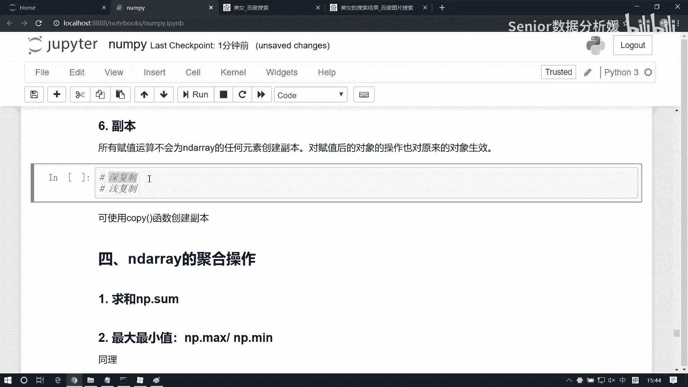
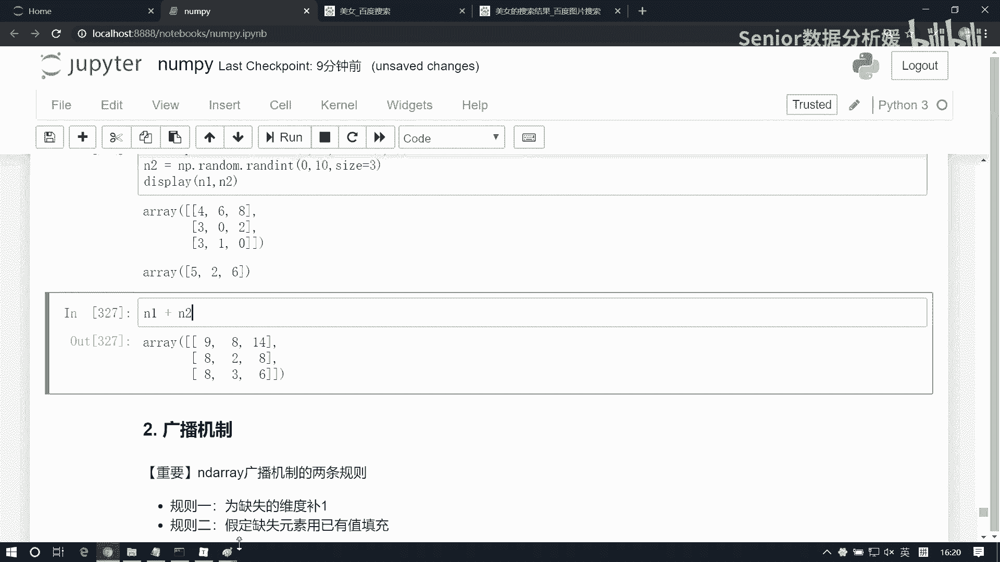
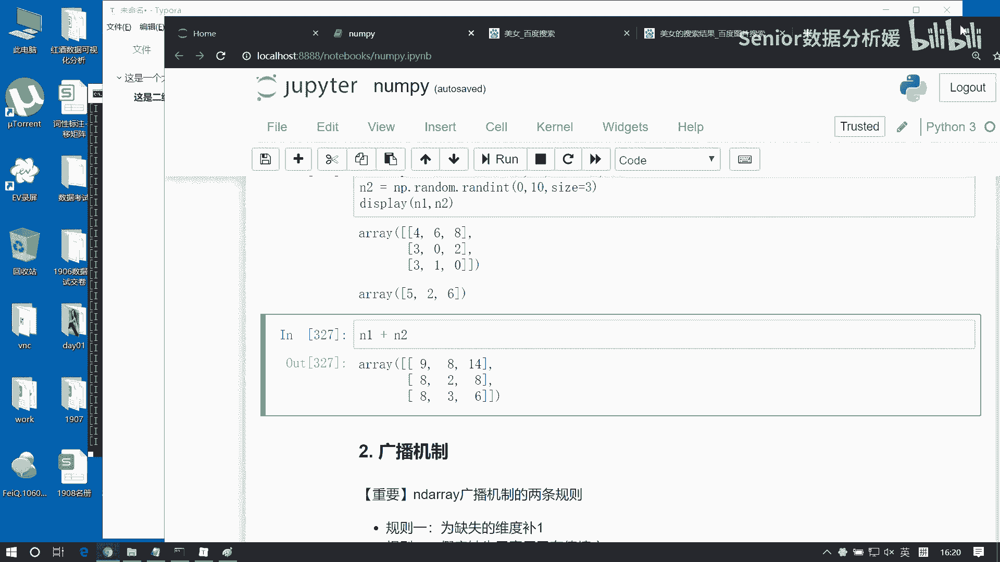
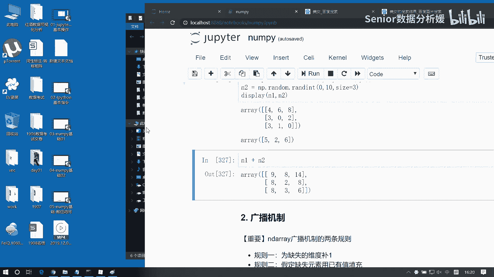
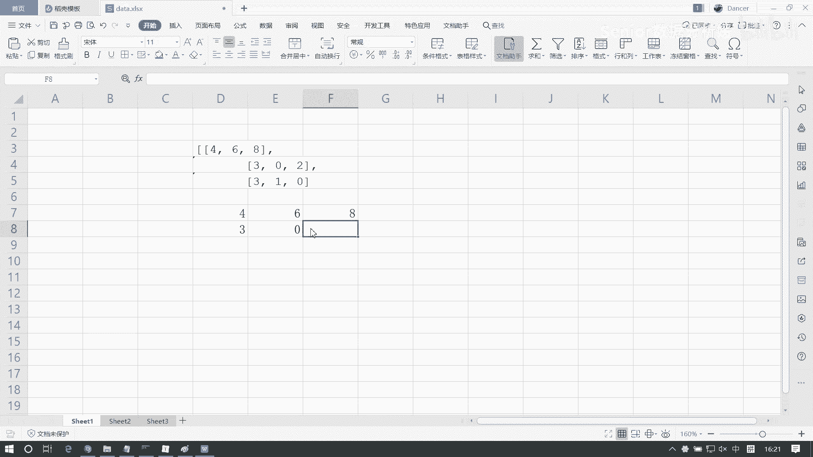
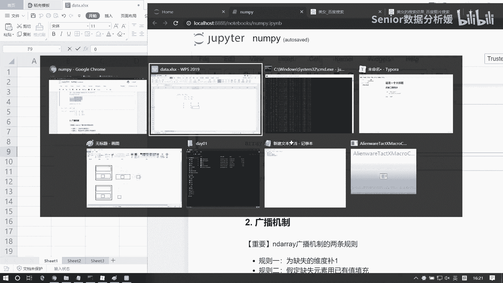
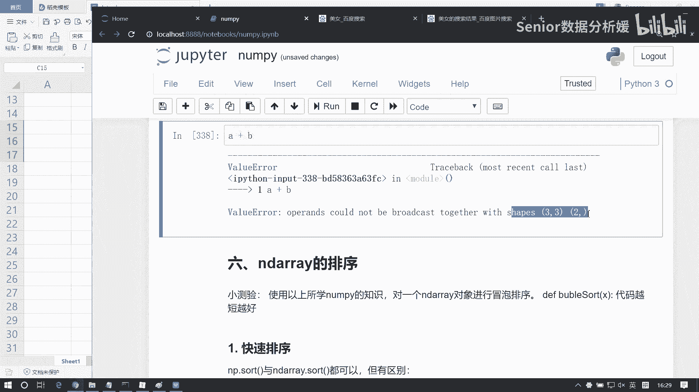
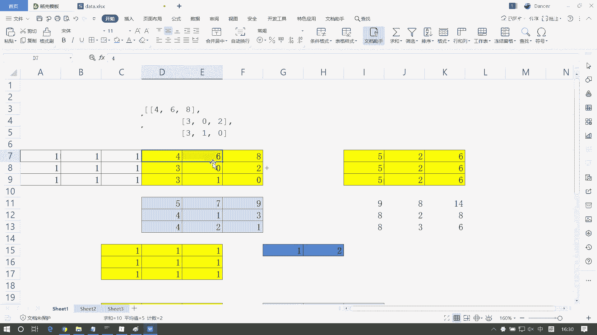

# 数据分析+金融量化+数据清洗，零基础数据分析金融量化从入门到实战课程，带你从金融基础知识到量化项目实战！【入门必备】 - P26：06 numpy基础-数组运算 - Senior数据分析媛 - BV1Ak61YVEYX

我看下边这个啊这个吉连啊，那吉林这块呢就有点有点业务了啊，就涉及到一点业务了，那么一般来讲呢，我们做这个业务表的一些汇总的话呢，都会用到吉林，但南派的级联的话呢，它只是一个辅助。

我们如果真的去处理这个业务表的话呢，其实也不会用南派的节点，为啥呢，因为首先咱们南派的吉连呢，它是没有这个字段的啊，什么叫字段呢，比如说我们先生成一个二维数组啊，咱生成的一个二维数组。

NP点random点RANDOINT，然后0~100，然后size等于五行五列，五行五列啊，那么对于这样一组数据，其实我们不知道它任何含义，咱们只是拿到了一组数对吧。

那一般来讲一张业务表呢行方向表示是数据，然后列方向表示是字段，比如说可能是一个Python java c c加加加，然后OC啊可能这样一个成绩，但对于南派来讲的话，他是他因为他只关注数据啊。

说白了他研究的只是数学啊，所以这里边它是它跟业务是很难结合到一块的，所以他的他的这个处理呢，只会从这个数据的角度来处理，所以他就会有一些这个就会有一些限制啊，那就什么叫吉连啊，什么叫吉连吉连。

说白了就是两张表给他汇总到一块，比如我这是一张表，我再来一张表，NP点random点RANDOINT，然后0~100，然后size也等于五行五列啊，那么这两张表呢我们怎么汇总呢。

比如说我们可以纵向的给它拼到一块，或者横向的给它拼到一块，这叫吉连了啊，但是呢因为它没有办法跟业务去接轨，所以说我们只能是机械的，就是把第一行跟这个第一行结合到一块。

把这个第第二行跟这个第二行结合到一块，如果你是列方向的去挤点的话，只能把第一列跟这一列给它接连到一起，然后第二列跟第二列接连到一起啊，所以呢那基于这个原则的话，那我们这个南派啊，他在起点的时候呢。

就有一个要求，就是我们在极点的方向上，比如说你是在行方向起点，还是说你在列方向起点，那么你必须保证这个个数是一致的，有人说你不能拿五列数据跟四列数据去起连，因为少一列它不知道怎么去填充这个值。

你也不能拿五行数据跟四行数据去挤连啊，在行方向节点，因为他也是不知道剩下那一行应该怎么填啊，所以他在这个处处理上呢就不那么智能啊，因为没有业务做支撑，但如果你要有业务支撑的话，这事就好办了。

比如说我第一列是Python，第二列是java，然后这个第一列是Python，第二列是java，那么很理所当然的，Python就应该跟Python连到一块，java就应该跟java连到一块啊。

那比如说我这边还有个有个计算机，然后呢这边没有，那没有的话，我可以给计算机补上一些空值啊，所以说它man派的几点呢，它只是提供了几点的一些运算的基础啊，那我们就看这个语法啊。

这个咱们就了解一下什么是起点就可以了，然后另外我们把这个语法给它搞定就OK了啊，首先语法呢我们就用这个CONCATENNATE这个函数，来进行节点，那节点的参数是一个列表，它是一个列表啊。

那比如说我们这有一个N1，把把它记为N1，把它记为N2啊，然后呢，我可以把这个N1和N2放到一个列表里啊，然后呢那我们就可以用这个，比如这个我们叫date list，然后呢我们就可以把它连连到一起了啊。

NP点concatenate啊，Contact net，然后里边第一个参数就是我们这个列表知道吧，就是这个列表，但是它是一个类列表类型就是你元组啊啊，集合这种类型都可以啊。

我把这个data list给他好，这样就连到一块了是吧，怎么连的呢，我们可以把这两个值啊给做一个输出啊，我可以直接这样输出N1和N2，但这样输出不好看对吧，这个结构呢有点混乱。

所以我们可以借助这样一个方法啊，叫display，我们可以用它来帮我们查看多个数据，这样的话呢它不会破坏这个数据的展示结构啊，类似于print函数啊，但是他展示的这个方式可能会好一些啊。

那我看看他怎么节点的，84778477是不是纵着连的呀，对吧，这是纵着连的，那如果我们想横着连怎么办呢，我们可以啊去改一个参数在这个里边啊，它默认等于零的啊，等于零，这是纵这纵的连，如果把它改成一。

那就是横着连，但你不论纵的连还是横着连，必须保证什么呢，我们的行或者是列啊，它是匹配的，比如说我要横着连，那必须保证第一个数组是五行，第二个数组也是五行，就这个行数一样，如果你是纵的连。

那我得保证第一个数组是五列，第二个数组也得是五列啊，必须一致的啊，而且这里边我们看这个参数的说明啊，它其实里边是可以放N个啊，可以放N个数组的，这样我们稍后做修改啊，比如说我们把这个N2给它改成这个。

那加个N3吧啊N3等于NP点，random点，Randoint，我们从0~100，然后size等于五行四列，这是N3啊，那我们看啊，那N3能不能跟他在往一块连呢啊，NP点CCINNATE。

比如我拿这个啊，N1和N2啊，N1和N3啊，他俩连这样就连不了了，对不对，为什么呢，因为它现在默认是竖着连是吧，纵向连纵向联，你N1有几列啊，有五列啊，然后N2有几个NN3有几列啊，N3只有四列。

所以这时候他连会失败，但是我们改一下方向，我改成一这样横着连哎这就可以了是吧，因为他们都是五都有五行啊，都有五行，那同样的我也可以再往下放啊，比如放个N2，这样就把它们都连到一块了啊。

可以这个支持多个节点，但你必须保证我们在几点这个方向上，他们的这个数据的这个呃个数啊，必须是统一的嗯，因为这个通过轴来控制呢不太好，就是容易记混啊，零和一容易记混，所以呢他也提供了两个便捷的方法。

就是一个是h steak，一个是v stake，这个H啊H什么呢，就是how ion al好，V呢就是vertical，它是什么，它它是横着连横向，然后这个是纵向，啊像那个你像做那个游戏开发是吧。

游戏开发一般都会有一个模拟用户输入那东西，什么WSD是吧，或者那个箭头上下左右啊，它就会有一个轴的概念啊，其实这个轴我们这个XX，这个轴跟那个差不多啊，就你是纵轴还是横轴啊。

然后呢我们也可以通过这两个办法来做连接啊，比如说横着连NP点h steak，那这个里边呢我就不用再花花心思去去研究，是这个x is到底应该是零还是一的问题，我直接写就行了，你想横着连呢。

N1和NN3是不是可以横着连啊，横着连，N1N35行五行啊，这是少写个参数啊，不是少写参数啊，参数写的不对，应该是以列表的方式给是吧，以这个就是类列表啊，ARRELAX这块叫啊，就是类数组类型啊。

就是一个集合就可以了，这是横着连，然后呢纵的连呢一个道理，NP点v stick，这样我可以把N1和N2写进来啊，这样就是重的连啊，嗯那比如说我们把那个图片啊，比如说我们把那个girl那个图片做一个记连。

能不能连呢，这个我们叫to girl，NP点CONCATNT啊，我们在哪个维度上几点啊，哦我们那个GIL它是它是几维的，是三维的啊，三维的，那我们肯定只能在一这个维度，或者这个维度连对吧。

因为这个维度你一连的话，相当于你RGB变成了RGBRGB，对不对，是不是就变成这种格式了，没有意义对吧，所以我们可以可以沿着这个轴连，或者沿着这个轴连，因为沿着这俩轴，它可以什么，它是它是什么。

它是横着的，对不对，他这个是纵着的，对不对，沿着两个方向连，它是有有有道理的啊，那你看可以看一下啊，那我们可以这个它怎么连呢，我们先给一个girl，然后再给一个girl，俩girl是吧，这是重的点。

我把它PRT展示一下，A mage show，酷GI是吧，俩连到一块了是吧，那你要把这个轴改一下一呢，那就是横着连了是吧，咳咳但你要在第三维的话呢，就把改成二的话，那这样就没有意义了。

因为它不是一个图片对吧，因为他这个超了那个就是第三维，他超了三了啊，超三了，所以就不是一张图片了，展示就有问题了。

好那我们再看下一个啊，这个切分，呃切分呢它它也是有三个函数啊，一个普通的split，一个v split，还有个HSPSPLIT啊，那这个里边这个先说这个SPSPLIT它有什么用，切分跟切片其实很相似。

切片是什么，切片是我拿一块蛋糕，我切出一块，我自己吃啊啊我我关注的是什么，是那一块那一块数据，而切分是什么呢，我要去关注的是我怎么怎么去分成几份啊，我分成三份，还分成四份。

我我这么是关注的是怎么分的问题啊，所以切分他是干这个事的啊，切片返回这一个值，而切片呢而切分呢是返回N个值啊，那我看一下啊，比如说拿这个我们生成一个NN1等于NP点，random点RINT，找到啥。

来个六行六列啊，六行六列，这是N1，现在呢我把它做一个切分啊，比如说我现在想把他这个分成上下两部分啊，分成上下两部分，这怎么切呢，我们可以用这个NP点SPSPLIT，第一个是我们这个N1啊。

然后第二参数呢是这个indicates or sections哦，它指的是什么呢，它指的是你切片的方法啊，切分的方法，这里边呢如果我们指定为一个数值的话，它表示我们沿着我们要切分的方向，切成几等份儿。

切成几等份，所以除了这个切成几等份之后呢，我们还有一个轴，这个轴默认是零啊，他表示我们是纵向去切，这样我们不到两份，我们可以把这块给它做一个输出啊，是得到两份啊，那第一份是上边这半部分，50~42。

这是34~18啊，因为这边有两个值啊，一个是这个值，我们切分等份数，然后这个是我们的轴啊，就是一个方向，那如果我把它改成一，这是纵向切成两份对吧，当然他也可以改成三，这样我们切成三份，这是少了一个值啊。

A3，是吧，这是纵向三份，然后大家也可以横向三份，我这边改成零，横向三份啊，嗯那还有个问题是什么，那我们现在是不论行和列都可以被三整除是吧，那如果不能整除怎么办呢，不能等的话，我们这样切就有问题了啊。

那我再来一个来个N2啊，N2等于NP点random，然后点run int0到100，然后这个size等于啊，比如说五行七列吧，网上系列啊，好现在呢我们对它做拆分，那不论行还是列。

我们其实都没有办法被整除，所以这时候如果我们用整整数的办法，来除的话呢，就会有问题N2，然后这个index index or section，我把它设置为二啊，这样切会有问题对吧，因为什么。

因为列方向五是没有办法被二整除的，那同样的我把X改成一行方向，也是没有办法对这个二整除的啊，那这时候我们就需要去写一个区间啊，这个区间的表达方式呢啊是这样的啊，比如写个二，写个四会得到什么呢。

嗯一个二一个四，你看这个是怎么来的啊，这个二二意味着啥呢，意味着你是从零切片切到二啊，就是它相当于是切了0~2这一个区间，然后以及2~4这个区间，以及四到最后这一个区间啊，我这是一共几个区间。

一个两个三个对吧，我把它展示一下，A1A2A三，这三个值啊，那第一个值四十五五十四是不是这两个值啊，啊然后60 469这两个值啊，然后这呢5374953749是吧，这三个值啊。

那同样的比如我把它改成零会怎么样呢，还是啊先是什么零切片到二对吧，然后呢二切片到四，然后四切片到最后得到一组十啊，同样的这块我可以改一下啊，改成223呢啊零切到二，然后呢二切到三，然后三切到最后对吧。

所以通过这种方式来控制它啊，嗯所以它分成两种情况啊，一个是呢可以整除，一个是不可以整除，另外呢还有这个v split和i h split，道理是一样的，我们比如说可以做横向切和纵向切n split啊。

NP点h split，这是什么，横向切对吧，横向接N2，然后我们只需要给定什么，给定这个index or sections24，这样得到三组值啊，这是横着切4554，4554啊啊。

另外一个是纵着写NP点v split，好了它它其实跟切片啊，其实道理差不多的啊，如果你有这种需求的话，你可以用切分啊来快捷的拿到几个值啊，就不用分着切了啊，呃然后另一个就是这个副本对象啊。

副本对象呢这个我们也会比较常用，那这个副本里面涉及到一个，就是深复制和浅复制的问题，我们这里边呢它是一个深复制啊，啊，当然我们可能之前咱们也接触过，深复制和浅复制的概念。

可能这个深复制呢跟大家所理解的深复制啊。

会有一些偏差啊，我们之前说这个理解这个深复制是什么呀。

就是说什么叫深复制呢，我们一我们对一个对象啊，比如这个对象它里边写的是这个一，然后呢我们得到一个对象，他也得到一个一，这个是身负值还是浅赋值啊，就产生一块新内存，是深复制还是潜伏制啊，什。

么是深不知什么是浅不知啊，通常啊就是通常通用的这个深浅复制的，这个说辞是这样子的啊，就是说地址的复制，我们才称之为浅复制地址的复制，什么叫地址的复制，我们现在一个变量，我们知道变量是存在内存当中的。

内存会有一块申请过一块合法内存，那这边可能存了一个数字，这是一个D啊，这是date，那这个date呢会有个地址，比如说这是呃零X1100FF啊，这样一个地址啊。

那可能我们你像Python当中一般都是引用对吧，比如我们我们这个想想保留这个对象，想访问这个对象的话，我们给可能给一个指针，比如这个是S1啊，然后这S1呢他引用这块地这块地址。

我们说S1就是这样一个对象了对吧，那这是它的值啊，那浅复制的话什么呢，就是我们直接再给个变量S2S2，让它等于S1，这叫浅复制，这意味着什么，因为S1他想引用这块内存，实际上它里边S1存的值是什么。

存的值是这个地址，是吧，这叫潜伏值啊，那S1等于S2啊，S2等于S1，意味着S1把值写入S2当中了，所以S2其实里边也相当于什么，记录了一个地址，这是S2啊，S2相当于这样一个值。

所以说S2意味着什么呢，意味着它也可以访问这块数据，这个叫什么，这个叫浅复制，这叫浅复制啊，我们之前我们之前说的潜伏值，是不是得值这个呀，明白吗啊，是不是这个叫浅复制对吧，那什么叫深复制啊。

深复制一定是产生内存的啊，产生新的内存的浅复制有什么有什么问，有什么问题呢，我通过S1修改了这个data s2，再访问的数据也被修改了，对不对，因为你们两个使用的是同一块内存啊对吧，回合内存啊。

那如果是深复制是什么，深复制它不存地址，它存什么呢，我们在我们如果S3啊，再来个S3，S3的话呢，他要去复复制这块内存，那么它也会生成一块相同的内存，然后里边也存一个什么呢，也存一个D。

但这块内存的地址就变了，跟它不一样了，这个内存是什么，它的地址可能是0X1100，S3里面存的是啥呢，S3里面存的就是这块内存，这个地址，你这个的话就话很多东西，啊所以S3是什么呢。

S3是指向这块内存的，比如他是引用这块内存的好，所以这样的话如果是深复制的话啊，那也就是说他应该等于什么呢，它就相当于是等于S1去copy copy啊，这样我把这块内存整个复制过来。

然后呢产生了一块新内存，这个地址跟这个跟这个地址是不一样的，S3这个对象，它它它是存的这块内存来访问这个数据，所以说我们你你去修改S3，你把这个数据改成，比如说改成这个A那么这个数据是没有影响的。

跟这种不一样对吧，这种是你把它改成B，那么你不论通过S1S还是S2访问，我得到的结果都是B对吧，这叫深复制，能理解吧，这叫深复制，这是最通，这是最通常的概念啊，就是浅复制和深复制的一个本本质区别。

浅复制拷贝的是引用，深复制拷贝的是内存，浅复制，通过一个指针修改，另一个指针访问依然是有变化的，而深复制呢我通过一个指针修改，另一个只是没有影响的，但是呢如果如果你只知道这种copy的话。

那么我们在编程时候还会出问题，为什么呢，因为复制的话它也分层级的啊，这叫copy，那么还有一种copy叫什么叫deep copy啊，叫deep copy，这个deep copy是咋回事呢。

因为一般来讲我们去表达一个对象啊，这个对象都是复合对象，什么意思呢，比如说我们可以先构建这么几个对象啊，我们构建一本书，构建一个书这样一个对象，那么我们知道输这个对象呢，它是有一个内存的啊。

那比如说它有有这个name，有这个price有这么两个属性啊，然后我们实例化一个一个书的话，比如这本书，它它这个值等于啊，比如说叫这个张飞，有点胖，啊哈哈，然后它的价格我们也给它赋一个值。

比如说这个值是19块3JY3啊，那这是一个实例，一个实例啊，然后呢现在呢你还有一个呃，有一个学生，有个学生啊，那么这个学生呢他也会有，也会有有他的一些内存结构，比如他是叫student啊。

这是一个对象啊，然后它里面也有个name，这个name比如它我给它赋个值，叫李雷，李雷啊，雷锋的雷啊，然后呢那他也有本书，他有个book，那这个book我赋值为谁呢，我就把这个book呀。

把这个对象啊赋值给他，这样的话我这个student的这个对象啊，他就持有了不和这个对象对吧啊，这个时候啊大家想啊，如果呢我我用这个S啊，我用一个S1S1呢，来存储这个student的内存啊。

那么它有个地址，比如这个地址是零X1100AA啊，那我这个SS1如果想表示这个对象的话，那么它就得存这个地址，这是S1了啊，那么他如果存了这个地址的话，那么它就可以访问这个student的对象了。

我们通常就会说啊对象S1是吧，就这一个一个意思啊，那现在如果我们对这个S1去做copy的话，我们对它copy啊，他copy，他copy，那我们会得到一个S2，那我们根据刚才的理论。

S2呢它也有一块新内存对吧，我是把这块内存数做一个拷贝啊，这块内存我们来一个拷贝啊，那拷贝的话，然后呢名字什么都一样啊，那这样的话我这个book啊，我这个book它其实指向这个，那他应该也有个地址是吧。

比如这个book它的地址是0X啊，2233啊，那其实我这个book如果是引用这个对象的话，那它里边其实记录的是不是，应该就是0X233这个值啊对吧，那这样的话呢相当于我拷贝过来这个副本。

它里面记录的也是0X2233对吧，那也就是说这个时候其实意味着你的额，也就是说这个book它指向的是它，那你这个book呢其实它指向的也是它，对吧啊，那比如说我现在S1，如果是S2。

如果是由从S1拷贝过来的，你为什么要拷贝呀，他俩之间我互相干扰对吧，那我比如说我想把这个李雷变成这个啊，这个张张小芳啊，张小芳啊，那这个时候可能我需要去变更一下这个书名啊，变量下书名。

比如这个这个名字啊，我现在不叫张飞，有点胖了，我要变成什么呢，我要变成一个啊这个关羽的，关羽的自我修养啊，我换一个书名啊，我要换个书名，那这个时候你会发现什么呢，尽管你S2是拷贝过来的，我通过S1把。

我把我S1就李雷这个对象的书名改了之后，你会发现张小芳的书名也被你修改了，对不对，因为我使用的是同一块内存，所以说你这样拷贝的话，它是不对的，拷贝的是不完整的，那这样你应该怎么考呢。

你除了要考这个student对象本身之外，你应该也把扑克这对象也做一个拷贝，应该把它也拷贝一份出来，那当然你这样一拷贝的话，这个地址就会生成一个新的内存了对吧，那这就没了，它应该是一个新的地地址。

比如这个是啊0X2244，那这样的话，我这里边其实记录的应该也是0X2244，那这样的话呢这个链就没了是吧，他就没有这个链了，而是什么，而是他是准备它是指向的是这块内存对吧，它没有了啊，他没了。

那这样的话呢，你不论是我通过S1再去修改这个book，我对S2是不是都没有影响了是吧，那这叫什么，这叫deep copy啊，Deep copy，所以你要搞清楚啊，深拷贝啊，深拷贝和浅拷贝。

浅拷贝指的是指针的拷贝，深拷贝指的是内存的拷贝，但是光是内存拷贝是有的时候是不够用的，我们还需要做更深的拷贝对吧，这是深拷贝浅拷贝的一个区别啊，所以其实是三种关系啊，三种关系，浅拷贝。

深拷贝以及deep拷贝啊，而且不要只认为说copy就是深拷贝啊，而那这个普通的拷贝就是内存的拷贝，不是这样的啊，啊通常的话不然的话你跟其他程序员如果去对，去对接这个概念的时候呢。

可能你会陷入一个这个迷惑当中啊，到底什么是深拷贝是吧，可能别人讲的是这样一种拷贝啊，啊那可能我们可能我们Python里面有的时候会说，这个copy指的是什么，这个copy可能指的就是我们这个深拷贝。

这个逻辑啊，他其实不是这样子啊，就是不同的不同的程序员，可能他们在在谈论这个拷贝，拷贝的这个概念的时候呢，他是有这样一个关系在里面啊，你要你要分清楚这个事啊，那我们这个copy指的是啥呢。

啊咱们这个深拷贝，这个拷贝指的就是普通的这个这一层的，这个拷贝啊，所以这样我们直接用CY函数来处理就行了，它用起来比较简单了，我们随便来一个啊，这边还有个什么问题呢，就是啊直接用就行了啊。

直接我们拿这个来一个列表啊，比如N1N1等于NP点array这个123，然后N2呢等于N1，那么这个时候是什么是浅拷贝，因为这是啊这要引用的拷贝啊，那我们现在通过N1，比如想访问它的零。

我给他做一个赋值，现在我N1这个内存就被修改了对吧，那同时呢我N2是不是也被修改了，这就是地址的拷贝啊，这叫前拷贝，深拷贝是什么呢，我N3N3等于N1点copy，这叫深拷贝，那么现在呢我N3是这样子的。

我通过N3的修改，比如说我N3的零，我把它变成100，那么我N1的值呢是不会变化的，这叫什么，这叫深拷贝啊，好那么我们再看下一个啊，南派的聚合操作，什么叫聚合呢，聚合一般指的是。

我们去计算一组数据的一些指标，比如我们想算全班的平均成绩，我想求咱班的成绩的最高分，我想算咱班成绩的标准方差啊，那这种东西呢一般叫聚合啊，聚合呢就是算一组数据的一个指标啊，叫聚合。

所以它是由多变少的一个过程啊，比如说求和求最大值，最小值，还有很多，还有什么求这个乘积，求均值，求方差，然后求标准差，然后求这个最小值，最大值，最小值，索引，最大值，索引等等等等啊。

那这些东西呢还有求中位数，它都是聚合啊，我们来看这个聚合怎么怎么求啊，那么比如说求和的话，来个N1等于NP点once，我们这个shift呢指定为一个五行五列，这是N1啊，我们来对它求个和。

直接N1点SAM就抽出来了啊，嗯嗯也就是说这个里边呢，它跟维度是没关系的啊，就是这个南派的聚合，默认是把整个数组的所有数据进行运算啊，来提取这个指标，那这是求和，那比如说求均值。

我们可以用NN一点min求的是平均值啊，求标准方差N1点STD啊，是零对吧，然后那个等等吧，比如说求最大值N1点max最大值和最小值，N1点密啊，还有这个求中位数，那中位数的话特殊一点。

它必须得用NP点M点来求N1，它这个调用机制会有变化啊，而你不能直接用这个N1点MEI，没有这个函数啊，没这个函数啊，所以他这个设计的就有点诡异啊，就必须得用NP一点medium来求。

而不是用对象直接去调函数的方式是吧，像这种属于什么，这种就属于面向对象的一种编程方式，而这种属于面向过程的编程方式对吧，函数给数据，而这种是什么，这种是对象调用方法对吧啊。

这个就要就是这个调用调用机制上啊，大家注意一点，那这些呢都是求一个一些常见的一些聚合啊，那么不论哪一种聚合，我们算的都是什么呢，都是整体数据的聚合，但有些时候呢可能需求不是这样子的，需求。

可能是我们想去求某一列或者某一行的聚合啊，比如说这个啊，我把它变更一下，变成五行四列，我们也可以通过什么呢，就是每一个聚合函数呢，ax等于一或者等于零啊，那这算算是什么呢，等于零的话算是什么。

算的是说不行方向的聚合呀对吧，这个行方向一行两行，三行四行五行，他们算出来结果是五，然后第二第二个，第二列里边的行方向的值加一起也是五对吧，所以通过它可以控制这个就你算的这个维度啊，那如果改成一的话呢。

算就是列方向的聚合，那这这个四列加一起是一，这四列加一起是一，这四列加一起是一，所以我们得到了五个四，如果是零的话，求的是四个五，如果你什么都不写，那么求的是整体的20。

啊通过这个参数啊来控制聚合的维度，咳咳嗯，选不出来，不过，嗯比如这个啊，这个数据我们对这些数据来做聚合啊，我们来看啊，比如我们现在想求每一列的，每一列的这个标准差，那标准差是什么呢，是STD啊。

这几个要大家记住啊，一个是SAM，一个是均值，应该是STD，这三个我们经常用求和求均值求标准方差啊，经常用啊，那我们现在如果想求每一列的这个标准方差，怎么求啊，你如果直接STD的话。

求的是所有值的标准方差是吧，所有值的如果想求的是每一列，那就是这是第一列的标准方差，第二列的和第三列的啊，你要想求每一行的标准方差，那就把它改成一是吧啊，这是零是吧，因为这行都一样啊，所以这是零啊。

通过它来控制我们的行列变换啊，啊除了这些基本的聚合之外呢，还有还有两个聚合函数比较特殊，一个是any any，一个是or这个ANIC和奥，它只对这个对这个布尔型的啊，主要是来解决这种布尔型的这种值的。

比如说我们来一个列表啊，这个啊NP点array，True false false，我把它记为N，然后这个N呢我们可以对它去求一个N点，any2。0是什么意思呢，有true就返回true啊。

也就是说你这一个数组当中有至少一个true，我就返回true是吧，如果你全都是false，那我就返回false啊，这是any内的作用，而on呢跟他正好相反，它是有一个false，我就返回false啊。

比如我再改一下啊，这是true还是false对吧，除非什么除非一个false都没有，我才返回true啊，所以这两个函数呢是正好相反的，那么这这种值啊，一般来讲我们不会手写。

我们一般会通过一些运算来得到一些值，得到一些满足这种布尔型的值，像这种关系表达式是吧，我们通常可以用一些关系表达式，来得到一些布尔变量对吧，比如我想判断这个啊，我定义一个变量A等于九。

我想判断A是否大于八，我是不会得到一个布尔啊对吧，通常呢这种东西我们进入ANNA也好，爱or也好啊，我们会结合这种条件表达式，来去去查找一些我们感兴趣的值，比如说我想查哪一行里边存在大于100的数。

或者我想查哪一列的标准方差是大于十的啊，或者说我想查啊哪些行满足我的某些条件啊，然后用它来来干这种事儿啊，就是看他有没有有没有就是有没有这种值啊，有没有满足我条件的值，通完通常会结合起来干啊。

啊但是这个东西呢我们先有一个印象啊，这个我们今天先不把它，这个在这个业务当中去使用啊，等我们后续咱们结合到业务的体系当中，我们再再去把它做一个熟练的一个应用啊，先了解它就行了。

然后还有一个就是我们南派里边呢，他的空值的处理，南派里面空值的处理呢，跟Python的空值处理呢会有一些区别啊，那这个里边啊我们说一下啊，在南派里边呢，他有个类型叫NP点NN这个东西啊叫空值。

这个空值呢跟我们这个NN类型呢是一个道理，就表示没有数据啊，比方空值，但是呢NP点NN跟NN的又不一样，NP点NN有一个特性啊，这个值跟任何值做运算呢，比如我加个一，它得到的值啊，都是空。

加减乘除都一样啊，包括除啊是吧，永远是空啊，特别倔啊，特别卷，所以说，如果一旦我们数组当中存在这种空值的话呢，你再做聚合就很危险，比如我们再改一下啊，这个N1等于NP点array啊。

然后这个123NP点NT，你看我们对它做聚合会得到什么呢，N1点sum空值是吧，为什么呢，因为谁让你求和，不就是把这些值相加吗，对不对啊，就相加，或者包括你求平均值，那也无外乎是把这个和相加呢。

再除以一个个数呗，对吧啊，那因为你看1+2加三，再加man就会得到控制，所以我们得到结果也是一个控制，像这种情况怎么办呢，我们有便捷的方处理方式啊，就是咱们用这个每一个聚合函数，它都有一个与之对应的。

就是处理空值的这种聚合啊，叫non sum或者什么NMNSTD等等啊，比如说我们想求和对S1N1求和的话，那咱们可以用NP点NNSU，然后把N1给它，它会自动帮我们把空值处理掉啊。

但是呢其实我们如果有这种空值的话，一般我们也都是先去填充，然后再去做运算啊，而不会太依赖于这个东西啊，但是大家注意什么呢，就是注意这个南派里面空值的这个特性啊，它是需要特殊处理的。

你就记住特殊处理就行了啊，那么我们其实后续用它用的比较少啊，因为这东西并不太好用啊，因为有些时候，我们需要对空值做不同的填充处理，比如说这个同学他没有值，没有值的话，那我们要不要填进来一个值是吧。

比如说他这个我想算一个成，比如说我想去估测一下啊，我想估测一下这个咱们高考的分数是吧，高考的分数，那可能我们做了高考之前呢，我们做了十次的模拟考试，有一次你没考，有一次你没考，如果我们把这个没考的成绩。

如果我们算这个所有所有次数的成绩，的平均值的话，那么别人都是这个啊，可能别人算的都是十次，而你你算的是是九次对吧，那这样来讲的话，如果你求和的话，对你来讲是不公平，所以呢那这种情况。

我可能会去对它做一个什么呢，做一个填充，我会拿你历届的考试的一个均值给你填进来，对吧啊，所以说一般我们碰到空值的时候呢，还是会谨慎处理的，不会说直接把它当成零，或者是其他的一些值来直接处理掉啊。

啊所以说这个用它啊，我们还是用它之前呢，还是要以业务业务导向为基准基准的，然后再去处理这个机械控制啊，你像我们做数据分析，一般像空值啊，还有一些异常值的数据呢，其实都不应该是你就是出。

就是这个潦潦草草的给处理掉，都应该是跟我们的业务相结合啊，比如这个数据我们到底能不能删啊，他如果不能删，我们应该怎么去给它填充啊，那如果删的话，我们应该删什么样子的对吧。

这种东西都应该考量之后再去做处理，而不是说碰到空值，我们直接这样一干就完事了啊，这只是方法啊，这只是方法，那最终方法要依要依赖于什么，依赖于你的理论的，你要有套体系之后，然后才结合方法去干事啊。

好那这个是聚合啊，那聚合这边已经涉及到运算了，那么我们来看man派的运算，它到底是咋处理的，南派的运算呢，它分两种，因为南派我们知道它是矩阵，是矩阵的话呢，它如果你是做这种基本的这个逻辑运算的话。

比如说我现在就想去做两个成绩表，我第一个S1啊啊scar1，它等于NP点random点RANDOINT0到100，然后size呃等于三行，这个五行三列，然后这个死scout2，run int0到100。

然后size等于也是五行三列，我们生成这两组值，嗯嗯这样两组值啊，那如如果我们想做这个成绩的汇总操作啊，如果你是做汇总操作的话，显然是应该第一组数据跟第二组数据相加对吧，啊这个相加的话呢。

你像如果用Python来处理的话，那我们就写写个双循环，是不是i in range，然后外层表示行range一个五，然后内层for接，然后in range等于个三是吧。

然后我们去遍历所有的元两个数组的元素，给它相加对吧，相加然后再存到对应的一个新数组当中，是不是这样干啊，啊那实际上我们用这个数据分析，要要这么干活的话，那就太太慢了，实际上我们做数据分析啊。

用南派来处理这个问题，直接这样写就完了，直接相加就行了，嗯这个相加怎么加呢，它是对应位置直接运算，那18跟38相加得到56，21跟59相加得到80啊，然后88跟149相加得到了好吧。

跟这个61相加得到了149是吧，他是这么算的啊，就是默认的方式是什么呢，这个大家不太适应啊，刚开始南派默认的运算方式，就是数组中对应位置的数据运算，相互运算啊，对应位置中相互运算。

所以你不用展开去求每一个数，再去相加相减啊，不用这么干，它很便捷啊，包括你说成版啊，比如说我10SC1，它跟第二个相乘也是这样一个道理啊，就是对应位置相乘，但是这个相乘没啥意义是吧，所以你说前边是次数。

后边是分数啊，那这么乘还可以，当然规则是这样子的，那如果规则是这样子的话，他跟某一个事就有冲突了，我们知道啊，矩阵的运算，咱们大学都学过矩阵运算，矩阵运算它相加相减都是对应位置相加相减。

但是你要是相乘的话，这个矩阵乘法啊就不一样了啊，矩阵乘法大家估计都忘了啊，给我给大家回忆一下啊，绝对怎么相乘的呢，行乘列有没有印象了，有没有印象，有印象，但就是忘了是吧，矩阵相乘。

比如1234跟ABCD它俩相乘，矩阵怎么乘的，行乘列行乘列这么乘的啊，那么我新生成的这个矩阵也是四个位置，也是四个四个值啊，四个值，那第一个值是什么呢，第一行乘第一列，就这个值。

第二个位置呢第一行乘第二列是吧，那第二行第一个值呢就是第二行乘第一列，第二行第二个值呢就是第二行乘第二列，然后它的运算过程是这样子的啊，怎么算呢，得先行成列对吧，这个行乘以这个列。

那就是一乘以A加上二乘以C，这就是第一个值，那第二行这个第一行，第二个值呢就是第一行乘以第二列啊，那就是一乘以B，然后加上二乘以B，然后呢，第四第二行第一个值呢就是第二行乘以第一列，那就是三乘以A。

然后加上4C，那那这个第二行的第二个值呢，就是第二行乘以第二列，就是3B加上4D，这什么玩意，这叫矩阵乘法，哈哈这叫矩阵乘法啊啊这东西听不懂啊，别怪我啊，去找你代玉老师去啊，跟我没关系啊。

哈哈大学有高数，对不对啊，高数的啊，好了没关系啊，咱这搞不懂也没事啊，不用有心理压力啊，搞不懂的，你就当这个给你讲笑话了啊，你只要清楚什么呢，清楚这个矩阵乘法跟普通的对应位置相乘，是不一样的就行了。

好吧，你搞清楚这个啊，所以说如果你要想做这种矩阵运算，当然可能跟咱们这关系不大是吧，我们肯定不会做这种运算啊，本人看不懂是吧，你还让我做这个，但如果有需求，如果公式给你了，公式给你了。

要告诉你应该这么算，那你怎么办呢，你应该用矩阵的乘法这种运算，矩阵乘法它只是指的是一个乘法，如果给了你数学公式，让你生搬硬套的话，你照着公式往往下写的话，那你一定要找到对应的这些操作函数，明白吧。

我们说矩阵机不是目的，目的是告诉大家，矩阵的运算跟普通的运算是不一样的，如果你给你的公式是矩阵的运算，那你一定要找到对应的函数去把它套进进来，而不要直接去写乘除法，这种写，知道吧啊那我看这个啊。

矩阵机NP点DOTA，咱们来个简单的，比如1234啊，NN1等于NP点，Berry12，再加一层，然后三四，然后再来个N2等于NP点BERR，幺幺，二二啊，这两个东西相乘得到什么呢，看看啊。

N1N255十一十一，看能不能算出来哈，把两个先打印一下啊，display一下，N1N2怎么算呢，是不是第一行乘第一列啊，第一个值是1×1，然后加上什么加2×2，是不是是不是等于五啊，这第一个值是吧。

那么第第一行第二个值是什么，是不是第一行乘以第二列啊，说还是我对吧，跟他一样吧对吧，12×12嘛，然后呢，第二行，第一列是不是应该是第二行乘以第一列啊，第二行乘以列，那就是3×1。

然后加上什么加上4×2，对不对，是11啊，然后呢最后一个数呢，这也是第二行乘以第二列啊，是一样的啊，所以说五五十一十一啊，咳咳好了，我们搞清楚啊，不是在教大家矩阵乘法啊，告诉你的是公式要怎么去套啊。

给了你一个数学公式，说你把这个公式用程序给我写出来啊，你别傻了呵的咔咔使参与程度往往上套了对吧，那是不对的啊，那公式就错了啊，好这个地方大家就注意就行了啊，这矩阵矩阵机的话，咱了解一下啊，怎么说。

咱也是搞数据分析的多少，咱能回忆起来点还是回忆起来点啊，要不然一说太丢人是吧，问矩阵是啥，不知道啊，不知道啊，我就知道南派是啥啊，矩阵矩阵啥不知道，这太丢人了啊，当然其实说说到底，其实也没有太大用啊。

对咱们来讲没太大用啊，我们还是要去贴合业务去处理问题好，那这是它的基本规则啊，就是对应位置相相乘相加相减相除啊，但是有个什么问题呢，如果两个两个数组啊，这个这个形状不一样会怎么样呢，再来一下啊。

N1等于NP点array啊，然后这个，random点random int0到十，然后size等于三行三列，然后N2等于NP点，random点rann int0到十，然后size等于三，好了。

他俩之间运算会会发生什么呢，会怎么样呢，我先把这两个值打印一下啊，468302310跟526，他俩相加会得到啥呢，能不能运算有没有对应位置相加呀，能对应不能对应上吗，我这有九个数。

你这三个数你怎么对应啊，是不是对应不了啊啊，但是南派能对应是南派，能对应南派怎么对应的呢，这就是南派的强大之处了，这东西叫什么叫广播机制，它会自动帮我们去判别我应该怎么加的问题，你看这是怎么加的。

526跟468相加，是不是得了，第一个数是九，第二个数是八，第三个数是14啊，那它跟第二行相加，302526得是828，是不是这个值啊，他在跟第三行相加310，那得到的是836，是不是这个值啊，是吧。

怎么来的啊。

这，个要祭出我的法宝了啊。

然后就去老板办卡了，我有两大法宝啊，一个法宝是excel，一大法宝是绘图，绘图啊。

不用不能用excel，excel太low了，我要换一个高端一点的，我要换WPS。

因为WPS是正版的，excel是盗版的，这就是WPS了啊。

Data，好怎么算呢，这么算的啊，这边是，一个是468，然后是三，呃零二。

然后这边是310，然后下边这个是526是吧。

526啊，那么我来解释啊，它是怎么运算的，这个运算的规则就叫广播啊，叫广播，那这个广播是什么规则呢，就是南派给我们提供的，当我们数据结构不同的时候呢，它会有一个自动的优化的一个规矩。

这个规矩就是广播机制，也可以认为是它的一个运算的一个逻辑啊，他们俩因为number派运算默认什么，默认就是对应位置，就是数组对应位置的元素做运算，他俩如果做相加运算，那我要做的就是我要做的呢。

就是让对应位置的数据相加，但显然现在这个情况他是不符的，那怎么办呢，我这样会把这两个形状啊给它变成相同的形状，那如果变成相同的形状的话，我只要把这第二个数组给他做一个扩展，是不是跟它形状一样了。

我把我把它从一维扩展到二维，但你拓展到二维之后，这个数据怎么填呢，这个数据我就用已有值来填526，那我往下拓展，它也是526，这也是526，这样两边形状是不一样的，形状一样了，我再去做运算。

我就等于这个数加上这个数，那么其他位置也是类似的，我就得到这个结果了是吧，九八十4828836，是不是啊啊，所以他的他的这个其实这个门道是在哪呢，就在于它它会帮我们做拓展啊，所以说他就解释了一个问题啊。

比如说我拿一个数组，它跟一个整数相加会发生什么呢，这个N1是这个玩意是吧，他要我加个一会得到什么呢，579413421怎么来的，嗯对是不是全加一啊，怎么来的啊，这么来的，我这个一嘛，你跟我相加好了。

我要给你拓展维度，现在你是个零维对吧，零维我要把你拓展到一维，一维的话，那再添个一，再添个一一维还不够，这怎么办，再再扩展二维，现在怎么了，现在两个维度是一样的，好了，现在他俩维度一样了。

那我就可以得到这个结果了，就等于什么等于对应位置的数据相加，就拿这个值这个值了，明白了吧啊所以说南派为什么能跟整数相加呢，就是这个道理，它有广播机制啊，但这玩意Python可不支持啊。

Python是不支持这玩意的，Python你要想相加for循环对吧，没别的招，写了两层循环，啪啪啪一块来，那他不用，他直接帮我们广播，那这是一些简单的变化啊，还有一些复杂的变化，比如说啊比如说这种啊。

比如这个啊，你看这个我们写出来啊，M等于NP点once，这是啊两行三列，然后再来个A等于NP点arrange，这是个三，这个偶认值如果只写三的话，搁这是干嘛呢，是不是生成等差数列了呀对吧。

它默认应该是从比如从你给个初始值，给个中值，然后再给个步长嘛对吧，是这么干的，对吧，这参数说明啊，等差数列，如果它这里面中括号的，start和这个staff是可以省的啊，如果省的话。

start默认值就是零，step默认值就是一，所以呢我们这个直接写个三，就相当于step是零，然后step3啊，我给他展示一下，M来个A，好了，这三个这两个值相加，那很显然只要把它扩展到二维就行了。

是不是就是11111，它变成012012两个一加，不要什么输得123啊对吧，M加A就是123，两个123是吧，两个123啊，那看这个啊，看这个我把直接拿过来了啊，不写了，好现在大家先搞定这个形状啊。

首先大家说A是什么形状，A是个什么形状，我润这三数还是生成这个玩意啊对吧，然后我们做了什么，做了个receipt，三行一列，对不对，转了三行一列，这是一个二维数组，只有一列，那它应该结构是012。

应该这样的，竖着来的是吧，这是它的结构啊，然后那另一个这个ARRAN是三，它不还是0。2啊，零二数就这玩意啊，是不是一维的呀，就一行啊，它是012好了，它俩相加会怎么样呢，他俩是两边一块拓展。

他因为他是个三行一列，它是个一行三列，所以它得变成什么，它得横着拓展，这来一列，这来一列变成三行三列对吧，它也得什么数的拓展，所以这样的话它俩形状相同了，然后我们再去相加这个值，加上这个值。

然后一拽012123234，是不是这样一个结果呀，看看啊，我们A加B，0122123234是不是占一个值啊，那同样的这个道理是一样的呀，是不一样的，这是四行一列，都是一对吧，四行啊，四行一列啊。

四行一列的话是怎么写的，是不是是这样的一个结果啊，这是四行一列，然后呢这边呢4/2是不是一行四列啊，啊其实就是一行对吧，这是一维数组，它应该就是，Np l arrange，那就是0123是这样一个值啊。

这两个数据是不是也要扩展啊，它要扩展到，二维这些地方用已有式填充，然后他也是要拓展成四列对吧，然后这边再相加，就等于这个加上这个，是吧，12341234，就这样一个值啊，看看是不是啊，是吧。

12341234啊啊，但是你要注意啊，就是广播也不是万能的，什么时候不是万能的呢，比如说这样的结构啊，啊，比如这是，三行三列，然后它跟两行呃，一行两列跟这样一组数据，它俩相加再能加吗，对他是一，他是二。

然后这一，看看能不能变形，像变成一样的呀，没法变是吧，你要你看现在维度是什么，它他要想扩展的话，那么想扩展到这个三列的话，你是不是没法扩展呢，因为你要填充的话，你这一列你是拿一填还是拿二填啊。

是不确定了对吧，所以这种情况他没有办法拓展成相同形状，这种情况就没有办法相加啊，我们可以看一下啊，这是一个三行三列对吧，我们来一个A等于NP点REVANCE，然后这个shape等于三行三列。

然后这个B等于NP点arrange，直接来个二好，是吧，这两个数据啊，它俩相加A加B是不是报错了，怎么说的。

叫operates could not be broadcast together with ceive，332逗号，我们操作数不能被广播到一起，这啊这两个形状是不是啊。

所以说广播也不是万能的啊，那它基于什么，基于我们能够通过变形，达到相同的形状才能处理，所以其实这种情况我们也很少见啊，几乎不会，谁也不会干这么二逼的事啊，一般来讲其实就是什么。

一般就是一个数组跟一个数相加，或者一个数组跟一行，或者一个数组跟一列，知道吧，这是我们最常见的逻辑啊，最常见的逻辑啊，但是你要说你非要我说，我要拿这个数组跟俩数相加啊。

那我这个逻辑我不知道你怎么怎么出来的。

其实很很难碰到这种逻辑啊，可能碰不到啊。

