# 爬虫技术在量化交易的应用 - P1 - 量化老何 - BV1Uz421k7TK

好各位朋友们晚上好，那个欢迎轮回到咱们2023这个，股票量化的课程当中，那么我们这个呃课程呢，不知不觉已经到了7月份了，两个月过去了啊，我们就进行了一系列的啊一个学习，一系列的学习，包括一些基础啊。

包括一些数据清洗啊，因子选股啊啊然后从第六节开始，就是基于我们的一个策略实战课啊，那今天是我们的一个第八集，就是说我们要看看爬虫，在我们量化里面的一个应用啊，呃爬虫是一项被限制的技术。

就是说其实呃如果这个爬虫的技术应用不大，会会就是说会有一定的法律风险的啊，这个法律风险呢我也咨询过律师啊，就是说我们不可以爬爬虫，导致一个网站，人家就是说啊大量的反复的爬虫。

导致人家的一个网页进行一个崩塌，或者说崩溃啊，或者影响我们目标网页的一个正常的使用，那这样子可能就会有一些啊，会不会导致一些法律上面的一些问题，那我们应如果是除此以外呢，我们用一些正常的技术。

正常的爬虫技术，在一些网站上面可反而规的去获取某些信息，其实这个是不违法的啊，所以这些呢所以基于这一点呢，我们才敢为大家去开这个课程啊，那我们都知道，我们之前有给大家介绍过一些API的接口。

比如说我们在呃掘金或者to share或者万德等啊，那么这一些我们称之为数据接口，能获取K线或者获取一些基本面的数据，我们基本上都会通过这么一些API的接口，那这接口呢是我们啊去获取数据的一个。

主要的渠道，主要的渠道，那除此以外啊，就是说有一些数据我们很想要，特别在网页上面的，也是我们非常想要，但是又没有人给我们做出来这么一个API，是不是，那这个时候呢我们就可以通过爬虫的方式啊。

自己从网页上去爬了啊，自己从网页上边去爬，这个爬虫的这个技术，给我们带来了非常大的一个方便啊，就极大地拓展了我们这个数据的获取能力，极大拓展我们这个数据的获取能力，然后的话呢仅仅一节课。

系统呢给大家讲清楚这个爬虫技术的量化应用，其实不实际的啊，那我们作为一个入门入门课里面的其中一节，我觉得更重要的就是说带大家怎么样去啊，搞清楚我们这个量化，就他从技术在量化里面的应用。

同时提供给大家一套学习的框架或者是思路啊，就告诉大家这到底是他大概是怎么回事，然后的话把那个学习的路径规划给大家啊，我觉得就这样就OK了，那同时呢我们也会有一些模板的啊，Python代码给到大家。

大家如果是啊能能够就是说运用老师的方法啊，就是能够快速的复制啊，啊通过代码快速复制老师的一些能力啊，那这样的话也是可以的也是可以的哈，那爬虫的技术在的课程有很多啊，大家去哔哩哔哩搜一下。

也有很多免费的啊，但是那个就是哪些是重要的，哪些是已经不用的啊，或者说呃或者说我们应该怎么学，就是说这个是一个问题啊，那我们主要是通过几个模块，框架上面呢就是爬虫爬取这个HTML，就一个网页，网页的话。

就是说我们比如说我们打开这个我们称之为，百度是吧，然后我们打开，东方财富，是吧，它的一个这个网页啊，啊就门户网页，那这个门户网页里面就有非常多的信息嘛，对不对，就有一些可能是我们那个API没有的。

那我们就非常想把它拿下来，那就比如说啊比如说一个locking，是不是啊，这里面的数据可能就是说我们API可能就没有了，我们非常想把它扒下来，那这样子，首先我们看到它是不是在一个HTML的网页里面。

对吧，他在一个网页里面有这样的信息，我们就想把这些信息爬下来，到我们的Python代码里面，这个行为就称之为爬虫啊，那不仅仅是到我们的Python代码，也可能是到一个excel表或者是一个CSV的文件。

那也是这种行为，我们称之为爬虫，那爬虫的要素，爬虫的目标，第一它是网页上面的数据是，就是说它是网页上面的数据爬虫的目标，那爬虫的手段，技术手段，那我们这边提供了两种，第一种就是说url lib这个库。

还有一个就是说那个selling selling，就是模拟手工操作，这个我们就不讲啊，不讲用，我觉得我们用不到，用第一种技术，也就是我们的一个request的技术就就就就可以了啊，就可以了。

看后面我们的代码里面会有讲，然后呢，就是说我们通过一个代码把我们的一个HTML，什么叫HTML，我们就给大家看一下，就说哎我们3X12，啊这这些是不是这个网页背后，是不是这些数据啊。

是不是我们的一个是吧，我们称之为HTML格式的这么一个数据啊，我们通过分析这些数据，第一我们需要把这数据先爬下来啊，先爬下来，然后我们就是爬下来之后呢，我们就是要通过这些库的爬取就给它爬下来，是不是。

那爬下来之后呢，它有两种数据模式，第一种就是我们称之为正静态数据模式，就是说他可能就是后台一个后台服务器里面，把数据直接获取到之后，直接写在这个前端里面，就相当于就写在了这个HTML这个网站里面。

就我们称之为这是一个静态的一个模式，把数据直接写在前端啊，第二种模式呢它可能就是前端只有个空架子，但它通过一种就是类似于JQERY，这个这样的一个模式，就类似于从一个数据库里面取出数据。

动态填在这个上面对吧，所以说哎啊我这个关系呢就是怎么样，这个关系就是说，我最简单的怎么画一个画一个图啊，分别对应啊，就是这个就是可能在，感觉就是一个服务器是吧，一个服务器啊，那我们爬取到之后呢。

我们爬取爬虫，他取消之后呢，他可能就是一个HTML，HTML是不是这TML呢，它可能是分为两种模式，哎妈呀，是吧，所所以爬到之后，HTML呢它可能分为两种模式，有一种呢就称之为称之为直接写进这个。

一个静态里面的，就是说他把数据就写在这个，根据HTML格式就写进去的，有一种呢就是动态，就是说他留了HM，只保留了一个啊一个空的架子，他最后呢他通通过动态数据库的模式，从数据库里面实时取出去。

放在你这里啊，所以他就是说通过有静态拿到，我们查到HMIHTML以后呢，嗯我们想要的数据，它会通过静态或者动态这两种模式进行处理，但实际上的话我们处理的话就是说啊，针对静态或者动态。

我们也会有不同的处理办法，这个是怎么回事呢，我给大家讲一下啊，啊那个首先啊看一个那个一个代表吧，就是说啊我们就说他从他从啊，我们要获取它的这个仓位啊，在雪球上面爬这个仓位。

跟东东厂上面爬这个仓位其实是不一样的，就比如说我们。

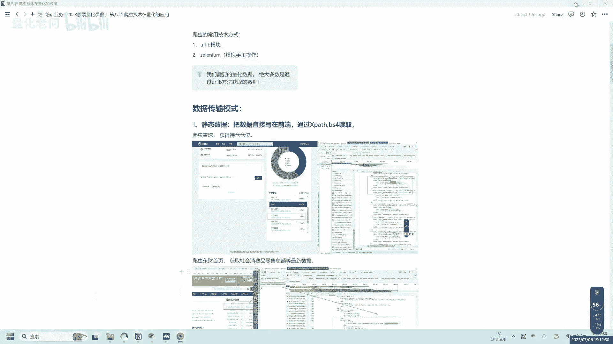

那我现在先讲静态的，那首先我们打开这个，东财这个网页。

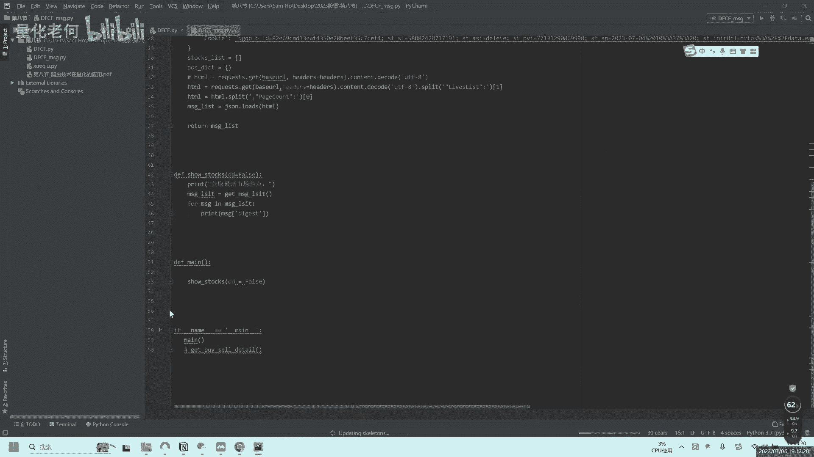

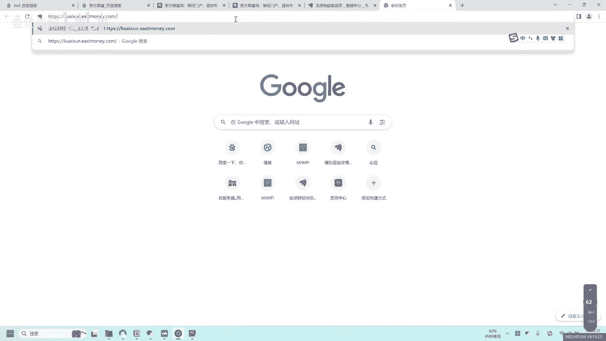

好的我不需要这个啊雪球啊，雪球这个网页雪球这个网页里面呢。

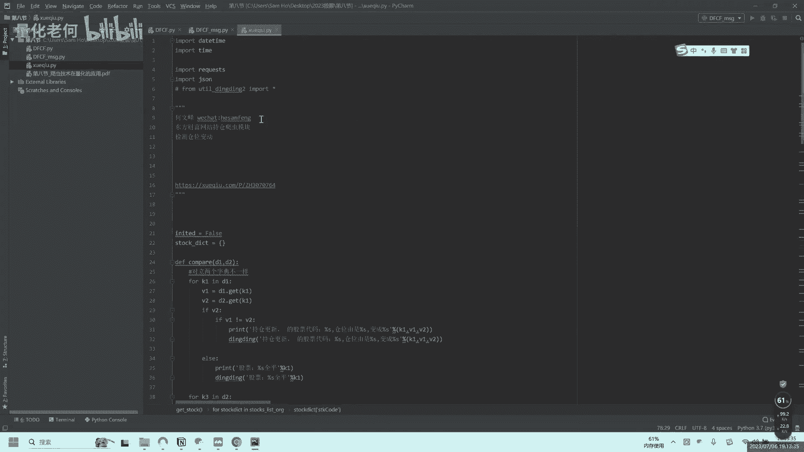

大家注意啊，它是一个需要登录的，哎我们就是说这里我已经登录登录过了，是不是，那这个比如说我觉得他这个操盘操的不错啊，我现在就想复制他这个仓位，那我现在是不是就是要这个仓位的，这个东西对吧。

那然后我们就是用那个首先呃工具先讲一下，一定要用这个谷歌浏览器啊，谷歌浏览器国联系把这个网页打开之后呢，就是按F12，他就是有了这个东西对吧，他就有了这个界面出来啊。

那下面呢我就我就教大家怎么样获取到这个，怎么样获取到这个仓位是吧，那首先我们看看network这里level，这也就是说我们的一个网络数据嘛，它会通过这个网络包的形式就会啊，传到我们这里。

是不是传到我们这里，然后的话呢我们现在刷新一下，刷新一下，看到这些就是包很多的数据包过来，我们点击一下它就停止掉哈，那我们先搜一下其中一个股票的名字，比如说，武汉凡谷，那这边是不是就能够获取到这个。

叫做它的一个仓位啊，我们看一下是不是，首先它是有一个7CR2是吧，Cr2，然后他的一个，仓位是1。01，啊那这边好像是没有看到这个1。01分，一点等于一没看到啊，或者说我们搜这个19。86。

哦这个也是没有，就说明这个可能就他能获取到他，你现在的这个仓位啊，你这个名字，股票的这个名字，但是我们要的这个仓位这边好像没有，那这边都是像是一些比如说高开低收啊，一些K线的数据是吧啊。

所以这个就跟我们要的不太一样啊，所以这里给的跟我们要的就是有点有点距离，对吧，然后的话呢我们就往下看，比如说我们再看看这个到底有没有，是不是这个就是说10。02是吧，请等于二，也收不到9。99。

啊也搜不到，所以这个呢看起来他就是，他就他就说能看到我们的时长数据，但是他就没有，这个是我们实时的，特别是这个我们实时的一个详细的仓位是吧，那就是确实是确实这边就没看到啊，然后就是我们看看下一个吧。

比如这个你是不是这个，那我接着收对control s下面这边就收19。86，哎哎我们发觉哦，原来这里有这里有是吧，Wait，这个就是我们看到这个通讯ETF，它是19。86，这国防军工他是1。01，是吧。

国防军工国防军工里面的那个啊7R2，它是1。01，然后通讯1TF他是19。86对吧，所以这个的话我们就能看得到，还有那个长飞光纤，这个是1。98啊，1。91啊，那这个是不是就是我们想要的啊。

我们想要的呀，但大家说这个是现在大家看到这个数据，那它是一个动态的还是一个静态的呀，判断一下啊，那之前跟大家说它就是什么叫静态的，静态，就是说把网页把信息写到嵌入到这个HTML里面。

这个是不是HTML的语法，是不是，大家说一下啊，这个是比如说我们现在拿到了，抓到了这个包的，这个数据是一个静态数据的动态数据，你们在听吗，给我一点反馈啊，所以就是说把数据直接直接写在前端的。

是不是直接写在前端这个HTML这个我们称之为HTML，里面的是不是我们称之为一个静态数据，静态数据，对吧对吧，就拿到了这个啊，拿到了这个静态数据啊，那像这一个吧，比如说这个啊，你看他是没有上下文的。

是不是这个包的话，它就是一个类似于我们字典的一种格式啊，所以它单独它是从一个后台单独发过来的，这个这个包，那它的格式是，所以他这个包的话呢，他就是他就是单独过来的，它没有嵌入到这个上下文里面啊。

我们称之为这样的这样的格式就是对吧，他就是一个动态的，这可能是他可能是啊啊某个地方啊，他就是这边啊，这边的话它就是先写前端，只写好了它的一个呃，留了这个框出来，但他能要从这个数据库里面。

动态的去获取这么一个包，然后再把它填在这个上面，而不是直接像这个包一样，把它嵌在这个语法里啊，啊就没有这些div什么东西了，所以说第一个包我们称之为一个，就是说一个动态的数据传输啊。

然后的话呢我们下面这个获取仓位的这一个包，就是一个静态的静态的一个传输对吧，所以这个静态动态大家现在有有概念，有概念给我打个一啊，有概念就给我打个一，那针对针对这两种办法的话呢。

那我们就是要处理的办法也是不一样的，那比如说比如说啊我们称之为静态数据的话呢，我们拿到这个HTML里面之后，我们要通过这个x pass或者说BS4啊，这么一个库去给它读取，那他们的读取也是非常麻烦的。

那这节课的话，那我只能说教大家怎么获取下来，那BS怎么样，bs for去翻译，拿到自己的数据呢，那这个的话同学们自己去进行一个研究，比如说我们先搜一下BSFK啊，这边呢其实也会有很多的一些一些介绍。

很多一些介绍对吧，肯德基介绍啊，那这个的话就是这个就非常啰嗦，我就不给大家去讲。

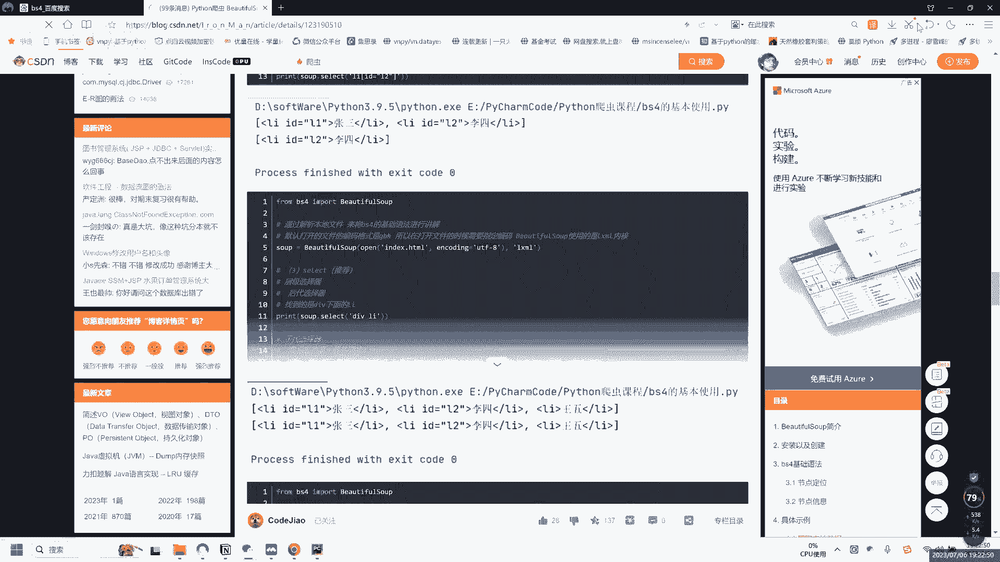

大家知道大家知道，就是说我们他静态数据爬下来之后，把数据嵌入到前端的，我们就是要通过这个b s four，这种办法去把它读取啊，但是我会教你怎么样把这个数据先爬下来，到这个HTML里面啊。

那动态数据那处理就相对简单，那比如说他可能就通过这个JQ的这种，这种这种数据的处理办法，就是说在后台把我们的一个包，就放在我们前台的某个位置上面的，那这样子我们直接通通过我们的一个啊。

准备一就直接可以获取到一个，唉字典的一个格式的东西啊，所以这一点呢特别是东财获取数据，这个呢我就会详细的给大家讲，做出一个类似成品比较高的这么一个案例出来，那这个的话呢要通过bs four呢。

这个其实是很麻烦，那这一节肯定讲不完的，可能要通过四五节或者一个详细的一个教程，才能讲得完，那我给大家规划好这个学习路径，怎么样爬下来之后，你你就自己在看看怎么样，如果你确实很需要这个数据的话。

你就用vs for对这个数据进行一个编译啊，啊就说我们就说生成了啊，直接获取到HTML代码的时候，要通过插pad ps4这种方式把数据，把我们的这个TM的数据，翻译到我们的一个Python里面。

翻译到一个Python里面好，然后的话呢那第二种就直接转编译啊，那下面的话我们就是要来要来看待，看代码之前呢，我们就是要先了解一些技术的概念，比如说这个base url base u l的话呢。

就是说我们采取这个数据的一个真实网址啊，那我们都知道这边的话我们看到有一个网址，是不是这个网址呢，其实它里面的各种数据，它又有很多的子的子网址，或者说二级网址，这个二级网址我们怎么样去找到它。

我们就是会后面会教大家办法，大家就要知道就是说有二级网址的这个东西，就这个二级网址我们就称它为一个furl base url，对不对，被需要L，然后呢呃我们是一个爬虫嘛，那爬虫的话。

我们但是我们实际上代码层面，我们又要模仿我们的一个浏览器的浏览器USA卷，这里呢就有一些模仿浏览器的信息，是不是比如说这里你是用苹果浏览的，还是用一个还是用一个你的windows系浏览。

到这里又写的不同啊，这个refer就是说上一级的上一级的网页啊，refer就是说上一集的网页是怎么样，那比如说我们这个是二级的网页啊，它是上级的网页，就是这个一级的网页对吗啊。

然后呢我们很多时候啊就是说嗯登录的时候，我们会有一些登录的信息，就比如说我们现在在东财，是不是那东财这里会记录记录了，这边诶我是用微信登录的，对不对，那我是用微信登录的话。

它会帮助我在cookies这里是不是是不是会，啊随意一个包啊，那这边是不是会帮我们记住一些我们的，现在的一些登录信息，比如说这个cookies啊，那其实这个就包含了包含了什么。

我们用微信登录的这么一些信息，你不懂他这个为什么表达微信登录没关系，你只需要复制粘贴就可以，好不好，所以就是说要看代码之前，我们要先看懂这三个东，这几个东西，就是说我们实际上要爬取的真实网址。

我们现在要模仿一个浏览器，你的上一级网页是什么，你的cookie是什么，安全信息啊，这几个搞懂了之后呢，我们就开始要看我们的代码啊，好啊，我之前我之前刚刚讲的内容啊，有什么不清晰的地方吗。

大家先互动一下啊，如果那没问题，我就接着往下讲，啊先回顾我们第一个要下一个捕捉浏览器，是不是，然后打开我们愿意的网页，按一下F12这个界面就出来了，出来之后呢，我们就要卡包，卡包的话呢。

就是说哎我们这边就是点一个这样重新载入，你看到的一开始可能是这样的，是不是得重新载入啊，那就这个就刷新了一遍，那个所有的信息都在这里啊，这样子你就停止，你就不要再录包了，然后你就检索你想要的信息。

比如中国移动，对吧，中国移动啊，我们看到这个respond里是这种格式的，这个是动态动态的一个数据传输，然后点到这里啊，这里有我们要的数据，但是，点这里啊，我们要的数据啊，但是它可能是一种。

这里有我们要的数据，但他可能就已经嵌入了，直接把这数据呢写进了这些类，就HHTML格式的这些里面是吧，这个是一个静态的数据传输，静态动态我们搞清楚了之后啊，然后呢我们就可以用代码先把这个获取下来。

啊啊啊，这基本概念搞清楚了，给我打个一，有什么不清晰的地方吗，有不清晰的地方就先说出来啊。

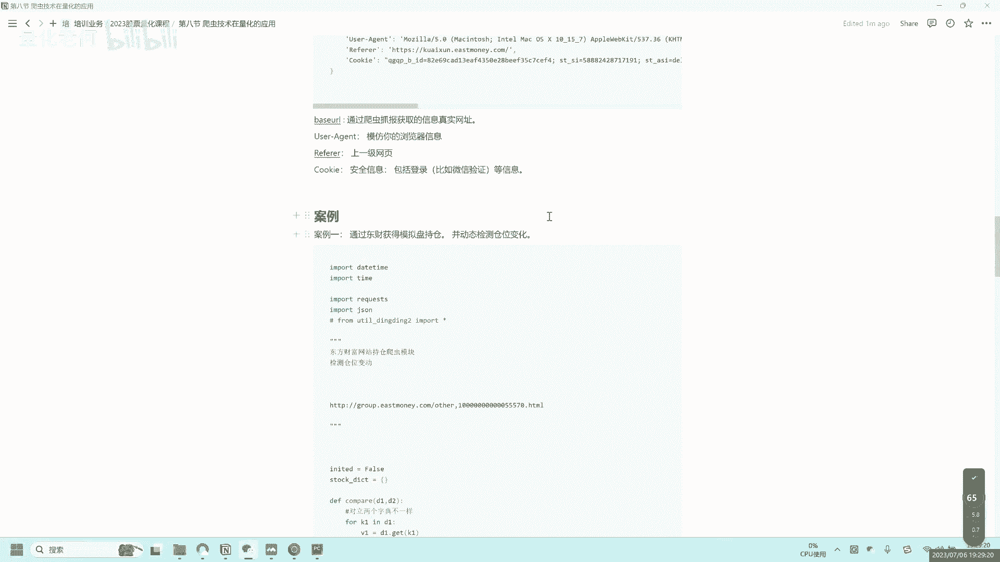

行吧也没有的话，我们就直接上干货，首先我们看雪球，就我们刚刚的这个网址，是不是，那别的你们都不用管，所以我们看到慢慢这里就运行下来啊，月下来的话呢，我们就是说呃它会到这个gas stop这里吗。

这边的话就是说我们呃就是要到这边啊，这边我们就需要获取雪球这个base url，是不是这个base url，base url的话，我们就来看一下这边哎先打开它。

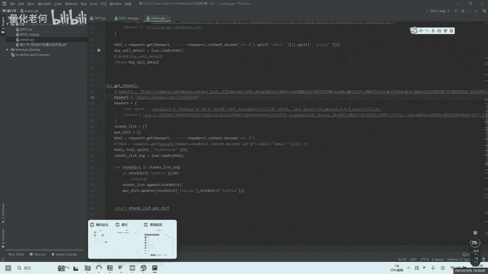

我们就找到了这个包，是不是啊，所以我们刚刚说要获取这个仓位，仓位的话，我们就是说他有中国移动的好，那中国移动在哪呢，我们是看看，首先确定我们要有这个名字是吧，还有还有那个仓位为9。96，是不是9。96。

而且仓位是9。96，是不是，所以确定这一堆代码就是我们要的东西啊，这一堆代码就是我们要的东西啊，那这样的话呢，我们现在的话就是说哎确定他这个静态的方式，静态方式的话，我们先不管那么多。

静态动态是交给他编译时候要做的，是不是我们现在先这个爬下来，爬下来，就是说你看这个非URL的话，就把这个先拷下来。

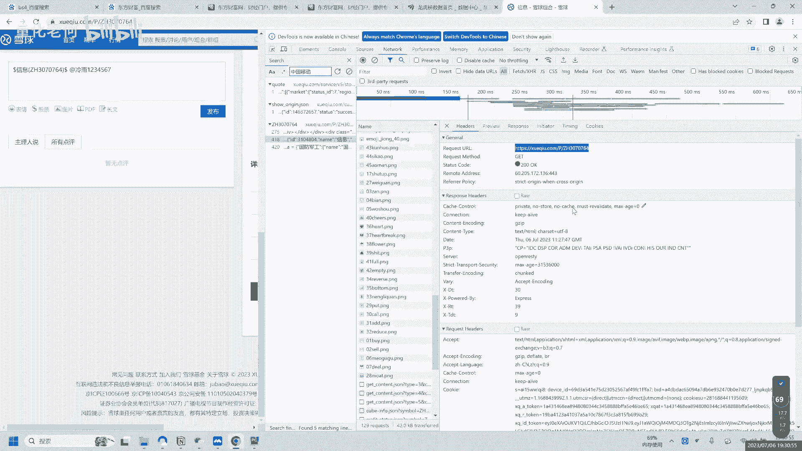

这里先考下来，然后的话这个我们看看是不是有个user aguer agent。

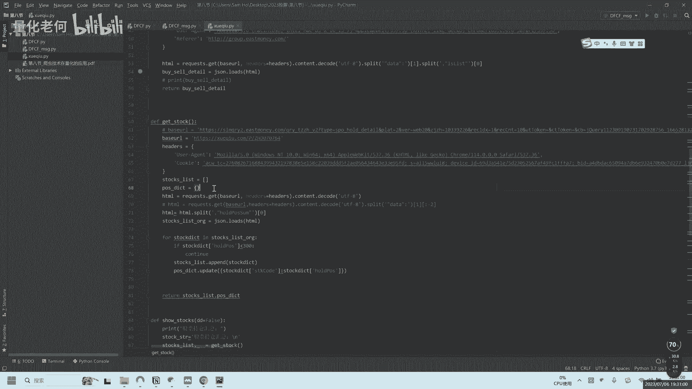

拉下去，比如说agent是肯定有的，也是这个UA嘛，因为这个是不是也把它这一段就给他拷过来。

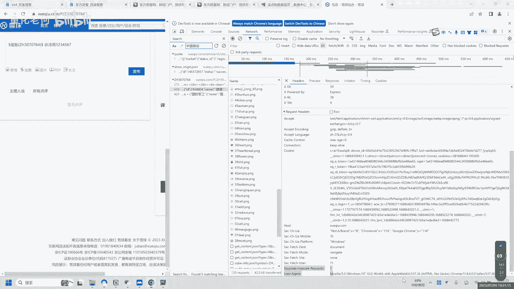

拷过来。

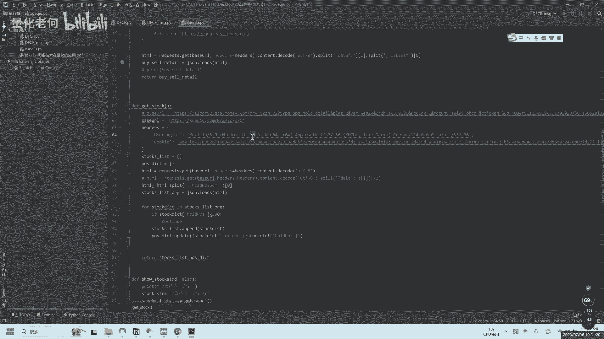

这里对不对，然后呢嗯cookie要堆吗，你有cookie复制cookie，没有的话，可能就是不一定每个都有啊，有的话你给他搞下来。

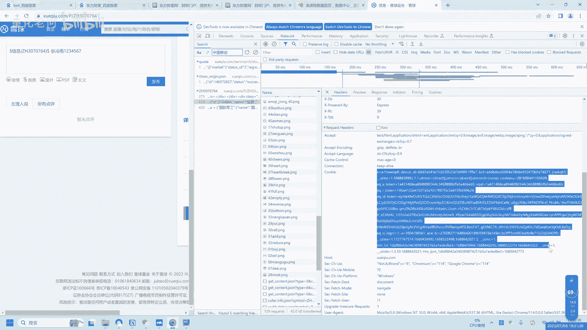

是不是复制下来不下来就给它弄到这里去。

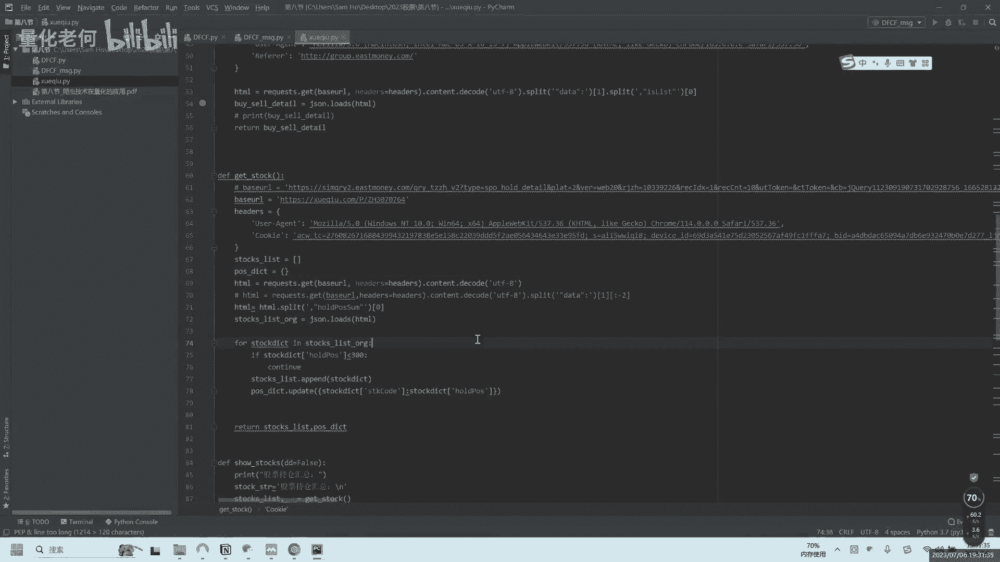

弄到这里去之后呢，我就先不考啊。

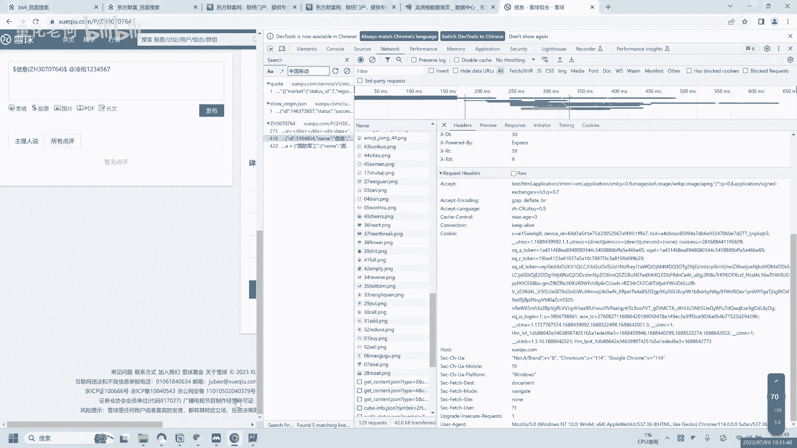

就这个是之前的，看行不行不行，我们再来考好吧，还有一个refer fer ref的话。

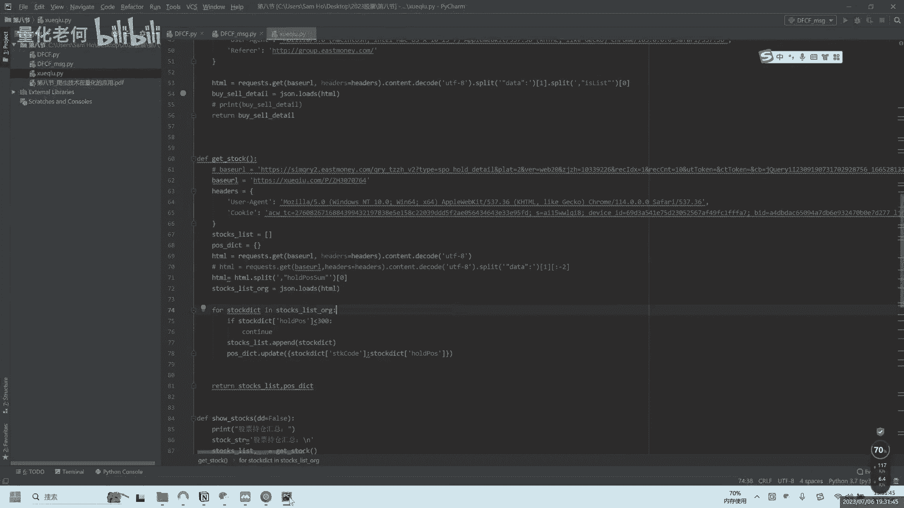

这里是不是没有啊，这里也没有一个WIFI，就上上一次的网页，它没有，没有的话，你们就不用考，不用卡。

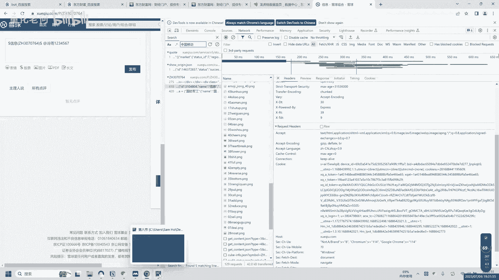

那就这几个是不是啊，那它就是嗯你就套用老师的模板，用requests啊，这个用了requests这个包，Request get，然后这个basil有了这个头有了啊，把它的把它的内容转解码为UTS杠八啊。

然后这里就可以可以拿得到了，那这边的话我们就打个断点，这里我们就是来跑一跑啊，搞错了，好那通过这样的方式，你们套用何老师的模板，要把这几个放进去，放进去之后呢，我们就拿到了这个HTML，是不是HL。

我们就给它打开啊，你们看看它是什么类型，STR类型是吧，那打开的话呢就是看到这么一些数据啊，中国移动有没有，啊中国移动weight9。96，是不是有中国移动了。

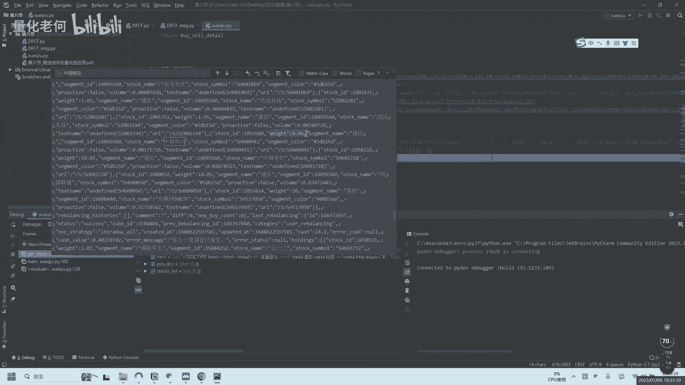

有9。96了，对不对，那现在的话那对看一下是不是就这个东西，中国移动9。96。

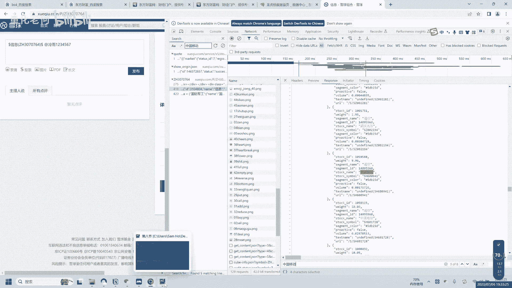

我们再来看一下，中国移动9。96是吧，就这个是我们要的东西，但是我们现在就面临了一个麻烦，我们现在获取到了是一大堆，一大堆的这个STR去字符串是吧，我们怎么样把它提取出来，我们现在目标数据已经有了。

但是我们怎么样从这一大堆里面提取出来啊，我们也不能用手动是吧，也不是你看就看得到，但你用用计算机去处理啊，所以这个的话呢，就是说我们就是遇到了我们爬虫里面，最繁琐的一个地方。

就是要把这些换成我们想要的一个格式，就比如说我想弄一个字典，或者弄一个data frame去把这个装起来，我别的这一堆字里面不要，我就要现在的一个股票名字，股票代码，还有仓位，其他的我都不要。

那这种情况下就用到了。

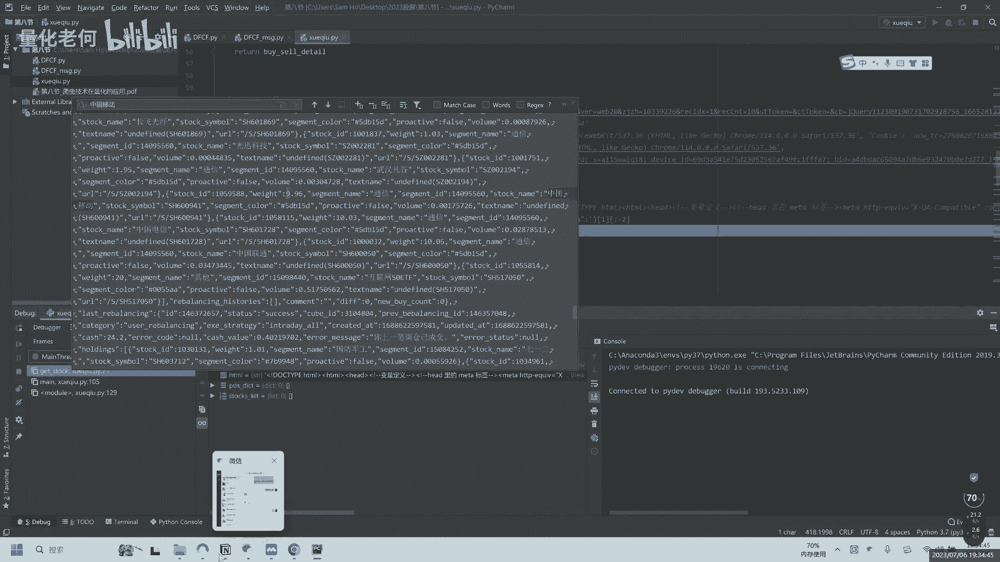

我们给大家讲了一个技术，就是这个就是这个bs for是吧，这个bs for bs for的作用，这个bs for的作用就是那我们现在看到的这里。

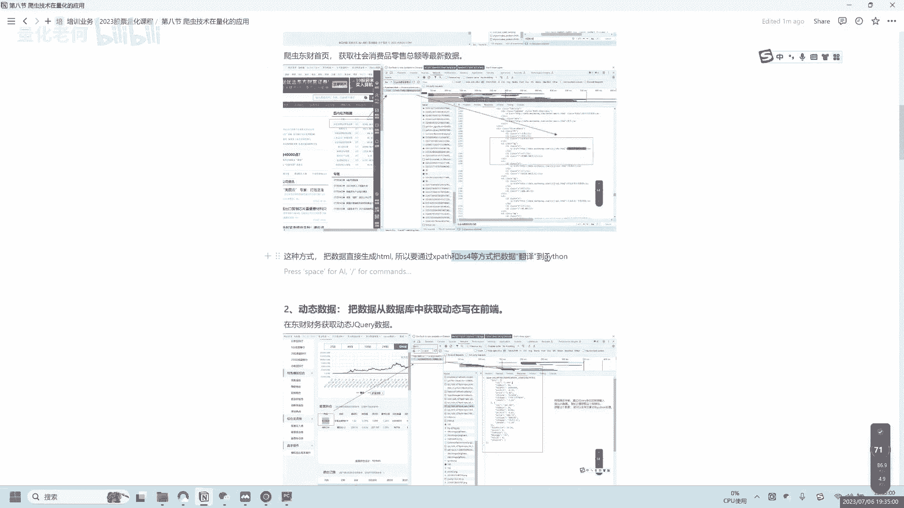

HTML获取到了一堆数据里面，拿到我们想要的想要的仓位，还有我们的一个权重的一个数据啊，所以你们现在就明白了，它的一个作用到底是什么，你们现在不懂这个技术，我也就这一节课我就没办法去讲了。

但你们要知道他是一个怎么回事，事后你们怎么样去学，是不是，但是老师呢已经通过这样的办法吧，这个网页是不是给你们都拿到了呀，我们拿到了，下面就是下边就是说你们要通过这个，He is for who。

对HTML，内容，进行提取，啊提取的话呢得到，股票名字代码和三位并形成字典，是不是就这一步就下面你们要做的啊，这个你们就是留给你们自己去进行一个琢磨，进行一个琢磨，就别说网上教程也很多啊。

所以这个就讲到这里，静态的静态处理就是这样一种一种办法。

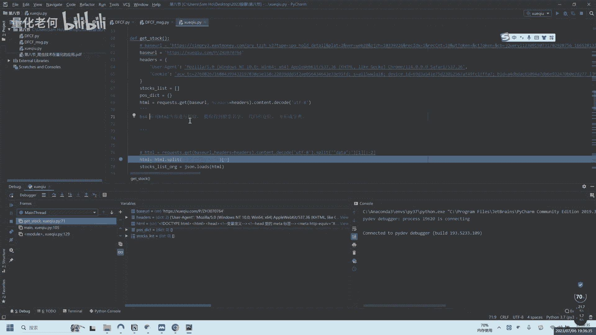

一种办法啊，这个就讲到这里，这是一个我们针对比如说雪球，它上面就是这个，非常好的啊，这么一个操盘手，我们想复制它的一个操盘啊，这个就是老师给你们讲到这里。

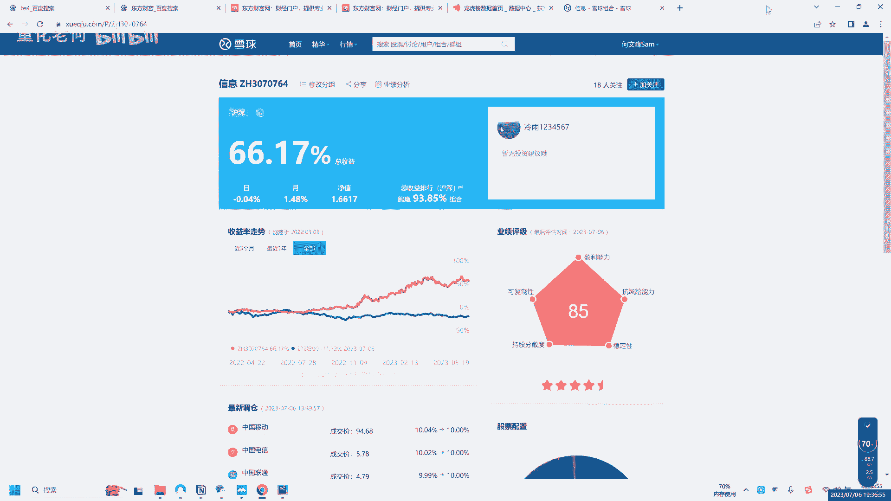

下一个，下一个呢，东财啊，仲裁这个是完整度非常高的啊，你们不要泄露出去啊，这个是我其实我有在用的啊，这就是说但我在用，其实我也从来没有去做过任何的公开课，或者是去宣传这个东西，因为复制别人盘口。

说句实话，在我们圈子里面并不是一件非常光彩的事情，但是我们现在呢无非就是给大家讲技术嘛，是不是讲技术的话。

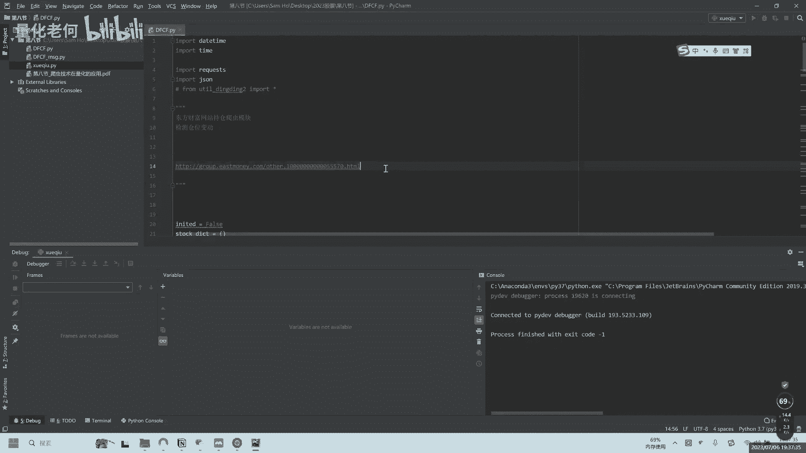

就是说诶，比如说我们这里，打开看，我们看一下，这里出现了一个问题，我们也没有登录啊，打开这个网页，我们需不需要登录，它不需要我登录，我就可以访问这些信息，对不对。

不需要登录就说明我可以不用什么cookies，也可以正常的进行一个访问对吧，然后这边的话呢我们能看到他的操盘日志啊，详细组合啊，但实际上我们要的是什么股票持仓嘛，也是一样的嘛，我要复制它的一个操作代码。

我要是不是名字，我要还有他的一个时常数，我要是吧，时常数时常数，这里就是它没有一个比例啊，比例的话，我们又又要自己去对它进行一个换算啊，对它进行一个换算，但是就是说他有比例也行，他有这个持仓数量也行啊。

就我们拿到之后，我们再来对它进行一个计算对，然后的话呢我们就是OK就就简单来说，就是我们要要的要就这个东西喽。

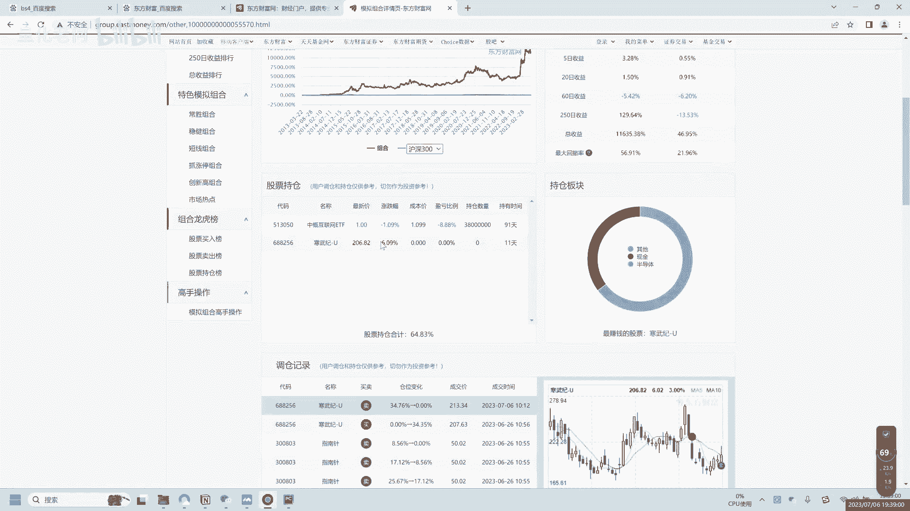

那这个东西的话好，我们现在拉下来看我们这个代码，这个是完整度非常高的，卖这里就是说获取它的一个股票嘛，对不对啊，然后非要L同样的这几个东西啊，同样这几个东西啊，但是我这个是哪里找老师。

这个是哪在哪里找的呀。

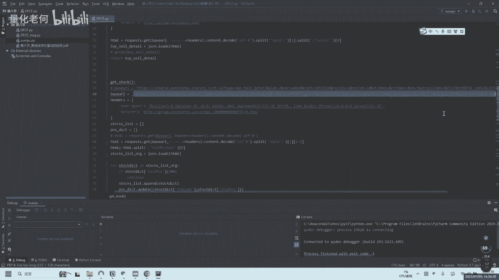

这个到底是什么东西啊，是不是，那同样的我们回到这边按F12，含5GU，我们现在F12周对它刷新好，抓包抓好了之后停止这边收，所有这些包呢都是有寒武纪12的，然后就说我们来看一下到底是哪一个哎。

这边就这个有趣，这是通过最科比这个拿到了，是不是，然后这边拿到的呢，这个就是，Ppose，这个是不是持仓啊，这里是不是中文名啊，这个是不是代码，对不对，所以这两个磁场这里是不是都有啊。

这个我们一看就明白了哦，原来这个是我们想要的一个数据是吧，那想要的一个数据拿到了以后，我们就是说现在呢就是要看他的头headers，这边的话就是有我们想要的东西啊，我们确认了这个包之后啊。

对应过眼神就是这个人了，是不是，那个时候我们就要拿他的这个我们称之为request url，这个东西我们就拿到了，他复制。

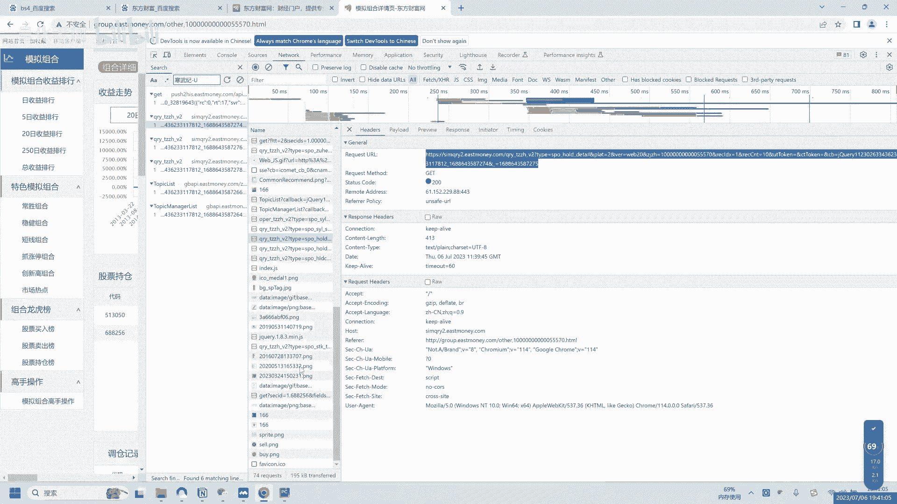

我在这里拷贝，对不对。

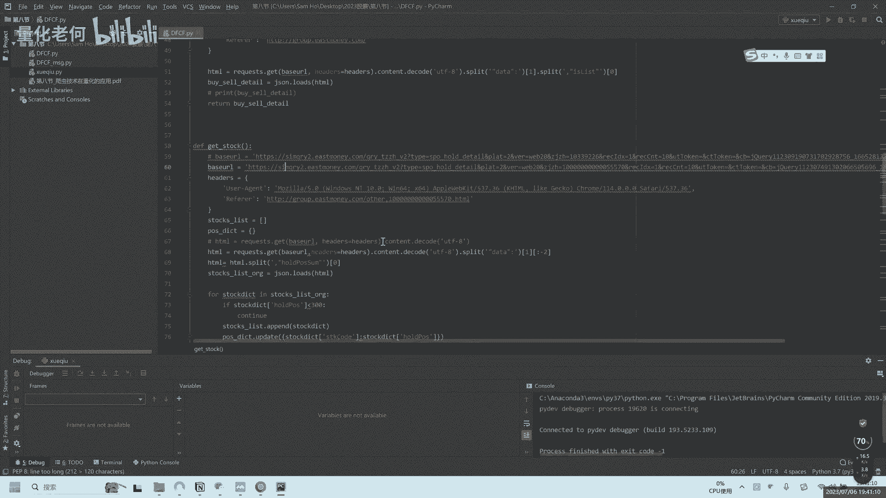

同样的有我在看那这边是不是有一个refer refer，那如果他有的话，你一定要给他弄上去，是不是还有UA，他有的话，你也一定要一定要给他弄上去，有没有cookies的。

他不需要我们登录它就会没有cookie，没有cookie我们就不填啊。

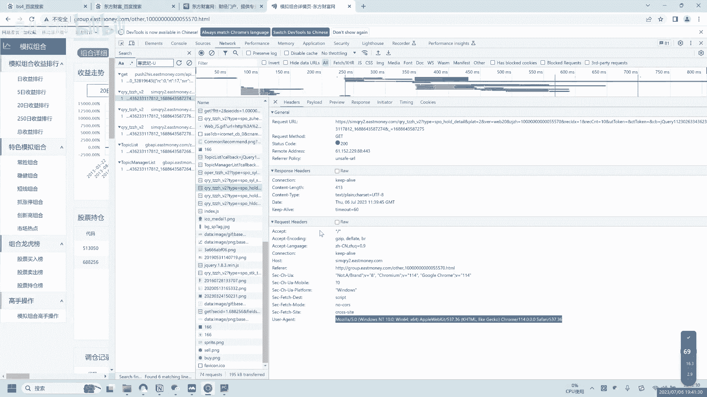

没有cookie就不填，那这样的话我们就是其实要素1233大件拿，拿到拿到之后，拿到之后我们再对它进行一个我这边，对吧，我们这打个断点，看看拿到解码之后它是一个什么样子，不好意思，搞错了。

然后之后我们看看那个HTML它也是STR，是不是，它也是一个STR，但是它没有一大堆，问题他们有一大堆什么HTML格式嘛，它只是非常简短的这个，那我们就是简单的data fit，通过data这里。

通过data这里就把它分成两半，是不是分成两半，然后只用后面的一段啊，只要后面的一段贝塔这里贝塔的话我看一下，我们再往下跳一跳就跳到这里，我们就发觉HTN就变成什么呢。

就没有前面的一段是他后面还很讨很讨厌厌的，就是说后面还有一堆，其实我们要的就是想要这一段，这一段的话是一个什么列表，是不是里面是个列表，列表里面是个字典，对吧啊，这个数据我们想要的。

所以好后面我们通过SGR的处理，后面这个也处理掉对吧，就跳跳到这里，跳到这里之后呢，我们再来看HTML诶，就剪掉了，把不要的垃圾数据给它剪掉，剪掉之后呢，我们就JSON点low的这个HTML。

我们就是可以把它变成了一个什么东西，Stop this order，变成了一个列表，是不是啊，是不是列表啊，列表里面是什么字典，列表里面有两个元素，分别对应两个股票，两个股票。

它里面是不是就是由我们就变成了一个字典了，是不是他这个是不是跟我们这里是一样的。

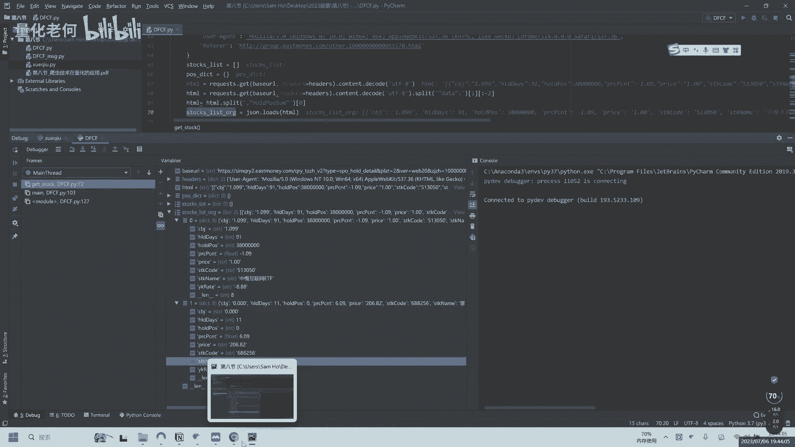

是一样的呀啊所以动态数据它非常好处理。

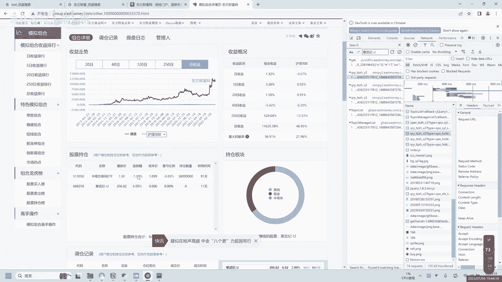

就我们经过一些STR的修剪，再通过这个JSON点low，就能把一段文字变成一个字典，那有了字典就说明我们可以动态的去获取，我们仓位变成字典，你就可以对它进行一个检测是吧，监测的话呢，监测的话呢。

那这里也是，一样的哦，就拿到这个，就拿到这个之后就可以对它进行一个监测啊，那这边呢，这边呢哎他可能我就误删了一些东西啊，他这边应该有一个叫做base l啊，他拿到的是一个他的一个买卖的一个记录的啊。

搞没了吧，等一下，是这里的话就是它有一个非SIL，这里也有的，啊这边搞来的，好我们再来看一下，同样的就是我们现在获取它的一个买交易记录，是不是他的交易记录嘞，他可能就是说，我们再来这个网页里面。

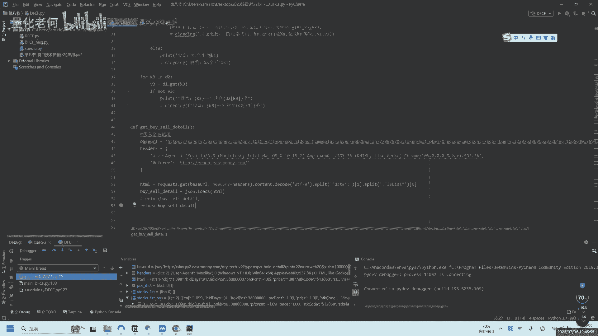

它的交易记录，调仓记录是不是在这里啊啊啊，好像记录在这里是吧啊，那我们就是也是看一下诶，搜一下这个213。34，就我知道的话，他就是肯定有这个包，有这个数据是吧，那我们再来看一下啊，卖寒武纪。

那这边的话他就是说34。76啊，就他before是3000，阿斯特就变成零，就说明清仓了是吧，这个是不是我们想要的数据啊，那同样的它也是一个最carry的格式。

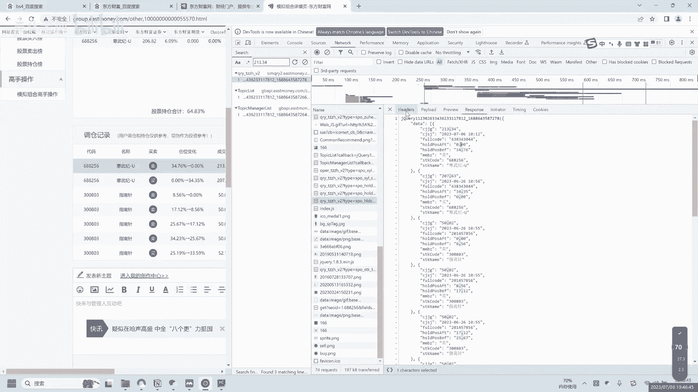

他们同样的啊，这个就给他拷过去，这离，是吧，把这个拷过来，然后呢嗯同样的这里也是一个叫做。

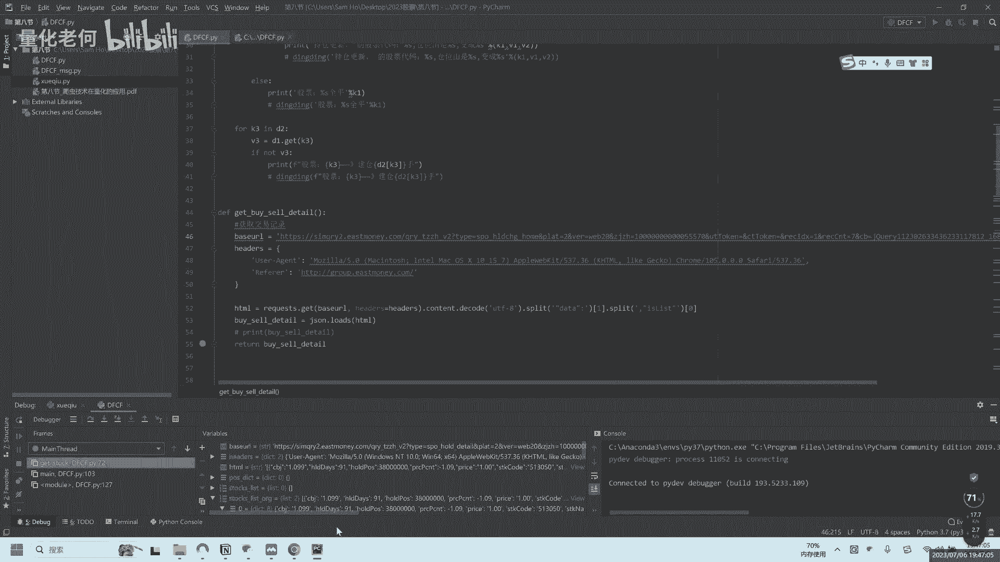

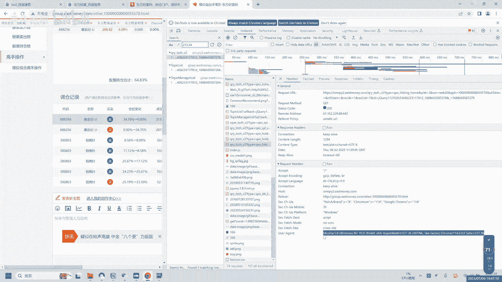

Ua user adrim，你是用什么浏览器去仿真的。

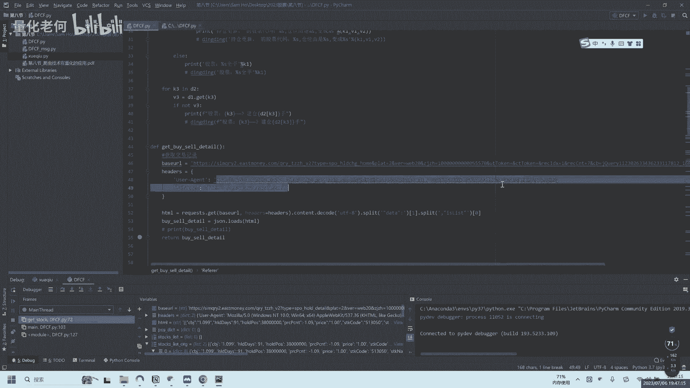

然后也是有一个refer。

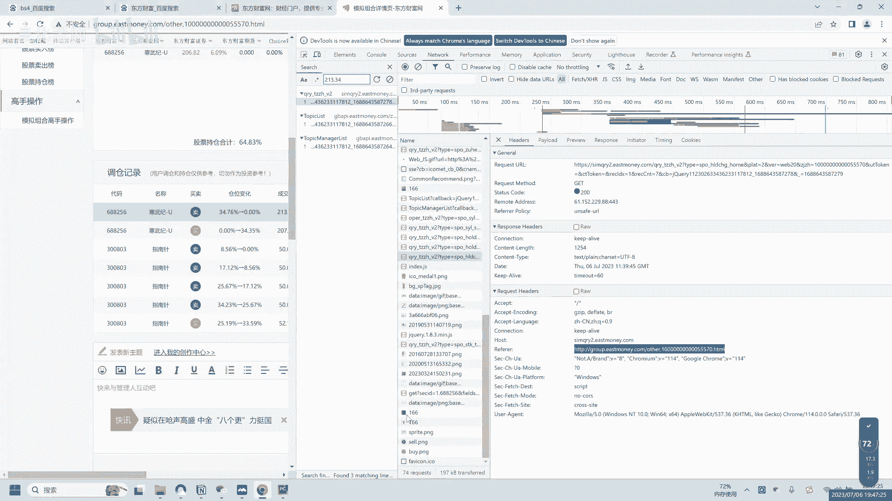

是吧，然后给他搞过来好嘞，那现在的话呢，我们再看看它能不能获取到这个东西，这边这个断点我们就打了，好不好，断点我们就不打了，然后我们就是去看这边，哦他这边只有当它有改变的时候，当它检测到有变动的时候。

他才会去获取这个获取这个持仓的变动啊，获取这个持仓的变动，但我们也可以这样子，我们可以强制的让他去检测一下，嗯就比如说就比如说我们，就是这样子写在前面啊，让他去看看，就看看这个呃。

这个东西by sell detail，val detail是不是有啊，里面都是有它的一个买卖记录啊，这也是没问题的，就可以获取得到的，是不是，然后呢下面就是我的一些写法了。

就是写法就是说嗯比如说拿到之后呢，进行一个循环的检测，对啊，循环的检测，这里就是说每15秒我检测一次，15秒检测一次，如果我两次拿到的仓位有变化的话，post stick跟stop tip。

这两个前后有变化的话，说明持仓有更新，然后就会把，帮我把那个持仓的变化的信息给打印出来啊，啊对吧啊，嗯这个就是compare，这里呢就是说我通过两个字典啊，因为我们看到仓位都是字典。

你两个字典不一样的话，和这里就是说会啊给我们反馈啊，这两个是否一样一样的话，那就打印，没有的话，那就是不打印，它会通过两个词典的检测，它就说明它的不一样，比如说持仓更新，它的仓位有变动，从多少变成多少。

或者是如果是他全屏了，它就会打印全屏，或者说建仓了，它没有的变，现在有了它就会建仓，那就这样的话，就是说当我们完整的进行一个仓位的跟踪，跟检测好，那你会问这个怎么用，这个怎么用，你都可以啊。

就说你可以让发钉钉到你手机上面，进行一个实时的操作，他也可以把它写到绝经的那个策略里面，把这所有的代码放到绝境的策略里面，当它检测到有这个仓位变化的时候，你直接在掘金那边去对应的进行下单。

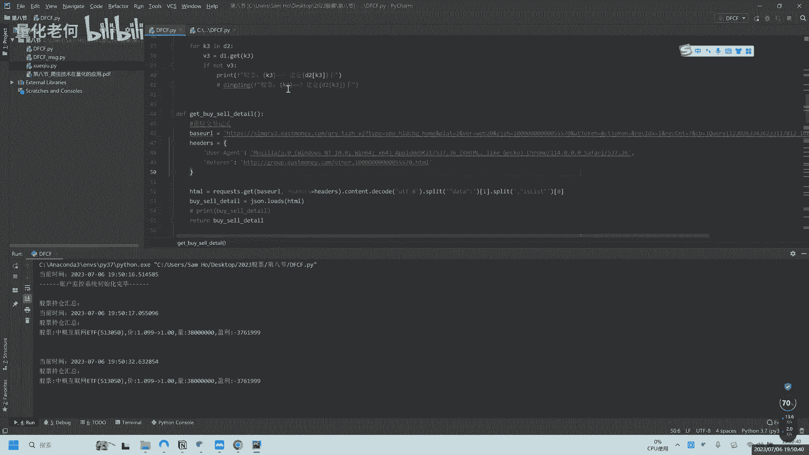

所以这个就能够实现啊。

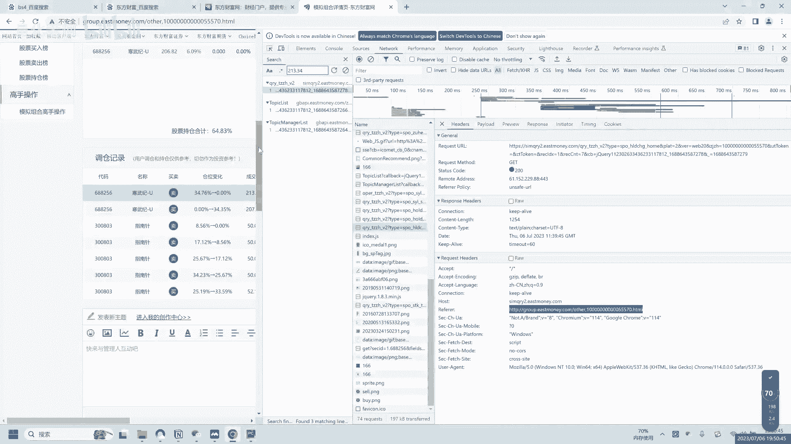

这个实现这个高手手法的一个互动哈，一个互动，好吧嗯当然这里要给大家做一些风险的警示啊。

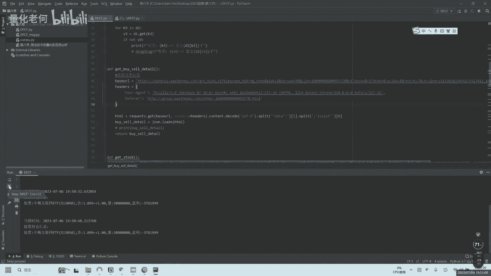

风险的警示啊，所以这个事呢我又做了一段时间了，但最后我发觉不赚钱，你看到你这个是很好的，但实际上你很难跟困，哪怕有一些高手的话，他那个他会做的可以，但你不知道他为什么有一天他就他就掉头向下。

然后你过了一段时间，我曾经操作过一个，他就整个把所有的它的用户，比如说这个高手的话，他把所有他的用户记录全部都删掉了，他就说要我们跟着他就懵逼了，就一下子全部全部亏钱。

所以就说他在公布在这上面都是模拟盘，但实际上我们用真钱去跟的时候，它很容易会出问题，所以这个事情就不建议大家做。

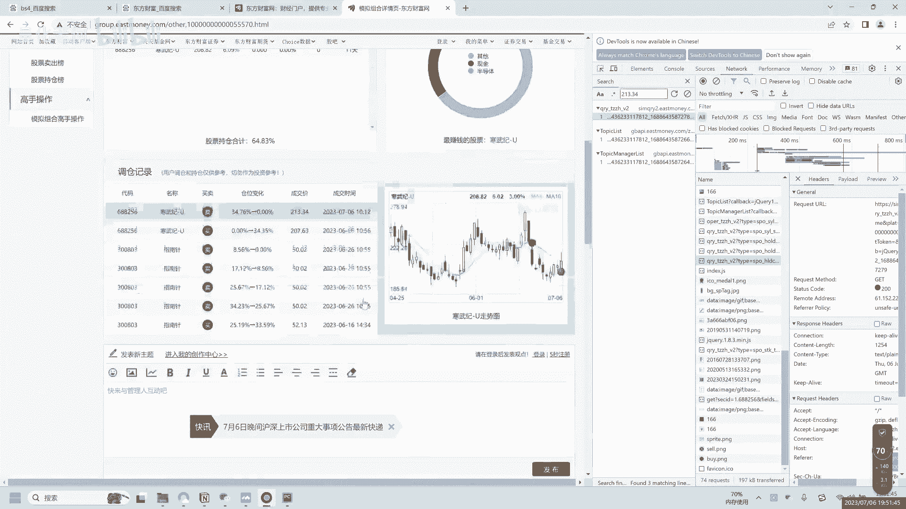

但是这个技术呢就可以给到大家是不是，但这个事情你说哎何老师啊，你这我觉得你这个思路不错，跟着去做，但实际上这个我是吃过亏的啊，就我不建议大家这么去做啊，我不建议大家这么去做，然后的话最后有一个代码。

一个代码，然后就是说我们去，你这边是不是有一些动态的消息啊，动态的消息是不是，比如说有时候我们想看一些，想跟踪他们的一些消息啊，或许你拿到之后呢，你动态判断一下跟我们现在的股票，你那个自然元素里啊。

那个那个trap GDP不是很火吗，你把这个消息给到他，是不是给到trap GDP的那个接口里面，你让他对这个进行分析，对我的股票是不是有什么影响啊，所以就是说我们现在的那个数据科技啊。

能够做到能够善用这些东西，是不是啊，哎那TRAGDP有接口了呀，你可以对它，你把这个文字我们拿到之后，比如说他更新的，我们交给trap GDP，让他告诉我，比如说我持有平安银行的。

然后这里啊我们的重要官员就说诶，发布了这个消息，会不会对我平安银行的市场有影响，也就是可以做一个这样的事情啊，啊做这样的事情有没有用，我就不评价好不好，但我们现在有了这些手段去处理。

但是你要有一个重要的前提，你是不是要把这个给获取下来啊，或者像你应该怎么做呢，同样的一样的好不好，一样的，比如说我们这边，我们这边把这个打起来，把这个红色的开起来啊，那这是不是获取动态获取很多停掉。

那我们就打要围绕滚增长不出来了呀，就这个东西啊，你看这个东西看一下它的格式，我们拿下来之后，是不是很容易就把它变成一个字典啊，因为它是动态方式，是不是他们有嵌在很多hp ml里面的，对吧啊，我们怎么做。

同样的CD base url有了cookies，要有是不是UA要有这三个东西拿到，这个这个这个拿到了VIVO也有，是不是佩服也有，我们现在就是要拿到它，拿到了之后呢，我们再看一下诶。

诶诶是不是有了一大段这个东西，是不是拿到了拿到了，但是有一个叫CPAGE的东西，我会很烦，我们就把它剪掉，再简单的追深点low，是不是把它变成一个什么东西，变成了一个，列表有50个。

50个里面呢我们就能扩大，比如第一个我们的总理就说哎，这个信息是不是有一个叫digit，这个是比较长，这是不是我们可以把它搞出来啊，那对我们进行进一步的分析，是不是进一步的分析啊，这个很有趣。

这个事情就非常的有趣啊，非常的有趣，变得嗯然后就拿到就拿到了这个东西了，用这个东西了啊，那后面的话就是，那就这样吧，就拿到这个东西了，拿到这个东西，Get list，拿到打印，嗯对吧嗯。

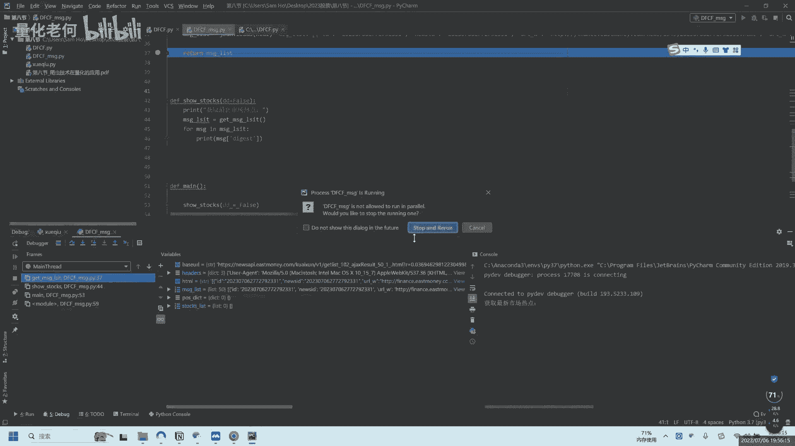

好，啊然后你能不能就写一个脚本动态的检测，你这个有没有更新啊，每十秒啊有啊，这里有技术啊，这个不是有一个叫compare吗，你拿过来改装一下，就让他十秒钟检测一下，就把新的这一条打出来。

那这个也是咱们的一个作业啊是吧，咱们的一个作业啊，东墙上面获取就点着代码，那实现动态打印啊，打印最新的打印过了不打，所以就让你们先把这个给跑起来，跑起来之后呢，把这个compare这个挪过来。

然后呢最后就实现了每十秒钟打印一次，执法最新的这一条啊，给它打印出来，你看是吧对吧，所以这个就是我们的啊啊啊他没有更新我们，那我们也没有更新的对吧，他没有更新，我们也没有更新的，对不对啊。

这个是跟他一样，跟他一样，那行吧，那这一节课的内容就这里啊，是明年的内容模板的内容，所以大家要反复的去看，就是作为一个我们爬虫热量化应用的学习指南，那老师呢是有非常多的实战经验。

才给能给大家写出写出这么多东西啊，写出这么多东西，那实际上最后同学们要去实践的话，离不开同学们自己的一个努力，老师只能把这个指南做给你了，嗯这个BS4的话，说实话老师也没有多琢磨。

但是我知道他是有什么用的啊，有什么用啊，所以静态数据的话我就很烦，我就我就不弄它了，我就不弄它，但动态数据我们这边就是完整的解决方案，就给到大家了，好不好，然后剩下答疑时间留下5分钟答疑啊。

我看同学们不积极，那你们有问题就问，没有问题的话，那我就是也差不多就这样了，或者可以开麦，可以开麦，好大家提问一下吧，哎何老师您好，还能听到吗，啊啊啊，对张总啊，您说诶诶你好你好，我想问一下。

是不是有些网页他有技术，咱们就是获取不到它上面的信息啊，他会屏蔽或者怎么样，会不会有这种情况，有一些网页它有反弹，它有反弹的话呢，可能就是啊用request，这个就比较难搞。

就是但是我现在访问几个门户网站，包括雪球，包括我们的一个东财，这两个就比较大了，我都没有问题啊，那我就是还没遇到，在就是在我们的工作场景里面啊，在我们的一个金金融领域里面，就是一些大的门户网站。

都没有说太过有太激进的一个反华的东西，但假如是你后面有遇到的话呢，你可以用这个salary，这个就是说它会打开一个叫做谷歌浏览器，然后通过仿真手，你手点点点的这个动作获取相关的数据。

他这个就是说如果到了这个份上的话，就目前没有任何的反驳方式可以去，可以去杜绝这个东西啊，但是我觉得目前来说我们用这个就够了，用request模块就是能够解决问题啊，好这是我的回答，好的谢谢谢谢何老师。

哦其他同学有问题吗，今晚讲的内容会不会就是说内容很多啊，听起来有点头头大，高级高级高级其他同学还有问题吗，抗压的辅助治疗，激光照射疗动脉，以及在手机上有一个小程序用户，我不知道你是哪位。

然后我看到你那个麦克风在在在讲话，但是我这边是听不到的啊，我听不到你说话，你也可以打字好吧，何何老师再问一个，就是题外的啊，就现在那个notion AI是不是那个不能用了，都不就是哎呀，这个是啊。

我那个也被屏蔽了啊，都不可用，都不可以了，都都翻车了，把你们带沟里面去了，在付费，实在是不好意思啊，啊没事没事，只能通过他那个官方的那个去去购买才能用，是不是啊，他就就十美元一个月，十美元一个月啊。

有点贵有点贵啊，太贵了，你们如果愿意折腾的话，你们去去去找一下那个官网的，那个那个官网的那个open chat，点OpenAI的那个东西，那个就是真的免费，但又有一个翻墙注册又非常的非常的麻烦啊。

但是他那个是真免费，那个也能用吧，嗯好的好的，搞不来，估计是技术要求太高，沟里面去了就不知道啊，他后面很多都是这样，哎行吧，味道大家都没问题吗，啊就珍惜跟老师互动的机会啊，就是大家一起交流吗。

这个爬虫的技术能做非常多的东西啊，非常多的东西，就是我们如果我们不会这个东西的话，那我们就会被框在，只能用这些是吧，那只能用这些数据了，但是如果我们能够会爬虫的话，加上Python这么强的一个拓展性。

我们就是能把任何互联网上面的数据考察，取下来啊，然后跟我们的策略使用啊。

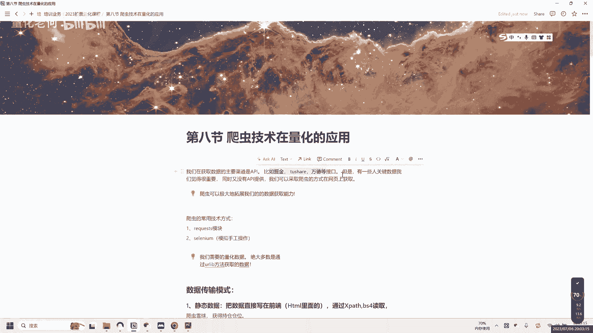

我们的策略使用，我之前还有一个叫我同事叫我做的，拿到一个叫龙虎榜的数据呃，这个倒没了，不知道放哪里，那个数据呢可能非常敏感啊，然后他那个他那个网页上面给他屏蔽了，但是我又爬虫到我们爬得到。

好又多了两条信息对吧，你能通过做作业啊啊手动多试一下，就把这两个动态更新了，把它拿下来，这蛮好玩的东西，哦那这个爬那个交易所呀。

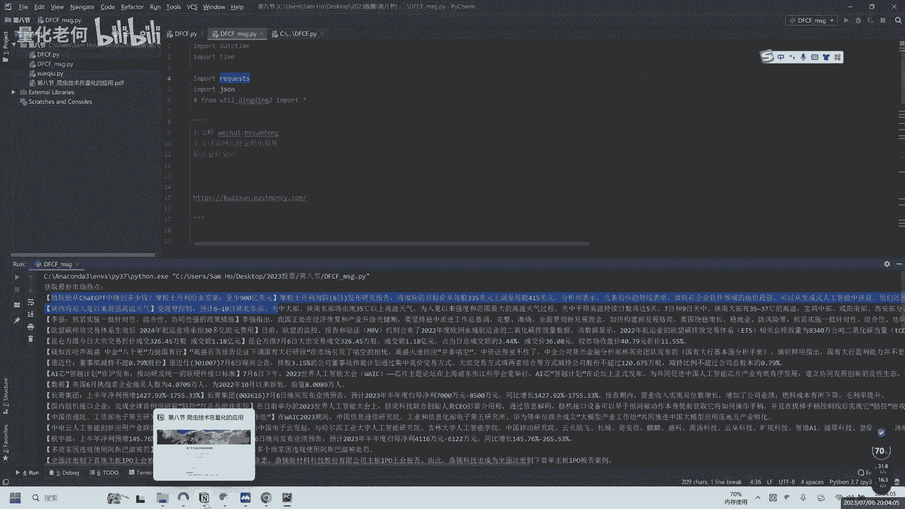

登记是中灯啊之类的一些信息有没有问题，交易所这个这个我倒没有爬过嗯，可以试一下，是不是技术上应该没问题，你不要把他爬崩好，但最好是咨询一下律师哦，吼吼吼，别因为这个事情把把自己关进去了啊。

就这个这个因为是这样啊，这个真的是一个双刃剑，特别就是说是限制级的东西啊，限制级的东西，所以其实这个事情我会很久了，我会很久了啊，我也技术也非也有，但这个我从来都没有做过什么公开课啊。

或者宣传的什么东西啊，因为我不知道有没有有没有一些禁止，但我们这个付费课程嘛就可以给大家讲，但当他用的时候还是得去小心，特别是嗯还是不建议去爬一些，比如说比如说一些官方的一些网站，或者是一些东西啊。

东财没问题，连个人公司的话，那这个你只要不把它爬崩，这个是没问题的，是不是我雪球，你要怎么爬，是不是雪球，这个是是是是没问题的啊，你只要不把他打崩，有一些爬虫的话，就把人家网页一下子给爬崩了啊。

这个就搞到影响人家正常经营啊，那这个就是这个就是不合规的啊，那我们偶尔上去诶取一些数据，是不是啊，我取这个数据用来做监测，这个是这个是没问题的啊，所以就是不不不建议，还是不建议大家去爬一些官方的东西啊。

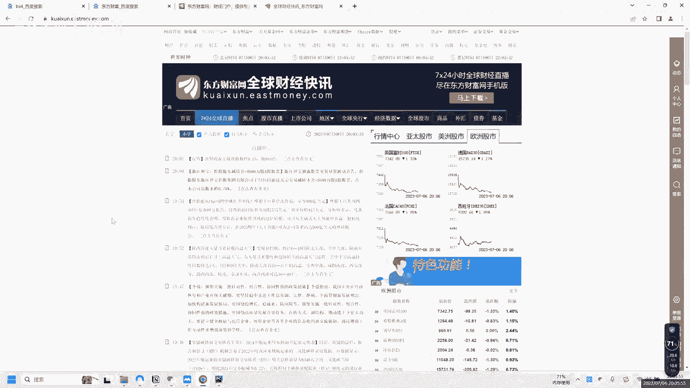

啊还是有一些禁忌啊。

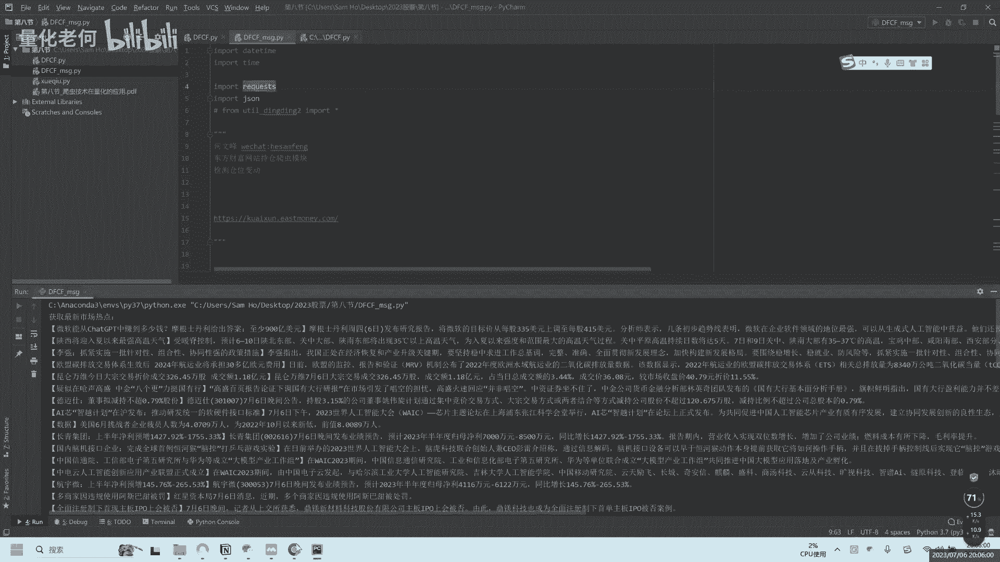

好最后2分钟还有没有问题，所以这节课的课件呢希望同学也能帮我，就是说不要不要不要外泄自己用啊，这个反正就是这个门能用啊，这个有用，但是就是说我们不要做一些违规的事情啊，不要做为首而归的事情。

这个肚子也把握好啊，把握好啊，好就是剩下就是希望同学们能够交个作业啊，第八节课，剩下两节课呢，剩下两节课就我们看基本上都给他讲了吧，很多都讲了啊，剩下没讲的就是说一个AI车内的幽门。

还有这个模拟盘部署也讲了啊，讲这个PYD的加密啊，你的策略就是如果你怕啊，任何人偷你的车了，你可以加密是吧，好钉钉的一个通知啊，这个都是比较简单的，所以剩下的话就两节课。

第一节课专门一节就讲这个AI入门啊，啊就我们有另外一节课。

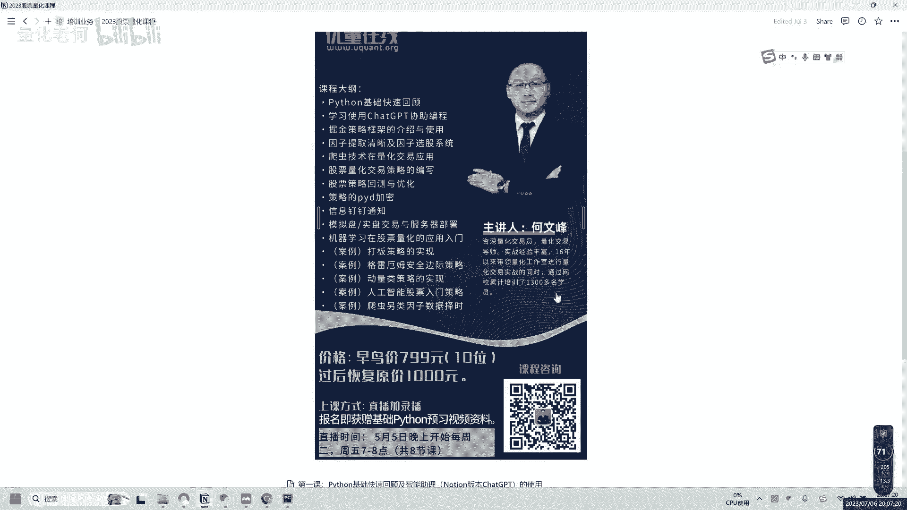

就是说叫做我们有另外一节课啊。

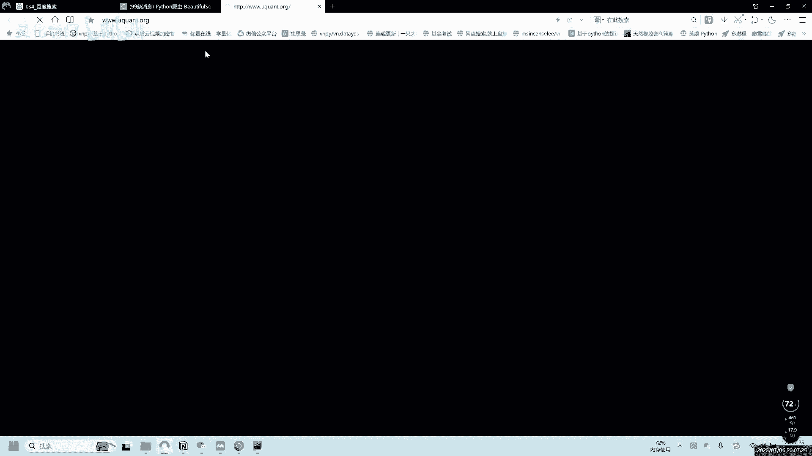

就是说我们的段老师的课啊，他这个是专门讲这个SBM的啊，同学们有兴趣的话也可以参与一下啊，我应该也会参考他的一些内容来做我们的啊，一个一个这个AI的课程哈，啊拿他一点东西来做是吧。

那最后一节就是说给大家讲一些比如说钉钉啊，一些加密啊，或者一些东西会给大家做一些答疑，就咱们这个799的入门课，就是给大家一个入门的这个框架啊，是能实现实现，就是说其实内容也是很多啊。

各位同学的话也是好好的，看咱们之前的一些回放啊，嗯就是好好的学习好吧，那今天今天这一节课就讲到这里啊。

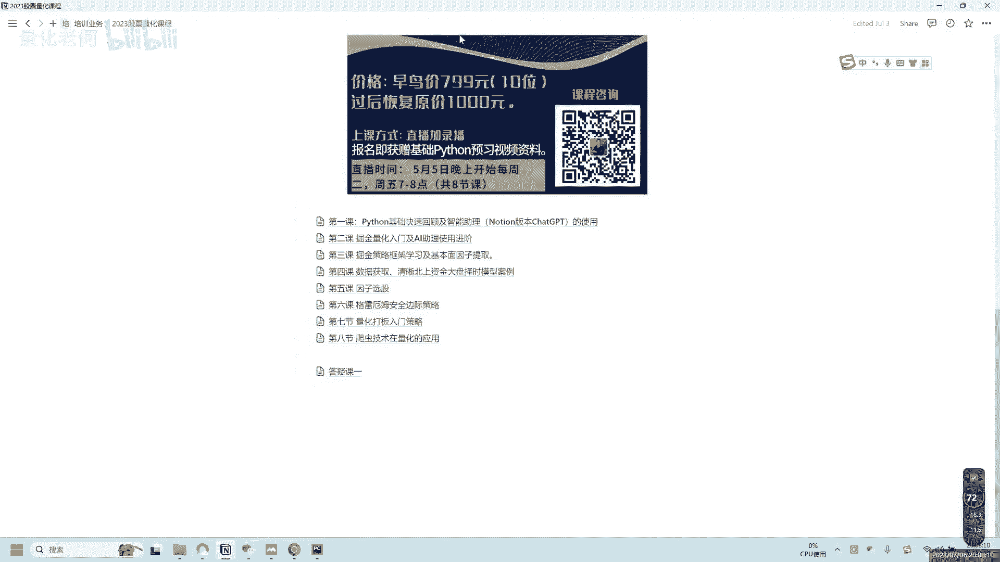

啊非常感谢大家啊。