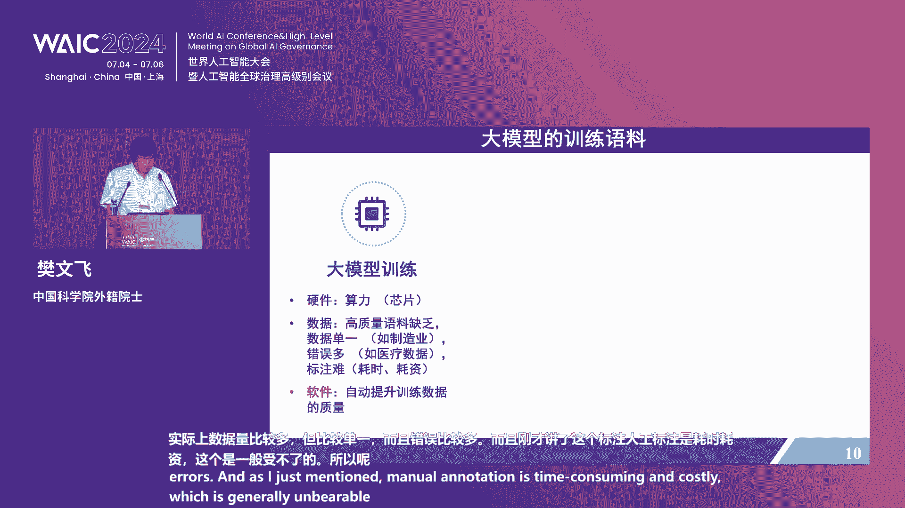
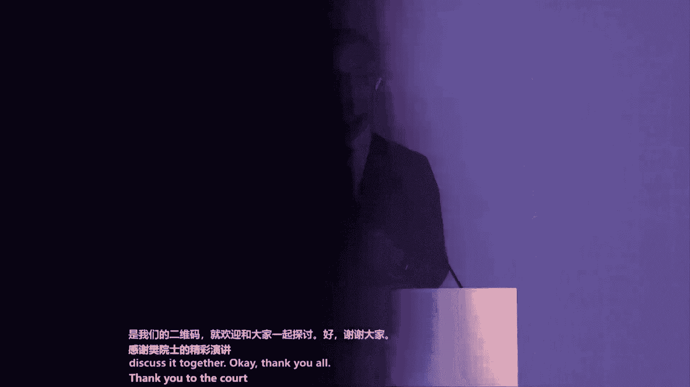
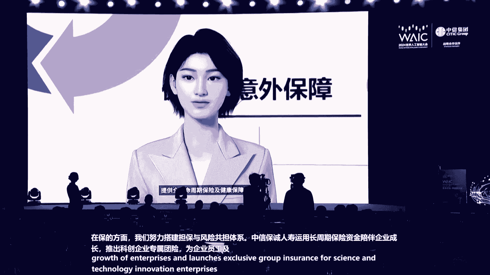
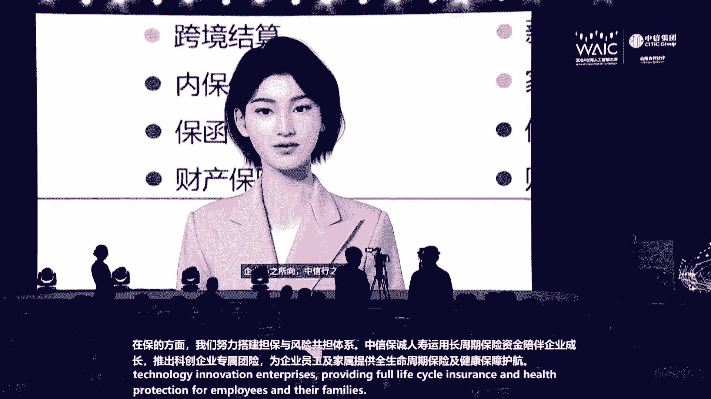
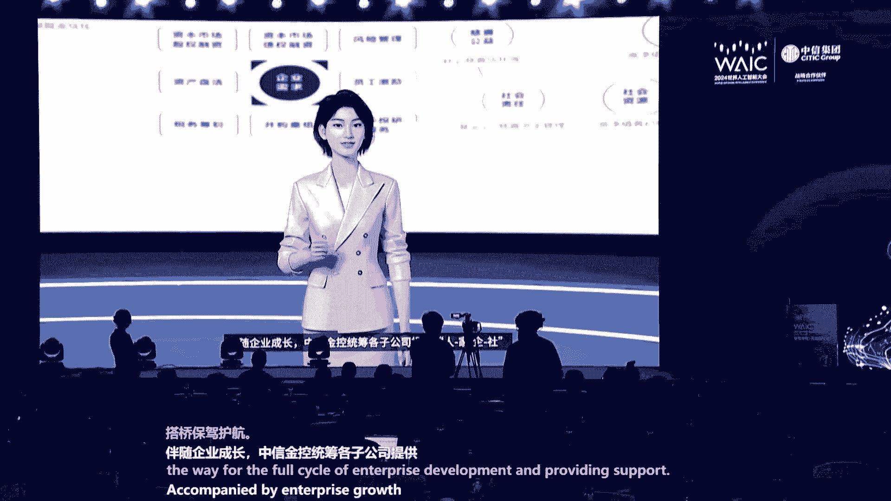
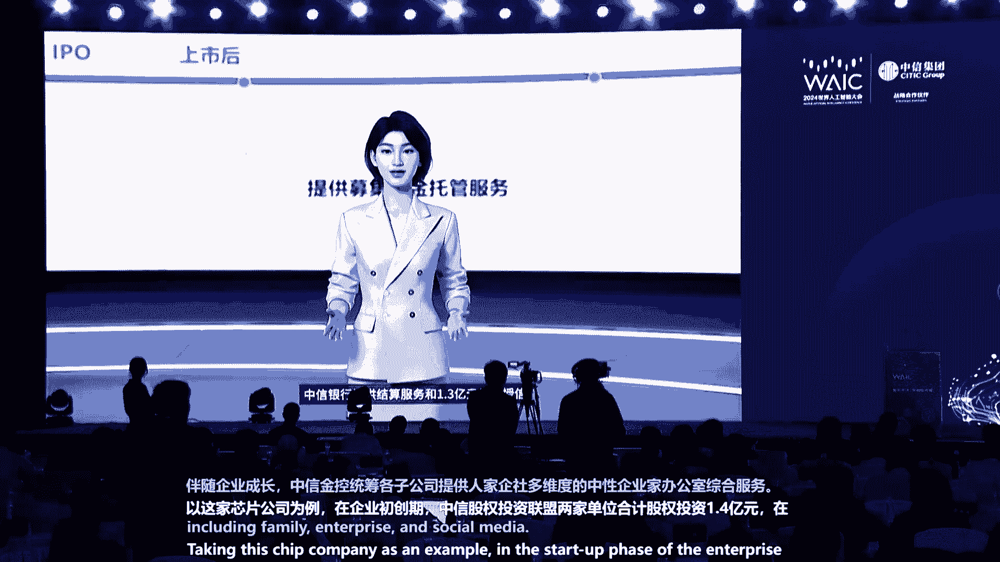
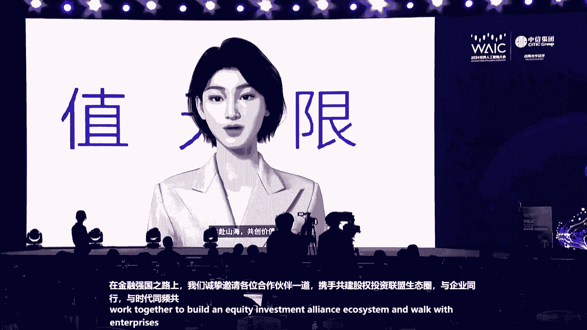
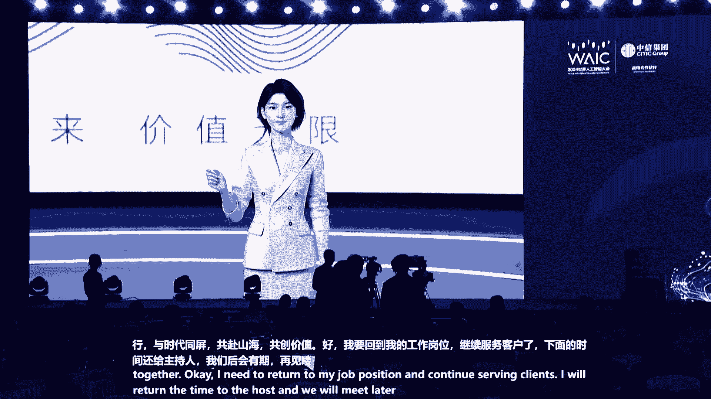

# 爽了！这也太全了！Python金融时间序列分析与量化交易实战教程！终于有人讲透了！线性回归、聚类算法、时间序列预测、股票预测 - P78：12.7月4日-智慧中信 • 共创新可能 “人工智能+”投融资主题论坛 - 人工智能搬砖学长 - BV1Ri421h7Ry

尊敬的各位来宾，本次会议即将开始，请您尽快就座，并将手机等通讯设备关闭或置于静音状态。谢谢您的合作。尊敬的各位领导，各位来宾、女士们、先生们，大家下午好。

欢迎大家来到2024世界人工智能大会投融资主题论坛的现场。我是来自中信证券的朱叶新。今天由我来担任本次论坛的主持人。首先非常荣幸的为大家介绍出席今天论坛的嘉宾。上海市人民副市长陈杰。

中信集团党委副书记、副董事长、总经理张文武。中国社科院学部委学部委员于永定。中国科学院外籍院士樊文飞。中原海运集团党组成员、副总经理陈扬帆。中信集团党委委员、执行董事、副总经理王国权。

中信金控总经理曹国强。上海市经济和信息化委员会副主任张洪涛。日本一藤中商事株式会社理事顾问迟田杨一。日本瑞穗银行常务执行董事瑞穗银行中国行长吉普贤哉。

日本东京海上日动保险株式会社北京代表处首席代表山田浩斯。深圳云天立飞技术股份有限公司董事长兼首席执行官陈琳。上海临港科创投资管理有限公司、上海人工智能产业投资基金总经理吴畏。

小米集团副总裁、首席财务官林世伟。摩根资产管理中国副总经理投资总监杜蒙。北京易控制像科技有限公司合伙人战略副总裁林巧。本次论坛还邀请了中信集团的客户、朋友，以及中信集团职能部门和各子公司的领导同事们。

欢迎大家的到来。😊，我们本次论坛也同步进行网上直播，在这里也欢迎我们网上的各位观众。人工智能是引领未来的战略性技术，是新一轮产业变革的核心驱动力，将进一步释放历似科技革命和产业变革继续的巨大能量。

在今天的论坛上，我们希望与国内外顶尖学者、产业界和投资界专家在人工智能的前沿领域交流和碰撞。共同探索人工智能产业发展趋势，及在投融资领域的前行之路。🎼上海作为人工智能的重点创新之城。

正在积极推动人工智能的科研储备招商引资应用实践。首先让我们用最热烈的掌声有请上海市人民政府副市长陈杰致辞，掌声欢迎。尊敬的张文武总经理。樊文辉院士、用电影委员，尊敬的各位来宾，朋友们，大家下午好。

非常的荣幸和大家一起来相聚在2024世界人工智能大会及人工智能全球治理的高级别会议。我们共同的探讨AI加产业的协同发展前沿驱势最新实践，共化人工智能前景。首先。

我仅代表上海市人民政府向参会的各位嘉宾表示热烈的欢迎，也向各位长期以来对于上海经济社会发展，特别是我们在推进战略性新兴产业、人工智能产业发展过程当中给予的大力的支持和帮助，表示衷心的感谢。

我们大家都知道，人工智能是新一轮的科技变科技革命和产业变革的一个重要的推力。那么上海呢在抢抓人工机遇方面呢，不断的在推进各项的工作。我们在一些重点的领域也取得了一些显著的进展。

我们的大模型通过的国家的备案数达到了34个。今年的5月，我们也首建5月份，我们和国家和地方共建的人心机器人的创新中心也成立在推动相关的关键技术的核心攻关。在这次的大会上。

我们核心的这个创新中心的人心机器人的公版机也进行了发布。同时我们在组建大规模的这个计算的集群以及高质量的语料的供给方面方面不断的在做一些工作。那么产业的集聚也进一步的凸显。

我们的产业规模的也超过了3800亿。元位居全国的前列，应用的生态呢也更加的优化，市里面也设立了总规模1000亿元的三大先导产业的母基金。那么也有40余家的这个机构入驻了我们大模型的创新生态社区魔术空间。

可能也大家也比较知道，就是上海呢，我们目前在推动的一个非常重要的一个创新密集度最高的这样的一个空间，就是魔术空间。我们在这个空间里面，更多的是通过创新生态的要素的供给，来推动更多的创新型企业的发展。

那么在这个魔术空间当中，已经集聚了80多家的一个企业，小小的这个2万平方米。我们目一期二期三期我们还会进一步的扩大整个的空间。应该说呢整个的这个人才的密度呢，在进一步的增加。

那么面向未来我们还会重要的来推进这个人工智能的产融。对接促进科技产业金融更高水平的发展。那么大家比较关注的就是上海在推进人工智能产业发展的过程当中，重点希望怎么做。呃，上海在推进人工智能发展的过程当中。

我们将依靠我们的这个综合的优势。特别是人力资源以及产业的这个支撑的能力，来推动人工智能产业生态的高质量的发展。所以我们会从算力的基础设施的供给，算力的供给，包括到我们整个的呃这个算力的集群的打造。

然后到大模型垂类模型，到这个数据语料的供给方面，在做全面的部署。比如在算力的方面，我们从底层的算力的芯片，在加快我们跟国际对标的一些芯片的加快的一些研发。在算力的集群方面，我。基于这样的一些芯片的供给。

来更多的实现全站的呃这个计算的这样的一个能力。包括对推动一些抑域易购方面做更多的这方面的一些训练。那么在模型的方面，我们一方面在追求一个万亿级的这样一个大模型，不断的去呃这个呃跟踪国际上的最先进的水平。

同时我们在积极的推动我们的各行各业应用的垂类模型，以及这个我们的巨生智能群体智能方面进一步的这方面的一些探索。那么在语料的供给方面，我们依托我们的这个浦江国家实验室在全力的打造国家的语料库。

我们和这个央视和国图国家的图书馆以及高教社来共同的推动国家语料库的建设，也上线了一批的这些公共语料的供给。同时在这个基础之上，我们进一步的加。加强语料的呃这个处理能力，特别是数据的加工能力。

实现一个市场化的一个供给。那么我们希望通过这三个方面的打造，来形成上海的更为全面的更为综合的一个产业发展的一个生态。应该说在这样一个生态的这个情况下，面临着这个人工智能的快速的发展。

会有一大批的这样创新型企业呢在诞生。我知道今天来的有很多的我们投资界的朋友，我们非常真诚的请恳请你们更加关注在这样一个上海的人工智能产业生态发展过程当中，一些大量的一些初创型的中小企业。

他们呢依托于我们整个产业的生态，做出了非常突出的一些贡献。在这个初发这个初始的阶段，非常希望在座的一些金融的资本，各方面呢来给予他们大力的一个支持。呃，整个来讲呢。

应该说今天的这个论坛汇集了大量的产业界金融界学术界的领军人物。我们希望大家呢能够积极的分享畅所一言，来促进我们的创新链、产业链资金链和人才链的深度融合，上海也将继续的营造一流的营商环境和投资环境。

深化于国内外的人工智能的企业，科研愿所投资机构的合作，共享人工智能时代的发展区域。最后呢预祝本次论坛取得圆满成功，也祝各位嘉宾在沪期间工作顺利身体健康、生活愉快。谢谢大家。感谢陈杰副市长的致辞。

为上海人工智能的发展指明了方向。我们也看到了上海作为创新前沿城市的无限可能。感谢上海市政府对本次论坛的高度支持。中信集团是金融与实业并举的国有大型、综合性、跨国企业集团，也是数字化转型的先锋。

正以自身数字化、智能化转型的实践，以及在投融资领域对人工智能为代表的新技术给予全力支持。下面让我们用热烈的掌声欢迎中信集团党委副书记、副董事长、总经理、张文武先生致辞。

🎼尊敬的陈杰副市长于永定委员、范文芬院士，各位嘉宾，各位朋友，大家好，欢迎各位莅临2024世界人工智能大会投融资主题论坛。这是中信集团第三年参与世界人工智能大会，也是第一次承办投融资主题论坛。

非常期待有机会聆听各位专家、学者和企业界朋友分享人工智能投融资领域的前沿观点。也借此机会向上海市委、市政府和世界人工智能大会主办方的信任，向各位朋友长期以来给予中信集团的关心和支持，表示衷心感谢。

习总书记高度重视人工智能技术发展和产业运用，指出，人工智能是新一轮科技革命和产业变革的重要驱动力量，将对全球社会经济社会发展和人类文明进步产生深远影响。近年来，党中央国务院高瞻远瞩，统筹谋划。

积极推动大数据人工智能和实体经济深度融合，培育和壮大智能产业，加快发展新智生产力。我国人工智能产业规模持续扩大，融合赋能不断升级。以人工智能为代表的科技革命，即为企业提发展提供了广阔蓝海。

也对金融服务保障能力提出了更高要求。中央金融工作会议把科技金融摆在金融五篇大文章的第一位，指明了金融业的发展方向和保障重点。中信集团作为全牌照金融资源和多领域产业应用场景，近年来，我们坚持两手抓齐投进。

一方面，融合金融资源，全力服务人工智能产业和科技创新企业发展。另一方面，聚焦技术应用，推动产业转型升级，取得了丰富成果。在金融支持科技发展方面，我们的目标就是要利用中信集团综化优势。落实好股贷债保。

支持科技发展。这里主要有4个方向。一是进一步强化股权融资功能。我们成立中信股权投资联盟，汇集旗下20多家股权投资机构，着眼投早投小、投未来。股权投融股权投资管理规模已经超过3000亿元。

我们要进一步发挥以中信证券、中信中信建投为代表的券商机构，为广大科技企业提供更加强大的融资功能。第二，进一步强化信贷服务功能。

中信已已经在创建了区域科创中心和20余200余家科技先锋支行科技金融贷款余额已经达到了3500亿元。我们对国家专精特新的企业服务已经全覆盖。目前呃推进全推进覆盖率已经达到了超过了70%。

专精特新企业上市保健数量和融资规模均居市场第一，支持了向语数科技、向地先等一大批优秀AI企业发展。第三个方向是强化跨境服务能力，打造以香港为支点，辐设全球的跨境服务体系。

中信证券、中心建投两家券商已经与全家全球主要的交易所对接，特别是中心证券或已经获得了英国、瑞士、德国等交易会员资格。完也完成了呃全国首单境外的GDR的发行，目前已经发行了17单。

也完成了首单港交所特贵科技企业上市，助力企业走向全球。第四个方向是强化智能驱动，在智能投顾、智能投研、风险管控等场景，实现创新应用，大幅提升科技金融的精准性和适配性。

我们另一个方面是在让人工智能呃运用于产产业创新。我们锚定打造科技型卓越企业的集团目标，积极推动人工智能与传统产业深度融合，一是完善创新体系。推进产学研创新联合体建设。

建成了以智慧矿山重型装备全国重点实验室等137个创新平台，瞄准国家重大需求和科技竞争前沿，开展技术攻关，在金融基础基础金融关键基础设施，闭m生物育种等领域，突破一批卡脖资技术，加大科技投入。

我们的2023年科技投入强度已经超过了3%。那么另一个方面是促进产业转型升级。以中西泰富为特钢为例。中西泰富特钢将AI技术与我们的研发、制造、绿色、决策、人为等领域深度融合。呃。

那么研发呢呃同呃同期的耗时降了57%呃，生产的设备的数字化率总体已经超过了90%。呃，我们的这个呃准确度就是这呃公益的准确度超过了90%，成呃成本降了20%以上。废品的这个成本下降了呃。

废品损耗的下降率降了47%，等等。这些指标已经显著改善。在于我们的中心贷卡轮毂为例，中心贷卡，将我们的已经经营的全要素都进行了数字化，通过AI实现了X智能的评判取代人工超过90%效率提升到140%。呃。

压轴技术每天每个人的节约的时间超过了4。6小时。应该说我们的科技化的呃呃成果应该是非常显著的。这两家的企业呢呃就是不仅。在业务上取得了良好的进展。像中信泰富已经是全球规模最大技术最先进的特钢企业。

也是我们我国这个产业化、高产业高端化、智能化和绿色化的发展标杆。那么另外也获得了很好的商业回报。呃，同时呢，这两家企业也成为。全球数字化水平最高的灯塔工厂，这是由全球评级的。各位嘉宾，各位朋友，当前。

人工智能领域的新技术新成果日新月异，令人震撼。人工智能赋能千行百业的广阔前景，令人期待。上海是国内最早布局人工智能产业的城市之一。在核心技术场景运用、生态建设等方面取得了丰硕成果。

中信集团将进一步发挥综合金融优势，支持和服务好各类科技型企业发展，更好推动科技产业金融的良性循环，进一步加大投资力度，统筹推进传统产业升级、新兴产业壮大和未来产业培育，加快发展新智生产力。

进一步开放应用场景，对内强化最新技术应用，对外复制和推广产业转型经验。我们愿于上海市和各界朋友携手深化合作，共同把握人工智能发展趋势，共创共同创造智能时代美好未来，谢谢大家。

谢谢张文武总经理为我们带来精彩的致辞。😊，中信集团将会继续坚持创新，打造科技型卓越企业集团，不断践行金融与人工智能的相互融合。女士们、先生们，接下来将进入我们论坛的主题演讲环节。

人工智能作为新一代信息技术，具有更新速度快、应用范围广的特点，只有深刻理解人工智能技术发展的最新成果，才能更好发挥人工智能对各行各业的赋能。🎼首先让我们欢迎中国社科院学部委员于永定先生。

于先生是国际金融和宏观经济领域的知名学者，他将为我们带来加大财政扩张力度，力争实现5%GDP增速，为人工智能发展创造良好宏观经济环境的主题演讲。非常感谢上海市领导和中信集团领导的邀请。呃。

参加这个会我不甚至惶恐。因为我是个研究宏观经济的经济学家，对于人工智能完全是外行。但是呢我想我也应该尽自己最大的努力，为大会做一点贡献。首先我们可以简单的回顾一下历史，从公元1000年。

从公元1年到公元1000年的这样的这个1000年的时间之内。那么我们全球经济它仅仅增长了15%，非常缓慢。在后来的700年之中，它仅仅翻了一番。然后呢，从1700年到1950年的250年间。

全球经济增长了13。4倍。那么从1950年到19到2015年的64年间，呃，全球经济增长了11倍。呃，看一下这个图，这是人均收入，你可以发现什么呢？人均收入增长是从是从指数形式增长的。

那么在人类发展的相当一段时间之内，在英国工业革命爆发之前，全球的人类是出于一种所谓的马尔萨斯陷阱，就是人均收入的提高速度非常慢。但是呢有了工业革命，人均收入开始迅速的提高。呃，在我这个岁数的人。

70到80岁的这个人，在80年代初，我们看到top勒的这个第三次浪潮。但时大家心情澎湃。呃，感觉到我们确实是非常有幸，我们会赶上一个新的工业革命。这个新的工业革命呢就是所谓的信息革命。

但这个信息革命的具体内容是什么，我们并不太知道，那么今天呢来到这个会场呢，我自己相信一定能从中学到许多东西。呃，这个信息革命电子计算机呃，这个呃互联网呃这个数字技术然后人工智能。

我们非常希望通过这个会呢，我们对未来的科技发展的方向有个更清楚的认识。那么作为一个。经济学家呢我想强调的就是什么呢？就是人类经济的发展，在很大程度上主要是由科技革命推动的，没有科技革命，人均收入的增长。

像我刚才从这个图上所显示的那种非常迅速的发展是根本不可能的事情。但是另一方面呢，科技的发展呢，它也离不开一般经济的发展。如果一个国家的经济不是处于一种繁荣的状态，经济增长呃，不能维持稳定。

不能维持相当高的速度。那么科技发展也是非常困难的。那么在今天的这个简单的发展中呢，我想对于这个中国呃这个在全球金融危机之后，特别是最近这一两年，中国的宏观经济形势呢做一个简单的这个探讨。呃。

从这个图大家可以看到，自从这个2008年呃全球金融危机之后，中国经济呢实际上是。走了一个L型的发展过程。那么在2007年的时候，中国的GDP的增速实际上是超过14%的。那么由于全球金融危机的冲击，呃。

经济增长速度下去了。但是很快，由于我们引入了4万亿的刺激计划在2010年，中国经济实现了非常强劲的反弹。2010年第一季度中国的经济增长速度是12。2%。但是从这个图大家可以看到。从2010年之后。

中国经济出现了一种啊所谓的L型的变化过程，经济增速几乎每年每个季度都在逐渐的下降。到2019年第四季度，中国的GDP增速是6%，2019年中国GDP增速，全年是6。1%，当然后来有三年的疫情。

那么去年我们中国经济增长速度达到了5。2%，出现了一种反弹的趋势。今年呢我们定了一个5%的经济增长目标。我认为这个5%的经济增长目标是非常重要的。我们应该全力以赴的争取实现这个目标。

如果我们能够实现这个目标，那么我觉得市场的信心会啊会会会会大大的增加，消费者的信心也会增加，企业家的信心也会增加。那么我们就可以扭转在过去1。来年，中国经济逐步啊这速度虽然下降不大，但是呢下降趋势啊。

这种L型的趋势呢我们是可以把它扭转的。所以呢我们可以算一算啊，就是在今年我们到底能不能实现5%的经济增长速度目标呢，在年初的时候呢呃我们做了一些计算。那么在最近一段时间呢。

我们发现呢国际金融机构对中国的经济做了比较好的预测。在年初的时候，他们比较悲观。现在呢他们都上调了中国经济增长速度的预测，我觉得这是一种非常好的现象。但是我们自己也应该清醒的认识到。

要想实现5%的经济增长速度目标。我们的任务是非常繁重的，我面前还有许多困难需要克服。那我想具体来说一下，我们可以从不同的角度来分析，中国今年到底能不能实现5%的经济增长速度目标。这是KKR集团。

他做了一个分析，他认为呢中国今年经济增长速度它能达到4。7%。那么其中一个非常重要因素就是什么呢？是这个数字化对GDP的贡献会非常大。它会贡献3。3个百分点。当然这个计算过程是比较复杂的。

我们也没法重复再给计算。但是从这个计算可以显示出呢数字技术中国的所谓的新三亚等等。对于经济增长的贡献将是非常巨大的。我呢从另外一个角度来分析，从需求的角度来分析。

去看一看今年到底能不能实现5%的经济增长速度目标，要想实现5%的经济增长速度目标，我们应该满足哪些条件，这是一个非常简单的计算公式啊，你一想你要想知道中国今年到底能不能实现5%的经济增长速度目标。

你就要知道构成我们总需求的各个主要部分，它在GDP中所占的比重，以及他们在今年所能保持的增速。你把它加在一起，你就可以看出他们在今年到底能不能实现5%的经济增长速度目标。那么首先呢我们需要知道什么呢？

就是2023年底最终消费资本形成和贸易对GTP的比。那我这里给大家提供了一个数字，呃，特别重要的。中国的最终消费对GDP的比是54。7%，这是我们推算出来的。大家可能有些不大一样的结果，但基本是这样的。

54点啊或者55%，资本形成占第二位是42。8，贸易顺差是2。5。那么知道这个之后呢，你要看看他们的经济增速。那么我们比较一下，我们知道去年啊我们的最终消费的增速是7。8%到8%的样子。

对GDP的增长提供了82%的贡献。也就说去年我们之所以能够达到5。2%的经济增长速度目标，消费的增长起到了最关键的作用，它贡献了82%，那么出口情况不是特别好。那么根据海关数字它是负增长。

那么我们假设啊我们假设今年啊最终消费增长速度是5%。为什么做这个假设呢？因为我们假设。今年呃我们的GDP增速目标是5。所以我假设消费增长速度和GDP增长速度目标差不多，也是5%。

应该是一个比较合理的计算。我们假设我们的外贸情况有所好转。去年是负的贡献。今年我假设是零。那么做了这些计算之后呢，我们就得出一个结果就是什么呢？就是说我们今年资本形成对GDP的增长的贡献，应该是2。

27个百分点。啊，那么为了使今年资本形成对GDP的贡献是2。27个百分点，资本形成的增速应该是5点5。2。那么我们又知道资本形成呢，它是包括制造业基础设施和房地产投资等等构成的。那么我们就可以算一下啊。

呃这个资本形成的构成部分，它对于GDP应该有多大的贡献。首先我们要知道他们在G他。在就说制造业房地产基础设施在投资中所占的比重。那么最大的一块是制造业是50。5%，房地产是20。4%呃，基建是29。1。

这是去年年底的他们所占的比重就是在投资中所占的比重。那么我们又知道什么呢？在这个2023年。2023年啊是去年，那么制造业房地产投资基础设施，它的增速是分别是56。5%，房地产是负的9。6%。

基础设施投资的增长速度呢是5。9%，这是去年数，我们拿去年的数作为参照外推，我们今年呃这3块它的增长速度大致应该是多少，那么可以计算出来什么呢？为了实现5%的GDP的增长速的目标。

那么固定投资的增长速度应该是4。7%。那么考虑到制造业增速，我们假设跟去年一样，同时我们又假设房地产投资增速跟去年也是一样的。那这时候呢。

我们就会能算出就能算出基础设施投资对固定资产投资增速它的贡献到底应该是多少。那么结论是什么？是3。4个百分点。那么为了实现这样一个增。呃，我们在知道基础设施投资在投资中所占的比重的条件下呢。

我们又可以进一步推出来，今年基础设施投资的增速应该达到11。7%啊，这是我们在年初做了一个估计。我想强调一下，我们认为如果今年的消费，今年的这个呃进出口，像我们所预测的量分别是5%和0%。

那么今年基础设施的投资的增速应该达到11。7%。只有这样，我们今年才能实现5%的GDP增长速度目标。这是年初的一些估算。那么1到4月，我们再看一看实际的经济增长速度。

那些实际的经济增长中的重要的构成部分的它增速跟我们原来的预期是否有差异。那么我们看到了1到4月份。社会零售啊。总额的增长速度4。1%，我们原来预期它是7%到8%，但是呢它的增长速度降下来了。

降下来也是可以理解的。因为去年有基础效益，但是无论如何，这个降速是比较大的。然后我们再看看固定资产投资中各个部分的增长。那么我们会看到制造投资制造业投资的增速是9。7%比去年有非常明显的增加啊。

基础设施投资比我们原来所预想的，我原来刚才讲了，我希望它是11。7%，但实际上它只是6%。那么房地产投资去年是负的6。9%到1到4月份呢，它是负的9。8%比去年情况还要差。那么我们的外贸情况比较好。

去年的贡献是负的，但今年实正的增长。但是呢进出口在GDB中所占的比重还是比较小的。所以这一块呢对中国经济增。的贡献呢应该是相对较小的。那么从年初我们所做的假设相比，我们会发现什么呢？

我们的消费实在是不是特别令人满意的，消费的下降速度比较大。既然消费。这个增长速度下降的比较大。那么消费这一块对GDP增长速度就会呃有比较不利的影响。那你为了抵消这一块的不利的影响呢。

我们希望投资增速有个比较大的增长。那么在投资中呢，我们知道制造业的投资增速比较理想超出预期。但是呢房地产投资和基础上的投资实际上是低于我们原来的预期的。

那么为了使今年的经济增长速度能够实现5%这个目标在已经啊我们的消费的增速已经是这个4点中，我们的房地产增速仍然是负的增长。在这样种情况下呢，我们就需要是什么呢？

使固定资产投资的增速呢比我们原来预期的更高一些。那么初步的计算结果呢，就是今年固定资产投资的增速固定资产投资增比去年高。那么在这里最重要是什么？基础设施投资的增速应该比我们在年初预测的11。

7%要高一个百分点，就是12。7%。用这个来抵消这个呃消费增速下降了影响。呃，同时呢我们也看到呃由于我们制造业的投资增速是比较高的。所以呢在一定程度上它是缓和了我们增加投资呃，增加基础设施投资的压力。

即便如此，我们的基础设施投资的增速依然应该达到12。7%左右。那么这个12。7%左右呢，它意味着什么呢？意味着十几万的这个投资需求。就说你为了给这个基础设施投资融资，使他达到12。7%。

它需要有大量的资金的融资。那么我们再看看从财政支出的角度来讲呢，大家估意大概也就是有10万亿到8亿的钱。可以用来支持基础设施投资。那么这就意味什么呢？有一个比较大的缺口。

就是为了实现5%的经济增长速度目标，我们把基础设施投资作为一个政策变量，它应该达到12。7%，但是我们的融资有问题，就说国家能够给他提供的资金和它实际需要的资金有个几万亿的缺口。那么怎么办？

我认为到目前为止呢，比较好的办法，就是什么呢？就是增加政府的国债的发行。因为除了维持经济增长速度啊，保持实实现一个5%的经济增长速度目标之外，我们还要考虑房地产的问题。

我们还要考虑地方政府这个这个债务的问题，这都需要国家花钱。所以在目前这种情况下呢？我自己觉得我们应该采取一个什么呢？采取一个逆周期调节的政策。呃，有些这个。呃。

地方采取了一种就是说首先要解决地方政府债务的问题，不解决地方政府的债务，那我们就先不要投资。我觉得这样一种看法呢是值得商榷的。我自己强烈的希望呢，我们在今年呃能够进一步的增发国债。

所以前不久政府增发了这个1万亿长期国债，我认为做的是非常好的，而是非常正确的。实际上呢，市场对长期国债的需求是比较大的。所以呢国债的收益率上是比较低的。这说明什么它是受市场欢迎的。也就是说呢。

我们中国实际上呢还是有比较大的这个执行扩张性的财政政策的余地啊，不要因为我们现在这个债务已经比较多了。这对GDP的比已经比较高了，我们就不敢采取扩张性的财政政策，而反过来呢采取什么呢？

就是增加税收减少政府开支，这样一种顺周期的政策。这样一种生态结果呢可能使我们今年无法实现5%的经济增长速的目标。呃，我觉得在这方面呢我们可以学习日本的经验，我们也可以学习欧洲的经验。

日本在1997年96年的时候呢，为了使国债对GDP的比达到一个比较合理的程度，所以呢他们提高了消费税，希望通过这个方法降低杠杆率，但是这样一种政策的结果呢，虽然啊它是这个减少了政府的开支啊。

使得这个杠杆率的分子有所减少，但是呢它使GDP的增速有了明显的下降。杠杆率是分子除以分母，你在减分子的时候，你一定不能让分母减的更厉害，否则杠杆率不但不会下降提高。我觉得当年日本犯了一个错误。

当年当日本的国债占GDP的比只是92%的时候，他们已经非常。惊慌了，另外又搞财政重建，所以采取紧缩政策。结果呢日本经济增长速度急剧下跌。现在日本国债对GDP的比已经达到了百分二百五六十啊。

他们现在的依然采取扩张性的财政政策。呃，当然他的经验呢有觉得我们学的地方有不值得我们学的地方在研究日本经验是非常重要的。另外一个例子就是欧洲的主权债危机。

欧洲之所以发生主权债危机很重要原因就是什么他发出债去了，像希腊这些国家，如果他想把国债发出去，但收益要超过10%以上，在这样一种情况下，对于政府来讲是不堪正负的。但中国的情况完全不是这样的。

中国是个高储蓄的国家，中国有大量的进海外资产。那么中国在市场上啊市场对国债的需量是非常大的。那这时候我觉得不妨增加国债的发行。那么通过增发国债的。行呢我们可以刺激经济的增长。那么有些人会认为呢。

我们现在的基础设施投资已经过度了，我觉得完全不是这样的。政府可以支持我们的数字经济和我们的新三样的发展，当然不是直接的补贴这种支持，而在研究啊创造好的条件方面，即便在传统的领域。

我们也有呃增发国债加强基础设施投资的必要。我给大家看一个相边。这就是在北京街头，你所谓看到的啊，这是电线，在电线杆子上，这个就离咱们这个呃中信的总部不太远的地方。那么这一线都是应该埋到地底下去的啊。

这种事情迟早要做的，要做这种事情，几万亿的花销都是不够的。那么另外一边呢是米兰式的地下管道，我到米兰市专门去拍他的下水道。你从上头往下看，你会怕你会跌下去会摔伤你自己。

人家已经是100多年前已经在做了这样的基础设施了。大家看过这个一个呃美国电员叫做塔林d几个窃贼偷了银行的黄金，然后开着小汽车在地下管道中跑啊，那个时候他们已经搞了这样的基础设施。

在这方面我们有许多克可补。所以说呢一方面我们必须要实现5%的经济增长速度目标。为了实现5%的经济增长速度目标，我们要加大。们的基础设施投资的力度。那么我们的融资啊是不够的。那么怎么解决。

我觉得政府应该再多发长期股债或其他的国债。我们的基础设施远没有饱和。如果我们把我们的这个财政政策进一步的调整，使它的扩张力度进一步增加，然后组之于呃这个支持性的货币政策。

我相信中国今年还是有机会实现5%的经济增长速度目标。呃，这样一种目标的时现，将改变我们从2010年开始的那种下降的趋势，使我们国家经济能够走向一个更加稳定速度更高的发展轨道。

同时能够更好的支持我们的科技的发展，包括咱们今天所谈的这个智能数字经济等等。我相信只要我们政策对头，中国经济的发展前景是非常光明的，把护的时间。好了，谢谢大家。😊，🎼感谢于老师精彩的分享。

让我们通过宏观视角去观察投资对宏观经济的助力作用。接下来让我们掌声欢迎来自中国科学院的樊文辉院士樊文院士长期致力于大数据数据库理论和系统方面的研究，为我国人工智能的前沿发展做出了重大贡献。

🎼白院师将为我们带来AI等于机器学习加逻辑推理的主题演讲。🎼有请白院士。大家好，我你。Pointer。PP t。好嘞。抱歉，我那个PPT是。啊，好，sorry。好，今天是投融资，我我不懂投融资。

所以是我只讲人工智能，我自己的一点看法和大家分享好，谈起人工智能就不能不谈起现在这个风口上的大模型。呃，大模型确实是优势非常明显，但也有缺陷，这里给投资界的朋友呃提个醒，一个是可解释性，呃。

溯源就是你给出这答案以后，你到底根据什么给出来的。这个呢欧盟已经通过数据这个protection法律了，就说如果你根据记忆学习也好，的自动算法也好，做出这些的呃这决策。如果不能解释的话，是不能用的。

所以这是大模型现在面临的一个困境，不能解决的问题。再有一个。Oops。再有一个就是理论界其实已经证明了学术界说是大模型不能同时满足准确性、公平性和所谓的 robustness就是稳定性哦。

这三个性质不能同时满足的。第三，它的逻辑表达能力其实还达不到一阶维斯逻辑，一阶维斯逻辑在逻辑里面是一个比较小的一个子集。所以说并不是万能的。

再有一个这个大家都熟知了一个是算力投入大算力这些芯片再有一个训练数据。其实呢这在这个国外已经开始反思了，就是我们投入这么大，它对提高工厂的生产效率，提供产能到底有多大影响。到底说能真正的落地起多大作用。

这是现在在反学术界和工业界都在反思的一个问题。再有一个。是大家熟知的幻觉。比如说这里给了个例子，说是问的问题是说谁是第一个登月的人。

这个答案呢大模型呢是很很这个呃 confidentfident很这个自信的说好，这是chles在1951年登月的是在这aroneer mission。其实大家知道登月是什么？这是说mstrong。

它实实际上是appo罗 eleven11196几的人的，就是说大模型经常会给你一些就是一本正经的胡说八道。这些东西呢其实已经是代价已经比较昂贵了。

比如说googlegoogle子公司卖那个呃呃发在 gP的同时发布了一个这个大模型叫bd在发布会上出现了一个幻觉。结果导致了说google的母公司估值掉了7%，损失了1400亿1400亿美元。

这个呢还是说好，我是金钱的损失。如果你是用大模型去帮助去做医疗方案或者说制造这些方面，这些损失呢很难估测了。所以这些呢事实际上是大模型面临的一些困境，所以给投资这些朋友从学术界来讲的话。

是说好大模型值得关注。但是呢不要盲目跟风。好，从另一方面就是投资业朋友在讲好，我做行业大模型做垂直领域的可以不可以可以这方面呢，从国内来讲有一些优势。比如说我们制造业规模比较大，而且数据积累比较多。

这方面呢，它参数要求不要不要那么大，算力要求比较小，预期成效呢可以说扩展我们这些这个智能制造更更这个能促进我们的优势。但另一方面，行业大模型对精度的要求更高。好吧，这里面呢，比如说在医疗制造方面。

如果你精度不够的话，你很难去用。同时呢我们这边训练数据，它的这个质量比较低，错误比较多。所以这里面呢我们要考虑我们最后行业大模型的定位是什么？你是作为辅助这个这工具还是作为决策。好吧。

这里面呢我特别想提一下，就是说训练数据这方面的挑战。这个呢实际上大模型的这个大就是所谓的大数据的可用性，大数据的acity这个呢是一个世界性的难题，这里要涉及到数据整合清洗标注等等。

而这些标注在大模型的这个语料准备的时候，它挑战更大。有人做过统计，说是标记一个名人的简历需要5分钟9分钟，标注这个500份简历需要是2000美元，就说很难是依靠人工去做的。所以需要精准定义大模型。好。

现在我说了一些大模型的这些缺陷。就说好有没。有其他办法，大模型是不是唯一的选择？比如说我们是人工智能在赋能产业可以不可以做？这里我提出一个这个解这个方法。其实AI一直是有两个主要流派。一个是逻辑推理。

比如说我们早期的专家系统都是基于这个途径。再有一个是最近热起来的技忆学习基于统计，这个呢你们刚才讲了一些缺陷。在这是美国的一个统计，说工业界的占比，其实主要的还是说逻辑规则，逻辑推理占67%。

技忆学习呢在产业界只占了17%，其他的16%是二者试度融合。所以说呢在学术界一个共识是说，如果想要真让继这个呃AI发生这个应有的作用。你应该是记忆学习和这个呃逻辑推理结合起来。

这我们个人认为的AI加再有一个就是AI加AI加产制造业。这边呢目标是说成本低见效快可解释。好吧，这里呢我抛阵鱼解一个举一个例子，是我们做的一些尝试。我们呢是把这个提出了一个呃逻辑模型。

把机器学习模型作为谓词嵌入到我的这个逻辑框架里去。这样我不但可以利用统计的这些预测，同时我还可以对机器学习在图数据上给出可解释性。基于这个呢，我们是呃开发了一个系统，叫钓鱼城系统，呃。

这个呢现在是国际上还没有对标的。因为我们是机器学习逻辑统一的，这个有一些特点，比如自动化低成本高成高精度可解释等等。这个取这个名字给大家解释一下钓鱼城呢是在重庆呃，合川这个被欧洲人称为是上帝折边处。

因为呢就大家看过金庸先生的小说，就是神雕侠侣，里面说大侠洋过用飞石，就是呃打死了蒙古大韩猛哥。这件事是有，但不是在襄阳，而是在这个钓鱼城。因为这件事呢就是说这当蒙古就是。止了西秦，就说以前打到了多瑙河。

东边打到了埃及，所以说认为挽救了欧洲，改变了世界进程。我们取这个名字致敬先贤。好，这我们做这系统呢在几些一些行业，七八个行业做了一些适配。呃，我举一些例子，比如说在新能源新电池电这个电池制造这方面呃。

一个电动车电池大概有5000个到9000个电芯构成的。他要求呢是说这些电芯的容量要大致相同，否则重的会有安全隐患，轻的会有盐减少它这个电池的寿命。呃，传统的工艺呢它叫化成分容，就是说它电池制造时候。

电芯它充满电，再放电，再充满电再放电，这个用时很长，一般的二十几个小时。所以呢这个在行业里一个痛点是说好，我能不能利用AI的方法来把这个进程优化，好吧，这里我们做的是说部分充放电，我不用充满电。

我是充充放电的时候，部分充满用部分数据通过逻辑推理和技续学习来判定它的这个容量精确容量。这方面呢在呃几个头部的这个这个企业定制制造商都给你做过试用。呃。

这个我们可以把这个充放电这过程从20个小时降到4个小时。这个呢是说产能可以提高80%，能耗降低50%。而且呢我们的误差率是做到了万之6%到千分之1%远远超过业界期待的这是当时的这个水平。好。

这是说这个已经是在某些产线上线了。就说确实这个。呃，人工智人工智能确实可以给赋能制造业，但是大模型要解决这类问题的话还是捉襟见肘。有些问题。另一个是说这个网络攻击。

这里面行业的一个痛点是说目前攻这个识别攻击的只在单点设备，而且只能事后预测事能事后这个这个这甄别不能提前预测。而一个攻击行为是多点行为，而且是一个持续性的一个长期行为。

所以呢痛点是说好我能不能把多个设备，它的异常这个行为综合分析，而且是加上持续关系，而且能预测分析。这方面我们用调鱼层做了个适配，也是AI逻辑推理加技济学习，在上面做了以后已经在某个头部央企上线10个月。

这个是大大提高了他们这个精度85%以上，而且呢是会获东工方演练的金奖。再有一个就是新药研发，我们知道新药研发有个30原则，10亿美元十年成功率不断10%，所以我们国内这个研发新药这边一。这还比较落后。

这里面其中研发信药的有一个就是所谓的靶点识别，给一个疾病，我先预测哪些这个基因哪些paway对它有影响。这个呢我们是给呃一个准国家实验室做了几二十几轮POC我们的预测结果，他们经过这个测试以后高度吻合。

比继续学习提高精度43%。这个其中一个我们算出来一个东西是和nature发表了一个结果是吻合的。再有一个老药新用，比如帕金森，我们是说好现成的药，哪些药对这类帕金森金病有作用。我们这边呢给他找出了5个。

就是所谓的靶点这些药。其中他们验证呢其中四个已经在国外的管线不同阶段了，有一个还没有做。现在这家公司转向专门做这个广线。所以这里面说明了确实这个人工智能确实是可以做的。

其其外的还有比如烟草配方、金融界什么电商等等，这些用这个逻辑推理和这个记忆学习的结合的方法是效果都很明显。原因呢是说好我可以说提高它的记忆学习模型的精度可以加增强可解释性。

而且我需要的这些训练的这些数据，这些这个这个样本，我不需要那么多更别说算力了，我要求没有那么大。所以说我这里给投资界朋友就是讲介绍的一个就说好大模型确实值得专注，但并不是唯一的。好吧，好。

再一个回到大模型本身来说，大模型训练，我们知道这里有很高的需求。我们这里熟知的是硬件。比如说硬件这些算力呃，频片等等这些。但其实对语料大模型的这些训练数据要求也非常高。而我们国内的这些数据呢。

其实虽然数据量比较多，但比较单一，而且错误比较多。而且刚才讲了这个标注人工标注是耗时耗资，这个是一般受不了的。所以呢。极致的意见是说好，能不能通过软件来自动提升它的这个呃这个呃呃数据的质量。

从而提高高这个大模型的精度，以及对数据的意外。这方面呢是一个很难的一个问题。在这个刚才讲大数据的一个首要问题，难题就是数据质量问题。这里面呢有数据的重复冲突过失等等这些这是传统的在大模型来说。

它要求更高。因为有这个要标注偏见攻击等等这些都要考虑到。好吧，所以说我个人认为就给投资朋友建议是说数据准备基地，其实它重要性并不亚于算力。好吧，算力很简单，大家就是花钱就可以建。但这方面需要高技术。

这个其实跟英伟达的这个原则一样，他不去下场淘金，但你可以提供这些工具。这个呢我这方面呢我们是做了一些尝试，但是呢只是在还没有针对大模型来做，我们是只给一个数据集，我可以自动发现数据里的错误。

而且自动纠错。这方面我们有系统叫调采石机系统。好吧，这是说我们做的一个东西。这个呢在银行在物流，还有就是像上海数据交易所底层数据的这些呃定价的评估，都用的是这个我们这个采石机系统效果很好。

但是我想说的是说，如果要把它作为面向大模型的这个呃呃数据质量，这个提升工具，还有很多的工作要做。这个是呃个人认为，如果我们国内发展大模型。不管是通用大模型还是行业大模型，这方面是必不可少的。好。

再回来说好投资界除了这个大模型之外，还有哪些热点。这是我给大家提提个建议。好吧，这个呢是一些这个公司的这个估值。估值市值。比如说这microsoft，它现在的市值3万多亿美元，已经超过了传统这些巨头。

比如说石油等等。而且呢它的这个市值超过了这个尔丁国家中的巴西澳大利亚、土耳其南非等等国家，真是可以说富可敌国。前几天呢就是在这个业内传了一些比较刷屏的文章叫中国软件几乎全军覆没，就是实际上是怎么讲呢？

这4年以前，我们和microsoft的差距是前5家公司差额是6万多600多亿美元。4年以后，现在我们的差距是前45家所有的中国公司各个行业加起来差值还有2万多亿美元。所以说我们实际上是差距越来越大。

这方面呢就是另一个刷屏的文章，说中国软件逊于治暗时刻。好，现在讲就说好，现在大家刚才这个也讲了，说这个呃这个open air给中国禁用了。好吧，而且芯片禁用了。好，如果我们软。

我们现在很多大模型基于开业软件。如果开业软件禁用了。所以是这里我给投资机界朋友提这个呃倡议的是说好，不要专注大模型，还有一些基础软件。基础软件其实这软件行业有一个smiing curve。

就是说在比较高端的在左端就是像这个基础软件系统，比如说像微软，在右边是高端服务。比如说IBM终端的时解决方案低端呢是软件承包商。这边呢基础软件刚才看到了微软一家它的这个通过标准化的这些软件3万多亿美元。

而我们其他的就是这些研发这些基础软件呢确实有一些难度，比如说高成本高风险高难度呃高成本等等。但是它带来什么基础实能，标准化供给整体化开发，这个它要需要不不断迭代升级。和我们的解决方案完全不同的。

那是项目定制定制性交付，而且是可以说一次性交付，不用迭代。这个呢所以说我们其实我们标准化软件这方面创新是和这个标准化是我个个人认为投资朋介朋友需要注意的。好，我们举一个我们我熟悉的行业。

我是搞这数据治理的。就是我们一直讲了IOE中的OO就是说oracle好吧，这个国内呢一直有三代数据库。第一代呢是说好我们是自研的，但是呢当初条件所限。我们的这个整体能力比美国的开源软件还要差。

第二代主流的是说好基于美国的开源软件做的。这方面呢说好这个一个是受开源协议的制约，再有一个是说它的这些核心的这些性能还达不到oracle的40%。第三类是说基于这些开源软件达成分布式的。理论上说好。

我如果一台机器替代不了，我可以N台机器替代。这个理论上好像可以说得通，但其实是走不通的。因为你些业务软件，在数据库上的业务软件是基于你下面这。一些底层数据库系统开发的。

如果以前你基于一台机器oracle一体机开发的建你换成N台机器，一些业务软件重新改，这个代价巨大，而且替换非常困难。这是说这个关于这个这里呢我们也做了一些尝试，就说我们有一些基础的理论。

这个呢是说在这个我们从内核代码百分之百自研是这个有权面机构认购的这个取名牙山系统做这么一个呃由我们自己的呃根技术。这方面呢一方面是我们和orac口生态全面对标全面兼容。

另一方面呢我们实现了口一些这个独门暗器，re我们在目前上线的近200家系统里面我们的平均性能用户反应是几乎超过ac口30%到50这个阶段用的是我们这个一些的技术。

比如说像这个大大数据分析在数据量变大的时候，它的这个cos并并不增高。所以这边有关部门评价说我们也是唯一的一个自研根技术内核百分之百自研，而且具有高端替代ac口。能力这么一个。好，这里举一些例子。

比如在数据货币这个中中这个央行数字货币交易所，这个对我们这个做了这个6个月呃几十万次暴利测试，最后发现说最后结论是说我们这个是完全符合的需求，给我们定了协议。在这个基金呃这个呃银行等等各个方面。

我们都有比如在呃某个头部基金，我们是两天完成迁引零零代码零修改。而且比他的。国内的六大厂商，我们比第二名高一倍多。这个大概情况。所以呢这个反过来说，我这个时间快快快快到了。

所以呢加快这个呢是说新技术新场景其实推生不同的这个数据库系统，就数据库而言，标准软件里面，以这个为例，比如说传统的or是龙头。在互联网兴起了以后，用芒godb文档是数据库。再有云这个计算场景出来以后。

这华尔街当初的宠儿snflake他也说好我在云计算这边是一个这个最近大家也听说了，像这个open aI这收购了这个一个数据库系统叫reite他呢也是说认识到就说好，我如果要真正发展AI的话。

我提供需要数据库系统提供和AI匹配的功能。这方面呢我们也国内也应该布局我们这边也做了一些工作。比如说我们是支持这个易购数据查询，还有支持这个我们这个这个跨膜计算等等这些这个呢就说。

这方面是需要我们投资界朋友。注意的呃建议注意的这里总结一下，我们这边呢是说大模型这个机遇挑战并存。挑战刚才讲了机遇大家都知道这个这个优势大家看到了。就说我们这个但是从这个挑战来说的话。

比如可解释性这个逻辑表达能力，它的这个准确性、公平性、鲁棒性是否同时满足幻觉等等这些这是它缺陷。所以说呢这个大模型这边呢是大大家投资的时候，就是说我建议就说呃大家可以要关注，但是不必盲盲目跟风。呃。

行业大模型呢是说具有可行性，但对精度要求更高，并不是说更简单了，而是说挑战更大。呃，另一方面呢，我个人的这个观点是说大模型并不是尤其对我们这个智能制造这方面并不是唯一的选择。

而是说我们可以某种方面可以说通过一些呃这个逻辑推理，加上机于学习结合的方式，我们可以实现自动化低成本、高精度以及是可解释。这样在某些生产的重要的环节，行业痛点我们可以做。

再有一个建议就是说语料基地以算力基地是同等重要。这个是大多数是是我们只关注算力了。但是说语料准备这方面呢，我认为是说其实具备同同等重要的地位。第三个就是说呃我个人建议，就是说大模型并不是唯一的选择。

这边还有基础软件。这边呢是说我们其实是这方面和国外的差距是非常大的。而且如果这边实现了我们比在不比大模型这边的意义要小。好吧，这是给大家一些建议。所以说最后的这个建议呢是说根本务实坚职创新呃，对标国际。

而不是说我们国内内卷或怎么样。最后呢是我们研究的logo，这边呢如果是有希望，就是说对我跟这边我们继续探讨了，这是我们的二维码，就欢迎和大家一起探讨。好，谢谢大家。感谢樊院士的精彩演讲。

让我们深刻感受到了人工智能带来的科技创新动力和产业应用前景。

🎼中信集团、积极投身人工智能等前沿技术，并利用自身的金融资源优势，赋能相关科技产业的发展。下面掌声有请中信集团党委委员、执行董事、副总经理王国权先生为大家带来双向奔赴点燃新智生产力发展新引擎的主题演讲。

掌声欢迎。尊敬的文武总经理于永定委员、樊文芬院士，各位嘉宾，大家下午好。刚才于云定委员樊文飞院士的发言，对我们从不同角度认识和理解人工智能的发展环境、技术趋势具有重要的启发意义。借此机会呢。

我也结合中信集团服务科技创新，支持新智生产力发展的实践呢，和大家分享一下我们的认识啊和体会。党中央对以人工智能为代表的新智生产力的发展高度重视。做出了一系列的决策部署。要求把新智生产新要求呢。

把新一代人工智能作为推动科技跨越发展、产业优化升级、生产力整体跃升的重要驱动力量。去年召开的中央金融工作会议，把科技金融作为金融的五篇大文章之首。指明了金融服务科技创新的使命和方向。今年6月底。

人民银行等部委啊也印发了关于扎实做好科技金融大文章的工作方案。要求金融机构为各类科技创新主体提供全链条、全生命周期的金融服务。作为产融并举的综合性企业集团。中信集团以践行国家战略，助力民族复兴为使命。

始终坚持金融工作的政治性和人民性。针对科技创新企业的特点和需要。充分发挥综合金融服务的优势。着力构建以股权投资为主。古代债宝联动的科技金融服务体系。形成了具有中信特色的产业金融生态的新模式。

一是打通股债联动的全链条。充分发挥中信证券和中信建投在资本市场的领先优势。依托覆盖全球13个国家和地区的投行团队及行业规模最大的投研队伍。联动银行、信托保险资产管理。

形成具有中信独有的行业研究、股债融资风险管控的全流程特色的服务体系。近三年，累计完成股权和债券融资9。7万亿。助力245家企业上市。境内的股权债权承销市场份额保持行业领先。此外。

我们打破了重历史、重财务重抵押的传统授信逻辑。针对科研专利人才队伍。研发强度等创新要素。构建了评估企业创新能力的第四张报表。建立起赶贷愿怠、能贷会贷的联动机制。科技金融贷款余额已经超过了3500亿。

增速呢，行业领先。二是创新股权服务的新模式。以构建中信股权投资联盟为牵引。联合金石投资中信建投资本。中信投资控股。中信医疗基金、中信农业产业基金等20余只股权投资机构。

管理基金规模呢已经超过了3000亿。聚焦投早图小、投长期、投硬科技，建立贯穿。木头管退全流程的联动机制。通过直接的股权投资。真金白银的孵化了超过1000家科创企业。以以智库赋能、金融赋能、产业赋能。

强化投后管理。对接全球主要的交易所。组合运用IPO并购S基金等退出手段。服务科创企业IPO的数量和再融资规模。全市场第一。完成首单的境外的GDR发行。首单港交所的特专科技企业上市。

三是推进专精特新的全覆盖。以推进国家级专精特亲企业全覆盖为抓手。制定针对专登专精特新企业的全牌照、全周期、全场景的一体化的金融解决方案。为企业创新提供专属保险。现金管理、资产管理等产品。

实现国家级专精特新企业服务覆盖率呢目前已经超过了70%。服务专精推行企业IPO及再融资的数量也属。全市场第一。4是。构建综合服务的新体系。聚焦企业家个人。家庭企业和社会价值的需求。首创企业家办公室。

人家企社的服务体系。聚合商行、投行投资智库资源陆续成立了香港、深圳、重庆、苏州等8个区域中心。辐射中信银行200多家支行覆盖了上千家的科创企业。破解企业从初创期到成熟期的成长烦恼。各位嘉宾，各位朋友。

当前人工智能正在以超预期的速度赋能改变，乃至重塑千行百业。金融企业如何加快模式创新，更好适应新技术带来的新业态？更好服务新智生产力的发展，需要我们结合实际深入思考。下面呢。

中信集团将重点从以下方面加大金融服务科技创新的力度。一是加大股权投资。当前，我国股权投资市场表现出阶段性的盘整特征。但投资任韧性仍在。需金融机构共同努力。贯通木头管退的全流程。在木子端。

聚合社保、保险、养老等长期资金。引导社会资本聚焦重点的产业链，努力的强练、补练、严练。引入。引入全球头部资金，强化贷款加外部直投境内外的合作。

在投资端进一步聚焦国家战略前沿技术与高校、全国重点实验室等深入的对接，加强人才链、科技链。创新链。等与资金链的有限衔接。在管理端。坚持长期主义和价值主义。围绕全面注册制的要求。

进一步加强产业赋能管理赋能，提升投后管理水平。在退出端以IPO为主的传统退出通道呢基础上推动设立S基金。健全股份转让、被投企业并购重组、实物分配股票等机制。搭建多元的退出渠道。二是优化信贷的供给。

受限于科技企业高技术、高成长、高风险、高收益、轻资产的特点。当前，科技信贷供给仍显不足，需要呢这个金融界呢更加有为。这方面呢，一是要用好产品创新的工具箱。依托科技创新的评价体系。

知识产权交易平台和信用信息系统等，打造更具适配度的信态产品。二是呢。需要。二是呢。打打好呢头戴联动的组合拳。与私募股权投资等机构呢建立战略联盟。以头贷联动实现风险收敛与收益扩大的最优平衡。同时。

优化授信逻辑，更多关注企业的专利、科研成果、业绩成长等指标。三是绘好场景融合的通信员。积极关注国际国内两个市场，依托链长企业的核心带动作用，为上下游企业提供全方位的金融服务。三是放大债券的势能。

债券市场呢是仅次于银行信贷的重要的金融渠道。从时间看。提高我国科创金融债券的融资比重，要在发行主体。产品创新创新的两端发力。一是拓宽发行的主体广度。今年以来，我国发行了187只的科创债。

一共募集了2170亿资金。数量和规模呢同比分别增长了120%和146%。但呢发行的主体呢还相对集中。下阶段需要进一步的向科技园区、龙头企业等符合条件的发行人拓展。二是加大品种创新的力度。

加大对上市公司单项冠军专精特新小巨人债权发行和成销的支持。完善科创企业信用评级的方法，优化债券融资的环境。鼓励增信机构参与债券的发行。形成呢良性的放大机制。四是构筑保障防线。科创活动的不确定性强。

融资担保和保险有有风险分担的天然职责和职能。科创保险已经成为服务国国家科技战略的重要的金融工具之一。一是要健全多方共保的服务体系。加强对再担保机构。加强了对接再担保机构。

探索成本可负担、商业可持续的担保兜底机制。创新债券发行担保、基金产品担保、信托产品担保等产品。打通担保机构与银行、信托证券的。增信风风险的直通车。撬动更多的金融资源，流向科创企业。

二是树立全生命周期的保险服务理念。围绕科技创新中的研发风险。成果转化风险、市场推广风险等，着力破解风险评估难、产品定价难等痛点，加强跨业态的行业协作，构建。科技保险。精算的模型。

满足科技企业研发风险的分散的需求。五是健全协同生态。我们在实践中体会到。新形势下，做好科技金融，必须加大协同力度，健全金融合作生态。一是开展信息共享。深化政产学研用金的合作。增进对科技企业的了解。

让科技金融有的投。二是推动机制共建。今天我们将发布中信股权投资联盟的服务体系。搭建服务生态圈，形成资金融通的桥梁，让科技金融有人头。三是拓宽融资渠道。更好发挥资本市场的作用，健全持续健健康发展的机制。

让科技金融有前途。各位嘉宾，各位朋友。做好科技金融大文章，赋能新智生产力发展，是金融企业的重要使命。下一步，中信集团将遵守监管要求，秉持开放态度。优化服务质效。以更务实的举措。

努力打造科技金融的中心样板。努力为加速发展新新智生产力，助力中国式现代化建设做出新贡献，谢谢大家。🎼感谢王国权总的精彩分享。

接下来让我们掌声有请中原海运集团党组成员、副总经理陈阳帆先生为大家带来构建数脂供应链、赋能产业发展和价值创造。有请陈总。😊，🎼好的，尊敬的文武总，各位嘉宾、女士们、先生们，今天也是非常荣幸啊。

受到中信集团的邀请来参加本次论坛，来共同探讨在人工智能时代下航运科技创新和金融服务的新机遇。那首先呢我请代表中原海运集团向中信集团以及本次大会的主办方表示诚挚的感谢。

那海运业呢占全球的贸易的运输总量超过80%。中原海运作为全球最大的综合性航运物流企业，2023年在世界五百强的排名当中名列第115位。我们运营和管理各类现代的商船1400多艘，综合运力呢是1。

2亿载重吨，位居世界第一。同时呢我们在集装箱码头的年吞吐能力、船舶、修造、租赁、集装箱制造租赁方面也实现了众多领域的呃全球领先。那近年来呢，全球的产业链供应链正在加速重构。

客户对于供应链的透明、韧性、高效、绿色的需求日益迫切。那中央海运秉持绿色低碳智能航运的建设使命，明确了建设世界一流航运科技企业的愿景，搭建航运加港口加物流的全球一体化的数字化供应链。聚焦三个面向。

第一个面向是面向我们内部的数字运营。第二个面向是面向客户的一体化的解决方案。第三个呢就是面向我们合作伙伴的全球的供应链生态这三个核心领域，搭建了一个客户前台，加5个中台的业务架构。

深度的融入客户的供应链，创造服务价值。那结合呢本次大会，我主要从数字化供应链建设。多元融合的生态合作以及科技金融共创赋能这三个维度与大家进行分享。第一个方面呢是推动人工智能与供应链的深度融合。

创造服务的价值。那刚才在这个于伟员的演讲当中也提到，行业的数字化智能化，对于我们经济的增长是非常重要的。航运物流业和千行百业都有非常紧密的关系。那我们首先从物流和货流的这个维度来看。

端到端的物流涉及到海运码头、铁路、拖车。仓储报关的很多环节。那中原海运呢也是通过数字数数字化智能化技术建设端到端的任性高效绿色的数字化供应链。那我们与清华大学呢也合作设立了绿色数字供应链联合研究院。

首先这个呃这个全局的优化，是要基于全局的仿真。预测，然后通过分析货流数据和市场的趋势来形成。首先是港口到港口，再是港口到内陆一张整体的物流网络的规划和优化。

同时呢这过程当中呢也是优化我们的资源配置来提高这个物流服务的效率和降低成本。那当前呢，我们正在提升对包括集装箱。船舶拖车等这些关键领域的这个全局运营能力。我们是通过场景来找算法。

同时呢也是根据数据的维度来决定算法，选择我们的算法和模型，这样也避免呃算法的这个参数的维度和数据不匹配所产生的人工智能的一些拟合的问题啊。同时呢在这个过程当中。

我们通过运用机器学习、深度神经网络等多种的呃算法模型。在我们自身的传播配载，我们的集装箱的调运，我们的智能的拖车，我们的公物全球的公物以及油耗管理等方面来提高预测准确性，并且辅助规划决策。

比如说我们集装箱全球的每年的调鱼量大概是有2000多万次，是一个非常高频的，而且是个高成本的一个调运。那目前来说，我们90%的空箱调运已经通过人工智能来进行实现。那呃我们的特种船它的船舶配载。

它原来是一个用人工来做这种配载方案的。每一次做配载方案呢，可可能需要几个小时的时间。现在呢通过算法来生成。从原来的几个小时的时间，在确保安全的情况下。

能够尽可能的提高我们船舶的空间利用率能够在分钟级进行完成啊。同时呢我们的这个码头呃中央海运在全球投资了57个码头。我们的自己运营的码头，也通过我们的AI算法来驱动我们的业务流程、数据设备的高效协同。

不断提升我们码头的作业效率。呃，比如说我们去年经过一年时间的打磨，我们在中国境内的拖车，每个月节省的空时里程数能够达到64万公里。集装箱船队我们目前呃在这个全球我们每个月的节油能够达到1200吨。

通过航线的优化，以及说和我们的传播管理的流程能够深度的融合。那我们这个过程当中，我们也理解，除了人工智能之外，我们还需要必须需要human in路仍是非常重要的。流程是很重要的。那同时呢。

我们始终也将航行安全放在第一位，利用人工智能的多模态的感知。通过包括计算机视觉，包括雷达，包括AIS包括热热成像等等这些多模态来开发了我们的船舶辅助安全的产品。比如说监控船员的危险攀爬这些不规范的操作。

以及呢船舶的辅助避碰，来保障整体的货物人员的安全。那基于链接全球的服务能力，我们更注重的是为我们的客户创造价值。这当中呢也是三个维度，面向了我们的中中小客户。

我们提供系列的标准化的全链组合产品和灵活打包产品，客户一键下单，全程可视。我们现在给客户，我们的新的slogan也是我们不止于海。面向行业的解决方案。我们提供了中台的对接能力。

比如说打造针对汽车行业的供应链平台，也自主开发了针对智能冷箱的这个冷箱的监督监控系统的一站式的这个呃我们平台叫mar实现货物在这个过程当中的可视可控和可追溯。

那第三类呢就是面向我们的一些战略性的头部客户。我们的目标是被集承，被客户的供应链所集成，作为其中的物流供应链的一个环节。那整合我们的海运仓储、拖车、报关、铁路等这些资源。

嵌入到我们行业头部客户的这个供应链的系统，助力客户在自身平台上能够实现基于SKU级别的供应链的可视可控。同时呢我们也在。也在这个不断的迭代啊，迭代我们自身的这个我们行业的行业业的垂泪大模型。

叫co shippingping。那在这个过程当中，我们也是力求通过前置的这个embedding model，再加上大模型的微调等等这样的手段，能够提升这个模型的可解释性和robustness。

它的鲁棒性，能够用大模型，现在做他一些能够做，而且它适合做的一些事情。比如说理解客户的需求，比如说分解任务，再比如说调用我们的这些专业的精准的模型来给客户提供可视可控的供应链服务。

第二呢是构建多元融合的科技生态，支撑产业的发展。国际贸易的特点呢是参与方多，区域广流程长跨国家，我们更注重打造这个面向供应链的生态圈，推动全球贸易的便利化。那在18年的时候呢。

中原海运也是携手5家港口企业和三家班轮公司，包括我们两家自己的班轮公司和一家这个德国的lo的也是全球的头部班轮公司，以及是说包括新加坡港务集团。

我们的上海港等等在内共同一共有8家初始股东共同创立了全球航运商业网络SBNglobal shippingping business network，它是一个中立的开放的一个非盈利机构。

它的特点是利用区块链的可追溯不可篡改的特性来打造国际贸易的可信的技术底座，为所有创造参与方创造价值。那今年3月份的时候。咱们中信集团旗下的中信银行，作为首家的商业银行，也加入了GSBN。

推动供应链的协作开放。那目前来说呢，已经有30家会员正式加入了GSBN。这个除了这个头部的班轮公司，头部的班伦公司，包括我们自身，包括法国的CMA，包括德国的hlo。

包括日本的ONE这几家班轮公司已经成为正式的会员，还有码头运营商、银行保险和第三方鉴定机构等。那中原海运呢也是基于GSB的区块链网络，相继开发了基于区块链的港口的无纸化放货。

大幅度的提高港口的这个这个提货的效率。目前除了中国的港口大规模的使用以外，再包括在泰国的临查班在路丹呃等等一些包括在墨西哥的几个港口已经得到了应用。那同时呢还有一点就是我们的区块链提单。

我们这个IIQXEB要的解决方案。货物的这个运输的这个安全的认定以及是碳减排的追溯认证，我们叫海一口等等服务。那以这个目前来说。

我们认为是呃最基础最重要的这个我们的服务叫区块链提单这个IQIQXEB要为例啊。那首先要说一下海运提单，它本身它是有独特的特性的，它是本身是具备着物权的凭证，也是国际贸易中最重要的单据之一。

那根据麦肯锡的有关调查，海运提单的电子化，每年可以直接降低65亿的跨境贸易的成本，通过同时呢通过减少差错纠纷和欺诈，进一步促进300亿到400亿美金的全球贸易的增长。

那海运提单的区块链化的巨大价值正在被行业形成共识。对航运和国际贸易的发展呢意义重大。那这当中呢区块链提单也将成为航运和金融的数字化纽蛋。一方面来说，我们认为航运金融和贸易这三者向来是密不可分。

海运是古老的行业，有着环节多。跨国家缺乏信任的特点，区块链提单的特优点，完美解决了当前全球贸易当中货主、航司、港口、物流、金融等机构缺乏信任的问题，提高了效率的同时规避了贸易的风险。另一方面呢。

也是同时将AI和区块链的技术应用于金融产业链，基于区块链提单的物权凭证，建立适合中小企业的供应链的金融服务的模式，业务流程和金融产品，提高金融服务在全球贸易当中的覆盖范围、效率和精准度。

为中小企业的出海创造便利。我认为这当中的空间还是非常的巨大。目前。IQX的EBL作为中国首个通过国际保赔协会审核的区块链提单的解决方案，已经受到除了我们自身啊受到像这个hlo等领先的班伦公司的这些采用。

目前IQX的EBL我们已经签发了22万22万22万万单。那今年上半年的签发量已经占我们集装箱的同期签发的提单量的10%了。中信银行作为GSBN的会员，也已经加入了这个提单的解决方案的行列。

为客户提供更多的金融增值服务。那同时呢，在其他领域也有应用。去年的8月份首张涉及多轮物权转移的7。5万吨的煤炭的区块链提单是首次签发成功。这批货呢是从澳洲运到中国的沿海的港口。那原原先需要几天的时间。

实现了25分钟内就实现了三次的物权转移，打通了矿商、贸易商、终端用户和银行的全流程。这当中经过了三个贸易平台，有效的降低了国际贸易中跨境金融的风险风控成本。那同时呢去年12月。

我们也签发了首张基于JSBN的区块链的保单，实现区块链提单和保单的一键的同步流转，促进了不同市场参与之间的数据的可信协作，开拓了更加便捷、安全的贸易单据的流转性途径。第三呢。

期待进一步优化行业金融科技的共创，来赋能实体经济。那作为航运科技企业。希望。未来与各类金融企业积极探索，加深航运生态链与金融手段的融合。具体来说呢呃我们初步考虑不成熟有两个方面啊。

第一是推进这个传统融资方式的转变，希望利用航运业全产业链的生态特点与场景，通过加强区块链IOTAI等技术的应用，探索构建数字供应链的金融服务体系。

对航运企业以及产业链中关系紧密的上下游的客商大量真实的企业动态的经营数据和行业的行为数据为特征，尝试能够升级融资业务当中原有的单一的担保抵押等传统的信用风控模式，来推动融资模式的变革。

在实现智能风控的同时，能够大幅降低中小企业的服务门槛和效率提高效。道理。第二呢是推动投融资的产品的创新赋能。目前，国内各交易所的科技专项债债券、银行间的市场交易商协会的科创类的票据等债券市场。

这个金融服务产品均能够有效的流入各类科技创新的产业领域。那下一步呢也希望业内充分利用国家对科技类企业的支持政策，探索更多的符合航运科技类企业和上下游的科技类企业、物流服务类的企业的金融服务和产品。

为航运科技为物流科技的产业，提供更加多元化的成本优的金融产品，更好的推动产业的升级转型。那物流和金融是保证国际贸易通畅的关键要素。我们作为国际贸易服务的深度参与者和服务者。

期待呢与中信集团以及在座的各位合作伙伴一起。能够大家一起共享资源，共创产品，共建生态，不断扩大我们的全球合作。最终为我们的客户能够提供更高效、更可靠、更绿色的智能化的服务。

以航运物流和金融的高质量融合发展，携手开拓贸易发展的新空间，谢谢大家。🎼感谢陈阳帆总的精彩分享。😊，中信金控是首批获得中国人民银行颁发牌照的金融控股公司，是持有金融业牌照齐全。

业务范围广泛的综合金融服务机构，作为中信集团综合金融服务板块发展的平台和主体。中信金控支持旗下各金融子公司全方位满足客户的综合金融需求。在本次论坛上，中信股权投资联盟服务体系和生态圈将正式启动。

下面我们掌声有请中信金控总经理曹国江先生。尊敬的于永定委员樊文飞院士张文武总经理。各位领导，各位嘉宾，各位朋友，大家下午好。今天，我们相聚在美丽的黄浦江畔，见证新技术、新赛道的欣欣向荣。

畅谈金融与科技的双向奔赴。畅想共赴人工智能时代的美好未来。在此，我要向上海市政府。大会组委会以及与会嘉宾们表示衷心的感谢。人工智能作为第一新一轮科技革命和产业变革关键驱动力。

正在为新智生产力注入蓬勃动力。2024年，政府工作报告提出，要深化大数据人工智能。研发应用，开展人工智能加行动，打造具有国际竞争力的数字产业集群。对此，我们希望携手各界同仁，以融合。聚共识。

共建科技科技金融服务生态圈。共筑国家高水平科技自立自强。勇利潮头，革新求进，中信金控成立于2022年3月。是我国首批获准成立的金融控股公司。作为中信集团综合金融服务板块平台。肩负践行国家战略。

助力民族复兴使命。旗下持有银行、证券、信托、保险、基金以及消费金融等全金融牌照。为更好的服务实体经济。搭建上下贯通、内外协作、合作共赢的联动平台。中信金控创设财富管理委员会下设。投行业务零售体系建设。

资产配置三个职委员会。着力提升财富管理、资产管理、综合融资三大核心能力。目前，中信监控。累计服务企业超120万户。服务客个人客户近2亿。提供综合融资规模超13。8万亿元。财富管理规模超23万亿元。

在IPO再融资、债券承销、睿置等领域业务份额全市场第一。立足新发展起点。中信金控不断推动金融与科技创新融合。聚合中信各私募股权投资机构募投管退专业能力，成立中信投资。中信股权投资联盟。

聚焦人工智能、生物技术、新材料、高端设备等战略信息行业，打造以股权投资为主，古代在保联动的服务体系。再管基金规模超过3000亿元。累计投资服务企业超千家。促进科技产业金融良性循环。以创投力量。

点亮科技创新之路。科技为金融提供了强大推动力。人工智能更是开创了无限的可能。中信金控成立之初，就高度重视前沿技术运用，创建中信财富广场，践行一个中信一个客户服务理念。

打通各子公司APP实现了一点接入、全面触达的线上服务。我们推出首个监控数字人小信。借助大模型贯通银行、证券、信托、保险等专业领域，为亿万级用户提供更有温度、更具智慧的金融服务。相信时间的力量。

以耐心坚持长期投入。以匠心发现并成就伟大企业。以精心创造无限价值。下面我们有请中信财富顾问数字人。小幸为大家详细介绍中信股权联投资联盟的服务体系。大家欢迎。🎼我们共同聆听了曹总的精彩发言。

相信大家对中信金控全牌照、股权投资联盟机制有了印象，谢谢曹总的介绍。我是中信金控财富顾问小信，下面由我来介绍中信股权投资联盟服务体系。😊，中信股权投资联盟旨在打造以股权投资为主。

古代债保联动的服务支撑体系，为客户提供股权投资、投行业务、银行、信贷、债券发行、保险和融资担保等多元化、接力式科技金融服务。在股的方面，我们构建木投管退全链条服务。

发挥中信证券、中信建投证券在资本市场的专业优势，提供境内外IPO并购重组再融资等服务。在贷的方面，中信银行、中信信托创新推出积分卡、科创固贷、成果转化贷等特色化、全品类信贷产品。在债的方面。

聚焦科创债、科创票据等债券。在交易所债券市场、银行间债券市场、中心各金融机构提供债券承销、资产证券化的服务。在保的方面，我们努力搭建担保与风险共担体系。中信保城人寿运用长周期保险资金，陪伴企业成长。

推出科创企业专属团险，为企业员工及家属提供全生命周期保险及健康保障护航。

企业心之所向，中信行之所往。我们会聚中信金融全牌照，以古代债保联动为企业发展全周期铺路大桥，保驾护航。

伴随企业成长，中信金控统筹各子公司提供人家企设多维度的中信企业家办公室综合服务。

以这家芯片公司为例，在企业初创期，中信股权投资联盟两家单位合计股权投资1。4亿元。在成长期，中信银行提供结算服务和1。3亿元综合授信。在成熟期，我们助力企业登陆科创板。目前。

客户已成为国内无线充电芯片领域的第一家上市公司。

像这样的案例，还有好多，中兴股权投资联盟愿意发挥协同优势，以专业性做好金融五篇大文章。在金融强国之路上，我们诚挚邀请各位合作伙伴一道，携手共建股权投资联盟生态圈，与企业同行，与时代同频，共赴山海。

共创价值。好啦，我要回到我的工作岗位，继续服务客户了。下面的时间还给主持人，我们后会有期，再见喽。😊。

🎼好，感谢曹总以及我们专业的数字人、财富顾问小信。下面我们进入中信股权投资生态圈启动仪式，掌声有请。😊，🎼国家绿色发展基金董事总经理马晓涵。

国家中小企业发展基金董事总经理黄佳、摩根资产管理中国副总经理兼投资总监杜猛，上海人工智能产业投资基金总经理吴畏，上海集成电路产业投资基金总经理陈刚、湖南。🎼财信产业基金总经理邓海滨，华金资本总裁谢浩。

🎼安徽省人工智能主题投资基金董事长方威，广东粤财基金总经理沈国飞、易达资本合伙人周哲、东方富海合伙人黄培俊、启明创投合伙人叶冠泰5月份创投合伙人丁兰上台。

🎼同时也有请我们中信股权投资联盟成员单位中信宝成人寿总经理长歌、中信银行业务总监陆金根、中信信托副总经理田田明明，中信投控副总经理金建华、中信医疗副总经理中信医疗基金公司董事长孙辉。

金石投资执行董事常军胜、中信建投资本总经理张志斌、中信资本副首席运营官刘默，中信金融资产资产经营部总经理陈鹏军、中信宝成人寿资管负责人袁瑞正，中信贷卡投资证券总经理吴巨强、中信投资执行董事方浩。

🎼中信建投投资副总经理郭泰，中信巨信资本副总经理王刚，中信环境基金副董事长胡家斌，信银投资北京总经理陈晓上台。🎼最后，我们隆重邀请中信集团总经理张文武、副总经理王国权、中信监控总经理曹国强上台。

🎼The。🎼好，请各位领导嘉宾将手放在启动按钮。🎼让我们一起倒计时。🎼い。🎼启动。🎼Yeah。🎼衷心。🎼投生态圈正式启动，希望我们以生态圈启动为起点，共同携手，全面提升科技金融服务能力。

🎼不断培育新式生产力以高质量科技金融，助力国家高水平科技自立自强。🎼好的，感谢各位领导嘉宾，请大家回席就坐。😊，🎼感谢我们见真嘉宾，放眼全球人工智能正在以令人惊叹的发展速度，引起海内外社会各界的关注。

AI技术的年代日新月异。我们不禁思考AGI时代是否会提前到来。🎼借此机会，我们也想通过本次论坛与大家分享中信观察到的人工智能前沿进展，以及对人工智能投资的相关思考。

下面我想热烈有请我们中信智库专家中信证券首席科技分析师徐云博女士发布报告，人工智能的全球趋世与中国机遇掌声欢迎殷博。感谢主持人，各位领导，各位嘉宾，大家好。

我是中信智库专家中信证券首席科技产业分析师许英博。今天我为大家报告中信智库的最新研究报告，人工智能的全球趋势与中国机遇。去年的这个时候，在2023年的世界人工智能大会上。

中信智库发布了人工智能十大发展趋势报告。一年过去了，我们看到当时的很多预测都已经变成现实或者获得了更多的关注，比如多模态大模型、巨深智能、AI治理等。让我们看一下现在的情况。

全球市值最大的三家公司分别是微软。苹果英伟达。这三家公司刚好也对应了三轮大的科技浪潮。PC浪潮、移动浪潮和人工智能浪潮。目前这三家公司的市值都超过3万亿美元。

我们能看到他们的市值遥遥领先于后面的其他公司。可是，20年前并不是这样的。我们能看到，在20242004年，当时我们正处于PC时代。微软凭借在windows的成功，成为那个时候市值最大的公司。

大概是在3000亿美元左右，而同期苹果的市值仅有125亿美元，英伟达33亿美元。十0年之后的2014年，我们处于移动互联网时代。苹果凭借iphone的成功。

以5000亿美元市值成为那个时代市值最大的公司。微软。因为在移动互联网时代的掉队，市值还徘徊在3000亿美元。而那个时候，英伟达市值只有大概100亿美元。2004年。

也就是今年三家公司的估值从当年差了100倍到现在达到同一个量级。澎湃发展的全球科技史告诉我们，唯有持续引领和把握科技的方向，才有机会获得市值的持续成长和资本市场的青睐。

英伟达的市值在过去20年成长了1000倍，在过去10年成长了300倍。但是我们在这个图上能看到它最主要的上涨发生在最近两年。这家成立于1993年的公司，凭借30年的持续投入。

在人工智能浪潮下进入爆发式增长。我们给这种增长起名叫做起飞式增长，像什么呢？像飞机起飞拉杆加油。但直到飞机离开地面的那一刻，绝大多数人都不会注意到它一飞冲天看似简单，但其实已经默默付出了很多年。

我们看到2006年英伟达的研发费用。英伟达的收入只有30亿美元的时候，他的研发费规模已经达到了6亿美元。在过去十几年，英伟达的研发费用率一直高达20%到30%。即便是在金融危机后。

2009和2010财年，公司收入下降，濒临亏损，高额研发费依然没有动摇。30年如一日的坚持，累计超过4000亿美元的研发投呃，400亿美元的研发投入。

使得英伟达从一家显卡公司逐渐发展为人工智能计算的领军企业。产品业务从芯片扩展到数据中心服务器，进而扩展到人工智能应用领域。如今，在蓬勃发展的AI市场上，英伟达已经成为不可或缺的数字基础设施。

英伟达的成功建立在快速成长的数字世界，以及数字世界与物理世界的深度融合基础上。数字产业化，我们已经看到计算带来的巨大潜力。产业数字化未未来千行百业的数字化进程将孕育更大的市场机遇。除英伟达之外。

非常多的科技企业都受益于数字化的进程。在美股市场上，我们统计了科技公司从上市到市值达到千亿美元的时间。苹果和都比耗时30年。巅峰时期的微软用时11年，特斯拉用时10年。

最近几年这个时间已经被缩短到1到2年。数字世界中非线性成长的力量是非常惊人的。30年前成立的公司成为目前全球市场估值最高的公司之一。以此类推，30年之后，全球市值最大的公司有没有可能还没有成立。

或者才刚刚成立。展望未来人工智能的全球趋势和中国机遇。我们做出如下判断，全球趋势之一，大模型持续迭代AGI从冲刺到马拉松。2022年，open eye发布chat gPT此后，几家大模型公司你追我赶。

以6到12个月一代的速度迭代大模型。现在是什么情况呢？就是scaling law依然有效，大模型大可以到达万亿参数量级，小可以实现轻量化布给。但是也有局限，就如同刚才院士所讲的幻觉逻辑性等等。同时。

投资界对于人工智能的未来也开始逐渐发生转变。一开始觉得这是一场起跑及冲刺的比赛。那现在大家也开始接受，这是一场漫长的可能没有标准答案的马拉松。全球趋势之二。算力规模蓬勃成长，科技巨头竞争AI高地。

2022年，全球算利规模达到1000亿fopps，中国占其中大概30%。英伟达和台积电都给了未来4000亿美元的一个预测，复合增长对应70%。英伟达引领全球AI计算市场。但是另外一方面。

竞争对手也在努力。博通微软、AMD和meta试图从芯片和高速连接领域突围，他们带来的挑战不容小觑。全球趋势之三，高品质数据或将耗尽，未来合成数据的重要程度将显著提升。用于AI训练的高品质数据。

如果被耗尽，那么合成数据的重要性就不言而喻。基于弱人工智能的合成数据，有希望逐渐积累升为，渐渐的赋能较强人工智能，直到用于更强人工智能的训练。全球趋势之四，AI应用在硬件端和软件端逐渐落地。

微软的操作系统升级，驱动AIPC的发展。苹果主导AIphone的发展。同时我们看到特斯拉英伟达在机器人自动驾驶领域的发力。那么我们也看到微软在co pilot上面的影响和变化。全球趋势之5。

AI驱动电力需求的增长，节能技术的重要性凸显。人工智能计算消耗了大量的能源，给全球发电系统带来巨大挑战。在用电侧，科技企业希望通过更高效、更节能的技术路径，实现可持续发展。

数据中心、液冷等技术有希望进一步普及。中国的机遇和挑战之一，AI算力供需是不平衡的，国产方案的重要性提升。中国科技企业在算力投资上是持续加大的。但是我们面临供给的瓶颈，未来伴随国内训练和推理需求的增长。

大模型公司被迫寻求国产解决方案。中国的机遇和挑战之二，大模型算法在跟进中寻求差异化发展。中国的大模型公司跟进全球的技术前沿，在有限的算力基础上迭代产品。同时，大模型公司还开始探索差异化竞争。

我们看到kimi在C端探索收费模式，盘古大模型尝试和鸿蒙系统更紧密的结合，并且试水产业场景。那么字节跳动阿里、腾讯、百度一系列互联网公司的大模型获得持续关注，而成长型公司也试图在不同的场景下突围。

中国的机遇挑战之三，三化并举，以AI反哺信息化和数字化。信息化、数字化、智能化是企业数字化升级的必经之路。当整个业务链条中的部分环节被数字化称之为信息化。全业务链条被数字化。

企业才有机会实现真正意义上的数字化。而通过对数字化链条的深度理解和数据解读，能够显著提升效率，我们叫它智能化。那么当前中国企业处在什么水平呢？最优秀的企业处在全域信息化、大面积数字化单点多发的智能化。

未来是什么样的呢？我们判断未来的优秀企业应该是全域数字化、系统性智能化，产业的数字化升级进程，将显著提升企业的综合竞争力。中国的机遇与挑战之四就是AI加产业。场景和数据有助形成差异化的竞争优势。

中国拥有丰富的产业场景和企业私域数据，有希望凭借这个呈呈现出差异化的竞争。AI在中国将既有类似于美国的通用人工智能应用，也有来自于AI加垂直场景的应用，表现出更加丰富的形态和巨大的潜力。

中国的机遇与挑战之5，数字能源兴起。能源是AI计算的重要基石。未来，能源支持AI发展，AI优化能源使用，数字能源技术将持续发展孕育新的投资机遇。当前，我们正处于新一轮人工智能的科技进步中。

算法与算力交替迭代，通用模型性能是持续提升的。中国人工智能发展机遇与挑战并存，受益于扎实且庞大的产业基础和思域数据积累、人工智能的技术和理念、有望持续反哺产业的数字化和信息化的进程。

中国千行百业数字化能力的提升，必将进一步释放各产业多年来积累和沉淀的竞争优势，谢谢。🎼好，谢谢英博的报告。在做好5篇大文章，推动金融高质量发展中，明确提出针对科技型企业全生命周期的金融服务进一步增强。

科技创新和科技金融都离不开资本市场的支持和助力。接下来我们欢迎上海证券交易所市场发展部副总经理卢雄英带来促进资本市场高质量发展、服务科技自立自强的报告，有请卢总。尊敬的各位嘉宾，各位朋友。

那个下午大家好。很高兴参加本次世界人工智能大会。这个。头融之主题论坛。科技金融作为推动科技创新与产业发展的重要引擎，对于我国实现高水平科技自立自强具有举足轻重的重要意义。那么这个今年以来呢。

陆续出台了许多政策文件，国务院发布了新国九条。证监会出台了16项支持科技创新的重要举措。在6月19号陆家嘴论坛上，证监会明确提出了8条措施，推动科创板健康发展。

这些政策对科创板乃至整个资本市场在科技创新领域的支持作用不言而喻。随着当下科技的不断进步创新，人工智能已成为引领新一代新一轮科技革命和产业变革的核心推动力。在这个背景下。

我们资本市场如何有效支持人工智能的发展就是一个重要的课题。借此机会呢，我跟在座的各位呢分享三点内容。一是积极服务科技自立自强，主动拥抱新智生产力的发展。

人工智能被视为新一轮科技革命和产业革命的重要驱动力量，在经济发展中的作用热益凸显。那么科创板作为资本市场的一个重要组成部分呢，是从市设立以来。

就致力于服务国家高水平科技自立自强、坚定不移的面向世界前沿、经济主战场、国家重大需求和人民生命健康。主要服务国家战略，掌握国家关键核心技术市场认可度高的科技创新企业。那么上海证券交易所呢。

始终坚持硬科技定位，不断完善科创属性评价指标，从制度层面提升科创属性审核标准的客观性、透明度和可操作性。在科创板审核的实践中，我们严格遵循实质中于形式的原则，重点关注企业是否符合科创板定位。

包括是否符合国家科技创新战略，是否拥。有关键核心技术等。等这个指标。那么从此呢，关注行业地位是否突出，是否得到市场的高度认可，但确保科创属性的真实性和有效性。第二，构建稳定生态体系。

加强科创企业的服务能力。呃，人工智能应用场景广泛，这就要求资本市场必须展现出更高的包容性与灵活性。尤其应关注这个业务模式成熟盈利预期良好服务前沿产业的人工智能企业，为其提供直接间接的融资支持。

上交所也也呢就早其科科创企业专门设计并推出了双创债科创债等创新债券融资品种，为具有高成长性和创新潜力的科技企业提供必要的资金支持。当前，科创板通过优化发行、成效、并购重组股权激励等制度机制。

实现了融资渠道的多元化和资本运作的灵活性。针对科技创新企业的特点，科创板坚持以信息披露为核心的监管理念，精简优化发行条件，根据市场发展规律，取消不适应市场的强制性盈利等要求，确立了以。

预计市值加为基础的多元化上市标准。目前，科创板已成功支持54家未盈利企业，8家特殊表全架构企业、7家红筹企业上市。第三，优化现行政策制度，助力科创企业拓宽融资渠道。在融资方面。

科创板进一步畅通了上市公司融资渠道，优优化精简发行条件，缩短审核与注册时限，建立简易程序融资制度，提高了融资的便利性。在并购重组方面。

在并更重组的条件及标准、股票发行价格、审核程序与实现等方面进行针对性安排，优化小额快速审核机制，落实好适当提高轻资产科技型企业重组估值包容性政策。2022年至2024年的6月底。

科创板通过再融资工具持续支持上市公司使用募集金投向科技创新领域，共有165家翅科创板公司推出方案，合计尼木资2279亿。支持科创公司通过并购重组，加快技术突破，优化资源配置赋能科技创新。

共有11家公司发布发行股份购买资产和现金类重大资产存储范案，其中5家已经完成。各位来宾，各位朋友，金融作为科技创新与产业发展的生命线，对于促进经济高质量发展，培育新智生产力发挥着不可或缺的作用。

在这个过程中，我们交易所将加速完善金融支持政策体系与配套机制，丰富金融支持工具，全面提升金融机构和金融市场服务科技创新的能力。最后，衷心祝愿本届论坛取得圆满成功，谢谢大家。

感谢卢总为我们分享关于资本市场对于科技创新的相关政策。作为本次论坛的主办方，中信集团始终贯彻国家发展战略，积极推进科技金融的产业实践。接下来我们将分别邀请中信银行中信证券、中信投资控股的领导。

分别为我们分享中信在做好科技金融方面的具体实践。首先让我们掌声有请中信银行投资银行总经理邝业华女士带来，做好科技金融谱写中信答卷的主题分享。有请邝总。各位领导，各位嘉宾，大家下午好。

非常荣幸在这里跟大家汇报一下。哎，我的PPT在哪？嗯。非常荣幸在这里向大家汇报一下中信银行在科技金融方面的探索与实践。我汇报的题目是做好科技金融谱写中信答卷。中信银行从事科技金融。

首先是为了顺应新时代科技发展的大事。商业银行服务科技型企业助力发展新智生产力和新的。现代化的产业体系，既是响应中央的号召，服务科技高水平、自立自强的必答题，同时也是顺应时代发展，分享时代红利的选答题。

顺应从顺应科技发展的趋势来讲，纵观人类历史上三次工业革命均催生了金融行业的变革。当前以人工智能、大数据为代表的新一代科技革命和产业变革，必将推动科技。服务的模式，金融服务科技的模式产生质的变化。

从分享产业发展的红利来讲，中国拥有最全的工业制造体系，制造业增加至全球占比超过30%，近十年来在研发上继续投入，多个优势产业成为具有全球竞争力的领先优势。那么一大批科技型的企业也在迅速的成长。

为商业银行聚焦科技金融实现高质量发展，提供了重要的机遇。那么在这种情况下，呃，科技金融不光是机遇，实际上也带来一定的挑战。它要求商业银行必须要重塑金融服务科技创新的格局。也就是说。

商业银行首先要在科技产业。金融新三角循环中找到自己的定位。那么首先要做什么？要提升商业银行的认知。商业银行必须看得见看得懂，看得准，对优质的科技企业努力全力以赴的进行支持。第二。

商业银行在科技成果转化、关键核心技术的公关、产业升级方面，要保证提供金融的供给侧保障，对实体需求侧形成支撑。互相呼应，循环壮大。第三，商业银行必须重塑格局。股权资本市场对于科技企业的发展可以说至关重要。

在这种情况下，商业银行必须把传统的信贷逻辑和股权资本市场进行深度的构合啊，总结一下，也就是说，在新的格局下，商业银行的业务逻辑必须更加全方位多元化。

在信贷逻辑的基础上必须引入国家政策、产业发展方向以及资本市场的逻辑。在这样的前提下，中信银行致力于打造差异化、特色化科技金融的中信范市，希望以六大特色、四大支撑作为基础。

成为科技企业全生命周期综合金融服务银行。下面我来详解一下我们的六大特色。特色一，加强体系引领，打造特色名片。中信银行坚持全局谋划，以顶层设计体系建设来支撑全行科技金融的发展。首先，我们建立了专职的团队。

在总行设立科技金融的中心，在20家重点分行设立区域的科技金融中心，同时精挑细选200家支行，作为科创先锋军的支行，这是我们全行推动科技金融业务的。主力军。同时，我们建立了专门的风控体系。

包括分层的差异化的审批体系，科技属性的内部评级模式和禁职免责制度。我们还为科技金融提供了专项的资源保证，这包括专项的贷款额度啊，利率补贴单独的考核体系以及专项的激励和费用。在中信集团的支持下。

我们还建立了专业智库投研专属的产品体系以及专有的合作生态。特色2、服务新智生产力，培育特色客群，发展新智生产力是科技金融的应有之意。中信银行、科技金融积极融入国家创新战略链条。

针对国家重大科技项目重点科技成果转化项目四个面向的科技领军企业以及关键核心技术领域，给予重大支持。这里呢我呃向大家汇报两个数字，第一个是对专精特新小巨人，也就是。呃，比较这个领先的中小型科技企业啊。

我们的覆盖率是达到了61%。第二呢是对国家科学技术进步奖。这个相当于中国的科技领先企业啊，领军企业我们的覆盖率达到49%，可以说为硬核技术不为财务论。

支持着中信银行不断提升科技金融业务的科技成色和创新底色。3、特色3、强化创新驱动，打造特色产品。那么我们为企业提供了贯穿全生命周期的综合融资服务。大家可以看一下大屏。

这里只是列出了我们觉得和科技企业相关度比较高。同时我们比较有竞争力的产品。它包括了呃普通的信贷以及结算的商行产品，以及覆盖所有资本市场关键性融资场景的投融资投行产品。

中信集团的非常领先的协同产品和广泛的渠道生态撮合服务，可以说是全产品全链条全周期全服务。在这里呢我们还想再强调一下我们的产品覆盖。呃，这里我们举了四个例子，全部是针对初创期和成长期的啊。

一般认为商业银行很难覆盖或者很难给予高效服务的成绩。第一个产品，科创易贷。这个呢我们是事先内置了超过10万个专精特新中小企业啊的名单纯线上零人工干预3分钟到账，给予200万到1000万的信用融资。

我们推出三年以来已经累计为7800个客户提供了超过800亿融资啊，这个是我们的核心产品。那么第二个产品积分卡的审批，这个产品真正是落实了我们服务科技的新格局，打破了传统的审批的逻辑。我们在财务的基础上。

又引入了产业的逻辑引入了资本市场的逻辑，专门用它来服务一级市场，备受关注的硬科技企业。我们给予这些企业1000到3000万的信用融资完全凭积分卡的各项积分啊获得就可以直接获取。整个评估放款的周期是5天。

服务的效率非常高。呃，这个产品推出两年以来给1100家客户累计放款超过200亿，而且不良非常之低。更关键的是什么？这一类产品，我们服务的客户中有3分之1都是亏损企业呈现出高研发的硬科技啊，硬科技特色。

第三个产品。科技成果转化带是为高等院校、科研院所等机构在科研成果转化的过程中提供的融资。这个是属于我们最前期的融资产品，可以是300万到3000万不等啊。第四个产品火炬贷。

这个呢是我们在国家部委的指导下，针对所有的创新积分制企业，一共全国16万家，以lightGBM的大数据模型提供批量授信的一个产品。这最后两个产品，也都是我们在上个月。研发推出的覆盖面广啊。

服务效率非常之高。特色四面向资本市场形成特色能力。资本市场是科创企业的孵化器加速器。那么我们中信银行持续深化科技金融能力建设，超前布局了一批成长性高科技水平强，具备上市潜力的高价值客群。同时。

我们陪伴企业共同成长，把企业推向资本市场啊。特色构建多元生态，提供特色服务。中信银行汇聚政府园区、私募券商、院校等打造适配于科技型企业的开放包容的新型生态、赋能企业、高质量发展啊。特色6、深化协同联动。

确立特色优势。这个是我们。这个发挥中信集团协同效应的典范。那么中信集团对中信银行科技金融的引领以及支持，是我们深耕科技金融的最重要的底气。借助中信金控投行资委员会以及股权投资联盟的丰富平台资源。

我们和投行资委员会主要覆盖的是呃资本市场IPO及再融资、债券承销以及瑞慈啊盘活存量等这些融资一年的协同规模超过2000亿。我们和中信股权投资联盟，主要是产融结合，帮助企业引入中信股权投资联盟的股权投资。

以耐心资本陪伴科技型企业成长。这些给予了中信银行的科技金融更广泛的支。是为科技企业成长和发展塑造独特的支撑作用。呃，可以说。发展科技金融谱写中信答卷，是我们的初心，也是我们的使命。

我们在中信集团的支持下，有决心啊，把差异化特色化的科技金融中信范式，落地生根、发展壮大，以智慧中信共创新可能。谢谢大家。🎼谢谢邝总。

接下来有请中信证券首席股权投资官高玉香先生带来以高质量股权投融资助力科技金融繁荣发展的主题分享，有请高总。尊敬的各位领导，各位来宾朋友们，大家下午好。欢迎大家参加本次论坛。在此。

我请代表中信证券向大家报告一下我们以股权投融资助力科技金融繁荣发展的工作实践情况。应该说，新智生产力的蓬勃壮大，需要形成科技产业金融的良性循环。做好金融的5篇大文章。在古代债保的中信组合拳中。

我今天重点跟大家分享一下股权投资如何赋能新智生产力这样的一个高质量发展的情况。从目前的市场情况来看，中国的股权投资市场正从量的增长进入到一个质的提升的阶段。尾部机构不断出清，头部的具体效应日益显著。

从这2018年到现在，我们统计国内活跃的股权投资机构大概。超过了4000家。呃，市场规模已经达到了14万亿以上。同时，在这一演进的过程中，有两点变化是格外引人注目的。

一个是股权融资的募资的这个本土化和国资化。由于中外股政策和地缘政治的一些不确定性的影响。外币的基金，目前的募资呃有一定的困难，人民币基金已经在新增的募资中逐步占据了主导地位。国有资本参与股权投资的热情。

持续高涨。就像这个图的右上角所呃所示，近年来新增的百亿级别的人民币基金几乎全部是国资背景。第二个特点是投资偏好，也呈现了两极分化的态势。投资机构们一方面追逐着种子项目。

包括天使轮pre a轮和A轮的投资，另一方面也非常的强调投资的确定性，也积极的参与上市公司的竞增和赞头。从整体来看，2021年以来，中国股权投资市场正在经历一种量缩楠目的这样的一个局面。

有一些股权投资人员的心声是活下去。但是我们能够看到，在股权投资机构中的危机中也是孕育着新机，在变局中同样也酝酿着新局。虽然股权投资市场遭遇了暂时的寒冬，但中国经济长期向好的基本面并没有改变。

我们欣喜的发现，全球流动性的拐点拐点将至，而中国正在形成创新驱动的高质量发展模式。地方政府从土地财政转向产融结合，新一轮的资本市场改革也进一步密切了一二级市场联动的效应。一个创业投资的新生态正在形成。

我们坚信先机就是生机，新局就是新生。新一代的信息技术和人工智能、高端制造、集成电路、新能源等领域，还是将不断的涌现出无数优秀的企业，属于创业投资机构的新的机遇，仍然是在不断的喷波而出。在变局中。

也越来越多的投资人认识到专业化的市场中介服务的重要性。证券公司可以提供资本孵化、财务顾问、股债融资、并购重组等全产业链的市场配套的服务，提升资源配置的效率，深度的参与投资的活动。

首先是证券公司的直头公司。这是中国股权投资市场的重要参与者之一。中信证券有这个私募股权投资子公司和另类投资子公司，我们来高质量的筛选投资标的，成为耐心资本。此外。

还以投资顾问的角色与银行信托保险协同提供综合的投资方案。第二，投行可以向创业企业提供财务顾问和保健成效服务。经过。20多年的发展，中国的投行已经拥有了充足的项目储备，投行也有能力积极的推荐优质项目。

邀请投资机构参与投资。😡，第三。证券公司的研究机构可以为投资人提供从宏观经济到产业趋势，再到公司分析的全视角智力支持。提供全产业链的覆盖，更好的服务被投企业的需求。第四。

证券公司的交易业务也可以在企业成功上市以后，与投资机构和公司股东为他们提供完善的股权质押、大宗交易、资金管理、基金托管、运营外包等多种服务。为企业家提供权证生命周期的理财服务。

充分发挥证券公司在二级市场的交易和服务潜力。接下来我也想再跟大家报告一下股权投资机构，就我们在科技金融方面的一些心得体会。首先是努力培育耐心资本，寻找志同道合的投资伙伴。

新智生产力具有高科技、高效能、高质量的特征，技术突破不是一日之功，既需要举国体制，也需要更加耐心的资本。我们在实践中发现，国有资本、产业投资人、保险资金。这些融资成本低，投资久期长。

产业眼光独到的基金是更符合长期股权投资的LRP。更有耐心去支持。等待被投企业的发展。譬如我们管理的国家级转型升级新材料基金。存续期长达10年。上汽、海螺、茅台等产业链的龙头企业也跟我们合作成立基金。

用产业思维去布局前瞻行业。第二，以全球化的视野和本地化的服务来助力中国企业出海。得益于强大的制造能力和不断提升的管理能力。越来越多的中国企业从单纯的出口迈下了出海的新征长。但事实上。

真正有全球化布局和全球化投融资能力的中资的金融机构其实并不多，这也是本土投资机构必须补上的一个短板。中信证券不仅拥有本土的人民币基金投资平台、金石投资、私有资金的直投平台，中信证券投资。

还拥有境外的私募基金管理和外币直投平台、中信两阳资本。拥有7个不同国家和地区的本土投资团队，管理了来自全球350个机构的。2000亿存量资金。包括50亿美金的境外资本。

实现了全视野和本土服务的全球视野和本土服务的结合。助力中国的出海企业从股本结构到公司治理的全球化。第三，践行国家战略，从换道超车和自主可控的角度寻找优质企业。一方面，换道超车能够诞生伟大的企业。

譬如在以人工智能、产业互联网为代表的数字经济方面和以碳中和新能源车为代表的。绿色经济等新智生产力领域。都有优秀的企业不断的脱颖而出。另一方面，在国家关系国家安全的战略方向上，也需要加快补齐短板。

提升战略资源的自主保障能力。目前，我们在上述领域的新增投资余额已经超过了460亿。约占我们存量的总投资额的84%。以海光信息为例，2020年企业还处在发展的初期，而且刚刚被美国商务部列入试体清单。

企业业务短期面临巨大的压力和困难。但我们相信，符合国家战略，掌握真正核心科技的优秀企业，未来一定会有长久的发展。我们愿意助力公司去度过难关，于是担任领投方，投资企业超过5个亿人民币。最终。

在中信证券整体的业务协同下，助力企业于2022年成功登陆科创板。目前公司的市值已经超过了1700亿。来宾们，朋友们，在新时代的征程上，中信证券将进一步践行国家战略，胸怀国之大者，以奋发有为的精神状态。

扎实有效的工作举措，助力资本市场的高质量发展。中信证券将私募股权投资基金和创业创新企业定位为我们最重要的增量客户群体。将投资业务定位为公司重要的业务增长压仓时。我们坚信公司的专业能力。

坚信公司能够为客户提供全方位高品质的股权投融资综合服务。再次感谢大家齐聚上海，也预祝论坛圆满成功，谢谢大家。🎼谢谢高总的分享。

接下来有请中信投资控股副总经理金建华先生带来科技光照未来创投点亮科技的主题分享，有请金总。🎼谢谢主持人。🎼这个今天大家都讨论那个人工智能，这个主题很热。今天我的演讲内容有可能会给大家泼点冷水，好吧那个。

人工智能是新一轮科技革命和产业变革的重要驱动力量。那么将对全球经济社会和人类人民进步产生深远的影响。这是习近平总书记这个这个说的那么从这个人工智能的发展历史上来看。

我们可以看到科技为人工智能的发展提供了持续的动力。那么从1950年英英国的数学家图伦他这个发明了一套叫图轮测试。到97年我们的IBM圣蓝打败了这个世界这个世界象棋的冠军，对吧？

2016年阿尔法购打败了这个世界围棋冠军，那么到2022年呢又发布了GPT这么到现在这个各种各样的大模型就是非常的这个热道，对吧？所以这里面科技发挥了巨大的作用啊。

那么我们也要看到这个在这个科技发挥这从科技转化生产力的过程中啊，创业投资应该说。发挥了重要的也发挥了重要的作用。啊，那我们这里可以看到。

2023年呢全国人工智能板块啊发生了这个投资投融资事件一共是680起啊，提供金额大概差不多是922亿元。那么从融资的轮次上来看呢，基本上是这个集中在这个A轮跟天使轮啊。

那么中央对于我们这个创业投资也很重视。最近几个月来呢，中央密集了发发布了很多的这个支持政策。包括4月30号中央政治局会议提出要积极发展风险资本，壮大耐心资本。那么6月19号又提出了我们新的国17条。

全面的覆盖了创业投资木头管推的全链条。那么总书记在6月24号在这个全国科技大会上也提出了要推动科技创新和产业创新深度融合，做好科技金融这篇文章的这个这个论述。那么为什么这个领导们都特别关注呢。

那其实我们也要看到，就是我们的科技成果和科技生的转化，明临呢还是很多困难。啊，第一个呢我们讲科技成果我们从科研的这个这个客观来看，它存在很多问很多的这个困难。

我们的樊院士是做这个科研做创作做这个创新的科研的我们的科研的转化需要原始创新技术创新和市场化的运作三个。阶段啊，特别是科技成果的在原始的创新阶段，也就是我们说的从0到1这个阶段号称死亡之谷啊。

成功的概率非常非常的低。啊。那么我们所讲的投早投小投新，其实基本上是在这个阶段啊，说明这个呢是从我们的从科研的客观规律上来说，它就是非常困难的一个事情。第二个呢是从我们创投的行业来看。

目前我们创投行业经历了一个寒冬。怎么叫寒冬呢？我们归纳了一下这个叫做现在是面临三座大山。第一个是投资难，对吧？我们从最左边的数据可以看到，这个我们从一个验证一下，就是说三年前2021年的时候。

我们的整个在科基金业协会备案的PE基金大概是15000家，超过15000家。那么到今天为止，这个数字是大概是12800家。我们这个这个已经倒掉了很多。那么从投资来看呢，这右右边的那个数字。

我们看最高的那一个是2021年整个行业的PE行业的这个基金投资数据呢差不多是1。42万亿这个投资金额。那么到去年呢这个这个数字大概是6900亿左右，大概掉了一大半啊，那么投资的加数呢。

我们可以看到21年差不多是12000家左右啊，那么去年差不多是9000家左右啊，也是这个掉的比较多啊，那么这是我们第一座大山。第二座大山呢叫成长难。对吧刚才我们讲到创新的时候，有个死亡之谷。

那么另外创业也是一样，咱们中国的创业企业5年存活率从全国的平均来看，不到8%，对吧？我们很多大概基金投资是希望投到一个好的企业，然后呢，运行一段十间之后拿去做上市了，对吧？但是我们可以看到。

在我们的创业行业，我们5年以后不要说上市，有可能这个企业都灰飞烟灭了。第三个呢是我们的退出栏。就是我们从退出端来看，2121年整个我们的国家IPO大概是530家的企业。

那么2这个22年呢差不多的423家。那么去年只有313家，所以整个我们的IPO的数量也有比较大幅的下降，对吧？那么所以这个。刚才跟大家讲的就是行业，其实是一个这个我们的创投行业，特别是人工智能。

这些创投行业是一个非常困难。那么怎么样能够提高我们的创业的这个这个提高成功的概率啊，提高我们科技成果转化的概率呢，我们认为在当前这种情况下，像中信这样的用综合优势的。

我们叫CVC能够这个这个这种这种机构的春天来了啊，那么中信呢我们讲有三个优势。第一个呢是金融方面啊，中信集团我们是有全牌照的金融机构，有证券银行、信托保险这个资产管理金融金融租赁等等，对吧？

我们可以讲我们给为客户提供第一提供全产品的金融服务，第二，可以提供全生命周期的金融服务，对吧？第二个呢中信的产业优势，这国务院90多个门类，我们68个这个呢可以为我们的被投企业提供很多的这个场景的服务。

有时候被投企业关键的时候缺一个订单，对吧？我们一为产业多，我们就可以提供订单，第三个是。科技。那么中信本身有科萎，同时我们的很多企业本身有研究院，对我们的中信的协同也很厉害。

中信跟很多的这个这个高校啊跟一些顶级的这个国家智库都有战略合作协议。所以我们能够发挥很好的这个科技的服务。那么在这种状态下呢，我们觉得在中信。

我们有这个叫两个中信特色的投资策略来应对我们投资的这个这个寒冬。那么第一个呢叫产业和资本联动。这里面呢主要是发挥中信的在产业和上市公司的关系的这个这个优势。那么中信自己大概有十几家上市公司。

我们两个证券公司一共有4000多个投行人员，大概服务过的上市公司肯定有上千家啊，那么再加上中线的签了这么多战略合作协议。我们跟很多上市公司和产业龙头有很好的合作关系。

那么我们跟这些产业龙头和上市公司共同来组建基金，啊，沿着产业链的上下游投资啊，主要是解决我们投资的三个问题。第一，解决投资的专业性问题。因为现在人工智能这些领域，这个进展很快，对吧？

靠我们自己的投资人员全全覆盖是不太可能的。所以我们要把这些专业的产业龙头跟合作，提供专业性问题。第二个是安全性问题。第三个是流动性的问题。对吧？我们跟上市公司合作。

投的这个这个这个分拆上市能分拆的就分拆分拆不了的，我们可以注入上市公司，对吧？大大提供我们的这个流动性，大家主要是关注投资过程中关。关注木头管退四个字。那么我们认为还要关注上下面四句话，第一个是看得准。

第二投得进，第三个长得大，第四个推得出。那么我们的产业和资本联动的策略主要是能够解决这几个问题。第二个策略是境内和境外联动的问题。我们先看到以美国回首的西方对我们国家的科技。这个卡脖子卡的很厉害。

现在不用说好的技术，连好的产品都买不到了。我们的人工智能里面的高端芯片，高端存储器，高端的这个这个其他的一些高端设备，对吧？都买不到。对？但是呢我们也看到一方面就是很多外资企业离开中国了。

另外很多海外的一些高科技企业，对中国还是很感兴趣。因为中国有14亿人口有巨大的市场啊，他们削金的脑袋也要进来。所以我们呢就发挥中信集团在海外的优势，把海外愿意到中国来的一些高科技企业。

我们利用中信集团的，因用我们的基金啊这个把它吸引到中国来，利中信集团的在金融界的优势，利用我们的这个这个实业界的优势，我们来中国来落地啊，那么中国人很聪明。这个我们卡脖子的东西，我们假以时日都能实现。

但现在不仅仅是大鱼吃小鱼的时代，现在也是快鱼吃慢鱼的时代。所以我们通过把海外资金引进来，也可以大大的加速我们的科技进程。嗯。那么这个各位领导，科技就是为我们的未来点为人类的未来点亮了这个这个明灯。

那么我们认为创投呢为我们的科技的发展也是插上了翅膀。那么中信投资控股作为中信集团的战略投资平台。我们愿意和在座的各位企业家以及各位投资界的朋友。

就共同来为加快落实以人工智能为代表的就是这个科技的高水平的自强自力来提供长期的资本提供耐心的资本，为我们新发展那个新资生产力做贡献，为共同谱写好这个科技金融这篇大文章来做贡献。

那让我们携手共进、共创新可能。好，谢谢大家。🎼好，谢谢金总，谢谢我们三位中信的领导跟我们分享中信实践。我们看到中信集团正在以自身金融资源优势，不断探索科技金融培育新智生产力的发展之路上面。

接下来的时间呢，我们将围绕投融自富呢人工智能产业发展。🎼来展开圆桌对话。在圆桌对话环节呢，既有来自海内外的一些一线投投资的这个机构领导，也有我们人工智能产业的一线公司的大咖专家。

他们分别是小米集团副总裁、首席财务官林世伟、摩根资产管理中国副总经理、兼投资总监杜猛，上海人工智能产业投资基金总经理吴畏，中信金控财富管理部副总经理朱立群。

深圳云天立飞技术股份有限公司董事长、首席执行官陈宁，北京易控制架技术科技有限公司合伙人战略副总裁林巧。让我们有请各位嘉宾上台。🎼好，谢谢我们各位嘉宾啊。首先我想跟我们三位投融资领域的领导请教。😊。

我们观察到一个现象，就是不论国内还是海外，不论是AI还是其他科技企业。其实都得到了大量的资本的支持。这个里面呢我们观察的一个现象啊，就是产业资本的这个相比财务资本可能更乐观，更容易下重手。

你像这个open AI，其实我们也看到的，一开始是产业资本下重手，可能前期投入非常大，财务资本还比较观望，这是一个现象。我想听听我们三位投资的领导，各自的这个观点啊。另外呢我也想借此机会请你们分享一下。

在你们各自的投资机构，你们是怎么布局这个AI的。首先我要请小米集团林总。😡，好，谢谢啊。也感谢啊中信集团邀请我们来参加这个活动啊。首先我说一下这个呃刚才你问的问题吧，就是朱总问的问题，就是产业投资。

我们也发现了，其实啊产业投资在这个AI尤其是大模型里面其实是投了不少公司啊。呃，我我想分享的可能还是说因为这个AI这个投入整体来来说还是比较早期啊，他们也需要大量的基金去支持他们的算利啊等等啊。

就是基础的监测。啊，反正我觉得产业投资来说，我们的周期可能会比财务投资比较长一点啊，所以我们也没有啊进行退出的压力啊，所以可能我们是可以投一些跟早期啊，可能短期之内没有什么退出的一些啊一些项目啊。

我觉得这个可能是第一点啊，第二点就是说从我们的角度来说啊，投AI或者是投大模型或者是投这个基层技术啊，对我们来说也是跟我们的主业相关吧，对吧？

就比如说啊我们看到未人投open AI可能也是看自己的算力啊，看自己的云计算啊等等的一些啊一些技术的合作啊，所以我觉得从产业的角度来说啊。

肯定是有啊不仅仅是一个财务的投资可能更多是一个从战略的考虑来来看这个问题。啊，当然就是说财务投资也很重要啊，对于这个呃财务对对呃对整体的企业的发展啊，对整体企业未来的费用的管控啊、发展等等。

我觉得还是非常有用啊，所以我觉得还是需要产业以及啊财务投资的配合啊，我先回答第一个问题吧。然后我请呃我再回来回答呃下一个问题吧。好，一会儿您再透露一下咱们小米集团在AI哪些地方瞎撞手了。有请杜总啊。

其实刚才那个小米的这个。这个也他也讲嘛，这个财产业资本跟那个财务资本肯定是不一样的。一个产业资本呢，因为它本身可能大部分都是在这个行业里面的。他对行业相对来说，他可能更有一些长期的远光。

包括他有些战略的布局。所以说这个他在投的时候，他可能对这个产业的发展趋势啊，以后的技术的应用啊，甚至这个东西投的可能对他本身的这个这个这个这个自身的一个业务，现有业务可能就有一个很大的帮助。

可能在对他未来的一个发展，他可能需要一个前期去投入去去探索。所以产业资本，他的这个啊远光啊，肯定是。比较长远的。另外确实是你像AI这些企业，它本身他很多都是初创企业。这些公司它有天才。有技术。

但是他可能没有市场，没有产品。这这些东西可能产业资本啊，这些大的这些云厂商也好，这些互联网也好，他可能有这些东西。他能够给这些呃新的这种AI的初商企业。能够赋能，能够给他一些东西。

那这些公司可能出创的企业也愿意。让这个产业资本更多的去去进入。对，但财务资本呢，他可能就是他的筹集周期，投资周期没有的那么的长，他可能会更多的去看他的。呃，财务的回报啊，他的这种风险的控制呀。

他的这个回收周期啊。刚才我看中心创投的一位老总也也谈到了，这个退出是比较困难的对，但是你作为产业资本来说，他可能这个东西，他可能不会过多的去去考虑退出的这个这个事情。但是对于财务资本。

他肯定要考虑这个这个事情。嗯，但是我不管我觉得不管怎么样吧，产业资本也好，这个财务资本也好，产业资本可能为这个产业的发展这个指明了方向，可能像一个先锋一样。但是财务资本它其实最终是为这个。

产业的发展提供了流动性，提供了这种最后的一个保证。所以说我不管。长期也好，短期也好，这两个资本可能都是我们科技发展或者AI发展最主要的一个组成部分。谢谢杜总，下面有请咱吴总。感谢中兴资本啊。

就是讨论一下这个问题。因为其实AI投资从16年就有过一波。那当时我们也看到了产业资本和财务资本。那为什么这一轮我们看到产业资本会更加的密集，核心是在1617年的时候。

我们看AI可能还是觉得它是个单点技术。但今天可能AI更多呈现的是一种通用的智能通用的技术。通用技术带来的什么？其实前面有一位许博士的1个PPT第一页其实讲的非常清楚，因为过去全球前十大市值的变化。

公司市值的变化，都是由通用技术来驱动的。如果我们只是个单点技术，它对行业的影响其实是有限的。但是当技术如果走向了一种通用型技术的这种迹象的时候，他对整个产业对整个行业的这个市值的拉动。

其实是个巨大的改变。那这次我们美国看到的为什么是像这个微软投了这个欧本I像google去做了很多的这方面的一些一些这个。动作。那核心是因为这样的公司，它本身自身的它其实是一个生产力的公司。

我们不能把它单纯的看成是一个互联网公司。因为微软它的这个呃它的micsoft它的那个就是office本身就是一个生产力提升的公司。那今天我们看到中国很多的产业资本在投这个呃大模型，呃。

可能更多的看到的是它有的是一种流量数据。但是今天更多的数据其实是在很多企业的后台。所以为什么中国虽然很多的产业资本投了大，有些产业资本开始投大模型，但是产品的形式，其实今天还没有真正出来。

那因为本身我们这些公司并不是一个生产力的生产力型的这种就是产业资本去做的这种就是呃新一代通用技术的投资。所以我觉得其实未来这个趋势还是非常值得关注的。那么另一个原因呢，我觉得是。

因为今天中国很多的产业产业集团其实是大而不强，包括我们科创板很多上市的企业，其实是单一产品公司。所以接下来其实面临的问题就是内卷厉害，因为你产品的同质性非常强。就是需求其实在发生变化。

但是产品的同质性又非常强。这个时候我们的毛利就消失了。我们进入了一个就是就是无利润区的这样一个情况。那么在这种环境下，产业资本比这个财务资本更有这样的一种就是紧迫性，去做一种产业的。

你在产品侧怎么通过技术重新带定义产品来带来的新一轮的这种差异性，产品的差异性和带来自己的这个毛利空间。所以我觉得这是我们看到的现在为什么产业资本呃，我相信未来也是非常重要的这样一个一一股力量。对。

谢谢吴总。那第二个小问题，还是请林总先啊就是看看咱们小米集团在这个赛道上是怎么样一个布局的思路。嗯，好啊，我也呃跟大家汇报一下这个小米集团在AI的布局吧。因为我们是去年提出了我们这个新十年的战略啊。

包括是啊投机在新根的投机在一个底层的技术。啊，还有就是在软硬件投融入，啊还有以及是赋能AI用AI赋能。其实我们集团从2016年以来已经开始提出了这个ONAI所以过去8年以来，其实我们在AI的布局。

还是啊第一次自研啊，自研的话，包括啊可能大家看到我们几个啊技术，包括我们自己的语音助手，我们的小爱同学啊，以及我们的最新推出的电动智能汽车，我们的智能。是还是融入了很多我们自研的AI在里面啊。

这我觉得这个是第一个啊。第二个还是说我们也在投资有一些布局，包括啊我们最近啊去年开始，我们是联合了我们几个啊兄弟的公司啊，包括金山软件啊，以及啊顺维资本啊。

我们几个啊合合作了啊一起去啊投了啊好几个啊在中国的大模型公司啊，包括啊百川啊，包括智普啊，mini maxax等等。我们都投了。所以我们也希望通过这一些啊股权类的投资啊。

去找到一个更符合啊我们自子生态里面的AI的布局，就包括自研，包括投资啊，让我们的这个产品的品类更丰富吧，也可以把啊不同的AI的应用啊。带到我们的用户里面。好，谢谢林总。林总这边又有自研的投入。

然后也有我们作为CVC啊，这个小米这个团队一块对这个一级市场就上市前这些早期的公司，或者说成长期的公司投资啊，谢谢林总，我知道杜总呢，我们这一批摩根杜总是二级市场的大咖。我们在二级市场上。

当然您不能说标的啊，你可以说一说这个我们在二级市场这个投资思路是怎么样子的对这个林总他们是产业资本啊，我们就属于这个呃财务资本，主要是在二级市场上的就是说我觉得这个对AI的观点啊。

可能你怎么看他可能是对我们投资会产生最大影响的一个一个一个东西。因为如果你觉得AI只是一个工具。那他可能只是一个呃一个一个怎么说呢？一个阶段性的一个呃投资方向。但你如果认为他是。这个呃第四次科技革命。

那对于我们整个投资的观点可能就就不一样了。因为我们上一次看到是这个呃互联网，对吧？二十几年前在这个过程中诞生了很多的投资机会，以及涌现了很多啊这种伟大的巨大的公司。那么如果这一轮。呃。

我们认为呃人工智能是一下一次科技革命的话，那我们可能会在我们的仓位上面，在我们的投资重点上面都会呃布下一个比较长远的这样一个仓位的上面，然后站在目前的时点来看呢，我觉得我们二级市场或者说财务投资者。

他可能会跟着这个整个产业发展的这样一个进程去进行投资。因为我们可能不会像不太像这种产业资本，它会一个很前期的呃这种包括这种这种不管它是左侧还是也好还是刚起步也好，都会去投。

那可能对于财务资本或者二级市场的投资人，他可能会在一个产你的发展的综合期才进去。那么目前在过去一两年的这样一个全球的就资本市场，尤其股票市场上面，大家所看到的表现的最好的，肯定是这种算例。

因为现在就代表着这个产业目前的发展。进程是在产业在进行这个。基础设施的建设。对吧尤其是以英伟达为代表的这种这种这种投资机会的一个诞生。但是我觉得随着这种技术建设的不断的往前推进。

那么你的技术进步不断的呃升华，然后可能就开始有些应用会会出现。那么应用的出现可能就会像当时的这个呃智能手机一样，我们可能会出现一些智能的终端的一个普及。那么可能就会进入到我们投资的下一个阶段。呃。

现在我觉得可能刚刚才开始。那么再下去的话，就是我们的这种智能终端等等。呃，再普及之后，可能各种应用就会更加的普及。可能现在的这个应用可能我们自己也想象不到到底是什么东西。但是我们会呃做好准备。

不停的研究去跟踪，去抓住这些新的机会。对。谢谢杜总啊，大概听明白杜总这边目前阶段投的重点以及未来可能会投的重点。下面请吴总，咱们分享一下上海人工智能产业基金。这边在这个赛道上的一些布局的考虑。嗯。

我们嗯其实我们临港科创投啊，我们管理上海人工智能产业基金。其实我们16年的时候当时就做了上海第一支的智能制造基金。那当时做智能制造的时候，我就在想，就是说未来驱动智能制造变革的因素是什么？

当时一个我们觉得就是就是人工智能，就数字化效率提升，第二个是新材料。所以从那个阶段开始，我们就开始切入人工智能投资，后来从19年设立了上海市的人工智能产业基金，那么到今天也是5周年的时间。

所以我们看了一下，其实我们的投资分两部分，一部分是人工智能偏软的部分。这一部分我们更加看重的就是你no how的沉淀，就知识的沉淀。今天为什么中国很多企业做人工智能非常难。

因为人工智能的最上面的一个皇冠珠宝其实就是智能决策。但是过去中国其实在软件层在数字化沉，其实都没有把企业的最佳实践进行一个沉。所以我们的工业软件发展其实还是呃相对一个呃跟美美国比起来还是有很大的差距。

所以我们在企业在应用这个呃这个智能决策的时候，人工智能做决策的时候，其实就面临了很大的挑战。那另一方面呢，其实我们是人智能层往硬件投。那网硬件投，包括我们从最底层的从这个芯片。

我们从16年就开始看GPU芯片就跑美国开始看。那么包括这个框架层，然后包括到呃上面的这个行业应用层模型层这样一些的方向。所以基本上呢我们做了一个赛道的这样一个布局。但是我们也是跟着产业的发展。

在不停的做这样的一种调整。呃，但是未来我们其实比较看重的一方面还是一个就是呃infr层的这个很多的一些变化。包括对未来芯片架构会不会出现一种新的变化。因为今天人工智能其实是从模型驱动。

变成了一种数据驱动的这样一种模式。那对我们芯片整个架构的设计其实提出了新的挑战。那么所以这一块我们觉得未来还是会涌现很多的变化。另一块我们非常看重的就是科技to C产品定义。

甚至是科技to B的很多的定义。因为我们觉得今天的就是你科技要解决的还是一个经济问题。为什么今天这么注重科技，还是因为全球经济其实08年金融危机之后就是需求不旺。那么产品同质化。

所以我们觉得未来很多的机会在to C端啊，也是有会涌现非常多的这样机会。包括中国重新定义产品之后能够跨境出海啊，带来新一波的这种全球性的机会。所以这2块都是我们基金非常注重和会持续布局的这样一些方向。

谢谢吴总啊，谢谢我们三位投资机构分别这个小米这边是自己也投入。作为CVC也投企业。我们杜总这边是二级市场这个考虑，以及我们吴总这个人工智能基金这边的考虑。接下来我想跟两位产业界的领导请教。

我们陈林总云天立飞已经是作为一个上市的AI的龙头企业啊，我们林桥总这边一控是作为一个没有上市的AI在制架方面的一个独角兽。我想从产业维度，你们是怎么看海外这个AI发展。因为海外自从这个推出来之后。

我们看到他们无论从这个算力大模型到应用。我实话说感觉啊，我不知道两位领导是不是这样还是海外在引领这个行业的发展。国内呢受产业政策的影响等等，还是有一些差异。那两位从。这个产业上来看。

怎么看我们国内跟海外AI这个行业发展的这差异，有请陈林总先吧。好，谢谢。😊，呃，其实在我看来，海外和中国的AI产业发展的特点的差异还是非常鲜明的。呃，可以说海外或者尤其以美国为首的有三个关键词啊。

一个是无所不能。一个是scale up。还有一个是云AI。都是通过这个模型的规模scale up，通过这个sing law，然后让它的能力越来越强。通过云端的AI去赋能。而对于中国来说。

我们的机遇是从另外一个角度来看，我们机遇在于应用。那么应用落地呢，我们也有三个关键词。是无所不在。scale down和边缘AI。这是我认为呃对应美国的大模型和人工智能发展的基于中国的机遇所在。

首先呢这个呃我们很难说去盲目的追求像open AI，它已经在解决。百万卡的之间的互联的这个大规模。那我们可能国内的头部企业可能现在也就是大概在10万级的这样的一个规模。

所以很难说盲目的去追求sll up，去追求无所不能的云端的这个呃万亿级10万亿级甚至百万亿级的参数的这个大模型。但是中国有丰富的应用场景，这个是大家的共识。

怎么在C端怎么在B端各产业各行业去落地这些应用。尤其是把其实我们现在包括我们自己的1。8B的模型，其实已经可以跟啊18B20B的这些模型的性能基本相当啊，并且可以在边缘端的成本可控的这些芯片的载体。

甚至是14纳米自主可控的这些芯片载体上去实现基本上面向个人家庭和城市的口排类的这些应用，其实效果已经是不错了。那怎么利用中国的丰富的这些应用场景，去挖掘边缘AI落地的机会。通过这些边缘AI的落地。

产生的高质量的物理世界的数据，再去反哺AI的算法，弥补我们在这个大规模芯片上的一些短板，这是中国的一些差异化的这个。机会。所以云天立飞在这个过程中，我们也定位去做这个边缘AI的领军企业。

面向个人家庭和城市，打造co pilot。呃，所以我们推动了我们过去10年，从14年，美国回到中国来创业。经过10年的时间，我们打造了我们的智标准化的智能硬件。我们的智算运营和面向各行业的解决方案。

都是围绕个人家庭和这个城市去打造这样一个基于大模型AI赋能的边缘AI的pi这样的一系列的产品和这个应用场景。我们认为这也是中国的差异化的机会。谢谢谢谢陈林总。下面请一匡林总啊。

感谢中信给予这次机会参与论坛那易控支驾作为一个自动驾驶细分赛道的公司啊，我们更多的从这个细分赛道去理解这个事。啊，首先刚刚其实听了英博总的总体的一个分享，他提到我们整体来说，从AI这个领域。

我们有算法算力数据能源应用这四个5个方向去看，其实从自动驾驶本身的角度也会涉及到这个5个领域。但刚刚陈宁总也提到了，我们在细分市场其实在大模型上大的算力上其实不具备这方面的优势。

所以我们在做自动驾驶的时候，本身也会考虑这一块，因此在能源这一块，我们相对来说，其实在中国也具备一定的优势啊，那我们在细分到算法和算力上。我从我们国内和海外的纬度去看，其实跟我们的文化。

土壤我觉得也有一定关系，就是算法和算力，往往需要颠覆式的一些创新的能力和思维和方法去做一些突破。可以看到，不管是那个阿法go战胜李世石还是滴的出来，包括solo出来。你看看到都是在海外特别是在美国。

这也是就是说大家经常开玩笑的要创新在硅谷应用在中国嘛，这句话的一个来源，是呃这个其实这句词我觉得没有褒贬之说哈，因为文化土壤特性不一样。那对应的其实我们在中国，我觉得更多的叫应用性的技术创新。

会更多的在这个领每个领域去做突破啊，所以回到刚刚陈经总也提到的应用啊，那我我就以自动驾驶矿山自动驾驶这个细分市场。去说，其实矿山自动驾驶这个行业啊实际上成立非常早。30多年前，卡特小松就在做了。

他们没有基于AI的技术，以我们的一些模式范式去做啊，那他做了30来年，一直没有很大的突破啊，但是硅谷的AI人才就不重视这个领域，就像陈建总刚刚提到。

他们更希望一个用大模型去做我们的通用的人工智能的方式造就一个大行业，而他们的人才往往都专注到这这样的一个领域。而我们中国就会有很多的一个细分应用。包括我们经历大概到现在6年的时间发展啊。

可以说今天这个时间点已经超越了他们在自动驾驶矿山自动驾驶这个领域的一个技术能力。因为我们也接待了很多澳洲的客户，他们给我们的评价，就是唉你们的感知能力。你们的灵活。性反应力比他们原来要好很多。

这也是给我们留下了很大的一个市场空间机会。我调研了澳洲的市场，他们做了28年的时间，在澳洲的渗透率只有10%多，就是90%的矿商，他们直接做不了。而我们的这套技术就很有机会。

在这个领域不止说在中国得到大家应用，也可以在发达国家做到大量的应用。这也是我我从我个人哈发展的自身的角度，我们中国和美国这个在AI应用的一个差异化的。一个特点。好，谢谢林总。现在我我我听两位领导说啊。

我感觉似乎在中国AI应用的优势，大家是都是比较确定的那我想进一步再问一个问题。两位领导觉得中国AI这个发展啊，不论是应用或者其他领域，目前存在的瓶颈跟制约，从产业角度上来说，主要是什么？还是陈经总先。

😡，核心还是技术上的呃算法芯片数据呃这三类核心的技术点。那算力这个事情大家比较清楚了。那中美之间的，尤其是在大模型的生产算力，英伟达呃占据全球98%的这个市场份额。呃，当然。

华为升腾也在努力提供第二选择。呃，那另外就是算法还是人才上的这个稀缺，尤其是原生的大模型的这些人才。确实美国还是培养了蛮多的这些，尤其是像年轻化去走。呃。

然后数据呢其实呃中文的语料也有天然的一个这个劣势啊，因为这个英语它是天然的这个严谨的语言跟计算机语言是一脉相承的呃，但是中文我们讲究的是物呃，这个物这个就比较难让计算机去去学习。

所以中文语料的治理也是一个浩大的工程，尤其是现代科技的交叉学科的理论基础。为什么我们都要去美国留学，它都是以英文来呃发展这个学科的，所以它有天然的一些知识类的语料的这个优势。

这这些都是我们要面临的一些这个挑战。所以为什么我们说要中国要去挖掘应用的价值。其实通过应用反哺技术，始终是中国这些年一直在走的一条路啊，只是造人工智能时代比互联网时代更加突出的我们要通过应用来反哺。

硬核科技互联网一。没有说芯片，像今天这么这个缺心少魂的问题这么突出。所以呃我们在2020年的高交会发布了一个资金化成智能体的战略。核心理念呢就是中国我们建议走一条全体智能的技术路径，把一座城市。

把我们的物理世界，当做一台机器人，当做一台深度学习的智能体。通过交通教育、医疗各领域的高质量的物理世界的数据采集上来，然后通过应用生产数据、数据训练算法、算法定义芯片。我芯片很难走到两纳米。

我停留在14纳米。但是我可以用trit的工艺通过多颗芯片这个封装起来，也能够解决大算力的问题，并且我在定制化的专用芯片，研究指令及面向transformer神经网络去进行加速啊。

去推出这样一系列的面向行业应用的定制化的芯片，通过这些高境价比的这个国产工益的芯片，再去助推更多的应用场景的落地，实现这样一个应用数据算法芯片的思维一体的闭环。这个数据飞轮转动的速度和加速度。

是中国人工智能产业发展的一个关键。我们认为也是一个机遇。所以要把这。这数据飞轮通过边缘AI落地到我们的个人家庭城市的，落地到我们的身边，去采集我们身边的物理世界的这些数据，形成这样一个反馈机制。

去驱动技术进步和产业落地，形成应用和技术发展的这样一个双轮的一个循环。啊，这是我们认为中国在当前这个局势下的一个机遇。谢谢谢谢陈林总。😊，有请林总。嗯，刚刚陈俊总其实回答的非常全面了。

这我主要从两个方面做一下不一样的一些点的思考。第一个就是呃作为AI这个行业其实是一个长期高高投入不确定性很强的一个行业。呃中国的整个生态环境啊，对软件的付费的意愿度是偏低的啊。

这个造就了现在就是在我们在去国内推广自动驾驶的有L4级推广的时候啊，大家刚开始是不愿意为这个做多做议价的啊，甚至就是一上来就在算唉你把人减了，你的成本应该降低了。那你给你一个合理的毛利就应该行了。

按制造业的方式，所以这样的生态导致有可能会出现就是说啊早期有些公司可能通过大量的补贴的方式去做。但是技术上没有提升上来，整个行业形成了。一个劣币驱捕良币的一个生态啊，这方面其实实际上当然有向好的趋势。

但是还需要大家整个产业链共同的努力。第二个就是人才端的一个供给。确实现在大模型出来之后，对应的我们的人才招聘是非常难的。相信小米集团也面临这样的问题。我们包括我们现在应届生都很难招到啊。

那当然现在整体来说哈，这个不管是我们政府还是产业界也在做大量的投入。比如说地方都会成立人工智能实验室，比如说上海人工智能实验室就很典型。我记得很清楚，我们这个自动驾驶圈，2023年CPR的最佳论文。

就是unAD的模呃模型就是上海人工智能实验室主导唉带着我们的一些企业和高校一起推动起来的。所以在这2块，我觉得目前来说也是对我们整个人工智能。😊，在中国发展的一个瓶颈。谢谢林总啊。

最后我想问一下我们中信金控的朱总啊，就是咱们中信金控作为首批拿到这个监控牌照的全牌照，全业务的这个监控平台。咱们也现在大力在做科技金融。那咱们在。AI这样的科技型企业方面，我们都提供了哪些服务？

谢谢主持人。那刚才几位业内的这个领军的精英啊，刚才分享了这个产业资本和财务资本的一些角色的定位啊，以及你们的投资思路和布局，还有海外的这个进展，以及中国的实践，对我都非常受启发。

那么作为一名金融从业者啊，在这个也深感这AI领域上的这个金融服务吧。这个我们的意义深远责任重大，我也非常赞同刚才各位说到的产业资本和财务资本的协同发力。

那么能够来去更好的支持我们技术变革所带来的挑战和机遇啊，那我也呃觉得就是AI领域，它确实具有这个呃技术门槛高，还有我们的这个生态构建复杂，还有产业链条长的这样的一些特点。它不是一个单一的行业或产业。😊。

业或者单一的机构可以支撑的。那么作为从中信金控的视角来看，那么如何更好的动态对接我们企业的发展来以股古代在保这种联动来提供一个多元化激励式的金融服务。中信的实践来看呢，有三个权的特点。

第一个呢就是拥有权牌照。刚才各位领导也说的多次啊，那么中信金控呢，它是汇聚了旗下的所有的金融子公司运用好金控的平台机制来靠前发力、精准发力和主动发力。

那么这样呢提供一个就是在风险隔离的前提下提供的是啊我们在商行加投行境内加境外融资还加融资的这样的一个综合化的服务。第二个特点呢就是陪伴权周期。那么在企业的初创期成长期和成熟期等不同的阶段。那我。

我们中信的这个股权投资联盟来匹配长周期的资本，能够我们能够看得准啊，抓的稳做的实来在各个从科创起成果转换的最初的一公里到最后的一公里，都有中信的陪伴。第三个特点呢是融入全场景。刚刚在海外实践的时候。

就有专家也提到的。那么在整个这个丰富的应用场景是我国发展人工智能的一大优势。那也是我们做金融的那个努力的服务的方向。那么中信自身在智能投顾数字投研、智能风控等场景呢，已经做了多个的创新应用。

它可以助力AI的技术产业，在演演这个眼进啊，严进还有这个迭代升级这样的一个过程。那么在呃AI产业的发展的关键点着力点和这个重要的一些支撑点上。呃，这个监控呢它可以能够来助力我们这个企业的发展。

同时呢也辅助于像头带联动啊、保带联动啊这样的一些多多类的金融产品组合，来提供更多的科技金融的精准性和适配性。啊，这样的能够可以说呢以投融资的这样的一些服务吧。我们来助力企业成长，呃。

确实我们也非常的荣幸啊。那我也想在这个机会啊，我也想因为我们邀请了几个重要的客户。那么举个例子来说，这次在我们中信集团展区呢，也参展了AI领域的一些优秀的企业，他们呢有这个全球四足机器人行业的开拓者。

语数科技，还有国内AI银医疗的行业龙头企业，浙江一准。还有自主芯片GPU的龙头企业向帝先还全球首家成功开发大尺寸miccroOLED并实现量产的湖畔光新。

以及打破国外垄断的国内工业仿真软件头部企业远算科技，这些都是我们的尊贵的客人。呃，这这些案例呢也都是我们中信股权投资联盟，运用投早投小投长期投硬科技。

那么运用金融全财呃这个全牌照以及这个实业广覆盖的这样一些特点，提供的这个有的呢是领头，有的是孵化。啊，我们在这个过程中呢，也形成了创投股权投资银行贷款资本市场融资这样的一些中信特色的全链式的这个服务。

那么我们也是呃在今天这个机会吧，我觉得陪伴各位企业朋友企业家朋友们的成长，见证各位企业的这个成就吧，也是我们的使命，也是我们的光荣啊。为了弘扬企业家精神呢。

中信金控呃也首创了中信企业家办公室的这样的一个。服务模式我们呢也非常期待啊各位这个企业家朋友们能够体验和验证我们的中心方案。谢谢朱总。我本来还想问朱总说，能不能透露一下和我们中信股权投资联盟投哪些赛道。

前面朱总把这个我们直接服务的客户，包括投资的标的都已经直接报出来了啊，谢谢各位领导的分享。这个时间关系啊，这个大家的分享意犹未尽。有一点我觉得是很确定的。中国AI行业发展空间很大。😊。

🎼但是要走的路还很长啊，这个但是呢在这个产业和资本的支持下，我相信一定会有空间的。我也想呼吁啊，就是不管像我们陈定总这样已经上市的AI龙头，还是像我们林总这边还没有上市的AI的这个应用领域的独角兽。

都需要我们林总这样的CVC杜总这样的二级市场的大佬，还有我们吴总这样上海人工智能产业基金的支持，只有我们一起产业跟资本的努力，以及中信监控这样全牌照全方面的服务，才能让我们走得更远走得更好。

谢谢各位领导。那么我们今天这个圆州论坛讨论就到这里，请我们各位领导可以回做就席。🎼感谢我们各位嘉宾的分享。😊，谢谢今天一下午啊，我们各位嘉宾分享了很多报告，人工智能将为社会全方位千行百业的价值提升赋能。

有巨大的想象空间。我们非常期待人工智能技术带来的变革，助力人类文明走向下一阶段。相信在各方力量的共同努力下，人工智能将会迎来更好的发展机遇。2024世界人工智能大会。

