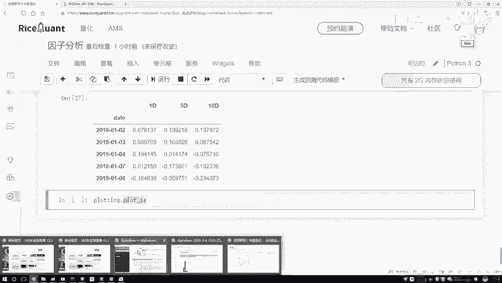
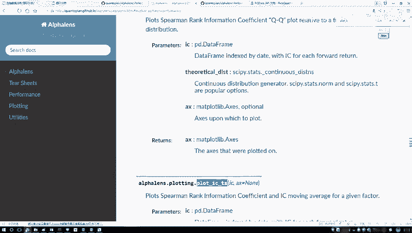
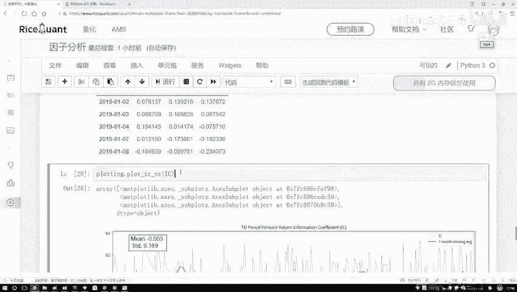
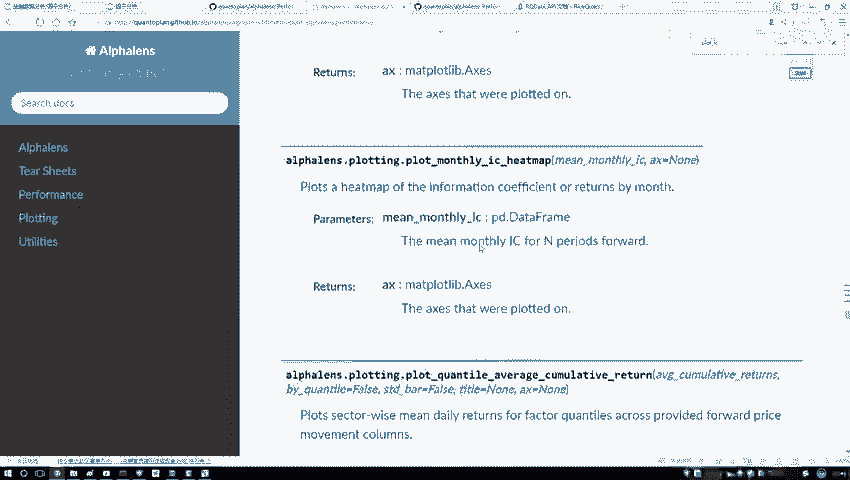
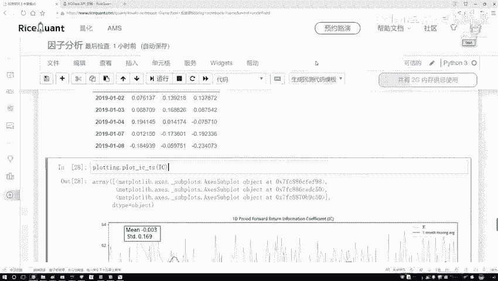

# 爽了！这也太全了！Python金融时间序列分析与量化交易实战教程！终于有人讲透了！线性回归、聚类算法、时间序列预测、股票预测 - P43：42.工具包绘图展示 - 人工智能搬砖学长 - BV1Ri421h7Ry

然后在这里啊，就是我们只要关注一期就行，然后这是五期，这是17的方法，像我刚才说的，在上面我们是不是把这个相关系数算完了，那其实算完之后，哎你说你喜欢相关系数大的，还是喜欢相关系数小的呀。

相对来说咱们喜欢大的吧，大的有研究的一个意思啊，你跟我相关啊，而且跟谁相关的，跟收益率相关吧，越跟收益率相关的可能是咱越想要的吧，但是有个问题，你看啊，现在我们拿到这个因子了，这个因子啊，当前我们算啊。

这个IC值是不是每天都不一样啊，那通过这个图啊，咱可就是通过这个结果，可能看的是不是不是特别明显啊，我们能不能把这个图给它画出来啊，来看一下吧，这里我们还导进一个工具啊，叫PROLOATING是吧。

它呀是帮我们做展示的，咱把这个结尾答案画出来，PROTEM当中呃，点pat一下，点pat，然后它是一个ICIC杠什么来着哇，记不太清了，咱查一查IC当中，然后呃找一下。

呃plot at不是is是IC，不是是IC杠一个时间序列，它是一个time series来找哎，哎这呢S1杠时间序列是吧，其实刚才还看到一些API这些啊，就是大家你想看都可以去展示一下。

它不同的一个结果，画直方图啊，画QQ图啊，看看是不是正态分布啊都行，咱主要看这个时间序列吧啊它就叫做一个i is。

我给它复制过来，再来写一下，在这里啊直接的去执行一下单就行了，然后把这个SD给我传进去来看一看好了，默认把这个图就给你画出来了，这个图画出来之后啊，咱们来看一下吧，然后这个绿色一线哦。

哦我们我们没选参数，绿色线默认是以一个月做一个平均的，相当于你看前面没有，这正好是一个月吧，一个月计算个平均值，然后呢，这个蓝色的就是呃，咱们上面画出来的这个实际的IC值，然后它的一个走势的情况。

然后这里就是然后他不光画了IC1值的走势，他还画了这样一个值，有什么有一个均值比上一个STD是吧啊，这有一个你的当前啊就是整体的一个平均值，整体的一个标准差是等于多少，这块他也帮你统计了。

然后通过这个绿色线，咱们来观察一下吧，咱只看这个绿色线行了，因为这个蓝色线它这个浮动范围太大了，看不出来，所以然咱主要是观察这个绿色线，绿色线你看怎么样，有些时候那感觉还有点意思是吧。

但是绝大多数情况下怎么样太平稳了，可能这个跟我们最终结果怎么样，不是特别相关吧，因为通过当前走势来看，没有出现这个趋势，我希望什么趋势啊，那越当然是这个值啊，肯定是越大越好了。

现在这个值看起来是有点小了，而且一算这个平均怎么样，是不是也比较小的一个值啊，啊有这样一件事，然后还有个指标叫那个信息比率，我先给大家说一说吧，有个指标叫那个信息比率，信息比率是这样啊。

就是它是用这个均值比上这个STD啊，信息比率是描述什么，它是描述啊，就是你当前哎你的呃，你当前算的这个相关性的结果吧，稳不稳定的意思啊，稳不稳定，那比值越大代表什么，比值越大。

代表你当前STD值肯定越小越稳定吧，然后呢你的一个比值越小，就是你的M比上这个STD值std，如果说越小了，肯定越稳定吧，它是标准差啊，所以说信息比率啊描述的是一个稳定的程度啊，就用这个MBSTD啊。

不是特别重要，这个大家简单理解就行了，这个是得给大家看了，就是一个咱这一个周期的，然后右边下面它还有这么五个周期的，是还还有十个周期的，哎都是有这样一些的结果啊，主要给大家简单的来画个图来观察一下。

然后呢大家如果说啊你想去看，那刚才是给大家看了API文档，API文档当中啊，是不是还有些QQ图，还有其他指标啊，这些不给大家详细去看了，等到后续啊，就是大家用的过程当中。

真要去详细的分析这个因子策略，这里边啊，就是基本上啊能给你展示的东西，就全给你去展示了，这些有好多函数，我不给大家一个做实验了。

还能画这些恶毒图，用不同颜色表示，哎呀挺有意思。

