# 爽了！这也太全了！Python金融时间序列分析与量化交易实战教程！终于有人讲透了！线性回归、聚类算法、时间序列预测、股票预测 - P51：50.策略总结与分析 - 人工智能搬砖学长 - BV1Ri421h7Ry

行做完了做完之后哎，没报错是吧，没报错说明咱这个东西呃。

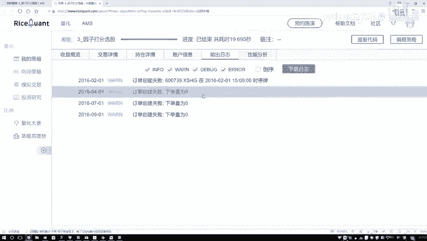

警告就不看了啊，基本上没什么太大问题，先看看收益吧，收益来说基准的怎么样啊，基本上是一个赔的，咱们怎么样，咱们起码把这个没赚太多，但是稳住了吧，然后最大回撤区间还行，手有点大，17%点多看着也还可以。

然后我们的超额收益，基本上能维持到67%左右，哎看着还不错是吧，这个是我们选择了时间段比较短的，这样咱再选择一个时间比较长的，我说201年1月4号吧，然后往后找一找到这个2018年吧。

然后咱们算两年的一个时间，1月4号就行了。

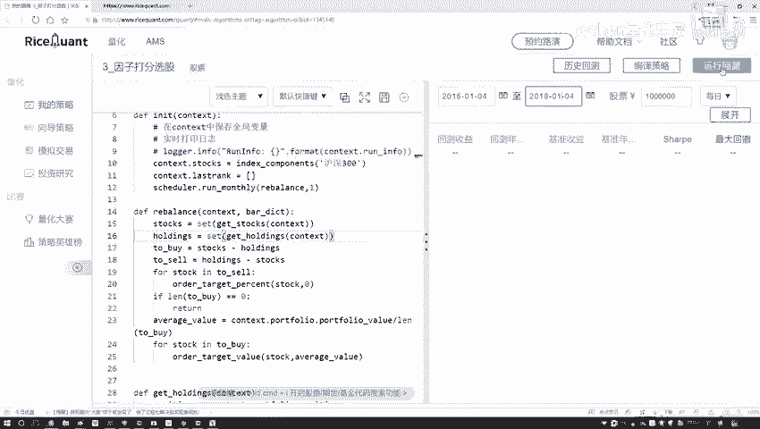

一般咱做这个回测啊，呃很少说做几个月的，容易做几个月，你也看不出来，一般都是5年左右或者35年，这些是比较常见的，哎今天这个速度直线还挺快哦，很快就能得出来当前咱们这些结果哦，然后这块咱已经做完了。

那你看现在就是哎呦，这个2016年1月4号，到这个2018年1月4号这个时间点，感觉咱得到的结果啊，和这个基准收益来说差不太多啊，没有什么太大的，没有什么太大的一个起色，是不是我再稍微改一改吧。

我再换一个时间，那比如说从这个2018年1月4号，到这个2020年1月4号吧，咱来看一看看这回咱们的一个区间会有些变化，然后我主要我主要想看，就是咱们这个逻辑逻辑来说，应该没有什么问题啊。

该指定出来指标，咱现在全部也都是算出来了啊，基本上没什么太大问题，应该行了，呃，看一下咱们大白值啊，这回呃效果来说也不算特别明显吧，啊基准的一个收益是零点多，咱这回测收益二点多。

哎看起来效果也没有太明显是吧，可能啊这个2018年，我觉着对股市的影响还是蛮大的。

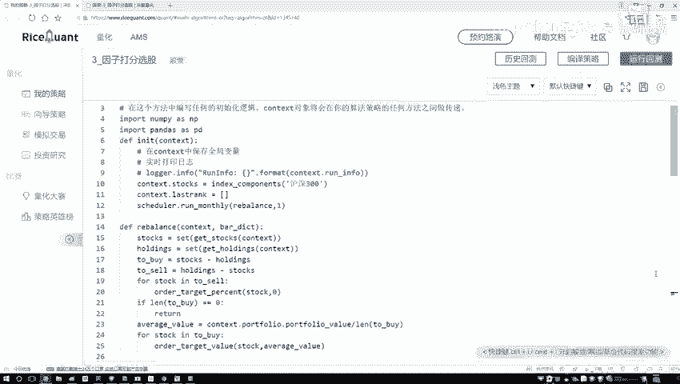

这样咱们把这个呃呃策略稍微改一改，咱们不要到这个2018年了。

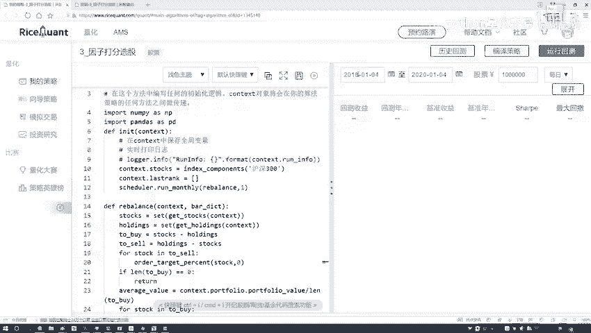

咱们稍微的改成一六和一七吧，因为18年这个熊市，我估计整体来说可能都不行，咱把它稍微改一改，我说这东西从17年1月1号，再到这个17年1月4号吧，看这段时间，这段时间我估计市场可能会稍微好一点。

我们来看下这个结果，然后刚才给大家说的，是不是说哎咱们看什么，看一下我排名的一个前十。

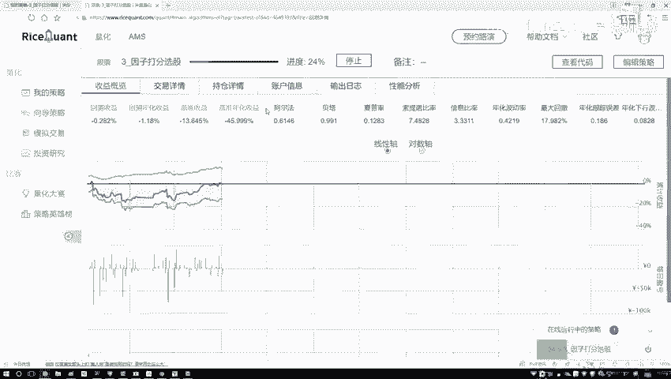

哎咱们效果怎么样吧，那一会估计大家可能有种想法啊，就是前十的哎你说效果好，那你说厚实的会怎么样啊，哎你看这回就是一呃一六到171月4，就是这一年怎么样，16年这一年啊看起来还不错吧。

你看咱们的灰色收益要比基本收益要高一些啊，这样的结果，然后这块我们稍微改一改啊。

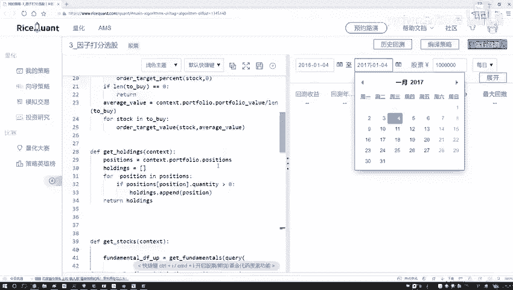

就是在这里哎我们把这个策略之前，我们不是哎哪去了，之前我们不是选的什么，是从这个理应到十吧，相当于前十是吧，好这个我们换一下，我说谁啊，从这个十，然后到最后啊，相当于是选那些最差的。

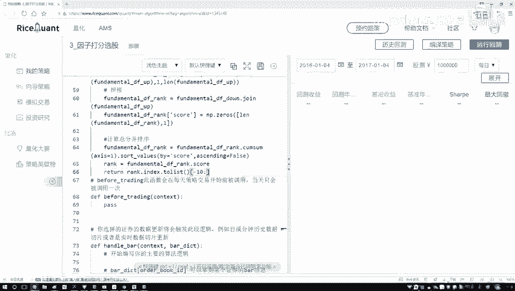

我们来看看结果啊，之前咱们的回测收益大概是十点多是吧。

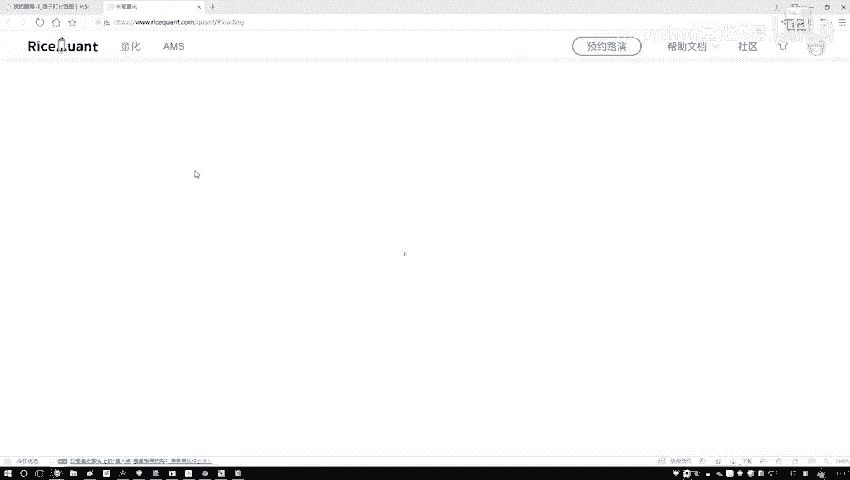

现在看一看就是咱用那些指标最差的，我们看能不能比一些基准的啊。

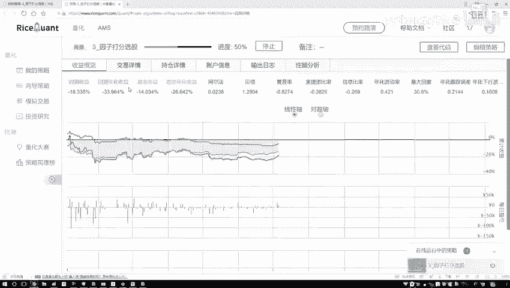

会更差一点，再来看一看啊，基本做出来了是吧，基准的负的负的快十是吧，好了你现在用更差的那比基准还要再差哦，这个是咱们当前咱们的一个结果，然后这里有一些交易详情。

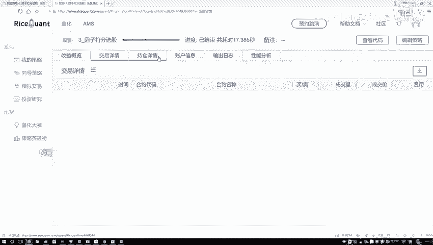

然后还有你看咱们来看一看吧，是不是每个月进行调调仓啊，呃这里交易详情啊，4月5月六月七月八月九月十月11月哎是吧，每月进行调仓，然后持仓详情，然后一开始的时候呃，持仓详情怎么样怎么样怎么样的账户信息。

你的一个咱们来看吧，你的一个总价看最后变多少了，完了100万，最后让你获得成77万了啊。

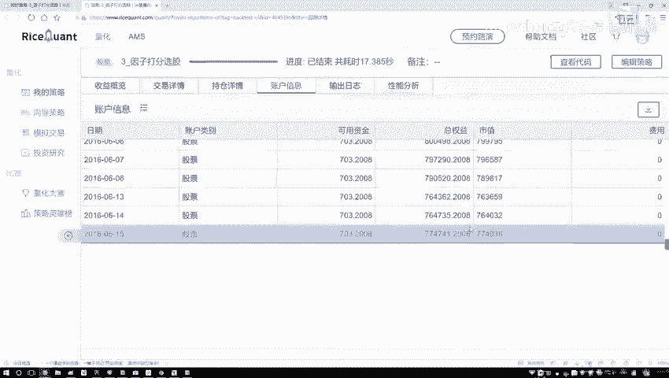

这是一个你的账户的一些信息，行这里啊，咱把这个改回来吧，到时候大家玩的时候，我把代码发给大家，到时候大家玩的时候就是默认啊，咱们玩这么前十个就行了。

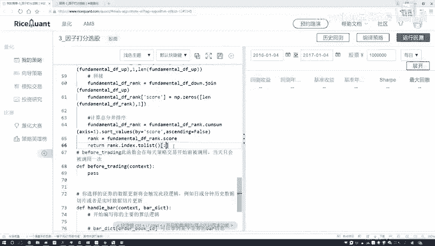

这个效果能够稍微好一些啊，当然我们只是哎通过一些那些报告当中啊。

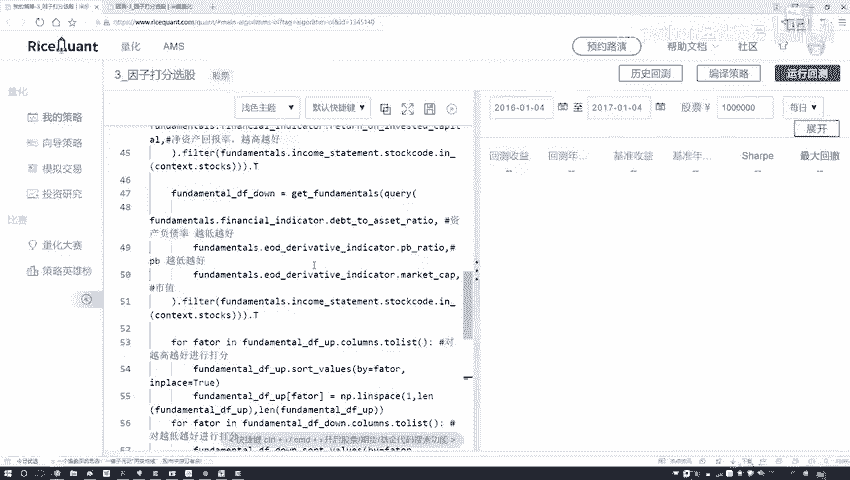

挤出来了，哎，有些哪些指标越高越好，哪些指标是越低越好。

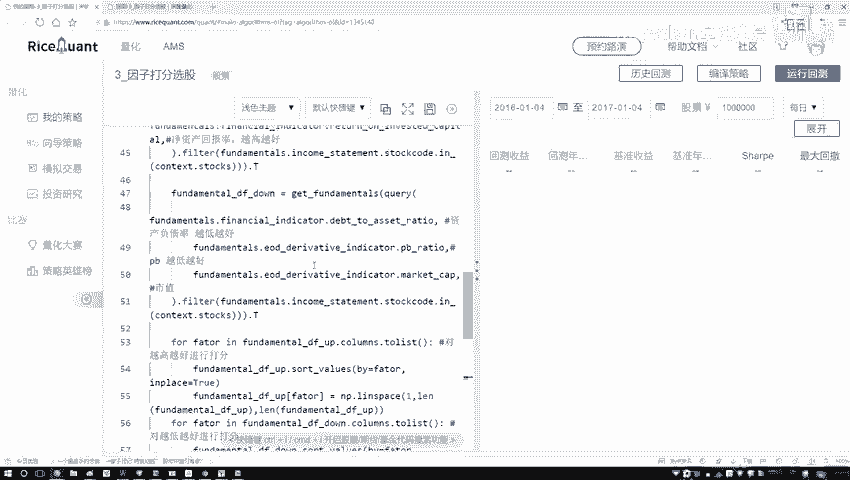

哎给大家做了简单啊，我们的一个回测的一个策略，这个到时大家来玩一玩吧。

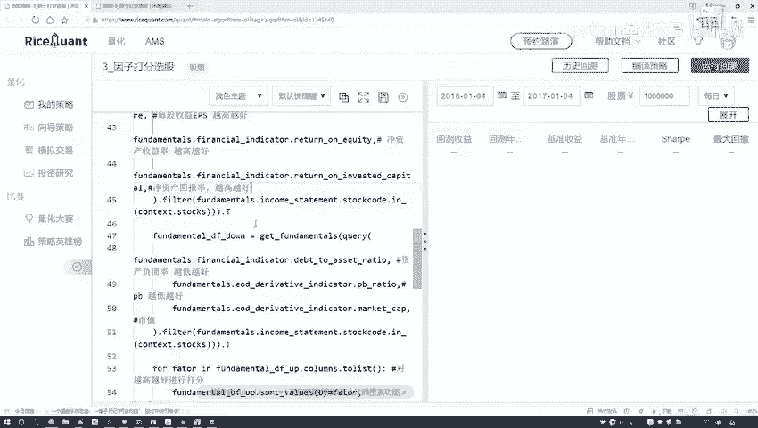

我觉着打分法啊用的还是比较多的，也是比较直接的，就能得到一个稍微啊还不错的一个结果，当然啊你是跟这个，可能你会遇到一些熊市的影响，使得你的一个收益，哎，或者说你的一个回测。

整体上效果可能会有一段时间会出现，比较一般的这个反正也都是哎呀，都是市场决定的吧。

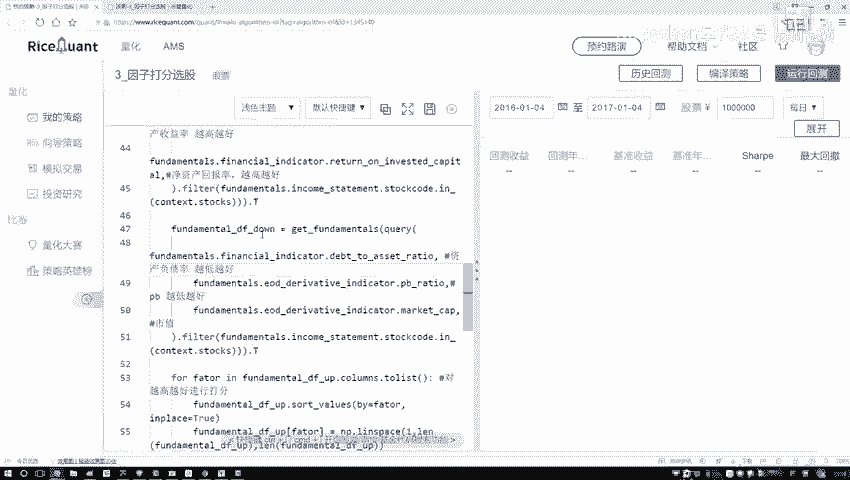

这些都是比较常见的一些现象行了，这里啊给大家说了一下咱们的一个打分策略啊。

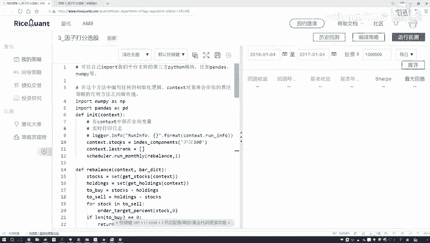