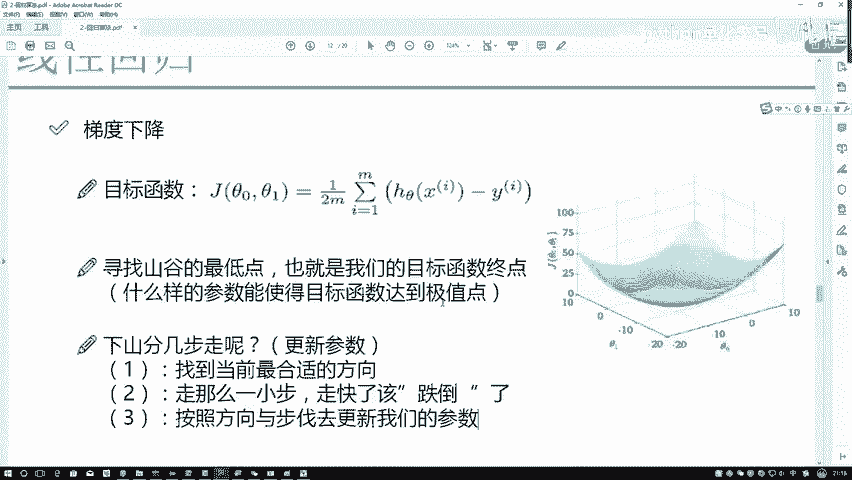
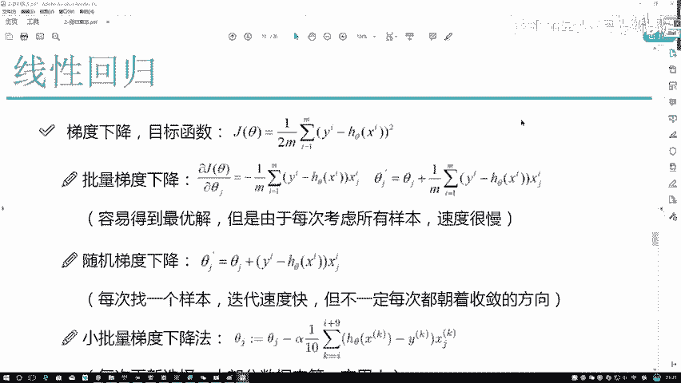

# 爽了！这也太全了！Python金融时间序列分析与量化交易实战教程！终于有人讲透了！线性回归、聚类算法、时间序列预测、股票预测 - P58：57.参数更新方法 - 人工智能搬砖学长 - BV1Ri421h7Ry

这里啊刚才我们强调一点，就是我们的啊梯度下降TU下的当中，我希望大家还强一点，就是什么，哎我你说我们现在要去优化这个方程，然后找到最优的吉特零或者C特一吧，那你说现在我不是要找这些值吗。

当我在找这些值的过程当中，哎我是既要找希特零，也要找SA1吧，因为SA0和C特一，都会对我结果产生一个影响吧，那此时大家来想，你是分别做这个希特零和希特一，还是把希特一和希特零放在一起来做呢。

大家可以先考虑这样一点，我们是分别做还是一起做呀，在这里应该是什么，应该是一个分别做，而不是一个一起做吧，为什么可能在这里大家很很不解，哎既然我要优化，那他俩都会对结果产生影响。

那应该一起做效果才会越好啊，你为什么要分开做呀，不要忘记啊，咱之前强调一点什么，X0和X1之间有关系吗，我刚才是不是说一点数据样本之间，它都是一个独立的，既然数据样本之间是独立的。

希特零是不是对应的是X0，吉特一它是不是对应的是X1，X0和X1都没关系，它俩所对应的参数，那更扯不上一丁点关系吧，所以啊在这里大家一定要明白一点啊，当我们在进行优化过程当中。

是分别对吉特零和希特一进行优化的，也就相当于这里，比如这是初始位置，在这个三维当中啊，可以可以可以这么解释，就是CT0啊，表示着一个轴，C特一表示一个轴，那我要去前进的时候，我肯定找吉特零哎。

合适的一个方向，再找希特一合适的一个方向，希特一和希特零它俩一起前进，最终呢找到了一个啊，我前进完之后综合的一个结果，这个呀是咱目标函数怎么去做的，其实0C1都会对结果产生影响，我要分别进行优化。

什么意思啊，我要第一步先用J对我的一个C特DIU求偏导，得出来我的一个方向吧，再用J对我的一个C特一求偏导，得到C特一的一个方向吧，自己玩自己的，他俩之间没有任何的影响，这个意思，那寻找山谷最低点。

刚才给大家解释了，我们大概几个步骤，其实很简单，第一步要求什么，第一步我们先求偏导，第二步呢沿着偏导方向走那么一小步，我该着重强调一点，一定是一小步，走快了，我们可能会跌倒的，什么叫跌倒。

就是一方面你这大刀阔斧的，你的一个方向可能不对了，可能不收敛，可能收敛效果不好，这个统称为一个跌倒了，然后呢按照当前方向去更新我们的参数，更新完参数是不是找下一个点了，重新的再做计算就可以了。

这个啊就是我们整体的一个流程，大概是分三步走，只不过说它是一个反复的一个过程。

然后呢T又下降咱这个东西啊，唉你说这个下山，那怎么样在数学当中描述出来，这样一个下山任务呢，再来看一下吧，刚才啊咱们是不是指定出来一个lofunction log function，里边。

咱之前是这么指定的，我给大家写一下，1/2，我就不写角标了，Y减去一个HCTX是吧，一个平方降写成角标，这不写角还不行，这块都是有个I的吧，那此时你看这是什么，这是对于某一个样本求它的一个损失函数吧。

那你说你当前建立出来，这个模型是只满足于一个样本呢，还是尽可能多的满足一个样本呢，应该尽可能多吧，那当你评估的时候是不是也一样的，评估的时候，你说当前这个模型做的好不好，一个模型比如我们建立了多个模型。

一个模型M1吧，M1的一个loss等于0。4，M2的一个loss等于0。1，那哪个好啊，肯定M2的吧，你的损失函数我希望越低越好，那肯定等于D的好，那此时你说你在评估的过程当中。

只拿出来一个样本去评估吗，不是吧，还是要多拿一些吧，这里啊我就提到了一点，叫做一个M啊，多了一项MM是这样一件事，我把每个样本，你看从I从一开始到M这是个累加吧，这后面算他的损失吧，就加了一个平方向。

为什么加平方向让结果差异更大一些吧，这样一个事儿，那此时呢此时咱得到一个结果，就像这个事儿，比如说一个样本是最终就是真实值是一个一，预测值是个零二，那可能是一个1-0的一个平方，等于一个一是吧。

那如果说这块是个二，主要是个零一的时候，你可能认为做的稍微有点不好，二的时候你可你可能就认为他做的很不好了，做的越不好的前提下，我是不是越让它的LOFUNCTION应该越放大一些啊，啊就是这样一个事。

加个平方向，那此时呢在这一块我算了一个平均吧，一开始先加了M个，再除上M，这是不是算了一个平均啊，算完平均之后把它当做我的一个loss function，这吉他列出来了，此时假设说我要对某一个C特。

某一个sat呢，随便一个我就先拿这个sat j来进行表示了，注意一点，这个角标这些角标很重要，以后你自己写代码的时候，我就这么跟大家说吧，角标200%会出现各种各样的问题的。

因为我之前看过很多同学写这个200%，绝对会出问题的，咱一起看一看啊，注意点来看这里，接下来我是要干什么，是不是要对上面这个式子求偏导是吧，求偏导的过程当中等于什么来看吧，求偏导这一块它是什么。

这一块它又是一个xi，然后呢这一块比如说我写完整一点吧，这是一个SA1X1，然后呢再加上一个sit2X二，无论这块加多少个，比如说这块加了一个SAJXJ，当你求偏导过程当中，你说前面这几项有用吗。

因为SAJ跟THEA1SA二都没关系吧，所以说一求偏导都没有，这都是常数项吧，那只有什么，只剩下XJ了吧，只剩XJXJ落下来就可以了，平方向一个数对X的平方求偏导等于什么，等于个2X吧。

所以说这一块二直接落下来就完事了，二直接落下来就完了，那注意观察一点，这块有个负号啥意思啊，来看一看里边这个东西里边什么，它是负的一个HC的X吧，比如说一个负X负X全员都导得多少一吧。

所以说负号要提出来啊，千万不要忘记点这块还有个负号啊，负号解释什么意思啊，I分之一是不是求一个平均的，里边这一项平方项数没了，XJ怎么解释怎么来的，是不是该给大家解释过了，只对DJ列它有影响吧。

来看最后这个xi j i是什么，I是当前这是第几个样本吧，J呢它是当前这个样本的第几列吧，比如说这个意思，我找到DJ这是一个I表示样本，这是一个J表示一个列，xi j表示这一个什么这一个数吧。

就是这样一个意思，那最后呢再来看现在我求完一个偏导得到什么，得到了一个方向吧，我是不是要沿着这个方向走啊，那该怎么走啊，咱刚才说的是梯度啥呀，提出什么东西啊，梯度下降吧，哎是不是梯度下降，我该说怎么样。

梯度的方向，这个沿着梯度的反方向叫做下降吧，梯度反方向怎么描述啊，是不是加上一个负号，就是一个，比如说我说现在这东西这东西写一个什么呢，写一个W写个W吧，W叫做一个梯度，那梯度反方向它是不是一个负W啊。

所以说此时我需要在这块再加上一个负号吧，表示这我的一个梯度反方向吧，负负得正是不是变成正了，所以说接下来沿着梯度的反方向走一步，那是不是用STJ当前位置加上你走的这一步。

就是我得到新的一个更新完的一个吉他J参数，应该达到什么样的一个位置的一个结果了，这点大家应该应该能理解吧，比较简单吧，在这里没有太多的一个复杂的东西，给大家解释了，负号什么意思啊。

就是反方向这个求平均这一块，就是我求一个梯度梯度，修完之后，由于反方向负负得正，接下来呢负负得正之后，从起始它的一个位置本身有起始位置CJ吧，走了一步加上一个走的步，得到了现在这一步叫做一个cg撇。

这一步完成什么了，参数的一个更新了吧，这个呀就是咱当前的一个核心的，核心的一个结果了。

