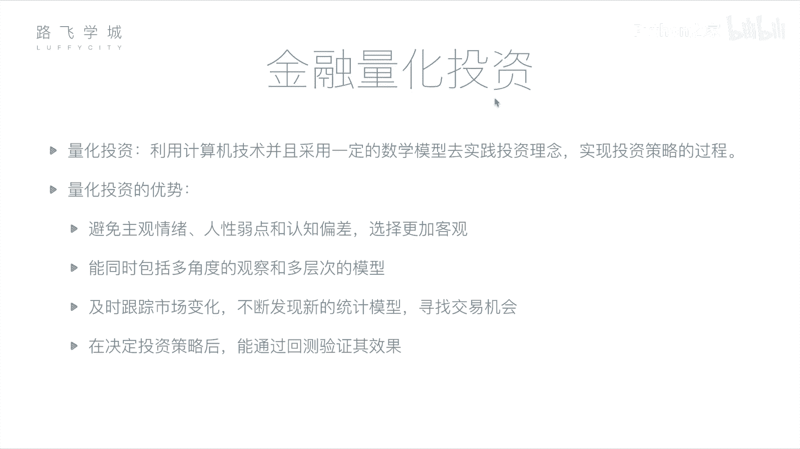

# 爽过追剧！！2024最新Python金融分析与量化交易实战教程！三小时入门到进阶！就怕你不学！（ - P6：06 金融量化分析-金融量化投资介绍 - Python之家 - BV19LBKY6Ehz

あ。然后接下来我们再说一下金融量化投资的概念。那刚才说到金融分析是通过一些，我们可以通过基本面或者是技术面来做一些这个对公司对这支股票的一些判断。啊，那这个判断的过程实际上我们可以交给孙一来做。嗯嗯啊。

因为你的一些基本面分析，你的财务报表我们可以获取到。技术面分析你的历史价格交易机构，我们都可以获取到。那这个价这些分析的过程。哎，我们通过计算机来帮我们做。那这个过程我们叫做量化投资或者叫做量化分析。

嗯，啊所谓量化投资就是说利用计算机技术，并且采用一定的数学模型去实践投资经验理念实现投资策略的过程嗯啊。首先这个投量化投资三点这个重要的部分。第一点，计算机技术。啊，你说你要计算机编程的方式。

第二点数学模型啊，所谓数学模型其实就是一些策略，一些套路。就是你怎么样通过哪些指标啊，比如说我们可以说刚才的均线，它就是一个数学模型，对吧？你取前5天取前60天，那就是一个数学模型。第二1个。

第三1个你要去实践啊，你要去拿着这个拿着你写好的这个通过数学模型写好的这个计算机程序啊，你要去真正的对去或者是真正的去做投资，或者是你要先预先做一下尝试，看看你的策略是不是靠谱。对对对啊，这是量化投资。

那量化投资相当于相对于我们之前人工的一些资一些好处的嗯。第一点啊，我们说它可以避免主观情绪、人性弱点和认知偏差选的更加客观。啥意思呢？我人是带有一些主观性在里面。

比如说啊这个股票啊这个这个呃举个什么例子呢？平安银行，你这个股票啊，我买了，我一直拿着呢嗯。各种技象都表明他要跌了。嗯，但是我就是舍不得抛啊。我拿了两个月了，我有感情这支只股票，我就是不折的慌。

我就觉得在这涨。嗯这是就是对吧？就结果如果你的判就客观的判断正确的话，你再下降了。对，或者有的时候他你买那股票，连续两天或三天跌了。那但是可能纯粹是因为一些啊技术原因导致它跌了。

并不是说真正这只股票不好，但是因为你连着看着两只股票，这只股票连续好几天跌，你心里就觉得我操是不是不行了。对，所以你就忍不住可能想抛。对我刚才说的这个情。但你一抛啪就涨了之后，他说的这叫认知偏差。嗯。

对，就是你人的认识可能没有机器看的多。对啊，那也就是说第二点，机器能够同时包括多角度的观察，如多投资的模他可以同时看看很多事情，他算的东西比你快，他可以同时看很多股票，他可以看股票的很多方面。

比如说看均线，看你的财报等等都可以看。那你人可能同时处理不了这么多信象，也就是说你啊你。你你人去炒股，相当于你时间久了之后，你会总结出一套自己的经验逻辑，对吧？也是是套路。对，那这些套路就是说啊怎么讲。

你可能如果是真正一个有经验的这个投资者，那他不是像散户一样跨，觉得哎好就白了，他可能经过N多方面的分析。对啊，从技术角度看各种指标，另外从基本面从公司的运营强化状况，从这个行业，what就反正各种指标。

对有的时候还就是我跟我做金融同事说，他还要什么玄学，要考虑到什么风水，这都涉及到啊当做指标。那当你相当于把那么多指标那么多层面维度去看一只股票才决定它好与坏的话。

那你相当于你在这只股票上花的精力是非常多的对，那你这套呃相当于这套经验这套套路，啊，你想如果是说能让你去呃去等不了好几千只股票你都去看这样，那是不是就更容易帮你筛选出那个哪些股票是对OK了。

但你人一天你一天可能就这所有指标走一遍，可能只能看两只股票。但你把这些东西如果总结成这个规律提取出来变成计算机的程序，那可能就是呃十分钟帮你把全盘过了一遍。对啊。然后第31点。

这个量化投资可以及时跟踪市场变化啊，不断发现新的同济国家渠道消易机录。什么意思呢？你人我们说这个你的股票价格是每时每时都在变动嘛，对吧？那哎我人如果是盯着这个大盘看的话。

我需要一一秒不停的压眼一直瞪盯着屏幕看到，比如说哎马上是个买入的机会赶紧买，那你人的操作肯定不如计算机快，嗯啊，你从早上9点到下午3点，你盯上连续盯上一周，你可能就累的要死。

那计算机你可以尝序在那一直监测着他发现买的结果他就一直买他的这个反应要比你及时。啊，第二1个你还可以尝试一些新的方法啊，你人的经验你有可能就经验就不停停那你的经验也不一定对对吧？

你可能也不不敢或者是不想去尝试一些新的方法，但是程序可以啊，你觉得这个策略表现的差一点，或者是可以想想尝试一些新的，那你就写一个。通过机器学习帮你去学习新的。策略套路啊。

我就是你可以有一些新的套路长时间啊。第四一点，我们说在决定这个投资策略之后，我们能通过回测验这次效股啊，什么叫回测啊，你金融量化投资里一般都有的这个回测功能，就是说我制定的一个策略。嗯。

我直接去拿这个策略真正的去交易吗？有可能你这个策略有可能你这个策略写的不对，那就赔钱了，那你直接去交易会导致你障来就赔钱。但是我们可以做点什么样做一点回测。所谓回测就是什么？哎。

我这个策略写好套路固定在这里了。好，我我不知道未来会怎么样，但是我可以拿历史的数据去检验一下，就是我假设现在是17年，我假设我拿这个套路，我从12年开始炒股，哎，我看看到17年我拿这个套路。

我是赚钱还是赔钱。对那你多试几次啊，比如说我从12年开始，从13年开始，12年到13年各种各样的时间段。去验证你这个策略，也哎判断你在综合判断你这个策略是不是靠谱。对啊。

所以如果你你经过一系列的回测加上调整。因为你回测完，你发现哎可能这个感觉涨得不够多，你再调一个指标，对吧？再调那个指标，哎，花花慢慢慢发现我操直接就能啊连续要涨好多，对，对不对？

那你相当于历史数据已经相当于客观的证明的这个策略是okK的对那基本上你再从拿到这个真实的环境中去跑的话，一般啊也差不太多。对嗯。

好，接下来我们就说一下这个金融量化交易里边它的核心就是我么说的量化策略，就是你的套路。嗯，啊，那你的量化策略主要包括哪些呢啊？主要输入啊，就是你这个策略或者你这个程序需要拿哪些数据啊。

就可以拿到哪些数据。比如说我有行情数据。也就是说你昨天前天就是历史上你这这个这一天的这只股票的价格是多少？交易量是多少等等等等。

相当于你觉得这个输入就是说我先把呃我这个策略要就是策略的各种就对就是就是各种指标度给对这个数据源拿到拿到数据源在分析。因为你的程序也是要通过一些数据来判断的，不管是基本面或者技术面。对啊，那行行情数据。

就是你历史的交易，比如说昨天的这个开盘价收盘价交易量等等等等啊，财务数据，就是你各个股票，各个公司的财务报表。对啊，包括你还可以自定义哪一些数据，你可以自己想要什么数据要数据。

比如说你可以不是要继续学习吗。你去做新闻啊，就是你研究分析你这个新闻是你这个公司是这几天丑闻多呀，还是好的新闻特别多啊。啊，包括你个人的投资经验，你都可以放下来。投资经验。

投资经验就是你比如说你这个你你去你你你这个买股票的时候，你会参考这个这个今天的这个风险，风这个什么今天的这个对玄学的东西啊，真真的有有把这个当指标啊。对好。这是出入。那接下来你的策略做哪几件事呢？

我们说有这四件事。第一件事选股嗯，选股是啥？就是说我哎我几千只股票，嗯，我买哪一只呀对吧？这叫选股啊，第21个择时嗯啊，什么意思呢？我几千只股票，我是哪天买还是哪天卖，我什么时候买出去。

什么时候买什么时候买，因为我总是期望我低价买入高价卖出差，我们快钱嘛，对，就是我什么时候哎这个时间选择叫择时。第31个我们叫仓位管理。就是啥呢？我可能同时不是只买卖一只股票。对我可能同时操的10只股票。

那是10只股票，我判断他们的接下来要涨的几率可能不一样。啊能够判断这只股票可能接下来肯定会涨，那我是不是把我的钱，我整个有的钱，我多分给他一点嗯啊，那这就叫仓位管理。

就是说你这这些资金怎么分配给这些股票啊是叫仓位管理第四个这个止盈止损啊啊，就是什么呢？一些必要的手段，你的策略要什么呢？哎我。就是你可能已经比如说你已经赔了10%了。嗯，那我是不是要考虑要止损。

我是不是要赶紧赶紧把它卖出去呢？别再接着赔下去了，就是我控制我赔的别超过10%。嗯啊，这叫止损。那止盈也是止盈是基于什么考虑呢？其实你要说赚了30%的那接下来是不是不会再涨了。

它是不是要回去要落要回落了呀，那就是止盈我适当的，哎，我建好就收，别等着我不我等着我赚200%，那不太现实，对不对？止盈的考虑。这是你的策略做的四件事啊，选股则使仓位管理和职量之责啊。

接下来就是你策略输出。所谓输出，就是说你这个策略给完给这个股民有什么这个告诉你一声，今天该买股票了啊，或者是直接去对应到你的那个券商上，哎，直接去给他自动哎发一个信息，我要买入了或者卖出了。

这就是买入信号或者买出信号啊，我判断好时间了，决定要买要卖了。我跟道不管是给你个人发一个，或者是自动的连接到券商上，给他发一个信号。对啊，第三，1个交易费用和收益，交易所谓交易费用。

就是说我这个买卖花多少钱啊，因为你买股票呃，需要我说需要手续费，需要佣金啊，这个我后边都会说到，就是你要花一些手续中间的价格，给那些券商啊，给交易所这些啊交易费用，然后包括收益。

就是我这次这个买卖赚多少钱还是赔了多少钱。然后我整体的这个就是一个月内是赚了还是赔了，各项指标等等等啊，这是他的一个输出。呀啊，那这个图就是我们说的这个量化策略的这个结构。嗯啊。这个策略啊。

说有一个周期，就是说你怎么产生这个策略怎么用，然后到最后是扔掉，还是说再改进啊，有一个过程。那这个过程首先第一个啊产生想法，哎，我有一个idea，我或者说我多年的经验啊，这是一个想法。

或者说我今天学了一个指标这这个闭关十年看了一个指标，我觉得这这边很有用啊，我学习到的东西啊，产生想法，然后接下来你把这些想法变成你的计算机程序，就是通过编程的方式在这里我们用python啊。

接下来一段时间我给大家用python来做，就是怎么样哎去实现你这个策略那实现了策略之后，哎，我有程序了，我们刚才说到，我们不是直接拿去交易，我们先怎么样检验一下嗯啊，用回测的方式判断你这个历史这这十年。

不是说这几年嗯你这个策略放进去是好还是坏那除了回测还有一个叫做模拟交易。模拟这就是从现在开始我假设我已经开始交易。我并不是实际交易。是你还是比较慎慎用我慎重。现在开始，我可能觉得我历史是不是不太靠谱。

历史跟现在毕竟不一样。对，比如说你回测，我们到时候会看到你放到古代那一年，你可以看到你很难有策略，所有的策略都不好使。可能好多策略都不好使。对那我们从现在开我们做一段模拟就是我假设我投钱进。

但是我没有从现在开始一天过过一个月我看一下我的模拟交易赚了反正是你很高兴，但是你并没有说你钱进去你你用的是实盘数据对，用的是实际的数据，但是你并没有扔钱进去然后检验完了之后，我觉得回测或者模拟交易啊。

表现都不错，那你真正把这个策略用到实盘开始用用或者把那个策略卖了了讲完点可以把策略卖掉卖给那些金融公司这个对吧？然后别人这个策略因为你已经证明了非常有效嘛，你投1000万一年给你挣的20%。

那你就可以实盘交易了。实盘交易啊交易的过程中，当然你也可以说哎比如说或者是回测的过程中验的过程，你看个交这个策略有一点不足的。你可以调整一下，优化一下，嗯，或者是哎呀就赔了就。放弃再换下一个。对啊。

等等等等，这和你的策略的周期。啊，对，那这就是我们今天讲的这个金融量化啊，量化策略和量化投资的一些基础知识。嗯，那接下来我们会给大家讲，就是如何用python来做我们的量化交易。当然在讲之前。

我们有几个模块给大家介绍一下，就是我们数据分析相关的模块。因为我们接下来的量化分组会用到这些模块，这是一个工具，帮后我们更好的做这个策略，好不好？我们这一项就先到这里。

