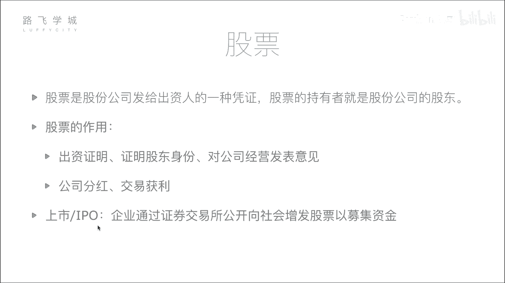
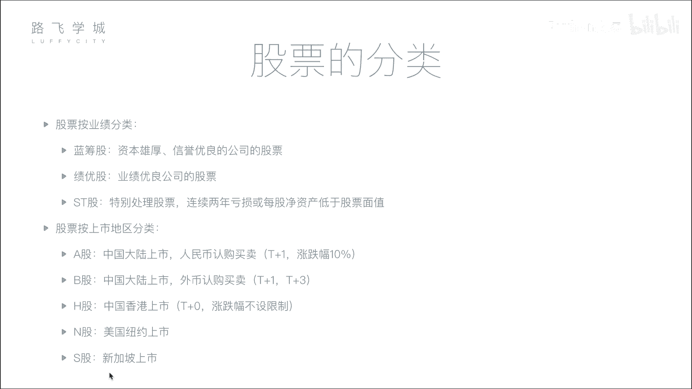

# 爽过追剧！！2024最新Python金融分析与量化交易实战教程！三小时入门到进阶！就怕你不学！（ - P2：02 金融量化分析-股票基本知识和股票分类 - Python之家 - BV19LBKY6Ehz

好，那接下来咱们说一下股票这个东西。股票是什么？股票是股份公司发给出资人的一种凭证。股票的持有者就是股份公司的股东，那这是股票的定义。啊，那我来形象的解释一下，究竟股票什么。比如说我刚才举的那个例子。

刚才举的他是创业公司的老板，我是亿万富翁。嗯他做公司需要钱呀，但是他自己可能没有多少钱，那他怎么办呢？啊，比如说我通过把我的钱给他，那他怎么证明会对我给他钱呀啊，首先大家可能想第一个我是不是给打个欠条。

对那这其实是一种借贷行为了，对，不是金融行为。对啊，就是你我借给他10万块钱，他要还给我10万块钱那这我不太想借给他，因为我没有收益啊，我赚的可能只是点利息，除非借高利贷，对高利贷不合法啊。

万讲就他这要上的好。对啊，那哎我借给他，我就赚点利子，我不值。那我怎么办？我通过我给他钱，他给我什么他们公司的股票那股票表示啥表示你对这个公司出钱了，比如说这个公司哎可能不止我一个人给他钱。

可能有好几个大老板都看见他了，都想不要每个人给他1亿块钱比如说5个人他自己一分钱也是一分钱不出吧。假设你自己也来个1亿，嗯，来1亿吧，不然不好算O你也有1亿行吧，那我们我们四个老板每个人也有1亿。好。

我们一人给他1亿，现在他有5亿。那整个公司5亿市值就建起来了。对，那整个公司只5亿那我们相当于每个人每个人都出了1亿，所以我们每个人能获得他公司的20%的股票。

对按按这个这个正常的情况正常的情况下是这个20%票可能这个实际情况下，比如说他没有疑义，但是他有点子，我们几个人都看他的资色了，我说行，你也有百。20%的股票对，行吧，就白给他相当于4个亿。

你们每个人出了一4个亿，但是我没有我是我没出钱，对，但是这个公司是我来对吧？对，做这个事儿，对你们出钱我来干活，我也拿20%这这个股份一般来说是按照出资比，就是你出多少钱就给你之多的股票。

但是有的时候可能有一些就是说干我的对干干不出钱，我的股份对我的技术，我的能力啊，我的设备等等资色的资势啊，你有资源。好，等等。那这些就是哎我给他钱，他发给我股票，这是我的一种凭证。

相当于他也是公司的老板。对我出了钱的。不能说以后哎你公司赚钱了，分不分给我。那不行，我拿着股票，我上法院。所以就证明了一个是说我们公司，比如说咱们可能签一个合同。对，另外一个是呢是说在这个工商啊。

这个就在营业执上要变更，他也是股东我需要是股东。对对，就这样好，那股票的作用。第一点就是我们刚才说的，哎，我给钱了，我是老板，我出资证明，我是股东身份啊，我既然出钱了，我就能你公司就能说话，我就能说话。

对吧股东大会，我就能投票，对就把他炒了，怎么着等等，这个咱们不说了啊，第二1个可能大家关心的叫做公司分红交易获利，这个就是咱们平时炒股的股民问啊，他的股票的作用，他是什么呢？我炒股。

比如说我投进去10万块钱，20万块钱，可能每个人你再有钱投进几百万块钱行了吧，你能占公司的股份多少？占不了多少。你是你你这个地方这个地方我其实可以这样解释，就是我我补充一下啊。

你说就是相当于你不是投了一个亿嘛，对，对不对？那投了一个亿呢？你怎么去把这个钱再挣回去？对吧嗯，就相当于你是这个公司的股股东嘛，对不对你最终肯定是想挣钱嘛，对对吧？那你挣钱方式有两种。

一种呢是分红分红就说哎咱们这个公司做大了，挣了钱了，你占20%的股份，今年公司的利润，比如说5000万，那你就分百分之，如果也要全分掉，那5000万的净利润就分你20%，对对不对？

对那就是1000万是吧？对哎，那你就拿回1000万的分红，那同时你还依然是我们的股东，明年如果做资继续挣钱，你依然分红，对如果每年分的越来越多，几年就把回本了，对对不对？

并且同时还有公司的股份那太开心了，另外一种获利方式是什么呢？说哎呀，啊，什么呢？你这个这个这个这个现在公司做到一定规模了，对吧？之前我们值4个亿啊，那现在变成值40个亿了。嗯，40个亿呢。

你就觉得哎这个相当于你之前的这个投了一个亿啊，你现在占20%的话，40个亿了。再投涨到50亿吧，50亿啊50亿40个亿啊，不是5020%，你就变成了10亿。啊。对，那你投了一亿，变成涨了10倍。对。

那你觉得说哎你现在又看到另外一个年轻人，你觉得我这个公司成长空间有限了。从不小了，老了从50亿涨到80亿很困难，对不对？想涨到1困难了，但是你看到一个新的年轻人，你觉得他创的第的这个事不错对啊。

你现在给他投个比如说再投一个亿，那5年之后还能点10个亿，那你就干嘛，你就想你就想干嘛？就是虽然咱们这个公司，我这个公司值50个亿，你的钱你其实并没拿到，就是涨就是好像对是值。但是。没有拿到。

所以怎么办呢？你说哎我把这个股票卖一部分。然后呢，我别全卖了，万一你能变成100亿了，你卖个一半，对不对？你就把你这个20%卖掉10%，对对吧？那按这个现在的市值是10个亿，你卖掉花你拿了5个亿。

对你拿5个亿走了之后，你就会做别人，你去投资别人了。那相当于你就套现了。对对对对，那另外5个亿，你另外的剩下的10%，你依然是我公司。对不对？所以另外一种获利方式就是说相当于。你把你的这个股东成本卖掉。

对，套现了。嗯啊这是别人有接盘的就别人买你这个东西，对吧？那相当于这里面的这个交易价差，嗯，你就挣这个钱。对对不对？嗯对，这是M斯说的就是什么呢？对于一些大的投资者，有钱人。

他们这个分红和交易获利怎么样。那我刚才想说的是一些比如说咱们真实的股民的小股民对啊，小股民问，那他们比如说我后边会讲啊，你什么时候能够买股票啊，这个假如说你买了股票之后啊，两种获利方式。

第一种也是比如说你投进去几百万块钱，可能没有说投一个亿啊，投几百万块钱。第一个你仍然可以得到高。嗯，但是这个分红会比较少，对，因为你投的钱少啊，你占的可能就占1点几2点几，对对不对？啊，你你占的比例少。

你分的红，相当于说你整个净利润可能是一个亿。那你分的话分1%，其实也挺多的。其实是一样的。就你现在这种小股民跟我这种一样的，只不过是说呃怎么讲复杂程度不一样。对你为什么呢？小股民要想买公司的股票。

那必须要通过什么就是那个证券交易所，这个你应该是在后面后面会说后面说后面我们一会再提一个事好，我们一会儿再提这个事啊，那接下来我们说一下什么叫做上市。嗯啊，公司要上市。

大家好能就是在一些这个互联网公司工作的一些人都会说都会讨论你公司上市了，上市了？对啊，那什么叫上市啊，所谓上市，就是企业通过证券交易所能够公开向社会增发股票以及募集资金。对，什么意思呢？

我们刚才说的他开公司，我要给他钱。啊，这个是叫私私募募，对吧？那他并不能说哎我今天开个会吧，我站在这个五道口，哎，我开公司了，大家快来给我签对，不能这样，你不能就随便找个人就拿钱。

这个在法律上叫你叫法集资是要进去的坐牢的啊，你万一拿了钱之后，你就跑了呢，对吧？你不能这样，那怎么样呢？首先你要有一公司对你这个公司要做到一定的体量，然后去什么呢？去给证监所。

就是我要我请求上市证监会证监会对证监会请求上市，那证监会看一下啊，你把你的这个公司这几年的财务报表，那什么你的这个像各种各样的信息都要你啊，你拿过来看啊，你的公司还好，应该呃证先破产不了证监会这么想。

应该先破的，对，能赚钱好，允许你上市。啊，你上市了，上市了之后能怎么样呢？能够就是哎我在证券交易所。挂个牌，就是所有的股民都能看到我这公司。股票涨还是跌，那所有的股民都能够买卖我这只股票也。对。

这个行为叫做上市。对啊，上市之后才能向所有的社会大众。对。挣募集资金对来发股票。对啊，那当然上市也是有条件的，就是你这个公司不能太差啊，因为这这就是为什么现在好多公司都想上市，但是他们有的就上不了市。

对，那那就是说呢为什么想上市？对吧对不对？为什么呢？为什么呢？啊？因为说白了啊人没财死嘛，融的钱更多。对啊，为什么呢？因为我认识这么一个有钱人啊，那但是我认识有钱人是有限的，对对不对？即便他再有钱。

他拿你一个亿，已经对他来讲非常多了。对，但是我告诉你，虽然我们这种普通老百姓钱少，那一个人凑10万10个人就能凑10个亿，对1万个人就能凑10个亿，对不对？对，所以就是说那全中国的股民好几千万。

是不是啊？那他们相当于都聚集在一个地方，啊，聚集在一个市场上，对不对？那相当于我这个股票如果有资格跑到那个市场上吆喝一声，哎我来上市了，对吧？那这个大家如果谁都给我投一点。一人1块钱。

1亿14亿中国人14亿，对不对？对啊，那前期但是我要获得这个到这个市场上吆喝一生的这个资格。嗯，因为这个市场相当于是国家管的的对国家为了保证这14亿人的这些股民的小股民的安全，你不能把钱投完之后。

大水漂了，是不是？所以他就对这个市场的这种相当于想上市场上吆喝的这个人控制特别严格啊，必须要查明你的这个背景，对不对？你的公司啊，这个近几年呃，相当于挣了多少钱，对不对？对。

然后你的公司接下来几年会不会说往下走下坡路啊，会不会呃会破产，对不对啊，就各种风险给你规避掉之后啊，觉得哎这个小伙这个公司不错，是不是啊？那好，我允许你到我这个大市场上去跟这些小股民们去融钱，对不对？

对，所以啊这个大市场就是。A股啊是不是啊？对，深深股啊对吧？港股啊类似这种。好，那这个情况就在上市。那IPO就叫做首次这个就是你首次第一次刚上市的时候，第一次向社会募集资金。这个项目就做IPO好。

那接下来我们说一下股票的分类。嗯啊有两种分类方式。首先说按业绩分类，有这么三种啊，蓝筹股基有股ST股。啊，就是按照你公司业绩分类，蓝筹股指的是什么呢？指的是资本雄厚、信誉优良的公司的股票。

比如说对我们国家来说，中石油、中石化大体量就是脑，你想象人的话就是大胖子嗯，就是体量大，就是这个有钱有很多钱，嗯，这叫蓝筹股啊，为啥叫蓝筹股呢？因为这个这个这个在。赌场上来说嗯，去过赌场吗？

嗯去过嗯打消行了。在赌场上来说，你去赌场不是拿钱啊，不是你拍100块钱的来，你是拿筹码码，对吧？筹码的话，蓝色的筹码是最值钱的对啊，所以叫蓝筹股对啊，绩优股相当于指的是业绩优良公司的股票啊。

它可能没有蓝筹股，能没有钱，但是他一直都在蹭蹭的赚钱。对他一直都在赚钱，表现很好，比如说啊这几年的股啊，茅台，中国茅台啊等等等等。茅台已经通过。交多少来？7000亿市值了我不相信，反正他很赚钱。嗯。

这叫GO啊，第三种就是表现比较差的股票叫做ST股啊，这个中文叫做特别出力股票对，就是什么呢？你这个公司连续两年亏损或者每股净资产低于股票面值，换言花说就是你对公司做的不行，没什么钱赔钱。

那你这个股票在股票交易手上交易的时候，后边是要加个ST的对，就是要告诉股民，这个公司现在不行，你买它的股票要慎重啊，还是为了保护股民的权利。对啊，当然如果你这个公司过年时间经营好了啊，你可以去申请，哎。

把我这个ST拿掉。对对，这是这个啊，按业绩分类，有这么常见的三种啊，按上市地区分类。我们说这个公效上市，那你在哪里上市呢？首先中国大陆啊，中国有首先有两个这个交易所啊，咱们后面会说，大家应该可能都知道。

上海、深圳会有一个股票交易所。那在这两个交易所上市的以人民币认购买卖的股票叫做A股啊，就是咱们大部分股民讨论的应该都是A股，就是在中国大陆上市，并且用人民币买卖。嗯，那当然还有一部分B股啊。

同样在中国大陆上市，但是以外币认购买卖，就是你美元啊，港币啊，这个这台币啊等等啊，这些买卖都是B股，这个是当年我们就是改革开放的时候，为了吸引外国外的资金嘛，对不对？国外的产也投进来。

我也发展的好一点啊，当年这个B股现在还比较严，说只能是这个外籍认口就是才能买卖。现在好像开放。就是如果你是中国人，但是你手里有点美元，什么你也可以开啊，当然咱们大多数讨论好像都是A股啊，还有一个H股啊。

就在中国香港上市嗯。N国在美国、纽约上市嗯啊，S股在新加坡上市等等。当然还有伦敦，还有东京，这个咱们就不讨论了。对，就是说呃怎么讲，说白了这个中国有一个相当于股民们交易的大市场。

那美国也对美国日本人都有，对不对？每个人每个国家搞一个大市场，对，就是这种对吧？嗯啊，那对于这些股市来说啊，需要知道的一点是什么呢？就是一些他们的。政策嗯啊我们说A股啊有两个这个限制，一个叫做T加一。

一个叫做涨跌幅10%嗯，涨跌幅10，这这大可能清楚一点。我们中国这个炒股有涨停和跌停的时，就是你这个股票波动，一天不能超过10%。对，比如说你昨天股票的股价在100块钱。

你今天的股价上不能超过110块钱，下不能超跌过90块钱。对啊，这个是为啥呢？这个就是中国保护股民，国家的小费，就为了保护股民防止你狂跌，然后今天100块钱，明天10块钱了，对。

完了你你我投进去100万块钱就是10万块钱没错，那个这股东就是说啊其实这个中国刚开放股市的时候，就99293年的时候呢，那个其实是没有涨跌幅限制的，就是说相当于啊一天就可以相当于股票涨涨一倍。

或者是跌一。那大家因为。不知道是不是中国人的本性很强，还是说这个怎么回事，大家就是说觉得这个事儿什么嘛，就就好多人其实也不懂股票，看别人赚钱，他就投进这一块，啊全部家当投进去，结果哎第二天全跌没了。

那这个东西就是对啊那时候当时9几年不富裕的中国来讲，其实还是打击蛮大的，所以就很多人受不了跳楼了，那九几年跳楼了，经常有对吧？所以啊国家为了说什么呢？对不对啊，保证这个社会稳定嘛，对不对？

所以就出了一个涨跌幅限制，说哎你就最多你这个股票一天只能跌10%，那也就是说跌没了，还得跌10天嘛，那你心里有一个有一个平缓的过程，是不是啊不至于跳楼啊，那涨也是每次涨10%，对对不对啊。

就是那么一个限制。但是国外啊其实国外没有这样的限制。比如说港股啊，美股啊，真的一天给你他们可能有一些市场有的时涨跌幅20%的呃，据我了解好像没大部分都没有，大部分都大部分就是直接全部开放。对对对对。

所以就是你在美国，你如果买一只股票啊，你如果公司爆出重大丑闻，对不对啊？那个致命的丑闻，那个股票一天就给你跌个80%，一下子就不值钱了，嗯，对吧？对那就是这样，所以就是说哎不用说OK。好。

这是这个涨跌幅的限制。还有一个T加一的限制啊，这个是啥呢？这个我们叫做交割日。T叫做交割日。就是说你比如说我今天买的就是股票啊，你今天不能卖出去，只能明天再卖出去。嗯所谓交割日。

其实就是说你今天买的股票，哎，这股票我明天再发给你这个其实也是中国的国家这个对每股一些就是港股，他们基本上都没有这个。在港股，它叫T加0，就是相当于你今天买了股票，今天可以卖出去，可以再买进。

可以再卖出去。就是你比如说我今天10块钱买的股票，可能我在股市待就是我带概来小1来小时涨到15了，赶快卖卖一会儿跌又跌到13万，我又卖进来。一会所以他是一天可以频繁多次交易，但是中国是不行的。

你今天买了茅台，你今天甭管还涨多少跌多少，你不能卖你明你想卖，明天开盘的时候再买。为什么呢？也是为了什么减少投机性，减少投机性啊。就是对就对我国嘛社会主义嘛是吧减少投集行为这个也就是说你今天买的股票。

我明天再给你啊，这叫交割日那B股来说啊，这个叫我写了一个叫T加一T加3啊，这个有点复杂了，T加一还是交割日线，也同样也说B股也是你今天买的股票明天发给你，明天才能卖过去。

那T加三是说的是叫交收日就是我今天卖的股票嗯，你不是有钱吗，会给你打钱嘛，对吧？那你这个钱三天之后才能提现就是你这个钱三天之后才到账，但是已经是你的钱了，对，已经是你的钱了，但是就是让你三天之后再到。

不让你那么愉快的限对啊，这个B股的限制啊，然后H股没有那么多限制，T加里没有涨交负限制啊，N股S股也基本都没有这是我们说的股票的一些分类同同时也顺带介绍了一下这几个股市啊一些限制。那据我了解啊啊。

我已经这个这个不带金融行业有几年了，但据我了解，现在A股已经成为。

全球这个应该是市值最大的这个盘子。嗯啊对肯定反，因为中国人多就钱。OK那咱们这个股票的分类啊，这一小节先讲到这里，好吧。

