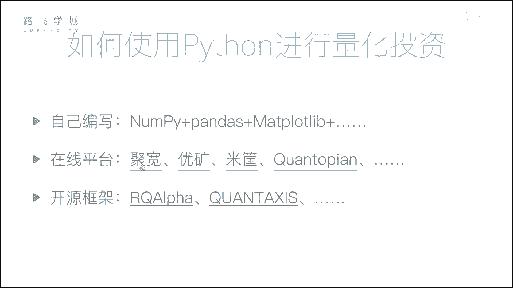
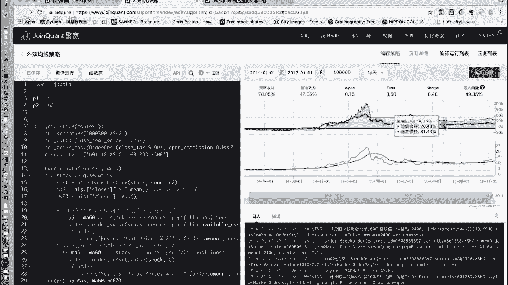
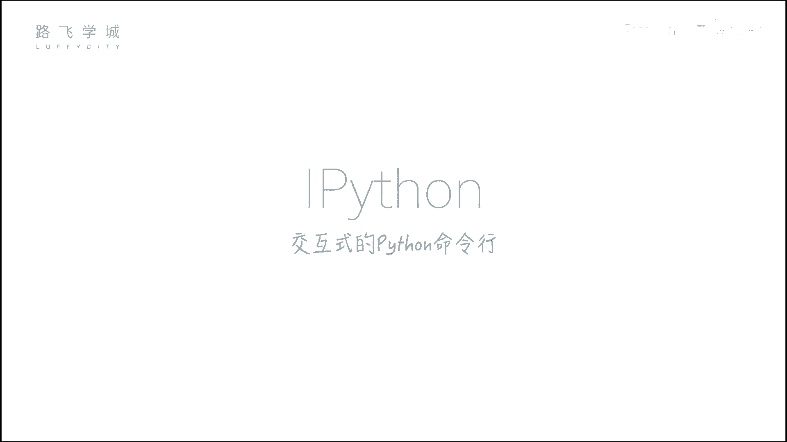
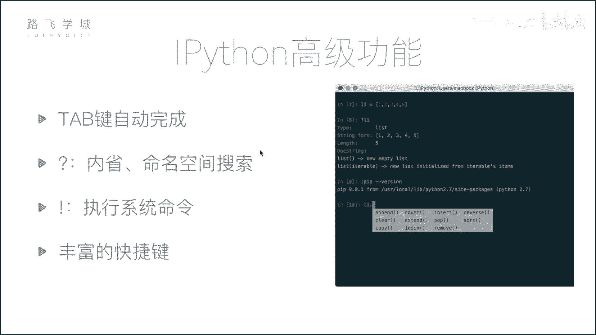
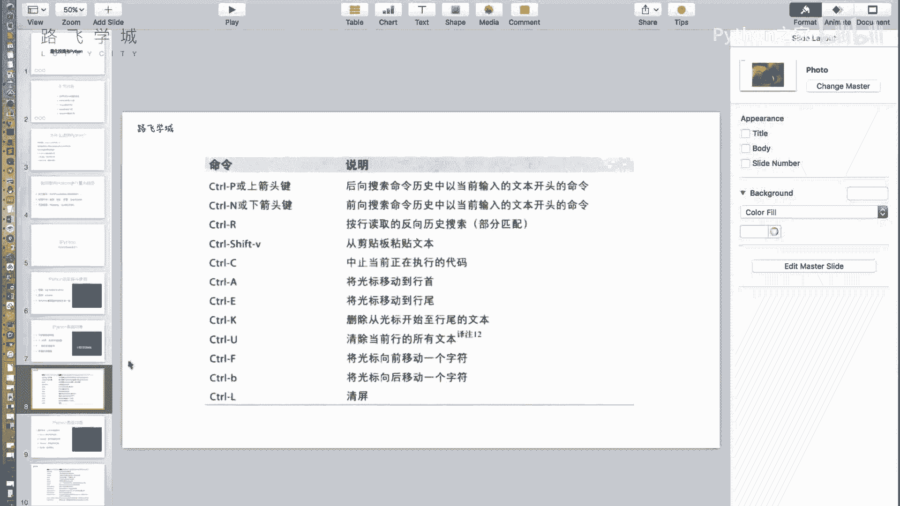

# 爽过追剧！！2024最新Python金融分析与量化交易实战教程！三小时入门到进阶！就怕你不学！（ - P7：07 金融量化分析-量化投资与Python&ipython初识 - Python之家 - BV19LBKY6Ehz

好，那接下来咱们讲一下这个模块的第二部分，就是投量化投资与python啊，这个模块主要内容可能涉及到一些就是我们会介绍一些呃和量化投资，包括和数据分析相关的一些模块和工具，让大家学习一下。好。

那首先咱们还是来宏观的看一下。啊。怎么样来用python来做量化投资，或者说为什么要选择python做量化投资？嗯，大理思，那除了。简单那好，除了pyython，哎，我们还有没有其他的选择呢？

有excel啊啊，我这列了一些工具啊，不是所有的一些工具。第一个excel啊，咱们的表格啊，这个当然没有没有编程啊，没有程序化的东西，就是更多的是人手工上的一些东西。那后外还有两个。

这个是SAS或者SPS就是两个软件，但是功能差不多啊，是一些统计相关的东西。当然啊机器会就是也没有变程，但是机器会帮你做一些统一化的。比如说我们刚才说的创新线。

可以帮你算出来哎每天的均值那个值是多少啊还可以给你形成一些图，当然也没有编程。啊R语言啊，这个语言是一门编程语言。有人有的同学可能听说过啊，它是可以做量化投资的，但是然而现在应用的非常少啊，为啥呢？

因为这个语言比较窄啊，它做的东西就是什么就只限定在数据分析这一块部分，其他的没有什么太大的应用，所以有它无不如用有的开，就什么都用。你学了一门语言，就是各个方面都能是展开三头六臂的感觉对吧？好。

那我们说量化投资啊，上一个部分我们也说过了，实际上就是什么呢？分析数据从而得出决策的过程。嗯啊就是你拿到了不管是行情数据，你的这个呃财务报财务数据或者是其他各种各数据，其实就是分析数据。

然后根据你的指标来做一个决策的这么个过程。那所以咱们接下来会重点讲python做数据处理或者数据分析的几个模块啊，主要有这么三个number pY啊。

它是做一个数据的批量计算paas这是核心的过主要是啊会有一个数据表结构，然后根据这个表结构会有各种灵活的操作。第三个是macpl lab做数据可视化。就是我们有数据之后，把它画出来。嗯好。那。啊。

具体我们学的这些模块，假如说我们学了之后，我们有哪些方法可以做量化投资呢啊？啊，第一个我们可以学了之后，我们会带着大家用我们教的这三个模块，自己写一个简单的量化投资框架。嗯嗯，就是从完全从零开始写。

我们只用的这三个模块，然后用到我们下载一些股票的一些数据啊，然后自己唉做一个框架，可以在里边写自己的策略，然后进行回测，看你的策略的好坏。那现在我们也可以不自己写不用自己写啊。

市场上有一些现成的那么叫在线平台，它给你提供了一个这个量化投资的平台，你只需要写一小部分代码，嗯，然后放到平台上去运行，你就可以看到它的回测结果。啊，我给大家看一个例子啊。

这个就是啊我列的几个在线平台的。

其中之一啊，那我们可以看到左边这一部分其实就是啊写一些代码，写一些把你的策略写到这里边啊，具体这个代码写了什么？我先不给大家讲在后边的课程，等我们讲完了几个模块，我们会回来给大家挨个策略的进行展示啊。

那右边。我们将代码运行之后，我们会在右边产生。好，我们可以看到我们在右边产生了这个策略当前的一些曲线。嗯嗯，这个曲线实际上就是我把这个策略在一段时间内进行回测之后得到的结果。嗯我们可以到这看看这条蓝线。

这条蓝线就是在不同的时间，你这个策略导致的收益嗯。好，那也就是最后我们这个策略会以这种可视化的形式反映出来，就是说你这个策略究竟是收益了，还是说这个亏损了，基准收益是什么？

基准收益这个我们在后面会讲到啊，它实际上是一个大盘的一个收益曲线。这个我们后面会说OK好好。

好。那有一些平台我们还同时还有一些开源框架这些等等等等啊，有兴趣的可以了解一下。那好，那接下来咱们就开始介绍一下我们数据分析的相关模块啊，在讲这三个模块之前，给大家说一个工具叫ippython啊。

它是一个什么呢？它是一个我们叫交互式的python命令啊。大家最开始学python的时候应该都。应该都用过我们自带的拍摄命令。啊，在里边写一些这个我们的python语句就可以执行啊。好那。

现在我们有了ipPthon这么一个交互式美俩，什么叫交互设命俩？就是它提供了一些更加丰富的功能。嗯嗯啊，那怎么安装？我们用python自带的PIP是在他单上有行他有线好，用PIP进行安装即可。啊。

你应该用国内以后可能快哦，还行。Okay。这中间应该插个广告。没想好。我靠，还很多呢。所以我说是现场，一会儿你再安的时候，安东西，用那个豆瓣也就会快很多。这个东西很神奇啊。

这个轴承的那完是轴承做的非常的高精度的轴承。对。那说能运行2分钟。嗯。看来好像很多还有很多吗？我不知道，但是需要一些。大个。嗯，我我我那个。有一些豆瓣的。都か。嗯，是什么。这个。是。你来吧，好不好？是。

你这块还会给他录上吗？那果。就这样呗。加上这个加这个加这个。要不然你钱完不了我这。啊，放。你没有复制上，你就复制了一个平道，你就command C呗。con出系咩意思。这个。嗯。是。

才能unpack file，为什么？不知道可能包不支持吧。那不知道，我不知道。嗯，不是他是一样的东西。啊。叉cept，然后pe3instore。

And you have rounded the archive the。好，我知道这个。有可能是有点问题，那你还是用原来那个吧。可不会在整方已经下载下来一些吧。那咱们就在干尬的等着头，把这块减掉呗。

这种花絮。给他们看这几分钟尴尬的场莓。反正自己看吧，看屏幕吧，看屏幕再进度再再进。你就把我说的那个用PH安装配上这个。啊大就好。那你这里先暂停一下。关半个小时之后，我们这个装完了半个小时之后啊嗯。😊。

好，我们ipad现在安装成功了啊，那对于那些啊没有安装过python的同学，可以直接去装一个叫安nakoda的一个python，它是一个python的发行版。它里边集成了。我们现在要说的ipadon。

包括后边我们要讲的那三个啊number pY map lab跟panda这三个库都在这个包里集成了，可以直接去下载这个进行安装啊。嗯嗯那我们现在已经安装过python，我们可以用PIP一个一个进行安装。

好，那安装完了之后。在命令行里输入ipad。就可以运行啊，我们可以看到在它和python命令行不一样的地方，你要玩手机吗？你们说你机器我听你说话呢。

它和python命令行不一样的地方在于啊它的提示符是有标号。嗯你可以看到在里边啊，随便可以写一些pyython语句嗯。啊，你看它会有in和alt的提示吧？它的in就是你输入的。

然后相应的结果就是显示在outt里嗯。啊，这是我们说它可以当一个呃和python命令行一样的工具来用。那除此之外，它有一些什么特性呢？

好，我们简单介绍几个它的高级功能啊。第一个tab键自动完成。

这种木拆。自动的补权或者自动完成。嗯啊这个切切换有点。开发个重新录。为什么切换有点感觉有点我这幻灯片和他不能同时播放啊。就是我幻灯片播放的话。好，比如说我们先定一个列表。这边建行一个列表。然后。

输入了APP让我们摁键盘的tap键。会自动补全。对，如果说我们什么都不爱，那么他有些方法出来回把。嗯，嗯方面都掉了。对。啊，这是一个type自动股权。嗯，第21个它在里边可以执行一些系统在的命令。

比如说L哦，这么牛逼啊CD。哇哦，nice，我在CD回来。怎么执行下条命令。不不不这个不能忘记了，不能这个啊嗯那那无所谓了。嗯，好，那我们可以比如说这个呃PWD这些常见的和目录相关的名都可以。嗯。

那假如说哎有的时候我们工作的时候可能需要执行一些复展，比如说if这个。看这个就不行啊，只能基本有的时候比如说我们自己可能在测试一些脚本的时候，我们需要用一些这看一些系统命联啊，嗯，那怎么办呢？加叹号嗯。

Oh。就可以了。啊，比如说PIV啊，我们看一下装面一些包，嗯，这都是可以的扣，加叹号在后面就可以直接执行我们的系统啊，行，好，那还有一个。啊，你刚才说啊，type键自动完成可以做。

比如说你这个函数记不太清楚了，嗯，对不对？那如果说我这个函数只记住可能中间一部分，我要查嗯，它比如说A是一个列表，对吧？我要查它有什么函数里面，中间，比如说有一个呃有一个呃pen。

我只记录一中有两个P嗯，我这个英语不好，那我怎么办呢？A点PB也行，星啊PB星加一个问号啊，这个问号叫做内醒操作在这个ipad里，就是说你插相当于前面是一个模糊的匹配嗯。啊。

good比如说我查所有双下划线开头，双下划结尾，它的私有的那些函数，特殊的函数啊。可以这样写嗯对吧？然后问号。就全列出来了。对啊，good不加杠号不行。不加问号不行啊，不加问号，他就呃调那个号码。对啊。

ok goodod好。那还有一个，比如说啊我试一下啊，A点有pen。在后边加问号。他会打印这个方法的一些字符牌信。啊，比如说刚才是个A吧，你直接在A后边加一个问号嗯。

那打一打印了一个什么类类型转化成字符串的格式，长度和它的dog stringO。可。啊，对于函数来说也可以。对于函数来说，如果我加两个问号。啊，当然这个是自定义函数，我们来写一个函数啊。

写一个简单的函数。好，那我对于一个函数，我后边如果加一个问号啊，你看他打印的我的do数一为没有写，对不对？对，所以他没有啊，如果我加两个问号。他还。但是没会打印。原就是它是哪个模块里。

不是哪个它的函数体哦，函代函数定义的代码。OK啊，如果说是一些系统自带的模块嗯。有代码那些模块，我们知道它列表它以前比如说oppen，我刚才为什么没要打印，嗯，因为它是相当于没有函数的实现。嗯。

它如果是啊一些模块实现好了的函数，嗯，它会给你把好多信息都打印出来啊，可以看起来比较方便。这是问号两个功能。第一个我们说那个搜索的时候，那个叫类型嗯啊。啊，不是那啊那个叫做内型，然后。啊哎，不好意思。

之前那个我们说这个A点。这个操作啊它叫做命名空间搜索。就是你搜他搜索对蘑糊搜索，然后这个功能啊就是内型啊，就个对查看你他在python显示器里具体这些信息是什么嗯。然后接下来他还提供了一些丰富的快捷键。

这些快捷键我列在了这里啊。比如说我们这个写的代码将光标移动到行首或者行线AcrlE啊，这些啊快捷键大家可以这个使用的时候可以自己的适当的去运用，就不给大家一个一个讲。嗯嗯啊，可以演示一个。

比如说conttrol A。conttrol A嗯啊有的时候我们需要这个呃跳转到行尾，就是删除之类的啊，都会把一些丰富的快捷键操作啊。

