# 【python数据分析精华版来了（附文档代码）】10小时学会Python数据分析、挖掘、清洗、可视化从入门到项目实战（完整版）学会可做项目 - P14：09 函数总结 - Python万能胶 - BV1YAUuYkEAH

啊，我们先做一个简单的总结哈，因为我害怕到后面又没有时间了。

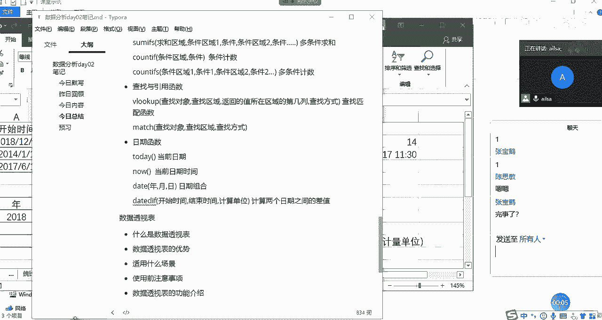

OK我们看一下啊，我们今天讲的内容是公式与函数，对吧？我们讲了它的概念。什么是公式呢？它其实就是嗯也就是以等号开头。然后建立数据之间的一个某种联系的一种算法，然后它需要用到运算服务。

所以说我们讲了运算服务。那我们再进行一个公式的使用的时候，我们用到了地址啊，对于地址而言的话，我们讲到了相对引用绝对引用和混合引用。大家跟着我的思路去想哈，什么是相对引用。那就是。那就是你走他也走。

如影随形，对吧？那绝对引用就是以不变应万变啊，就是说别人该怎么变怎么变，我就是不变啊，那混合引用就是实施物者为俊杰啊，根据实事的变化来进行自适应啊，自己会相应的发生变化。

那来决定这个引用的啊一个的符号呢？就是我们的do乐符，在哪个地方上加了do乐夫，它就不可以变了啊，这是我们的地址的引用。那我们再看逻辑啊，接下来就是我们的函数了，逻辑函数。

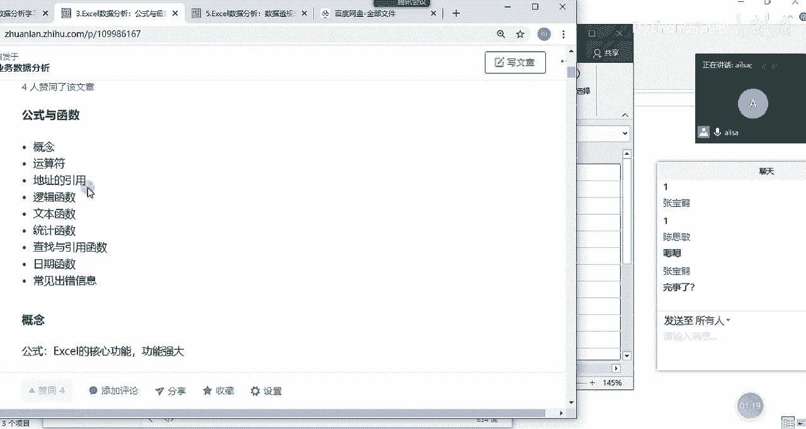

那我们看我们的函数都讲了哪些哈？

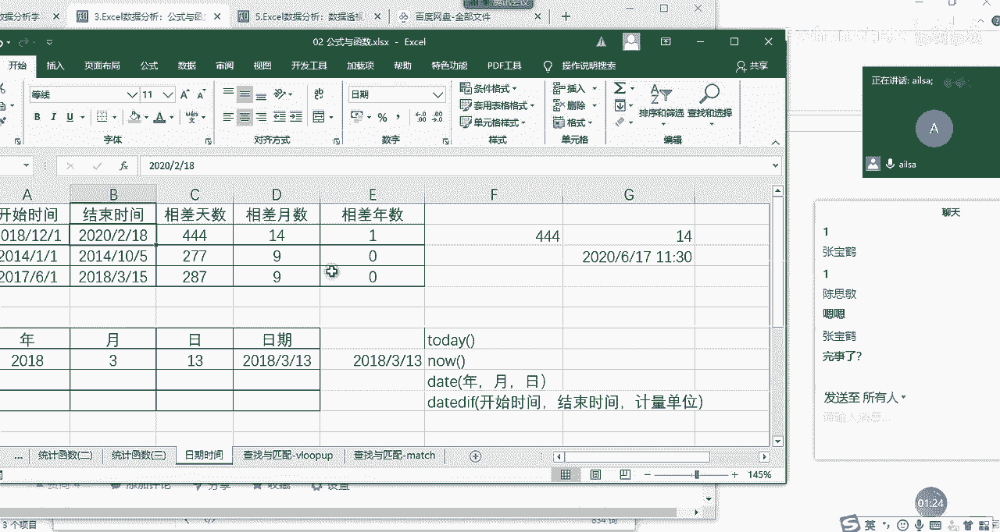

把我们的然打开一下。我们的函数啊我们函数看一下汇总，我们函数讲了逻辑函数，逻辑函数讲了if函数以及if函数以and和all函数的进行一个判断啊，没有讲not函数非这个用到的不多啊。

我们还讲到了一个if函数的嵌套，这是我们的逻辑函数，文本函数。我们讲了啊left right和me还有le函数和tex函数啊，以及我们的replace函数，这是我们的文本函数查找与引用函数呢。

我们讲了belook up啊，讲了match函数，讲了啊row和呃col columnmon啊，还没有讲。我等会儿给大家讲一下。

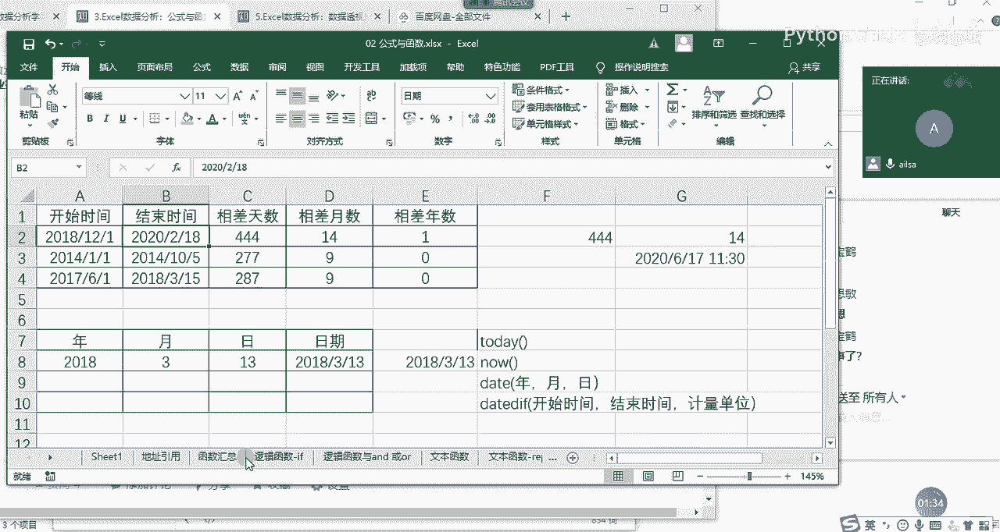

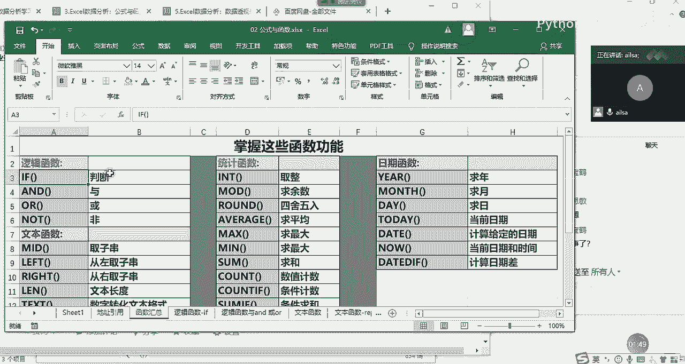

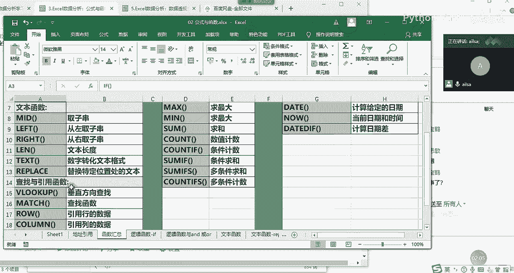

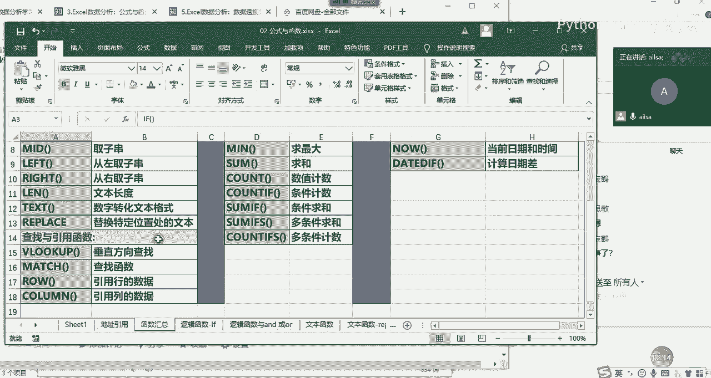

呃，那我们的统计函数讲的比较多哈，我们讲了取整int函数取于目的函数，我们的四舍五入round函数啊，average求平均max mean啊。

some count count if啊啊some是求和 count是计数some if呢account if呢是条件计数some if是条件求和加了一个S以后就是多条件求和和多条件计数。嗯。

那我们的日期函数啊，ear month day这个大家就自己回去啊，试一下，这个就比较简单，today，然后no啊d函数以及我们的d day函数啊，这是我们今天讲的所有的函数啊。

我们在这里都有一一的总结。那对于函数的学习的话，就是啊它有很多很多个函数exel当中，所以我们没必要一个个都学，我们只要把常。

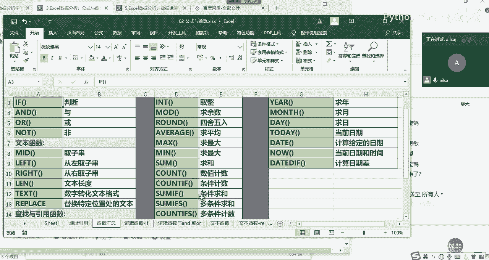

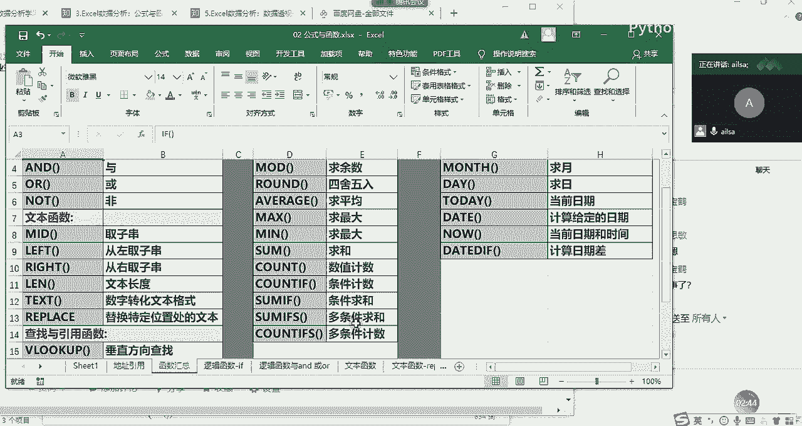

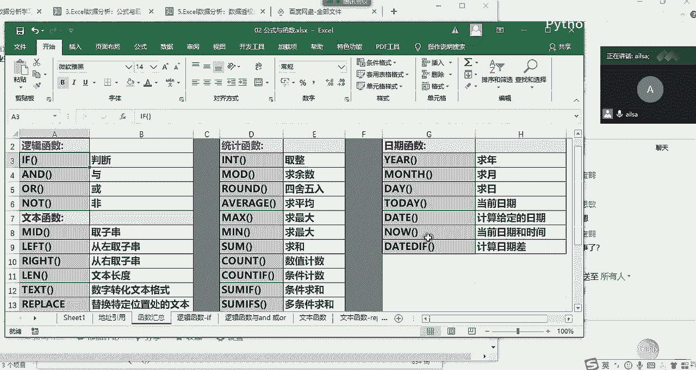

学完了就行。然后如果以后遇到了呃就是更难更有难度的，或者是说自己没见过的啊，上网找一下资料。然后我们快速的知道这个函数的组成部分以及应用场景，其实就可以实现了。嗯。

大家对于我们以上讲的内容有什么问题没有？啊，有问题，然后我们就先解答了大家的问题。嗯，呐。没有是吗？其他人呢？没关系没关系，没技术时没有嗯，反正就是啊没问题就可以，听懂就可以了嗯。好的哈。

那我们今天的时间啊安排稍微有点尴尬哈啊这样吧，大家休息5分钟，我们接着再讲一下数据透视，看能讲多少是多少，讲不完，下午再讲，好吧。可以不？啊。因为我我。没事，多练几次就行了，熟练就行了。哈呵。

我嗓子稍微有点受不了了啊啊，我们再休息5分钟啊，我上个厕所啥的，大家上个厕所。

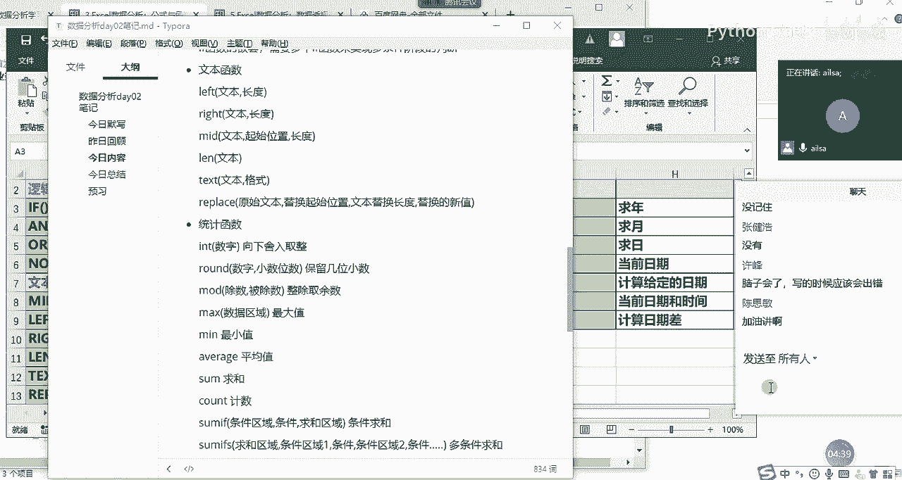

好吧嗯，好，那我。