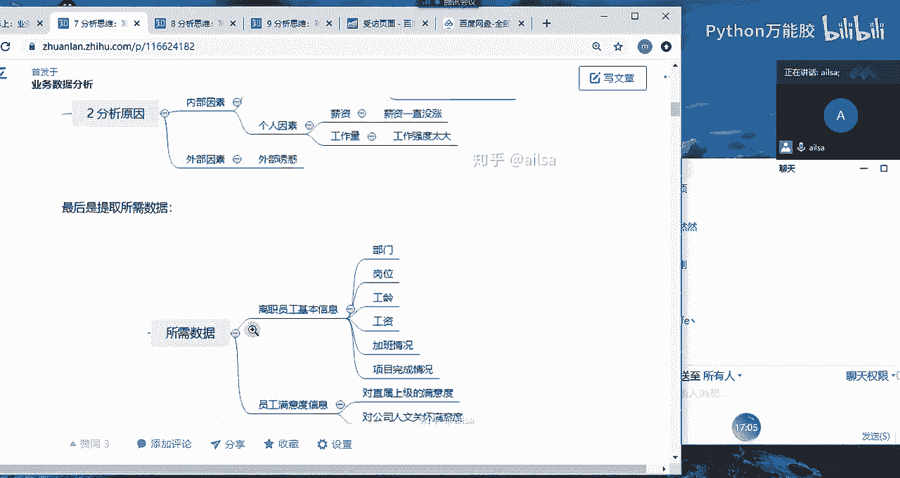
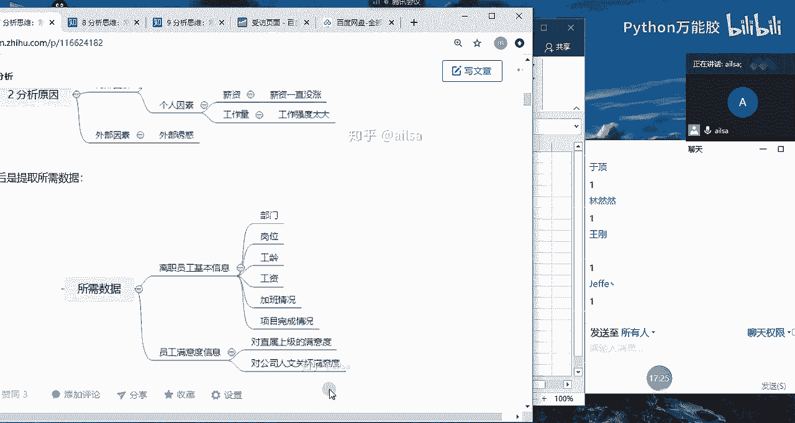

# 【python数据分析精华版来了（附文档代码）】10小时学会Python数据分析、挖掘、清洗、可视化从入门到项目实战（完整版）学会可做项目 - P30：03 指标介绍 - Python万能胶 - BV1YAUuYkEAH

业务指标之前先嗯带入一个我在工作当中的呃啊一个场景吧啊一个场景啊，我们讲指标的话会讲什么是指标。然后我们是以电商数据为例，讲常用的指标。然后再讲既然我们学了这么这么多指标。

我们该怎么选择我们的业务指标啊，这样的一个过程哈。啊，我们会讲这么多东西，然后再讲这个指标之前啊，我给大家举一个我在实际工作当中的一个小例子啊，你比如说。

嗨，你比如说现在啊现在我升级了哈，现在我是你们的boss啊啊，拿谁呢？啊，拿建浩来说哈。哎，我说建浩已经呃你已经在我们公司入职一个月了，然后对于公司业务了解的也差不多了，对吧？那你帮我分析一个问题呗啊。

你既然作为一个数据分析师，你是不是得干点活啊啊，对，然后给你的一个需求是什么呢？我给你的一个需求是啊，就是最近啊。

来。嗯，大家这个时候可以跟我互动，我会问问题哈啊，最近公司的离职率稍等。

最近啊公司的离职率。有点高。你能帮我。😔，分析一下是什么原因吗？来建号。如果说我给你抛出了这样的一个问题，你该怎么回答我呢？

嗯。建豪在吗？工资低嗯。工资不到位。Okay。嗯，建浩已经开始提问了哈。😊，嗯嗯哪个部门的离职率偏高？OK还有吗？待遇不好OK。😊，你看嗯我们先想到这里哈，首先你是一个数据分析师啊。

我我你在没有做任何的啊数据分析的这样的一个过程，你直接给我的得得出的结论，就是工资低，待遇不好，那你告诉我啊，你告诉我工资工资低，体现在哪些方面啊，待遇又体现在哪些方面，你是怎么得出这样的一个结论的。

你要有数据作为一称的对吧？你不可能你不可能像一个呃非专业人士一样，然后上来就是主观臆断啊，做数据分析师最切记的，就是主观臆断。然后凭借自己的一个经验思维。

然后去说哎大概就是这个原因造成的那如果是这样的话啊，那他们还要我们数据分析师做什么呢？他们直接。他他们直接就呃就是找那些问那些有经验的老员工不就可以了，对吧？啊，我直接问比较资深的人力啊。

他们应该也会懂一些，对不对？他们会比我们经验会更丰富一些。OK好的嗯，好的，建浩，这边这这个这个思路是对的，但是态度有点强硬哈。嗯，我先直接就是说给我这些部门的数据，我是你的boss，你自己不会去找吗？

嗯，你给我要数据，你是数据分析师，你手里没数据吗？嗯。ok啦。好的，那我我跟大家啊，我现在呢就给大家演示一下。如果说作为一个专业的合格的数据分析师，面对这样的一个需求，我们该怎么啊，该怎么去分析哈。

要有自己的一套一套思路的。首先哈啊boss给了你这样的一个问题，离职率有点高，然后帮我分析一下。首先我们对于boss这样的一个威严哈。你们在这里给我说的啊，就是天花乱坠说啊怎么怎么着。

如果真的是你的boss给你啊，就是当面说哎，你给我分析一下公司的离职率，其实。其实你还是有点胆怯的，你肯定说好的对吧？然后接下来苦逼的就是你了，因为你根本就不知道怎么去分析啊。嗯嗯，对。

所以说我们第一个我们第一个思路哈，一定要明确我们的问题。我们不要把啊我们不要把老板啊我们不要把老板想的特别的权威有能力，然后对各个方面都特别精通哈啊不是因为老板对于管理公司啊，对于呃市场的一个敏感度啊。

或者对于整个行业的一个掌握能力，他们是非常强的。但是并不是说他样样都很厉害。那他提出这样的问题之后，我们要自己的一个质疑的精神。也就是说我们要同呃从自己专业的角度，然后去跟他做一再做一次深度的沟通。

首先公司的离职率啊，对于这样的一个问题而言，他是非常非常宽泛的啊。就说如果说你们公司是1000多人。那这个离职率有点高，到底指的是什么？谁告诉你的公司的离职率就高了，我觉得我们部门离职率一点都不高。

我们公司到这今年前半年都没有一个人动过，怎么就离职率高了，是不是这个这个你心里该打鼓了。但是你作为数据分析师，你应该站在啊老板的角度去思考啊？那我们第一个明确问题的话，我们可以通过啊时间啊地点。啊。

和事件啊这样的一个思路去分析。啊，怎么怎么什么叫时什么叫什么叫时间呢？就是说你说这个离职率最近啊，指的是哪个时间段啊，你比如说到底是第一季度的离职率高还是第二季度的离职高，是1月份的2月份的3月份的。

你要最近这个时间，你要给我一个框定范围。因为你给我框定了这个范围，我就知道要要获取哪哪个时间段的数据了，对不对？所以说他应该指的是时间，指的是哪个哪个时间啊段。嗯，呃的一个离职率。啊，离职率我们要精确。

就是你要你要说的是月，那就是精确到哪个月。你要说的是季度，就精确到哪个季度，这是啊要精确到哪个时间段。第二个是地点，什么意思呢？就是说。你所谓的这个呃离职率有点高啊，他这个数据是谁告诉你的。

你不可能作为老板自己去分析的吧，肯定是有人给你汇报了。所以说是哪个啊部门啊给你给你提供的啊这个数据告诉你啊，离职率有点高啊呃，然后我们需要呃跟啊这个部门去详细沟通。比如说他们说是销售部给他们呃。

在上周末做汇报的时候，说他们想要想要加人，原因是因为他们离职的离职率太高，人手不够了。所以说那这个时候我们就要找到销售部，然后去跟他们沟通，你这个离职率是怎么来计算的。你这个数据是从哪获取的。

我们要去确认这个离职率的计算和获取源是不是按照我们公司统一的一个标准，数据是否是正确啊，我们先确定这个事情。那这个事件呢指的就是说。哎，到底啊到底是全公司的离职率高还是啊个别啊个别事业部啊。

或者是个别部门啊都精确到到到底是哪个呃范围内啊，我们要精确的是一个范围啊，范围内的一个离职率啊，这样的话你看我们通过这三个事件。首先通过时间和事件，我们就大概能够确定说是哪个时间段，然后是哪些部门。

这个时候我们的数据已经是框定在一定范围内了，对吧？那框调一个范围内，我们再去跟这个部门去详细沟通啊，详细沟通这个数据的来源是否准确计算是否按照统一标准。

那如果说是OK的那相对来说我们已经把这个范围聚焦到很小的一个点了。那接下来。啊，我们还要再去我们还要再去分啊明确。第二个啊，前两还要分析啊，一个就是这个离职率啊，它到底是怎么来计算的？

离职率的计算哈跟大家说，不同的公司有不同的计算标准，但都大差不差啊，基本上离职率的计算都是离职人数啊。大家听我说哈，离职人数啊，假设我们计算的是月离职率啊，月离职率。

月离职人数比如说是1月1月离职人数除以什么呢？大家听我说哈，除以1月。离职人数加上。月末。1月末。在职。人数。也就是说嗯。也就是说我的这个离职率的计算，就是我当月的所有的离职人数。

加上我当月月末的在职人数。那月末的在职人数它包括哪些呢？就包括啊就是1月份所有的在职人数再加上入职的人数，还有什么转岗的人数等等，这些都在1月末在职的，我们都称为1月末在职的人数，然后加上离职人数。

然后它的分子是离职人数，这样的一个计算方式是离职率的计算。那第二个问题啊，我们他既然说最近离职率有点高，是跟谁比高呢？跟谁比高，你说你说你这个你说你这个就是有点高，他这个肯定是有个对比对象啊。

你对比对象到底是谁？你是1月比2月高，还是1月比啊上上一年度的1月高呢？就是你到底是同就是还是说1月比12月份这个离职率高呢？到底是怎么个对比对象哈。我们要把这些问题都确定好了之后。

我们才能进行下一步的一个开展。假设我们最后得出的结论是。得出的结论是啊得出的结论是啊。呃，假设哈3月啊3月离职率比2月离职率。啊，高啊三个百分点啊。然后是销售部门，哎，我们的对象是销售部门。销售部啊。

销售部门哎，整整个销售团队，他们的3月离职率比2月离职率高3个百分点。那我们把这个问题确定了之后，我们的数据我们就心里就在想了。这个时候其实我们确定了我们的问题之后，我们就在想这个数好不好搞，对不对啊？

首先销售部门的离呃就是整个的一个呃离职人员和在职人员的数据，我能能不能获取到，对不对？然后第二个就是呃呃就是他的3月啊3月比2月的话，相当于这两个月的数据我肯定是要有的。

那如果说我只有这两个月数据不好用的话，我可不可以获取更多的数据来进行一个走势的一个对比，对不对？哎，这样的一个结论，我们就完成了，这就是我们前期要做的一个工作。很多人呢前期不做这个工作的时候。

他后面进行一个分析的时候就特别特别费劲，明白了吗？OK那大家对于这个确定问题有什么疑问，没有，觉得有哪些地方还需要再添加？嗯，同志们。同志们啊，我们还有什么地方需要添加的，没有。

大家有什么好的想法也都可以说。嗯，如果没有就扣1，我要看到大家的一个反应。OO ok。嗯。嗯。好的，那我们接下来就要就要进行一个分析了，对不对？那现在就是说现在问题已经抛出来了，离职率高啊。

而且是销售部门3月离职率比2月离职率高了3个百分点啊，那我们接下来就要进行一系列的分析，我们分析呢啊有从我们就是要一步一步拆解着去分析。那怎么对于这种问题的分析。首先我们的思路有很多哈。

首先我先跟大家说啊，第一个思路哈啊，第一个思路。嗯，那我们离职啊，对于离职而言的话啊，我们一般啊会分啊两大群体，什么呢？一个叫老员工。啊，一个叫新员工。如果我们要对，就是说我们把这个人员调出来看。

到底是啊这就属于多维度拆解了哈。我拆解老员工和新员工两个维度去分析。那如果说是新员工离职率高，因为新员工跟老员工之间，他是有不同的特点的。如果说是新员工离职率高，那我们就可能要分析的是他入职了之后。

我们有没有给他好的体验，对吧？你比如说有没有入职啊培训对吧？入职啊，就是如果入职了之后不知道自己干啥，那他可能也也就待了几天就走了，入职培训啊，有没有什么入职关怀。就比如说什么叫入职关怀呢？

就是说你第一天来到这个公司，然后入职到这个部门，部门领导啊，本应该哈本应该中午的这个饭应该是领导带着你去吃的。因为啥呢？因为你对这个环境不熟悉，然后如果说啊又没有人叫着你去吃饭。

然后然后你就你也不跟别人进行一个沟通的话，你有可能中午就是饿肚子了。但是对你的体验就不好，你觉得你融入不到这个团体当中，所以你可能就会选择走啊，假设假设是这样一个例子哈，所以入职关怀。

还有就是啊薪资啊啊，薪资这么一情况，就是呃你入职的时候跟你说啊你给你开的工资是15K。结果你第一个月第一个月发了工资之后啊，到手只有10K。然后你问啊到底什么原因，他们说这个因为你第一个月没有绩效。

所以我们绩效是5000等等之类的，你就觉得会被坑了，是不是有这样的一个一个情况，还有就是啊整个对于公司的一个满意度。哎，就是一般情况下离职都会调研嘛，就是说哎你看到底是我们哪些方面做的不好。

然后怎么怎么着，我们再进行一个详细的分析。还有就是员工的一个加班情况。比如说他一上来啊，就是新入职一来就给你。就跟你各种加班啊各种加班啊，然后你肯定也受不了，所以就会走啊。可能新员工更关注的是这些。

那对于老员工而言啊，老员工而言，我们也要从不同的维度进行一个分析。你比如说老员工的话，一般情况下。哎，我们的分析维度会从内外部，其实新员工也可以从内外部哈。我们刚才讲的都是内部的啊。

我们也可以从内部和外部。啊，我们先说外部哈，对于老员工而言，他有一定的啊他有一定的工作经验了。所以说他外部会存在外部诱惑哈。啊，外部用户什么意思呢？就是说这个员工特别有能力。

他也在这个行业积累了一定的经验。那外就是外外部的公司啊，也或者是同行业的一个公司，有没有挖他的一个可能，然后给他更高的一个薪酬这样的更好的一个福利待遇。所以说啊有可能是外部环境啊造成的这个员工的离职。

那对于内部而言的话啊，内部而言的话，其实对于老员工而言，更多的是啊薪酬啊，薪酬与。啊，薪酬与付出啊是否成正比？对吧也就是说嗯你你天天比如说我给你调出来这个员工天天加班，天天加班。

但是他的薪酬在两年内都没有涨，那他也很可能就离职了。所以说主要考察的就是薪酬与付出是否成正正比。还有一个就是啊整个的一个啊员工的关怀啊，员工的关怀。

还有就是我们的呃一个满意度啊这方面如果说我们大概确定的是就是其实这些都是我们的猜测，哎，我们可能猜测是因为啊外部诱惑可能是因为薪酬与付出不成正比，可能是因为这是可能是因为那我们猜测了这些东西之后。

我们是要拿数据去进行证明的，对不对？

那我们的数据该从哪些维度去考虑呢？然后你看啊我看啊啊我们的数据的话就啊就会要是从啊不就是这个数据的话，因为离职率是属于员工的基本信息。所以说有可能就需要跟人力进行一个沟通，他们那边记录的员工的基本情况。

或者是说你们公司有完整的一个数据仓库的话，他也有专门针对人的一些记录，你可以把这些数据调取出来，进行按照你的猜测，然后进行一步一步的去分析，最后分分析出来什么原因哈。嗯，但是啊这个离职率而言的话。

因为我们有一个满意度的调查。哎，就是说我们每就员工走的时候会调查你这个到底是。

为什么离职？但是很多时候他都不说真实原因啊，就说其实有可能是对领导不满意，但是呢他又说啊是职业发展的问题，因为不想得罪领导嘛，对不对？所以说这个还是有一定的呃不合理性。

啊，嗯总体来说的话呃，我们做数据分析，只要以我们的数据为准就可以了。啊。如果说呃你的数据呃原是有很有价值的那你分析出来可能会更好一些。如果没有的话，那你也只能分析一个大概出来。

也比如说确实是薪酬与付出不成正比。这个人加班加加班特别多啊，然后这种情况造成的员工的幸福指数啊，叫幸福指数下降，然后他有可能就会选择离开。然后我们确定了这样的一个思路之后，哎。

我们接下来就可以调取我们的数据，然后针对这些不同的维度拆解，然后进行一步一步的详细的验证和分析就可以了。嗯，OK同志们啊，大家对于这个的分析思路，然后听明白了吗？听明白给我扣个一。好的好的。

就是我先跟大家说一下，我们在分析问题的时候，首先离职率这个东西啊，离职率这个东西其实它是一个什么呢？它是一个反映员工啊，反映企业哈企业员工稳定性。的一个衡量指标。衡量指标对吧？衡量指标。

然后如果说一个公司的离职率特别高，代表什么呢？离职率。啊，离职率高啊，代表是员工的流动性。很大啊，说明极其不稳定。那说明这个公司在管理上肯定会存在很大的问题。

那有的人就说你这个离职率高高到什么时什么程度算离谱呢？也就是说。啊，他只要啊达到5%到10%，或者是及以上，就是呃5%，我们可以拿5%作为一个中间点吧，就是8%、10%这种的话就已经属于很高了啊。

员工的流动性太大了啊，这就说明公司的管理上比较混乱啊，员工来了就走，员工来了就走啊，这是离职率高啊，离职率太低啊也不好，为啥呢？你比如说啊国企他们的离职率有可能在3%以下啊，3%啊，3%以下就1%2%。

这种就比较低了。那员工呃离职率低，他会有一个不好的现象，就是啊养老哈就是。因为没有新鲜血液的注入，但大家的竞争意识就不是特别强，然后干的活也都是那些。所以说呃就是比较安逸啊。

那还有可能就是如果说他的离职率特别低的话，来了一个就是比较积极上进，比较有竞争意识的员工，有可能会被排挤走，因为他不适合这里面的养老的环境啊，所以说离职率要有一定的啊，不能说你们公司没有一个人离职。

那说明你们公司就非常好。不是的啊，离职率要保持在。啊，离职率要保持在怎么说呢？他没有一个标准，可能我就拿啊5%左右吧，5%左右啊，尽量不要高于5%啊，3%到5%之间。

然后的话它既有一定熏鲜新既有啊既有新鲜啊血液的注入。血液的注入啊，又有。啊，又有啊实力员工啊，就是有实力的员工，老员工又有实0力员工的保有。啊，保有啊，那这样的话，对于一个部门来说，既有竞争意识。

然后又有啊实力的干活的人，那整个部门才是健康的，整个公司也才是健康的啊，所以说是这样的一个指标衡量。所以说我们会发现对于一个指标的理解的话，如果你理解到位了。

那他就可以很好的然后帮助你更好的去管理你的公司，然后去管理好你的人员去做好你的业务，对不对？是这个意思哈。那大家对于这个啊，有什么问题没有？我们可以参与讨论哈。同志们。hello嗯。

有什么问题没有没有问题是吗？好的嗯。对，是的，是有的啊。这个离职率啊，不管是月啊季度年，这个百分比的话，基本上都差不多是这个水平啊。这个主要看你在分析的时候啊，因为这个率的话。

其实呃其实呃它只是一个时间范围内的啊呃我呃我们暂且理理解为它是。月吧，先理解为是月的离职率啊。这个如果你在面试的时候，就是你你可以给别人讲一讲啊，就是说哎我们公司啊。

对于就是如果说别人说你对于一个指标的理解的时候，如果你扯不太多业务的时候，你可以扯一下啊，就员工的管理。因为这个员工的管理，在每一个公司都会有的啊。

就说哎这个离职率其实是反映员工稳定性的一个重要的衡量指标。那他太高也不好，太低也不好。然后的话他保持了一定水平，有什么样一个好处。

相当于你对于指标的一个意识还是非常强的。没有没有啊，所以说呃所以说你们要明白，就是说我们做数据分析的时候，你衡量一个业务好坏的一个指标。它不是说越低越好，也不是说越高越好，而是它健康就好。嗯。OK好。

那我们对于课前事例啊就讲到这哈。