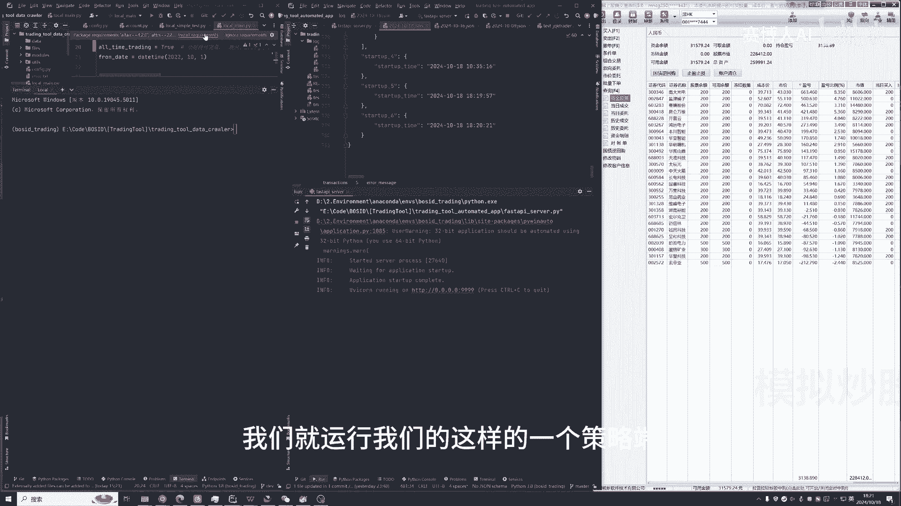
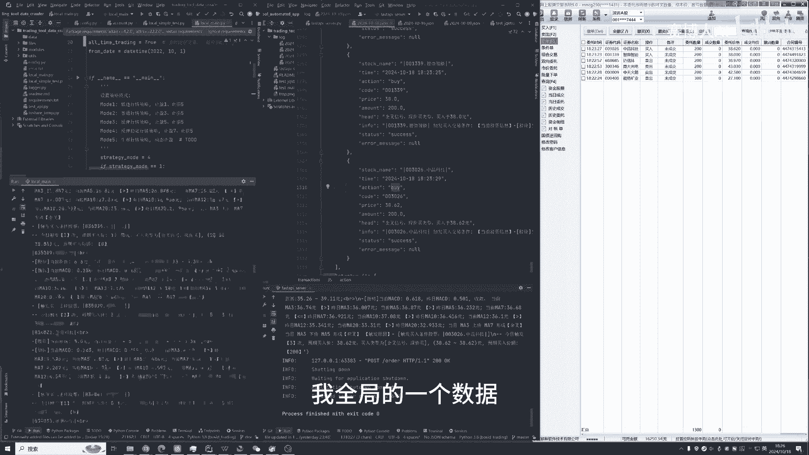
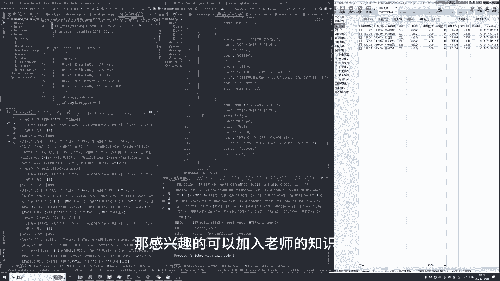

# 牛市又来？大A如何进行全自动化的量化交易？ - P1 - 搞量化的猪咪 - BV1UpCUYeEbF

哈喽各位小伙伴们，从上一篇文章发布之后呢，大家都对这样一个自动化trading的软件啊，非常感兴趣，那今天呢我就来给大家统一讲解，和快速演示一下，由于现在是10月18号晚上六点钟啊。

现在我们已经过了交易的一个时间段啊，所以呢现在我用一个模拟测试的一个环境，来给大家进行一个代码的演示，然后呢话不多说，我们开始啊，那这个软件大家如果感兴趣的话呢，其实我们怎么去配置这个软件啊。

到时候大家加入我的知识星球啊，都可以去获得对应的一个教程，那这里我就不做一个详细的介绍呃，那整个软件有两个部分啊，这个第一部分呢是我们的策略部分，为什么要把单独把策略部分拆出来呢。

因为很多团队他们的策略是极其保密的，包括老是这里的这个策略也是非常保密的，都是有顶级的数学家，科学家，包括交易员通过自己的经验总结出来的，所以往往在真正实操中，我们的策略端是要用一台单。

单独单独的设备来进行保存和运行，所以呢这里的策略可以单独的去拆开啊，比如说放在一台啊，你控制的电脑，或者说有那个策略师啊，复制在电脑上面，当然如果你是一个人使用这个软件，那就无所谓啊。

那除了这个策略端呢，还有一个就是交易端，交易端它是要调用这个同花顺来进行自动化的，一个交易，有非常懂行的小伙伴问了，就是说同花顺是是不是不提供啊下单接口的，那这里老师告诉大家，的确是的。

那我们用了一些非常奇技淫巧的方式哈，那这里的方式呢就是模拟鼠标键盘操作啊，因为你们用接口下单啊，这些所有的记录其实都是会呃，就该有的都会有的，但是呢如果是你模拟鼠标操作的话，它其实跟你手动上线。

下单和呃买卖是没有任何区别的，你手动也可以进行撤单，手动进行下单啊，所以呢这里我们用了按键精灵，这样一种非常额特殊的一个方式，然后保证大家账户的一个安全的同时呢，也能实现一个自动化的trading，好。

那我们现在开始演示呃，首先呢怎么去用这个软件呢，我们只需要登录我们的同花顺账号啊，这里的同花顺账号，大家不需要把自己的账号密码输进来，你只需要同花顺的这个委托下单的软件打开啊，您就可以使用了。

好首先我们要运行我们的交易端啊，好我们看到现在8。20，我们这个交易软件已经自动连接上了啊，他把时时间给同步过来了，好那这边启动了之后呢，我们就运行我们的这样的一个策略端。

好，能看到它自动怎么样去调用，我们的同花顺软件啊，获取到了你的持仓信息啊，你的你的剩余的额账户余额啊，包括根据你这个持仓的信息，它后台去重建你的一个持仓库，呃，这里呢其实大家经常会有的操作。

就是说我软件操作我的账号，我自己有时候手动我会手痒，我也想自己买卖我的账户怎么办，那这里老师其实提前都考虑好了啊，我们只需要手动下单，手动我们操作完，我们重启一下我们的软件。

它自动就会根据你把你刚刚最新的这样的，一些操作给同步过来啊，它就会自动去过滤掉这些你已经操作完的东西，好啊，能看到现在策略开始生效了啊，他已经开始批量去卖卖出股票了啊。

这里老师是没有进行任何的一个操作的啊，然后呢我们这边策略端也接收到对应的信息，好能看到在我们的这个策略端，他其实把呃目前你的持仓信息啊，你预期的一个止盈止损啊，都已经给显示出来了。

所以这里大家可能策略不一样了，大家策略不一样，对应的啊，我们的一个呃实际执行的1111，一些数据也不一样，那这里可能需要大家对这个软件上面进行，更进一步的啊定制化嗯，那老如果加入老师的知识星球的话。

你将会获得如何去使用这个软件，如何去部署啊，这套服务怎么去做的，策略的定制化的一个开发啊，我们都会在知识星球里面进行一个，不间断的一个更新，同时老师也会不断更新这一套的一个项目代码。

然后在知识星球里面的所有加入星球的朋友们，都会不断的可以去呃，从git上面去下载最新的一个代码，那当然了，这套代码是不对，支持星球以外的朋友们开放的啊，也要尊重老师和老师团队们的，这样的一个研发成果。

好那这里我先结束我的软件，能看到刚刚啊它自动化进行了一些操作，那能看到刚刚最后几个我们下了几个单啊，首先是10月18号6：23分啊，时间是对的啊，我们进行了一个买的一个操作。

那这里的交易system里面呢他也会实时的去刷啊，我全局的一个数据好。

这里老师也打开了自己的邮箱，能看到刚刚的这样的一些买卖的操作啊，我们都自动发发送到了我们的邮箱中啊，我们也可以点开它会告诉你为什么买入，为什么卖出啊。

这样子呢，我们就可以通过软件的形式，实现一个全自动化的交易，盯盘好，那感兴趣的可以加入老师的知识星球。

