# 不需要会编程！10分钟讲清楚量化交易回测环境怎么搭建！ AI时代，不需要学编程，学金融，也能入门量化交易。用chatgpt搭建史上最好用的回测环境Backtra - P1 - 无限超人Infinitman - BV1U511YFEDJ

大家好，欢迎收看我的影片，今天我来向大家介绍一下，如何在没有系统的学过编程的情况下。

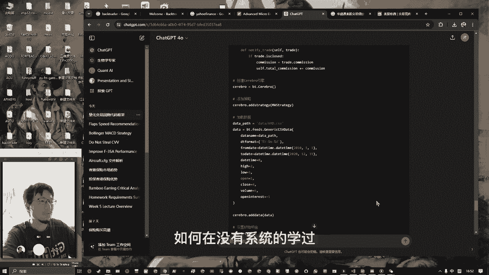

使用chat gp作为一个工具，来帮助我们进行本地的灰色环境搭建。

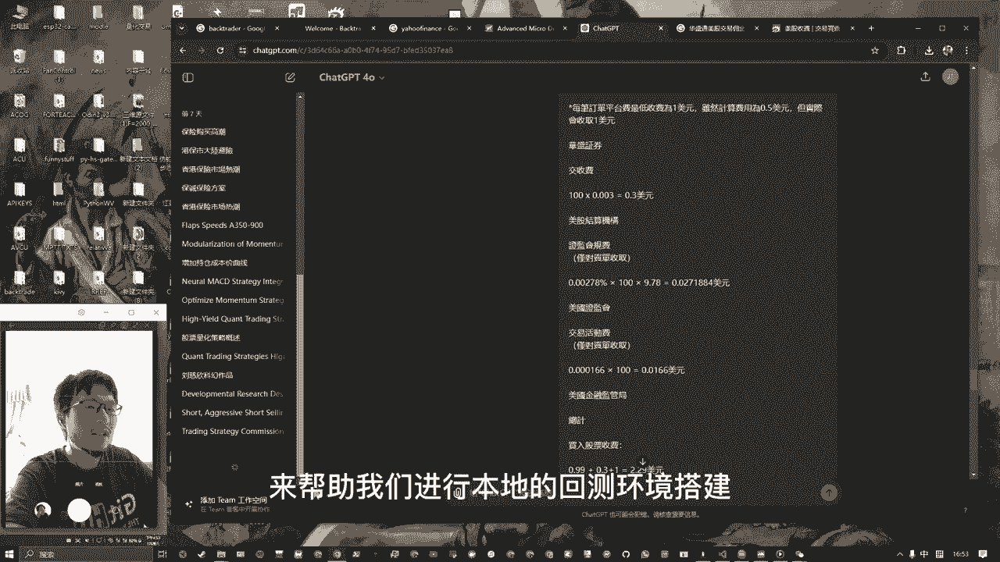

我们本地回色搭建使用是back trader，作为一个回测到环境的库，因为它是一个比较强大的回测环境，它支持比较多种类，比如说股票呃，然后期货，然后比特币之类的交易的回撤。

再一个就是因为它是一个本地的环境库，你的所有的回测都是在本地计算机进行的，你的策略也不会被共享到互联网上，就比较安全，然后说一下我自己本人的情况，我自己本人是没有系统的学过Python的编程的。

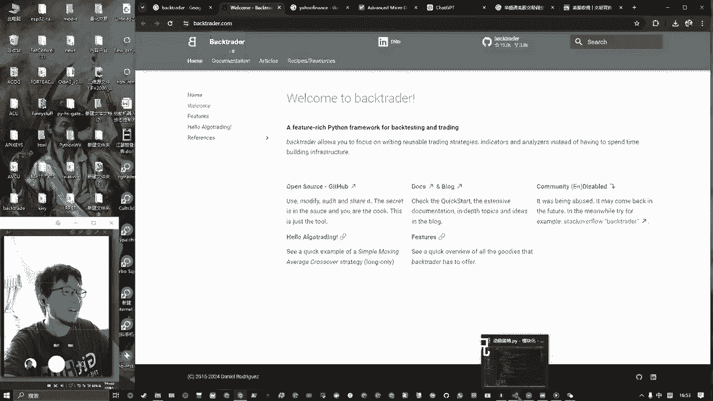

我只会一点点轻微的C加加，然后我的交易主要是做美股，因为A股市场毕竟大家有目共睹，然后年初的时候我去香港开了几个银行卡，然后开了一个美股券商，就在美股，大概2月份到现在就开始交易。

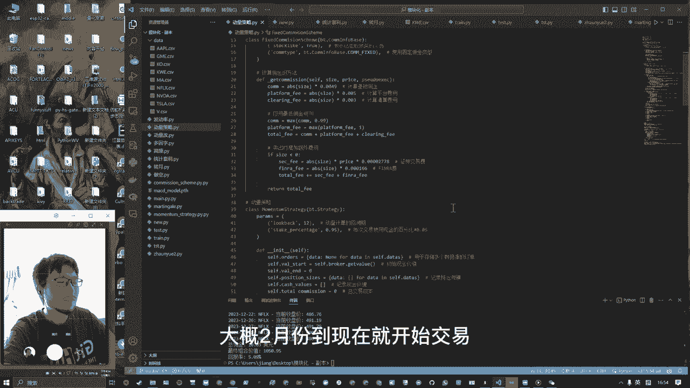

然后因为美股的交易是他们那边的，早上九点对应过来。

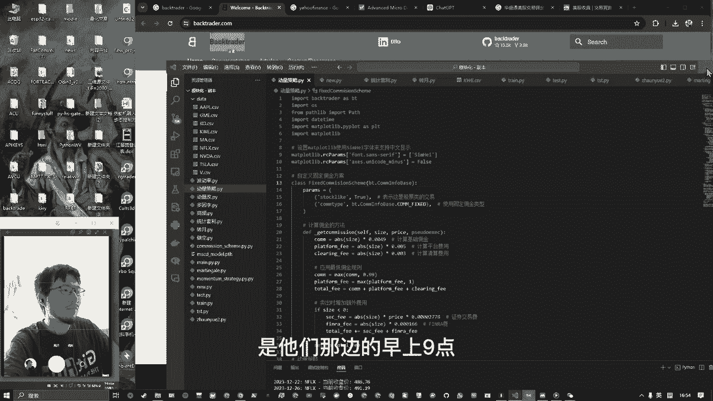

就是我们这边的晚上9。1直交易到交易，到我们这边凌晨五点。

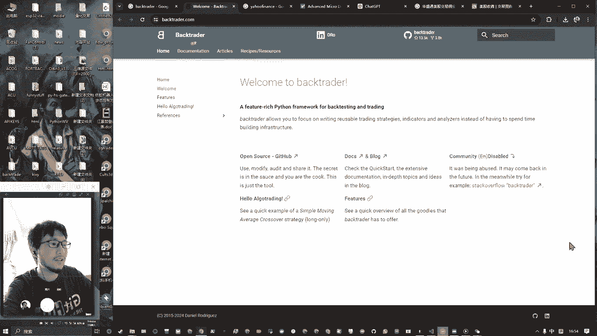

所以这个时间就比较逆天，所以我就希望通过量化交易这种方式来，就说不要每天晚上都去盯盘，然后事实也证明，我们在没有学过变声的情况下，是可以来没有学过编程。

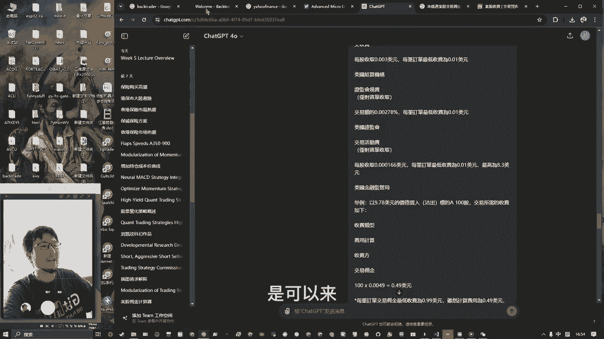

算是可以来进行量化环境搭建的，大概就是这样，我们先演示一下，我这里交易对象是网飞的个股，然后交易策略是高频交易策略，好动量交易策略，这里大概的收益率大家可以看到，我把这个图表叉掉之后，手里有5。09%。

然后回测的时间是，网上可以看到，2023年10月1号到2024年的1月1号。

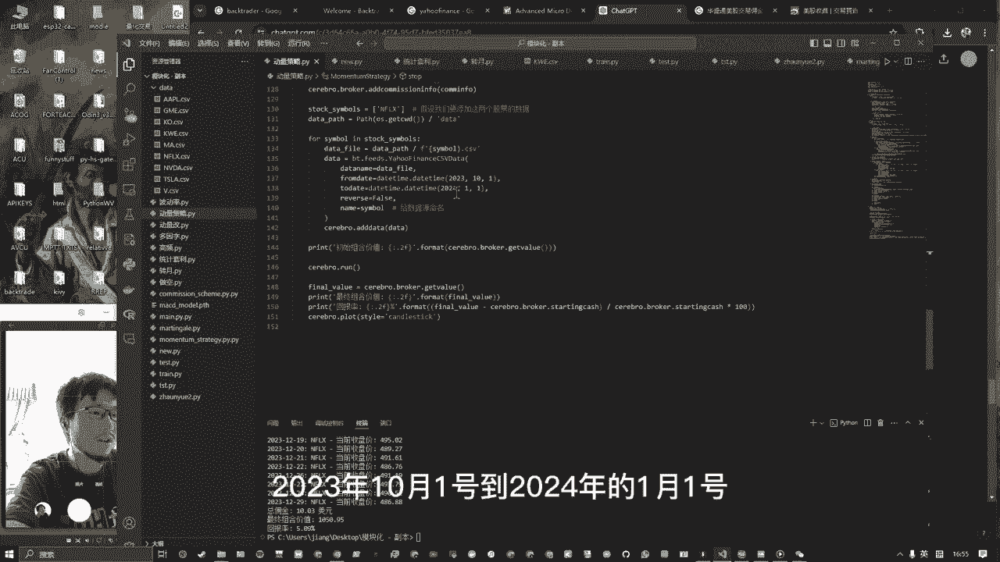

这三个月时间，这个策略还是挺不错的是吧。

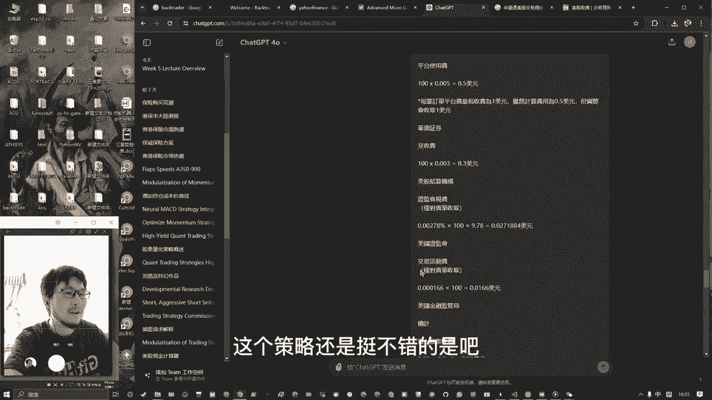

然后我们现在开始演示，如何快速的使用下载机器，来搭建一个本地的回色环境，首先我们需要呃建一个虚拟文件夹好，第一步其实是Python的环境搭建，这一步网上都有，我就不再赘述了，然后有一个。

然后back trader，他这库也是需要自己去手动安装的。

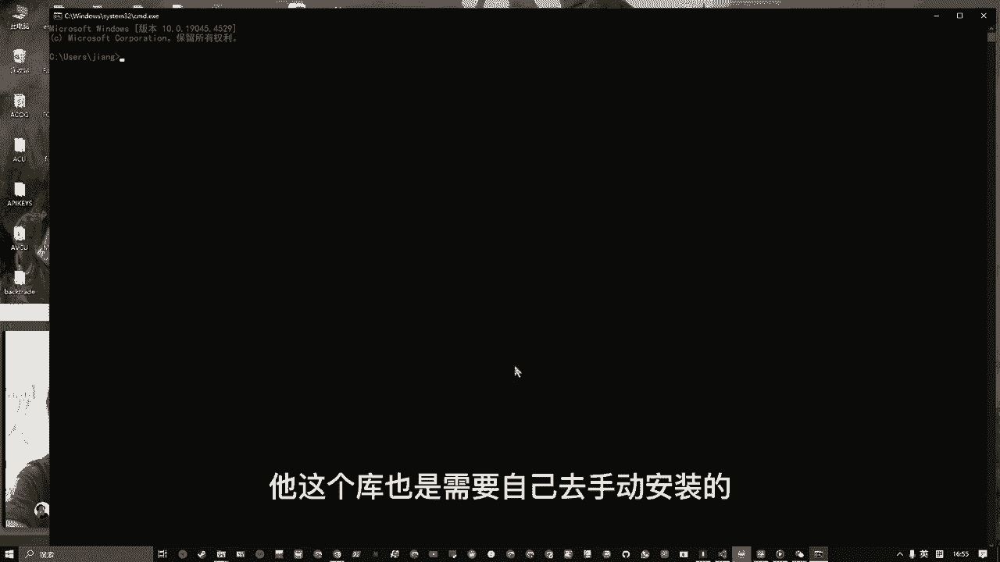

然后安装方式也很简单呃，你安装Python之后，使用pp这一个下载器就可以很方便的安装，很方便安装back trader，就这样输入它的这一行指令就可以了。

然后它就会运行，由于我已经安装好，所以这显示是requirements or ready set fire，这代表我已经安装成功了。

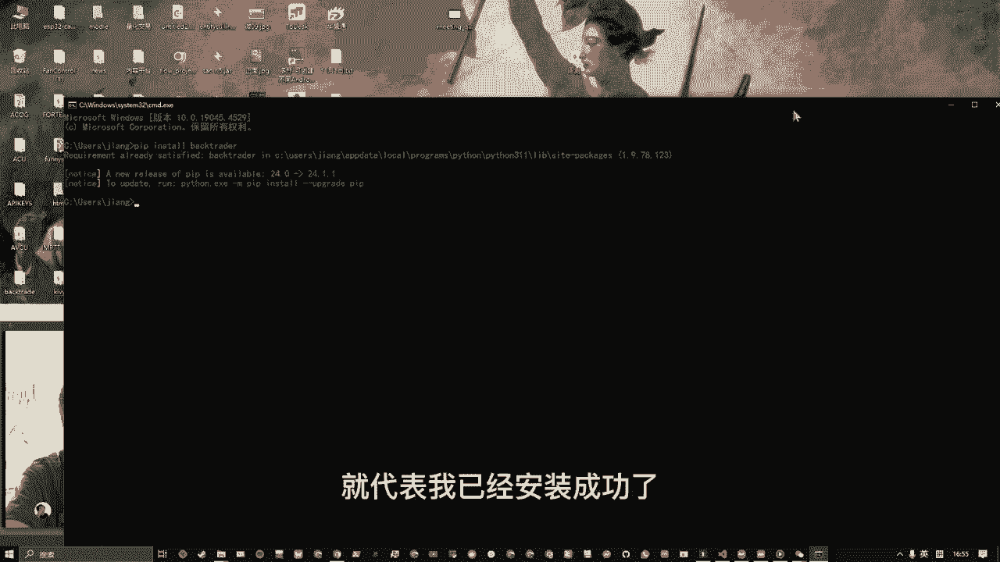

安装成功之后，我们就新建一个文件夹，我们把改名改一下，名叫做呃搭建，呃，然后我们再在这一个文件夹里面，生成一个子文件夹，叫做data，用来存放股票历史数据，然后我们生成一个先生成一个文本文档。

把后缀改成PY，也就是Python程序的名字啊，把把名字也可以这样写成新闻文档，这样就已经是一个Python文件了，第二步呢，我们需要去网上下载我们想要的历史数据。

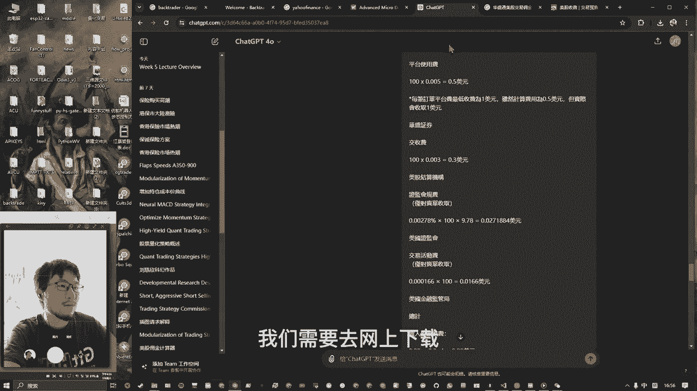

是我们选取yahoo finance，这是比较常用的一个呃历史数据下载的地方，用谷歌搜索雅虎FINANCI。

都可以登进去，然后选择你想要的股票去搜索，比如说这里我选的是OAMDAMD，然后我们可以下载它的历史数据，这里我们选择，因为他这个网站数据量有点多，比较卡，选择max就是从1980。

他的ECIPO到2024年，就是到今天我们可以先下载它的数据，这里点击download就可以下载，这里我已经下载好了，然后我直接把这个历史数据。

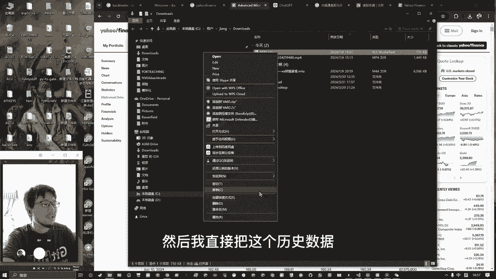

他这样一个CSV格式的数据，复制到这个data文件夹里面，然后大概的框架就文件上的框架呃，就已路径上的框架已经搭建好了。

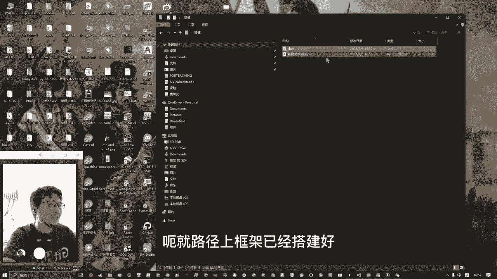

然后我们用vs code打开这个文件夹，然后就基本上文件方面都是已经生成完了，然后我们就可以这时候去找ChatGPT，新建一个对话额，值得注意的是，GP3。5是免费的，四四欧是那也是免费的，四是付费的。

所以这个付费的金额大概是一个月20美金，然后你得有呃境外的无线打卡或者万事达卡，你才可以支付，然后CEO也可以用，而且效果应该也不差，我之前的策略都是用4O生成的。

然后我们现在开始使用chat区来搭测搭测搭，搭建回测框架，第一步我们先说呃，你好，帮我使用back trailer搭建一个回测的基本框架，啊我的数据源是，然后数据存放在data文件夹里。

啊这个文件路径一定要指代清楚，说明清楚，因为呃如果不会编程的话，他要指代清楚，这个相对文件路径和以及绝绝对文件路径，还是比较麻烦，所以我们这里一次性说清楚，给ChatGPT，然后你想一个。

收益率比较高的策略，所以他就在自动生成，然后就是策略模块，然后数据初始化，然后是回测框架，因为它是分离的，所以我们需要让它给我们完整代码，定义一个移动平均线策略，这时候已经生成完了。

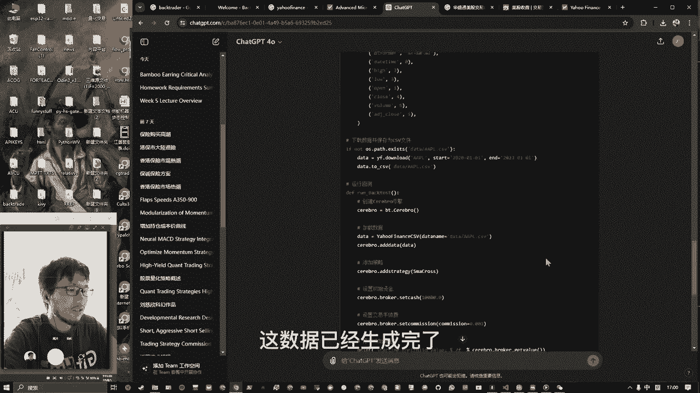

等它生成好之后，我们就复制，把这段代码复制回我们的文本编辑器，复制回vs code，然后他这里由于它的样例是apple，又是苹果数据，我这里的数据是MD，所以我这要改成MD。

啊但是由于他这已经接入了雅虎finance。

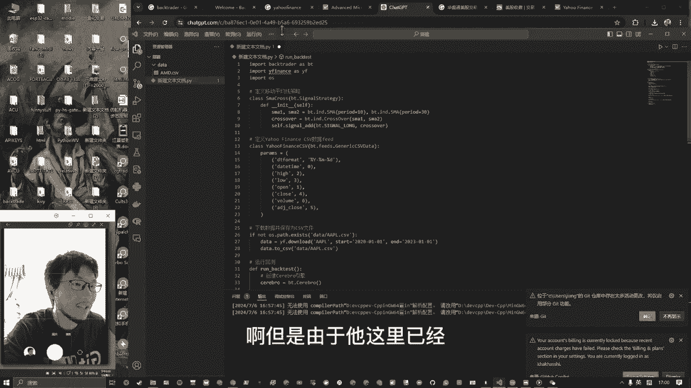

所以我们需要先重新安装一下。

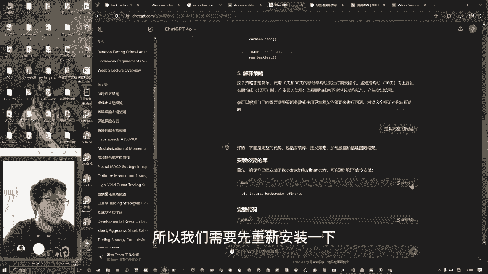

这个雅虎finance的库。

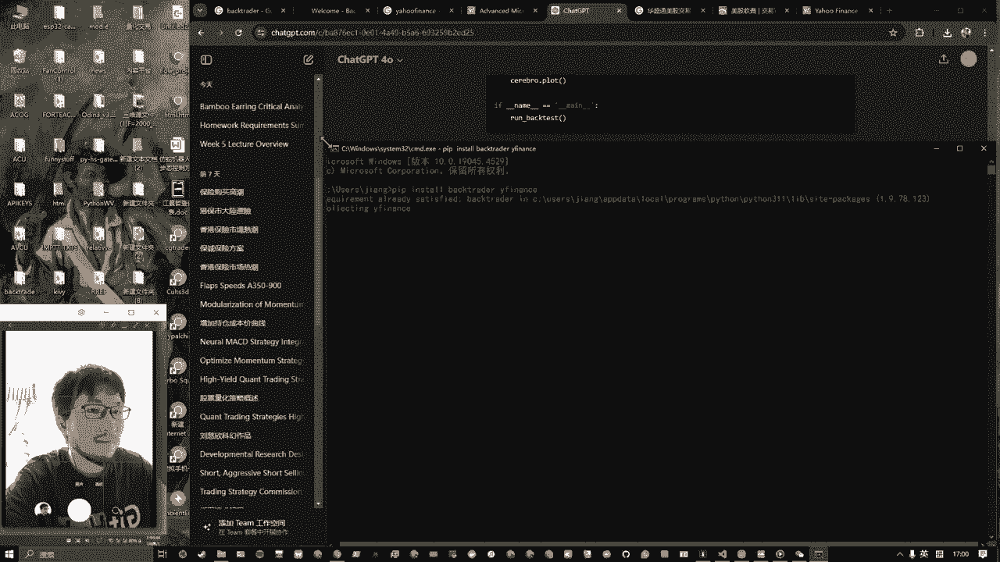

安装完成之后。

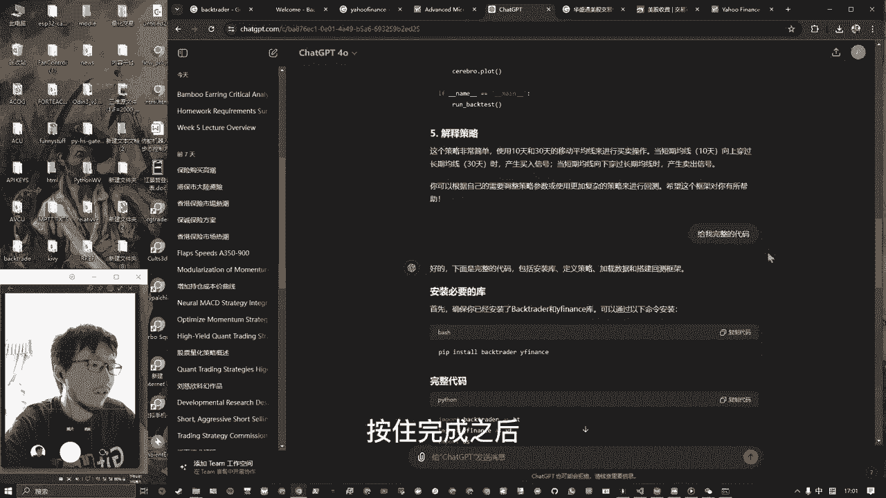

我们就可以运行这个代码，然后这个就是他的交易情况呃，这个箭头代表买额卖出，这一个向上的绿色箭头代表买入，然后这个就是它的收益率的曲线，收益曲线，然后这样一个基本的框架就已经搭建完成了。

所以然后我们现在需要需要自定义佣金嘛，因为我的券商的佣金和这一个佣金，肯定是不一样的，我想要更加真实的测试结果，我肯定需要来把这个券商这里用进来。

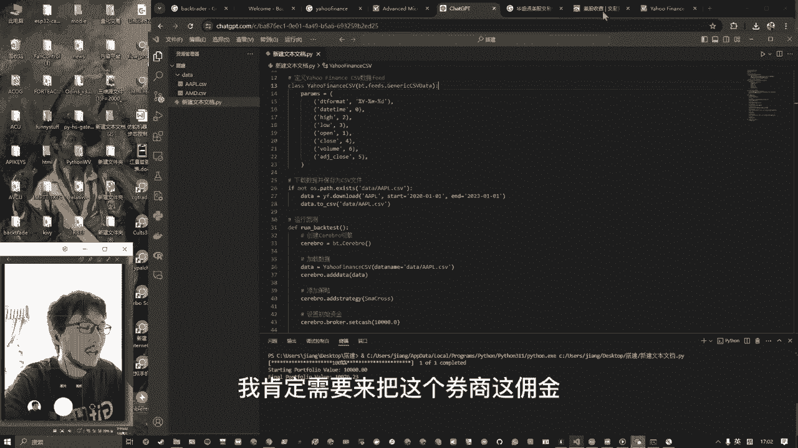

把它添加进去，因为我自己是不会写这个佣金的代码，所以我直接把这个代码扔给ChatGPT，加入佣金模块，等他读取这些额交易费用佣金的规则之后，它就会自动帮我们编写一个自定，自定义化佣金的一个模块。

都说我们的交易的啊，回测的结果就会更加精准。

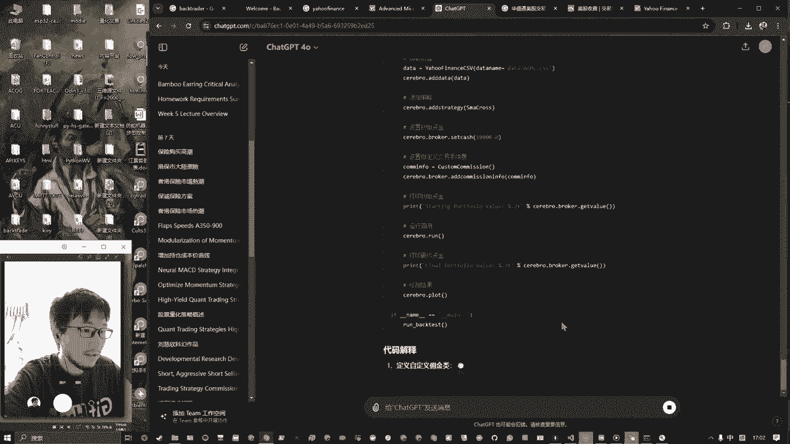

然后我们再进行回测，那个时候加加入了佣金之后，实际上我们是亏的是吧，然后这是他的收益曲线，然后大概就是这么多，然后有几个要点，就是在跟chat去对话的时候。

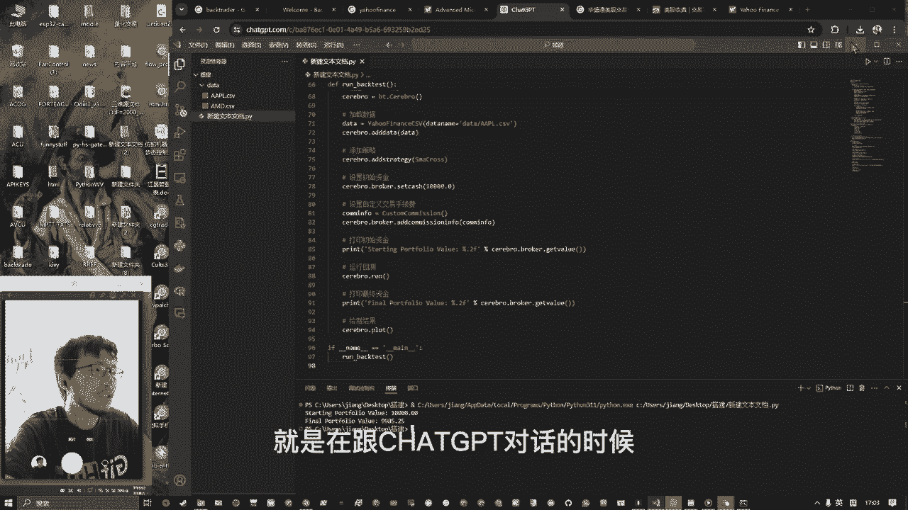

你的表述一定要清楚呃，表述一定要清楚，这样他就不会误解你的意思嗯。

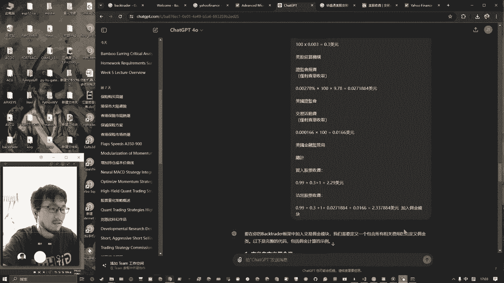