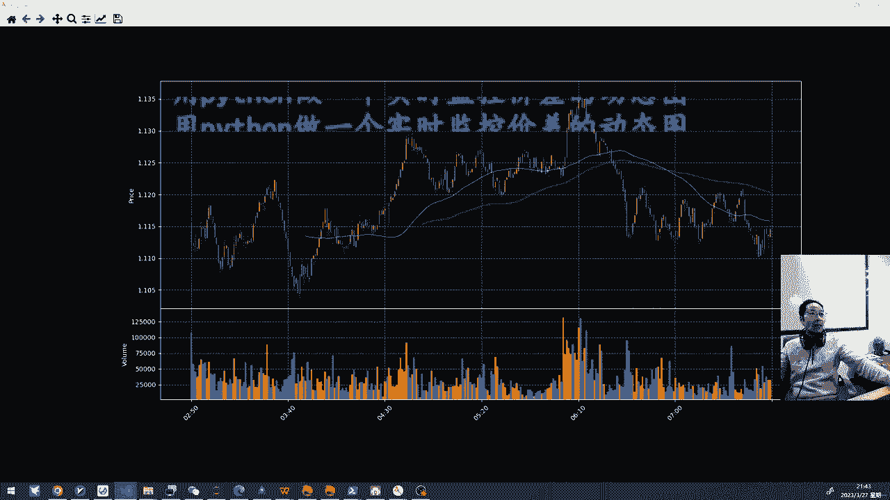
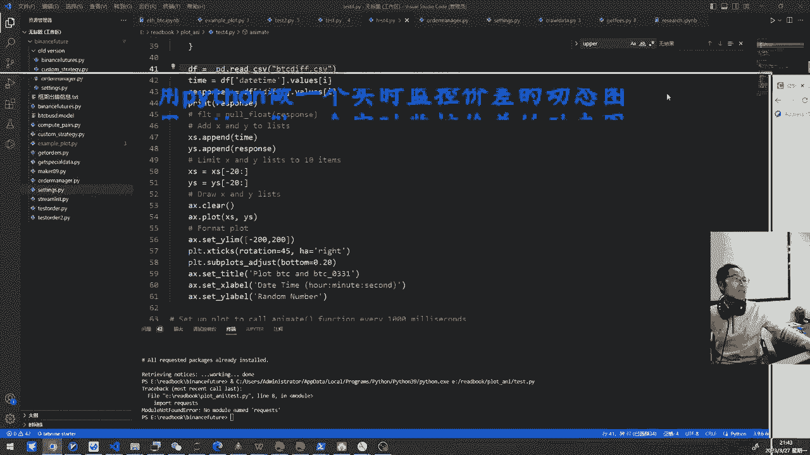
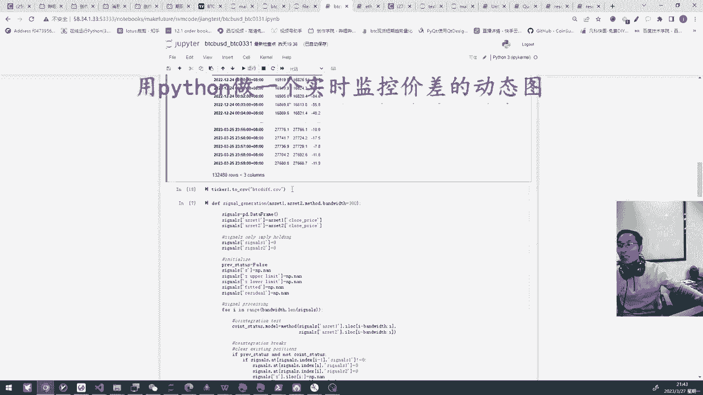
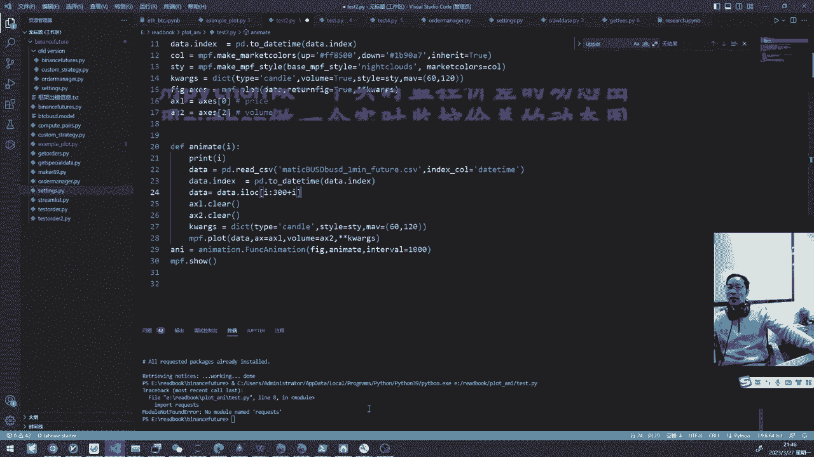
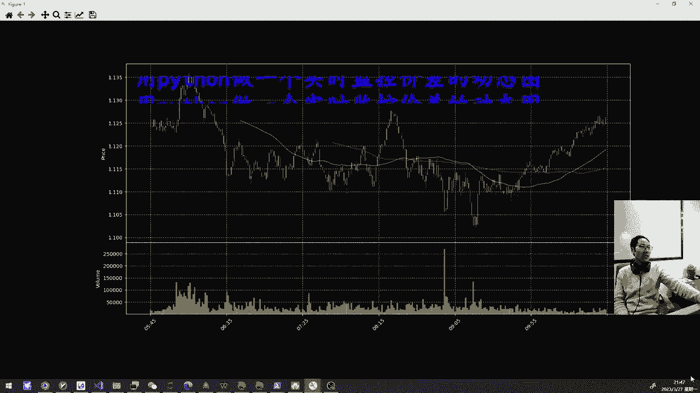

# 用Python实时k线动态画图，动态监控价差图 #量化交易 #高频交易 #交易 - P1 - 无限超人Infinitman - BV1ZHxpe7Ezi

Hello，兄弟们，现在的主题就是用Python做一个实时监控啊，这种价差，因为我们做高频套利的时候，我们要知道我们的价差的走势，以及它跟这种标准差的一些关系，所以说我们这个尝试去做一些这个工具。

然后呢，包括以后可能会延伸到就是在这个K线的时候，我们的机器人啊，如果是下了一个订单并且成交的话，我们就是在这里会去做那个机器人的，那个那个下订单的呃信号，比如说是在什么时候是买了，什么时候是卖了。

然后呢找到了工具的话，可能呢有有比较方便的实现方式，然后还有一些复杂的实现方式呃，你比如说可以用啊py e charts的，和配合JAVASCRIPT类似的这种方式，那么这种方式的话。

可能呢呃需要有一定的功底啊，就是有可能要去再去看看JAVASCRIPT这样的一些语言，然后呢其实有一些比较简单的方式，也就是呃我们来看看这个代码啊，这个最后的做这一个效果，就是我现在还只是个demo。

那么以后的话可能可能有更高级的这种玩法，然后呢这个第一个是监控价差，那么这是啊，pilot这个plot的比特币和比特币的那个呃，这个应该是是季度的这样的合约，他们之间的一个价差的走势。

然后呢我们可以去获取，获取之后丢到这里面来，然后按照时间一直记排啊，然后呢可以看到一个这样的一个情况，第二个是什么呢，就是说我们这个这个对K线去画一个，动态的K线图，然后呢我们的订单呃。

可能在K线什么样的位置去去下呀，或者干嘛呀，那我们现在只是做了一个呃基础的一个版本啊，以后的话可能我们自己做高频套利要干嘛的，我们把呃我们所需要的数据进行可视化的展示，然后呢。

这个结果他是用了这样的m p l finance的，这样的一个库，它就是实现的这种比较简单的，下面是这个叫什么叫volume，然后上面是那种均线的，这样那个图用用Python来进行画，然后我们看一下。

简单的看一下代码，因为这是一个demo的版本，然后呢我们看第一个test的版本啊，那么那么我们来看一眼啊。

OK我把代码挪过来啊，第一个就是一个价差，其实呢我们这个比较简单，就是把这个这个这个，当然你可以把它变成动态的，就是两个的一个这样的东西，然后呢我们这个的话就直接是把这个这个东西。

第五个读读读到CSV里面来，当然这里面呢，可能是我们进行最后的回放的时候。

可以用这个，其实你当时就去读的话，可能是在这里去做了一些处理对吧，就把这两个的close的价格进行一个呃，价差的一个一个相减，然后呢把这个DF给存起来，存起来之后把它改。

再在在在这个我们的这一块就把他这读起来，读起来之后呢，然后呢把这个把这个time就是他的时间，以及他的close的价格，然后呢把它呃不呃放到一个列表里面，list的里面。

然后呢我们就是监控它20个价差的情况，然后呢这里面的一个关键的一个函数，就是这个这个这个来自于这种呃，应该来自我们传统的MAD pd matt plot lil。

这个里面的有个有一个动画的这样的一个库啊，那么那么动画的库呢，然后呢它可以设置什么呢，就是设置它呃，呃I的话就是可能就往前跳一帧，然后呢这两个列表这里面，然后呢这里面把它喷的进来，然后呢在做的时候的话。

就是做第二张图的时候，他要对那个什么要插擦除一次，就等于X的轴啊，就差一次，然后呢做了一个简单的这样一个演示啊，这个也不不难的，然后呢在test2里面呢，我们来画那个什么画K线图也是这样的。

然后pandas读进来之后，那么最主要是首先用MPL的finance呃，S m p f，然后呢把这个图给画出来，然后把这个把这个figure呀，把它导到我们的那个那个动画里面去。

然后就然后呢就是m p l finance去放一帧，一秒钟，就是一一秒钟后擦写一次，然后再放一帧放到这个这个里面来，一帧一帧放到这个matter plot里面来，然后呢这里面也是一样的啊。

这里面也是一样的，把它读进来之后，把的这个就是date time是什么，然后呢这个里面呢这个I的话，它是样前一帧一帧的，然后我们这里一句话，I的话从I等于零开始到这个I300加I。

这样的话就是固定那个长度，然后他就会一帧一帧往前放，如果说我们是实时的去也是OK的，然后呢你把两个数据流给导进来之后呢，然后呢一直让大家重复去读这一段的东西，然后他就会实现呢一帧一帧的往后放。

然后呢最终的一个结果呢。

就是呃这个这这这这样的一个结果，这样的话就是比较简单的，就是在我们的Python，在本地就做了一个这样的一个，一个一个价差的复线，和一个类似于K烂的这样的一个动态啊，因为我的一个学员就是说想把他。

我叫他把他的那个下的订单啊，在那个k line里面呢去去去进行展示一下，也就是说能方便的看到我们什么时候下了订单，然后呢这个订单下的对还是不对对吧，这样的话就是说我们可以有这样的一个，一分钟啊。

就展示一下，当然这个里面呢可以调快这个这个，这个生成动画的速度，然后呢我们就可以去知道我们在哪一个决策，出现什么样的问题，然后呢这样的话就是可以进行盘后进行呃，进行复现，然后呢目前做了一个这个demo。

然后以后的话我们把这个一些相应的东西啊，把它把它给搞得更更完善一点，把我们那最近的七天的这个单子啊，把它把它这个下载到本地，然后呢跟这个k line进行呃时间轴给对应起来。

然后呢把它通过动态的这个这个去去去秀出来，那这样的话就会比较比较容易知道，我们的这个这个做的订单啊，做了量化的下的订单到底对还是不对，好那么今天先这样。

