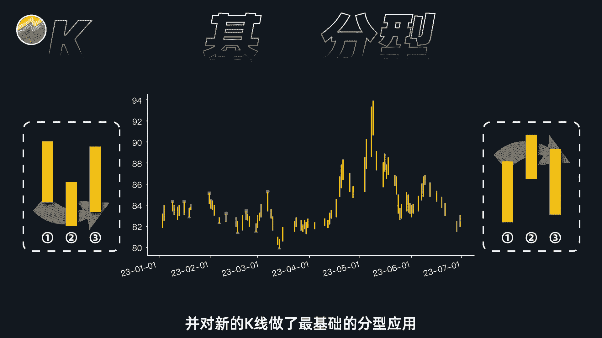

# 用Python量化缠论，一键自动生成交易信号【量化交易邢不行啊】 - P1 - 量化交易邢不行啊 - BV1mx4y1E7LM

在缠论中啊。

所谓的分型是由相邻的三根K线构成的，这三但K线呢并不是连续的上升或者下降趋势，而是呈现走势反转的形态，分型呢又被分为底分型和顶分型，它们两者的定义呢就如图所示，相应的图形呢也比较好认。

我就不做详细介绍了，然后呢在缠论当中啊，底分型的出现意味着股价跌至低位即将反弹，是抄底和建仓的信号，顶峰型的出现了，则相反，意味着股价即将见顶，是卖出的信号，分型的结构还比较基础。

不能完全作为买卖点的信号来做判断，但缠论中真正的买卖点，就是以分型为基础来构建的，这个我们会在下期视频给大家做详细的介绍。

回到我们的顶底分型啊，既然我们知道了如何定义顶分型和底分型，就可以用之前处理过的K线数据，并借助Python代码来帮我们找到所有股票在历史上，所有的顶底分型，注意啊，我这里说的是所有历史的全量。

具体的代码我已经帮大家准备好了，只需要点击运行就可以得到想要的结果，如果需要这个代码的话，大家可以在评论区留言，都是可以直接免费发给你的程序运行的，就如图所示，红色方块标记的就是顶分型的位。

绿色三角呢则是底分型，借助这个图啊，我们肉眼就能很直观的看到指定时间内，当前股票的所有分行位置了，非常的清晰明了，相信有了这个图啊，就能够帮助使用缠论的你节省大量的时间啊，去做更有意义的研究。

当然肯定还是会有人觉得，我说的缠论的量化是不对的，就像我开头说的一样，每个人眼中的缠论本就各不相同，因为作者他本身就没有讲的很详细很完备，1000个人看缠论可能会有1000个结果。

我呢也只是按照我的理解去尝试介绍，并且量化它，仅此而已啊，也很欢迎有不同意见的朋友在评论区留言，做相应的交流，好吃，那我们大概介绍了一下缠论中K线的处理方法，并对新的K线做了最基础的分型应用。

当然缠论的内容很多啊，不止于此，时间有限，我们今天就先讲到这里，大家觉得这期视频如果对你有帮助的话，欢迎多多点赞，点赞破5000的话呢，我们下期视频就来讲讲，缠论中对分型的进一步应用。

也就是缠论中划线分析的最基本结构，那如果本期视频看的人不是很多呢，那后续我们可能就不会再讲缠论了，那么本期视频就到此结束，我是专注量化投资的，行不行，关注我科学投资。

