# 用python在币安开一个仓位，简单易懂，无需基础。 - P1 - X蓝田Chef - BV1Fj8KeHEbw

Hello，各位小伙伴大家好，今天来教大家用Python在易安开三嗯。

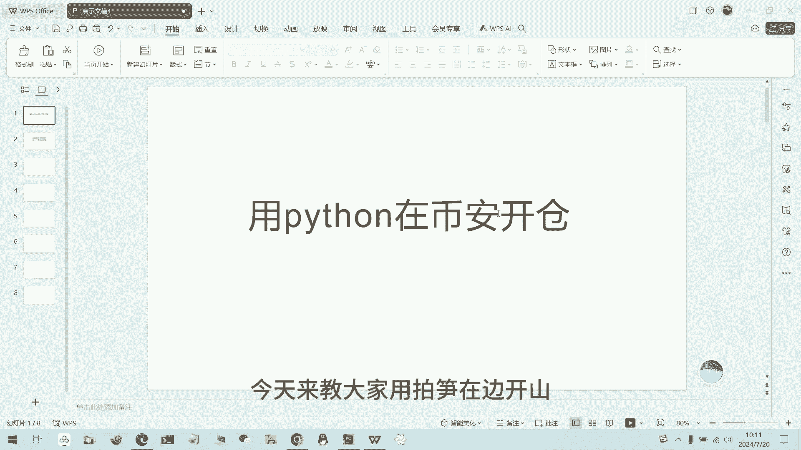

首先我们找到一样的API文档。

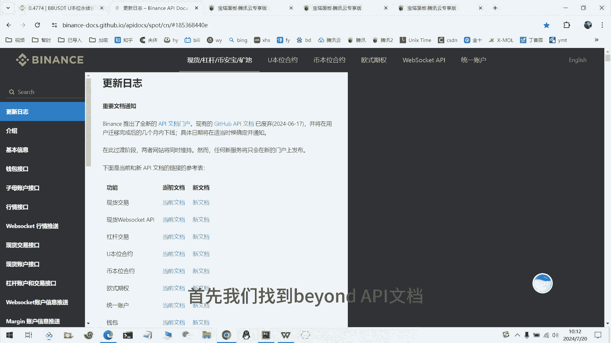

然后我们比如比如我们要开一个，在单向磁场的模式下。

开一个试驾的，开通开通的单子，然后我们找到B安的对官方的API看看一下，首先我们需要找到呃，用我们用request请求，首先需要US的URLL。

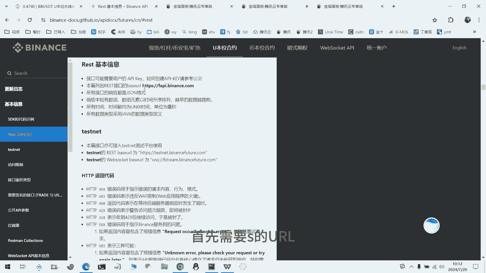

我们把它复制过去，写到写到我们新建一个项目文件，好创建好这个文件之后，我们把U2L给输入进去，好我们输额输入了U2L，然后我们需要哪些参数，我们来看一下。

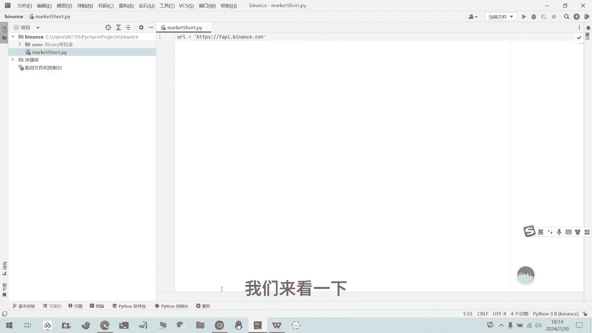

首先我们需要的是交易对，还有买卖方向，这然后持仓方向的话，我们是单向持仓，单向持仓的话就可以不用填，然后我们订单类型选的是四价，然后这些都都可以不用填，然后我们还需要的话是时间戳对的，时间戳传输。

除了这些，我们还需要一个签名签名的，因为我们的请求的类型是去的去的类型，他需要我们的签名，签名的，签名的获取的话是需要我们的query steady，然后进行一个获取好。

接下来我们进行参数的填写以及签名的获取好。

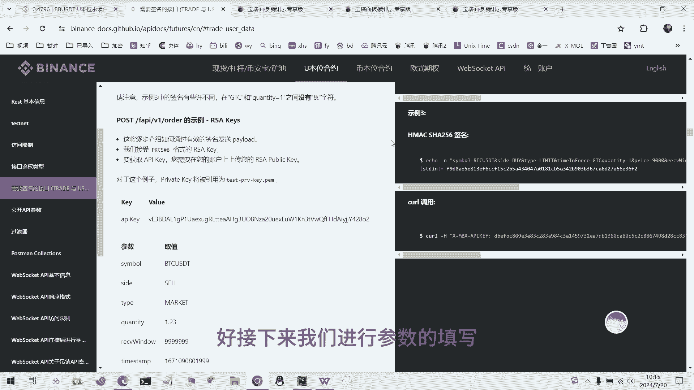

现在我们已经把参数都填写完了，时间戳的获取方式，是用用这个这个方式来获取我们的时间戳，然后现在我们来获取签名，签名的话，我们需要用到一些库和一些方法，首先我们把我们的APIKE跟密密钥填进去。

然后我们再获取接获取我们的签名好，这个就是这个函，这个就是用来获取我们签名的函数，嗯有了额使用这个，然后接下来我们就使用这个函数，来获取一下我们的签名。

好首先我们需要把我们的query study给给写上，然后然后我们再用这个函数，就可以获得到我们的最终的签名，得到我们最终签名之后，我们就可以进行一个请求，请求的话，我们需要用到in request。

然后进行一个post的请求，我们的请求，比如我们需要交易一个，先交一个币种，比如我们需要交易这个币种，它是价格，现在的价格是0。0。47，0。47，我们就把我们的线如，我们比如我们买15个。

就是差价值差不多457U的7U的样子好，我们现在就可以进行请求好，接下来我们就可以发起一个请求了，我们把需要的UIL给填好，然后还有请求头填好，然后就可以进行我们的请求，首先我们把它给复制一下。

然后到我们的云服务器上哦，我买的是东东京的云服务器，因为国内发嗯不支持网络访问，所以我们就需要买国外的云服务器。

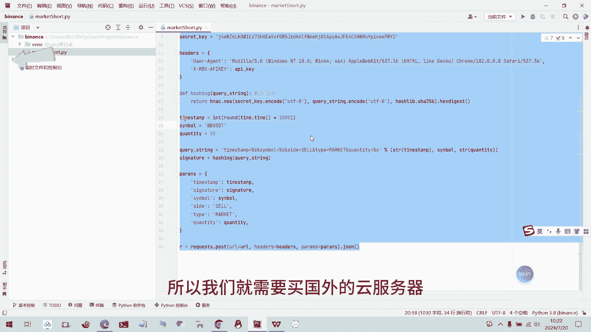

好，我们把我们把我们的代码，放到我们的云服务器上了。

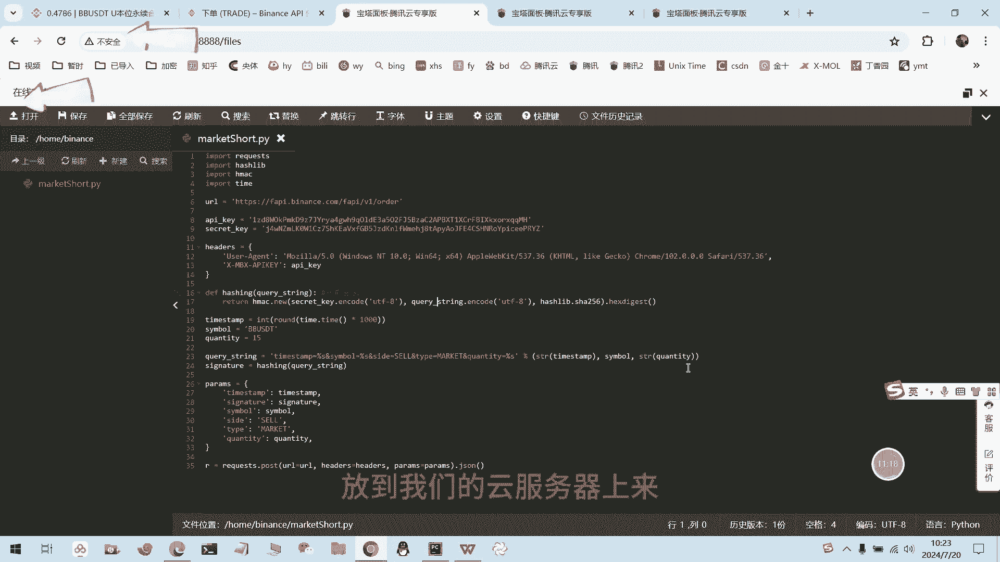

然后我们去下单。

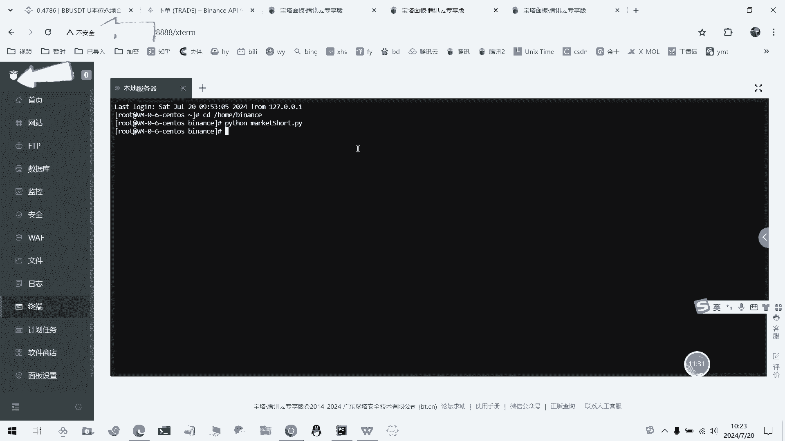

好接下来我们就下单成功了，这里这里没有，你看现在看我们的仓位就有买了15个，然后我们的这就是我们的仓位。

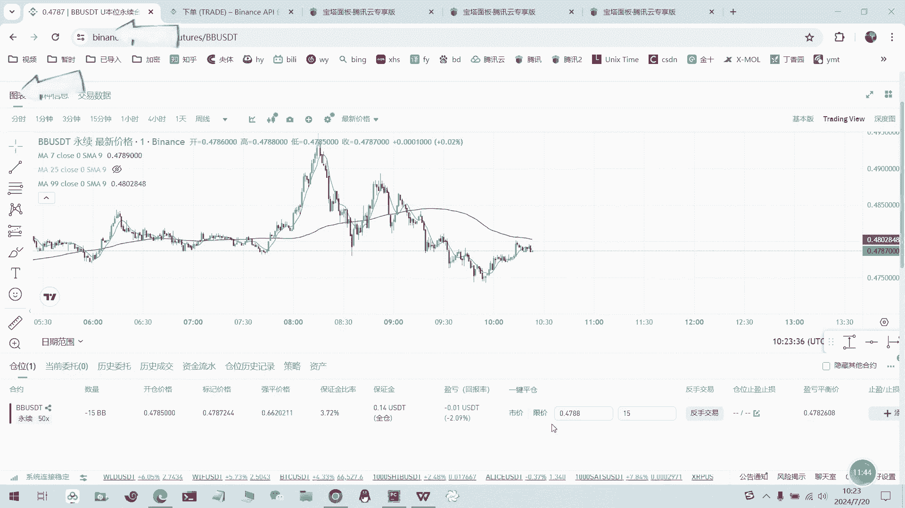

但是这里没有任何的，下单之后没有任何的提示的，我们可以比如我们可以，可以写个这个就是开仓，然后我们是开开空的，然后我们这样填写之后。

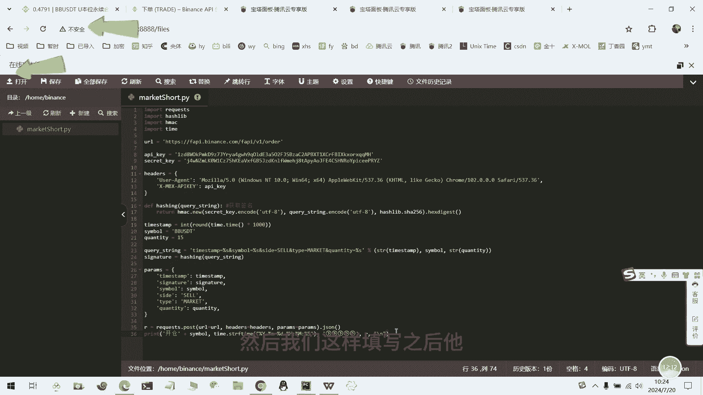

他下来就会有有个提示，那好我们就再下一下，好现在就有提示了，显示开仓哦，是10。24。

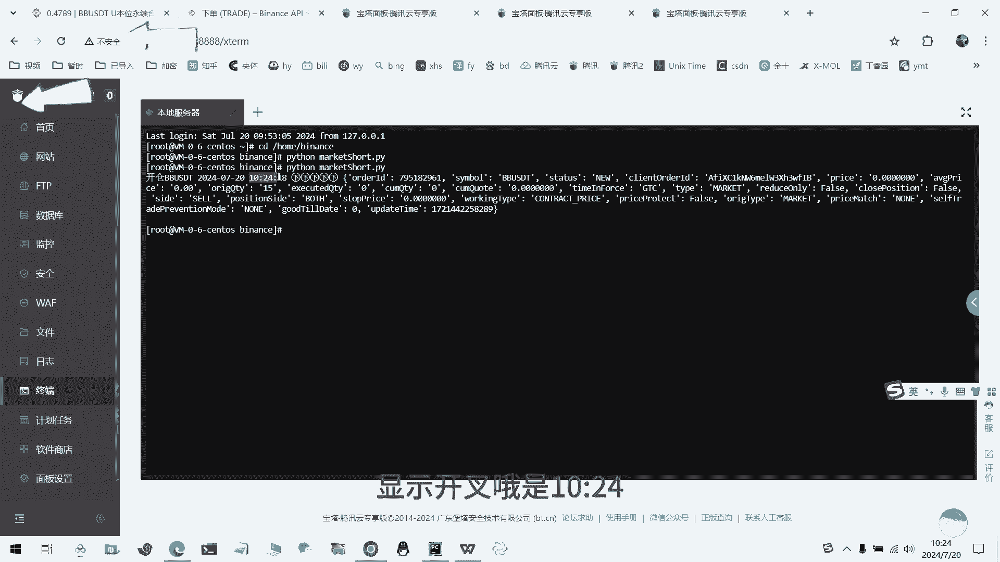

然后是开空，然后我们就再开，我们的现在有就30个，之前15，现在又又15，所以现在就30个，然后我们就可以把我们的可以就可以开仓了。

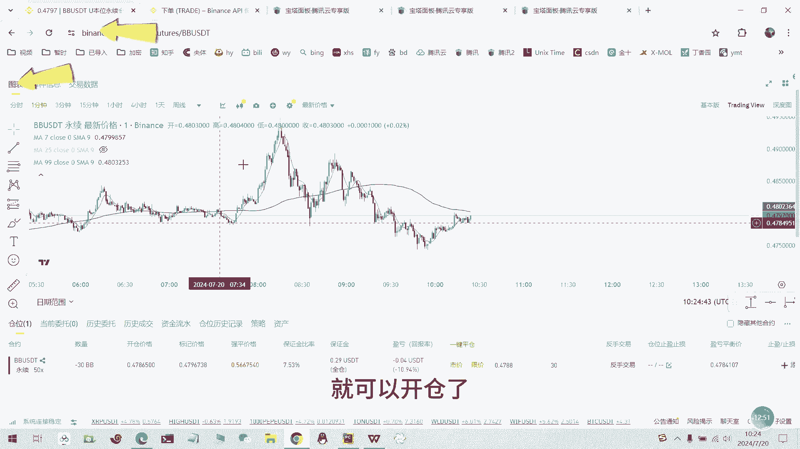

然后我们再最后再把我们的代码给稍微，写整洁一点，就，好了，现在就是我们把我们的请求的放到一个函数，然后我们需要开的币种跟数量，就进进行一个作为一个参数给填进去，这样我们就可以想开什么币种就填进去了。

额这就是我们的简化的代码。

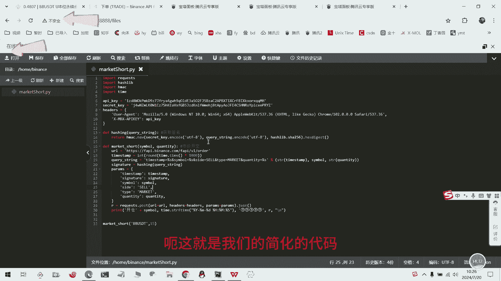

然后我们再如我们要换一个笔筒，比如我们开个再看一下什么笔筒，换一个比的，比如我们开一个这个，现在的价格是0。0。1左右，我们开五开六十六十个啊。

长位，比如，好，我们现在在对这个B轮进行，开60个数量的开空。

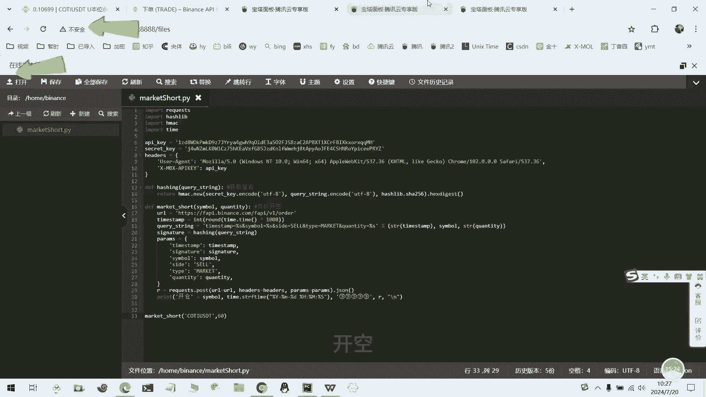

好现在我们就开通了，再返回看一下。

对，现在我们就有开了60个仓位的空单，好今天的视视频就到这结束了嗯，这代码的话我会上传到GITHUB。

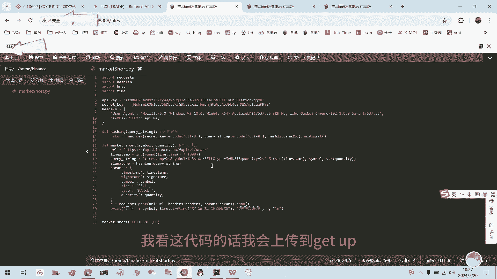