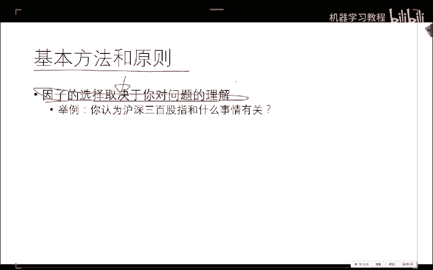
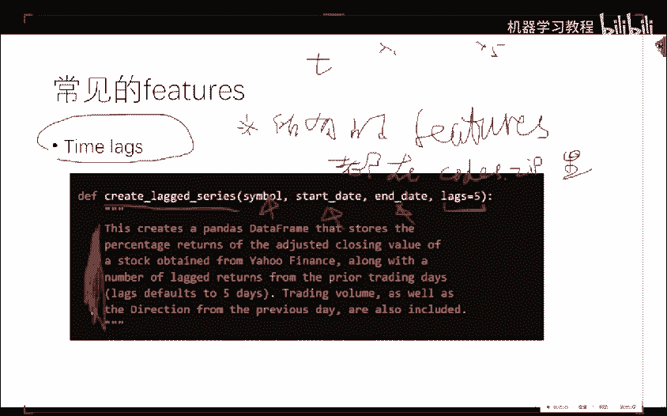
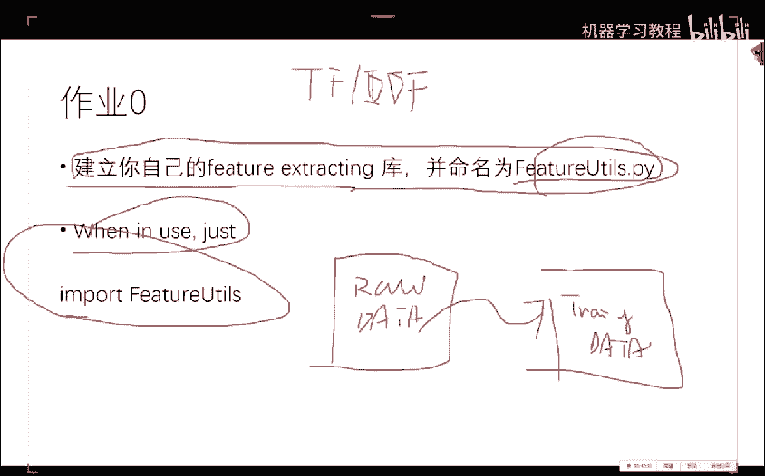
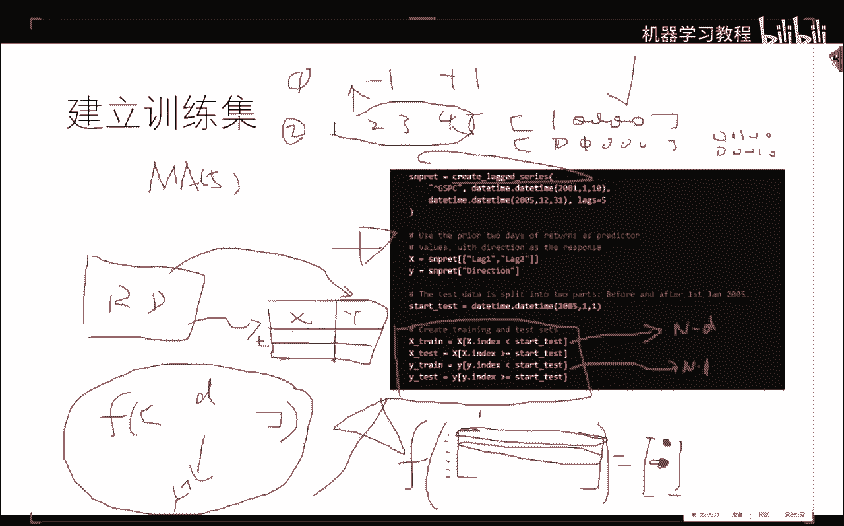
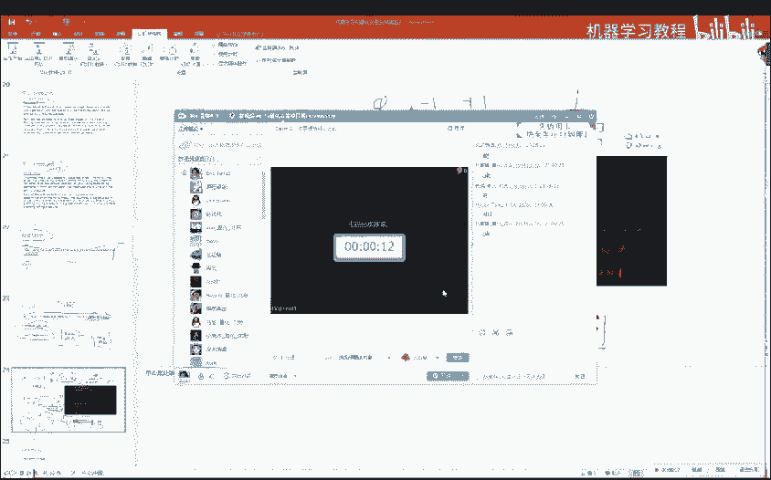
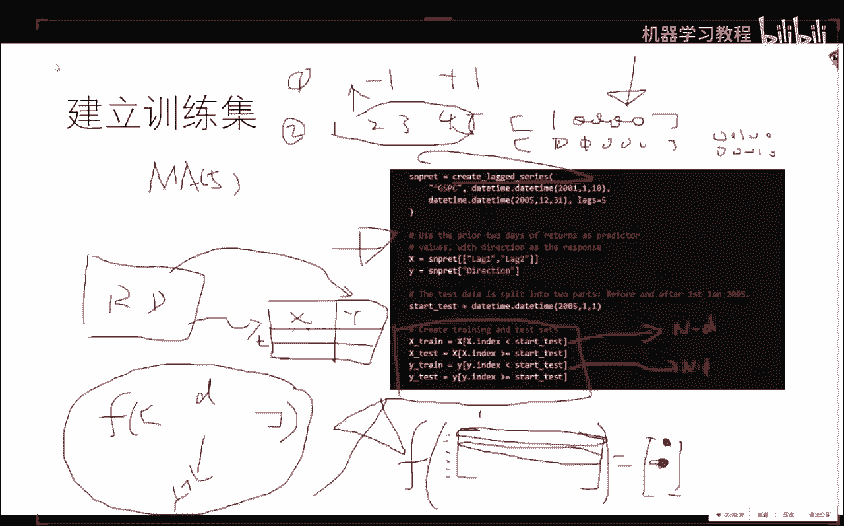
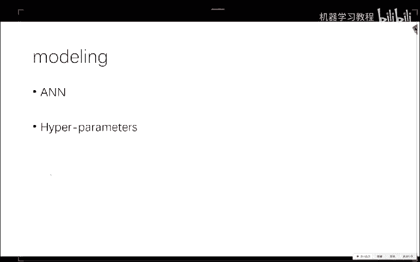
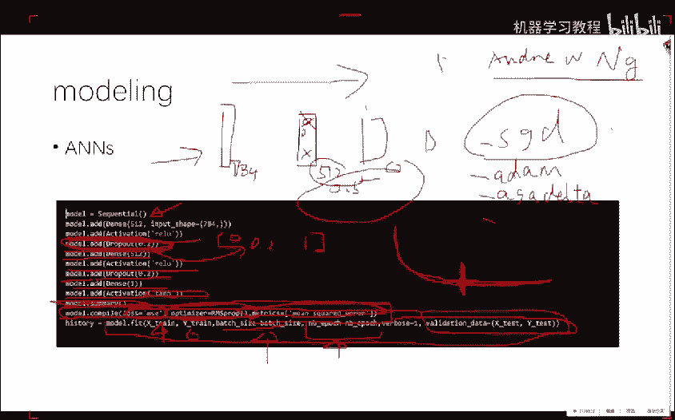
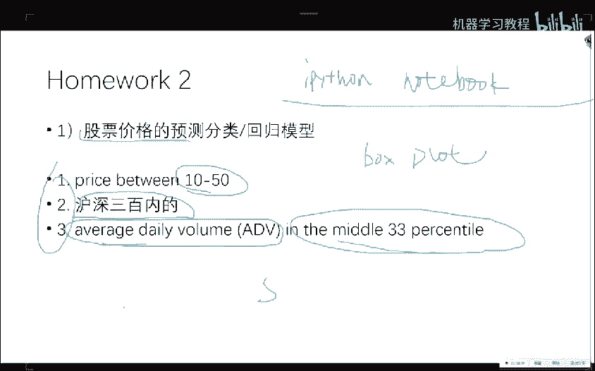

# 26集全！B站目前唯一能将【量化交易】讲清楚的教程！用AI从零开始打造你的交易机器人！大数据量化交易／机器学习／Python金融分析 - P5：05策略建模综述 - 机器学习教程 - BV1w4421S7Zx

啊，然后呃其实从呃这节课开始，我们的真正好玩的地方才开始，所以说倒也倒也没关系啊。嗯，OK那我们现在开始正式上课OK啊，第一次作业。第一次作业呃第一个交的同学是比较快的，是星期一晚上就交了。

然后后来的其他几个同学也都陆陆续续呃，目前我收到的有效递交者啊，对错宣布论啊，目前应该是这些个同学啊，如果有漏的，你可以跟我说一下。因为我还没有批改完，所以说还有是有些同学是想呃。

就是说想让我明天明天晚上的那节课讲，也行，我想着那就再多给一天吧。那么另外关于交作业的一个格式。有这么一个建议，就是说呃大家最好给我交这个呃一呃一个notebook就是说嗯。

包括了就是说这个notebook就包括了你的这些函数调用跟这个呃呃print出来的这个结果。因为这样的话，我就不需要。直接的再重新跑你这个程序了。因为我不清楚你用的呃语言跟包。

还有一些其他的这个环境是否跟我的环境一致。所以如果你能提交一个比较就是已经已经有结果的一个ipad notebookotebook的一个呃这么一个demo会嗯会让我对会让我能够更有效的给你的作业的结果提出建议。

因为毕竟我们这个不是一个编程的课。啊，我们最重要的就是说你你能得到的最有效的反馈，其实是你已经编好程序的结果。然后我告诉你呃怎么样做会改进。这样的话，收获会更大一点。

然后另外就是如果你写了一些比较复杂的函数啊，如果放到这个notebook里头，它不是呃不是一件很优雅的事情。所以你可以单独的把你的这些呃heler的这些函数呃，跟notebook一块提交。然后你。

inport就行啊，这个都没关系啊。嗯，关于关于作业，大家目前遇到的就是没做完的同学，目前遇到的最困呃最困难和最头疼的地方，啊，也可以呃跟我说一下OK嗯嗯这个应该嗯就先说到这儿啊。

有什么需要补充的地方吗。大家关于作业。觉得难度啊，或者说嗯。难度方面，如果就主要针对还没有交的同学。啊，不，咱们先先先都聊作业啊，先先先不闲聊啊。啊，对齐确实啊对齐的话。

我建议大家看这个呃我给大家的那个呃一个参考书，就是python跟金融数据分析那块有专门的地方讲，一个是对齐，一个是清洗。这个细枝末节啊，就是会就行了。啊，那那那那好吧，那我们。嗯。

这这个这个问题咱们就不在课上说了，咱们往下走啊。OK那么我们现在先看一下这个我们往回退一步哈，我们看一下我们现在到哪儿了。那么我们之前呃大概用了两次课的时间学习了怎么样的从这个。获得数据。

并且把这个数据存起来。但是现在的问题是什么呢？现在问题是我们现在存下来的数据，嗯，它其实是一个原始的一些嗯就是嗯就是所见即所得的一些数据，并没有经过一些这个变换。

也不能拿拿来当做这个训练集OK那么这个但是但是这个就相当于你要开一个饭馆，你得把菜先买回来。然后你再说是你炒川菜啊，炒卤菜啊，你做西餐啊，你才能做。那么我们现在是相当于有了菜了，有了菜了之后。

我们现在呃看看怎么样的拿这些原材料，我们能做点东西出来。那么。这节课跟下一节课呢呃是最有意思的两个事情。就是说主要是我们怎么样的把这个数据进行一定就是一定程度的一种转变，转变成我们的所谓的这个训练集。

或者说让模型能认识的数据，这是第一。第二呢是我们我们怎么样的基于这些数据。我们来建立一些预测的模型。这个是我们这周需要关注的事情。然后我们接下来要干的事情呢。

就是说所谓的建立一个基于事件的回测的这么一个一个流程。因为你的策略跟你的模型其实是两件事情。这个是我要强调的，就是说我要警告大家一件事情。你建立一个好的预测模型，就是说你这个模型。

能够精准的预测明天是涨还是跌，跟最后的你这个策略其实是两回事儿。后面那个事儿比这个模型还要复杂一些。因为有更多的一些其他的因素要参考。那么我们这一周呢主要关注的是第一件事儿。

就是说我们好歹先得预测的比较准，对吧？你预测准了，我们就能拿着你预测准的这件事儿，我们就能说事了，就能就能基于你比较预测准这个东东西。就能找到有可能挣钱的点了。但是你如果预测都不准的话。

你想做一个好的一个strrategy，那是更不可能的事情啊，就相当于你有一个好的模型，相当于给了吧，你好枪，但是你怎么样的打赢这场仗呢？那是另外一回事，那是策略的就是对。

那那是完全就是说呃是两个你呃最好把它看作是两个独立的事情。而且如果你在一个团队里头的话，也很有可能这个事情是呃两个人在做的事情。

OK那么我们今天就是看我们怎么样的拿这个你们你们上周爬下来的这个原始的数据来建立一个真正的啊基于统计学习的预测的这个模型。OK啊关于我们要讲的这个事情，大家有问题没有。等一下啊，我得回复一下这个同学。

好，那么呃我们接着再往下走。OK那么现在就是说我们怎么样的建立一个训练集问题。OK呃，训练集是这样。因为我这个。手写笔不知道被不知道被谁他妈给拿走了嗯。训练节我们现在其实是需要建立这么一个。

我们现在有的表格是这样子的。这个是时刻T，对吧？那么嗯比如说我们嗯这个T的话，你可以比如说它这个这这个就是时间哈，它会有1个ID123一直点点点。然后我们是已经爬到了一些属性了，就是说相当于啊。

open啊、close啊、high啊、low啊等等，就是一些数。这个是我们上周已经得到的东西。那么我们怎么样建立一个呃呃基地学习能够认识的这这个这个这个训练集呢？

就是说我们需要把你现在已有的这个这个表转化成为什么，转化成为。转化成为同样是。这个是时间，这个是T。对于T的每一个时刻，比如说这个是T0时刻。你要把它就是说你你你所拥有的T0时刻之前。

这比如说这块是T0。就是你把所有的T0时刻之前的信息转化为。一组新的featuresX一一直到XN。然后它对应的呢就是你的YY是什么呢？Y是你要预测的T0时刻下一刻的一些你想预测的东西。

就是说涨啊还是跌。这是一组，也有可能是比如说直接就是priice of y，或者是啊pri ofT0加1，或者是return ofT0加一，对吧？那么就是说我们今天的第一件事情。

就是说我们怎么样的把这个从啊训练呃，就就是从原始的金融数据转化成为监督学习的这个frreeework。就是说因为我我们上节课已经学到了我们有啊啊就说监监监督学习的这这个流程。

那么我们这一节课呢主要就来看我们怎么样得到这些X。然后我们得到了这些X之后，我们就能建立各种各样的统计学习的模型来对Y进行预测了嗯。当然我然后我们下一节课呢就会基于啊你所选出来的这些X。

我们怎么样的选出来一些更好的就就是说更好的一组子集，或者说更好的一些基于这些X的再变换，让你的这些特征的质量更高。因为这个是去呃其实是在你建模过程中，让你模型准确率比较高的一个决定性因素。

就是说你的输入的呃呃数据的质量，对你的这个模型预测的结果起到至关作用的呃作用，而不是模型本身。OK就因为当你的模型足够大的时候，其实线性模型已经做的能蛮不错的了。但是当如果你的X的质量很不好的话呢。

呃你用什么模型都不好使啊，这个我也是我反复强调的所谓啊垃圾进垃圾出的这么一个道理啊，但是这节课呢我先告诉大家，你能够选X的方方面面有什么，你先选什么，然后下节课呢。

我们来看看我们怎么样的从这些比如说你选了300个X，你怎么从300个选到50个啊，有各种各样的奇因技巧，各种奇奇怪怪的方法就都出来了啊，什么遗传算法啊，什么，就是你能想到的嗯很黑箱的一些东西。

也有一些很白箱的一些东西。比如说啊基于贪心的特种选择的办法啊，这个也是比较常见的，但是现在基于遗传算法的也有。那么我下节课呢就会把常见的比较有效的这些方法都教给大家。那么。

也就是说这节课跟下节课两个1一块干了这么一件事情，从原始的金融数据变成训练集，基于训练集，建立一个比较精准的模型。然后从下节课开始，我们就转向了所谓的事件交呃呃呃事件驱动的交易系统。

然后我们会基于这些事件基于呃事件驱动的交易系统。我们来基于再加上你所有的模型，我们来做这个呃基于事件驱动的回测和策略的调优啊，就是大致的这个时间分配，是这样。然后如果有时间的话。

我还会再多教大家几个比较重要的机器学习的一些方法啊。和一些比较奇怪的数据，比如说文本数据怎么办啊？因为其实归根结底啊，比如说你获取金融数据这件事情，每个人都会也没有什么呃，你做的比他要好很多。

或者他做的要比你好很烂呃，坏坏很多的事情。而。这件事情就是说你怎么样的选特征和基于特征，怎么样的建立模型，这个是在量化这个领域里头，呃，它的这个分歧最大的一个地方。

就是分歧最大的意思就是说嗯好的能做的很好啊差的能做的很差。就是大家的这个水平基本上都在呃这个地方这个环节啊呃呃呃呃起到了一个作用。所以说也是做量化这个研究啊，最有趣的地方，其实是今天跟明天两节课。

那么两节课很可能cover不掉所有事情。所以我会在接下来的课程，我每节课在几点时间出来再多给大家介绍一些呃新的思路，帮助大家来建立自己的这个量化建模的呃方法论吧，或者说是呃让大家比较开阔眼界，知道啊。

还能这么干。那么这个是我的一个计划。OK大家有问题。没有。暂时没有好，很好。那我们接着往下走啊。好，那么现在的关键问题就是说我们怎么样选择这个features。啊，嗯。

features是比较积极学习的话哈，predicctor呢是比较统计学习的话，就是比较偏统计的人，他们把它叫这个叫啊predctor，其实就是这个X。啊，就是你这个X的X一一直到呃XD。

你这些XD的这些指标啊，你们做呃做这个。做计能经济的喜欢把它叫做因子啊，就factor啊，它是一个东西啊，这个其实它是一个关键问题，是你作为一个量化建模的人，你对这个模型跟问题的理解。

基于你对这个问题的理解，决定了你要用什么样的X来预测。不同的人呢会有不同的选择方式啊，举个例子。比如说。啊啊，对呃，先先说一下，就是说它的这个过程是一样的，就是说嗯呃呃选择X的过程是一样的。

但是基于不同的这个呃哲学方法和基于不同的信念，会有不同的选择方式。而不同的选择方式会造成不同结果。所以这个是做实验，就是但是呃呃哪个更有效呢，是必须得通过实验来决定的。所以所有的你很多的时间呢。

其实都会在这个上面做各种各样的实验。就是哎我今天突然觉得加个这个大概可以，那你就赶紧加进去，然后试一下。然后看一看有没有效果。啊，并没有说是有一个呃完全正确，或者说肯定能证明你这样选是正确的呃理论。

它只能说是OK你选的这一组在你所选的这个金融产品上确实是works的。那么OK这个就是你需要非常庆祝的地方。然后。大部分时间呢大部分时间呢你都需要。做很多的这个研究来判断你的这个选择是否是正正确的。

那么有一个问题就是如果你学的呃选的这个东西不是很好怎么办啊？下次课呢我就会教你你如何从选出来的一坨，也许不是很好的特征中进行自动筛选和变化。就是说啊我大概我也不知道吧，反正就瞎逼选吧，选了那么几百个啊。

但是我也好像。也不是也不知道怎么在提升这个东西了。那么下次课呢，我就告诉你怎么样的从现有的就是你同事给你的这么一组feature中，你怎么样的把这些feature变得再好一点啊。

那么这个是下次课的一个问题啊。好，那么就是说这个基本的方法和原则就是因子的选择取决于你对问题的理解？举个例子，大家认为啊沪深三00股指这件事儿跟什么事情是有关的。

如果你觉得沪深三00股指跟比如说呃今天的呃人民币汇率有关，那你就就是你你就你你就想，就是说我们在选股之前呢这个问题其实是呃呃呃就是说需要你自己把自己关到一个小黑屋子里头。

根据你多年的呃经济的理解的经验和你看的各种各样的论文和你。在任何场合听到的一些话和你看的一些书里启启发到的一些灵感。比如说我觉得沪深三00股指期货。或者沪沪先不说期话，沪深300股指这件事儿。

我觉得它应该跟人民币汇率有关吧。我也觉得跟这个黄金的价格应该也有关系，对不对？那么我觉得似乎跟美国的这个SP500的这个这个指数是不是也有关系呢？而且我觉得它跟。就是中国的沪深300的这个性能呃。

这这这这这个走势也许跟这个嗯嗯嗯英镑的这个关系是不是也有关系啊啊，你说的这些啊都是有可能的。所以说我们要干的是什么呢？你把你觉得有可能的东西全他们都都选进来啊，就都选进来就行。

选进来之后呢啊再通过一些特征选择方法再进行细化。所以说因子的选择完全取决于你对问题的理解。如果有的时候你灵光一现，觉得这个这个产品，它肯定跟那个东西应该是有关系的，赶紧做实验啊。

就是说比如说现在比较火的什么优况啊什么，大家花了大部分时间都是在啊有有这么一个idea了，赶紧去验证一下。因为有很多大量的啊千奇百怪的一些书啊，它里头大概提到了不经意提到的一些话。

让你突然觉得这两个事儿也许是有关的啊。那你就去。😊，专门的去做一下。另外就是说比如说呃呃。对于这只股票，也许这个呃这个因子它的重要性比较大。对于另外一只呢，也许它是不是很敏感。

所以说对于不同的这个呃金融产品的这个价格，它的这个因子的重要程度也是不一样的。所以你要你要你要做的这个实验的这个量就比较大了啊。OK啊，那么。就是这样，你可以选的这个这个因子可以很烂。

就是嗯它的质量可以不是很好。但是当你的因子的数目很多的时候啊，每一个因子都贡献了那么一点点啊，都往正确的那个方向走了那么一点点啊，到最后你的模型就会很好啊。那么今天啊在作业最后一个作业里头呢。

啊我给大家提供了一个数据集啊，大家在那个数据集上可以先做一下。这个我最后说，大家先别急着往后看哈，跟着我的思路来。啊。OK如果说是什么模型在中国都没用，没有效的同学呢，我也建议你啊用。

建模的方式来证明给我看啊，就是说啊你看啊我我这么做了啊，我的模型预测率啊，对于涨跌问题来说，我一直正确的是50%啊，就是你要证明给我看啊，你的你你建立的模型是一个随机有走模型啊。

就需要用证明来呃需要用数学来证明出来，也也是个蛮有意思的事情。如果你坚信这一点的话啊，毕竟是一个呃量化的课程，大家呃要摒弃这个呃老中医的思想，不管是说它有用，还是说它没用，都需要证明出来，好吧。嗯。

OK咱们再往下走。

那么常见的feature大大家现在说一说哈，常见的feature。那么最简单的就是所谓的这个time legs。就是说呃今天我在这个片子里提到的每一个呃求feature的这个函数都在附件里头有。哎呀。

我这这什么手写笔被狗给拿走，我我我用鼠标吧。😊，我再写一下啊。今天的所有的所有的这个。所有的。这个方法features。都在这个扣的里头。好啊，狗牌一样，大家就猜着看吧啊，因为人类大脑的这个。

人类大脑的这个。识别能力还是可以的。那么就是说t legs很简单，就是说我们在时间T这个时刻啊，我往回看一点，就是比如说我们在时间T我们的X一一直到X5是分别它往前5个窗口的这个呃价格。

就比如说这个是非常make sense的。就是说比如说我们在这时刻想知道下一时刻的价格，我们先往回看看，往回看5个点或者20个点或者100个点或者1000个点啊，这几个是比较选没有1000个到200个。

就这几个窗格的大小是一个比较常用的一个选择方式。所以说它的这个输入是你这个simbol啊，你这个股票的symbol和你的起始时间和你的终止时间和你的这个时间窗格啊，那么。

这个呢是这个函数所就是呃所所需要的输入输出。我建议大家呃一定不要拿来就用。我强烈建议大家嗯看完这这个这个要求之后，自己先implement你这个函数，然后再跟我给你的这个答案，你做一个比较啊。

就这样的话，因为嗯。也有同学表示过，呃，听这门课，如果你想得到最大的收获，一定是呃在在在在学习编程中来学习这些知识。如果只是不下水，就想学游泳，观看的话是有问题的。现在卡不卡？嗯，不卡不看好。

有一个人同说不卡，咱就不看哈。好走。😊。

啊，第二种feature呢是这样，就是说我们对这个对这个东西做一个。呃，做这么一种变换。就是说我们在T时0刻，比如说我们对这个呃EOD数据吧，就是就是我们在T时0刻。

我们把这个呃啊开开盘价啊减去呃T减1时0刻的这个开盘价再除以啊T减1时刻的开盘价，就是相当于做一个小的这个呃这个mobilmalization。然后把这些东西啊，也当做一些feature。

或者说只用这些的feature，反而不用呃比较简单的这个timeax。好，那么呃呃一个嗯。我的建议是什么呢？我的建议是你把所有的可能的feature全算出来，先全撂全撂进去，就是说不要关注啊一种这个。

这个feature就是说嗯。再往下走哈，这个是很。很浅显的一个一一个事情哈。啊，那么呃这这种的feature的计算方法呃，也很常见啊，就是说它这个拉姆达是你的这个拉姆达是你的超参数啊。就是说。

相当于这个window size。这个是你需要做这个交叉验证来来寻找的一个就最优的这个windows size是需要你做呃交呃做这个cose validation来寻找的。

他看的就是说我呃呃呃就是往前看拉姆达的窗格，我选出来这个呃啊呃pri的这个最高价啊，嗯，这个是具有一定鲁棒性的一种处理方式，也是在呃呃时间呃金融时间序列里头一个比较常见的一个trick啊。

就是说我们分别算出来这四个值啊，然后呢在真这四个值不是用来呃直接用的，直接能用的是这样用。就是说我们在T10刻的在T10刻的这个这个pri减去T减1时刻的这个pri再分别除以它这两个啊基于拉姆达这个PH值跟PL值啊。

就是值跟。low值，然后呢，这个就相当于一个新的featureX一这个相当于第二个新的featureX2有很多人基于这两个feature呃，就能建立一个不错的预测模型。啊，然后呃有呃大家现在有问题没有？

啊。没有对，他就是很很straightfor的一种做法。嗯，就是简单的。如果你呃判到呃做到。啊，这faature的背后没有什么道理，这道理就是我认为这个因素会对。会对未来的这个价格会产生一定影响。

但是这个是有一点点道理的。这个背后金融学是有一点点小定理的。不过呃这门课咱们在选fishature的这块，大家不用关心，你往后往后看，全是老中医的东西啊。好。咱们看这个，这个是另另外一些常见。

这个我也把它叫做一些feature。就是说呃再回到刚才的这个。沪深300股指期货这个呃不是沪深300股指的这个价格预测上面啊，这个指数预测上面，我认为这些说到的都应该跟它相关。

那么这些东西你也应该通过你建立好的数据库，在预测，比如说股指的时候，也应该把它呃碰到你的这个呃呃呃呃训练级的X中去。比如说这个嗯。呃，SP500或者说是这个呃这个这个这个汇率啊。

或者说是嗯就是各个国家主要这个交易所的呃这个股指的这个这些因素呃，如果你认为这些。features对你所关注的金融产品的价格也会有影响的话，它都算是你的feature，它都可以当做你的X。

就是说想到什么，先往里料啊。好，再接着看，那么这个也是一个features。那么有的人就基于这一个features就可以做交易了。但是如果你要嗯但是。我个人是。我个人是强烈反对。

只用一个这个呃呃呃features来指导你的交易。一一因为就是说你。呃还是心里头还是觉得不安全吧。嗯，那么这个CCI呢是如果大家做这个。做这个呃所谓的这个技术分析。

这个是一个很传统的一个技术分析的一个方法。就是说它计算出来这么一个指标啊啊他呃就是看它跟这个就是说它这个计算公式就在这儿啊。

这个typical price就是说你在这个时刻啊参考了它的这个呃open跟呃close跟 high low的一个一个一个平均值。

然后减去你的这这个Tpical price的一个moving average，然后再除以一个它的这个standard deviation，然后0。015是一个啊经验的一个系数。

这个也在我们的这个附件中也有一个实现啊，那么它是干嘛呢？它是跟这个正100跟-100比，它相当于一个异类检测，就是它当于它大于正100的时候啊，就就相当于是它它已经被啊over over by了。

那么如果它小于-100的话呢，就说明它是一个比较被低低估的一个。啊，一个产品。那么有有的人就只看这就是有的人就只看一个数啊，这个数if if elseif它大于100，我们怎么办？

哎 if它小于-100，我们怎么办？然后如果他在正100或者-100之间，我们就持有，或者说我们就什么事也不干啊。那么但是作为统计学习的这种方法来说，你可以说啊也许你这个是有用的吧。

那么我们也把它当做feature的一份子也给它算进来。OK啊，这个也是嗯。用现成的公式一算就行啊。那么这个EVM也是啊意 of啊movement，这个也是一个比较常见的一个指标啊。

MA of typical price是这样。MA是moving average typicalical price是在这个时刻的你的呃h low跟这个open close的一个均呃一个均值。

这个我们也在CCI点PY中实现过了。你直接看我我给你的这个函数的实现就行。OK然后这个图呢就是我给你的那个例子所跑出来的一个结果，底下是C材，上面是股票的价格。啊。

就是今天我出的所有图都是背后都是有代码了，我就不贴了啊，贴代码这种事情还是。嗯，没有意思，大家下课自己看就行了，不用占用太多的课堂时间。好，那么这个CCA也是一个就是很常见的一个技术指标吧。嗯，好。

那么这个EVM也一样，就是嗯。各种人总结了一些很老中医的一些公式啊，因为刚才有。有同学提到有同学提到这个这个飞车背后的道理啊，这个事情很抱歉啊，飞车背后其实很多情况下并没有特别强的一个道理啊。

只觉得如果你觉得。😊，因为你可以计算一下它的R峰值。如果你觉得它的R峰值大于你所心目中，就是一个feature是否对于就是就是一个input的这个变量，是否对output有统一意义上显著性。

那么你可以跑一个这个。跑一个这个这个这个这个呃统计测试来看看。如果看完之后，你觉得确实对解释这个啊嗯啊response是有帮助的那你就把它加进去。如果没有你就不加啊，就这么一件事情。

你说呃理论上这个EVM啊，能不能证明出来他肯定是呃怎么样的，我个人呃是比较悲观的态度。因为有各种各样更老中医的方法在后面啊。但是但是我们我们现在。我们现在其实呃不担心这个feature是老中音选出来的。

我们现在不管这个feature是呃呃，你基于什么样的原理选出来的，我们背后都有啊非常科学的方法来对这些feature进行重新的变换跟重新的表达。

让你的X是一个呃比较合理的一个X能够在呃首先能够正就是说首先你的模型的泛化能力会好。就是不管你的feature怎么选呢，我我经过一定的这个qui之后，我们在没见过的数据上表现不错。同时回测的表现也不错。

这就行了。ok。啊，应该是呃EMMV抱歉啊。对，那么这个EMA也它主要是跟零比啊，就是嗯这这有很多搞这个纯技术分析的人，他就看这个东西啊。那么这个moving average这个大家也非常熟悉了啊。

这个就是所谓的移动平均啊，它有一个参数是它这个窗格的这个大大小拉lamda啊，你可以是目MA50，也可以是MA200。那么这个图呢也是在MA点PY中呃呃跟大家有所这个实现跟介绍啊。这个图我觉得是。

是相当于一个基本功吧。啊，就是说大家可以。应该在不看到这个源代码前提下，自己应该能实现出来任何一个时间序列的MH值。它相当于一种去噪的一种平滑的方式。但是呃除了简单，但是就是比如说它跟卡曼滤波器比。

它的去噪能力肯定是不好的。但是呢经过大家多年的临床经验证明MA值是一个蛮不错的，尤其是这个所谓的rollingMA值，它是一个相当不错的一个一个因子，它有助于判断下一个时刻的呃这个价格。

因为它也是蛮有道理。就是先说相当于它把呃前面的一些时间的信息。考虑进来了，当你要判断未来的走向的时候，他把一定量的历史信息加入到你的模型中去。那么这个所谓的RNN呢。

他其实干的事情就是说我我不走这个moving average了。我把每一个时刻的这个信息呢都通过机器学习的方法，有选择的记住或者忘记啊，这个就就就相当于起到了这个。

moving average的这么一个作用。那O。然后这个ROC一样，就是LOC是嗯就是因为呃这所谓的技术分析的这些指标是么，其实是浩如烟海。我建议大家的是呢。

当你看到一些呃比较经典的一个呃这个技术指标的时候，就应该回来把它进行实呃一个算法的实现，加到你的这个。啊，这个呃你你的这个量化平台中去，然后随时来进行一个验证跟计算OK。

那么这个也是一个很经典的一个呃技术指标。这个大家知道怎么算就行。因为也跟大家ROC点PY就告诉了大家怎么算这个东西OK。这个就是这个BB啊这个。going band这个是在第二节课的时候也给大家讲过的。

呃呃跟大家着重讲过的一种老中医的技术方呃技术分析的一个方法。那么我们同样是完全可以实现一个几行的python的程序来计算在每一个时间点，它的这两两个标准差的这个就是两个标准差的所造成的。

你这个ban是什么？那么它也可以作为你的呃，它也可以作为你的这个。嗯，这个X的一个选择。还有这个forrs index，这些都很无聊，咱们就不讲了，你们回去自己看，这个是FI。点PY。

就不不占用大家时间了啊，还有还有更多啊。我我建议大家就是这个网站，我上上节课已经已经强调过啊，不是计算AOC那个ROC啊两码事啊啊那么这个网站呢我是呃蛮推荐的，就是说我建议大家呢。

我今天已经给大家实现了这么常见的。这些技术指标了，而网站上呢还有大量的没有见过的这个。就是呃我没有实现过的呃这些技术指标。我也建议大家自己在课后呢把这个网页上的。

你觉得有道理的呃这个所谓的indicator全部呃实现一遍。啊，我觉得有道理的，我已经帮你实现过了啊，也有一些也许我觉得没道理，你觉得有道理，这个无所谓啊嗯。那么这个作业零就是这样。

作业零就是建立你自己的呃feature extraction库，并且可以命名为一个相当于一个呃data utility的这么一个你自己的一个小函数库。那么你你以后用的时候呢。

你就直接inport feature utilities就可以计算各种各样的这个特征值，然后你不断的把它拼起来就行。比如说我在这个时刻。

我要以mov average啊ing band跟这个各种各样的这个啊啊啊技术指标都作为X，你就很能很轻易的啊一个时间点变换成为一个100为或者200位或者300为的一个向量。

一般来说50跟300是一个比较常见的一个选择。关于作业灵和我之前讲过的所有事情，大家有问题没有？啊，pandas比n派的好处是pandas要更快一些。你可以做呃做一些实验啊嗯。

而且pandas的这个它主要主主打的就是嗯它它的这个这个这个data frame这个数据结构好像是numb派所不具备的嗯。大家有问题没有？现在可以提问啊。好，那这个问题很棒。

就是说验证一个feature，它到底是该选还是不该选。这个是我们下节课的一个核心问题啊，这个问题是一个极其重要的问题嗯，先剧透一下一件事情，最简单的一个回答。

就是你计算你所选出来的这个features跟你的训练集中Y值比如果是回个问题，你计算R方值啊，这个你们可以查一下，在SK learn里头有这么一个函数。在SK learn点 matrix里头。

你inport R to square啊 R to score然后它就能计算你的这个 inputput的这些X对于Y值的这么一个你可以理解为一个解释度的这么一个从零到一的一个指标的数啊，一是特别好。

零是特别烂啊。那么这个数越大，就说明你的这些X选的越好。还有问题吗？那么。所以说今天大家需要掌握的。最后一个嗯脏活累活就是你怎么样的。把你的原始的金融数据进行一种特征变化，获得一个新的训练集。

这个是你的原始的rodata。然后你要变成你的trainingtraining类呀。这个是最后一个脏活累活啊。啊，一般比较好的量化模型的非数数目啊，这个呃这个问题问的很大。呃。

如果你要最最正确的最最正确的回答是取决于问题。但是如果我告诉你这个答案的话，你肯定心里也不爽啊，一般来说啊我见过的哈啊呃二十是一个坎，五十是一个坎，300是一个坎啊，一般来说这三个量级是比较比较常见的。

2050或者300啊。好，新闻事件如何转化为量化指标啊，这个呃非常好的问题嗯。OK啊，新闻事件如何转化成量化指标呢？这个很简单啊，比如说你新闻事件，你可以把这一段的文本变成1个TFIDF进行编码。

那么它就会变成一个向量吧。那么这个向量就是你的X。如果你要用这个所谓的呃呃word to vector或者就是说一些嵌入的方法。同样你给我一个文本，我给你个向量。

这个有各种各样的自然语言处理中的一些方法来做这个事情。再说一遍哪个事情再说一遍。好，新闻是吧？新闻一个，比如说TF。If。它的输入是什么呢？它的输入是一个它的输入是嗯一段文本，输出是一个向量。

word to vector是输入一个词，输出一个稀疏的向量，呃，输入一个稠密的向量，并且可以做加减。就是说它的这个编码质量会稍微好一点。指标数能训练啊，不能啊这个。指标数能通过遗传方法来学习出来。

但是不同的问题，它的指标数最优的这个子集应该是不一样的。就是说呃另外一个问题就是说这个指标数其实呃训练出就是我们知道一个指标数，这个事情并不值钱，值钱的是这些指标是否达到了我们的要求。

就是说我不关心嗯到底有几个指标嗯。这个没关系啊。但是多多益善就是说如果你我我再强调一点啊，如果你的这个指标呃，你其实是越多越好，你你给我干到1000个，然后你再用一些非常啊啊非常有效的特征选择的方法。

你选到一个子集就行。就是指标在初选的过程中啊，一定要越多越好，不要管它重合啊什么的，你只要别计算错了。一个最大的错误是什么的。最大的错误是你这个时刻你相当于这个时刻的X。

你不小心的把下一个时刻的数据给算进去了啊，就是这种事情会让你的预测模型啊令人发指的好，让你在回测过程中令人发指的挣钱啊，但是啊很抱歉啊，就是说一这个是一个非常常见的错误，就是说我们在计算每个指标的时候。

我们不小心的把下一个时刻的这个pri的价格给算进去了啊，这个是一定要不得的啊啊啊。但是在初选的过程中，你有什么先撂进去，撂进之后呢，再用特征选的方法给选出一个子集出来就行，这个没关系。

而呃那么大家再回顾一下指标说明了什么，指标说明了每你选的每一个指标都反映了你认为这个指标有可能帮助决定下一个时刻，你所关注的金融产品的价格。

而你的这个选择方案是取决于你这个作为量化的这个呃量化建模的这个人，对这个世界的理解。这这完全是一个价格观跟方法论的。一个事情啊。好，那么我们看下一话题。TFIDF它是一个啊。就样嗯。

Tm frequency inverse term frequency啊。

那么呃。嗯。那么就是说当我们有了这个怎么样计算这个指标的函数之后，我们就能建立训练集了。因为计计算指标跟这个。呃呃呃跟这个建立训练集中间还有一个小gap，就是说我们比如说我们会算MA了啊。

比如说会算MA5了啊，那么我们怎么样的从这个原始的这个rodata中转化成一个啊这个X跟Y值呢？啊，那这个也是非常简单的一个事情。对于每一个时刻T啊，我们分别的把这些指标啊计算出来，然后连起来。

连成一个很大的一个向量。然后这个Y值呢就是我T时刻想预测的下一个时刻或者下几个时刻，这个是由你定的。比如说我们假设我们现在只想预测下一个时刻的Y值的涨跌情况，那么这个Y值呢。

你还是要根据原始数据来计算出来这个Y值啊，如果是分类问题，你可以001啊，如果是这个回归问题，那么就是你还是需要从原始的数据中来进行一个一个计算啊，其实很简单啊。

这个是一个啊基于这个lect呃一个数据怎么样建立这个训练级跟测试集啊，这个就是最终结果，这个也在那个。Y的长度Y没有什么长度。如果你是一个回归问题的话，Y是一维的，就是Y是一个实数。

如果是一个分类问题的话，呃，一般来说有两种编码方式。如果比如说你是。嗯你不是在用神经网络在做。比如说你是要用这个loggistic回归或者SVM这些来做的话，如果分两类问题，Y值可以是正一或者负1。

也有这是一种编码的方式，所以它就用一个1个数就能表示第二种编码方式呢，如果你要做分类问题。比如说大涨啊，小涨啊不涨不跌啊，小跌大跌，那么分这这么五类的话，你你可以是12345分那么这个是第一种方式。

第二种方式呢就是说所谓的one号扣的。那么10000，这是一类，这是大涨啊，10啊01000，这个是比如说小涨啊，00100，这个是不涨不跌啊，00010这个是小跌啊，以此类推。

就是说嗯呃Y呢YY其实没有。什么长度？Y只是你所需要预测的下一个的一个一个东西。OKlike的长度一般来说就是50竖20啊，那么具体长度是多少呢？需要实验验证哪个最好啊嗯。

对对你一个是可以针对不同的L对Y验证，这是第一种方法。第二种方法是你可以分别把MA5MA10啊和MA20全撂进去，全部当当这个。当这个X都没有问题。L一L2表示的是这个window size啊。

你可以运行一下这个程序，把把这个leg的数目print出来，你看一下。OK那么我们其实费了这么大劲儿，到最后是想得到这四个训练机。那这四个东西一个是叫做X train，一个是X test。

一个是Ytrain，一个是Y test。X train它的这个它一般来说是。N乘以D的一个矩阵。Y寸一般来说是N乘以一的一个向量。就是说我们要从N个相当于N个时间点，每个时间点我们有一个D维的向量。

我们要映射到一个一维的向量中。这个一维向量可以是分类，可以是回归问题。而我们的模型呢就是要输入一个X寸，输出一个Y寸啊。MA5就是你的这个所谓的移动平均。而这个五呢是要往前看5个数。

就比如说此时此刻我的MA5就是我昨天的价跟我前天的价跟我大前天价，我往前看5天的价格的一个平均值，它是一个数。ok。那么举一个举个例子，比如说我这个Xtrain，它一共有你在N个时间点上啊获得的。

那么它一共有D为。所以我要干的事情是我有这个时刻的一个X，我对应的是Y寸中的。第一个元素的一个。一个值。这个呢第二个呢就第二个X顺的这个向量，D围的一个向量对应的这是Y寸中。第二个这个数。

那么我们要学就要学而学出来一个函数，而输入是这么一个矩阵，输出是这么一个向量。当我们来一个新的一个X的一个D为D维的一个东西的时候，我这个X这个F同样能够给我一个Y值啊，这个就是我们的呃目标。

而基于而而而这个呃机器学习呢，它主要干的是这个事情。但是。大家应可以感到庆幸的是，这个事情是最数学的，而这个事情也是最有其实是最有含金量的，也是最难的。但是呢你需要编程的地方。

在这个里头是最少最少最少的。因为。这五节课来我反复跟大家介绍的SK learn跟今天要介绍的另外一个包叫cars。这两个包呢已经把大部分的工作都帮你做了。为什么呢？

因为机器学习的训练是一个非常标准化的一个一个过程，而不像你数据的预处理，它是非常的任务相关的啊，这个活需要这么干，那个活需要那么干啊，就是它的代码的可重用性比较少。而机器学习，比如说你训练1个SVM啊。

你不管训练什么数据都是这么训练的啊，所以说你可以用一些非常工业化的一些商业的一些包来做这些事情。那么我们今天呢我就给大家介绍接下来几个啊。啊，最常用并且有效的积极学习的方式。

我们来基于我们现在得到的数据，我们怎么做这个预测模型？OK那么给大家呃4分钟的时间休息一下，然后有问题全部问到这个群里头去，我会一一的跟大家做一个解答，到现在是8点56分，我们9点钟来进行这个回答。

Y不一定是一维度的，Y可是多维度的。请看这就是一个五维的啊。

还有3分钟，大家积极发问。是我刚才好像退出了，大家现在能听到吗？能能好，能看见吗？OKOK那我们现在接。接着上车哈。

好，我看一下大家的这个问题啊，需要GPU编程需要GPU，但是不需要GPU编程。因为现在的python的包已经都帮你做了这个并行的处理了。如果你要用这个。

对，说一下并情。好，就是说如果你要用这个SK learn哈。说一下这个并并行的事情。如果用SK learn。SKL里头能够并行的这个呃呃算法，它一它后面一律有一个这个参数叫number of jobs。

就是说呃你要你要你的并行的这个这个这个这个呃呃呃进程是多少。那么一般来说，如果比如说你是呃你你有8个核，那么你就直接写为负一的话，就会让你的CPU满载的进行自动并行啊，这个是一个很好的一个一个方式。

如果你是用的是要做深度学习的话，deep learning的话，它已经会帮你自动并行。你不用管这些事情。好，再往上看。啊，TFIDF这个呃大家呃一个是可以看数学之美那本书。

另外一个是可以直接参考SK learn，它能够帮你自动的来做这个事情。它有一个很好的一个啊data preproing这个这个这个这个这个。这个modular，然后他会帮你直接把一个文本变成一个向量。

O。你我很想讲文本跟量化的事情，我看看有没有时间啊。啊。编程实践很容易嗯，会讲。如果我要讲的话，就是我讲的每一个算法都肯定是会有编程的东西的。啊，量化的核心竞争力在于特征选取啊，量化的核心竞争力。

特征选举是量化的核心竞争力之一啊。OK那我们就。啊，看来大家对这个事情很很感兴趣，那么咱们就呃我争取用呃半节课的时间吧，争取用一个小时的时间给大家把NLRP的这个好好，那大家既然都感兴趣，没问题嗯。

这个也是很好玩的一个事情。我个人的建议是NLP用来选股没问题。你如果NLP要做用来 trading顶的话呢，啊如果你NLP用来 trading顶NLP的这个指标一定不能作为单一的因子。

就是你不能把X全部设为NLP你最好是NLP作为你的这个factor的一部分来做，会更好。刚刚才跟我说过，选呃，不是刚才我跟大家说过啊，选factor的时候一定是多多益善啊，大家稍稍等一下，我。

我把这啊好好，那我们接着走哈。这个随机森林是呃一个非常重要的一呃一类在金融数据中所运用到的一个算法。呃。

它其实随机森林和随机森林相关的所谓的这个GBDT就是基于梯度的这个呃boed这个trace它其实是比呃深度神经网络，在很多情况下它是不分伯种的啊，深度神经网络。

它其实是在于它的意义是在于对于一些我们不知道怎么表示啊输入的这个前提下，我们学出来一个新的一个表示方法。最简单的例子是一个图像，我们对图像的这个输入，我们其实人类不知道该怎么表示一个图像。

只知道我们用一个这个这个这个矩阵的方式啊，把这个图像的每一个像素点的这个灰度值啊告诉电脑。那么这种表示方法是比量化的这个这这这个特征选择是要糟糕的多的啊，那么深度学习的干的事情。

就是说我们既然我们不知道什么是一个好的表示。我们就拿这个像素的灰度值呢，我们学出来一个层级的重新的表示方法。啊，然后呢再接接接上一个非常简单的一个soft max的这么一个分类器。

然后就可以做非常棒的计算机视觉的分类问题。但是呃这个金融数据跟图像数据的一个关键的不一样的地方。就在于我们其实对于金融数据的这个feature engineer的这个部分已经做的不错了。

就是我们基于我们所选基于人类的专家知识，所选出来的这些features已经蛮好的了。那么基于这些features我们再做这个呃神经网络的话呢。

呃它会就就就就很容易就就就大家都会呃知道就很容易就会overfi了。啊那么所以说呃这个是需要注意的一个地方。而而随机森林，它是一个泛化能力极强。而且随机森林的一个超参数，森林的这个数目的个数啊。

理论可以证明这个森林的个数越大啊，它的这个测试误差不会降呃不会不会提升。就是说你比如说你200棵树跟1000棵树，你的这个错误率呃，也许会呃呃也许不会变，但是肯定不会。往不好的方向变啊。

这一点呢就会让你的建模过程非常爽。就是你不用担心。比如说神经网络，你从三层干到五层的时候，你就overfa了。但是你的一个随意森林，你从200颗干到1000颗，你不会overfa，你顶多是算了半天。

你发现白算了啊，就是你算到1000颗的时候，跟200颗，你的这个性能提升不大啊，但是毕竟你你不会出错啊，那么这个是一个比较呃随随机森林，一个比较好的一个性质。ok k 。那么随机森林是基于树。

那么我们用很简短的一点时间，我们介绍一下这个随机森林。随森林是基于树模型，就是这个树模型。And。就是说是呃所谓的决策术啊。举个最简单的例子，二维的一个例子，这个是呃NBA每个NBA球星的收入的数据。

那么每个NBA球星的收入啊，一个建模者认为大概取决于两件事情，一个是他从业的年份，另外一个是他投球中的这个次数，颜色越偏这个呃呃紫色的说明挣的越少，越偏红色说明挣的越多。

那么我们当我们有了这个数据之后呢，就能把这个每一个NBA球员的收入情况画到这个二维平面上去啊，就是呃红色点说明挣的多啊，蓝色点说明挣的少。那么一个明显的一个趋势就是从业时间越长，我挣的越多啊。

如果投球数目越多呢，我也会挣的越多啊。那么呃这个决策数是什么？决策数就是说我怎么样的选把这个这个空间。递归的进行一些啊不重叠的一些划分，使得每一个子区域他们的这个所谓的纯度啊最大。

觉得树就干的就就这么一件事情啊。我再说一遍，就是说我觉得树要选的事情是这是根节点的时候啊，没有任何呃对对空间划分的地方。我觉得数每一次是一个垂直的一个划分，就是问比如说他的这个从业年限是不是大于5年。

如果是请。如果是大于5年，我们就走到这个节点，小于5年就走到这个节点，就相当于这个从业年限是否等于5。是我们对这个空间的第一次划分。然后我们在这个空间里头再再找到一个最优的一个切割点。

使得切割点的左边跟右边他们的这些工资的这个这个方差是最小的，所以是一个优化问题啊，而这个而这个决策数，如果你要找到一个最优的切分呢，它是NP难的。因为每一个维度都有不同的这个组合方式。

而你这么你要对空间一直划分完的话，它是一个呃NP难的一个一个问题。那么决策数呢是对这个真正的我们的目标的一个逼近，它怎么逼近的呢？它是用一个贪心算法来做的。就我每一次的切割。

只要我每一次切割是让现有的划分下最好的一次切割就行。那么它其实不是最优解，每一个决策数它肯肯定不会达到最优解，但是它通过贪心的这种算法能够大幅的降低我们的这个寻址空间O。

就比如说啊这个就是学出来的一个决策数。就是说我们要看这个从业年份是否大呃，是否就跟这个4。5年比啊，如果小于4。5年，那么我们。就是当我们这个空间划分完了之后，我们来一个新的一个点的时候。

我们就看它处于哪一个子空间中。然后呢，预测的时候呢，比如说我我一个点在这儿，然后就说有人就问，请问这个球员他挣多少挣多少钱，我们怎么回答这个问题呢？我们就把这个点。

他所在的区域的所有的这个这个这个收入求一个平均值返回给你就行啊。很简单啊，那么就是说如果是从业年限小于4。5。4。5年的话，我就会告诉你他会挣啊5。11个百万啊。如果它是大于4。5年的从业年限。

我会问你第二个问题啊，它的投篮数目是不是小于117。5次，如果是啊OK那他就大概挣600万。如果不是他大概挣674万啊，就这么简单，如果就是说那么决色数的深度其实是你这个模型的一个参数。

它可以一直这么切下去，切到你训练集中只剩一个点。那么这棵角色数呢，我要求你只能切两刀啊，你很明显你还可以再切。就比如说在这在这个600万的这个俱乐部里头，你再看它的从业年限，你还可以就记一直往下切。

而这个数的这个。这个长度呢是指的是我们每一刀切下去，我们针对于上一刀，我们对于这个区域里的所有的Y值的这个方差，我们减少了多少。

就相当于我们这一刀的效率是多高那么很明显我们这个数呢越切它的这个数的这个这个我们所能够减少的这个这个varience会越来越少的O这个就是比如说我们跑了一个决策数算法，用我刚才说的这个贪心的算法。

我们切出来的这么一个划分啊，其实你要求比如说这个是要求只能切两刀啊，你也可以切十刀，你就你就这么一直画下去，划到最后呢，就每个区域里就一个点啊，但是这个就很容易就过拟合了啊，这个就是我们决策数。

我们所需要的这个所谓的目标函数。我们想达到的事情是什么呢？想达到事情是最小化这个事情就是最小化你所预测的这个平均值跟真实值之间。那这个这个呃RSS就是呃recial sum of squares。

那么这个事情我们是用什么样的算法做的呢？我们是用贪心的算法做的，每一刀让它最小。我们就认为他们大概总体会最小，但其实每到最小并不能保证我们总体的最小，但是啊也大差不差行了啊，这就是决策素。

OK那么这个是另外一种前文方式啊，你们就可以看到在另外一个数据集上啊。那么决策数的优点是什么呢？决策数的优点很明显，这个跟深度学习最不一样的地方就是决策数学出来的是一个白盒模型，它不是一个黑盒模型。

白盒白在哪儿呢？我学出来之后，我能很明确的告诉你我的这个决策规则是什么，我的这个deciion数是什么，就是说当我们学到了这个东西之后，比如说对于量化，那么学完这棵数之后，它是可以解释的。

他就说我认为这个股票会涨。那么这个模型就会告诉你，他说我第一步啊，我先看它MA5啊，大概是多少。第二步我再看它的另外一个指标是多少啊，我因为这么几步下来，所以我认为它会涨，或者或者说它会跌啊。

这个事情很多人很喜欢因为在做一些重大决策的时候，你很难把你的所有的这个风险都压在一个你都不知道它。为什么做出这个决断的一个事情上？而决策数呢就是说其实实现好那个决策数是它能完全等价于一组if else。

就是if怎么样我就怎么样啊， else怎么样，然后我就怎么样，然后就就觉得就是说它的这个决策规则是一个透明的嗯。这样的话呢，对于一些重大的一些决策的时候啊。

是需要的啊嗯嗯而不是一些很难解释的一些黑盒模型，这是第一。但是呢觉得说不好的地方是什么呢？就是说决策树的这个，如果你只用一棵树啊，它的表现性能很差啊，大家已经看到了。

它其实只是对一个区域里求了一个这个均值啊，这个区域还是垂直着这么做的，就是说他很他解释性很好但是它的这个表现性能呢啊，很不好啊，怎么办？那我我们就用这个集成学习的方式，就是我一棵树不行。

我他妈我学一万棵树出来，让这些树进行一个投票啊，行不行啊，答案是这个是理论可以证明他肯定会好，而且是只好不坏。但是有一个最大的问题。水意森林。随森林的基本基本的方法就是说啊我一棵树性能不行。

我同时学十棵树，这十棵树，比如说第一棵树说应该是涨，第二棵树说应该是跌啊，第八棵树说应该是涨。然后你们投个票啊，只要1棵树里头8个说是涨两个说跌呢，咱就咱就按涨算啊。

那么这个这个这个这个思路是集中学习的一个呃啊啊啊传统的一个思路啊，没有问题。好事儿坏事是什么呢？坏事是，如果你在同样的一个数据集里学这棵决色树的话。你同一个算法，你跑了十遍，这十0个数是一模一样的。

就是没有任何呃，就不可能是这个数涨说涨那个数说跌啊，那怎么办呢？集成学习啊，写一下吧。集成学习是目前。我们想提高一个。提高一个系统的一个神器，或者说其实是唯一的一个选择。他他因为因为集中学习的理论。

理论依据就在于集中学习可以证明给你看啊啊越多肯定是越好的啊。那么我们集中学习一个关键就是说我们的每一个所谓的积分类期，它的这个差异越大越好。

就是说嗯集中学习能够有非常好的表现性能的大前提是我集中学习里的每一个积分类器，他们的varience很大。这样的话才能保证我们啊你在这个数这个地方做的不错。我在那个地方做的不错。

大家凑一块就把这张卷子答完了啊，不能是每这个集中学习里的每一个积分类器，大家都只做会做这个选择题。第一题，其他题都不会。那你们再vote，你们也vote不好啊。但是如果你的每一个每一个积分类器。

你们所呃擅长的地方都不大一样的话，理论上是可以做到百分之百的。当然这个是一个理想的状态。但是。能够我能够证明给你看，它是能做到无穷啊，任意好的啊。那么啊随机森林就是说它OK我想训练100棵树。

但是这100棵树我想让它长得尽量不一样，我们怎么办呢？我们把随机的因素加进去，我们怎么随机我们第一个随机是这样，不是你要100棵树吗？你100棵树如果训练集都一样不行吗？

O那我这样我有放回的采我从训练集中，我有放回的采样出100个啊新的训练集出来啊，这样的话，我这100个新的训练集本身就不大一样了。我在这100个新的训练集上，我分别训练100棵决策树，这个决策树。

每一棵决色树，我在第二步第二个随机因素在哪呢？在于每次维度的选择，注意看。😊，我们在比如说这个是两维的一个事情，一个是X1，一个是X2。当我们是高维的时候，比如说我们到X100了。

我我抉择数不是要要对空间进行划分吗？我如果一只训练一棵抉择数，我每一次的贪心选择是要便利这100个维度，每一个维度上我要选啊，从从这写好不好啊，从这写好不好啊？从从这写好不好？然后再看这个维度啊。

从这写怎么样，从这写怎么样，从这写怎么样，把这些所有的可能刀数，就是就是对空间的划分全部算一遍，挑一个最好的啊，这个是一个贪心的一个一个一个一一个算法，而随机森林不这么干了。

随森林是每一次我选一个维度的子集出来，比如说X1X10X215，随便选一个子集出来，在这个子集上再做一个贪心的选择。OK那么这样的话呢，就能够让每一棵树啊，它就它就以非常大的概率，它长得不一样了啊。

这个是听上去很疯狂的一件事情。但是啊啊随意森林这个leobman他是一个非常呃伟大的机机器学习家啊，他在2001年。提出来的这个算法，他还证明给你看了啊，这样做啊是是有道理的，而且理论能证明它是。

有这么一个棒的在。那么随意森林是一个非常棒的一个事情。那么每一次选择一个这个是老中医的一个事。每一次我们选择哪些呃feature进行分间划分呢？一般来说是根号P个P是你的这个维度。

比如说我们这个在T10刻X是100维的。那么我每一次选随机的选1维进行一个选择。OK那么这个是随机森林。另外一个是大家肯定听说过的所谓的XG boostost。

XG boosts的其实它是一个它它不是一个算法，它是一个算法库的名字，就是它是一个算法包的一个名字啊，它是什么呢？它是其实是gradient。Pasteとして。Oh。

对啊对greient based decision traceGBDT它是什么意思呢？就是说这个它它也是训练100棵树，但是它跟随机森林不一样的地方是随意森林的那100棵树是并行的训练的。

而这个呃我这两个词我就混用了哈。而这个XG boost呢，他干的事应的是我第一棵树拟合的是这个Y值，第二棵树是拟合的这个Y值跟真实值的一个残差。我用第二棵树来拟合。第三棵树是我拟合的这个是残差的残差。

我在做就是它是一个线性串性的一个模型。😊，就就是说这个基于呃呃呃呃基于梯度的这个呃呃这个deens呢，它其实是有点像把一个一个数进行这种负利级数的一个分解。

然后每一个级数就是每一个级数的这个系数是这个呃呃这个信号在这个。在在在在这个在这个机上的一个一个投影的一个系数的值。O。大家做量，如果积极学习的班，我会花一节课的时间来讲这个事情。做量化的班你们不用管。

你们只知道这是另外一个集成学习的方法。我们的输入是一个X，输出是一个Y，而我们需要调的参数是这个我们的这个森林的数目的这个数量。嗯，不是残渣学习，就是说我们每一次拟合的是他的残差啊。

就是你可以它是一种它是一种啊串型的一个模型啊。而这个SK乐里头，它的GBDT实现的效率不是很高。如果大家要用GBDT的话，我推荐大家。那么目前只有这么一个做的是最好的。微软是前天刚推出了。另一个开源的。

但是还很不完善啊，比较完善的包就是这个包python包。它有一个跟XP learn一模一样的一个接口，就是大家在用起来的时候是感觉不到困难的，但是效果非常好。那么就是。作为大家来说。

你可以把它当做一个呃黑盒的一个模型来看啊，你给我一个S，我给你个Y，你要调的调参数是啊一个是数的深度啊，另外一个是数的数目啊，还有一些这个呃政则化的一些系数。到。对他就是当你数目越多的时候。

我们这个残差就就就就就越来越小了啊。关于这个。GBDT大家有有有什么问题啊？好好，嗯，对应的python的包叫XG boost，我再写一下啊。这个是呃数据科学中的一个神器。啊。

那么大家如果听说过开国竞赛的话，所有的这个开国竞赛的第一名，除了一些计算机视觉的问题，基本上都是在这个包上做一些调参的一些事情，这是第一和rdom first比较下优劣。

首先random first适合呃适合并行啊，因为它是一个天生的一个并行的事情啊，这个是rdom first的一个一个好的一个事情。而GBDT呢在老这个只能是老中医哈，老中医来看。

GBTT的性能会好一点。但是说random first从呃理论上呢就是它的理论保障会更更多一点。而GBTT它其实已经有点丑了，就是从做理论的这个从做集成学习理论这个角度来看啊，它会丑。

就是说它的它的这它的这个一些理论的这个界的这个保障并不是很好啊。有点像这个。不会过你合，这两个都很难过你合啊。将GBT4作为随机森林并行的分支，可可以吗？其实是可以的，你可以试啊，但是呢其实不必要。

因为集中学习它每一个的积分类器的假设就是一个弱分类器，你不需要不需要就随机森林的每一棵树都急烂，你就基本上用不成啊啊啊就是我不需要就是随机森林从根底下起，它就不希望它每棵树很牛啊。会很有效。嗯。

只其实呃这是我能想到的唯一的方法，能够让它真正有效的啊。如果对于这种集中学习的方法不调餐的话，嗯，呃那是很不好的一件事情。好，其他语言的包是这样X boostos它提供各种语言的接口。

包括了C加加pythonR和mate labb和 Julia亚。每个积分类器完全可以okK好好问题。这个集中学习其实是一个叫做所谓的红方法，就是说集中学习它并不关心你这个积分危器是什么啊。

你只要告诉我你这个积分微器的一个返回的一个结果就行。啊，相当有理论啊，有一本书就是呃嗯有一本书就是专门干这个事情的。相当有理论啊，呃这个每一个分析分类器完全可以。就是说比如说呃bending啊。

大家可以查一下。和这个tacking。这个是两种。这个是两种非常常见的集中学习的方法。而这两种常见的集中学习的方法是呃它不管你的这个积分类区是什么呢，你可以是一个线性回归啊，1个SVM1个神经网络。

一个随机森林，加上一些其他的乱七八糟的东西啊，不都都都都没有问题。算烂分练器，就是你比如说你可以做一个实验，你用随意森林的一棵树，因为什么呢？它虽然是全生长了，但是它其实只这一棵树只考虑了部分。

而且是少部分。你的这个X的这个这个这个这这个dimenion，所以说它并比如说你有100维。我这棵树，它真正看下来只看了一个少部分。所以说它的效果并不是很好啊。写这本书的作者啊，跟我我就不说了嗯。嗯嗯。

这个呃是。能再详细说几句吗？OK不是是这样是这样。随机森林是集成学习的一个啊应用。集成学习的定义是对于很多积分类器的结果，我们在做一个二次的一个分类跟预测的事情。这个都叫做集成学习啊，三个三个臭备匠。

顶个诸葛亮啊，就是说我怎么样的把不同的分类器的结果，给它集成起来，获得一个更好的结果。这件事情叫集成学习。而随机森林是集成学习的一种实现方式。ok。就是说比如说我们有1个SVM，有一个线性分类器。

有比如说我们有三个分类器，那这三个分类器是三个同事给你的啊，然后你要做预测的时候，最简单的集中学习的方法就是一个voting啊。你这三个人你两个人都说是的时候，我就说是OK。还有什么问题吗？

而真正的你要你要是做一些严肃的这个数据科学的这或者说是你要严肃的做一些真正你要用的东西的时候啊，集中学习是只会对你的性能做提升，而不会影响你的性能的一件事情，就只好不坏的事情。

就是这一部分集中学习所能给你的性能提升是白送你的。什么意思呢？就是说呃呃就相当于是无风险的把你的模型给提提升好了。只要你会用的话。啊，是这样啊呃，对，就是说我们如果你自己搞的这个分类器不是很好啊。

你用集中学习的方式肯定会有所提升，但是具体能提升多少，这不好说啊。HG boost呃是呃一另外一种集成学习的方法啊，如果你是用了一堆，比如SVM呀什么的这种机分类器，你要用我刚才提到的一个叫bing。

一个叫tacking这两种方法来做集成，或者你用一个voting来做集成，肯定是只好不坏的一个事情啊。okK呃，adada boost跟H boost的区别相当于java跟javascript的区别啊。

bending跟ting的包啊没有，因为这个是一个红方法，这个几行就就能写出来。你们呃这个并没有，因为它是它的输入是一些分类器啊啊。啊，机机器学习的。量化策略的开发。如果你要成功一点的话嗯。

没有不用集中学习的吧啊，阿尔法给我用的不是通用学习的方法嗯。啊，阿尔法构就是只有民科才会认为他用的是它叫通用的学习。目前通用人工智能啊，学术界还没弄出来，他只不过这个是记者朋友们的一种误解。啊。

可以可以送给大家一个不能的啊。因为这个我天天在用，所以我随随手就给大家嗯。啊，其实我不是很清楚潘丁飞的呃朋友想提阿go，你的问题是什么？嗯。也许你呃我没有正确回答了你的这个问题。

因为我不太清楚阿尔法 go在这个里头的呃你你想说什么。红方法对红方法是这样，红方法它本身不是一个方法，它是一个你可以看作一个呃嗯嗯嗯。就是所谓的metta algorithm。

就是说嗯它是嗯针对于一些就是嗯就是在算法之上的一个一个一个比较笼统的一种方法。比如说ada巴 boost啊，它是。它只不过是一个方，就这么说吧，对，最好的一个例子，红方法就是说是就是集中学习的方法。

最好的例子你可以想成动态规划这个算法。动态规划本身它并不是就比如说你没有人会给你说啊啊这个函数是动态规划，你调用它就行。动态规划是一种思考问题的方式啊，而集中学习中的很多算法，它也是类似于动态规划那样。

你是要基于你自己的任务来做啊。嗯，对啊这个是一个。比较比较好的一个类别。好，那我们接着看啊。这个是一个实验结果，实验结果你看这个呃就越低越好哈，这个是错误率，随机森林在这儿啊。

XG boostos分别在这儿。然后这条线指的是这个每一个这个呃呃不是这个是呃一个呃两棵树的一个bost啊啊。😊，这个是一个啊啊啊啊呃不是这这个是一个呃一个一棵树的一个bost。

这个是一个两棵树的一个boost啊。所以说如果你要数越多的话，它一般来说是这样啊好，所以说在一般情况下呃这个呃基于梯度的呃这个呃 boosting trade它的性能是比随意森林啊，确实是要好一些的。

这也正是因呃因为这个原因啊，这个XG boostost是一个极其成功的呃一个软件包，它在它也可以它也可以直接分呃进行分布式处理。啊，差不多呃30万个数据点。每个点是60围的，大概在几分钟就能跑完啊。啊。

是这样呃，那个随机森林是。随机森林是呃，我看这个里头说的啊。这个X轴的坐标是数的呃这个数的数目，而这个呃呃每一条线的这个颜色是每一棵树的深度。对嗯，我说错了。因为我们在每一次你和残差的时候。

我的这个bosting的 tree也可以选择一个数的深度的。在这儿请看这儿。就是我们每一次拟和这个拟合这个残差的时候，就相当于你做这个t展开的时候，你每一次你和这个残差的时候，你是要用一棵树来拟合的。

而这个树可以是一层的，也可以是两层的，个是5层的。一般来说啊，X boost的默认深度是3啊。一般来说，这个也是要做这个调餐的，一般你3到5就够了，你不要太深，因为你你合的是。上一轮的这个残渣太深了。

容易overfi，或者说容易。就一般来说在5就不错啊，3到5啊是一个比较合理的一个选择啊。啊，是这样是这样，这个完全是一个经验的问题。对于这个poststing tree的话，深度并不需要多深。

因为bosting tree它的这个数的数目其实是真正的这个深度。而学习森林里这个树的深度呢是树的深度啊，树的有点绕啊。我再说一遍，boosting的话，它1000棵树是意思是什么呢？

意思是他把这个残差拟合了1000遍，而且是迭代着做的。而随机森林那100棵树呢，是我1000棵树分别的你直接拟合这个Y值啊，这两个它的本质的区别在这儿啊。对。是的，只能用交叉验证来做，没有其他的方式。

没有，或者说没有其他的简单的方式。你如果用贝叶斯方法也能比交叉验证做的稍微聪明一点，但是还是得调参。就贝叶斯方法，其实是让你的交叉验证啊能够比较快速的一个方式。对，交叉对暴力枚举是交叉验证的一种方式。

而贝叶斯方法也是交叉验证的一种方式，它可以避免暴力枚举。尤其是比如说你在做深度学习的时候，你训练一个神经网络四周过去了，你要把所有的深度神经网络的参数暴力枚举一遍的话，那就就麻烦了。对。

那么你要你要调的这些参数呢，一般来说就是数的数目啊，还有一个是所谓的正则画像啊，shage parameters，你就把它考虑成一个结构风险的误差的一个系数啊。

然后还还有就是说这个每一次选择的这个feature的这个数目啊。啊，贝斯如何印证这样，用一个叫所谓呃嗯嗯嗯。就是叫贝斯优化。那么它只基于高高斯过程混淆。这样我还写一下吧。

解一个bandit problem。Bandit problem。他的主要思路是这样。听好了哈。他主要思路是这样。我们假设我们的所有的这个参数，就是交叉验证参数这个寻址空间。我们你你你你把它想成平面上。

在平原上你要找这个石油。O。我们在平面上需要找石油的话，我们需要钻井，钻一个井钻下去。然后看看这个井底呃，看看这个地地里头有没有石油。但是我这一井，我我拿这个钻头钻下去，我我是有一个成本的。对不对？

我这个成本其实就是我这个。这个模型的训练的时间。OK而这个bandit problem呢，它就是说我每这么一井钻下去。如果我一看啊，里头大概告诉我啊，这个石油的数目只有一点点。

有或者没有用高斯过程回归的方式，我在每一个Q点上，我就能对整个的分布做一个后验的一个一个逼近。然后我每一次选我比如说我在AD我钻了一口井下去，就是这个参数组合，我求了一个值。然后呢，基于这个参数指和。

我就知道这整个的参数本参数空间的。每一个组合对儿所对应的它的这个有tellate这个函数。然后我选择一个我最不确定的地方，找下一口井。好。画出图来是这样。比如说。我们这个参数是两维的，这个是兰姆da。

这个是N，然后两两组合两两组合，这是我们需要暴力枚举的一个空间。而高斯过轮回归能给你干什么事呢？是你求了这个值了，你得出一个它的这个模型的一个表现，它就会告诉你其他所有值大致可能是什么。

然后你再然同时还会告诉你其他所有值的组合，一会告诉你大致可能是什么。二会告诉你。他有多大的信心，比如这两个参数，他告诉你大概是95%的正确率。然后他就会告诉你啊，这两个这两个参数的组合。

它大概是93的正确率。但是我的信心是80%啊，他他就会把整个的分布权给你。然后你下一次选择这个选择这个组合的时候，你就选择一个你最不确定的地方啊，再走下去，然后再跑一遍高速过程回归。

这样的话你几轮迭代下来，你基本上你就能找到一个最优解了。啊，这是我。最高屋建瓴的一种介绍方式啊啊，但是呃这个背后其实由于如果你不是做非常耗时的暴力搜索的话，呃，做这个事情是不必要的啊。

比如说你训练一个东西，一个小时或者几。十几分钟就够的话，你是不需要走这个事情。啊。当然你的成本很高的时候，你就需要考虑了。OK那么。除了这个呃呃呃嗯随机森林这一类，那么很常用的。

还有就是嗯一个其实它是一类所谓的嗯jonalized linear model，它其实是一种线性模型啊它就是所谓的大名鼎鼎的这个logistic regression。它它是用来分类问题。

分零1分类的问题。啊，就是说它对这个X的这个参数做一个线性变换之后，给它转换成一种呃用这个loggistic函数来做一个非线性变换。那么它的这个输出的值呢，就是这个就是我我们把它如果叫做Z的话。

那么它的函数的样子就是这样的，这个是0。这个是这个值这块值是0。5。然后它是无穷接近于一的。那么就是说当这个Z值越大的时候，它这个你可以你可以把它能够解释成为它是一类的概率。所以说如果我们这个线性组合。

它的这个值越大，它是一的这个概率，它是一类的概率就越大，它是这个线性组合，这个Z值的值越小，那么它是零类的概率就越大。

那么这个其实也是嗯以前的神经网络的这个神经元的这个激活函数一般也是用这个logistic呃函数，但是现在已经没人用了，现在用其他的激活函数啊，那么这个也是如果你要做分类任务的话。

logistic regression是一定要试的，而且基本上应该是作为你的baseline。就是说你不能做的比这个还差吧你做的比比这个好还其实当你数据做高频数据的时候，你想做的比这个好还比较难啊。

但是这个要作为你的本，就是相当于你的这个啊benchmark啊。拉so上一次讲过了。这个问题是。做分类用的，这个问题是做回归用的啊，这两个呃线性模型是呃。一定要试的，嗯，也也是一种baseline。

具体怎么实现看上节课啊啊这个东西跟这个东西跟呃前面的这些SK learn里头封装的都非常好，一行就有。还有就是分类问题是SVM回归问题，SVR也是。一定要试的一件事情。嗯。

啊然后他们也有他们对应的一些超参数。用我上一节课讲的这个courseurse validation，你就能做。啊，那么这个AN啊这个所谓的神经网络，这个我还是觉得大家因为根据我最近的一些实验结果来看。

我还是建议大家做一下，嗯做一下是这样。神经网络我建议大家只用这个MRP就行。就是说啊啊P就是多层多隐藏的这个神经网络。神经网络它其实就是说我的输入。这是我的XX比如说它有D围的，那么就是X一一直到XD。

然后这层的隐藏呢，它是什么呢？它就是说我有一组权重。这种权重就是。啊，W1W2一直就他们的一个线性，他们的就他们的一种线性组合算出来一个数，然后我再用一个激活函数，比如算出来一个Z值。

然后我再用这个loggistic regression给它输出为一个0到1之间的一个实数。然后我再用另一组W，我再算另外一种线性组合，我再算出来一个数，然后它又能输出一个0到1之间的一个数。

然后我这样这样其实是可以再这么干一次的。再把它们当输入再进行输出。然后如果我要做回归任务的话，我到最后比如说这是这是D位的，然后我能给它变成啊啊比如说这比如说是50位的，我能给它变到30位。

然后这块是20位，然后20位到。异位这个异尾到最后就是一个简单的loggistic regression，或者说是一个其他的激活函数。常见的激活函数，现在用的最多的是叫relude的。还有呃用用用这个。

双取函数的。也有啊，这两个现在用的比较多，sigoid呢基本没人用了。这个基本没人用了。然后如果我们要实现这么1个NN的话，一点也不难用这个包cro。要实现我刚才这个翻引层的大概呃。五行代码就能搞定啊。

就是说这个包是做啊这个montilayer perception一个目前我能给大家推荐的啊最少挂的一个呃呃一个库啊，也是目前深度学习大家用的最多的一个一个库啊。最多可以做无穷层，取决于。

取决于你的模型的定义，我马上会说怎么定义啊。最多可以做到你的内存feate不下啊。我现在就是在讲深度学习啊。其实深度学习这个词儿这个概念早就有了呃，多隐藏的神经网络的各种论文。在80年代就就都在做了嗯。

可以做CNNcro其实主要是做CN跟RNN的这样做是他最小儿科的一个应用啊。tenorflow可以，但是封装的不够好cross的 cross是基于就是cros是基于TF和sal。实现的啊。

你要我建议你如果为了建模简单，你直接用它，因为它的底层是这个或者这个啊。啊，CPU版GPU版都可以，你没有GPUCPU也行，没有问题。完全可以。这个是一个呃很正常的一个特征变换的方式。

AE是所谓的凹to encode啊。这个我明天都会说啊。auto encoder是呃深度学习一个比较比较成功的一个应用啊，这个我明天说吧，大家呃知道就行啊。就相当于对特征进行一种重新的变化。

就比如说这个其实也是可以当看作特征重新变化。比如说当我们学好，当我们知道这些W是什么的时候，我们来一个新的X，我们把它隐藏的这个激活值，我们看作一种新的feature，然后再加上1个SVM没有问题啊。

就是说比如说我们先用啊ecalto encoder学完了，学完之后我们把它这层拿出来再接一个随机森林，再接1个SVM啊，这个也是很常见的一个处理办法。对，那么AN的话作为这个AN它全名叫人工神经网络。

深度学习的定义就是我们的隐藏大于一个的时候，你都都叫做深度学习啊，这个没有什么神奇的地方。它你需要你作为建模的时候。啊，不是不是MLP是。我还是说全名吧。

monti layer perception多层神经网络，而BP是什么呢？BP是我们训练这个神经网络所用到的一个算法，叫做back proagation。什么意思呢？我这些W我现在还不知道是几呢。😡。

是0。3还是1。5还是2。6还是3。8，我们不知道我们需要用新练级学出来，我们怎么学，怎么有效的学，这个是一个大问题。在80年代之前，没有人知道怎么有效的寻找这些W。所以神经网络一直。😊。

活的不很不是很好啊，那关于神经网络的历史，我可以再讲一个小时，但是啊不讲啊。那么就是说BP是怎么样的？BP是通过其实BP的核心思路是动态规划的思路，通过链式求导的方式啊。

一个非常巧妙的呃动态规划的一种实验方式，是通过求导的链式法则来大量的减少了重复运算，使得寻找这个W变得非常有效啊，这个是你所能听到的呃最好的一种总结方法，我再说一遍哈。😊，如果你们之前听说过BP的话啊。

就是啊back provocation就是啊后后向传导还是什么中文不知道，就是说他是去他是要学习这些W，它的核心思想是通过动态规划的方式。来利用了求导求偏导的链式法则。

有效的求出来我的这个当我们Y值变化的时候，它啊Y对于X的一个偏导，它通过链式法则把这些W只求一次就行，避免了大量的重复计算啊，反向传播。好，谢谢。

那么啊那么我们要写这个写这个ANN的这个函数API的时候，我们要给这个给这个cur给这么几件事。第一，我们的损失函数是什么？如果你是分类问题，你的损失函数是所谓的这个centtropy啊。

如果你是一个回归问题，你的损失函数是MSC。你只是要告诉他，你你要最小化一个什么东西，就是说你要最你要最小化，你你你这是你的预测值，这是真实值。你要你要想让预测值跟真实值最小，你怎么定义这个最小？

如果是分类问题，一个很好的定义方法是计算它的这个块centtropy。如果是回归问题，一个比较好的定义，他们之间的差异的一个事情是所谓的MSE啊，另外还有一些其他的技技技巧啊和超参数。

这个就是一个一层两层啊，三层，这个就是一个三层的神经网络，用科来写的。我们来看一下哈，首先我们要建立一个sequcrial的这么一个model。那么首先我们的输入维度是784维。

我们第一层隐藏是512层，就是这是784。😊。

MSE是最小方差呃，最小均方差。对，就是嗯。对，是。那么我们看啊，比如说我们要建立一个输入是784维，第一层隐层是512维。这就是model点艾 activation，是re。

就是它的激活函数是这个re啊。很好的一个激活函数，招报的是什么呢？招报的是一种呃在深度学习时代啊，20。12年jooffrey hintton才提出来的一个，如果你的层次要做深啊。

你很容易陷入局部最优呃，很容易陷入局部最优。招报的是一种技巧，它是在它是在做BP的时候，以0。这里是0。2%，0。2%的概率随机的把一些神经元关闭。这样的话呢。

就相当于我们训练了大量的神经网络的一个集成，这又到了集中学习了。就是说这个是一个极其不要脸，臭不要脸的一种。大量训积链积分类器的一个方法，它是什么方法呢？我在每一次back proag的时候。

我随机的把一些神经元关掉，就假设它不存在似的。然后我做这个做预测的时候呢，我把这些W做一个avage。这样的话就相当于用一种极其巧妙的方法训练了大部分的这个东西，0。2在这个里头是0。2代表的20%。

它最大取一，最小取0。所以。这个是cross的一个参数啊。啊，0。2就是20%的意思啊。就是你不用写那个百分号，你写0。2，他就知道你是20%啊。招八5的一般来说取0。

5是一个比较人类的一个啊比较大众化的一个老中医的方式。当然这个也是一个。没有任何理由啊。你抓报越大，你这个这个神经网络就越不。越不稳定，差异性就越大就不这个这个事不是太好啊，这是第一层。

第二层就是在爱的1个512层的一个以re路为act的一个具有00。2招 out rate的一个隐藏。然后你如果你是一个回归问题的话，你再512位，你再干到一维，那么这这就做完了。

然后你的activation你可以选择比如说这个双击函数，然后你这个model summary非常棒，它就会它就会自动的print出来你这个model的这些每一层有多少个参数啊。

而且主要是每告诉你每一层有多少个参数。招报子就是做了个集中学习，这是招报子的本质啊。然后你这个mod当你输入这个modelcomp的时候呢。就正式的完成了你这个model的这个这个创建con。

你需要告诉他，你要你的lo函数是什么和你的这个optimization是什么？就是说你的这个优化方法是什么？目前来说用的比较好的一个是SGD啊，就是这个当你数据比较大的时候，SGD就不错啊，还有一个是。

还有是啊的。D尔塔。老中医啊没有什么为为什么？另外一个就是这里所谓的所谓的RMS，这个是对于呃卷呃不是就是对于这个呃RN来说啊，是唯一的。你应该选那个方法。但是对于这种很打ive的多层多多隐藏的东西。

你无所谓选哪个都行。你这个metric是什么？metric就是说我在做这个在print我的这个测试级的这个误差的时候，你直接可以把metric传给他。他到最后就会告诉你我训练完之后，我的测试误差是什么。

而且他会告诉你每一轮迭代的时候，我的测试误差是怎么样1。1点。是一个非常棒的一个，就是就是说嗯。这个cro它的这个训练过程的这个printing比SK learn做的要好得多。

那么当我们有了这个model之后，我只那么我们后面的东西长得就很像SK learn的，有model点fiit，有model点predict。

这两个函数你mod点 fit就是act train y train但是 set就是说我们数据特别大的时候，我们需要做这个呃bach update。就是每一次一般来说是128个批处理128个训变。

128个训变。然后这个numb of apple就是说我们要迭代的这个轮数，一般十轮差不多，就是你一直要轮数的选择就是当我们的这个test error比较稳定的时候。

我们就啊或者说我们这个training error比较稳定的时候，我们这个轮轮轮数就可以停了啊。然后这个valation set就是呃我们要在这个要汇报的这个测试误差。OK这个没有什么，为什么。

这个纯粹是老中医的方式。一般来说我个人建议呢，一般来说隐藏是二的几次方啊，这是第一啊。第二来说变化不要太大。你512跳到一，这是我给大家举的一个很简单粗暴的例子。我建议如果你要做两个隐藏784。

你最好是512128在1，或者说是512256128641啊。😊，啊，轮数跟迭代次数啊。轮数就是迭代次数，bech size是b size啊。轮数等于迭代速。

它都是所谓的这个number of apple啊。不是bach batchch是这样O当我们做，比如说做你回去，你们要看一下SGD是怎么做的。嗯，好，这个是需要看的，就是呃一个随机梯度下降。

什么叫ch呢？就是说我每一次就是如果当我们数据巨大的时候，当我们比如说我们有100万个数的时候，100万个数，我们直接的如果我们把这100万个呃训练集完全的撂给这个神经网络或者任何一个训练算法。

然后求如果是线性回归问题的话，就要求一个矩阵的逆，对不对？那那么它数据太大了，我求你求不过来，或者说我神经网络来说，我这数据也太大，我fate不进去，我们怎么办呢？😊。

我们假设我们有我们把这个训练集切成了128个，128个、128个，然后每一次撂给他128个，然后他他就他对这128个呃，都跑一遍之后，再对这128个的错误积累到一定程度再做rop。

就比如说啊X一啊给他了啊，他算一个er啊，这个er我留着啊，记住了X2是一个er记住了。当我们算那128个X error的时候，然后我们把这128个的和我们集体的做一个字更新啊，它是这样做的。

嗯嗯嗯OK好，就是说嗯大家可以看这个安住。😊，印他有一他有专门的大概20分钟的一个，就是他的那个机器学习里头的某一某一周，有关于怎么做这个batch updateate。

就是怎么样在大数据规模下做这个数据更新啊。好，这个cos validation这个我上次说过了，咱们就不说了啊，就是你的这个模型肯定有超参数，你一定不要只用默认的就去出去炒股去了啊，赔啊。

一定要把这个很仔细的在这个超参数这个空间一定要做一下，也是只好不坏的一件事情，肯定不会比你默认的啊差太多啊。一般来说肯定会比默认的好。因为你没有任何理由能够保证你的默认参数在这个数据上的性能是最好的。

😊。

啊，好，第一个作业啊第一个作业。😊，来。第一个作业是这样，沪深300股指的预测分类和回归模型啊，不是说你挑一个，你俩都你俩都要做啊，俩都要做。第一。然后第一是至少需要你需要选择10个feature。

这个非常你自己定。这feature你自己定。第二呢，你需要p出来这个feature importanceport参考我给你的这个链接。

模型呢是需要进行啊汇报这个courseurse validation的这第一。第二呢，你的这个结果需要把这个你的这个在测试集上的结果进行一种可视化。如果是分类任务。

要把这个confusion matrix plot出来。SK learn里头有自带的。SK learn。里头有自带的这个confusion matrix怎怎么做的一个方法。

回归任务同时还要干这么一件事情。这就是大家常干的啊。一定要干啊这个一定要干啊。啊，再说一下模型无所谓啊，模型我建议大家用一次随机森林啊，再用一次这个啊线性的。再用一次线性的模型。如果你学有余力。

或者说你。电脑够用啊，你用用这个。这个AN啊无所谓啊。feture importanceport不是计算cor啊。预测T加一就行啊，请预测啊。好。再明确一下，预测T加一，因为我们这个是股指。

而且是N到费的数据。邮递数据好。啊，请参见这个里头就是随机森林里头啊，我好。我刚才讲过了，就是说我们有另外一种是定义feature importanceport的一个方法就是。啊。

就是说我们在随机森林的或者说决色树的每一刀切下去这件事情。他对。这个子空间划分所对它MSE降低的这个贡献，这个也是一个很好的非ature。ten的一个方法。而现在目前工业界里头所有的嗯。

在应用的场所下所用的所有的这个数模型，它的这个feature importanceport都是这么干的。他并没有计算啊cororrelation啊，请参照这个页面啊。好。

那么回归任务还要干的一件事就是说这个是真实值，对吧？啊，这个这个预测值一定要学着pud一下真实值啊，大概是这个样子啊。对，把这个要画出来嗯。OK第二个就是说股票价格的预测。

就是说呃我请大家干这么一件事情，你在沪深三0股指期货中选择出来价格在10块到50块的。同时呢它的这个average呃呃daily volume就是它的这个。呃，这个dalay volume在这个。啊。

中间的这个啊33%的perile里头，你对这些的股票价格分别写一个大 loop啊，分别的啊要有cra validation啊，要有各种的这个东西，并且汇报什么呢？汇报你的这个表现性能最好的一只股票啊。

大家关于作业有问题没有？然后请以这个ipad notebook的形式运行好的这个就是你在ipad里已经啊运行完了，你存为1个HML也好啊，你存为呃你输出1个PDF也好。也行啊，你给我啊。啊，对对嗯。

不是ipadon console，是ipadon notebook。最后再给大家留啊4分钟的时间啊。需要查一下。嗯，这个是嗯你查完你就。嗯，这个是最基本的一个统计学的一个。嗯，你查这个东西。

你查box plot。你还能学多一点。是这样呃，boosed呃超过deep learning是嗯要看在什么数据集上啊。啊，对。middle啊就是呃33到666。啊啊这个问题啊是这样是这样嗯。

在很多数据集上，deep learning都干不过呃呃碎机森林啊。如果当我们的表示足够好的时候，啊，包括呃什么都没有什么，你们不用去看啊。而甚至如果是啊不不不不不不需要画这个box plot啊。

就是说是什么？就是说如果你要做deep learning，你最后也应该呃也可以也一也可以用一个集中学习的方法，让你的这个性能再做一步提升。因为很多的这个imagenet的比赛。

他们都是比如说用七八个呃深度神经网络做一个集成啊，肯定会再好一点。只不过现在有人的一个已经够好。大家懒得做这件事而已。后面能讲一下RNN吗？啊，现在你看哈大家点的菜哈，就是点的菜一个是啊这个NLRP啊。

点这个RN啊，还有有人说这个强化学习，我都特别想讲，因为这三个事情我都特别有激情，而且我还干过，确实干过。😊，不少这个相关的事情，我都即将讲，咱们看时间，我尽量的啊满足大家啊。回归问题能用决色数解决。

你去看SK learn里头有一个random forest regressor跟random forest classifier。这两个东西分别干的就是分类跟回归。啊，我的我如果大家这个课繁衍好。

我可以开这个量化中级班啊或者高级班啊，思人问题就不要问了啊。老师就不是吹牛逼的人嘛啊，你这么了解我。如果我开中一班，如果大家的作业。坚持到了最后坚持到最后的最好的头几个人的中一班的学费，我自费掏钱。

请你上啊。但是前提是，如果我。有时间开中级班的话啊啊，这两个月内是肯定没有时间了。好，再说一下作业二的啊，终于有人问正常的问题。作业二是这样，呃，你现在不是有这么多股票跟这么多数据了吗？先干这件事情。

先把符合这个要求的股票全选出来。然后这些时间序列，你分别的做一种啊就是分别的暴力的试试各种的模型，然后选择出来，你在这些个股票中你能学出来的最好的一个结果。请大家看一下。

我这个里头有一个这个文件叫做forecast点PY那个文件里头是告诉你怎么样的对一只股票。进行一种暴力撸，就是暴力的用各种的啊这个。分类器来做这件事情。然后你们在暴力路上再暴力的。把这个股票做一遍。

就相当于两个for loop啊，把这些事情全干了啊。啊，你可以这个其实我建议你就呃11年内的一个均价吧嗯。有应用场景相当有应用场景。因为神经网络是有有定理可以证明神经网络可以逼近任何函数。

所以说它是一个性，至少它就是你可以把神经网络就看作就分类跟回归，它都能干。那么。你能你能。你你能分类你需要分类跟回归的事情都可以选择神经网络作为一个工具。所以说它自然是有啊应用场景的啊。

OK那就是今天的作业，然后很不幸啊，明天的作业的话还会有，我不会呃善待。因为今天作业善待大家跟上周一样，明天还会有类似的作业。然后呃我们明天再说呃，对，33到66。那么。😊，呃，今天就讲到这里。

