# 目标向量的构建-基于机器学习的股票涨跌预测-量化金融与机器学习2024 - P1 - 背包2004 - BV1vs421N7Ri

啊接下来我们学习怎么来做，通过机器学习来做股票策略啊，当然在搞这个之前呢，我们先先看一下，先了解一下我们这些学习的一个过程，那就是这个部分我们就机器学习，相信我们同学都都搞过啊，所以说我们老师不细讲了。

呃，不会讲很详细的这个过程，我们直接就把我们机器学习方法，用到我们的股票上去，就这一小节呢我们表示什么呢，基于基于学习的方法来预测股票的涨跌啊，呃怎么卖，预测股票的涨跌呢，就是如果我们在这里。

我们把这个事情简化成一个二分类问题啊，就是我们先先先先做最简单的事情，就是把股票的涨跌搞成一个二分类的问题，就是如果一个股票在未来它涨了，我们就是认为它是一给他打个标签，如果这个股票啊跌了。

那么它就是零，我们要预测这个一还是零啊，预测这个事情，那怎么来完成这个事情呢，我们依然是基于我们之前的这个啊，我们基于我们之前的这个这个数据框啊，我们的那个老数据，5年的数据是吧。

而且我们只取了一部分啊，只取了一部分基于这个数据来做好，其实这个数据我们已经有了很多很重要的特征，而且之前的因子分析让我们了解到，市盈率，市值甚至还有换手率，看起来能够得到比较好的效果。

你看我们之前的多因子，用这三个因子，我们拿到了5年700%分之800的，接近百分之百的成长啊，至少从一个角度说明这三个因子好像不错啊，所以说我们机器学习的话，我们先不考虑更多复杂的。

因此我们就考虑这几个因子啊，甚至我们不考虑换手率，换手率考虑出来有有有有时候会有些问题啊，就是有时候会有些问题，因为换手率通常会造成，容易买到那种停盘的和涨停的股票，呃我们这里的话，为了简单起见。

我们就考虑我们之前的两个因子，一个是市盈率和总市值，以这两个因子作为我们的特征，大家还理解吧，做特征，然后又然后呢预测什么呢，预测未来股票的涨跌啊，预测未来股票涨跌，什么是未来未来股票涨跌呢。

就是我们算一下未来某个时间啊，它的收益是什么情况，如果收益是负的，肯定是股票跌了，是不是，如果收益是正的，那股票肯定是涨了啊，我们来预测这个事情啊，这个东西想好了之后呢，我们首先得搞清楚一点啊。

搞清楚一点，我们这里的样本是什么东西，样本是什么，理论上这里面某一行数据就是一个样本，因为这这是什么呢，这一行代表的是呃，某一天某个股票的一些情况，是不是某一天一些某个股票的这些情况。

然后我们通过某一天某个股票的这个情况，来预测他未来可能是什么情况，比如说什么呢，你看在我们之前的策略里面，我们是每30天买一次股票，是不是每30天买一次股票，那么我们在在某一天要买股票的时候。

我们凭什么买呢，肯定是凭什么呢，我们凭我们认为它30天之后我这个股票会涨，我们才买，能理解吗，所以说我们当我们拿到了某一天，某个股票的一些信息之后，这个信息就成就成为我们的特征啊，成为我们的特征。

那我们的目标向量就是未来的某一天，他的涨跌情况啊，涨跌情况，这个涨跌情况是要要把它做出来，现在我们有某一天股票的特征，但是没有没有什么呢，没有未来这个股票的未来若干天之后。

这个股票的一个收益我们是没有的，我们要算出来，所以说在这个框架下面，我们首先要算什么呢，要算这个股票它的收益，甚至说他的未来的收益啊，他未来的收益这个东西怎么算呢，这个东西算法有赖于一个一个一个函数。

这个函数好，大家注意点啊，pandas是这个工具，是现在Python体系下面数据分析用的最多的工具，但是大家注意点，pandas这个工具最早是由，并不是由计算机科学家开发的。

其实最早就是由搞金融的人开发的哈，就是pandas是它是诞生于大数据时代之前的啊，最早搞潘大师的这一批人，其实目的就是为了搞金融啊，所以说大家可以看到我们刚才的rank，还有这样的这样一些方法。

就当你做金融的时候，潘大师提供了非常多现成的方法，呃首先是这个这个我们了解一下，了解一下，这里有个链接。

我们去看看吧，首先是这个函数。

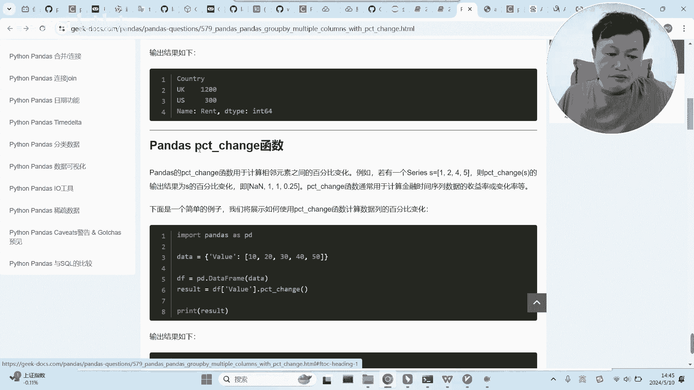

这个函数是干啥的呢，这个函数就是算收益率的，我们之前其实算过收益率。

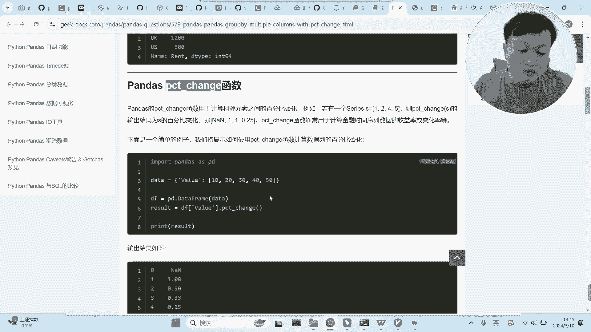

是不是啊，你可以看一下，我们之前算过手游里，我们手动算过，但这个是它能够自动算，但不光是自动的，还有一个更好的好处，我们先看看啊，你看能能看懂这个函数的作用吗，你看这里定了一个十二十三十四十五十。

然后作用到这个函数之后呢，他得到了这个东西，诶这个是啥呢，你看首先第一个是没有的，第一个第一个是没有，第二个，第二个是一，为什么是一呢，他算的是什么，他算的应该是20，算的应该是20-10。

然后再除以十，算的是什么呢，算的是到了下一个步长，他成长的百分比能理解吗，所以说他这个是一啊，这个是你到了这个你看30-20除20，那么是不是0。5，也就是这个看见没有，所以这个东西就是很简单。

它其实算的是什么呢，算的就是收益率，算的就是到了下一个下一个实部，相比前一个十部，他的财富增长的一个比例情况，这个东西就是算一个序列的收益率的这个函数，我相信同学们很好理解，很简单，关键是什么呢。

关键在这里啊，关键在这里。

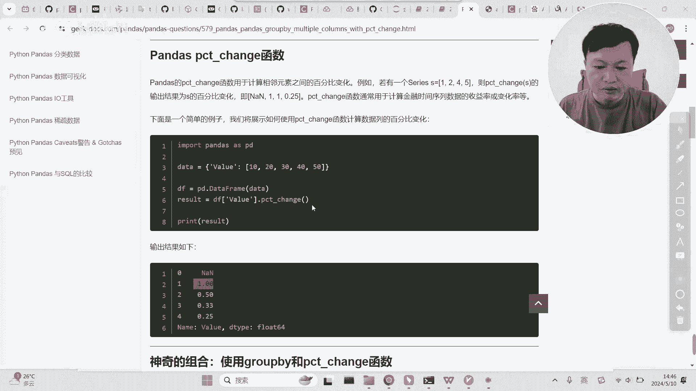

关键是这个函数啊，和who by一起用，这个我们同学就没用过了，who by这个函数我不相信我们同学都都很熟悉，它是分组，它是按照啊，它是按照某一列的值来进行分组，你看对于这个数据框来说。

他以这个东西做分组，那么它必然是分成两组，为什么呢，因为这里只有US和UK两个值，所以他肯定是会把这个数据框分成US1组，和UK1组，分成了两组，分好组之后呢，再往这上面再往这里面去作用一些函数的话。

这个函数是作用到组上面的啊，统计在组上面的，所以说呢当这个函数作用上去的时候，它是分组把UK这个组的和统计出来了，把US这个组统计上出来了，这个逻辑我们之前同学们都应该都熟。

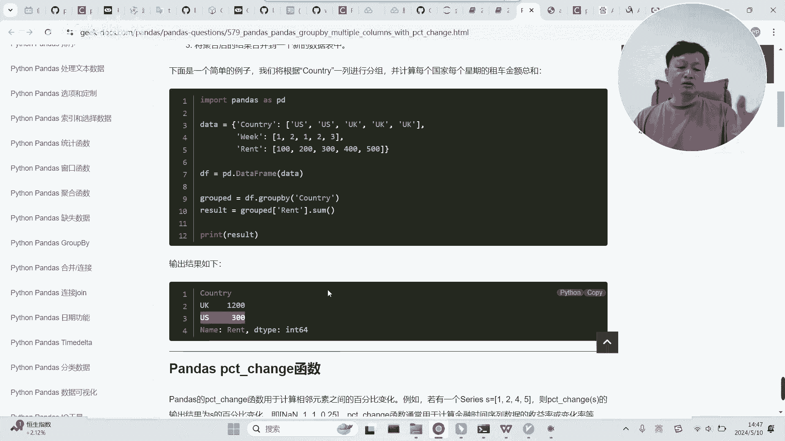

关键是什么呢，BB和我们这个东西哈一起作用之后。

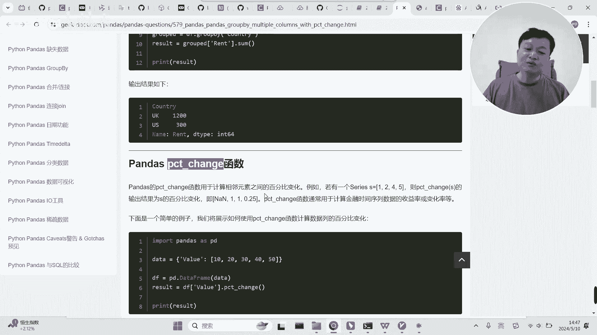

会是什么效果，也就是下面这个就他们两个联合来使用啊。

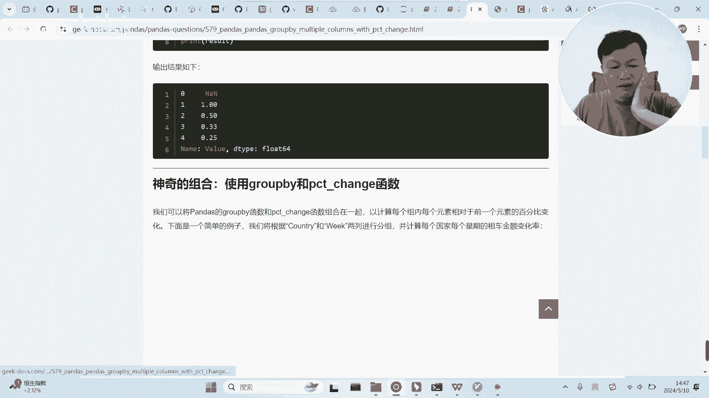

联合来使用，联合来使用的话。

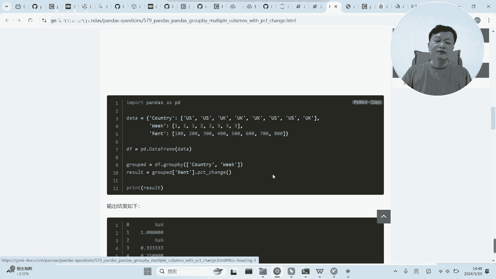

我们知道这个是去计算前一个前一步的，相对前一步的收益情况。

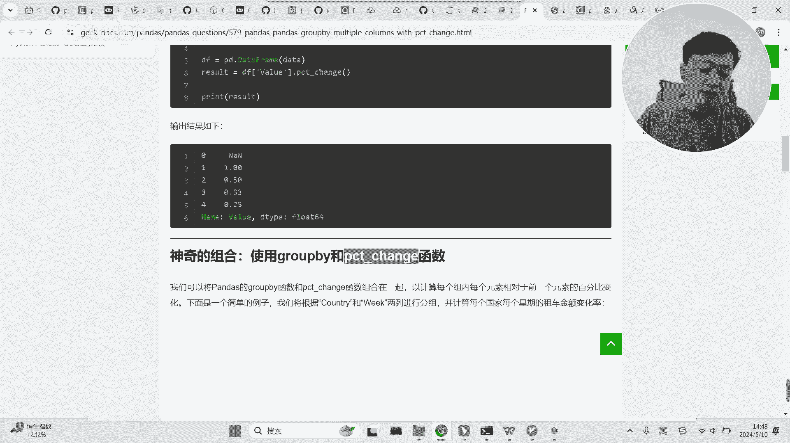

这个东西呢我们能不能直接用到我们这里呢啊，能不能直接用到我们这个表里面呢，应该是不行的，为什么呢，我们这个表里面包含了多个股票，他所谓的前一步不一定是同一只股票，能理解吗，所以说你你如果直接用这个啊。

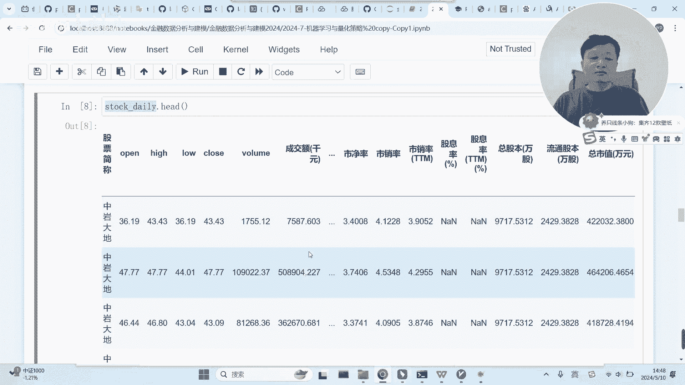

直接把把这个放到我们的这个里面。

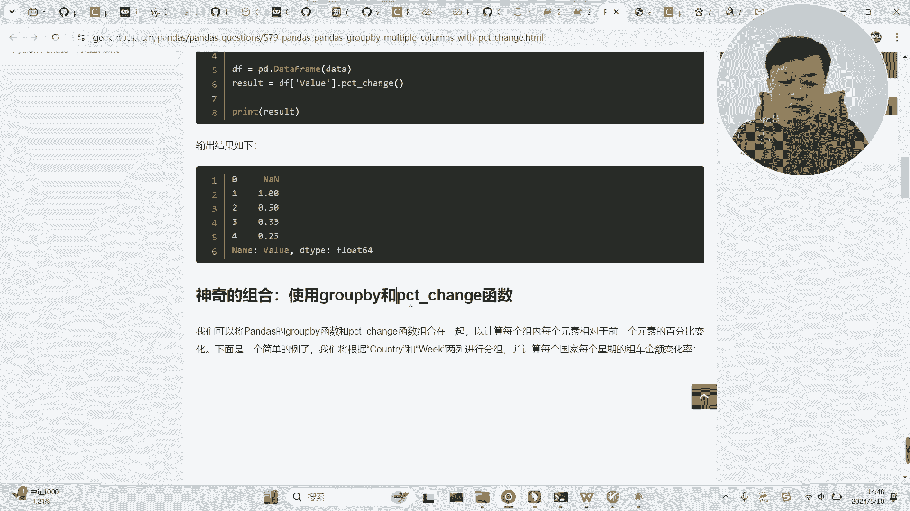

这是能算，但是这个东西算出来没有意义啊，没有意义懂吗，这都把我搞搞那个，那不管这个因为是应该是有空值啊，是有空值才会才会还是怎么接啊，就当然这要要要取什么呢，取某一列啊，hello啊啊，这样子。

但是这样子算出来的结果是没有意义的啊，没有意义的，因为这里面有很多个不同的股票了，能理解吗，那你不同的股票之间的这个东西怎么算呢，所以直接用上去没用。

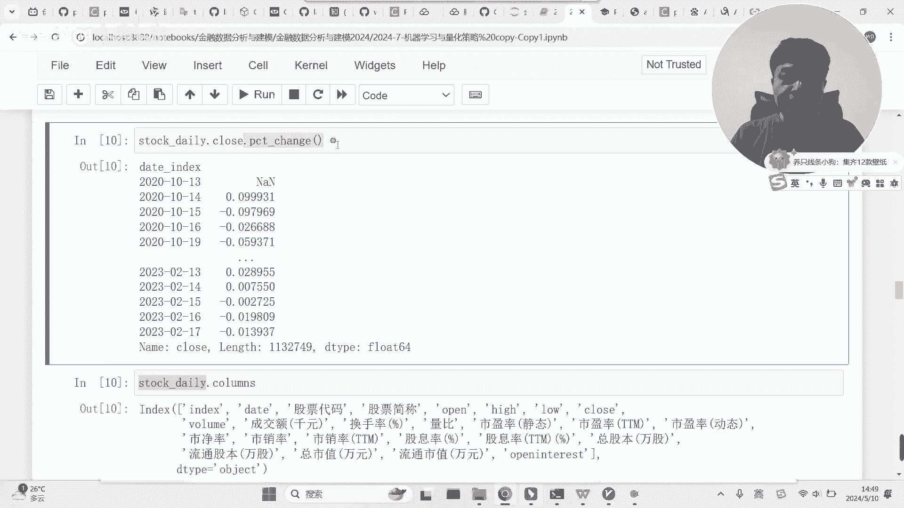

那么他这里是怎么弄的呢，他是要和goodbye联合起来使用。

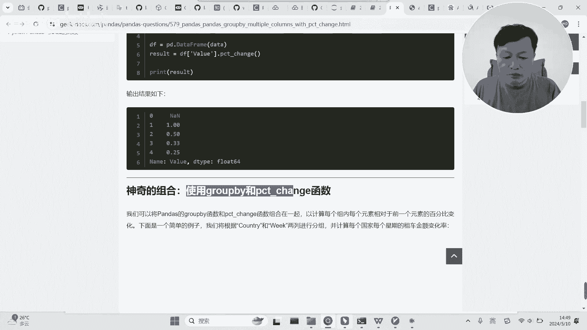

什么意思呢，你可以看一下啊，当你做了goodbye之后啊，然后再做在在分组上面做这个事情，那么这个它就会对每一个组的七，那个顺序的那个位置来来求他的收益了，求他的那个增长的比例了，能理解吗。

它就会作用到小组小组上面去，这样的话它始终是呃什么意思呢。

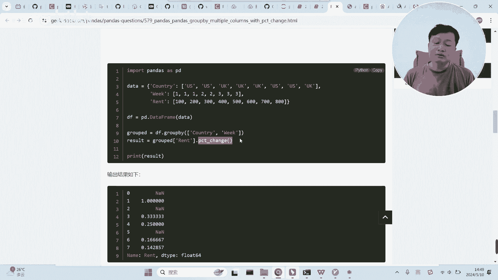

当我们在这里干嘛呢，当我们在这里先，先不败什么呢，不如拜我们的股票代码，股票代码，先先突破我们的股票代码，然后再取它的close，然后再做这个，然后再做这个东西，那么他算出来就是每一个股票代码。

那个小组里面相应的这个收益，这样就对了，能理解吗，必须先得group by，然后再取他的收盘价，然后对每个小组的收盘价去去计算它的顺位的，那个呃收益的收益率啊，价格的收益率，这样才行啊，这样才行啊。

我们把这个做了之后呢，我们把它给到一个值啊，做好了之后，然后呃，给到一个，形成一个新链，return我们看一下，我们要算默认是算一天的，但是我们要算多少呢，因为我们那个我们经常喜欢搞搞很多天。

所以我们算他30天能理解吗，我们先先不要这样弄啊，先先算30的啊，然后给到他，我们算30天的啊，算算30天，啊算好了之后呢，你看价格就在这里啊，就在这里，然后我们，我们看一看，看一看他的是不是这样子。

我们比如说什么呢，我们拿一个吧，我看一下啊，呃，我们把这个，我们去看一看这个东西，我上面应该有啊，就拿这个吧，取取的是应该是其中某一个啊，应该是我们就取这个吧，第一个我们看一下他的情况，你看这是他的。

然后呢，啊你看啊我们是这个我们算的是前面30天的，所以说它大部分都是空值，它应该是从第30天开始就有了收益率啊，为什么呢，你想啊，他是三第30天的价格和前面第1000的价格啊，或者定啊第一天的价格相减。

然后再相除的啊，所以说他前面30都是空子，然后到了某一天啊，到了某一天就就有了三十三十的一个收益啊，30的收益，好吧，这是啊，这是这个，但是呢我们把这个30天的，这个应该是当前价格。

相比他前30天的这个呃收益率给算出来了啊，通过这个东西算出来，好我们看我把我把这个弄出来吧，我们可以看一下和和和什么呢，我们的这个return，然后我们把它给保存一下，这样的话好方便我们观察啊。

方便我们观察，啊我们保存一下看看啊，在哪里看呢，我们保存到本地啊，应该是在这里，你看没有呃，这里，这里都是空值看没，然后第一个只是这个还没，第一个是这个这个姿势应该是怎么怎么来的呢。

是由这个值减去这个值是吧，减去这个值，然后再除以再除以这个值，再除以这个词，为什么呢，因为他们应该是相隔了30个交易日，30个交易日，大家能理解这个吧，就是这样一个情况，就是这样一个情况。

就所谓的30天的收益啊，30天的收益，好吧，但是这个可以做我们的目标向量吗，可以吗，问一下同学们，是不可以啊，肯定是不可以的啊，因为什么呢，因为这里得到的这里得到的是他当天的情况，看见没有。

它是这个价格和之前的前30天啊，能理解吗，而我们啊我们在这一天我们要选股票，我们有这些信息之后，我们要选股票的时候，我们要看什么，我们要看未来30天，就是下一个时30天我的收益到底怎么样，能理解吗。

这个是一个是一个已知量啊，这不能作为我们的预测预测对象，我们在这一天当我们要进行选股的时候，我们选股的依据是什么，我们选股的依据是未来30天啊，下一个30天我赚的最多，我就选那个股票，能理解吗。

所以说我们是要在这个时间点去预测，接下来的30天之后，我是否能够获得最大的收益，所以说我们是要预测什么，预测30天之后这个值是什么样子啊，需要预测这个东西啊，需要预测这个东西，那么我们要怎么弄呢。

我们得得做个事情，好得做个事情，啊要把这个东西这个收益率要要做一个平移哈，要平移平移一下啊，平移一下，然后我们把这个拿来看看，我们把这个拿来看看，还是这个这个应该刷新一下就行了。

你看啊啊这样的话我们这里有三列，一个是收盘价，30天收益和30天收益的平移啊，平移这个时候呢，你看我们这里是不是就有个价格，这个价格和是什么呢，和和这个价格我们看一下啊，你看这个价格我缩小了之后。

这个价格是不是和这个价格是一样的，没有，就是它实际上就是把这边的价格移到了上面去，那么对于这一天来说，这个东西就是他三四天之后的啊，30天之后的收益啊，30天之后的收益，大家能理解吗。

啊这一列对应的是什么，一列对应的是这个值啊，而这个值在这里是空的啊，看到没有，是空的，是空的，所以他是把啊这个值给漂移到这里来了，所以说啊你看这个就对应的是下面这个值啊，下面这个值就做了一个30天的。

一个向前的一个平移，这样的话啊，每每一行，他这边的这个值就不再是当天的30日收益了，而是他30天之后的30收益啊，30收益好吧，而这个就是我们在这个时间点啊，要进行预测的东西啊，要进行预测的东西。

好我们再弄大一点啊，好这个其实就就就可以了啊，就可以了，然后呢这个还不能是我们的目标向量，因为什么呢，我们的目标向量是要做成一个二分类，要对涨跌做预测啊，要对涨跌做预测，因此呢我们需要干嘛呢。

我们需要还需要做的事情，我们再搞一列吧，我们要把它变成零一啊，要把它变成零一，要把这个东西变成零和零，或者是一怎么变呢，实际上就是这样子啊，我把这个代码已经放在这里了，就是把这个函数用上去。

把这个函数啊用上去，当X大于零的时候，我们取一当X小，否则我们取零，这样的话它的收益是收益，如果大于零，我们就让它等于一收益，如果小于零呢，让它等于零，好然后我们看看这个，效果。

你看是不是这个小于小于零，所以说是零，然后呢这一天是不是大于零呢，所以它是一，我们把一个呃具体的收益变成了正一啊，变成了正一，来做这个二分类啊，来做这个二分类，到了这里的话，我们基本上就完成了什么呢。

啊，其实就用这三个代码，完成了我们的一个特征工程，接下来其实大家可能理解，因为这里面每一行对应的就是一个特征，然后呢这一列啊对应的就是我们的目标，目标向量，接下来就是标准的机器机器学习的流程了啊。

我们同学们先把这个事情做掉。

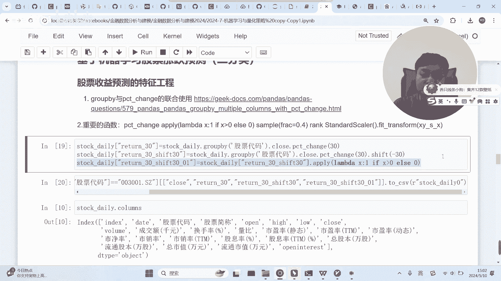

好不好，自己试一下。