# 看懂成交量，赚钱如饮水？股票什么时候放量会上涨？python量化股票放量现象，妙用成交量精准构建买卖点【量化投资邢不行啊】 - P1 - 量化投资邢不行啊 - BV1Fcm8YrEb7

大家好，我是专注于量化投资的行不行，在市场上待过一段时间的朋友呢，应该或多或少都听说过一些关于成交量的谚语，比如天量天价，地量地价，连续增量就有戏，连续缩量就放弃等等。

这些谚语呢都是一代代股民根据自己的经验，口口相传而来的，有些呢是很有价值的，也是我们开发量化策略的来源，但也有一些呢就不一定是对的了，我们做量化交易的呢，就还是要用数据去说话，去尝试验证它们。

比如之前呢我们就通过数据验证，证明了放量上涨，缩量下降跌的有效性，还构建了一个相关的量化策略，我们也曾经介绍过一些基于成交量。

衍生出来的指标，例如筹码分布指标和资金流指标等等。

对这些策略和指标感兴趣的朋友呢，可以去复习一下我们往期的视频，本期视频呢我们就继续来探索成交量，着重研究究成交量的放量现象，针对什么是放量，如何在量化交易中定义放量以及放量之后，股价会涨会跌。

还有就是能否根据股票的放量。

去构建一个赚钱的量化策略等等问题，我们做逐一的解答，并且啊我们不仅为大家准备好了，视频中用到的数据和代码，还把不同类型的放量的表现都统计了出来，供大家参考，这些呢你都只需要加屏幕右下角。

或者置顶评论区，我的微信都是可以直接免费发给你的，看到内容这么有料的份上，给个三连不过分吧。

所谓放量啊，顾名思义就是成交量放大，某股票今天成交量大幅增加，就可以说这个股票今天放量了，通常呢就意味着有大量的资金进入或退出，这个股票。

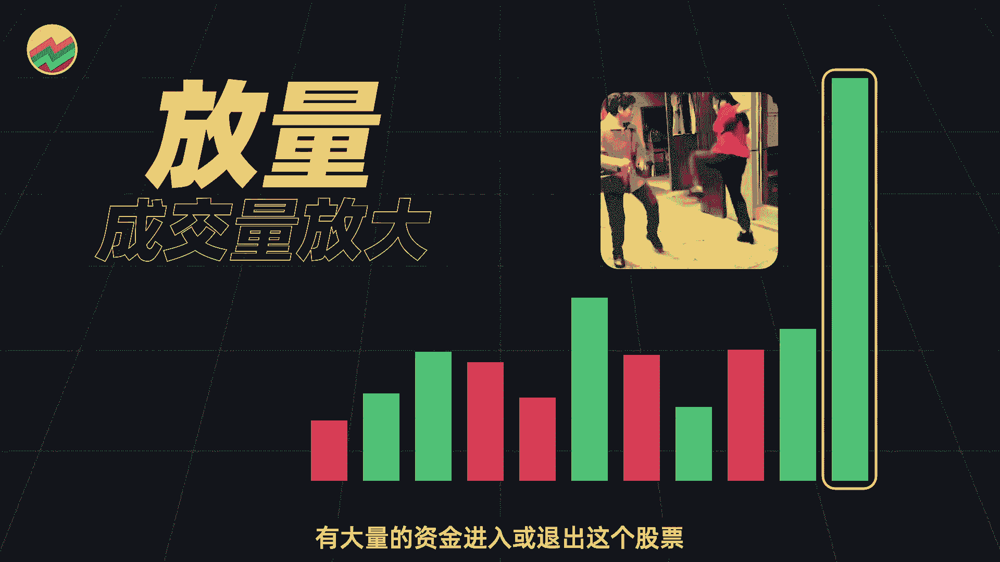

买卖双方今天的交易很活跃，我经常说啊，你的每一笔交易都是在盘口上面，和对面的兄弟擦肩而过，并且互道一声傻，因为你们的观点不一致，互为对手方嘛，那放量呢，就是有成千上万个人在盘口上面互道。

这场景相像很壮观啊，比如图中的K线呢，按照一般的经验来说，圈出来的这几天都是在放量的，毕竟这段时间的成交量跟过去相比，都算是一柱擎天啊，我们再来换几组K线，看看他们的成交量呢都在标出的这个时间段。

异于往常大大幅的上升，这就是所谓的放量，然后呢放量后的股价走势啊并不是一定的，有可能会持续上涨，也有可能会不断下跌，当然也还有可能横盘震荡，这像极了很多股评家对于后市的预测。

那造成这些后续走势差异化的原因其实有很多，其中有一种比较主流的说法呢，就是认为股价相对位置，决定了放量后的股价表现，这一派系甚至还有一句口诀广为流传，低位放量跟跟错也要跟高位放量跑，跑错也要跑。

意思呢就是在股价相对较低的位置，看到了放量就要马上买入，在股价相对较高的位置，看到放量呢就要果断的清仓。

那这个谚语呢如果只是看图的话，好像确实说的还挺对的，确实呢在低位放量之后啊。

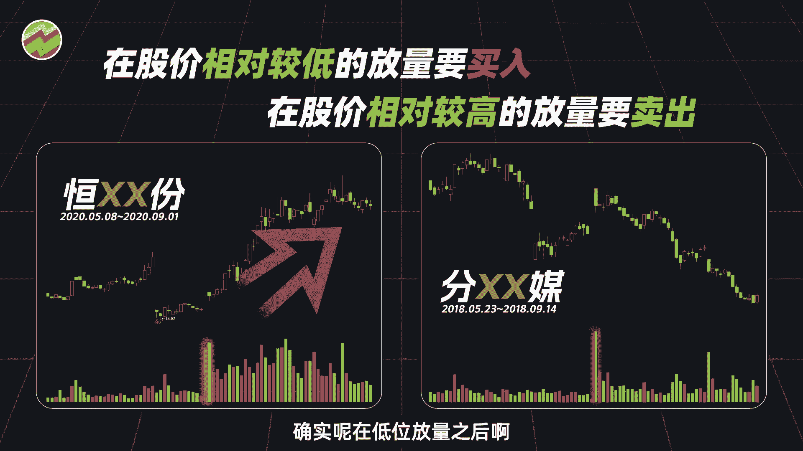

股价在一路上涨，而在高位放量之后呢，股价就在一路下跌，但是你知道我为了找这些图例花了多少时间吗，我们做量化交易的，不能像那些股评家一样，对着几张图举例说明，就能轻易的下结论。

我们还是要借助全部的A股历史数据和Python代码，将低位放量和高位放量给量画出来。

并在所有股票的所有历史上，把他们都给标记出来，通过全面的统计去看一看。

到底低位放量之后是不是真的会上涨，高位放量之后呢，是不是会真的下跌。

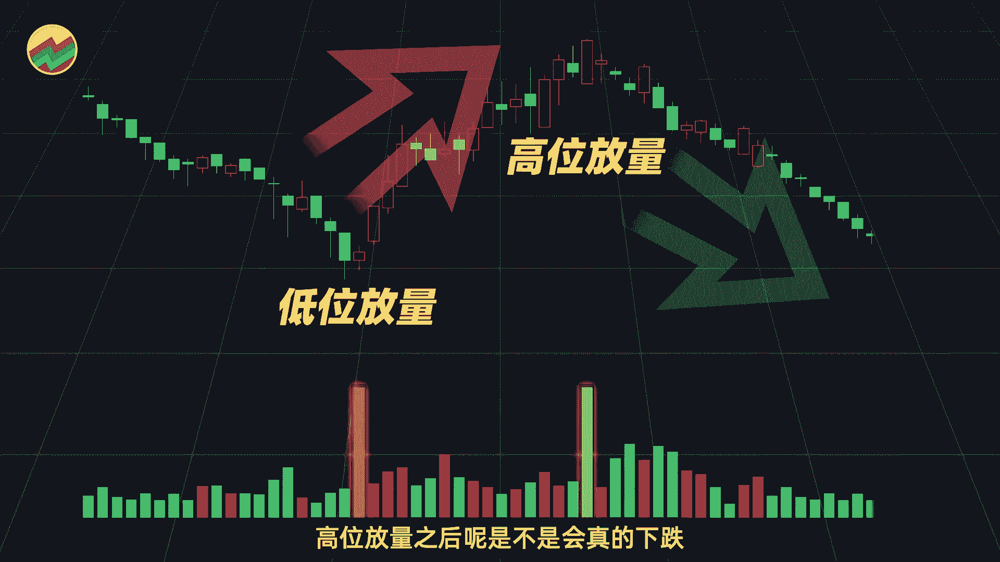

这样得出的结论才是真实可靠的。

在我们整个验证过程当中啊，最复杂也最难的一步，其实就是如何去定义低位高位以及放量，有人说这很简单啊，比如说这个图里面我一眼就能知道它在高位，并且这个是放量合起来呢，这就是高位放量无疑了。

但是啊我们不可能自己用肉眼。

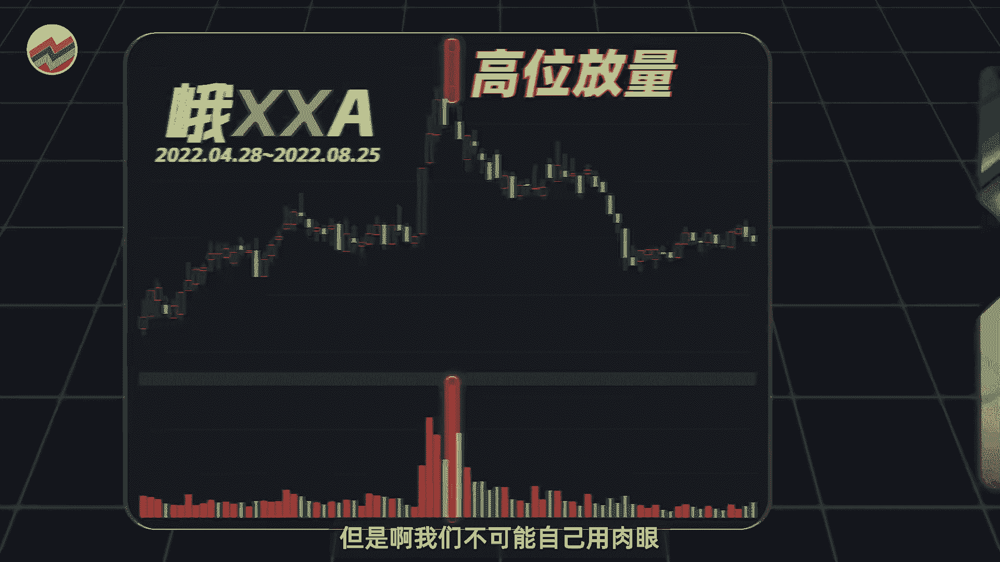

一个一个股票去判断，这根本不现实，我们肯定得编程，让计算机帮我们去寻找，那么这个时候呢，我们就需要把我们之前对低位，高位放量的自然语言描述的定义，一个非常不精确的定义。

转化成我们计算机可以理解的一个数学定义。

或者说是程序定义它必须得非常的精确，比如说我们这里低位放量的概念当中，股价在什么位置上才算低位呢，成交量要做多大才算放量呢，这些话我们人脑可能看图会比较容易理解，但计算机是理解不了的。

它只能理解一行一行的代码以及明确的规则，也就是说。

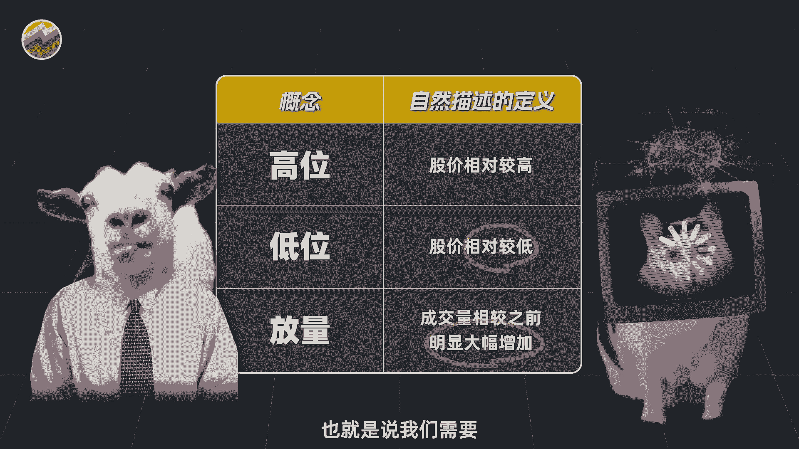

我们需要把一些模棱两可的所谓的经验，设计成一个有精确买卖点的策略。

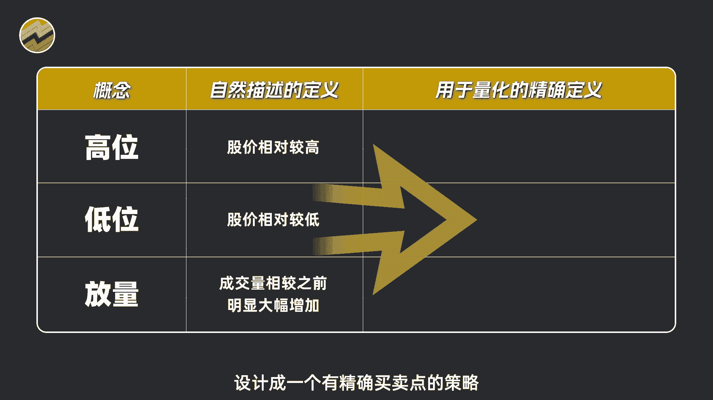

这一步一般来说会难倒很多人，此时呢你也可以暂停一下视频，想想如果是你的话，你会怎么去做，然后呢和我们之后要讲的方法去对比一下，看看哪个好哪个坏，这样呢可能对你有更大的启发好。

那我们接下来呢就首先来定义什么是低位，什么是高位，假设我们每天都把过去120天的收盘价，从大到小进行排序，只要当天的收盘价呢能够排名在前10%，我们就认为这一天处于高位，如果排名后10%呢。

就认为这一天是处于低位。

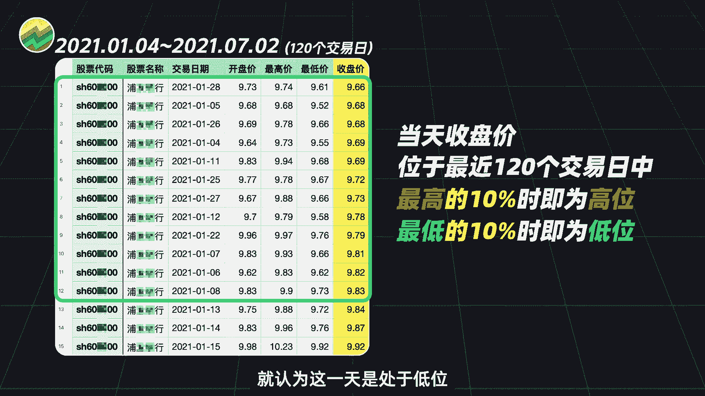

其实啊，就是把当天的价格和过去120天的价格，进行一些比较，看一下我当天价格在过去120天当中，处于什么位置，通过这个位置来判断目前处于高位还是低位。

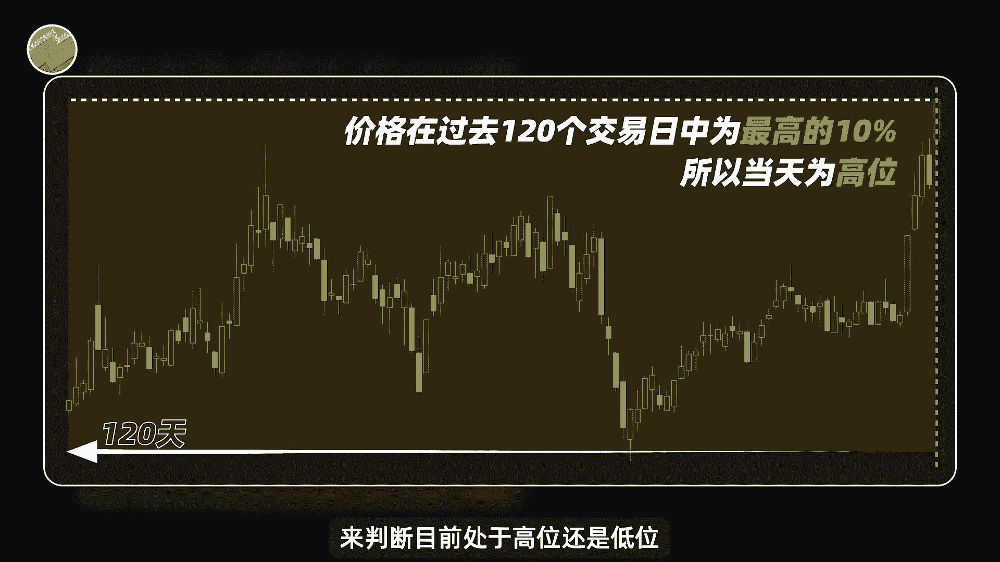

当然啊这个只是我们自己做的一个定义，你可以按照你的想法去定义，比如说你可以要求当天的股价，必须是过去120天当中最高的位置，才能算作高位，这样也是可以的。

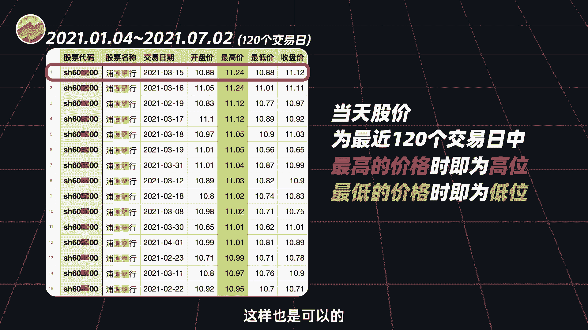

本期视频中呢，就用我们之前给出的方案来寻找高位和低位，那放量又该如何定义呢，我们之前的视频呢，用标准对成交量放量做出过定义，感兴趣的可以去看一看，本期视频呢给大家介绍一种新的定义方式。

我们首先呢把成交量转换成换手率，换手率的定义很简单啊，就是拿这段时间的成交量除以它的流通股数，得到了一个比率，比如说今天的换手率是3%，那么说明今天有3%的流通股被交易了，换手率越高啊。

说明这个股票交易越活跃，流动性越强，接下来呢我们就针对换手率指标来研究放量，然后呢交易经验丰富的，你们肯定也知道一个经典的技术指标布林带，它的计算公式呢是这样的，我们呢就借鉴一下他的公式。

只不过呢我们把其中的收盘价替换为，我们前面提到的换手率，我们的换手率也有了条所谓的上轨，和布林弹一样啊，只要我们当天的换手率高于这个上轨，也就是过去100天换手率的均值，加上两倍标准差的时候。

我们就认为今天放量了。

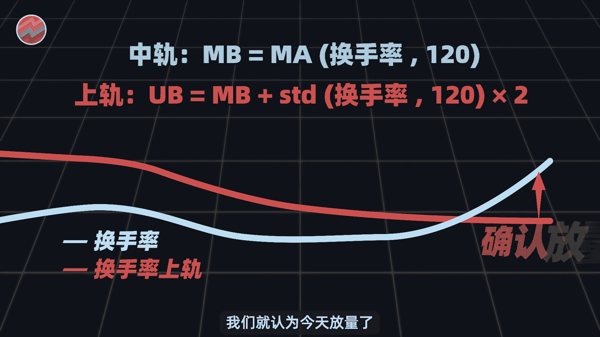

我再次强调一下，这个关于放量的量化定义是见仁见智的，不同的人会有不同的方法，我们自己也会用好多种方法，大家也可以用自己的方法来定义放量，比如说你也可以尝试一些更简单的方法，看一下过去120天的成交量。

今天的成交量是否能够排进前十呢。

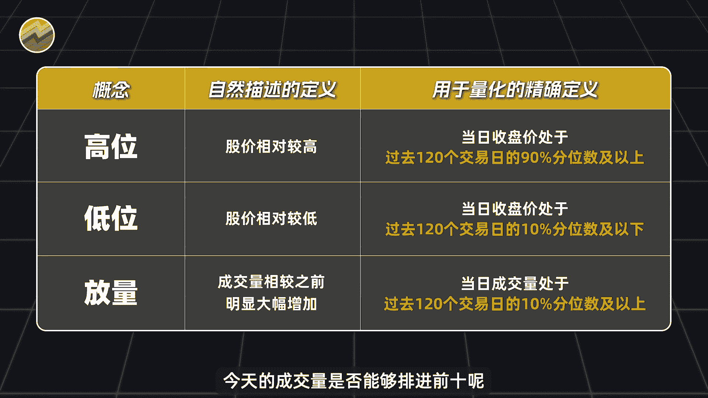

如果能够排进去，那就算放量了，诸如此类方法都是可以的，以上的这些定义呢。

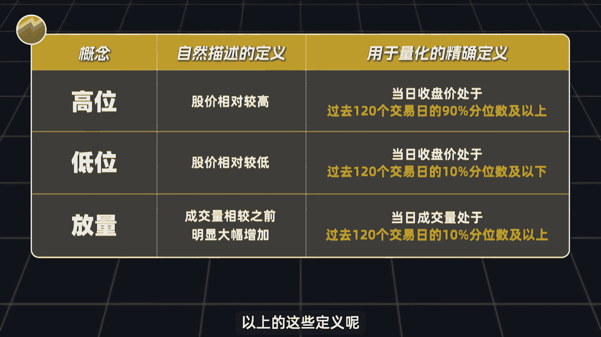

我们其实也已经写好了相应的代码，供你去做测试，你当然也可以加屏幕右下角或者置顶评论区。

我的微信问我要了数据和代码之后，去尝试的定义你自己的高位放量和低位放量。

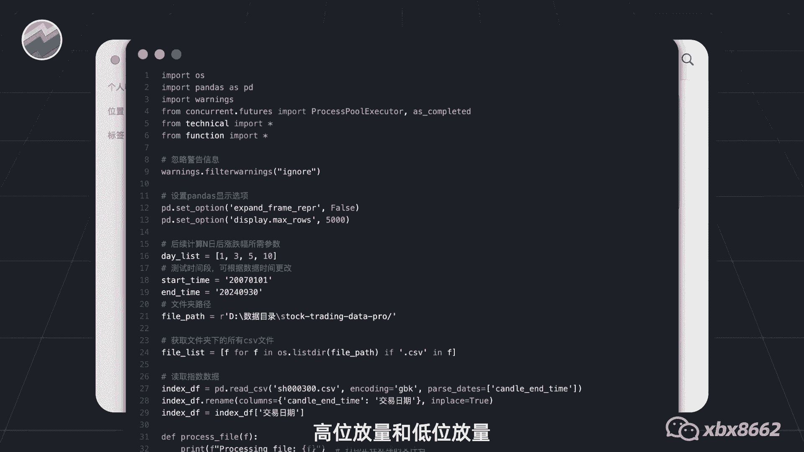

测试一下它们的效果好，那么不管说啊，我们对高位放量和低位放量，都做出了量化的定义，你可以看到我们把完全自然原化的描述，变成了非常精确的规则，通过这些规则啊，任何人都可以精确的找到。

高位放量和低位放量的位置，没有半分的差错。

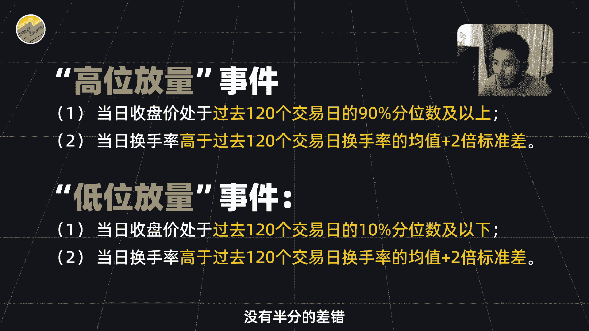

也没有半分的模棱两可，接下来呢，我们就可以借助全部的A股历史数据和Python代码，来找出历史上所有低位放量和高位放量的位置，然后呢去看一下放量之后。

这些股票的表现到底如何，相关的数据和代码，我已经帮大家准备好了，这里面包含了A股历史上所有5000多只股票。

甚至是那些已经退市的，你可以打开其中任意一个文件啊，它包含了这个股票从上市第一天至今，每天的开高收低的价格，并且你可以计算复权价。

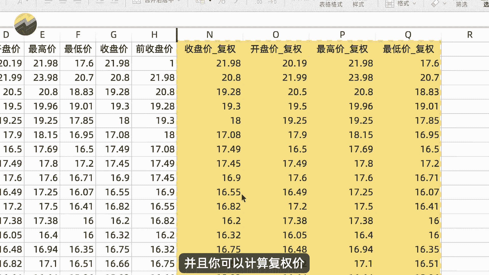

非常的完备，计算的代码呢也不复杂，你只需要打开这个Python文件，点击运行即可。

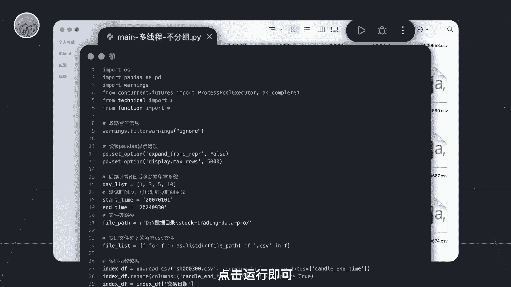

如果你需要数据和代码的话呢，可以加屏幕右下角或者置顶评论区，我的微信都是可以免费发给你的。

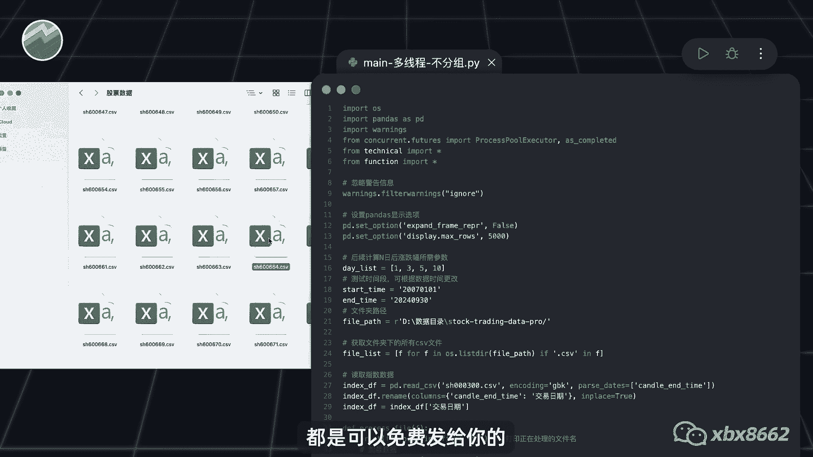

好那么我们接下来运行一下程序，看看结果到底如何，程序运行结果呢就如图所示，从2007年至今，A股历史上共出现了37万次，高位的放量和4万次低位的放量，看来我们大A放量还是集中在高位啊，可能更容易跳水。

出现高位放量，一天三天，五天，十天之后，股价未来下跌的概率都显著大于50%，最少也有53%，反过来说也就是未来上涨的概率，50%都没有到，不要小看这个概率啊，你要知道在多场上面，庄家针对你的优势。

可能也就只有五十一五十二%，但是人家已经可以赚的盆满钵满，但比较可惜的是呢，高位放量后的平均涨幅虽然都是负数，但都比较低，可以忽略不计，这更像是在高位放量之后，股价开始横盘震荡，而不是下跌。

我们再来看低位放量，发生在低位放量后，我们预期股价是会上涨，数据统计结果呢也确实是如此，低位放量之后的一天，三天，五天和十天涨跌幅呢大于零的概率在稳步上升，平均收益率也是同样如此啊。

十天之后的平均收益率居然高达2。8%。

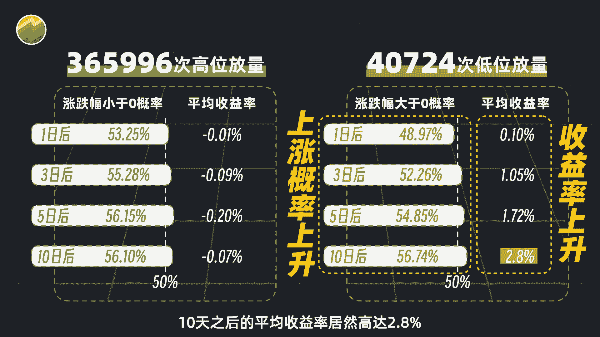

这是一个非非常非常高的数值了，要是每十天都能有赚这么多的机会，那我们一年就可以实现资金的翻倍了。

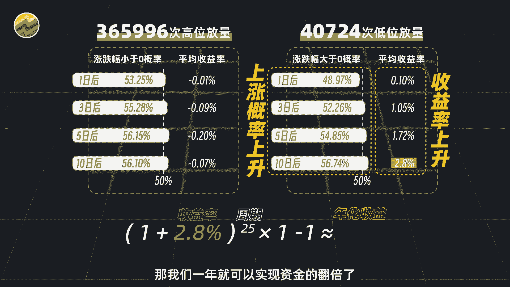

但其实反过来想一想，既然价格已经在相对低位了，那么买入后再度下跌的幅度也不会太大，反而有更多的上涨空间，再结合放量这一条件，很可能也说明了这个股票被更多投资者关注，反而可能形成一致性的上涨预期。

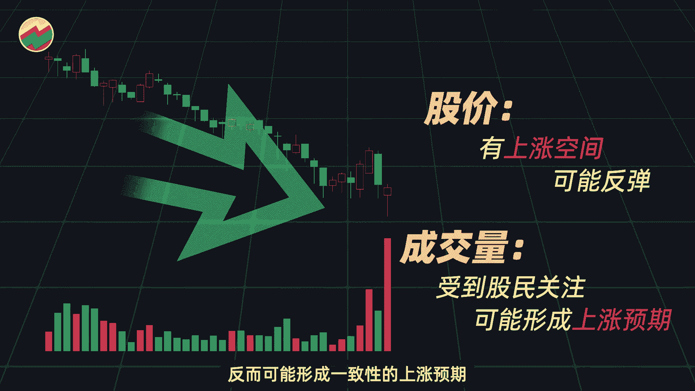

并且啊如果你仔细观察，我们对于低位的定义的话，应该可以发现，其实低位放量更多的会出现在熊市和震荡市里，那是不是意味着这个指标如果构成策略的话，会更适合下跌行情，甚至会让我们在熊市中更有机会获得正收益呢。

更有甚者是否可以精准找到牛市的起点呢，这些都是值得我们去研究的方向好。

那么至此呢，我们可以发现啊，低位放量之后，股价确实是会上涨，并且收益还是很不错的，高位放量之后呢，股价也并不会如期下跌，反而会出现盘整的趋势。

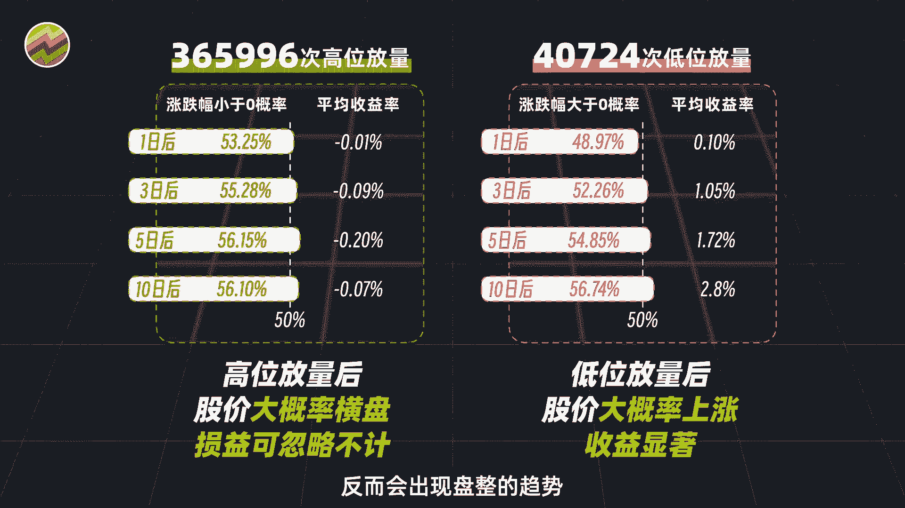

然后呢我们这次展示的只是低位放量后，股价确实会上涨这样一个结论，但即使有了这个结论呢，我们也不知道明到底该买哪只股票，这个呢就只是一个结论，它并不是一个量化策略。

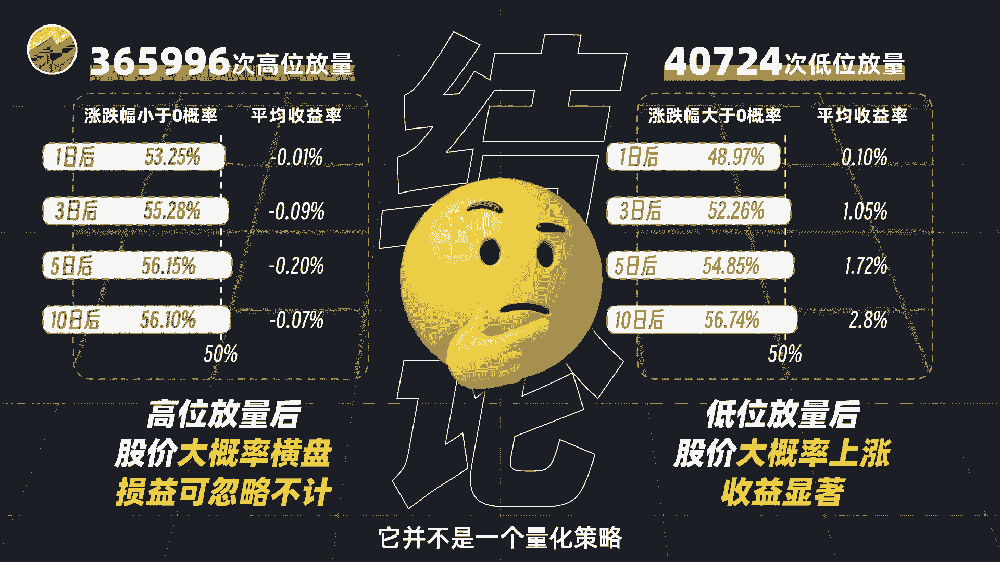

因为我们量化策略呢需要非常精确的告诉你，明天需要买多少股票，占你多少仓位，以及什么时候卖出，也就是有一个非常清晰的可执行的策略，最后我们还可以得到一条资金曲线，也就是根据你这个策略去买卖。

到底会赚多少或者亏多少。

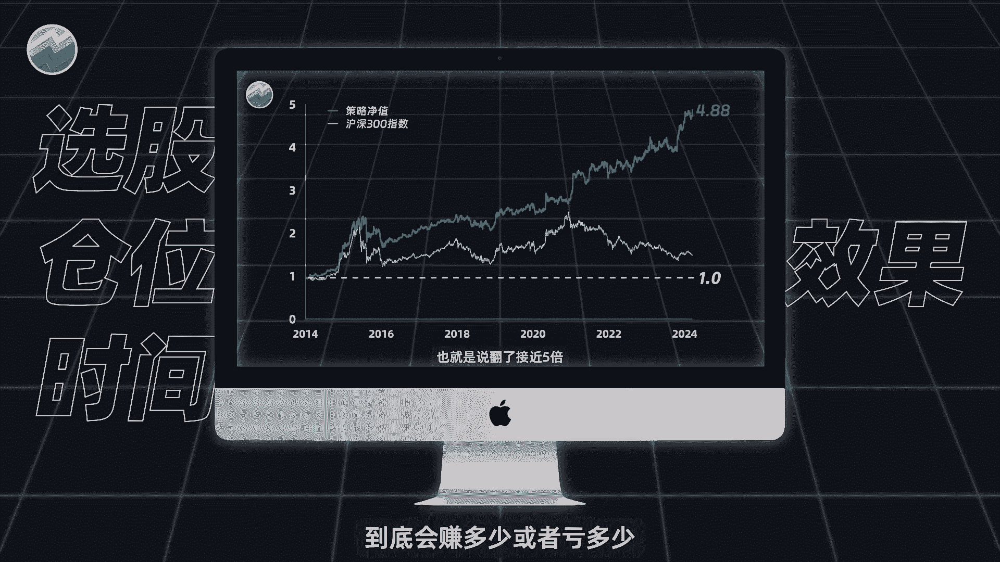

那如何把我们这个结论转化为一个，切实可行的量化策略呢，时间关系我们就要放到下期视频来讲。

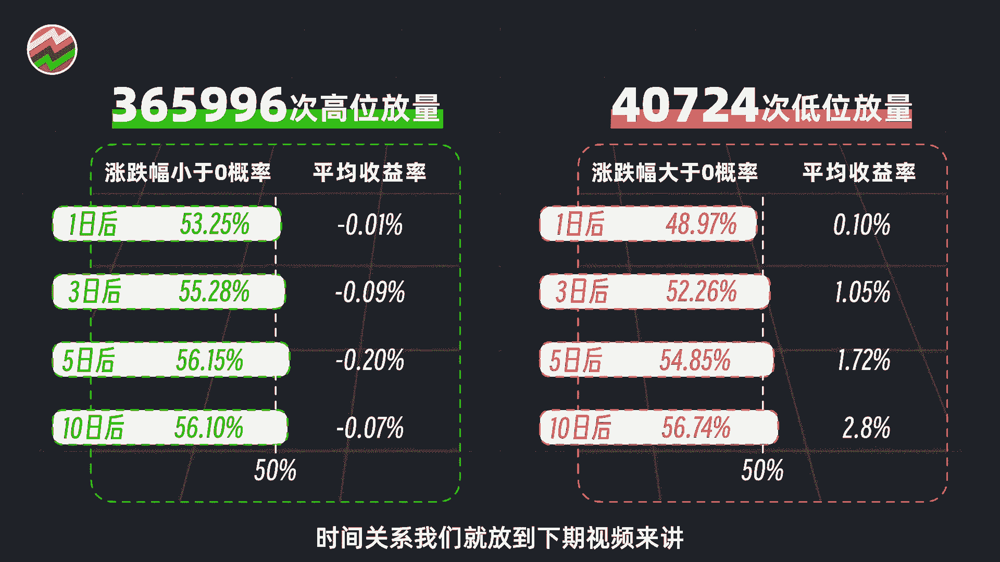

如果想看的同学多呢，我们就可以加快更新速度，点赞每多1000，我们就早一天更新，欢迎大家监督，那么本期视频就到此结束，感谢大家的点赞，投币收藏和转发。

