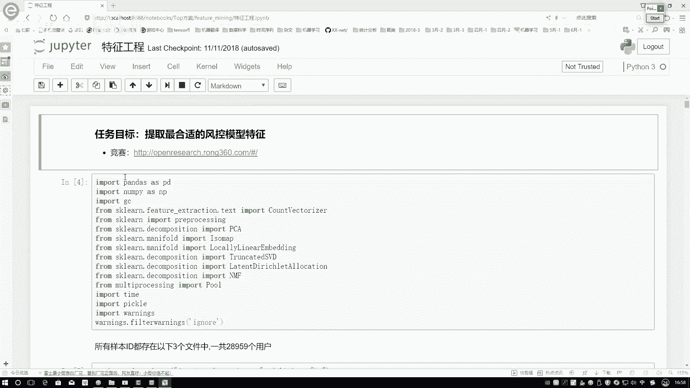
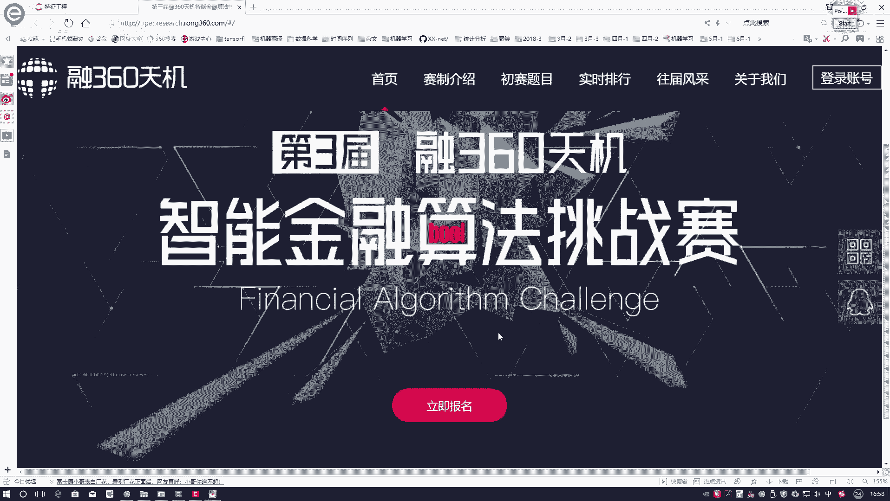
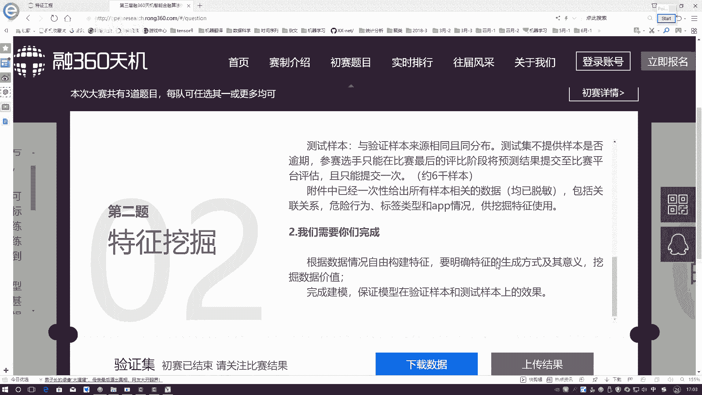
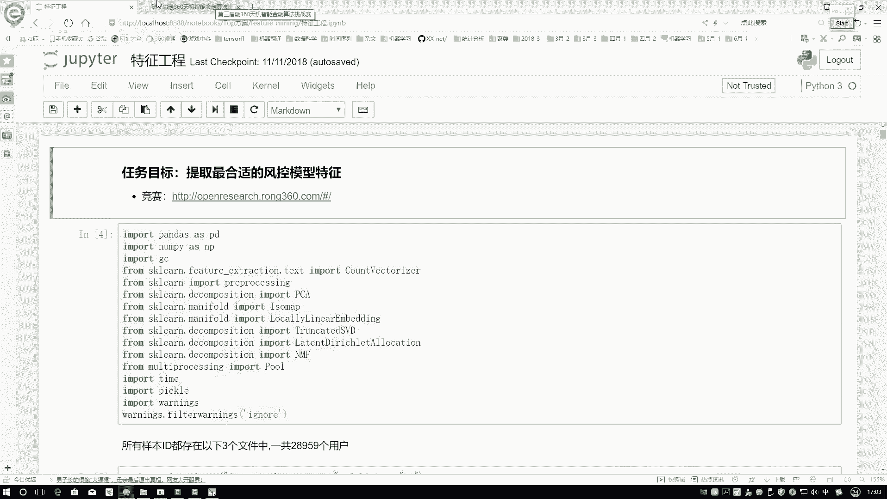

# 完全可自学！人工智能金融领域知识图谱+Python金融分析与量化交易实战全套课程！入门真的超级简单！——机器学习／深度学习／NLP自然语言处理 - P10：1-竞赛任务目标 - AI算法-漆漆 - BV1Wgz3YVEx1

这节课来给大家介绍一下，当我们拿到了一份金融数据集之后啊，该怎么样进行一个特征提取，这里呢我们的金融数据集啊稍微有点特别，它主要是用来做这个风控模型的，就是风控模型就是我要控制一个风险，在这里这样吧。

先给大家来看一下咱们这个数据集啊。

它的一个来源啊，是来源于这样一个竞赛的，点进来看一下这个竞赛名字啊，叫做一个融360天机荣耀360啊，是这个平台的一个名字，它里边主要是做一些贷款业务的，比如说买房子做贷款，然后买车做贷款啊。

这个是一个融360天界，表示着他举办了这样一个竞赛。

大家在玩的时候哎，这利益标明也不用点了，这个算法比赛已经结束了，咱现在参加不了了。

到时候大家玩的时候，直接来看一下咱的一个题目就可以了，第一题啊我们没做，第一题，我们做的是第二题，因为这个比赛现在已经停止数据集的下载了，我们只拿到第二题的一个数据，第二题是这样。

他是让你去做一个特征的挖掘，特征挖掘是就是这这样一个事儿，有些用户啊现在嗯在这个融360天机呃，不是融360这个平台上，然后他要去借钱，但是它可能会出现一种现象，就是他不还钱，这这个现象比较常见吧。

那现在平台就希望去我们建立一种算法，或者是提取出来哪些特征比较有价值的，去判断一下什么样的用户，接下来可能还钱，什么用户可能不还钱，说白了有些用户来了，我要基于他提供的，因为贷款你要先提交信息。

再能贷款吧，要基于他提交信息，就是这些可能不还钱的，直接给他拒绝掉，这个就是我们要去做的，但是呢我们要做的是这个工作的前半部分，进行一个特征的挖掘，找一下在原始数据当中。

哪些个特征能够更好地给我们呈现出来，这样一个信息，这个我们要去做的，说白了就是咱们去做一个特征工程，然后呢当前这个数据集当中，我不给大家一个去读了这块，他说提供了几种数据，一个叫做关联关系，关联关系。

这样就是这个用户在进行一个贷款的时候，或者借钱的时候，我不知道大家以前没玩没玩过，但是估计看过一些新闻，有一些催收的公司，催收的怎么催收，给你打电话，你不接是吧，那你他们数据没招呢。

他会给你的亲朋好友挨个打电话，进行说这个事吧，逼着你还钱，那怎么样得到你亲朋好友的关系的，怎么得到他的电话的，一般情况下就是当你借钱的时候，你需要在手机的app上进行一个授权，让他们能去访问你的通讯录。

能去访问你的手机当中内在的一些信息，比如说一些比如说你给谁打过电话，或者是你有通讯录当中，你有哪些个人啊，发布哪些短信，他都会要求进行这些接口的一个访问，说白了要找到咱当前这个关系，这个关联关系啊。

就是原由由于啊原始数据当中啊，它都是一个脱敏的，我本来以为啊它里边会有一些电话号码之类的，但是没有啊，他只给我们提供的是一个id，比如说当前这个呃一个用户吧来贷款了，然后我授权访问了一下他的一个通讯录。

发现了一下这个id跟这么多个id都有一些关系，这个叫做一个关联关系，那大家想就是关联关系对咱们结果有什么用呢，大概情况下是这样，就是现在有的人不还钱，那可能他有这样一个他有这样一个心理。

就是我凭自己本事借的钱，我为什么要还啊，那你想他这个人这样，他身边的朋友是不是也可能这样，他自己发现我不管钱，人家拿我没招，会把当年这个事哎分享给他的些朋友，他这些朋友看着哎这个东西贷完款，我不还钱。

好像他也咋滴不了我，他们也可能会贷款，所以说啊在关联关系当中啊，就有一个黑名单的一个挖掘，黑名单是这样一个人，他不还钱，那可能我通过他的一个关系，能挖掘出来其他的黑名单，比如说我现在来个人这个id啊。

他是一个新用户，来了之后，我一访问通讯录，发现了，他跟我其中的一个黑名单有着直接的一个联系，那我可能认为当前这个人，当前这个id他也是有问题的吧，这个就是我们的一个关联关系数据啊，大概是什么意思啊。

然后第二个危险行为，危险行为这里他只是给我列出来一个AABCDE，相当于列出来五个指标，但是呢没有具体的指定ABCDE分别是什么，它只是一页数值，因为这个数据它是一个脱敏的数据。

它也不好去说这app到底是那个读取了，你这个手机当中到底传来的信息，它只是告诉你有这么ABCDE啊，四个五个列在我列当中啊，都是一个数值，所以说这个危险行为咱能做的事不多，因为它是一个脱敏的标签类型。

标签类型，比如说他要借这个钱要做一件什么事，还有app情况，AP情况，一开始我不太理解啊，后来情况下我看了新闻，我大概知道了是这样一个事，它会下载了哪些个app，其实我一开始这么想。

我说下载到什么样的app，跟他这个人还不还钱有什么直接关系吗，后来我看新闻知道了，一般不还钱的人什么样都是拆东墙补西墙，这样是吧，比如说这个这个app平台借了钱，然后还不上了，又向另一个app平台借钱。

再让另一个app再上另一个app，他会记录一下，就是这个嗯大赛数据当中啊，给你提供了app情况，这样他都下载过哪些app，比如说这个贷款金融那个什么什么借钱，那个理财之类的，它下载可能很多啊。

基于它下载app情况也可以当做一个特征啊，这个是我们这个竞赛数据当中啊，给我们提供的啊，几分数据集，一会儿呢在咱们这个代码当中，我也会一个一个给大家分别进行一个展示的，大家先了解一下。

咱当前的一个数据样本就可以了，由于这个数据集当中啊，只要求我们做这样一个特殊挖掘，但线上的一些测试，因为接口都已经关闭了，所以说嗯咱这个测试结果的时候，我就不给大家进行演示了。

咱们这个目标主要放在前半部分，该怎么样选择最合适的啊。

