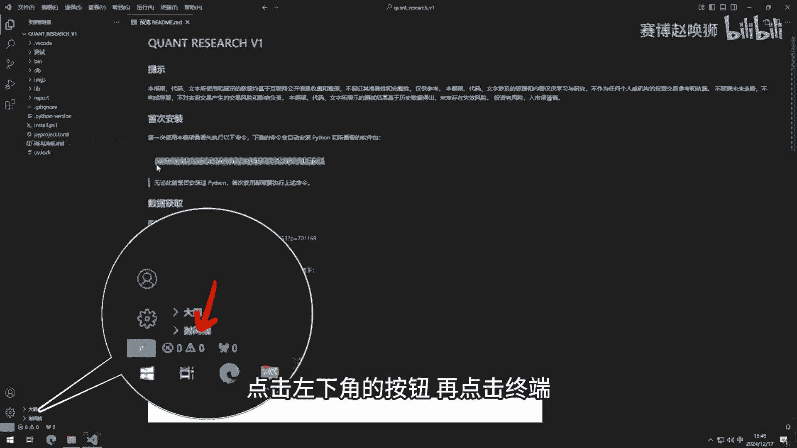
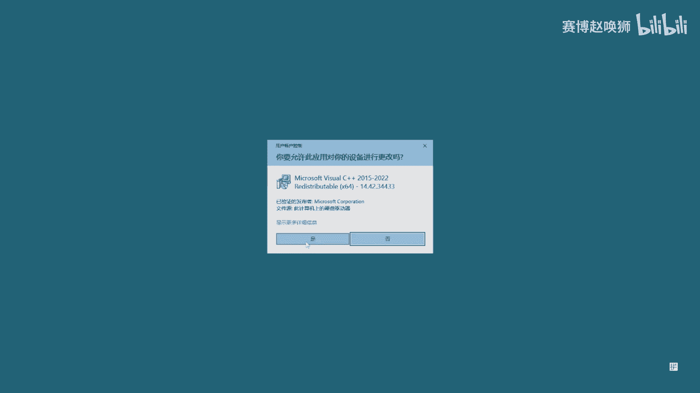
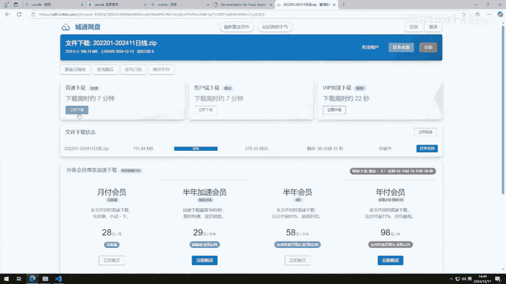
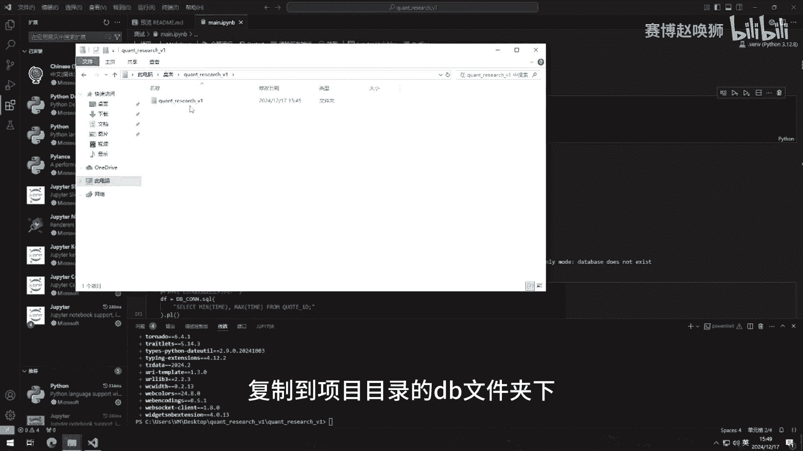
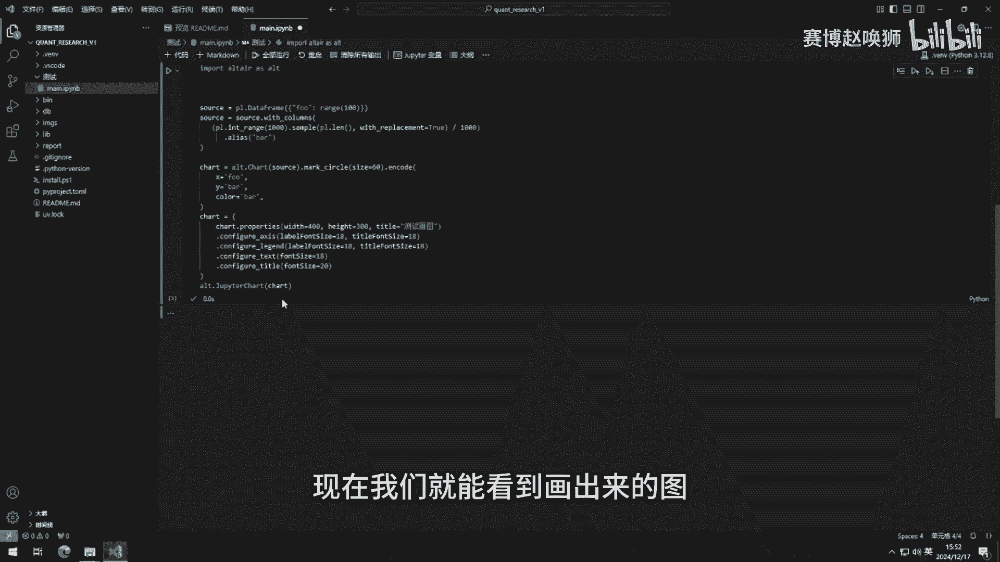
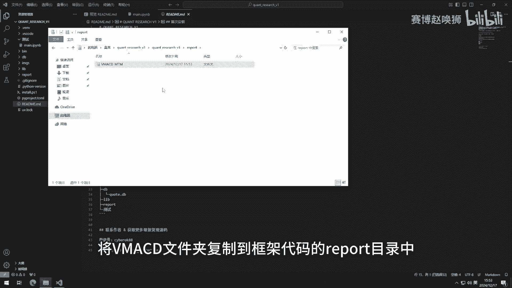
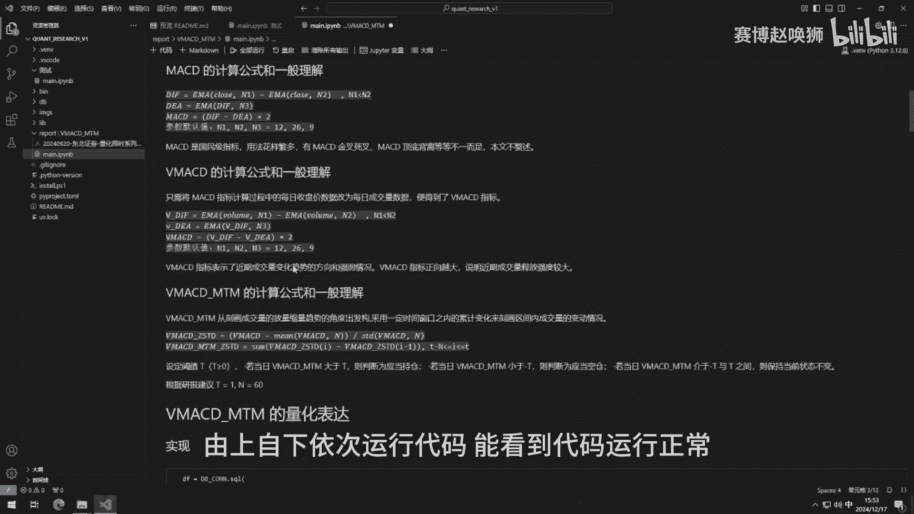

# 研报复现代码包运行教程 - P1 - 赛博赵唤狮 - BV1e3kgYeEUB

大家好，我是赛博召唤师，很多朋友拿到了代码，不知道如何跑起来，这里我录一个详细的教程，当前你看到的这个软件叫VISTCODE，如果你不了解它，B站内就有诸多VISTCODE安装教程，朋友们可以自行搜索。

这里我们直接进入研报复线框架的安装和使用，首先解压研报复线框架的代码包，这里我直接放在桌面上了，你可以放在任何位置，解压后直接用VSCODE打开，打开说明文档，这里提示我们要先运行这一行命令。

点击左下角的按钮，再点击终端。

将命令粘贴到终端内，按回车开始执行，此时会弹出一个授权提示框，我们点击是。

稍等片刻，你看到和我一样的输出，就是安装完毕了，做到这里，恭喜你已经成功大半了，下面我们打开左上角的测试文件夹，在测试之前，我们点击右侧的按钮配置环境，这里会要求你安装Python和JUPITER插件。

我们点击安装，安装完毕后，我们选择对应的VM环境，如果这台电脑此前安装过Python，这里的选项可能会比我展示的多，记住选择van字样的环境即可，现在尝试运行代码，点击左侧的小三角，这里的报错是。

因为我们没有在框架中加载行情数据，回到说明文档。

可以找到行情数据的下载地址，这里我为大家准备了近两年的日线行情数据，可以直接下载。

获得数据压缩包后，右键解压，将quot文件复制到项目目录的dB文件夹下。

再回到VISTCODE中点击运行，这时我们可以看到运行成功，继续运行，能看到日线数据的起止时间，继续运行，如果出现我这样的报错，你可以关闭VSCODE并重新打开，重新运行代码。

现在我们就能看到画出来的图。

至此回测框架已经安装完毕了，下面演示如何运行研报复现代码，这里我们用v Mac举例子，将代码包解压，将v map文件夹复制到框架代码的report目录中。

在VISTCODE中找到刚刚复制的文件，由上自下依次运行代码能看到代码运行正常。

画图正常，现在可以开始你的研究了。