# 神经网络图优化与量化模拟 - P1 - 直抒胸臆的番茄酱 - BV1GeCPYEEYa

好的，那我们本次就是想跟你聊一聊，说这个从神经网络全局的角度来看，从图本身的角度来看，最上面的图，以及它的图优化，跟量化之间会存在什么样的关系，那从本次视频开始呢。

我们就会回归到量化本身的一些核心问题上来，前面的那些内容呢，大部分都跟这个后端硬件计算的一些细节有关，那这节课开始，我们就开始去具体去哪一个神经网络，从网络本身这个角度来考虑，进入到更上层的一些讨论。

并且呢去着眼到量化的本身，然后去向你展示PQ里面的一些，非常非常有意思的一些量化的一些设计，对这些神经网络量化有更深刻的一个认识，那首先呢嗯我在这里假设说，你知道神经网络是个什么东西对吧。

他应该是可以用一个图来表示的，那这个东西我们被称作是一个计算图，那什么是个计算图，就是我们这儿有给了一个大概，数学上的一个定义，就是一个计算图，一个是一个四元组啊，一个四元组，然后它是由节点编辑输入。

边输出边组成的四元组，然后如果你还记得你学数据结构的时候，有一个东西叫图是吧，就叫图结构图结构的话，它的定义应该只有这个节点跟边是吧，节点跟边组成的那个东西，然后我们这里额外加了两个东西。

一个就是输入边跟输出边，其他东西跟那个数据结构里的图是一致的，然后额外的来讲，计算图，首先必须要求是一个有效的联通无环图啊，有相连通无环这三个东西三个性质啊，有相就是说你的边都是有向边是吧。

他不是一个双向的边，然后连通图就是说你的这个图里面，你的这个神经网络里面，它不能有孤立的东西，它不能分成两部分，或者说有一些孤立的节点在中间飘着，那个不对的那个不对，那个算不了。

因为你这个东西是要执行的，无无环，就是说你这个摄像里面不能有循环，你这个你这个你这图里面不能有循环，然后这些节点，那这个东西就是这里面的这个节点N啊，这个节点也被称为算子。

就神经网络是由一个很多个算子组成的，很多很多个算子组成的，然后每个算子之间必定有边相连，为什么，因为有相连同无环对吧，而且你不可能是一个神经网络，只有一个算子是吧，为什么，因为我跟你说了。

这里面有输入边跟输出变，这两个东西是不可为空的啊，不可为空的，所以就是就算你只有一个算子，那这个算子也一定会有它的输入跟输出边啊，就构成了神经网络的输入输出点，他们的输入输出点一定不为空。

然后计算图中可以有重编，这是一个很特殊的性质，就是我们的图不是一个简单图，如果你还记得那个神经，那个那个图结构的定义的话，我们这个神经网络计算图不一定是简单图，它可以有重编。

就是两个算子之间可以有两条边相连，但这种情况很少，我也不建议你做这种情况，这种情况的话，会让我们解析图的时候遇到一些困难，其实我也不能保证说这个东西一定能解析成功，我在写代码的时候。

我会思考这样的问题啊，就是说你这个东西如果有重编怎么办，可能有些代码是能过的，有些代码其实我我我不知道，就是如果他有重编，有可能是过不了的，什么时候会有重边，给你举个特很特殊的例子啊。

就说我算这个A乘A就A乘自己本身，那这种情况呢，你可以给他写成是A的二次方的形式，那那个时候就没有重编了，但是如果你真的要算A乘A，就你代码里边真的写了这个东西，它会出现重编。

就是这个乘法算子跟那个A算，跟那个A的那个输入之间会是二重编，然后这个东西就会就可能会有问题。

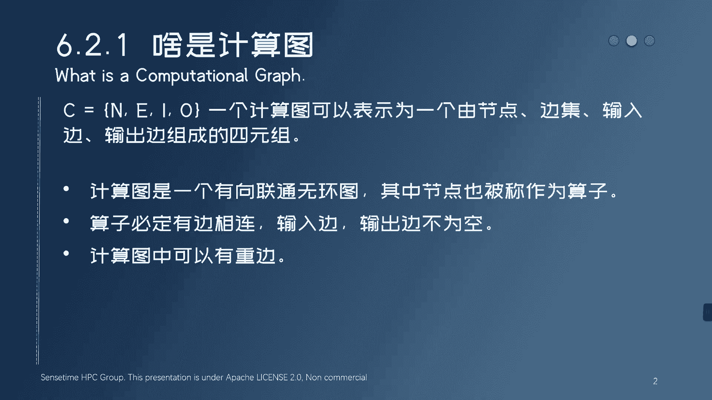

你不要不要不要去弄这种东西出来好吧，然后我们这儿给了一个具体的一个计算图的，例子，就是一部分，然后这里面我们看到这是一个卷积算子，卷积算子下面有很多输出是吧，连到不同的算子上面，这是一个均值石化。

均值石化算子，再用它的输出连到下一个卷积算子上面，然后再去练到什么软路上面，然后这样的话表示你是神经网络的整个，计算过程，然后我这画的红框的这个东西，这个小小方块儿就是一个算子。

那算子呢现在ONIX里面。

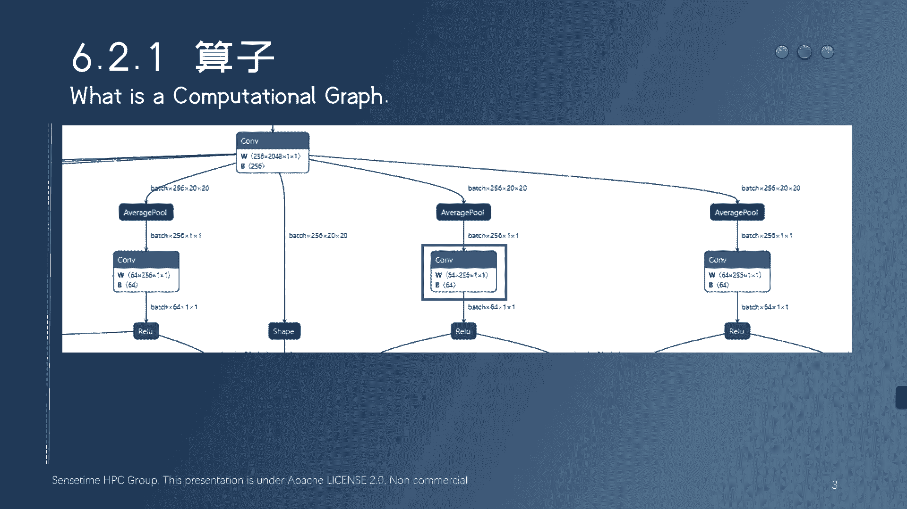

我们现在看到这个是一个ONIX的图，LINUX里面现在支持很多种，然后截止到目前为止，LINUX现在出到了OP赛的15是吧，呃推荐你也不用用这么新啊，像我们现在支持的主要是opp3的11。

然后13的话可能未来会支持，像这些很新的算子呢，其实我们也不太就挺支持，他也挺麻烦的，而且他也未必需要支持，然后整个来讲的话，如果你想看到整个欧尼X的算子定义的话，你可以访问下面这个网站。

那里面非常多非常多非常多，大概现在是160个算子，然后你真正神经网络推理的时候，正常的神经网络里面，大概也就是10~20种算子，10~20种算子用不到那么多，我在这儿再给你看几个真实的网络。

看几个真实网络的例子，那首先我给你看的一个是这个efficient net。

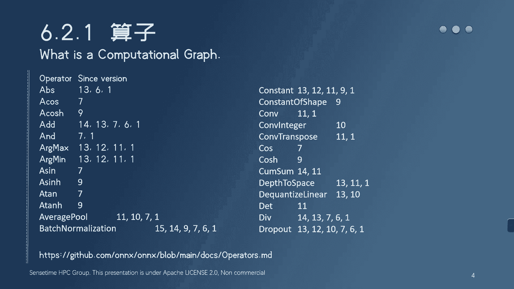

这个东西好像还挺出名的，它是一个分类的网络，那所以它整个的网络挺简单，就是输入进来，然后去做这个卷积，卷积完了去做clip，clip完了再做卷积，卷积完了再做克里普，再做卷积，再做卷积。

然后做一个batch norm，然后在克里普什么什么的，然后这里面你看到这个clip这个东西，实际上就是激活函数，比如六啊，就是六，然后这个batch norm，就是我们手手动加的那个东西。

然后整个东西就是一个卷积，激活卷积，激活卷积卷积，然后batch norm激活大概就这样一个结构，大概很多视觉的网络都是这样结构，就是卷积激活，卷积激活这样的结构下去，然后这里面会有一个经典的结构。

就是shortcut，就是卷积，然后它的结果会往下跟这边卷积的结果相加，然后这边会走一个什么乱七八糟的东西，然后这可能会有一些，这个叫做depth wiz的卷积是吧，看哪个是啊。

这个就是卷这个这个就是depth wiz的卷积啊，因为你看到这个卷积的这个参数里面有个group group，192，它是一个device的卷积，然后这样的话就形成那个很经典的那个。

shortcut的那个那个那个叫什么，这应该是shortcut那个结构是吧，这个东西，然后整个网络就很简单，很规整啊，从头到尾都是这样的，从头到尾就是这样，然后最后就会把这个卷积的结果。

经过这个均值池化，然后删掉一围送到这个矩阵城里面，矩阵乘的话，最后就会输出那个分类的结果，大概是这样，整个网络是非常非常规整的，那这样的网络就很好部署，这样的网络就很好部署，而且它里面你会发现。

它里面其实没有用到特别多算子对吧，它里面用到算子就是com clip ADD，然后get on可能就就最主要就这就这几种，可能这个整个整个网络里面算子不到十种，这是非常好的东西。

然后我们再看一些比较复杂的网络，像这个检测网络是吧，检测网络return net这个东西的话就会麻烦一些，它前面那个backbone跟分类网络差不多，它前面backbone也是一个比较规整的东西。

但是后面的这个到backbone下面是吧，他就要出这个feature了，然后这个feature就会很乱，它就会出就这种检测网络，它这个feature都是这个特征，金字塔是吧，都是这个不同尺度的ten。

不同尺度的特征，所以他这个一下出了十个输出，他这个网络有十个输出，然后每个输出的这个feature的，这个feature map还不一样大，然后这整个东西会送到后面的这个head。

和这个还有什么东西里面去，我也不知道不不做检测，然后送到那些东西里面去做这个检测框的生成，去什么做n ms，然后做什么什么东西，然后这是一种这是一种啊，这是一种就是检测网络后面其实蛮复杂的。

然后我们再看一个这个SSD，然后SSD这个网络就更复杂一些，它的特点是什么，它它特点就是首先他也是个检测网络，然后它这里面他白宫也没啥可说的，白宫大家都差不多，但是它唯一不同的一点就是它把这些后处理。

就刚才说的这些NMS也好啊，包括这个检测框的这个生成也好，它全部用网络的算子表达出来了，这全部用网络分子表达出来了，刚才那个return net，我们从backbone那些那个地方把后面全切了对吧。

那个东西后面是要怎么算的，实际上他后面是不用神经网络算，但一般后面会用一些C加加的代码，或者用一些Python代码直接写，但这个SSE就不一样，它整个东西全部用这个神经网络来算，就全部用torch算。

所以他这个东西导出来是完整的，就整个这个东西导出来是完整的，所以他后面整个这个地方包了所有的后处理，所以他的算子会多得多，然后后面算子也会很奇怪啊，就不是这个卷积或者这种矩阵乘的算子。

而是一些什么加减乘除的算子啊，大部分都在操作shape，然后这这只是一个比较复杂的网络啊，典型的一个比较复杂的网络，然后这种东西的话，就整个的部署能力就会很差啊，就这些东西其实后端不一定会支持。

你会有这么多类型的算子再往上去跑，然后整个网络的输出，最后直接就是检测框，检测光的分数，检测光的类别什么的。

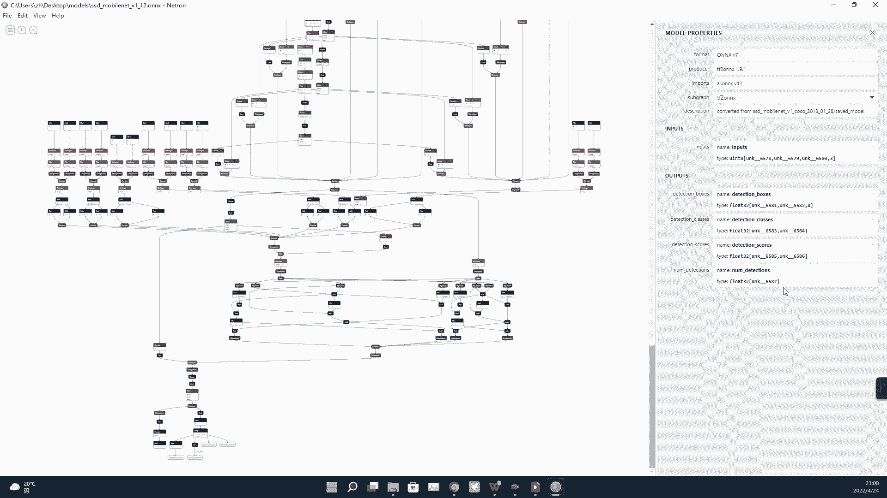

好，那说完了这个神经网络的这个计算图，大概长什么样子，我们就说说这个，再往下说说这个有关算子的事情，就算子在神经网络的这个计算图里面，究竟扮演一个什么样的一个角色，那我们这里要告诉你的是。

算子在我们这个计算图里面，它是一个最小的调度单位，就是说我们的这个计算究竟在哪儿去进行，那比如说一些异构计算的设备，比如说它可以在GPU上进行计算，也可以在CPU上进行计算，然后这种情况下。

我们的神经网络可能会被拆分，会被拆解成很多个部分，可以拆解成各种不同的子图，那这个子图子图之间的界限，都是以算子来作为这个切割点的，这就是说这个算子，它只能被完整的调度到一个设备上去。

只能被完整的调度到CPU上去，那你就全部用CPU算，未完整掉落到GPU上去，那你就全部用GPU算，但是这个算子本身他不能一半被调到CPU上去，一半调度到GPU上去啊，这个不行啊，这个不行。

没有框架这么写，所以对于调度来讲，算子是神经网络调度的最小单位，但很遗憾的是，对于计算来讲，它并不是一个原子的单位，就是说一个复杂的算子，它可以被拆分，可以被拆分成更多奇怪的简单的算子。

就像计算机指令一样，一个复杂的指令，它可以被拆分成微指令，然后挨个发射上去是吧，分子是可以拆的，那下面这个例子，一个这个gm算子这个东西叫做通用矩阵乘，它可以被拆分成一个普通的矩阵乘。

加上一个bias这个东西啊，这不是bias算子，这个东西叫A的算子，就是加法算子，在这意思就是加那个BIOS，它是可以被拆成拆成两个算子的，就是这个gm里面他是既做了矩阵乘，也做了BIOS ADD的。

但是这个at matt mu算子它只做矩阵乘它，所以这个东西它可以被拆开拆成两个，然后还有一些更复杂的算子，像那个什么GRU啊，LSTM啊，像这个NM啊，这种更复杂的算子，它可以被拆成更多的算子。

可以被拆成一个子图都可以都可以，所以对于算子来说，它不是原子的，它不是一个最小的组成单位是吧，它可以被拆分，它甚至可以被同等于域的来替换啊，这些因为ONIX里现在支持160多种算子嘛。

他可以为其他算子来同等的等价态，有等价代换掉都可以是吧，等价代换掉都可以，但你只需要知道对于调度来讲，它是最小单位，它是最小单位，而且我们总是以算子为单位去支持你的网络，就你的网络我支不支持看什么。

看你的算子我支不支持，你要是搞一些特别乱七八糟奇怪的算子，那我就不支持，但如果你的算子都很规整，不论你的网络结构是什么样子的，我总归都会支持，我们总是以算子为单位来支持网络的，所以呢在你网络的部署。

如果你要部署你的网络的时候啊，你要特别注意一点，就是避免使用类型特别奇怪的算子，避免使用那些算子啊，因为那个部署的时候，我们的部署框架也是按算子来支持的，所以他支持的算子总归是有限的。

不可能像欧尼X40的说，我们160多种算子全部支持是吧，然后opp side的一到OPC的15全部支持，你得写多少东西，没有人那么写的，那我就是除非你用ONEXRTIME去去做。

但是onex or onex rtime通常来讲跑的比较慢，所以这这个你自己想好，如果你要部署的话，不要乱用算子，然后，我们再看这个关于算子上面的一些额外的事情，首先第一个要告诉你的就是图融合加速。

也叫算子融合，这个是直接会把很多个算子，融合成一个新的算子，那么举个例子啊，现在我们看到的这个就是MMO，刚才说过了matt mu和BIOS ADD，matt mu和bias AD。

然后这个matt mu呢我们之前也展示过，但现在来讲我们只是展示一个最简单的形式，就是三重循环的矩阵称，然后量化操作我们现在也不放在里面，没有意义，然后这个BIOS ADD就是你可以理解就是这个加八呀。

S或者说就是两个矩阵的相加啊，就是两个矩阵相加，二重循环相加就完了，然后我们再看下一个算子，叫做这个软路，软路的话就更简单了是吧，这个东西就是这个也是二重循环，然后把所有的这个大于零的元素呢。

就都都保留小于零的元素，直接成零就可以了，那我们要做的一件事情是什么，我们要做的一件事情，就是把这三个算子合成一个新的算子，为什么要做这件事情，考虑一下为什么要做这件事情，给你两个原因。

第一个原因就是说在这个子网里面，假设我们有一个子网，就是说他要先算matt mu，再算BIOS，再算人录，这种东西很常见，在网络里面，你刚才看到那个网络里面到处都是这样的东西。

这样的一个子网要执行三个算子，要调几次函数啊，要调一次两次，要调三次函数，我们之前说过，在异构计算的设备上面，在这个GPU上面去做运算，每一个算子启动，你的CPU都要准备去发送整个任务啊。

发送这个算子计算的任务到GPU上去，GPU上起算子的时间其实还不算太短，它其其就是我们说启动KERO的时间是有的，不算太短，那如果给这三给这三个算子合并了，合并成一个新的算子，那我原来启动三次科呢。

我现在只需要启动一次壳能就好了，这个会显著加速，还有一个是什么，你看到这个output，没有这个output，我每次把这个中间结果写回去都要访存，我每次把中间结果写回去都要放存。

在整个这三个算子计算过程中，这个output我要连连续访问三次，我要写入它三次，但实际上这事如果我把它合成一个算子，我可以只写一次就完成，我可以只写一次就完成，我们说在这个小的这个子网里面。

如果我不融合算子，三个算子分别上这个output至少将被写入三次，并且启动三个算子的速度呢也不是很快，但是如果我给它合并，首先这个output，包括一些这个这个这个像这种input的这种读。

这时间肯定是要至少读三次的，但是融合了之后，他可能只用读一次，这可能是这个是可以发生的，我们看到这里面向你展示了，如果是三个算子串行的去执行，每个算子都会有自己的一个任务发射的阶段啊。

就是说这个CPU发任务到GPU的阶段E阶段，然后每个算子都会有自己的一个读数据的阶段，R阶段每个算子都会有自己的一个计算阶段，C阶段，每个算子都会有自己的一个写数据的阶段，就W阶段。

每个算子执行至少这四个阶段你得用啊，至少这四个阶段你得跑，那对于这个matt mu来讲，它的计算阶段肯定长一些，对于biss AD这种东西来讲，它的计算阶段其实还不如他的RW阶段长。

就是他读写数据的时间其实更更多，我们称这种算子叫IO密集型，叫仿存密集型的算子，它的计算时间其实不不长，但它要要干嘛，要发射任务，要读，要写数据，这些数这些时间是挺长的，比它计算时间要长。

这种东西叫仿存密集型的算子，软弱也是一个仿存密集型的算子，它的计算时间也很短，那这个是不合算的情况下，它是这样的啊，对于matt mu这个算子是吧，我们首先把它的写入删了。

把它然后为BIOS ADD这个算子，我们把它的发射删了，我们把他的read删了，我们把他的这个write也删了，然后把RELUT这个这两个东西也删了，最后保留的是谁，就是matt mu的发射啊。

MATT的发射matt mu的毒是吧，然后把这三个computing的过程合在一起，然后最后写入一次，这就是算子融合加速所干的事情，最后得到一个新算子会是这样的形式，这个emission是吧。

对应的这儿的emission，然后这个read对应的这是read，然后这个computing，对应的这个这个这个这三个computing相加，然后最后写入一次完事啊，减少了保存。

减少了这个emission overhead，所以这个东西会加速非常多啊，所以这个东西会加速非常多，那怎么来做，很简单啊，我们新写一个算子啊，那我这也叫他matt mu啊。

然后把这个bias s直接当参数先传进来啊，然后跟根据我们上次学到那个东西，我们这定义一个叫accumulator的东西，叫累加器，然后呢整个计算我全部这个accumulator，你也知道在哪是吧。

他在他在它在计算器里啊，它在计算器里，它不是内存，然后这个clatter呢直接去加这些东西啊，直接中间去加这些东西，然后到最后的时候，首先我accumulator加bias。

完成这个bias AD的操作，而且这个东西是在哪加的，是在计算器里加的，是在计算器里加的啊，整个这个加法在这个这个phi pherator，现在在计算器里的，然后呢再去做这个reload操作。

就是判判这个是否大于零，如果大于零的话，就取这个啊，否则的话取零，那你还是知道这个东西也是在，整个是在计算器里操作的，那就是说我把所有的这个缓存，就对这个结果的访存，原来三次，现在只压缩到了一次。

现在全部压缩到一次，然后包括这个read嗯，因为我整个算子现在所有的东西都在里面了，对吧，那这个东西相当于input the white bias output，也至多只访存一次是吧，至多只放。

但这个中间可可能会有多次访存，那个无所谓，这个我大概意思就是说告诉你说，这个input white和bias，它的仿存和它的它的它的读取和它的写入，都被压缩到了尽可能少的程度。

这就是算子融合加速所带来的优势，这个东西向你解释了计算图里面，我们为什么要做图优化，我们为什么要融合算子，那么接下来我会向你展示一些我们常见的，算子融合的一些party，算子融合的一些方式。

包括现在所讲述的这个matt mu加VAS加软路，这种是非常常见的，还有一些乱七八糟的一些融合，实际上我们在计算图里面做的图优化会非常多，会非常非常多，而且呢不同框架做的图优化呢也不太一样。

但是我这儿向您展示的就是一些比较通用的好，我们接下来就看一下这个常见的一些图优化的，一些一些操作，就是下面我们列了五个最常见的图优化嗯，第一个就是奇偶函数的融合，就是com软路可以融成新的算子。

第二个就是batch norm和dropout的移除，就com batch norm这两个东西可以合并，变成一个新的com，第三个常量折叠啊，就是一些这个常量可以提前算好常量加法，常量乘法。

乘量除法这种东西可以提前算好，然后矩阵乘的融合主要是两个相邻的，中间没有激活函数的矩阵乘呃，是可以合并的，就可以合并成一个新的矩阵城，然后最后一个combat的融合，这个东西会稍微复杂一些。

然后我们现在就逐一的来向你解释，这五种最常见的图融合究竟在干什么，首先这个激活函数的融合，你可以看到对于激活函数的融合来讲，它是一个就是需要两个算子，第一个算子是计算的算子，就computing OP。

第二个算子是激活函数啊，Activation，那康这个computing OP的话，可以是cf，可以是这个反卷积，也可以是这个矩阵乘这个东西就是linear是吧，然后这三种都可以，然后其他的其实也就是。

只要是矩阵乘的计算是吧，都基本上都可以，还有像那种像啊，比如说你自己搞一个算子是吧，只要支持的话都是可以的，就只要它里边是个矩阵乘的运算，然后激活函数的话，常见的就是软路clip，clip就是软路六。

然后这个P软路还有tan h sigmoid的switch，那你说你弄一个特别奇怪的激活函数，比如说我们见到一个叫soft plus的一个激活函数，那你说这个东西它值不支持融合，首先从计算角度来说呢。

肯定都是支持的，就是肯定能写出来，但是框架支不支持呢，另外一回事是吧，我们有没有写这代码呢，不知道，所以你还是确保你的激活函数是常见的，它才好融，不然你激活函数弄一个特别怪的，它其实融不了啊。

就不知道怎么融，然后融合的方案呢，就是把这两个算子融成一个新的算子，融合的方法呢之前也提到过了，就是算这个output的时候，前面多加一个激活函数就行，这样的话整个计算是在内存中。

不是整个计算是在计算器里面进行的，就不会多那一步写仿存的一个过程，然后，我们就往下，然后下一个例子是这个computing OP，跟bedroom的融合。

那computing opp还是刚才那些任何东西都可以，那后面如果紧连紧紧接着有一个batch norm的话，这两个东西可以合并形成一个新，就是这个backroom。

可以直接折叠到这个computer OP里面去，就是这个backroom直接就删掉了，就没有了，那这个地方我们的计算算子，不论你是什么东西啊，最终它可以写成这样矩阵乘的形式啊，Y等于WX加B啊。

嗯比如说你你如果是个卷积，你你你这个时候你很奇怪，他为什么可以被矩阵成表示是吧，嗯你可以上网百度一下，这个都有的，就是它可以是矩阵乘算出来的，没问题，就是这个卷积核会被会被展开成。

一个这个这个这个矩阵矩阵的形式，这是可以的，然后你写成这个形式之后呢，这个batch norm，相应的也会有一个具体的一个矩阵形式，那大概是这样，就是这个首先里面做归一化，然后外面去拉扯一下就就好了。

就白TERNOON干的就是这样的一个事情，就这个伽马mean war，还有贝塔，就是一个就是一个数，就是一个常量，就是一个数，那所以要合并的时候怎么来合并，那你看到我们这儿已经写好了。

这个计算算子做的是这个，然后BEATROOM的话，在这个计算的基础上，这个Y写这了是吧，然后再做一个这个东西，那你很简单，你把这个东西带进去是吧，把这个式子带进去，带进去会得到下面这个会得到下面这个。

然后怎么做，给他全部展开啊，给他全部展开，然后形式呢还原成上面这个计算算子的形式，就还是个矩阵乘加的形式啊，那你看到得到新的这个white就得到新的权重是吧，然后得到新的BIOS。

那为什么这个东西可以是white，那就是说这个诸葛前面这东西是常量是吧，就相当于对原来的white做了一下缩放，那为什么这个东西可以是新的BIOS，因为这些东西也都是常量，就这些东西都是常量。

所以这个东西也就是相当于对原来的那个BIOS，做点做点线性变换就结束了，然后这个东西会算出一个新的W，算出一个新的B是吧，那这个东西就是新的那个，不论你是什么computing OP啊。

就是新的那个新的那个computing OP的权重，跟那个BIOS就写回去就行了，然后BATOM这个层直接就删掉了，大概就是这样的一个过程啊，然后后面的话我们用代码来展示一下，就这个东西怎么删的。

就还是啊那个东西，batch norm里边四个参数先读出来，我这儿写的alpha beta min war是跟前面那个都不，跟前面这个伽马伽马，mean瓦尔贝塔。

这个基本上对应的就是只只不过他这写的伽马，我那写的是alpha是吧，一样的，先读出来，然后如果前面这个东西是cf的话，就就对他的W做一些乱七八糟的处理，就成称一下这个scale。

scale是是这个SQUE是这个，然后再去对他的BIOS做一些这个处理是吧，然后然后就就就做完了就做完了，然后如果是你是这个gym的话，也是就是对这个哦，这里面JM还有个穿4B的时间，你可以先不理这行。

然后就是也是对外侧去做一下处理，然后对vs s做一下处理就完了，然后这个后面这个by term直接删了就可以了，这就是BEATOM的融合，然后第三种就是这个常量折叠，这种东西呢比较少。

就你网络里边出现这个东西的可能性不高，但是它也会有，那是什么意思呢，就是比如说你是两个相邻的这个加法算子，然后每个都是加一，都是加个常量，然后这东西那你很简单，你就知道这俩东西可以融成一个加二嘛。

就两就是X加一再加一，那就相当于X加二，就这么一个简单的道理是吧，就是如果你这里面有四则运算，加减乘除，只要加的加减乘除都是常量，那你这一串运算是可以被合并的，也可以把这个算子的数量减少。

那我们有一个具体的例子，就是说如果你是先加一再乘二，这东西能不能和额不能合啊，不一定能合，就是如果你是先加一再乘二的话，这东西合成合出来之后是这样，是X乘22，那这东西就是说你你看到这个形式。

虽然这个东西计算上是可以可以去合并的是吧，但是你把它写成算子的形式，他还是要先做个乘二，再加个二，就是他还是需要两个算子来完成，因为我们没有一个算子能够能够乘2+2是吧，没有没有这样的一个算子。

所以呢这个常量折叠呢未必什么事都能做，就看你折叠完那个东西，能不能用一个完整的算子来表示啊，嗯但是有些框架像TVM那种，它可以自动生成算子，它可能真的给你搞一个这个乘2+2算子出来，也是可以的。

不过这个地方你就大概理解了，就是常量，就你这种加1+1的这种东西啊，有可能他是可以折叠的，有可能它是可以折叠的，就看后端框架做不做了，而且你网络里面通常来讲也不会出现这种，特别多这样的东西是吧。

你可以大概知道有这么个东西就行，然后就是矩阵乘融合，矩阵乘融合要求的是两个相邻的计算算子啊，两个相邻的计算算子中间是不能有任何东西的，不能有激活函数啊，在这种情况下怎么来融合，也是我们把它写开。

这第一个矩阵乘的算子写成这个样子，第二个矩阵的矩阵乘的算子写成这个样子，那我这说的矩阵乘可不一定是gm嘛，就com也可以写成矩阵乘的形式，一样的，就融合起来都是一样的，然后融合之后怎么来做。

你把这个东西也是展开啊，把这个Y是吧带进去，把这个上面这个式子带到下式里面，然后成这个样子，然后你是不是还要把它还原成原来这个，WX加B的形式啊，那你把它展开呗，展开就可以。

就大概你就明白它发生什么事情了，就是新的W就是这个W21W1，就这两个矩阵相乘会形成成新的W，然后新的BIOS是谁，就是W2乘以BIOS one，然后再加上BIOS two。

就这个东西会成为新的BIOS，然后你可以把这个东西写到新的矩阵里面去，然后把后面这个删掉就可以了，把后面这个删掉就可以，就是相邻的矩阵乘是可以合并的，相邻的矩阵乘是可以合并的，相邻的卷积也是可以合并的。

这中间如果没有任何计换函数的话，然后这也是给你看一下代码，但我这给你看到的代码是分解，是倒是逆过程，是一个矩阵乘或者一个卷积，怎么被拆分成两个，那是也很简单啊，就是我拿到这个gm的W之后。

我要对它做什么，对它做SVD分解，对它做SVD分解，然后分成两个新的权重，一个A1个B，那这两个新的权重就就就自然而然的，就是先先乘一下A，再乘一下B就跟乘W的效果是一样的，那所以我就拆成了两个矩阵。

第一个矩阵的权重是A，第二个矩阵的权重是B，那BIOS加在谁身上，这BISS加在B身上就可以了，就原来这个gm的BIOS加在B身上就可以了，就这样的话就完成了一个逆过程。

那原来那个刚才那个过程是一个合并的过程啊，这两个过程其实就是完全可逆的，就怎么正着过来也行，倒着过去也行，这个都可以，都可以出于你的这个目的，至于你各种各样的目的啊，这个东西都可以拆。

就是只要你中间没有激活函数啊，这个矩阵乘可以无限的合并，也可以无限的拆都可以，然后第五种最后一种就是这个com跟at的融合，com跟AD的融合呢很特殊，就是这个时候呢它的PARTON是不固定的。

就是他首先要一个convolution放在这，要一个A的算子，放在CONUTION的后面，然后艾特算子，艾特算子是个二元算子是吧，他前面还有一个运算，还有一个运算量，还有一个操作数。

那这个操作数可以是任何东西嗯，可以是任何东西，这基本上可以是任何东西，但就不能是康复自己啊，这基本上可以是任何东西，那是怎么办呢，你先我们也是把它展开啊，就com写成这个形式，注意这com给我。

我写的可是矩阵乘的形式，这矩阵乘也是一样的，这边是个gm也是一样的，就这个东西我写成这个形式，然后那个any的话我不知道他怎么算的，我就写个Y2，然后这里面的Y最后等于Y12Y2对吧。

然后我也是给他展开，这个Y可以展开成W1X1加上Y2比一是吧，然后我把它打个括号，你就明白了，这个东西是不是又还原成了矩阵乘的形式，最新的这个黄色部分成为他新的BIOS。

新的黄色部分成为他新的BIOS啊，它可以省那个拔下S的那一次访存，大概是这意思啊，然后可能也会少，其中一个坑呢，就是合完之后就会变成，就这个A的算子就被删掉了，那个AD的算子的功能。

被这个COV的那个BIOS i代替了，大概是这样一个意思好吧，这是常见的五种图优化，那你现在是不是觉得你现在这个学学学懂了，然后又可以了是吧，那就是来做题啊，就你检检验一下自己学的到底对不对啊。

我们这儿有三个例子，三个图，然后你可以在这停下来，然后截屏，然后对着我这个图来做去，来来来，用刚才说的五种图优化来优化，然后看看最后这个图优化完了是什么样的结果，第一个图是这个，第二个图是这样的。

哟第三个图没存，那你就先做这两个吧，好那我们来看这个图是怎么来优化的啊，首先我看这笔能不能写哦，都是蓝色的嗯，我们来看这个图是怎么优化的，然后选一个颜色。

首先这个com b n这两个东西显然是白给的是吧，然后这两个东西可以合成一个，那他会合成一个新的康复，在这会出现一个新的康复，然后你会发现一件事情啊，这个com合了之后，是不是它下面还是一个BN。

就这俩东西是不是又能融合，这就是一个屠龙河里面，一个非常常见又恶心的事情啊，就是他可以递归，它可以递归，它可以递归到融到不能再溶，所以这个东西又可以融合，我换一个颜色的笔，我换一个颜色的笔。

就是融完第一次之后呢，这东西它可以融，第二次我们换一个蓝色的哦，这蓝色背景是蓝色，不好意思，我换个紫色的，这熔之后呢，他可以再融第二次，这俩这几个东西又可以接着融，第二次，那再融完之后呢。

他是不是又会形成一个新的康复，那它它是不是又跟下面那个软路又可以用，那我再换一个这个粉色的笔，颜色太相近了，换个红色的，是不是这四个东西又能再再再融一次啊，那咔咔咔这样一融，融完了之后会形成一个什么。

是不是input，这边就会有一个叫做com软路的东西对吧，然后这儿会有个ADD，然后这个input再再过来再过来一下，然后这个东西又出现了什么，这个com软路是吧。

他是不是能跟这个东西来做combat的融合，这com软路也是CP啊啊，那是不是这边就是那个所谓的any啊，这边就是安妮，这边就是com这个东西就是any，那这个融完之后长什么样子。

就是抗美原路这个东西会直接拉下去，会直接拉下去，会直接拉下去变成什么样子，变成input，然后这个com软路在下面，它起到了那个ADD的作用啊，然后这个input在这进来，这个input在这再进来。

但这个东西是作为bias进来的，这个东西是作为input进来的，这地方不一样，但是融完之后，整个这个右边这一片是吧，整个右边这一片全部融成了一个算子，就是这个康复热度离谱吧，离谱，我们全部退回去啊。

NN哦，我怎么在这个图层上画的，那我能不能退回去，我们全部退回去，然后再看剩下那部分是怎么融的，还真能退回去吗，那退不回去了嗯，退不回去，我就稍微擦一下吧，大家不要学习这个操作啊。

啊这个操作会有点问题啊，我把它擦掉，好我把它擦掉之后呢，我们再看剩下这边是怎么融的，那我们先来个绿色的，就是哎你看到这个两个我没有诶，有颜色太深了，我看到这边这两个是不是又是一个很熟悉的，Pn。

叫做连续的卷积，中间没有几个函数，所以他俩可以融泰尔，融完之后会形成一个新的com，那现在这边的图的样子就变成下面一个com，这边有一条线，底下是个软路，然后这有一条线，然后你有个问题啊。

这两个东西能不能融，这个com跟这个软路能不能融，答案是不可以的，为什么，因为这个com是不是双输入，双输出的，它不是只有一个连到软路的数据的，他另外一边是要做别的事情的，那这个是容不了的。

这个是融不了的，就你想嘛它融了之后，它融了之后，它它变成抗复软路了，那那那那这边这个数据怎么办呢，这边这个数据他要的可是康复，不做不做软路的数据啊，所以这个东西这个软路实际上是容不了的，融不了的。

那这个东西这会变成一个com对吧，那下面这个软路会被保留，然后你会发现这是不是有这个ADD这个ADD，那又可以干你一个事情，就是看不软弱，看不ADD融合，那所以这边还可以继续融合，那我们就画一下。

最后融合出来是什么样子，也是我们把这边擦掉啧，然后把这边擦掉，然后画笔尺寸五，我们看一下这个完整容出来是什么样子，拿黑色画试试，首先上面是个input啊，然后左边这一大片是吧，刚才说了。

就这个东西会融成一个完整算子，那这个东西就是那个抗污染路，然后input对它是有两次输入的，一次作为X是吧，一次作为bias，然后这个东西的输出，它下面是一个完整的康复对吧。

然后这个com下面有个人录指路，下面又是一个com，注意这个ADD被干掉了，这个ADD被干掉了，然后这个com直接连到下面这个com，做输出就结束了，这个图最后融完是这样，看看剩几个算子。

原来这个图里面一个算子，两个算子，三个算子，四个算子，五个算子，六个算子，七个算子，八个算子，九个算子，十个算子对吧，融完之后，一个算子，两个算子，三个算子，四个算子算完了。

那你想想这个东西可以加速多少对吧，这就是图融合他会挺复杂的，尤其这种对于这种很复杂的结构，它它可以各种融合规则掺在一块，然后可以递归的融合，它会挺复杂的，这个例子里面呢会出现很多。

刚才没有介绍过的容图啊，包括什么呢，包括你看到这个com pad哦，画笔没有，不好意思，切一个画笔出来，我玩这个，把这个选区还得选掉好，那这个里面会出现很多刚才没介绍过的东西。

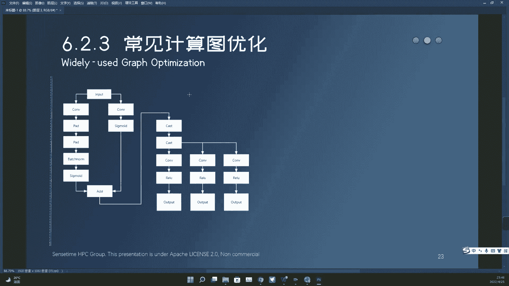

一个是这COMPA这个东西是可以融的，因为什么呢，因为我们这个卷积，如果你写的是torch那个卷积的话，这个torch的com2D是吧，convolution to d这个东西是有一个叫做pad的东西。

就你可以设置它的pad等于几等于K吧，比如说就实际上下面这个pad算子的功能，是可以由上面这个com算子来代表的啊，来表示的，所以呢这两个东西可以融，融完之后呢，这个pad那个参数直接写在这。

直接写这上面就可以了，直接写到这个com上面就可以了，就下面这个不好意思，我的就下面这个pad会被干掉，那同样的这个融完之后，是不是还可以递归的往下扔，把下面这个pad再干掉是吧。

这两个pad的参数全部往，全部往那个com上写就可以了，所以这两个东西都可以合，就无条件直接合掉就可以了，所以这样合完之后，这样会变成一个com，然后接着去跟下面这个batch norm就合是吧。

其实去跟他合，合完之后变成变成什么还是个康复啊，然后再跟这个东西合，那就变成了康复SMOID的是吧，那这边合完之后也是个康复SMOID的，然后最后变成这有个ADD对吧，这有个ADD，那就又干嘛了。

又开始就是看外的融合，然后你会问一个问题，就这两边都是com，那到底谁拉下去是吧，谁拉下去有规则啊，但是我现在不向你介绍那个规则，就是说我你可以假设就是随便拉一个下去，就可以随便拉一个下去。

就可以拉一个下去，然后在这变成com，然后删掉删掉，比如说我们把这边这个分支直接删掉，这就是融合的过程，这边就左边就融合完了，然后这儿又出现一个你没见过的融合，叫做cast，Cast。

融合就是cast这个东西，这个东西是转数据结构用的，不是转数据类型用的，就是你那个就是比如说你有个tensor是吧，你有一个tensor，他是这个1234，就你有个tensor是这个东西。

那你tensor点float是吧，就是把这个东西转成float了，这个东西会触发这个算子啊，就是触发这个cast的算子，这个东西就是就干这个用的好了，就干这个用的，所以这儿会有一个很有意思的问题。

就是你这点一次float，你再点一次，比如说点个int，那其实你这个东西它会触发两个算子对吧，他先你先点一次float，再点一次int，它会触发两个算子，但是这两个东西其实是没有意义的，为什么。

因为反正你都要转int了是吧，你直接一次性转过去不就完了吗，你把第一个这个cast删掉就可以了，所以这两个相邻的cast，通常来讲也是可以融合的，有些情况下不能融啊，有些情况下不能融。

但我们这举的例子就是就是让你融的，就告诉你有这么个龙图，然后你会发现这要告诉你一个很特殊的溶图，就是这种情况看到吗，这个cast下面三个分支就三个卷积，要的是一样的输入。

我们这儿假设这三个卷积是同样的kernel size，同样的参数啊，那这三个卷积可以横向融合，可以横向融合，就他不用算三次，他一次可以算出来，这样是可以加速的。

就如果说这三个东西的这个这个这个parameter，是一样的，就是kernel size啊，什么delight and点带那个叫叫什么叫什么，就那个那个那个那个空洞，什么空洞卷积那个参数还有什么。

还有什么这个padding啊，都是一样的，那这三个卷积是可以横向直接融掉的，横向直接扔掉，那相应的这个软路下面这东西将来看我，我我先告诉你它会是什么样子，我先告诉你它会是什么样子，就如果横向融了之后。

中间是要加算子的，所以这个软路最后是融不掉的，来我们来看这个东西熔完是什么样子，哦我这退不回去是吧。

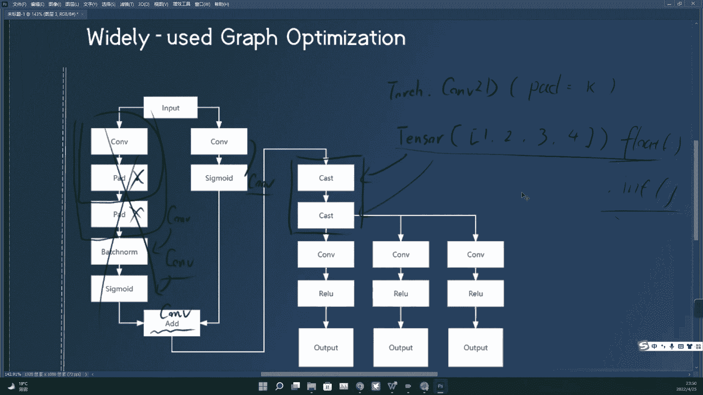

但我这新建了个图层，所以我可以把它一次全点掉啊，那我们看这个东西融完是什么样子，我这回拿白色写，首先这边是input，input的下来刚才说了，这边是个卷积，叫COVSIGMOIDCONSIG吧。

我觉得先简简简简单一点，这边也是个CONFIG，然后底下是个ADD，然后这就有一个情况，就是这两个东西可以拉一个下去，把这个get干掉，那我比如说我拉我拉这边这个，那就会变成，算了他这个撤销先撤这边的。

先撤这边的，就就我把这边的这个拉下来，那就会变成这样是吧，就就融融融好了就融化了，那这个这个图左侧这部分是吧，这个图左侧这部分就融好了，然后右侧这部分开始融，就他这部分刚才说了。

这俩cast是直接融掉的，这俩cast直接融掉，那就剩一个cast，然后底下这就会出一个很牛逼的事情，就是它会变成一个大卷积，这个大卷积画个黑色的啊，就代表了这整个一堆啊，这是这个大卷积。

然后这个大点击要干件什么事情呢，你底下是不是只要一部分，结果就这个软路，是不是只需要那个大卷积里面的一部分结果，那怎么做呢，拆了做slides，就这个slides就是从中取元素。

是可以加这三个算子上去的，然后后面跟着一个热度，所以这个这个东西人完是这样的，好问题来了几个算子。

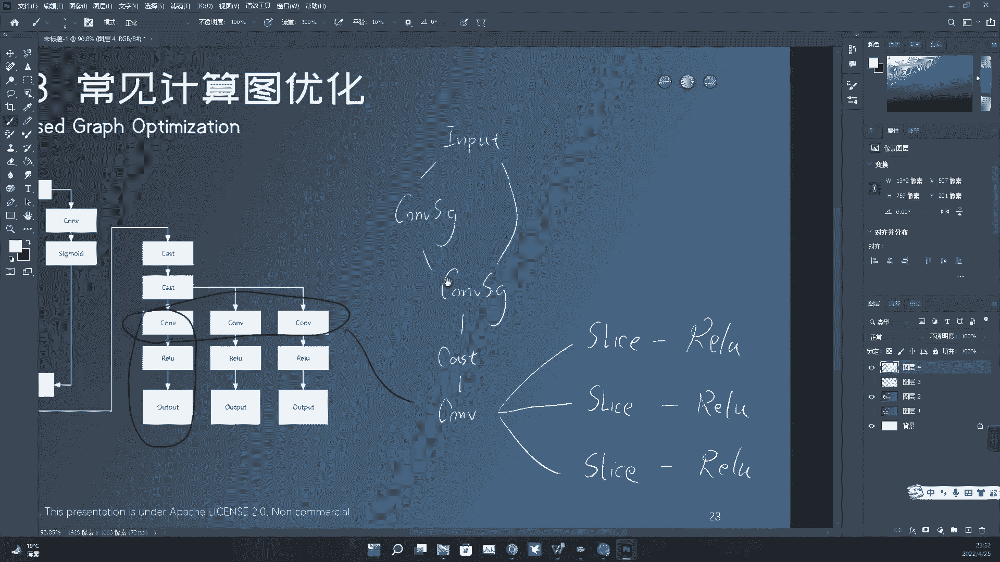

原来一个两个三个四个五个六个，七个八个。

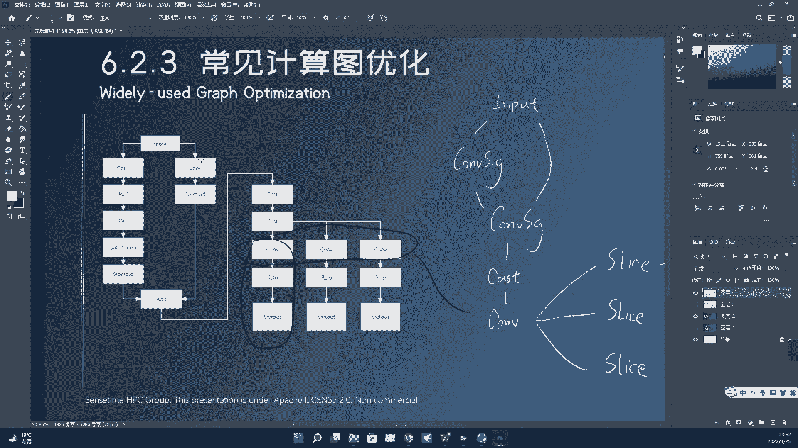

九个十个，十一十二十三十四十五十六十六个算子融完，我们剩下几个算子，一个两个三个四个五个六个，七个八个九个十个，融完剩十个，原来就16个算子，融到剩十个，减了将近一半是，当然这你看到我现在是选择。

是把这个横向卷积融了，那如果我不溶这个横向卷积，它实际上这个软路是可以融的，它可能算的数量更少，那这种时候就会有一个权衡问题，就是到底谁先谁后，那谁先谁后，融出来结果不一样，所以这个东西也很麻烦啊。

所以这个东西也很麻烦，但整体来讲，整个这两个例子主要想告诉你两件事情，一件就是硬件上有各种各样的图融合，每个硬件不一样，另外一件事情就是这个图融合，彼此之间是可以递归的。

所以它的规则实际上比你想的要复杂得多，不是我们刚才仅仅介绍那五种是吧，你以为你就学会了，实际上这个东西递归起来。

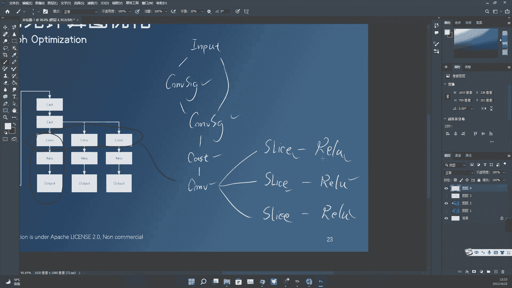

然后他顺序里面再倒腾闹腾，你是很难预测他是什么情况的，你已经看到了，在具体的问题上，这个图优化其实是可以很复杂的，就他里面可以递归的，不停的乱七八糟去执行，然后整个过程呢又互相的去纠缠在一起。

他这几个矩阵，它这几个图优化是可以交交替的进行的是吧嗯，所以它最后你的这个计算图优化到最后，它可能跟原来的样子非常不一样，非常非常不一样，那我们做量化，首先呢，你是不是希望得到的是那个优化之后的图。

因为你拿那个优化之前的图去做呢，他跟最后的样子，其实他跟优化完的样子是很不一样的，你在那个图上做量化是有问题的，但是呢出于另外一些考虑啊，就是我们想这样一件事情。

我们有这个convolution跟activation的融合，有这个计算算子跟激活函数的融合，那这个东西融完出来那个东西叫com，叫看我软路也好，这个东西ONIX是表示不了的。

但是没有一个中立的格式可以表示的，那所以这种东西我们实际上是不太好融的，因为融完之后，这个图就固定属于我这个后端平台的，就别的后端平台已经不认识了，明白这个意思，所以呢如果你想打造一个跨平台的一个工具。

那你很显然你不能真的去融这些东西，因为你融了之后，其他平台不认识了，当然当然你这个平台你自己有很多后端，你可以这样做，但是PPQ不是这样的一个东西啊，就是作为量化工具来讲。

我们是要支持多种不同的计算平台，多种不同的这个框架的，所以我们通常最后还是用ONIX，用一个中立的格式来导出我们的模型，那在这种情况下呢，注定了我们是不能够去真正的去融一些party的。

就如果说你融完那个盘，融完这个算子之后，他根本是ONIX表示不了的，那我们是不能做这个溶图的，就不能在图这个级别上真的给你融了，所以我们要做另外一件操作，就做另外一件事情，就是我们要改量化的参数。

没有改量化方案，我们改完量化方案之后，能够适配你融完之后的那个情况，这是怎么做到的，你可以看看下面这个图，我首先要向你介绍的就是这个TQC啊，Tensor quantanization config。

这个东西叫做张量量化配置信息，这个是PPQ里面核心的一个抽象，或者叫核心的一个数据结构，它描述了一个数据流是怎样被量化的，我们这举的一个简单的例子就是卷积，这个卷积算子在ONIX里面它有三个输入。

有一个输出对吧，一个这个东西就是X这个东西就是权重，这个东西就是bias，然后这个东西就是他的输出，那我们要量化这个东西的时候，PPQ会做这样一件事情，会跟其他量化框架是完全不同的。

那就是我们要对它每一个输入，对每一个输出初始化，一个TQC初始化这样一个控制结构体，注意啊，这个控制结构体是绑定在operation上面的，是绑定在这个康复上面的，然后每一个输入都有一个每一个输入。

都有一个每一个输出，也有一个有了这个东西，我们才能够做后面的就是在不去熔图的情况下，模拟你熔图的一个量化情况，我们来看怎么做，在具体进入到怎么做之前呢，你先首先看一下这个T和C里面，大概包含了什么信息。

首先第一个叫做policy这个东西描述的量化方案，在之前的课程中，你也知道了这个policy大概是什么东西，就是量描述你这个量化是不是对称的，是不是线性的，是不是powerful to的。

是不是PRETENNEL的，大概描述这个东西，这这里边是个位图，然后这个number of face，那当然就是这个量化点，它有多少个量化位宽，然后这个scale和offset这两个东西是量化的信息。

这是量化的参数，就如果你是对称的话，那你知道这个scale就是一个啊尺度因子是吧，如果你是这个非对称的话，那这个offset就是那个偏移量，然后如果你是powerful to的话。

那我们这也是用尺度因子来表示那个shift，用来表示那个shift，因为我们这个尺度因子是个浮点的，所以你那个R的某次幂是吧，我可以用浮点来表示出来，然后这个state这个叫量化状态。

QQ里现在有12种量化状态，我们待会会看到这个量化状态，究竟在干一件什么事情，首先不是所有量化状态都是激活，都都是激活的，这只只只有几种是激活状态啊，然后这个rounding是描述这个量化对齐的方案。

不是这个量化取整的方案，七种是吧，七七选一，然后quantum max这个东西就是截断值，截断值，然后这个最牛逼的东西叫father config，就是父子链接，它是一个并查集好，我们这儿举个例子。

就是对于com跟batch norm的联合定点啊，或者说这com和BATOM这个东西，你现在知道如果这两个东西串在一起，它是要融，它是要融图的对吧，这两个东西融图之后，实际上这个BATOM就没了。

那我们如果不做这个熔图，我们能不能改它的定定点信息啊，就改这个QC来实现，哎我这个量化不会错，因为我现在情况这个量化是会有问题的，为什么我在com的输出端，我是不是做了一次量化。

我在bathroom的输入端，我是不是又做了一次量化，那你思考这样一个问题，如果我融了图之后，是不是这个BATTERNUMBER直接没了呀，那直接没了，你中间这次量化是不是一次多余的量化。

会改变数值的内容对吧，会改变你的数值内容啊，就这次量化会导致结果直接不对，会导致跟硬件上的执行结果直接对不上，所以这两次量化是要关闭的，那为什么要把它他俩关闭。

首先关闭back room的输入的原因是什么，因为输入已经被量化了，就这个地方我作为输入的时候，等它上一个算子的输出已经被量化的时候，那这个是我我下一个算子的输入，自然而然的就要关闭掉对吧。

因为上一个算子已经量化过了，那我这没必要对他做二次处理，然后我们做的所谓的另外一件事情是什么，我们有一个东西，你还记得这个东西叫父子父子链接，那我们的下就是下游的这个量化信息的。

复的的的这个父子链接要指向上游，说明一件什么事情，就是下游的量化信息被上游覆盖了，下游的信息被上游覆盖了，好那我们下面做这个com跟BBATTERNOON的融图，我们现在这还是有量化的。

那这个量化会导致结果错误，那怎么办呢，也是我们考虑到com跟better ternoon要做融合，所以这个时候输出是不做量化的，它是个中间结果，那我们也是把它停用掉，然后建立负责链接，练到他身上去练到。

但是我的输出身上去，你可以停下来，先想一下这是为什么，为什么他要被链接到这就这个地方的变化，为什么要留着，为什么要留着，因为很简单，如果这两个东西融合了，如果这两个东西融合了。

那新的com的输出是不是就是这个broom的输出，数值上就是这样的，所以新的com做量化的时候，也就相当于在现在这个图上，对BEATOM的输出做量化思考，清楚，这件事情。

我们只需要把中间的两个中间结果的量化关闭，就可以了，当然这里面复制链接你得建立好下一个例子，com跟activation的融合，那跟刚才的东西很类似，也是找清楚，如果这两个东西融合了。

那中间这个东西实际上在硬件上都是寄存器里，算的是个中间结果是int32的，不需要量化，只有在软路的结果，这需要量化，所以中间东西直接停了，就可以把父子链接建立好，下一个关于max puling这种东西。

之前提过叫做被动算子，被动算子有什么特殊的地方，就是它是不改变量化参数的，被动算子不改变量化参数，如果你还嗯，如果你还记得倍速算子有哪些是吧，Reshape next pulling。

还有什么resize，还有什么padding啊，这些东西都是被动算子啊，还有克里夫也是全是被动算子，这些东西不改变量化参数，所以这些算子的前后量化信息全部停用啊，全部停用，然后向哪覆盖，向上覆盖。

向他上一个算子覆盖，向上生成这个节点的复制链接，然后你可以思考一下，这样做对不对啊，为什么可以这样做，然后下面来个麻烦的，多数是算子如何来去调整这个量化信息，首先对于多数数算子来讲。

你是不是还记得一件事情，对于这个加法算子之前跟你提到过了，这个加法算子要求什么input，两个input的定点信息要完全一致，还记得这件事情是吧，那怎么来做，怎么去靠操作这个QC这个结构体。

或者叫TQC这个结构体来去保证它完全一致，很简单，首先找其中一个，它是有规则找的，但我现在不向你介绍这个具体的规则，找其中一个输入的点信息啊，把它当做主定点信息覆盖另外一个。

那此时另外一个的状态现在可不是灰的啊，灰的的意思就是不激活，就是这个这个这个东西直接被省略，这个地方定点直接被省略，但现在我给你写了个别的颜色，橙色是吧，意味着什么，就是他是他是一个slave的状态。

或者叫从属的状态，但它是激活的，就是说你运算器运算到这儿的时候，他要做这次定点，但是这个东西的所有的量化要听谁的，要听这个绿色的，要听他的父亲，要听他的父亲的，要要去从他的父亲那取得量化参数。

来做他的量化，对于A的算子，我们要做的是找其中一个定点信息，当做主定点信息，把另外一个定点信息当做从定点或者叫奴隶，定点或者叫什么被这anyway，反正就是嗯就是就是子定点信息，好吧啊。

这个叫负定点信息，这个叫子定点信息，简单一点啊，那这个子定点信息，它的量化参数要全部从负定点信息上找，他在做量化的时候要从这里取参数，然后去做他的电话，但这两个都是激活的，然后做完这个事情之后呢。

你别忘了把这个把他上面算子的上游，算子的这个量化信息关闭，为什么同一个数据流上是吧，只需要一个量化信息就够了，同一个数据流上只需要一个量化信息就够了，不需要量化两次，而且你量化两次，我简简单的例子。

比如说你这起开了电话，开了这个，把这个QC开了，然后他的量化参数还跟下面这个AD还不一样，这个也是执行不了的，硬件上是不能这么执行的，明白这意思吧，就直接把上面这个也覆盖掉了，对ADD来讲就是这样，好。

那么再看，这个是ADD，那还有另外一个多输入算子是谁，是contact contact，不仅是多输入算子，还是被动量化算子，所以他怎么做，你看到中间这四个东西全部被覆盖掉了，全部被谁覆盖。

被output，被contact的output覆盖，就contact output怎么定点，前面四个就怎么定点，前面四个就怎么定点，明白这意思，然后他也只从计算角度来看，也只需要在最后这个地方。

最后定点一次就可以了，就中间这个东西都没有意义，有些情况很特殊，就比如说这个康复不仅有下面一个啊，不仅有下面一个contact作为它的输出，就下游算子它可能还有一个，还有一个输。

就是他的这个结果可能还被另外一个算子用了，那这个时候你这缺缺量化是不对的，是不是嗯，那个时候PQ会把这个量化打开，但是他的电话定点信息是共享域，是是被这个东西共享的，而且如果一半被覆盖。

你就明白那个并查集是什么意义，一旦被覆盖，连着这个负定点信息会一起覆盖，我们待会会给你举一个很很好的例子，来告诉你这个什么叫做并查集的大规模覆盖，然后我们来看看Y的这种东西更麻烦。

我们说写ADD前面有两个com啊，这个时候combat的融合，这个com这个ADD会被直接删除，这个com会挪到下面来，然后去去把他把他的BIOS做成嗯，对应的那个形式是吧，那这个东西怎么融嗯。

你大概看一眼吧，我就不去解释了，就这个这个东西，首先把这个ADD，因为ADD当然直接没了嘛，ADD这个中间这堆东西当然就就就删，就关掉了是吧，就关掉了，然后最后只需要在ADD的后面去去做一下。

定点就可以了啊，然后这边这个com跟他没有关系，跟他没有关系，因为这个combat的融合是拿一边的com下来啊，拿一边的看不下来，在这儿代替这个ADD，然后跟另外一边没啥关系。

OK那我们最后就来给你举一个麻烦的例子。

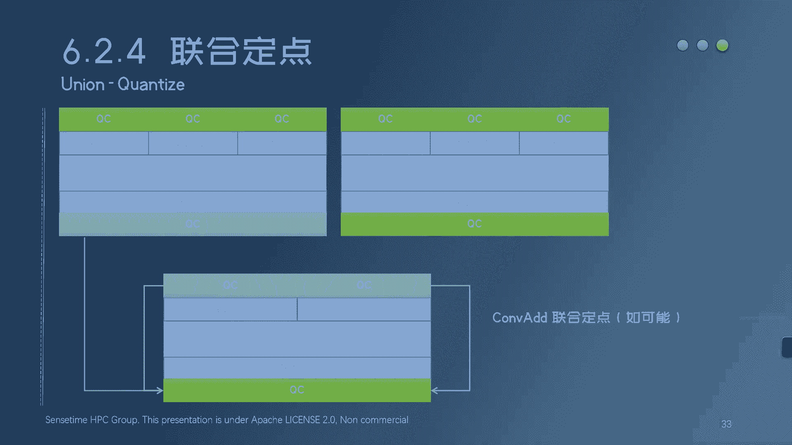

下面这个图同样的也是一堆算子，但我们这就是把PPQ里面的这个，量化定点信息引入进来了，他会更复杂，然后我现在问你的是，就是我们现在又在这个图上做这四种融合，在这种规则下面，这个图应该怎么来做。

联合定点应该怎么来做，联合定点就是哪些量化信息要关，哪些量化信息，要开它们的父子连接情况是怎么样的，然后我告诉你答案，所有的画灰色的点内定点信息都会被关闭，所有画灰色定点信息都会被关闭。

所有的画蓝色定点信息都是主动激活定点信息，这个画黄色的，它是一个负责链接中的子定点，它激活了，但是它是共享别人的量化参数，然后共享情况是这样的，好吧，那你在这你也可以稍微停几秒是吧。

然后截图自己思考一下，为什么是这样的，所有的这个父子链接我都给你画出来了，就这个箭头可能你也看不太清，反正就是啊这个东西被连接到他身上去了，然后这个东西往下链接，然后这些东西怎么怎么折腾。

然后最后一个这个有个蓝色箭头，是从这边到这边，你可以停几秒，然后大概想一下为什么是这样的，然后我们来解释它为什么是这样的一个过程，首先呢我们先看这个蓝色的这个虚线箭头啊，这个东西就是最简单的一种融合。

就是什么呢，一旦这个上游的量化信息有，那下游的这个量化信息就可以省略了对吧，一旦上游已经量化好了，下游的量化信息可以省略，所以呢先把所有的下，所有下游的这个就输入的量化信息全关掉，这个关掉这个关掉这个。

关掉这个关掉这个也关掉是吧，以下关掉五个，12345关掉五个对吧，只要你上游做了量化了，就上面这算子做好量化了，下边这个输入就可以不量化了，就没有意义好那这是第一个。

那第二个你看好第二个就跟熔图有关了啊，那就是什么，就是因为因为这个com跟半出动融了是吧，那所以这个这个com的定点是可以关掉的，没有意义啊，就直接引到下面去了。

那这个come back norm融了之后，是不是他要跟接着跟这个软路融，那这个BETRM的这个输出也没有意义，也是弄到下面去了，然后这儿你就明白一个问题，为什么他是并查集，我现在问你这个东西。

他的负定点信息是谁，你是不是要沿着这个诶，沿着这个这个虚线一直往上走啊，啊这不用往上走了，走一下再走一下就回顾就到这儿了是吧，就是这个地因为我们有递归容图啊，所以这个父子链接也是一个层级的父子连接。

它不是一层就完了，它不是一层就完了，它是一个树形的结构，但是呢我们也要满足一个要求，就是你这一片是吧，他只能有一个主定点信息，就是这一片他得有个主心骨啊，就它它虽然是个数的形式，但数总归只有一个根。

我们只关心那个根是谁，我们不关心这个数据结构怎么连，怎么怎么怎么串，怎么怎么建立起来的，这个没不是很有意义，所以呢在这种情况下，我们会选择用并查集来存这个数父子链接对吧，我只需要关心这个东西。

最后我我要它量化参数对吧，那这个量化参数是不是要从他的父亲，或者说他的主定点信去哪拿，那主定点信息是谁，要通过并查集来找运察机的根是谁，它就它的中心点信息就是谁，那所以这一片是吧。

然后这边也是com跟com融涂了，所以这个东西直接引下去，然后com跟软路融图了，这个东西直接引下去，然后这边com跟软路融图了，这个东西直接引下去好，那下面这个东这俩东西特别麻烦啊。

两个contact，两个contact，然后我这话的意思就是这边做一个contact，这边做一个contact，然后这个东西你发现了这个软路，同时输出连在这两个contact上啊，我是这个意思。

然后这边啊这边过来，这种情况下会出现所谓的大规模的递归定点啊，递归联合定点，就是这个东西会出现真正这个并差集会，并查集会合并，就是两个两个这个量化组会合并，怎么合并呢。

首先这个contact我们都不多说了，之前说过这个东西联合定点时候应该怎么做，就先把这两个拉下来是吧，把这两个拉下来，然后下面这个再往再往这个output上拉，然后唯一要出问题的是哪儿。

是这个QC要被拉两次，要被这边拉一次，要被这边拉一次，就是说它先去隶属于这边的主顶点信息，再去隶属于这边的主顶点信息是吧，那在这种情况下，因为我们的主定点信息是是是是并查集存的，那在这种情况下。

在拉第二次的时候，并查集会合并，并查集未合并，这个就是为什么它是并查集啊，就在这种情况下，如果你不触不触发这个并查集合并的话，这个地方是有问题的，是会出错的，合并了之后会怎么样，合并了之后。

两个主定点信息就会把力就就两个，就就两个两个这个量化组是吧，两个量化组，第一个量化组这边啊，他有一个主定点信息，第二个量化组这边他有另外一个主定点信息啊，就分别是下边这两那两个量化组。

合并两个主定点信息就要建立，就是两个主定点信息之间要建立父子关系啊，也要把另外一个主定点信息，弄成这个slave的模式，或者叫弄成这个从属的模式，但是它是激活的，它是激活的，并查组就是量化组的合并。

合并完了之后，在并查在在主定点信息之间建立父子链接，然后把把其中，把剩下的一些就选举一个成为主定理信息，剩下的那些就是全部都是slave，这个就是大规模融合的时候会触发的一件事情，好吧。

那这个就是我们要向你介绍的PPPQ中的，对复杂图融合的时候的一些细节的处理，你可能还需要一段时间来消化，然后具体的情况，你可以查看BQ里面的代码是吧，然后看一看这个东西到底是怎么融的，它还是挺麻烦的。

我们最后想告诉你一件事情，就是我们为什么要做图融合，我们为什么要在量化框架里面来模拟图融合，用有很麻烦的一个方法，用一个很复杂的一个规则去模拟硬件图融合，首先硬件做的重融合，他为了什么，他为了快。

它为了执行起来能快，那我们模拟硬件，我们图了，我们为了什么，我们为了我们的量化参数能够选对，我们的优化能够符合硬件的标准，就我们的算法最后算出来结果是对的，我们现在有很多很多的量化算法。

像这个什么and round也好，爱QU也好，包括什么后面提的这些bro，这些算法我先不讨论它有没有用，虽然我觉得基本上都没什么太大用处，嗯我先不讨论它的算法上是不是对的算法，对不对，首先你的模拟要对。

就首先你的量化参数你得算对，你要是算的跟那个量硬件，算的结果都完全不一样了，你说你这个算法，它怎么可能能够优化你那个网络呢，这是很核心的一个问题，就是量化工具你要写一个对的量化工具。

你要写一个就是你的算法能用，首先你的模拟要对，就不论这条路有多难多复杂，你都要做，否则你的这些算法是没有意义的，后面所做的一切优化没有任何意义，而且你也看到了我们所介绍的这些东西，在硬件上。

这个容图对量化带来的影响是非常复杂的，不是简简单单的，就是我在所有的这个com后面，就插一个这个什么什么这个什么fake point point，这种东西是吧，或者说我就是简简单单单。

我也不管这个图融合，我就全部定点了，你算出来的数是会差很多的，你算出来的数跟硬件上真实的结果会差很多的，那这个误差我们是要想办法要避免的，这就是我们设计这套工具的，一个最根本就是一个最初始的想法。

也就是说，为什么我们要把这个东西设计的成这个样子，就是当时要考，当时就考虑了这些因素。

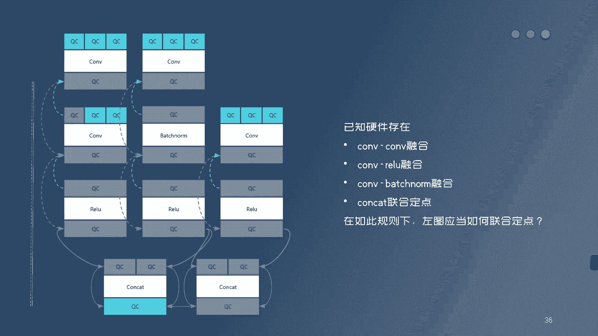

所以呢我也希望你再去做这些量化部署的时候，来好好的思考一下，你的硬件上到底有多么复杂的一套执行逻辑，有特有多么复杂的一些细节问题，结合我们之前的内容，硬件上有不同的rounding，有不同。

有不同的量化的policy，然后有不同的图融合，对于不同的算子呢，还有不同的执行方式，我建议你这些都考虑清楚，你再考虑考虑这个东西，你在这个硬件平台上做量化它算法，你的算法去怎么选择对吧。

算法只是最后一步了，你前面这堆模拟，但凡有一个环节差了事，但凡有一个环节你做的不对，你后面的算法都是白搭，没有意义的好，那本次内容基本上到此结束，如果你有任何的这个疑问，你可以加入我们的这个微信群。

加入我们的QQ群来。