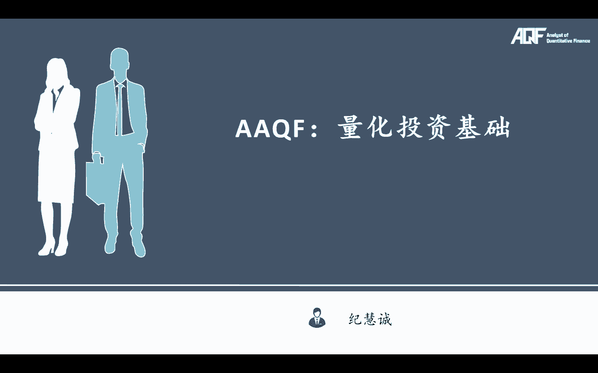
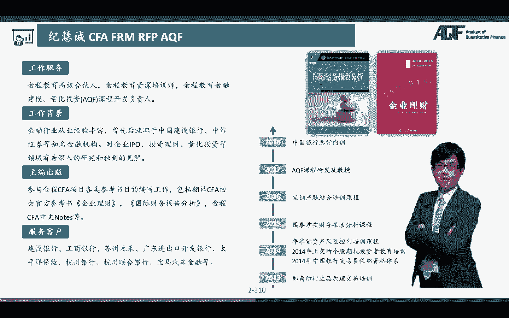
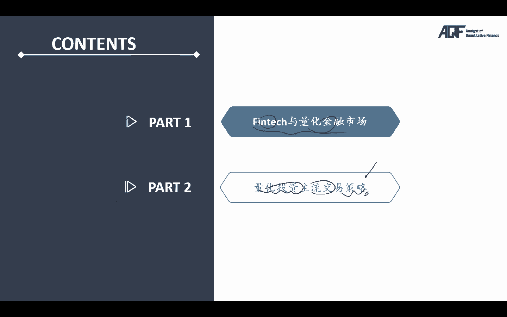
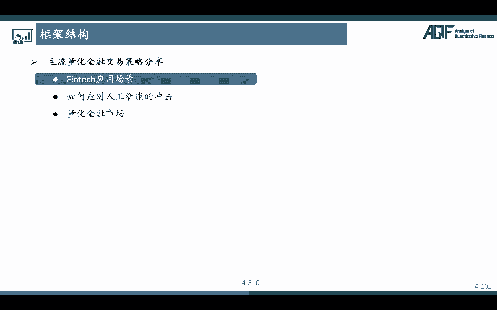

# 2024年金融大神老师讲解量化金融分析师.AQF—量化金融基础知识（完整版课程） - P13：《+威❤hhh427501  了解获取全套课程》02.1人工智能算法原理 - 量化沿前 - BV1ar421K7Mo

好啊，各位同学大家好，那么今天开始的话，那我们正式来开始跟大家讲，我们的量化投资基础啊，那么上一节课的话呢，我们是跟大家介绍了我们整体的那个课程框架，那么从课程框架上啊，大家其实也可以看出来。

我们今年的话对于这个EQF，aa cf的这个课程的更新体力度啊，其实是额比较大的对吧，特别是aa craft的这个层面啊，所以我们是更新了非常大量的新的，全新的一些策略，策略思路的一些交易类型啊。

所以基本上我们是把市面上嗯，绝大多数可能会用到的，涉及到的一些交易策略的一些理论思想啊。

这个都会在这个PPT里面来去跟大家讲好，那么接下来我们就正式来看我们的这个诶。

这个具体的内容啊，那么呃我们这个PPT的话呢分成两个部分，第一个部分的话，那我会介绍一下，FINTECH和量化金融的整体的一个市场，那么这部分内容相对来说比较少啊。

我们简单就会跟大家过一过FTT可以用来干嘛，量化金融市场是做什么的对吧，那呃这个PPT的一个核心重点，就是目前量化投资市场的一些主流的，一些交易策略，包括这些策略的那些原理，当然了。

不是我们所有的策略会跟大家用代码实现啊，那么有些策略我们会实现，有些策略的话，那我们会跟他啊讲解一些思路啊，当然大家如果感兴趣的话呢。

在自己学完了过程以后啊，你完全是有能力自己去实现这些交易策略的哦。

那么接下来的话呢我们就来看一下第一个部分，第一个部分的话呢。

就是我们的一个FINTECH与量化金融市场，那首先我们来看一下量化分FTG具体有一些呃，什么样的一些应用场景啊，咳咳，那么在额真实讲我们的这个FINTECH的应用场景，之前啊，我想先跟大家说一下。

我们有一个概念叫做AI对吧，人工智能，咳咳这个这个artificial intelligence，那么额这个里面的话呢，那为什么要跟大家讲AI呢，因为很简单，讲人工智能的一个原因。

就是因为我们这一呃a cf的整个课程里面，今年大幅更新的话呢，我们会加入大量的那种机器学习啊，啊我们的一些人工智能的这个，新新型的一些交易策略啊，那在我们这个里面都会有所啊涉及，所以的话呢对我们来说。

整个课程的一个重点和特色，也是机器学习这一块啊，大家可以看到啊，在2017年，早在2017年，我们就已经把machine learning的一些技术，运用于我们的一些finance啊。

这个我们可以说是行业里面比较前列的，就是用一些最新技术来在呃，用于我们金融行业的啊，我们早在17年后面，CFA啊，协会才在后面这几年才嗯也就最近两年吧，他才把啊这个机器学习啊等等，加入到他们的那个啊。

我们的那个这个这个CFA的那个课程，教育里面对吧，但是AQF的话呢，其实很早就已经把啊machine learning啊这一块啊，这列为我们的一个重点的一个内容，所以啊对我们来说啊。

很多同学可能还不知道什么是人工智能呃，什么是机器学习，所以我今天啊先来教给大家，我们一些人工智能方面的一些算法，经典算法，那么有了这些经典算法的基础的概念以后啊，我们在讲交易策略也好。

我们在讲各种思想的时候，大家就可以更好的去理解了，那么今天的话呢我们先会跟大家讲解，我们的机器学习里面主要的三大类型的策略，第一个的话呢第一种类型叫做啊监督学习对吧，监督式学习。

Supervised learning，还有一个的话呢叫做无监督学习，Unsupervised learning，还有第三大块的算法的话呢，啊把它叫做深度学习模式呃，deep learning啊。

这三个的话呢是我们人工智能里面，目前最主要的三大算法好，那么我们一个个来看，先来看一下每个算法的背后的一些，主要的一些呃思路是用来干嘛的，首先第一个我们来看一下什么是监督学习呢。

大家注意监督学习相比较于其他的学额算法，最大的一个区别就是我们有两个特，一个叫做features，还有一个的话呢叫做labor的一个数据，也就是说对我们来说啊，我们会额。

每一个都会有我们的这样的一个features，features的话，那我们把它叫做什么呢，我们把它叫做特征，通过特征啊，我们来给具体的那个数据来去进行一个label，来把它进行一个打标签，打标签的话呢。

就是我们把各种各样的数据，可能是分成圈圈的啊，或者说分成是三角形的，完了之后的话呢，对我们来说，我们要找到的就是一个最优的，这样的一个决策平面，那么这个角色平面是可以干嘛呢。

是可以把我这里的圈圈和我这里的三角形，做一个比较好的这样的一个分类，当然了，算法里面还有一种算还和回归啊，那这两个的话呢，是哎，我们都呃会涉及到监督学习里面的一些内容啊，啊分类和我们的一个回归。

那么嗯具体的那些啊，我们会到时候再讲解我们的监督学习，机器学习这个模块的时候，会来继续跟大家讲，那么刚刚开始的话呢，大家就简单了解一下，算法的一个非常重要的一个核心，就可以帮助我们去做这样的一个分类。

嗯是嗯嗯数据的一个分类，这个分类之后有个什么样的好处呢，比如说我们有了这样的一个分类之后，有了这样一个决策边界之后，我们呢有了这样一个问号，这个问号的话呢可能是一个新的数据，New data。

那新数据进来了之后，因为我们已经做好了分类，我大概就可以知道这里的这个新数据，是到底属于我这里的圆圈呢，还是属于我们这里的怎么样三角形对吧好，那么这么讲可能有些抽象啊，举些例子，比如说啊。

大家可能都用过一些啊听歌的软件对吧，这个通过人工智能啊，算法来推荐歌曲的鼻祖就是网易云音乐，对不对，好，那么我们会发现啊，网易云音乐，它可以把它数据库里面的海量的歌曲，给它不同的特征，对不对。

那么这些特征的话呢，我们可以自己去分，比如说我们可以根据歌曲的流派，它是爵士啊还是流行音乐啊对吧，然后呢就根据这个歌曲的一个节奏，节奏是快啊还是慢啊，对吧好，那么他啊。

我们在这里就举举一些简单最简单的例子，我们有两个特征对吧，当然这个特征可以有很多个啊，那这个这个当然你也不能特别特别多的哈，理论上来说他是可以这个这个非常非常多的，但是你数据特征多了。

可能会有一些这个这个问题啊，就是啊他会有一些这种过拟合啊等等，这些，我们到时候会在具体讲算法的时候来跟大家说，我们在这里的话呢就来取最最简单的，假如说我们有这两个特征。

那么我可以一个就是根据不同的流派来分，还有一个的话呢是根据不同的节奏来分，那节奏快的时候有一些有一些歌曲，节奏慢的时候有一些歌曲，那么他把这些歌曲啊，通过这两个不同的特征，划分成了不同的类型的歌曲。

那么大家会发现我们在用网易云音乐的时候，有个什么样的一个特点，喜欢的话呢我们可以点往右滑，不喜欢的话呢我们可以往左滑，对，那么对我们来说啊，这个我们可能划了很多都是我们比较喜欢的。

当然也划了一些我们是不喜欢的，那么这个时候的话呢，这个算法就会去看哎我们喜欢的这些歌曲，它背后的特点有些什么特征，对不对，那么他会不断的去印证这个特征，你所喜欢的这个歌曲啊，是不是这个这个诶。

这个这个嗯是什么样的一个类型的对吧，那么随着我们听的歌越来越多，我们所喜欢或者说我们所讨厌的，这个给它的算法，也就是说给这个算法的这些数据足够多了以后，那么这个时候你会发现网易云音乐的这个算法。

给我们推荐的歌曲，你会发现越来越符合我们的这样一些品味，对这其实背后就是这样一套，他把我的歌曲，通过这两个特征分成了不同的类型，然后呢，这个算法大概就可以知道，哪些歌曲类型是属于这里一个圈圈的。

我们是比较喜欢的，哪些歌曲类型的话呢，是这里属于大叉的，我们的这个用户可能不太喜欢，那么当有一首新的歌再进来的时候，他可能就会知道诶，我这种歌可能是在这一个类型，这个类型更有可能会获得。

我们的一个用户的喜欢，所以这也是为什么我们会发现我们网易云音乐，我们使用的时间长了以后啊，他给我们推荐的歌曲是不是越来越准确了对吧，哎这个就是我们机器学习里面的这种算法呃，用于这种分类的这样一个问题。

那有同学就说了，姜老师，那这个分类的这个问题呃，那在我们金融里面有什么作用呢，哎在我们金融里面，哎你不要小看这个，那对我们来说，我们在做金融，我们在做量化的时候，我们是不是要就要去预测我们的个。

股票的一个涨跌啊，对不对，哎那在我们这个里面，也就是说，我们同样可以找到各种各样股票的一些特征，比如说这个特征可以是技术面的特征，可以是诶基本面的特征等等等等，我呢通过找到股票stocks里面。

各种各样的这些怎么样features这些特征，那么我让他让他做一个什么事情啊，就是我是不是也要让他去做一个分类，那么当我们有一个新的股票，有这样一个新的数据进来了之后，我就会让他说诶。

诶让我的这个算法判断一下，它更有可能是会怎么样上涨，还是更有可能会怎么样下跌，对不对，所以对我们来说，我们就可以去做多那些，我们预测只有有极大的概率会上涨的股票，我们去做空那些。

我们认为有极大的可能会下跌的股票，没问题吧，哎这个是不是就是我这里的监督学习的，这个在我们金融领域，或者说咱们量化领域的非常典型的一些算法，对不对好，那么接下来再来看我们的第二大类型的算法。

第二大类型的算法，我们把它叫做无监督学习，无监督学习，注意它跟监督学习最大的一个区别是，他没有futures，也没有所谓的那些labors对吧，那么它是让什么呢。

它是让这个算法自己去发现数据与数据之间的，有没有什么内在的这样的一个联系，或者说有没有内在的这样的一个规律，听明白唉，让他们，比如说他给到我们的就是两组这样的一个，原始的一个数据。

然后呢通过我们的一些非监督学习的一些算法，它可以自己就知道哎，我们把它分成了这两个醋类对吧，clustering这两个不同的醋略类完了之后的话呢，当我们有一个新的数据知道进来了之后。

我自己就可以大概知道我是属于这一类，还是属于怎么样这一类，对不对，所以无监督学习啊，其实也是在做一个分类的这样一些问题，只不过它不是像我之前我给定理特征，通过这个特征我让你去进行分类。

它更多的是让你自己去发现这些数据背后的，这样一些规律，没问题吧，那么无监督学习在我们哪，哪个地方会用的比较多呢，因为我们在后面啊，我们专门有一个在AKF2级当中啊，我们专门会有一个量化风控的一个模块。

在量化风控里面，其实某就会涉及到大量的无监督学习的，一个算法，就是我要去看一下你会不会违约，比如说我想去看某一个人，他将来违约的一个可能性有多高，那么对我来说的话呢，我们有海量的一些数据之后。

我们就可以看到在历史上有哪些嗯，这些违哪些人的特点，唉我有一些违约人的一些数据，我有很一些怎么这个这个呃，正常还款人的一些数据，那么自然而然他就会把这两类人，是不是划分成这两个醋类啊对吧。

所以当我们过来了之后，当有一个新的new data进来了之后，我大概就可以知道在满足省哪一些特点的时候，诶，就比如说这一轮，他更有可能会有一个这样的一个default，这样一个可能性对吧，那这些的话呢。

都是我们让我们的算法自己去发现，我们背后的一些数据啊，他有跟我们最终的这个结果之间，有什么样的一个内在的一个关系，没问题吧，好当然这种无监督学习的话呢，在我们做量化投资里面也不是不能用啊。

啊只是我们可能用的会稍微来比较少一些，如果我们一定要在量化领域用的话，我们就可以让算法自己去学习，看看哪些股票它有上涨的特征，哪些股票它有下跌的特征，当我有下跌的一些内在联系，对不对，完了之后的话呢。

当有一个新的股票来了之后，给我让他去发现一下，我更有可能是在哪一个处里面，哪一个特点里面的好，那么这是无监督学习类里面的一个点啊，它其实在我们量化风控里面会用的比较多好。

那么接着再来看一个第三大类型的算法，这个叫做深度学习，那么深度学习的话呢，它相对来说就更为强大了啊，它强大了很多，或者说他算法所使用的这个场景，所实现的那个目标，就要比我们的嗯这个这个一些嗯。

其他的一些算法要好得多对吧，比如说在这个里面，我们用深度学习的算法，可以去拟合出特朗普的这样一个讲话，呃的一个声音，然后的话呢我们完全可以额，Thank you。

I'm very happy to meet you here，It's a great thing to build a better world with。

Artificial intelligence，Ai first，共创智慧新动能，共享开放新时代，世界机器人大会呵，大家可以看到啊，这个这个声音啊，完全是fake的啊，完全是假的哈。

就像特朗普说fake news一样啊，那在我们这个里面的话呢，其实呃我们也可以是呃，通过这种深度学习的那个算法，拟合出各种各样我们想实现的那个结果对吧，所以我们也可以看到现在AI的头像互换啊。

这些声音的那些呃，这个这个拟合啊，这其实都是背后通过的这个算法好，那么这个算法非常强大，一般我们可以怎么用呢，大家注意啊，深度学习的话呢有这样几个概念。

首先第一个的话呢我们把它叫做做input layer，这个的话呢我们把它叫做输入层好，还有一个的话呢就是第三大块，这个里面啊叫做output layer，output layer的话呢。

这个叫做输出层好，那么还有一些的话呢，在当中这个里面这些的话，那我们就把它叫做隐藏层，好，隐藏层是用来干嘛的啊，这些我们先具体不展开啊，这个到时候我们在讲机器学习的算法的时候，我们都会啊再来去跟大家讲。

隐藏层数的越多的话呢，其实这个算法的啊这个能力啊，各方面的就会越高，对吧好，那么对于我们来说，这个深度学习的这个算法我简单跟大家说啊，什么意思，我们已知了这些是output以后啊。

我们就可以不断的去调整，隐藏层里面的那些东西，让我给你输入以后，给了这个输入以后，他让让他的这个output的更好的去拟合，我们想要得到的一个什么哎结果，那么对于我们来说。

这个算法最大的最核心的厉害的一个地方，就是它有这里面的不同，不同的那个隐藏成最终给我们的一个结果，就是只要怎么样，你给我一些历史数据，给我历史数据的input，给我历史数据的output。

然后的话呢它就可以让只要让这些数据的输入，最终得到这些数据的一个什么，最终的一个结果听明白哎，那么在我们这个例子里面，就有点像，比如说我最终的那个结果，我就想是啊。

拟合出特朗普的这个trump的这个讲话的那个声音，对不对，好，那么当然我要给他大量的那些输入的那些数据，最终让它拟合出top啊，trump的这个声音，那这个模型的话呢就是这样的一个点呃。

它我们在训练它的时候，我们在呃这个学习的时候就是这样一个好，那么接下来的话呢，当我们有一句新的话想要说的时候，我们只要给他一句新的一个input data，通过这个模型，因为他已经训练好，学习好了对吧。

他给我们出来的是不是这里的这个top啊，就是像前面我们刚刚看到了，trump的这个讲话的那个声音啊，没问题吧，包括很多人脸识别啊等等啊，其实用到的很多的那个技术啊，都有我们这里的深度学习的这个啊背景啊。

所以大家可以看在我们这个里面我们说了，深度学习的算法，就是通过输入海量的标注过的一些数据，训练算法去识别数据和结果之间的一个关系，直到我算法中的参数毕竟真实，最终帮助我们做出预测。

也就是说最终我会其实过程当中，我会大量的去调整，实时调整这里的这个参数，最终要实现的就是我要想得到的那个结果对吧，哎那这个结果我们得到了，OK那这个时候我们参数是不是就可以定下来。

当我们有一个新的数据进来了之后，我们就可以得到这个这个嗯，最终我们想要的这个结果了，好，那么这个呃深度学习的这个算法，在我们金融行业啊，finance行业有个神庙有什么样的一个作用呢，有很多啊。

不让它有没有学过我们的一个option，定价的一个工具，期权定价，期权定价的话呢，我们学过一个模型叫做BSM模型对吧，black shots model model b s模型里面啊，我们有三大啊。

五个输入变量分别就是我的股票价格，我的执行价格，我的波动率，我的到期期限和我的无风险收益，所以对我们来说，只要你给我这五个数据，我代入到BSM的模型当中的话。

