# 程序化交易 监管新规 - P1 - 老湾python量化交易 - BV1i1421r7Qs

2023年9月，沪深津三大交易所发布了加强程序化管理通知，之后，前几天端午节的最后的交日，三大交易所要发布了一份程序化交易，监管细则的中文文件，这份文件的内容非常强势，对程序化交易的方方面面进行了规定。

由于细则内容相当多，因此这边帮大家梳理了这份监管。

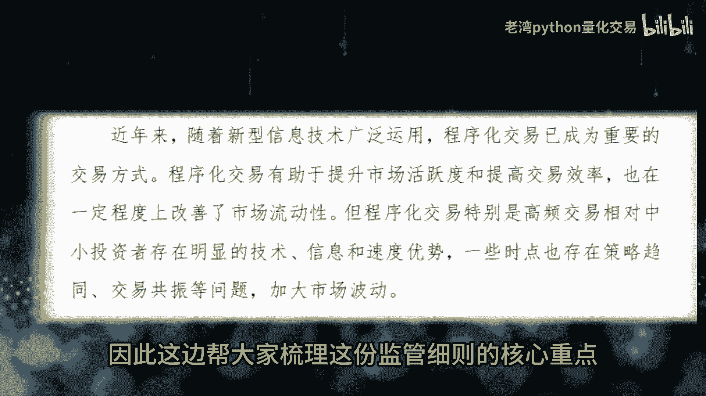

细则的核心重点，本次监管系者主要是对高频交易进行整改，相对于我们这一大A市场的小卡米考品交易，无论是在技术或者是信息或者是速度上，都存在明显的优势，另外高频交易在一些时点上也存在策略趋同。

交易共振等问题，加大了市场的波动，因此监管系者绝大部分存在，定义并规范高频交易，搭建，普通量化交易者，跟机构主力在量化交易上的差距，主打一个公平，公平还是他妈的公平，对于不了解量化交易的朋友来说。

量化交易就是躲在计算机背后的黑客。

他们都有个计算能力超强，网速极快的超级计算机，靠着技术优势啥也不必做，就给狠狠割一波韭菜，但实际上，量化交易只是帮助投资实现自动化交易的工具，量化交易可以是印钞机，也可能是税操机。

无论是机构主力或者是小散，如果没有好的交易策略，量化交易都不会影响你亏钱啊，既然自动化交易只是个工具，建议各位同学把量化交易的格局放大一点，涉底的量化交易策略，包括但不限于A股。

CCTA外汇或者是某个神秘的市场，底层，都是Python写的交易策略。

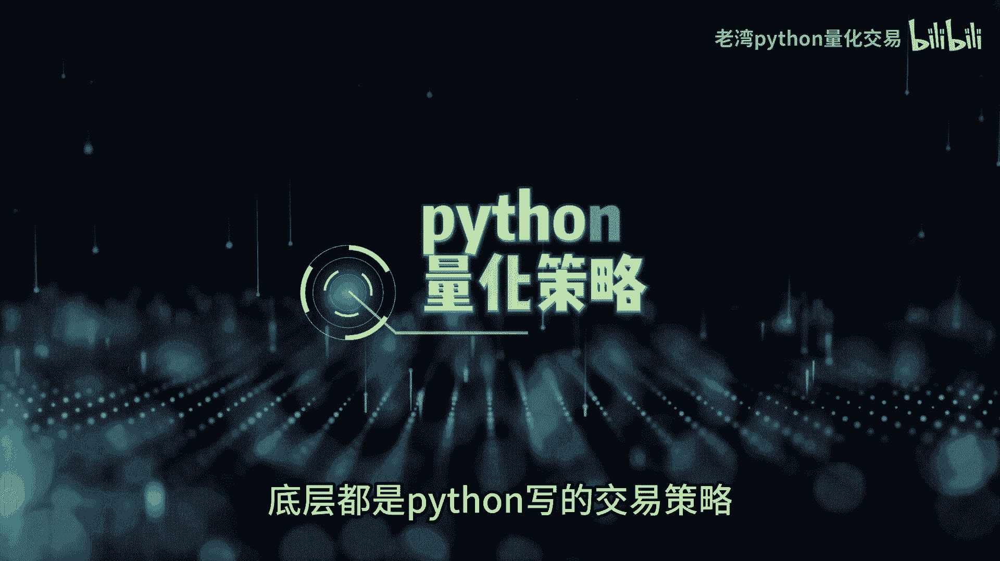

一套车顶换一个行情接口，或者是瞎谈接口就可以跨市场运作策略。

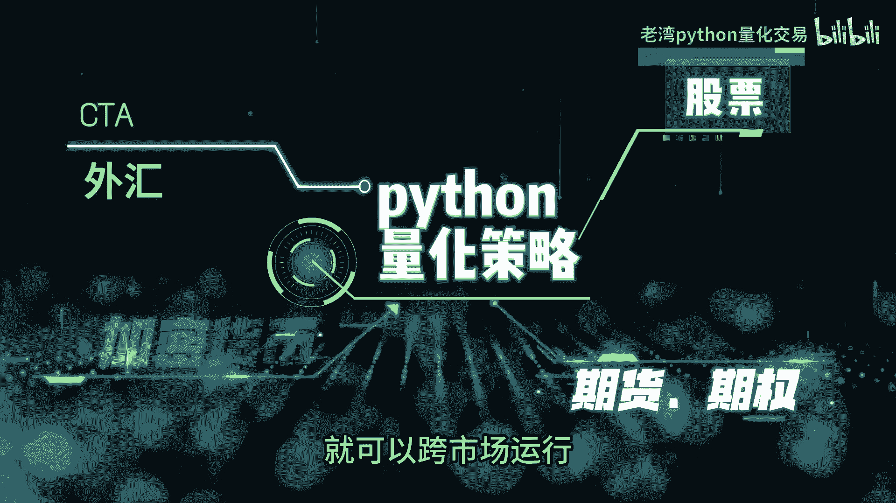

量化交易也只是学习Python的一个场景，供桌上的excel，学校里面的作业都可以用Python完成。

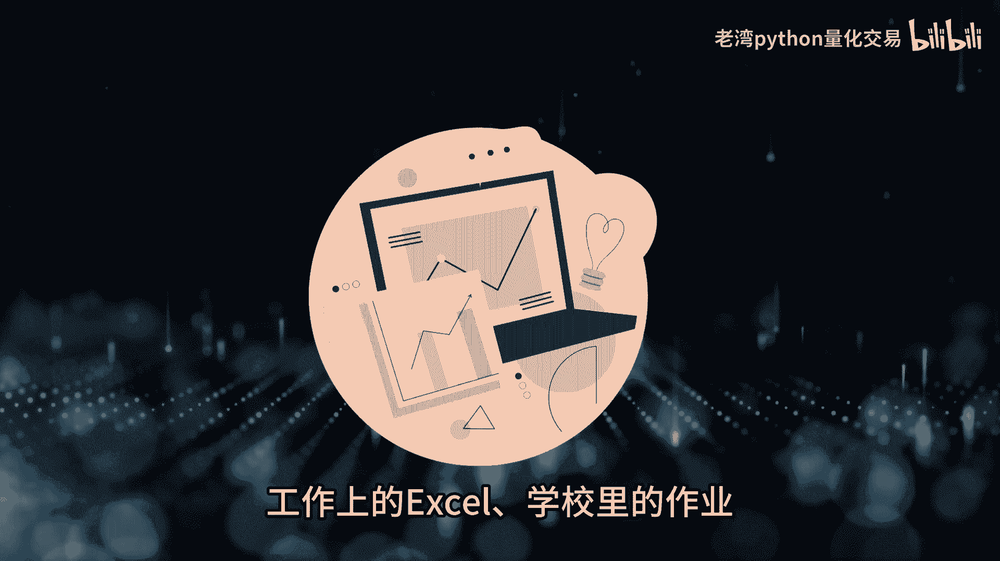

想在大A市场里面实现自动化交易，难得是一般新手不知道怎么找到合法合规，而且能够快速上手的量化交易平台。

简单的是由于市场太过内卷，目前一般的交易投资者就能够找到低门槛，而且配资的包括行情数据，还有下单接口的量化交易平台，有些交易者会使用按键精灵这样的插件，来模拟键盘鼠标的操作，在电脑上的草图软件下单。

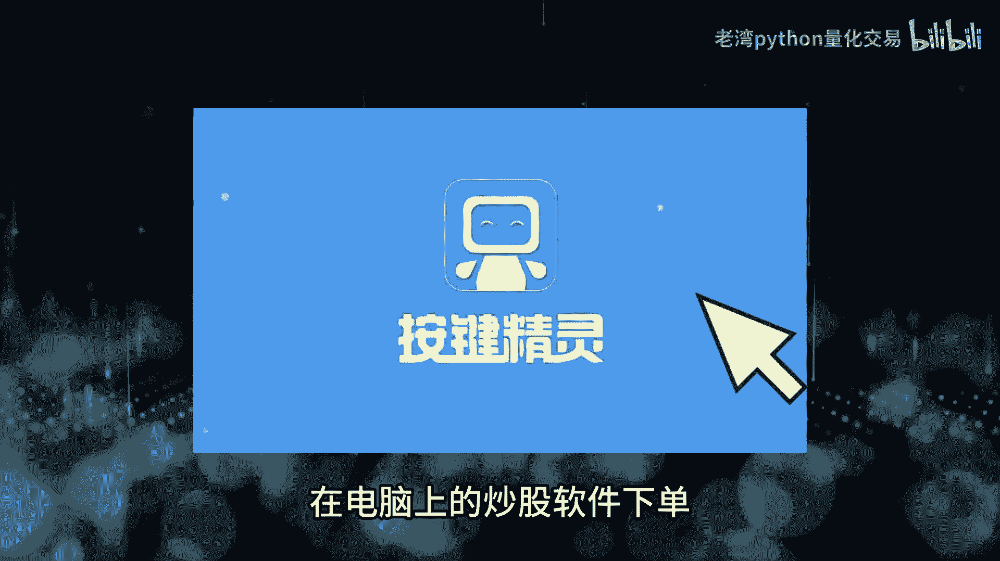

但是这样的插件往往存在各种风险，目前大A市场已经有提供给普通交易者，成熟的自动化交易平台，一般交易者真的没有必要，冒着各种风险去使用这些灰色插件监管，对于大A市场的自动化交易，一直是有着严格的要求。

还有限制的哦，由于技术开发成本，运维团队的因素，一般券商演编发独自开发一套，只提供给自己客户使用的量化交易平台，因此市场上出现的由第三方软件公司开发，销售给券商的量化交易平台，例如批翠QND，还有掘金。

这些量化交易平台，可以通过券商内部系统合法合规的对接。

封装乃至交易所的行情速度，还有下单JS口稳定性速度，跟之前的灰色擦剪完全不是同一个量级。

很多人会误解劈翠还有QNT，以为劈翠还有QNT，跟同阿顺通达信这样的炒股软件一样。

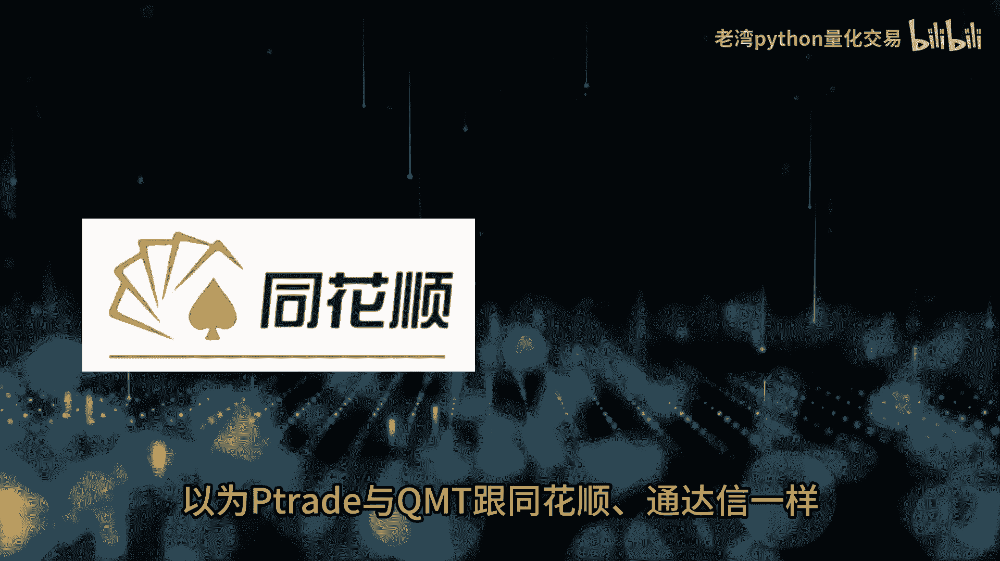

找到链接下载就可以直接使用，由于P翠还有QNT。

是券商向第三方软件公司所采购的服务，并且透过券商的内部系统。

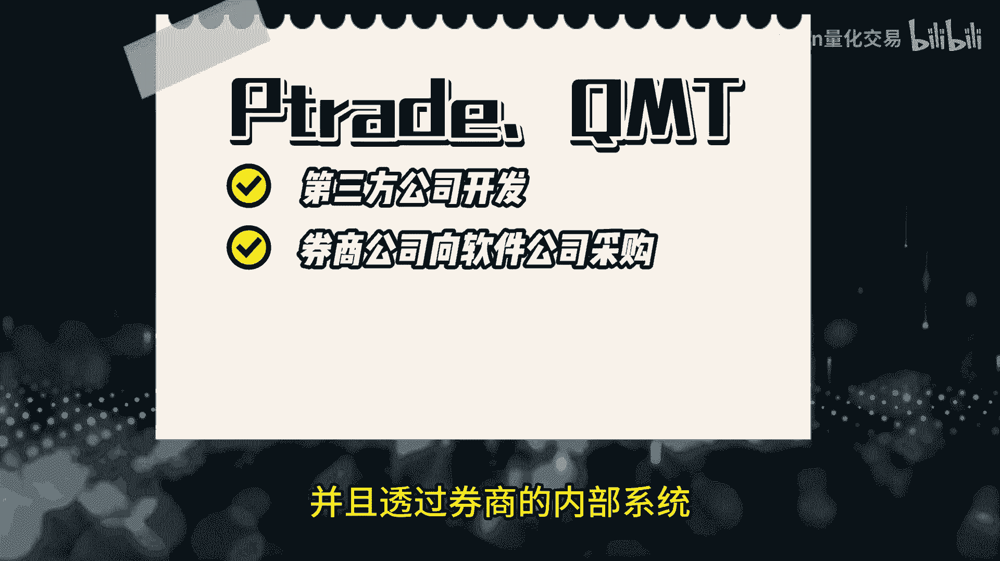

对接交易所的行情数据，还有下单接口，因此就算有下载链接。

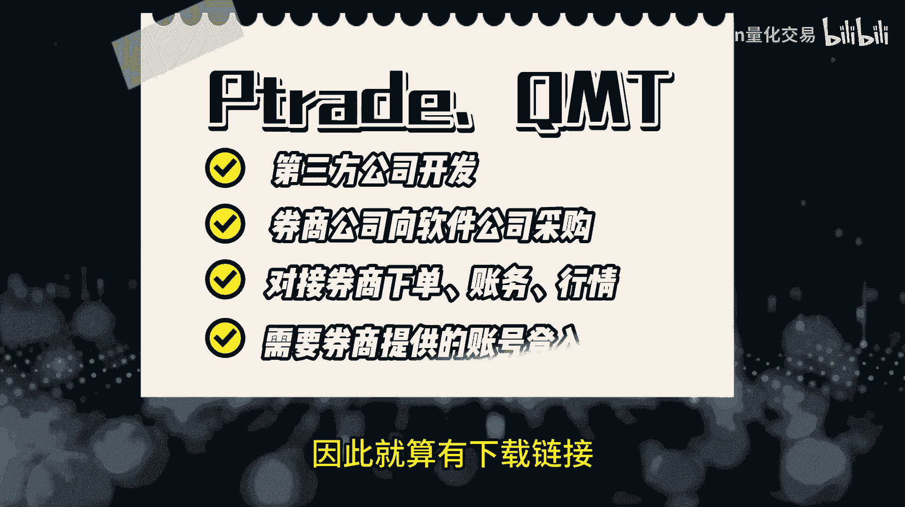

也需要拿到正式的账号或者是车子脏号，才能够登陆PC。

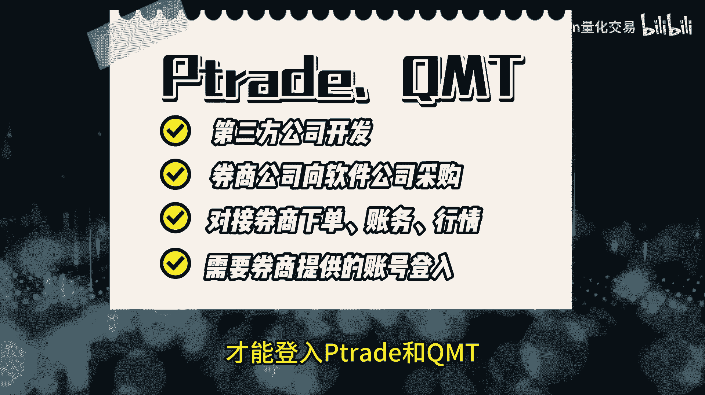

还有K65mt啊，这里敲个黑板，画个重点，P翠还有QNB1切合法。

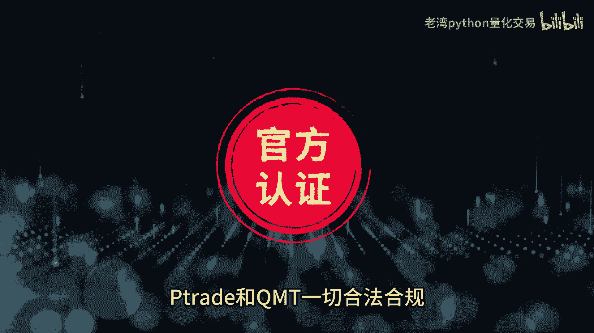

欧亏甲与锁，还有券商可不能随便拔你的网线啊，所以想下载P翠还有QMD的同学。

可以先联系自己在券商的业务经理，如果你的业务经理不太熟悉P翠，还有QMD，或者是券商并没有采购批翠，还有QMB，也或许是申请的门槛太高，同学可以在后台私信我。

帮这里，顺便提一下，不同市场的自动化交易都有着不同的生态，在某个神秘的市场，交易所的行情数据，还有交易接口是完全开放的API，交易者可以自己部署自动化交易策略，在学习Python量化交易过程之中。

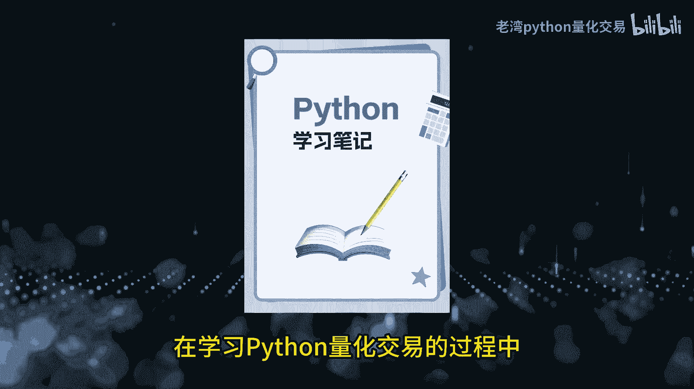

新手同学常常会遇到各种各样的坑，这些坑包括Python法，还有框架。

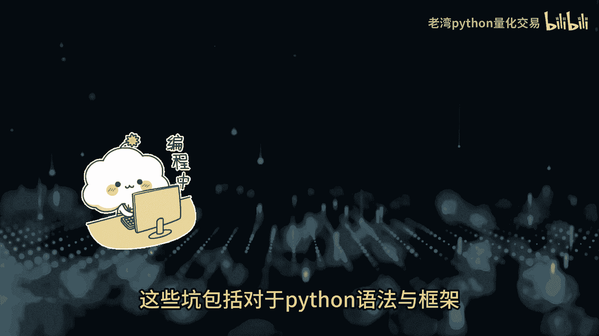

市场上交易品种，还有交易规则，这一小坑呢可能会让新手困扰好几个月，但有时候呢只需要有人适时的提点几句问题，就可以迎刃而解。

加快学习速度，要知道大S厂可不是只能投股票，还能做ET5可转载，国在商品期货甚至国外的指数都能做，如果你从更高的视角啊，你就会发现与爱的电话交易撤离，可以有很多不同的应用和变化。

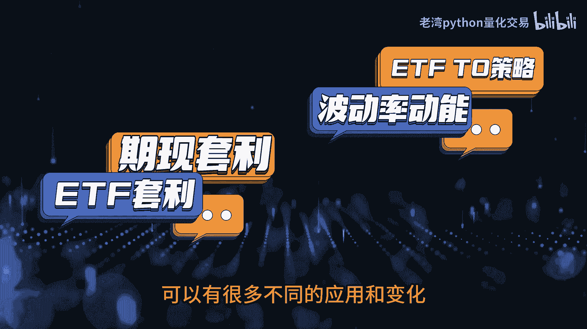

别老实守着那一亩三分地啊，好的那今天先聊到这边，下个视频。