# 程序化止盈止损系统逻辑大公开｜0编程｜即开即用 - P1 - 专业量化工具 - BV1NH4y1w7kY

我想我都说到这份上了，也该让我赢一次了吧，在充满变数的金融市场中，做交易往往是一场逆人性的挑战，人往往容易受情绪，贪欲欲望。

愤怒等等的影响，从而做出非理性的决策。

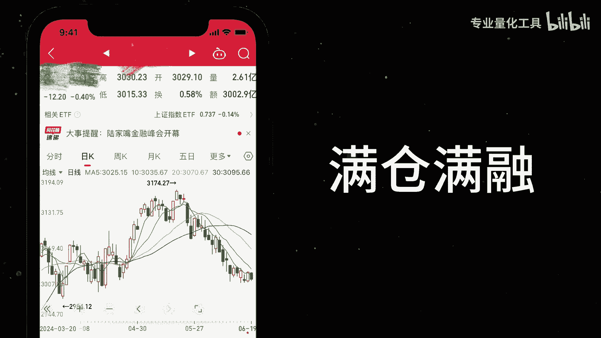

我在赌场输急眼了，正是这些非理性的决策，使我们账户亏损累累，那么怎么才能避免一些情绪化的交易呢，我们需要通过一些科学的办法，现代的工具来辅助下蛋，我们最容易犯的错误不止损，这等于埋了一颗定时炸弹。

我们第二容易犯的错误不止赢，这会让我们白忙活一场啊。

哦吼为了避免这些情绪化的交易陷阱。

我们开发了一个自动止盈止损的小工具。

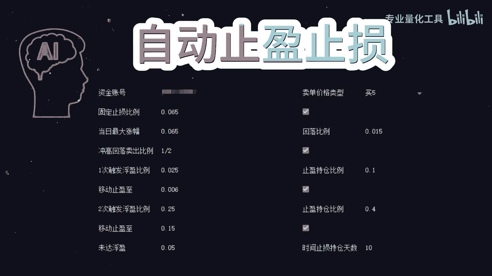

这个工具分为止损和止盈两个板块，止损板块分为硬止损和软止损，止盈分为小涨部分止盈，大涨部分止盈，大涨清仓和冲高回落止盈，首先我们来看看止损板块的功能，硬止损也就是固定比例止损。

当持仓的亏损达到预售的百分比时。

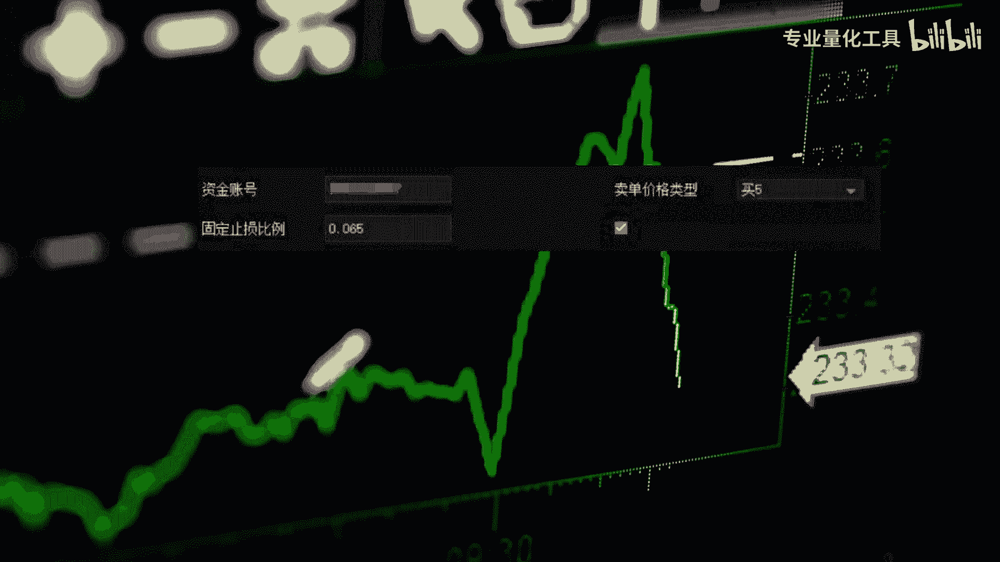

比如亏损达到了10%。

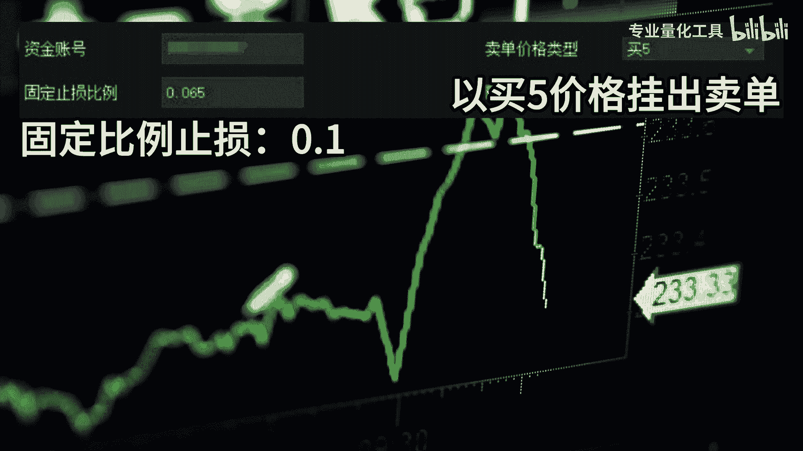

以此防止损失进一步扩大，而软止损我们称之为时间止损，这并不意味着真正的亏损，而是指在规定的时间内，如果价格没有达到我们预期的涨幅，系统也会自动进行清仓操作，这对有时效性的热点板块很有意义。

接下来我们看看止盈板块的功能大小，涨部分止盈其实是一种仓位管理的策略，当价格小涨时，我们卖出部分仓位来填补佣金和手续费等成本，而当价格大涨时，我们可以选择继续减仓或者直接清仓，以此来锁定利润。

另外还有一个很实用的止盈策略，是冲高回落止盈。

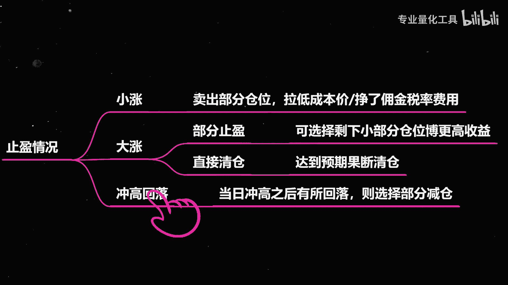

当价格快速上涨到某一阈值时，比如开盘就涨了9。5%，后续盘中价格回落了3%，我们的工具会自动捕捉到这一趋势，帮助我们在高位卖出。

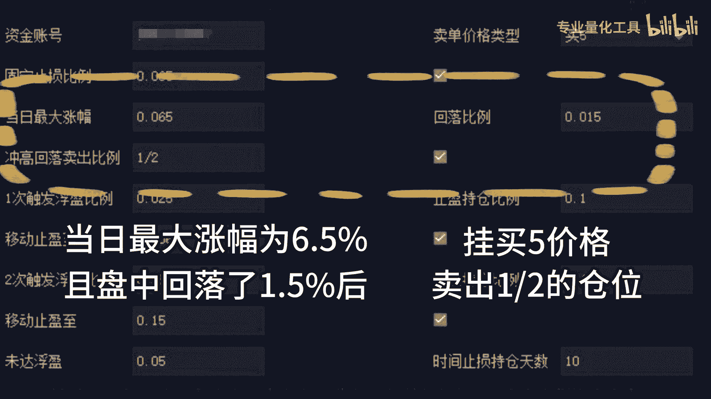

避免因为贪婪而错过最佳的卖出机会，值得一提的是。

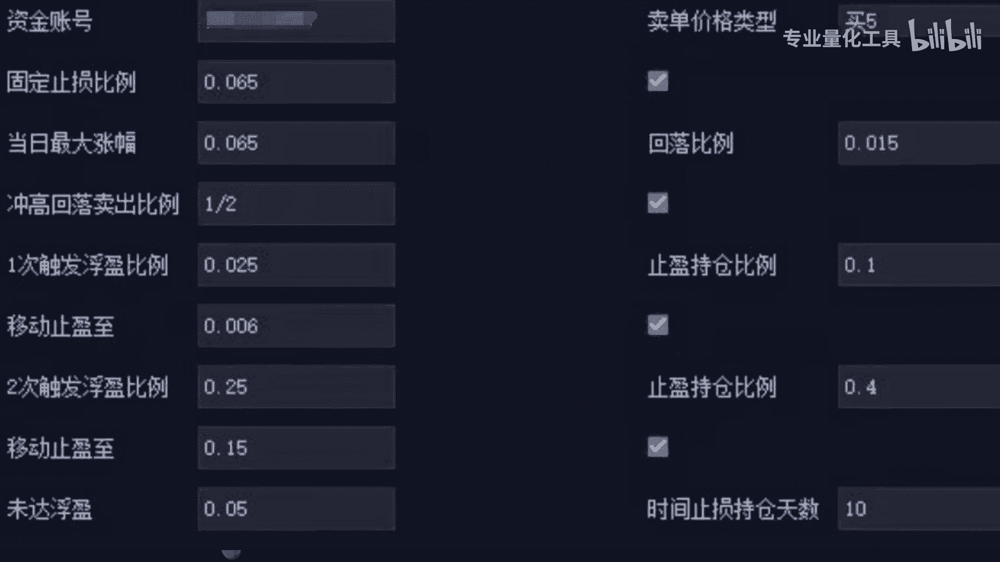

我们每次止盈后，系统都会自动计算出保护线，即移动式银线。

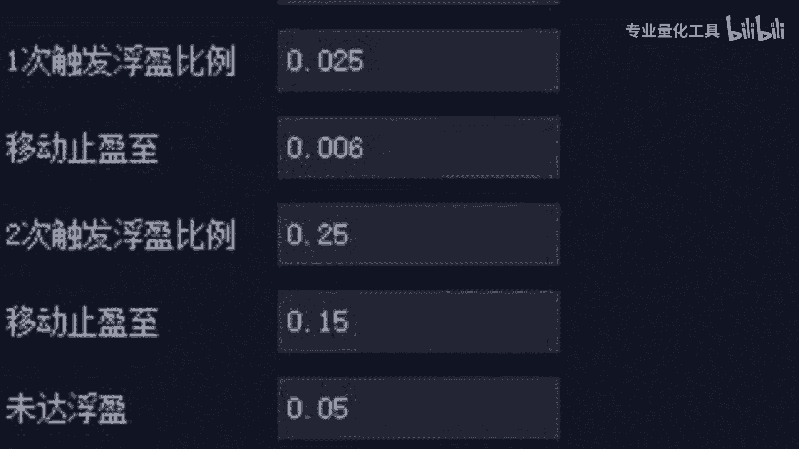

这是为了保证本次交易最后结果是正收益。

如果想细听这部分的内容，欢迎一键三连，你的鼓励是最大的支持，无理由狼保护这款工具，通过结合指银河止损两大板块。

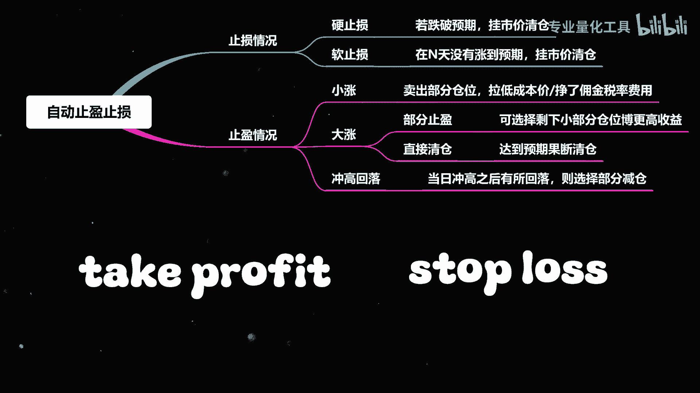

不仅能帮助我们规避情绪化交易，还能通过科学的策略来优化你的交易抉择。

让你在金融市场中更加稳健的获利。

对了，我是在专业的量化交易软件q mt上做的开发。

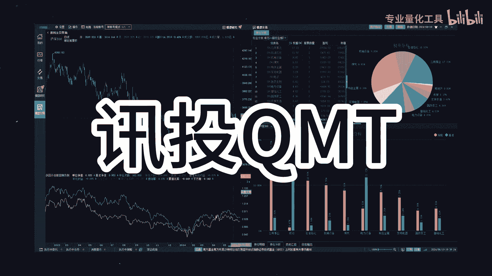

目前呢已经是实现窗口化，可以自由调整数值和比例，对于你来说即开即用，不需要额外的编程，右下角开通QMT获得指引止损小插件。

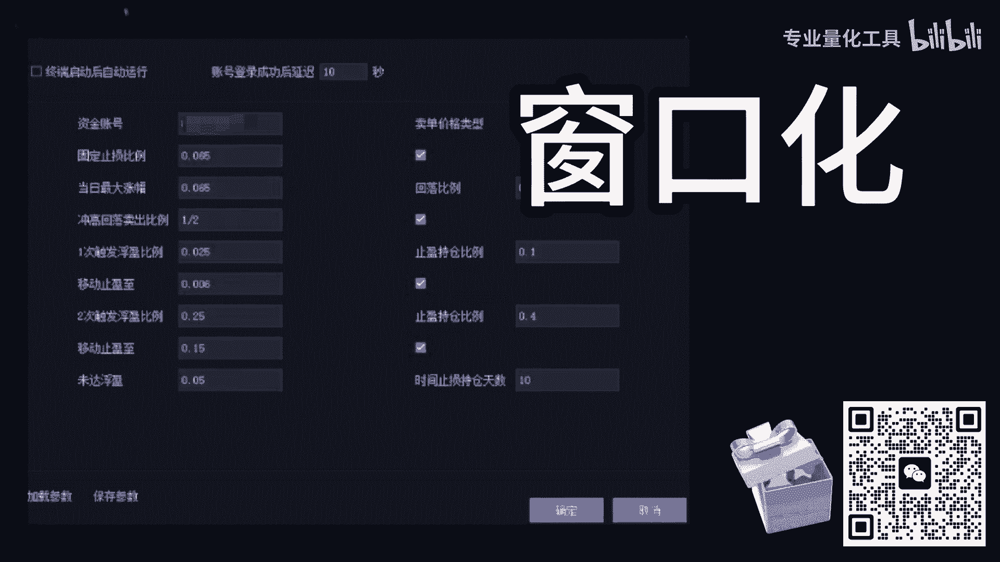

也欢迎更多个性化定制专业量化数据。