# 【量化交易完全可自学教程】2024B站最完整的Python金融分析与量化交易实战教程分享！知名博士通俗易懂的解释，学量化交易真的不难！ - P69：7. 6.8.1-金叉与死叉介绍P8 - AI知识库 - BV1YT42117B5

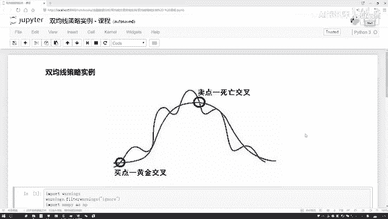

这节课咱们来说一下，就是在交易数据当中啊，我们的双均线策略啊。

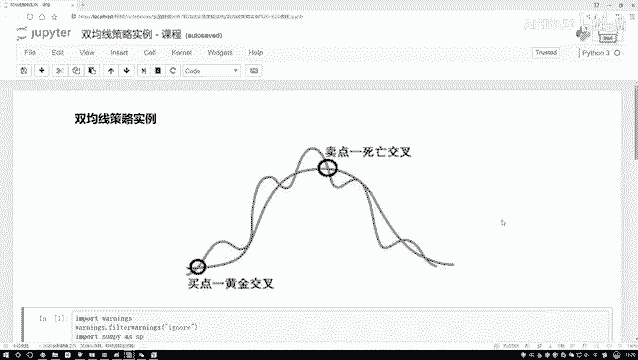

他是怎么去做的，现在给大家解释一点，什么样叫做一个双均线。

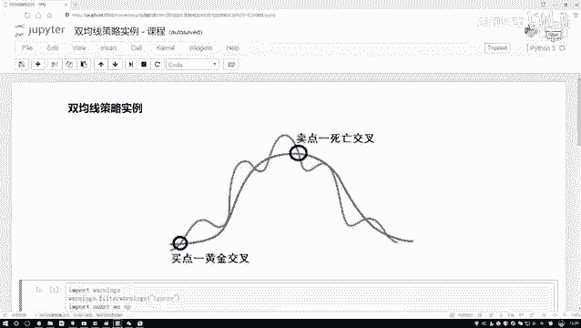

那还是拿股票数据来说吧，好比说我们现在有一个苹果的股票吧，那这张股票当中啊，是不是说在每一个交易日当中，我都会得到它的一个收盘的价格啊，那收盘价格可能第一天有，第二天有，每一天都有。

但是我问大家一件事啊，你说啊就对于每一个时间点的价格，今年这个点，明年这个点它发生一些浮动，唉我能看出来它大致的一个趋势吗，给我们的感觉好像就是哎呀只是看了一个个体，然后他的一个变化情况而已。

但是好像不能从整体上去，描述它的一个变化趋势吧，那这个时候该怎么办呢。

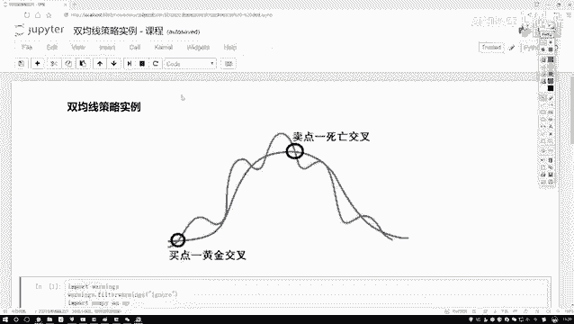

怎么样能更好的描述啊啊提出这么一点，他说啊，现在啊还是咱们这个股票数据。

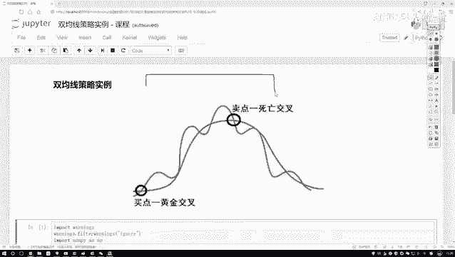

每一天都有收盘价格，然后说我这样吧，我按照一个日期来统计啊。

这里你看双曲线，双指的是有两个的意思是吧。

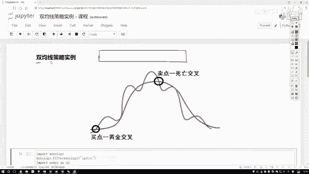

这里两个咱提出来一个一个叫长均线，另外一个呢叫做一个短均线。

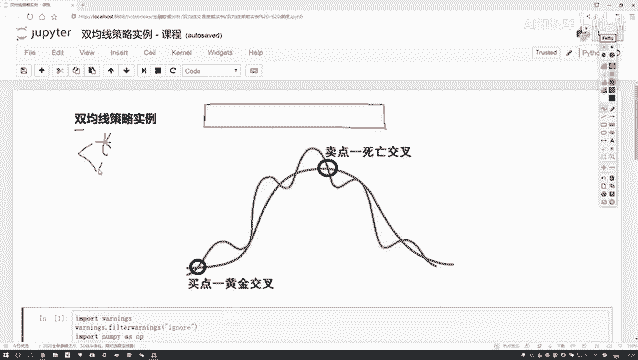

先说什么叫短均线，那比如说我说按照五个交易日啊。

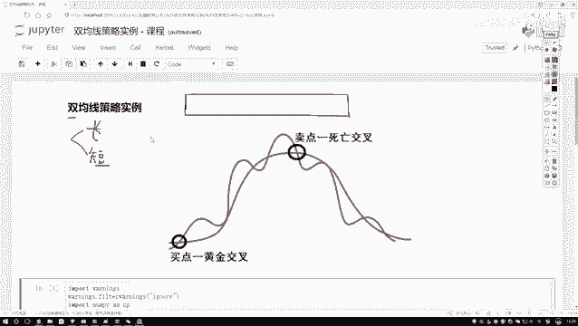

一周有五个交易日嘛，我是按照一个周来说吧，五天算他的一个平均情况可以吧。

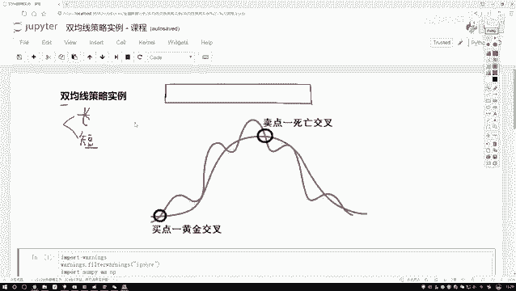

那好比说这个整个数据，那我把整个数据当中啊。

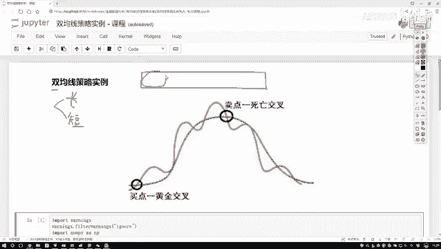

说这是一个五天，这也是一个五天，这也是一个五天，这也是一个五天。

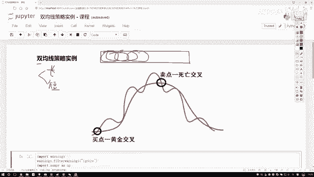

那给我的感觉啊，现在是一个区域上了，这个区域当中不是一个样本数据吧，而是有多个样本数据，那对于多个样本数据我来算一算，比如说这里有五个样本数据，我算一算五个样本数据的一个均值，可不可以啊。

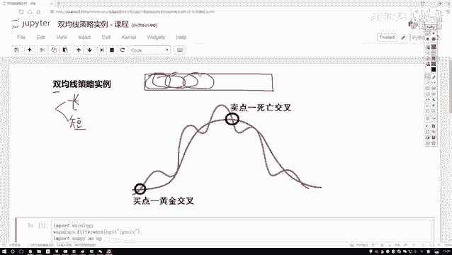

是不是也可以啊，好了，我说我第一就是第一个位置拿的是第五，就是这五个数据。

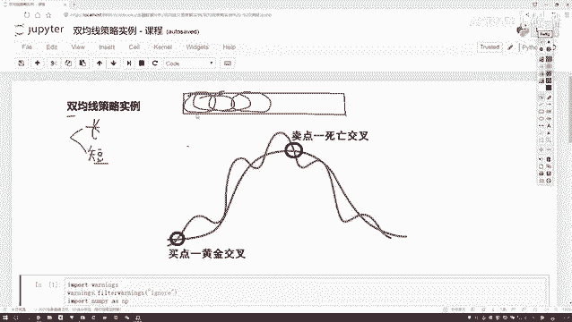

然后后面还有这个蓝色的五个数据，然后还有这个绿色的五个数据。

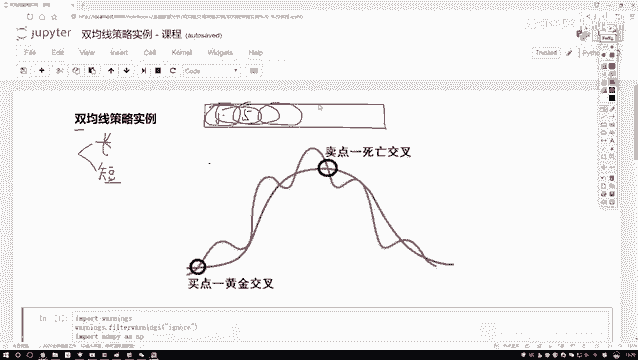

可以吧，那这样我说我现在在画一个走势的一个曲线。

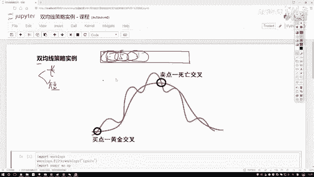

在这个走势曲线当中呢，之前那如果说咱拿到苹果股价，那每一天的收盘价就是能把这个折线图画出来，这样一个走势吧，那我新的走势呢。

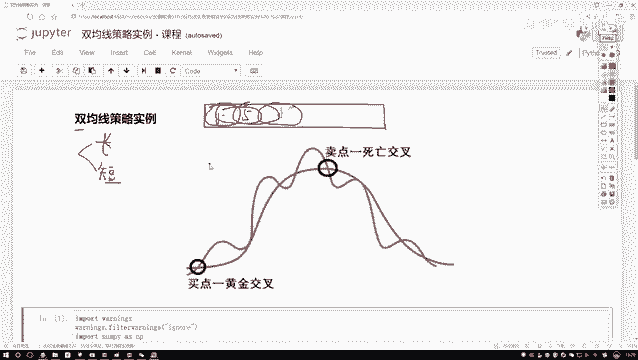

我说这样，我既然说了咱们的一个短线本案当中。

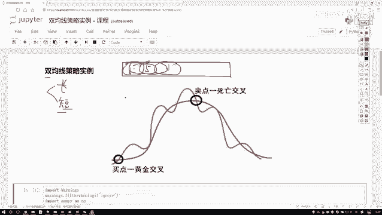

我用这五天，比如说呃每个五天的平均值来画这个走势。

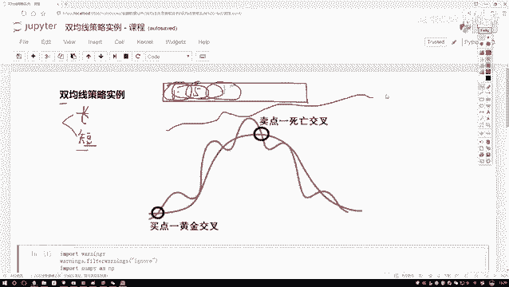

是不是也可以啊，那给我的感觉现在好像这样，之前你是一天一天的去画，现在呢我是五天，平均五天平均诶，把这个图画出来，那你说我的一个平均起来，是不是能看出来它短期变化的一个趋势啊，大概这样一个事儿吧。

那好了，这是一个短线，那什么叫常见呢，其实说白了短线和长线有这一点区别，短线啊就是周期比较短，我说这个五天十天是不是都行啊，啊叫做一个短线，那长线呢那自然就比较长了，相啊比较常见的像20天啊。

一个月咱们20个交易日，20天可以吧，甚至更多的两个月40天，三个月60天是不是都行啊，长线和短线之间唯一的区别，就是我们选择这个窗口诶，它的一个就是大小吧。

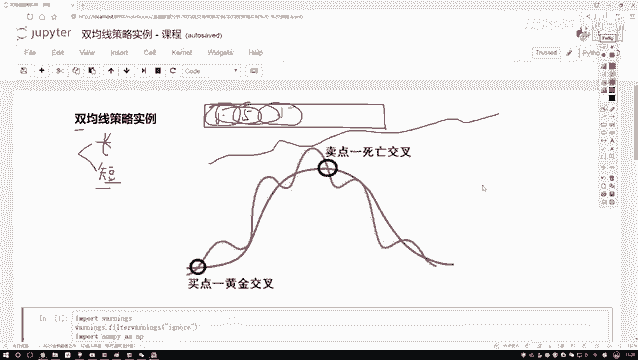

短线比较短比较少，长线比较长，那做了这两个线之后啊。

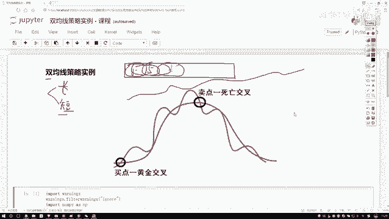

你说它有什么用啊，咱们来看这个图啊，这个图当中啊。

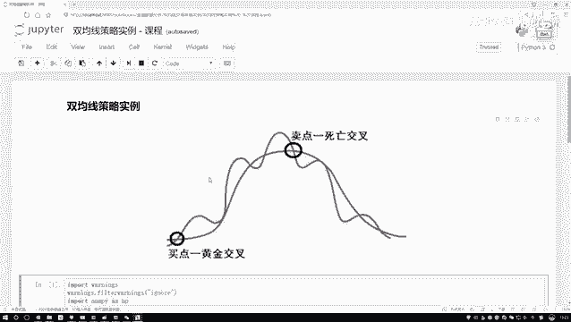

你看诶他说了两点，一个叫买点，一个叫卖点，我给大家解释一下。

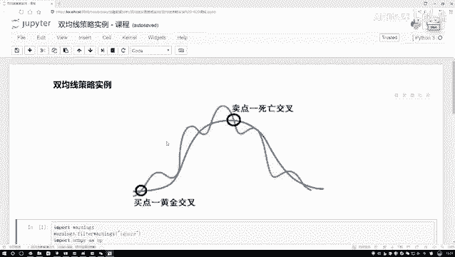

现在看这个买点买点什么意思呢，好比说这样一件事，你这个红色的红色的。

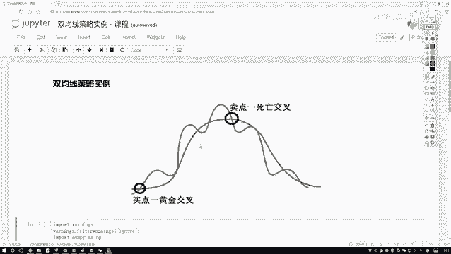

我是这样吧，这个红色的叫做一个短线，得了这个红色的我说他叫做一个短线。

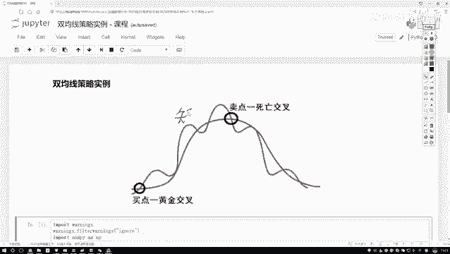

然后呢这个蓝色的我说他叫做一个长线。

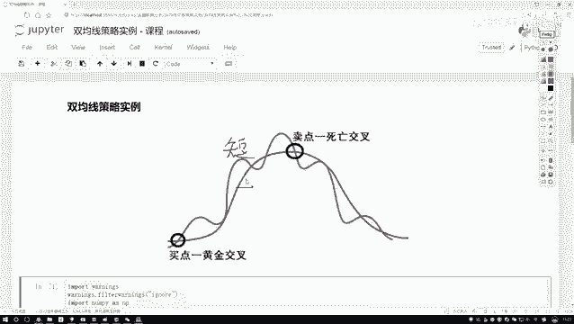

可以吧，你看啊在这个买点这我们的一个短线的均值啊。

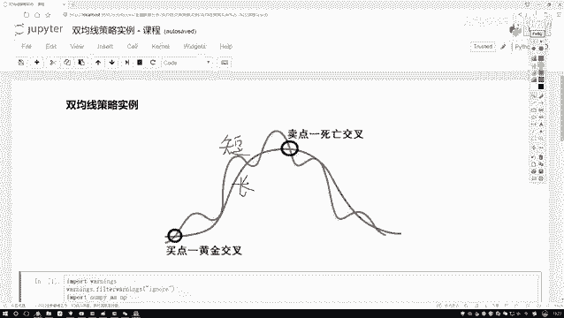

它这个变化情况是不是穿过了这个长线，并且是向上的一个趋势吧，向上啥意思啊，是不是要涨了呀，那这个给我感觉什么哎呦，好像从一个近期的一个指标来看，哎呀这个股票涨，但是从长期角来看呢。

这个股票可能还处于平稳阶段，那说明此时如果说你要让你做预测啊，你说接下来股票是涨还是跌啊，短线已经超越长线了，说明在短时间内它应该会涨吧。

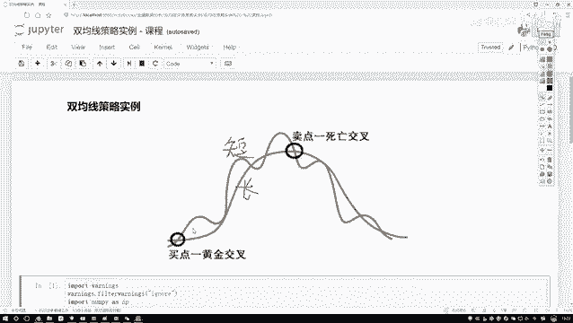

所以我管叫什么叫做一个买点，我们把这个买点既然他有这样一个交叉。

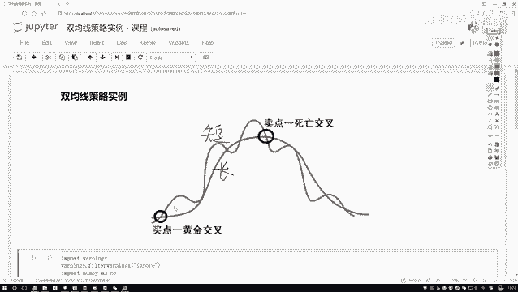

就给它起个名字，叫做一个黄金交叉。

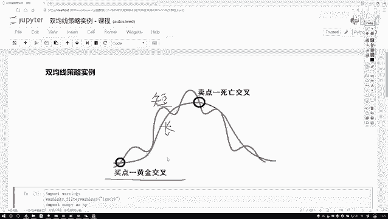

黄金肯定好多东西，我要的呀，所以说此时就是我的一个买点，在这个时候我可以低买。

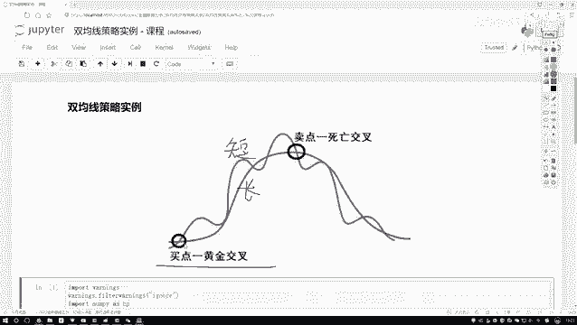

然后之后我在高卖是这样一件事啊，好了，然后再看下一个下一个卖点呢。

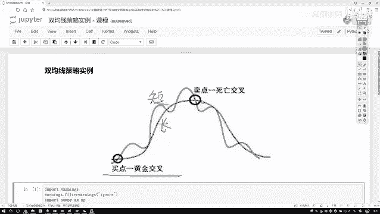

我们的短线还是穿越了这个长线。

但是我们的箭头是往哪儿的，是往下的吧，短线穿越长线箭头往下，你说从这个趋势上来看，在短期内它又怎么样了。

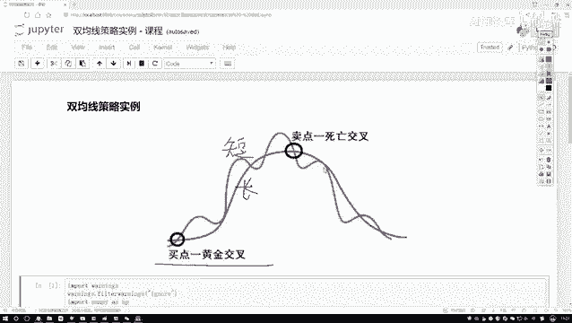

去跌了吧，去跌的过程当中，比如手里我现在有100个股票。

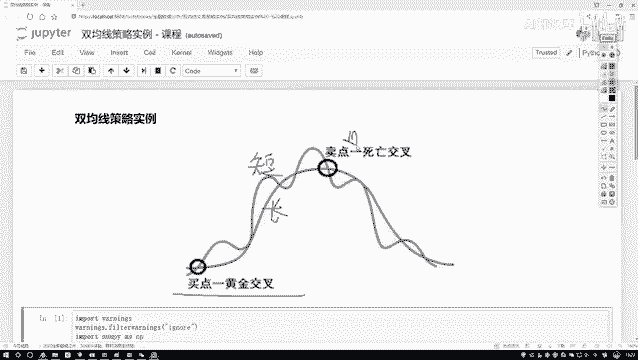

那我都知道他现在又跌了，我是不是在此时你给他卖掉，然后然后然后过一段时间再买回来。

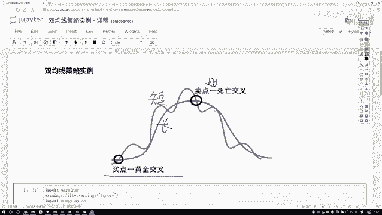

是不是可以做这样一件事啊，所以说此时我们管它叫做一个卖点。

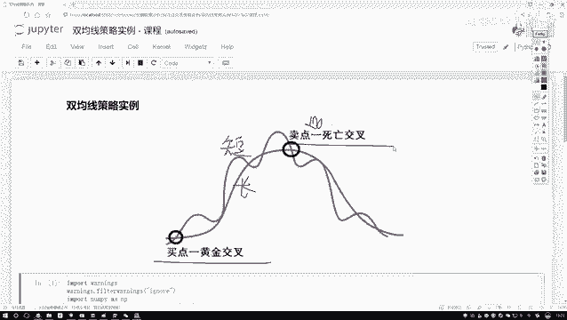

卖点又称为是一个死亡交叉啊，这样一个意思。

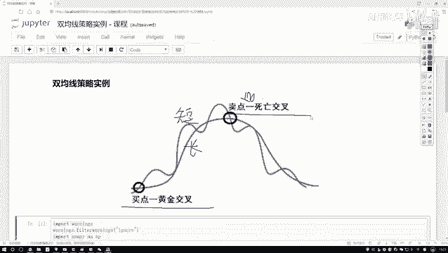

那行了，给大家解释了，就是有两个点啊，一个叫黄金，也叫死亡。

那你说啊，现在建我们知道了这个买点和这个卖点，那对于一个数据来说，如果呀我能做这样一件事儿。

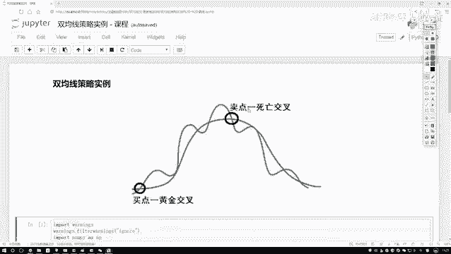

唉我分析出来了哪块是一个买点，哪一块是一个卖点。

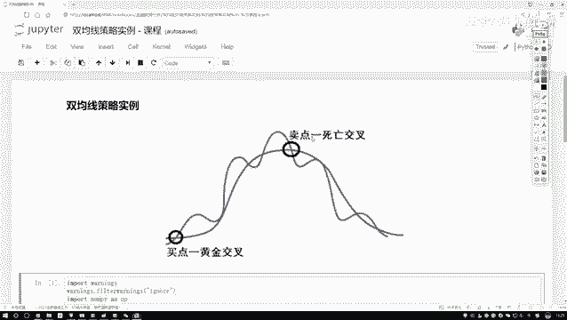

我能不能设计一个策略，那比如说我说买点的时候我就买进来。

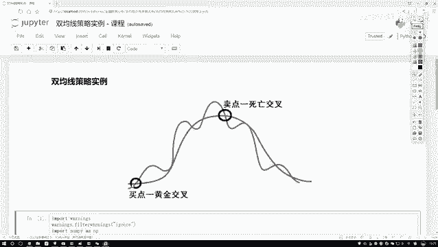

卖点的时候我就给他卖出去，是不是这样，如果说每一次我都能按照就是我预测的情况。

你说我说每一次我都预测对了。

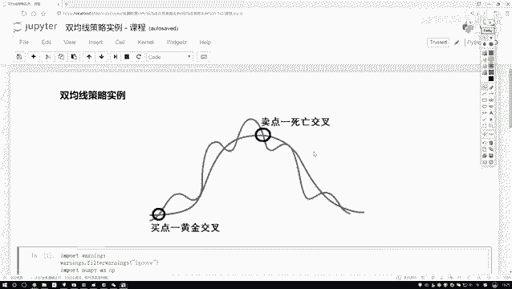

但最终我肯定是受益的吧，因为每一次我都是去赚的，我没有赔的时候吧。

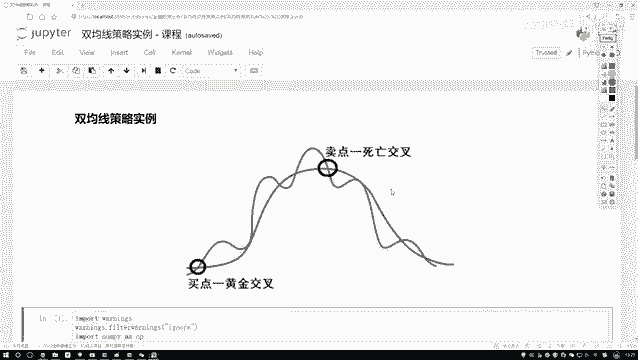

是不是这样一件事啊，始终保持自己的收益的，那这个就是我们今天要做的一个策略，一会呢咱又会用这个Python的例子给大家演示。

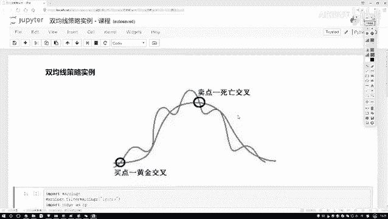

怎么样把这个双击策略啊给他做出来行了，这个啊基本的一个知识点。

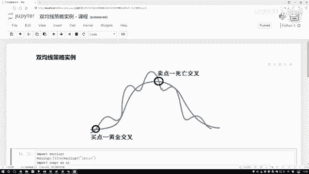

其实也不用介绍太多啊，关于股票当中啊，那些专有名词，有什么平仓不平仓，那些东西不给大家去说了。

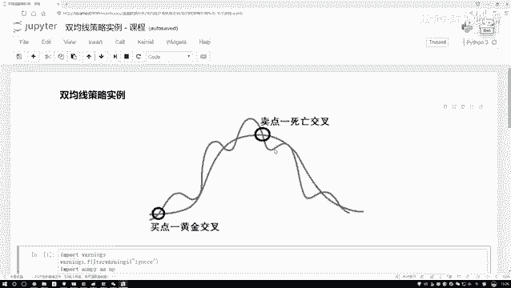