# 第01课 量化投资的发展和理工生跨界做量化的开启姿势 - P1 - ts902166 - BV1GVeCeXEM3

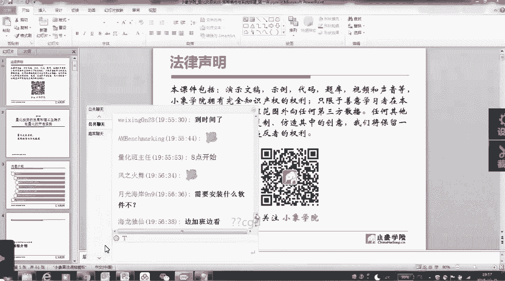

你离开那一刻，让我的少年，转身之间消失在天边，不知何时天空又飘起雪，有人在谁在谁在放歌啊，是我在放啊，测试一下声音，这个我看还有23分钟，那我们就一边闲聊，一边就开始了。

嗯今天呢我们是整个这个系列课程的第一课啊，我们这个课程叫什么名字呢，嗯大家在这个报课的时候，也都看到了，量化交易实战策略编写与系统搭建啊，那么总共分成六次课，今天是第一课，量化投资的发展。

和理工生跨界做量化的开启姿势，之前我也拿到了大家有一些背景的调查啊，咱们这个学员当中有一些呢是理工背景的同学，还有一些呢已经做过一些这个主观的交易哈，可能这是我们这几期招生当中嗯。

做过交易的同学当中占比最高的一期了啊，从这个至少从背景调查上来看是这样的，所以呢我们也会根据大家的这个背景不同啊，我们会对我们整个60课的内容做一些微调，以适应大家的需求，那么在讲这个课之前呢。

简单做一下自我介绍啊，嗯我呢嗯这第一次课由我来给大家讲啊，我姓汪，汪浩汪老师啊，那么我呢是毕业于清华电子系，所以为什么给刚刚才给大家放这个歌，如果这个听过这个歌的人啊，知道这是谁的歌呢，这是李健的。

叫紫罗兰啊，大家也知道李健是清华电子系的诶，他就是我的这个同班同学啊，我们本科是一个班的，我们班还出了另外一位歌星叫做妙杰啊，大家前几年还比较这个知名度很高的，叫水木年华，这个组合。

李健最早也是这个组合的啊，后来很早就单飞了，所以说青蛙电子系出歌星啊，这是一个我们就是调侃，但是同样道理啊，清清华电子系也有不少呃，不务正业的，像我这样的就是没有去做电子这个行当，最后跑去做量化啊。

呃我的这个很多师弟师妹们也也在，现在也在做量化，而且他们做的还挺好，那么我呢现在在清华大学开设了一门全校的啊，全校级别的这样的一个选修课，三个学分的，每个学期都有叫做金融大数据与量化分析啊。

那么我们现在大家上的这个课，六次课的这样的一个课程体系，也是借鉴了我在清华开的这门课，电话大数据与嗯金融大数据与量化分析啊，借鉴了这门课的一些这个体系，当然我们融入了更多实战跟实战相关的内容。

那我在清华本硕毕业以后呢，又去了赫尔辛基理工大学啊，读的是计算工程这个专业啊，主要做的是大数据源模式识别这个方向，那我也做了十几年的人工智能，后来转转行做量化，那么嗯后续呢再给大家讲课的其他几位老师啊。

也都是我现在在做量化这家公司的这个同事啊，啊包括我的这些合伙人，所以呢我们整个这个课程的体系呢，就是为了帮助大家从量化入门到逐渐啊，大家判断你是你以自己的这个资质，你自己的条件适不适合从事量化交易。

相关的这个工作啊，能不能去在这个领域有更深的发展，所以呢我们整个的课程，除了现在大家学的这个啊，我们叫做初阶的课程，后面呢还有进阶的课程，包括更啊高层次的啊这种研修班啊，我们叫做研修班。

这个一还有包括线下的这种形式，能够面对面的去交流，那么整个呢是有一套的体系啊，那么今天大家来学的这是第一课啊，所有系列课程当中的第一课，量化投资的发展，和理工生跨界做量化的开启姿势。

那么今天的内容啊大概分成这么几个部分，首先呢我还是对整个我们这个初阶六节课嗯，这个课程做一个介绍，然后呢今天的内容呢分成大概六个部分呃，给大家介绍一下量化投资的一些发展啊，我们既然来学量化啊。

作为茶余饭后的谈资，至少也要稍微知道一点关于量化的事，嗯然后量化和主观投资，量化投资和主观投资到底是一个什么关系，那么今天呢我们对这个问题做一个简单的讨论，然后我们就开始啊进入到正题。

或者说大家比较关心的问题，我们来认识啊，一个量化交易策略到底长什么样啊，那么接下来我们就会谈一谈啊，针对大家哈，很多都有理工的背景，那么理工生做变化有什么优势呢。

那如果不是理工生的做变化还会有什么问题啊，我们也做一个这样的一个讨论，在最后呢我会介绍一下，量化交易系统的一个基本架构，帮助大家去理解后续的这个几节课的啊，这样的一个教学体系。

还有啊到最后补充一点必要的基础知识，因为不是所有的同学啊，所有今天上课的同学啊，都对交易本身有这个比较多的实战经验，所以呢嗯为了照顾没有做过太多交易的啊，没有太多交易经验的同学。

那么最后我要要补充一些必要的一些，跟交易相关的一些基础知识啊，这就是今天整个这期这堂课的主要内容。

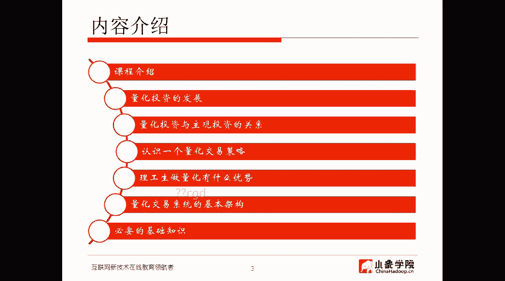

那我们就进入到这个课程介绍啊，整个这个课啊，我们说这个呃六次课，那么都是围绕大家怎么系统地做量化，和系统的学习啊，量化交易其实不是大多数人想象的那么轻松啊，写几行代码，然后就可以躺着挣挣钱了。

无论是吃饭睡觉还是这个呃其他的时间啊，就靠那几行代码就可以赚钱了，也许几行代码是能帮助你赚钱啊，但是在这背后需要付出非常大的这个呃劳动啊，付出非常大的这个这个辛苦，那么针对我们两大类啊背景啊。

有这两大类背景的这个同学啊，有一类呢是标准的程序员啊，可能这个理工出身，然后再在一些软件公司，互联网公司来做这个软件开发啊，写程序啊，程序员，那么对于程序员来做电话来讲，确实有一定的优势啊。

可能你你的目标呢也许学了这个课，你的目标一种是说唉我想转行跨界到金融圈，那么我到金融机构去写代码啊，做这个交易体系的交易系统的这个架构师啊，程序员啊，啊帮助这个呃公募私募券商去搭建他们的啊。

这一些量化分析的这个工具，或者量化这个交易平台啊，这是一种那么针对这种学习目标啊，我们需要重点学习量化系统的这个架构，和一些模块化的搭建方法，但是嗯除了这些，我认为更重要的还是理解量化交易。

这个业务的本质啊，所以说那么如果是抱着这个目的来学习的同学，那你可能从这几节课当中，你更多的是要吸取说嗯，量化交易整个它的这个业务啊，到底它的流程他的要求是什么，你既然要去金融机构去写代码。

那至少也要了解金融机构在讲什么样的语言啊，跟他们能够有共同的语言，那还有一部分同学可能目标是自己要做宽客，做交易啊，那么针对这个目标呢，可能有一些程序员背景的同学，就是自己之前没有做过太多的实盘交易。

可能缺少一些这个交易的经验，那么那就要重点要补一补这个交易方面的啊，这些逻辑恶补一些实战的这个经验啊，我们也有也会给大家提供一些这个，实战训练的一些方法，而且特如果是你抱着这个目的，想自己做一名宽客啊。

所谓就是做量化交易的这个框子，那么呃建议你在整个这个课上啊，你先把代码这件事放一放啊，忘掉代码，因为如果只会coding，对于做交易来讲其实没有太大的直接的帮助啊，这个时候更重要的是交易的逻辑。

那么针对有实盘经验啊，已经之前真金白银，在这个市场当中摸爬滚打的啊，这部分同学呢，那么想做量化啊，我猜想啊你的一个想法啊，比较朴素的，比较比较，甚至可能略带一些天真的想法，就是说好。

我之前已经有一套这个交易体系了，而且在我之前的实盘经验当中啊，也许已经验证了还挺不错的，那么这个时候我需要把这个整个的这套逻辑，变成一个量化的策略啊，这样程序去去替我自动的去执行了，我就躺着收钱了。

这个想法很好啊，但是呢在实践当中啊，其实会遇到各种各样的坑嗯，最大的可能性是说你之前的这个主观交易经验，实际上并不可靠，你可能只是过去啊，某些时间段你的运气比较好啊。

那么你之前的这些实盘经验不一定真正在量化，或者说在统计意义上符合量化策略的要求，你把这个逻辑变成了一个量化的交易模型，那么再去验证啊，采用大量的历史数据进行回测，验证的时候。

你会发现其实没有你想象的那么有效，所以这个时候啊我对嗯有这样背景，实实盘交易经验背景的同学，我的建议是说，这个时候我们要认真严肃地通过量化的方法，来验证自己过去的经验，自己的交易体系是不是真正的有效啊。

同时呢我们还会去重点去学习，怎么去量化一个逻辑啊，在这里头不光是写代码啊，关键是说你在逻辑量化的过程当中，有很多系统性的问题，怎么去啊，把它一步一步变成变成一个嗯交易的啊，量化交易的模型啊。

通过代码去实现这个过程，然后通过程序化去执行啊，这些都是细节，都要经过不停的策略的这种诊断和优化啊，所以我们会围绕着啊刚才我所说的这些内容啊，系统性的把大家引到量化交易啊，这样的一个体系当中。

这就是我们整个六六节课的一个。

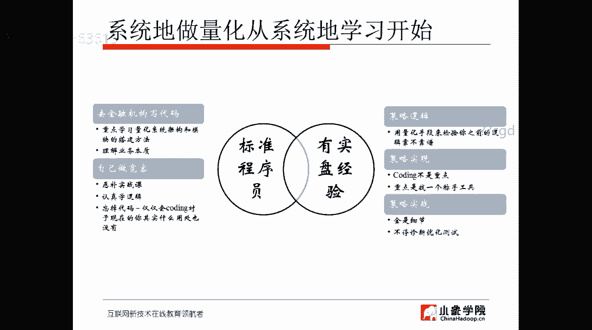

所以说学什么学会，那么量化投资发展，和理工生跨界做量化的开启姿势啊，这个今天我们就会介绍这个这方面的内容，那么怎么上手搭建一个最简单的交易系统，因为有些同学啊，特别是工程师出身的啊。

程序员出身的同学可能会觉得诶，我现在用现有的这些平台，一是可能这些平台这些工具啊，嗯不能完全满足我做量化策略的需求，另外一个可能大多数人都会觉得诶，我要把我的策略通过这些云平台，要暴露在这些平台上。

那么平台背后那些平台的维护者，开发者，他们可能轻易的就会看到我策略的逻辑啊，我不想暴露出去，所以说啊有些同学可能嗯有这种需求，要自己搭建自己的交易系统啊，所以在我们这个课上，我们也会涉及到这方面的内容。

那么嗯对大多数同学来说，可能作为做一名宽课是你学习的目的啊，那么这个时候你就要自己去开发，自己的交易系统，自己开发自己的策略啊，你的交易策略，那么当然就会对应到像你的信号系统仓位啊，也就是资金的管理。

风险控制啊，包括你的策略开发完了以后怎么去评价，怎么去诊断啊，那么上实盘之前还要做哪些准备，最后呢我们还会在第六次课上，我们会讨论一个假设，大家学完了这么六节课，真的对量化特别感兴趣。

觉得唉真是找到了一个明确的方向，那么这个时候想进入到专业化的赛道啊，专业的量化赛道，那么我们在第六节课也会给大家去探讨一下，如果你想专业的去做这件事，还需要做什么样的精心的准备啊。

所以嗯这就是我们整个这个课程啊，六次课程想达到的这样的一个目的，把大家引入到这样的一个领域，然后每个人根据自己的特点啊，根据自己最终的学习目的，可以去侧重在某些部分的啊这种内容上，当然了。

你也需要对整个六次课，所有的内容有一个全盘的了解，才能决定啊，哪些这个方向，或者哪些点，是你将来如果专业化做这个量化的时候，你需要去突破的啊，嗯还有同学会问啊，学了就能赢吗，唉这个问题呢其实很难回答啊。

这么说吧，嗯量化呢它实际上只是一种工具啊，啊既然是工具就不能保证啊，这个用这个工具的人就一定能赢，当然了，说你说使用步枪的人就比水无弓箭的人啊，他在战斗当中，他赢面可能会大一些啊。

因为你的工具本身的先进性，你是热兵器，那对方还在用冷兵器，那么你可能你的赢面会大一些，但是这也不能保证你就一定能赢，万一对手换了炮对吧，所以在这个问题实际上是个哲学问题啊，不是说你掌握一个工具。

你就注定能够战胜这个市场，战胜你的交易对手啊，它只是一种相对啊，相对而言，如果说你掌握了量化当中的精髓的部分，可能就类比于你掌握了一个更先进的工具啊，也许你在竞争当中就取得了一定的优势啊。

但是这也是非常理想的一个情况，而有些同学啊我了解一下，可能还有背景是说做数字B对吧，可能现在正在做B，那么也想通过一些量化的方法啊，来去怎么去做这个数字货币的交易啊，数字货币实际上跟我们在这个课程当中。

给大家介绍的主要的品种，像股票啊，省期货呀，这些方面其实没有什么本质的区别，某种意义上来讲，数字货币的基本面会更简单啊，它没有像股票还需要有这么复杂的一套，不管是基本面技术面的这种分析体系。

数字货币基本上啊，用现在主流的一些技术分析啊，就可以去胜任，甚至数字货币当中，韭菜的这个水平会更相对更low1些啊，相对更low1些，毕竟股市啊这么长时间，已经培养了很多老韭菜啊，那么老韭菜相对来讲。

收割起来就没有新韭菜那么容易了，虽然说嗯最近这几个月，整个的大趋势并不是太好啊，可能也进入到一个筑底的阶段，风险相对还比较高，但是呢从数字货币本身，这个品种的交易特点上来讲，并没有太多的复杂的。

所以说我们这个课程也不会专门去讲，跟B相关的这些内容，嗯从量化的角度来讲，它无非也就是一个呃新的交易品种，它的特点跟期货啊，本身来讲没有太明显的区别啊，所以说我们在这个课上介绍的一些量化策略的。

这种思路逻辑同样适用于数字货币啊，嗯那好吧，我们进入到这个下一部分啊，我们讲一讲，简单给大家介绍一下，量化策略的一些发展的情况啊，那么今天给大家一个问题啊，你们认为真正意义上用这种啊统计。

用数量化分析的方式来进行交易的啊，这个人他是英国人，美国人，德国人，法国人还是日本人，甚至可能是中国人，是哪国人呢，每当我讲到这一段啊，我们尤其是我在清华上课的时候，清华的这个同学们确实很聪明啊。

能全国各地考到清华的确实也不是一般人啊，也包括我自己，这个他们其实不知道问题真正准确的答案，但是他看到这页PPT，他马上反应过来哎起源这是写了个名字，这个名字，他们觉得诶这个名字看起来像个法国人。

他至少他不是英国人，不是美国人，翻译过来，这个名字叫朱尔斯雷格纳特啊，Js regant，他是个法国人，这个人生于19世纪，19世纪后半叶，所以说呢这个我没有找到他的照片啊，只找到了一个墓碑。

那么这个人为什么说他是嗯第一个有记载的，在真正意义上，通过数量化分析的方式来进行交易的啊，当时啊他做的这个品种叫做法国永续国债，它采用了一个在现在看来是一个非常简单的，量化策略的一个原理。

叫做均值回复啊，一个均值回复原理，什么叫定制回复原理呢，就是啊一个东西啊，一个品种的价格啊，它总是围绕着某一个均值在进行回归啊，如果偏离了这个均值，它在大概率啊它就会回归。

那么当时朱尔斯雷格纳特他就发现啊，法国永续国债的这个价格的中位数，大概在70多法郎，而它一般高点哈，高点最高已经高到80几分了，而低的时候有时候会比较偏啊，它这个分布不是对称的。

贴的时候最低能够达到30多发了，但是呢它会在大概率都会在这个范围内去运行，所以那个时候他也不需要电子计算机啊，那时候电子计算机也没发明，它就是通过简单的运算，那么只要法国有些国债。

它的价格要是高于中位数，高于70多法郎，他就开始卖出啊，高得越多卖得越多，而如果价格低于中位数，那么低的越多就买得越多啊，就是这么一个简单的震荡型的一个策略，高抛低吸，那么采用这样一个策略呢。

虽然短期可能还有一定的回撤，但是长期来讲稳定的这个赚钱啊，所以他在他去世的时候，他的身家已经到了300万房了啊，就靠这么一个策略啊，做了一辈子嗯，这回想到现在啊，现在似乎没有哪一个策略能够。

长时间的跑赢市场啊，不管是量化策略还是你的主观交易啊，那有同学用不完全归纳法，然后总结出来自己的过去十几年交易啊，每年都赚钱，就这个事儿吧，可能你的运气真的是挺好啊，就是有的时候不能通过量化去验证。

你一年就做一次，甚至不做交易，那么这个事到底是你运气好还是其他的因素，我们现在其实也不去探讨，但是不管怎么样，朱尔斯雷纳特啊，他用这样一个简单的均值回复原理，它所采用的这样的一个量化策略。

让他在他去世的时候。

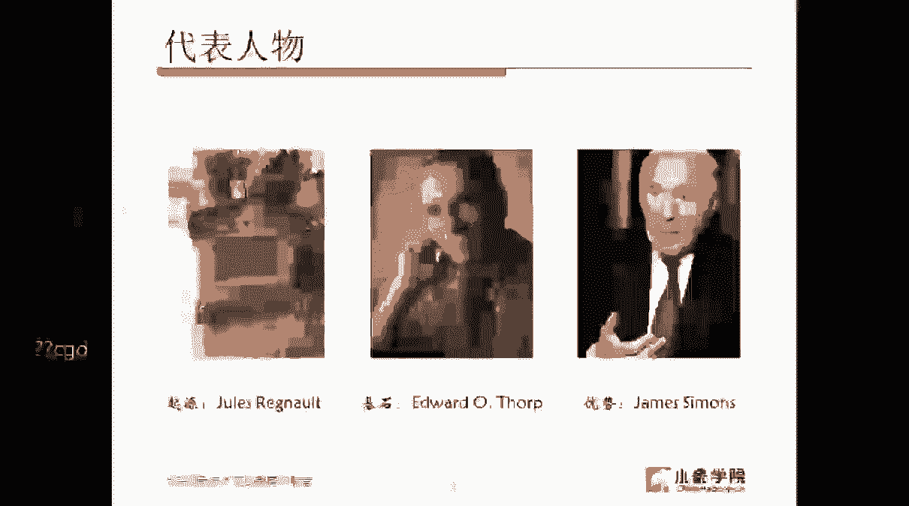

已经拥有了300万法郎的这个资产，300万法郎，如果按照这个汇率来计算啊，至少相当于20亿人民币。

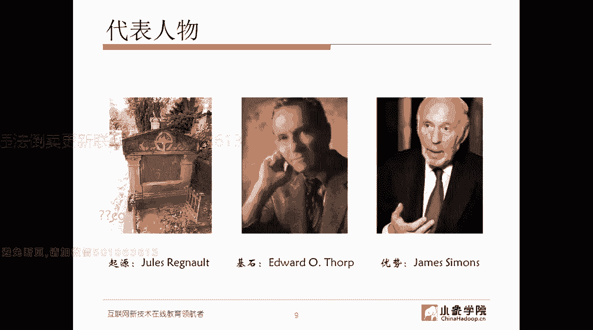

大概是这么一个水平，所以说一个简单的策略，就能够让它实现财富自由之路啊，那么那个时候他只能算是一个非常原始的一种，量化逻辑的一种思路，那么到了现在啊，中间这个人叫做爱德华索普啊，大家可能会知道呃。

这个人嗯其实在量化交易界比不是那么出名，但是呢有一部电影大家可能看过，叫做玩转20一点，讲的是mt1帮大学生怎么去拉斯维加斯赌场，去赌20一点，最后这个发家致富的，这么这么这么一个一个故事。

实际上这个故事啊，最初是爱德华索普击败赌场的这个故事，他是研究20一点啊，用数量化的方法，后来他又用这个量化的方法来击败了华尔街啊，嗯我们下一页PPT会详细的去讲他的故事，那么暂且先卖个乖。

爱德华索普被誉为是现代量化之父，那么真正让我们意识到，量化交易啊确实有前途啊，这个前不光是前后的钱，还是这个钱财的钱啊，两个两种前途都有，那么让我们真正认识到这一点的，应该是右边这一类叫做詹姆斯西蒙斯。

我相信大家也都很熟悉的啊，大奖章基金，那么文艺复兴啊，文艺复兴公司大厂商基金大涨基金，这这几年已经不再接受其他投资人的资金，只管理自己的资金，那么在他公开业绩的那20年左右的时间里，它的年化复合收益率。

而且是刨去给股东的分红啊，刨去给股东的这个投资人的收益以后，他自己的这部分是年化35%左右，已经远远的跑赢了巴菲特啊，大家知道巴菲特的年化收益水平，复合年化收益水平大概是20%。

而詹姆斯西蒙斯是我们少见的，能够在几十年里头，保持平均复合年化35%这样的水平啊，甚至可以说是唯一，所以说量化投资确实是很有前途啊，在詹姆斯西蒙斯身上得到充分的理解，那么刚才说到索普啊。

简单给大家讲个小故事，为了加深大家的印象，对人他是嗯学物理的啊，他的这个呃上学的时候学的是物理，后来呢是呃留在这个IP啊，教数学，嗯是教数学的教授，然后这个人的兴趣很广泛啊，是一个怪才。

嗯在上个世纪50年代呢，他看到了美国军方有个海军啊，有个四骑士一个小组，这四级是小组，有不务正业啊，用海军的计算机在研究20一点，而且还写了篇文章啊，四骑士联合发表了一篇文章。

叫做20一点的这个支撑策略吧，啊大概是这么一个标题，那么索普看到了这篇文章以后很感兴趣啊，他觉得说你们玩的那些数学的小儿科啊，在我眼里那好我用我更高深的数学，我看看21年到底能不能去。

至少所以他就研究啊，研究模型，最后真的是研究出来怎么去啊，20一点怎么去算牌啊，怎么去在20一点游戏当中能够做到常胜，然后他就自己又把他的成果也写了篇论文，写篇论文呢。

他就想把这个论文发表在美国科学院院报啊，发表在这么一个顶级的期刊上啊，这么一个顶级的学术杂志，但是呢这个美国科学院院报啊，他只接受院士的文章，索普还不是院士啊，他还没有牛到是美国科学院院士这个地步。

那怎么办呢，一般人可能就放弃了，但他不是啊，他天生就是个怪才，他去找他更大的一个怪物，这个人叫做克劳德香农，我不知道啊，这是现代信息论的奠基人和信息论的创始人，他可以誉为是在20世纪最伟大的科学家。

没有之一啊，他的这个成就甚至可以超过爱因斯坦，那么他本人也是个大怪物，锁骨啊，小怪物找到大怪物和呃大哥，你帮忙给发一下这个文章呗，啊20一点的常胜策略啊，那么一般我们会理解啊，说你说克劳德香农。

美国科学院院士啊，现在信息论的奠基人，就对于这么一个无厘头的要求，可能是一口回绝啊，但是不是这个大怪物非常高兴啊，坦然的接受，而且给他建议什么呢，说老弟啊，这个20一点的这个长政策略涉嫌赌博啊。

我建议你改一下题目啊，省的老学究们跟你叫板好，那这个索普非常高兴啊，马上把精力改，真的就发表在了科学引导人，这不是关键，等我马上就说了，哎说那所幸啊，一个羊是赶两个羊是放啊。

我其实真正的需求还不是发表文章，这个一直困扰我的一个问题是什么，我虽然我能够让我的策略玩20一点啊，这个策略本身啊能够这个胜率很高啊，其实也没有多高啊，只是高于50%啊，这个人家也不追求。

绝对说99%才是胜率高，不是这样的，只要他是高过50%，他就有有办法就能赢，但是呢他说嗯我有个问题没解决啊，我这个怎么下注，这个问题我没有解决，万一我点背，虽然说我的胜率高。

但是万一点背直接上来连输十把，那么我的本金要是一旦输光，我就没有机会再翻本了啊，所以说怎么下注才能保证赌资不被耗尽的，这个香农就说了，竹木雷山啊，贝尔实验室小凯利啊，他知道答案诶，那科普就去找凯丽啊。

对我们后来那个听说的非常著名的凯利公式，其实就是那个时候，这个凯利本身是一个物理研究员啊，他他的凯利公式，实际上是解决这个信道传输问题的啊，嗯逐步找到了凯利，凯利就说了，说我这个公式。

它可以计算出每次下注的这个资金，百利资金比例啊，能够保证在一个正期望的游戏当中，长期利率这个收益最大化啊，总统已经喜出望外了，好吧哥们咱就跟定了，那说到这儿啊，一般人可能说好。

我有了一个20一点的常胜策略，胜率高，同时我又知道了凯利公式，那这个我也还能保证我的赌资不被耗尽啊，资金分配我我也会这时候作为我们，如果是我们常人啊，我们肯定是这个一下就冲进赌场了。

我恨不得赶紧去收割赌场对吧，但这时候不是索普没没没没这么干，他又回到他的实验室啊，闭关了两个星期，为什么呢，大家知道吗，啊我们我们就不跟大家互动了啊，因为今天的这个课其实内容还挺多的啊。

我就直接接下来往下讲，他为什么回去闭关了两个星期，大家知道如果你去过拉斯维加斯啊，或者说你去过澳门的赌场，你你会知道说你是不能带计算器进去的对吧，你说我们先掏个手机。

然后上来直接就把手机当中的计算器打开，然后在那算算数，那也不行，那监控就把你一下拍得一清二楚啊，那你在算牌赌场是不不欢迎算牌的人的，所以说他回去以后，他要把他的模型，包括凯利公式要进行。

要制作一个速算模型啊，他要把这些速算表要背下来，只有做到这一点。

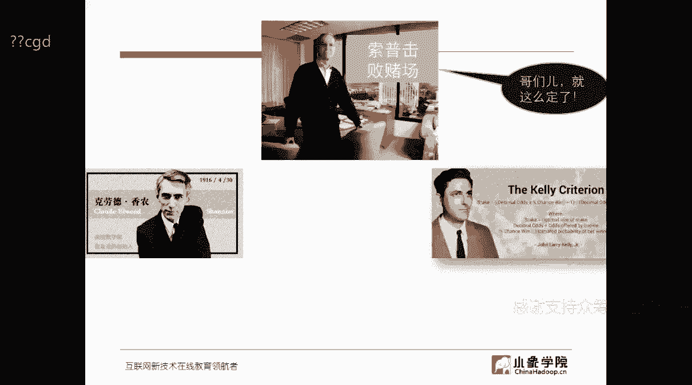

他才能在算牌的时候啊，脑子运转飞快啊，算计算精确。

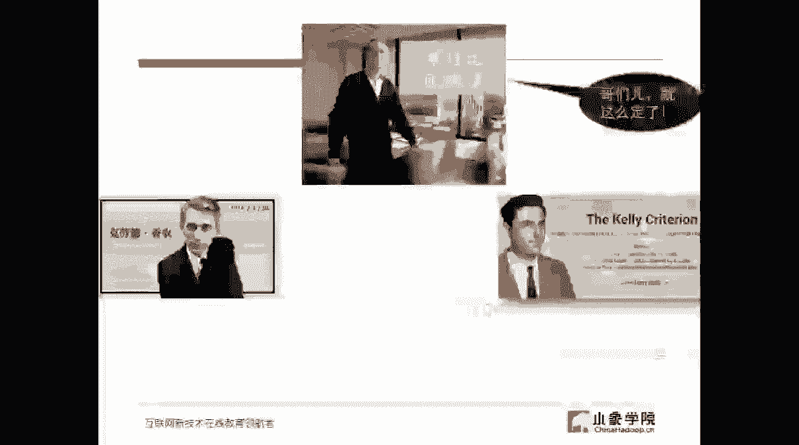

而且又不会不被发现，所以说这个机会总是给有准备的人啊，锁骨这么一个大牛人啊，人家也是教数学的教授啊，为了说这个击败20一点，击败主场人也是做了精心的准备啊，不是说这个不打无准备之战好了。

后来的这个结果啊，我们就不知道了，左辅呢击败了赌场。

而且击败了不止一家啊，他成为了赌场不受欢迎的人啊，但已经上了赌场黑名单了，哪个赌场也不让进啊，他这个他让赌场收财产，后来呢，所以说这个20一点不行了啊，不能再玩了，那怎么办呢，咱们就进军华尔街吧。

做股票做股票你不能不让我来吧啊。

他跟这个他的学校的另外111名教授啊，联合写了一本书，叫做科学的股票市场系统，这本书呢也被认为是现代量化的一个开山之作，大家有兴趣可以去读一读啊，嗯不是太著名，在在量化的这个书籍当中不是特别有啊。

但是人家毕竟是开山之作，而且索普呢跟他的一个粉丝一块啊，这个联合发了一支基金，这个基金运作了20年，平均年化收益在20%左右啊，也是没有一年是亏钱的，所以说人家这是真是说产学研一条龙啊。

这个学问做得也好，这个投资做的也好啊，可以称得上是量化界的楷模，所以是现代量化之父，那么锁骨不但这个呃学问好，做投资做得好啊，我们说华尔街这个互相吹捧识识人啊，识人充当伯乐的这个能力也是世界屈指可数。

他伯乐了谁呢啊，就是下面这个人啊，大家肯定都认识啊，沃伦巴菲特德国这个和巴菲特啊一见如故，在第一次见面以后啊，巴菲特就说说我第一次见到索普，我就开始利用他给我介绍的这个凯利公式。

来决定我每一项投资的资金投入了，那总谱怎么说呢，更极致啊，我就知道他将来就会成为世界首富，诶这个话他还不是白说，有证据，他回去以后把这句话写在了他的日记本里，还告诉了他的太太啊，所以这个都是有证可查的。

所以我刚才说嘛，华尔街这帮人之所以牛啊，它不光是它有一个氛围，他是一帮这个世界上最聪明的一帮人，聚集在一起，同时他们互相捧臭脚的这个能力也是世界第一，而回到最后啊，我们这门课的这个偶像还是这个人啊。

看慈溪公司，我们也希望能够做出有他的这个策略表现的啊，这样的这个业绩嗯，但是非常难啊，提前给大家上个眼药，非常非常难，不要想年化30%，我认为你只要做到复合年化15%啊，长期就稳稳的跑赢市场。

而且跑赢绝大多数人，所以嗯做量化不见得说，我们一定要获得多高的收益，关键问题就是说呃第一你能够在看错的时候，不至于去死，不至于死掉啊，通过各种风险管理，资金管理，然后各种手段。

那么保证你在看错的时候不至于死掉，而在这个其他的时候啊，被你抓住啊，一个一个稍纵即逝的机会，那么量化的特点呢，就是说它克服了在一定程度上，我们不说完全克服，在一定程度上克服了人的情绪的这种偏差啊。

而且拓宽了我们的认知的宽度啊，计算机程序自动去执行带来的好处，就是它不会被我们个人的情绪所左右，同时它还提高了我们自己的效率啊。

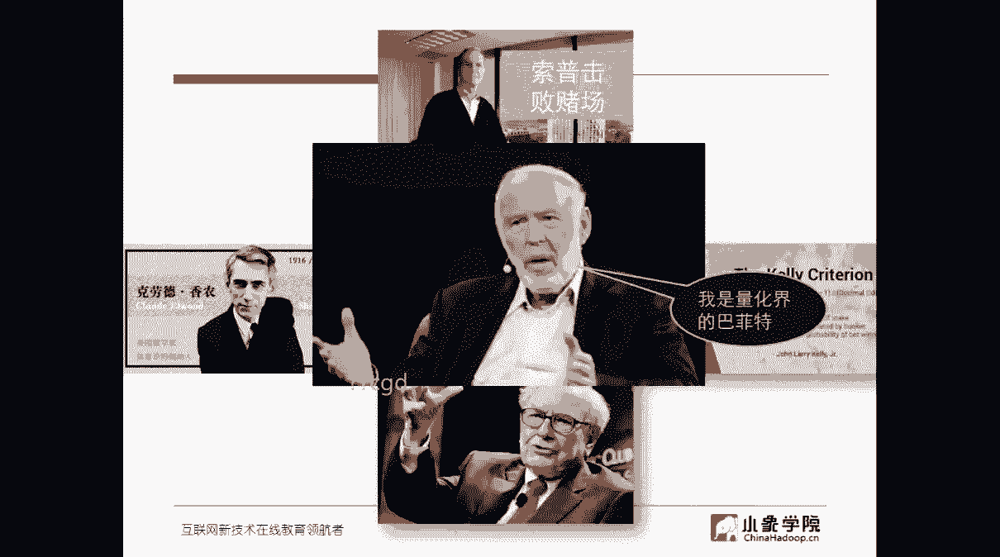

好吧这个故事讲完了啊，这个故事让大家听一听都很冷静，那么我们回到这个量化交易本身的，这个发展的问题哈，这张图我简单说一下啊，不不占用太多的时间，左边这个是在14年之前啊，总共有438只基金产品当中。

量化基金我们说这是属于量化来做决策，而不是算法交易啊，算法交易，程序化交易，量化交易它属于不同范畴的事情，算法交易呢通常来讲是指最后下单的啊，这个步骤是通过程序来执行的，那么券商当中什么PB系统啊。

这些东西嗯都是来解决这样一个问题，也就是说举个例子啊，说我我这个资金量比较大啊，我现在要买这个100万手的万科啊，大家想想100万手啊，这这是很大的一个也一笔资金了，那如果说我100万手一次去买入啊。

对不起，你可能一下就把这个股票给打成涨停了，所以呢我们会通过算法交易把它拆单啊，用最低的成本啊，最经济的方式把这一个大单，然后拆成若干个单，然后让他去执行，让他去完成这个交易，这叫算法交易啊。

但是我们在我们这个课上讲的量化交易，它不是算法交易，他是说我要买万科，什么时候买，什么时候卖，买多少卖多少，这件事都是通过量化交易模型来进行决策，我们把这个叫做量化交易啊。

那么在这里说的12%的量化交易，也是指这种基金好，也就是说占比其实并不高啊，只有差不多1/10左右是属于量化基金，但是呢在这个07年到16年啊，这是差不多10年时间里头嗯，最高收益的20只基金当中。

量化交易的基金占了30%，那对比这两组数据我们得到什么结论呢，就是说量化交易的平均水平啊，却还是比整个的这个基金的平均水平，要稍微高一些啊，从统计意义上来讲稍微高一些，或者业绩更稳定一些，那么第三个图。

这个饼图指的是我们国内量化交易的这个，或者说量化量化管理的股票类资金基金，它的这个资金规模占比也就是5%，5%，在去年的第一季度啊，量化股票，量化基金管理的资金规模是1600亿。

其实只占我们整个市值的差不多3‰，3‰左右，而美国什么水平呢，美国大概在去年同期哈，量化基金管理的资金规模，大概在1万亿美元左右，差不多占他整个美股市值的4%左右，也就是说比我们高十倍还多啊。

所以说通过这这组数据我们可以看到啊，量化基金本身表现还是相对整个市场而言，相对更稳定一些，同时呢在中国还有很大的发展空间啊，我们纯量化基金管理的资金规模还非常小。

所以说在未来几年应该是迎来一个高速发展期，那么大家来学这门课啊，确实是学着了啊。

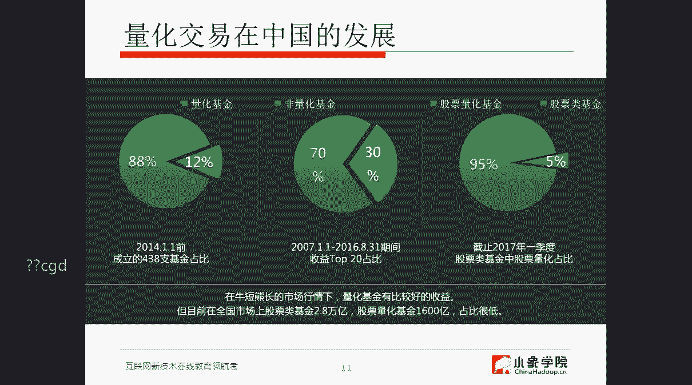

未来很有前途，再简单介绍一下金融工程模型的一些分类啊，在这列举了一些，其实我不想详细的讲了，因为咱们有很多人都有，这个都有主观交易的经验，所以呢遇到这个名词也会很容易。

就可可能除了期权这一块稍微陌生一点啊，股票ETF那么采用的阿尔法策略呀，对冲啊，期限套利啊等等，那么这些都是一些策略的类型啊，变化策略的类型，那么期货债券啊，这里头嗯像主流的这个单边啊。

之后呢就是CTACGA的趋势性的策略啊，占很大的一个比重，还有就是像均值回复啊，统计套利啊，事件驱动啊，试验驱动，日内波段，这些啊都是一些策略的类型，在这我不想多说了，包括期权。

期权呢我们这六次课不涉及啊，在这只是给大家打一下，因为期权相对比较复杂，那么在这讲这一页PPT想起到一个什么作用啊，就是想给大家嗯加深一个印象，任何做任何品种的投资啊，都有一个平均的生命周期。

这件事很重要，大家知道A股市场，新韭菜长成老韭菜或者被收割，平均的周期大概有多长两年啊，也就是说新韭菜从入世到输光自己的本金，然后忘掉啊，卸掉自己的交易软件，忘掉自己的账户密码。

这个过程差不多要两年的时间啊，也就是两年才能赔光啊，或者两年从新韭菜蜕变成老韭菜，不会轻易被收割了啊，大概是平均两年左右的时间，那么期货呢，期货的这个平均生命周期要短得多啊，平均大概是三个月左右。

为什么，因为期货它是自带杠杆的品种啊，一旦加了杠杆，如果你没有相应的风险控制的这个措施啊，你你的主观交易嗯，如果你的这个心理不够强大啊，没有相应的风控的意识，如果是程序化交易啊，你的策略不够如吧。

那么在期货市场上存活三个月啊，就可以去跳楼了啊，这个天台上可能有一块地方就属于你了，那期权的期权在这没有准确的统计，为什么做期权的，目前在这个它跟做股票ETF期货债券不一样啊，股票大概99%啊。

投资者这个结构当中99%是散户啊，我说的是中国啊，国内市场美股呢可能机构会多一些啊，散户少一些，那么做期货呢，期货大概70%以上也是散户啊，所以说这两个品种啊基本都还是散户式，但是期权不一样。

期权散户去做期权的非常少啊，因为这个品种相对复杂一些，这个背后的一些逻辑啊，嗯可能不是一般的散户能够快速掌握的，所以说期权这里呢现在玩的基本上都是大户，都是机构，所以说这都是高手博弈，高手博弈啊。

这个我们普通老百姓，最好先不要去盲目的去参与啊，风险太高啊，期权的这个杠杆要比期货啊来讲，平均的杠杆率要更高，所以死的会更快啊，但是因为高手博弈嘛啊，高手博弈的一个特点，就是说拉平了整个的收益啊。

收益不会太高啊，大家都是非常小心谨慎啊，那么说这个啊给大家强调一点，做投资做交易首先讲的是活命，活命第一位，整个这个市场它的外在的客观表现就是吃亏，二平一赢，这是股票市场，期货要赢得更少啊。

所以说期货市场，经常这个高手们就是经常感叹的一点，就是韭菜长得太慢，被割的太快，三个月就割完了啊，长得不够快啊，但是股票呢这个受大的行情影响又比较大啊，大牛市的时候，这个卖房子卖地啊。

恨不得这个啊就是全全资杀入带杠杆啊，满仓带杠杆在在熊市啊，像现在这样的环境下，都跌到这么便宜的地步了啊，你又不敢进了，大多数人又不敢进，又在又在那观望啊，所以说整个这个市场啊能活下来是第一位的啊。

只有做好了风险管理，你的量化策略才有可能啊慢慢的去收割韭菜啊，就是这么一个概念，当然也不要把割韭菜这件事想象的太容易啊，通常我们是抱着去割别人的目的入的场，结果通常是以被别人收割啊作为最终的结果啊。

这是总是一个辩证的关系啊，如果大家实盘经验越丰富，越能体会刚才说的这句话好了。

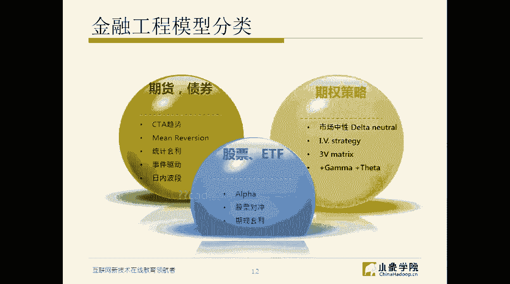

对于一些没有交易过的啊，就是初次来接触交易这件事情的人，我们简单的来看一下这张图啊，这张图再简单不过了，这就是个日K线，上证指数的日K线应该是前几天截的图啊，这两天的这个这到到周二吧。

应该是到这周二啊这样的一个过程，那么这张图上显示的上证指数的日K线，以及这还有两条均线啊，我们叫做均线ma5ma20，也就是白色的，这叫5日均线，紫色的啊，这是20日均线，也就是说一个是短时均线。

一个是长时均线，这两个均线啊反复的纠缠啊，在这交叉出现过这么几次交叉点，那么短时均线上穿长时均线啊，我们看这个点，包括这个点，通常意义上来讲，作为交叉类的指标，我们把它叫做金叉，反过来啊。

短时均线下穿长时曲线，这就是所谓的死叉啊，在这个位置，那么K线呢有实心的，有有这啊绿的实心的，还有空心的这个红的，那么就是表示啊，这个收盘价和开盘价之间的这个对比，收盘价要高于开盘价。

这就是空闲的这个收盘价要低于开盘价，这就是个实心的啊，当然也有嗯这个真阴线假阴线，真阳线假阳线啊，这些在这其实不是重点，那么我们做量化啊，我们量化的很很大一部分。

这个输入数据的输入的来源实际上就是价格啊，而怎么去描述一个价格呢，通常来讲K线是我们用的最多的，描述价格的方式，一根K线当中包含了高开低收四个价格啊，开盘价，收盘价，最高价最低价。

那么怎么去利用这些价格，这是我们量化策略每天都会用到的啊，这些指标啊，这些数据，然后同时还有成交量啊，如果是期货，还有一个持仓量啊，所以说就是价量，价格和量量里头有成交量和持仓量啊，那么我们每天从价格。

从技术分析的角度去做的量化策略，每天都要跟这些不同级别的K线的高开低收，持仓和成交啊，这些量和价这些关系啊打交道，同时我们还会有各种各样的技术指标，5日均线，20日均线，60日均线啊，或者其他的啊。

可能大家耳熟能详的什么BCDKDJ啊，RSI这些，这都是一些嗯通过大多数，通过价格的一些运算啊，通过一些公式运算得到的指标，有也有一些少量的这个指标，你可以使用这个关于持仓量和成交量。

这方面的量的信息啊，所以在这这是个基础，如果呃我们有学员当中还没有接触过K线图，没有接触过分时图嗯，建议大家嗯这个课下啊啊找找一些书籍也好，百度一下也好，然后打开一个行情软件，去看一看里面的这个品种。

熟悉一下，因为这是一个基础啊，我在课上就不讲了。

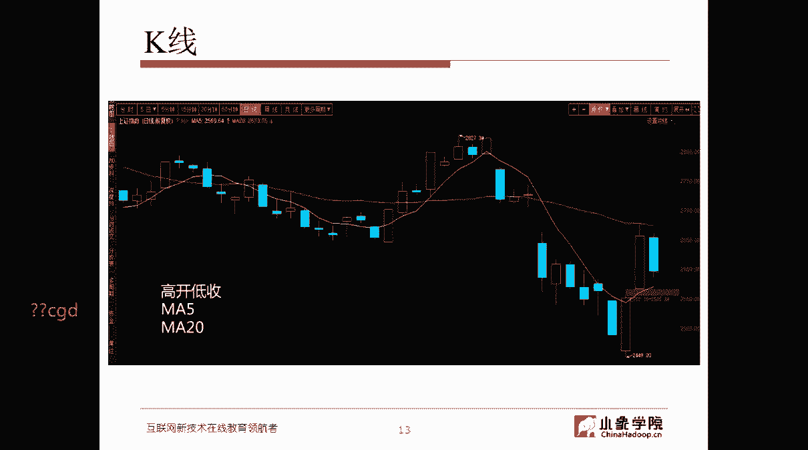

那么如果不熟悉的话，大家自己一定要去课下熟悉一下好了。

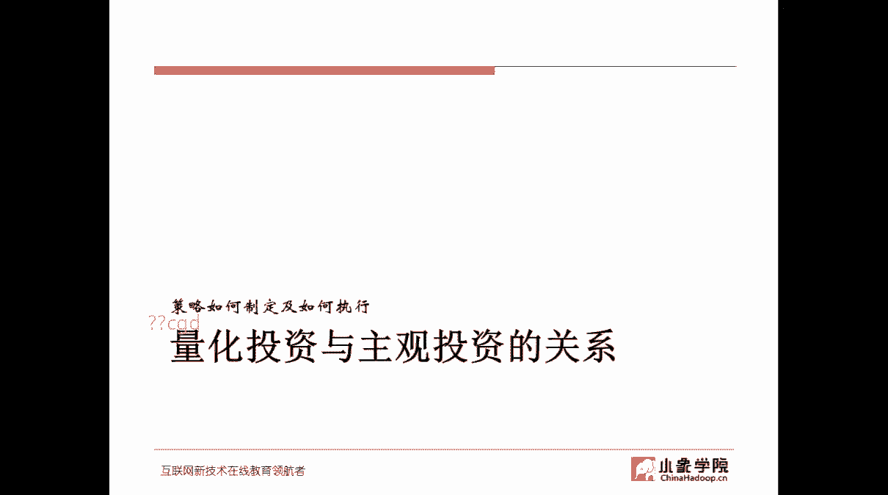

那我们接着接下来讲一下，量化投资和投资的关系啊，我经常讲一句话，你交易的是你的观点，实际上我们并不是真正对市场进行交易啊，市场的走势我们是没有办法去预测的，我们没有这个能力，我们不是上帝，不是神。

所以我们没有办法精确的去预测市场，那么我们通过什么来进行交易的，那我们只能是交易我们内心的观点，我们脑子里的对这个趋势的判断啊，我们认为这只股票的价格，在后面一段时间有可能上涨。

那么这时候我可能就要做波特，反之我认为他嗯未来一段时间要下跌，这个时候我就去做空啊，比如说这个美股啊，我其实早在三个月前我就开始喊要做空美股啊，但是直到最近这一周，做空的效果才慢慢开始体现出来。

所以说我们都不是神啊，但是我们可以交易我们的观点，我在三个月前我就开始看空美股，那这个时候我至少第一，我的做法就是再也不开多层啊，那么什么时候开始做空呢，那我要嗯对于不同的策略，不同的风险承受能力。

那一种做右侧交易，我就要等到它这个下跌的这个趋势，开始形成的时候，我才开始入场啊，那么如果我想做左侧交易，那我就认为它每一次上涨我认为到极致啊，开始放放大量啊，有这种派发的嫌疑的时候。

那么指标也都钝化了，这个时候啊，那我可能认为从行为金融学的角度啊，这个市场走的差不多了啊，那这个时候我就开始可能少量的建一些，左侧的顶层开始做空啊，就是这所以说我交易的是观点啊，并不是真实的这个市场。

如果我们都能够交易真实的市场，那我们每次都能做对，我们都赚钱了，但实际上我们只是交易自己的观点啊，我做出什么样的判断，我就会执行什么样的相应的操作，那么这些观点啊，我们可以把它分成两大类。

一类叫做理论驱动，一类叫做数据驱动，什么叫理论驱动，简单的说啊，我们这个不不不从这个学术上去探讨这件事，没有太大的意义，在清华这个讲课的时候，可能还是稍微多说一些学术的，但是我们这个课以实战为主啊。

理论驱动啊，大家可以理解成我所有讲的出道理的，或者说我之前的大量的主观交易，其实我可能是通过理论系统的方式啊，我看我分析基本面，分析价值，分析公司的内在价值，我看这个技术指标的趋势。

那么我认为在什么条件下，大概率都会发生什么样的事情，而这个事情背后对应着说交易的参与者，他的心理上的这个一些极端的行情下的，一些心理上的表现，以及大家经常会犯错误的地方，那么嗯通过这对这些表象的判断。

实际上形成了背后的逻辑，而这些逻辑就是我的理论，这些我就是通过这些理论来进行，我的这个交易策略的制定，这叫理论驱动，那和它相对的什么叫数据驱动，举个最极端的例子，这个前几天我还跟一些老股民聊啊。

其中有一些这个哎呀，被姜文的书洗脑洗的太多了啊，开始观测宇宙，太阳系这个九大行星或者八大行星，然后再加上什么月亮，还有其他的这一些这个卫星，构成了这样的一个体系，它的运作啊，这个运转，然后和我们的股市。

这这么一个交易啊，也就是说他认为啊从相关性的角度来讲，凡是发生了一个什么天体，在某一个地方出现了一个什么情况，那么就会对应着A股的上涨或者下跌，那这个东西实在是真的讲出什么道理啊。

我我即便再去想耐心的去听他们，把这套理论体系来讲完，但是我还是认为这只不过是一种巧合啊，或者说是一种单纯的数据驱动啊，也许在过去100次当中确实有这个60次啊，这个是对的啊，但是那下一次还能不能对。

以后在一新的100次当中，有多少次能对这个事儿完全不靠谱啊，当然了，数据系统也有相对靠谱的啊，我们经常看到的大数据挖掘啤酒和尿布啊，就是讲的这些经典的例子呢，它确实它的相关性。

背后有一定的这个原因的支持，那我在这里想强调的是，数据驱动不能简单的去用相关性的分析，更多的是要我们还是要找到它背后的一些逻辑，或者说数据背后的一些理论啊，如果是这样的话，你用起来才相对放心啊。

大门派人家提现在价值型，成长型，技术型，组合型，指数型价值型，他的观点是说，公司的这个一个证券的内在价值啊，当它内在价值如果高于现在的价格的时候，那就说明它的价值被低估了啊，现在价格已经很低了。

那这个时候就可以买入，而当价格高于内在价值，或者说跟内在价值啊，基本上到达同一水平的时候，这时候就可以考虑卖出了，这就是价值型的投资啊，成长型投资是认为什么呢，认为内在价值的成长速度。

要比价格的成长速度快啊，只要是内在价值成长得更快，而价格即便也在涨，只要没有内在价值涨得快，它就有成长型的投资价值啊，技术型呢就是我们大量理解的啊，所谓看技术指标也好，看其他的这些这个情绪啊。

这个驱动啊，情绪的这种这种分析都属于技术派，那么组合型是什么呢，组合性是说啊，我其实并不太考虑这个价值和价格之间的关系，我看重的是收益和风险的关系啊，那我认为我只有当付出一定的风险溢价的时候。

我才能够获取相应的超额回报，所以我就要构建我的组合，要么我在风险这个固定的前提下尽量去优化，尽量去扩大我的收益，或者说在保持收益稳定的情况下，尽量去减少风险，通过组合配置来实现这样一个目标，指数型的说。

你别别忙活了啊，瞎忙活也没用啊，你付出再多的努力，也不能长期跑赢市场啊，干脆买个指数吧，这就叫指数型的投资啊，被动投资。

因为做到了啊，我们也都可以去一次去量化，它用不同的方式去量化，那么在这儿其实想跟更多的，既然我们讲这个嗯理论驱动啊，主观交易和量化交易之间的关系，不得不提一个非常著名的有效市场假说。

这是获得过诺贝尔经济学奖的一个理论啊，当然我对这个理论非常不屑啊，这个理论说的是什么呢，说的是它有三种形式，三种什么形式的假说，在弱势有效市场的情况下啊，价格已经反映了这个过去历史证券的。

这个全部信息了，所以说在这个时候啊，嗯技术分析已经没用了，那么只有只有基本面分析，还能帮助你获得超额利润，就是说在弱势有效市场假说前嗯，成立的这个前提下啊，技术面啊已经不起作用了。

那么半强式有效市场假说是说什么呢，说这个基本面分析也没用了啊，这个时候只有内幕消息可能才起作用啊，到了强势有效市场假说，即使你有内幕消息，也没有了强势有效市场假说的情况下。

你没有任何方式能够帮助你获得超额收益，也就是说无论是技术面，基本面还是消息面啊，统统回家关灯吃面，这就是有效市场假说的这个形式，三种形式，但是事实是这样吗，如果是这样，我们就别学量化了，原来你没用。

大家直接全做被动投资了啊，直接买指数就完了，但是我的观点啊，包括我大多数做量化人的观点啊，人性当中对于获利的贪婪，和对于损失的恐惧是亘古不变的啊，这个话多铿锵有力啊，更不变啊，为什么做交易的是人啊。

只要是人参与的事，他就没有理性的一说啊，大多数人都是非理性的，而且即便你平时是个理性的人，到交易的时候啊，面临贪婪和恐惧的时候也都是非理性的啊，会有大量的非理性行为，这是因为这些非理性行为的存在。

我们的量化才可以帮助你，快速去捕捉那些套利的机会啊，那么大家知道去年的诺贝尔经济学奖获得者啊，诺贝尔经济学奖获得者理查德塞勒啊，就是去年刚获得，而且过去的这个大概过去的7年当中，还是过去的10年当中。

有三次诺贝尔经济学奖，都是授予了行为金融学的学者啊，理查德赛，这就是其中最著名的一个代表，他也是靠他的行为金融学院，其实他也发了一个产品啊，而且表现很不错，他不光是有理论，还有实战啊。

在这我们简单的举三个例子吧，看时间这个第一节课时间关系也快到了啊，我们简单说快一点，禀赋效应，禀赋效应说的是什么呀，是说简单说啊，我说大白话不说它的原本的晦涩难懂，大白话禀赋效应就是说一个东西。

如果你拥有它和没有拥有它之前，你对他的看法是截然不同的啊，你比如说啊茅台，我说的茅台这支股票啊，不是说的茅台酒盲猜这支股票，它过去在100块钱的时候，你当时还挺看好他的，但是呢因为你没有拥有它。

你没有买啊，他不是你的持仓股，那时候你会觉得100块钱还是太贵了，我等一等，等他回调到80块钱，我再买，结果你就等不到这个机会了，他一路二百三百四百五百啊，一直到了800，最近才开始回调。

回调到差不多600多块钱啊，所以呢在你没有拥有它的时候，你觉得他哎呀还是太高了太贵，这个时候我再等一等吧，但是呢一旦你买了一只股票啊，可能甚至是一只垃圾股啊，你十块钱买的，首先买进来以后，结果一路下跌。

跌到了六块钱，那么这个时候你你会怎么想，哎呀，这股票当时买的时候其实挺看好的，现在跌到六块钱，只是市场不好，忍一忍就行了，忍一忍他还回到十块钱，但是你再也没有等到他回到十块钱的机会啊。

这就是禀赋效应在起作用，禀赋效应使得我们对于，你拥有的东西和没有拥有的东西啊，你的这个态度是不一样的，所以这就解释了为什么啊，我们通常我们当我们的股票在亏损的时候，我们舍不得卖，因为我已经拥有他了。

我对他的这个看法已经发生了改变，已经不够客观啊，跨期选择，宽选择指的是说在人类的这个决策系统当中啊，有一个长期抵制系统，也有一个短期冲动系统啊，短视冲动系统，而一般人如果没有经过长期的训练啊。

没有刻意的训练，通常来讲，我们的短视冲动系统，要远远强于这个长期理智系统啊，这就导致了其实比如说股票市场当中，大量的韭菜是反复操作啊，换手率特别高，反复操作反复做错，反复割肉，反复又追高进场。

所以跨期选择也决定了，实际上是啊有有有非常多的破绽啊，在跨期选择这件事上，他有非常多的破绽，心理账户，心理账户指的是什么，心理账户指的是说我们在我们的心目当中啊，对于不同的东西。

我们会分别分门别类的去记账，比如说对于账户当中浮盈的啊，浮盈的股票和浮亏的股票，我们实际上把它记在了不同的账户当中，我们倾向于卖出已经盈利的股票，而保留亏损的股票，是因为什么呢，是因为在心理账户当中。

我们认为嗯我们希望这些浮盈尽快落袋为安，而对于那些浮亏的股票，我们单独记账以后，我们倾向于让他啊，我们我们认为总有一天他会回本的，所以说同样是这个股票啊，股票账户用的股票。

我们在心理上给他有不同的记账的账户，分门别类的去看待，这样也导致了大量的这个所谓的非理性，交易者啊，经常会犯错误，那么行为节目写啊，捕捉的就是这些投资的这个参与者，平时经常会出错的地方。

那么我们的量化交易策略啊，我认为其实比较务实，比较有效的方法，也是在考察你的交易对手，经常会在什么地方犯错误，而我们通过量化的方法去捕捉到这些机会，如果你要通过主观交易去做，你很可能你的观察能力。

你的注意力是有限的，你可能只能抓住少量的这样的机会，而通过交易啊，通过量化交易的这个策略，我们就可以在市场当中尽量去宽的，去捕获这样的机会，这就是量化交易给我们带来的一个优势，所以说赚谁的钱赚谁的钱啊。

这个是只要你是在做交易，都必须深刻思考的一个哲学问题，市场上只有两种啊，我认为只有两种赚钱的机会，一个是在某一个特定时间内的无效性啊，或者说是别人这个时候犯的错，你比如说价值投资。

他从本质上来讲就是抓住别人啊，你的对手在某一个特定时间对于某些标的物啊，他犯的一个估值错误，那么你抓住了这样的错误，你就有可能获利，另外一种就是主动承担某种特定的风险，来获得这样的一个风险的风险溢价。

这个类比一下，比如说我们知道那些保险公司他们赚的什么钱，他们赚的就是说，我主动承担了一些小概率事件的风险啊，但是只要这些事不发生，我就固定的收取你的宝保险费啊，所以说这就是承担特定风险来获得的风险溢价。

本质上就这两类赚钱的机会，而赚的是谁的钱呢，赚的就是你的对手的钱啊，你卖保险赚的是这些投保人的钱啊，你做价值投资，赚的是这些在特定时间内出现估值错误的，这些人的钱啊，你只要你赚了钱了，就一定有人亏钱啊。

这个市场说零和也好，说复合也好啊，他就是这么一个抢钱的游戏，所以说我们的量化策略和主观策略，其实没有本质的区别，它唯一的区别就是在于，这个策略是怎么被制定和怎么被执行的。

量化策略的制定是我们通过大量的数理分析，通过统计分析捕获到的，在概率上，在统计上能够被我们利用的这种交易机会，而执行，大多数量化策略都是通过计算机，通过程序化自动的去执行，那么这样还有两个好处啊。

我们也反复强调，第一是提高了啊，拓宽了我们认知的宽度，你用程序用计算机去执行，可以信尽量多的去捕捉到有可能的交易机会啊，而同时你通过程序自动去执行，避免了我们人性当中的一些情绪的弱点，让我们少犯错误。

这就是主观投资和量化投资本质的区别，而这个区别啊，并不足以说让我们认为主观好还是量化好啊，都有各自有各自的好处，也各自有各自的缺陷，所以说量化投资它也是投资，量化交易它的本质是交易啊。

我们一定要从交易的角度去思考问题好了，在休息之前啊，我们先来认识一个量化交易策略，刚才白活了这么半天哈，大家可能对量化投资这个领域有了一定的认识，那么究竟量化交易策略长什么样呢。

我们先从一个简单的游戏开始啊，这游戏呢也是用的精心设计的啊，一个猜硬币游戏说有一个美女啊，找到了左边这个美女，找到了右边这个屌丝啊，美女说啊，说小哥哥说这个咱们来玩个游戏吧，这游戏很简单，就猜硬币啊。

咱们俩手里头一人有一枚硬币，咱们出硬币同时出硬币啊，出正面或者反面，如果咱俩出的都是正面，那么你可以赢五块钱啊，如果咱俩出的都是反面，那么你可以赢一块钱，如果咱俩出的是一正一反，那么我赢三块钱啊。

大家听清了这个这个规矩了哈，同正或者同反屌丝都可以赢钱，如果都是正面，屌丝赢块都是反面，屌丝赢一块，如果是一正一反，那么美女赢三块钱，那这游戏能玩吗，那能不能玩，那老师一定说能管，为什么呀。

哎不过按概率算啊，这个一正一反的概率是1/2，同正逢满的概率也是1/2，那么一算期望收益那是零啊，也就是说如果这个游戏长期玩下去，我不赚不赔，不赚不赔，不赚钱没关系，有美女作伴跟美女搭讪。

跟美女一块聊天，不花钱还能泡妞，这多好啊，哎所以说屌丝啊，大多数屌丝一定会选择玩这个，一玩出问题了，越玩输的越多啊，他不是像我刚才计算的是个零期望的游戏，他怎么又玩数字越多呢。

哎我们看一下美女的量化策略是什么样的啊，你假设表示出正面的概率是X，那么它出反面的概率就是一减X，那么美女出正面的概率假设是Y，那么出反面的概率就是01：30啊，大家跟上啊。

那么我们来算一下屌丝的期望收益，屌丝的期望收益可以用这个表达式来计算啊，我就不要了啊，大家一看就看明白了，化简一下就是这个啊，那么我们假设想让屌丝的期望收益始终为负，也就是美女始终都去赚钱。

那么相当于解这个不等式啊，这个不等式就是12XY减去四倍的括号，X加Y再加一小于零，写这个不等式，解这个不等式有个约束条件，约束条件呢，就说XY都是0~1之间的实数对吧，那么这个不等式很容易解啊。

这是一个初等数学的一个数学题啊，如果大家不会解，那么自己回去复习一下初中的数学啊，我这就不给大家解了，直接给答案，答案是什么，只要美女出正面的概率，保持在1/4到3/8之间。

那么屌丝的期望收益永远是负的，永远是小于零的，也就是说只要美女啊，大家算一下这个数，只要美女以0。3的概率来出正面，那么美女就可以一直赢下去，玩的越多，美女赢得越多，那么变成一个量化策略。

量化策略还要强调它能执行啊，因为人不是一个随机数发生器，所以说如果美女不是按照0。3的概率，去随机出硬币出正面，那么很可能这个他的这个行为啊，出正面的这个规矩就会被屌丝发现啊。

就很可能就不能固定的去呃去赢钱了，所以说这个策略真正的量，把它变成一个量化策略啊，它的真正的一个执行还要加上一个，就是说我用一个程序来产生期望为0。3的啊，这样一个伪随机数序列啊。

那么根据这个数列的结果啊，为随机数序列的这个结果来出硬币，那么我就可以固定的去收割屌丝了，这就是美女的策略，来看看标签啊，美女啊在我们IP当中对应的就是庄家，而屌丝呢对应的是散户。

如果散户和庄家做的方向一致，那么我们还可以搭便车啊，那么我们还能赚钱，特别是当庄家做多的时候，如果散户也做多，也就是庄家出正面的时候，散户也出正面，那么散户赚的还不少啊，如果庄家出反面的时候啊。

也就是庄家做空的时候，散户也跟着做空啊，虽然收益稍微少一点，只有一块钱，但是毕竟也是赚钱的，但是一旦散户跟庄家做反了，对不起，那就固定了被收割，而且我们再回顾一下，回顾一下A股历史上的一个规律。

是不是在牛市的几率不到1/3啊，大多数时间都是熊市，2/3以上的时间是熊市，看看这是不是庄家固定收割散户的一个套路啊，安心了吗，好了诶，我定到休息啊，我们休息5分钟，大家可以嗯讨论一下，那如果你是屌丝。

怎么应对美女啊，怎么应对美女专家对你的这种收割呢，我们先休息5分钟，快回来好。

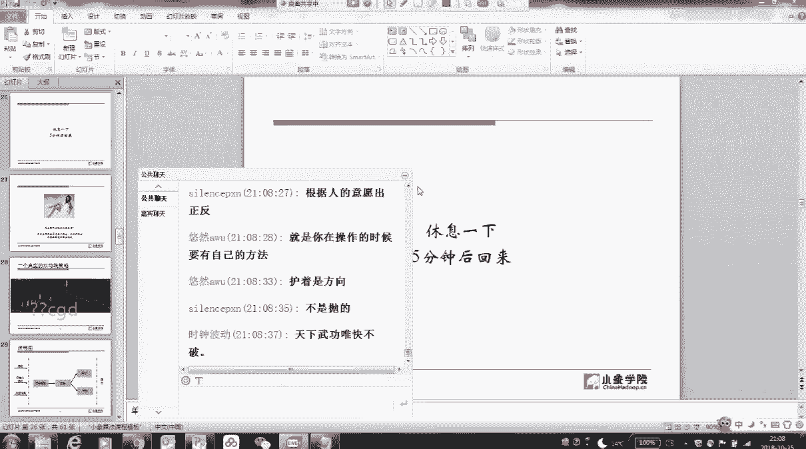

呃，那个最新的，嗯嗯对对对，原来的年龄还要更大对吧，我觉得十四十四的话能让它结束，不用你把它变成两个分，所以说大家告诉我看了那个剧，好了那个为了节省时间啊，我们这个现在就回来了，没到5分钟的时间。

我们继续上课哈，因为今天的内容还是比较多的，我不想拖堂拖拖太久，那我刚才的这个话题啊，美女策略的现实感到底存在吗，还是说了，可能讲其他课，讲Python老师也会讲这样的例子啊，但是我们的寓意是不一样的。

在这我们类比A股，类比庄家美女策略的现实版到底存在吗，我们说啊真正的群体博弈充满了假象，欺诈反制啊，所以不存在一个固定期望的游戏，也就是说一旦庄家他的这个策略被大多数屌丝，被大多数散户所熟知了以后。

哪一个屌丝会傻到，我明知道期望收益为负，我还要跟你玩呢啊当然了，他如果是认为这是一个泡妞必须要付出的成本，那我们就不讨论了啊，如果这是一个抢钱游戏，我明知道我肯定被你收割，为什么还要去玩呢，同样的啊。

当这样的庄家多了，那么市场上当中，这个庄与散户之间的这个关系，界限就没有那么清楚了，任何一个之前可能给你带来正期望的收益的，这样的一个策略，那么通过更多人的这个交易，都可能把这样的交易机会给抹平啊。

也就是慢慢的啊，这种固定的正期望的这种策略慢慢就会失效啊，这就是市场博弈的一个规律啊，大多数人都知道这种方法能赚钱了，那么啊他也就不会再赚钱了啊，那么大多数人涌到这里来，就会把这个交易机会给抹平。

这就是市场的本质啊，博弈永远都是变化的，唯一不变的是结果，什么结果呢，最终只是少数人赚钱，多数人是亏钱的，只有这个结果是不变的，而过程永远是在进化啊，所以大家一定要我们学量化啊。

也不是说我固定了一个策略，我就可以收割这个市场了，哪那么容易呀，如果真是这样，那我我出来讲这个课还有什么意义呢，如果真正的一个策略对你用，那就能永远的去赚钱，那么你想象一下。

那知道这个策略的人到底有多少啊。

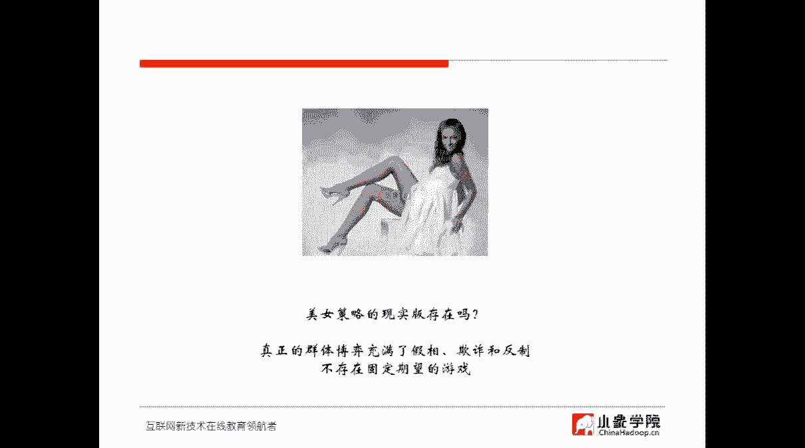

所以这永远是一个辩证关系，好吧，刚才讲的是一个数学上的一个文化策略啊，呃只是举个例子作为游戏，现在我们来看一看啊，呃更接近啊这个实际操作的一种量化策略，虽然简单啊，原理很简单。

但是把它作为一个量化策略入门的，这么一个例子，也不成为一个好例子啊，一个典型的双均线策略，双均线刚才我也提到有短时均线，长时均线啊，两条均线，那么均线其实它就是一个价格的平均啊，这个没什么好解释的。

非常简单不复杂啊，就是个滤波器嘛，一个滑动平均，那么我们看这个这这这个图，这是万科万科A这支股票啊，某一段时间的这个日K线，日K线当中，我们看这个黄色和白色两条均线啊，黄色均线应该是10日均线。

而白色均线是对应的5日均线，也就是个短短时均线，我发现五穿十也就是这样一个金叉，上穿的时候一个金叉，你如果是在这个点买，然后5日均线下穿10日均线卖啊，反复这么操作，在这个点买这个点慢啊。

红色箭头指的是买点，灰色箭头指的是卖点，还发现好像还不错，肉眼观察来看啊，所谓的金叉买死叉卖，别看这个逻辑这么简单啊，好像这个赢面还挺大啊，特别是这一段，你看你让我们吃了这么这么大一段利润啊。

从这个点一直到这啊，让我们吃了很大的一段利润，所以说我就在建立在这样的一个双均线啊，这个系统的这样的一个基础之上，我就可以构建一个非常简单的量化交易策略呃。

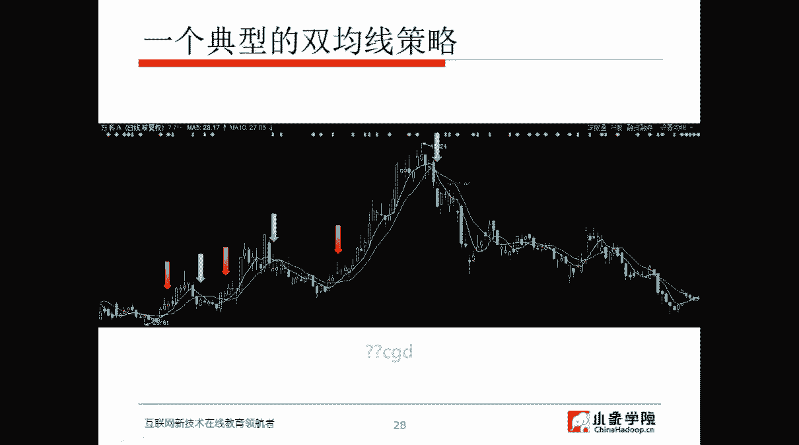

在这里呢我们说一下量化交易策略啊，最简单的量化交易策略，那也要包含一些必要的这个部分啊，首先是说我们的逻辑是什么，刚才我们已经说了，我们的逻辑就是一个简单的交叉系统啊，一个双均线交叉系统。

那么基于双曲线交叉来构造的一个量化策略，那么这个量化策略我要把它实现的时候，实施的时候，首先啊我需要做一些基本参数的一些初始化，然后再做一些数据方面的准备啊，量化策略它的输入这个一定是你的数据。

不管是行情还是其他的数据啊，那么有了这些准备以后，那我们就要构造一个信号系统，这个信号系统要完成交易信号的检测，有没有减交易信号，那就会触发我们的交易，这个交易分成至少要分成两种交易类型，一种叫开仓。

一种叫平仓啊，只有开商没有平仓，那你永远那只是一个你账户上，相当于你持有你的这个标的嗯，永远没有落袋啊，所以说这个交易信号随着交易信号的这个触发，那我们在执行的时候永远都有两种操作，它是对称的操作。

有了开仓就会有平仓啊，那么这些都实现了以后，那我们这个交易策略到底有效无效啊，我们需要靠什么方式去验证呢，我们需要有一个回测啊，通过历史数据来进行一个回测，通过这种方法，首先我们可以做一个验证。

但是回测如果不好啊，效果不好，那么你这个策略啊基本上确实是不好啊，如果回测效果还挺好，用到实盘当中也不一定好啊，这是一个更复杂的问题，我们会在后面的课再给大家详细去介绍啊，在这儿只要大家明白。

就是我有了逻辑，有了基本的配置，然后写了一段代码，完成了这个交易逻辑之后，我还要通过历史书记做一个回测的检验，来初步验证一下我们这个策略的有效性好了。

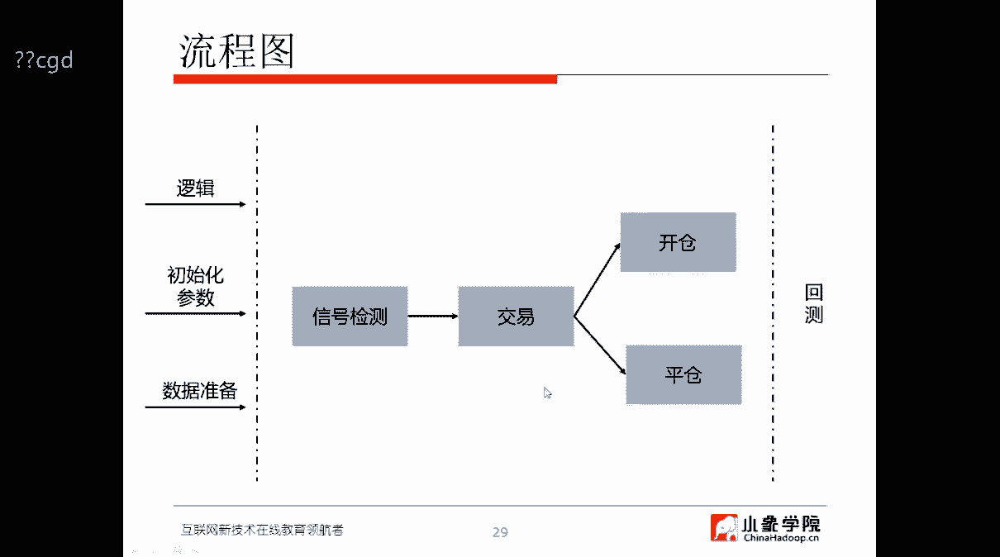

这是在巨宽巨宽平台上给出的一个例子啊，这个例子也比较简单啊，就是按照我们刚才的这个数据线，这样的一个思路，大家看到啊，先是做一些初始化，一些数据的初始化，包括什么呢，在这嗯这个代码语法我就不讲了。

只是给大家按照这个注释，我过一下这个代码，首先你要这个定义一个全局变量啊，定一个全局变量来保存你要操作的这个股票，这个这个股票呢是000002，就是刚才我们举例的半科A啊，同时呢我会设定一个基准。

这个基准叫做业绩基准，也就是说我的这个策略，最后有没有跑赢我的基准，在这我设的基准是沪深300这个指数啊，单曲Mark是沪深300，也就是说最后我要检验一下我的这个策略，到底有没有跑赢指数。

如果都连指数都没跑赢，那我直接买指数不就完了吗，然后呢我要设定一些成交比例啊，在这有一个use real price true啊，也就是说开启一个赋权的动态赋权的模式，这是在剧本上一种呃。

这去看自己定义的一种赋权的模式，那以后用到这个地方再给大家讲啊，在这时间关系，我们先不讲这个策略一些细节，然后我们再设定一个成交比例啊，在这有一个oil volume ratio啊，这设置为一。

也就是说这一天的这个交易量不要超过啊，就是你跟你对这只股票这一天的操作，你的成交量不能超过这支股票，当时当天的真实成交量啊，然后呢我们这儿还有一些参数要设置，因为我要尽量模拟真实的情况。

所以还要设置手续费啊，在这这个手续费和印花税，这个印花税开盘没有印花税啊，不是开盘，这个嗯在开仓的时候没有印花税，但是在平仓的时候有1‰的印花税，还有这个万分之三的啊。

这个开开仓和平仓各有万分之三的手续费，手续费的最小值是五块钱啊，这个呢也都符合我们的常识，我们要在任何一家券商，你去开户，基本上给你万三或者万二的手续费，然后同时呢如果你这笔交易假设啊。

你只买了比如说一手啊这个十块钱的股票，那么总共的这个交易标记的价值是1000块钱，那这个时候万分之三，这只有三毛钱啊，但是你这个时候实际上你交的手续费是五块钱，这是券商的一个最低的单笔交易的手续费啊。

这个就不多解释了，然后我们再做一些数据的准备，这里的数据准备就是我们的均线啊，我们设置N1等于五，N2等于十，这就是均线的参数，那么在这这个MN1等于这个close data啊。

这个这是我们的数据结构已经定好了的收盘价，然后通过这个啊命这个方法取到的一个均值，这个通过它就完成了5日均线和10日均线的，这样的一个数据的准备啊，我们数据准备以后，我们就要做交易了，在这判断条件。

当MN1大于MAN2的时候，这时候用就O的就做一个order啊，做一个买入股票的操作，那么买多少呢，这是cash cash有多少就买多少啊，这个cash就是我账户的资金，然后同时打个log。

为了之后便于分析啊，一个log点info，我们就把这个把它记录下来，同样道理啊，如果是MAN1小于MN啊，我们就卖出了啊，这里这个older target这the security。

然后就零零就表示啊把它卖光啊，有多少卖多少，同时也是把它打到log里面，然后最后呢我们再绘制一下这个均线，让我们在回测啊生成的这个图表我们容易看，所以这个real然后把这个曲线给画出来啊，就这么简单。

大家看一下，总共这才50多行代码啊，其中还有一半能注释，所以说写一个交易策略啊，其实有时候也没你想象中复杂啊。

几十行代码就已经完成了，然后我们呢通过最宽的这个平台，我们可以做一下回测啊，这个就是回撤之后给大家画出来的，这样一个图表，回测的周期是从16年到18年，总共两年的时间，前段时间我们看一下策略的表现啊。

红的这是刚才我选的沪深300的基准，而这个蓝色的是在万科A这支股票上，用5日均线上穿10日均线买入，下穿10日均线卖出的这样的一个方法来做的啊，这么一个策略，最终它的表现如何呢，一般般吧。

好像没有我们想象的那么好，不像刚才我在图上显示了一下，吃到那么大的利润，当然我们也有利润回吐的时候啊，看尤其是这这两个地点之间表示的这个策略，在回测期间的最大回撤，这个最大回撤有多少25%。

而且跨了一年的时间啊，就是说这一年基本没赚钱，回吐了25%的利润啊，但是最终呢好像还是跑赢了啊，在至少在同期跑赢了指数，跑赢了指数，这还有个下坡比例，0。28倒不太高啊，下浮比例挺低的。

策略的收益27%啊，转换成年化收益是13。14%，略微跑赢了指数啊，从收益的角度，这个就是我们看到的一个一个典型的量化策略。

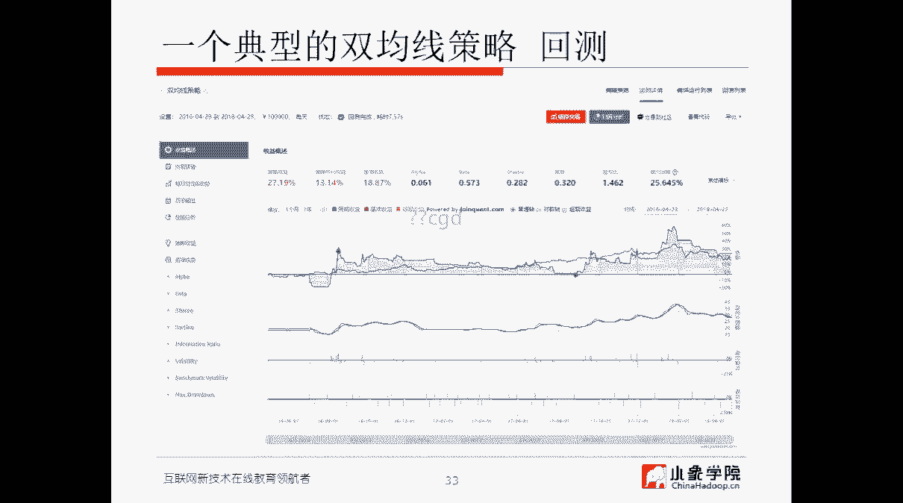

就长成这样啊，前面通过这样的一个流程图啊。

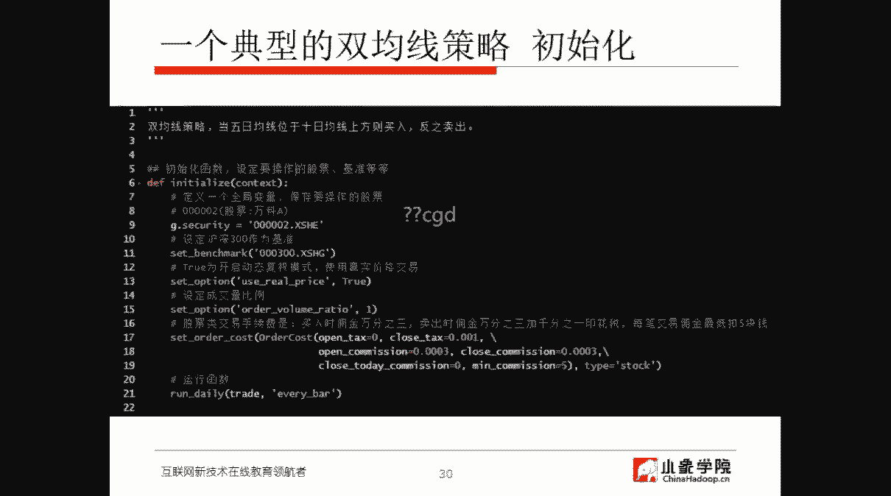

我们来进行量化策略的编制，然后呢每一步把它都写成代码，最后呢通过一个回测啊，最后跑出来一个结果去验证，当然了，我这里过程当中有很多跳步或者不完整啊，不符合真正的规矩的地方啊。

这个后面再带领大家去制作策略的时候，我们再去逐一分解每一步你应该去做的事情，在这提个思考题，前面这个代码能用吗，这样的一个5日均线，上穿10日均线的一个双曲线策略。

到底能不能在这直接给大家这个这个那答案啊，前面的代码当中至少有两个问题还挺严重的，这个代码不能直接用啊，为什么呢，他逻辑上有漏洞。

我们回到这个代码啊，首先，在这儿啊，这句话设定成交量比例，刚才我也解释了，如果这设的这个older volratio啊，它是一的话，这个VOLRATIO如果是一，就意味着说。

当天你可以实际成交的这个股票的数量，是当前这支股票真实的成交量，但实际当中你能做这么大吗，如果这一天的所有的成交量都是你做的啊，万科A某一天的成交量全是你做出来的，那你想象一下。

你能以当时的价格去买它吗，你还不把它干涨停了啊，那你卖的时候你还不把它给干跌停了，所以说啊，在这儿，有些时候我们进行回测，和我们真实交易有很大的差别，就是这些细节其实没做好啊，你在回撤的时候。

你对成交量根本没有做任何的判别，你可能你这个你恨不得你回撤的时候，你这个嗯策略的资金容量啊，就十个亿百个亿啊，你都不在话下，但实际当中你一只股票一下就把它全干进去了，这是不可能的哈。

所以说在这首先是不严谨，这这一行是不严谨的，另外还有一个比较大的问题，在这我们的判买入啊，交易的这个条件，两个均线，我实际上只比较了一个相对的价格的大小，然后我就全仓啊，如果出现了符合这个条件啊。

短时在长时均线价格之上，我就全仓买了对吧，我用所有的cash全都买进去了，这就两个问题啊，一个是说我们原始想设计的叫做金叉，买死叉卖，什么叫金叉呢，金叉只有交叉，而这只是单独判断了大小，没有交叉对吧。

交叉我回去看这张图。

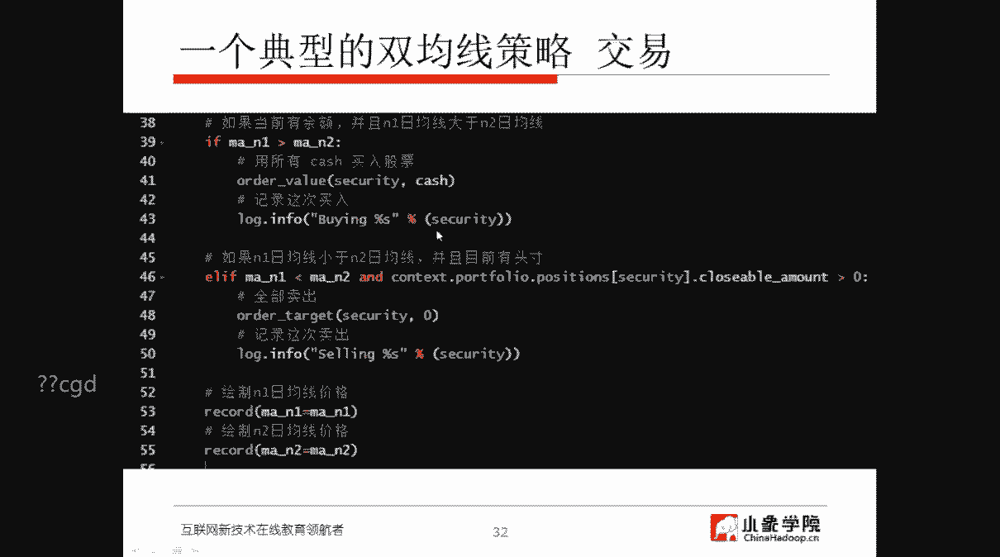

交叉他是一个女人，而如果判断大小，那么在后面的这所有的这些时间段。

5日均线价格都在10日均线价格之上，那就按照刚才这个逻辑啊。

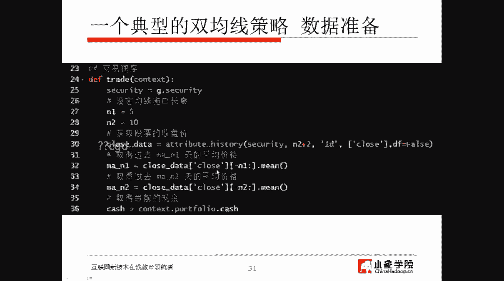

这行代码的逻辑，那就是说之后每根画啊，就是每一天我都会有交易的指令发出来，只不过因为我在第一次发生这个条件的时候，我已经把我的现金用光了，所以说之后再发生这个条件，我再去执行这个买入操作的时候。

实际上我是买不进来了，但是这个并不符合，我们一开始做这个策略的逻辑，金叉买啊，我们在这没有判断交叉，我们只是判断了50均线在10日均线之上，那我们就买，而50均线在生存线之下，我明白了。

我之所以说我巧合，我碰到了这个做出来的结果，跟我预想的也大差不差，是因为我是满仓操作，所以说我买就一次性全买了，卖我也是一次性都卖光了，所以这个时候即便我没有判断交叉用，这个条件。

其实跟交叉的条件最后的结果是一致的，但是在实际当中，我们的量化策略讲究的是风险分散，我们绝对不可能重仓一只股票，即便他出现了金叉买这样的条件，所以说我们通常是不会一次用在一只股票上，用光我们的头寸的。

那么这个时候这个判断条件就出了问题了啊，那你假设你每次用1/10的开始，那相当于你就会连满十天，那这个显然是不对的啊，因为越到后面这个价格涨上去以后，其实已经不是我们买入的机会。

所以这段代码我们看起来几十行，非常简单的一个金叉买死叉卖的一个逻辑，你会发现在量化策略在实现过程当中，你这里的坑还挺多啊。

整的挺好啊，但是问题很深，那么这通过这个例子啊，也是给大家提醒，量化策略其实没有你想象的那么简单，就这么简单的一个双均线的一个信号系统啊，这样的一个逻辑把它实现成量化系统，买代码的时候。

还有不少潜在的隐含的问题啊，所以说后面啊大家一定要跟上我们的这个节奏，我们再给大家举个例子当中啊，也会特意会提醒大家避免在逻辑上，你的量化策略的逻辑实现过程当中。

在写代码的过程当中会出现各种各样的漏洞啊，所以我们以后要尽量去避免这些事儿，因为它对应的都是你实盘操作的真金白银啊，如果一旦出现这样的bug啊，这样的逻辑上的漏洞，那么最终啊这个银子的损失是花花的啊。

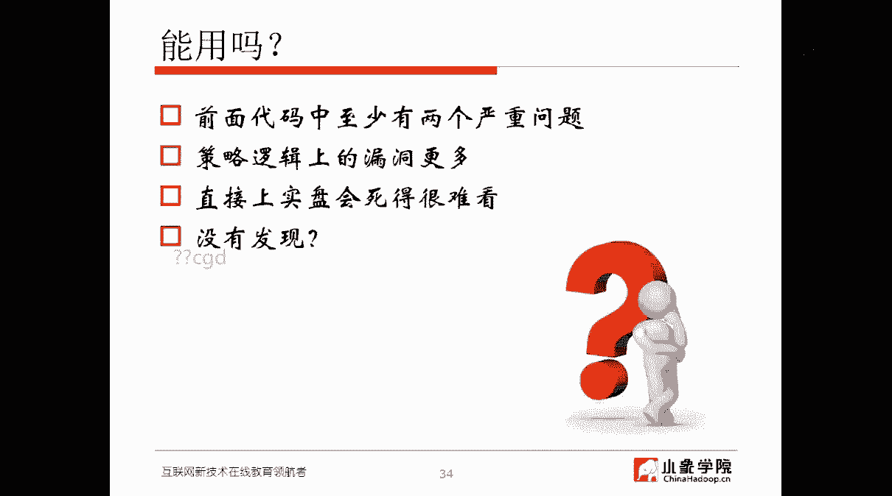

好我们再看一个例子，看看一个例子呢，这是我们自己啊，濮阳学院啊，自己开发的，我们自用的一个工具叫做普阳云，这样一个目的就是为了在不写代码的情况下，能够通过一些条件的快速组合。

能够嗯快速的去验证一个策略逻辑啊，当我们初步验证了一个策略逻辑，认为它值得去深入的去开发的时候，才会在上手去写代码，这样的话就是在一定程度上，提高了我们策略研发的效率，那么在这呢其实我我不我不给大家讲。

普两年了也比较简单，但这只是通过一些图形化界面勾勾选选啊，我们在这我们的选股条件给大家展示一下，一个K线形态检测，这是濮阳云自己带的，就是我们会自动的去扫描呃，所有股票的在不同级别下的形态。

然后去识别啊，自动的识别十种典型的顶部和底部形态，所以在这儿呢我会设置一个条件，在日线级别检测三重底，而且要求这个底部结构要大于15个，K线单位啊，要比较宽才才行。

那么我对股票的流通市值100亿到400亿，相当于中盘股啊，还有大于400亿大盘股，就是说我不做特别小的小盘股，大家知道这个这个小盘股有的时候啊，腰部会比较多，很难以把握啊。

量化我们一般要做一些流动性相对好的，否则的话你很可能那这个流动性瞬间枯竭，你的这个量化策略就会失效啊，当日量比我们要求一个温和放量啊，当日量比在1。5倍到三倍之间，当日的K线类别要是一根中阳线好。

也就是说三重底部结构的中大盘股，当日温和放量收中阳啊，这是我的条件，那么交易规则呢，我出现了刚才的这些条件之后，我第二天的开盘买入啊，这也不会造成未来函数啊，我不是说我当天判别完了，我马上就能进去。

有的时候你也来不及进，所以说我就干脆第二天开盘买，然后什么时候卖出呢，我就直接固定的持股，十个交易日到期就卖了，当然我还设了止盈和止损啊，收益达到10%以后回撤一倍的ATR啊，14日的TRATR是什么。

依然是average true range啊，平均真实波幅，这个以后我们就会用到这节课，我就先先不详细讲了，他就理解成他就是个价格，一个价格范围啊，一个价格的参数，当我们的收益啊。

每一笔交易的收益达到了10%之后，从最高点回撤一倍的ATR的时候就止盈了，什么时候止损呢，亏损达到两倍的ATR的时候就止损了，那么我们最多啊持仓的设置是，同时持仓股票数上限有十只，最多拿15只股票啊。

单只股票持仓上限占我的仓位的总，总仓位的10%，单只股票的持仓下限占我总仓位的8%，最后来个复利来计算啊，也就是说我赚的钱。

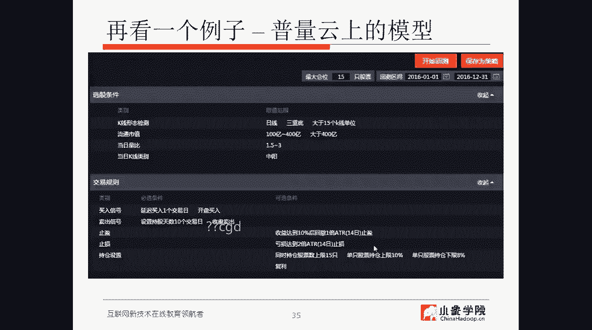

我还可以再投入到下一笔交易当中啊，你看一下，当然了，就你任何策略，最后都要有一个回测验证去检验一下啊，这是检验了16年整个一年的表现，下面这个灰色的是同期的沪深300啊，还好啊。

好像是跑赢了沪深300啊，最大回撤9。4%也还OK，夏普是一啊，一貌似反正至少比指数要强了，年化收益23%啊，看起来好像还凑合啊，嗯能不能实用，那看每个人自己的标准，但至少看起来还。

基本上我们破镜的机会比较少啊，几乎都在收益都在零之上，也就是说收益零就意味着说这个嗯不不亏不赚，那我们大部分这个曲线都在赚钱啊，同时最大的回撤是百分之几，而收益是23%，还可以啊。

至少从这个风险收益比例上来讲啊，貌似还行，但是上涨啊，总共200多个交易日，上涨和下跌的天数一半一半，这个对心理上稍微有点考验啊，有一半天数我是赔钱的，一半天数是赚钱的，这个如果心里比较脆弱。

可能用这个策略也会比较难受啊，关于怎么去评价一个策略，我们后面的课会详细给大家介绍啊，今天我也不多说了，那这个呢是给大家举的另外一个例子啊。

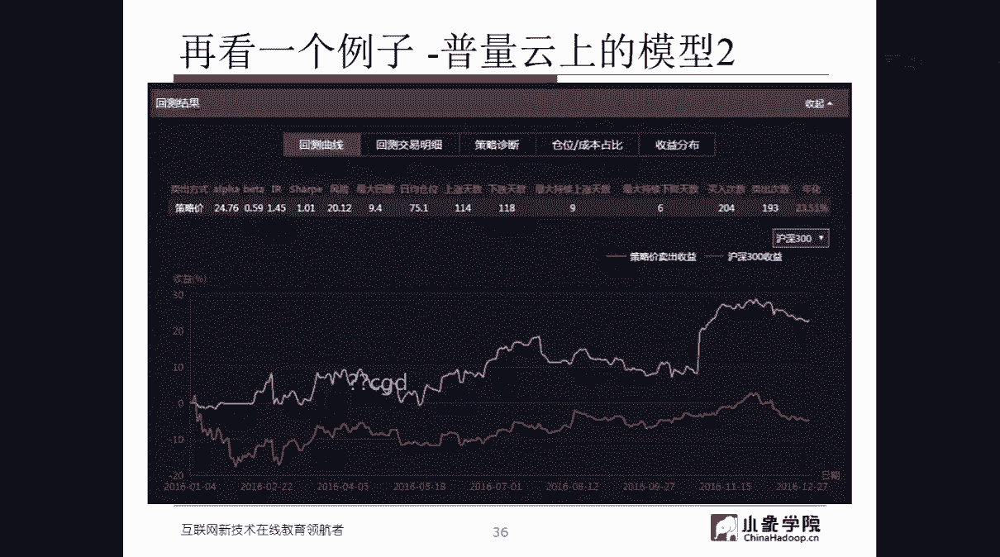

另外一个看起来长得像量化策略的一个例子，第三个例子，第三个例子更简单，都是一个选股。

所谓的量化选股啊，刚才我们这个策略还有择时。

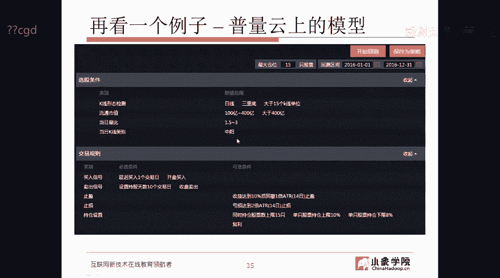

择时在边上，在这就是单纯的一个选股，选股条件是什么呢，我们看一下这个图，这个图啊是不同的股票池，然后他就不同期的股票池啊，用我的这个选股条件，选出来的股票构成的一个股票值。

它的数股票的数量在15年的5月底的时候，数量都不足300只了，那平时的话我们就取了300只啊，它说明平时都超过300只，而到了15年5月底，这是大家知道上一上一次牛市的顶点的时候，不到300只。

那大家可以猜测一下啊，这是一个什么样的选股条件，非常简单的一个指标，而这个股票池的收益啊，大家看一下沪深300，整个这4年四年多的收益是75%，而我们的股票时的收益，达到了300%左右啊。

大概是沪深300的四倍，那时从收益的角度来讲还行，但是回撤稍微大一点，看最大回撤这段啊，从这个点到这个点回撤稍微大了点好，大家能猜到这是什么指标吗，非常简单啊，就是考察P什么叫P呢，就是市盈率啊。

price和这个每股收益啊，这个burning，这个值我们取多少呢，是0~30倍之间，PE0到30倍之间，全市场的3000多只股票扫描啊，那么每七天调整一次股票池，哎就是这么一个结果了。

所以说我不做任何的择时，我光靠这样一个股票值，貌似也能取得一定的这个收益啊，至少跑赢了基准，而且是大幅跑赢了基准，这也是一个所谓的价值投资的啊，某一种佐证啊，长期坚持价值投资。

确实会给你带来一部分超额收益啊，但是呢中间的回撤其实也不小啊，所以说如果我们想优化这个策略，后面可以再增加一些择时的方法好了，这就是这个我们所说的量化模型的啊，第三个例子，单靠股票池啊。

定期调整的股票池，就可以让你有一些办法来战胜这个市场，但是这是长期的，在某些情况下，如果你的建仓时间点在这儿啊，你你会发现在这段时间里头，好像他还跑输了市场，它的回落幅度比市场同级还要大。

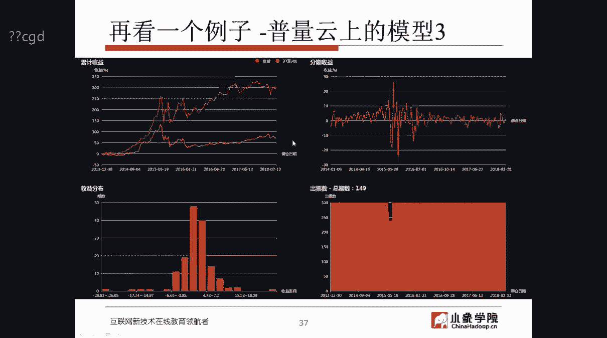

好了通过三个例子啊，就是给大家形成一个印象，什么印象呢，就是量化策略到底长成什么样啊，量化策略也是一个脑袋，然后两个胳膊两条腿大概都是长成这样嗯，你总之你是有输入，你的输入可以是基本面的数据。

也可以是价格啊，行情的数据，那么你通过你的选股或者择时啊一些筛选，那么构造了你的这个标记的啊，这样的一个池子，同时呢也选择了相应的时机，而这些时机都是通过你的明确的逻辑啊。

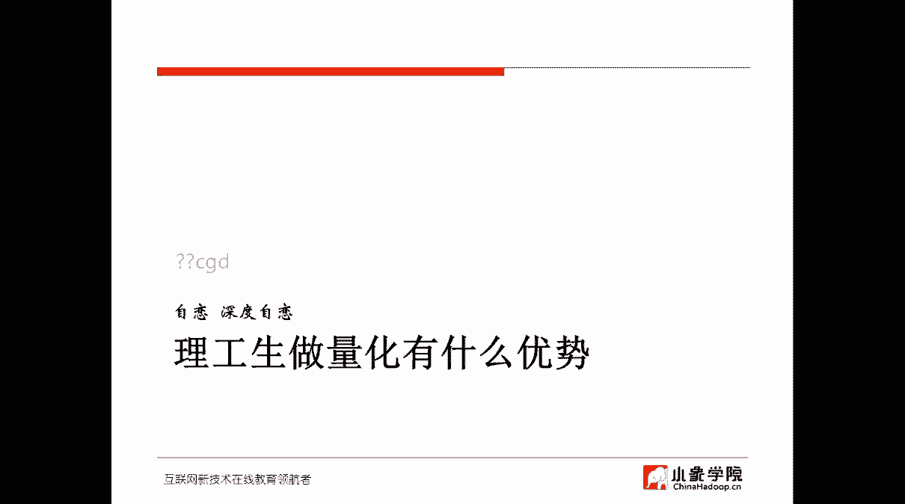

自动的去执行的，这就是一个量化策略，最终呢我们在上实盘之前。

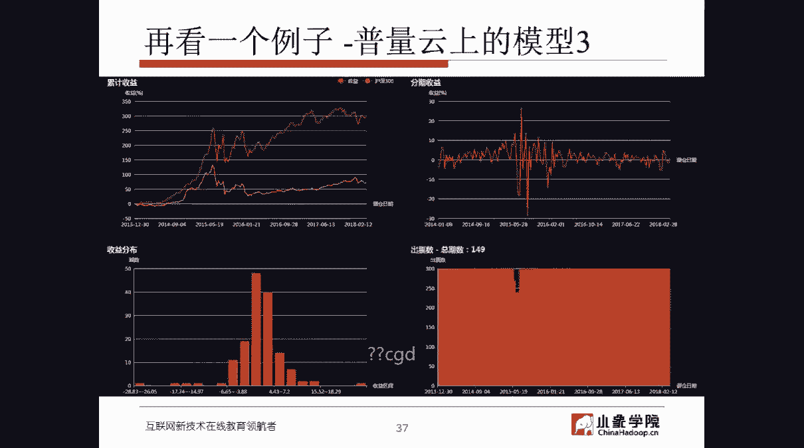

我们都需要有回撤的这种曲线去验证啊。

凡是哪个平台啊，第三方的平台都会给出于。

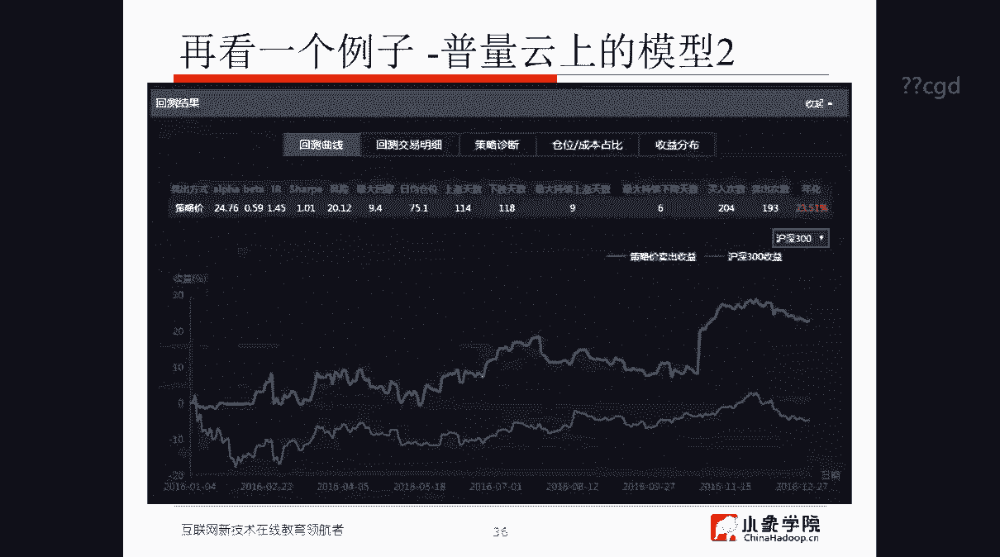

类似这样的回复曲线啊，好那我们再谈下一个问题，作为我们学员当中占比很高的，这个理工生的群体，我们做量化有什么优势呢，如果说我不是理工背景，那我我有什么劣势，或者说那我有什么相对别的方面的优势。

我们先来看这个公式啊，看个公式啊，我们想看看大家对一个公式的反应啊，这个公式我不详细说了，后面还会介绍，这就是一个阿尔法和贝塔啊，这个分解的这么一个公式，RP就是我的组合收益啊。

我的投资组合的收益叫做RP，它可以分解成两部分，一部分是贝塔，这部分也就是说跟我的基准业绩组合，业绩基准组合B而B相关的这部分叫做贝塔，无关的，这部分叫做阿尔法啊，这有个excel exp。

就是一个期望为零的一个随机价，就是为了让我们写这个式子比较好看，比较完美，那么嗯我们所谓的有一类股票类的策略，叫做阿尔法策略，其实就是为了追求阿尔法本身，而把data这部分彻底的对冲掉，这就是R的特点。

这个以后我们也有机会，我们再谈，我现在只是说啊，大家大部分人看到这样的公式是什么反应好了，你再来一个更复杂一点的公司，我就不解释了哈，这部分看着跟刚才那个差不多，但前面又加了两层的西格，还有不同的系数。

大部分人看到这样的公式是什么鬼事，去死吧啊，我也想搞明白这个故事是什么，反正你也别跟我聊了，但是啊作为理工的几个同学，他的可能反应，那么咱们来研究一下啊，所以我说啊。

这就是理工背景的同学的最大的优势三点，首先是好学生爱学习啊，我们来今天来听我这个讲代话课的同学，都是爱学习的好学生啊，而在大部分人天性都懒惰的情况下，还能花钱来学习的同学，那当然这就是你的优势啊。

这是第一个优势，还学习这样理工背景呢，逻辑思维能力啊，天生的就比较强啊，爱喜欢钻研，喜欢搞清楚背后的逻辑啊，它的根源是什么，有思辨能力啊，特别是这种理工的这种逻辑思维能力，这很关键。

做量化要的就是这种逻辑思维能力啊，第三我认为更关键的一点，我们很多都是聪明的小白啊，什么叫聪明的小白，就是我经常说一句话，就是做交易啊，天生的这个素质就是要穷聪明还喜欢数钱啊。

这个是你做交易最大的动力啊，我们做交易不就是想做想赚钱吗，而且是想有朝一日能够躺着赚钱啊，而我们现在穷，同时我们现在又聪明，而且我们未来还喜欢数钱，那么这个就是我们的一个最大的动力啊。

这毫无疑问也不多解释了，劣势就没劣势嘛，啊理工男其实最大的劣势是比较自恋的，什么叫自恋，就是经常会放大自己偶尔正确的那几次，那这一旦放大了就麻烦了啊，做投资或者说做交易要不断的归零。

你之前做做对的很可能只是你的运气，并不见得是你的实力，而且90%以上不是你的实力，就是你的运气，所以说做投资要忘我啊，就忘掉自己曾经成功的那个我永远要归零，每天晚上睡觉的时候都要归零。

明天的交易又是新的，明天的市场也不是大概率，也不是按照你的预测去走的，所以说你要做好，你的对策啊，在市场面前我们什么都不适应，所以理工生要做交易啊，一定要克服自己比较自恋，比较自大啊，比较自信啊。

这个这样的这样的一个，我认为有可能在其他地方算优点，但是做交易来讲，自恋是最大的障碍，同样道理就是对于不是理工生，但是有过长期主办教育经验的同学啊，我也是给这样一个建议，最好忘掉自己之前的交易啊。

既然我们来学量化，我们就要归零之前你的主观交易无论成功与否，这跟你做量化交易没有半毛钱的关系，我们是要进入到一个新的教育体系当中，而这个教育体系能够让你得到成功，最终如果你有幸有运气啊。

再加上自己的努力能够走向成功，那么靠的一定是你在工具，在理念，在体系啊，这些综合能力的建设方面取得的进步，跟你之前的主观交易的经验也许有一定的关系，但是没有也没有你想象的关系这么大啊。

所以在这提前给大家点点眼药，忠言逆耳啊，这个我们既然来学量化，我们要本着一个敬畏市场的一个态度，量化永远不会解决你对市场的准确的预判，我不是说完全不解决预判的问题啊，在一定程度上其实它也是某种预测。

但是我们能否成功，不是依赖于我们对市场的预测，而是我们严谨的交易体系和相应的对策，而且这个对策还要有非常严格的执行，有纪律，有相应的风控的保障，它是一整套逻辑，而不是说我掌握了一个买点啊。

好像我参透了这个行星运行的规律啊，这我就固定能在市场上当中只战胜我的对手啊。

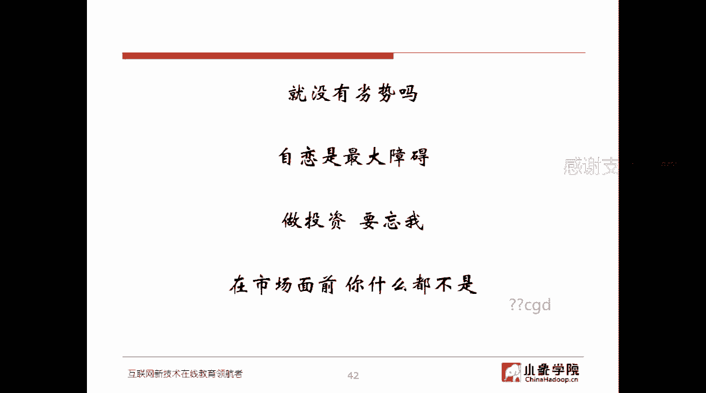

没有那么容易的事，说到市场，我们去定位市场，市场也有它的进步，我们看一组数字来看，这是上证指数的周K线啊。

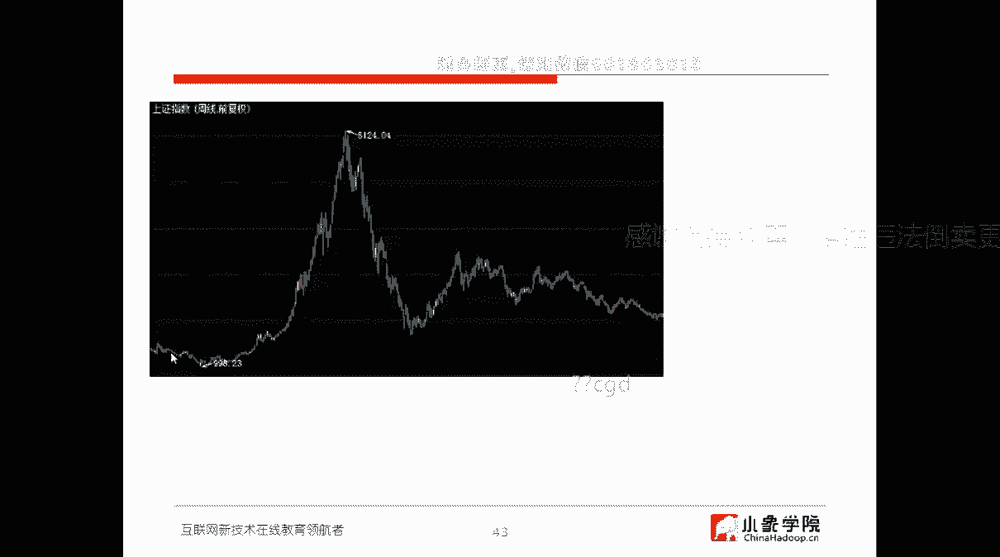

前复权以后只有几个关键点，9986124，下一张图啊，O8495178几个数，大家不做个投资啊，做个股票交易的同学应该有印象吧，998612418495178，这对应的是上一轮牛市的起点和终点啊。

9986124184951，请这个数字，现在后后来看起来好像已经很清晰了哈，说我在6月24的时候怎么没跑呢，这这市场已经明显见顶了吗，你要七八的时候怎么没跑呢，他说恰恰是越是到这个时候。

越有在牛市的顶点，总是有，太多人啊卖房子卖地，恨不得把所有的家底都投入到这个市场当中，结果在高位被套牢啊，甚至倾家荡产，而在998和1849的时候，那个时候已经把所有人都不屑都看。

都不愿意再再次踏进这个市场了啊，你能恨不得躲得远远的，谁跟我提股票，跟谁急啊，嗯市场就是这么反人性的，做交易就是这么反人性啊，而从这个交易的进化上来讲。

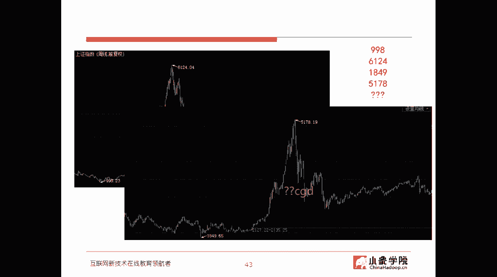

我们再回头层来看啊，998在这个时候为什么不是1001，为什么是998啊，为什么要在1000下面还要再低两个点嗯，翻译一下2005年5月份的报纸，6月份的报纸啊，那个时候1000点是铁底，不能破。

一旦破了，中国股市就要推倒重来啊，回去自己去翻一翻那个时候的报纸，所以说既然1000点是铁底，那就一定要破，只有破了这个铁底，大多数人才能彻底绝望，才能封了账户，彻底忘记了在股票交易。

而大多绝大多数人都割肉离场的时候，你想一想这个市场还怎么再往下走，谁还会卖呀，没有人卖了，那稍微有一点买买方的力量啊，多方的力量不就让这个市场开始向上运行的，所以说998啊，1000点虽然只破了两个点。

但是在心理上对绝大多数场内的人，形成了彻底的打击啊，而且这个彻底的打击才是由空转多的标志，那同样到6000点，为什么没有止步于6000点呢，为什么一定在6000点之上，而且还多了100多个点呢。

因为在6000点的时候，还有人在观望啊，还有人在犹豫啊，这个牛市是不是还能持续下去啊，所以说他一定要破了6000点，这个时候所有看空的人都开始看多了，都恨不得卖房子，卖地都冲向冲向股票市场了。

而且那个时候的舆论是怎么说的，8000点近在咫尺，1万点不是梦啊，大家回去看一下07年的这个报纸啊，所以说当所有的人在最后的狂欢的时候，所有的人都把钱换成了股票。

那已经没有钱在支撑这个价格继续往上运行了，那就只能跌了对吧，稍微有人一卖就连锁反应就开始暴跌了。

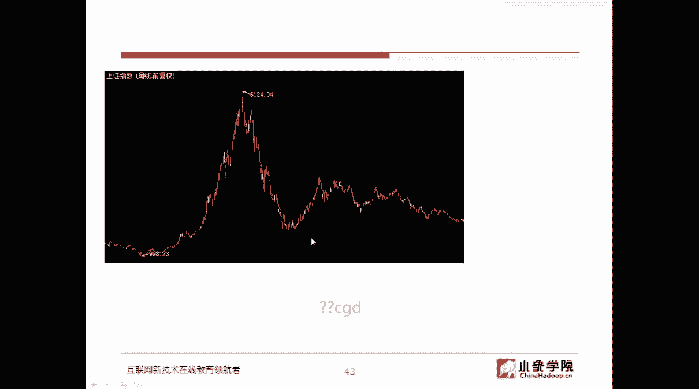

同样道理，还是再去看184951提档一个轮回，只不过这个轮回啊，大家看99801千年差两个月，6124高过了，除了高过6000点的关口，还又高过了100点啊，一个小关口，所以超过了100多个点。

124个点，而再次跌破2000点，还要跌的更猛一些啊，到了1849，也就是说低于2000点，150一个点，第124又多，而超过5000点还不够，又超过了178个点，当然了，这也说明什么。

说明市场在演化以前差两个点，我就可以做多了，但是到了这到1998，你再去借，你还会被套100个100多个点啊，当然了，这个我们也是不完全的归纳啊，不完全的归纳在做量化当中是不靠谱的。

我们也不建议大家去用，在这只是给大家举一个例子，我们分析一件事，我们要从它的本质上去思考，而不是人云亦云啊，你的量化策略做的跟大众一样。

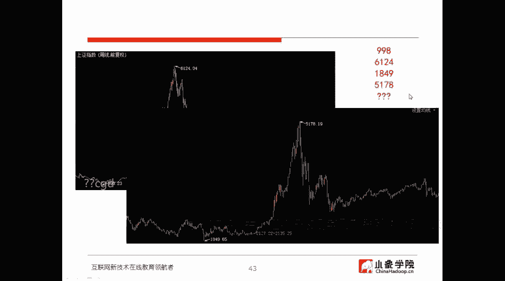

那注定你也是被屠宰的对象，优劣势的利用啊，现身的一个说法，就是我们普量云当中有这个自动的K线识别，像这是一个典型的W底，这是一个呃三三重顶啊，又间接了一个W底，像这样的东西。

其实就是在利用我们理工生的一个特长，因为我是搞了十几年20多年的模式识别嗯，这个后面要给大家讲课的这个宋老师呢，他也是做模式识别出身，他他是做语音识别啊，之前我是做计算机视觉，所以我们两个的结合。

这个自然而然的我们就会想到，把这个人工盯盘的一些传统的一些做法，把它完全自动化，这是模式识别的优势啊，这样能提高我们的效率，当然我们的策略不是简单的说，W底就一定要进场啊，这个三重饼我就一定要出场。

其实也不是这样啊，事物都是辩证的，固定的套路永远不能帮助你去稳定的获利，但是呢这个模式识别的技术，我们可以把它用到量化交易当中，量化策略的当中，作为某一个组件，能够提高我们对于行情判断的一个效率啊。

好了，那么下一个问题啊，大化交易系统的基本架构，我们通常把阿尔法啊，刚才那个公式是怎么去分解阿尔法和贝塔，那是一种后验的分解啊，通常来讲对你的实操没有什么指导意义，对于你实操有意义的。

我们给阿尔法有一个非常规的定义，叫做在交易当中，关于持有头寸选择和买卖时机把握的技巧，这句话听起来比较绕，核心就两点，如果你是股票，一个叫选股，一个叫择时啊，那么怎么做选股择时呢，哎在这儿啊。

我们分成宽客做什么和宽客怎么做，宽客做什么，就这几种，你的输入啊无非要么是价格，要么是基本面，有些人可能再多一点，说我在社交媒体啊，我在爬的各种新闻信息，那就是作为另一另一类非结构化输入。

但是那个东西到底有没有用，其实还存在争议啊，我们说从传统的量化角度来讲，你的输入无非就是价格和基本面，那你能做的策略类型，无非也就是说所谓的趋势跟随也好，均值回复也好，技术情绪也好，包括价值年啊。

成长投资质量投资大类的也就那么几类啊，但是种类虽然有限，可是宽客怎么做，真正决定了不同人，100个人做的价值投资的策略都不一样啊，宽客怎么做这个细节决定成败啊，这里包括你的投资期限。

你是做高频还是做中长期啊，你的投注结构你是做单边嗯，你还是做这个对冲啊，那么你对产品的选择是选择流动性好的，还是选择这个流动性稍微差一点的啊，你的模型的运行频率是在哪一个TIK上运行。

还是在每天啊或者甚至更大的尺度下运行，这些细节，真正决定了你的量化交易体系的成本啊。

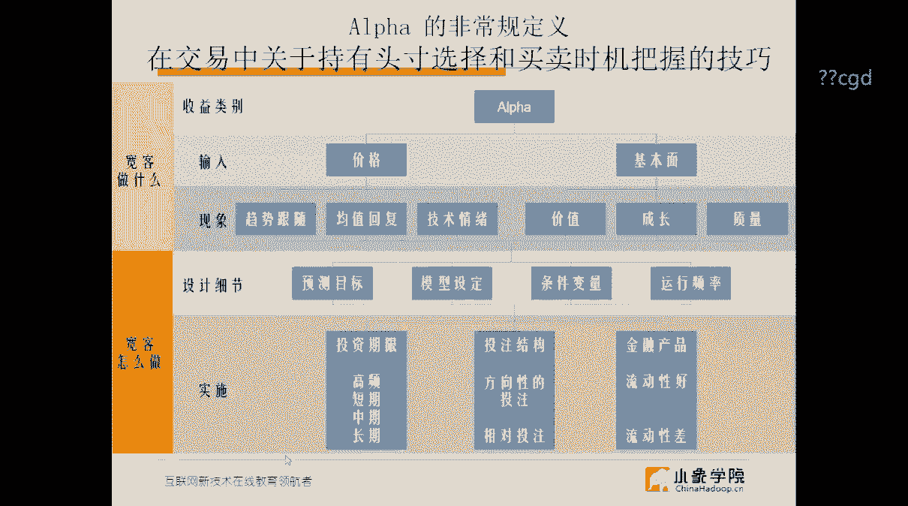

你的系统的成本，那么从系统的角度来讲，大概分值这几个模块，一个是二个模型，这是刚才上一页PPT讲的啊，这个实际上是你收益的来源，而风险模型决定了说它是个悲观的arm，模型告诉你哎这有收益可以做。

风险模型告诉你也不行，风险太高啊，风险收益不成比例，不要去做，那么交易成本模型告诉你，每一笔交易我们应该怎么去测算它的成本，有时候成本可以改变你的生命和赔率，那么投资组合构建模型它就是个仲裁器。

他把这前面啊，阿尔法风险和交易成本模型，三个模型的输入输入进来，然后做一个综合的决策来发出交易指令，然后交易指令发出来以后给到执行模型去执行，执行模型也很关键啊，就是这个涉及到上十盘。

最终你的这个交易怎么去下单，怎么去监控啊，如果不成交的或者部分成交的，你怎么办，怎么处理，那么这些啊所有都是在拼细节，当然还要拼你的数据，你如果比别人有更好的，更质量更高的数据，那么你的胜算就更大一些。

而做量化策略的研究，策略的开发比拼的是一种研究能力啊，实际上他跟做科研没有什么区别啊，都是在做类似科学研究啊，那么所以说你的研究能力。

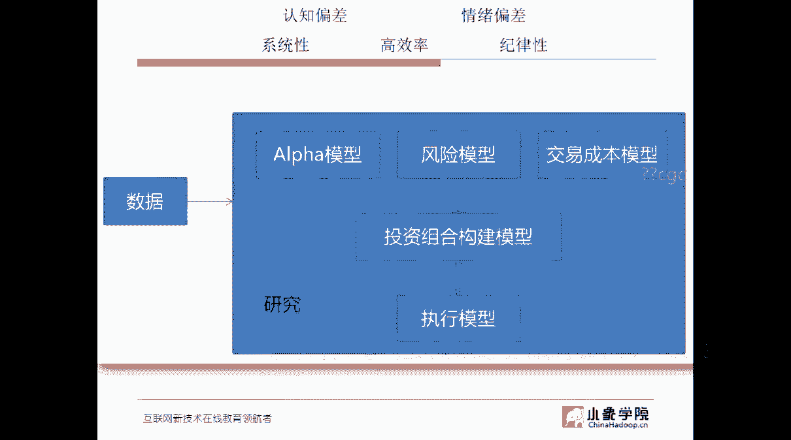

你的软实力也决定了你最终能够走多远，最完整的交易系统要准确的回答啊，这么几个要素，市场你选择什么样的市场，在什么市场做买卖，选择什么品种去进行买卖逻辑啊，就是你的买卖的思路是什么啊。

我是用突破还是双曲线，交叉还是底背离啊，这些都是你的逻辑啊，在什么情况下，这个做什么样的事，头寸那一次买卖多少啊，那么入市也就是说你什么时候去买啊，止损和离世对应的都是什么时候卖。

只不过止损呢是你要退出一个亏损的头寸，而离世就是退出一个盈利的头寸啊，一个量化策略要非常定量准确的，不带形容词的，全是量词来描述这些要素啊，后面的课程当中，我们每一个具体的策略都会给大家强调啊。

这些要素的实现，最后一部分啊，今天这个时间马上就到了，我们简单说一说关于交易的一些基础的知识啊，因为有一些这个同学，可能之前没有做过太多的实盘交易，我们还是要对于我们这个课程当中。

所涉及到的一些交易品种和相应的规则，做一个简单的介绍，首先常见的听懂了，股票一揽子股票就是ETF，然后商品期货，股指期货，股指期货就是金融期货，期权债券外汇，这个我们课上不涉及，就涉及前面这几种股票。

一点F商品期货和股指期货啊，因为初级课就是期权，债券外汇这些高杠杆的品种，我们就先不说了哈，这个避免大家在不知道深浅的时候啊，这个轻易去尝试，到时候会死的很难看，我们也不希望看到这种情况。

所以有些高杠杆品种我们就不介绍了，那么股票这个就不用说了啊，在这这个界面好几只股票，这个嗯有些这个行情软件，这这这个界面截的是东财啊，东方财富的这个行情软件，这个多股同列。

你可以同时观察多个股票的分时图和K线图，那么在这我们这还有菜单啊，这些菜单其实你可以选择不同的市场，不同的品种，那么从股票的角度，我们除了K线分时图，这是行情数据，你需要最基本的了解的东西，在东财啊。

东方财富这个行情软件当中，还有一个功能叫F9深度F9啊，深度X9呢通常它包含了公司的基本资料，一些啊，非常基本的财务数据和相应的分析，新闻公告，重大事项，然后关于行业的分析和一些技术分析。

都在深度F9当中，大家可以去看一下你任何一只股票，你看一下他的F9，比如说机构的观点，比如说盈利的预测，比如说这个重要财务指标什么L啊，这些这个都是在F9当中可以啊获得的。

那么如果说大家对自己这个投资的标的，还不是太清楚，这家公司是干什么的，他的这个盈利情况怎么样，然后他在行业当中处于什么样的地位，它的十大流通股东是什么样的一个结构，这些呢作为股票投资啊。

即便你主要是在做技术分析啊，但是了解一下这个标的避免重大的雷啊，什么叫重大的雷，就是这个公司有没有退市风险啊，这些你可能通过长期的F9跟踪，你还是能够看出一些蛛丝马迹的，有没有财务造假啊。

啊这个嗯公司的业绩啊，主营业务到底这是增长的，还是这个还是还是减少的啊，这些呢啊都可以作为你排雷的一个方法，就是简单F9分析，不见得得不见得能帮助你找到优质的公司，但是可以帮助你排查那些垃圾公司啊。

在现在这个年代，尤其是A股现在发展到现在这个阶段啊，可能慢慢以后投资者结构更倾向于机构化，那么有一定的安全边际，还是我们追求的一个方向啊，不要去长期炒作垃圾了，这个一旦有退市的风险，那就血本无归啊。

BGDF讲讲它的原理，就是你就把它看成就是已经编制好的，一揽子股票，这里头我们也举例啊，有不同的这个跟踪指数的这些ETF项目，10050，这是50ETF，159915，这是针对创业板的ETF啊。

当然这还有五百三百升100啊，那么这些呢啊这这不算荐股啊，这个现在又来了个规定，没有证的要罚100万啊，我这个没有任何荐股的这个这个这个痕迹在啊，大家听了听了这个课，也不是给大家推荐要去买这个TF。

我们在这只是说ETF，实际上它是有一定的套利机会的，它套利呢因为是第二级市场，他之间可以去套路，你可以买入ETF啊，同时呢在按市场上去这个卖出相应的成分啊，ETF这个指数的成分股和或者做反向。

这种操作都是存在这种套利的空间的，嗯但是这么操作呢，因为这个需要的资金量相对大一点，这个100万份起，所以说用这种方式来套利，通常是机构的行为，但是作为散户呢。

你可以直接去在二级市场去交易ETF这个品种，像510050这个代码，你可以直接把它当成股票去买卖，而且ETF它没有印花税啊，他只收收交易费，它没有印花税，所以说比一般的股票的交易成本还要低。

那么直接去交易这个ETF啊，相当于你去直接交易对应的指数啊，所以说在熊市当中，有的时候我经常会有人问我说，汪老师给推荐几只股票，我说不行，这个没证推荐要罚款100万啊，这个我我我平时老老实实做交易。

我还不轻易赚不了这个数的啊，不是每天都能赚这个数的，所以说这个我随便推几支票，这个一下子罚了100万，这我受不了，那么我通常会会说啊，那在熊市的末期啊，通常底部结构是非常复杂的，我们也很难精确的去判断。

那么直接啊，大家做一个ETF的定投吧，啊所谓的定投，你把你的资金分成若干份，你你大的网格，你每个季度交一次小的网格，你每周交一次或甚至每天交一次，反正你把这个子弹分成若干份啊，这是每隔多长时间去打一份。

只要是在底部啊，我们我们现在其实别的不敢说，我们我们敢说，说现在的指数一定是低于它的均值，回复的那个均值的肯定已经在那个均值之下，所以说只要你慢慢做定投啊，当他恢复到均值的时候，你就已经赚钱了。

而且说不定还赚了不少，所以说嗯这也是一个最简单易行的量化策略，甚至不需要程序去执行啊，直接手手工执行就可以了，但是越是简单的东西啊，大家越不屑，很多人都觉得这太low了，买个指数。

我我要的是每年百分之百的收益，买个指数赚个二三十有什么意思啊，但是长期能够每年赚个十个点，其实已经很不易了啊。

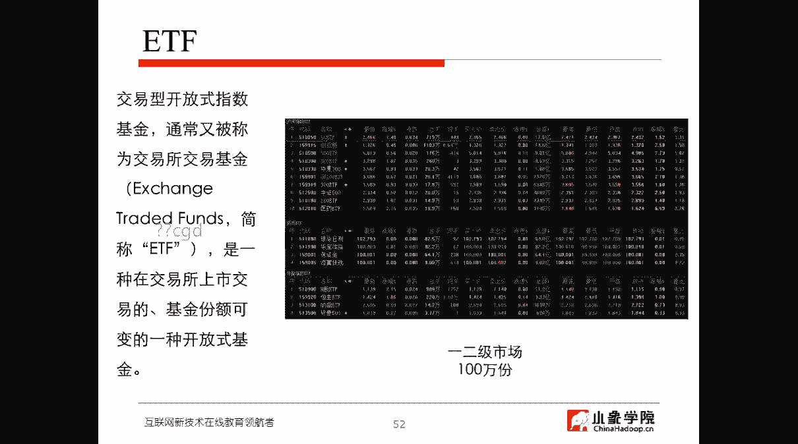

那你听过好，在这儿呢其实也不想具体讲每一个品种啊，这个没什么太大的意思，大家只需要关注一下我们在国内哈，上期所大商所郑商所啊，当然现在还都呃啊，这那是那是期权了，提前不说了，这个上期所大商所郑商所。

这是我们现在一些主要的商品结构合约啊，所交易的这个交易所，那么期货和这个股票，商品期货和股票，包括金融期货，金融期货，还有中金所，那么期货的这个不同的地方，就在于它是保证金交易，所以说带杠杆啊。

不同的品种他交的保证金的比例是不一样的，但是呢他都比如说100万的标的，实际上你可能花20万就可以去买100万的，就100万啊，这个嗯，这个这个这个实物所对应的这个价值的东西啊，你可以这么理解。

那么这里有几个概念，一个是保证金交易，一个是商品期货的交易时间啊，它分成日盘和夜盘，而且每个品种时间还不一样长，那么它还有主力合约啊，主力合约什么意思呢，就是在当前交易啊。

这个交易量最高的这个合约叫做主力合约啊，在主力合约到期的时候，到期的时候它会嗯进行切换，那么有些时候我们做量化策略经常去，经常会忽略了这个幻月合约换月的时候，它的影响啊，移仓换月这个事呢。

后面涉及到相应策略的时候再给大家介绍，然后商品期货呢我们要关注它处于不同的板块，这些板块之间它是对应着产业链的上下游关系，所以说有人说这个期货是纯博弈的品种啊，但是这里面也有基本面的影响。

这个基本面主要是这个产业链条的这些关系，大家如果做期货的话，要嗯回忆一下啊，王老师曾经强调的这几个要点，如果不熟悉的话，你说我我连棉花这个期货是什么我都不清楚，我就轻易去做了，那跟赌博没什么区别啊。

所以说一定要了解一下这个产业链到底是它的，前后上下游到底是什么关系，你做的这个品种到底算风险，受哪些因素的影响，做商品期货它因为带了杠杆，所以一定要有自我保护的意识，不要轻易的就被平仓了。

股指期货它是一种金融期货啊，这里头有这么像IF它对应的是沪深300啊，IC对应的中证500，IH对应的是上证50，那么这个还有当月连续下月连续夏季，还有各季啊，那么这个就是也是不同的合约。

同一个时间有四个合约啊，对于某某每一个指数，那么具体来讲呢，大家如果做的时候，我们针对相应的策略再给大家详细的去介绍，嗯今天呢大家只要知道啊，这个这些其实也都是我们在做量化交易的时候。

经常会用到的一些工具，股指期货经常作为对现货的一种对冲的方式啊，因为现在我们做空也没有太好的方式，股指期货也算是相应一个成本，还相对比较合算的一种工具，作为一种对冲啊，特别是你在做阿尔法策略的时候。

那就必须要用到它好了，那么今天的内容就到这了，我们看一下这个今天的思考题啊，大家想一想，你为什么要做交易，为什么要学量化，做量化有什么优势啊，你想一想你自己如果做量化会有什么优势。

你有有没有什么明确的投资目标，也就是说你做完量化以后，你希望达到一个什么样的水平呢，啊还有今天的双均线策略的例子啊，这个严重漏洞我在课上已经讲了，大家回去再复习一下，推荐几本参考书啊。

打开量化投资的黑箱，这本书呢比较浅显易懂啊，而且也容易对量化有一个相对比较全面的认识，建议大家去读一读啊，就像看小说一样看就可以了，第二本书我们通常把它叫做红宝书，主动投资组合管理。

这个书要求的数学比较多啊，看读起来比较费劲，但是呢如果说你有志于从事量化交易，作为你的这个交易人生啊，宽客人生，那么还是建议要认真的去读一读，第三本威克夫操盘法，这个主要对应的就是呃。

一些主观交易的一些思路，但是呢它比较容易从量价分析的角度去做量化，所以也推荐大家参考一下最后一本正确分析，做基本面分析啊，可以去参考，但是不见得全信啊，嗯就说到这么多吧，其参考的社区。

看我今天举的这个第一个例子，就是巨宽的这个例子啊，用Python来写策略也比较流行，同样米框和铀矿也都是用Python啊，这都是开放的第三方的平台，古人网和储量云对应的都是不用写代码。

通过勾勾选选就可以去做的啊，对于说对写程序还没有太多心得的同学，也可以考虑先用这样的高级玩具，先这个呃体验一下做量化策略这个过程，然后像MC啊。

就mart charles tb lazer这个交易开拓者，然后文华财经金字塔通达信这些呢也都可以，它是图表示的，这种方式也可以帮助你去实现一些，相对简单一点的交易策略啊，那么各有各的优势。

而且这里头还有一些可以直接上实盘，所以呢嗯大家可以根据自己所做的品种，和自己的对于程序的编程的能力的啊，这个掌握情况可以去选取不同的工具，下节课要一下哈，上手搭建最简单的交易系统。

那么需要大家准备一些环境啊，比如说装了Python，还有mod dB，那么这个具体的准备工作，我们会在下节课课前啊，在这个呃小象啊，这个咱们的学院上，相应的这个平台上去给大家公布。

大家提前要这个准备一下，预习一下。

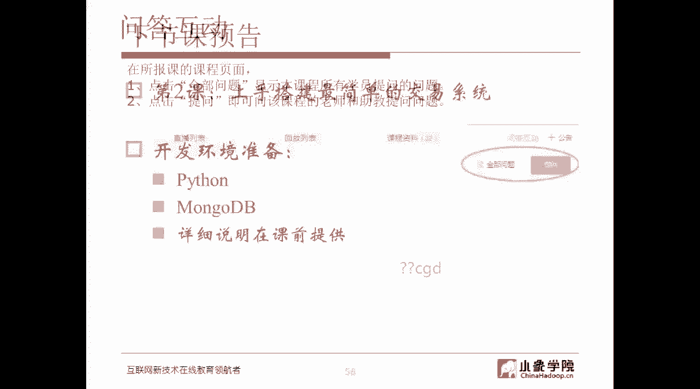

好那么今天的课呢内容就OK了，好了我们看一看啊，大家还有什么问题，你们居然在讨论工资啊，那这个就不回答了，看大家对今天的内容有什么问题吗，下节课是下周一啊，嗯作业呢就是刚才我说到这些思考题啊。

这个不是强制的，但是希望大家去认真的去想一想，李健就不八卦了啊，这个关于李健的内容已经很多了，要想真八卦，咱们私下再说，参考社区里都是可以，这个后面这几个图表示的工具，其实更容易上实盘。

只不过作为股票类的这个实盘呢，相对有一些限制啊，因为在15年股灾之后，对于股票程序化交易有一些限制，但是现在也是越来越多的券商开始呃，嗯就是打开这方面的接口了啊，所以说嗯啊最后一节课啊。

我们会给大家介绍一些关于上实盘的，一些这个呃一些方面的这个内容，不建议大家现在就是在还没有呃，充分的准备之前就直接上实盘，这个时候是实际上是比较难受的啊，嗯需要一定的功力。

所以我们先以这个量化策略的开发，量化系统的搭建作为我们这个教学的目标，A股和美股量化交易其实没有什么本质的不同，但是呢因为标的和包括投资者结构，那显然是不一样啊，所以说在这里头就是美股市场上呃。

能够比较成功的策略，到了A股不见得能成功啊，而且大概率不成功，而A股上你用的策略用的套路放到美股上，也不见得能够使你表现也不见得好啊，所以说这个时候其实你需要对你的交易的标的，对于你的竞争对手啊。

你的对手盘有充分的了解，去去量身定制相应的策略，关于量化交易是不是算法交易，我在前面已经讲过了啊，但这个这位同学你可以去试听一下，这个前半节课的内容，量化在外汇领域当然可以用啦。

其实不同的标的它只是说不同的品种，它有品种自身的特点，从量化的角度来讲，其实模型的背后的理论基础是相似的，好了问题还挺多啊，滚的挺快，那我们就嗯时间关系就不对，每一个问题都回答了，有人还问币圈哈。

嗯B呢我之前前面的课我也聊了几句啊，在上第上半节课，所以如果感兴趣可以复听一下，总的来讲呢，作弊和做股票，做期货没有什么本质的区别啊，而且B在基本面分析上它会更简单一些啊，甚至没有太多的基本面。

就是一个纯博弈，好了，那我们今天先到这吧，感谢大家的这个呃收听收看啊，这个作为量化的一一门引导课，也希望大家嗯对这个量化有一定的认识，通过学这门课来增长技能啊，进入到这样的一个领域，那我们做一下嗯。

有一个调查问卷啊，大家如果有其他的这个问题，还可以在嗯继续跟我们去互动，嗯这个在哪呢，我把这个链接打开一下啊，我们麻烦大家，啊大家来填写一下，麻烦大家来参与一下这个调查问卷。

以便于我们更熟悉大家的一些需求啊，在后面的课程当中可以做一些适当的调整好了，那么今天就到这儿了啊。

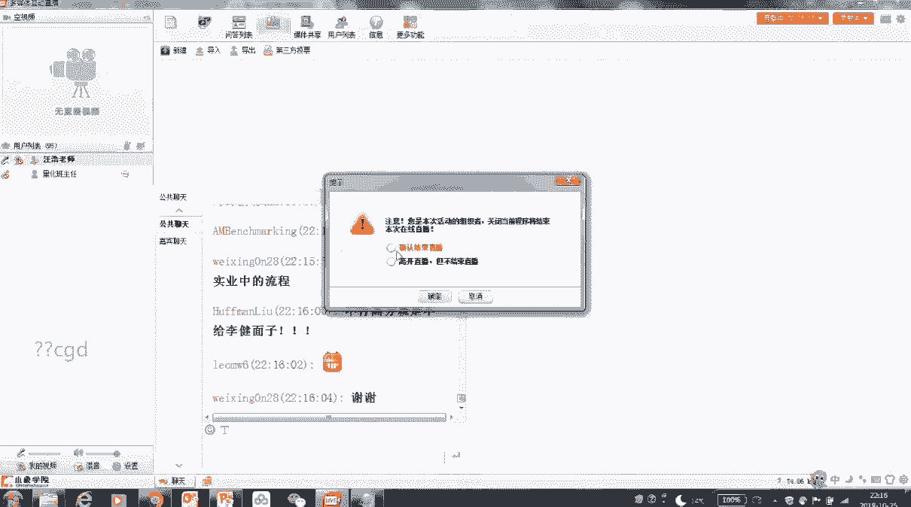

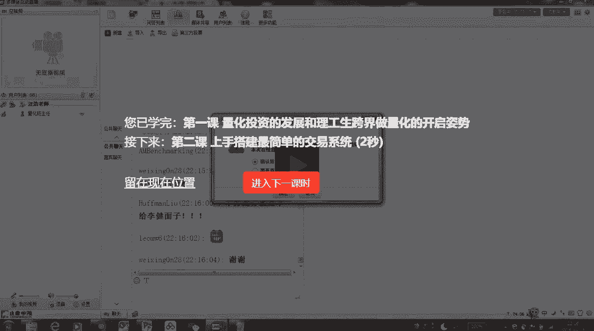

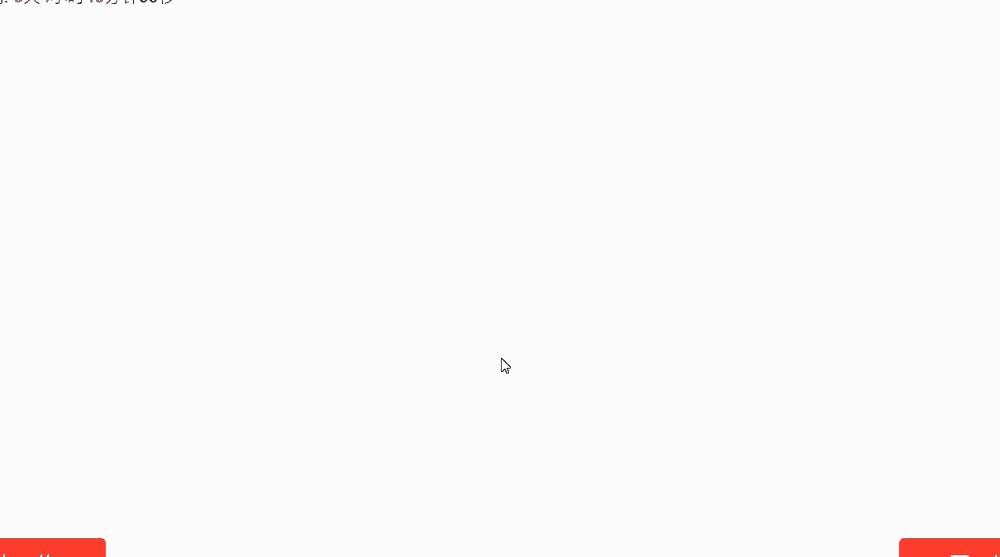