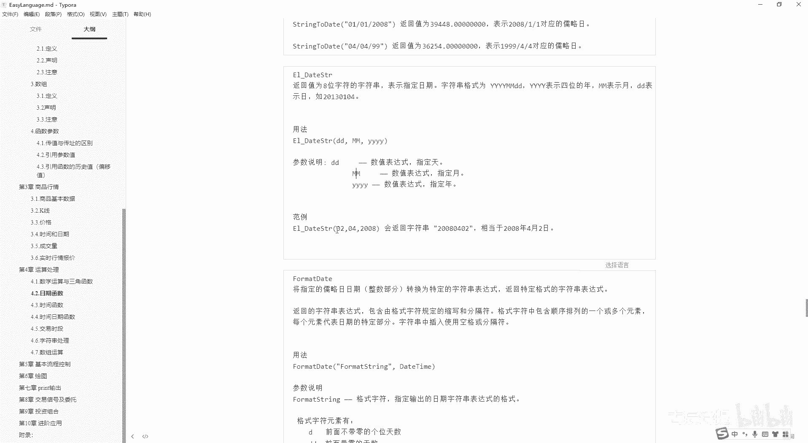
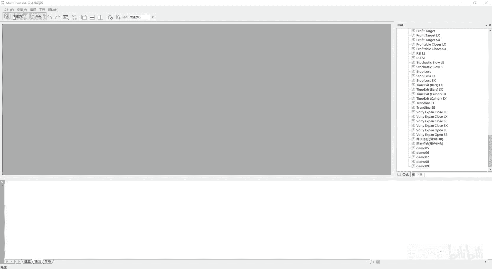
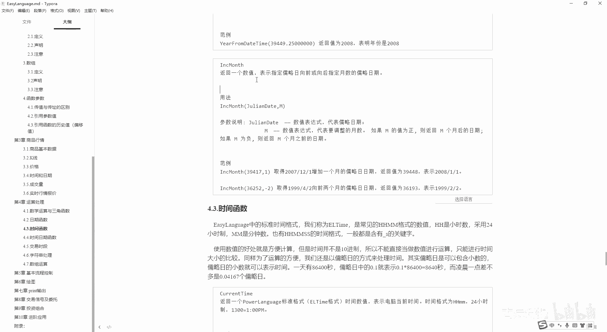
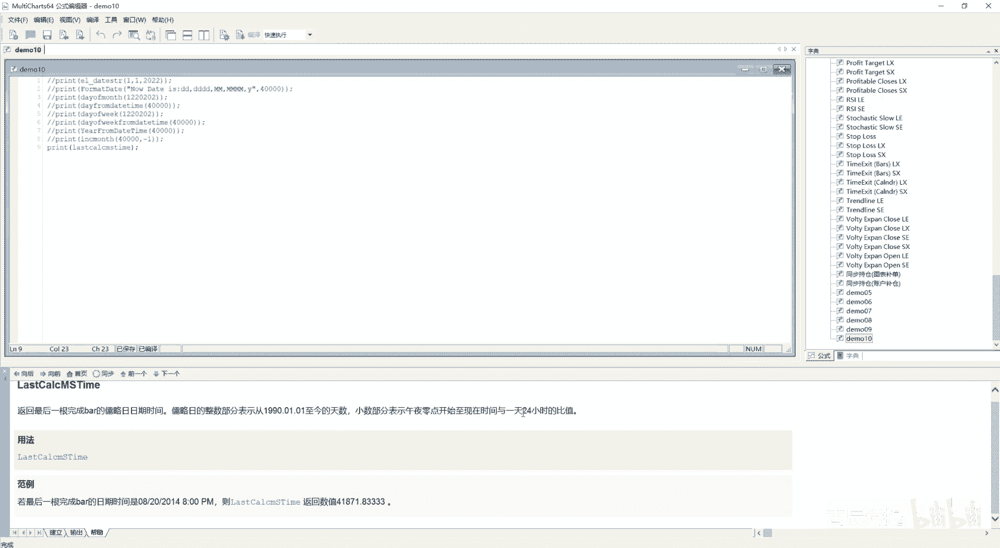
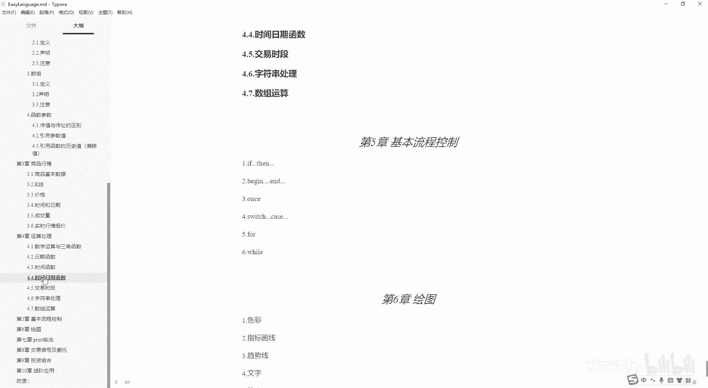

# 第10节课 日期函数、日期函数 - P1 - 古辰诗提 - BV1yJ4m137wp

欢迎大家来到从零开始量化系列课程，MC课程的第十课，这节课咱们接着讲这个日期函数，上一节课咱们讲到了string to date，这节课咱们讲e l date，Stream s t r。

它其实也是代表string的意思，其实从这个字面上你就能理解它是easy language的，它的data类型转换为这个字符串类型，唉这个给演示一下吧，就是嗯后边这个参数说明啊，前面放天，然后放月。

然后放这个年，然后这个田小弟年是小Y表示的，MM呢是大写的，为什么它是大写的啊，因为在时间函数里边也有这个mm，因为那个是minute，然后这儿呢这个月是month是吧，所以说他就把它区分开来。

这边是大写的，然后在这个时间函数里边，他是小写的，你记住这个就行，所以说一般他都用这个大写的MM来表示，这个你不用去硬记。

一定不要去硬记，从这咱们新建一个啊。

第十课，比如说我print一个EL这个data str，它后边会有提示的，看见没有，Day，比如说我放一，你放零一也好，放一也好都可以，month我也放一，后边放2022两个括号，这样我先进行一下编译。

编译没有问题对吧，这个时候还没有输出，因为我要把它加载到我的这个商品上来，然后把十好close，这个时候他就会有输出，2022年1月1号，所以说你根本就不用去硬记它，你知道有这么个东西就行了。

另外你一定要注意他是字符串类型的，返回值是字符串类型，包括你放着它有提示是吧，return括号后边有个SSTR，RNG就是string表示字符串，你千万不要在这写这个value1等于嗯。

这样的话他会报错的对吧，它报错的，因为这个咱们MC它是一个强类型的语言，这个easy lemage啊，这一点一定要注意这个数据类型这一块以后，如果说你学Python。

其实数据类型是要非常注意的一个事情啊，你在转换的时候有去就是进行，比如说数据处理啊，因为如果说你用Python，就代表着你是用的这个开源的平台嘛，开源的平台，你数据是得自己来去啊。

买这个数据商的数据也好，或者自己去录数据也好，这个时候数据类型就显得非常的重要，当然在这个MC里边，它嗯就是你注意一下就可以了，后边这个format date啊。

将指定的掳掠日日期整数部分肯定是整数部分，小数部分代表的是时间，返回特定的字符串表达式，这个怎么一个特定方啊，怎么一个特定法，咱们先演示，你要记住他是将指定的入列日日期进行转换啊，好咱们演示一下。

print一个一下这个format date，然后第一个看他的代码提示，第一个是这个template，template是模板的意思啊，意思啊，template模板的意思。

然后从这里边呢它肯定是一个字符串类型的，咱们刚才也说过，小写的Y表示年，大写的M表示月，然后小写的D表示这个就是多少号对吧，这个时候呢咱们可以写DD啊，然后啊逗号，然后我再写个写三个D啊。

然后呢我写大写的MM啊，然后我写三个M，然后写这个Y小写的Y写四个好，用双引号把它引住，后边呢我传一个辱掠日的，我就传个4万吧，好啊，两个括号咱们看一下它会输出什么东西，编译成功输出，咱们往下拉一下。

你会发现第一个零六它是表示的是日期啊日期，然后三个D的时候它表示的是周几，你发现没有，然后两个大M它表示的是零七，表示的是月份，三个大M它表示的是7月，然后后边表示的是年啊。

从这个演示的案例你就应该知道，就是说两个D其实它表示的是数值，它多少号你三个地它就表示周几，四个D它是表示什么呢，星期几啊，星期几包括四个M，他是就把那个7月的那个七，他从小写变成大写了。

你看这个就变成了星期几啊，所以说一个地他就没有后边的零对吧，两个D会加一个零，三个D就表示周几，四个D就表示很正式的星期几，一个M前面没有零两个M，然后他前面就加一个零，然后三个M它是小写的七。

然后加个月四个M就比较正式的，都是这个中文的，7月这样的一个Y它表示年那个尾数对不对，两个Y是表示的呃，比如22年三个Y有吗，三个Y是没有的啊，三个Y会出问题的，三个Y是没有的。

咱们可以进行下演示一下啊，他也会给你写成四个Y就给你默认转了，所以说你这个不要写三个Y啊，写写四个Y这个DMY就1234，除了这个年，就是说他没有三个的这个这个表示啊，就是说这个你需要注意的。

他一个是可以的啊，一个是可以的，虽然他三个他不会报错，但是嗯这样也不太好是吧，也不太好，刚才演示了啊，它会显示九是吧啊，这个就是它表示的意思，同样的其实你前面可以加上什么呀，比如now date。

意思从这你注意了啊，你不要出现这个小写的D小写的Y和大写的M，你这有一个D，他就默认把这个D给你转了，看一下，你看date这个D就给你转了，所以说你要如果说把它改成大写的是吧，Now date。

这样就显得比较合理啊，这个他就不会给你转啊，能理解这个意思吧，好这个时候咱们再看他的这个解释，这个格式字符的元素有一个D啊，两个D，三个D，四个D是吧，就是缩写表示星期其实就是周几的意思。

可以后面可以加个括号，周几咳，然后一个M啊，两个M3个M他就会写这个什么啊，7月是吧，然后四个M就是7月啊，是这样的一个方式，三个Y和四个Y其实是一样的，建议你写四个，后边一定要记住它的。

第二个参数是掳掠日的日期啊，掳掠日的日期，当然他这个演示里边，你也可以把它呃加这个斜杠啊，这个中间的小横线呀，包括你想加一些其他的，你想输出的内容都是可以的啊。

这个day of month就是返回指定的e l date，就是easy language的，它的这个日期格式，对应的日期其实就是当月的第几天啊，当月的第几天，你这个后边的这个指定日期格式。

一定要是easy lan尾结的啊，一定要是easy来尾age，2000年以前它是六位数是吧，2000年以后它是七位啊，这个一定要知道后边同样的day from daytime。

一般啊这个蓝色的关键字里边如果有daytime的话，一般表示的是掳掠日啊，如果说不是daytime，你像这个一般表示EL就是easy language的，它的这个日期格式好吧。

这个咱们可以去演示一下这个两个，一个day from a day of month，一个是day from the time，清除一下啊，Print day of month，后边一定要是这个EL2。

就是easy language的标准的时间格式，比如说1220202，其实就是代表着22年是吧，22年，然后这个2月2号啊，22年2月2号，他就是输出的是二是吧，就是他的就是第几天啊。

Print day，这个是from是吧，就这个daytime一般有这个daytime就表示是掳掠日啊，比如说我后边还是放一个丝袜，好进行一下咳，编译他就是六，咱们刚才用4万测，他是7月6号啊是吧。

7月6号好，这个day of week，就是取得当天为该周的第几天的数值，零表示星期天，一表示星期一啊，这个我就不演示了啊，你后边他是放的这个就是easy language的，它的这个日期格式。

然后这个day of week from daytime，这个是表示表示式，就是说从这个掳掠日里边去取，写一下吧，Print day of week，然后后边括号这是1220202。

这是后边是这个easy language的哈，我编译一下呃，他是这是三是星期三，零是星期日对吧，零是星期日啊，我再print一下这个day of week，然后from daytime。

这个有daytime的一般都是辱掠日，比如说我写个4万啊，他应该是星期几啊，这是星期一吗，啊没注意啊，4万他表示的你一定要知道他是星期几啊，month就是获取指定URL日期的月份，这个就不说呃。

就不演示了啊，后后边是EL日期格式，Month from daytime，就是从这个入瑞日日期里边，获取他的第几个月是吧，year就是年份啊，然后year from daytime就是鲁瑞日取得年份啊。

这个写一个什么吧，Y一A212from daytime，然后还是用咱们那个4万进行一下编译嗯，2009年是吧啊，这个没什么太多好说好说的，最后一个这个NC month是指什么意思呢。

就是掳掠日向前或者向后指定月数啊。

这是什么意思，就是我print一个RNC啊，这个就ONC了啊，R n c month，然后比如说我指定一个4万，然后一啊他其实就会4万往后延一个月，然后他的这个掳掠日的这个时间是吧，4031。

如果说你是负数的话，就是往前啊，正数往后负数往前是吧，这是30，然后往后是31天对吧啊，这个也有眼，他也有演示，就是增加一个或者向前啊，这个date这个日期函数就这么多。

如果说日期函数你都知道是怎么回事了，那时间函数其实大同小异，只不过里边会多几个这个呃，这个关键字日期函数你最主要掌握的是什么呀，就是EL日期往这个辱掠日，就是july date去进行转换。

然后july date去往这个EL日期去进行转换是吧，就是july to date，然后date to to这个JULY，然后包括它跟字符串的一个转换啊，字符串的一个转换字符串里边转换。

你最主要的记住就是format date就可以了，format date也它就可以了，然后这里边取月份还是取这个日期，有可能会用到啊，有可能会用到这个时候呃，就是如果说你自己取也行，但是会比较麻烦一点。

但是如果说你直接用关键字取会比较简单，一二和这个month都直接用这个year和month，如果说你是从掳掠日里边去取的，就是from the time day，稍微特殊一点。

day of week或者day of month是吧，呃如果说你从掳掠日里边去取的话，就是day of week啊，或者day of month from the time啊，其实记也不难记。

呃至于那个比如说encode date，那个知道就可以啊，包括这个ear date string，那个你知道就可以好吧，时间函数呢，嗯咱们就开始讲时间函数了啊。

easy language中的标准时间格式我们称为e l time，这是跟ear date是一样的，是常见的HHMM格式的数值，它这个是精确到分钟对吧，呃这是采用24小时制的啊，说你要精确到秒的话。

一般都是含有下划线S的关键字，比如说time或者说time，下划线S包括你像这个kind of time，你如果说你要精确到秒的话，它就勘探下划线S这个在掳掠日里边儿，就是这个时间，它是小数点后边的。

他其实也就一天有8万6400秒，如列日中呢0。1就表示8640秒，凌晨一点差不多是00：04 167，差不多啊，不是绝对准确的，咱们也说过小数在计算机里面存储啊，他是有Buff的。

是吧啊啊不是Buff啊，是bug啊，Come on time，就是取得电脑的当前的时间，Come on time s，就是取得当前的时间精确到秒，这个就不演示了啊。

这个last calculate m m time，还有last calculate m time，还有last calculate s time，还有last calculate time。

这个跟那个什么是一样的，跟日期日日期里边只有一个是吧，Last calculate date，但这有这个MMSS呃，然后还有这个ms s，咱们演示一下，再看他的这个意思好吧，啊同样把这清空一下啊。

Print last cc l a c a l c c a l c，Can wait，咱们先看这个，他是下午的三点啊，如果说你calculate time下划线S他是什么呀，他是精确到，就是这个秒对吧。

这个很好理解，是不是，然后还有什么呀，Calculate m m m m time，好，咱们输出一下，看它输出的是什么，你会发现它输出的是900，这个MM啊，它是表示的这个分钟就是当天他第多少分钟。

这是第900分钟，900，你除以60，它是等于十五二十四小时制，所以说是下午三点啊，这个也没问题是吧，因为咱们图表里边它就是下午三点的，是属于最后一根K线啊，哎呀就这个没有问题，它还有个ms啊。

ms s咱们先编一下，然后你看一下啊，它输出的是这个五四，然后后边好多零，但是你看他这个呃ms这个是他的这个解释啊，其实跟咱们这个就是测试是不一样的，它指的是什么呀。

就是返回最后一根完成but的掳掠日日期时间，掳掠日的整数部分从1900年开始，小数部分表示从5月零点开始嗯，你看他演示的这个ms是这个，比如2014年的8月20号的八点，就是下午八点。

他是这个后边有小数，但是咱们这个输出出来根本就没有小数对吧，没有小数，所以说他这个是有问题的，那它究竟表示什么呢，咱们可以看一看这个ss time s time，它是以秒数计计算。

返回从凌晨开始到最后一根K线所经历的时间，以秒数计算，咱们看一下ss time，嗯你会发现它输出的是5万4000哎，5万4000这个秒数咱们能理解，那这个呃就是SSMS。

这个你会发现他是后边是三个零是吧，就是SS是三个零，MS是多了三个零，对不对，那这个ms s它应该是表示毫秒啊，应该是表示毫秒，就是这个ms啊，应该是表示毫秒的，应该是表示当天的毫秒。

或者哎对1000ms是一毫秒呃，一秒等于1000ms嘛，应该是表示的毫秒呃，你看他这个解释啊，他也是跟我那个是一样的，因为我这个上面写的是从这粘过去的啊，从从这粘过去的。

所以说这一点你要注意一下，好吧嗯嗯然后这个就其实用的也不多啊，用的也不多，咱们刚才在写代码的时候看见了，还有last ca date，还有这个jue date是吧。

JUDATE咱们可以输出一下这个看一下好吧，44881，这是一个就是就来就是这个时间嘛，就是july date嘛，后边还有别的吗，MMCMSS就是这个也就没有什么别的了啊，所以说他这里边这个就这个。

就是这个ms是不太准确的，ms不太准确的，当然咱们用的也不多啊，equals的time就是跟equal的date其实是一样的，只不过里边有一个微秒啊，指定微秒，指定微秒，这个咱们在期货里边。

他一秒钟两笔提可一秒钟两笔ti，可他到哎，这个你看看能不能用上吧，他跟这个encode date差不多，只不过后边还有微妙啊，string to time就是将时间字符串转换为掳掠日的格式。

就是它跟这个日期的区别，是后边有个TTTT表示上午还是下午啊，AM还是PM，如果是小写的H的话，它是呃12小时制的啊，12小时制的，当然这没有这个没有说这个大写的是吧，没有说大写的。

其实就是大写的HH一般是表示24小时，就是小写的，就是这个啊这个mm啊，这个HH啊，大写的HH一般表示24小时值，小写的HH一般表示12小时值啊，这个还演示吗，就不演示了啊。

只不过是多了一个AMPM写一下吧，String two time，String to time，然后这个里边它是由什么呀，由这个将字符串转换为入列日的格式，入列日的格式啊。

就是但是你这个字符串必须得是就是这个呃，就是字符串，你就是你这个里边的，必须得是用这个双引号引住的，它必须得是个字符串，就是字符串，我直接粘过去吧，啊少了一个括号，输出是吧，0。33。

他返回的其实就是卤掠日者这个时间啊，这个时间这个知啊，你知道就可以，他们two string就是以鲁列日的格式转换为字符串啊，一卤列日格式的时间转换为字符串，就是你看一下演示。

就是把卤列日转换成这个字符串啊，账号怎么出啊，你一定要你一定要注意它，它是就是只转换这个时间啊，他不转换这个日期的，Time to string，啊比如说我4万。33嗯，嗯听海边音啊，他是这个7。50。

7。50比了一个12，它表示是12小时制，但是他没有写这个AMPM这个，这是7。15分，然后12秒12秒，如果说我七七呢，啊听一下编译是吧，十十八点，然后28分四四十八秒啊，就这个他不是跟这个一样的。

就是有PMAM的，它返回的是字符串，但是呢它是以这样的形式来表现的，而而且是24小时制的啊，这个你要注意一下这个date time to e r time，这个二啊，二你可以把它理解为two的意思。

就这个two啊，只不过他可能这样比较方便一些啊，Daytime to year time，就是将指定鲁列日格式转换为对应的EM，ERM这个HHMM这个这个格式的时间，这还有个下划线S的。

就是这个是精确到秒，这个是精确的分钟是吧，这个就不演示了啊，Year time to daytime，就是将指定的yer time格式的日期转换为呃，时间啊，转换为掳掠日时间一般都是零点几是吧。

它对应的时间呃不会返回为这个的啊，不会返回为这个的，你注意一下，你你你可以试一下啊，应该是不会返回为这个后边的是year time to date time，就是返回指定时间，包含秒所对应的辱掠日时间。

其实这个你跟这个date和这个就是ear date，和这个呃掳掠日的这个日期转换其实是一样的，前面讲的是这个YTIME，就是to这个daytime，就是year2时间转换为掳掠日的时间。

后边肯定是讲这个卤掠日的时间，转换为ER的时间是吧啊，就是前面啊，就是前面讲这个就是两者之间的相互转换嘛，啊当然这to他是用的这个二来写的好吧，这个就就不太讲了啊，就后面有个format time。

就是之前咱们讲的这个format date，这有个format time就是有区别的，是什么呢，你看这个小时，这个一个是12小时，一个是这个24小时，然后分钟数是就是加零不加零，它只有一二。

就是表示是吧，它后边有个TT就是单字母和双字母的意思啊，就是就是这个这个这个表示AM和PM，这个咱们演示一下format time，Format time，其实之前format date你理解了是吧。

比如now，Time is，当然你这个有有T了啊，我给它写上大写个T啊，is就是你表示小时，比如说我用小写的H取啊，然后空两个小写的HH，然后比上这个嗯嗯那个分中小写的MM，然后再比上啊小写的SS。

然后再来个TT，这个应该用引号，后边应该放这个the time that time，他这个是什么呀，应该是辱掠日对应的时间小数部分是吧，跟咱们那个之前这个date它是整数部分，是就是小数部分是不显示的。

所以说我这还是4万。33啊，这应该是两个括号了啊，好我清空一下，看他会输出什么，那直接用中文给你输出了是吧，中文给你输输出了，你看now time就是你这个M这个M啊，哎也有了是吧。

我应该把他这个M改成就是大写的，这也大写吧，都改成大写的啊，你不能有，就是它的这个就是你可以把它叫叫转译，这个这个字母啊，转义字母now time，意思啊，这还有个S我就不改了啊，07：55分啊。

12上午，如果说我是用大写的HH咱们看一下啊，我把它时间拉大1。88好吧，警下变异啊，20一点他是二十四二十四小时制的，下午好吧，这几个就是format，这个可能会用到啊，这个可能会用到咳。

后边的就是从这个时间里边去取小时啊，取分钟啊，取秒啊，包括取这个毫秒或者微秒啊啊ours from daytime，就是一看daytime就是代表的是掳掠日的是吧，就是取这个小时啊。

取小时取这个数值出来，然后minutes，然后取分钟啊，这个后边都加S啊，ours好，还有还有这个minutes是吧，然后sign是取秒数啊，然后后边还有mile seconds，就是取这个毫秒啊。

取毫秒嗯，辱掠日啊，掳掠日，然后这个我就不演示了啊，time to time s这个to啊，就是还是那个意思就是to啊，就是这个to啊，就是由由这个就是精确到分钟的，转变为精确到这个秒钟的是吧。

然后肯定还有time加完减s to time啊，这个就咳没什么太多好讲的了，也没有什么太多好演示的了，到这呢日期函数和时间函数就讲完了，后边还有就是还有一些就是说日期时，时间的这个函数。

时间日期一起的这个函数啊，那咱们下节课再讲前面的这个时间和日期函数，你如果都理解了的话，其实这个时间日期函数就是它们并在一块的。

这个函数也就好理解了，好吧。