# 第11节课 CtaTemplate和数据库连接池 - P1 - 古辰诗提 - BV1aq421F7Zq

欢迎大家来到从零开始量化系列课程，VMPI课程的第11节课，这节课呢咱们主要讲一下这个city tablet，就是在进行实盘操作的时候，c t tablet是咱们会经常会用到的一个类。

因为咱们的策略都是继承于他嘛，为什么继承于他，必须得继承于他呢，咱们之前在这个引擎里边，CT引擎里面也说了，他会做一个识别，如果说不是继承自它，且不是这个类本身的话，它不会给你加载的是吧。

那这个里边呢其实内容就相对简单了啊，相对简单了，这个首先这个INIT里边，他这个就是在里边其实做了一些初始化，就是把这个CT引擎给你传过来，Strange name very simple。

然后增添了三个这个变量，会把这三个变量添加到他的这个变量名里边去，这个它这个上面有一个变量名的列表，和一个参数列表，这两个列表决定了你的这个变量或者参数，是否去保存，然后是否去显示在界面上面啊。

这个主要是呃就是说在这里边来进行操作的，所以说你的一些需要保存的变量，就比如说你的这个今天是否有持仓啊，或者说是你这个今天最后有没有委托单，然后明天下一个交易日一开盘的时候。

是不是要把这个委托单发送进去啊，发送出去，这个里边是必须得存的，但是有一些变量，比如说你有这个自己录的这个行情数据，或者说是有这个三方服务数据的话，比如说你像这个日K线均线呀，你像这样。

像这些可以通过历史数据计算出来的值，其实是你你可以存，你也可以不存啊，因为咱们之前讲过，如果说你这个里边变量里面存放的，这些指标的值跟就是这个重新计算出来，那个只有冲突的话。

他还是会以就是说你这个就是保存在本地的，也就是咱们那个点vision trader下面的那个呃，这个这个data呃，这个strange data里边的以那个为准，万一你有哪天没有开，没有开的话。

你呃去读取，那你里边的这个变量数据其实是不准确的，但是呢你就是去读了这个不准确的数据，所以说会产生问题，呃至于原因，咱们之前也讲过，在CT引擎里边，我就不去赘述了，因为这个包括在我的呃。

第一套免费的那个课里边，其实讲的也很多，而且随着这个呃美这个VNPOI变成伪纳，然后他版本的迭代，其实c t tablet里边它并没有太多的这个变化啊，所以说这个我就不啰嗦了。

然后这边为什么要用copy啊，一定要用copy，因为如果说你不用copy，他被多个子类去继承的话，然后每一个都给你去呃，这个这个这个variables里边都给你去增加。

这个self divariables。

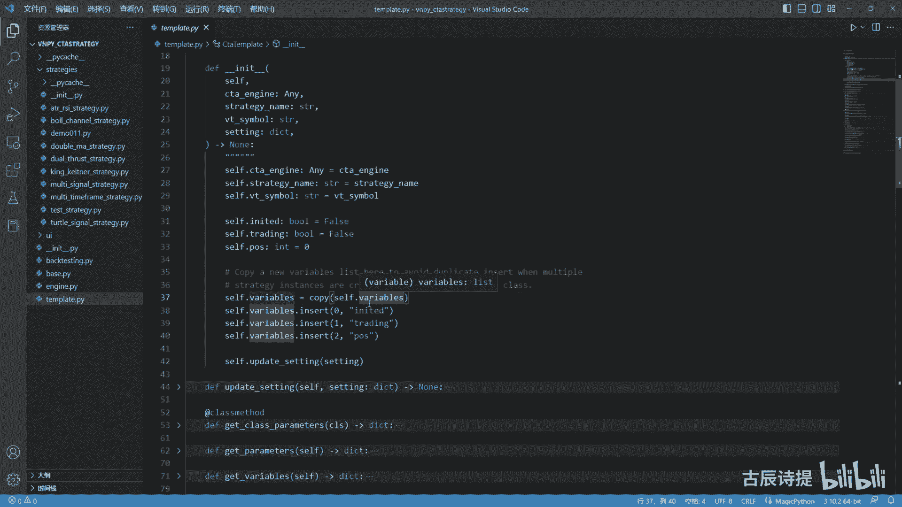

它会变得很多啊很多，比如说呃给大家还是演示一下吧。

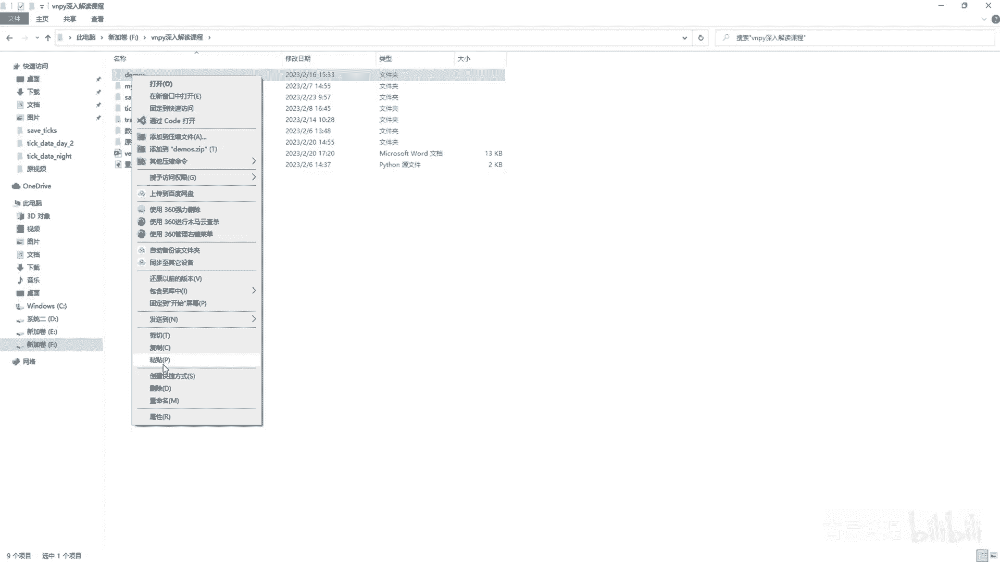

从我口袋打开，嗯咱们这个c t template里边，就是你如果不copy的话，他每次的去这个insert，他会给你这里边呃，就是变得非常非常的多，就比如说我举个例子，咱们第11节课了是吧对吗。

11点PY好，比如说我定义一个class啊，C l s class person，Person，然后我in it一个，然后这个里边有cf点，name等于啊，比如说ALEX，然后C点等于，等于20。

然后呢他这有个类的这个变量，比如VR等于一个list，它是一个列表是吧，如果你不copy它的话，我这个cf点vs点insert insert，然后把这个放在零的位置，然后把这个cf点呃。

name给它给放进去，然后cf点vs点insert，然后把这个在零的位置，还是把这个cf点给它放进去好，然后呢我继承它，比如说close a class，我P21啊，比P21吧。

继承自这个person啊，继承自这个person，然后我pass啊，然后我class呃，别pass，然后因为我得让他in it是吧，然后就super init就好了啊。

PR2我还是继承自这个person，然后还是DEF杠杠INIT好，然后我去实例化它，我P1等于P21实例化一个，然后我P2等于实例化二好，然后我print一个P2的这个VR，咱们可以看一下，好运行一下。

你会发现这个里边是不是变成两份了，随着你的实例化的越来越多啊，比如说我在实例化一个P3等于PR1，它会变得就是越来越多，你看变成三个了，但是如果说我我给他copy一下，从这。

from copy import copy啊，我从这给他copy一下啊，就是cf点V2等于c o p y copy这个cf点vs，这个时候你再去运行一下，它就变成两个了，为什么会产生这个原因啊。

为什么会产生这个问题的原因是什么呀，你这儿的vs其实是它的一个类的，就是他的一个对象是吧，当你去继承，然后去进行实呃，去进行实例化的时候，其实它的这个父类里边的这个VRS，它始终是放在父类里边的。

你实例化的时候，你找这个C啊，这个cf点VR其实是在子类里边找不着，它才会去父类里面去找，所以说你如果不copy他的话，他每一次在实例化，然后去执行父类的初始化的时候。

它都会给这个SAS这个cf点vars去insert一个，因为他们找的都是同一个这个cf点vs，都是在父类里面找到的这个cf点VRS，而父类这个里边，这个SADIARYARS呢会不断的进行insert。

但是你把它进行copy之后呢，这个cf点vars呢就成了，就是说你本身的就是说这个实例化的这个类了，因为这个前面有cf点嘛，对不对，实例化了，因为它赋值了它自己实例化会有一个CBS。

然后可能有些老板会说，我下面有点这个C点vs啊，如果说没有这一行的话，这个原因是什么呢，就是你本身在子类里边，因为这个继承之后，从这INIT它就就是会在子类里边去执行这些吗。

在子类里边他找不着CVARS，因为子类里边并没有去给他去这个定义shift vs，所以说他会父类里面去找，所以说找半天他还是去找父类的这个vs，所以说他这个两个或者你实例化多少个，它都是同一个vs。

但是我从这赋了值，它就不一样了，这个就变成子类的cf div2了啊，这一点你一定要清楚，这些也是Python基础好吧，跟大家解释一下为什么是需要copy一下啊，然后这边insert了。

就是把这个inity trading和pose都添加进去，这个咱们在界面上你能看到它是否呃初始化了，是否准备好交易了，然后它的持仓是多少，是不是啊，这个其实最主要的还是呃界面。

以及统一这个CT引擎里边的一些控制，就是你像咱们之前在city引擎里边去讲过，INIT主要是控制什么呀，当你就是初始化，你需要去加载数据吗，去执行这个这个里边的这个on init，当你执行完了之后。

它这个trading才会变成true，对不对啊，就是呃他其实是来控制，就是说一些呃误操作啊，或者重复操作啊，然后pose值就不用说了，是来控制这个就是你的这个仓位的是吧。

然后这边呢有个shift update sitting，传进来的呢是一个C啊，Setting setting，咱们在这个T引擎里边说过，他会去读取本地的divine trailer。

这个下面的这个sitting，然后把它分门别类的通过这个string name，然后就是你的这个名字给它，全部给就是实例化这个策略的时候，把这个city就是挨个的给你传进去，然后你看它在初始化的时候。

它就updsity update sitting，其实就是挨个的去赋值嘛，sat a t t r啊，这个也是基础，Sat a d t r，Get a t t r，然后get it built。

那个下划下划线啊，Get it built，这些都是你需要去掌握的，而且也会以后用的比较多啊，CTATTR就是给它赋值嘛，就是跟这个等于没什么太大的区别，只不过他是去这个参数里面去找。

因为这个里面是放的是参数嘛，找它对应着的这个呃对象，然后去给他去赋值啊，去给它赋值，其实这个逻辑很简单，然后这个class method是一个类的方法是吧，类方法就说明这个方法是这个类的啊。

这个里边他做了个什么呢，就是get class，就是其实就是获取这个类的参数啊，获取这个类的参数，这个类的参数和你实例化的参数是不一样的啊，你这个get呃，这个呃pr它是获取实例化以后的。

因为你从这给赋了值了呀，你从这给赋了值了，这俩肯定是不一样的啊，当然如果说你这个里面没有参数或者参数，你的初始值和你的就是重新赋予的知识，一样的话，咱们另外一说。

但是只要是你一个一套策略放在多个合约里边，你肯定会参数多多少少会有些变动，所以说这个是获取类的这个参数，那就是它的初始值，然后这个呢是获取你实例化以后的，它会经过这个ADD setting啊。

有了变化之后的这个初始值啊，这个也可以给大家去演示一下啊，其实很简单，比如说我这这个name，然后STR，然后呃比如说等于这个ALEXALEX是吧，然后我这个age，然后int比如说我就等于18啊。

然后呢我这cf name呢等于name是不是，然后我cf点age呢等于这个age啊，age好，我从这儿呢我定义一个DF一个呃，就是说这个GATTR吧啊cf，然后我打印一个print cf点age。

然后再print一个呃SB点name啊，我这呢给他把它变成就是类的这个属性啊，Class method，然后把它变成这个cs是吧，Cl，所以这呢你就不能用这个cf了，我用CLS点HCLS点name啊。

这个类的这个就是说这个age和name，其实我最好是应该把它写到哪啊，我应该把它写到这儿，是不是啊，这个name等于因为它是类的对象嘛，name等于我默认的一个name，就是小明啊，我默认的一个A姐。

比如说等于100啊，我把这个A这边是重新给赋值了是吧，重新给赋值了，那我这个是获取了类的这个名字，和这个就是年龄，然后我再来一个git a t t a t t r，然后self吧。

就是获取实例化的这个对象，然后我print一个呃C点age，然后print一个C点name好，我实例化了之后，我从P3，这我P3点就是当然我这边实例化的时候，我把这两个给注释掉啊，我把这个删了。

然后我这个这里边要传入，比如说这个ALEXALEX，然后这边要传入这个，比如说18啊，18，然后我我获取一下P1点git AD t r，这是获取类的这个属性啊。

虽然我传进去这个哎3was giving one person，传入名字edge，我这边没有进行传参是吧啊，没有进行传参name，然后把这个name和age给它放进去啊，好给他复制一下过来好。

我实例化的时候我是这样的，我这个时候get这个类的，它还是100和小明，对不对，然后如果说我get这个呃cf，然后这个获取它实例化之后的，它就变成了这个18和ALEX了啊，这个就是它的一个区别，好吧啊。

然后这个get variables就是获取这个变量嘛是吧，变量这也没什么好说的啊，就是去get a t t r呃，多用get a t t r c a t t r就是那个等于号啊，那个你如果东西太多的话。

或者它的灵活性就是比较低，当然能用等于的就用等于是不是，但是这个get AD t r呃，它不会就是就是造成就是说你的缺失和遗漏，你像一个循环就把所有的全部都给放进去了，是不是啊，不会造成缺失和遗漏。

这个get data是一个整体的一个，就是说数据的一个就是所有的包括参数，包括变量以及它的这个呃就是author就是作者啊，就是class name，Visible strange name。

都放在里边，就是你看这个就是存储在咱们这个点，win trader下面的那个一个整体的一个信息对吧，一个整体的一个信息，啊他不是存储在这个点VMP下，这是获取一个整体的信息存储的，那个是在下面的这个啊。

这个在咱就是之前的课也给大家讲过，其实这个它是一个装饰器啊，但是这个装饰器里边什么也没做，就是一个空的，就是你方法过去的时候，它还撑了一个方法，其实这个也不能叫装饰器吧，这个呃算个B包。

在Python基础里边也有，这个就算个B包，其实他是把这个方法当做一个对象，给你进行传递，这也是Python基础的啊，我就不讲了，如果说你想就说去听的话，你就听听装饰器，或者说是你看我之前的第一套课。

里边有详细讲过这个，另外就是说在这个呃我的Python基础课里面也有，好吧，都说至于说为什么用这个，你把这个删了和不删有什么区别吗，呃这个怎么说呢，就是说就是我不知道大家就是说知不知道。

这个东西就是from a b c，import这个abstract method呃，或者说是abstract，就是ABS啊，不struct method，这个啊就是一般如果说是继承自这个ABC啊。

还有个这个大的ABC啊，这个AABC不是ABCD啊，就是你继承自他啊，就是如果说你继承自他，比如说我继承自这个ABC，然后呢你下面有一个方法是用它来进行装饰的，是继承自这个应该是大的ABC啊。

应该是大的ABC啊，还是小的ABC啊，没有小的ABC吧，这里边没有，就是大的ABC啊，就是你继承自它，然后就是你下面有一个方法，就比如说我这再有个方法d f sleep啊，S l e e p。

然后cf然后这边pass啊，我这边写一个，我继承自他艾特这个abstract method，这个时候我实例化的时候啊，我实例化的时候它会报错的啊，也不是说实例化的时候我继承自这个类，它会报错的啊。

他会报错的，你看他会报错的，因为你有一个方法没有去实现，它是什么意思啊，就是说你这个类里边写的，你下面不用去写逻辑，因为什么呢，因为继承自这个类的，它都需要就是去实现这个方法，你不实现的话会出问题。

如果说我实现了它，比如说我d f s l e e p sleep self，然后我这里边可以不写东西啊，可以不写东西，c tap tap啊，这个时候你再去去走的时候，他就不会报错，为什么呢。

就是ABC不是咱们通常意义理解的那个AB，它它是abstract，Abstract，它是什么意思啊，是抽象的，它其实就是给你规定，就是说你必须得实现哪些接口所用到的。

其实在这个里边它可以完全用object来实现，但是啊有一些比如说你做的是CTA策略，你可能呃用tick或者就是用的比较少，或者用欧巴啊用的也比较少，或者说呢你就是发的委托单，当然不可能说完全不用啊。

或者说你在回撤的时候，你根本就用不到这个OTIC，你回测的时候你不用用这个OTIC吧，因为你用的是一分钟数据，对不对，那这个时候你OTIC其实完全就可以不写，这呢就是说你不写的话，他不会报错是吧。

就是这个而且他从这个父类里边，其实他告诉你了，就是这个东西，其实你最好去应该去把它都写出来，呃但是你不写呢，它也不会报错，但是在回调的时候，如果调，如果调不到的话，它会报错啊。

另外一个就是它你可以在这个，就是它是在那个UTTT那个里边的，你可以其实在这里边可以把它进行重写，然后每次在回调的时候，比如说你他都会经过这个，就是说这个就是就这个方法嘛，你可以把这个方法进行啊调整啊。

在里面添加一些东西啊，什么都是可以的啊，有兴趣可以去听一听那个装饰器，我觉得这个是挺好的，他并没有一味的用那个那个那个那个抽象的，那个abstract，非得让你去每个都去实现它。

嗯嗯就是自由度更大吧好吧，然后这个busier short cover咱就不说了，因为最终都转成了这个SORDER嘛，只不过他的这个offset和direction，就是不一样的问题啊。

这cancel order咱们也不说了，就是说去取消委托单，Cancel，这这里边没什么好讲的，其实就是调用，就是说这个T引擎里边啊，然后right blog是日志的输出，这个也不用说，都在T引擎里边。

这个get engine type嗯，就是获取它是实盘还是模模拟的这个type你用啊，你其实可以在策略里边，如果因为实盘和模拟还是不一样的嘛，如果说模拟的话，我这个代理我这个策略怎么写，我示范的话。

我这个策略怎么写，但是一般不这么去做，就是一般就是说在回测的时候回测差不多了，你会把它改成实盘的是吧，你就认为这个策略可以了，那我去把它改成改成实盘的，因为你并不想你的这个实盘策略里边带一堆呃。

回测的这个什么，当然了，如果就是碰到一些情况，比如说我这个策略实盘和回测，我每天都要去对比一下，你就可以写在一个策略里边是吧，省得麻烦就get price ic，就是获取这个就是它的这个最小。

就是一这个这个一跳的这个值是吧，get size就是获取他的，就比如说这个焦炭一手是多少吨啊，load b啊，和这个load tik，这个是就涉及到了这个额数据库啊，咱们可以看一下。

其实他是到这个CTA引擎里边去load吧，和load tik，这个其实只要讲一个就可以了，CD引擎里边咱们并没有去讲这个logo吧，和load tik没有讲的太多是吧啊，这个load bar啊。

这是这是CT引擎吧，你看它的就是传递过来参数啊，第一个是very simple，第二个是days，就是你要下载多少天的啊，然后interval它是就是你的周期，这call back呢是是一个什么呀。

回调的一个就是你用这些数据，你最终是用来干嘛啊，他在这呢，你看给你写了一个，如果说没有call back，他就把这个set on bar给他传过去啊，这个有什么好处呢。

比如说你这个数据我就是要10分钟的，其实你可以，比如说我数据库里面存的就是10分钟的数据啊，因为我做10分钟，做10分钟周期嘛，其实这个你就没必要去调用on bar了，你你可能去实现一个单独的。

比如on time in bar，然后你可以把它换成on temp，把这个比较方便，但是一般情况下咱们都会去录制一分钟的，或者保存一分钟的数据，然后一般情况下都是这个都是不用去传的。

你就去掉欧巴就可以了啊，然后获取到了这个数据呢，你看他最后是for buying bus，然后call back，其实就是欧巴来调用这个bug，就是把这个就是你获取到的这个K线给你去回，调到了这个4。

8，这个你自己去实现的这个方法里边去了，是吧啊，这个逻辑很很简单吧，但这个里边有一个use database，就是用不用数据库，有没有数据库，它默认的是否默认是否，咱们来看一下这个逻辑啊，如果说没有。

就是如果他为否的话，他就会首先去看看他是不是这个行情，是不是支持，就是说历史数据的调用，比如说有一些呃，比如说你想做一些其他可能国外的品种啊，他这个交易所是给你提供历史数据的，有历史数据的这个接口。

你就可以直接去进行调用，但是在期货里边嗯是没有的啊，然后else呢它就会就是query bar from defeed，这个defeat呢是你的数据服务商，他就会去这个数据服务商那边去获取。

咱们一会再来看这个啊，呃去数据服务商里边，这就是那个接口里边去去获取数据，如果说还是没有数据的话，他还是会去这个database里边去load by data。

你会发现不管你这个uu database是false还是true，最后如果前面找不到数据的话，他还是去数据库里面去找对吧，但是呢如果说你把它变成true呢，它就不会取数据服务商那去去宰啊，去下载。

但是如果说你是false的话，他最终如果去数据服务商，那还是获取不到的话，你或者你并没有开通的话，他还是去会去数据库里面去找啊，这个就是他的这个逻辑，那咱们看一下这个。

这个第一个就是query Buff from data feed，呃，这个就是在这个engine里边，它有单独的这个类嘛，然后它会创建一个history request。

然后呢通过这个self点data feed，然后query bar history，Query bar history，然后这个cf点data feed呢在初始化的时候呢。

它就get data feed，这get data feed呢是在这个VPY点，trader点did feed里边给就是get啊，Defeat，你记住啊。

在这个WPY点trader这个里边一般是存放着的，是一些你想object就是通用的object，像tick data bar data呀，这些数据类型，或者就是你这里边有交易所信息啊。

你的周期信息啊什么的，这些通用的会放在这个里边，然后你像在这个里边放的这个DATABFEED也好，database也好呢，它是一个抽象的类啊，它只是因为你data feed呃，你有可能是米宽的。

但是你有可能也是是这个天晴的呀，或者其他的一些数据服务商啊，是不是，所以说他们俩做的呢，最多的是给他就是说规定好了，需要实现的哪些东西啊，需要去实现好了，去实现哪些东西，那你看这个data feed呀。

他并没有去加这个struct method，但是呢它继承自了这个ABC，看见没有，他这里边第一个初始化，第二个是下载霸线数据，第三个是下载这个数据吧，是不是，然后这边呢他还定义了一个方法。

就是get data feed，咱们捋一下这个逻辑啊，这个data feed呢你先给它复制成了一个NN，就是你复制成down之后呢，他这就是global了一下，就是可以改变。

这个就是把它作为一个就是局部的，这个就是对象可以去进行使用是吧，如果说已经有了它就return，如果没有的话，他会去这个setting里边去获取这个data feed name。

如果说你是阿q date的话，你看他VPY下划线iq data，它就会进行把这个model name就给弄出来了，这个model name弄出来之后，它就会进行导入，这个咱们之前讲过吧，对不对。

然后如果找不着的话，他会什么呀，就是告诉你找不到数据服务的驱动啊，然后默认使用这个echo date数据服务，如果找到的话，它会再把它换成这个别的，比如说你就是阿Q。

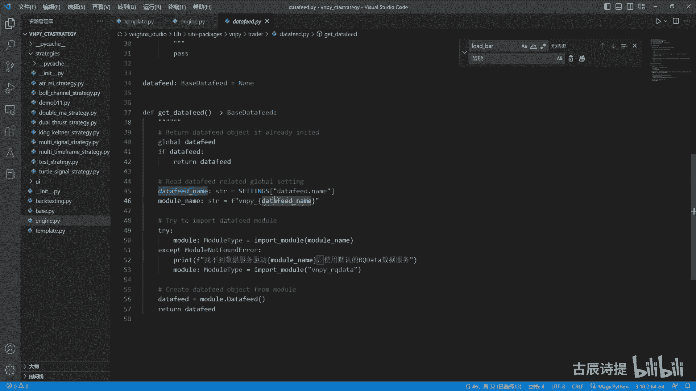

我这就变成了这个iq data，然后呢，在他这个C盘下面的C盘下面列beside packages，这个里边，它呃后边去实现的都是用VNPY下划线对吧，都是用VNPY下划线，你看它这个呃。

后边如果说你是后边是这个eq data的话是吧。

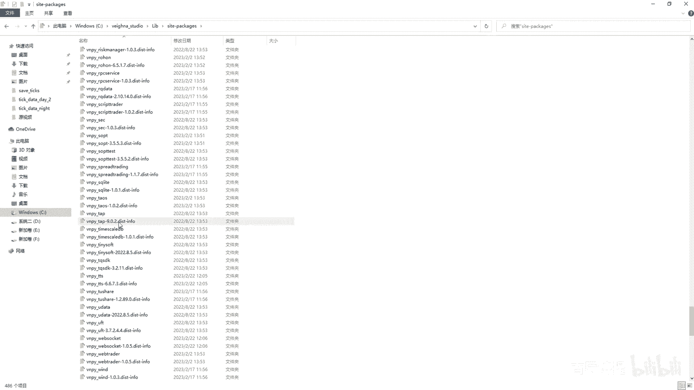

他就来导入这个了吧对吧，导入这个就是从他这个INIT里面来导入吧，是不是啊，这个就是它的这个一就是一整个的流程啊，他这个当你去导入的时候，他就就是当当你去导入这个包里边，它自然而然会执行这个。

然后你导入这个方法的时候，呃，就是你去呃，就是呃运就是把这个方法去括号去用的时候，它会执行，这就是就这块代码，这块代码呢也配合上了你的这个设定，你是用哪个数据服务，是不是。

但是通常情况下都是这个arq data啊，跟它类似的呢就是这个数据库定义，当然这里边支持的数据库比较多啊，知识数据库比较多，所以说他必须把这些数据类型给他统一了，给他统一了。

你让这个这个base data就是用这个啊，不是这个base database，它是继承自制了这个大的ABC，然后里边一些必要的都用这个at object method，进行装饰了吧。

你必须得实现这些方法，这个就实现了接口的统一啊，写一下啊，实现不同类型对象接口的统一，就是不管你是用的super light还是用的green Sol，还是用的这个MONGODB。

还是用的一些就是什么my cl什么的，就是你都是继承资料，Base data，它里边每个都去实现了这个C8data，septic data sa啊，load by data和load tic data。

还有delete by data是吧，就这些都给实现了，就是你在调用接口的时候，你可以放心的去使用，因为它肯定去实现了，这个就是保存呃，分钟K线保存啊，这个七个K线是吧。

这上面像个ZINFO之前讲过还有什么呀，咱们会用到的这个t z local是吧，会就是在市区方面会用到的，但是如果说咱们只是做期货的话，就是一般你可以把它全删了啊，这个是一个转换是吧，就是市区的转换嘛。

嗯这个两个一个8overview，一个这个overview，它其实是告诉你，就是说我这个数据库里面现在存储的，比如说某一个合约，比如说沥青2305的合约，他现在存了多少条。

就是告诉你这个它有个等于就是一个概况吧，以前啊是没有这个的，这个是后来添加进去的，后来添加进去的，我觉得是方便，就是你对数据的一些管理，这个数据库你没必要从一开始就开始学啊。

咱们可以打开一个SUKI的一个。

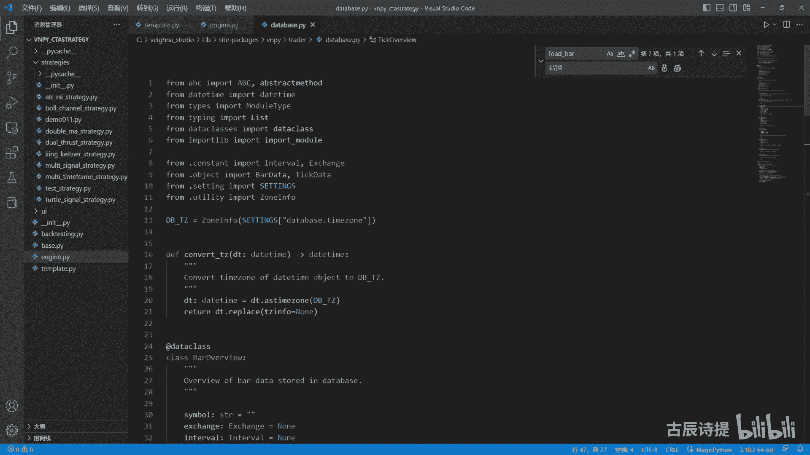

数据库的一个接口，就是看他这个源码lib site package，然后在WPY。

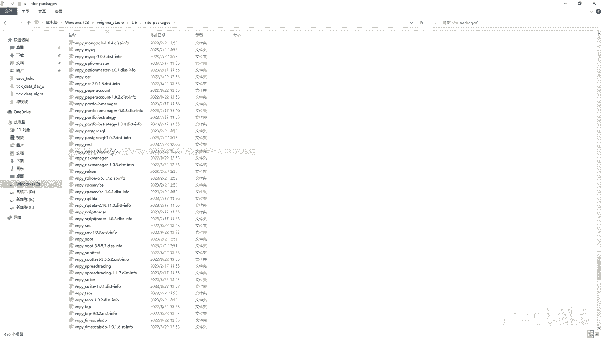

super是这样的，通过code打开这个SQL。

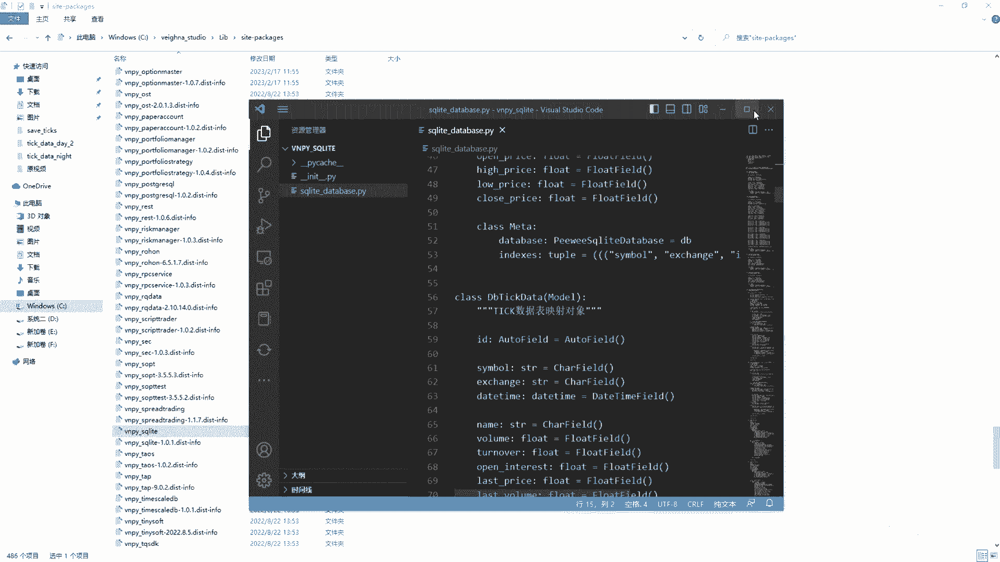

这个里边其实最主要用的这个模块啊，是这个PEWEE，他那其实有一个拓展模块，就是这个playhouse，如果说你没有playhouse的话，P u a n playhouse。

如果你没有playhouse，可以啊，这个pp一下PP一下playhouse，点poor，这个为什么给大家单独讲一下，就这里边接口啊，其实接口并不复杂，就是你只要会用就行呃。

然后这边你像这个dB tic data呢，它是数据库里面存储的，这个算是映射对象吧，就是存是按照这种方式进行存储的啊，就是这个你会用就行，直接去导入它，然后就是说去试去实例化一下。

你就可以load by data，Load，告诉他这个数据库的路径在哪是吧，但如果说你要对这个模块进行一个改变的话，呃通常的改变就是什么呀，你去全市场全航行，比如说你去录制一些数据的时候，你需要边录制。

然后边去就是去调用里面的数据的话，就等于是一个呃，有有可能是并发的这么一个编程模式嘛，就是可能会超过一个线程去调用，超过一个线程去进行调用，这个时候呢如果说你调的不平凡，应该是没啥事。

但是如果说你那边边录着行情呢，这边边调有可能会有一个征用的情况啊，就是征用的情况，就是征用的情况呢会导致他报错，就是偶尔啊偶尔它会报错，这个时候呢，你其实可以把它改成这个线程池的形式。

就是poor supply database。

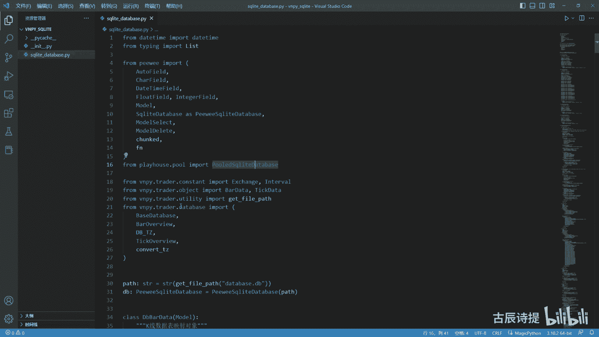

怎么改呢，我这儿呢我就不具体讲了，因为这个数据库啊，呃它里边东西其实挺挺多的，其实咱们只需要会用就可以了。

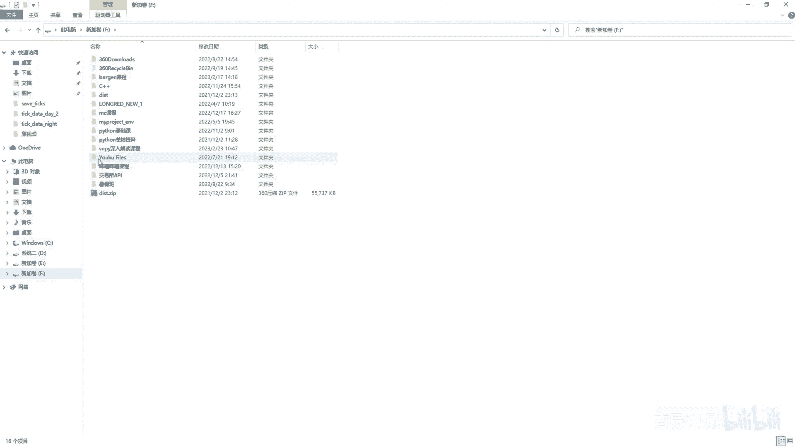

在这个我有个这个database test啊。

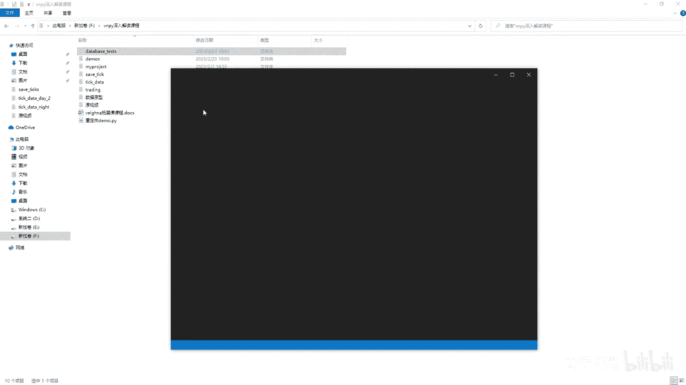

这里边跟大家简单介绍一下这个database，就是把它变成这个一个连接池的，一个这样的一个形式，呃，最主要改的有两点，第一个是SQL里边呢，这我导入一个database，这个怎么读啊，pro six哈。

这个是代理的意思，就是在原本的这个里边是，其实把这个SUGLITE，这个已经放到这个里边了是吧，但是这呢你先用用一个代理的模式，就是先告诉他我这个数据库啊，我先假装有个事，就是啊你可以理解为是站位啊。

先给他占住，然后这里边你就可以还可以，直接用这个DB是吧，以前是DB嘛啊，就是还可以去用，然后你再对它进行实例化的时候啊，就是你需要之前给他进行，就是说告诉他我用的究竟是哪个数据库。

你像咱们从这儿是get fire pass，其实以前是在这的对吧，直接就获取到了，但是我把它就是放到这儿来，然后这的dB呢我给它换成一个poor sudatabase，然后这个里边有几个参数啊。

第一个就是database，你的这个数据库，第二个呢是最大的连接数，它默认是20，如果呃你想把它变大点，可以写的更多是吧，我这儿呢就写了个一，因为我是进行测试用的嘛，然后这个这个使用的时间。

下一个是使用的时间，用了多长时间，这个链接就会断掉，然后他骂，就是如果说我只允许一个呃县城去连接它，然后呢呃别的县城就在那等着等着他，等多长时间呢，你可以给它设定时间啊，我是我这写的是五秒钟啊。

这是这写的是一，你可以把它换成别的，你可以看一下那个playhouse的那个介绍啊，嗯这就是就是告诉你怎么用，然后这一步你是需要写的，然后再把它就是说初始化一下。

然后这个dB process x给它初始化一下啊，初始化就是告诉他我这个用这个cf点dB，然后这个时候呢你就可以进行，就是多线程的这么一个操作了，我这儿呢案例呢是写了两个，第一个呢是保存数据。

把数据我这有个就是CSV格呃，就是这个文件，然后把这个数据呢保存进这个数据库，然后在保存的同时呢，我这有两个线程嘛，一个是save，一个是git嘛，就是获取线程啊，获取线程。

然后这个线程就是获取的是作者是什么呢，就是随时随地的在获取，随时随地的在获取，它是一个呃self active，它是一个循环，就是一直在获取啊，然后这边有一个while true，它就是在连接的时候。

因为我这写了一个就是五秒钟就不让连接了吗，他就是反复的去申请连接，其实逻辑就是这么一个简单的逻辑，后边都是输，就是你的这个啊data数据和这个dB数据，就是数据库数据和你的这个8data进行了转换啊。

没什么太多的东西，就是这个就是用来测试什么呀，就是说你的多线程连接的，你在使用的时候，这样的话也会更加的啊方便，我能想到的就是咱们在使用的过程中，就是说能够去拓展的就是这么一块。

但是呢你如果往深里讲或者往更多地方讲，我觉得没有这个必要，你知道怎么用就可以了，无非就是多了一个这个限制，就是这个连接池，然后呢这个连接池呢如果说你这个用完了，这个线程用完了呃。

然后这边会就是说把它给关掉，用这个manual clothes啊，这个记得用这个close就可以了，咱们可以演示一下这个案例啊，因为我现在只是允许一个线程进行连接，但是它启动的时候是run的时候。

它是两个线程一起启启动的，这边还输出了一个就是一个现成的枚举啊，我先把它给注释掉，按说正常情况下是一边存一边取，但有可能不会出现错误，但是有可能也会出现错误呃，两个是同步进行的，但是在这儿呢。

呃就是说我给他设置了只有一个连接，所以说他就得先存，然后再取啊，这是做了一个案例的这个一个一个一个演示啊，因为正常情况下，它是两个一起去同步去进行操作的是吧，我这儿呢就是让他就说分开。

因为你两个线程是同步启动的嘛。

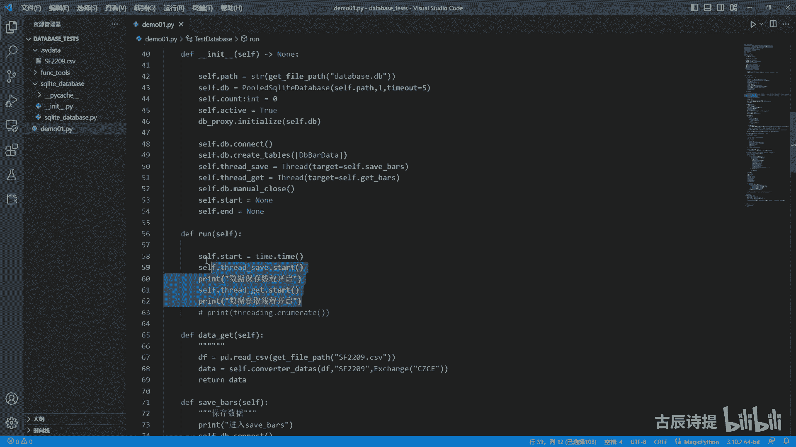

对不对，好，我从这儿我给大家去运行一下，运行一下这个demo01。

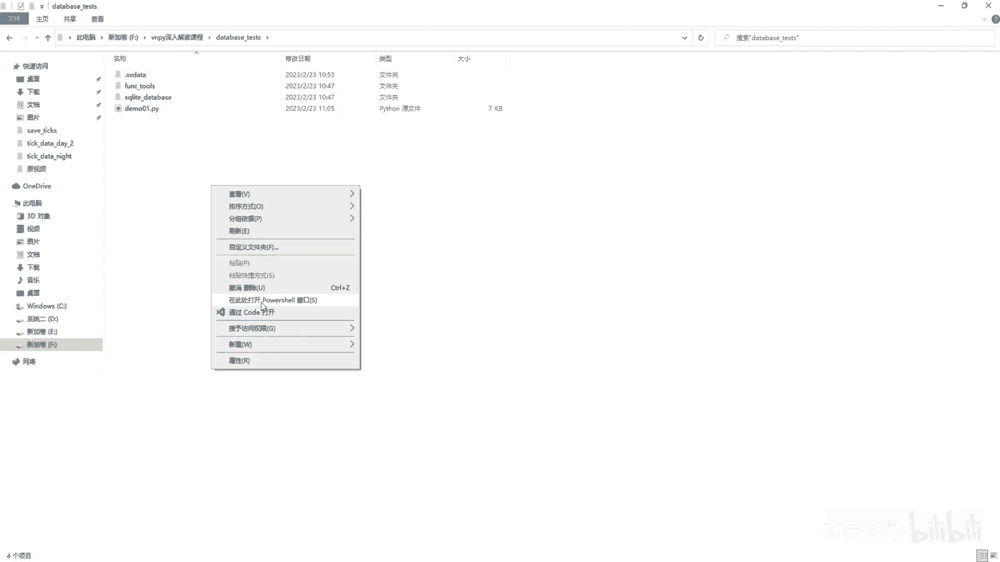

诶啊没有tap下是吧，两个线程都开始了，但是呢它只有一个去执行了，就是save bar啊，你看出现错误，这是就是这个出现错误啊，是这个呃时间到了啊。

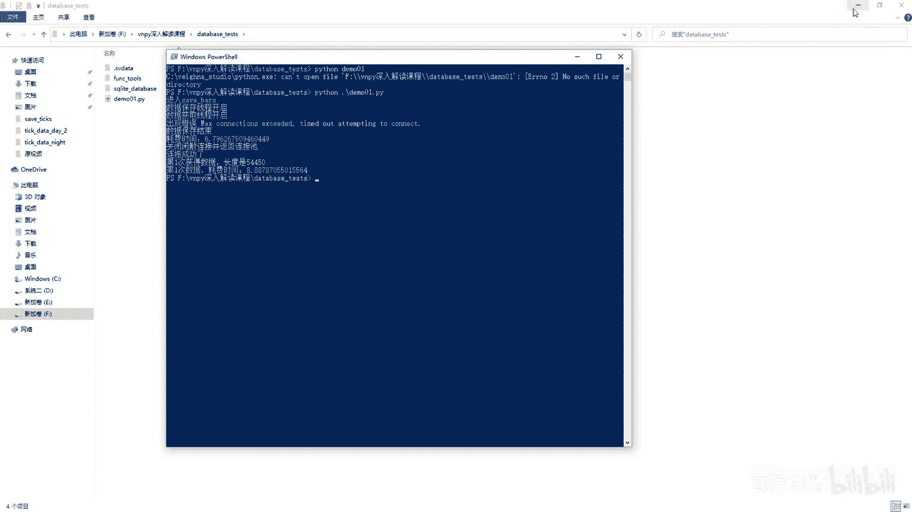

时间到了，但是我是反复的去连接的，然后呢他这边已经给存完了是吧，存完了之后把这个线程给，就说这个连接给关闭掉了，然后呃这个就是去获取数据的，就连接成功了，然后我只获取了一次，只获取了一次，因为什么呀。

就是说呃这个循环我是用self active来控制的，如果说我把它变成二的话，就是我可以同时允许两个连接去，一起去连接它的话，呃正常咱们肯定是多个连接的啊，你可以把它那个值设大一点，或者设成一个。

就是不限这个次数是吧，你像这个进入c bug了，然后这边也显示连接成功了，你看第一次获取吧，数据长度啊。

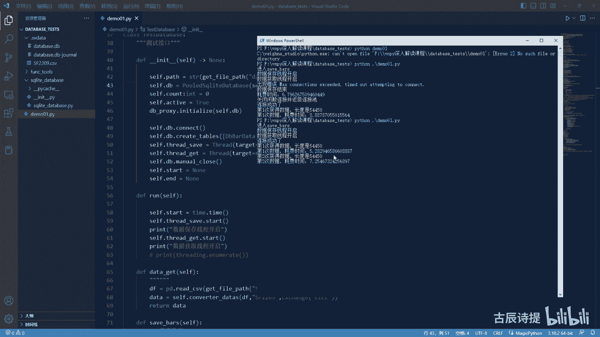

当然我这个数据库没有删啊，我想把它给关掉，把这俩数据库就是删掉。

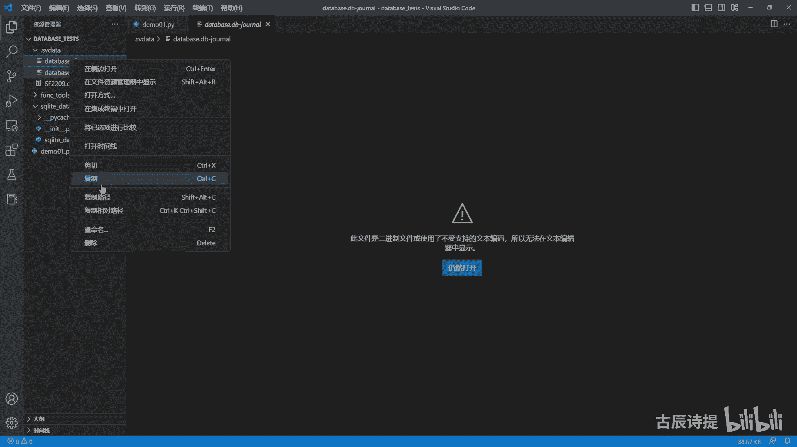

就是它的这个数据是不一样的。

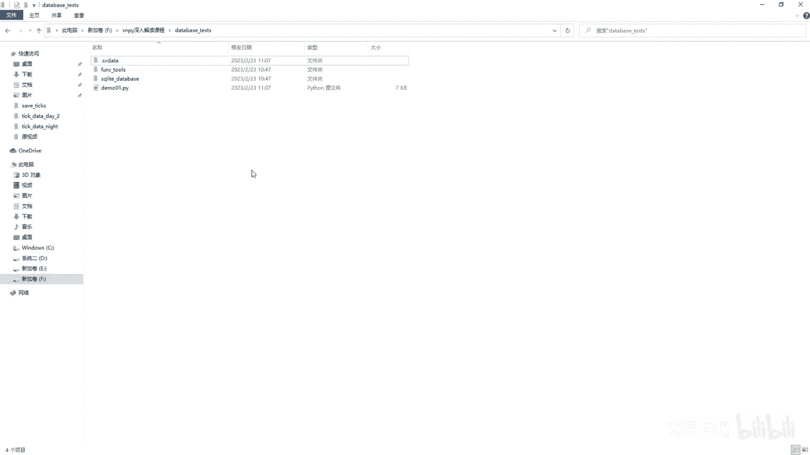

是吧，这个是你一边存数据，一边获取数据，你看从这它就开始有变化了吧，数据就往里存了吧，然后一边存一边获取，这这个就是这个数据库的多线程操作。

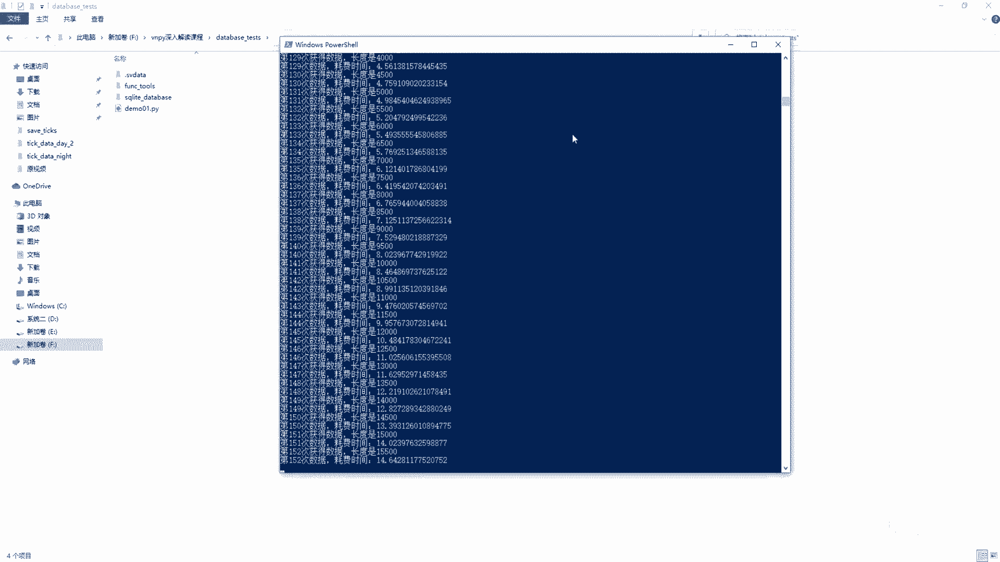

其实你只要会这个，我觉得大部分问题都能解决，另外一个要说的就是这个数据库。

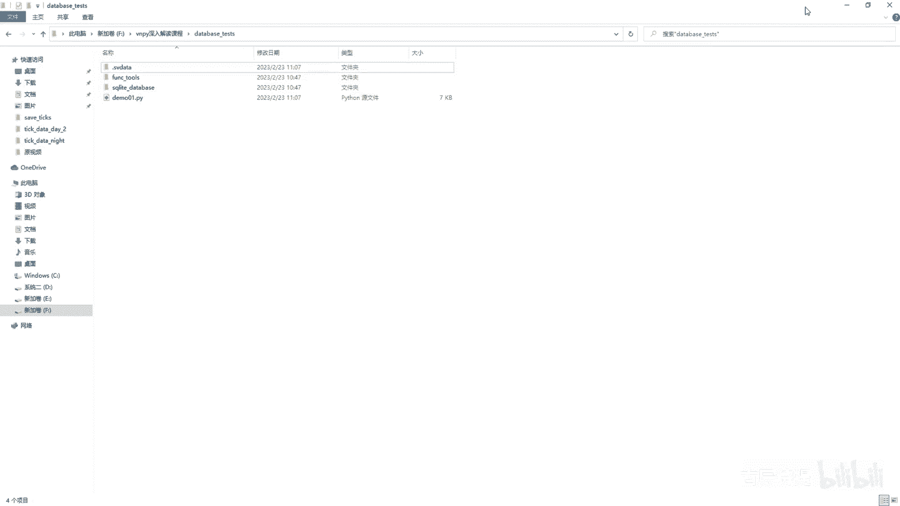

我建议用这个SQL，没有别的特别复杂的东西在里边呃，My sol，你需要下载，然后包括安装啊什么的，需要很多的别的东西啊，包括那个green那些都是比较重型的，你像咱们这个存储点这个啊。

就是这个霸线数据，我觉得就是SQL就完全够用了啊，就完全够用了，好吧。

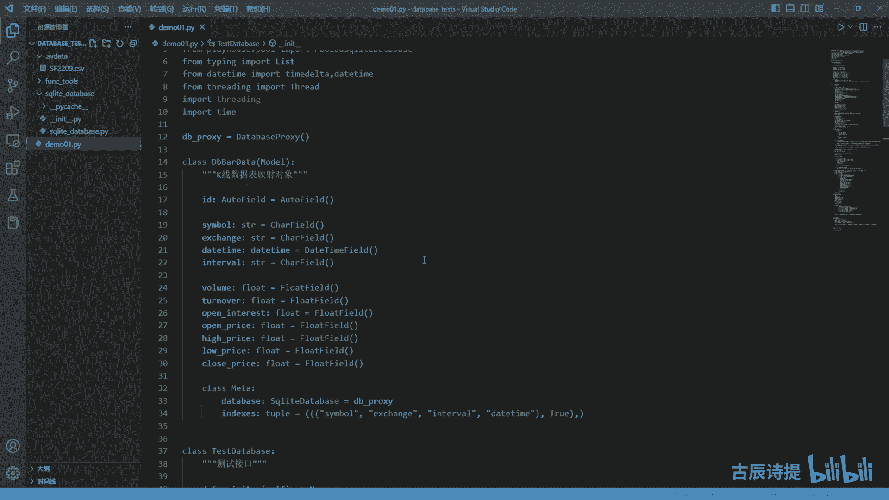