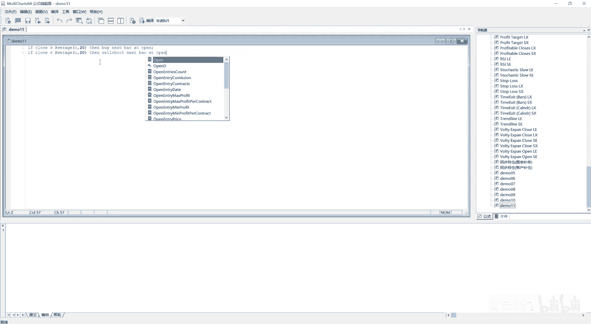
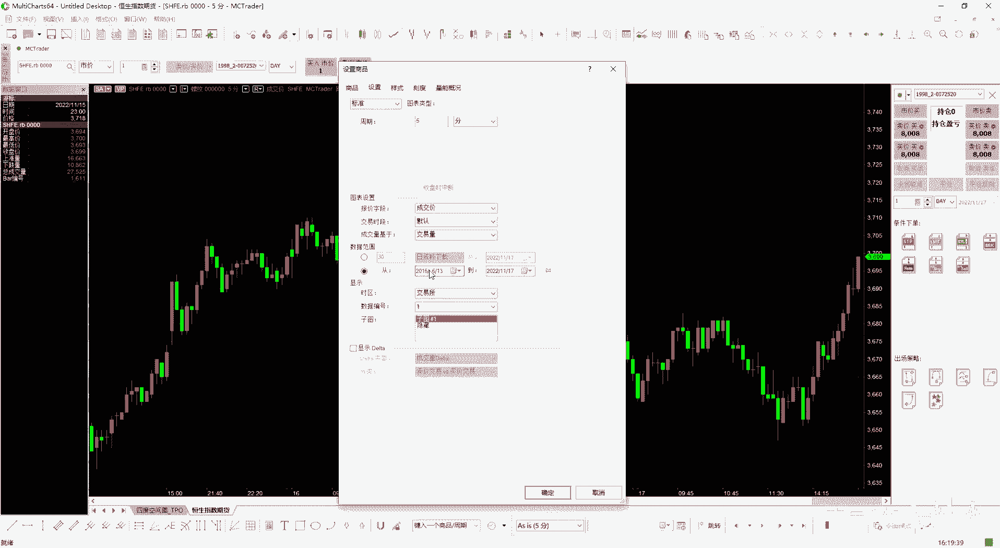
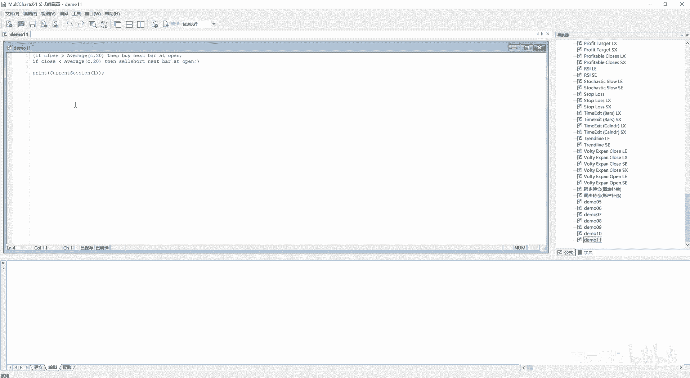
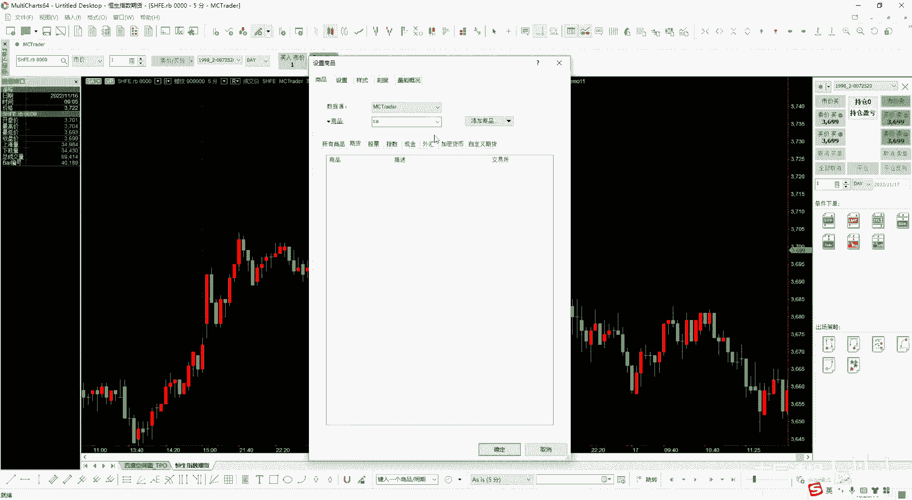
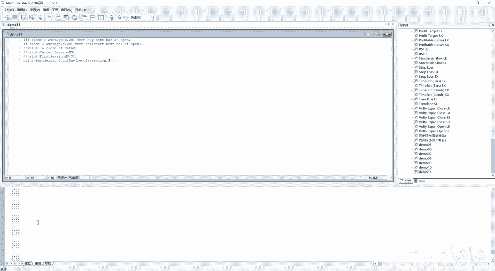
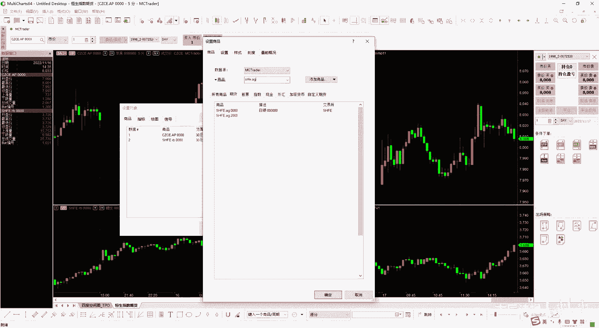
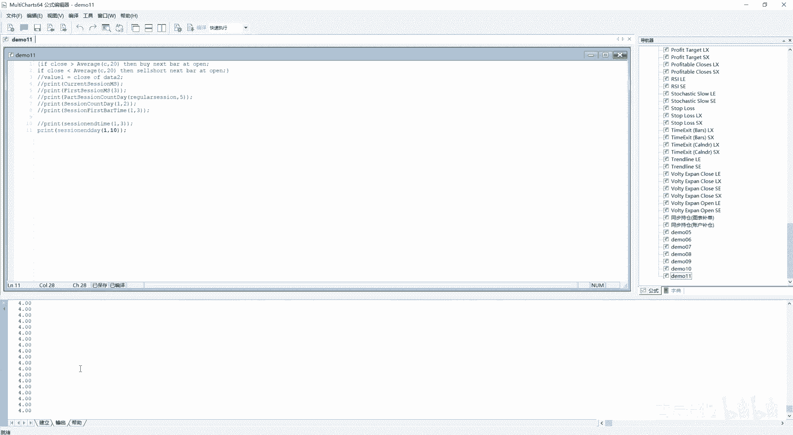
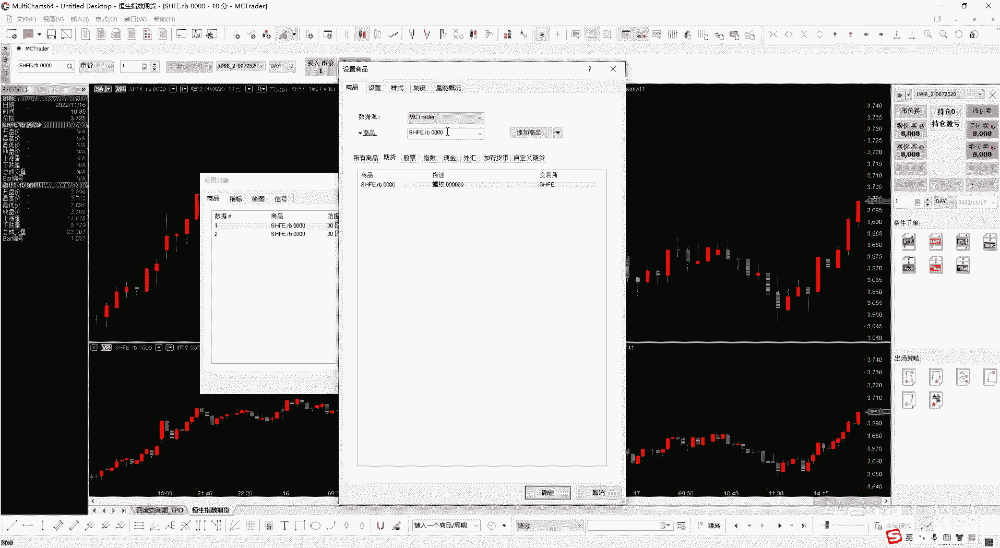
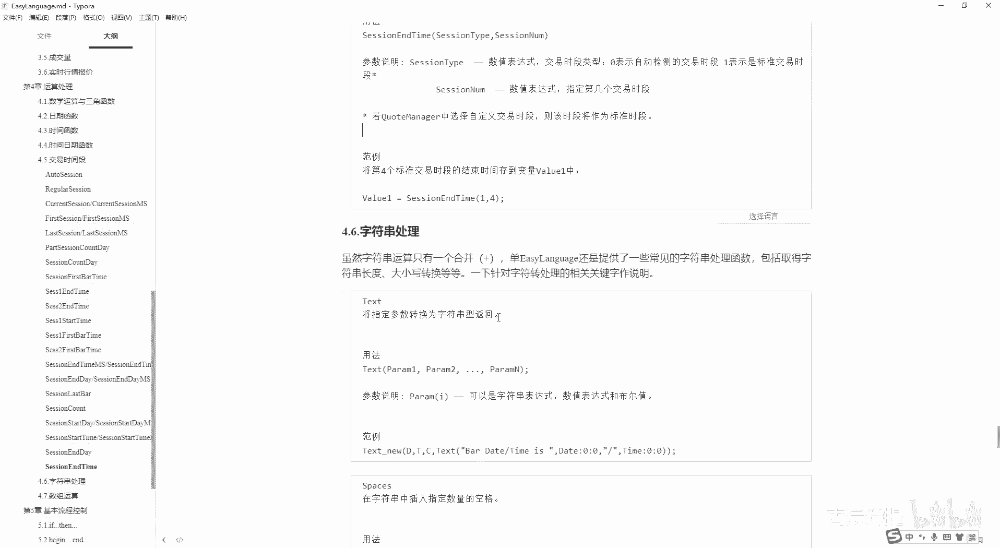

# 第11节课 交易时段 - P1 - 古辰诗提 - BV1qD42137PN

欢迎大家来到从零开始量化系列课程，MC课程的第11节课，前两节课呢给大家讲了，这个时间函数和日期函数，这儿呢还有个时间日期函数，时间日期函数它比较少，就两个，第一个是computer the time。

就是返回当前电脑的日期时间的掳掠日值，咱们之前一直在说daytime，一般都指的是掳掠日的这个呃值呃，你像这个就是很明显的，就是返回当前电脑的这个时间日期是吧，日期时间他的如约日的值整数部分表示是日期。

小数部分表示是时间，这个就不演示了，第二个是string to the time，就是将日期时间字符串转换成乳瑞日的格式，其实跟之前咱们讲的啊，这个format date。

format time比较类似，你就看一下他的这个说明就可以了，就是大写的M是表示1月份，小写的M表示是分钟啊，TT它表示的是上午和下午，当然这am和pm是没有的，咱们经过演示。

他会给你直接输出上午和下午，对吧啊，这个知道怎么用就可以，我相信你之前如果说时间和日期，这个分别的这个函数你都掌握清楚了，你像这个就很容易去解决了，后边呢咱们讲这个交易时间段呃，它的一些内置的关键字。

在说这个之前呢，肯定有好多老板会有疑问，因为你们是特别想快速的去学习，我如何去实现我的策略代码，对不对，如何去实现我的策略代码，那为什么要学这些东西，其实你要你需要从根本上来了解这个平台。

它的运行的一些机制，尤其是你像这种封闭式的平台，像维纳是开源平台，咱们可以去研究它的代码以及它的逻辑，你当你就是说去写一个简单的代码，你肯定会有成就感，比如说我就从这新建一个，咱们今天是demo。

11好吧，我就简单的写一个，就是说双均线的策略，其实两行代码就解决了，比如说if呃，close大于average，这个比如说我是20根均线是吧，average20根啊，20根。

他的这个收收盘价4C然后写上一个20，然后then啊by啊，next bar at open啊，然后if close小于，Average c，然后20then，Shell short。

Next 8at open。

你想这个其实就是这个策略，你给它去加载到咱们的这个，比如说我设置一些商品，这个商品我就设置成这个，我就在指标里边吧，我就从2020年是吧开始。

然后我去先去加载一下数据，然后我把我这个信号加载进来，其实这就是一个策略，这个策略很简单，咱们写一些简单的策略，其实不用说几十节课，可能一两节课你就能写了，但是你要从根本上去知道这个MC整个的。

它的这个逻辑是如何来运行的，就是你写了一个简单策略，那你后边儿怎么办呢，就是你写简单的，你肯定想写比较复杂的，比如说我根据资金曲线是吧，我还要参照一下其他的商品，然后我还要设定，比如说我盈利了一笔。

我休息多少天，我还要做一些，就是说嗯就是跟踪止盈止损这些你如何去写呢，对吧，那你所以说你肯定得从底层，你知道计算器的一个逻辑，你得知道函数是什么，你得知道信号是什么，你知你得知道绘图需要哪些注意点。

当这些你系统的慢慢一点一点的，把之前的内容掌握了，你后边到最后的时候，咱们肯定下面讲就会讲这个绘图好，然后再讲一下print输出，print输出，咱们一直在用，其实它里边有很多的东西可以去深究的。

因为print输出是在检查你代码，最有效的一个方法，不可能就是说比如说你在群里边，你有什么问题了，你就在群里边问，当我看不到代码的时候，或者就是不在你这个身边的时候。

你通过这个呃简简单的这种就是QQ交流也好，微信交流也好，我很难知道你的问题出现在哪，你需要去自己去检查去的，包括一些啊，像Python代码在群里边有很多老板去问，就是简单的只言片语，你提出问题了。

我这个就是收不到行情，那我没法去给你解答这个问题是吧，如果说你在我身边，或者说我能操控你的电脑，我可以去看一下，为什么收不到行情，你是哪没有呃，哪有问题，但是就是说你要学会就是自己去检查。

你单去提一个问，就是说尤其是远程的，谁也不知道究竟是个什么情况啊，因为每一行的代码，你每一句的逻辑它都是就是很严丝合缝的啊，很严丝合缝的，就是说你哪一点逻辑上可能有哪块问题，你可能给疏给疏忽掉了。

这这得逐行的去检查的给你，当然咱们这个MC课程我最后会给大家呃，给个十几套，这个策略当然也不是我自个儿写的，我就是这几年在做这个在研究MC也好，研究这个Python也好，当然肯定是得研究策略。

我会给大家一些策略，大家去研究，你会自己去研究，你会发现想读懂别人代码，你不用多三五十行，这个代码你就需要很长时间，因为你得捋这个逻辑，所以说你得你不要去着急的去立马去写。

嗯你把这些它的一些基本运行的规律啊，你都理解了之后，你再去写，我觉得这样会更有效，因为我本身是从谁，也不就是也就是没有这个计算机编程的基础，然后开始去走上这条路，然后一点去一点一点去研究的。

包括当时也没有很多的资料，想弄懂一个什么东西都问别人问好多遍，也没有人能够真正的回答，我就是就是没有系统的去学，都是一点一点的自己去琢磨，这个会浪费很多的时间，所以说希望大家能够不要急于求成本。

来这件事就是一个很长期的事情，你从写代码然后去回测，然后去不断的去验证，你也需要时间的积累，中间咱们虽然说反复说，你不要自己手动的给停掉，当你就是有一套完整的这个策略逻辑的时候，然后也经过不断的回测了。

有数据给你验证了，其实很多时候你也自己也控制不住，当它一直在处于回撤的时候，尤其像今年行情不太好，你很容易就对他会产生质疑，好吧，我希望大家就是能有一个啊，就是一个就是就是不要急于求成的那种心态。

就是你一旦急了，你在期货市场上那肯定会吃大亏的，你像你说写一个策略很简单，从这就把策略给写出来了，然后你再查一下这个绩效策，就是绩效策略报告是吧，一看这还是挣钱的策略呢，呃对不对，嗯你就会嗯去想。

然后去哎我怎么去优化它，然后优化完了之后，然后那个我在怎么进场，怎么出场啊，代码能写的就写，不能写的我就看看，就说我就改改我的策略，你这样肯定会出问题的，好吧，呃说这么多，当然说的有点多了。

只是希望不希望就是说你学完之后你就赔钱啊，呃不管是大钱还是小钱好吧，希望大家认真学好，咱们讲这个交易时间段，交易时间段是这个交易是常用的时间切割单位，它其实是个什么意思啊，就是你像如果说没有夜盘的话。

就是一天上午一个时段，下午一个时段啊，然后有夜盘的话，一天就是三个时段，上午一个时段，下午一个时段，晚上一个时段啊，这个就是一般是按周进行计算的啊，你像在这里边也提到了这个QM。

就是咱们之前给大家介绍过的这个报价管理器，里边就是是在这里边进行设定的，当然它已经给你设定好了，并不需要你自己设定，你也不要随便的去改它，就是这就是交易时段，它都是按周来进行处理的啊。

所以说下面这些代码其实都跟，就是说大部分都跟这个一周有关系，比如说我这周一啊，我就是比如说我我说第十个这个交易时段，它其实就代表着比如说我有夜盘的话，我就周一三个，周二三个，周三三个。

然后周四早上第一个时段，就代表着是第十个交易时段，它是按周嗯就是进行计算的啊，这个首先有前两个这个关键词，第一个是auto session，还有一个regular zation，它是什么意思呢。

auto session和regular zation一般是放在其他关键字后边，作为这个呃参数来使用的，就是它其实就是session type，就是你这个交易时段你是怎么检测的，它有自动检测。

就是根据咱们图表上，你这个时间它自动进行计算，然后去找他的交易时段，还有呢就是说通过就是说标准交易时段，就是其实就是咱们刚才报价管理器里边，设定好了的啊，一个返回零，一个返回一呃。

你在这个后边参数一看到这个session type嗯，你就知道要么是放零和一，要么是放这个auto session和regular session都是可以的，好吧，这个首先你要知道，然后咱们往下走。

Current session，Current，就是当前当前柱状线或者拔线的时段数目啊，就是这个咱们之前说过，就是说它是按周来进行计算的是吧，好。

我给大家就是演示一下print current session session，然后后边它会有session type，我就写一个一吧，就是按照标准的来，然后我进行一下编译，我这没有设置信号吗。

哦没有插入信号，我刚才把它给删了是吧，好啊啊诶诶然后这进行一个输出，你会发现它是呃从1~15啊，从1~15，就是因为这个商品它是有夜盘的lower嘛，它是有夜盘的，一天是三个交易时段。

然后一周就是15个啊，就这么个意思，另外他后边还有一个can't decision ms，后边还有很多就是说一样的关键字，后边加了一个ms的，它是做什么用的呢，在这呢给大家做一个演示啊。

我这个current decision呃，这个就是说它是表示当前的时段，就是因为咱们之前也知道就是一根K线，一根过K线过来之后，然后去运行这个代码嘛。

他就表现出来就是每一根K线是吧，这根K线它是不是当前是呃，它的当前时段是多少对吧，他就会输出，那如果说我把它改成看啊，设置商品，我把它改成这个CZ啊。

CZCE点呃，就是啊CZCE点AP吧，苹果苹果嗯，它是没有夜盘的，然后如果说你正常输出的话，这个时间是不是有点长了啊，嗯就用30日的吧，呃清除全部，我再进行一下编译啊。

你会发现它基本上都是从1~10对吧，从1~10这个没有问题啊，如果说我给他图表加上了一个啊，插入一个商品啊，我再插入一个商品，然后插入的商品呢是SHF一点呃，螺纹啊。

它会在图表二这显示出来螺纹是有夜盘的，但是它是没有夜盘的对吧，然后这个时候呢我在进行一下编译，你会发现啊，它跟前面其实是一样的，他还是从这个1~11到十呃，然后我从这加一个啊。

value1等于close of data to，这个我加载到我这个图表上是没有问题的，因为它有数据二对吧，他有数据二，这个是完全是可以去运行的，但是这个时候我再进行一下编译。

你会发现它就变成了就是count of date2哦，我这没有改ms是吧，没有改ms，我这个时候我把它啊这个ms后边有参数吗，就是没有参数了啊，这个没有参数，我再进行一下编译。

你会发现它就会有从1~15了啊，14是吧，他就有14了，15当然他是取不到的，为什么取不到，咱们一会说他九应该也是去取不到的，因为它没有夜盘，这个加上ms啊，是表示他会取这个你的两个图表。

或者你有三个图表，多个图表，它的总的这个交易时段他会以多的为准，你像这个就是会一一周它会有15个交易时段，它就会以它为准，但是你真正输出出来，你是没有夜盘的，你像有夜盘的，基本上就是第三个时段。

第六个时段，第九个时段是吧，第12个时段，第15个时段，所以说他这几个数是取不到的，因为他输出是按照你的主图表来输出的，这个逻辑你一定要捋清楚，这这个是它最主要的区别呃，从写代码这个上面区别呢。

一般加MS的和不加MS的，就是加ms s的参数，会比不加MS的参数要少一个啊，要少一个参数，你像之前咱们写的是一个参数，你看这个就不需要参数，一般会少一个参数啊，这是不绝对的。

当然就是前面演示没演示明白，就是说我再把这个上面删了，如果说你这个代码里边没有出现data2，它就不会计算data2的啊，必须得出现了data2才行，你看这个它就是还是跟之前一样到十啊。

你得出现图表二它才可以好吧，这个你要呃理解清楚，因为你这个里边都没有图表二，它就不会进行计呃，不会进行计算的啊，好这是current decision和这个count decision ms。

你如果说把这个两个能理解了，后边的其实就好说了，后边其实就好说了啊，好，first session和first session，MS是指返回指定日期的，第一个时段的时段编号。

这个指定日期啊是指的是星期几啊，星期几，而不是说呃掳掠日也好，还是你的easy language的那个数据，接这个time，不是那个是指星期几啊，星期几啊，好这个呃也可以给大家演示一下啊，先给它注释掉。

print这个他这个是first session，其实foot就是第一个嘛，First f i r s t first session，后边它是有参数的，你像第一个参数就是session type。

咱们说了，要么是零和一，要么是o to a u t o o to s e SSR，auto session也可以啊，然后x day，比如说我星期三啊，然后我进行一下编译，你会发现它就是五五啊，就是五。

因为你咱们的主图表是这个苹果嘛，而且这里边没有出现这个close of data to是吧，或者data three，然后它就会按照一天两个这个交易时段，然后你星期三，然后第一个交易时段。

其实就是这一周的第五个交易时段吗，啊就是这一周的第五个交易时段，同样的后边加，如果说加上这个ms，你会发现它这个参数啊，参数它只需要一个三就可以了啊，就是你进行一下编译，当然它数还是五。

因为你没有data two，如果说我把这个value1给它打开，里边有data to了，他就又不一样了，它就会变成七了啊，因为你整个图标有图标一，图表二，他的这个三个交易时间段每天是吧。

然后你星期三就是第七，对不对啊，这个理解了其实就好说了啊，其实跟你这么一说很简单，但是你看他的这些说法啊，你可能会比较费劲，这个就是听课，它效率会更高一些啊，这个是last season。

Last session ms，就是返回指定日期最后一个时段的时段数值啊，就是这个有first，这个就有last是吧，这个就不多说了啊，Part session come day，这个是什么意思呢。

你看他的解释是返回指定日期部分时段的数量，部分时段指不能在同一天启动和结束的时段，任意给定日期最多可以由两个部分实单是啊，他是什么意思，就是咱们可以给大家演示一下，演示一下，其实你就很明白了。

他其实很简单啊，Print part season a p a r t part session，Come on day，然后后边有参数吗，第一个还是这个section type。

咱们这回呢写一个regular r EG u l a r，Regular zation，SESSIO啊，REGULLARZATION其实就是代表一嘛x day，比如说我代表就是我写三。

part session count data啊，然后我输出一下，你会发现是零啊。

都是零，为什么呢，如果说我把他的这个商品设置成啊，设置成这个，SHFE点AG白银好吧。

这个时候咱们再看一下他的输出，你会发现变成二了，如果说我把他的这个写成一，就是周一的时候啊，然后我再进行一下编译，你会发现它变成一了，但是你写呃，周二周三周四包括周五，他都是二啊，他都是二是吧，都是二。

这个是为什么呢，他其实就是什么呀，你想为什么拿白银来做这个例子，因为他有夜盘，而且这个夜盘是跨越了两天时间的，就是比如说你一号2号不是你周一和周二，你在夜盘白银的夜盘是跨过来的。

所以说呢他就会有不能同一天开始和结束的，这个就是时段是吧，你凌晨他算是一个不能同一天，开启和结束的时段，同样的你周二的夜盘也是有的，也会跨两天，那一部分跨到周三去了，所以说你会有两段。

为什么你写一的时候，它会输出的是一啊，因为你周日没有夜盘是吧，你只有周一的时候，你跨到周二，你只有这一个，对不对啊，其实这个逻辑很简单，好吧啊，这个就是这个意思。

就是part session come day啊，然后session counday就是返回指定日期，可用的完整时段的数量，一定注意啊，完整时段的数量啊，你像这个白银。

你这一天那肯定是只有两段完整的数量对吧，那就是因为它是完整的数量啊，session come day啊，print一个seassion count d，这个里边同样的啊，我就写个一了啊。

后边比如说我写二，就是礼拜二的时候，我进行一下编译输出，它是二吧，但是如果说我把这个设置商品，我把它还是改成螺纹啊，这是1。2B它就会变成三对吧，下面就都是三了吧啊这个很好理解啊。

Session com d，Session first part time，就是返回指定时段第一条柱状线的时间，这个你需要注意了啊，返回指定时段第一条柱状线的时间。

咱们同咱们同样的就是con first8time，print一个s e s s season啊，S t s first8 time，后边参数type还是一，然后session number啊。

然后我就写这个三吧，好我输我输出一下，你会发现是09：05分啊，他是9。05分，为什么输出的是09：05分呢，因为我这个线它是5分钟线，你输出的这个三就是在这一周里边，它其实代表周一的夜盘，对不对。

然后周一的夜盘，它第一根first bar就是第一根拔线的时间，你第一根拔线的时间它就是09：05分呀，你像这个这个是早上的09：05，看见没有，就是23点结束之后，他第一个他的这个左边这个时间。

他就是9。05对吧，所以说你一定要知道这个，它输出的是这个拔线的时间，而不是他的这个九点钟开盘的这个时间啊，这就是first8time啊，肯定有很多老板会有疑问，如果说我是日线的所有的一切。

你就演示就可以了啊，一一切都是以你的这个演示为准的，对吧嗯就是光说没啥用，你得演示啊，你会发现他没有输出值啊，他没有没有输出值是吧，First button，他没有输出值设置商品啊。

如果说我把它设置成呃一小时的，你会发现他的是9。01分，就变成09：01分了，他没有变成十点啊，这一点就是说这个是他的区别，它也得是分周期的，如果说我把它设置成10分钟，啊他是09：10分好吧。

这个你就注意就是他在日线小时啊，就是说他可能不太好使，但是在分钟线上是，还有就是你可以去使用它好吧，session first button啊，好下一个是c cs1end time，Cs2。

End time，Cs1，start time呃，这个C41first button，C s2，First botto，就是这还应该还有个six2，start time是吧。

就是start time和start这个by time你应该能理解，Start time，比如说早上九点，他就是九点，但是start button呃。

其实这个first bar time就是那个拔线的时间，这个你得理解清楚，然后这个C41他是已经给你写好了，这个函数就是第一个时段和第二个时段，就是当天的啊，就是交易日啊，返回的交易日啊。

好我解我演示一下吧，print一个SESSCS1，比如说这个first time啊，这个括号里边是没有参数的啊，它是没有参数的，它就是就是按照这个每一根来了，它进行一下判断对吧，然后我进行一下编译。

你会发现它是九百九百，就是代表的是九点嘛是吧，但是如果说是start8time唉，就是他没有死start button啊，就是C41first button，不是start button。

是first button啊，你会发现他是09：10分啊，09：10分你这个要理解清楚，这个理解清楚了，其实就是别的就很就很好理解了，我就我就不再演示了啊，好下面一个是season啊。

season end time和就是M和C成end time，这个是取得图表上啊，他这个是多个图表，其实是是是介绍他的，就是呃交易时段的结束时间就是session end the time。

咱们输出一下session in the time，就知道它是什么意思了，这个还有个C还有个C42呢啊，C42和C41是一样的，就是就是你单根K线代表着，这一天的第一个交易时段和第二个交易时段啊。

S e s s i o n session，咱们说咱们说到这个session end time，Session end time，好清楚，然后我进行编译啊，这个里边没有放这个参数。

参数第一个还是tab1，然后第二个是session number，比如说我是三，就是第三个交易时段啊，输出你会发现他是23点就是结束的时间嘛，session in the time啊。

这个ms呃也是表示的，你有多个图表是吧，你有多个图表，咱们的这个图表二是螺纹跟它是一样的，我就不演示了啊，我就不演示了，如果说你图表一是没有夜盘的，但是图表二有夜盘，同时你在这个代码里边调用了图表二。

那它的返回值就是会以这个图表二的那个，就是因为图表二时间晚嘛，就是他会以那个为准，好吧好，Con end the day，Session in the day，ms指什么，取得指定交易时段。

结束时间是每周的星期几啊，就是之前是取这个你的这个session count，它是就是这个交易时段，它返回出来的，就是说呃是这个呃第几个交易时段对吧，然后这个呢是返回就是这个第几个交易时段。

他是星期几啊，返回指定交易时段，结束时间是每周的星期几，这个咱们演示一下啊，Session in the day，type还是写E，然后session number，比如说我写呃，十啊是好。

然后我进行一下编译，你会发现他输他输出的是四，就是星期四嘛啊星期四呃。

如果说我把它设置商品设置成白银。

好你会发现它还是星期四吗，空格一下进行一下编译，第十个交易段，它还是星期四，它的结束时间，第十个交易时段，指定交易时段结束时间是每周星期几，这个还是星期四还是星期四，白英，你按说到夜里02：30。

他应该是星期五了，我写一个11，啊11啊，三天三个交易时段，一天是三个交易时段，我应该九第九个交易时段，清楚啊，第九个教育时段是星是星期四就对了对吧，因为它其实是代表着星，星期三夜里边到星期四啊。

然后它显示星期四，如果说写12的话，他就是星期五了，对吧啊，他就是星期五了啊，这个没有问题啊，就是他会跨过那个，按说你如果是螺纹，你第第九个交易时段他应该是星期三，但是你在这个这你在这个上面。

你在白银上面，第九个交易时段，它就是星期四是吧啊，这个跟逻辑是一样的啊，session last bar就是返回逻辑值，表明当前bu是否为时段结束前，的最后一根拔线，如果当前B是交易时段最后一根拔线。

则返回为true，就是它返回一个逻辑值，但这个嗯经过实际测下来好像是有点问题的，就是season last bar，按说咱们理解的这个season你一周有有夜盘的话，是四是15个10session。

如果说没有夜盘的话，是十个session，他应该是上午的11：30，然后下午的三点以及晚上的11点，他都会有这个我只是螺纹啊，都他都会有这个把那个拔线对应的拔线改为true，但是他这个好像只能是在。

就是说下午的三点是它会给你显示为true啊，咱们可以进行一下演示一下，print session last b啊，这这个后边是没有参数的啊，然后咱们可以进行一下输出，然后前面把那个time给它输出一下。

好吧也行啊，写一下吧，Time，啊这个问号，然后呃这是写这个time，然后中间加个空格，这个is last，好好好这样我进行一下编译，呃你会发现15点是true，但是你上面的这个11：

30它是false是吧，包括你这个夜盘23点啊，23。50，这个是什么合约啊，这是白银是吧，23。50，你应该是两点，2。30你应该是true，因为一个时段给结束了嘛，但是他还是false。

它只有下午三点，他是一个true啊，所以说这个我感觉他是有问题的啊，感觉他是有问题的，当然咱们用的也不是很多啊，你千万不要用它来进行判断，就是说我判断他是不是当前最后一根K线，你就用那个tom来判断啊。

你不用它来判断，其实你像这样的东西更多的是用于什么呀，比如说我在最后一根K线，如果说他是最后一根K线，我就不进行交易了，如果说我是日内策略的话，还有就是如果说他是开盘第一根K线，我就不进行交易是吧。

可能就是说它波动会比较剧烈，一般都是用在这啊，后边还有几个session count，就是返回交易周的交易时段数量，这个呃我就不演示了，你像有夜盘的是十，没有夜盘的是不是有夜盘能是15。

没有夜盘的是十对吧啊，session start day就是取得指定交易时段开始时间的，每周的星期几就是呃cn study，就是取得指定交易时段啊，开始的时间是每周星期几，其实就是比如说我是十的话。

如果说有夜盘的话，我十其实就是周四嘛是吧，就是我第十个交易时段，它就是如果有夜盘，每天是三个啊，然后我第九个就是星期三的夜盘，然后我第十个就是周四的早上对吧，就是它会返回是四嘛，可以演示一下啊。

Session start time，session start dtype还是写成一，然后session我写成一个十，然后还有个括号，然后进行一下编译是吧，14吧啊后边这个ms就不说了啊，一样的道理。

他会少一个参数啊，然后seasons start time，他表示是取得指定交易时段的开始时间，哎，就是几点开始嘛，嗯就是你如果说是还是那个呃session start time，如果是十的话。

他指定开始时间它就是多少啊，就是早上的九点吧，他没有霸啊，他啊他没有这个bu，他所他所以说肯定是早上的九点啊，十是吧，然后这样一个分号，然后进行一下编译，早上九点嗯，ms s我也不说了啊。

Send the decision in the day，和SN和这个新和这个session start day是一样的，它就是结束的时候他是星期几，但是你得注意，他如果是白银的话。

你结束的时候他可能夜盘结束，它可能会快一天，就是像这个啊，就是比如说我演示一下这个九啊，print一下这个session，然后一九啊，他会快一天是吧，还是星期四，你按说应该是星期三嘛。

但是他有夜盘会跨过12点，它就会变成那个星期四了啊，这个你在进行策略逻辑的时候呃，就是呃也有可能会用到我夜里12点之后，我就不进行交易了是吧，我就不进行交易了啊，Session in the time。

就是啊这个session in the day，这个是end time，这个也那还是做一下演示吧，这个print一下这个s e s session in the time，就是结束的时间嘛。

然后还是一还是九，然后他这个结束的时间应该是夜里的02：30，嗯是吧，230好好。

