# 第12节课 Bargenerator讲解 - P1 - 古辰诗提 - BV1Kt421J7ZB

欢迎大家来到从零开始量化系列课程，BMPI课程的第12节课，上一节课咱们说了一下。

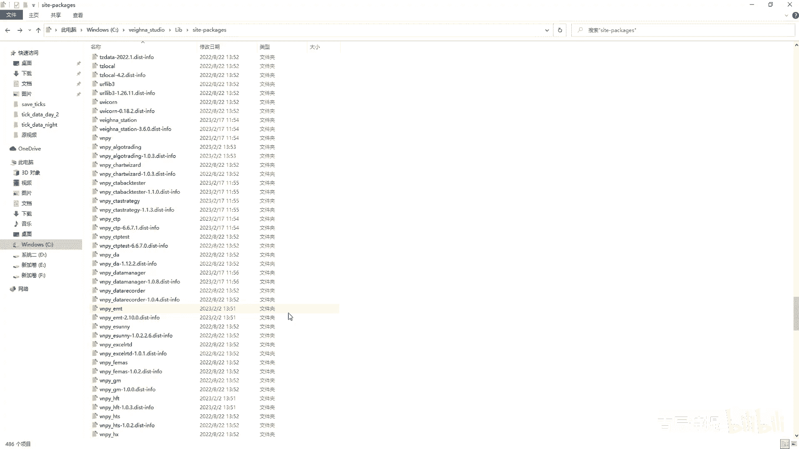

就是这个city topic city template，里面讲到了这个load bload bar，其实归根结底，他如果说去找不到这个三方数据服务的话，他会去找这个数据库。

咱们也就是大概的提了一下数据库，其实你没必要去仔细的去研究它，因为这个维纳这个平台，已经把数据库接口给咱们提供好了，当然就是我能想到的去拓展的方面，也就是它的这个多线程，多线程呢也给他也给大家做。

就是写了个案例嘛，大家可以回去试一试，其实很简单，就是怎么改，如果说你想往深里去研究的话，你就研究研究那个PEWEE以及那个playhouse，它的这个拓展，我觉得就够用了，然后关于数据库。

我建议不要用重型的或者比较复杂的数据库，咱们就用这个SQLITE，我觉得挺好，我之前也用过这个呃，POSTGRESQL那个我也试过，其实都差不多，因为咱们的数据量其实不算大。

如果说你要是用那样的数据库呃，来记录这个tick数据，一个这个tick数据数据量是挺大的，那就是你得保证网络的稳定，这个系统的稳定，你在windows上我觉得会有一些问题，包括咱们之前讲过。

你去写tick，你真的写完tick，你来核对数据的时候，你会发现里边或多或少会缺这么几笔即可，因为他在往里写的时候，一你毕竟越往后他读的数据量就大嘛，往里写的时候肯定会有问题，包括你这个windows。

比如说屏幕，它有时候自己会刷新一下，可能就会把你的线程中断掉，都有这个可能性，所以说需要这个呃你的就是操作系统更加稳定，比如像乌班图啊，或者说是一些其他的，就是说OS的一些就是操作系统嗯，你在那个上面。

可能就是你可以用这个别的数据库，但是咱们正常的只需要比如说你只需要去录，这么就是一两个品种的数据啊，或者说你只你连路都不需要，有这个三方数据服务的话，你直接用三方数据服务。

你根本就不需要去记录这些数据啊，嗯就是就是上一节课给大家演示的那个多线程，就是那个就是连接池，那个我也会把这个放到群里面，大家可以去仔细看一看，其实没有太多东西，只不过是创建了两个线程嘛。

然后一个存一个取它，它中间就是保证不打架就可以了，那咱们没有说到这个就是aq data，因为这个伟大应该是跟ARUDA，就是煤矿数据服务是合作关系啊，他这个iq data呢它的这个接口。

其实如果你开通了这个iq data，它会给你详细的有一个文档教你怎么去用啊。

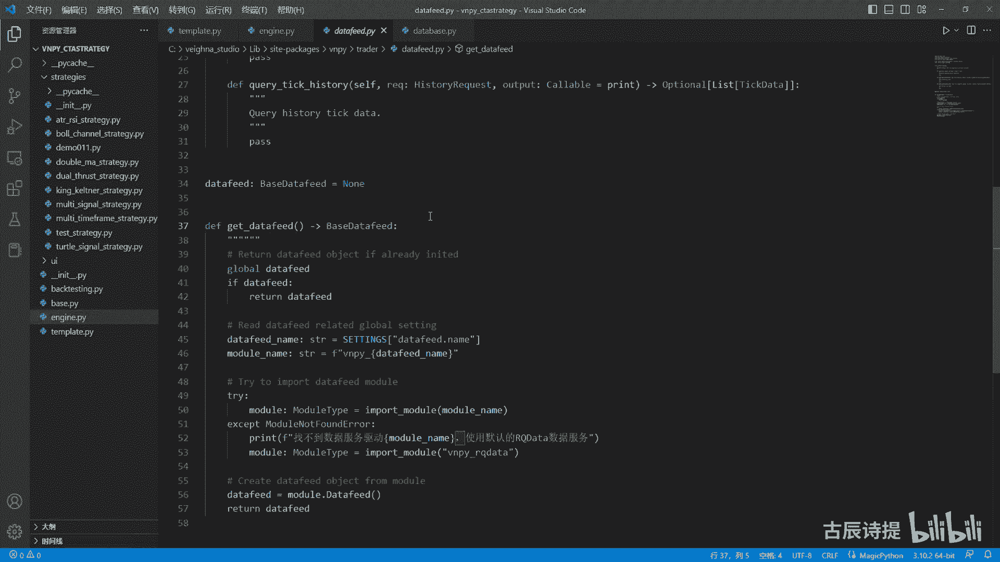

咱们也可以把这个echo data就是找到，看一下里面的代码啊，跟大家解释一下，就是在这个里边啊。

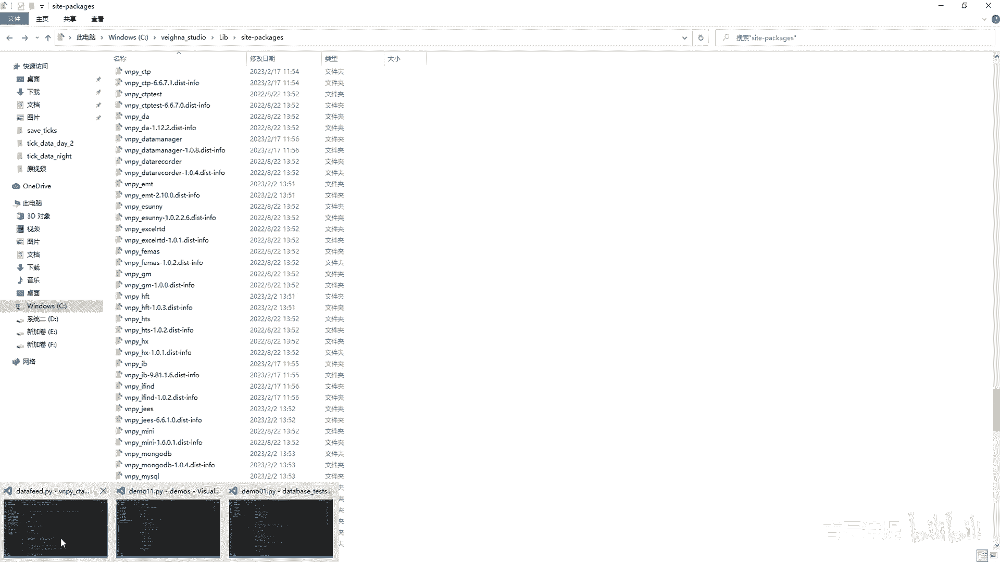

大家可能就是有些时候会看，就是说比如说这个就是它的这个INIT文件，就是VP c t s strange文件里边，他除了创建一个就是它的app这个类之外啊，他还有个这个try。

就是这个刚刚sion version其实就是版本的意思吗，啊版本的意思，版本这个version这个信息在哪。

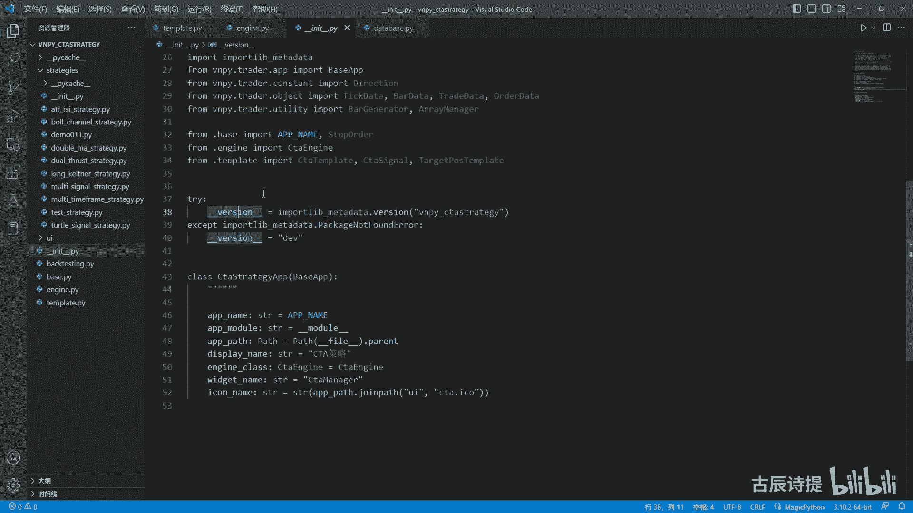

就一般是在这个就是他这个DISTINFO里面，比如说咱们找一个有版本号的啊，比如说你像这个它是有版本号的是吧。

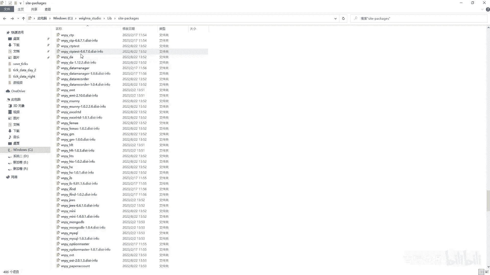

咱们可以打开在在这里边啊，看它是它是多少版本的，是有的啊。

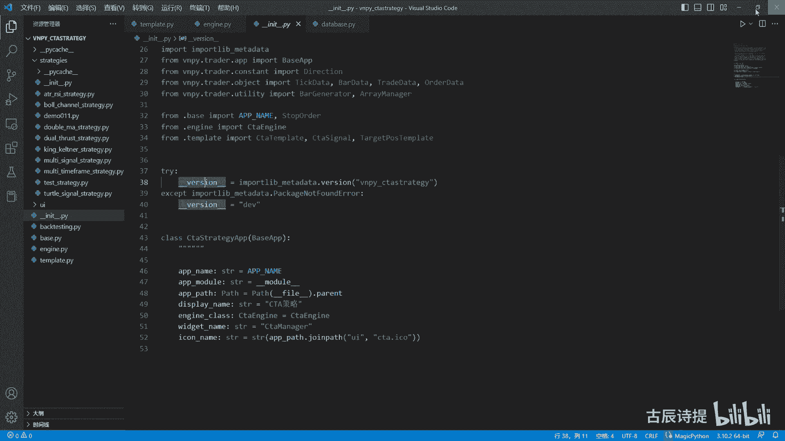

这个没什么好奇怪的啊，就是版本号是吧，他其实也是去读取一个东西，好VMPY咱们找到这个阿QOPQRST，在这就是这个arq darq data。

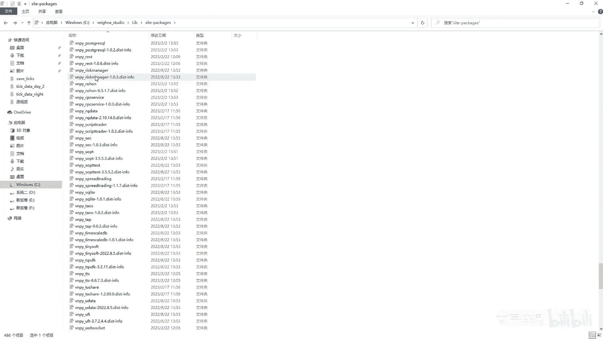

在这是吧里边给大家简单介绍一下，因为阿克贝塔其实它可以获取的，它不仅仅是这个呃，他这边有两个，一个是data feed，一个是gateway，这个是用于对接aq data实时行情的接口啊。

就是这个实时行情的，咱们先不看啊，先不看，咱们看先看到这个数额数据服务这一块，它首先它有个代码啊，就是to arq e simple，就是咱们正常的这个arq e simple。

就是啊咱们正常的这个合约啊，就是这个simple，比如说你像正常锁的是这样的是吧，3。5，像这个大上锁的呃，有这个一位的，就是2305，还有这个两位的，比如焦煤是吧，还是305，比如像这个上汽所的。

一般都是呃两位数，比如说S啊，S就是这个2305是吧，呃就是当然他后边带的这个这个exchange，就是交易所名称都是大写的嘛，你看这些其实都不太一样是吧，像这个正上锁的是大写的呃。

大上锁的是小写的四位数字，正常走的是三位，然后呢就是说这个呃大商所的呢，它有可能前面是一位字母，也有可能是两个字母，然后带四位数字，包括像中金所的，你像IF是这样写的，是不是。

但是呢在这个rq data里边，它给它全部变成了这样，比如说你像甲醇的话，它就是这样2305，比如说像这个螺纹的话，它是这样2V2305啊，所以说他首先得需要去把这个，你的这个合约进行一些转换啊。

进行了转换，当然这上面是股票啊，这这下面是涉及到这个期货和期权的期权啊，这个期货啊它你看它都是up，就是把它变成大写嘛是吧，看up会把它变成大写，所以说这个你首先你得知道，你要去获取数据的话。

你一定得符合这个iq data的它的这个数要求，不然会说会获取不到，你可以完全不用这些，就是说他给你提供了这个这个这个这个模块，然后你自己去接这个接口，其实就是eq DC啊，你可以去把它。

这个你像这个其实获取这个价格信息，就用get price获取这个合约信息，所有的合约信息就是all in呃，这个instruments啊都可以，你可以仔细的去看他这个文档的介绍，包括还可以获取流量。

他一天的流量好像是给一个G，如果说你是试用版的话，好像是只有几十兆吧，你都可以去把这些给获取到的，就是通过这个阿q DC好像获取流量是from rq DC点，应该是users user还是哎不对。

第二应该是啊看看啊，US不对，应该是s e r service点USER啊也不对，这个我就不去找了，你可以去看一下这个它的这个详细的文档介绍，只要是你开开通了肯定会有的啊，这是他的第一步啊。

他第二步做的是什么呢，就是初始化，然后读取你的这个用户名和这个password，它其实后边做的就是应该去做的，应该是初始化这个INIT，其实就是连接这个iq data数据服务嘛。

然后query back history也好，就是query tic history也好，当然嗯就是这个数据会比较贵，然后BUKSY好像是一年3000块钱吧，然后他会给你。

就是通过这个fears就是获取的数据信息，就open high low clothes volutoto over，他都会给你获取到，获取到之后呢，他这儿进行了一个转换，进行了一个转换。

就是把这些就是说额数据转换成了这个8data，然后他返回了一个这个data list，这个列表列表里面全是这个BS，就是这个bar d其实就是这么简单，它没有什么别的，但是这这里边有一个啊。

它是有一个adjustment，这个adjustment它是做什么的，你从这个arle data里面获取到的数据啊，是从比如说早盘是从09：01分开始的，但是咱们本地记录的这个伟大，自带的那个记录啊。

应该是从09：00分开始的，但是这个两个代表的意思其实是一样的，它是指代09：00分到09：01分是吧，就是包左不包右，包括09：00分的数据，但是不包括09：01分那个瞬间的数据。

它呃一般很多你像三方平台，它都是采用后计时是吧，但是维维纳咱们是采用的前计时，所以说最后一根K线，这个eq data是15。00分，然后你用这个维纳录出来的，应该是14：59分的，对不对啊。

所以说他得把这个时间调整成，就是说伟大平台一致的，所以说他捡了一个adjustment啊，这个adjustment呢它匹配的时候呢，它匹配了什么，如果说是minute的话，它是往前提了一分钟。

如果说是our的话，往前提了一个小时啊，但是这个daily他没有去啊，往里就是说去填啊，因为daily它是不需要去调整的，对不对啊，完全不需要调整啊，啊这个就是里边就是他的这个东西，没什么别的啊。

你如果想去自己试一试呢，可以完全按照他的给提供的那个接口的，就是解释，你可以用这个阿q DC自己来进行处理好吧，里边其实我觉得比较关键的，第一个是把它转换成这个to acle simple。

就是符合米框呢，它的这个嗯就是这个simple的一个要求，第二个呢就是呃你需要调整一下这个just time，就是把这个时间进行一下调整，和你和这个咱们维纳平台是一致的就可以了啊，是一致的就可以了。

这个就是它的这个aro da feeder啊。

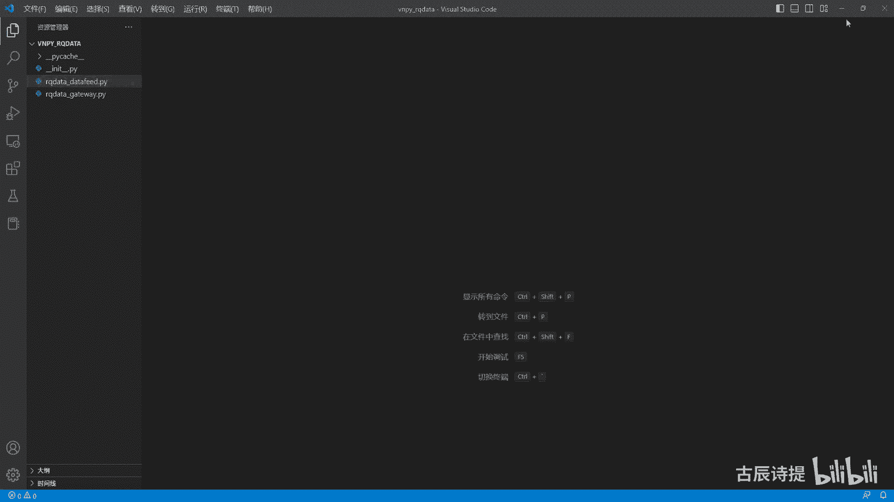

就是它的作用啊。

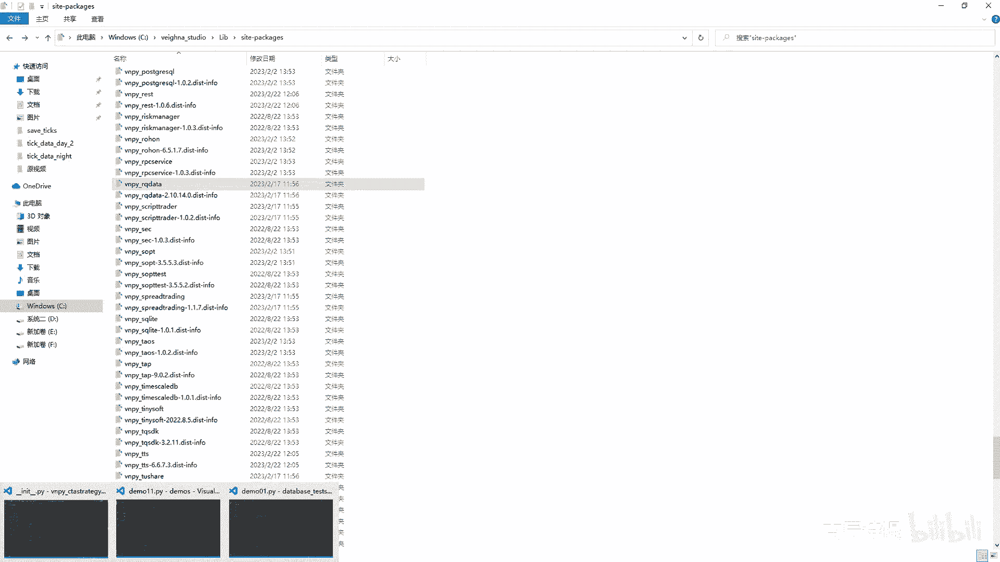

这个我就不给大家演示了，大家跟着接口肯定自己能做出来啊，肯定自己能做出来的，这个没有什么问题好，那template后面其实就没什么东西了，还有个put in event。

put event其实就是把这个放到你的这个CT引擎，其实CTA引擎它做的是什么，就是put the strange invent，就是把这个数据呢放到事件引擎里面去。

就是一放就放到那个invent engine里面去，那个invent engine会把这个事件啊，就是说传递给这个谁啊，传递给这个界面啊，界面会做一些就是说更改，比如说你已经初始化成功了。

他就把那个INIT那个标识改成true，如果说你已经这个准备好交易了，把training改成true，仓库有变化了，他把POS那个改成多少，你这个变啊，变量有变化了，他会把那个数就是数给变，就是给改掉。

就是换成最新的，其实更多的是通知这个界面啊，就是通知界面，然后还有一个呢就是他这里边有个保存，这个就是这个啊，就是这个保保存，它其实也是到这个CT引擎里面去嘛，保存它其实就是存储嘛。

就是save jackson是吧，那我可以再看一下，它其实就是save JSON，就是保存到对应的，就是说这个地方去，但是它保存之前会把it和training给删掉啊。

因为这个最主要是在界面上就是告知你的，然后做一个呃拦阻或者说做一个开关啊，然后它会把它给删掉啊，这个必须得删啊，你不删，你这个你到时候一加载的时候，你INIT等于true，TD等于true了。

你就不会去加载这个all in it了，是不是啊，这个其实就没什么了，就是template，这呢其实就讲完了，下面这个一个是c t single，一个是target post template。

其实这个呃就就不讲了，里边很简单，第一个是信号啊，第二个是这个目标仓位的，就是这个达成啊，这个自己看一看，我觉得没什么，而且咱们用咱们用的也不多是吧，在在CTA策略里面用的并不是很多，好这个讲完了。

其实里边还有两个不得不讲的东西，因为这个city template，你继承自这个template，你必然少不到用到什么呀，就是说这个bug or和array manager。

这两个是配合这个TTEMPAGE去使用的，因为你在实盘的时候，你必须得去合成K线，你不合成K线，你去比如说刚才咱们看到的这个arq data那个呃，就是实时行情的对接，那个他肯定是有一定的延迟啊对吧。

然后你肯定是得通过这个这个呃CDP，然后接到实时行情，然后再把数据，再把你需要做的操作返回到这个CDP里面去，所以说肯定是是需要实施，就是去合成K线的，这个合成K线你就必须得用到拔尖这事。

然后REMANAGE的作用是什么呢，就是把你的这个，比如说你用的是一分钟的数据呃，就是会把你的数据放到一个固定固定的地方，就是说比如说我是三十三十分钟的，就是30个一分钟的这个均线。

那你这个30个一分钟你肯定得存上，对不对，把它给一个存到这里边，然后计算出来这个30分钟均线，而且这个还不能丢，为什么呢，因为你八进六这合成了，就是说所需要的K线，比如一分钟的又过来了，你得给他做替换。

然后把最前面的替换成最新的，然后把把最后一个删掉，然后整体的往前挪一个位置对吧，就这两个是必须得配合这个city template呃，去进行操作的，不然的话，如果说你没有这两这两个。

这个其实就不是CTA策略了，CT策略它是趋势性的策略嘛是吧，你只用到tick的话，那是你属于是短是短线操作或者就是高频，是不是，所以这两个是就是避是避无可避，肯定你得去学。

而且这两个它固定的地方是在哪呢，首先你肯定得创建这两个，就是说在初在初始化的时候，最少每一个创就是创建一个就是实例化一个，如果说你是多周期的，比如说你是5分钟和一天的，或者说5分钟跟一个小时的。

你还得创建两个是吧，这个只是一分钟的，他一分钟合成了会掉OMB，如果说你要去去调用，就是说比如说5分钟合成完了之后，你再调用一个的话，你后边肯定还需要就是那个on windob。

你呃就是就是call back的那个哎，不不不是这个OV豆瓣啊，就这个呃还有call back，就是呃就是on window bar，你去调用哪个，就是合成了你需要的那个K线之后，你去调用哪一个呃。

就是你还得重新，就是在新建一个，就是由这个分钟合成X分钟，或者x hour或者XD的这样的一个八，就是8gator是吧，然后manager呃其实里边不复杂啊，就是我觉得在初学的时候，或者你刚接触的时候。

八减它的代码其实不复杂，但是你真正的想要把它给用好了不容易，因为896是它提供的，他这个位置放在这个U呃这个utility里边，这个utility呢它是在这个点啊。

这个VN china就是VNPY点出的那个文件里边，那个文件里边咱们之前说过，他放的都是一些公用的通用性的些组件，那这个东西它会通用，比如说你不管你是做外汇啊还是做股票啊，这个巴结人他都是通用的。

但是实际上每一个每一个品种，每一个合约，每个交易所它可能发出来的数据，大体上是一致的，但是肯定有区别，所以这个八结论是，他承担不了数据清洗的这个责任，数据清洗其实是咱们做量化的一个根基对吧。

你数据你做的不准确，那你就是说就是你的指标肯定就不正确，你的指标可能就是如果不正确的话，你的信号肯定就相对会有偏差，所以说数据其实很重要的，但是它这里边并没有承担数据清洗的任务，这也没有办法。

因为什么呢，你一个交易所和每个交易所的情况不一样，每个品种和每个品种的情况不一样，不可能说分门别类的都给你，把这个数据清洗的特别干净，这就造成了为什么很多人在比如三方平台回测，或者你用这个伟大进行回测。

应该是从哪个点位开仓，但是实际在跑实盘的时候，他并没有从哪个点位开仓，因为什么你数据有偏差，你合成的是有偏差的。

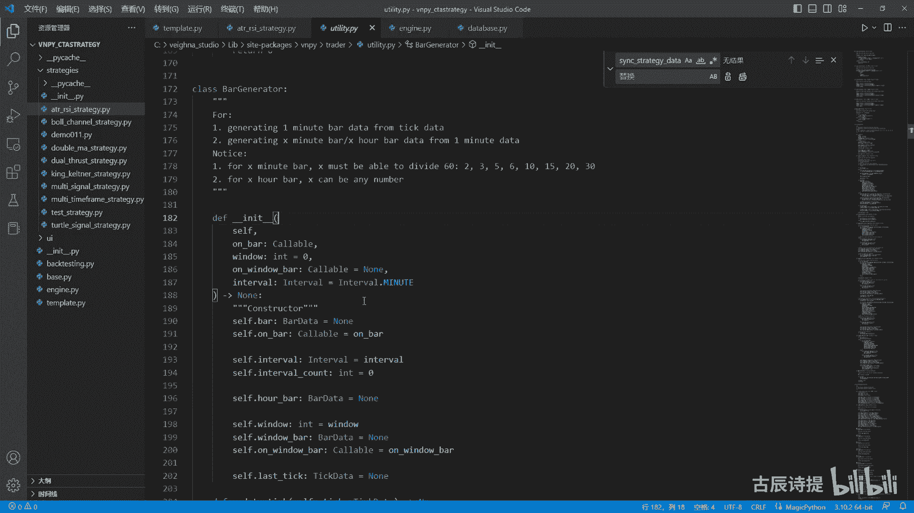

就比如说呃咱们可以给大家演示一下啊，我这儿呢在这个，Septics。

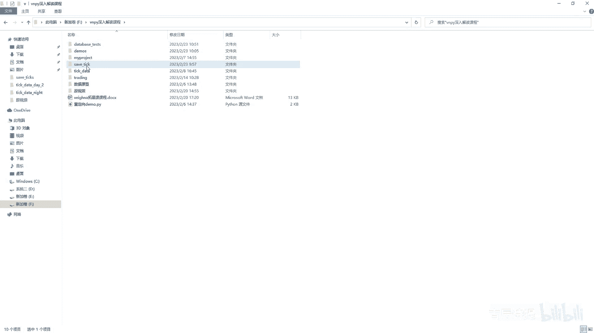

等我回头打开，我这儿呢写了一个这个，这是demo05这个tick的生产，我是怎么做的呢，我是在这个呃这个data呃，我是在这两个文件里面啊，有一个是白盘的这个数据。

这个数据我是放在了这个TXT文件里边了，然后还有夜盘的这个提个数据，我把这些T的数据都读取出来，然后呢生成了这个tick，就是生生成了这个tick类型啊，tick类型，当然这边是有一部分是需要改一下的。

生成这个类型，我把这个里边的这个TIKD，有很多东西给删掉了，我并没有学啊，这个里边没有删是吧啊，这里边没有删，咱们可以先生成一下看一下，然后生成完了之后呢，我这呢创建了这个BGDRH。

然后这个BGDOR呢，虽然不是从VNPY那导入过去的，但是啊跟他是一样的啊，跟他是一样的，只不过我这加了一个条件，Computer dt，我先把它给我先不删啊，我先不删。

我把这个改成从这个VNPY这个点，VPY点出点utility里面导入utility，就是用本身的这个维纳自带的这个BGLITTER，去合成啊，这个这个K线看看他情况是什么样的，情况是什么样的呢。

呃我需要加一个，这边是tick net2是吧，TIKNT2它的逻辑是什么呢，先从啊这个里边这个是start嘛，先从这个里边去读取数据，with open嘛，去读取出来，读取出来的数据呢。

然后是process，就是total order，就是整个的，因为它读取出来都是字符串类型的嘛，然后进行处理分割，然后分割完了之后呢，它就会产生这个TKSTR，这种也是STR的类型，然后再进行处理分割。

然后就生成了这个数据啊，这个tick data就给它封装成了这个tick data，然后到tik data之后呢，我把它合成，通过这个把进度条去合成这个一分钟的K线啊，合成完一分钟K线呢。

他会给放到这个欧霸这来，因为这个我传进去的是欧巴嘛，放到欧巴这儿来呢，我再把这个这个霸线能进行拆分，就是把它转成字典，把这个字典呢保存进我的，这个就是呃这个这个这个pd点。

这个data frame这个格式里边，让他去转成CSV文件的呃，转成CSV格式的文件，说白了，最后就是就是就生成了一个可以让excel去读取的，CSV文件呃，文件就是格式的文件，这样比较直观啊。

就比较直观，这个呢就是咱们可以先看一下，用这个自带的8GREA，它会生成哪些错误，这个我会这个代码会发群里边儿啊，没有什么太复杂的，我先呃生成这个RB2305，这里边是有它的这个数据的啊。

是有它的数据的，好运行一下，生成完了之后呢，这个2B2305点SHFE点CSV，它已经有了，它已经有了。

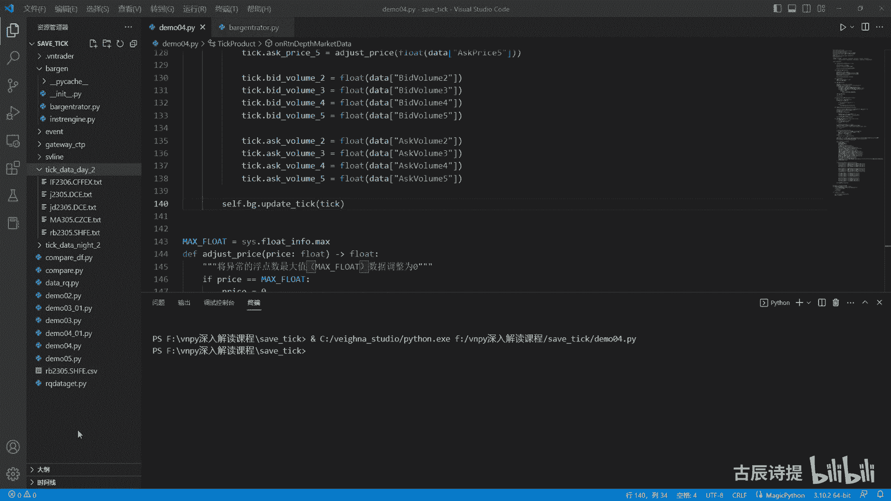

咱们可以看一下这个啊这个data诶，不是啊，在cb date里面2B2305点SHFE，咱们看一下它会出现的这个问题。

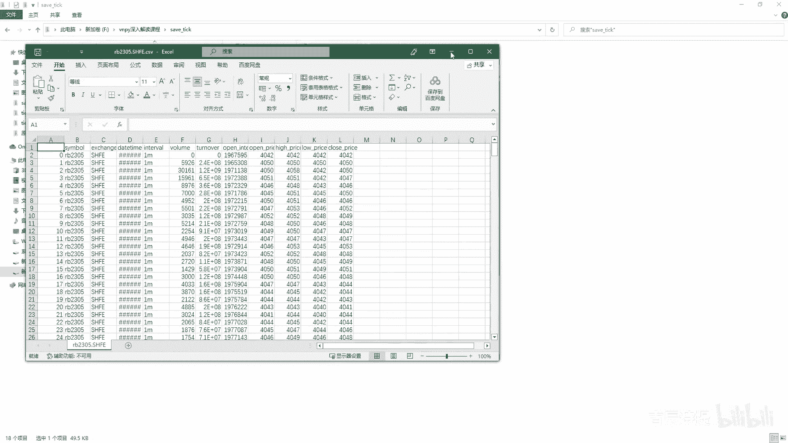

可能大家也会经常出现啊，你你会发现他会在就是18。36分，有一根K线，晚上的08：59分会有一根K线对吧，晚上08：59分会有个K线啊，然后呃晚上的11点它它也会有一根K线啊，然后白天的10：

15分他会有个K线，你会发现他有的这根K线啊，这个成交量很少，就说明在这一分钟，它只有这么一两笔即可过来了是吧，但是他也给合成了K线，按说你像这样的情况，不应该是有这个10。15分，你应该把它并到10：

14分这个里边来是吧，你你前面的10。11点了，你不应该把它放在11点，你应该把它放在22：59分是吧，包括最前面的这两根K线，这个你是不应该有的，肯定是无效的K线，因为它没有成交量嘛。

然后他的时间也不对，这根呢应该就是08：59分的，都是集合竞价的，它的这个这个tick过来，这个TK过来，你应该把它并到09：01分的这个里边，对不对，所以说这些呢。

而且每个交易所和每个交易所都不太一样，我在写这个的时候，我已经把它就是自己去合成了，就是说在这个啊，不是这，在这个就是刚才没有讲完的事啊，在这个start最后呢，我还让他去调了一下这个C点，BG点。

这个generator还去调了一下调，你如果不调的话，你去给它生成的话，它最后一根K线就是是很容易是丢失的，是没有的，比如说我换一个换一个ma305，甲醇ma305，然后CZCECZCE好。

我去让他去进行生成一下，好出来了是吧。

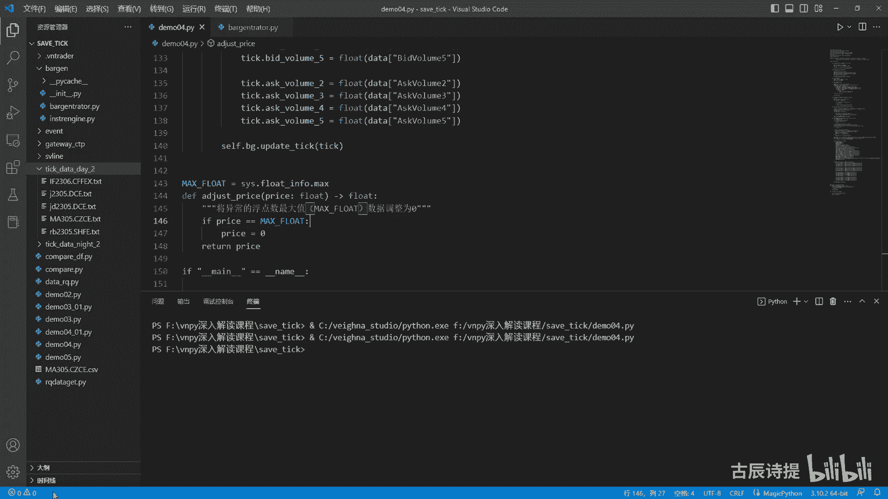

A305，这个是MA305，他这个错误就更多了，你看就是晚上开盘的时候，开盘前07：12分啊，就是8。55，8。56，57的这些数据都有，包括58分啊，也有59分的，也有，你再往下走呢，他倒是没有十啊。

这个应该是合成一天的数据，但是呢他到这只到了这个10。58分，这这个也是肯定是有是吧，他第二天白天的K线都没有去进行合成，而且他晚盘它这个夜盘的就是最后一根K线，应该是22：59分也没有。

所以这些都是问题都是问题啊，你说就是如何解决这些问题，这个就需要你深入的去了解他。

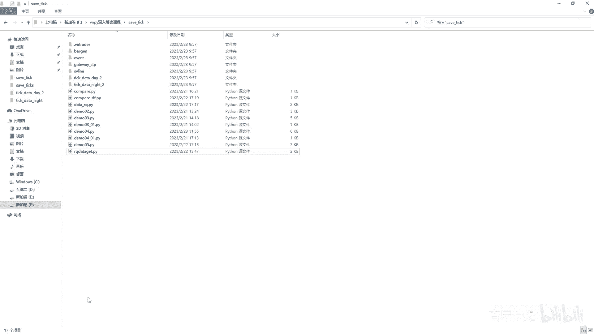

然后去研究它，然后去再去改变，而不是改变，就是对这个八级的事进行优化是吧，对巴杰伦是进行你自己的，根据这个逻辑来进行调整，为什么一开始给大家讲的这个demo里边，就又如何去把tick给就是保存下来啊。

就是为了让你看为什么会产生这种情况啊，为什么会产生这种情况，那首先这个呢咱们先讲一下这个八技能的时候，它就是本身自带的这个就是维纳这个平台，它自带的这个bug，它是一个啊什么结构好吧，讲一下。

就是我很快的讲一下，因为这个在之前别的课也讲过啊，这个里边的8-6这事呢其实就是分成了欧巴，欧巴的作用是什么呀，是在你合成完一分钟之后调用的回调的，这个就是这个方法对象，或者说这个函数是欧巴啊。

这是一分钟合成之后会给你去回调的，然后这个window是干什么的呢，就是你在比如我要合成X分钟或者X5，或者或者是x day，当然这个8G6特里边，它是就是它这个自带的，这个里边是不支持x day的啊。

是X分钟或者x hour，这个window你就需要填入相应的这个值，比如说10分钟15分钟，但是这个值啊，最好是被就是说这个60能够整除的，为什么咱们后面会说到on window吧。

就是在你比如说我X分钟或者x hour，这个合成合成完了之后，它调用的这个对象，他调用的对象，然后interval呢是告诉是合成分钟的，还是合成小时的这个自带的这个8G6车的，它并没有实现合成天的。

就是合成日线的这个啊代码，如果说你想我从这儿呢，我也不讲这个合成天呃，这个日线的代码，以及这个比如说你合成10分钟的K线，它会有一根K线是消失了的，呃或者说你合成20分钟的，也会有一根K线是消失了的。

呃就是这个都跟他的逻辑有关系啊，就是这个呢我也不详细讲，因为这个咱们在B站上，我那个最基本最就是最开始的那一套课，虽然那个时候的版本还是二点几的时候，那个版本讲过这个八几流车，而且讲的很详细。

里边都有什么案例什么的都有，你如果说对八几流车还不是很熟的话，你去那边去看一下啊，然后一般情况下，他首先要做的是UPDK，你在实盘里边肯定得在这个on tik里边写cf点，BG点update是吧。

这个ADDITIC里边其实做什么呢，做什么操作呢，第一个是过滤它，过滤什么呢，就是没有tick点last price，还有没有点这个呃，就就是这个tick当前的这个TIKTOB。

上一笔这个tik t time要小的话，它就给它略，就是判定为是无效的，即可，因为什么你时间顺向而流，你当前的这笔即可，肯定要比前面这个tick是往后的是吧，咱不谈说是比他大，你最起码时间是相等的。

对不对，所以比它小的它肯定是过滤掉，比如说我第一笔tick过来的时候啊，new minute是false，对不对，然后这边呢是这个肯定是有这个点last price的，不然是无效的，到这一步你看一下啊。

If the slastic，但是呢这一步是就是不会去执行的，因为他就是你第一笔TIK的过来的时候，他cf点LUTIC还是个浪值，所以说这一步他在第一笔的时候它并不执行，如果说你没有cf点八的话。

它就它也是个当值啊，cf点八当然这么写，其实他这么写是我觉得是有问题的啊，因为它初始给复制了N，你最起码这你给他去识别的时候，你这应该是个可以是浪值，对不对。

或者加上这个就是那个optional optional，我这个就是在类型提示，这我说一下，第一笔提了过来之后，他这个new minute就变成true了，对不对，就是啊if not self点八。

它肯定是满足这个条件的，所以说new mini就呃就变成true了，他这呢先不往这来执行呢，就是说这个elf这它是不会往这来执行的，然后呢if new minute就是如果说新的啊。

这个new minute它是一个true的话，因为前面已经变成true了嘛，它就会创建一个8data，然后这个里边呢是symbol是吧，等exchange，包括这个interval that time。

它都等于open high low clothes，Open interest，open interest是指的是持是持仓量嘛，啊持仓量它是个累计值，看都给赋了值，但是这里边你注意了啊。

他的volume和turn over是没有去进行赋值的，你发现了没有，是没有去进行赋值的吧，啊另外要说一下的就是这个8data里边啊，这个呃open interest呃。

Open price high price low，Price，close版，咱们都知道就是高开低收嘛，四个最最基础的要素，但是呢在tick data里边，你注意一下啊。

这个嗯这个这个open high low，它可不是这个tick的开盘最高价，最低价他的是指什么呢，是open是单个交易日的开盘价，hi是单个交易日的当前最高就是最高价，这个是当前单个交易日的最低价。

pro是前一日的收盘价，这个你一定要知道啊，因为后边会会用到第一笔tick来的时候，它并不会去执行到这个else，对不对，咱们就呃不看它，然后如果说if self点这个也执行不到。

然后它会复制self diastatic等于tic，就是你self dlatic就有了，对吧好，后边的tick再来的时候，他前面两关就是过去了，因为这边肯定是顺着往后走的，如果说不是顺着往后走的。

它就会会过会过滤掉，然后呢这边就有这个C点八了，所以说他会走这个C，这个AE是不是AE里面做了个什么呢，它是判断当前的这个minute，这个是呃，这个分钟数和这个之前的这个tick的啊。

分就是这个这个这个这个当前B的这个分钟数，和当前即可的分钟系数是不是一样，你捋一下这个逻辑啊，当前霸的这个这个这个这个这个分钟数，是不是跟上一笔tick，他的这个分钟数是一样的呀。

其实就是上一批体格的分钟数，是不是和当前体格的分钟数是不是一样，如果不一样的话，就说明他过了一分钟了，对不对，或者说是这个小时啊，说明他过了一分钟了，或者已经换了一个小时了，他这个时候呢。

就默认你这个B就自己去合成了啊，然后他就会调用这个欧巴欧巴，咱们说的是一分钟K线合成完之后，它调用的方法是吧，然后他又把这个new minute变成true了，然后你这笔提个过来还得接着往下走，对不对。

如果说他没有去，就是这个分钟数和小数数去切换的时候，它这一步是执行不了的对吧，然后这一步也执行不了，咱们先说他不满足这个条件的时候啊，他这一步是执行不了的。

下面的这个new minute也不会变成true，所以说它会执行这个else，对不对，这个else呢它有个动作是什么呀，就是说去把他的这个霸县的最高价和，坝县的最低价进行赋值。

这边有这么两行代码是呃需要跟大家讲的，如果说if tick high price大于cf点，Last tick high price，然后呢你需要点八点，high price等于max c点八点。

high price和tick点high price里面取一个交大纸，这是什么意思啊，这个就不得不说什么呀，就是说咱们的这个tick啊，就是tick过来。

咱们一般用的最多的是tick的last place，就是上一笔的成交价，这个上一笔的成交价并不是说上一笔tick的，它的这个成交价不是这么个意思，咱们一直在讲tick，它是一个500ms一阶盖。

或者一般中一般最多啊，一就是一秒钟给发两笔即可过来，是不是，当然很多交易所他不是他都不是这么去发的啊，就是它是一个揭盖的行为，就是把这个盖子揭开，可能在这个500ms之间会有很多笔交易，N多笔交易。

N多笔交易呢它揭盖的时候呢，会最后一笔的成交价为这个，他的这个就是plastic啊，就是这个tick点last stic这个对象，但是呢咱们在判定，就是在确定这个，就是这就这根K线的最高价的时候啊。

咱们都是用这个cf点八点high price和这个tick点烂，last price来做判定的，对不对，就是它的上一笔这个tick过来的，上一笔的这个成交价，但是其实可能是在这个500ms里边。

它会有很高的成交价，但是呢到了上一笔他又下来了，所以说这个很高的这个成交价，他就展现不出来对吧，他就展现不出来，这就是为什么很多时候，包括这个，我记得这个以前以前的版本，是没有这样的代码的。

它只是以这个用这个tag点last price来做这个对比的，就是包括还有一些三方的，咱们的看房软件都会有这样的，就是在分钟级别没出现这个价格，但是在日线级别上它出现那个价格了，这就是为什么。

因为分钟级别都是用tick点last price，就是上一笔的成交价来进行累计的，但是实际上它中间可能会出现一个，更高或者更低的价格，那出现这个更高和更低的这个价格啊，你不能无视他呀，对不对。

他可能会对你的就是这个指标产生影响啊，这呢这下面这个代码是告诉你什么呢，如果当前这笔T可啊，就是他的这个high price比这个上一笔这个tick，比如说这个是last surprise啊。

这个是当前的这个tick，当前这笔tick的最高价，比上一笔tick的最高价他要高，这个咱们刚才说了，这个最高价是指单个交易日的，到目前为止就是到这笔tick的时候的最高价，就说明啊在这个tick之间。

它出现了一个最高价对吧，在这个500ms之间出现了一个最高价，所以说他要把这个拔线，因为这个这个是含在这根霸线里面的，是不是，所以说他要把这个霸县的最高价，换成就是这个点high price。

能理解这个意思吧，就是防止中间出现了一个，就是说不能被提个点last price覆盖的这样的价格啊，最高价最低价啊容易出现这种情况，这个就是为什么会有这个代码啊，为什么会有这个代码捋一捋啊。

然后后边呢是把C点八点，close price等于七个点last price啊，这个就就是赋值嘛，open interest是持仓量，然后这个是daytime是吧，好然后这是就是说在这个K线中间是吧。

它执行的这个代码，然后到这它也会往下执行，如果说这因为之前LUTIC已经有有了嘛，然后现在就当前的，就说这个在K线中间的这个TIK会执行是吧。

它会volume change就是tick点volume减去C点，LUTIC点volume就是volume change就是变化量，然后C点八点VROOM会把这个变化量给累计上。

这个tick volume啊，和这个呃turn over，这个下面是turn over，turn over是成交额吗，咱们之前应该是说过成交额有什么用，成交额可以计算出来。

就是说在比如这个500ms里边成交了十笔，然后它的成交额比如说是啊1000块钱，然后然后这个比如说它的这个价格，波动是0。5，你就能基本上算出来在哪个价位啊，比如说在99。5这个价位有几首，在100。

0这个价位有几首，他能大概算出来在某个价位，在这个tick里边，它成交了多少首啊，成交多少手，能理解这个意思吧，这个turn over和WM这都计算的是一个累计量，你发现没有啊。

volume change in和turn over chin啊，不是它在tick里边它是累计量，然后这边计算的呢是它的一个差值，然后进行这个累加是吧，就是霸线把每一个tick的这个差值，计算出来之后。

他从这儿进行了一个累加吧，这就有个问题了，比如说我第一笔即可来的时候，假设说我这个第一笔即可啊，第一笔即可，他是在早上09：00：00的时候，他这里边是有成交量的呀，是有volume的。

比如说volume是100，也是有turn over的呀，是不是，那这个第一笔的这个量它是计算不进去的吧，你仔细想想，因为它始终是计算这两个的差值，他当没有self dialtic的时候。

第一笔tick过过来的时候，他是累积不进去的，这不就产生误差了吗，对不对啊，这就是就是你中间tick过来的时候好，咱们再看，如果说有，就是说分钟和这个小时切换的tick过来的时候，他会怎么走。

同样的是走到这来是吧，这没问题，然后就是不会走这吧，因为他肯定是有LASTIC的是吧，他会到这儿进行一个判定啊，在这判定的时候呢，他会把这个就是replace一下啊，当然这个呃就是replace一下。

就是把这个八点daytime，它的signal和这个就是秒数和毫秒都变成零，因为你的这个描述和好，就是它的这个秒数和毫秒啊，是在这不断进行更新的，你最后一笔TK就是这根八线，最后一笔TK肯定是。

比如说09：00：59多少毫秒，是不是它所以从这需要把它给变成零啊，变成零，然后在cf点on bar是吧，这边是把cf点八放进去，他就是做了这么一个动作吧，然后呢new minute变成true了。

是不是你变换之后的这笔tick，就是比如说我09：01分的tick，他并没有进行实际操作的，是不是他只不过把之前的这个tick合成了之后，去掉了这个一分钟的这个可回调的，这个方法是吧。

然后呢你这个new minute变成true了之后，它会生成一个新的这个八线，是不是生成新的8000之后呢，就是说当然这ELS他先不会去执行，生成新的8000之后呢，他还会去去去去把这个什么。

就是到这个if self点last，这来是不是因为你生成新的拔线之后，这个else是不会去执行的话，它还会到这个cf点拉tic这来，然后4。8点volume，这个时候啊它是在新的这个8data里面。

新的BD里面它并没有给VU赋值volume，它默认是等于零的，对不对，所以说它是从零开始加的，所以说啊这个volume中间它它不会出问题，因为它都是就是用volume chi去加嘛。

只有在第一笔TIK的时候，它会出现这个问题，就是第一笔即可的，它的成交量和成交额它不会被累计进去对吧，另外一个啊这个逻辑它是建立在什么呀，就是有心tick过来的情况下，咱们刚才给大家演示了一下。

取生成的这个呃那个甲醇那个他没有，就是说22：59分的那根K线是，为什么呀，因为22。59分，他就到22。59分，这59秒这结束了，就这个就是他最后一根K线，但是呢其实你这个cf点八这呢记了。

就是从22：59：00，到22：59：59的这根K线，已经是在累积着了，但是呢并没有条件去触发这一块的代码，因为你没有23：00分的tick过来，这就是就是说这个时刻的tick。

我指的是就是夜盘的结束时间是11点的啊，这个品种和合约啊，他没有这笔T可没有这笔提，可他就触发不了这个代码，他就无法去合成这个一分钟的K线，所以就造成了最后一根K线的缺失，为什么我在之前就说这个啊。

demo04里边会在这他执行完了之后啊，在这会手动的去合成一下，就是这个原因，另外呢它把简中列车里边它自带的这个建筑，这事就是手动去合成吗，它的作用也是在这啊，作用也是在这呢啊这个也会是吧。

就是产生这个问题，为什么会产生那样的原因啊。

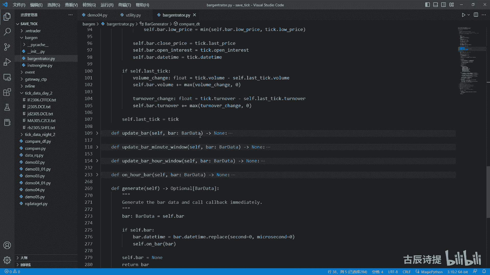