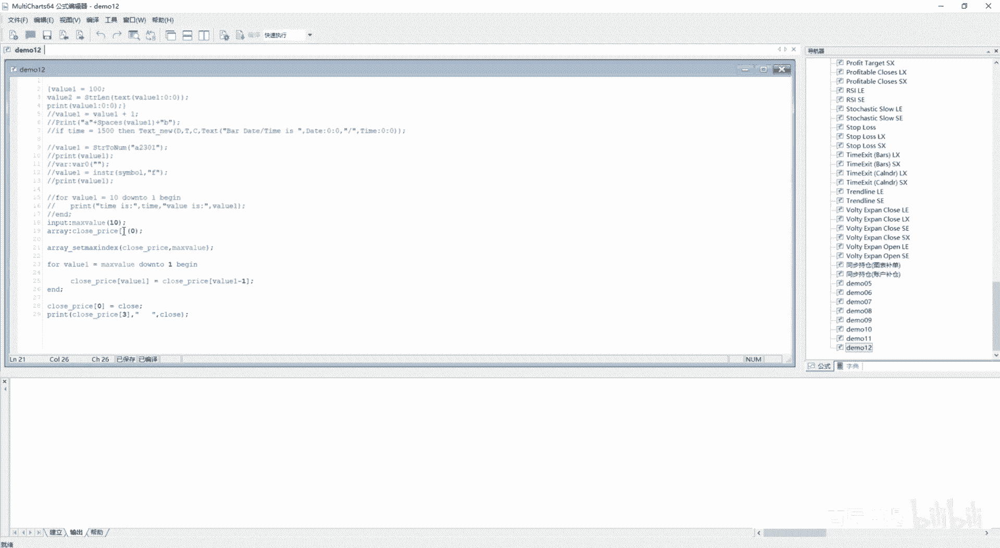

# 第12节课 字符串处理、数组介绍 - P1 - 古辰诗提 - BV1Q7421Z7Vy

欢迎大家来到从零开始量化系列课程，MC课程的第12节课，这节课咱们讲字符串处理，可能很多老板会认为，字符串处理在这个量化里边没啥用，其实是很有作用的，就比如说你如果说用它用这个图表来做量化。

你想从这儿空白地方显示出你关键的几个指标，他的这个数值，或者说你止盈的数值，止损的数值，或者你持仓的这个仓位呃，或者说你距离开仓还差多少个点位，其实是完全可以实现的啊，这个就涉及到了这个字符串的操作。

在这呢给大家介绍一下，经常会使用的字符串处理的一些函数和方法，好吧，第一个呢就是这个text text呢，就是将指定参数转换为字符串型返回，这是什么意思呢，如果说你有一些编程基础的话，你知你会知道啊。

就是说字符串类型，比如说这个一和你数值类型，这个一它其实是两回事儿，就是呃咱们计算机的底层在存储的时候，就是你数值可以进行直接存储，对不对，但是你字符串你怎么进行存储啊，它其实是在底层设置了一个编码表。

就是咱们通常所说的这个阿斯克码啊，就是阿斯克码，就是这个编码表其实就是相当于一本翻译机器，如果说我标注它这个类型是字符串类型的，比如说它是一个SSTR类型的，比如这是个一在底层的存储，它是不一样的。

它会有个标识，它是字符串类型，然后存储的这个一呢对照阿斯克码表，他应该是是多少啊，我给忘了，小A我记得是96吧，在就是计算机底层，它是这样给存储的，如果说你取出来这个这个96，当然是二进制表示的啊。

他是数值类型的，它取出来是96，如果它是字符串类型的，它可能取出来是小A哦，我忘了具体数了，你可以去翻看一下那个阿斯科码啊，阿斯科码表，但是啊在MC上它其实不是那么特别的明显。

因为你输出的时候既可以输出字符串，也可以输出数值型，因为咱们用的最多的就是数值型对吧，就是你可能对他会有一些就是说不太理解，我给你举个例子，你应该就能理解他啊，就是呆蒙12。

咱们看这个里边它下面会有什么呀，就是说这个找这个指定字符串的，这个字符长度对吧，如果说你不是字符串的话，你是就是操作不起来的，比如说我value1啊，我等于100，我我给它赋个值，然后STRLN啊。

S t r line，我把value1给放进去，我进行一下编译，你会发现它是有问题的，它是编译不过去的，但是我给他转换一下哎，然后value1我给他进行一下转换啊，你会发现它就编译过去了。

然后我再进行一下输出，然后从这插入信号啊，然后12close，然后从这啊，我没有啊，我没有print啊，我再给它进行一个，我给它复制成一个，Y62吧，Y62，因为它返回值它也是个数值型的嘛。

print一个value2啊，然后我进行一下编译输出就是七啊，输出就是七，Text value1，它为什么会是七呢，它为啥会是七啊，咱们把他这个text value1呃，我给它给输出出来看一下啊。

Text value1，我直接输出一个t e x t value1，是100。00啊，他就是七位数，如果说你想让他就是说呃，不是这个就是这个就是这个七位的话，你应该是什么呀。

就应该那个你这个value应该是比上零比上零是吧，然后这个时候咱们可以进行一下编译，然后输入出来啊，就是当然这个print你也得注意一下，但是我如果说因为这个print，它是得保留两位数值的是吧啊。

保留两位数值的，然后如果说我print这个value2，清除全部啊，三了吧，它就不会变成三了吧啊是这个意思啊，因为print你得单独设置，你如果想想输出value1，然后要让他输出100。

不加点零零的话，你就比上零比上零，第一个比零是表示它最少输出零个字符，第二个比零是表示它的小数是零位啊，嗯是吧，好，从这个例子上你应该就能知道数值型，我转换成字符串类型的。

他就可以用字符串使用的这个函数了，它在底层的存储也是不一样的，这个就是test可能比较抽象一些，但是你要去理解它，就想一个问题，我这个数值在底层可以存储啊，一到1万1到100万都可以用0101来表示。

但是我字符串怎么来表示呢，所以说在底层存储的时候，比如说我一块内存空间是吧，我给分配出来放这个变量啊，这个变量叫NA那这个变量放在这个里边，他肯定在里边，有有一块地方是标注它的这个数据类型的。

就是tap它的type类型啊，如果说里边存，因为底层存储肯定是数值嘛，比如我存储的是100，如果说我取出来他的这个tab类型是数值型的啊，就是说它取出来就是100，如果说是字符串类型的。

它会取出来对应着这个100对应的这个字符串，就是那个阿斯克码表里边的对应值，好吧，这个你一定要理解啊，species就是在字符串中插入指定数量的空格啊，他这有一个演示对吧啊。

咱们可以给他用大括号给括上啊，好这个演示可能大家会感到奇怪，我直接加空格，就是我经常使用的那个就是这一个空格哎，这样加是在这使用场景是一样的对吧，但是如果说我在这个咱们刚才说的，在这个图表上输出。

你输出我想让他表现的好看一点，就是这个空格的数量可能会有变化的啊，可能会有变化的，就比如说我定义一个value value啊，value1等于value，11就是然后这个后边加上这个value1。

我可以让它进行变化，对不对，然后这个时候我进行编译输出，你会发现这有一个这个啊，这个是吧，你会发现这个B是吧，就是这样的，是成这样的一个情况，就是空格会越来越多啊，空格会越来越多，这个就是space啊。

意思它的这个用法啊，可能后边会跟着一个变量，就比如说我在，写了一个代码，就是我刚才说的，就是可以显示你的这个合约名称是吧，然后把字写大一点，然后距离还有多少点位，那我让它都是先都是。

就是在这一块空间显示长度是一样的，那你就得让他这个就是species，就是他的这个value进行变化是吧，如果说我输出的内容多，我就让它空格少一点，如果说我输出内容少，就让它空格多一点啊。

这个是space他的用的这个场景啊，这个双双引号咱们就不说了啊，就是这个就是显示双引号就行啊，这个string l这个前面你像他的这个演示啊，text这个演示可以给大家演示一下。

就是在这个图表上显示这个text new，就是在图表在图表上把这个呃字符给显示出来，这个时候咱们可以看一下，你看这显示的都是字符啊，如果说你觉得它显示的太密密麻麻了啊，if time一个等号啊。

1500Z啊，就是我让他在下午三点的那根K线，我再显示是吧，这样就可以了啊，是可以显示的，后边儿咱们会讲这个嗯，string len就是指定字符串的这个长度，这个没什么好说的。

upstream就是就是把它变成大写，Lower string，就是把它变成小写，String to number number two strong，这个咱们需要讲一下的啊，咱们需要讲一下的。

就比如说我这个合约我是什么合约，这个是23012301，咱们之前学过叫symbol或者symbol name，或者get symbol name是吧，都可以获取这个呃SHFE点RB空格，2301啊。

如果说我想把它2301给取出来，或者说我直接用它来number two strain啊，number two strain呃，不是strain to number，String to number。

然后这个里边放STRIN，我就放这个symbol啊，然后我给它赋值给一个value y61，然后我print这个Y61它会等于多少呢啊，它会等于多少呢，它要么是显示000是吧，就是都就是都是零。

要么是把前面的这个字符给抹掉，然后把那个数字给显示出来啊，就是它会显示000啊，这个要注意了，如果说你这后边只是一个2301啊，它会显示2301是吧，点零零，如果说你加上了一个A，它就会显示成000。

这一点你需要注意，如果说你想把这个symbol，我取出他的这个合约，就是说这个2301你应该怎么取啊，你就得用到后边，就是去取字符，就是呃left strin，还有这个right strin。

就是从我左边取，然后右边取，还有个middle strin，就是中间取啊，然后把它给取出来啊，就是这个做一下演示啊，同样的咱们就是这个symbol来取啊，就是说这个这个left strain。

然后left the strin呃，后边的参数第一个就是你从哪儿取，我从这个symbol里边取，然后size比如我取出四个啊，然后我VA2，我定义一个变量吧，Va20，然后后边是一个字符串类型的是吧。

我用这个VA20等于它，然后我print一个VA20，好啊，等下编译，他是SHFE是吧，如果说我取六位数呢，六个呢它会SHF1。2点也是一个，就是包含就是这个点的啊，这点也是表也是表示移位的好吧。

就是left stram，rice stram是一样的，然后还有个middle string，mile string呢，就是你得告诉他我取的这个位置，比如说我从第三个开始取取到第七个啊。

然后咱们进行一下编译SH，然后第三个是F是吧，然后呃取二是呃取34567啊，34567啊，三取到七，34345671234567，取七个字符啊，中间是取七个字符，它并不是倒第七个啊，他是取七个字符。

咱们可以看一下这个MD，就是这个取出字符的长度啊，这个要注意一下好吧，好咱们再下看一个，还有一个就是in rain，就是判断他就是说有没有符合的字符，然后如果有的话，就返回它的这个位置啊。

如果说里边有多个字符的话，它返回第一个的位置，搜索是区分大小写的啊，搜索是区分大小写的，就比如说我还是在这个symbol啊，我用value1，等于这个in s str。

然后这个stream就是simple，就是我要找的这个字符串里边我取什么呢，取这个比如说F啊，把这个F给取出来，就是他取的不是F啊，他取的是这个F所在的这个位置，Y61咱们进行一下编译输出啊。

他是第三个SHF嘛啊它的索引值是三啊，就是输入三，如果说里边有重复的，他会按照第一个输出啊，如果说没有的话，他就是零，如果说我取个W是吧，W变一它就是零，如果说我取小写的F啊，这个我写我取小写的F。

变一下它也是零啊，它是区分大小写的好，这个字符串就是这么多，字符串就是这么多，咱们后边讲这个数组运算，数组运算肯定一节课讲不完啊，咱们这节课剩下的时间，咱们先讲一下数组运算的基础，先不看。

就是说里边这个数组运算呢，咱们讲数组运算的基础啊，先说一下数组中包含很多元素，咱们之前讲过处理数组运算，最常用的方式就是循环，你也可以把它叫FLOOP啊，Floop，但是频繁使用呢会比较繁琐啊。

而且会降低代码的可读性，它提供了一些内置的处理这个数组的，就是这个函数或者关键字，一般这里边都加了这个arrive，或者加前面或者加后边好吧，但是咱们先不讲它，咱们在讲数字之前呢。

咱们先讲一个就是下面的基本流程控制，里边有一个for循环，因为数组跟for循环它是分不开的，for循环的使用很简单，就是for变量等于起始值to或者down to，结束值begin啊。

End begin end，它就代码就是代表着一个代码块啊，这个咱们后边也会讲的，然后你就知道他这个使用方法就行了，比如说我做一下演示好吧，就是for这个value1变量等于1to10啊。

然后begin后边写代码，我写代码这块我就不写了，我就print一个value1啊，我就直接给他输入输出来，然后end end，然后呢我输出value1的时候，我把这个the time啊。

就是这个date啊，这个time吧给它输入出来啊，time然后前面加一个这个time is冒号，好这样啊，time然后这儿再加一个value is冒号逗号啊，这个看的会比较清楚一些啊。

就是我进行一下编译，你你会发现它会输出time is在这根K线里边，它会把这个数值啊，你看14：50分这根K线里边，他会把这个数值从1~10都输出一遍，其实他的意思就是什么，这是个for循环啊。

就是value1从1~10，然后把这个进行下面的这个操作，其实就是这个变量从1~10，然后执行下面这个代码块啊，一般都会用到这个变量啊，一般都会用到这个变量啊。

然后还有个down to down to呢，就是说从10~1是吧，你这么写会有问题的对吧，它十到不了一，你只有写成done to，哎这样写，它就是从大到小，是吧，从十987654321。

这个就是for循环，好吧，很简单吗，这个就是for循环，for循环，你用数组的话跟for循环肯定是分不开的，因为你涉及到往数组里，数组里边去赋值，首先咱们讲一下数组的定义，咱们之前说过arrive。

然后定义一个数组，比如说我open，就是我这个里边就存放着开盘的价格的啊，就是open price，或者说我放这个close price，Close price，然后你这个后边是一个中括号。

如果说你是多维数组的话啊，咱们先不讲多维数组啊，先讲一维数组，如果说你是一维数组的话，这个里边比如说我里边放十啊，这个代表着它的长度，它的长度索引最大是十，而并不是长度是十啊，它是从零开始的啊。

0~10其实它是有11个数，然后它的括号初始值是零，就是里边赋值全部都是初始值，你赋值可以直接close price，比如说他的这个这个一啊，我等于什么，比如等于100啊。

然后我close price这个二，然后我等于1000啊，你给它赋值进去，这个时候呢你可以print一下这个close呃，price他的这个一啊，然后把这个值给取出来啊，这个没有问题对吧。

我进行一下编译，它肯定都是100，但是你不可能这么就这样的去赋值的对吧，你应该怎么去赋值啊，就是肯定是要for循环来复制的，for循环来复制怎么个赋值法。

就是当我有我的目的是想把我的这个close收盘价，十个11个收盘价或者是十个收盘价吧，都就是都行啊，就是把它存放到我这个数组里边去存储起来，然后我进行使用，那我怎么来，就是来给他存放呢。

首先你close price，它其实就是内存底下的一个，就是一个连续的一块内存给你了，然后他可能有11个格子是吧，11个格子啊，我就不具体说了啊，11个格子，11个格子呢，你需要往里存放数据。

比如说我从左往右来存，就是这么存，我第一个数据来的时候，我给他存放到这，哎这有个close了，我第二个数据来的时候，因为咱们这个是一根一根K线的，往后走是吧，你第二个数据来的时候，比如这个是C1啊。

我C2来了之后，我是不是应该把它放到这，然后我把C1放到这，然后把C2放到这，给他挪个位置是吧，我C3来的时候，我再给他挪个位置，把C1放到这儿，然后C2放到这，C3放到这，一直等到它就是最后一个。

这都满了，他是不是整个就满了，然后你再迭代的时候，你也要根据这样的方式给它迭代，不然的话你计算是不是不准确，当比如说这里边都填满了时候，比如说都填满了，当你有个C100来的时候。

这是存放的是C99吧是吧，我是不是应该让它往后挪，然后这往后挪，然后这往后挪，然后最后一个给他给抛掉，然后倒数第二个挪到这儿来，这样你的取值才算是正确的吗，哪个方向从从左往右还是从右往左，其实都无所谓。

其实就是从零往这个第11个啊，第十个这放还是从第十个往第零个这挪，其实都可以，对不对，就干就看你怎么去存了，所以你存储的方式应该是这样的啊，应该是这样的，就for value1，我直接用这个变量啊。

for value1等于什么呀，10down to，down to几呢一，Begin，做什么，这个是很关键的一步啊，C l o close price，这个里边value，一等于close price。

value 1-1，and这是什么意思，From 10down to1 begin，这个这句话是很关键的，以后会经常用到，你跟鼠族打交道，它其实就是什么，当我value1等于十的时候。

就是这是他的第十个索引吗，取第十个索引，它的这个D方等于它第九个索引的内容，其实就是还是咱们刚才那个这是第十个，这是第九个，就是第十个里边的这个值，啊啊这是十啊，第十个里边这个值等于第九个。

不就是把第九个值往十这挪吗，然后你九是吧，等于九的时候，Y61等于九的时候，就是第八个数往第九个数这挪，能理解这个意思吗，啊能理解吧，这个等号是赋值，就是把如果是十的话，就是把第十个位置。

然后里边附上第九个位置的值，然后一直到它等于一一，就是这是第一个嘛，这个是第零个嘛，就是一的值等于零的值，他给我给挪过来了吧，你挪完之后，我是不是就可以在close price这个零。

然后去等于这个close了，是不是就是我每来一根K线，我把close它放到这个零里边啊，当然他们先得给腾出，把零的位置给腾出来，也就是把零的位那个值放到第一个，把第一个值放到第二个，把最后一个值给扔掉。

把倒数第二个值放到倒数第一个那个位置，这样是不是就实现了整体的迁移，然后加入了一个新的成员是吧，这个时候我print一下啊，就是他应该是我print一个close price，它第几个呀。

比如说第三个啊，第三个它的这个值好，然后我进行一下编译输出就有了吧，你print一下第三个值，如果说我后边我加上一个这个，然后把他的这个clothes给输出出来，嗯你会发现他的这个3695其实是在这呢。

是吧，等于它吧，3702是等于它前面一个吧，啊这个就是这个数组的存储，其实讲到这，你应该联想到咱们之前讲过那个叫arrive intro，intro8t r intro8persist啊。

是不是应该讲过这个是吧，我给他，啊intro8TR就是哎呀，我这怎么了是吧，啊这空格啊，可以了，咱们定义的时候是intro8persist，就是这样来定义的，就是这个可以根据tick来更新。

你这个如果说把它定义成，可以根据tick来更新的话，那这个数组里边是不是就可以存放十到呃，就是11个，最多可以存放11个tick的数据了，就是你每1tick的这个就是这个close过来。

它就会存放进去了，对不对啊，这个你要能联想到这个啊，intro bar呃，Persist，好吧好，说到这呢，其实这个就是数组主要是如何去存放数据的，这么一个方式，之前讲到过是一维数组。

其实是可以作为可变数组，如果说从这我再加个十，它就是二维数组啊，二维数组咱们先不说，咱们先说一维数组，一维数组其实你可以在里边不填，你如果不填的话，你不填的话呢，你编译也能编译过去。

但是啊听见这个声儿了吗，是在我这个笔记本，它原本的这个显示屏上会有一个错误，是指他的错误是指标呃，这个这个数组溢出啊，数组溢出他会有问题的，所以说如果说你像咱们这设置信号，这它就自己就关了。

我没有主动关，那它就自己就关了啊，如果说你想自己来定义他这个可变数组的，这个长度的话，嗯你可以这么来做啊，比如说我input一个这个max value，然后这里边我赋一个初始值是十啊，这是一个参数。

咱们之前说过啊，也可以作为一个叫常量来对待它是吧，然后我从这儿呢我需要定义一个什么呢，就是arrive，一般涉及到这个数组的，一般都有RY啊，Set max index，然后后边可以给他放一个。

比如说max value，我给他放进去，就是从这我设置一下它的最大索引，你一定如果说他是一个可变异维数组的话，你一定要给他设置最大索引，这一步是必须有的，不然的话你没法往下去进行操作，肯定会有错误。

虽然编译能编译过去，但是你一旦往数组里边去取值，它就会出错的好吧，这个你一定要注意了，你设置它的最大的这个索引是十，然后你下面你来就是进行便利的时候，你就可以这个max value什么。

你这样来进行操作，其实是一样的啊，哎有错误，这arrise it哦，这个少了一个参数啊，我是来设置谁是吧，应该是close c r o s e close price，就是你把他这个名字放进去就可以了。

名字放进去，然后后边放它的最大索引值啊，然后嗯这个没有输出，因为被关闭掉了啊，我状态打开一下，然后从这就有了啊，这个一般是尝试这么来操作的，不是说一开始就给他定好了的。

就是一般我会设置一个变量，因为从这儿的话，我可以调整它的参数设置信号，然后从这把这个参数可以，比如说我改成八啊。

这样也是可以的，就是从这儿来调整它的参数，它也会就是重新来运行好吧，这个是数组的最基础的使用。

