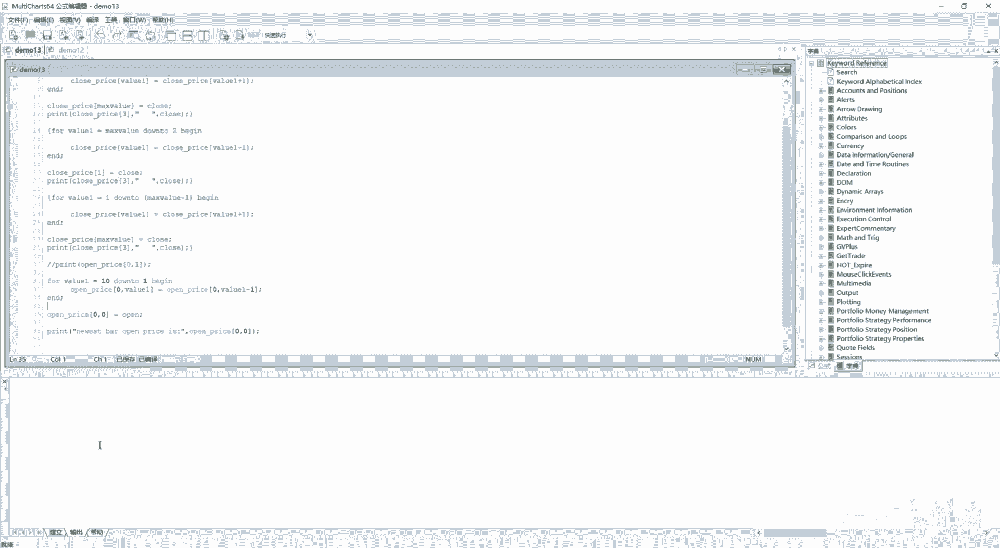
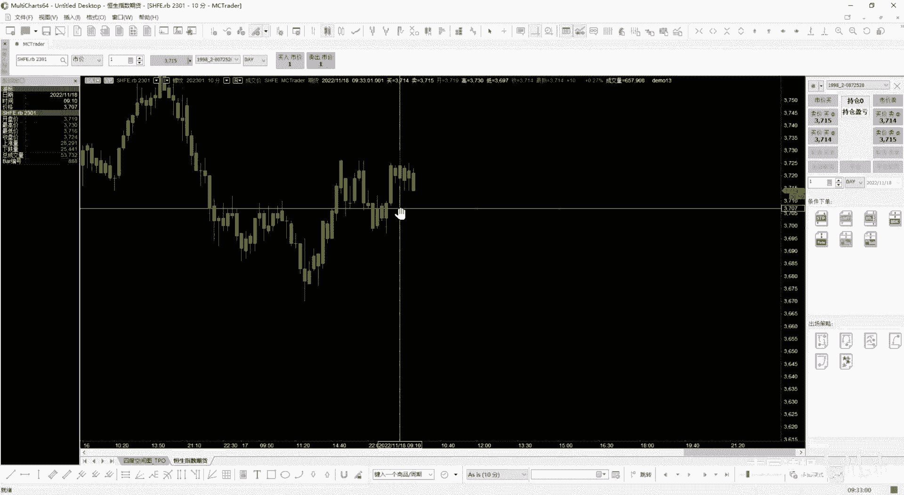
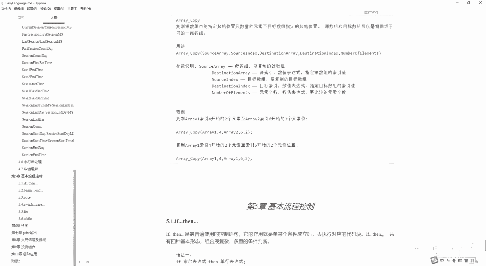

# 第13节课 数组运算及相关关键字 - P1 - 古辰诗提 - BV13b421i7zy

欢迎大家来到从零开始量化系列课程，MC课程的第13节课，上一节课咱们说到了数组数组，如果说你能把这行代码给弄明白了，基本上数组你就算入门了，很重要啊很重要，那这节课呢咱们再接着这个数组往下讲。

先新建一个信号，设成联盟13，我把之前写的这个代码粘过来啊，然后进行一下编译，好编译没有问题，那这个时候如果说我给他改一下，就是我从一，To，Max value，那这么个写法对不对，光从编译看的话。

他是没有问题的，这个时候咱们要捋一下这个逻辑啊，咱们之前写的是从这个从大到小，然后去呃给他把位置进行变换，那如果说从小到大这么写，对不对，咱们捋一下，同样的，这是一块内存空间对吧。

我value它第一个值是等于一，对不对，第一个值等于一，一等于这个零了吧，1-1不就等于零了吗，零的索引是能取到的啊，而且基本上都是从零开始的，你一等于零，也就是这个这的数就等于它了，比如说它叫C0。

它是C1，那它就变成C0了对吧，然后当它等于二的时候，Y61等于二的时候，它等于一，那原本存放C2的这个位置就变成了数值C1，但是你会发现C1已经变成零了，所以说C2它也是零，你C3它等于C2。

C2的值它也变成零了，这个整个的这个数数组啊，里边的值就会变成全部都是C0了，能理解这个意思吗，就是说我从小到大如果这样去挪的话，我是先把零这个编号为零的这个空间复制成呃。

呃当然这个还没有赋值呢啊就是它本身是C0，然后编号为一的，因为你传进去第一个数是一吗，编号为一的这个内存，它的值复制成了C0，所以说它已经变成C0了，然后你编号为二的这个空间，你给它复制成C1。

就是这个这个这个标就是索引为一的这儿的值，它就又变成C0了，因为他现在已经从C1变成C0了，它又变成C0了，你这样接着往后传递就不对了，这个整个数组里边的数值就变成一样了，你到这一步的时候。

你再给这复制一个新的clothes，比如说cn new嘛，CN那除了索引值为零的这个空间，它是最新的值，其余的值其实就跟之前的这个索引为零的，这个空间里面存储的值是一样的，这个就不对了啊，这个就不对了。

所以说你一定要注意，一定要捋一下他的逻辑，咱们12节课讲的这个你从大到小这么去挪，就是先从这边挪，其实就是他是这个方向来挪的，然后是从这进，对不对，那如果说咱们想把他从这个方向来进。

然后把它往就是从大往小去挪，你应该怎么处理啊，你应该是从这就是说C0就是索引值为零，里边存储的这个内容应该先替换成索引值为一，这里边来存储的内容对吧，所以说你应该是什么close price。

比如说这个就是那个price是吧，他的这个索引值应该是从零开始，它的这个value等于close price啊，就是PR我就表示一下，然后这应该是等于什么呀，v value加一对不对。

然后应该是从零开始挪，或者你也可以从一开始挪啊，这就看你的这个逻辑了，就是也可以零，我不用它啊，我零不用它，但是建议你把零给用上啊，然后就是你用这种方式来写，然后他便利的对象应该是从零一直到。

就是说他的这个，如果说它整个的最大索引是十的话，你应该这个VR变量应该是0~9就可以了吧，就是这个如果是是索引是十的话，这个是索引是九的话，你应该一直到这，就是说这个呃索引为九的这的这个数值等于十。

然后你再把这儿的这个内容，然后给它存放新的内容，对不对，所以说你正常的逻辑应该是这么来写，就是value1等于0to什么呀，就是max value减一。

这样begin应该是value1等于value11是吧，如果说max value是十是十的话，他就是0~9，0123456789~9的时候，就是close price，九等于close price10。

然后我再把这个cross price max value附成一个新的值，这样你就实现了，就是这种移动方式这样来移，然后你最新就是说这个最新的值，是存放在索引值最大的这一块是吧，后边是这个。

剩下的就是说一点一点的往左去搬家，然后把这个C0这块给抛弃掉，把C0给抛弃掉，因为你这个这是零的时候，就是它就等于一了，就是你把原本的这个索引值为零的，这颗空间的这个值变成了一。

然后索引值为一的这个空间的值变成了二，你原本索引值为零的，这块空间的值就被覆盖掉了，对吧啊，这个逻辑你一定要捋清楚，不管你使用哪个方法，或者说我不使用零，像这个就是demo12，这就是我这个零的使用。

我觉得会影响啊，因为它从零开始，你如果说max value是十的话，它有11个数不好计算，那这个你应该怎么去写呢，同样的我再给他复制一份啊，放到这儿来，这个是另外一种的，就是就是这个是另外一种。

就是他就是就是取值的方式吧，或者存值的方式，然后如果说我不用零的话，咱们还是就是先按照之前的，就是说这个max value down to，一啊当初一begin。

然后他应该是value就是close price，value的索引等于这个应该是减一对吧，减一好，咱们再捋一下它的逻辑啊，再捋一下他的逻辑，如果说我这个零这个空间它索引是零，我不想用它啊。

后边就从索引值是V1开始二开始，一直到这边是十啊，这边是九对吧，你往这边去挪的时候，就是说你像value1等于额，这个max y就是十等于九，九等于八，你最后是到这个就是一的时候，一等于零。

那我所以说我不到一，我到二就是二等于一对吧，我到二，然后他一直到二这一块就是value1就是从10~2，最小值是二，那就是说这个索引值为二的，就等于索引值是为一的了，对不对。

他其实完成了就是就是这一步的时候，就是已经把1~9的数挪到了2~10对吧，就是1~9的这个数，然后给挪到了2~10这儿，然后其实这个一就是你这一步做完的时候，就是索引值为一的这个数。

其实跟索引值为二的这个数，它们俩的数值是一样的，对不对，所以说你可以给这个索引值是唯一的这个数，来进行赋值，能理解这个意思吧，来进行赋值，所以说你只要改的时候把它改成当初二。

然后这个索引值为一的这个数等于close，这个就是不使用啊，不使用索引值为零的那个空，这样省得你就是说就是会感觉到不习惯对吧，因为你得时时刻刻记住它有11个索引，它不是十个索引啊。

这个可以就是说只用就是1~10这个十个索引，我索引值为零的那个地方，我空着，我不用好吧，这个能理解吧，啊嗯你同样的，如果说你想把它改成就是上面这种方式，你应该怎么着，你应该是把这个二啊。

我不从这上面改了啊，我给他复制一份，我应该是从二到max value，然后这个应该是什么value1等于甲乙啊，甲乙就是咱们再捋一下啊，捋一下就是这个我零我就不用了，我从一开始二是吧，一直到十。

这边是九，之前上面这种方式是，就是说就是说这个就是大的往小的移，就是十等于九啊，不是这个九呃，就说这个Y60啊，等于九，九等于八，二等于一是吧，这样挪如果说我反过来挪，应该是什么呀。

应该是就是十里边应该是存值的，然后从这个前面应该是什么呀，一等于二，二等于三是吧，三等于四，然后九等于十，这样这么来操作，所以说你这个不能从二开始，你还是得从一开始，然后到什么呀。

max value减一，对不对，就是说第一个数是一，然后一等于二，然后二等于三，然后九等于十，然后最后把这改成max value，对不对，等于close啊，这个一定要理解它啊，一定要理解它。

这应该是到这减一，然后他第一个值进去是一等于二是吧，然后Y61等于二的话，二等于三是吧，Y61等于就是说19的话，九等于十，然后就把十给空出来了，你就从这儿可以，max value等于close对吧。

max value等于close，你这样他就可以了，这个逻辑你一定要捋顺了，当然建议他建议大家就是用第一种方式啊，第一种方式它无非就是什么呀，就是你前面的就是说你往里存的时候。

你前面多了一个索引值为零的，它是存放最新值的，是对吧，它是存放最新质的，如果说呃你这个使用不习惯的话，你可以记住把它这个max value，比如说我要放十个索引，我就放成九啊，我就放成九啊。

当然你也可以用这种方式，就是还是用done to的这种方式，用哪种，这种就是from max value，down to2啊，Down to2，然后就是你从其实是从2~10是吧。

然后进行就是说整个的迁移，然后把原本就是1~9的数，换到2~10里边去啊，换到22~10里边去，就是就是1~9的数换到2~10里边去，那就是说呃一不就被腾空了吗，当然这个一的数你没有执行。

就是这一步的时候，你一的数和这个二的数是一样的对吧，然后他俩指数是一样的，然后你再把一就是索引值为一的数，进行一下更新啊，这个就是你如果说能把这个四个都理解了的话，一定要理解它啊，不是说我给你讲。

你就照着这么写，因为你真正的适用场景你自己得捋清楚了，可能一开始会比较绕，但是你要自己去画一个图，你要知道他们是怎么进行迁移的，一定要是先迁移再覆盖，不能说先覆盖掉了再迁移，这样的值就会变成一样的了。

好吧好，这个是苏数组比较关键的啊，比较关键的好，这个说完了呢，咱们再如果说你能把一维数组给理解了呢，其实二维三维就好理解了，你唯一需要注意的点是什么呢，就是你不要就是给弄错了，什么叫弄错了呢。

比如说我这写一个open price，就比如说我存放的是open price啊，Open price，然后呢我这里边写上一个十，然后他的初始值我都赋值为零，你这样的写法可以吗。

你进行编译肯定是没有问题的，但是你一定要注意，我这个里边存放的这个实时啊，时时它可不是咱们正常理解的，就是说我呃刚才是一位数组是吧，重新画一下啊，刚才是一位数组啊，这个里边存放了。

就是说可以存放11个数额，11个数我也注意了，从零索引一直到十是吧，二维数组我再给他加一个数组不就行了吗，这样是吧，这样这样就是说从0~10，他们可以存放，一共可以存放22个数，这是不对的啊。

这是不对的，它其实是什么呢，就是应该是形成了一个就是说这个二维的表格，然后这个长它有11个索引，高就是宽或者高，它有11个索引，你总共应该是11×11，应该是120一个数对吗，乘的对吧啊。

应该是120一个数，它是相乘的，当你在取索引的时候，你可以怎么取呢，就应该是这样取，就是open price，open price就是我的行索引，第一个索引是零，然后第二个索引是一啊，它的数值是多少。

不对啊，应该是这样啊，这个用逗号是跟他这个上面是一样的，你取的时候你应该这样来取好吧，你这你从这你可以发现它其实可以存储的，前面可以是0~11呃，到十吧，然后这个可以是0~18。

所以说它应该可以存储的数是11×11啊，这个时候咱们可以看一下，print一下这个它取出来的值，因为它还没有进行赋值对吧，所以说他取出来值肯定是零啊，肯定是零，咱们进行一下编译。

看一下它的输出都是零好那说到这问题又来了，如何往这里边进行存储数据啊，如何往这里边进行存储数据，那如果说你一维数组掌握了，其实这个存储数据就很容易了，对不对，这个存储数据就很容易了，往下多来几个啊。

怎么存储好一样的for啊，这个value1等于比如说我等于10down to1begin，还是之前的这个代码，然后他open price open price，第一个比如说我就给它固定住是零。

然后第二个我value1，然后等于这个open price这个零，然后value1-1，这个是跟咱们这个12里边是一样的啊，value 1-1，其实他就是在一个维度上去赋值是吧，在一个维度上去赋值。

然后你把这写成end，然后再把他的这个open price，然后这个零这个零再给他复制成open，这个不就给他，其实就是一个维度上给传上值了吗，如果说你想给多个维度，是不是可以实现for循环的嵌套。

我在这个外部再加个for循环，然后再来个变量，然后把这个变量放到这不就可以了吗，啊不就可以了吗，好咱们输出一下这个print就是呃new list，New list。

e s t new list by open price啊，Is，然后加上一个引号，这样啊，然后这个最新的这个open price应该是放在这个open price，零，这个后边是零，或者是呃。

说是就是如果说你换一种方式进行，这个往里边存储的话，呃可以放在零，这也可以放在十那对吧，可以放在十那啊，这呢我就就是就用这种方式给大家演示一下啊，Open price，然后这里边放零零啊。

好进行一下编译，咱们看一下嗯。

3719啊，3723就是咱们看一下啊，37198，看左边啊，然后这个是3723，没有问题，再往前一个是还是3719是吧。

咱们再可以看一下3719，3723，3719啊，这个是没有问题的，你往里边存储，如果说你还想就是说就是把它都存满了，你可以从外边再加个for循环，但是不建议大家去使用多维的啊，去是去使用多个位的。

一般情况下，比如说我想把它的高开低收都存下来，都存下来呢，你可以用一个就是四维的，就是高开低收四个数值嘛，如果再加上收盘价什么的，五个数值，你可以用五维的，用五维的，但是它的使用是会受限制的。

你如果说用一个变量去存储，你觉得简单了，但是你必须得在代码里边把它给写死了，就是写成这样，里边后边必须得是数值型的啊，反而不如你用，比如说我就用你需要存多少个字段，我就去新建多少个。

这样的就是一维动态数组，这样的话咱们就是呃用起来会比较方便，为什么说它不方便，因为它后边必须得写死了，这就这个里边哪怕我写上这个max value，啊嗯这写上max value，你这个它也是有问题的。

你看编译是编译不过去的，后边代码我都给注释掉了啊，编译是编译不过去的，你后边只有把它写写死了才行，比如说我十二十二啊，写死了，进行一下变异，这个才没有问题，这个它灵活性会受到影响，灵活性会受到影响。

所以说建议大家多使用一维动态数组，像这样的啊，少使用多维数组，一定最好使用的不要超过，就是说三维四维这种高维的数组啊，那样你有可能会绕，就是因为高维数组你一定要理解清楚了啊，他是多加一个维度的。

而不是说你正常理解的，我这个是一维啊，我二维我再加一条啊，三维我再加一条，不是这么回事，一维是代表着它只有一个方向是吧，只有横轴，然后所以说它可以就是这样来放，二维的话又加了一个维度，它就加一个纵轴了。

就是从一个线变成一个面了啊，然后三维的话他又加了一个纬度，加了个宽高，就变成一个体了，存储数据的内容就是存储数据，它是呈几何型的集数往上走的啊，这个一定要理解它好吧。

如果说你能把这节课和前一节课讲数组这一块，能都能很细致的理解了，然后会自己来处理他的这个数值的存取啊，什么的，呃其实easy language，剩下的部分就是你知道与不知道的问题了，函数是什么。

函数为什么要封装成一个，就是要把它封装成一个函数，无非就是在调用的时候更加方便呃，减少了代码的重复性，然后也加强了代码的可读性是吧，然后你指标是什么，就是画图嘛啊然后你这个信号是什么，就是去发送委托嘛。

这些就都好理解了，能理解，那后边就是你知道与不知道的问题是吧哈，好数组运算呢就是基础的内容，咱们就讲这么多，咱们就是讲这个数组运算里边，它里边呃，Easy language，给你设定好的一些呃。

关键字和这个就是函数好吧，第一个是fr arrive，将数组中的元素设定成指定的值啊，就是faraway后边加这个额外的这个名字，然后后边加这个你所需要往里放的数值，注意了啊。

是整个都给你复制成一样的了啊，整个就是每个元素都设定为什么了啊，就是为设定为就是说true了，你要是这么来写的话，他就把这个整个都全设定成一样了，用fr name啊，需要name后边也不能添加索引。

因为他的参数说明里边说了，要设定值的数组名称，只能放数组名称，这个是faraway，我就不给大家演示了，这个很容易理解，ari get type嗯，就这个就是这个数组里边不光可以存放数值。

也可以存放字符串和这个布尔值，就是true或者false都是可以的，你可以通过arrive get type，去获取它的这个呃数值情况啊，就是它里边存放的是什么类型的数值，二是表示不灵型的。

三是字符串型的，七是数值型的啊，这个咱们可以给大家演示一下，因为咱们这有现成的是吧，有现成的，咱们把这个打开啊，就是这个cross price，咱们可以从这print一下它的这个呃。

get arrive type是吧是啊，Arrive get type，后边放这个AR外，就是AR外，就是这个名字啊，Close，啊close price，这边需要两个括号好进行一下编译，输出啊。

七是吧，七啊这边因为前面还有个print啊，七七就是代表是这个数值型的啊，这个也没什么好说的，ari some就是返回一个一维数组中，从指定的，指定的开始和结束元素的索引的总和啊，如果说是布尔类型的话。

返回值为零，就是arrise sum，其实就是把你的数组名字放到这，然后开始的index和结束的索引index也是放到里边，然后它就会进行计算啊，他就是嗯计算就是这个开始索引和结束索引，这里边的数值。

它的和啊，它的和如果数组为1234567878，然后咳咳你这个里边是这个4~6，那四索引值是4~6，这个你一定要记清楚了啊，是456，他的是从零开始的啊，01234567吧，应该是啊567。

这个三个5+61，然后加七是18啊，就是说一定要从零开始算啊，这个是容易产生问题的地方，就给大家进行一下演示吧，把它给注释掉，然后把这个也注释掉，这个把它复制成呃，我定义的这个close price。

我给它设置成了这个max value，我把它复制成，就是说他如果是十的话，我就从零存，就是存到十，这个快速赋值怎么赋值啊，for y61等于，Max value down to，啊直接当出零吧。

begin往里存，其实就是这个close price，Close price，然后这个里边放value1哈，等于value1，对吧就这么复制就可以了吧，就是我索引值为几，我就等于几啊。

这个时候你2YSUSUM，然后这个里边首先放啊close price的，你的这个数组名称，然后你起始索引和结束索引，我比如说我起始是二，然后结束是呃，六咳括号，然后我给它复制给这个value2。

等于我进行一下输出，print一下这个value2好进行一下编译，咱们看看他取到的值是二十二十是怎么取的呀，你从2~6，其实23456是吧，23456，这个是八，这个是828 16加四啊，加四。

记住一定是从零开始的啊，从零开始的嗯嗯好，咱们再看下一个，Arise thought，就是排序重新排序数组中指定范围的数值，若数值呃，就是若为数值，数组依照就是这个值的大小排序落为不零。

数组就是按照true等于一，false等于零的大小排序落为字符串数组，一字符串的阿斯克码值嗯，进行大小排序呃，这就是一般这个就是这个字符串，这个他不会就是不怎么会用，是对吧。

就是一般就是数值进行就是排序嘛，啊数值进行排序呃，这个我就我就不演示了啊，这个没什么好演示的，就是其实跟这个尔WESOMEM，其实就是就是差不多啊，就是呃你从就是开始，然后到结束啊。

就是这个这个开始到结束，这几个数值进行排序嘛啊l y set value range，就是同时为数组指定范围的元素赋元素赋值，这是什么意思，就是set就是设置的意思，value它其实就是设置值嘛。

就是这个VL就是value的意思，range它其实是一个范围范围的意思，这里边是array name，就是你的数组名称，你start n的index，然后给它复制成同一个值啊。

就是就比如说我从这儿我给他就是就是ari set，rn set诶，这个是arrive set value吧，value range是吧这样，然后第一个是close price，你的数组名称。

cross排第二个是你的开始，比如说我下面计算的是二和六，我就二，然后到六，然后给他复制成十，啊这个时候我再进行计算，他就是就是全是十降十项，加了就会变成50，就是给它重新赋值，但是赋的值是同一个值啊。

同一个值好吧，arrive get max index就是取得数组的最大索引，数组索引从零开始的最大索引，就是你如果设置成十，它就是十嘛，Arrive set max index。

这个咱们讲过就是设置它的最大索引值，但是它会有返回值啊，如果是true的话，就代表设定成功，如果说是嗯，如果说false的话，他就是设定失败啊，Ari compare，Ari compare。

这个要说一下，就是比较原数组和目标数组中，指定起始位置及呃，指定元素的呃，指定数量的元素是否相同啊，原数组和目标数组可以是相同或不同的，一维数组啊，一定要记住它是一位数组啊，若比较的数组为啊。

数值数组会比较每个数，每组元素的这个数值大小，若比较的数组为字符串，会比较阿斯克码值的大小，若比较数组为布灵组，会比较不灵值的这个大就是是否相同啊，咱们主要是看到这个用法，Arrive compare。

compare是这个比较的意思嘛，source arrive啊，source index就是嗯，就是就是你可以把它理解为第一个数组啊，就是原数组啊啊第一个数组，然后就是后边就是存放的是第二个数组啊。

但是你必须得给它指定额，就是说这个他的就是就是呃，就是开始索引和他的这个结束索引啊，然后就是去比较啊，这个就是比较第二组这个原索引数值表达式，然后目标数组就是结束索引是没有的啊。

就是因为他后边会总共会比较几个啊，会比较多少个嗯，就是它有返回值零一或者一零的话，是比较每组元素是完全相同的，嗯就是如果说不呃，如果说不相同的话，那就是会比较它们的大小嘛。

就是原数组的元素大于目标数组返回一啊，如果说小于的话是返回零，就是什么个意思，演示一下啊，就是咱们就用这个呃这个close price吧，Close price，我再给它定义一个，就是这个。

close price呃NU吧，然后这样给它定义一个零值啊，然后你同时你需要给它r i set index啊，cross price n u好，都给它设置成是大小一样的，当然也可以不一样啊。

我这是为了简单就给它设置成，就是大小一样的了，然后我同时给他去赋值，就是close price呃，N u n u，然后这个value1等于value1记得加上分号，然后呢我先把这个给注释掉啊。

注释掉这个也注释掉啊，这个也注释掉吧，啊就是下面就是进行比较嘛，就是我ARI，compare进行比较，第一个呢是你就是放的第一个数组，比如放这个cross price，然后第二个呢是它起始的位置。

比如说我起始位置是这个二啊，就是索引值为二啊，然后就是第三个，他的这个参数呢是你第二个数组，比如我close price，然后这个nu，哦nu是吧，然后就是它的起始位置呢，比如说我也是二。

然后我要比的这个数数值呢，比如说我比四个数啊，比四个数，然后我把这个值给Y62，等于我print一个Y62啊，Print y62，咱们这个可以想象一下，就是其实这两个数是完全相等的是吧，完全相等。

你的返回值应该是什么，应该是零吧啊但是如果说我这个是从三开始的，那他是从二开始的，就是两个完全一样的数组，里面存放着一样的内容，然后这个是呃，索索引值和这个里边的值是一样的是吧，三啊四。

然后这边也是四啊，这边也是三，你想想就是这边是二取了四个数，这边是五，他从就是我的原数组，就是close price是从三开始的，三往后取了四个数，然后它呢是从二往后取了四个数，你进行比较。

那肯定是我这个close price的数值大呀对吧，你输出的话，那肯定是一呀是吧，如果说我从二开始，然后他从三开始，然后那肯定是一嘛是吧，就是你最终是返回一还是一。

是根据你第一个就是就是放进去的这个数组，来跟它进行来比较的，他如果比不过别人的话，就是他就是一，他如果比别人大的话，他就是一，所以说它被称为叫原数组啊，原数组好吧，这个就是它的比较的方式。

另外就是如果说是你是true或者false的话，如如果说是这个布尔数组啊，不是布林啊，布尔数组的话，就是会比较每组元素的不定值是否相等，若不相等啊，就是它会用真会大于这个假，因为从计算机底层来存储的话。

真这个true其实就是代表一甲，false其实就是代表零嘛，就是一比零大啊，为什么他是在底层是存放呃，它是一，然后他是零，为什么显示出来就是true和false，其实跟咱们之前讲过的。

在底层存放的是数值还是字符串是一样的道理，他肯定给他也标记了一个记号啊，他是布尔类型，它一取出来他就是true啊，好吧。

