# 第13节课 Bargenerator讲解(2) - P1 - 古辰诗提 - BV1Mz42117N8

欢迎大家来到从零开始两款系列课程，VPI课程的第13节课，上一节课说了一下这个up的他的这个代码逻辑，那就是咱们上节课，最后呢我也给大家看了一下，这个如何自己去合成，当然这个合成一般是放在实盘里边。

为了演示给大家看，我有几个这个提个数据嘛，它是保存在这个点TXT里面的，如何保存，咱们之前也讲过，对不对啊，保存完了之后，你需要把它给读取出来，都是字符串类型的。

然后读读出来之后生成了这个就是进行处理吗，从这个这就是一个整体的一个，就是说这个就是字符串类型，然后给它拆，就是做成这个每一笔tick的这个字符串类型，然后再给他把里面值全取出来。

最后生成这个tick data嗯，最后生成这个这个data，然后最终再给到这个BG点update这个里边去对吧，这个逻辑是这样的啊，逻辑是这样的，所以说这个时候呢你就可以去生成。

比如说我生成这个2B2305，我们可以生成出来一个看一下啊，之前咱们也看过是吧，它会有哪些问题，然后咱们就结合他的这个原始的tick，咱们说一下为什么会有这些问题好吧，咱们再生成一个甲醇305好吧。

好生成一个加成3。5。

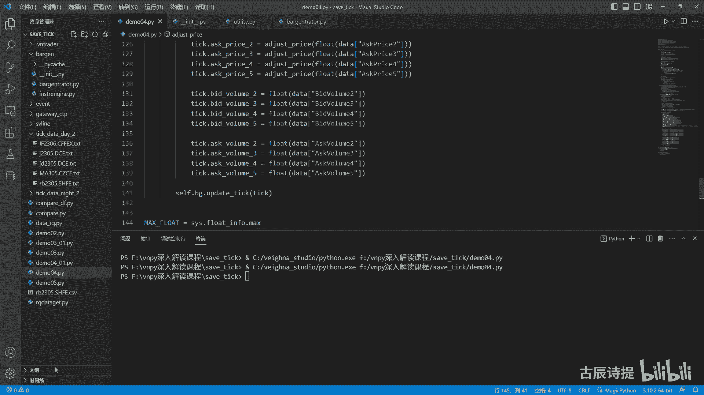

好设置好了之后呢，咱们先看一个甲醇的305，然后我就不让大家，就是说就是说去在分析这个tick呀什么的，我就直接跟大家说了，然后再结合tick的这个里边的，为什么会有这些数据，首先你像他的第一笔即可。

这是甲醇3。5啊，他的第一笔题课是7。02，07：12分的，就是晚上的19：12分的是吧，为什么会有这笔题呢，因为你咱们把这个T打开，night把甲醇打开，因为你连接上服务器，在开盘以前。

在开盘之前连接上服务器，他给你发的第一笔即可啊，呃就是连上了之后，他给你发的第一笔tick啊，他的这个时间节点，他告诉你，他就是这个晚上七点多的啊，咱们看一下这个update tom是吧，07：

12分的，只不过呢我在这呢给他加了一个变量，就是local local time，其实是在08：20分记录的，这就是为什么会有第一笔tick，因为后边的tick就不再是这个七点多的了，它就会变成多少啊。

会变成这个08：55分的，咱们都知道08：55分到85，08：59分之前，它都是集合竞价的时间，其实就是出价的时间对吧，集合竞价呢你看这个他的这个就是甲醇的，他在集合竞价从55分到58分。

他都有TIK啊，不是他都有这个K线，因为什么呢，因为他这个数据里边他都会给你发这个tick，我理解的啊，就是他每一分钟给你发的不只是一笔，可能可能啊，就是一出价，有人出价他就给你去发TK啊。

有人出价他就给你去发TIK，这就是为什么就是说他前四个会有这样的，就是这个这个K线出来，但是螺纹并没有啊，螺纹并没有，咱们可以看一下螺纹的这个它只有一个，就是一开始是一个六点多的啊，是06：36分的。

因为在6。36分，这你会接收到一笔tick啊，咱们把螺纹再打开，在6。36分，就是不是那个时间点是在你连接上，柜台是八点多的时候，他会给你，就是连连上之后，他会给你发一笔tick。

就是应该是用来测试就是是否连上了是吧，他会给你一笔tick，然后这个tick呢也有last price也有，就是说这个这个就说就是高开低收，然后这个呢其实是上一天的啊。

就是最后一笔tick应该是有了结算价了，就是这个它会有这个setment price，咱们看一下啊，这个看啊，他也没有计算机cnm price，包括这个close price也没有啊。

就这笔题可应该是来测试，连接上了就给你发个东西啊，这个是本地时间是在8。20，但是呢他的实呃就是给你的这个update time呢，是在这个啊，在哪呢，Update time update time。

啊应该是在这哎这有update time，然后这个上面update，Update price，诶啊这是08：36分的，所以说它会有一个08：36分的tick，但是第二笔题课呢，它就会在08：

59分给你发，这个呢是集合竞价，它的一个情况就是给你发的这个tick，但是大上锁不是啊。

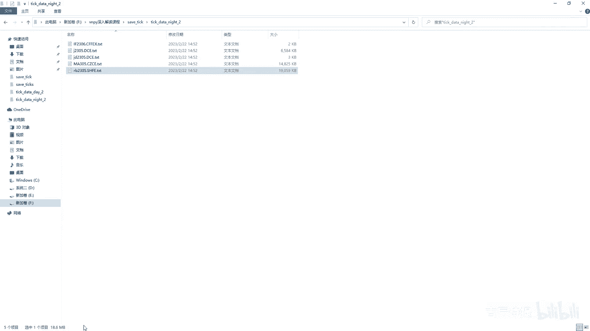

不是这个正上锁，它不是这样的，他会集合竞价的时候，他会给你发很多笔即可，这就造成了为什么甲醇它前面有很多个零啊，是吧，有这有很多个在集合竞价的时候会有这个K线，然后螺纹他没有他没有，他只有到8。59分。

会有比TIK会有一根K线，然后你会发现呢，08：59分按说是没有开盘的，他发这笔这个呢其实是告诉你集合竞价的情况，对不对，这笔tick啊，你跟这个什么就是说呃，一般咱们认为就是说第一根K线的开盘价。

就是就是单根就是就是当天交易日的开盘价，其实不是的，应该是什么，应该是集合竞价，它是会去确定开盘价，你会发现这两个是不一样的是吧，集合竞价它是2680，然后他的这个第一根是2682。

实际上它的这个开盘价应该是多少呢，应该是2680啊，咱们找到这个08：59分嗯，应该是这个吧，这笔题课是八点是九点发的，九点发的，他的last price是2682。

但是你会发现它的开盘价其实是已经定好了的，就是这个open price它是2680，Open price，open price是什么时候定的呢，就是在这个集合竞价这。

你看它的last price是2680，然后他的这个open price就是2680啊，所以说你一定要知道第一个，这个第一笔tick就是集合竞价，这笔记可是有用的，因为它的这个成交量和。

你应该累积在第一根K线里边，是不是，第二个就是它的这个开盘价，是以他的这个开盘价为准的，而不是以就是09：00：00，发的第一笔提格为准，所以呢，你跟这个就是正常的这个数据去比起来啊。

就是正常的数据去比起来，比如说咱们从这个eq data里边去获取一份，一样的数据出来啊，就在这个戴蒙零四，这个它有一个2gradate gate，然后呃2B还是305，咱们用甲醇305。

然后这边是CCCCCCE，然后获取的时间呢就是从2月2号呃，这个晚上八点以后到2月3号下午16点，也就是就是那一天的嘛，我给他给获取出来，就这个还是用的这个VNPI，这个ACCCE哦。

这个应该是大写的是吧啊，这个还是用的这个VNPY的，这个就是data feed，然后获取出来之后呢，我把它转成了这个，就是说这个呃二维表就是pd点，这个就是pandas的这个data frame。

然后给他生成了这个CSV格式的啊，就是没有什么复杂的东西，咱们可以看一下，这个就是相对准确的数据。

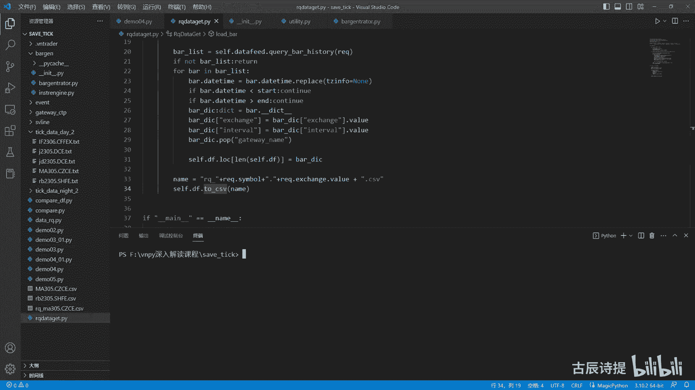

就是这个阿Q前面加了个就是阿Q做标识啊。

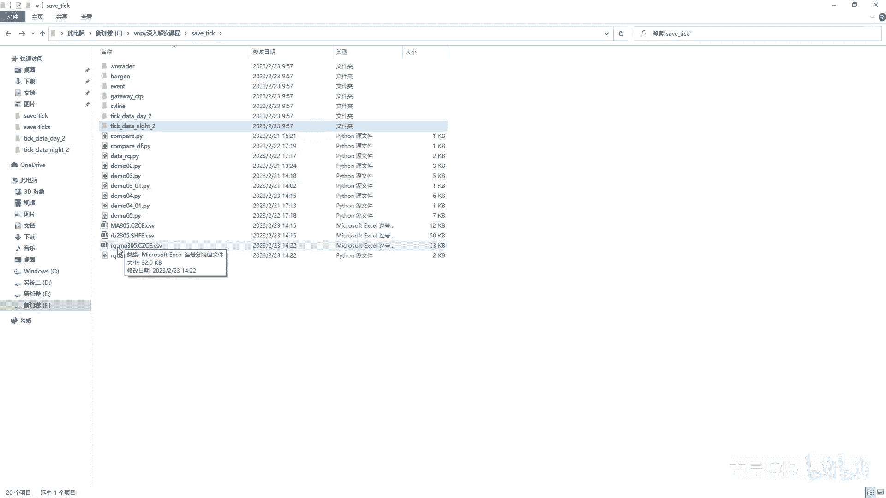

MA305啊，这个就是有些问题啊，就是我写的时候是不是写错了啊，这个下面应该是mate，就是大写的ml，但是但是它过去它会转。

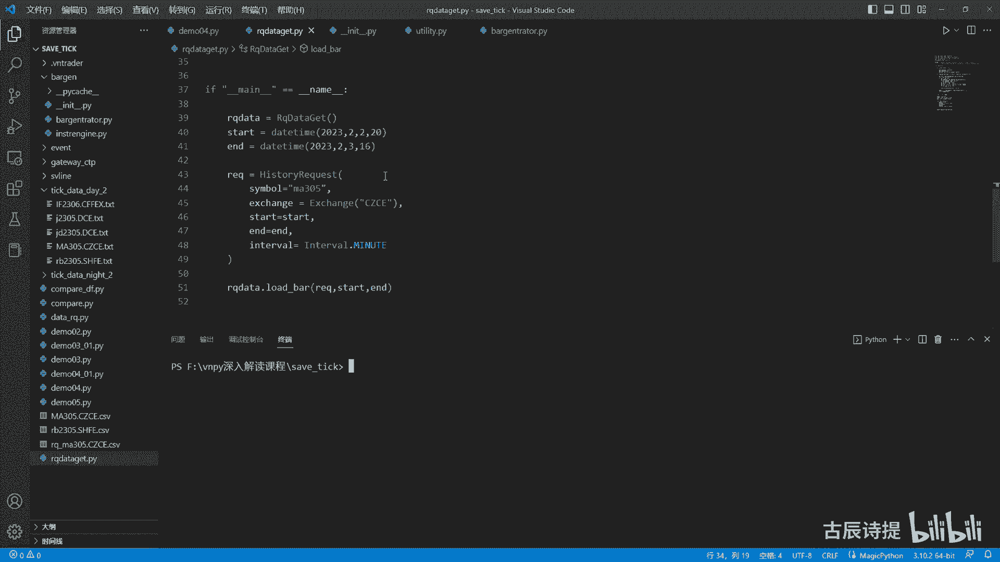

他会都会给你转成大写的，所以说咱们就不要太关注这些了啊，然后这你会发现啊，时间是2月2号吧是吧，就是2月2号9：00分的这一笔TIK啊，他的这个啊往这放一放，他的这个volume是27533。

这边的这个volume呢是24649，对不对，然后你加上这个2884，是不是就是27533了啊，27533了，开盘价是不是2682，它是26802680，其实就是上面这笔TK是吧，对不对啊。

这个就是它的这个为什么，就是说你的可能第一根K线不准确，顺便再给大家说一下呢，就是说你会发现后边的这个tick啊，不是后边的这个K线的开盘价，收盘价通常问题不大，主要的是在开盘价成开盘价。

268026912687，然后咱们看这啊，268026829：01分的是2682，但是他是2691啊，不对啊，这2691是对的啊，这不是26872687，268826882687。

这个开盘价找一些不一样的出来啊，咱们翻到最后看一下啊，翻到最后看到的开盘价，最后的开盘价是这个58分，他只有58分的，58分是2675，58分的是2675，你看他这是2682是吧。

你看他这个是2682啊，58分的啊，这边这个58分的是2675，是不是这边这个58分的十2682，前面一笔，你看啊，他的这个开盘价是26808，就是57分的啊，下面是58，五十五十七分的是2680。

你看这儿的57分的是2672，为什么会有这样的差异呢，跟大家说一下啊，就是他这里面涉及到的就是什么，就是有效和无效呃，什么叫有效，即可能就是就是咱们在一直在跟大家说。

这个tick它其实是一个揭盖行为是吧，中间隔着500ms或者更多，它是一个揭盖的行为，然后呢有可能成交氢弹的时候，他这个tick一样会给你发，然后这两笔tick呢完全是一模一样的，除了时间节点呃。

很多的三方平台，包括这个米框数据呢，他都认为这样的提可叫无效即可无效，体可呢呃就不作为开盘价，不作为这根K线的开盘价，等到有效即可，这个即可有效了之后，他再作为这根K线的开盘价。

但是这个维纳自带的这个平台呢，他不管你只要有tick过来，然后时间节点不一样了，它就把它作为就是说这个new bar是吧，那个开盘价，所以说就会造成开盘价的不一样，所以这个其实也很容易去这个区分啊。

如果你当前的这个呃，就是你上一笔这个的这个VLO，当前tick的volume是一样的话，因为他们是一个累积量嘛，就是tick这个volume是累积量是一样的话，呃。

或者说是他的turn over就成交额是一模一样的话，这笔即可就作为无效TIK是吧，那这样的话，你的这个是不是开盘价就就可以，就是做成一样的了，对不对啊，咱们可以演示一下，就是我把这个甲醇删了。

咱们记住，就是说刚才就是这个就是最后那个是不一样的。

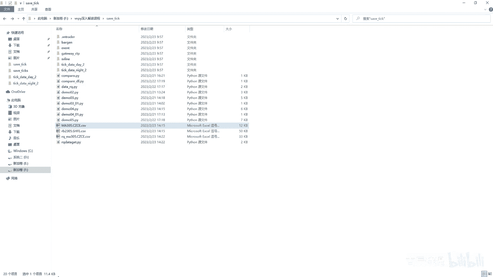

对吧，我把它给删掉啊，我把这个甲醇删掉，然后呢我在里边添加代码，我在这个demo04里边，零一啊啊，Demo04，这我给它添加一个什么代码呢，就在这个合成的时候啊，我把它这个改成这个BGM啊。

这个bgm or就是导入的时候，因为我最好别在他这个本身里边去改是吧，这样不好啊，除了这个BGLUT是在8gen，八件第八件里边就导入这个，这个里边我做了一个什么动作呢。

第一个我把第一根第一笔tick给过滤掉了，怎么过滤的呢，就是这个代码就是让他们这个时间你看啊，这个是tick点DETAM和TIK点local time相减啊，想剪这个详细的我就不说了啊，相减之后呢。

它的时时间间隔，然后把它这个时间换成分钟，如果说时间间隔超过30分钟，它就是个无效即可啊，这个就是这个K线合成这一块的课，更详细的我会放在B站上面，到时候就是大家到时候可以看啊。

我也会把这个代码发到群里边的，就这个就通过他的本地时间，和你的这个他的这个就是服务器发过来，这个时间做对比，如果时间相差比较大的话，就是无效TK就会把那个tick给过滤掉，另外一个呢在这添加一个什么呢。

就是说我在这添加一个，if sell点last tick and sell last tick volume，等于等于就是tick volume，我就return就这个是过滤无效即可的吧。

当然你也可以把他俩写一块啊，然后你也可以加上C点这个turn over啊，就是这个成交额是一样的，你把这个加上之后呢，就是你就过滤到了这个无效的tick，对不对，然后下面的代码我基本上没有动啊，没有动。

然后呢我再从这demo04，这我再生成一个新的这个甲醇啊，这个是不是去生成这个螺纹钢去了啊，就是生成了这个甲醇。

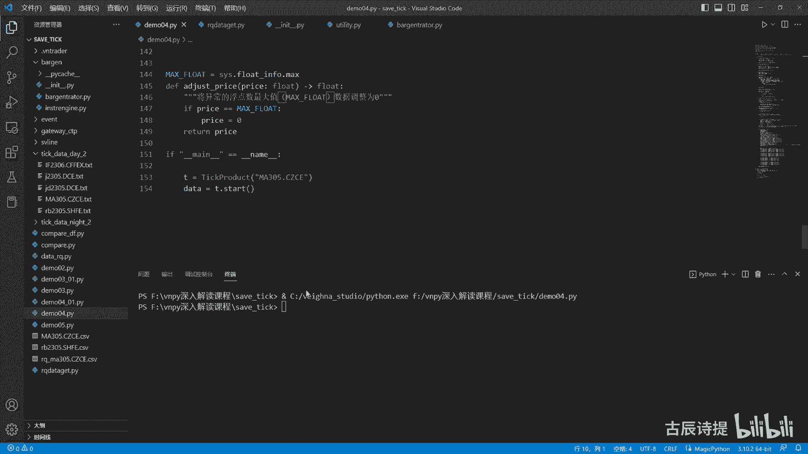

我再把这个甲醇的这个数据打开，再把这个甲醇的数据打开，首先他这个没305啊，他这个八点就是这个八点，就是那个那个那个77点，那个那根是不是没了，那就是说8。55到8。58，这本也没了。

是不是在这里边做了其他的一些啊，就是这个volume，就是你就是因为它这个volume和TVER都是零嘛，是吧，一直是相等的，所以说也被过滤掉了对吧，但是他这儿没有进行处理啊，然后咱们再看看最后。

他还是这个到58分结束是吧，然后咱们看看58分的，他的这个开盘价是2675啊，咱们在这个这个这个甲醇305，再把这个RQA的给打开。

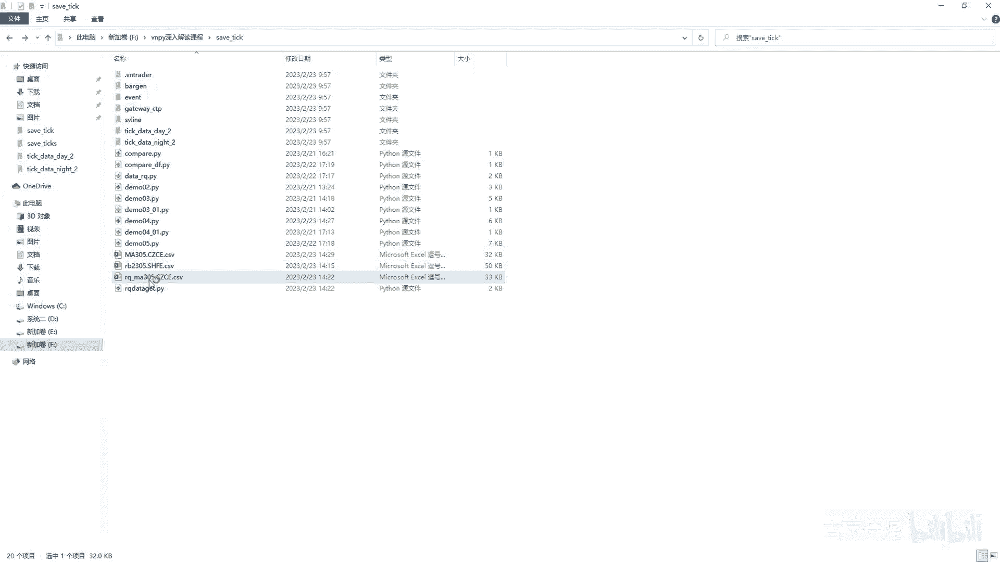

好我给拉到最后啊，这个58分的嘛是吧，因为他59分自己没合成，这是2675吧，然后上面是267282670吧，这就对了吧，是不是啊，这一点是需要跟大家讲的，因为演示的时候这些数据有点多啊。

就就就比较那个什么比较乱一点呃，如果说你有哪些地方不是太明白的，你再回头看，然后到时候会把这个都给到你，然后你可以结合代码来看好吧，其实就是一个简单的就是这个体格的生成啊，这个这个K线的生成好。

这个问题解决了之后啊，就是因为咱们发现的问题嘛，现在咱们得着重解决，就是说这个第一笔tick就是这笔tick啊，这笔tick过来，你像这笔tick是怎么处理啊，咱们就是你VOLU既然不相等不行。

那你这个volume等于零，我是不是也可以不要，对不对啊，我volume等于零也可以标，但是呃咱们后边的处理啊，就是说会把它自就是自己去过滤掉啊，你像这边的这个即可，应该和这边的就是两个。

就是跟下面这个K线给合上，对不对，给合上，这是上期所的给合上，其实我就需要把它的时间给调整过来，就可以了吧，就是把把08：59分的K线，调成09：00分的K线是不行了，它就会作为第一笔即可了吧是吧。

后边这个上期所的啊，你看还有时间节点是需要调整的，比如说这个这个因为它维纳这个平台是前置的，这个时间作为这个K线的时间节点，那这个你23。00分，这根K线就不应该去出现是吧，所以说我需要把23：00：

00的，这样的T呢给到就是22：59分对吧，这样的话它的收盘价也会准确起来是吧，你看这个收盘价肯定有问题的，因为最后的收盘价应该是44037，是不是你应该调整这个时间节点吧是吧，只不过这个是往前调。

然后第一笔第一笔题可是往后调，就是08：59分的，应该是往九点调，但这个23：00分的，应该是往22：59分去调，对不对，同样的啊，他在10：15分这儿也会有问题，因为10：15分到10：

30之前是休息的，然后这10。15分，他会在10：15：00给发TK过来，所以说他就会给合成了这个K线，但是它其实只有一两笔即可一两笔提高，所以说它的成交量会非常的少，所以说你应该把这个时间节点。

调整到10：14分对吧啊，再往后就是下午的这个15。00分，也不应该出现这个15。00分，你的这个应该给放到14。59分，这个里面去是吧，你的这个时间节点你得进行调整啊，是不是。

所以说这几个时间节点你得调整它吧，啊但是你需要的是什么多品种啊，你可能就是说螺纹它有夜盘，你再做个鸡蛋是不是就没有夜盘了，或者说你做这个IFIC，他的这个开盘时间也不一样，收盘时间有时候也不一样。

然后也没有夜盘，然后呢他中间10。15到10：30可能也不休息，还有的品种呢夜盘到夜里一点有到02：30的，是不是，所以说啊，就是说你想要精细的去把这些K线给合成好了，你还需要做一个工作，什么工作呢。

就是你要获取到什么呀，就是说你的这个时间节点，这个时间节点啊，就是说就是交易时段的这个时间节点，你呢自己肯定是不好去获呃，就是呃你从这个服务器那肯定是获取不到的，你要做的呢是自己用代码把它给写出来。

把这个时间节点呢，最好是以这种类的形式给他给写出来，这样的话你就能自己去获取到这个时间节点，在这呢我也写了，我写的这个叫instrument engine啊，就是instrument是品种。

因为你合约你可能同时有的合约，一个品种里面同时有十个合约，但是这个十个合约，其实它的交易时间段都是一样的对吧，所以说你只要获取品种的信息就可以了，最后生成它会生成什么呢。

就是这个instrument data这个里边包含了什么呢，就是product id，就是它的品种的代码，交易所名称，还有这个这个其实是price price price tag，它是每十个点一跳嘛。

有的是一个点，大部分是一个点，有的是0。5是吧，还有0。00几的size是一首多少吨，下面这个是他的这个时间节点啊，时间节点我可以把这个删掉啊，删了之后呢啊这个时间节点啊再说一下，是六个早晨开始。

因为这个得控制什么呀，就是它的这个集合竞价，有的是早盘集合竞价，有的是夜盘，就是集合竞价，所以说这个集合竞价呢，就说你肯定得有早盘和夜盘的开始时间，然后就是10：15分这一块，你得把它给断掉，对不对。

因为你得在这个时间节点去，把它有10：15分的这样的K线，你应该把它往前调一分钟对吧，把这个分钟数往前调一分钟，然后这个下午开始时间，然后这个下午节啊，这不是这个这个是10：30开始到11：30。

你需要把11：30往后调一分钟，对不对啊，然后noon是你应该把15点的往前调一分钟，他如果有15：00分的这样的tick，郑商所是没有这样的题，可的大商所有上期所有呃，这个上期所和大商所在15。

00分，这个tick过来，它的这个笔数还不一样，好像是上期所是两笔大场所是一笔啊，都有不一样的地方，然后begin night啊，是就是晚上就是开盘，然后a night是晚上收盘。

然后这个has night呢就是有没有夜盘，这个你如果说是有这样的数据类型来了之后，你就能控制，就是说你比如说你像你做鸡蛋，你做鸡蛋夜盘开盘的时候，你鸡蛋就没必要去实例化那个策略，对不对。

就没必要去实例化策略，你只要做个简单的判定啊，这个品种没有夜盘，我就没必要去实例化它了，白天再去实例化啊，反而有夜盘的，你可以对，就是给它进行实例化，对吧啊，这个是保存在本地的啊，这个怎么获取的啊。

怎么获取的，我这边也写好了，我可以先把它删了，这个就是这个八件啊，不是这个这个string engine啊，string engine这个已经是写好了，其实不复杂。

就是主要的是获取这个CD p gateway里边，这个这个叫contract data，然后进行调整，这个很容易理解，但是这里边有一个就是写的比较麻烦的，就是这个time filter。

因为他得确定用它来确定这个每个时间的，这个时间节点，像cf f e x啊，GFEX啊，这个每个都会确定你像这边都给分类好了，非国债品种啊，然后这个是有夜盘的，这没有夜盘在上期所的啊。

这个没有夜盘在这个正上锁的，然后这个大场所没有夜盘的，就color metal是这个有色金属是吧，高的是贵金属啊，是通过这个类来给，就是分别就是分裂出来，就是说这个哪些是夜盘的，哪个时间节点不一样啊。

挨个交易所去给他去处理的，然后再通过这个引擎呢去把它给生成出来啊，去生成出来这个这个代码啊，就是我也会给大家，然后我给示范一下啊，就是我从这哦在这儿新建一个demo，零五点PY啊，呆萌零六点PY嘛。

就是from这个bug点这个import这个instrument engine，然后ins等于instrument engine，然后里边要传入的invent engine啊。

Invent engine，我还得新建一个from event in invent engine，然后这边invent吧，好啊，ins这个给它传参，这个是MIT engine。

然后这个是我先把invent engine给它实例化出来，engine engine等于invent engine，然后我直接把invent engine给它启动起来，S t r t start。

同时呢我这边还得定义一个log out是吧，lock out这个接收的是这个event，因为int，啊然后这个log等于event data，然后MSG等于log点MSG啊，然后就print一个MSG。

然后这个invent engine点register注册一下这个event log，然后这边是log out是吧，然后vlog event没有log是吧，From，这个是应该是在sv line点。

Invent import event，好这个就把这个什么给它注册进去了吧，就说这个日志输出，然后我实例化一个，里边需要传入这个呃invent engine啊。

invent engine后边呢这个cdp gateway，咱们可以看一下这个具体的，其实你不传这个invent engine的话，这个start啊。

它会自己去创建这个it按键和CD p gateway，那咱们就不自己去创建it engine了，然后也不log out了吧，就是也不REGIST了，就直接硬是吧，这个你可以不进行传递，数据不进行传递。

然后ins直接start s t a RT啊，因此直接start好，咱们去运行一下看一下，因为现在这个柜台还没中断啊，交易服务器连接成功，行情服务器连接施工结算信息确认成功啊，这个需要等一下。

因为他得接收这个contract data是吧，在这需要说一下啊，就是就是这个里边有一个什么呀，就是这个engine过来就是process process contract。

这个event他在这我自己建了一个instrument data，这个instrument data呢，就是这边有这个一个详细的这个数据类型嘛。

这个呃instrument data这个是product id，就是他的这个合约的，就是这个品种的代码呃，instrument data你必须得跟contract data给联系起来。

因为contract data是合约的详细信息，所以说我在contract data里边呢，也就是加了一个product id啊，Product id，其实在咱们的这个实际上呢。

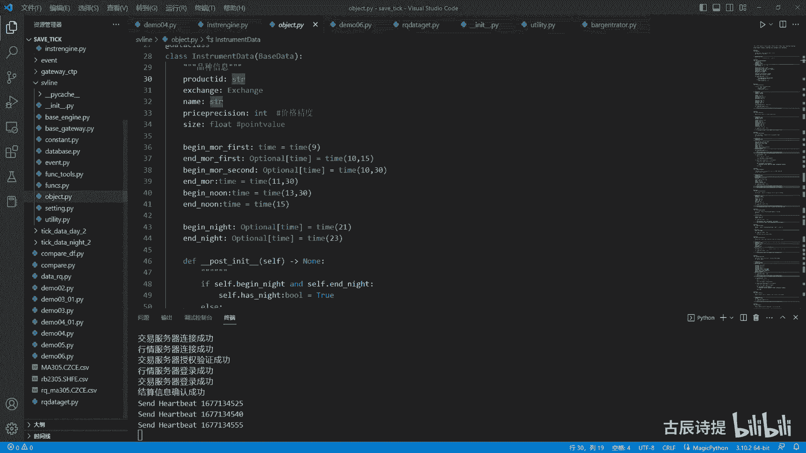

这个数据原型里边的这个呃，合约信息里边，是有这个这个这个这个这个product id的啊。

有这个product id的，所以说你只要去添加一下，他这个product id就可以了啊，就是我把这个呃construct cn s t r s t a。

Contract contract seven cn t r i c d contract data，这里面我加了一个product id啊，它可能是一开始是不是没有的啊，我给忘了好。

这个呢已经获取成功了啊，他就会有这个其实你获取一遍就可以了，他如果没有新增的品种的话是吧，你获取一遍就可以了啊，呃这个你获取了这个你就有了这个时间节点吧，是不是有了时间节点。

你就可以对这个针对性的进行调整了吧，啊这个就是咱们要讲的，就是我在这里边自己写了个UTTT，然后这个里边有个八建筑啊，这个八建筑是进行了一个全方位的一个调整。

呃你在前面去就是update tick的时候呢，你需要从这先update tick first，就是tick数据的初步筛选，初步筛选第一个你像是过滤没有成交价的体格，这本身就是伟大平台自带的。

然后呢看这个时间的这个序列啊，看这个时间的序列是吧，然后呢，这个是过滤本地时间和记录时间差值太大的，TIK啊，差距太大的体感，我不知道大家还有没有这个印象啊，当我这个demo04里边这个bug or呃。

是这个VNPY，这个是这个八点的VNPY，诶啊我把它还是换成VNPY点，trader点utility，我换成这个八结论的时候，我去生成甲醇的时候啊，我生成甲醇的数据的时候啊，在这是甲醇的数据。

生成甲醇数据的时候，他第二天白天的数据是没有的，但是在这个这个data to，这甲醇第二天是有数据的是吧，但是它是生成不了第二天的数据，咱们可以看一下啊，他一直到就是说晚上的10：58分就没有了。

为什么会没有这个啊，不知道大家还有没有印象，就是在讲这个action day的时候，咱们反复在说这个action day为什么是大商，这个这个这个就是说这个action day它要进行调整。

因为这个大上锁的这个action day呢，夜盘的时候它会往前提一天，对不对啊，他会往前提一天啊，但是呢由于我这个已经录制好了，这个我的这个就是tick已经录制好了，里面有local data。

所以说呢我得把这个呃local data就是说给他，就说赋值给，就是说这个action day，或者说把他这个时间给它复制成action day，咱们可以看一下甲醇它的这个啊。

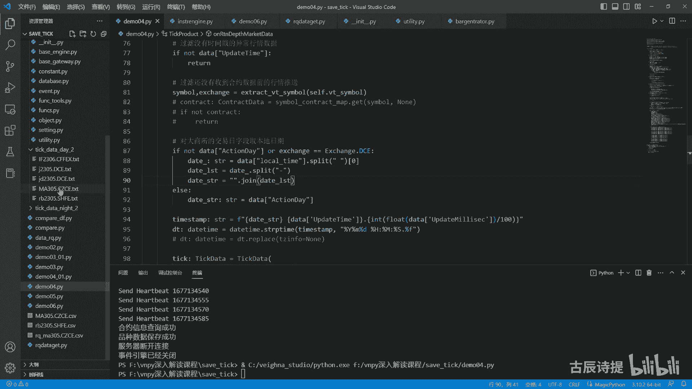

就是这个tick过来的时候啊，就是甲醇的这个tick，我就是白天的数据啊，我给他打开了，就是白天的就是TIK过来的时候，因为我录制下来了，所以说我就需要把他的这个时间进行调整吗。

这个时间调整我得给它调整成，就是说和这个什么是一样的，和这个我的这个日期是一样的，是不是这个日期是一样的，但是呢甲醇他上来接收到的第一笔tick啊，他的这个update time是22：59：59啊。

是22：59：59，它调整完了之后呢，他就变成了就是就是，而且他的这个action day呢是2月3号，你看他是在2月3号录制的吧，他的这个action day它又是2月3号。

所以说他就是他的action day是2月3号，然后他的这个时间是22。59分，59秒，是不是其实就是2月3号的，就是晚上的十点呃，就11点了，你后边这个tick你过来看啊。

他的这个update pm是早上九点，然后他的这个action day是呃，就是20230203对吧啊，这一点是虽然咱们那个是呃大商所的，他这个action day就是什么时候给你发的。

他就是什么时候是这个action day，但是咱们再看一下这个螺纹，螺纹他为什么能够合成呢，因为他这个时间他没有就是进行，就是说这个就是从2月2号变成2月3号，因为2月3号你连上了时候。

这个郑商所给你发了，就是前一天的可能是最后一笔tick啊，给你发了一笔tick过来，然后他就把这个时间标成了2月3号，但是这个上期所呢他咱们看一下啊，他的这个你像88：27分是吧，他给你发的这笔题课呃。

是他的这个action day，咱们找一下2月2号的吧，咱们是在2月3号录制的吧是吧，2月2号的，他会把这个action day就是给他写成2月2号，其实他就是前一天的这个最后一笔tick嘛是吧。

他不管他就给你换成了2月3号，因为他是2月3号发给你的，所以说呢他就合成不了，就是说这个就是后边的tick全部给过滤掉了，因为你第一笔tick就已经是最大的了，这个这个时间就已经到晚上十点了。

11点了嘛是吧，后边体可都是早上的，那肯定就是被那个就是说这个daytime，那个给过滤掉了嘛，啊这个就是原因，所以为了过滤你像这样的tick，就是它有个很明显的特征是什么呢。

就是它的时间和你的本地时间相差太大嗯。

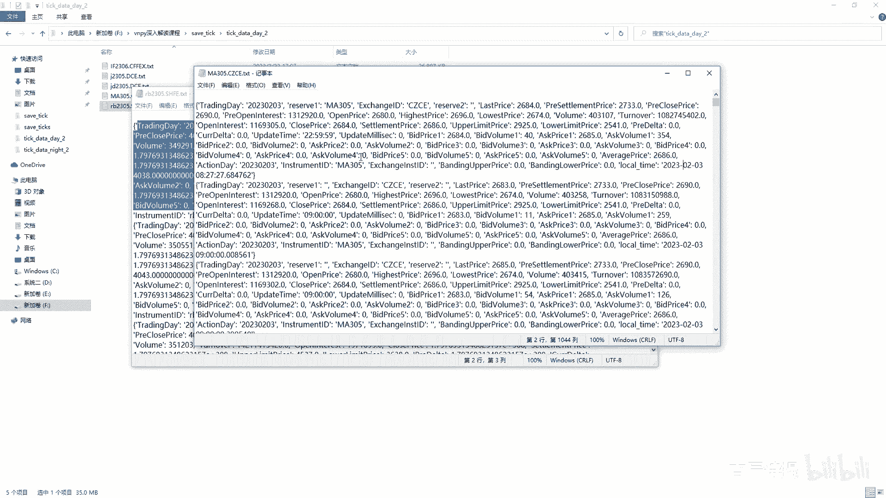

就是你只需要把他的两个时间一减，然后这个时间超过30分钟，或者你超过5分钟或者超过10分钟，它就不算有效tick啊，这个就是在我在这个这个这个把generator里边，不是这个把generation。

是这个utility，这个generator里边做的这个事情啊，这个UT里T是不是这个UT里T是吧，是这个UT里T啊是吧，就是计算，然后差值，如果这个差值比较大的话，就返回是false啊。

这个计算差差值的这个代码是在这呢，唉到哪去了，这啊其实就是两个相见，一个是tick点这个DTIME，一个是TIK点这个local deta，这个tik data我我做了个更改，就是把它一些无效的。

就是我就是我用不上的，我给他给删了啊，这是我本地的这个体格啊对吧，这个是第一步的过滤啊，第一步过滤，然后第二步过滤是过滤什么呢，就是到了这个additic filter，就是初步过滤。

过滤完了之后就到artic filter这里了，第一次检查是否在交易时间段之内，就是check time呃，这个他在初始化的时候，你就需要把这个instrument给它传进来。

有了这个instrument，你就有了这个品种的，就是交易时间段了是吧，然后这个呢这个呢其实很简单，就是看他是不是在交易时间段之内，begin morning first和这个in the norm。

是不是在白天交易时间段之内，然后呢下面这块是不是在夜盘交易时间段之内，只不过你要考虑这个夜盘，他是到第二天一点02：30，还是在当天的11点就结束了啊，做的工作就是判断。

是不是在第二天的这个交易时间段之内，不在夜盘的交易时间段之内，如果是的话，就返回true，如果不是的话，返回false，你第一步，就是你这个第一个进行第一次检查的时候，你集合竞价。

包括你像郑商所的集合竞价发过来了很多tick，他是不是就不在这个时间段之内啊，是不是不在这个时间段之内，我是不是就可以啊，就是你呃，就是他这个返回值是不是就是false了是吧。

然后我这儿呢又定义了一个is pad pad，这个是表示是不是集合竞价啊，是不是集合竞价的tick，它不在这个交易时间段之内，有可能是集合竞价的T吧，是不是，如果说不是这个在交易使用单之内。

然后我再去检查一下，就是adjust dt就是DETEPAD，就是竞价，我再去把它进行一下调整啊，adjust dt pad就是调整提个时间，针对竞价，但是这呢你又需要考虑到。

就是大部分时候你的这个有夜盘的品种，集合竞价都在夜盘，但是你别忘了，就是有些假期的时候就是没有夜盘的，他假期完事之后，早上的8。59分，也是集合竞价FTK的时候啊，所以说它分成两个。

一个是就是早上有这个就是就是begin morning first，然后往右去调整一分钟，往右调整一分钟啊，然后呢就是说把这个就是夜盘的，也也是往后调整一分钟啊，调整完了之后再去看一下他是不是和这个呃。

那个就是这个就是他的这个就是begin morning first，往前就是往右调一分钟，是不是往左调一分钟啊，这个是一嘛，应该是往左调一分钟，等于就是说比如说这个take time是08：59分的。

然后这个begin morning first是九点是吧，然后九点我往前调一分钟是不是相等，如果是相等的话，就说明是集合竞价的这个tick，集合竞价的tick呃，它返回回来啊，返回回来他给调呃。

它给调整的是直接就是你看take time等于嗯，就是这个tick点，the time等于了这个往后加一分钟嘛，对不对啊，先判定他是不是就是08：59分啊，如果是8。59分，我就让他往前加一分钟。

然后把这个tick再返回回去，然后把这个tick，它是不是这个集合竞价的这个tick，然后返回回去，我这啊这个tick这个time我给他做了一些变化，因为我加了个下划线。

因为就是你这个local time，你在规定它这个变量类型的时候，它会跟这个对time有一些冲突啊，所以说我就给他简单的变化了一下，这就是调整集合竞价啊，调整集合竞价，这需要注意的就是节假日的时候啊。

就是不是周末是节日的时候，他可能也会在早盘进行这个竞价，就是有夜盘的品种，调整完了之后，他是不是往后调整了一分钟啊，调整完了之后再进行一个check time，再进行一下检查，如果说调整完了诶。

他在这个时间之内了，因为你就变成九点了吗，他在时间之内了啊，然后再去调整时间节点啊，就是咱们说的早上的10：15分是吧，上午的就是11：30，下午的15点多，然后晚上的二十三二十二。59分。

59秒就是23点啊，那比tick给他去进行调整，就是adjust dt triad，是在调整它的这个时间节点，这个时间节点的调整呢，其实就是看这个tick tom。

是不是在他这个in the morning first，就是10：15分是吧，noon就是11：30in the啊，不是INTERNEON，是15下午三点in the morning，是就是上午的11：

30in the night，就是晚上的是吧，它夜盘的结束那个时间节点，如果是的话，你看啊是减TENDELETE，就是把这个时间减了一分钟啊，然后再把这个tick给返回回去是吧啊，这就是update。

就是做了这个时间节点的调整啊。

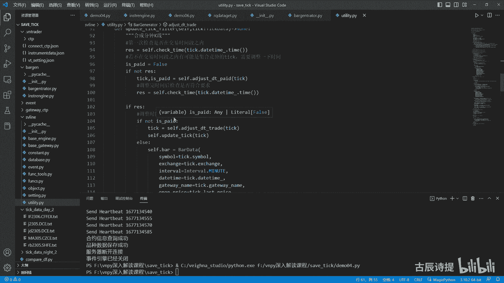