# 第14节课 基本流程控制 - P1 - 古辰诗提 - BV1A1421y7Ps

欢迎大家来到从零开始量化系列课程，MC课程的第14节课，这节课呢咱们讲基本流程控制，基本流程控制呢其实是写代码的时候，它代码执行的方式，如果说你把基本流程控制，就是基本上都搞明白了之后。

你就可以去写代码了，前面讲的这些内容包括数组啊，变量啊以及常量啊，一些基本的关键字什么的，呃，是你写基本流程控制，所能用到的一些最基础的内容，你光会流程控制，那基础内容你不知道你咋写，对吧啊。

这个基本流程控制呢分为这么六种，一个是if then，然后begin end，还有once，还有sweet k还有这个两个循环，一个循环是for循环，咱们在讲数组的时候重点用过它。

还有个是while循环啊，第一个呢是最常用的就是if then哈，就是最普遍的控制语句，在别的语言里边它也是这样的啊，当然后边没有than啊，一般别的语言都是里边都是if，像C语言C加加里边是if。

你这个条件判断成立的话，它会执行这个大括号啊，加上冒号执行大括号里边的语言，但是在easy lemage里边，它更加的贴合咱们的人的这个认知，if如果这个条件成立了，我就then执行什么是吧。

它有四种基本形态，就是if条件这个布尔表达式成立了，然后他then执行后边的代码，如果说他这个表达式不成立的话，也可以去后边加一个else，然后去执行后这个else后边的代码。

如果说比如说我要判定我这个数值，是不是比100小还是比50小还是比十小，那你肯定得判定前面的这个呃，这个就是你这个值是不是比五大，比这个比50大，是不是比100大是吧，就是你会用到多几的这种判断。

就需要用到else if啊，就是if then，如果这个成立的话，他就执执行这个单行表达式一，如果说这个不成立的话，就else if f再进行一下判断，就是他有个布尔表达式二。

然后then去执行这个单行表达式二，当然他可以串起来啊，你后边可以加有限个LCF啊，当然你可你如果说最后还可以加一个else，就是如果说前面的都不成立，我就去执行这个else语句。

这个就是它的这种四种基本形态，然后可以给大家演示一下，好如果我有三个数值value，一等于1000啊，100吧，Y62等于1000，然后value3等于1万，好进行一下判断，if value3大于。

Value1 then，我后边就写，就是就是输出吧，print value3大于value1，然后else if啊value2大于value1，than print value2大于value1。

然后else再进行下print，就是这个none没有值，能够大于value1，就是none就表示没有，然后这个时候我进行一下编译，当然我没有给它加载到图表上面去呢。

你像这样的就是判定是你编译肯定是没有问题，额问题的，但是里边其实是有逻辑问题的，你想其实Y63大于Y61也是成立的，Y62大于Y61也是成立的，那它会输出哪一个呢，或者说是两个都输出呢。

这个是需要咱们注意的问题。

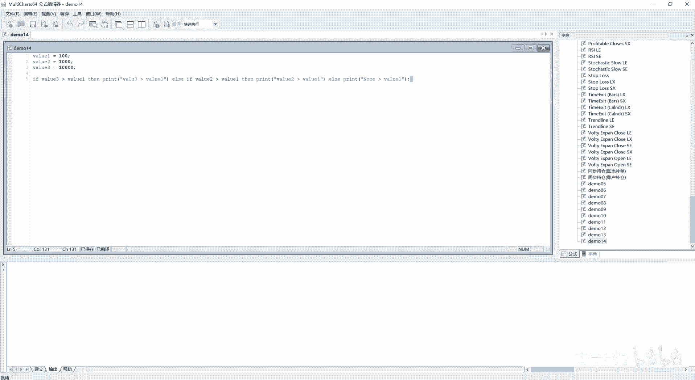

比如说我从这插入信号demo14close。

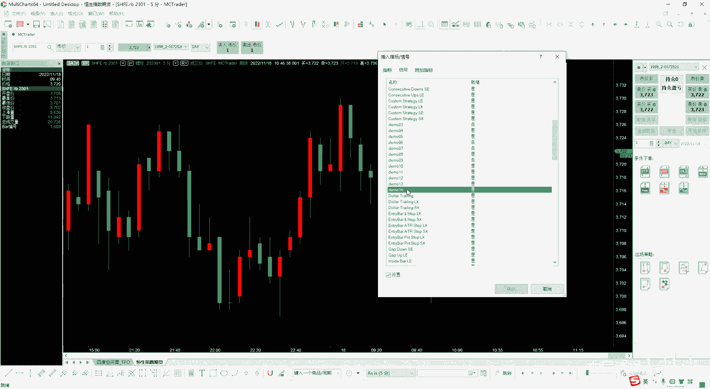

你会发现你会发现它输出的只有value3大于value1，这个是if else语句，或者if then else语句里边需要注意的一点，就是这一行代码里边它从左往右去执行。

哪个满足他就执行后边儿的这个它的代码块，它只要是满足了，后边他就不再去执行了啊，后边这就是他就不再去执行了，这个需要注意的，当然我这个举的这个例子不太严谨，就是一开始跟大家说的那个例子是比较严谨的。

就是如果说你想判定这个数值，是比五小还是比50小，还是比100小，你如果从这写了，比如说我这个变量值，如果说是小于100，它就会执行，它会比100小，但是我想要的结果是判定的越准确越好。

你应该判定比五小是吧，要么你是把这个小的值写在前面，就是让它进行先判定，要么就是你加上严格的这个就是判定条件，比如说我先判定他小是不是小于100，然后还得加一个条件，就是if and是吧。

然后后边加一个它是不是比50大，如果说不比50大，我再进入第二个条件，哎，他比50小，是不是它比十大，如果他还是比十小，我再进入第三个条件啊，这一点是一定一定需要注意的点啊。

就是if then这个判定啊，if then判定从这呢，还有一个比如说，啊就用value1吧，就是if value1，比如说小于50，than value1等于比如说零，如果它小于50。

我就给它赋值为零，else value1等于100嗯，我print一下一个这个value1啊，这个应该是很简单嘛是吧，很简单，就是如果说这个数值比50小，我就把它重新复制成零。

如果说它比50大或者等于50的话，我就复制成100万吧，啊10万吧是吧，这个你输入出来他肯定是10万是吧，因为它本身它的这个值是比50小的，如果说你像这样，这就是比如说这儿有有这个式子会比较长。

或者说是啊，当然你这样写也可以啊，我从这是想给大家引入一个什么呢，它还有一个if if if if，就是这个里边呢是什么意思呢，如果说我把这个value1小于50，它传出去的呢就是零值啊。

如果说是它是小于50不成立，它传出去的呢就是10万就是不成立的这个方式，然后我把这个value1等于它啊，等于它就是用这样就是if if if后边呢就是if if，就是if if f后边它有三个参数。

第一个参数呢是一个判定条件，就是true false的一个判定条件，如果说第一个条件成立，它就返回的呢是第二个数值啊，如果说不成立，就返回第三个数值，这样他一样能起到，咱们就是这行代码所起到的作用。

你看但是它的代码要精简很多，这就是if加上一个F啊，它的一个作用，当然它是一个内置的一个方法啊，内置的一个就是方法好吧，这是需要跟大家讲的一个点啊，一个点，这是if else。

第二个呢是begin end，begin end呢其实就是什么呀，就是如果说我这个布尔表达式成立之后，我执行的不是一句代码，我要执行多句代码的时候，你可以用begin end把它给包起来呃。

就是表达式都是以一句一句方式这样的语法嘛，如果说想把多行表达式视为一句的话，你可以使用begin end，一定要记住一个begin，一个要配上一个end end，以分号结束，这个不是就是说特别准确的啊。

就是你像这个如果说后边有else，if你这个and是不需要加分号的，只需要在最后给他加分号就可以了啊，前面说的这个布尔表达式啊，就是你if后边的一定是返回的true或者false啊。

一定是返回的true或者false，这个你一定要记住，一定是返回的true和false啊，他就说你是一个条件判定，比如说咱们一般写代码都会，比如说我的收盘价啊，大于我的这个30日均线了啊。

或者说我收盘价和我开盘价的均值啊，小于我的20日均线了，或者小于这个ATR值了，它是一个判定啊，你后边可以加上and就是多个条件合并，或者加上or里边只需要有一个条件成立。

它整个的这个布尔表达式就成立了啊，你一定要记住这个if后边他是布尔表达式好吧，然后咱们演示一下这个begin end，我把这个代码给它放开啊，就是你可以怎么改呢，如果说我后边than。

后边我不仅仅要执行一句这个print，我还想执行别的，就是代码，就是多行代码的时候，你可以加上begin，然后然后print我从这以一个分号结束，然后我再print一个什么呢，就是这样吧。

再以一个封封号结束，然后一定要加上and，然后else if，然后如果说它成立的话，begin啊，然后print我把它给复制一下啊，print这个要加分号结尾的啊。

然后我再print一个这个这一定要再配上一个and，然后else啊then哦不是else begin，然后呃print，然后我在这个这一定要配上一个N的，以分号结尾，你这样进行一下编译输出是吧。

你就这个可以执行多行语句呃，你会发现这样写，其实嗯可读性没有，我把它用这个段落控制出来，这样要好啊，嗯是吧，这样是不是要好点，对不对，这样你能看出来它是一个代码块，它是一个代码啊，它是一个代码块。

它是一个代码块，所以你在写代码的时候，建议你是用这样的方式来写啊，呃虽然这个easy language没有这种严格的控制，就是说你必须得就是就是加上这个空格，但是希望养成这种良好的习惯。

这样能够加强代码的可读性，然后你点到这，它会就是这样的搭配，会很明显是吧，如果说你从外边再加一个for循环嗯，就是begin和end的这种搭配，你一定要一个begin，一定要配一个end好吧。

这个是begin和end好，第三个呢是once词，就是代码在执行过程中，会在每根K线上都执行一次，这个咱们反复都说过是吧，洛某些代码只需要执行一次，需要使用到这个ones关键字，wants呢。

后边跟单行代码或者once begin，后边带一个，就是跟一个代码块，然后加上一个end和这个begin end连用，这个应用场景，比如说我这个策略我只适用于5分钟周期啊，只适用于5分钟周期。

咱们是不是可以用8type和咱们之前学过的，来判定这个interval，如果说不是5分钟周期，我就不运行啊，或者我抛出一个异常啊，就是这个咱们后边说啊，这个异常这样是不是也可以。

或者说是我这个策略我只能运用在我的账户上，我加一个账户的判定啊，后边也会跟大家讲如何去获取账户的信息是吧，这样的话你会用到这个once的代码，once代码它只会执行一次，比如说我从这执行一个once啊。

boss我就print一个start，括号啊，我就print一个start，然后我进行一下编译啊，这个往上拉一拉，找一找啊，start是吧，它只是执行了一次，这个是之前的啊，之前输出的他只执行了一次。

后边就再也没有start了啊，就是他会只执行一次啊，如果说我最后我还想执行一次，就是你怎么来进行操作呢，应该是什么呀，就是进行一下判定是吧，if last把on chart就是是不是是最后一根K线。

这个后边是没有参数的啊，then print一个，and你这样来写，是吧，最后只有一个end，然后前面有个start啊，Last bon chat，就是图是不是图表上最后一根拔线好吧，就这个是once。

Once，当然后也可以跟begin和an和这个end的连用，在这呢需要注意一个点啊，注意一个点跟大家讲一下，就是咱们后边有个案例，就是画图的一个案例，就是这个是不能写在，就是说这个指哈就是信号里边的。

因为这个里边有plot，plot是画图，咱们后边也会给大家讲画图就是画线嘛，其实就是画均线，画均线，你从如果说你写到信号里边，它会报错的，你只能把它写到指标里边啊，只能把它写到指标里边，新建一个指标。

好把它粘过来，咱们先看一下这个代码，8type咱们之前讲过他是什么呀，判定你这个K线它是什么类型的K线，它是分钟的还是tick的，还是日线的，当然它只能判定tick和这个啊，tick和日线之间的。

然后再判定日线是吧，这个咱们之前讲过是吧，呃日内的tick的还是日线的，还是周的，如果说你想把它判定的多一点，咱们之前讲过，他是有个8tap下划线ex的，这个他能判给日内的这个做一下判定是吧。

就是8type ex它会更多一些，它会判定是分钟线还是小时线，是不是好，这个代码的逻辑是什么呢，如果说我的霸线的类型是一一是tick嘛，他就画这个五根线的这个均线啊，我就不用提格做演示了。

我把它改成四吧，四是就是这这个日线啊，我就用这个五根日线均线把它给画出来，然后呢如果说他是ex是二，如果是分中线的话，我就画比如说20根是吧，如果说他是三三是小时线的话，我就画别30根了，我就画十根吧。

就是呃这个这个这个他的这个周期越小，我就画的越多是吧，周期越大我就少画一点啊，这样的话我进行一个编译啊。

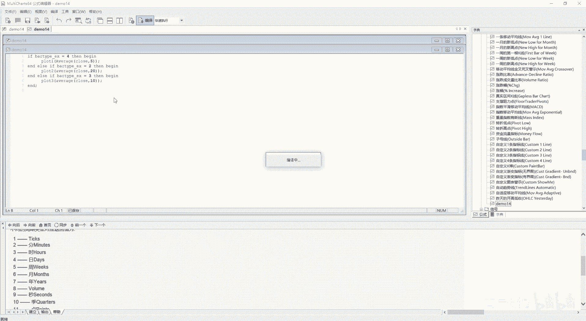

也编译成功了，然后我给它加载到插入指标里边，然后指标啊找到这个demo14，demo14呢你需要设置一些东西，第一个是样式样式，它plot1plus2plus三，是跟咱们代码里边给配套的plot1。

Plot 2plus3，它会你可以设定它的颜色粗细，甚至是这个虚线还是实线都是可以的，我把它颜色改成一个呃这个黄色吧啊，然后属性里边呢你要记住它，因为你是画的均线，你想跟这个商品这个这个在一个图表上。

你就不能在底部显示，如果是在底部显示，它就跟添加一个，比如说成交量啊，那个是比较类似的，或者添加一个数据二，所以说你要在子图一显示刻度呢，你要写的跟商品相同啊，跟商品相同，因为你要在这个这上面来划线嘛。

刻度跟商品相同就可以了，点击确定，你有没有发现他是画的是这个蓝线，蓝线就是咱们在样式。

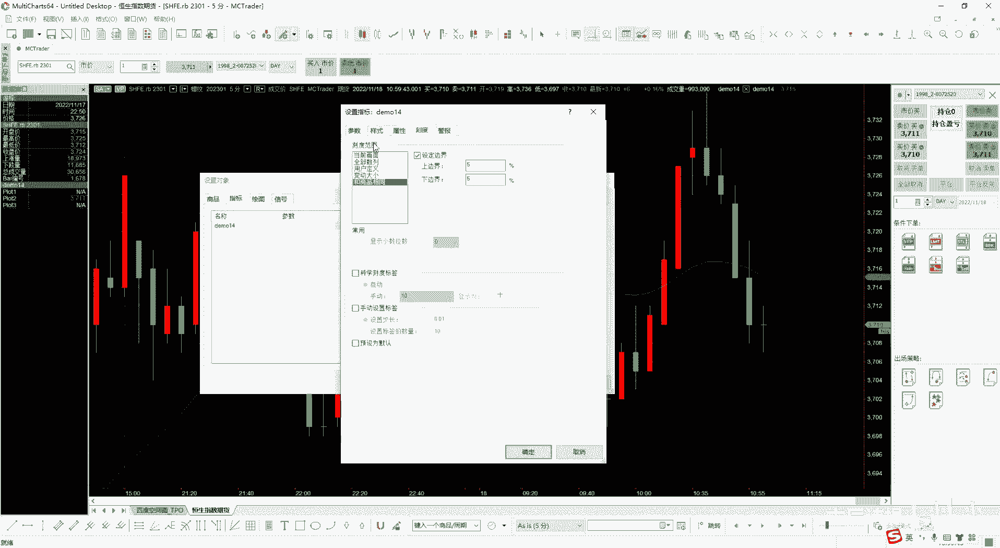

这是是plot2，是不是plot2，咱们看一下代码，它是什么呀，他是8type ex等于二，8type ex等于二。

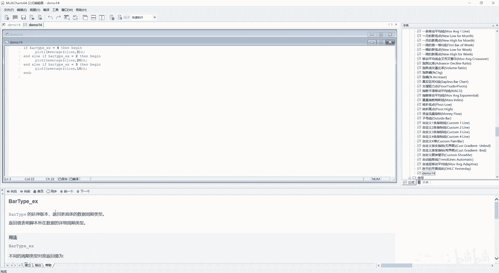

它是什么呀，是分中线，而我这个图表上面是5分钟线，没有问题是吧，如果说我把商品设置成一小时的。

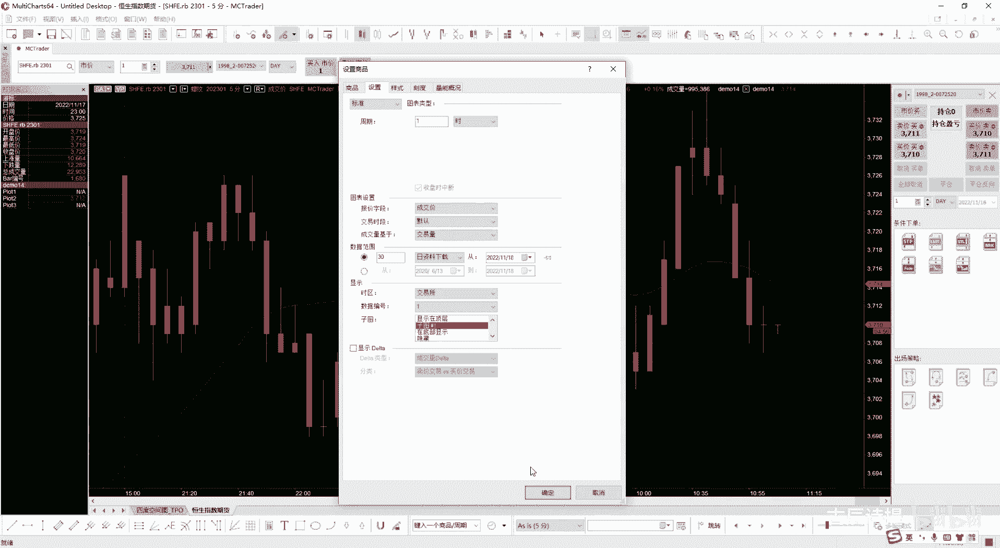

你会发现它就会变颜色了，就会变成黄色的线了是吧，如果说我给它设成一日的，它它就会变成红色的线，对不对啊，变成红色的线，这是指标，指标是咱们后边需要讲的内容，这个代码就适应了，就是你多个。

就是这个周期类型的这样的一个画图对吧，咱们现在是在讲once死是吧，如果说我从这添加一个once死，print一个start，咱们看一下它会输出什么啊，进行一下编译，你会发现它输出了两个start。

是不是它输出了两个start，我把它给清空。

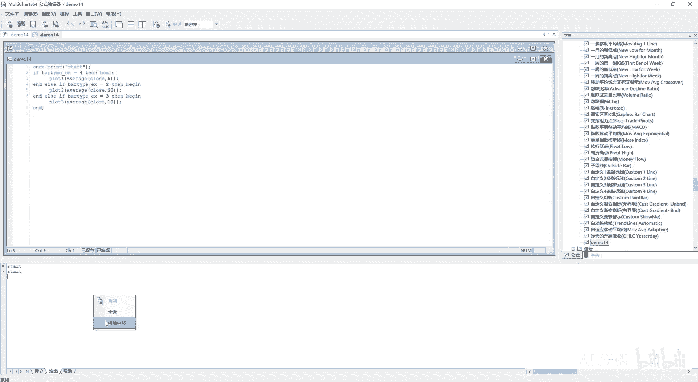

我把它再设置一下，我设置商品，我设置成啊。

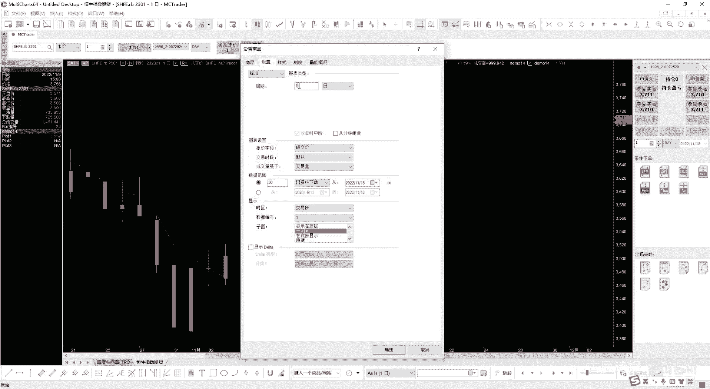

5分钟呢，还是。

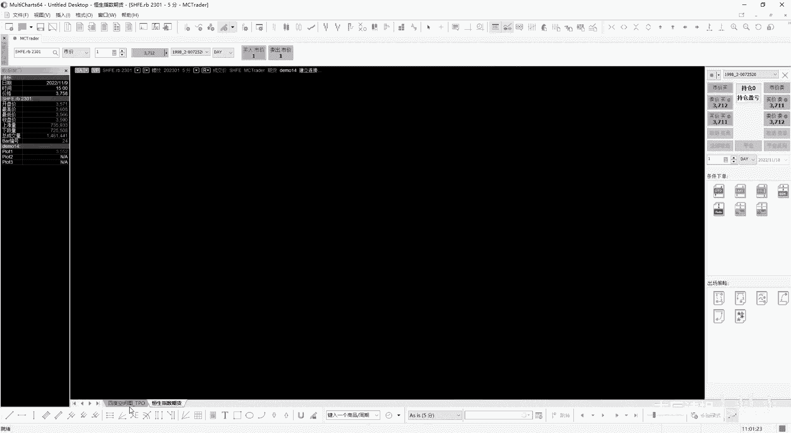

好咱们再看一下，你会发现它有四个start，哎这个是怎么回事呢，因为咱们讲vans的时候，他只会执行一遍，为什么这他执行了四遍是吧，once死执行了四遍，这这个是怎么回事。

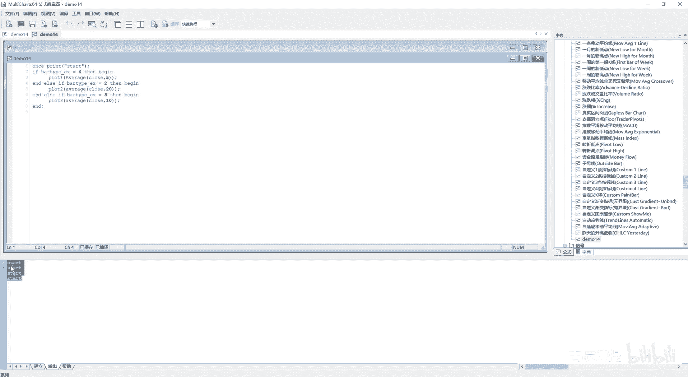

这个需要跟大家讲一下啊，如果说我把他的这个设置这个啊，不是设置商品啊，设置指标这个里边设置里边，我把他的这个属性改成用户指定啊，咱们看看改成用户指定之后。

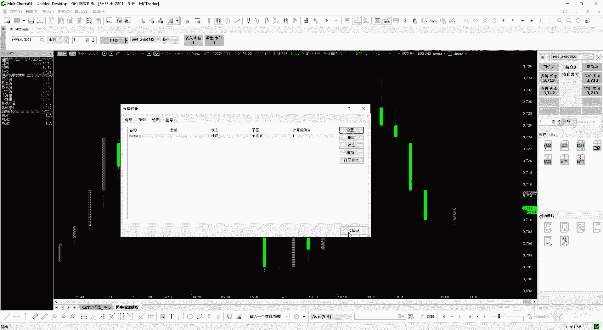

你会发现他只输出一个啊，这个就是涉及到这个脚本加载时候的，这个逻辑了啊。

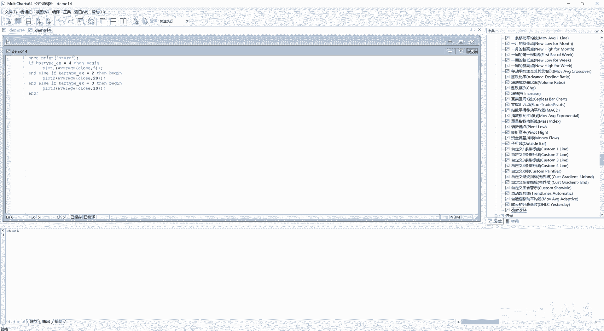

在这跟大家说一下，就是当你选择自动检测的时候，代码肯定是根据一定的逻辑去进行判定是吧，他肯定有得有一个，比如说我先用五根，我试一下，五根不行的话，我变成十根，十根不行，变成20根。

你会发现日线的时候他只加载了两遍是吧，但是呢这个分中线的时候它加载了四遍。

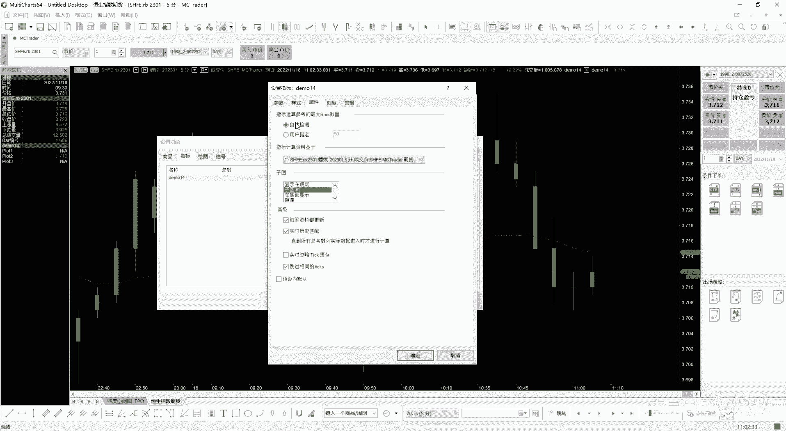

为什么呢，因为我分中线，我设置的这个就是后边的这个长啊对吧，如果说我给它设置成50的话。

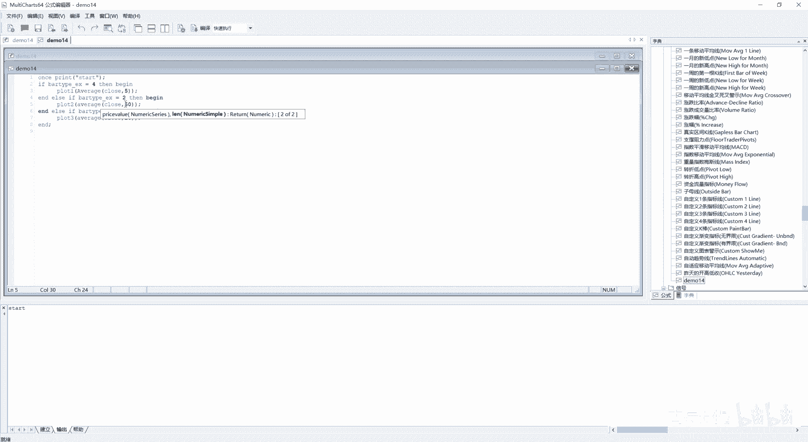

他可能会加载的更多，他可能会加载的更多，可能啊。

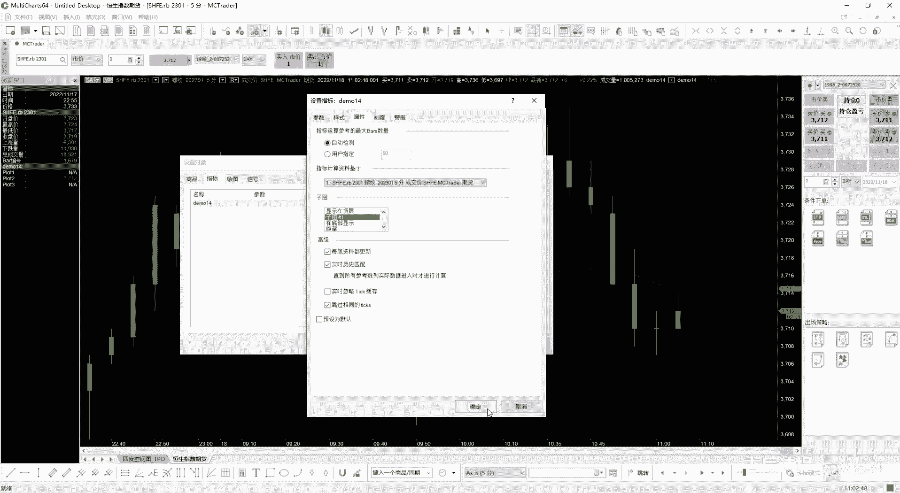

比如我确定一下，然后我进行一下编译啊，我先把这个清空一下，然后我进行一下编译是吧，它就加载了六次。

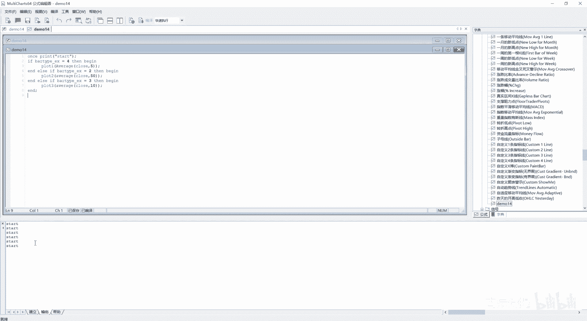

这个其实就是它的一个呃指标，在进行设置的时候，你如果是自动检测的话啊，他会不不断的来尝试他的这个max back，那个max bus back就是他的这个参考罢，它不它会不断的去进行测试啊。

所以说它会加载好多遍啊，会加载好多遍。

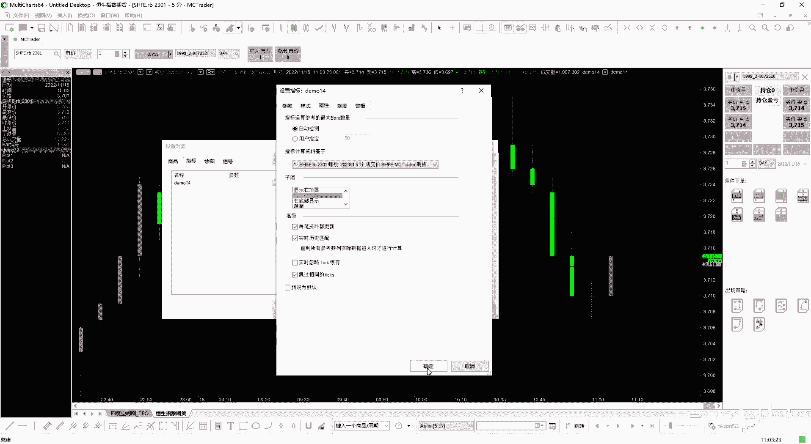

这个是你需要注意的，你在自己测的时候，比如说画个指标，你写了个忘词，如果有这样的疑问的话，它是一个加载代码的时候，它加载了好几遍，因为他得自己来测出来，我用的这个参考八是多少，就符合我这个画图的需求了。

好吧啊，这个是给大家讲的一个注意点，好这是once once，说完之后呢，咱们说sweet case啊，sweet case跟这个if then呢，你想if then if后边是跟着的是布尔表达式。

然后switch case呢，他这个后边跟着的呢，是这个数值表达式或者字符串表达式啊，是数值表达式或者字符串表达式，咱们可以把刚才的你像这个代码改为sweet case写的，我这已经写好了啊。

就不去敲了，我把它给，注释一下，注释一下，然后给它放到这来，像sweet case8type，我可以把它改成EX是吧，EX如果说是啊四的话，然后这咱们呃就是改的五是吧，这个改的十啊啊。

这样的方式其实是跟就是这个代码是一样的，意思就是sweet就是我先查看我的8type，这个ex它的返回值，然后begin end，它是就是一个代码块，然后去如果说它是。

其实这你可以写一个case is是吧，Case is2，然后case is3只，不过因为它显示的是这个大红色的，咱们可以把它省略掉，如果说它获取到的是四，它就会画这个执执行这块代码，如果说是二。

它就会执行这块代码，如果说是三。

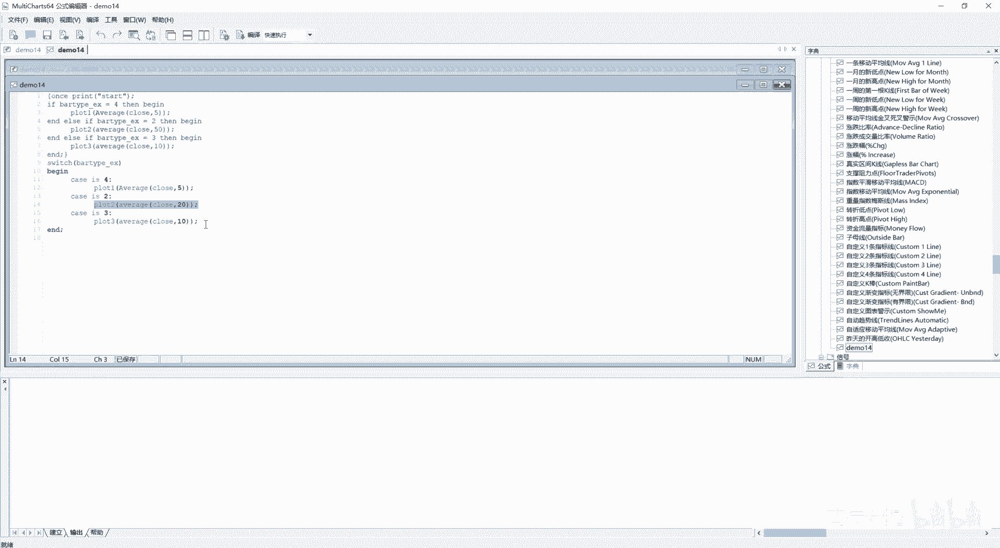

它就会执行这块代码啊，好我进行一下编译，然后咱们同样的去看一下设置这个商品啊，就是如果说把它改成一小时的。

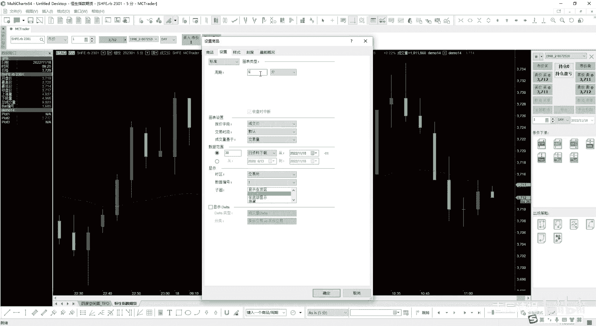

他一样的会去进行变化啊，设置商品如果把它改成一日的是吧，他一样的变化，所以说这是一样的，意思，就是sweet，就是查看里边这个括号里边要么是数值型的，要么是字符串类型的。

然后你cs就是获取到它这里边值是什么，然后对应着它会进行匹配，如果说都匹配不上的话，你还想执行一个代码，其实是可以什么呀，在他后边加上一个default啊，加上一个default。

就是从这儿加上一个default，default冒号，然后我plot一个PLOT4，Applaud4，就是这个average，然后close，然后我这里边写上一个，比如说呃三啊三，是吧，这样也是可以的。

如果说你没有这行代码，我把它给删除掉，就是这个8type ex我满足不了，就是说这个234。

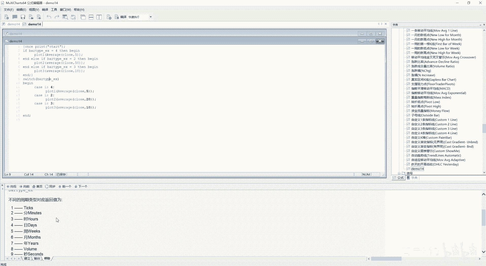

比如说我一我用个周K线啊，我画一个周K线的时候，我编译了吗啊，没有编译的，我进行一下编译啊，然后我画一个周K线，我设置商品画成一周，然后我把他时间拉长一点啊。

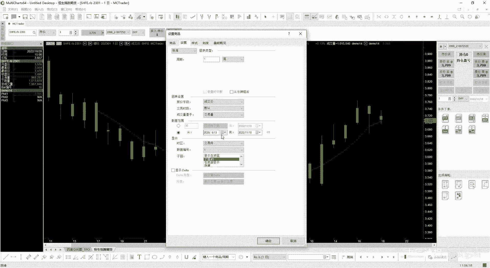

好一周一周他就会不会去画这个K线，对不对，但是呢如果说我把它就是说改成default，就是前面的都没有执行，它会执行default，然后我进行一下编译啊。

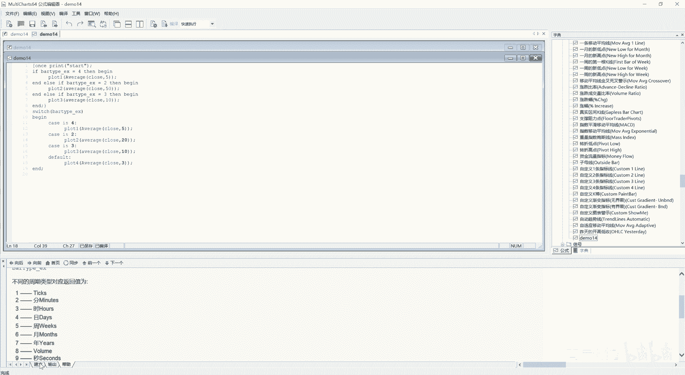

也是编译成功的，然后一周这他就有K线了啊，我设置指标，咱们可以再看一下这个指标的设定，就是这个样式，这你会发现plus4它也是黄线，我给它改成白线吧啊他就会换成白线啊，同样的，如果说我设置商品。

把它设置成这个呃一秒啊，然后把他这个时间设一下啊，别30日了，从这个二零2022年11月，11月就是18号吧。

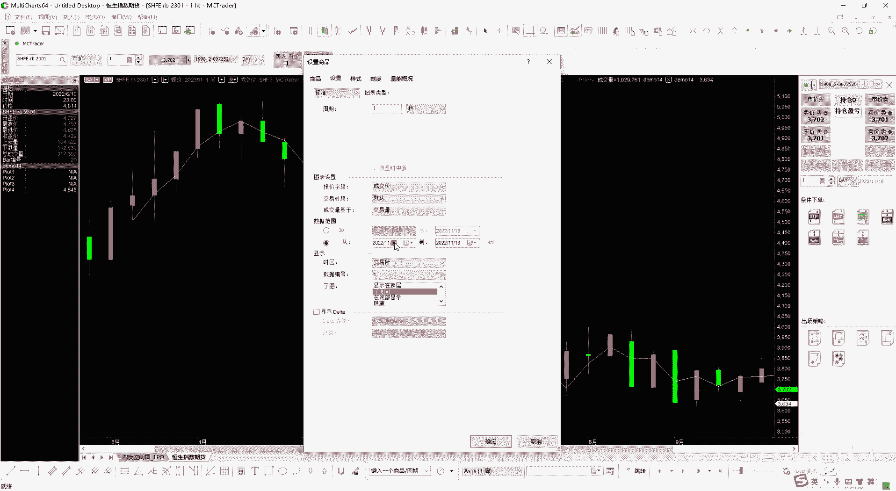

就是一天的吧是吧，这个线也是有的吧。

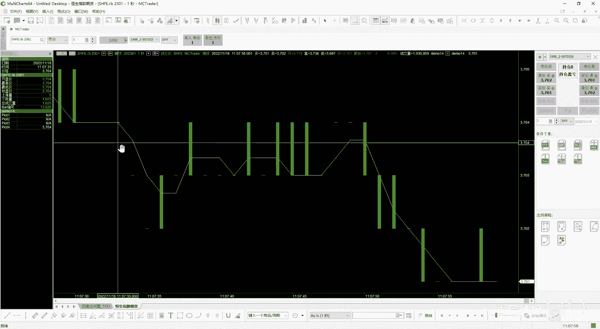

它是白线吧，对不对啊，我再给他设回来啊。

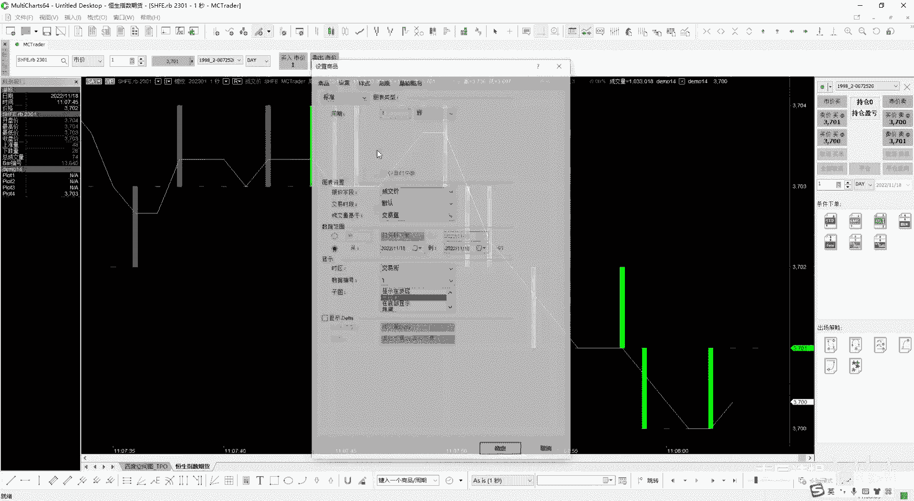

一小时的。

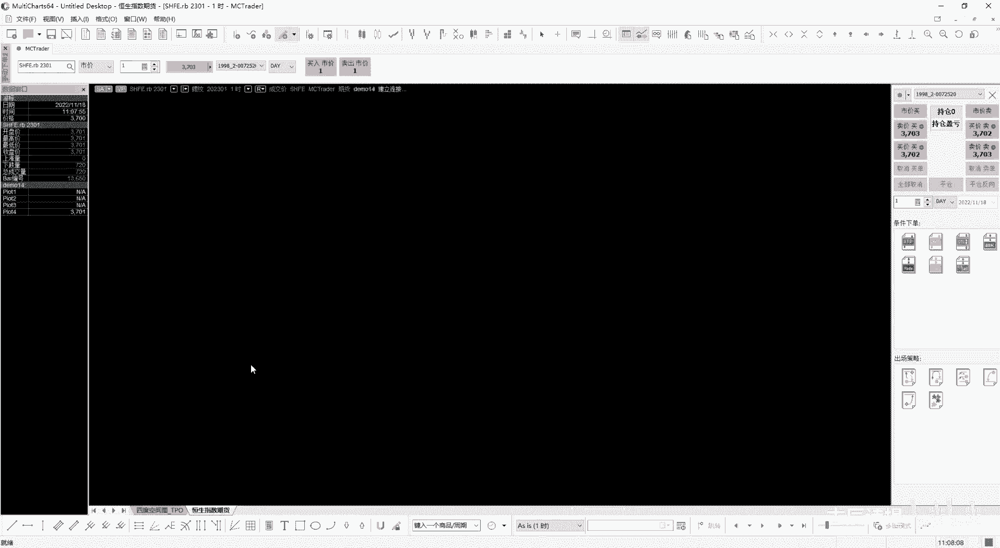

啊这个就是sweet case，然后后边这个default的作用，default的作用，你可以把is给省略掉，但是加上is，咱们会感觉对于咱们的理解来说，会更加顺畅一些，对吧啊，更加顺畅一些。

这是sweet case，当然这个后边儿还有一些注意点啊，就是落落哈，由多个数值或字符串要执行相同的代码，则可以合并在同一个case里边，比如说我它是值是1234啊，我就怎么怎么样是吧。

如果说是连续范围的话，比如说case1to十啊，这样也是可以的，另外case也可以配合逻辑运算符使用，case大于100或者小于多少啊，都是可以的，这个我就不给大家演示了啊，意思是忽略字可以省略。

不写for循环，这个咱们说了，有to和down to这两个起始值和结束值，好吧，这个呃相信很好理解，它其实就是把变量不断的进行复制，然后执行你的这个代码块和begin end进行连用啊。

和begin inner进行联用，还有个while循环，while循环啊，要注意的一点是不能成为死循环，不能成为死循环，这个咱们演示一下，就是Y比如说value1，它小于比如说20。

Then begin，Then begin，就是这个一般都是跟这个就是这个begin，end的联系的啊，呃这个这个一起使用的就是这儿没有end是吧，then呃begin一般写的时候。

你就从这加上一个end就可以了，比如说我print一个就是这个value1吧，呃我把data time就是date这个time也输入出来吧，time啊，然后加上这个空格，Y61等于这个啊。

然后后边加上一个value1的值啊，就是当它小于20的时候啊，我就来输出这个，这样的话你会成为死循环的，因为你Y61你没有复制，它始终是零，它会一直输出，然后它会成死循环，就是没有停止的时候啊。

这你后边一定要加上一个什么呀，value1等于我自增一下V61加上，比如我加上2+1都可以啊，你加上二的话，他就执行大概呃九次是吧，九次啊，还是十次还是十次，咱们就是编译一下看一下啊，然后输。

然后输出是吧，就到18啊，从零啊，二四啊，一直到18对吧，好value value1小于begin啊，它其实就是这个作用，这个是在嗯就是说是在这个指标里边写的是吧，我给他放到信号里边去。

你在指标里边他就执行了一次是吧，然后如果说我给他放到信号里边，它会每一行就是每一个这个什么来的时候，每一个K线来的时候，它都会进行执行好，给他放到这儿进行一下清空，啊他只执行了一次。

不是说那个指标里边他只执行了一次啊，因为你这个K线来第二个K线来的时候，你Y61它还是变成就是20了是吧，如果说我前面加上一个value1等于零啊，这样的话他就会反复去执去执行是吧是吧。

他就会反复来执行啊，因为你第二个K线来的时候，我value1已经等于20了对吧，或者已经等于18了啊，他后边就没法再去执行了啊，你等于18的时候，他只能再执行一次，再输出一次是吧，然后就不行了啊。

这个逻辑你要捋一下啊，逻辑你要捋一下这个逻辑就是while，你注意不要让它成为死循环，一定写Y的时候，你一定要让它有一个出口啊，你像这个value1等于value12，它其实就是一个出口。

你总会加到他不满足这个条件的啊，就是不满足这个条件之后，然后他就会不会执行这里边代码块了啊，他就不会被执行这个代码块了啊，这里边啊其实还可以怎么样呢，就是说比如说我把这个先给注释掉。

就是如果if value1等于等于它会到十吧，Then begin，我输出一下print这个value1达到指定，哎呀这个我就别输入中文了啊，by61等于等于等于20这个括号，然后呢。

我再写一个break，啊在外边我再输出一个value，一等于多少啊，L1好变异啊，不能是两个等于号啊，因为Python里边是两个等于号，就是老是容易写习惯了，if end啊，这边又少了一个end是吧。

哎，好我输出，你看value1就是它会等于20，因为什么呀，就是说，看这Y61等于等于十，它就会中断，break是中断的意思啊，break是中断的意思，为什么后边它就等于20了，因为就是我Y61。

我在就是第一根K线来的时候，它会运行到十就给中断出来了，然后Y61等于十之后呢，就是说他第二个K线来了之后，它又开始运行了对吧，然后从十就变就变到了18，就其实是变到了20嘛，到20他就不再执行。

就是说这个就是说这个这个Y2，Y61小于20了，如果说你把这个value1还是给他value1等于零，每一次K线来的时候，我都给它重新赋个值，就是让它归零啊，你会发现每一次都有了吧是吧。

就是这个Y61等于十啊，value1等于是，就是这个break是让他就是说如果里边有条件判断，可以让他把这个循环终止下来，包括for循环里边也是可以终止的，你就用break就可以了好吧。

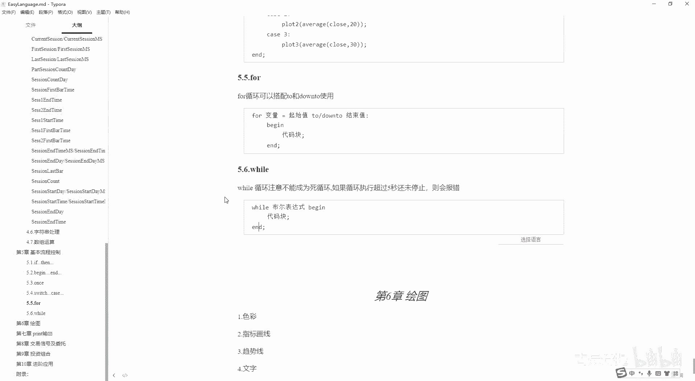