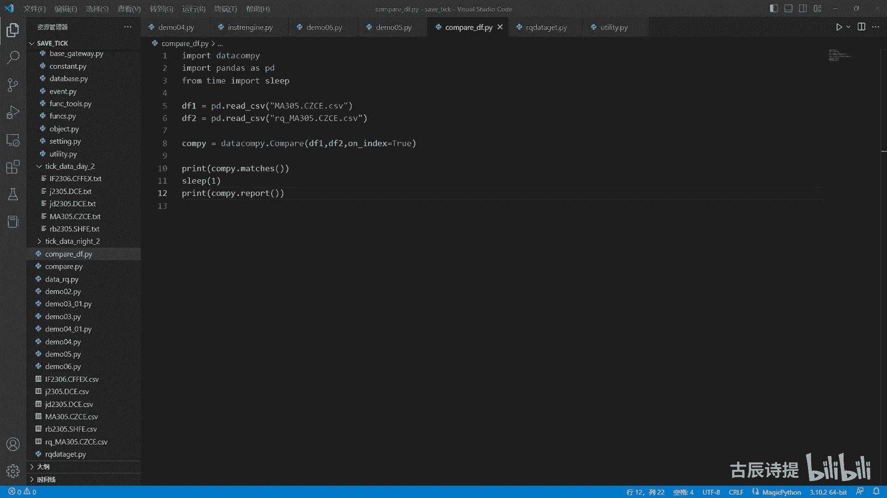
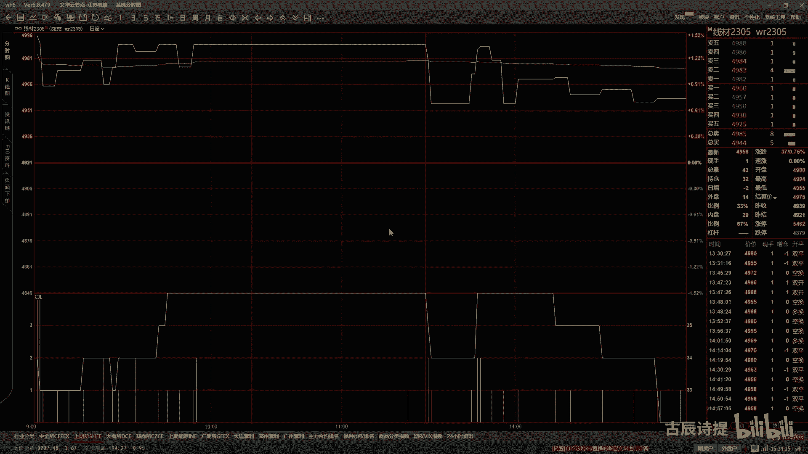
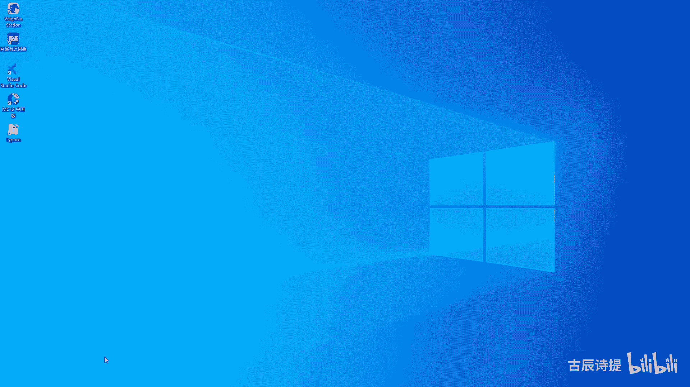
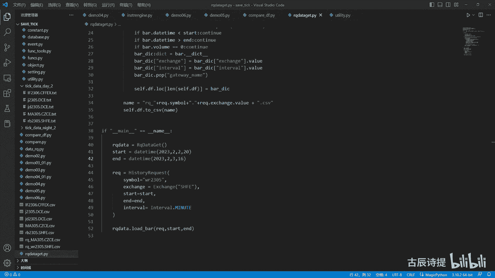
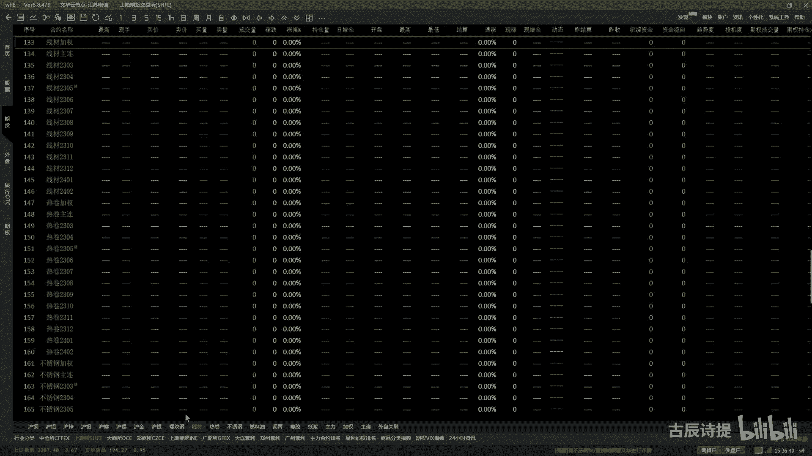
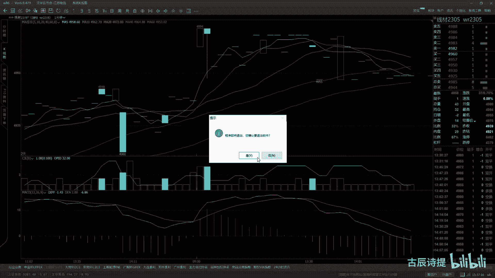
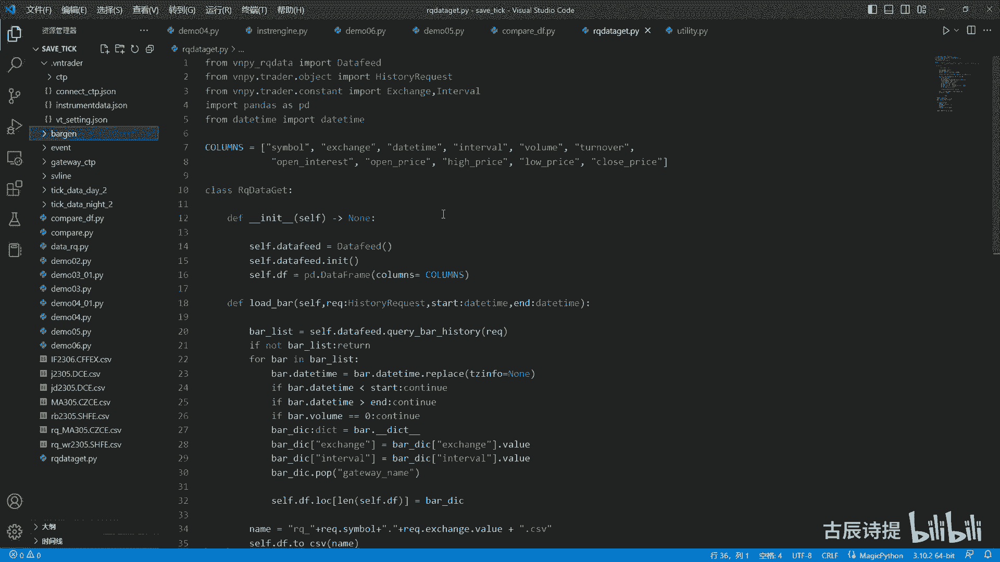
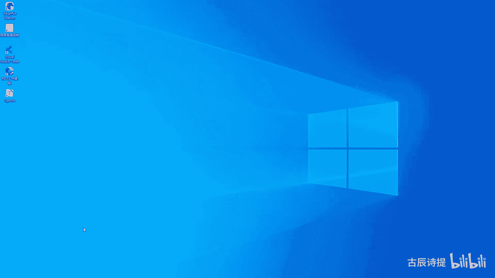
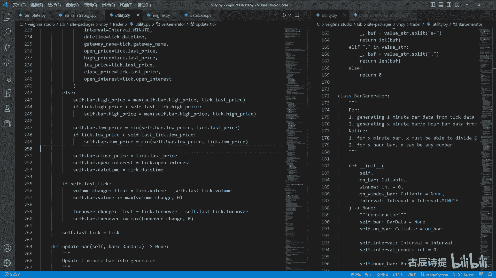

# 第14节课 Bargenerator讲解(3) - P1 - 古辰诗提 - BV1cT421m7Yz

欢迎大家来到从零开始量化系列课程，VMPI课程的第14节课，上节课咱们说就说了，这个过滤里边就是到了这个调整时间节点，这是吧，就是如果说你是在这个时间节点，这个时间节点是指什么呀，就是11：15分是吧。

11：30，然后下午的15点，或者说是你像F啊，还不是非国债品种啊，那些是在15。1刻是吧，或者说是呃，晚盘的这个23点或者一点或者02：30，这个叫时间节点会给他往前调整一分钟啊。

然后再进行UPDTC，到了这儿的这个update tic呢，就是跟这个维纳自带的那个JETA，就是没有什么区别了，里边唯一加的呢是这个过滤没有成交的tick，这里边加了一个双重的一个保险。

就是volume相等，turn over相等，就是没有成交额，也没有成交量啊，我就认为它是一个无效的tick，另另外呢少了一个什么呀，就是那个self点last price，不是那个cf点。

就那个tick点last price那个是吧，还有就是if not last tick那个我都放在前面了，就是就是这个嘛是吧，还有这个对不对啊，这个呢就是一个tick的过滤。

它既解决了就是集结合集合竞价的那一笔tick，还解决了就是中间调整的，就是说那个时间节点的tick啊，不要让它生成，就是说没有必要的，这个K线就是一分钟K线啊，另外还有一个点就是最后一根K线的这个合成。

我没有放在这个里边去自动的让它去合成，其实方法很简单，你如果想把它放到这个8generator这个里边来，你就给它创建一个县城，让县城来计时，或者说你单独的找一个计时器那个包是吧。

然后那个模块然后去计时，如果说这个时间超过了它的结束，就是收盘时间，比如说呃35分钟，你再让他去合成，这个都可以啊，都可以比较方便，另外一个呢就是你如果说想去用这个bug，能去去做这个，比如行情的录制。

你可能一下子就需要接受很多的这个，合约的tick，那这个时候你就必须得生成很多的这个8GOR，是对吧，你得生成很多的这个8G的事，所以你可以在外部给他再加一个这个类。

让那个类来控制着它的这个每一个八级的，这是最后的这个合成，你可以在那个类类里边建一个线程，那个县城就是专门控制最后一笔这个tick，就是最后一根K线的这个合成，这样更加方便一些，当然如果说你在策略里边。

你也可以，就是说自己去手动的去给它去合成对吧，这些都可以啊，都可以，我觉得这就看你自己了，逻辑，我觉得是写代码的一个必要的一个前置条件，为什么讲这么多，就让你知道为什么会有这些问题。

针对这些问题怎么去解决，可能这个里边还会有一些问题，但是你光听你拿到了这个代码，夸夸你就用，但是你不知道他是怎么回事，你以后这个遇到问题你也没办法去解决对吧，好，这个是啊，就是说这个update。

就是确保一分钟的周期的K线的准确性，你一分钟周期的K线准确了，你后边的5分钟，10分钟，15分钟还是一个小时一天的数据，那肯定就准确了，对吧啊，这个啊是需要注意的这么一个点，当然这里边还有很明显的。

就是你需要就是呃填充的地方啊，就比如说我在这个这儿的时候，这个时候就是这个你像这个high price和这个low price，high price和low price。

其实你应该把它改变为tick的这个high price和low price，因为这个只有在第一笔集合竞价的tick的时候，它才会进行去赋值，那集合竞价这个里边有没有high price。

Low price，他肯定有这个值的，说不定里边他在撮合的时候还出，还出现了极值对吧，所以说你应该给他取重新给附上，这里边还需要自己去填充的内容很多，既然你去用做量化了啊，你肯定是需要反复的去琢磨。

考虑数据是所有量化的基础嘛，数据不准确，其实说白的不是说别的都不是很科学对吧，好这个就是ADDITIC，说完了之后呢，咱们可以给大家做一下这个演示，演示之前呢。

咱们再说一下这个instrument data，我个人认为这个还是比较重要的，你最好是自己有一份这个有一份这个之后呢，你完全可以把它用到你的这个策略里面去，比如说举个简单例子，你下午三点收盘。

因为是CTA策略嘛，下午三点的最后一根K线，你自己合成完了之后，肯定有这种偶然的情况，他会满足开仓的条件，这个时候你发送委托显然已经不合适了，你可以用这个作为时间节点来判定。

他如果超过了不在这个发送时间，这就是不在这个时间之内了，就是可发送委托的时间之内了，你是不是就可以把它保存下来对吧，再比如说你这个pad就是这个集合竞价的，这个tick有什么用，集合竞价。

比如说就是刚才最后一笔发送委托的这个呃，委托单，你给他放到比如说开盘的时候去发送，因为你满足条件了嘛，你开盘就应该持仓，你开盘的时候你可不可以就是用这个pad，就是这个集合竞价的即可做一个风向标。

比如说你处于一个上涨的趋势，或者下跌的一个趋势行情里边，因为是趋势性策略，肯定是在趋势里边去进嘛，那很有可能就是说它的这个开盘价，会高开或者低开，是不是是不是就是可以根据逻辑来进行判定。

如果说开盘价低开了，我怎么处理，高开了我怎么处理是吧，然后再根据时间节点，我判断前几个tick是如何去走的，然后我再择时进场，因为如果说趋势里边儿一下子，就是说这个集合竞价就高开很多，那很有可能。

很有可能后边行情就会有一定的回吐，但回吐了之后，你不就是进厂去亏钱嘛是吧，这些都可以，就是其实放在策略里边的啊，就是做这种细微的调整，慢慢的做着这个行业，你会发现，其实在这个行业里边。

你挣钱并不是那么容易的，相对于其他的行业，这个行业你想真正能挣到钱，能达到稳定的收入，付出的努力比别的行业可能还需要更多一些，对吧啊，尤其是心里的煎熬啊，希望大家坚持，另外呢都能挣钱好唉这个说完之后呢。

给大家演示一下，我这边呢还有一个这个demo05，Demo05，我再说一下啊，demo05其实做的呢，就是把demo04稍微的去给他进行了一下，这个改变，改变是改是改变了什么呢。

我先去获取了这个instrument data，就是从这个里面来获取的，把这个时间节点啊，begin more morning first啊，还有这个都给获取上，获取上了之后啊。

就是我是不是就可以对它进行调整了是吧，然后再去生成最后的这个K线啊，这个我也去来运行一下，还是这个同样的MA305呃，在这个两个adjust就是这个utility里边。

这个adjust dt pad和这个adjust这个dd triad呃，都有这个light log就是输出，咱们可以看一下啊，你像正商所它在这个关键的时间节点，它其实是不给发TK的啊。

啊还要给大家看一下，这个在前面是我本地的这个SB啊，这个line就是在在这个里边s v line嘛去导入的啊，好我进行一下合成，ma305也删了是吧，我把这个螺纹也给删掉了，Ma305。

这个应该是demo05，demo05呢，好我从这去运行一下，你看啊，这个是集合竞价的时间调整吧是吧，它只调整了一个集合竞价时间，咱们再看这个题材，最起码你从外部来看，它是从09：00分开始。

然后一直到最后的这个14。59分，没有问题的，对不对，然后中间没有出现，比如说白天的10。15分，当然了，郑商所他也没有10：15分的这个tick过来，包括夜盘的啊，也是到59分对吧，好，咱们再看螺纹。

就是这个呃上期所的啊，好咱们看来就是有没有这个时间节点的调整，你看这个集合竞价肯定是有的诶，你看时间节点是吧，59分，那说明他他发来了两笔，就是说23点的tick，然后呢这个14点也就是15点，10：

15分的时候，他也发了两笔即可，你看他每次都是发两笔即可，就是在关键的时间节点，它会发两笔TK是吧，咱们再看一下螺纹的这个K线，你从这个表面上看啊，它也九点是吧，零零分开始，然后到应该是到10。59分。

他没有这个23点的对吧，从9。00开始，咱们看一下10：15分的啊，他是到10。14，他没有10。15以前是有的，对不对，然后从10：30到11：30呃，他是没有11：30的是吧，从下午的13点啊。

30一直到14：59分是吧，从面上看它是准确的，对不对啊，然后咱们再看一下大上锁的，大上锁的这个里边是焦炭，是焦炭，2305点CZCE啊，好咱们再合成看一下它的这个时间节点呃，没有焦炭，焦炭2305啊。

不是CZCE是这个DCE是吧，DCE啊，哎DCE好，我给它给清空一下，好来进行运行，你看结合集合竞价的时间调整，然后呢呃晚上22：59分进行调整了，然后呢这个14：59分进行调整了，呃。

这个我感觉他最后是在15。06分，有一笔TK，但是应该是在10：15分可能也会有TIK啊，可能也会有tick呃，因为我是当时录制的时候是全市场全行情录的，我摘了几个这个过来。

可能里边是不是由于这个系统波动啊，网络波波动啊，漏掉了一些，就是说这个tick也有这种可能性啊，咱们再看一下这个鸡蛋，鸡蛋也是打上锁的，只不过它没有夜盘，对吧啊，咱们先看一下这个焦炭的这个和这个。

合成情况啊，从这个09：00分晚上，21：00分到晚上的这个，22：59分是吧，没有问题啊，然后到咱们看看，主要是看看10：15分没有，11：30分呃，有吗，11：29分啊，没有11：30分是吧。

然后这个是到下午的59分，对不对，好，咱们再看看鸡蛋，咱们说了半天，就说这个都是夜盘的品种，然后如果说没有夜盘的品种，咱们看一下合成是不是有问题是吧，你看他这个是在10：14分进行调整了呃。

应该是这个焦炭的，这个应该是当时漏了tick了啊，漏了tick了，这个具体的中间体格的准确性，其实就看你的这个tick如何去进行处理了，是不是你这个tick会不会由于网络波动。

或者系统的不稳定性啊什么的，就是少少记录了，这种都有可能好吧，中间的准确性就看你的这个就是系统的情况啊，包括你这个进程的这个情况了啊，因为tick的数据量是比较大的是吧，好像这是调整了三笔。

然后咱们再看一下这个鸡蛋的这个合成情况，然后从九点啊到到这个，下午的14。59分，中间的这个11。29没有，11点半的10。15分，看看有没有是吧，10：15分是没有的，对不对啊。

另外呢咱们再看一下这个IFIF，IF2306吧，这应该是F2306点CFFEX好，咱们再看一下IF的啊，它的时间节点调整也是有的对吧，也是有的好，咱们看一下这个IF的，他是从早上09：30开始的。

对不对，然后中间没有歇，10：15分16都是有的，一直到呃11：29分是吧，然后下午的一点开始对吧，然后到下午的呃14。59分，这个没到15。1刻，那个好像是国债品种才会啊是吧，这个给大家演示了之后呢。

具体中间数据的准确性啊，嗯在这跟大家简单说一下吧，数据的准确性，其实是有一个类是可以进行对比的，就是这个这个compare df，compare df就是这个data compile，应该是这么读吧。

啊要combine就是把这两个二维表格就是pandas，就是把它给读出来，然后实例化一个，直接点compare，然后就on index，就是每个索引都进行对比，然后这边是matches。

就是对比看看有没有它会返回一个，就是就是是不是就是完全一样，true和false，然后呢会给你一个report，就是报告啊，这个肯定对比肯定是有问题的啊，肯定是有问题的，甲醇ma305。

然后咱们生成一个这个rq data，里边这个ma305吧，好吧，ma305甲醇没有IUMA305，那我就不用去生成了，我把这个重命名一下，把它改成大写的A啊，诶给它改成大写的是吧。

这样的话我就是这个data compare，就是MA305进行一个对比，然后先输出这个是否是，就是我从这我sleep一下，sleep1秒钟from，import sl1撇就是给大家看一下啊。

好运行一下force是吧，它中间是有错误的，这个错误啊一般都是漏了这个什么呀，漏了这个啊，这个错误最多的是，这个就是写成小写的这个ma了，是不是写成小写的A了，那我还是把它重新生成一下吧，删除删除。

用这个echo date啊，用大写的A305是吧，好生成一下，好出来了，我C2试一下，然后我在这个compare df好，false还是错误的，因为它有错误的地方，错误的地方，你看啊，主要是这个VM。

咱们看一下这个VN296，295，不是225，226，297和226，这个是什么原因造成的，你再看啊，就是这个225的这个VLOB，加上226的这个VLO，这是表一嘛，你加起来之后你会发现啊。

3+9是12是吧，它尾数是二，你再看这个表二的这两个加起来，那也是二，这两个加起来值肯定是跟这两个是一样的，因为中间肯定是漏了tick了，因为我存储的不是到数据库里面存储的，是在本地。

有可能因为网络波动啊，或者说他打开这个文件的时候，因为你到越到后边文件这个体量越大嘛，他这个tick来的又就是又特别快，特别多，所以说可能是漏了tick了，漏了tick，再加上这个volume呢。

它是一个累计值，对不对，他累计值就是它不会出错，但是中间可能在这个呃，比如说一分钟和一分钟交替的时候，比如说九点啊，零零分到09：01分哎，这个中间有一笔tick，就是这笔tick呢漏了啊漏了。

然后直接从这儿呢就到09：01分的tick了，然后这个比tick漏了呢，就是导致前面的这个volume就少了，后边的这个volume就多了，你再看啊，这个二五，这个是4459，你看这是4472。

很明显是少了啊，13是吧，少了13笔，然后这边呢4783，4770给他算到后边去了对吧，能理解这个意思吗，所以说你要是T可要想准确的话，还是往数据库里面去放好吧，后边的呢这个啊对。

还有个turn over的问题啊，turn over的问题，这个turn over咱们一会再说啊，这个open interest的持仓量也也是这么回事，肯定是哪漏了，tick了啊。

漏了tick也会导致这个open price嘛，就是它不一样是吧啊，这个你想错误就很少了很少了，呃这个volume咱们还要说一下，在demo05这呢，我这个volume给他在这个on bar的时候。

就是调用这个on bar的时候呃，在这个utility里边，最终是就是合成完了之后，它会调用这个own b在弄ARTARDTC啊，这啊这这呢我把这个cf点八点turn over。

等于cf点八点turn over乘以cf点instrument size，什么意思呢，就是它的成交额我给成了一个，比如说甲醇它是一手是10吨，然后我就给他乘以了十啊，乘以个十，为什么会这样啊。

咱们可以看一下，就说螺纹啊，咱们先看看螺纹，就是咱们随便找一个啊，这个他的这个volume啊，这个town over是513736210，咱们把把计算器给打开，5137不是计算器。

turn over是5153173621053，1736210210，除以它的这个volume是1312513125，等于多少啊，等于是4万513是吧，4万513，这个时候我出一个十，等于是4051。

你看他的这个last last price是4052，基本上跟这个拉就是这个价格对上了嘛，对不对，他是我除以了一个十对吧，好咱们再看甲醇的甲醇，咱们往后翻一翻啊，甲醇我找到一笔提卡，好从这。

然后我再把哎呀，怎么把计算机给关了，计算器啊，他的这个volume比较大啊，就是他的这个turn over是14001400诶，14004626046260÷1个。

它的这个volume是536930536930，等于这是哎呀，也不对了是吧，怎么成260了，就是1440046260，除以536930536930，等于26822682。

跟他这个last price是不是就就贴近了，这个甲醇是一手是10吨吧，它就没有除以十是吧，然后我从这儿呢给他给乘上了啊，乘上了好吧，可能还有一些其他的点没说到啊，但是我个人认为就是呃基本上就差不多了。

基本上就差不多了，后面就看你网络稳不稳定啊，然后这个系系统是不是就是说给力啊，好吧，只要你不漏接TK，我相信就是你合成的K线是一样的，是是会比较标准的，这样能最大限度减少你的。

这个就是说这个你指标的这个错误是吧，指标的就是能提升你指标的准确性，就算咱们刚才如果说有漏了这个tick的话，low就是有这么一点差异，我相信对整体的影响也不会很大啊，也不会很大，他不会跟之前似的。

你多了K线了啊，还是多了，这个还是这个开盘价不一样吧，另外还有一点是需要注意的啊，对于这种成交不活跃的品种啊，这个aq data它会给你，就是弄一堆一样的数据出来，比如说咱们用这个WRWR是线材吧。

应该是就是这个WR就是成交很不活跃的。

这个咱们看一下啊，找一个就是上期所的这个呃线材，线材是这个WRWR22305，它挺挺不活跃的是吧，挺不活跃的。

那挺不活跃的，咱们用这个echo data去给它去获取出来啊。

用aq data这个数据去给它获取出来啊，W r，啊WR这个2305，然后是SHFE，SHFE好运行，好有了咱们就从这看这个WR他成交不活跃，你像这个VTOL都有可能是零。

你看他这个每一分钟都是有的有数据的，但是它这个数据啊前面都是一模一样的是吧，呃咱们从这个咱们自己合成的这个K线啊，他不会这样，就是你只有就是说有有了有效即可，它才能去合成K线。

所以说呢你从这个的就是这个get，这呢你最好是加上什么呀，就是说如果说是成交量为零的话，就是这样的tick，不是这样的K线，我不要就是1if8点volume等于零等于零，Count6。

就是这样的K线我不要啊，就这样的K线我不要，这个时候我再生成，就是这个WR这个数据啊，再运行一下，好一它就有了吧，它数据中间会缺失很多，但是这些都是有效的，这个K线为什么提这一点啊。

就是你肯定会拿你自己录啊，记录的数据会跟这个就是说这个米框的数据，或者数据服务上的数据去做对比，你想用这个类很方便是吧，你做对比的时候，你这样就会产生问题，第二个呢你得注意。

就是说一般的三方平台和这个包括MC啊，包括你像文华呀，就是他的这个K线啊，他都不是实实在在的，就是说这个就是说你没有了，我就是给他弄成一样的，不是这么回事儿，咱们刚才就是看的这个线这个线材啊。

我再把这个文化的这个打开，他的这个数据呢是就是说是是就是跳跃性的。

如果说你这个一分钟之内你都没有成交的话，它就不形成K线了。

比如说咱们把它换成一分钟K线，你会发现你要从这儿，你看他下面的时间节点是什么呀，14：01分到14：14分是吧，下面这个是14：14分到14：19分啊，你看他每个跳跃时间都特别长，它必须得有成交量。

你看左边它的成交量是一是吧，它必须得有成交量，它才能算的对吧，成交量都是一成交量二啊，这一点是需要注意的，所以说你如果说你从这个文化上来看，然后你画的线从哪进场，但是你的数据不准确的话。

你的数据不准确，唉他进场就会不一样，对吧啊，这一点是需要注意的，为什么跟大家提这一点啊，就是因为这个因为你加载了，你在文化上看了半天，或者用指标对了半天，然后你加载了这个EQD。

结果里边有很多无效的数据，那就是它就会有差异嘛，对吧好，那这个呢就给大家说到这儿，我希望大家好好的去琢磨一下这个研究一下，因为这个数据的准确性，代表着你的策略的一个准确性。

是不是咱们还没有说完的呢，是这个八八减流。

它后边的这个东西啊，后边还有一部分是吧，哎这个8G的，这是这个template，是从这儿给这啊，八九没事，咱们说到了这个update tic，其实后边就是update bar。

其实就是合成非一分钟的数据啊，合成这个非一分钟的数据可以是多分钟呢，也可以是多小时的，但是这里边没有日线的啊，日线你需要自己去合成，这个还要提一点日线的数据呢，其实你如果去记录的话，你不用去记录。

用这个分数线来合成它，其实你像咱们之前说过这个tik data，这data里面有最高价，最低价，收盘价，开盘价其实有了这些，再加上成交量和持仓量，还有成交额是累计的，其实你接收最后一笔。

他就是这个日线的这个整体的，这个情况就都有了，对吧啊提嘴，然后update bar呢到这儿来呢，它是update bar minute window和update bar our window。

就是分成了这两个，它是根据这个interval来进行分的，如果你是minute，你是要合成的是多分钟的K线，如果说你是FEMINUTE，他就认为你是合成了一个小时或者N个小时的，这K线不支持日线合成啊。

日线合成你自己去写，就或者看我之前那个B站上那个免费的，那个那个那个K线合成课，把这个呃日线啊，10分钟的，包括里边有哪些问题都给大家说了，说了很多好吧，然后这个update啊。

bin window他做了哪些呢，就是你要去合成这个update啊，就是你合成X分钟或者x hour，你肯定得在这个TR呃，得在这个on bar里边去，就是呃就是不是这个M了啊。

是这个就是这个cf点BG点update bar是吧，把这个把线给这个给这个update bar给他传过去，他才能取合成多分钟的或者多小时的K线，你必你必须得从这传过去。

因为你不然的话他就没有发现了是吧啊，这个这个拔线过来了，他是一分钟的拔线，然后呢他会去啊，其实跟update那个tick差不多，如果说你没有cf点window bar。

这个cf点window bar其实跟那个cf点八是类似的，cf点八是记录一分钟的，这个cf点window bar是记录的非一分钟的，然后cf点windows8等于把data先给你。

把这些先不先给附上值是吧，如果说你有了这个cf点windows吧，他过来就给你把这个最高价啊，还有这个最低价给你重新计算一下，是不是，然后呢再把这个close price volume自增一下。

然后turn over自增一下，然后把这个open interest给你，就是等于一下这一点，这一块呢是它的一个关键，关键在哪呢，就是它哈，if not这个加一就是八点。

the time点minute加一，这个是什么，取模就是取余数cf点window，咱们之前说过啊，就是你如果说想合成X分钟或者x hour，咱们这先说X分钟吧。

你这window肯定得写上一个值得赋一个值，它默认是零，如果说你这没赋值的话，他这边取模肯定会报错的对吧，因为取模你先得拿前面这个除以后边这个，然后再得到余数，你初一的话肯定会报错，对不对啊。

所以说取模这一块你一定要知道，就是说你要合成X分钟，你这一定要给它赋值，比如说你负乘34×5能被60整除的，这个没有问题，这为什么会有个加一呢，因为它是前计时，你9。14分，就代表着09：14分到09：

15分之前的是吧，其实是9。15分，已经是09：14分到09：15分嘛，就是就是其实他已经走完了，对不对啊，其实他已经走完了，所以说他得加一个一，因为是前进时，not就是当它的这个余数不为零的时候是吧。

因为零是否啊，对不对，双重否定等于肯定啊，所以说他这个余数为零的时候啊，为零的时候，这个意思就是余数为零的时候是吧，就是只有是零是否定的，加上前面这个not不就双重否定了吗，然后用这个可回调的这个对象。

然后去回调这个self点window吧，其实就是把这个让你事先给他传进去的，这个con window bar进行就是调用嘛，就是一般情况下，你在这个比如说咱们找一个啊这个mt啊。

这个这你看啊他是两个这个8G的这事吧对吧，两个remain键，然后它肯定是five minute8，你肯定得把这个on five mini8给它给放进去是吧，放到这个on window8这给传进去。

然后把它那个window设成五对吧，这个就是合成X分钟，为什么说呃，你像他这个上面的这个说法是啊，必须啊，必须must be able to divide，60就是能被就是能就是60能被它整除的。

这个为什么呢，你想想啊，如果说你是取了一个13啊，比如说你取了个十十三，你在13分钟的时候会合成一个，就是就是一根K线嘛是吧，然后你到26分钟的时候啊，当然你得减一啊，应该是在12分钟的时候。

那个计时器在12，就是这这个b but这个哪个did time，点minute等于12的时候，然后后边是25，对不对，然后呢下一个是什么呀，37吧对吧，然后哎不是37，是38是吧，是38。

然后再下一个呢加上13是52吧，对不对，你加一能够哎不对啊，五十一五十三十三十八加13是51是吧，51的时候它会合成四个人了吧，然后你再下一个，你按说后边加个13分钟，你不应该是到64嘛。

但是他没有64是吧，他后边这个minute它又会变成从零开始，等到再到13的时候才能合成一根K线，所以说你这根K线啊，51分钟，这根K线你就等于是9分钟加上13分钟了，就22分钟对吧。

所以说是有问题的啊，所以说你一定要让X能够被它就是整除，被那个60整除好吧，这个是啊，这个bin the window，然后咱们再看这个update by our window。

就简单说一下一这个是一样的啊，一样的，就是他把这个呃minute，因为你小时候你就不需要minute了嘛，然后先去啊合成啊，如果说if not self点，就是our bar，先给他初始。

就是给他先把这个sour bar先附上一个88data，然后就被蹭了对吧，如果说你是合成的啊，飞啊就是一小时的，然后他第二个小时过来的时候，这个finite bar是none，对不对。

然后呢他看这个八点did time，点minute等于59分啊，等于59分的时候就是八点take time啊，点mint等于59分的时候哎，然后他去去更新一下它的最大值最小值啊。

然后它就是一样的去更新啊，去去更新它对吧，然后这个air if诶，如果说这个hour不等于这个hour了，哎这个finish bar就等于这个self点our了，这个self点our是指呃一小时啊。

一小时就等于这个要改our了啊，就等于了啊，然后呢，这个cf点our bar呢又等于新的这个bar data，又重新给付给付了值了对吧，然后就是else如果说这个就是就是在中间的时候。

中间的这个分数线来了之后，他会给他去更新它的这个最大值最小值是吧，最后呢如果说一啊就是这个一小时线合成了，他就去调用，就是下面这个啊，这个呢是合成一小时的线啊，一小时的线这个到这来啊。

他如果说cf点window等于一，如果它是合成一小时的，就直接进行调用了吧对吧，on window直接进行调了吧，如果不是合成一呃，就是这个一小时的，他会用cf点window8。

先把这个写这个一小时的先记录下来啊，然后呢如果呃就是已经有了这个C点window8，他会给他进行一遍更新，对啊对吧，更新完了之后呢，他这有个技术就是计数计数器，就是你来一小时我就加一，来一小时我就加一。

然后等到能够被整除的时候，就是取模于零的时候，就是能被整除的时候呢，我把它归零，然后再用这个cf点window8，然后进行调用，这个就是一个累加嘛对吧，就是进行一个累加嘛，这个很容易理解啊。

很容易理解好，那咱们这个八经追上呢，就算讲完了，其实按说八景之上应该是好好讲一遍的，就是包括刚才给大家演示的这些呢，都是我事先写好了的，如果你对这个还是不是很了解的话呢，我会把这个就是把简历上。

这个专题呢放到这个哔哩哔哩上，这个免费的课程里面，大家可以去仔细的去看一遍，包括这个代码啊，是是怎么写的呀什么的，去仔细的去看一遍啊，然后呢也可以去参照，如果说是你是刚入门或者刚开始，你可以去看。

我之前就是第一套，那个时候版本还是二点几的时候，那那里边讲这个8G了，没事你去仔细看一下那个八角的事，会解决你很多的日线的合成啊，55分钟K线为什么会缺一根啊什么的，就是那里边都有啊。

另外一个还要讲的一个点呃，给大家讲到了嘛，就是还要提一下的一个就是在这个，啊就是在这个update里面，update里面，这这应该给大家讲过了是吧，给大家讲过了，一定要理解，这个可能很多人。

包括我一开始看的时候都不是很理解呃，就是防止有这个更高的或者更低的价格出现，当你出现了之后，肯定是在这根K线里边去出现的啊，好吧好。

