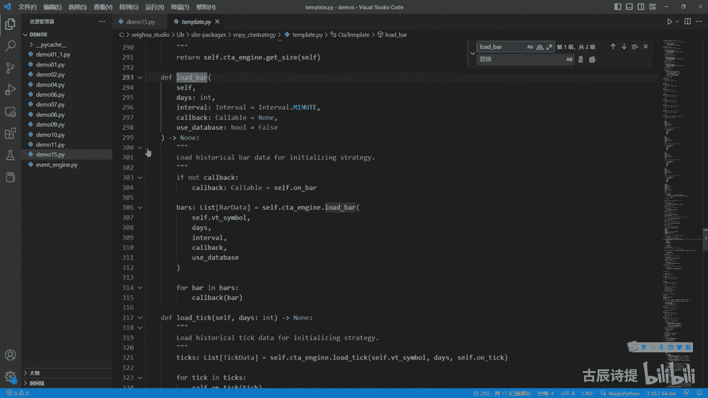
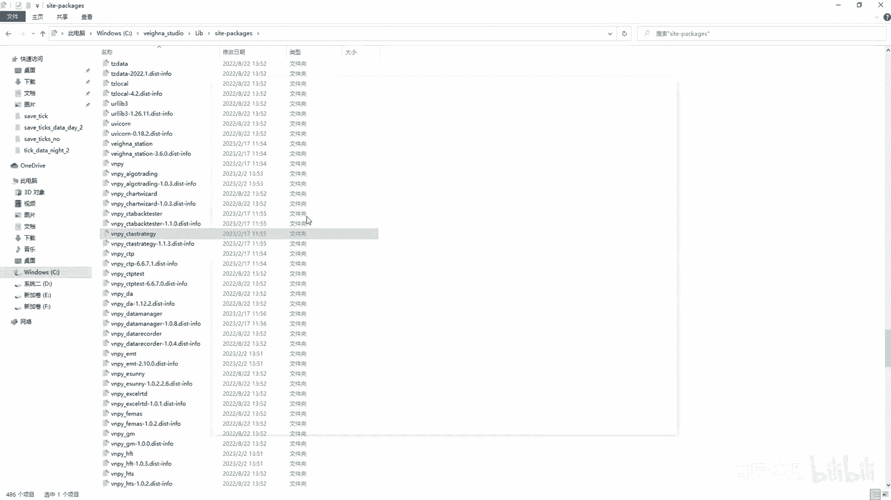
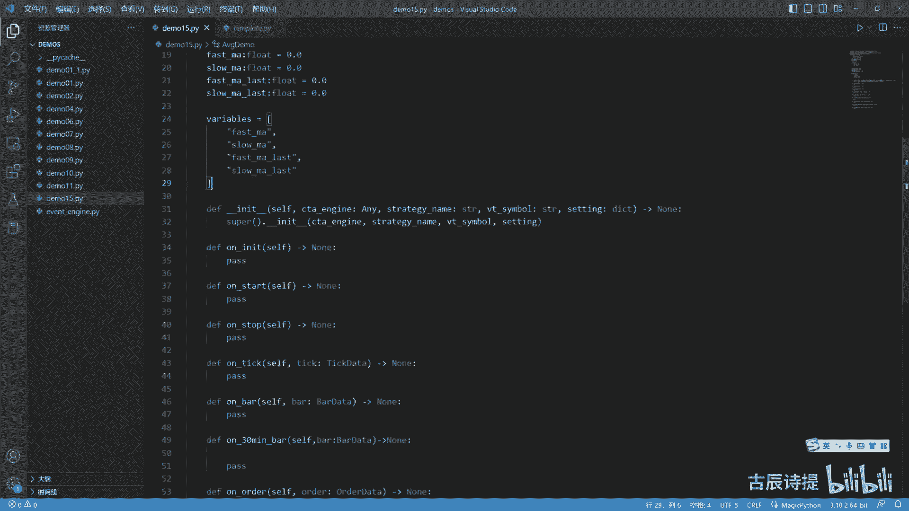
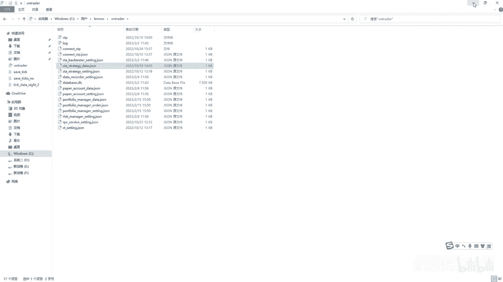
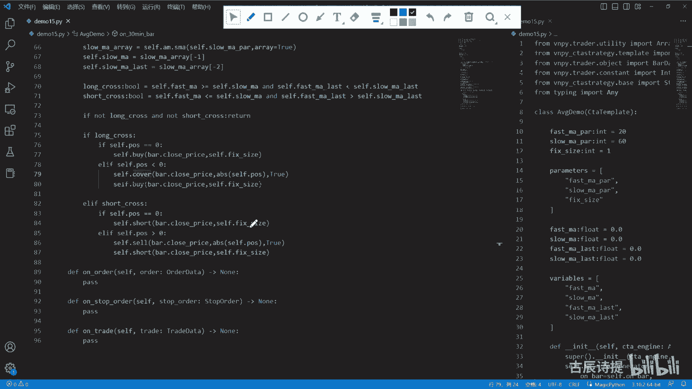

# 第15节课 ArrayManager讲解和策略演示 - P1 - 古辰诗提 - BV17Z421Y7Vv

欢迎大家来到从零开始量化系列课程，VMPI课程的第15节课之前，咱们讲这个把简单的事如何取合成K线，这个很重要啊，因为把简单的事是决定你数据准不准确的，一个很关键的一个步骤呃，就包括你有三方数据的话。

你在实时去合成K线的时候，它的准确性也会影响到你的策略，数据不准确，那其他的其实都是有瑕疵的，那讲了8GLOOR，后边必须得讲的是这个REMANAGE，他的呃，他所在的地方呢。

还是和8G在一个点PY文件里边，还是在from VP点trader点utility啊，这个里面import array manager，Array manager，它是个什么东西呢。

咱们可以先看一下他的这个源码啊，而manager呢，你从这个你首先你得理解他是来干什么的，他其实你可以把它理解为叫K线的容器，就是把这个K线的数值啊，存放在一个一个的这个小格子里边。

然后这个格子呢可以进行计算，比如说我这存放了100，可是这个K线他要在进行计算的时候，比如说我计算30根K线呃，这个K线的这个均值，那它就会找这个30根K线，然后去计算它的均值呃，也可以你去指定它的。

是用比如收盘价计算还是开盘价计算，这些都是可以的，当然具体的计算呢它放到了这个呃，这个ta lib这个模块里面，ta lib呢它是一个传统的金融库，就是具体的呢，它其实还是通过这个底层的C加加。

来进行计算的，呃，这个ta lip这个Python库，是从这个C加加库里边去给他转移过来的，其实就是给它加了个Python的外壳里边呃，ta lib好像八九十年代就有了，他这里边收集到的这种金融数据。

金融指标很完备嗯，所以说就用这个贴力本去进行计算，这个array manager呢，其实是给ta lib计算提供了一个基础性的，就是数据，另外呢它呃就是还可以做数据的更迭。

因为你这个随着K线的不断的去更新啊，比如说呃这个是零，这个是最新的一啊，就是这个是最新的价格，这个是最旧的价格对吧，你当你有这个新的K线来了之后，你是不是得给他挪一下啊，挪一下啊，这也得挪啊。

然后把这个最后一个数据最旧的数据给抛掉，然后把最新的数据这个空格腾给，就是说通过8-2是合成的那根K线存放进来，然后再进行重新一遍计算，这个就是数据的更迭嘛，迭代嘛对吧，呃它得有这两个功能。

第一个就是它能存储啊，第二个就是它能更迭，至于最终的计算，它是交给了这个ta lib这个库，有兴趣的可以去研究一下ta lib这个库啊，当然在RAMANAGER里边，他已经把咱们常用的，比如MACD啊。

布林带啊什么的，T2啊啊都已经给咱们去实现了，好那咱们就具体来看一下这个代码，首先啊这个REMANAGER它继承自object object，就是所有类的超类啊，然后初始化size。

这个是规定你这个存放的数据的，这个有多少有有多长啊，就是你可以就是100个格子还是1000个格子，这默认是100个，这儿呢就需要注意了，如果说比如说你用小周期做这种呃，你用小的周期来做比较长的这种操作。

或者CT跟随，比如说你用一分钟的，你肯定得涉及到，比如说200根一分钟的均线是吧，你要这样的，你这个size是得调整的，不然他计算不出来，你说总共这个格子的长度是100，你想取200个数据。

那是取不出来的，这一点需要注意啊，这个是C点count size init，这个呢咱们先不看呃，看一下这个里边儿啊，这个是比较关键的，这几个这里边是单独去存放的这种呃数据。

你像这个open arrive这个NPNPI其实是矩阵嘛，这个NDAY是其实是里边最基啊，最重要的一个数据类型，这个有兴趣的可以去学一下这个NPY和pandas，当然你平时也得多用啊。

你就可以把它理解为就是你想他这种的方式，这个zero one这个里边是赋值的，就是初始值都是零啊，初始值都是零，这个它其实你可以把它直观理解为，就是呃就类似于一个列表，一个列表就当它是一维的数据嘛。

一维的数据就是一个列表嗯，也不能去说它是一维的数据啊，就是呃NDY这个数据类型好吧，它是一维的列表啊，就是你可以这么去理解它，然后它分别open rhydr，就是这个你的这个八线里边。

比较重要的这几个数据类型，它都给你创建了这样的，这个NDY的这种数据类型呃，他的这个操作其实和这个list表示挺像的，包括他后边也可以去取索引啊，取索引这个南派这块咱们就不多讲了，你就可以理解为啊。

就是咱们刚才画图的那样，就是存储在底层底层，它是连续性的这种存储呃，update bar这个update bar呢是这个array manager里面的，其实他是来更新K线，就是咱们刚才说的。

你需要把K线不断的进行更新，然后再去进行计算是吧，这个呢是可能是比较绕的这个代码啊，比较绕的这个代码，这部代码是来做什么的，其实就是来挪格子挪格子理解一下啊，理解一下。

比如说这个就是这个open right是吧，open r他这个一是哪，比如说这是零啊，这个代表是一，这代表的是最新的值啊，这个代表的是最旧的值，你看啊他呃包左不包右，就是就是中括号。

咱们在列表里边它有一个规则，就是包左边不包右边啊，在这儿也是一样的，一它是包含不到的对吧，包含不到的啊，包含不到，那其实就是到二嘛，对不对，到二就是-2~0这块啊，-2~0这块等于等于什么呀。

就是道就是一，其实就是就是包左嘛，左这就这边是一嘛，一到这块就是这对不对，然后之前这个呢是代表着这，是吧，就是它是什么呢，就是倒一这一块就是这个啊，这段的格子等于下面这一段，是不是。

其实就是整个的往左移了一截，就是空出了第一个格子出来是吧，第一个格子出来吧，咱们可以演示一下啊，比如说我有个list等于这个呃，我for range吧，For i in a。

For i in range，100，print一个，print一个UST，这就是0~99这个数是吧，我现在要把零给剃掉，然后把100放到99后边，在这个里边。

你取的这个list0是不是是不是他的第一个元素，然后取得list呃，就是说这个99它是不是最后一个元素，是不是，那这个时候我怎么替换掉呢，比如list诶，我就是他的。

就是说我必须把它的就是说到98这个空格，就是也就是比上啊，包左包左，左边是包括的，不包右就是右边我如果填98的话，他就到不了，是不是，然后我到99，我等于等于什么呀，是不是啊，那一比上我后边我就不写了。

因为你不写的话，就是能把最后一个数给给包含是吧，给包含，这就是整个的往里边去挪了一位，然后呢把他的这个就是最后的这个99，就是这位就是一嘛，一这位给空出来了，然后我LST然后一我等于100啊。

这个时候我再print一下这个LST，咱们可以看一下是不是就是1~100了，你像这个九这个99，咱们是可是是不是可以把它改成一，对不对，因为你在就是这个基础里边，你像这个是最新的这个数，它其实是一吗。

是不是就怕咱们不知道这个列表的长度吗，就可以直接用一来取他的，就是说最新的这个数嘛，是吧啊，是一样的啊，咱们再来运行一下，还是100是吧，它其实就是把这个一个其实就可以，你可以把它理解为叫迭代啊。

最重要的可能最不好理解的也是这块代码啊，你像这update bar就是进来一根K线，它就cf点com加一啊，如果说呃他还没有unit，一般都是初始化的意思吗，如果还没有初始化。

and cf点com大于了，就是他进来的这个K线的这个数，比这个你的这个cf点size，就是你的这个格子要多了，然后就变成true，就是其实你的格子已经都装满了，是不是后边的就是迭代了。

那一开始就是空着的时候，你肯定得往里面装啊，当然它本质上也不是空着的，里面存放的是零啊，就是你都把里面装满了之后，是不是就可以进行迭代了，对不对啊，像后边是把这个最新值进行赋值嘛，是吧啊。

其实啊就是不好理解的代码就是这些，所以说你在这个你写策略的时候，一定要看这个格子满没满啊，包括这个CCTA这个template里边，他去一开始就是在load data的时候。

咱们也看一下这个c t a template，from v m p y点啊，C t a strange detemplate，Import ccta template。

在这个city template里边，他首先去做，它有一个什么呀，就是load data，Load load bar，这个load bar咱们在实盘里边的时候，你像他的这个策略呃。

我还是打开一下他的这个C盘呃，这个venus studio，然后lib site package，然后在里边找这个VNPY开头的，然后找这个c t a strange，这个里边咱们还是打开看一下。

就是看他的这个策略啊，比如这个第一个策略嘛，他在里边你想on init里边啊，他这个low的b load bar，其实就是调用的c t template里边这个load bar嘛。

这个load bar其实最主要的作用是什么呀，其实就是为了填充你的这个初始的这个array manager，把它给填充进去，为什么要填充它呢，就是你肯定就是你在你实盘策略开始的时候。

你接收的会是实盘的tick吗，然后把tick合成K线，那你一开始这个REMANAGER里边你得有数据啊，你没有数据，你得等它填满了，你才能去进行计算，是不是啊，所以说这个你得理解它啊。

首先得把数据给存满了，然后才能进行计算，它其实就是数据的一个准备，不然里边你不用都是零，你有一个零对你的这个也会产生很大的影响，所以说你必须就是在每回去进行，就是判定的时候啊。

就这啊他这里边会有就是在这个on在on bar，这必须得有，就是说if not a m init，就是return，就是如果说你这个manager还没有满，你就直接return吧。

嗯你不return的话，你下面这个也会出现问题是吧，你你下面策略也会，就是你在计算的时候也会出现问题，因为里边有有这个零值啊，会造成很大的影响啊，这个就是manager最主要的这么一个作用啊。

咱们再看一下后边还有什么需要讲的，后边就没有了这个啊，这个用这个来装饰的，它是是表示什么呀，是表示一个静态方法，静态方法就是它和这个你在调用的时候，它和这个变量的调用比较类似，什么意思呢。

就是比如说我在REMANAGEA等于array manage a，222，We manage，这是一个类这个类，比如说我调用里边的这个方法啊，他的这个方法有哪些呢，比如SA看一下啊。

SMA它是黄色的吧对吧，它是黄色的，但是你调用一样的，这个它也用DEF来定义的这个方法，比如A点volume，它是蓝色的吧，就跟你调用一个变量是类似的啊，它就这个作用，它以至于它有什么好处。

其实它就是可以像变量一样来调用方法啊，当然它有它的这个呃一些就是限定啊，只能这个里边没有代码，然后只能是return一个什么东西啊，或者你在return里面做一些操作也是可以的，但是只能是一行代码。

后边呢就是一些指标的运算啊，比如MOMPPOROC啊，这些就不用去讲了，他用的都是这个TLIB这个库啊，ta lib这个库有兴趣的话，可以去仔细去研究一下这个ta lib，包括CCIATR是吧。

呃当然这里边有一个array，array是数组的意思，array是数组的意思啊，array等于force是什么意思呢，它会返回最新的这个计算值，这个是什么意思啊，这个嗯都会接触到的啊。

就是你在计算的时候，比如说我有100个格子，然后呢你计算的是30根均线，那30根均线，比如说这个是最新值是吧，是一，然后比如说这边是-29哎，-29还是-32，就是这满足了30根K线。

那它就会计算出一个result，然后呢往前挪一格，再往这儿，比如说是-31，它又30根，它就会有个R2对，然后呢你一直到这个就是零这块，他可能会给你计算出来30啊，不是70或70一个值，是不是这个呢。

他如果说你ARA等于true的话，它会给你都返回出来，它就会返回一个数组回来，如果说你ARA等于force，它会把这个数组里边就是最新值，就是你计算出来这个I1给你这个有什么用，这个很有用。

就是你在计算，比如说咱们均线的时候啊，比如这两个均线就是交叉，你就开仓交叉，这个你必须得判定当前这根K线，比如这是当前K线，这是支这这这之前的这个K线，这个你的这个A1和A2，就是你当前K线的时候。

你的AE必须大于二，但是这个不代表它呃就是进行交叉了，它交叉的必要条件是什么呀，你前面一根你的这个L1要小于L2，这个才叫交叉，才叫穿越，对不对，所以说你得获取到当前的这个这个，L1和L2的值。

还得获取它，要就是他们前一根的这个L1和L2的值，然后再进行去比较，这个时候你array就应该等于true了，对吧啊，这个是需要注意的点，别的呢呃也没有什么啦，就是这个里边一般传入的参数啊。

这个N就是你需要的这个数值，一般30日均线就呃不是30根均线啊，你就传30array呢，你就写false也行，true也行，根据你的需要，根据你的需要呃，后边如果说你有时候想改一下，比如说我这个T2啊。

E t r，我DFATR啊，比如说这个ATR咱们用的也是比较多，AT2就是average tange是吧，average chrange嘛，就是他的这个呃真实的这个差值，你像他后边传就传的参数。

咱们比较熟的这样的就是这个指标，Served high，SERFLOW和safa clothes，其实它是什么意思呢，就是high就是用最高价和最低价，然后呢还有这个收盘价。

其实在every chrange里边，这个收盘价一般是只跟前一天的收盘价进行，对比是吧，但是呢如果说你想改变一些，比如说我这个hi，我不用这个它的最高价，我用它是K线最实在的那个最高价啊。

最实的那个最高价，就比如说本来这个true range它应该是什么呀，计算诶这个和这个的这个差值，然后呢还得跟之前一就是一根的这个收盘价，再进行一下对比，去取这个大值，然后现在呢我不想我不想这么去做。

我想什么呢，我就用这个这儿和这儿啊来进行呃差值的比较，然后再加上前面这个，你就可以把这个改成cf点呃，这个open和和这个close的就是较高值，这个换成cf点open和close的较低值是吧。

然后把这个cf点close给他传过去，是不是就可以了对吧，这个就按照你的需求来，这是可以去去进行改的啊，因为这个ta lib，它其实后边这个呃指标的计算，都需要去进行传入参数的啊。

你去可以把里边的一些指标进行改变，比如这个ISI，你用SCOS，我就想用这个open啊，就想用这个open是吧，也可以啊，也可以，包括你像这个SMADF这个均线啊，s a ea啊。

KMA这些代表什么意思，你自己去查一下，比如说这个就用是close，我不想用close，比如说我就想用开盘价或者最高价，你可以把它这里边去换一下啊，去幻想你重新进行一个定义，比如说从这儿啊，S m a。

然后我给他啊，比如说就用这个什么呀啊，开盘价opened啊，这里边我就把它改成cf点opened对吧，这样就会呃，就是来用这个开盘价来计算它的这个呃均线，或者说你在后边再加一个参数。

然后呃去把这个参数给它传进去啊，这个都可以，就看你如何去进行操作了，如何去进行改变了好吧，这就是array manager，Array manager，咱们就讲这么多呃，其实没有什么过多好讲的。

他就是来为这个数据的计算，指标的计算来做这个准备工作的啊，下面咱们写一个最简单的一个双圈圈的策略，也帮助大家捋一下这个整个的这个逻辑，虽然策略简单，但是里边也有很多需要注意的点。

如果这个策略你能够信手拈来，知道这里边需要注意的点的话，我相信一些更复杂的策略，无非就是在你去需要具体的计算指标的地方，加以注意是吧，好some classic写一个双均线AVG啊，demo吧。

它继承自这个city template，首先DF下划线unit是吧，然后这个里边是需要传的参数，然后呢这边any咱们需要导入一下，From typing import，另外咱们还需要导入的。

就是一些基本的数据类型，也就是from VN py点trade点object，这个8data肯定是得有的吧，包括这个tick data，还有order data，还有这个trad。

另外还有个这个stop order，Stop order，它是在哪啊，咱们之前讲过吧，from v m p y c t a strange点base里边是吧。

Import stop order data，stop order啊，stop order为什么要单独放在这个VIP i c t strange，这个模块包里边，这个包里边，因为呃他的意思就是说。

这个stop order，是单独为这个VNPICT专辑所创建的，你想这些呢是就是你在任何的，就是说这个别的上面都可以去使用的，包括股票啊，一些其他的呀都可以去使用，它是这么个意思好，那咱们就开始去写。

首先你得去写什么呀，就是说咱们先把必须要写的，这个方法去给他实现了，也就是说咱们之前讲过的，用那个at virtual呃，去装饰的那个需要去呃，你复写的这样的一个方法。

首先第一个肯定是on init是吧，On on in it，On in it，on in it呃，就是初始化的时候去要做的，咱们先写进去啊，然后on start就是开始啊，Start on start。

后边可能得有on stop，就是策略结束之后，On stop，后面咱们就应该用tick了吧，tick就是tick data来了，你需要做哪些工作，On tick，下面就是肯定你去得合成欧霸。

就是一分钟K线是吧，on1分钟K线啊，合成好了之后，如果说你有别的需要的话，比如说咱们从这就合成一个，30分钟的这个K线啊，30分钟这个K线，咱们在30分钟，这个周期上去做这个指标的计算，然后开平仓。

所以呢这咱们需要写一个30分钟的啊，咱们先pass，然后你指标合成之后，然后你得去发委托，发委托，它，就你委托变化的时候就会有回调，所以说这个order order也是得写的。

当然你发委托的时候不一定是发都是发现简单，你肯定得有啊，这个stop order是吧，所以说这个stop order你也得写进去嗯，stop order写完之后，你这个它成交了，肯定是得有try。

所以说你on triad肯定也得有，这个就是应该是九个还是几个，就是你必须得去去把它去实现了的，当然你不实现也行，如果说你这里边没有stop，但你可以这个不实现，但是万一要是有了它回调的时候。

你没有on stop order，你没有去实现这个方法的话，它会报错的，所以说建议大家在写策略的时候，先把这个先给写上啊，当然这个是咱们在这个策略里面要用到的，这个30分钟霸县的这样的一个方法。

好这个基本的架构写完之后，咱们首先得知道这个里边是有这个参数的，参数的列表的，还有一个什么变量的列表，还有个什么呀，还有这个不太重要的，就是作者作者咱们就不去给他写了，当然也可以把它给删掉好。

首先咱们得先说这个参数参数，咱们双均线肯定你得有十三十根还是40根，这样的参数的值是吧，就是FAM呃，PAR它是一个int类型，比如说咱们呃慢啊，快速均线，咱们用20slow ma pr，然后这个。

慢速均线咱们比如说用60啊，然后就是这个参数写完之后，从这咱们加一个那个什么叫fix size，Fixed size，就是每次开仓的时候，我就用这个fix size来代替，就是开启手啊，然后写完之后。

咱们需要把这个这个几何发呃，这个几个参数放到这个里边来，对不对，放到这里面来tap一下，然后从这按一下alt键删一下，删一下呃，呃把这个，把这个也删了啊，好这边呢加一个冒号逗号啊，然后从这out一下。

然后加一个冒号啊，我把这个逗号给去了，这个是不是就是参数列表，这个肯定得写啊，因为在咱们这个template里边，你这个他首先第一步就updating，你这个策略应该不会只适用于一个合约上的。

所以说你这个参数肯定是有变化的，参数变化主要是用这个Upset，就是UPDSITY来做的，所以这一定要写进去，不然的话它更新不了是吧，另外这个变量variable。

咱们需要就是说再给它定义一下faster a，这个是float，肯定是float类型的，均线肯定是有小数的0。0，然后slow a，float类型的等于0。0，另外咱们这就是咱们在之前说过。

你金叉它是一个瞬间，它得满足两个条件，就是单根，比如这个快线比慢性要高，但是前一根快线比慢性要低是吧，所以说你得有个f a t fast my last，就是上一根的这个UST它的一个值是吧。

float等于0。0，然后slow ma last u n a t float等于0。0，然后咱们同样的把这几个变量都给它放进去啊，这个也是得得放的，这个valuable放的主要作用是什么呢。

第一个是界面的显示，界面的显示呃，你如果用界面来做的话，它会很直观，第二个呢是保存到本地，当然你像这个fast a slow ma，你不需要去保存，你这个因为在每次去计算的时候，他都会去更新。

但是有一些你还是需需要去进行保存的，比如说它的持仓是吧，比如说你在尾盘的时候，下午三点已满足条件了，你在呃夜盘开盘的时候，需要重新去把这个仓位补补充进来，比如说你应该虚拟的持仓和实际的持仓啊。

你应该去就是把这个呃实就是实际持仓，实时校正成虚拟的持仓，我指的是这个策略，而并不是说你这个账户上是是这个实际的持仓，比如说我在下午三点的时候，我存储了一个虚拟的这个持仓，应该是一手。

但是我实际的这个self pose呢是零售，所以说在晚上一开盘的时候，第一笔tick我就要去要做一下对比，如果说有这个需要开仓的，我就把它就是说给矫正成一手是吧，这样也是一个方法。

所以说呃存一些你认为所必须去存在一些变量，但是如果说你用界面的话啊，你用界面的话，你就嗯最好是把这些都给放进去啊，都给放进去好，这个就是变量的一个作用，另外呢变量当然它有好处，也有不好的地方。

就是咱们之前说过，在你这个下面啊。

在用户the world或者administrator下面，Divine trader，它存储的是这个CD string data，这个setting是存储着你的参数，然后这个data存储着你的变量。

有可能呢你有一天没开，然后里面变量没有更新，然后会造成你再次读取的时候的错误，咱们之前反复讲，他会在如果就算是你在就是说初始化的时候，你加载了数据，然后但是最后也会被这里面的数据给覆盖掉啊。

有好处也有不好的地方啊，具体怎么用就看你自己了，对不对，好，那这个上面就是参数和变量都设置完了之后，咱们就得看这个unit unit里边主要啊，而且是一般情况下，你CDA策略必须得做的两个呃，就是工作。

第一个就是这个cf点BG，就是8G的内存K线合成器，你得进行实例化，欧巴咱们用的是cf on b啊对吧，那C点欧吧，嗯它必然会你需要在own tic，这需要就是cf点BG点update tic啊。

对tick，把这个tick给这个给这个K线合成器，然后让他去cf点吧，4。88线就是这一分钟线传过来之后呢，你肯定得得让他去合去合成，你需要的就是30分钟线。

所以说update bar把这个bug给他传递过来是吧，所以说这呢后边参数你还是得啊填的，就这个window window你得写30，然后再下面呢就是on window bon。

window bar应该是myself on啊，这个30啊，就是说这一定要传这个在方法名啊，千万不要给它，就是说加括号，然后最后一个呢是interval interval是呃。

就是它的周期周期肯定就是interval minute是吧，VAA点i u t int，咱们导入一下这个interval interval呢，它是一个常量，常量的导入，都是在这个constantly吧。

是不是from v m p y点trader点constant，然后import n t r vl interval interv好，然后这个这个bug它就完成了，然后就是下面还有个就是cf点M。

也就是咱们的array manager，是不是array manager这个size呢，因为我这儿呢用的是这个20和60，所以说这100就够了，但是为了方便后边咱们就是参数优化的时候。

把它设置成150大一点，那你有了这个cf点M，你必然需要在什么呀，就是说这个你的这个主要的这个方法下面，你需要第一步就是做什么呀，cf点M点update b，就是你每当一个30分钟K线来的时候。

你需要给这个am就是容器做一下更新，然后再进行一下判定，if not cf点M点unity，是不是，然后如果说他还没有准备好，也就是说这个里边装的还没满，咱们就让他return啊，return好。

那就是说这个写完之后，下面咱们到unit，咱们反复在说，里面做的最主要的一个事是是做什么呀，就是cf点load b load bar里面参数呢第一个是days，days代表是你下几天的这个数据。

这个数据注意了，它并不是说我要回测几天的或者怎么样，不是他是完全是为了这个呃，历史数据或者参考数据来做准备的，比如说你在实盘的时候，你启动起来，你这个manager里面你还没有数据呢，是不是。

所以说你先得把它这个里边，150个格子先填满了，这个就需要历史数据来充填，这下载的是历史数据，如果说你的策略在回测的时候出现了，它没有交易啊，或者说没有任何的成交啊。

嗯有可能是你这个REMANAGE小了，这是第一个可能性，第二个可能性是什么呢，就是你这个参考数据下载的太少了，也有这种可能性好吧，比如说你是日线交易的，你这不能下载十天的，就十个交易日的数据。

你必须得下载，比如你30日均线，你最少得有30个，这个什么是不是，不然的话你这还没有填充满了呢，你这个这还没有填充满了呢，你靠实盘去填充，你得填充到啥时候啊，填充啥时候，所以说这一点是必须得有的。

然后这cf点right log啊，写一下就是策略初始化，策策略说以前呢我记得你想在这样的地方呢，就是以前的版本是有这个put event的st。但是现在呢不需要了，呃，因为什么呢。

咱们之前在讲引擎的时候说过，你这个初始化之后，就说你这个策略的状态有变化之后，它在引CCTA引擎里边就给你做出了，这个就是把它放到engine里边通知界面了，从哪儿可以看出来呢。

像这个put invent这个put event，咱们可以看一下啊，Put event，Put event，它是调用什么ccta engine，Put the strange event。

好这个put the strange event，在咱们这个CTA引擎里边，我这个CT引擎已经打开了啊，就在这呢，在这个CT引擎里边，是在这个引擎里边，咱们可以看一下啊，啊put stevent。

它其实做的是什么呢，就是嗯前面加上一个DEF啊，找到它的这个定义的就是什么呀，strange给data，就这给data咱们也讲过，就是把所有的这个策略里边的参数也好，变量也好。

以及它的名称什么的都全获取到，转成一个dict，然后放到这个引擎里面去啊，然后其实最主要的是告诉这个嗯什么呀，告诉这个界面哈，告诉界面啊，这个就是在这呢咱们就不需要了。

当然你也可以加上on start呢，其实没有什么要做的，cf点right log策略启动，咱们知道on start它就是主要控制的是ct，就是这个strange的策略里边的这个呃。

这个start不是那个trending那个变量，也就是一开始他创建的，在这个初始化的时候有这个呃trading这个变量，然后INIT是控制的这个变量，是不是啊。

这两个变量主要是在这个呃on unit和on start，他们在底层，也就是咱们CT引擎里面调用之前，或者调用之后会给他把这两个变量从force变成true。

只有这两个变量从false变成true之后啊，你去发送委托，就是send order的时候，它才会往底层去走啊，这呢咱们可以看一下啊，这边有个SORDER，SORDER啊。

SORDER它这里边有一个是吧，If self training，你看只有start了，就是说就是开启了它才会有cf叫传令，如果说没有开启的话，它只是称一个空的。

所以说你在就是你像这个load data，它下载的这个数据，它去欧巴的时候就是on这么欧巴的时候，然后去合成这个30分钟K线来调用，这里边逻辑的时候，它只是把里边的变量做了这个变化是吧。

他发出去的委托委托，并不会从这个他的city template那个SORDER里面出去，因为那个就是self training控制着呢，好on stop呢，这只要写一个set right log。

然后这个是策略停止是吧，好这个就没什么了，后边就是on tik，On tik，当然在实盘的时候做的事情特别的多，但是在就是说咱们回车的时候，on tik是用不到的，因为除非你是tick数据的。

一般情况下它是用不到的，所以说最主要的是欧巴，但是呢咱们并不是在一分钟K线上去进行啊，就是说这个委委托的发送，所以说咱们最主要的是看直播，30分钟这个名吧，好在这个30分钟min8里边。

第一件事你要去做的是什么呀，就是变量的赋值嘛，是不是变量是什么呀，cf点fast a fast a它等于什么呀，按道理说应该是啊，cf点M点SMA吧，SMA后边这个N也就是cf点FAMA啊。

PAR就是它的这个参数，但是啊你注意了，因为咱们要的是最后的一个fast ma，咱们还需要上一个fast ma，所以说咱们把这个删掉，然后呢fast m a ri嗯，他是一个数组啊，传过来的是一个数组。

然后呢后边这个RY应该是等于true，我要的是一个数组啊，有了它之后，咱们的cf点FAA就等于这个fast a ride，一啊对吧，然后cf点faster a last，它的前一个就等于FAA它的二。

对不对，好，同样的这个slow ma all right，就等于cf点M点s m a cf点slow a p r，同样的额外应该是等于true，好下面这个cf点slow，A等于slow a y-1。

然后点slow a last slow ma river是吧，这个变量做好了之后，咱们是不是就应该看他是不是金叉还是死叉了，是吧，好金叉，咱们用long close c r o s，它是个布尔类型的。

布尔类型的返回的是true或者false，Look close，应该是等于什么呢，就是当前的这个fast a大于就是self slow ma，And self faster。

Fast in my last，应该小于四点，slow in my last对吧，但是这需要注意的一个点啊，就是什么呢，就是你得有等于号，为什么呢，肯定会有这种巧合的情况。

就是你这个在呃就是fast ma上穿思路ma的时候呢，肯定会出现，比如说前一根前一根它的收盘价呢，前一个的收收盘价，就是这两个的收盘价就相等了，比如说在这刚好相等啊，当前这个抄过去了。

但是你单独这个条件的话，他是不满足的，所以说你不管是在前面加等于还是在后边加，等于你需要加一个等于号，避免这种巧合的情况，对吧嗯好这是这是long class，然后还有个shirt class。

就是死叉，改一下s h o RT shirt class，然后他就是啊，这从这就是小于等于后边就改成大于，是不是就可以了，等于就可以了吧。

好那咱们就是说一幅nlg class and not slow ow，so slow class啊，short class是吧，cos如果说没有这俩就是金叉和死叉的话，我就对称就行了。

下面咱们就不需不需要去执行别的了啊，不需要去执行点，如果有了，咱们判定一下if lg class，如果是金叉的话，然后你不能直接cf点by啊，不能直接cf点by，比如这八点close price。

用八点close price价格去买，然后cf点fixed size，然后呢咱们就用现价的话，就用现价的，这你肯定是得判定仓位的是吧，if self点pose等于零，你只有它是空仓的时候。

这个时候你去进行买，是不是啊，但是如果说AF它是多仓的话，cf点pose大于零，这个时候你已经有持仓了，是不是下面就不应该去做呀是吧，就其实就应该是pass，对不对啊，所以说咱们就不需要考虑这个了。

咱们就考虑小于零就可以了，说明他持有空仓的，持有空仓的话，咱们首先第一个要做的是什么呀，c cf点应该是cover吧，先把就是说这个空仓给平掉啊，就是八点close price。

然后咱们用abs就是绝对值self pose，因为这个pose当前是这个复制嘛，对不对，这是咱们用什么委托呢，咱们一般都用这个停止单啊，停止单为什么呢，限价单咱们是为了避免滑点。

但是有可能会错失这个交易的机会，就是有可能进不去，但是呢你平仓的时候，你第一要素是什么呀，我赶紧出来，所以说你就用停止单，停止单，当它一触发之后，它会转成涨跌停价，确保它立刻成交。

当然除了涨停赢家的时候，所以说你用这个停滞单是比较合适的啊对吧，咱们这儿呢也给大家演示的时候呢，就既有线下单，也有停止的啊，然后第二步是什么呢，就是cf点依然要去买是吧，拔掉close price。

然后cf点fixed size好，然后air if short clothes啊，这呢我就把它给复制过来，粘过来就可以了，粘过来，然后改一下，如果仓位是零的时候呢，咱们只需要去shirt就是去啊啊。

开空仓就可以了，然后如果说是小于零，就是有持仓，咱们就不用管了，如果说大于零的话，咱们先是要SL去把它给平掉啊，平调同样的用咱们的stop单，然后再去把它SHT是吧，说啊再去平仓好，这个代码就写完了。

看似好像没有什么问题，对不对，当然首先第一个问题啊，你是在这得写cf点cancel or就是撤销委托单，因为你在买的时候，比如说你满足条件了，你发了限价单之后，他在下一格这个30分钟K线里边。

一直没有成交，就没有出现过这个价格，有没有一种可能性，有这种可能性吧，所以说你在下一次的时候，你就应该把这个委托单给撤掉啊，就应该把这个委托箱给撤掉，当然了，你也可以不去撤，让他一直挂着也可以啊。

但是我个人认为你还是得把它给撤掉的啊，每一次在执行的时候，我在这个30分钟里边没进去，我就当错失这个机会了啊，我就cancel or就可以了，第二个你考虑到啊，就是在这儿的时候，一个cover一个by。

通常情况下你cover的时候它是啊停止单，他会立刻立刻成交是吧，但是呢从你这个，咱们从这个T引擎里边能看出来，cover它发出去的这个stop单，它会放在本地那个stop orders是吧。

stop orders那个字典里边等待去触发，也就是意味着呢你发出去当前tick啊，比如说当前tick，你这个嗯就是cover这个委托发出去了，你得到下一笔tick触发，而且得满足条件。

那个条件就是比如说我评多单，我就要卖东西的时候，限价单呢是卖的越贵越好，但是呢就是说这个停止单是卖的越便宜，所以说你那个价格得低于某个价格的时候，他才能够达成，那就有可能什么呀，你发出去的这个委托。

你先发了这个委托，再发了这个委托，有可能你这个cover这个stop单没有成交的，比如说你是一手的时候，你要评平的时候，你要变成零，对不对，然后再变成一首，很有可能你这个一首在的时候。

然后呢后边这个by limd它先成交量，你别忘了，limit d它是直接CD到这到那个CT引擎里边，先先是被那个呃SORDER接收，然后到slimit order。

然后到send server order，然后就到那个city gateway里边，那个SORDER直接是往底层去发的对吧，有可能啊他先成交这个by他先成交了，你想想啊，by先成交了，你现在有一首。

有成交之后呢，当然咱们那个转换器没有转呢，就没有讲的，他会给你先平掉，然后你就变成零了零的持仓了，而且你本地的持仓会变成一啊，不是也会变成0+1吗，那不是对加一。

然后他cover的时候它平它就平不掉了是吧，因为平仓指令是单独的呀，你得有持仓才能去平仓啊，对不对，所以说就会造成混乱，所以说这样的写法是有一定的问题的。

