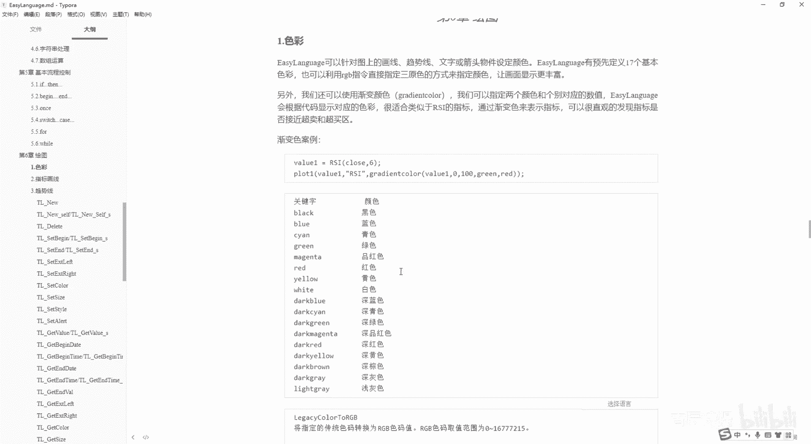
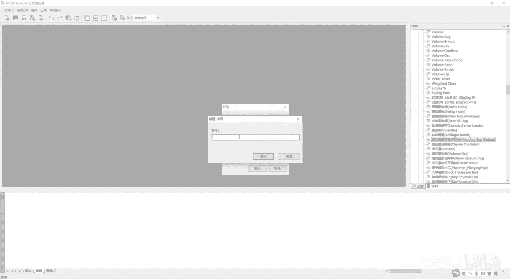
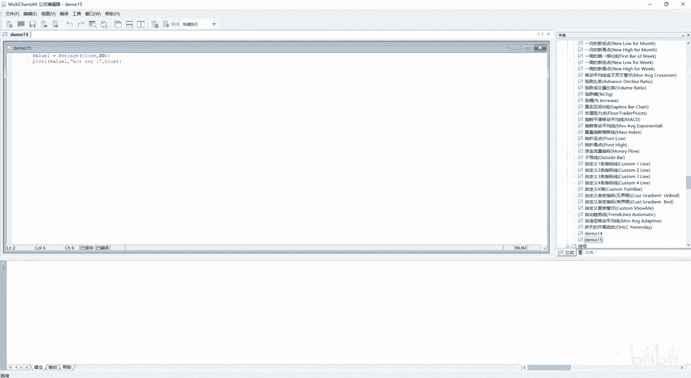
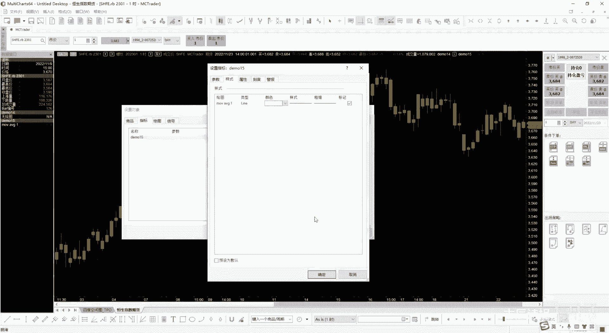
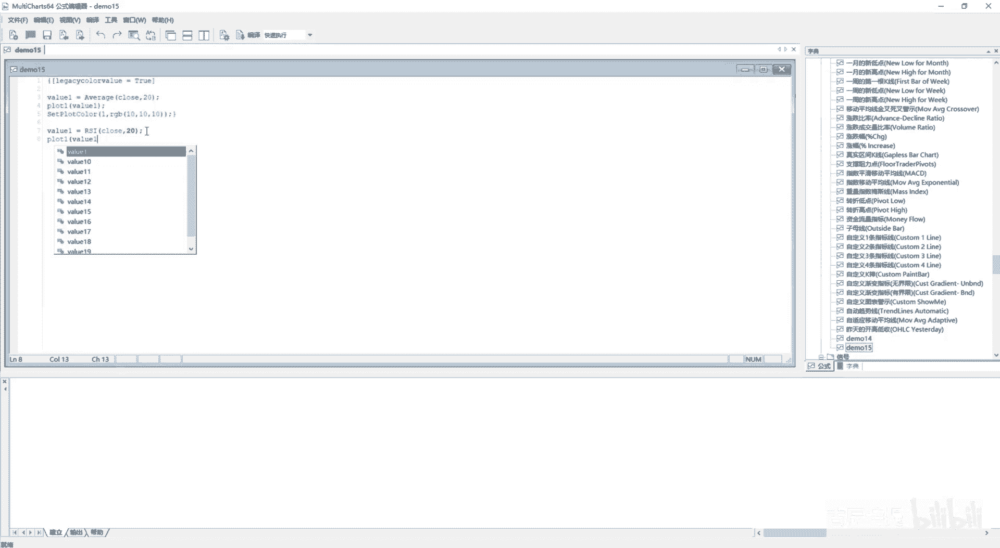
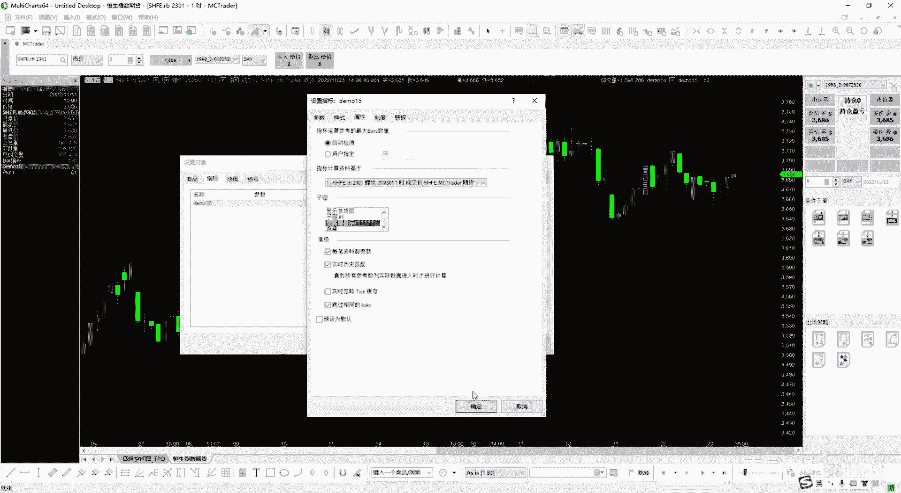
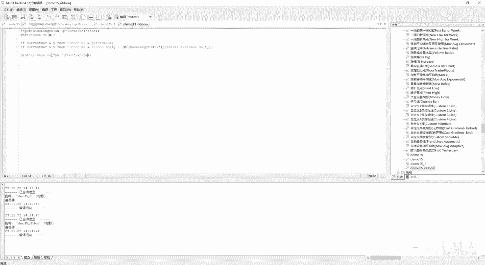
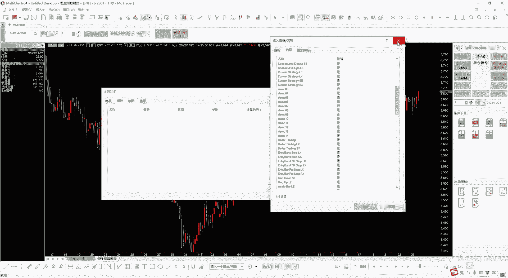
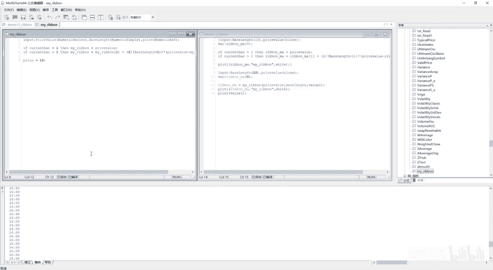

# 第15节课 绘图1 色彩 渐变色 - P1 - 古辰诗提 - BV1w1421y7UB

欢迎大家来到从零开始量化系列课程，MC课程的第15节课，这节课呢咱们开始讲第六章绘图，绘图第一个要讲的呢就是色彩，绘图的意思其实就是在图表上，就是说去绘制你想需要的线，包括甚至是这个八线。

你都可以自己来绘制的，那你要绘图的话，首先第一个你就是咱们要说的就是这个MC，它的一个色彩的一个设置，easy language呢可以针对图上的划线趋势线，文字或者说箭头物件哈。

从这咱们就把它说成是物件吧，设定颜色，EASLAVENGE有预先定义的17个基本颜色，也可以利用RGB指令，直接将指定三原色的方式来指定颜色，然后画面显示更加丰富，什么意思。

就是这个easy levege本身给你定好了，这个17个关键字，Black blue，Canyon green是吧，就是它对应的的黑色蓝色，你可以直直接去使用它们是这个关键字。

新建一个啊。

比如说就是blue，它就是一个关键字，包括，Canyon是吧，它就是一个关键字，所以说你可以直接去使用它，当然你也可以通过这个RGB，咱们都知道所有的色彩都是通过这个三种颜色。

就是一个R1个red g green是吧，呃b blue这个三个颜色来去绘制的，在计算机里边呢，它每个颜色呢都可以取256个值，256个值啊，所以说他这个取值范围是0~16，777215。

这个数是怎么来的呢，就其实就是256乘，256×256，有可能很多老板就问了，你就是说拿尾数相乘6×6乘六，你最终是尾数应该是六是吧，他其实是什么呀，这个零也算一个，如果说你从一开始的话。

它尾数是到六的好吧，你可以乘一乘，就是这个数，所以说它的取值范围就是这么多啊，就是这么多，然后就是咱们一般情况下，在MC里边把这些颜色呢称为传统色，用这个legency color来表示。

然后RGB呢就是RGB来组合成的颜色，legency color有17种啊，就是说这边是17个吧，应该是17种，然后它的取值范围是0~16，你既可以直接用这些关键字，你也可以呢就是用这个数字编码来去呃。

去取它好，就这个是传统色和这个RGB颜色的，一个就是它的一个转换，你可以把它转成由传统色转成RGB颜色，但是说你RGB颜色你不能去去转这个传统的，当然特殊的可以转啊，当然一般情况下。

咱们也不需要去这么去使用对吧，从这给大家演示一下这个画图吧，就是plot，然后后边咱们可以看一下plot这个解释啊，后边咱们还会具体讲它后边这个参数呢，咱们先说一下。

就是说呃你需要填写的就是这个N这个123，这是就是你画第几个线啊，就是你比如你画一条线，你就是一再画一条线，你就写二，你不要写成重复的一啊，后边的参数呢咱们一会详细介绍。

咱们主要说这个pluck cola啊，你第一个是需要你划线的这个指标是吧，指标我就定义一个这个什么吧，Y61Y61等于average，用clothes，然后用20好，然后我画这个value1。

然后他的名字呢就是move average1啊，Move every age1，然后第三个参数呢你需要这个color color，比如说我就指定一个四啊，我先别指定四了啊，我就先指定一个blue好。

然后进行一个编译啊，这个是没有问题的，记住啊，这个plot只能是在咱们这个指标里边去使用，信号里边使用它会出问题的。

好在这个图表里边儿，咱们插入咱们的指标，这个demo15，然后你设定的时候就是在子图一，就是这个图刻度和商品相同是吧，它是一个蓝色的线，虽然说你在指标设定的这个设置，这啊我把14先删掉哈。

在指标设定的这个设定，这样式你是选的是红色的，但是它还它会给你画的时候画成蓝色对吧，如果说我自己给它改成白色的有用吗。

它是没有用的啊，这个是你在这个代码里边已经指定好了的，如果说咱们对照一下blue的话，是这个蓝色应该是一，这个黑色是零是吧，咱们把它写成一看，看好不好使好不好使啊，进行一下编译好。

你会发现嘶诶这个是黑色线啊，变成了黑色线是吧，黑色线我再把它指定成2。1下，二诶它还是黑色线，这是怎么回事呢，因为它默认指定的是黑色线是吧，我从这儿设置指标，我再给它设置一下。

把这个线的颜色我给它设成白色，咱们看行不行也不行，这是怎么回事呢，就是你想用启用用数字启用这个传统色码的话，你需要做一件事，就这个中括号里边啊。

就是这个LEGENCYLEGALEGLEGZ这个color，然后value你要等于一个true，然后用中括号给它包起来，就是告诉这个编译器，我要启用这个传统的这个颜色的这个数值了。

不然的话它是启用不了的啊，这个时候我进行一个编译，咱们再看一下，它就会变成蓝色了吧，啊就是你要告诉他legenson color value value是值的意思，就是颜色值，我传统的颜色值要启用了。

不然的话他会它是不会被启用的好吧，这个时候我给它设成四是吧，它颜色又变了，Canyon就是青色嘛啊四对应的是Canyon好，这是第一个需要注意的点，如果说你想直接用色码的话，你需要启动一下。

这个中括号里边叫LEGENCY卡拉value，这个还是一个灰色的，咱们之前接触过这样的吗，接触过就是咱们之前写过这个intro i t r。

intro八NTROINTR8order generation等于true是吧，TRUE就是告诉MC就是说我在这个坝县的，就是说这个就是霸县内，我都可以进行这个order这个委托啊，就是咱们之前讲过。

如果说你想保存，就是说tick数据的话，你需要把这个打开，你这个通过这个intro8persist那个定义的变量，可以接收到ANTICK给你，可以接收到你所需要存储的值对吧。

这个后边咱们讲到这个信号的时候，会详细去讲这种方式，你不要陌生啊，中括号其实就是告诉他，我要把传统的色的这个value颜色值给它打开，不然的话你是用不了的啊，好这是第一个需要注意的点。

就是这个legacy color to rgb，这个就是转换一下，就是你去转换它是吧，当然你也得给它打开啊，把这个就是说这个value就是color value，可以取它打开，这个我就不演示了啊。

然后rgb to legency color，就是有这个一个是传统色转成这个RGB，一个是RGB转成传统色啊，这个我就不演示了，这个基本上也用不到RGB，由这个蓝绿红三原色组成的色码值。

然后呢你可以直接去设set plot color，然后用RGB直接这么去调用，这边演示一下啊，然后我从这儿我直接这样，我就把它给删掉，然后set plot color。

然后这个里边呢我color number就是一啊，我先要color number，因为我这个编号是一嘛，就是plot1把这个写进去，这个你可以用RGB直接里边填，比如说我十十十啊，少了个括号啊。

进行一下编译啊，这个画的线也是可以的，你可以直接用RGB呃，来做这个他的划线的这个颜色嗯也是可以的，这个没什么好说的啊，这个呢有三个，一个是get r value，一个是gg value。

然后是一个get b value，包括获取这个get rgb values啊，嗯这个也没什么好说的，就是获取分别获取中红色，绿色和蓝色的分量是吧，这个一般用不太到啊，当然你得了解一下好。

这边有一个是这个渐变色，根据定义的，根据根据定义的色彩范围，返回对应的渐变色的RGB色码，渐变色对应的RGB色码由使用者定义的参考值，最大值和最小值和参考范围决定的，例如颜色范围指定为白色到黑色。

最小值为零，最大值是为二，当数值小于零的时候，这个渐变色会返回白色，当数值为一的时候，它会返回灰色，好像这说的云里雾里的是吧，咱们给大家做个演示吧，首先我清空一下这这也清空一下是吧。

好我做这个渐变色的这个演示，我先把前面的先给这个给注释掉，咱们渐变色通常会用在哪，比如说像这种RSI，就这种指标就是超买超卖的这种指标，咱们可能经常会用到是吧，我value1等于RSI啊。

最好是大写的是吧，后边press value咱们同样的用clothes，然后LN比如说我用20啊，它会返回一个数值是吧，然后我把这个数值给画出来，Plot1，然后这个里边我把value1给它放进去啊。

这个我进行一下编译，编译没有问题，然后我给它设置一下这个指标，这个指标我设置一下，我画到哪呢啊，白色也行吧，然后我给它放到底部显示。

你会发现就是它的这个值，基本上是在30和70这进行波动啊，它的值是在30和70这进行波动，这个时候呢我给它设定一个，比如说我在里边进行渐变，就是我越往上啊，就是比如说我变得越红，越往下我变得越黄啊。

这个如何去设置呢，就是你首先你得在这个里边设置成，渐变颜色是吧，咱们先说一下这个渐变色，他这个呃它里边的参数需要填什么东西是吧，把它放过来摁一个F1，第一个是value1数值表达式。

那你数值表达式我就把value1放到里边，是不是就是这个value1是它的数值变化吗，然后我一个最小值，一个最大值，我最小值和最大值，比如说我就给它最小值设十，最大值设80，在这个范围之内进行变化。

然后就是色彩范围的开始值，我比如说给它设成read，然后它的结束值设成yellow，当然应该是开始值，应该是你对应着越小，它就是个十的开始值嘛，开始值我就设设这个yellow吧。

然后结束值我设read是吧，这个它就是一个渐变色啊，然后我把它X然后给他放到，你不能直接放啊，直接放会出问题的，因为这个plot里边，你就是就是这个第一个参数是你的这个数值，第二个一定是名字。

第三个才是色，就是才是他的这个色彩呢，所以说你一定不要忘了，就是说前面加上一个名字，然后把这个色彩放到这里边来啊，这个时候我进行一下编译，然后我再看一下我这个图，你会发现是不是有渐变色了是吧。

就是有这个渐变色了吧，就是有渐变的感觉了吧，我给他缩一下，是不是越到下面它是越黄色的，越到上面是越红色的对吧，这个就是渐变色啊，嗯他的逻辑就是什么，我的值放在这里边，我按照10~80这个标准来。

就是说来变化就是它的这个颜色啊，来变化它的颜色，其实在咱们他这个MC上自带的，这个就是代码上也是有这个渐变色的应用的，它叫彩虹啊，就是这个彩虹指数移动平均线啊，咱们可以把效果给大家看一下。

我插入一个指标，就是插入这个彩虹应该是在前几个，这我没有编译呢，彩虹编译一下吧，好然后插入指标找到这个彩虹啊，这好然后我来子图一显示刻度和商品相同，样式才有这么多样式啊。

然后你会发现他这个图它是越往下越是黄色的，越往上越是红色的，它有几根线呀，有八根线显示出来的，那这个咱们之前一直没有给大家看过，这样的指标，他是如何去写的，今天就通过这个彩虹线啊。

咱们去研究一下它这个内置的指标，如何去写的好吧，首先咱们先打开这个嗯，我就把这个清一下啊，输出没有是吧，我先把这个彩虹线呢CTRLACTRLC，然后我我demo15，我就不放demo15了啊。

我再新建一个就是这个指标demo15杠一，然后我CTRLV，咱们先把他这个代码先全粘过来，粘过来之后呢，会你会发现它都是显示的这个灰色是吧，没关系，咱们进行一下编译，编译完了之后编译成功了。

它就是显示成它该有的这个颜色了，看这儿可能大家会乱啊，你发现它input名字特别长是吧，这名字不算长，如果说你学C语言的话，里边名字会更长啊，因为变量很多嘛，然后又定义了四啊，四个数组。

它是这个到到三嘛，但是他是四个数组，然后这个四个数组里边又有循环，又有那个什么的，然后画了八条线是吧，画线咱们都能够理解，就是说咱们从这个划线，这可以看出来。

他这个array2里边存储的应该是那个value值，就是你的数值变化是吧，就是它的值吗是多少，对不对，然后呢，ARRISE3里边呢就应该能看出来，它是存放的是色彩的数值是吧，你看ARI3。

然后这有个渐变色啊，这有个渐变色，然后渐变色，当然后边设置的咱们就可以先不看，你知道RY3里边存放的是渐变色，其实咱们要关注的最重要的是这个数值嘛，他这个RY2是如何给得到的。

你不你不要看他这个特别复杂的这个代码，好像就心里就不想看了，你要找到重点，重点其实是就是这个ARI2，咱们可以直接跳到ARI2，这咱们来看啊，就是说首先他第一个大的一个标题是什么，CURREN坝。

抗日坝，咱们都知道，当坝线为一的时候，他做了个什么呢，就是做了个循环，V20等于1to7，你会发现咱们以前都把begin写在这，他写在这，这样代码比较清晰是吧，你也可以这么去写，而Y2里边放了什么呢。

就放了这个，因为1to7嘛，就是说当V20等于一的时候，就是你看就是他是从二开始的，然后其实是到2~8，但是呢你一在这给赋值了，在这赋值，它们俩其实是赋值的一样的，price price是什么呢。

其实就是你传进来的高开低收，还是他们的就是一些其他的序列类型值，对不对，好，咱们从这就默认它是close的话，它传进来的是clothes，其实RY2在坝限数量为一的时候，它里边存放着的都是收盘价。

对吧好，那咱们这个就可以先不看了啊，就可以先不看了，咱们可以看这个，如果说它不是一的时候，else下面它是什么呀，这个他也做了个循环，从1~8，然后URY2里边存放的是数值吧，它里边的关键是什么呢。

它是等于ARI2的前一个数，加上ARI1这个V20啊，乘以price减去前一个V2，就是这个这个前一个这个数组里边存放的数，这个两个咱们都能理解吧，就是存放的前一个数是吧，就是他往前偏移一个嘛。

这个取的是这个index嘛，后边再加个中括号是往前偏移，对不对，然后这儿用到了ARI1，ARI哩，里边存放的是什么呢，咱们可以看一下，找一下这个ARRIEARRI1，首先第一个存放的是什么呀。

Arri1，第一个存放的是就是RY1索引值为一的，它存放的它不是第一个，因为第一个是零嘛，它存放的是什么，二除以ARI0，这个11ARI01是等于什么，Best length。

best length是多少，是十，这是你传进来的一个数，对不对，一个参数嘛，然后10+1分之二不就是2/11吗，对吧是2/11吧，好咱们再看后边这个RY1里边究竟是什么，它是每一个都是什么。

r y0 v 20+1，然后加上2/1，其实它这个数值是多少，其实就是对应着的ARI0这个数组里边，它对应的索引号里边存的数值，数值加2/1对吧，好，咱们再看看ARI0。

array01存放的是best length，是咱们传进来的，然后array0在这呢有两个，第一个是这个什么什么什么，就是咱们先找一下这个数啊，是一对吧，传进来的是一，包括咱们在这使用的时候设置指标。

这里边的彩虹均线这个参数它也是一吧对吧，所以说咱们用的是一好，那咱们就看看一它是个什么东西，它等于一的时候就是加上，就是说他这个加一，其实就等于他前面那个索引啊，加上increase。

反正也是个参数是吧，他的意思是什么啊，是往上增长啊，还是倍数啊，往上加还是倍数，你看它如果说是这个是一的话，它就加，如果说不是一的话，它就是乘，那这个肯定也是个数值嘛，这个数值是多少，是十好。

他其实就是什么呢，给大家画一下啊，这个RY0里边存放的数，比如说这个是2Y0里边存放的数，它呃当然前面还有个零啊，零咱们就不说了，咱们从一开始，因为它整个都是从一开始的嘛，一里边它存放的是什么呢。

是best lands是十，然后二里边它存放的是多少呢，就是你像这个V20等于一的时候，他是二是吧，这个是二吧，等于这个是一，就是这个加上increassment of multiple。

其实就是这个是加十吧，其实这是20吧是吧，你再往后放它是30吧，40吧，一直到第八个就是80吧对吧，是这样吧啊然后你有了它之后，然后咱们再看这个arr，就是咱们因为算这个就是RY2，里边涉及到了RY1。

你算ARI1，你也涉及了ARI0，咱们现在知道ARI0里边存放的内容了，咱们就来看这个ARI1，Ari1，它其实就对应着ARI0的索引加21，那这个还不好说吗，刚才那个是存的是10~80对吧。

那这就是2/11，2/21，然后2/31，对不对，这就是这个意思吧，你想如果说V20等于一的时候，你看他的二等于这个ARI2AI2是20吧，ARRI二二十二十加21，不就是2/21嘛。

然后后边是这个2/31，对不对对吧好，你理解这几个数组的意思了，你像ARI0知道了ARI1，知道了ARI2，知道了ARI3，它其实就是存放着对应的颜色的，这个RGB的数值是吧。

因为它返回值是这个RGB的数值啊，就是咱们一开始说的，为什么要有那么大个数呢，就是这零到多少多少，它其实就是256×256乘256-1啊，他给你传进来之后，然后就是它返回值是一个数值，看啊。

哎看一下他啊，咱们看一下他的这个return，看见没，return他是一个numeric对吧，return他是一个N，哎我这return它是个NUMERK，其实就是返回的那个数值好吧。

那咱们就可以尝试自己帮他去拆解这个彩虹线，去写一下这个彩虹线其实逻辑很简单，逻辑最核心的一句是什么，就是这句是吧，就是我当前的值是等于前一个值加上，然后这个多少分之一乘以是1/11，还是1/21乘以。

我的这个price减去它的前一个数值，对不对，好，我再新建一个指标，然后demo15下划线二或者rainbow吧，就是这个彩虹啊，好我给他哎，这样给他往这拉一下，咱们对照着这个来写好吧。

他第一个要要的就是那个十，对不对，就是这个我也给他往这缩一下啊，第一个要要的就是那个十，就是这个best lands，然后这个price也得有的，但是咱们可以先不传啊，先不传。

然后这个颜色咱们也可以先不传，所以说咱们就先定义一个VI2，Ramble r a b b o n ramble ma，它是一个彩虹均线嘛，里边附上一个ma值啊，先附上一个零，然后它应该等于什么啊。

ramble ma应该等于，是不是它最核心的代码是在这儿呢，就是它的前一个前一个，然后加上这个咱们知道就是说他是1/11，1/21，然后就是1/3000000000，好我从这给他设一下input。

Input，我把这个best length，写进来，然后我先给它设成一个十，对不对，先给它设成一个十啊，然后我给加上什么呢，应该是他是多少分之一吧，应该是二除以括号。

然后里边这个这个best lands，GTH就是加上一二除以它对不对，然后就是二除以，比如他十的话是2/11嘛，然后再乘以一个这个括号，后边应该里边应该是close，当然你可以调它是close啊。

还是open啊什么，你可以从这还加一个price value，然后这里边比如说我先写上一个close是吧，然后从这你可以写上price value，然后减去什么呀，它的前一个这个值吧。

就是r a b b o n ramble，这个MA然后它的前一个值，这样这个是不是就是它的核心代码对不对，但是你从这你得你要注意了，当它等于一的时候，它其实就等于这个你定义的这个price value。

对不对，所以说我从这写一下，if cn8等于一，then就是ramble ma就等于price value对吧，然后就是说if，CNB大于一的时候。

than ramble ma就等于这个这样是不是就可以了，对不对，你把它核心代码摘出来之后，这样是不是就很好写了，我进行一下编译，看看有没有问题啊，没有问题吧，好没有问题。

我就是可以把这个ram ma给画出来了，我看看是不是和咱们这个上面的这个线，是一样的，对吧啊，所以说plot1，然后这里边写上r a b b o a ramble m a逗号啊，当然后边我先不写了啊。

或者说我从这儿写上参数啊，就是说它的名字my ramble，然后用颜色white吧，用白色吧。

因为底是黑的嘛，比较显眼一些好，然后我这个时候给它加载进来，我先把其他的这个指标给删掉啊，我把这个就是下面这个指标给删掉，哎呦删错了，把这个删了啊，我再把这个彩虹线给他加进来。

增加一个指标，彩虹线好样式，刻度子图一刻度和上面相同好，我先给他加进来，然后我再增加我刚才写的那个就是呃demon，Demon ramble，然后我给他加进来和和商品相同属性子图一，然后样式我就不用了。

然后这个是十，你按说这个两个线应该会把这根我写的，咱们自己写的这个指标，应该会替代一根这个里边的线对吧，好close，你会发现是不是一样的，他的就是说最小的那个值就是贴均线。

最近的那个变成了白色的了吧对吧好，我设置啊，设置指标，我把它的参数进行一下修改，如果说我改成20的话，他应该是替代的是第二根，对不对，咱们看看对不对啊是吧，这是替代了第二个了吧，我再设置一下指标。

然后把它设置我80，他应该就是替代的最外边那根线，对不对，那就说明你这个指标写的没有任何的问题啊，你这个指标写的没有任何的问题咳，那如果说你想用这个指标来写策略的话，比如说我就把它当成均线。

我想把它写成一个函数，是不是应该写成一个函数，这样我方便的时候可以进行调用，这个时候我应该如何来写呢，同样新建，比如函数函数，我直接选rainbow或者就是my rainbow吧，My rainbow。

那这个里边应该怎么去写呢，啊这个里边我，啊我应该是把这个my rainbow，把这个其他的先给关掉啊，demo15应该把这个两个先留着是吧，然后这样啊我应该怎么来写呢，这可以就是怎么放啊。

这样对照着写比较方便一点，对不对，然后你应该传入的值input，然后一个是best length，Best lands，然后里边初始值我设成十啊，我前面给它写一个就是price value。

PRICEVALUE哎，price value这个里边我默认传的是close，当然你也可以自己去改是吧啊啊input啊，这个写错了啊，因为在函数里边你不应该写上，就是说这个里边传入的是close是吧。

你应该是传什么呀，应该是new呃，这个呃numerical应该是什么呀，Serious，对不对，应该你传入的是一个序列类型，然后后边这个你应该是传入什么呀，应该是numeric simple。

就是我传入一个简单的值是吧，它是一个simple，对不对啊，这个是函数啊，注意了，不是在写指标和信号啊，然后你我定义一个呃，你这个VR ramble ma你就不用去定义了吧，你就不用去定义了啊。

你就可以直接这么来写，我把这个两行给它粘过来啊，省得我去写了，就是这样，我粘过来之后呢，我应该这个ramble ma我应该写什么呀，应该是my rambo吧，My rainbow。

这样我把它都给替换一下，RAINBOMA写成my ramble，My ramble，然后往这拉一下，写成my rainbow，是不是这样就可以了呀，因为你直接调用这个，跟它这个函数名字是一样的吗，是吧。

给他传进来一个序列类型的，指一个再传一个简单类型的数值，然后你直接调用ramble，就是这个my ramble就可以了吧，你就可以获取它的值的话，就是你可以直接获取它的值了吧。

咱也不需要往外传什么那个地址啊什么的，不需要往外传，对不对，我直接进行编译，编译没有问题好，我从这开始进行调用一下啊，调用一下，同同样的这儿我就直接给它全部给注释掉吧。

就是VA2这个rainbow ma啊，VR rao ma这个它初始值是零，先定义一个变量，然后我把这个也给它传进来，就是也写上啊，这个定义了两个就是参数，然后我在写的时候就是ramble ma。

等于是不是直接可以调用这个叫my rainbow，然后后边传入一个就是price value，然后再传入一个best length，BASE啊，B a s e，Basellance，直接给它传递进去。

然后我再plot1把这个rainbow ma给它画出来，你可以给它加上名字是吧，这个my rainbow，然后后边给他指定个颜色，W h i t white，是不是就可以，这个是不是就形成一个指标了。

你从函数到指标，这样是不是很清晰，函数它的逻辑是什么，到指标它的逻辑是什么，然后我再给它进行一下编译，然后我在图上我画的时候是不是一样的是吧，我把这个指标咱们用的就是这个demo15。

这个RAINBO用的就是这个demo show ramble，而这个ramble调用的是这个函数吧是吧，调用的是这个函数吧，然后我再直接给他改，比如说30，是不是没有问题吧。

啊这个今天给大家正式的做了一个演示，如何你去写一个指标或者信号，把你常用到的这个，把你常用到的这个就是这个呃指标的核心内容，写成一个函数，这个是咱们之前讲的，你传进来的是什么是吧。

你不能跟我一开始写的那样，写个clothes啊，写个open啊什么的，它会报错的，你要传进来的是一个数据类型，如果说你想要往外去传值的话，你要往外去传值的话，咱们之前说过。

比如说我这写一个price value啊，那不写price value了，就写price吧，它往外传的一个值是什么呀，就是比如说我在里边写上这个啊，Numerical r e f。

我要把这个值给它传出去，当然这个值我就直接写嗯，写什么呢，写price啊，p r i c e price等于额十吧，好我进行一下编译，这个代码是没问题的，但是你从这你要用一个变量。

比如说我用value1，我来接这个变量，就是接的是你这个price的这个值啊，你接这个变量，然后我可以print一个Y61，把它值给输出来对吧，把值给输出来，这样我也进行一个编译啊，少一个啊。

少了一个括号，好然后进行一下编译，然后咱们可以看一下啊，输出输出都是零，这应该是一啊是吧，输出都是零，你输出的是这个Y60，怎么可能会有值呢对吧，这个时候你就接到了他所有的这个给你，传进来的这个值吧。

就是十，当然你可以把这个price复制成在这个里边，复制成你想要复制的任何一个东西，然后他会给你通过这种地址传递的方式，给你传出来，这样就突破了，只能传一个结果，你像这个如果说你没有这个IEF这种参数。

或者就是这种参数的话，你只能传的就是其实就是my ramble，就是跟他同名的啊，这个名字是吧，但是你有这个的话。

