# 第16节课 CtaBackEngine的实现(1) - P1 - 古辰诗提 - BV1nm421j7dX

欢迎大家来到从零开始量化系列课程，BMPI课程的第16节课，上一节课咱们写了一个demo策略，也就是最简单的双均线策略，虽然它是最简单的双均线策略，但是咱们说了，在这儿他是会有问题的。

这个很多时候尤其是新手，你在刚开始学的时候，你可能会这样写，就是反手，但是呢你得考虑它的一个逻辑关系，就是这个买必须得在他评完之后再买，那它最直观的体现呢它是有问题的，咱们我已经把它复制到这个这了。

就是在咱们这个就是在strange里边啊，放到了这个app demo，就是跟他是一样的，是直接复制过去的，复制过去之后呢，咱们打开这个维纳，然后进行一下，就是回测，进行下回测。

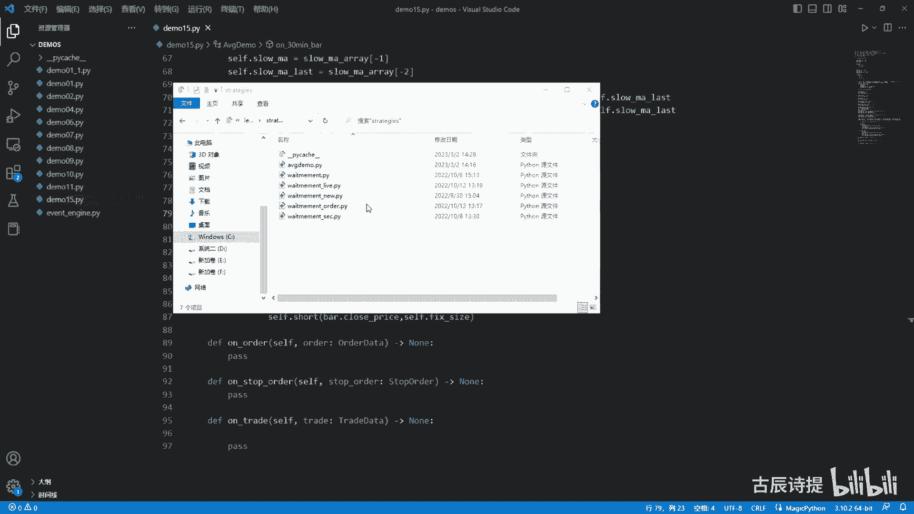

点交易这一块，咱们把这个这个回测模块给点上，别的我就不要了，我就把它给取消掉了啊算了，我直接启动了，好然后我点这。

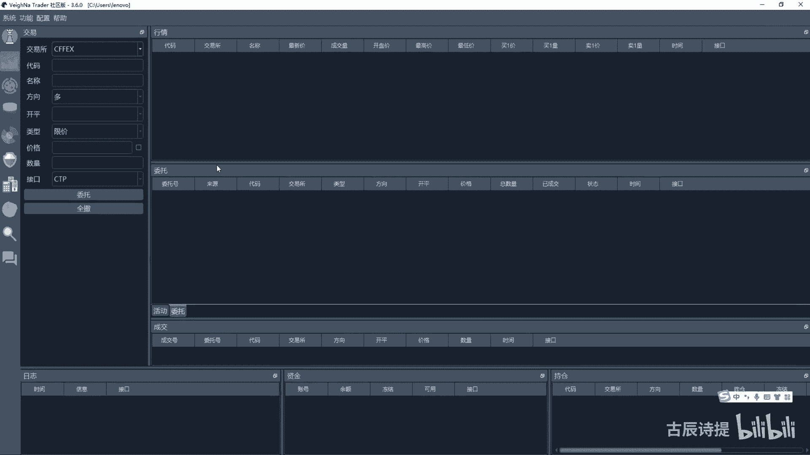

点了之后呢，我去加载一下策略，就是pg demo，然后我用RB2305点SHFE，记住这个流程啊，因为咱们下面讲这个回测模块的时候，这个流程其实也挺重要的，那么从2020年3月1号到2023年。

当然这个2305是从2022年是吧，咱们就2021年吧，因为他一开始的数据是从2022年，这个22年，然后这个5月15号开始的手续费率，我就写成零，然后交易滑点也写成零，然后合约参数呢应该是十。

就是合约乘数啊，价格跳动是一，然后这边是100万啊，我一手的话我就用1万就可以了，螺纹嘛是吧，然后先进行数据的下载，下载数据，这个下载数据，其实是把数据下载到咱们的这个数据库里面去。

然后呢下载完了之后呢，然后再进行回测，参数我就不改了啊，还算是挺快的是吧，其实就89好，这个就有了吧，有了之后咱们看一下这个成交记录啊，从成交记录你就能看出来他是有问题的，你会发现它两个开两个屏。

两个开两个嘛是吧，就是两个开两个屏，两个开这个就不对，因为从咱们策略逻辑上来说，不应该出现这样的问题，应该是开屏开屏开屏交替着的，对不对，应该是开屏开屏开屏交替者的吧对吧。

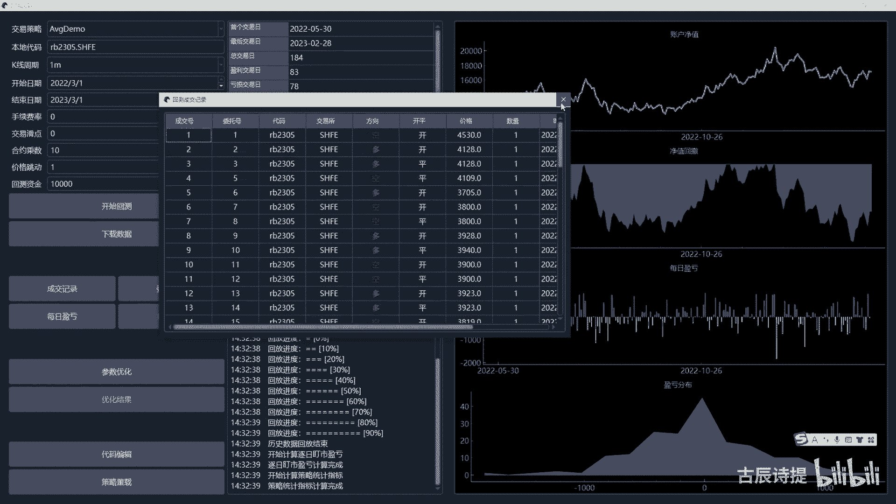

所以说这是有问题的，那如何去改呢，我先把这个关了啊。

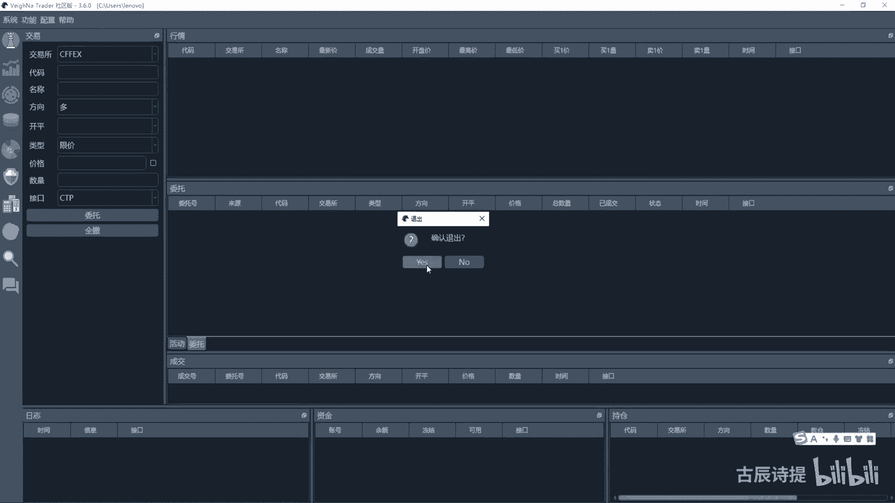

好把这个关了，如何去改呢，咱们新建一个demo16，重命名下都是大写的是吧，好如何去改呢，咱们把这个demo15CTRLACTRLCCTRLV全部给粘过来，如何去改。

其实最主要的就是把它这个反手的这个逻辑啊，就是说必须得是先平仓再开仓，所以说先平仓再开仓，你在这个on从哪去进行判定啊，从on try，这，因为他每次交易，他都会就是调用这个on triad嘛。

所以说你在on triad这进行一下判定，如果说它是平仓的这么一个动作，然后呢持仓量又为零，然后这个时候你就可以再去执行，就是反手的那个开仓是吧，逻辑是这样的吧，那怎么去实现它呢，我从这我就直接写了啊。

你设置几个，就这就这个变量，然后就是by price，等于零啊，然后小点surprise等于零，cf点shirt price，cf点cover price，啊等于零好这个变量呃，这几个变量设置好了之后。

主要是来做什么的，当它满足开仓条件之后啊，我把这by price等于八点close price啊，把它变成就是八点cross price，就是把这个by price这个变量，然后附上值。

同样的在下面的呢下面这个每一个开仓，这我都给它把它都是复成这个by price，因为我用by press来进行这个开仓嘛是吧，我就把它全改成这个啊，全改成这个，有了这个赋值之后呢，我单独定义一个方法。

Sorder self，你千万不要定义成SORDER，因为本身这个这个他的这个父类就是city template，里边就有SORDER，这样会出问题的啊，这里边我做什么呢，就是我做的工作啊。

就是说同样的我进行判定啊，一副就是说这个cf点pose等于零，如果它是空仓的话，if cf点by price，如果说by price有赋值的话，Surf by。

然后这是self by price wifs，然后cf点fixed size，然后还是用限价单进行开仓是吧，然后这个时候一定要记得把by price呢等于零，给它归为零啊。

air if cf点sa short price，这个用AF也好，用if也好啊，因为这个策略本身它是什么呀，就是说它不会同时出现有by price和和这个shirt price，因为不可能同时出现。

即是金叉也是死叉是吧，所以说你可以用AF，当然你这个得看策略啊，然后cf点呃，有shirt price了，我就直接shut，然后cf点shirt price，然后cf点fixed size还是用现价。

然后记得把这个surfshort price归为零，如果说cf点pose大于零一，咱们先判定一副cf点大于零的话，咱们先判定if self suprise，如果surprise有的话。

有这个surprise这个值的话，咱们就self cell嗯，safe加surprise好abs啊，cf点pose，当然你从这里可以这个a abs可以不用啊，把它设成true。

就是这个呃是不是是不是停止单，咱们用用停止弹去发送是吧，记得把这个surprise啊等于零归于零是吧，然后再aif self点pose小于零，if self这个surprise。

然后就是self cover price，看看有没有平仓，有没有满足平仓的条件，凭空仓的条件cover，然后cf点cover price啊，后边咱还是用abs cf点fix size。

然后改成把这个改成true，是吧，好，这个呢它就是判定他有没有，就是说这个平仓的啊，这个条件是不是满足了，满足了我就去发送委托，但是从这儿我没有进行反手是吧，从哪进行反手呢啊我这先给加上。

就是嗯从这码足条件之后，我self sorder self去执行一遍这个下面这个代码，执行一遍下面这个代码之后呢，他就去比如说他需如果说是需要反手的话，他第一步他这个肯定是有这个呃。

这个SUPRISE和这个short price的是吧，假设他这个是这个呃是呃有这个多仓，然后要返程空仓的话，它是有surprise和这个surprise的，这个时候呢我进行这个下面代码呢。

它只是在执行了这个surprise，这个委托发出去了吧对吧，委托发出去之后呢，他会撮合，然后成交，成交完了之后，它会调用on triad，这个时候呢咱们就可以进行判定，If tread of sat。

就是它的开屏，如果说是呃平仓的话，offset点close，如果说它是平仓的话，and cf点POS等于零的话，然后我再执行一遍，Sorder self，就是他委托发育之后，然后他是平仓的动作。

平仓的动作呢，然后仓位又变成零了，因为你有可能就是在写代码的时候，可能是部分平层是吧，仓位又变成零了，仓位变成零之后呢，我再执行一下send to order self，这个时候呢它仓位就是零了吧。

然后他会去执行by或者shirt，是不是这个逻辑能理解啊，这个很容易理解啊，当然这呢你就不需要cancel了啊，你就不需要cancel了，因为你只发送了一遍委托是吧，一遍委托你就不需要看solo了。

当然这个逻辑还得你自己来啊，你从这执行完了之后，这个SORDER每去执行呃一次，你就可以把它去保存一下数据啊，保存一下数据就是cf点呃，SY这个就是保存一下数据，把数据其实还是保存在咱们C盘下面那个点。

VN拆的那个里边是吧啊，主要是保保存，这个其实是就是这个这个这个变量的信息，尤其是你那个持仓啊，pose就是去更改一下啊，这个是保存数据用的啊，保存数据用的，那这个策略呢就算是完成了了。

然后呢咱们再进行一下回测。

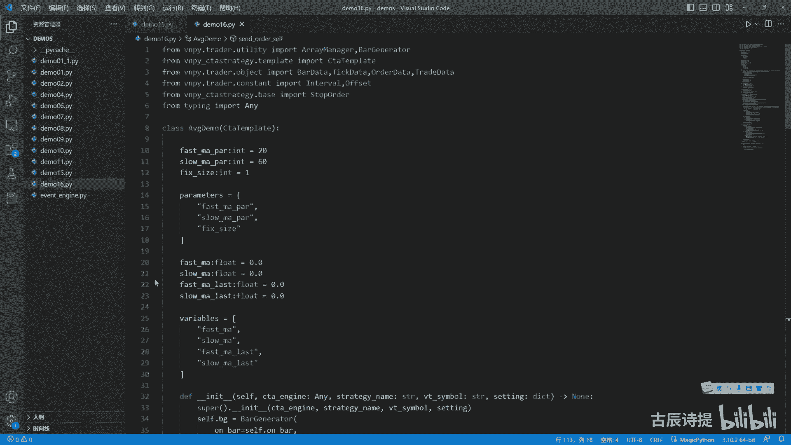

再进行下回这个维纳启动的比较慢一点啊，我就把它给启动好了。

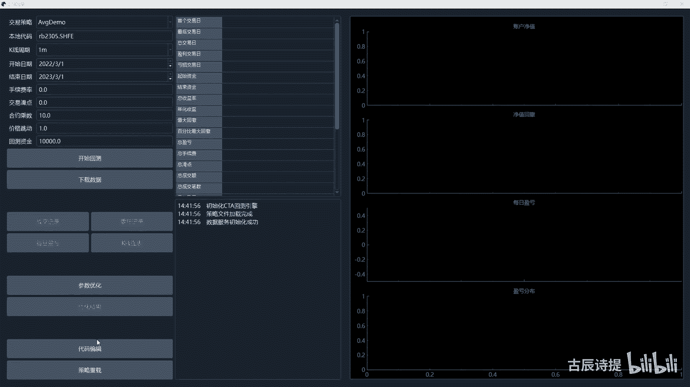

启动好了，这个回测呢就是这个fg demo呢，我同样的把它也改了。

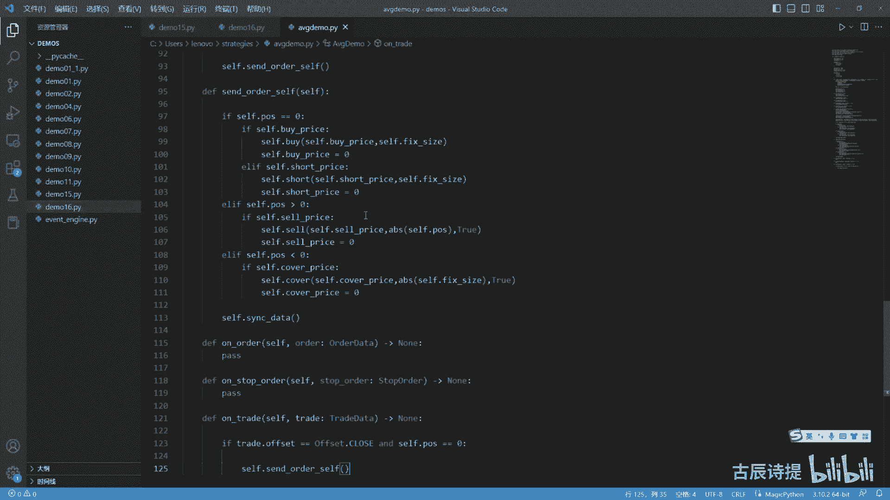

改成这个send order self了，直接是粘过去的啊，这个时候呢我就是数据已经下载好了吗，在数据库里面已经有了，所以说我就不下载了，然后点这，然后进行开始回测，咱们再看一下，好这个就可以了吧。

咱们再看成交记录，你再看啊，开屏开屏开屏开屏是吧，就是一个开，后边就是对应着一个屏啊，这个时候就是从面上看，或者咱们直观的感受去看，他应该是嗯就是说没有问题了，最起码那个不会出现两个开。

两个屏这种情况了啊，这个虽然这个策略简单。

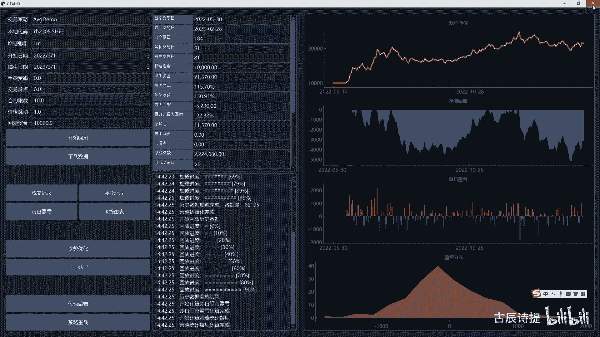

但是这个点你要是想理解清楚的话。

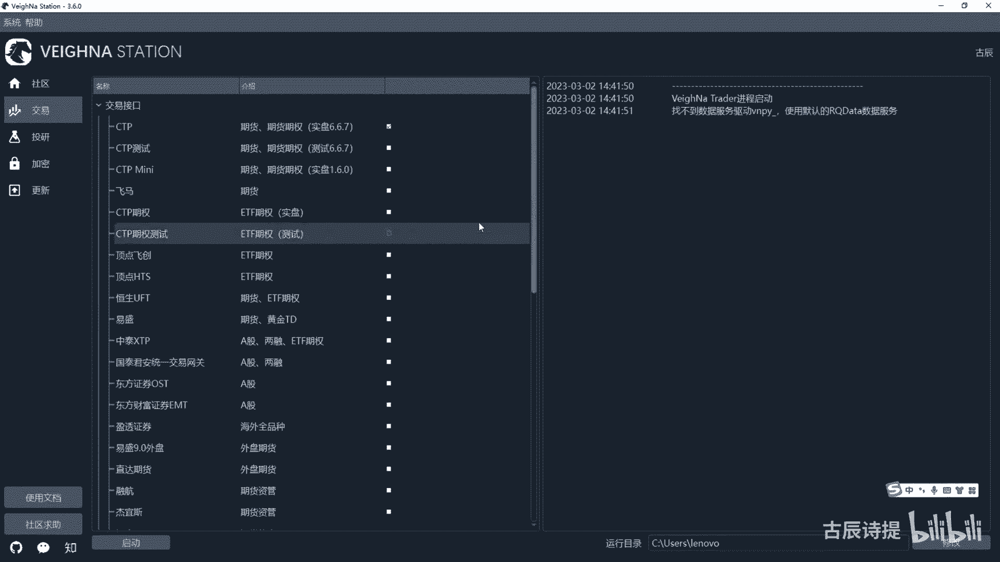

你肯定得需要很就是对这个整个的框架，你要了解的比较透彻啊，界面咱们回测完了，界面回测完了之后，咱们考虑用没有界面的方式进行回测一下，因为咱们下面要讲的是这个回撤，一步一步的去引入，没有界面回测呢。

咱们单新建一个demon十601点PY，呃重命名一下啊，点PY，点PY，大家还记得这个过程吗，第一步是数据的下载，数据下载下载到哪，下载到数据库吧，是不是好下载了数据库，数据下载不难吧。

咱们之前都学过是吧，咱们就快速的写一下，数据下载肯定得需要用到这个iq data，所以说VNPY下划线这个iq data，第二这个archo data feed import rq啊，RQ啊。

这个哎有这个是吧，iqj feed好，有了它之后，F 1d feed，f e d feed等于arq data feed，然后先给他INIT一下是吧，INIT一下，然后print了。

别cf点red log了啊，rq data rq初始化初始化啊，成功啊，成功初始化成功之后，咱们就应该去费的，第2query q u e r y query bar history。

这个里边需要一个history request，那history request呢，咱们from v m p y点tread点object吧，import这个history request，然后从这啊。

就是说咱们创建一个REQREQ等于history request，然后这个里边symbol，咱们刚才下载了螺纹，那咱们现在下载一个什么焦炭行吗，simple等于什么焦炭，2305啊。

exchange exchange等于什么呀，咱们还需要导入一下from VN py点tread，点constant import，exchange吧，好exchange，这个应该是DCE哈。

下面还有一个是什么呀，start s t start等于什么呢，咱们from the time啊，Import the time，好，start呢，咱们用daytime，2022年1月1号。

然后这个end，咱们等于这个还是DETA，A20，The time now，就是当前这个时间啊，然后还有一个就是inter interval，等于咱们再导入一下一个interval，就是它的周期是吧。

Interval i n t minute，好，这个比较长，咱们给它拆分一下，是不是这样就可以了，然后我query的时候，我直接把这个REQ给他，啊啊这个REQ就是request给他，然后他有返回值吗。

它的返回值是一个list吧，是一个list，这个8UST它是一个list类型，然后里面存放的是bar data是吧，好啊，给它标注上这个这个等于，然后咱们导入一下这个8data，BD是在这BD好。

这个bar list就是获取成功了之后啊，咱们print一下，print一下历史数据获取成功呃，我就简单写一下啊，一共是啊多少条啊，然后第二波点format format，这个里面是LAN。

这个BLIST当然是在他获取成功之后啊，if if bar list啊，if blist呃，这样吧，If not blist，我就直接就return掉了啊，蹭掉了，就一巴勒斯吧，这，获取成功了之后。

咱们需要把它保存到数据库里面去吧，是不是数据库咱们需要from r q呃，不是from VN py，是吧，咱们再创建一个dB啊，就是database dB等于suculate database。

然后实例化一个，然后dB点save by data，然后把这个bars就是跟他是一样的吧，这个数据类型就是8list吧，保存啊，然后再print一个啊，历史数据保存成功，啊这个就是一个数据数据获取的。

这是第一步吧，数据下载啊，好我运行一下，看看有什么问题，RQ初始化成功了吧，哎他这个没有获取到数据对吧，这是不是应该是if blist，而不是if not blist，呃。

其实你可以就是这是写不了return啊，因为它不是在一个那个什么里边，但是这可以写什么呀，就是咱们可以import一个SYS，然后这可以SYS点exit啊，就是程序就退出了，程序就退出了，然后这样啊。

然后去运行，咱们再运行一遍啊，看一下，aq data初始化初始化成功了，历史数据获取成功了，一共是6万多条，一般这个历史数据有这个56万条啊，就是就是就是就是一年下来的呃，7万多条吧，应该是7万多条。

好，这是第一步，数据获取完成了，数据获取完成之后，他就不用重复去进行运行了吧，咱们就该开始第二步了吧，第二部是什么呀，第二步就是回测嘛，那回测第一步应该是什么呀，应该是你得知道就是回测你首先的第一步。

咱们是加载策略吧，是不是是不是加载策略，你策略加载进来之后，你才能进行呃，这个这个后边的参数设定啊什么的，对吧好，那你第一步加载策略，咱们之前说过，你要从这加载策略的话。

当然你可以直接导入这个demo16，但是如果说他的策略是在这这儿的话，你应该动态的去导入它吧，是不是应该是动态的去导入它，动态加载策略，动态加载策略应该还记得吧。

动态加载策略应该是import import lib吧，用它来进行动态加载呃，咱们先动态加载策略啊，就是首先咱们知道name name等于什么呀，应该是STRANGES诶。

S t r a t e g i e s stranges，就是那个文件名，然后点他那个应该是咱们写的这个名字，是a v g demo是吧，点a v g demo，这个是这个是文件夹的名字。

然后这个是文件名，文件名，然后models m o m o o u d l e s models等于什么，Import lib，然后点import model，然后这个里边把这个name放进去。

咱们之前说过，为什么能这样去导入，因为你能找到那个pass home，是不是pass home的话，你现在来看一下啊，import一个SYS，你现在import soy。

然后咱们可以print一下这个SYS，点这个pass，咱们看一下你那个pass home，也就是那个C盘下面它是没有的吧，是不是没有的，所以说呃你一个方面你可以把这个路径加进去。

另外一个你还记得咱们说过什么吗，你如果说from v m p y呃，点trader utility import一个，比如说把这个load data吧，啊LOLOJSON吧，你如果导入他的话。

然后咱们再看一下这个SYS啊，然后print一下这个SYS点pass，它里边就应该有这个这个C盘下面，users the NOVA了吧，这个之前讲过，因为你导入它的时候。

它就把那个LV已经添加到这个SOS，这个pass里边去了，你现在导入的是什么呀，就是import这个model，导入的其实是各种模块里面有很多模块，有很多模块呢。

你就需要去t r a t EG y s strange，TRATEGY是吧，等于这个策略呢你应该是GATTR，这个里边应该是models，然后获取那个策略的名字，那个策略的名字是什么呀，咱们是呃。

这个应该是这个这个a v j demo，大写的A和D是吧，好写进去，Avg，这个咱们可以print一下这个strange，Strange，咱们看一下动态导入有没有导入成功，导入成功了吧是吧。

导入成功之后，咱们是不是可以就把这个策略，添加进咱们的那个回测引擎那边去，那回测引擎咱们必须得从这儿来导入一下吧，是不是来导入一下啊，从哪呢，From v n py。

就是ABTESTER这点engine，然后import testing，呃，不是应该是bing engine啊，Bing engine，当然这个engine呢嗯可以从这个里面导入。

因为它这个里边也是导入的bing engine，它其实是在哪呢，是在这个ccta strange，然后点这个BTESTING这个里边啊，为什么他不放到就是C盘下面的，咱们的这个就是刚才看的那个。

就是CTABTESTER那个里边啊，他为什么不呃他不放到那个里边塞packages里面，咱们看一下这个VMPYVMPY，你想这个是这个tester这个里面呢它是什么engine，咱们可以看一下啊。

他这个engine啊是叫btester engine啊，Bengine，然后呢它实际上的那个引擎呢，应该是在这个btesting engine，应该是在c t a strange这个里边。

他是这个BTESTING，这个眼镜应该是这个是这个引擎，咱们主要用的是这个引擎，这个引擎也是实际上在回测进行的，最主要的引擎，那个BTESTING呢它只是一个外包装。

把这个btesting engine给包装起来了，呃更多的是跟界面去接触，为什么放在就是说这个t strange里边的，因为很多东西就方便导入了，比如说你那个stop order。

就是你那个在下面那个就是在这个best里边的，包括template也好导入了啊，包括你这个里边策略也好导入了，但如果说你单独的一个模块放到了VNPY，那个CTABTESTER那个里边的话。

你很多东西会导入起来会比较麻烦是吧啊，这个就是方便的地方啊，好我back testing engine，我是不是BACK等于我实例化一个BACK，back testing呃engine。

然后这个里面呢也不需要传入参数是吧，也不需要参数参数，然后我back点这里边肯定有at the strategy，就是添加策略啊，添加策略添加策略，同时呢你要把这个sitting给它添加进去。

也就是你的参数设置，参数设置，我这个策略呢我就把这个strange给它放进去啊，这是个策略是吧，然后这个city呢我就不传东西了，我就用原本这个策略带着的这个，它的设置的一个那个20和40。

还有fix size是一就可以了吧，是不是就可以了吧，好这一步完成之后呢，下一步应该是什么呀，就是说设置参数了吧，还记得咱们的步骤了吗，就是挑选好策略之后，下一步就是设置参数。

设置参数也同样在back里边点sat，它有一个这个是吧，也就是参数的意思，这个里边啊这个which is simple等于等于什么呢，就是咱们就是这个用焦炭是吧。

就是焦炭2305vid symbol是这个，然后呃哦它是v t simple，然后你一定要加上点SHFE是吧，好后边这个interval，interval是咱们用的是interval i t呀。

咱们导入一下啊，from VN py点trader点啊，这个是在constant里面import interval啊，这个T1样，interval点minute是吧，Minute。

然后start就是它的开始时间，开始时间咱们写一下吧，咱们from the time，import一个DETA，好，这个start咱们定义一下啊，start等于daytime。

比如说咱们二零2022年1月1号啊，然后end end等于the time，点now就是到当前的这个数据是吧，然后start我就等于start start，然后后边这个，呃start后边是rat。

这个right是什么呀，rate是它的这个RT啊，这是手续费，我就给设成零吧，然后还有一个这个SLI，这个这个是什么，这个是华电的意思啊，华电我也给它设成零华点，下面一个这个是size。

size就是十呃，不是焦炭是100是吧，焦炭是100，螺纹是十呃，然后price就是它的就是每一个跳动啊，这是0。5，是不是焦炭是0。5啊，然后capital capital是资金的意思。

比如我就放10万，因为焦炭比较贵啊，End，end end我就等于end吧，后边什么还有什么model，它有这个后边这个就不用去进行复制了吧，这个model是它的类型啊。

就是bar还是tick risk free，是什么风险度什么的，这个annual days是它的交易日240啊，啊这个我就不用去再进行去赋值了吧，啊那下一步是什么呢，应该是下载数据吧。

因为你数据在数据库里面存着呢，然后我就需要给它下载下来，back点load data，不是load bar啊，不是load bload bar，咱们说了，是为这个参考数据做准备的。

就是填那个array manager，先把它填满了，那啊那部分，然后咱们print一下啊，这个F吧，数据下载量呃呃这个里边写上，L然后他在back里边它有这个history data。

这个里边是存放历史数据的，如果你不是特别能理解呢，咱们就先你先这么听着，然后可以自己去做一下啊，后面咱们会仔细去分析这个a btesting engine，在分析之前呢。

咱们先尝试着去自己写一个bantastic engine，这样咱们才能说透啊，然后下面就是回撤了吧，啊回错了吧，咱们到这之前，咱们先运行一下吧，行不行，先运行一下，看看有什么问题是吧，这个数据下载啊。

数据下载量为零啊，这是这个应该是DCE是吧，诶弄错了啊，咱们重新来一下，看看数据能不能加载进去，四十九五十九六十九加载进来了吧，到这就没有问题了是吧，然后就进行回测回测back。

第二它有个wrong btesting，Run btesting，这是回测回测呢，咱们下面呢再计算结果，他有个这个逻辑啊，先你先跟着逻辑走，它返回的是一个DF，就是那个二维表，咱们导入一下啊。

Import pandas s p d，PD点get the frame啊，等于back点calculate result，就是这个是会把结果给计算出来，然后返回的是个二维表。

咱们可以看一下这个二维表啊，咱们to csv一下，然后这个里边咱们就写一个text点CSV啊，好咱们再进行去运行一下，好好加载数据量，这个就有了吧，这个里面存放的是什么呢，就是每一天的。

你看他每一天都有啊，每一天的这个前一个的这个收盘价啊，前一日的收盘价，这个是啊，不是这个是收盘价，还有前一日的收盘价，Break close，第一个是收盘价，第二个是前一日收盘价。

然后后边一些就是说指标啊，就是交易啊，tress它是一个列表，里面存放的是你当天的这个交易，有多少笔交易都用列表给你存放着的了，他是try data。

然后try to count start pose pose，就这一天开始的持仓，结束的持仓啊，turn over就是成交额，可这个commission是他的这个手续费，这个是华点啊。

这个是交易的这个PNL是利润，是利润的意呃，意思training pl应该是交易的利润，holding period应该是就是净利润还是什么啊，就是在你不是净利润啊，就是丁氏浮盈，就是你这一天啊。

就是说你持有仓位的话，你持仓的利润是是多少，投入通货币肯定是这俩小，想加码net p l肯定是净利，净利你得拿纯利，不是你得拿毛利减去还减去这个交呃，这个这个手续费对吧啊，这些就是一些基础的指标。

然后这些指标呢你把它就是在计算成呃，你所需要的啊，不是这些结果，你要把它计算成你所需要的指标啊，就是计算指标，计算指标是怎么计算的呢，它是一个嗯字典应该是返回值啊，back back点呃。

这个calculate啊，这个应该是这个应该是指标，然后这里边需要一个DFDF这个output呢，output你可以直接给true true，你就不用写了啊，就不用写了，然后这个是计算指标出来。

咱们可以它的返回值是一个dict，一个字典，是不是啊，一个字字典，咱们可以把指标print一下啊，DC啊，它也会输出的啊，它也会输出的，咱们可以再运行一下看一下啊，啊这个是指标，你看这它输出了是怎么写。

就是说你的首个交易日，最后交易日总交易啊，就是说总交易日亏损的盈利的7日，资金结束资金，这是挣钱的是吧，嗯翻了一倍多啊，啊就是总收益率是多少，年化什么最大回撤啊，都在这儿啊，他已经给计算好了啊。

后边呢就是它的这个字典啊，就是一个就说一个指标，它给它做成了一个字典啊，最后一步是做什么呀，应该是图表展示吧，啊图表展示，啊图标展示，然后直接就back点SHOCHAT啊就可以了。

它会根据计算出来的这些指标哦，或者说这个呃不是指标啊，它是根据这个DF的，这个里面是得有参数的啊，是根据这个DF它来画图啊，咱们可以看一下，再走一遍。

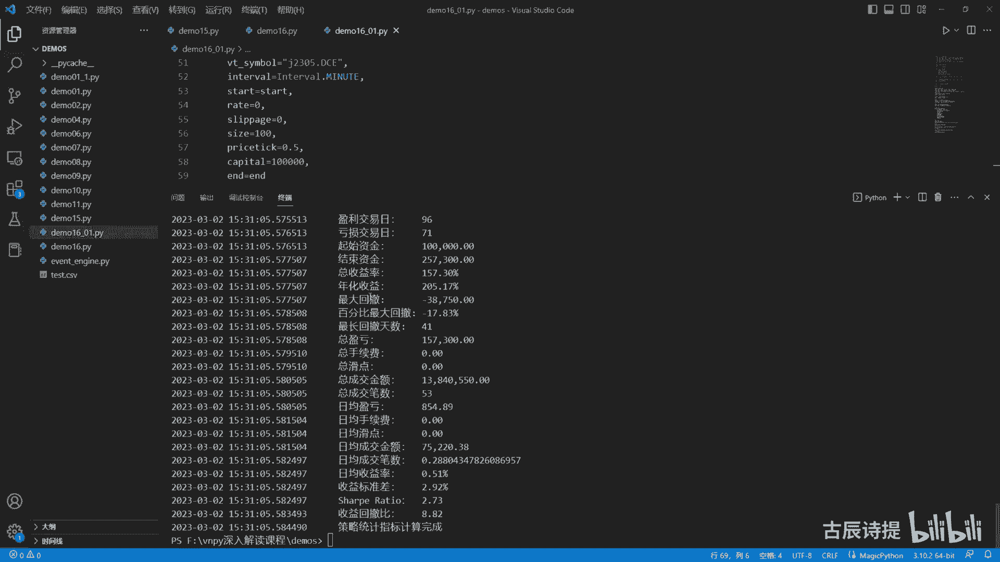

指标出来了吧啊啊不是这个图出来了吧，图就是这个图啊，图就是这个图他会用这个浏览器给你打开啊。

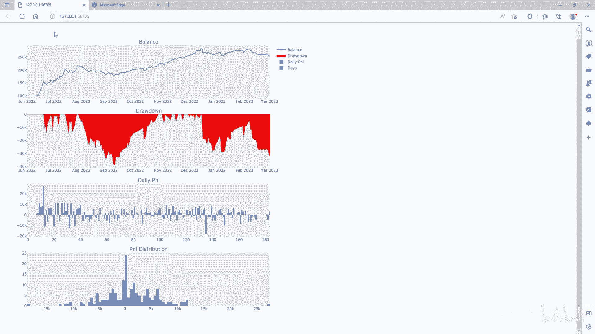

这个就是回测的整个的这个逻辑，你会发现啊，前面跟咱们手动操作的很类似，先是下载数据是吧，咱们用代码把数据下载下来了，然后后边呢是先是动态加载策略，把策略给加载进来，策略加载进来之后呢，然后设置参数。

参数设置完了之后呢，后边就是呃，再从这个数据库里边把这个数据下载出来，为什么非得从数据库里面下载数据，咱们等后边分析到了再说啊，它有用处的，然后计算结果，计算结果它就是呃就是啊他进行回测，回测完了之后。

你计算结果，这个结果计算会产生一个DF的一个表格，就是二维表格，然后这个二维表格呢你再根据他去计算，指标也好，图标展示也好，就全部就出来了，这是一整个的这么个流程，这个流程你一定要记清楚，咱们下一节课。

根据这个流程以及咱们对交易的理解，咱们先尝试着自己来写一个回测的引擎，好吧。

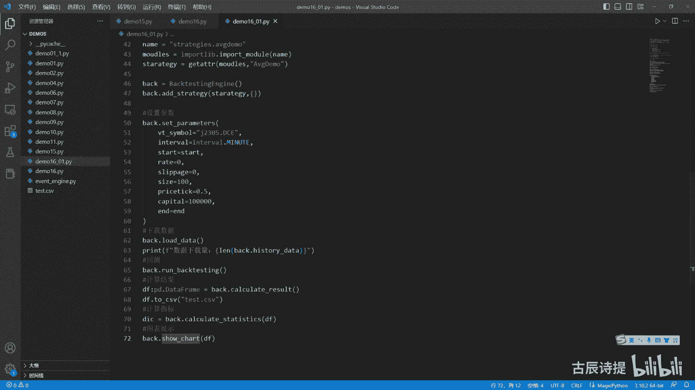