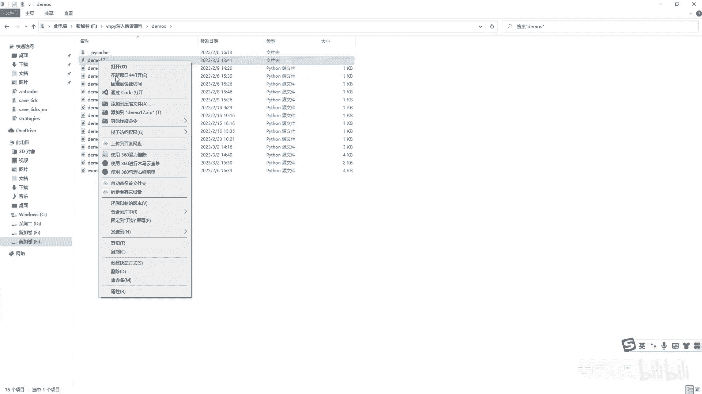
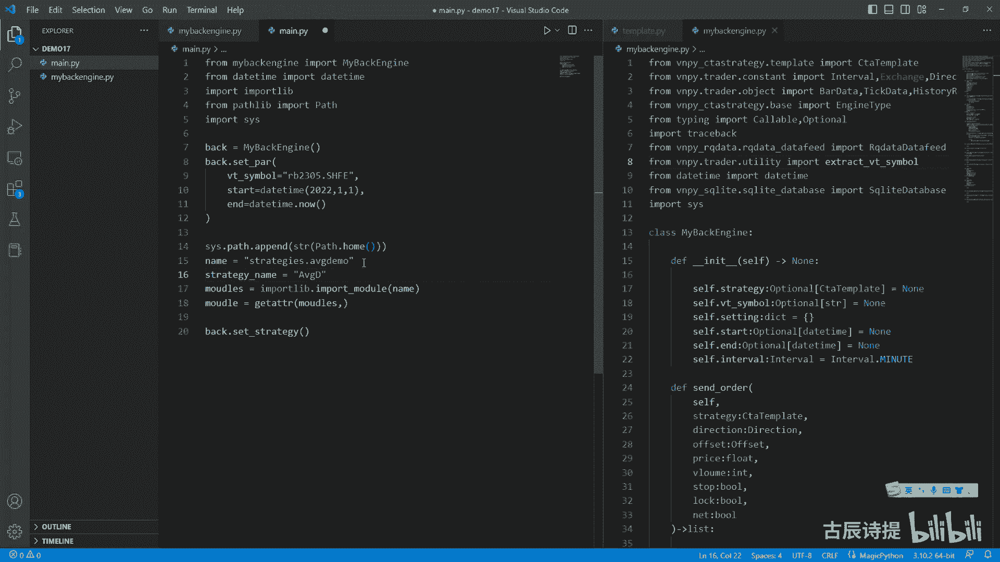
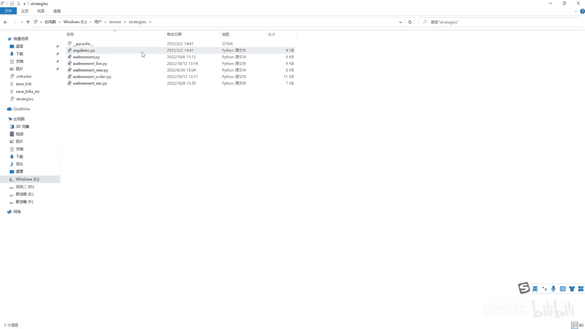
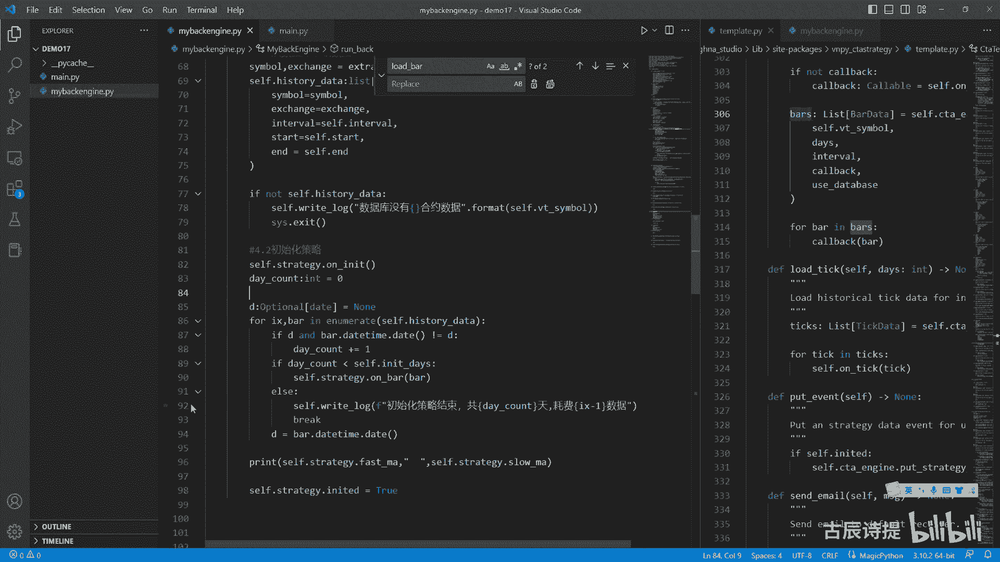
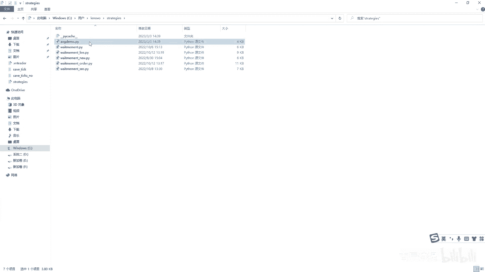
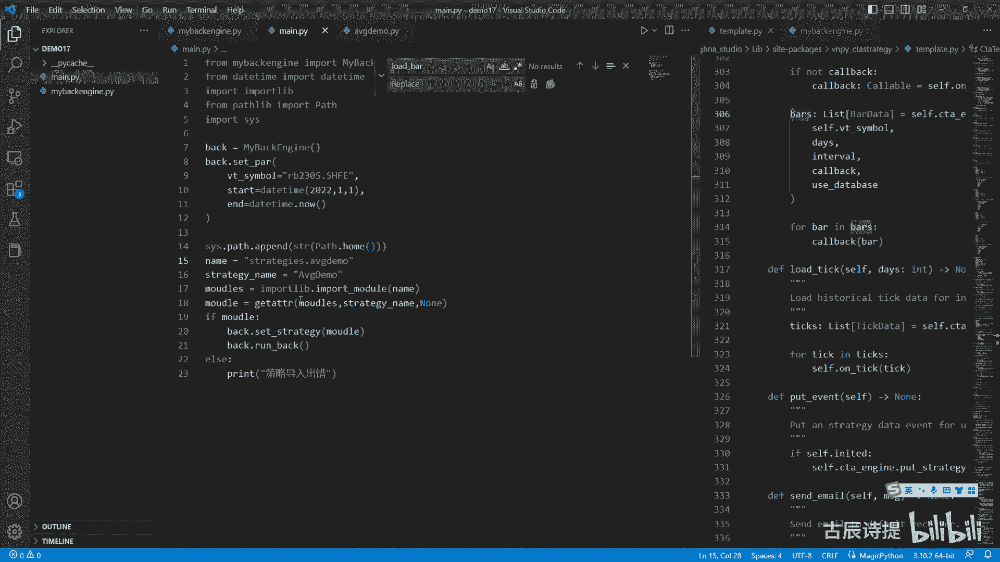

# 第17节课 CtaBackEngine的实现(2) - P1 - 古辰诗提 - BV1jr42157nu

欢迎大家来到从零开始量化系列课程，VMPI课程的第17节课，上节课咱们说了一下这个回测的这个逻辑，主要是记住他的这个顺序，这节课呢咱们就去呃，就是尝试着自己来去写一下这个回测，因为单纯的去讲。

就跟那个CTA引擎似的去讲，很多地方可能不是那么直观和，不是那么特别容易理解，另外如果说你想对于回测有更多拓展性的东西，比如说我多策略多合约的回测，你可以去看B站上的那个免费的那个课，就是策略演示课嗯。

大概有十来节课，你可以去看一下，好吧，在这呢就不多讲了，然后这节课呢咱们就我先新建个文件夹，Demo17，好用这个文件夹，咱们打开这个code啊。

好在这个文件夹里边，咱们先新建一个叫my back engine，点PY啊，my back engine点PY，然后从这里边首先咱们先定一个类，就是my back bgdf，刚刚in it是吧。

那如何去写这个东西呢，如何去写这个东西，肯定就是说，首先因为咱们是根据那个CTTEMPLLY呃来写的，因为这个策略模板已经定了，所以说咱们得根据，首先第一步就是CTA模板里边。

它有哪些东西需要回调到这个引擎里边的，咱们先去给它去实现了对吧，所以说咱们先导入from v m p y c t strange，第2CJ呃，template是吧，Template。

Import c t a template，咱们先看一下他的这个就是可能会spirit right，可能会用到的就是在这个CT引擎里边，c t a engine它可能会掉到的方法。

因为如果说这个回撤你放在实盘里边，它里边的这些方法你都得去实现，包括sorder cancel order什么的，这些都得去实现，如果传进来的是回测引擎的话，那是不是这些方法也都得去实现。

不然你策略里边写一些东西，它会报错的，因为它回调不到啊，这个能理解吗，就是这个CDA引擎可以传回来的，是就是实盘引擎也可以去来传回来，他的这个叫什么引擎啊，叫回测引擎是吧。

所以说咱们要写的是这个回测引擎，所以这一点你要知道，那咱们就根据它里边可能会掉到的，第一个就是SORDER，这肯定得去给它实现嘛对吧，SORDER首先传入cf，咱们看一下它它传入这些参数啊。

第一个这传入一个self，这个self和这个self是不一样的，因为这是定义方法对吧，这边传入self，其实就是这个c t a template这个实例，所以说你就是要写要接收的话。

你首先得接收他的第一个的，就是说这个他的这个参数，就是这个应该是这个策略本身实力本身，s t r a t EG y strange是吧，他应该是c t template。

第二个它就是这个direction of sat什么的，那咱们还需要去导入一下from v m p y点，trader点这个constant import interval。

这个exchange是肯定会用到的是吧，包括它的这个direction，还有什么呀，咱们再导入一个8data和TD吧，from VN py点trade。

The object import bar date，还有这个tick data，咱们先导入这么多，等具体用到的时候再说，那第二个参数就是这个，好，第三个是offset it。

第四个是price price，它是一个float类型的吧对吧，第五个是volu volume嘛，就咱们从这就定义int类型了，因为在期货里边只有整数，它可能在一些别的，比如说像这个数数字货币啊什么的。

有可能会小数啊，数字货币不要去做，因为这个是是吧，是这个就是国有是国家不允许的啊，布尔stop是布尔类型的，lock也是布尔类型的，然后最后还有个NTNT呃，这个给大家说一下。

这个NT就是在国外有一些品种，它是用这个进仓来的，它只有买多少和卖多少，他没有开屏，这么一说，就是仓位累计就可以了啊，啊这个就跟大家说一下就可以了，这个它有返回值吗，记住啊，它是有返回值的。

咱们在这标识一下啊，它是有返回值的，它return它是一个list是吧，好咱们先pass一下，一会儿咱们再单独来写啊，第二个它会调用什么呀，Cancel order，Cancel order。

同样的他传的参数是什么呀，cancel哦，这是cancel啊，咱们先说啊，这cancel order也把C给传过来了吧，所以说你这个strange还是得有的听啊，City template。

还有一个是是什么呀，还有一个是VTO的id，记住啊，这是VTO的id啊，VTO的ID和这个order i d还是有区别的啊，一会儿咱们可以看一下啊，它有返回值吗，它是没有返回值的。

所以说咱们这标注一下返回值为NN啊，回值为none，这个是pass一下好，下面就是cancel or cancel or，然后self同样的，它传送过来的是一个self，还是这个strange。

ccta template好pass一下下一个，Right log，Right log，咱们得写出来是吧，Right log self，它传入的这个参数是什么message。

还有个self message，就是message，就是STR类型的，就是要输出的，第二个是这个strange，呃应该是既玩是吧，Strange，它也是这个city template类型的啊。

这个呢咱们就是你像这个red log，咱们在这个里面也会用到，就是去输出嘛，我这呢就先把这个改成NN哈，就是写成一个默认值NN方式，在调用的时候它出错，防止在调用的时候少写了一个strange。

然后我这呢就直接先print一个message，就是message模块，就是log模块，就是咱们在这儿讲不到，因为它是模块嘛，不在咱们这个内容里边，所以说咱们就先这么去写了啊。

然后get engine type，Get engine type，它就是没有返回值是吧，上面这个也没有返回值啊，然后get engine type，英俊tab是吧好这放一个cf。

然后他是没有返回值的呃它有返回值啊，它返回一个真tab，好好pass一下这个engine type，咱们还需要导入一下啊，我从这把它给打开啊，从engine type是在哪啊。

是在这个from VN p y c t a，strange点base里面定义的吧，import engine type吧，啊好下一个，啊在这里边下一个是get price这个price tag。

咱们说过它是什么，它是这个它最小的波动值吧，Get plastic self，然后他后面传出来也是这个strange，A s t r a t e g y t template。

同样的咱们也给它附一个浪值啊，因为咱们现在这个写的这个回测，咱们只是回测一个合约的啊，一个毁一个合约的，所以说有可能在get price tag的时候，他就说这个会漏写了，因为这个price tag。

你在计算他的这个就是你发委托的时候，你得把它这个价格给统一了吧，包括你后边有什么要用到的时候，你获取的时候可能会出问题啊，它有返回值吗，肯定是有返回值的，返回值应该是应该是个float好。

下一个get price of就get size，他也是这个strange，啊我也给他整一个那，他返回的也是一个float吧，size是什么意思啊，size是获取它就是一点的价值啊。

还有load b这个load bar咱们反复再说的，它是干什么用的呀，他其实是就是在就是策略初始化的时候，做准备用的，而并不是说去下载数据用的，当然它也可能会涉及到下载数据，但是它这个下载数据。

它只是为策略的初始化来准备的，咱们一般不给他放在那个里边对吧，他这里边传的参数有点多啊，就是第一个是cf点v simple啊，咱们先把cf先放进去，然后把vity simple，STR类型的吧。

第二个是days，这个是类型的，第三个是interval啊，这个是interval类型的，第四个是call back，Call back，这个一看就是可回调类型的是吧。

咱们从from typing import一下call back colorable啊，它是colorful类型的啊，最后一个是use database，这个是布尔类型的啊，好他有返回值吗。

它没有返回值吧，它是一个NN是吧啊他不是没有返回值，它是有返回值的吧，因为得从这儿看是吧，它是用bus过来接着的，它是有返回值的，它是有返回值的，但是在咱们这呢啊，咱们可就是给他先写上。

它是有返回值的啊，把D尽量是去跟他去一致对吧，但是实际上啊咱们在用到的时候，咱们是不给他做返回值的，因为咱们获取数据就是一个整体的回测的时候，因为它不同于实盘嘛啊它是不同于实盘的。

所以说呃咱们先pass这吧，然后一会儿涉及到了，咱们再说好，下一个load bar就是load tick，Load tik，咱们也得写一下啊，把音给就是用到了啊，这里边这个参数啊。

Very simple days，还有这个呃那个cf点on tick啊，这个也是三个，就是呃第一个是very simple啊，他不是也是三个，他比上面这个要少，看见没有。

所以说load tik这个一般不是会用到的啊，一般不会用到load tik，simple days int类型，然后第三个肯定是call back嘛，Collab。

它在传递的时候就把这个方法给传过来了是吧，给传过来了，他有返回值吗，它是也有返回值的，它是回的是list tick data，是这个data好，咱们一样先pass一下，下一个是put event啊。

Put strange event，它后面的参数就是一个就是策略，本身就是一个策略，本身就是CT啊，S t r a t g y c t template，他有返回值吗，他没有返回值吧。

它是一个返回的是一个NN值，咱们先pass一下好，下面还有个user email，send email给它复制过来，这里边传入的是一个message，一个cc。

就是这个strange city template pass，你可以里边不写东西，你看新的一面，咱们肯定不会去实现它的，但是你得写，万一你的策略里边回测的策略里边给用到了，你回调不到的话，它会出问题的。

它会出问题的啊，把这个忘了写了，他有返回值吗，CD面肯定没有返回值，NC data也没有返回值，也没有返回值，好这个其实就一个整体的框架就出来了吧，那咱们现在要做的就是按照步骤按照这个框架。

然后咱们去进行填充就可以了吧，大家还记得第一步是什么吗，第一步是不是设置参数，是不是那个CPR，咱们操作的时候，第一步是不是要么你先是选策略，要么你是设置参数是吧啊，要么你是选策略，要么你是呃设置参数。

所以说必然得有的，第一个是咱们就sit strange吧，strange就是先设置它的这个策略，你策略传进来的一个是一个一定是一个类，而并不是一个实例化的，是不是strange应该是class啊。

它并不是一个实例化的实例啊，City template，这是咱们写一下啊，这是第一步啊，就是设置策略，事实策略咱们从这儿是做什么呀，其实是把这个策略进行实例化，你实例化这个策略肯定得有什么东西。

接着对不对，所以说咱们这题啊，A t e g y strange，它是这个c t template类型的，然后等于啊等于咱们一开始给他设一个NN值，如果严谨一些的话。

咱们应该呃把这个optional给他放进来，因为它city template，你类型标注之后，它一开始是等于浪值的，所以说你这加个optional。

optional是代表着要么是c t template类型，要么是浪值啊，好咱们来接的话，怎么来接啊，是不是应该就是self distrange等于strange class，然后给他去实例化呀。

这个类传进来了之后，给它实例化，实例化你得给它传参吧，是不是你得给它传参吧，就是你在实例化的时候，就是在这个template里边，你给他传递什么参数啊，咱们看一下啊，第一个传参是c t engine。

C t engine，咱们就传这个，咱们这个实力本身就可以了吧，咱们实力本身就是这个c t a engine吧，就只不过是回测引擎，第二个是strange name。

这个strange name是你其实是唯一标识的，你这个策略，咱们在CTA这个呃引擎里边去讲过，这个strange name其实很重要的，就是它会把你从呃这个呃这个底层，你的gateway到你的策略。

它是一个很重要的一个地方，就是它属于一个纽带是吧，它是唯一标识的一个纽带，但是呢在回测里边，咱们其实因为一个引擎，咱们只去跑一个策略，暂时是跑一个策略。

所以说这个呃strange name其实并不是很重要，但是咱们也得有strange name嘛，对不对，是不是得有这个strange name，咱们就先用这个类本身这个类名来替代一下吧，如果后边用到了。

咱们再去改它行不行好吧，那这个类名本身它是什么呀，就是咱们这个strange class点刚刚name吧啊，然后第三个参数是vit simple，Very simple，从哪来，Very simple。

是不是咱们在那个咱们用的那个维纳里边，是不是得自个儿填呀，所以说他肯定得有个这个先空着啊，咱们肯定得有个sat pr，就是把参数给传递过来，把参数给传递过来吧，啊把参数给传递过来。

这个我标注一下这个N值，首先咱们要知道的，他肯定得传什么，得把这个他返回的也是一个浪值啊，得把这个什么给传过来吧，得把这个which it simple给传过来吧，所以说which it simple。

咱们就先写到这，然后呢它是STR类型的，然后咱们在unit or这咱们用一个cf点，Vt simple sy b l b l l c s t r，optional t s t r啊STR。

然后就先等于一个NN值，然后先设置参数的时候，就是咱们就呃把它直接等于就可以了吧，啊直接等于就可以了吧，啊别的参数咱们先等会去设，所以说这cf点which it simple。

应该是等于which it simple，所以从这一点来看的话，第一步应该是这个参数的设置，而并不是说策略的设置，对吧对吧啊，第一步是参数的设置，参数设置啊，第二步才是就是策略设置在这个UI界面上。

因为它是整个一起来读取的，所以说这个好像咱们是先选策略，再选在填参数，因为它到时候是一起来读取的，但是咱们这的逻辑肯定是先设置参数，然后因为你在实例化策略的时候，你需要传一部分参数的啊。

cf点把self diva simple给它传过去，最后一个还有个s sitting，咱们也不知道吧，所以说咱们一样的得去接一下吧，S1SETTCCT它是一个dict字典，等于空字典。

咱们从这啊就这逗号咱们的CTTCT啊，Sitting sitting，它是一个字典，然后咱们给它一个默认值，就是一个空的字典啊，空的字典，咱们就是为什么这空格呢，就是这个咱们就是呃尽量往后放。

因为它是关键字参数嘛啊这的这个cf点setting，等于这个setting上面SETT啊，这是cf点setting哈，是不是这样就可以了，然后咱们把这个cf点setting给它放进去。

SETTING给它放进去，这个是不是就实例化成功了吗，但是从这儿啊有个问题啊，如果说你策略有错误的话，这是不是直接会报错呀，是吧，呃当然就是咱们这个回测的这个引擎，就是说只是目前只针对一个这报错。

那肯定是整个都给停下来了，但是如果说你想你的这个写的完善一点的，咱们是不是应该在这写个try try，然后让他去进行实例化啊，然后如果出问题的话，出问题的话就是呃去获取一下是吧。

Except exception，Exception，然后我从这给他输出一下错误，我导入一下，这个trans back，这个是一个就是你学这个Python技术，肯定得用到的啊，如果嗯不会的话。

你可以就是去买一下我的那个Python基础课啊，好这个如果有错误的话，它会进行输出一下，这个其实就是溯源的意思，就是从哪儿到哪儿，那个溯源的去进行一下输出啊，这里边还可以填参数的是吧，如果说有问题的话。

是不是就可以我就可以把这个给终止掉了啊，我import一个SYS，然后我从这儿就是程序就可以退出了啊，好这是设置策略，策略设置好了之后啊，参数，然后设置策略，咱们后边要做的是什么呀。

就是在实际上咱们用UI界面操作的时候，是不是得下载数据啊，是不是好，那第三步咱们下载数据，这个下载数据是什么呀，是不是从米框或者其他的服务商下载出去，然后下载到你的数据库里边是吧。

就是load data r q啊，我这就用米框啊，对了阿Q，所以说你这得有个RQ，它的这个呃就是它的这个类吧，就是你得实例化这个RQ嘛是吧，阿q data嘛。

所以说咱们从from v m p y r q data，点这个acuda feed，import2q data feed啊，然后这比如说我写上一个哎，这2q data等于arq data feed。

然后也不用传参啊，然后arq data点query就是获取这个query bar history，这个里边需要一个request这个output，它默认是print，咱们就不用管了啊。

它需要一个historical request，是不是historical request，咱们是不是需要导入一下在这个object里边啊，Historical request。

那从这咱们创建一个这个history request，就是IQ等于request，这里需要哪些东西，需要simple s y m buy simple，咱们有simple吗，咱们有vt simple。

但是没有simple，是不是，那咱们怎么去做呢，是不是from这个VNPY点try的点，utility import一个这个东西，这个是能把这个v simple拆成那个simple吧。

和这个exchange吧，所以说这simple啊exchange接一下，然后把这个cf点vt simple放到这里面来，所以说simple就等于simple。

然后后边change就等于exchange吧，啊这样确保这个不会出错是吧，然后start就是开始时间，开始时间咱们知道吗，咱们不知道吧，其实是在这个s pr里边应该给设置的吧。

所以说咱们这里边要传入的是不是还得有个start，它是一个类型的吧，啊它是一个类型的，咱们从这导入一下，The time from the time，Import the time，好。

这还有肯定有个end吧，end它也是对他类型的，是不是好，然后从这我赋值的时候，self start就等于start吧，然后self点end等于end。

那我一开始我在这我是不是得self点start等于optional，然后这里边是DETAM类型啊，然后先等于一个浪值，然后cf点end啊，等于它不是等于啊，上面应该是冒号，就是标明一下它的这个数据类型。

同样的optional，然后这是DETAM类型的，等于一个NN值，是不是，然后就有这个start和end了吧，所以说这个start咱们就等于C点start，然后这end等于四点，是不是。

然后他还有个什么呀，叫这个interval interval，咱们也得往里边填吧，你不然的话你下载不到数据啊，你没告诉他是什么周期的呀，那interval咱们是不是也有。

也得有一个自己的这个interval，所以说咱们这写一个interval，它是一个interval类型的，那我默认我先让他等interval minute啊，如果有变化的话。

你就在这个CPR这告诉我是吧，Interval，然后它是interval类型的，我让他等于这个interval minute，就正常情况下都是用这个分钟线吗，如果说你有改变的话，你就传参不就可以了吗。

所以说咱们从这self interval，interval就等于他的这个interval是不是，然后这interval是不是等于四点，interval就可以了是吧，然后他来获取数据啊。

然后query by history，我把这个IEQ给他传过去啊，然后他后边这个output output，这个咱们可以把它写成什么呀，red log就是在我这个这输出。

你像刚才我这个right log这个里边，就是把把那个什么给复制成，把这个strange给复制成NN了，所以说他只要把这个STR类型，就是你要输出内容给传进来，是不是就可以了是吧，然后它是有返回值的吧。

它的返回值是一个呃，list里边是把data吧，所以说我接一下bus啊，它是一个list类型，然后这里边是b data，等于下吧，好如果说if bus，有数据buns。

然后就可以self right log，数据获取数据，从RQ获取成功，一共一共多少条，然后这里边写上LEN，这个bars在前面我加一个F是不是就可以了啊，一共多少条，然后你有bug之后。

他应该是去做什么呀，他是不是应该把它然后传入到那个，就是把它保存到数据库里面去，那咱们这儿是不是得需要一个数据库的呃，这么一个接口，是不是，那数据库接口咱们就用这个SQL。

就是from b m p y下划线super叫succulate database，import circulate database啊，然后从这从这啊。

dB就是database等于SQL database，我给它实例化一下，这里边不用传参，然后dB点save bar d，然后这里边第一个是bus，咱们有了吧bus，然后第二个是stream。

stream是顺序的，意思，就是他在往里传的时候，如果说你是无序的，它需要一个个去去排这个时间，如果说你是有有序的话，你把这个stream告诉它，它就会自己就是从你获取第一个时间。

和你列表的最后一个时间它就可以了，因为它得呃这个SQLITE就是这个数据库里边，他得就是给你提供就是什么呀，就是说你这个数据库现在存放了多少数据，就是那个get overview啊。

嗯就是就是不太懂的朋友们可以去去，就是去看一下啊，所以说他需要这个stream，以前是没有那个get overview的，Get overview，其实就是这个数据库总的一个存储的情况。

比如说螺纹有多少条数据，从哪天到哪天的橡胶，有多少条数据从哪天到哪天的啊，这个stream嗯，你可以写false或者写true都可以啊，从这我就不写了好吧，然后save bar，它返回的是一个布尔值。

就是RES，我接一下啊，它是一个布尔值，布尔值我进行一下判定FRES啊，如果说也就是没问题，已经存好了，我cf点right log数据库存储数据成功啊，这样是不是就可以了，然后到这呢咱们可以先来试一下。

看看行不行好吧，咱们从这新建一个man啊，点PY慢点PY，然后咱们参照着这个先导入一下，From my back engine，Import my back engine。

back等于my back engine，这里边不用传参吧，你第一步是做什么呀，第一步是传参，就是back点SPAR，这里边需要传入参数，这个vt simple等于RB2305点SHFE。

然后第二个这个start t RT，等于咱们导入一下这个from that time，Import the time，The time，比如说2022年1月1号啊。

然后他的这个end等于the time now，然后后边还有什么呀，interval interval就可以不传了，setting我也不传了啊，就先传这三个，然后第二步是什么呀。

第二步是不是sit strange，是不strange，那这个strange class咱们说了，就上一节课也讲了，动态导入，是不是啊，Import import lib，动态导入。

咱们说一下他的这个name是什么呀，是这个STRATEGIE吧，点那个文件是什么呀，就是a v g demo吧，是不是啊，然后咱们在这之前，是不是需要把这个import s y s。

要么导入这个utility，要么就是你import soy s，然后把这个什么呀，就是SYS点pass叫append，把这个STR这个SYS啊，不是就是这个pass点home。

我在import from passleep，import一个path，pass点home吧，这个pass点home是代表着C盘下面，administrator那个目录，是不是我把它STR一下。

因为它是一个pass呃，这个类型，然后变成了字符串类型，我把它添加到s y s pass里边，是不是他就可以直接找到，就是计算机会去这个pass点home里面去找，然后你在这个路啊。

就是STRANGES，然后在这个路径，然后是不是就能找到咱们的那个策略，就能导入了是吧，然后model m o u d l e s models是一个，就是你从这个文件里面导入了所有的模块是吧。

等于哈import lib，点import model，然后这个name就是咱们这个name吧，是不是啊，然后这个呃package看吧，这个package就传一个name就可以了吧，是不是。

然后你获取到那个model是应该是什么呀，就是GATTR，然后这里边放上这个models，把这models放到里边，然后你得有个strange name，strange name是什么呀。

T r a t g one string name，是不是这个AVG。

这个是吧，你驼峰式命名吗，a b g demo就是咱们昨天放到这个C盘下面，用户the NOVA，就这个路径就是pass home，然后他在这个点STRANGES。

然后再找到这个average demo。

然后这个里边它的这个策略名字，它是不是这个avg demo是不是好，然后models这个strange name如果取不到，我就返回一个N值啊，我就返回跟down值，然后我sit strange。

我就把model放进去，是不是，If model，我就给它放进去，else我就print一个，print策略加载哈，策略导入出错好，咱们来运行一下，看看策略导入有呃，它有没有什么问题是吧，没有问题。

没有报，没有报错吧，没有报错，那咱们就接着往下走吧，没有报错的话，咱们就可以试一下back点load data aq是吧，好咱们再运行一下，看看他有没有问题，啊这个是需要时间的啊。

从数据从2Q获取成功了，一共是6万六千九百七十七十七条，然后数据库存储数据成功，是不是这样就可以了，是不是好，那这个没有问题的话，那咱们就接着往下走，这个获取完了这个数据之后啊，从这儿写一下啊。

这是第几部啊，第三部啊，从阿q data获取数据并保存到数据库完了之后，是不是你就应该去进行回呃，进行回测了，是不是进行回测了吧，好那咱们d e f run back，run back self啊。

这个应该是第四部吧，回测，回测回车里边，第一步你是不是应该就是4。1，你是不是应该什么呀，就是先去下载数据吧，下载从数据库下载数据，你有数据你才能去回测吗，是不是啊，有数据才能去回测。

那从数据库下载数据，咱们怎么去下，咱们还得用到这个dB，是不是，那这样的话，咱们是不是可以在前面就是C点DB，等于这个superlight sqlite database，直接从这儿进行一个实例化。

然后咱们再load data acquer，咱们就不用去实例化它了，不用实例化它了，然后咱们就这直接cf点DB是不是就可以了，从这儿的话就不用再去呃，就是实例化这个super lite了，是不是。

然后C点DB点query啊，就是不是快乐了，是load by data，然后这里边simple和exchange，咱们是不是没有，咱们得需要这样一下啊，就CCTRLV好。

然后从这里边simple swim，simple等于simple，然后exchange等于后边interval等于四点interval吧，Interval，然后start等于start。

N等于四点end，还有什么没有了吧，然后他有返回值，它有返回值的吧，这个返回值是BARZ，然后冒号一下u s t list，它这里边是bar是吧，好等于，那这个bars咱们是不是就是应该把它放起来。

就是最好是用这个一个，就是说咱们的就是实例对象给他存储起来，histori history data或者history bus都可以啊，这个list这样一个bar等于列表。

然后咱们直接可以从这就是run back，这用这个self点historic data过来接，是不是就可以了，是不是，那historic data过来接之后，咱们就是下面要做的就是你获取到数据了。

如果说你没获取到数据，If not self history data，你是不是就a self right log，就是数据库没有数据合约数据吧，然后点format是CVT simple啊。

当然这个里边还有很多，比如说你wait simple的检测啊，什么的，咱们在这就不写了，因为你像这些检测应该是在界面上进行检测，或者说你有咱们之前给大家写过的，那个instrument data。

你可以去进行检测是吧啊，这就不写了，然后咱们就直接从这SYSEXIT，我就结束掉它了是吧，只有你有这个history data，咱们才可以去进行回测嘛，好咱们来进行4。2回测，回测第一步应该是做了什么。

应该是初始化吧，初始化你像那个咱们那个city template，它就是调用的顺序是什么呀，先调用on init吧，是不是是不是先调用on in it，所以说咱们应该是先初始化策略，初始化策略。

那初始化策略的时候，它涉及到一个问题，你用多长的时间来进行初始化呢，就是你初始化策略用多长时间，是不是咱们得知道你填了多长时间，所以说咱们第一步应该是什么cf点strange啊。

点调用这个on init吧，调win it，咱们之前写的那个策略，就是那个这这个策略，咱们打开可以看一下啊，这个里边你调用了on in it，它是不是就会load bar。

是不是就会调用load bload b，它会调用咱们my back engine，这里边这个low的爸爸，那这个low的他应该去做什么呢，咱们刚才说了啊，这个logo吧，其实数据已经有了。

那这比较有用的这个就是这个参数，就是这个days吧，我究竟要用多少天来做这个初始化呢，那我是不是我得设置一个参数啊，我从这儿写吧，就是self init days，int类型，我默认给它等于十。

然后我在这我调了这个这个策略的own it之后，它就会掉这的load bar，是不是，那调用这个load bar，我就给self in it days，就等于这个days就告诉我这个引擎啊。

你这个days应该是我在这个策略里边写的，那个load day，不low啊，就是load data后边那个数值吧是吧，那我在这去进行回测的时候，是不是我应该记录一下，一共是几天。

就是they count，They count，比如说它是一个int类型的int类型，我先等于零，是不是呢，我for for bar in self history data。

然后我从这儿是不是得记录一个什么呀，就是我当前的这个时间，比如说这个D啊，D我前面先赋个值，D我等于NN啊，D等于NN值，它是一个optional daytime类型的啊，不是determine。

它是date类型，我从这也导入一下这个date from detad，我只需要日期就可以了吧，他如果说出现了不一样的日期，说明他过了一天，我只要加一就行了，是不是从这你得进行判断吧，一副B点啊。

if d and8点，the time点date，它不等于D点D呃，D点这个date吧就不等于DD是这个date嘛啊，不等于D，然后我这个day count就加等于一啊，就过了一天，是不是。

然后在这的最后，我是不是应该把这个D等于这个八点，did time点date，这这两个类型得是一样的是吧，然后从这呃，if这个day count小于这个self in it days。

我就是self点strange点on吧，然后把这个把线给他放过去，是不是，然后else如果不是他不小于了啊，他已经是11啊，是十了，然后这应该是什么呀。

应该是break吧啊break你可以从前面写一个els cf点，right log就是初始化策略，策略结束，一共，呃供耗费共多少天吧，多少天天共多少天，应该是这个DESCT，共多少天耗费，多少个数据。

这个数据耗费多少个数据，咱们是不是也得有啊，因为你后边再往后走的时候，我是不是就应该从这break这个地方，然后再往后去便利，是不是，所以说你这个数据，就是说这个你到了第多少条数据，你也得记住吧。

从这儿呢咱们这添一个IXIX，然后我编辑它的时候，我前面加一个什么呀，Emirate，然后self history data，这个知道吗，是枚举啊枚举，然后这会把这个他的这个编号给说出来。

就是给一块给呃，就是提供出来，所以说耗费了ix数据吧，后给了IX数据，咱们再来看一下这个逻辑，对不对啊，逻辑对不对，首先呢比较有争议的就是这是小于还是等于，咱们来捋一下这个逻辑啊，当D还没有值的时候。

这就过不去吧，是不是就是就是第一个八线过来的时候，这是过不去的，然后从这零小于十肯定是没问题是吧，就往下走，然后走到这D就有值了吧，第二个八仙过来的时候，肯定也是当天的日期是一样的，等到第N根。

就是等到第二天的这个伴儿线来的时候，它不一样，它就加一了吧，但是其实这个DESCT是一，但实际上已经到了第二天了，所以说你想用十天的这个额数的话，你应该把这写小于不能有等于是吧。

另外呢这个discount共用了，应该是discount加一是吧，加一填，但是你从这儿看一下啊，他是在加一之后再break的，比如说他变到了第十天，他变到了第十，然后到这来他就不满足条件了。

其实说这个discount已经是十了，但是就是在他第十在它变为十的时候，其实一根K线都没走，是不是就是一根八线都没走啊，所以说它是十，这不用加，咱们再来看这个IXIX就是在它变成。

就是说第十天其实是第11天，它的数值是十，因为从零开始的嘛，第11天这个第一根数据来了之，后，来的时候你想想啊，就是这个ix其实已经到了那个数据，但是呢他并没有去使用到，因为就直接break了。

并没有被on bar给调到，对不对，所以说你耗费了应该是什么呀，耗费了2X减一，就是因为RX还没有被用到，后边，你在调用的时候，是不是就可以直接从这个self点history data。

然后这ix没用到，往后去便利就可以了，这样就整个就连上了，对吧好，那咱们来试一下，从这儿呢咱们输出一下，这个就是它遍历完了之后啊，咱们print一下什么呢，看看咱们的策略啊。

就是说self strange，他的策略里边咱们有FAMA吗，看看它的数值有没有变化，如果数值有变化，是不是它不为零的话，是不是就说明你的这个初始化是有成效的呀，strange点slow m啊。

slam是吧，你这初始化完成之后，我是不是就可以把self distrange点，等于true了吧，是不是等于true了吧，另外你是不是呃，咱们就先到这儿吧，然后咱们给大家看一下有没有什么问题好吧。

就是会不会输出fast ma和slow ma，好，咱们再manger啊，咱们就不用这个load data rq了，咱们就直接run back啊，Run back run back。

他的第一步啊就是去获取数据，然后第二步是初始化策略，是不是好，咱们来进行运行一下，看看有没有什么问题，嗯需要耗费一些时间啊，这出问题了，For buying bus，这个咱们仔细看一下啊。

这个出的问题是在哪，它是在这个template里边，咱们看一下这个template template，他说在314行in load bar出问题的时候，不要紧张啊，你就看他就行，肯定能找到问题的。

在314行load bar啊，他这有一个什么呀，bars等于什么，然后你这for buying bus，你这个它是有返回值的是吧，咱们在咱们这load bar，这咱们看一下啊，找到这个load b。

在罗德把这咱们这没有给他返回值，咱们直接给他返回一个空值，是不是就可以了，直接给它返回一个空值吧，是不是，然后他就不会报错了吧，啊咱们再看一下，初始策略初始化了，初始化策略结束共十天。

耗费三百二十三千多条数据，咱们先看这个数据准不准确啊，3000多条，你想想十天数据，一天上午是九点到11：30，两个半小时，但是中间少15分钟，两个小时，15分钟，下午是一个半小时。

也就是加起来是三个小时，45分钟，加上晚上两个小时，就是不到六个小时，六个小时，十天的话应该是3万3600条数据，刚好不到15个小时，对的是吧啊，不到这个六个小时，但是这个是底下是零和零啊，因为什么呀。

因为你并没有让这个什么去调用是吧，这个strange on b好，咱们看一下啊，在，让它调用了这个strange but了，那咱们看看策略吧，是不是他的这个数据不太够，有没有这种可能性。

也有这种可能性吧，咱们看看这个他的这个策略哦，不是咱们应该是C盘用户在，strange字里边，然后看看这个avg demo他的策略。

Load80，这个array manager是150，150，它是30分钟的，他需要75个一小时的，你一天是不到六个小时，所以说十天不够，那咱们下20天的吧，二天看看他的这个数据有没有什么问题好吧。

看看他的数据有没有什么问题，Demo，这个爸给他删除一下啊，好然后咱们来运行一下，看看这回运行有没有问题，因为上一次他是没有进行初始化，其实初始化算不成功是吧，你看这20天，耗费了6554个拔线数据。

然后呢他这个就有值了，那就说明是在刚才是在这个策略里边，它出了问题了，他是这个就是并没有装满，并没有把这个MANA装满，然后这个MANA没装满之后呢。

他会从这return下面的这个fast ma并不会被赋值，对吧啊，那这节课咱们先到这儿，如果说你对这个流程还不太了解的，你要仔细反复的去观看。

